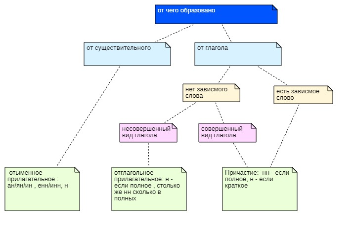

посhttps://www.youtube.com/watch?v=HBsf4UAGj98&list=PLICMqW3-oG4hAL5AnprbZmR_KKulUo_R8&index=15

жареный :-- жарить (несов.)
пожаренный :-- пожарить (сов.)
соломенный :-- солома (сущ.)
юный :-- (непроизв.)

исключ:
зеленый
багряный
румяный
свиной
единый
пьяный
пряный
рьяный

| образовано| |
|:--|:---|
|от существительного|от глагола|
|ан/ян/ин , енн/инн, н|есть зависимые слова?|
|голубиный,революционный, лимонный|нет...да|
||прилагательное ...причастие(см.ниже)|

прилагательное |причастие
--|--
от глагола сов.вида ,,, от глагола несов.вида| нн - если полное, н - если краткое

от глагола сов.вида |от глагола несов.вида
--|--
причастие | отглагольное прилагательное
нн - если полное, н - если краткое| н - если полное , столько же сколько в полных

+--+--+--+--+--+--+--+--+--+--+--+--+--+--+--+
|Н и НН в суффиксах   
+==+==+==+==+==+==+==+==+==+==+==+==+==+==+==+
| от глаголов           |   от существит     |
+==+==+==+==+==+==+==+==+==+==+==+==+==+==+==+
| сов.вида  | несов.вид |  ан/ян/ин , енн/инн, н    
+--+--+--+--+--+--+--+--+--+--+--+--+--+--+--+
|нн -       |           |        |           |
|если полное|           |        |           |
|н -        |           |        |           |
|если кратк |           |        |           |
|           |           |        |           |
+--+--+--+--+--+--+--+--+--+--+--+--+--+--+--+
|           |           |        |           |

+--+--+--+--+--+--+--+--+--+--+--+--+--+--+--+--+--+--+--+--+--+--+--+--+--+--+--+
|Н и НН в суффиксах  
+==+==+==+==+==+==+==+==+==+==+==+==+==+==+==+==+==+==+==+==+==+==+==+==+==+==+==+
| от глаголов                                         |от существит              |
+==+==+==+==+==+==+==+==+==+==+==+==+==+==+==+==+==+==+==+==+==+==+==+==+==+==+==+
|   сов.вида            |   несов.вид                 |  ан/ян/ин , енн/инн, н   |
+--+--+--+--+--+--+--+--+--+--+--+--+--+--+--+--+--+--+--+--+--+--+--+--+--+--+--+
|нн -                   |завис.сл.  |  завис.сл. нет  |
|если полное            |  есть     |                 |
|н -                    |           |                 |
|если кратк             |           |                 |
+--+--+--+--+--+--+--+--+==+==+==+==+==+==+==+==+==+==+--+--+--+--+--+--+--+--+--+
|                       |нн -       |н - если полное  |
|                       |если полное| нн              |
|                       |н -        | сколько в полных|
|                       |если кратк |                 |     

завис.сл. есть

укушенный пальчик - причаст. от укусить сов.вид
квашеная капуста - отглаг.прилаг. от квасить
шляпа брошена - кратк.прич от бросить

жареная :-- жарить несов.вид глаг без зав.сл --: отглаг.прилаг  --: н

жаренная мамой :-- жарить несов.вид глаг с зав.сл --: причастие полная ф. --: нн

пожаренный :-- пожарить сов.вид --: причастие полная ф. --: нн

соломенный :-- солома --: енн/инн --: нн

туманный :-- туман --: суфф н --: нн

домотканый :-- дом ткать несов.вид --: отглаг.прилаг полн.форм  --: н

ованный/еванный --: нн полн.форм , н кратк.форм

картошка пожарена (кр.ф):-- пожаренная

исключ:
* стеклянный
* оловянный
* деревянный

ветреный ( но безветренный )

только :
* названый брат
* посажённый отец
* приданое невесты
* конченый человек
измен:
* смышленый

поизводные слова:
в производном столько же н сколько в производящем слове
священник :-- священный (искл)

искл:
* поистине
* подлинный

