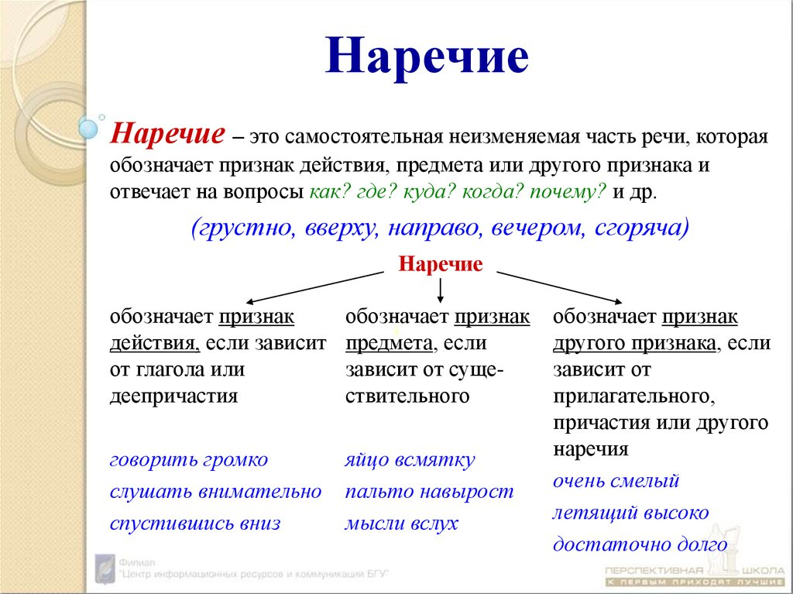
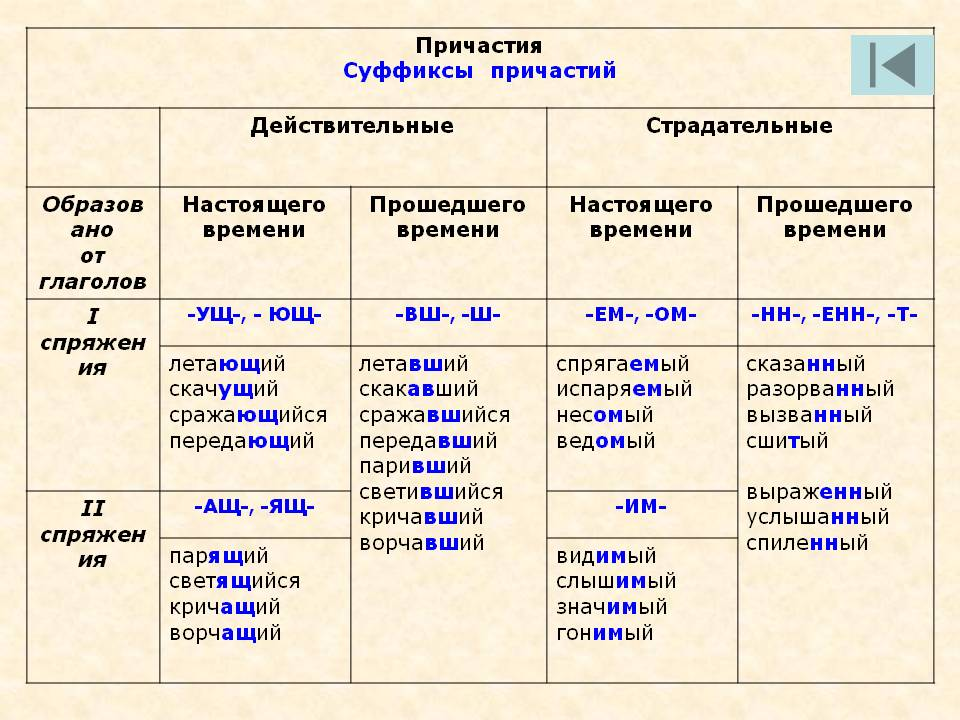
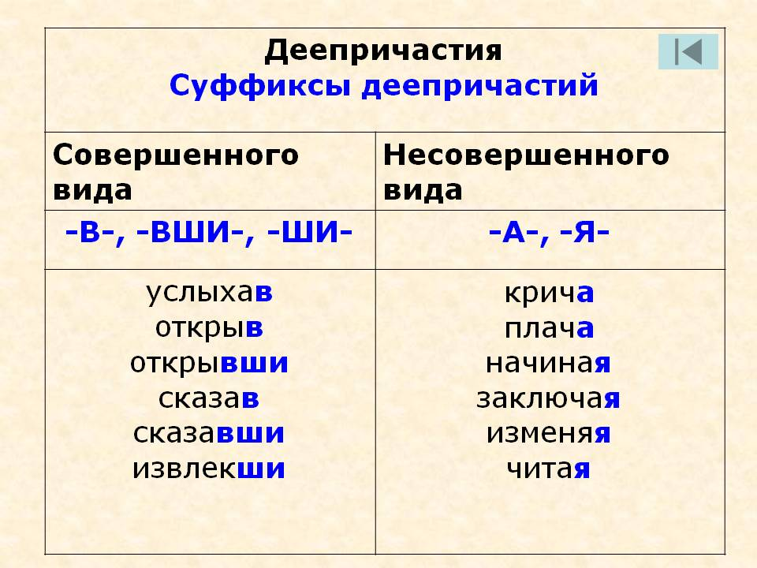
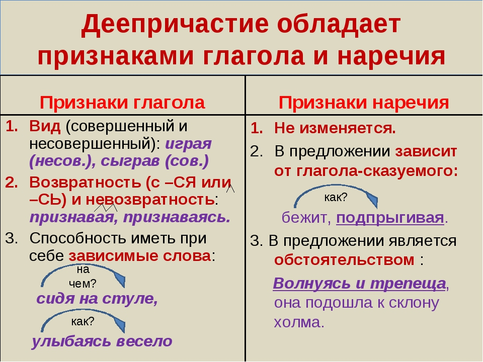

# типы речи

|описание| повествование| рассуждение
|:--:|:--:|:--:
|описывается предмет,явление|передается динамика действий| фиксацияхода мыслей, попытка ответить на вопрос
|прилагательные|глаголы, наречия места и времени|вводные слова, абстрактные понятия
|картина|фильм|зрительного образа нет

Пред­ло­же­ния 13–14 ука­зы­ва­ют НА СЛЕДСТВИЕ того, о чём го­во­рит­ся в пред­ло­же­ни­ях 10–12.(?)

(10)Добро же социально в широком смысле этого слова. (11)Оно соединяет, объединяет, роднит. (12)Оно вызывает симпатию, дружбу, любовь. (13)Поэтому злые объединения недолговечны. (14)Они основываются на общности временных интересов.
Существует причина и следствие. причина - изначальная ситуация, проблема, действие, а следствие - то, что вытекает из этой ситуации,проблемы и тд. добро социально, оно соединяет и роднит, вызывает симпатию. СЛЕДОВАТЕЛЬНО злые объединения не вечны и основываются на общности временных интересов. предложения 10-12 главные, а 13-14 придаточные, зависимые.

Подробнее - на Znanija.com - https://znanija.com/task/24904515#readmore

