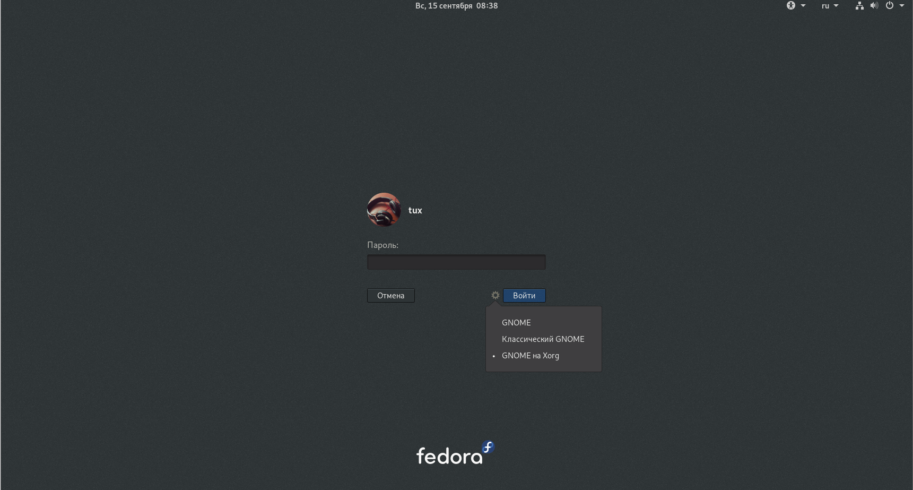
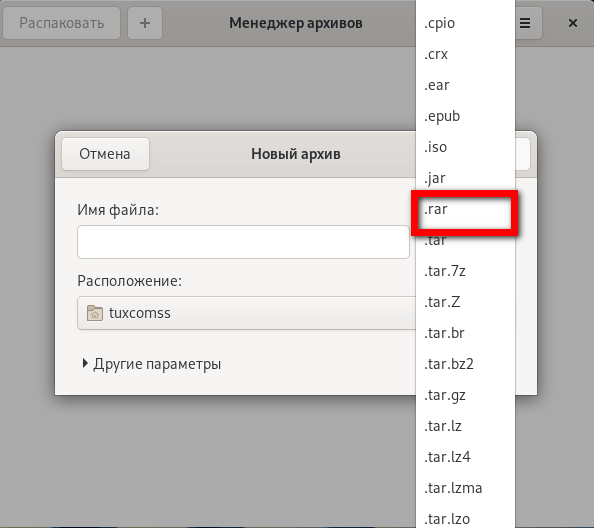
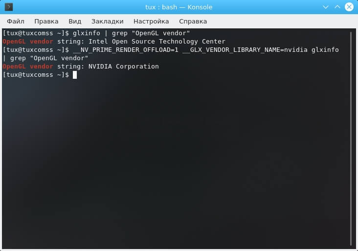

https://www.comss.ru/page.php?id=6456

В первую очередь, после установки, нужно обновить систему, поэтому в терминале выполним следующую команду:

    sudo dnf update
     
После обновления стоит перезагрузить систему.

## Русифицируем систему.
 Русский язык установлен не полностью, поэтому воспользуемся командой для доустановки языка:

    sudo dnf install langpacks-ru
     
Если есть необходимость, то можно поменять имя хоста и пароль пользователя:

    hostnamectl status  #просмотр текущего имени хоста
    hostnamectl set-hostname --static "имя хоста" # изменение имени хоста. "имя хоста" - добавляем свое название хоста
    sudo passwd имя_пользователя  #сначала указываем установленный пароль, затем новый
     

## Переключение с Wayland на Xorg
Fedora с рабочим окружением Gnome по умолчанию использует Wayland (протокол управления графическим сервером). На мой взгляд Wayland еще недостаточно стабилен, поэтому рекомендую использовать Xorg. Для смены протокола: в окне выбора пользователя входа в систему нажмите на шестерёнку выберите протокол Gnome на Xorg.

## Подключение репозиториев RPM Fusion free и nonfree
Из-за юридических ограничений компания Red Hat (Fedora) не могут содержать в своих репозиториях некоторые, ограниченные патентами, пакеты. Как правило это мультимидийные пакеты, проприетарные драйвера. По этой причине был создан отдельный репозиторий с данными пакетами. RPM Fusion является одним из самых популярных репозиториев в Fedora. Добавление репозитория одной командой:

    sudo dnf install https://download1.rpmfusion.org/{free/fedora/rpmfusion-free,nonfree/fedora/rpmfusion-nonfree}-release-$(rpm -E %fedora).noarch.rpm
     
    
## Установка мультимедийных кодеков
Из-за отсутствия проприетарных кодеков, браузер Firefox в Fedora не воспроизводит потоковое вещания и видео кодека html5.

Решим проблему установкой кодеков:

    sudo dnf groupupdate multimedia sound-and-video
    sudo dnf install gstreamer1-libav gstreamer1-plugins-bad-free \       gstreamer1-plugins-bad-free gstreamer1-plu
     
    
## Решение проблемы браузера Opera в
дистрибутиве Fedora с воспроизведением потокового вещания и видео html5
Браузер Opera в Fedora имеет туже самую проблему, что и в Ubuntu подобных дистрибутивах. Решение проблемы с воспроизведением видео:

    sudo dnf install chromium-libs-media-freeworld
    sudo rm /usr/lib64/opera/libffmpeg.so
    sudo ln -s /usr/lib64/chromium-browser/libffmpeg.so  /usr/lib64/opera/
     
    
## Установка дополнительной поддержки архиваторов
    sudo dnf install unzip p7zip  unrar cabextract 
     
Установка rar в Fedora 30:

    wget https://forensics.cert.org/fedora/cert/30/x86_64//rar-5.4.0-1.fc30.x86_64.rpm
    sudo dnf localinstall rar-5.4.0-1.fc30.x86_64.rpm
    rm -rf rar-5.4.0-1.fc30.x86_64.rpm
     
После этого в Менеджере архивов (проверено в Gnome и KDE) появится поддержка создания rar архивов.

## Установка шрифтов Microsoft
    sudo dnf install curl cabextract xorg-x11-font-utils fontconfig
    sudo rpm -i https://downloads.sourceforge.net/project/mscorefonts2/rpms/msttcore-fonts-installer-2.6-1.noarch
     
     

Улучшение отображения шрифтов при использовании LCD мониторов

    sudo ln -s /usr/share/fontconfig/conf.avail/11-lcdfilter-default.conf /etc/fonts/conf.d/
     
## Установка драйверов Nvidia из репозитория Negativo17
Драйвера из репозитория Negativo17 лучше следуют рекомендациям по пакетированию Fedora и имеют лучшую интеграцию.

    sudo dnf config-manager --add-repo=https://negativo17.org/repos/fedora-nvidia.repo
    sudo dnf remove *nvidia*
    sudo dnf install kernel-devel dkms dkms-nvidia nvidia-driver nvidia-settings  nvidia-driver-libs.i686
    sudo dkms autoinstall
     
 
В моем случае драйвера корректно работали только при добавлении dkms-nvidia (именно поэтому я предложил выбрать этот вариант) и не срабатывали при akmod-nvidia.

Из заметных плюсов данных драйверов из репозитория negativo17 это использование драйвера версии 435.21, начиная с данной версии осуществляется улучшенная поддержка Nvidia Prime. 
 
В новой версии по умолчанию используется встроенная видеокарта Intel, но есть возможность запуска приложений на карте Nvidia.

Проверить можно следующими командами:

    glxinfo | grep "OpenGL vendor"
    
Результат: OpenGL vendor string: Intel Open Source Technology Center

Запуск на Nvidia осуществляется командой __NV_PRIME_RENDER_OFFLOAD=1 __GLX_VENDOR_LIBRARY_NAME=nvidia:

    __NV_PRIME_RENDER_OFFLOAD=1 __GLX_VENDOR_LIBRARY_NAME=nvidia glxinfo | grep "OpenGL vendor"
     
Результат: OpenGL vendor string: NVIDIA Corporation

Например, для Ubuntu данная версия драйвера доступна только в репозитории ppa:graphics-drivers и только для тестируемой версии Ubuntu 19.10. К тому же насколько помню, там еще нужно править файл xorg.conf. В Fedora достаточно добавить репозиторий и установить драйвера, никакой правки конфигов.

Пользователи драйверов Nvidia могут столкнуться с ошибкой "Failed to start Load Kernel Modules" после обновления ядра Решается проблема следующей командой:

    sudo dracut --force
    
## Устанавливаем wine
    sudo dnf config-manager --add-repo https://dl.winehq.org/wine-builds/fedora/30/winehq.repo
     

Дальше устанавливаем нужную нам версию. Я выбираю версию winehq-staging

    sudo dnf install winehq-staging
Установка winetricks и создание префикса - аналогично нашей статьи: Установка последней версии WineHQ.