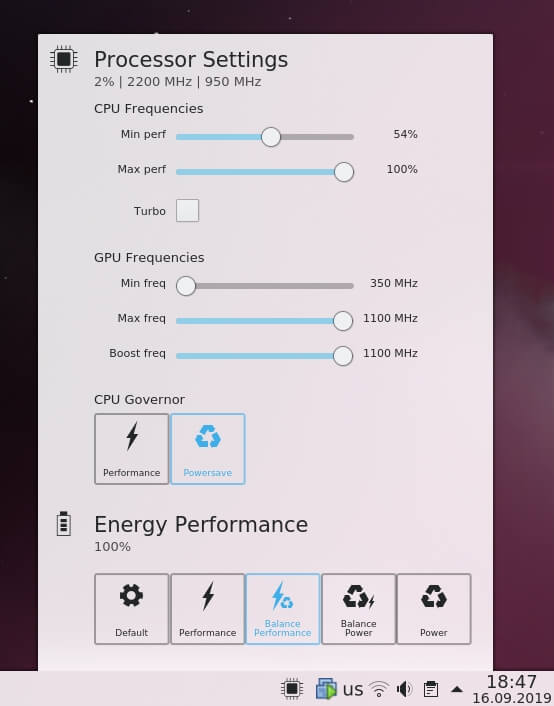

https://www.comss.ru/page.php?id=6456

В первую очередь, после установки, нужно обновить систему, поэтому в терминале выполним следующую команду:

    sudo dnf update
     
После обновления стоит перезагрузить систему.

## Русифицируем систему.
 Русский язык установлен не полностью, поэтому воспользуемся командой для доустановки языка:

    sudo dnf install langpacks-ru
     
Если есть необходимость, то можно поменять имя хоста и пароль пользователя:

    hostnamectl status  #просмотр текущего имени хоста
    hostnamectl set-hostname --static "имя хоста" # изменение имени хоста. "имя хоста" - добавляем свое название хоста
    sudo passwd имя_пользователя  #сначала указываем установленный пароль, затем новый
     

## Переключение с Wayland на Xorg
Fedora с рабочим окружением Gnome по умолчанию использует Wayland (протокол управления графическим сервером). На мой взгляд Wayland еще недостаточно стабилен, поэтому рекомендую использовать Xorg. Для смены протокола: в окне выбора пользователя входа в систему нажмите на шестерёнку выберите протокол Gnome на Xorg.

## Подключение репозиториев RPM Fusion free и nonfree
Из-за юридических ограничений компания Red Hat (Fedora) не могут содержать в своих репозиториях некоторые, ограниченные патентами, пакеты. Как правило это мультимидийные пакеты, проприетарные драйвера. По этой причине был создан отдельный репозиторий с данными пакетами. RPM Fusion является одним из самых популярных репозиториев в Fedora. Добавление репозитория одной командой:

    sudo dnf install https://download1.rpmfusion.org/{free/fedora/rpmfusion-free,nonfree/fedora/rpmfusion-nonfree}-release-$(rpm -E %fedora).noarch.rpm
     
    
## Установка мультимедийных кодеков
Из-за отсутствия проприетарных кодеков, браузер Firefox в Fedora не воспроизводит потоковое вещания и видео кодека html5.

Решим проблему установкой кодеков:

    sudo dnf groupupdate multimedia sound-and-video
    sudo dnf install gstreamer1-libav gstreamer1-plugins-bad-free \       gstreamer1-plugins-bad-free gstreamer1-plu
     
    
## Решение проблемы браузера Opera в
дистрибутиве Fedora с воспроизведением потокового вещания и видео html5
Браузер Opera в Fedora имеет туже самую проблему, что и в Ubuntu подобных дистрибутивах. Решение проблемы с воспроизведением видео:

    sudo dnf install chromium-libs-media-freeworld
    sudo rm /usr/lib64/opera/libffmpeg.so
    sudo ln -s /usr/lib64/chromium-browser/libffmpeg.so  /usr/lib64/opera/
     
    
## Установка дополнительной поддержки архиваторов
    sudo dnf install unzip p7zip  unrar cabextract 
     
Установка rar в Fedora 30:

    wget https://forensics.cert.org/fedora/cert/30/x86_64//rar-5.4.0-1.fc30.x86_64.rpm
    sudo dnf localinstall rar-5.4.0-1.fc30.x86_64.rpm
    rm -rf rar-5.4.0-1.fc30.x86_64.rpm
     
После этого в Менеджере архивов (проверено в Gnome и KDE) появится поддержка создания rar архивов.

## Установка шрифтов Microsoft
    sudo dnf install curl cabextract xorg-x11-font-utils fontconfig
    sudo rpm -i https://downloads.sourceforge.net/project/mscorefonts2/rpms/msttcore-fonts-installer-2.6-1.noarch
     
     

Улучшение отображения шрифтов при использовании LCD мониторов

    sudo ln -s /usr/share/fontconfig/conf.avail/11-lcdfilter-default.conf /etc/fonts/conf.d/
     
## Установка драйверов Nvidia из репозитория Negativo17
Драйвера из репозитория Negativo17 лучше следуют рекомендациям по пакетированию Fedora и имеют лучшую интеграцию.

    sudo dnf config-manager --add-repo=https://negativo17.org/repos/fedora-nvidia.repo
    sudo dnf remove *nvidia*
    sudo dnf install kernel-devel dkms dkms-nvidia nvidia-driver nvidia-settings  nvidia-driver-libs.i686
    sudo dkms autoinstall
     
 
В моем случае драйвера корректно работали только при добавлении dkms-nvidia (именно поэтому я предложил выбрать этот вариант) и не срабатывали при akmod-nvidia.

Из заметных плюсов данных драйверов из репозитория negativo17 это использование драйвера версии 435.21, начиная с данной версии осуществляется улучшенная поддержка Nvidia Prime. 
 
В новой версии по умолчанию используется встроенная видеокарта Intel, но есть возможность запуска приложений на карте Nvidia.

Проверить можно следующими командами:

    glxinfo | grep "OpenGL vendor"
    
Результат: OpenGL vendor string: Intel Open Source Technology Center

Запуск на Nvidia осуществляется командой __NV_PRIME_RENDER_OFFLOAD=1 __GLX_VENDOR_LIBRARY_NAME=nvidia:

    __NV_PRIME_RENDER_OFFLOAD=1 __GLX_VENDOR_LIBRARY_NAME=nvidia glxinfo | grep "OpenGL vendor"
     
Результат: OpenGL vendor string: NVIDIA Corporation

Например, для Ubuntu данная версия драйвера доступна только в репозитории ppa:graphics-drivers и только для тестируемой версии Ubuntu 19.10. К тому же насколько помню, там еще нужно править файл xorg.conf. В Fedora достаточно добавить репозиторий и установить драйвера, никакой правки конфигов.

Пользователи драйверов Nvidia могут столкнуться с ошибкой "Failed to start Load Kernel Modules" после обновления ядра Решается проблема следующей командой:

    sudo dracut --force
    
## Устанавливаем wine
    sudo dnf config-manager --add-repo https://dl.winehq.org/wine-builds/fedora/30/winehq.repo
     

Дальше устанавливаем нужную нам версию. Я выбираю версию winehq-staging

    sudo dnf install winehq-staging
Установка winetricks и создание префикса - аналогично нашей статьи: <a href="https://www.comss.ru/page.php?id=6347" target="_blank">Установка последней версии WineHQ.</a>

## Удаляем лишние программы

Fedora Spin с рабочим окружением KDE поставляется с большим количеством различных программ. По моему мнению, далеко не все они нужны. Предлагаю удалить лишние программы:

    sudo dnf remove -y krdc kmail kgpg kmouth krusader kruler calligra-core k3b krfb falkon ktorrent kget akregator konqueror konversation kontact kpat kmahjongg kmines dragon korganizer kaddressbook
     
Удаление лишних пакетов снизит потребление оперативной памяти системы. В моем случае потребление памяти после установки системы было около 800 МБ. После удаления пакетов снизилось до 600 МБ.

Так же сообществом создан скрипт, и описана настройках по установке минимальной комплектации KDE из установочного образа Fedora Everything. Ссылка: <a href="https://github.com/Zer0CoolX/Fedora-KDE-Minimal-Install-Guide" target="_blank">Fedora-KDE-Minimal-Install-Guide</a>.

## Настройка окружения
Для использования самой последней версии KDE можно установить репозиторий mkyral/plasma-unstable. Несмотря на то, что сообщается о возможной нестабильности работы KDE из данного репозитория, в сообществе Fedora множество сообщений о корректности и стабильности.

Вместо удаленного ktorrent установим qbittorrent:

    sudo dnf install qbittorrent
Для регулировки работы процессора установим виджет CPUFreq Manager Widget:

    git clone https://github.com/jsalatas/plasma-pstate
    cd plasma-pstate
    sudo ./install.sh
     

После этого виджет появится в общем списке виджетов.

Обладатели ноутбуков, при использовании рабочего окружения KDE, возможно захотят отказаться от ввода пароля WI-FI после каждого запуска системы. Для отключения данной проверки нужно запустить приложение KWalletManager, с правой стороны выбрать опцию Сменить пароль, затем указать пустой пароль и согласится на изменений.

Настройка окружения Gnome дистрибутива Fedora во многом схожа с настройкой Gnome из Ubuntu. Поэтому стоит воспользоваться информацией из статьи: Ubuntu 18.04 LTS Bionic Beaver после установки

Проблема с отображением кириллицы в редакторе Gedit все так же решается командой:

    gsettings set org.gnome.gedit.preferences.encodings candidate-encodings "['UTF-8', 'WINDOWS-1251', 'KOI8-R', 'CURRENT', 'ISO-8859-15', 'UTF-16']"
     
Gnome Tweak Tool устанавливается командой:

    sudo dnf install gnome-tweak-tool
Пакет chrome-gnome-shell предустановлен, поэтому достаточно будет установить расширение для каждого браузера: Opera, Chrome, Firefox и перейти на на сайт https://extensions.gnome.org/ для установки дополнений. Рекомендую обратить внимание на такие дополнения как Dash to Dock, Tray Icons.

## Установка Viber
В версии Viber для Linux встречаются проблемы с зависимостями при установке. Поэтому было решено сразу же ставить из пакетов Flatpack и Snap. Версия из Snap у меня не запустилась, а вот из Flatpack запустилась и работала корректно. По этой причине опишу установку Viber именно версии из Flatpack.

Установка и включение Flatpack в Fedora:

    sudo dnf install flatpak
    sudo flatpak remote-add --if-not-exists flathub https://flathub.org/repo/flathub.flatpakrepo
    wget https://sdk.gnome.org/keys/gnome-sdk.gpg
    sudo flatpak remote-add --gpg-import=gnome-sdk.gpg --if-not-exists gnome-apps https://sdk.gnome.org/repo-apps/
     

Установка пакета Viber:

    sudo flatpak install flathub viber
После перезагрузки системы программа будет отображена и доступна в Меню приложений

Удаление Viber:

    sudo flatpak uninstall viber
    
## Установка Skype
    sudo curl -o /etc/yum.repos.d/skype-stable.repo https://repo.skype.com/rpm/stable/skype-stable.repo
    sudo dnf install skypeforlinux
     
## Установка Virtualbox
Установка Virtualbox будет производиться из репозитория RPM Fusion

    sudo dnf upgrade --refresh
    sudo dnf install gcc kernel-devel kernel-headers akmod-VirtualBox VirtualBox
     

Добавляем пользователя в группу vboxusers и vboxsf

    sudo usermod -a -G vboxusers $(whoami) 
    sudo usermod -a -G vboxsf $(whoami)
     
## Установка Vmware Workstation 15.5.1 в Fedora
Для установки VMware Workstation Pro необходимо открыть терминал в папке с установочным файлов расширения .bundle и выполнить следующие команды:

    chmod +x название.bundle
    sudo ./название.bundle
    
Во время запуска Vmware появится окно с предложением компиляции ядра, оно завершится с ошибкой и выполнено не будет. Для решения этой проблемы нужно установить патчи.
Устанавливаем патчи:

    sudo dnf install kernel-devel
    wget https://github.com/mkubecek/vmware-host-modules/archive/workstation-15.5.1.zip
    unzip workstation-15.5.1.zip
    cd vmware-host-modules-workstation-15.5.1
    tar -cf vmmon.tar vmmon-only
    tar -cf vmnet.tar vmnet-only
    sudo cp -v vmmon.tar vmnet.tar /usr/lib/vmware/modules/source/
    sudo vmware-modconfig --console --install-all
     

В следующем запуске Vmware Workstation снова откроется окно с предложением компиляции ядра, соглашаемся. Теперь оно пройдет корректно.

После установки виртуальной системы можно столкнуться с ошибкой скачивания Vmware Tools. Решение следующее:

    sudo dnf install ncurses-compat-libs
    sudo ln -s /usr/lib64/libncursesw.so.6 /usr/lib64/libncursesw.so.5
     

В настройках Vmware в опции CD/DVD указываем образ (для установки Windows это будет образ windows.iso, а для Linux - linux.iso) из директории /usr/lib/vmware/isoimages/

После этого в файловом менеджере примонтируется образ Vmware Tools и можно будет установить дополнение.

Установка Vmware Workstation и установка патчей подойдет для любого GNU/Linux дистрибутива. Для Ubuntu и подобных дистрибутивов может потребоваться установка пакета linux-headers:

    sudo apt install linux-headers-$(uname -r)
     
## Установка WPS Office
Для WPS OFFICE в Fedora требуется пакет mesa-libGLU. Перед установкой офисного пакета рекомендую сначала проверить наличие пакета mesa-libGLU:

    rpm -qa | grep mesa-libGLU
Если пакет отобразится, то переходим к установке. Если пакет не установлен, то установим его следующей командой:

    wget http://download-ib01.fedoraproject.org/pub/fedora/linux/releases/30/Everything/x86_64/os/Packages/m/mesa-libGLU-9.0.0-17.fc30.x86_64.rpm
    sudo rpm -i  mesa-libGLU-9.0.0-17.fc30.x86_64.rpm
    sudo rm mesa-libGLU-9.0.0-17.fc30.x86_64.rpm
     

Для того чтобы воспользоваться скриптом установки WPS OFFICE достаточно сначала выполнить первую команду, а остальные, начиная с #!/bin/bash скопировать одной командой и вставить в терминал.

    sudo -i
    #!/bin/bash
    echo "Installing wps office 64"
    sudo dnf install git -y
    wget http://kdl.cc.ksosoft.com/wps-community/download/8865/wps-office-11.1.0.8865-1.x86_64.rpm
    sudo rpm -i wps-office*.rpm
    sudo rm wps-office*.rpm
    cd /tmp
    wget https://dl.comss.ru/download/wps_f.zip
    unzip wps_f.zip
    sudo cp -r mui/ru_RU /opt/kingsoft/wps-office/office6/mui/
    sudo cp -r dicts/ru_RU /opt/kingsoft/wps-office/office6/dicts/
    sudo cp -r dicts/ru_RU /opt/kingsoft/wps-office/office6/dicts/spellcheck/
    sudo rm wps_f.zip
    cd /tmp
    git clone https://github.com/iamdh4/ttf-wps-fonts.git
    cd ttf-wps-fonts
    sudo bash install.sh
    rm -rf /tmp/ttf-wps-fonts
     

Удаляем предустановленный LibreOffice

    sudo dnf remove libreoffice*
    

## Выводы
Получилась довольно объемная статья и у пользователя может сложиться впечатление о сложности дистрибутива. Это не так. На самом деле некоторые описанные проблемы актуальны и для других дистрибутивов. Например, патчить Vmware приходится в любом дистрибутиве, использующем свежие ядра. Проблемы с кириллицей в Gedit это проблема рабочего окружения, а не дистрибутива. Проблема с Viber и с воспроизведением браузера Opera - проблема самих приложений, т. к. проявляется во всех дистрибутивах. Из обязательных настроек Fedora - необходимо доустановить русский язык, включить репозиторий RPM Fusion, установить кодеки, а пользователям видеокарты Nvidia еще и установить драйвер. Совсем не много действий и выполняются они очень быстро.

Об операционной системе Fedora Workstation у меня сложились приятные, положительные, впечатления. Несмотря на использование новейших пакетов, система работает стабильно.