<!-- Start Document Outline -->

* [ОСНОВЫ СКРИПТОВ](#основы-скриптов)
* [ПЕРЕМЕННЫЕ В СКРИПТАХ](#переменные-в-скриптах)
* [ПЕРЕМЕННЫЕ И ВЫВОД КОМАНД](#переменные-и-вывод-команд)
* [ПАРАМЕТРЫ СКРИПТА](#параметры-скрипта)
* [УПРАВЛЯЮЩИЕ КОНСТРУКЦИИ В СКРИПТАХ](#управляющие-конструкции-в-скриптах)
* [ЦИКЛЫ В СКРИПТАХ](#циклы-в-скриптах)

<!-- End Document Outline -->

[НАПИСАНИЕ СКРИПТОВ НА BASH](https://losst.ru/napisanie-skriptov-na-bash#%D0%9F%D0%B5%D1%80%D0%B5%D0%BC%D0%B5%D0%BD%D0%BD%D1%8B%D0%B5_%D0%B2_%D1%81%D0%BA%D1%80%D0%B8%D0%BF%D1%82%D0%B0%D1%85)

Каким бы простым ни был графический интерфейс в Linux и сколько бы там ни было функций, все равно есть задачи, которые удобнее решать через терминал. Во-первых, потому что это быстрее, во-вторых - не на всех машинах есть графический интерфейс, например, на серверах все действия выполняются через терминал, в целях экономии вычислительных ресурсов.

Каким бы простым ни был графический интерфейс в Linux и сколько бы там ни было функций, все равно есть задачи, которые удобнее решать через терминал. Во-первых, потому что это быстрее, во-вторых - не на всех машинах есть графический интерфейс, например, на серверах все действия выполняются через терминал, в целях экономии вычислительных ресурсов.

 
Если вы уже более опытный пользователь, то, наверное, часто выполняете различные задачи через терминал. Часто встречаются задачи, для которых нужно выполнять несколько команд по очереди, например, для обновления системы необходимо сначала выполнить обновление репозиториев, а уже затем скачать новые версии пакетов. Это только пример и таких действий очень много, даже взять резервное копирование и загрузку скопированных файлов на удаленный сервер. Поэтому, чтобы не набирать одни и те же команды несколько раз можно использовать скрипты. В этой статье мы рассмотрим написание скриптов на Bash, рассмотрим основные операторы, а также то как они работают, так сказать, bash скрипты с нуля.

## ОСНОВЫ СКРИПТОВ
Скрипт или как его еще называют - сценарий, это последовательность команд, которые по очереди считывает и выполняет программа-интерпретатор, в нашем случае это программа командной строки - bash.

Скрипт - это обычный текстовый файл, в котором перечислены обычные команды, которые мы привыкли вводить вручную, а также указанна программа, которая будет их выполнять. Загрузчик, который будет выполнять скрипт не умеет работать с переменными окружения, поэтому ему нужно передать точный путь к программе, которую нужно запустить. А дальше он уже передаст ваш скрипт этой программе и начнется выполнение.

Простейший пример скрипта для командной оболочки Bash:

    #!/bin/bash
    echo "Hello world"

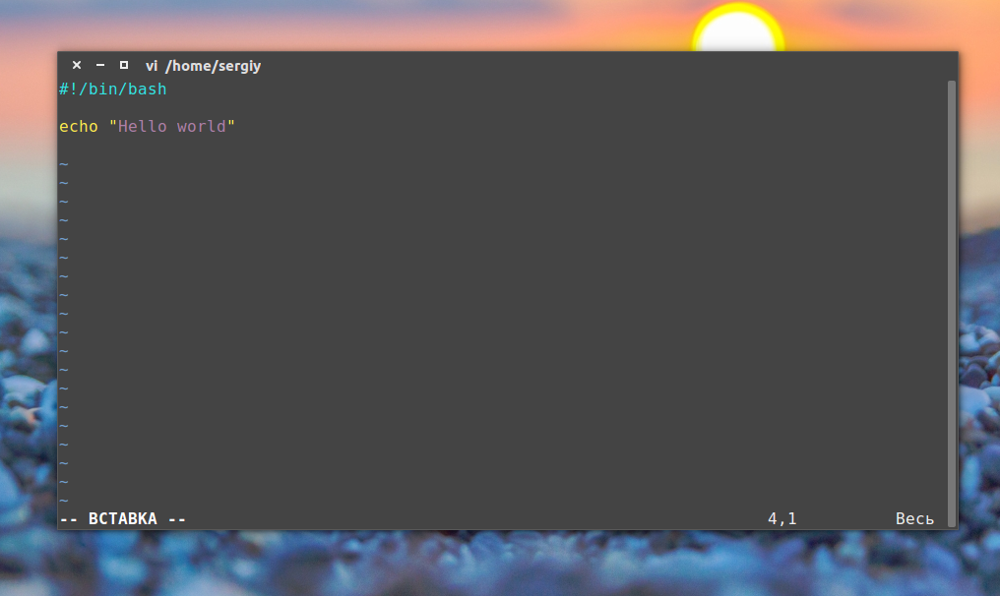

Утилита echo выводит строку, переданную ей в параметре на экран. Первая строка особая, она задает программу, которая будет выполнять команды. Вообще говоря, мы можем создать скрипт на любом другом языке программирования и указать нужный интерпретатор, например, на python:

    print("Hello world")

Или на PHP:

    #!/usr/bin/env php
    echo "Hello world";

В первом случае мы прямо указали на программу, которая будет выполнять команды, в двух следующих мы не знаем точный адрес программы, поэтому просим утилиту env найти ее по имени и запустить. Такой подход используется во многих скриптах. Но это еще не все. В системе Linux, чтобы система могла выполнить скрипт, нужно установить на файл с ним флаг исполняемый.

Этот флаг ничего не меняет в самом файле, только говорит системе, что это не просто текстовый файл, а программа и ее нужно выполнять, открыть файл, узнать интерпретатор и выполнить. Если интерпретатор не указан, будет по умолчанию использоваться интерпретатор пользователя. Но поскольку не все используют bash, нужно указывать это явно.

Чтобы сделать файл исполняемым в linux выполните:

    chmod ugo+x файл_скрипта

Теперь выполняем нашу небольшую первую программу:

    ./файл_скрипта

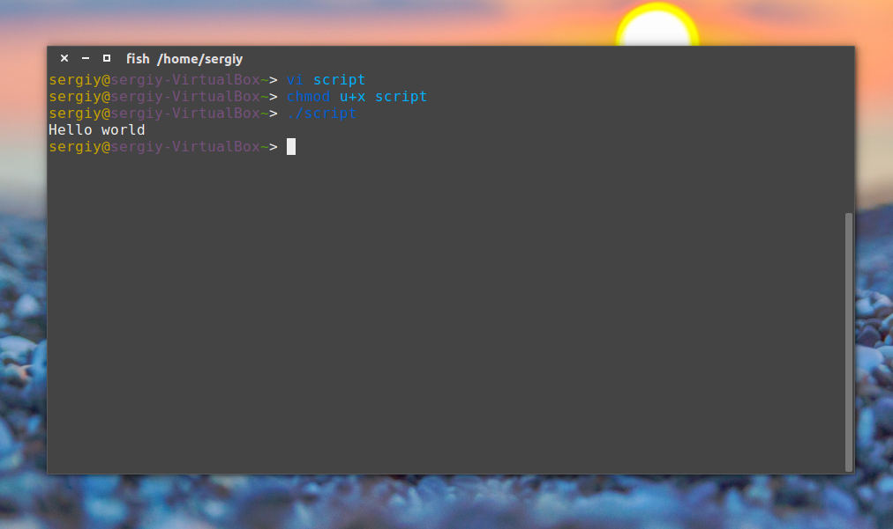

Все работает. Вы уже знаете как написать маленький скрипт, скажем для обновления. Как видите, скрипты содержат те же команды, что и выполняются в терминале, их писать очень просто. Но теперь мы немного усложним задачу. Поскольку скрипт, это программа, ему нужно самому принимать некоторые решения, хранить результаты выполнения команд и выполнять циклы. Все это позволяет делать оболочка Bash. Правда, тут все намного сложнее. Начнем с простого.

## ПЕРЕМЕННЫЕ В СКРИПТАХ
Написание скриптов на Bash редко обходится без сохранения временных данных, а значит создания переменных. Без переменных не обходится ни один язык программирования и наш примитивный язык командной оболочки тоже.

Возможно, вы уже раньше встречались с переменными окружения. Так вот, это те же самые переменные и работают они аналогично.

Например, объявим переменную string:

    string="Hello world"

Значение нашей строки в кавычках. Но на самом деле кавычки не всегда нужны. Здесь сохраняется главный принцип bash - пробел - это специальный символ, разделитель, поэтому если не использовать кавычки world уже будет считаться отдельной командой, по той же причине мы не ставим пробелов перед и после знака равно.

Чтобы вывести значение переменной используется символ $. Например:

    echo $string

Модифицируем наш скрипт:

    !/bin/bash
    string1="hello "
    string2=world
    string=$string1$string2
    echo $string

 

И проверяем:

    $ ./script

    Hello world

Bash не различает типов переменных так, как языки высокого уровня, например, С++, вы можете присвоить переменной как число, так и строку. Одинаково все это будет считаться строкой. Оболочка поддерживает только слияние строк, для этого просто запишите имена переменных подряд:

    !/bin/bash
    string1="hello "
    string2=world
    string=$string1$string2\ and\ me
    string3=$string1$string2" and me"
    echo $string3

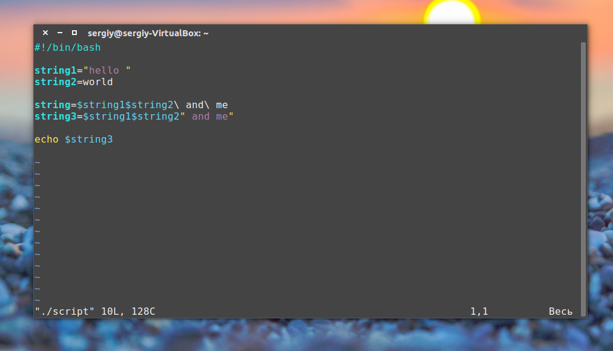

Проверяем:

    ./script

 
Обратите внимание, что как я и говорил, кавычки необязательны если в строке нет спецсимволов. Присмотритесь к обоим способам слияния строк, здесь тоже демонстрируется роль кавычек. Если же вам нужны более сложные способы обработки строк или арифметические операции, это не входит в возможности оболочки, для этого используются обычные утилиты.

## ПЕРЕМЕННЫЕ И ВЫВОД КОМАНД
Переменные не были бы настолько полезны, если бы в них невозможно было записать результат выполнения утилит. Для этого используется такой синтаксис:

    $(команда)

С помощью этой конструкции вывод команды будет перенаправлен прямо туда, откуда она была вызвана, а не на экран. Например, утилита date возвращает текущую дату. Эти команды эквивалентны:

     date

    $ echo $(date)

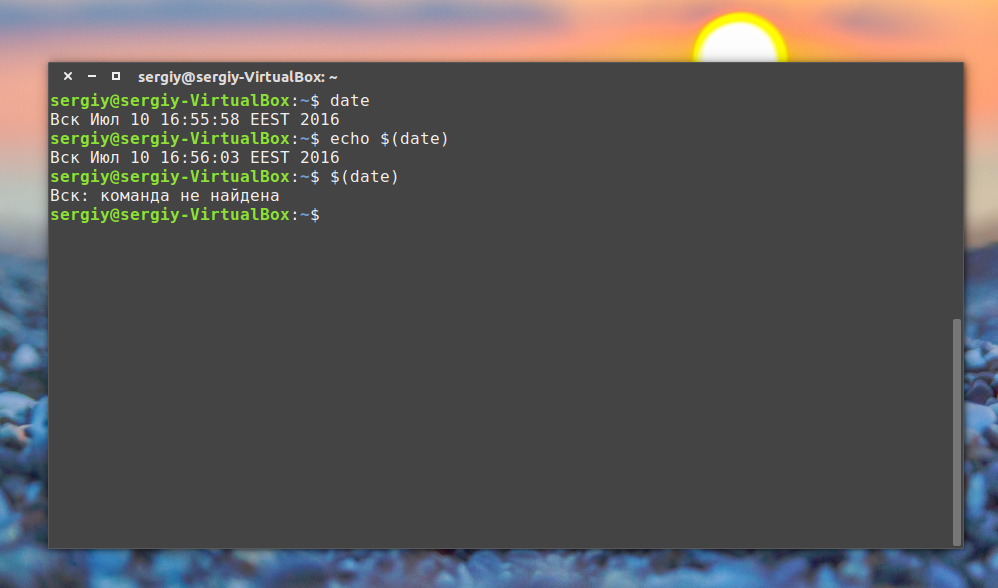

Понимаете? Напишем скрипт, где будет выводиться hello world и дата:

    !/bin/bash
    
    string1="hello world "
    string2=$(date)
    
    string=$string1$string2
    
    echo $string

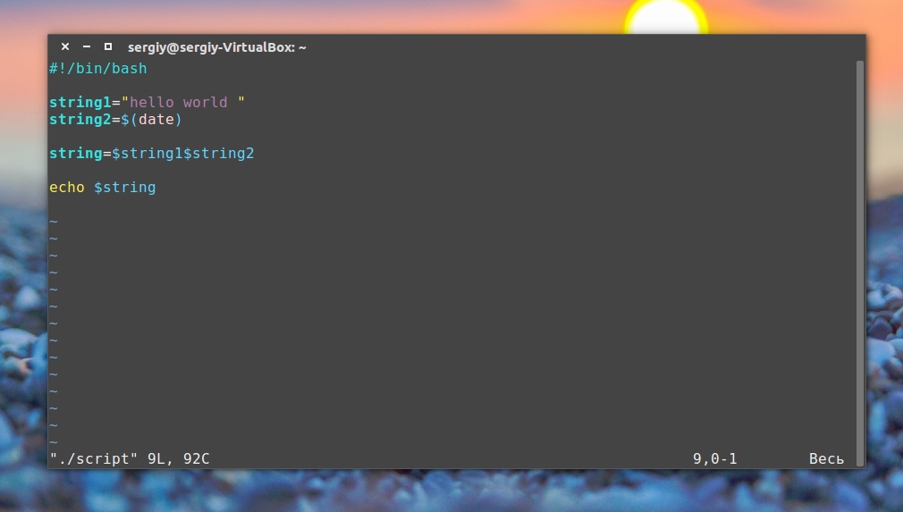

Теперь вы знаете достаточно о переменных, и готовы создать bash скрипт, но это еще далеко не все. Дальше мы рассмотрим параметры и управляющие конструкции. Напомню, что это все обычные команды bash, и вам необязательно сохранять их в файле, можно выполнять сразу же на ходу.

## ПАРАМЕТРЫ СКРИПТА
Не всегда можно создать bash скрипт, который не зависит от ввода пользователя. В большинстве случаев нужно спросить у пользователя какое действие предпринять или какой файл использовать. При вызове скрипта мы можем передавать ему параметры. Все эти параметры доступны в виде переменных с именами в виде номеров.

Переменная с именем 1 содержит значение первого параметра, переменная 2, второго и так далее. Этот bash скрипт выведет значение первого параметра:

    !/bin/bash
    echo $1

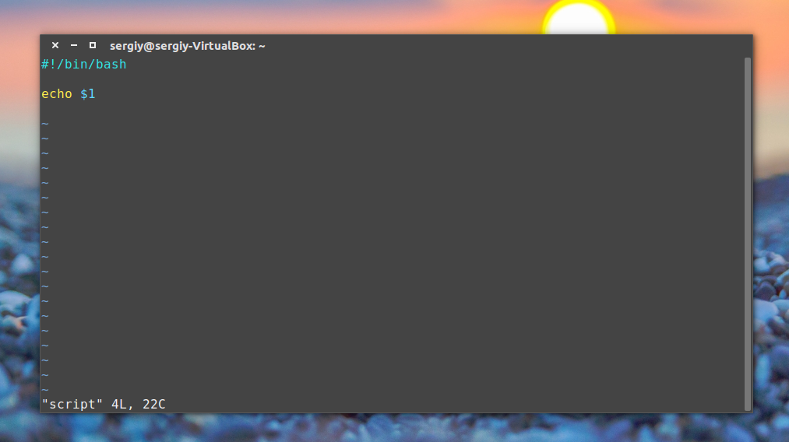

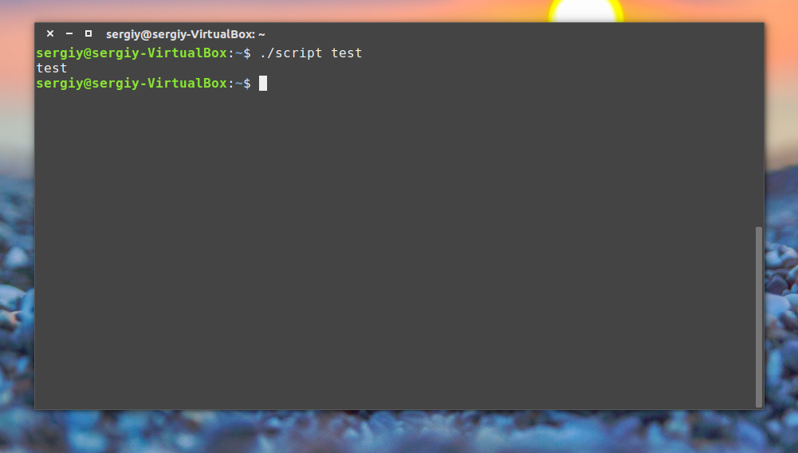

## УПРАВЛЯЮЩИЕ КОНСТРУКЦИИ В СКРИПТАХ
Создание bash скрипта было бы не настолько полезным без возможности анализировать определенные факторы, и выполнять в ответ на них нужные действия. Это довольно-таки сложная тема, но она очень важна для того, чтобы создать bash скрипт.

В Bash для проверки условий есть команда Синтаксис ее такой:

    if команда_условие
    then
    команда
    else
    команда
    fi

Эта команда проверяет код завершения команды условия, и если 0 (успех) то выполняет команду или несколько команд после слова then, если код завершения 1 выполняется блок else, fi означает завершение блока команд.

Но поскольку нам чаще всего нас интересует не код возврата команды, а сравнение строк и чисел, то была введена команда [[, которая позволяет выполнять различные сравнения и выдавать код возврата зависящий от результата сравнения. Ее синтаксис:

    [[ параметр1 оператор параметр2 ]]

Для сравнения используются уже привычные нам операторы <,>,=,!= и т д. Если выражение верно, команда вернет 0, если нет - 1. Вы можете немного протестировать ее поведение в терминале. Код возврата последней команды хранится в переменной $?:

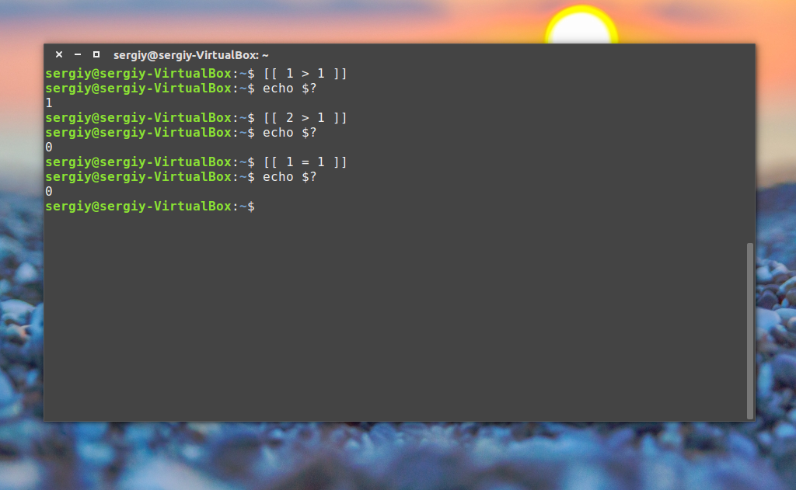

 

Теперь объединением все это и получим скрипт с условным выражением:

 

    !/bin/bash
    if [[ $1 > 2 ]]
    then
    echo $1" больше 2"
    else
    echo $1" меньше 2 или 2"
    fi

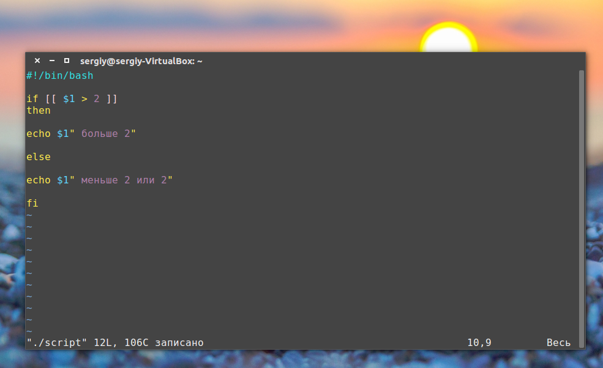

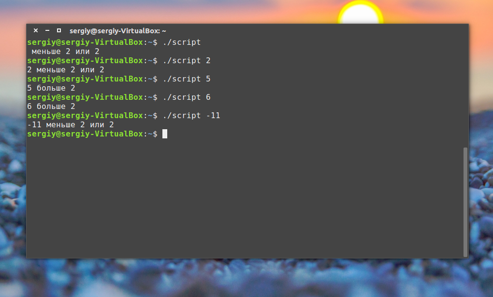

Конечно, у этой конструкции более мощные возможности, но это слишком сложно чтобы рассматривать их в этой статье. Возможно, я напишу об этом потом. А пока перейдем к циклам.

## ЦИКЛЫ В СКРИПТАХ
Преимущество программ в том, что мы можем в несколько строчек указать какие действия нужно выполнить несколько раз. Например, возможно написание скриптов на bash, которые состоят всего из нескольких строчек, а выполняются часами, анализируя параметры и выполняя нужные действия.

Первым рассмотрим цикл for. Вот его синтаксис:

    for переменная in список
    do
    команда
    done

Перебирает весь список, и присваивает по очереди переменной значение из списка, после каждого присваивания выполняет команды, расположенные между do и done.

Например, переберем пять цифр:

    !/bin/bash
    
    for index in 1 2 3 4 5
    do
    echo $index
    done

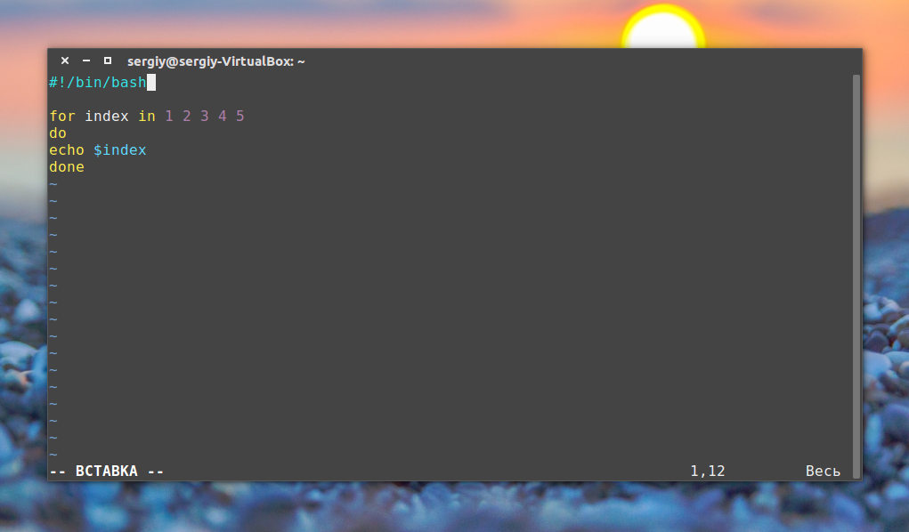

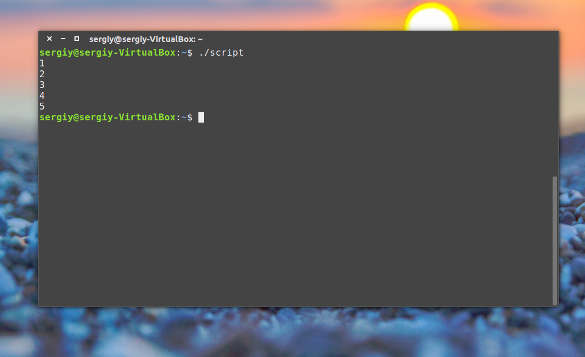

Или вы можете перечислить все файлы из текущей директории:

     for file in $(ls -l); do echo "$file"; done

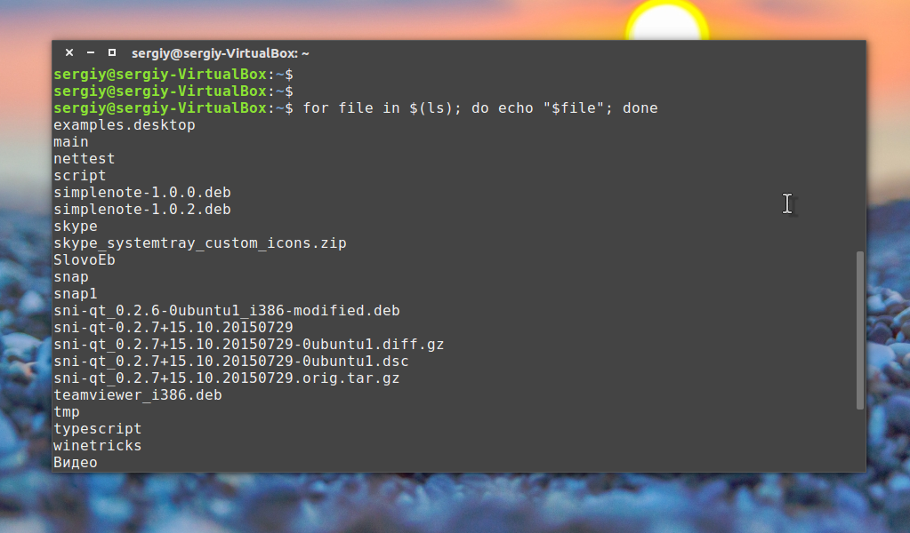

Как вы понимаете, можно не только выводить имена, но и выполнять нужные действия, это очень полезно когда выполняется создание bash скрипта.

Второй цикл, который мы рассмотрим - это цикл while, он выполняется пока команда условия возвращает код 0, успех. Рассмотрим синтаксис:

    while команда условие
    do
    команда
    done

Рассмотрим пример:

    !/bin/bash
    index=1
    while [[ $index < 5 ]]
    do
    echo $index
    let "index=index+1"
    done

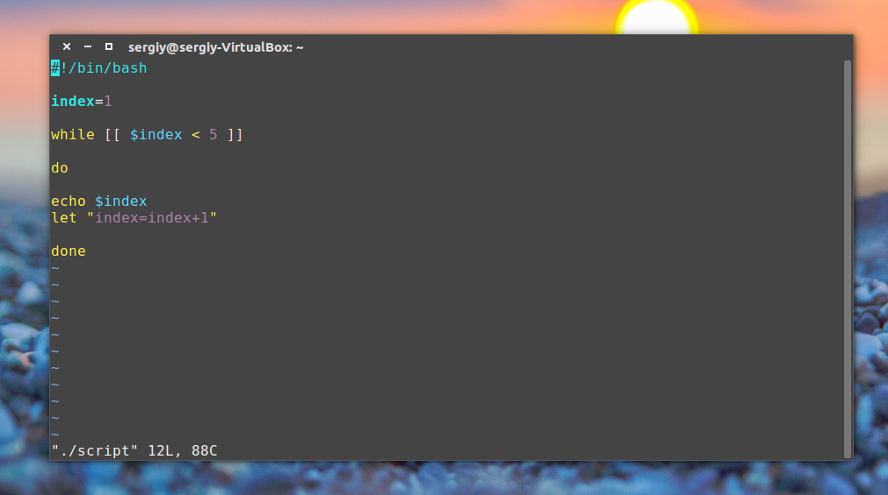

 

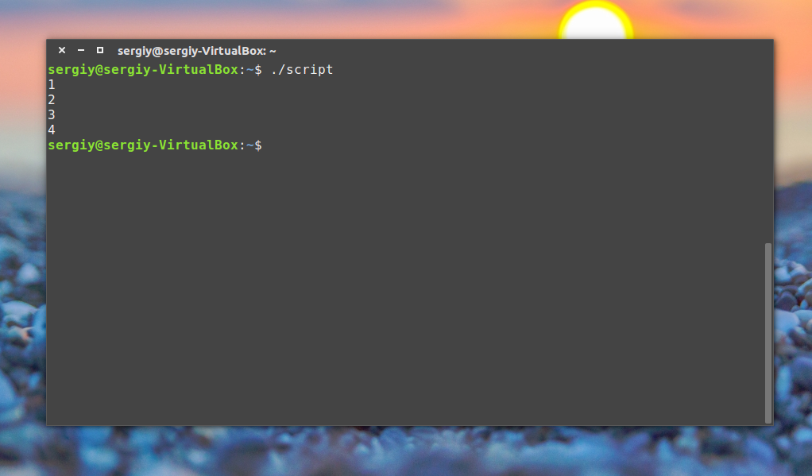

Как видите, все выполняется, команда let просто выполняет указанную математическую операцию, в нашем случае увеличивает значение переменной на единицу.

Хотелось бы отметить еще кое-что. Такие конструкции, как while, for, if рассчитаны на запись в несколько строк, и если вы попытаетесь их записать в одну строку, то получите ошибку. Но тем не менее это возможно, для этого там, где должен быть перевод строки ставьте точку с запятой ";". Например, предыдущий цикл можно было выполнить в виде одной строки:

    index=1; while [[ $index < 5 ]]; do echo $index; let "index=index+1"; done;
     

Все очень просто я пытался не усложнять статью дополнительными терминами и возможностями bash, только самое основное. В некоторых случаях, возможно, вам понадобиться сделать gui для bash скрипта, тогда вы можете использовать такие программы как zenity или kdialog, с помощью них очень удобно выводить сообщения пользователю и даже запрашивать у него информацию.

