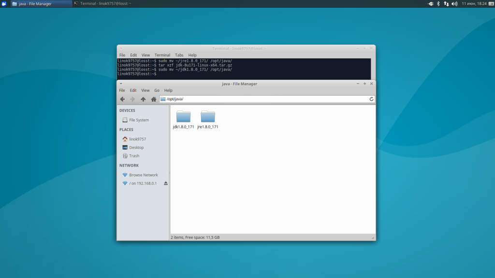
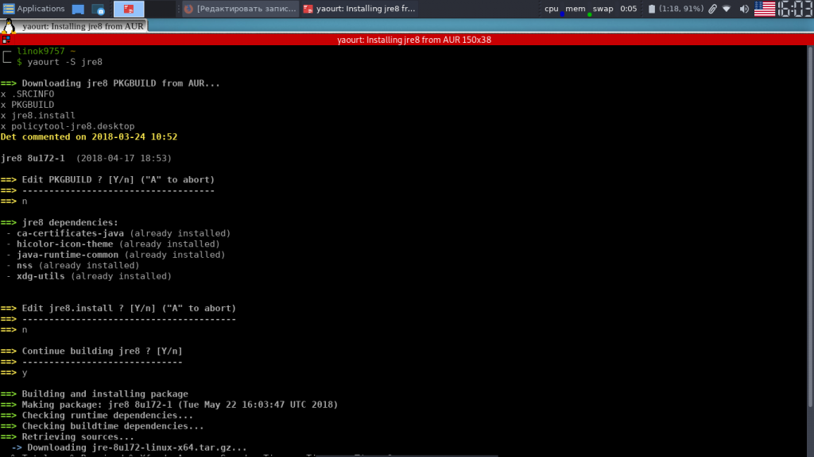
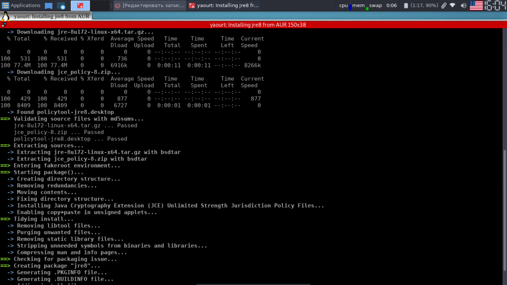
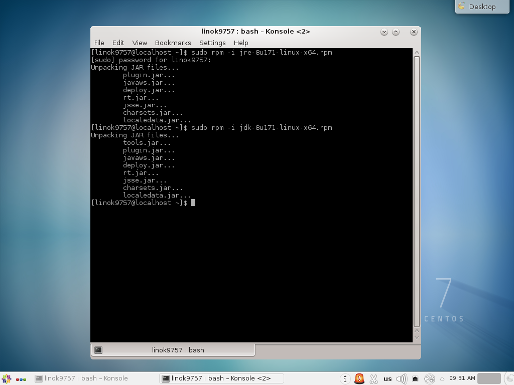
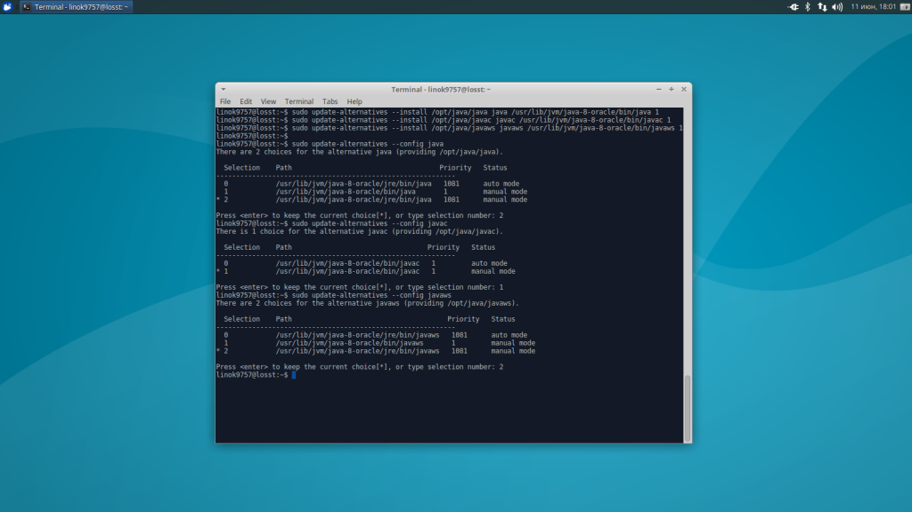
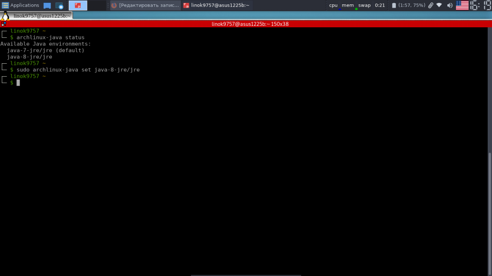
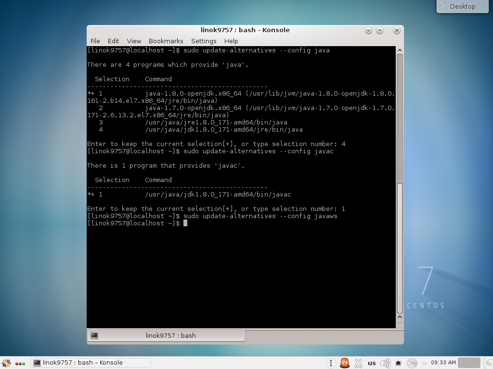
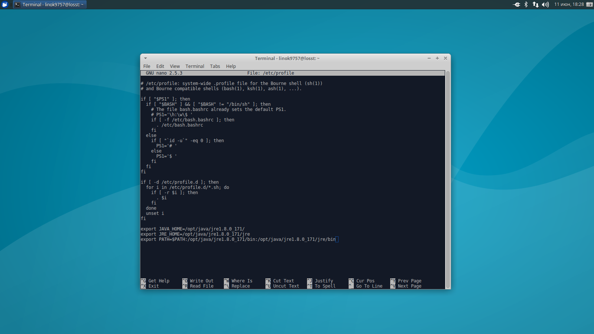

<!-- Start Document Outline -->

* [УСТАНОВКА JAVA В LINUX](#установка-java-в-linux)
	* [УСТАНОВКА JAVA В LINUX СВОИМИ РУКАМИ](#установка-java-в-linux-своими-руками)
		* [JRE](#jre)
		* [JDK](#jdk)
	* [УСТАНОВКА JAVA В UBUNTU](#установка-java-в-ubuntu)
		* [JRE И JDK](#jre-и-jdk)
	* [УСТАНОВКА JAVA В ARCHLINUX](#установка-java-в-archlinux)
		* [JRE](#jre-1)
		* [JDK](#jdk-1)
	* [УСТАНОВКА JAVA В CENTOS](#установка-java-в-centos)
		* [JRE](#jre-2)
й0		* [JDK](#jdk-2)
	* [ВЫБОР ВЕРСИИ JAVA](#выбор-версии-java)
		* [UBUNTU](#ubuntu)
		* [ARCHLINUX](#archlinux)
		* [CENTOS](#centos)
	* [НАСТРОЙКА ПЕРЕМЕННЫХ ОКРУЖЕНИЯ](#настройка-переменных-окружения)
	* [ВЫВОДЫ](#выводы)
	* [Install](#install)
		* [Инструкции по установке Java для 64-разрядной версии Linux RPM](#инструкции-по-установке-java-для-64-разрядной-версии-linux-rpm)

<!-- End Document Outline -->

# [УСТАНОВКА JAVA В LINUX](https://losst.ru/ustanovka-java-v-linux)

В этой статье речь пойдёт о проприетарной версии Java. Часто происходят ситуации, когда пользователь пытается открыть какую-либо программу на Java, а она либо вообще не запускается, либо пытается это сделать с помощью OpenJDK (Java Development Kit). Но вместо результата вы получаете кучу ошибок (как например с Minecraft). В данных ситуациях вам, скорее всего, поможет установка Java от Oracle.

ГлавнаяИнструкцииУстановка Java в Linux
УСТАНОВКА JAVA В LINUXИнструкции Обновлено:  14 июня, 2018  7  linok9757 
 Java
В этой статье речь пойдёт о проприетарной версии Java. Часто происходят ситуации, когда пользователь пытается открыть какую-либо программу на Java, а она либо вообще не запускается, либо пытается это сделать с помощью OpenJDK (Java Development Kit). Но вместо результата вы получаете кучу ошибок (как например с Minecraft). В данных ситуациях вам, скорее всего, поможет установка Java от Oracle.

 
Я вам расскажу, как установить JRE (Java Runtime Environment) и JDK (Java Development Kit)  8 версии на такие дистрибутивы, как Ubuntu, CentOS и Arch, а также как выбрать нужную среду по умолчанию.

Содержание статьи:

* Чем отличается JDK от JRE
* Установка Java в Linux своими руками
    * JRE
    * JDK
* Установка Java в Ubuntu
    * JRE и JDK
* Установка Java в ArchLinux
    * JRE
    * JDK
* Установка Java в CentOS
    * JRE
    * JDK
* Выбор версии Java
    * Ubuntu
    * ArchLinux
    * CentOS
* Настройка переменных окружения
* Выводы

## УСТАНОВКА JAVA В LINUX СВОИМИ РУКАМИ
###     JRE
Скачать архив с необходимой вам версией вы можете с <a href="https://www.java.com/ru/download/linux_manual.jsp" target="_blank">официального сайта</a>. Далее вам надо перенести его в желаемую директорию и распаковать. Рекомендую /opt/java, далее она и будет использоваться. Сделайте это, используя следующие команды:

    sudo mv ~/путь/до/файла/jre*.tar.gz /opt/java
    
    sudo tar -xzf /opt/java/jre*.tar.gz
     
     

Где "*" - версия Java.

###     JDK
Загрузите архив со средствами разработчки с <a href="http://www.oracle.com/technetwork/java/javase/downloads/jdk8-downloads-2133151.html" target="_blank">официального сайта</a> компании Oracle. Также перенесите его в желаемую директорию и распакуйте:

sudo mv ~/путь/до/файла/jdk*.tar.gz /opt/java

sudo tar -xzf /opt/java/jdk*.tar.gz

## УСТАНОВКА JAVA В UBUNTU
### JRE И JDK
Для установки проприетарной Oracle Java  вам необходимо добавить репозиторий, обновить индексы пакетов и установить Java. В Ubuntu, начиная с 18 релиза, это делается автоматически после добавления репозитория.

Внимание! Будут установлены как JRE, так и JDK. Сначала добавим репозиторий и обновим списки пакетов:

    sudo add-apt-repository ppa:webupd8team/java

    sudo apt-get update
     

В процессе установки необходимо будет принять лицензионное соглашение:

    sudo apt-get install oracle-java8-installer
 
##      УСТАНОВКА JAVA В ARCHLINUX
#### JRE
В официальных репозиториях есть только OpenJDK. Поэтому придётся воспользоваться пакетом из AUR(вы можете, конечно, руками установить Java от Oracle, но AUR проще). Установка производится всего одной командой:

    yaourt -S jre8

 

### JDK
JDK так же можно установить, используя AUR. Просто выполните команду:

 
    yaourt -S jdk8

## УСТАНОВКА JAVA В CENTOS
###     JRE
Для RHEL, Fedora, Cent OS, OpenSUSE есть официальный RPM-пакет, который вы можете скачать с официального сайта. Чтобы установить пакет из терминала, воспользуйтесь этой командой:

    sudo rpm -i /путь/к/файлу/jre-*.rpm

где "*" - версия Java. Или же примените любую графическую утилиту.

### JDK
Средства для разработчика вы можете скачать на сайте Oracle, ссылка на который есть в верху статьи. Для установки из терминала, используйте команду:

sudo rpm -i ~/путь/к/файлу/jdk-*.rpm

Где "*" - версия Java. "~" -  указывает, что путь начинается.

## ВЫБОР ВЕРСИИ JAVA
### UBUNTU
Для переключения на 8 версию Java используйте следующую команду:

    sudo update-java-alternatives -s java-8-oracle
     

Чтобы автоматически установить переменные среды, воспользуйтесь командой:

    sudo apt-get install oracle-java8-set-default
     

Или же вы можете установить альтернативы сами. Делается это с помощью следующих команд:

    sudo update-alternatives --install /usr/bin/java java /usr/lib/jvm/java-8-oracle/bin/java 1

    sudo update-alternatives --install /usr/bin/javaс javaс /usr/lib/jvm/java-8-oracle/bin/javaс 1
     
    sudo update-alternatives --install /usr/bin/javaws javaws /usr/lib/jvm/java-8-oracle/bin/javaws 1
     

Теперь осталось выбрать версии исполняемых файлов java, javaws и javac, которые будут использоваться по умолчанию:

    sudo update-alternatives --config java
    
    sudo update-alternatives --config javac
    
    sudo update-alternatives --config javaws
     

###  ARCHLINUX
Для начала просмотрите список установленных сред:

    archlinux-java status
     

Затем установите необходимую вам:

    archlinux-java set имя_среды
     

Пример:

    archlinux-java set java-8-jre/jre
     

### CENTOS
Выбрать необходимую среду можно с помощью команд, данных ниже (так же, как и в Ubuntu). Вам нужно будет просто выбрать цифру, соответствующую номеру версии:

    sudo update-alternatives --config java
    
    sudo update-alternatives --config javac
    
    sudo update-alternatives --config javaws
     

## НАСТРОЙКА ПЕРЕМЕННЫХ ОКРУЖЕНИЯ
Чтобы настройки были доступны для всех пользователей, будем использовать файл /etc/profile. Откройте его для редактирования любым текстовым редактором с помощью команды sudo и добавьте в конец следующие строки:

    export JAVA_HOME=/opt/java/jdk*/
    export JRE_HOME=/opt/java/jdk*/jre
    export PATH=$PATH:/opt/java/jdk*/bin:/opt/java/jdk*/jre/bin
    Не забывайте! 

Вместо пути по умолчанию /opt/java укажите тот, который использовали;
Если вы используете не JDK, а JRE, то в пути у вас так же будет не "jdk*", а "jre*";
"*" - версия Java, которая у вас установлена.

 
## ВЫВОДЫ
В данной статье мы подробно разобрали процесс установки и настройки Java в различных дистрибутивах Linux. Если остались вопросы, спрашивайте в комментариях!

## Install

### <a href="https://www.java.com/ru/download/help/linux_x64rpm_install.xml" target="_blank">Инструкции по установке Java для 64-разрядной версии Linux RPM</a>

1. Перейдите в режим пользователя root, выполнив команду su и указав пароль привилегированного пользователя.
2. Перейдите в каталог, в который необходимо выполнить установку. Введите:
cd directory_path_name
Например, для установки ПО в каталог /usr/java/ введите:

        cd /usr/java

3. Удалите более ранние версии пакетов Java.

        rpm -e package_name
4. Установите пакет.

        rpm -ivh jre-8u73-linux-x64.rpm
         

Чтобы обновить пакет, используйте

    rpm -Uvh jre-8u73-linux-x64.rpm

5. Удалите файл .rpm, если необходимо сэкономить пространство на диске.
6. Выйдите из консоли пользователя root. Перезагрузка компьютера не требуется.

