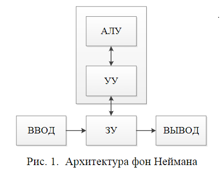
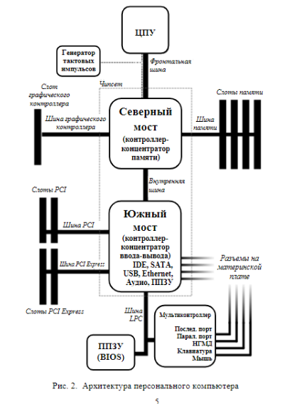
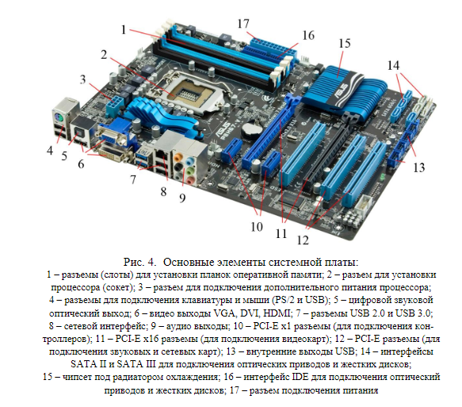
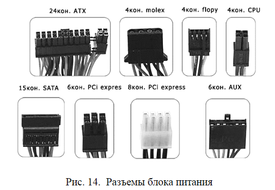
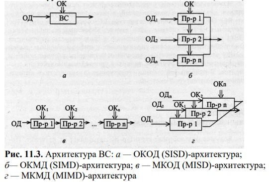

# 1. Архитектура электронно-вычислительной машины
Для изучения темы, прочтите следующие материалы:

1. Качановский Ю.П. Аппаратное и программное обеспечение персонального компьютера. Основы работы с операционной системой [Электронный ресурс]: методические указания к проведению лабораторной работы по курсу «Информатика»/ Ю.П. Качановский, А.С. Широков— Электрон. текстовые данные.— Липецк: Липецкий государственный технический университет, ЭБС АСВ, 2014.— 49 c.— Режим доступа: (http://www.iprbookshop.ru/55074.html).— ЭБС «IPRbooks» С: 3-31 [55074]

2. Заславская О.Ю. Архитектура компьютера [Электронный ресурс]: лекции, лабораторные работы, комментарии к выполнению. Учебно-методическое пособие/ О.Ю. Заславская— Электрон. текстовые данные.— М.: Московский городской педагогический университет, 2013.— 148 c.— Режим доступа: (http://www.iprbookshop.ru/26450.html).— ЭБС «IPRbooks С. 10-17 [26450]

[Промежуточный тест 1](https://edu.rosdistant.ru/mod/quiz/view.php?id=32254)

## 1

### 1.Аппаратное обеспечениеперсонального компьютера

#### 1.1.Архитектура электронно-вычислительной машины

Согласно фон НеймануЭВМ состоит из пяти основных блоков:
* –арифметико-логическоеустройство(АЛУ);
* –устройство управления(УУ);
* –запоминающее устройство(ЗУ);
* –устройство ввода;
* –устройство вывода.

Тип корпуса|Габаритные размеры платы,
|:----:|:------:|
ммMini-ITX|170×170
Micro-ATX|244×225
ATX|305×244
EATX|305×330
XL-ATX|345×262

Однако одинаковые сокеты на процессоре и материнской плате еще не гарантируют  возможность  совместной  работы  этих  устройств:  материнская плата  должна  поддерживать  конкретный  процессор.  Информацию  о  совместимости процессора и материнской платы можно получить на сайте произво-дителя материнской платы.

###### 1.2.5.1.Оперативная память
Оперативная  память–энергозависимаячасть  системыкомпьютерной памяти, в которой временно хранятся входные, выходные и промежуточные данныепрограммыпроцессора.Оперативная памятьнужна для хранения дан-ных и программ выполняемых в данный момент. Необходимость наличия в системе оперативной памятиобъясняется еевысокойскоростью. Хотя ско-рость доступа к данным на жестком диске всего лишь несколько милисекунд, этого недостаточно для процессора и заметно замедляетработу системы. 

Оперативное запоминающее устройство –ОЗУ или RAM(RandomAc-cessMemory–память с произвольным доступом)–бывает двух видов:–статическое (StaticRAM, SRAM)–информация сохраняется на протя-жении всего времени, пока к нему подается питание, скорость работы очень велика. Используется в основном в кэш-памяти;–динамическое (DynamicRAM, DRAM) –каждый  бит  информации должен обновляться (перезаряжаться) каждые несколько милисекунд, чтобы предотвратить утечку данных. Имеет высокую плотность записи (много битов на микросхему). Почти всегда основная память строится на основе динамиче-ского ОЗУ. Работает очень медленно по сравнению со статической памятью.

В современных компьютерах используетсянесколько типов динамиче-ского ОЗУ:

1) SDRAM(SynchronousDRAM–синхронноединамическое  ОЗУ) –пришла на смену асинхронным FPM, EDO. Представляет собой гибрид стати-ческого и динамического ОЗУ. Преимущество состоит в том, что исключается зависимость микросхемы от управляющих сигналов за счет управления одним синхронизирующим сигналом;

2) DDRSDRAM(DoubleDataRate–передача данных с двойной скоро-стью) –технология предусматривает передачу данныхкак на фронте, так и наспаде синхроимпульса, вследствие чего скорость передачи при такой же ча-стоте шины памяти, как и в обычной SDRAMувеличивается вдвое;

3) DDR2 SDRAM–второе поколение памяти типа DDR. Основное отличие DDR2 от DDR –вдвое большая частота работы шины, по которой данные переда-ются в буфер микросхемы памяти. При этом, чтобы обеспечить необходимый по-ток данных, передача на шину осуществляется из четырёх мест одновременно;

4) DDR3SDRAM–третье поколениепамяти типа DDR. Пришла на сме-ну памяти типаDDR2 SDRAM, для работы на большей частоте;

Модули памяти можно классифицировать по принципу расположения выводов:
1) SIMM(SingleInlineMemoryModule) –модуль памяти с односторон-ним расположением выводов;
2) DIMM(DualInlineMemoryModule) –модуль памяти с двухсторонним расположением выводов;
3) SO-DIMM(SmallOutlinerDIMM) –память для портативных компьютеров.

К основным характеристикам оперативной памяти относятся:
1) форм-фактор–DIMM, SO-DIMMи т.д.;
2) тип памяти–DDR, DDR2, DDR3и т.д.;
3) объём памяти–суммарный объем всех модулей комплекта;
4) тактовая частота характеризует количество выполняемых операций в секунду. Чем выше частота, тем большее количество операций выполняется;
5) пропускная способность–количество передаваемых данных в едини-цу времени

В современных персональных компьютерах получила распространение память форм-фактора DIMMи типа DDR. Разные поколения памятиDDRтипа обратно не совместимы, так DDR2 не является обратно совместимой с DDR, это означает, что нет возможностииспользовать модуль DDR2 совместнос разъемомDDR.  При совпадении типов модулей памяти, но при несовпадении частот, модуль памяти с большой частотой будет работать на меньшей часто-те, т.е. пропускная способность одного модуля уменьшается, но втоже время общий объём памяти увеличивается.

Необходимо также помнить, что если модуль DDR3-1800 подключен в слот, поддерживающий максимально DDR3-1600, модуль будет работать на частоте слота 1600 МГц, не используя свой ресурс в полном объеме, при этом также вероятны сбои и ошибки в работе системы.

И еще одно замечание. В современных компьютерах используется двухканальный или гораздо реже трехканальный режим работы памяти, он повышает пропускнуюспособностьпамяти до 70%. Чтобыданный режим работал коррек-но, в компьютере модули оперативной памяти обязательно должны быть уста-новленыпопарно (тройками), а данная пара (тройка) должна иметь одинаковые характеристики.

###### 1.2.5.2.Жесткие магнитные диски и твердотельные накопители

К основным характеристикам магнитных дисков относят:
1) объём накопителя–количество доступногопространства для записи данных;
2) скорость вращения шпинделя–чем выше скорость вращения, тем быстрее происходит доступ к информации, но в тоже время возрастает рабо-чая температура жесткого диска;
3) интерфейс–способ подключения накопителя к персональному ком-пьютеру(IDE, SATAи т.д.).

Основные интерфейсы, определяющие способ обмена данными жестко-го диска и персональному компьютеруследующие:
1) IDE (АТА,Advanced  Technology  Attachment) –параллельный интер-фейс подключения накопителей, был изменен (с выходом SATA) на PATA (Parallel ATA). В настоящее время вытеснен интерфейсом SATA,используется для подключения оптических накопителей.Максимальнаяскорость передачи –133 Мбайт/с;
2) SATA (Serial ATA) –последовательный интерфейс обмена данными с накопителями. Для подключения используется 8-pin разъем. Как и в случае с PATA –является устаревшими используется только для работы с оптически-ми накопителями. Стандарт SATA (SATA150) обеспечивал пропускную спо-собность равную 150 Мбайт/с (1,2 Гбит/с);
3) SATA2 (SATA300). Стандарт SATA2 регламентирует увеличение про-пускнойспособностивдвое, до 300 Мбайт/с (2,4 Гбит/с), и определяет работуна частоте 3 ГГц. Стандартны SATA и SATA2 совместимы между собой, однако для некоторых моделей необходимо вручную устанавливать режимы, перестав-ляя джамперы;
4) SATA3(по требованию  спецификацииправильно  называть  SATA 6Gb/s). Этот стандарт вдвое увеличил скорость передачи данных до 6 Гбит/с. Также  к  положительным  нововведениям относится  функция  программного управления NCQ и команды для непрерывной передачи данных для процесса с высоким приоритетом.

При выборе жесткого диска необходимо удостовериться, что интерфейс данного типа имеется на материнской плате, так как если на ней имеется ин-терфейс SATA1, а подключается жесткий диск с интерфейсом SATA3, переда-ча будет идти на скорости SATA1. Интерфейсы SATAи IDEнесовместимы.

###### Твердотельные  накопители
Твердотельные  накопители (SSD,SolidStateDriver),ныне  серийно производятся объемом свыше 256 Гбайт по доступнойценеи являются серь-езными конкурентами для магнитных дисков.

##### 1.2.6.Видеокарта
В современных компьютерах видеокарта (видеоадаптер) является само-стоятельным компьютером внутри компьютера. Когда человек играет в люби-мую 3Dигру или запускает продвинутый графический пакет, процессор ви-деокарты выполняет большую часть работы, а центральный процессор отсту-пает на второй план.Основными компонентами видеокарты являются графический процессор (GPU,Graphics Processing Unit) и видеопамять. Графический процессорпро-водит  все  расчеты,  связанные  с  выводимым  изображением. Видеопамять –хранит  изображение,генерируемое  и  постоянно  изменяемое  графическим процессором.

Видеокарты  могут  подключаться к  системной  плате  поинтерфейсам PCI,AGPиPCI-Express.Первые два 32-разрядные параллельные интерфейсы считаются устаревшими и в настоящее время не используются. Максимальная пропускная  способность  шиныPCI –528  Мбайт/с.  Интерфейс AGP (Accelerated Graphics Port –ускоренный графический порт),созданный специ-ально для соединения видеокарти системных плат,имелнесколько версий, последняя из них –AGP 8x обеспечивала пропускнуюспособность 2.1 Гбит/с.Современные видеокарты, подключаются к материнской плате через интер-фейс PCI-Express.

 Видеокарты имеют несколько выходов для подключения различных мо-ниторов и ТВ. В настоящее время используетсяаналоговый интерфейс VGA и цифровые:  DVI–DigitalVideoInterface,   HDMI   (miniHDMI),   DisplayPort (miniDP). Последние два кроме видеоряда дают и звук.

##### 1.2.7.Оптические приводы дисков

– CD-ROM –самый простой вариант оптического накопителя, предна-значенный только для чтения CD-дисков.Ёмкостьдисков650–879 Мб;

– DVD-ROM –привод, предназначенный только для чтения CD и DVD-дисков.Максимальная ёмкость дисков17,08ГБ (двухсторонний двухслойный);

– BD-ROM–привод для чтения дисков Blue-ray.В технологииBlue-ray для чтения и записи (в отличие от DVDиCD, гдеиспользуют красный и ин-фракрасный лазеры с длиной волны 650 нм и 780 нм соответственно) исполь-зуется сине-фиолетовыйлазерс длиной волны405 нм. Такое уменьшение поз-волило сузить дорожку вдвое по сравнению с обычным DVD-диском (до 0,32 мкм) и увеличить плотностьзаписи данных. Максимальная ёмкость 128 Гб (четырехслойный)

##### 1.2.8.Блок питания

Блок питания преобразует сетевое переменное напряжение 220 В, 50 Гц (120 В, 60 Гц) в постоянные напряжения +5 и +12 В, а в некоторых системах и в +3,3 В. Для питания цифровых схем (системной платы, плат адаптеров и дисковых накопителей) используется напряжение +3,3 или +5 В, а для двига-телей (дисководов и различных вентиляторов) ±12 В.

Питание  материнской  платы  поступает  через  20  или  24  контактный разъем ATX. В настоящее время подавляющее число блоков питания выпус-каются с разъемом подключения 20 + 4 контакта, позволяющимиспользовать основной 20 контактный разъем совместно с дополнительным 4 контактным разъемом, когда он требуется. Материнская плата также содержит дополни-тельный разъем для питания процессора. В зависимости от мощности процес-сора, поддерживаемого материнской платой, разъем питания может содержать 4, 6 или 8 контактов. Соответственно, блок питания должен содержать такой же разъем для питания процессора.

Видеокарта также может требовать наличияу блока питания 6 контакт-ный разъем для дополнительного питания графического процессора. Данный фактор также следует учитывать при выборе блока питания.

Оптические приводы и жесткие диски могут подключаться к источнику питания через 4 контактный разъем,molexили через 15 контактныйSATA. Следует контролировать наличие у блока питаниядостаточного количества разъемов molexи SATA

#### 1.3.Конфигурация персонального компьютера

При  выборе  определенной  конфигурации персонального  компьютеранеобходимо учитывать цели и задачи, которые он будет решать. Основываясь на этих данных, а такжепринимая во внимание количествоимеющихся де-нежных средств можно определить к какой из категорий будет принадлежать система. Существует множество конфигураций, но среди них выделяется ряд наиболее популярных:

1)  домашний/офисный персональный  компьютер–надежная  и  очень функциональная система при относительно невысокойцене. Разрабатывается с учетом того, что на нем будет стоять программное обеспечение, необходи-мое для работы;
2) ExtremeSystem–одним из представителей данного класса является игровой компьютер. Другим примером является компьютер необходимый для обработки видео, где производительность является одним из ключевых факто-ров. В данной комплектации высокая производительность обеспечивается ра-зумной ценой;
3) Mainstream PC–представляет самый быстрый, расширяемый, тихий и надежный класс. Как правило, цена комплектации не имеет значения. Хорошо подходит  в  ситуациях,  когда  производятся  частые  замены  илирасширения компонентов системы;
4) мультимедийный –может включать DVD, Blue-rayдисководы, под-ходит для обработки и конвертации видеоданных. Может служитьв роли до-машнего  кинотеатра. Вышеназванныевозможности  обеспечиваются  засчет относительно высокой цены;
5) домашний сервер –идеальное решение для центра хранения, обмена и защиты  данных  в  домашней  сети.  В  данной  системе  ключевыми  являются размер дискового пространства и такие обязательные функции как резервное копирование

## 2

## Add 1 11.2. Архитектура вычислительных систем

<a href="_src%2FL11%20Add%201%20%20%D0%90%D1%80%D1%85%D0%B8%D1%82%D0%B5%D0%BA%D1%82%D1%83%D1%80%D0%B0%20%D0%B2%D1%8B%D1%87%D0%B8%D1%81%D0%BB%D0%B8%D1%82%D0%B5%D0%BB%D1%8C%D0%BD%D1%8B%D1%85%20%D1%81%D0%B8%D1%81%D1%82%D0%B5%D0%BC.pdf" target="_blank">Add pdf</a>

Большое разнообразие структур ВС затрудняет их изучение. Поэтому
вычислительные системы классифицируют с учетом их обобщенных характеристик.
С этой целью вводится понятие «архитектура системы».

Архитектура ВС — совокупность характеристик и параметров,
определяющих функционально-логическую и структурную организацию системы.
Понятие архитектуры охватывает общие принципы построения и
функционирования, наиболее существенные для пользователей, которых больше
интересуют возможности систем, а не детали их технического исполнения.
Поскольку ВС появились как параллельные системы, то и рассмотрим
классификацию архитектур под этой точкой зрения

Эта классификация архитектур была предложена М. Флинном (М. Flynn) в
начале 60-х гг. В ее основу заложено два возможных вида параллелизма:
независимость потоков заданий (команд), существующих в системе, и
независимость (несвязанность) данных, обрабатываемых в каждом потоке.
Классификация до настоящего времени еще не потеряла своего значения. Однако
подчеркнем, что, как и любая классификация, она носит временный и условный
характер. Своим долголетием она обязана тому, что оказалась справедливой для ВС,
в которых ЭВМ и процессоры реализуют программные последовательные методы
вычислений. С появлением систем, ориентированных на потоки данных и
использование ассоциативной обработки, данная классификация может быть
некорректной

Согласно этой классификации существует четыре основных архитектуры ВС,
представленных на рис. 11.3:

* • одиночный поток команд — одиночный поток данных (ОКОД), в
английском варианте — Single Instruction Single Data (SISD) — одиночный
поток инструкций — одиночный поток данных;
* • одиночный поток команд — множественный поток данных (ОКМД), или
Single Instruction Multiple Data (SIMD) — одиночный поток инструкций —
одиночный поток данных;
* • множественный поток команд — одиночный поток данных (МКОД), или
Multiple Instruction Single Data (MISD) — множественный поток инструкций
— одиночный поток данных;
* • множественный поток команд — множественный поток данных (МКМД),
или Multiple Instruction Multiple Data (MIMD) — множественный поток
инструкций — множественный поток данных (MIMD).

Рис. 11.3. Архитектура ВС:
* а — ОКОД (SISD)-архитектура;
* б— ОКМД (SIМD)-архитектура;
* в — МКОД (МISD)-архитектура;
* г — МКМД (МIMD)-архитектура

Коротко рассмотрим отличительные особенности каждой из архитектур.

Архитектура ОКОД охватывает все однопроцессорные и одномашинные
варианты систем, т.е. с одним вычислителем. Все ЭВМ классической структуры
попадают в этот класс. Здесь параллелизм вычислений обеспечивается путем
совмещения выполнения операций отдельными блоками АЛУ, а также
параллельной работы устройств ввода-вывода информации и процессора.
Закономерности организации вычислительного процесса в этих структурах
достаточно хорошо изучены.

Архитектура ОКМД предполагает создание структур векторной или
матричной обработки. Системы этого типа обычно строятся как однородные, т.е.
процессорные, элементы, входящие в систему, идентичны, и все они управляются
одной и той же последовательностью команд. Однако каждый процессор
обрабатывает свой поток данных. Под эту схему хорошо подходят задачи обработки
матриц или векторов (массивов), задачи решения систем линейных и нелинейных,
алгебраических и дифференциальных уравнений, задачи теории поля и др. В
структурах данной архитектуры желательно обеспечивать соединения между
процессорами, соответствующие реализуемым математическим зависимостям. Как
правило, эти связи напоминают матрицу, в которой каждый процессорный элемент
связан с соседними.
По этой схеме строились системы: первая суперЭВМ — ILLIAC-IV,
отечественные параллельные системы — ПС-2000, ПС-3000. Идея векторной
обработки широко использовалась в таких известных суперЭВМ, как Cyber-205 и
Gray-I, II, III. Узким местом подобных систем является необходимость изменения
коммутации между процессорами, когда связь между ними отличается от
матричной. Кроме того, задачи, допускающие широкий матричный параллелизм, 
составляют достаточно узкий класс задач. Структуры ВС этого типа, по существу,
являются структурами специализированных суперЭВМ.

Третий тип архитектуры МКОД предполагает построение своеобразного
процессорного конвейера, в котором результаты обработки передаются от одного
процессора к другому по цепочке. Выгоды такого вида обработки понятны.
Прототипом таких вычислений может служить схема любого производственного
конвейера. В современных ЭВМ по этому принципу реализована схема совмещения
операций, в которой параллельно работают различные функциональные блоки, и
каждый из них делает свою часть в общем цикле обработки команды.
В ВС этого типа конвейер должны образовывать группы процессоров. Однако
при переходе на системный уровень очень трудно выявить подобный регулярный
характер в универсальных вычислениях. Кроме того, на практике нельзя обеспечить
и «большую длину» такого конвейера, при которой достигается наивысший эффект.
Вместе с тем конвейерная схема нашла применение в так называемых скалярных
процессорах суперЭВМ, в которых они применяются как специальные процессоры
для поддержки векторной обработки.

Архитектура МКМД предполагает, что все процессоры системы работают по
своим программам с собственным потоком команд. В простейшем случае они могут
быть автономны и независимы. Такая схема использования ВС часто применяется
на многих крупных вычислительных центрах для увеличения пропускной способности центра. Больший интерес представляет возможность согласованной работы
ЭВМ (процессоров), когда каждый элемент делает часть общей задачи. Общая
теоретическая база такого вида работ практически отсутствует. Но можно привести
примеры большой эффективности этой модели вычислений. Подобные системы
могут быть многомашинными и многопроцессорными. Например, отечественный
проект машины динамической архитектуры (МДА) — ЕС-2704, ЕС-2127 —
позволял одновременно использовать сотни процессоров.

## Add 2 11.1. Классификация вычислительных систем

## Add 3 11.3. Комплексирование в вычислительных системах

## Add 4 11.4. Типовые структуры вычислительных систем

