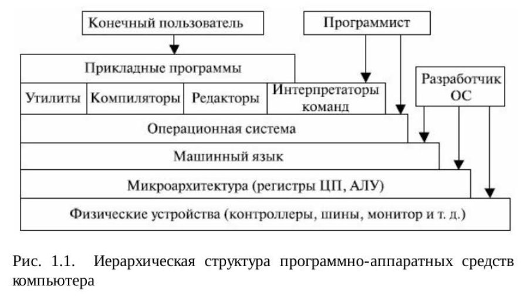

# Содержание

1. Архитектура, назначение и функции 4
операционных систем
2. Основные семейства операционных систем 66
3. Стандарты и лицензии на программное
обеспечение 102
4. Интерфейсы операционных систем 116
5. Организация вычислительного процесса 143
6. Управление памятью. Методы, алгоритмы и
средства 215
7. Подсистема ввода-вывода. Файловые системы 264
8. Основные события в истории семейства
UNIX/Linux 337
9. Первенство технологических достижений
двух основных версий UNIX 345

## Архитектура, назначение и функции операционных систем

Понятие операционной системы. Виртуальные машины. Операционнаясистема, среда и операционная оболочка. Эволюция операционныхсистем. Назначение, состав и функции ОС. Архитектура операционной системы. Классификация операционных систем. Эффективность итребования, предъявляемые к ОС. Совместимость и множественныеприкладные среды. Виртуальные машины как современный подход креализации множественных прикладных сред. Эффекты виртуализации

### 1.1. Понятие операционной системы. Виртуальные машины

Компьютерпонимает только свой, машинный язык (назовем его **Я0**)

новые команды в совокупности формируют некоторый язык, которыйназовем **Я1**

Первый способ – замена каждой команды языка Я1 наэквивалентный набор команд в языке Я0. В этом случае компьютервыполняет новую программу, написанную на языке Я0, вместопрограммы, написанной на языке Я1. Эта технология называется **трансляцией**

Второй способ – написание программы на языке Я0, которая беретпрограммы, написанные на языке Я1, в качестве входных данных,рассматривает каждую команду по очереди и сразу выполняет эквивалентный набор команд языка Я0. Эта технология не требуетсоставления новой программы на Я0. Она называется интерпретацией,а программа, которая осуществляет **интерпретацию**, называется интерпретатором

В подобной ситуации проще представить себе существованиегипотетического компьютера или виртуальной машины, для котороймашинным языком является язык Я1, чем думать о трансляции иинтерпретации. Назовем такую виртуальную машину М1, авиртуальную машину с языком Я0 – М0. Для виртуальных машинможно будет писать программы, как будто они (машины) действительносуществуют.

Очевидно, можно пойти дальше – создать еще набор команд, который вбольшей степени ориентирован на человека и в меньшей степени накомпьютер, чем Я1. Этот набор формирует язык Я2 и, соответственно,виртуальную машину М2. Так можно продолжать до тех пор, пока недойдем до подходящего нам языка уровня n.

Большинство современных компьютеров состоит из двух и болееуровней. **Уровень 0** – аппаратное обеспечение машины. Электронныесхемы этого уровня выполняют программы, написанные на языке **уровня 1**. Следующий уровень – микроархитектурный уровень.

На этом уровне можно видеть совокупности 8 или 32 (иногда и больше)регистров, которые формируют локальную память и АЛУ (арифметико-логическое устройство). Регистры вместе с АЛУ формируют трактданных, по которому поступают данные. Основная операция этоготракта заключается в следующем. Выбирается один или два **регистра**,АЛУ производит над ними какую-то **операцию**, а результат помещаетсяв один из этих регистров. На некоторых машинах работа трактаконтролируется особой программой, которая называетсямикропрограммой. В других машинах такой контроль выполняетсяаппаратным обеспечением.

Следующий (**второй**) уровень составляет уровень архитектуры системыкоманд. Команды используют регистры и другие возможностиаппаратуры. Команды формируют уровень ISA (Instruction SetArchitecture), называемый машинным языком. Обычно машинный языксодержит от 50 до 300 команд, служащих преимущественно для перемещения данных по компьютеру, выполнения арифметическихопераций и сравнения величин.

Следующий (**третий**) уровень обычно – гибридный. Большинствокоманд в его языке есть также и на уровне архитектуры системы команд.У этого уровня есть некоторые дополнительные особенности: наборновых команд, другая организация памяти, способность выполнять двеи более программы одновременно и некоторые другие. С течениемвремени набор таких команд существенно расширился. В нем появилисьтак называемые макросы операционной системы или вызовысупервизора, называемые теперь системными вызовами.

Новые средства, появившиеся на **третьем уровне**, выполняютсяинтерпретатором, который работает на втором уровне. Этотинтерпретатор был когда-то назван операционной системой. Командытретьего уровня, идентичные командам второго уровня, выполняютсямикропрограммой или аппаратным обеспечением, но не операционнойсистемой. Иными словами, одна часть команд третьего уровняинтерпретируется операционной системой, а другая часть –микропрограммой. Вот почему этот уровень операционной системысчитается гибридным.

Операционная система была создана для того, чтобы автоматизироватьработу оператора и скрыть от пользователя сложности общения саппаратурой, предоставив ему более удобную систему команд. Нижниетри уровня (с нулевого по второй) конструируются не для того, чтобы сними работал обычный программист. Они изначально предназначеныдля работы интерпретаторов и трансляторов, поддерживающих болеевысокие уровни. Эти трансляторы и интерпретаторы составляютсясистемными программистами, которые специализируются наразработке и построении новых виртуальных машин.

Над операционной системой (ОС) расположены остальные системные
программы. Здесь находятся интерпретатор команд (оболочка),
компиляторы, редакторы и т.д. Подобные программы не являются
частью ОС (иногда оболочку пользователи считают операционной
системой). Под операционной системой обычно понимается то
программное обеспечение, которое запускается в режиме ядра или, как
еще его называют, режиме супервизора. Она защищена от вмешательства пользователя с помощью специальных аппаратных
средств.

**Четвертый** уровень представляет собой символическую qюрму одного
из языков низкого уровня ( обычно **ассемблер**). На этом уровне можно
писать программы в приемлемой для человека qюрме. Эти программы
сначала транслируются на язык уровня 1, 2 или 3, а затем
интерпретируются соответствующей виртуальной или факгически
существующей (физической) мalllliнoй.

Уровни с **пятого** и **выше** предназначены для прикладных
программистов, решающих конкретные задачи на языках высокого
уровня (С, С ++, С#, VВА и др.) . Компиляторы и редакторы этих
уровней запускаются в пользовательском режиме . На еще более высоких
уровнях располагаются прикладные программы пользователей.

Однако концепция, рассматривающзя операционную систему прежде
всего как **удобный интерфейс пользователя**, - это взгляд сверху вниз .
Альтернативный взгляд, снизу вверх, дает представление об
операционной системе как о механизме, присугствующем в компьютере
для **управления всеми компонентами** этой сложнейшей системы. В соотв етствии
заЮiючается в
с этим подходом работа операционной системы
обеспечении организованного и контролируемого
распределения процессоров, памяти, дисков, принтеров, устройств
ввода-вывода, датчиков времени и т.п. между различными
программами, конкурирующими за право их использовать.

### 1.2. Операционная система, среда и операционная оболочка

В конце 50-х годов проштюго века ведуrцие фирмы изготовители
поставляли операционные системы со следующими характеристиками:
* • пакетная обработка одного потока задач;
* • наличие стандартных программ ввода-вывода;
* • возможности автоматического перехода от программы к
программе;
* • средства восстановления после ошибок, обеспечивающие автоматическую "очистку" компьютера в случае аварийного
завершения очередной задачи и позволяющие запускать
следующую задачу при минимальном вмешательстве оператора;
* • языки управления заданиями, предоставляющие пользователям
возможность описывать свои задания и ресурсы, требуемые для
их выполнения.

Расположение операционной системы в иерархической структуре
программного и аппаратного обеспечения компьютера можно
представить, как показано на рис. 1.1.

* Самый нижний уровень содержит различные устройства компьютера,
состоящие из микросхем, проводников, источников питания,
электронно-лучевых трубок и т.п. Этот уровень можно разделить на
подуровни, например контроллеры устройств, а затем сами устройства.
Возможно деление и на большее число уровней. Выше расположен
микроархитектурный уровень, на котором физические устройства
рассматриваются как отдельные функциональные единицы.
* На микроархитектурном уровне находятся внутренние регистры
центрального процессора (их может быть несколько) и ариqметикологические
устройства со средствами управления ими. На этом уровне
реализуется выполнение машинных команд. В процессе выполнения
команд используются регистры процессора и устройств, а также другие
возможности аппаратуры. Команды, видимые для работающего на
ассемблере программиста, qюрмируют уровень ISA (Instruction Set
Aгcbltecture - архитектура системы команд), часто называемый
машинным языком.
* Операционная система предназначена для того, чтобы скрыть все эти
сложности. Конечный пользователь обычно не интересуется деталями
устройства аппаратного обеспечения компьютера. Компьютер ему
видится как набор приложений. Приложение может быть написано
программистом на каком-либо языке программирования. Для
упрощения этой работы программист использует набор системных
программ, некоторые из которых называются утилитами. С их помощью
реализуются часто используемые функции, которые помогают работать
с файлами, управлять устройствами ввода-вывода и т.п. Программист
применяет эти средства при разработке программ, а приложения во
время выполнения обращаются к утилитам для выполнения
определенных функций. Наиболее важной из системных программ
является операционная система, которая освобождает программиста от
необходимости глубокого знания устройства компьютера и представляет
ему У,Цобный интерфейс для его использования. Операционная система
выступает в роли посредника, облегчая программисту, пользователям и
программным приложениям доступ к различным службам и
возможностям компьютера [lQ].

### 1.3. Эволюция операционных систем

Одной из первых ОС, использующих эти новейlШlе решения, была
операционная система МСР (главная управляющая программа),
созданная фирмой Bшroughs для своих компьютеров В5000 в 1963 году.
В этой ОС были реализованы многие концепции и идеи, став1Ш1е
впоследствии стандартными для многих операционных систем:

* • мультипрограммирование;
* • мультипроцессорная обработка;
* • виртуальная память;
* • возможность отладки программ на исходном языке;
* • написание операционной системы на языке высокого уровня.

Одним из важнейll.IИХ событий в истории операционных систем
считается появление в 1964 году семейства компьютеров под названием
System'360 фирмы IВМ, а позже - System'370 [ll]. Это было первой в
мире реализацией концепции семейства программно и информационно
совместимых компьютеров, ставшей впоследствии стандартной для
всех фирм компьютерной отрасли .

Нужно отметить, что основной формой использования ЭВМ, как в
системах разделения времени, так и в системах пакетной обработки,
стал многотерминальный режим. При этом не только оператор, но и все
пользователи получали возможность формулировать свои задания и
управлять их выполнением со своего терминала. Поскольку
терминальные комплексы скоро стало возможным размещать на
значительных расстояниях от компьютера (благодаря модемным
телефонным соединениям), появились системы удаленного ввода
заданий и телеобработки данных. В ОС добавились модули,
реализующие **протоколы связи** [10, 13].

Важной вехой в истории мини-компьютеров и вообще в истории
операционных систем явилось создание ОС UNIX. Написал эту систему
Кен Томпсон (Ken Thompson), один из специалистов по компьютерам в
BELL Labs, работавший над проектом МИПСS. Собственно, его **UNIX**
 это усеченная однопользовательская версия системы MULПCS.
Первоначальное название этой системы - UNICS (UNiplexed lnformation
and Computing Service - примитивная информационная и компьютерная
служба). Так в шутку была названа эта система, поскольку MULTICS
(MUL1iplexed Information and Computing Service) - мультиплексная
информационная и компьютерная служба. С середины 70-х годов
началось массовое использование ОС UNIX, написанной на 90% на
языке С. lllиpoкoe распространение С-компиляторов сделало UNIX
уникальной переносимой ОС, а поскольку она поставлялась вместе с
исходными кодами, она стала первой открытой операционной
системой. Гибкость, элегантность, мощные функциональные
возможности и открытость позволили ей занять прочные позиции во
всех классах компьютеров - от персональных до супер-ЭВМ.

Дальнейшее развитие сетевых систем со стеком протоколов **TCP/IP**: в
1983 году он был принят МО CIIIA в качестве стандарта и использован
в сети ARPANEТ. В этом же году ARPANET разделилась на MILNET (для
17
Назаров С.В ., Широков А.И. Современные операционные с1ктемы
военного ведомства CIIIA) и новую ARPANET, которую стали называть
Intemet.

Еще одним знаменательным событием для истории операционных
систем было появление в начале 80-х годов персональных
компьютеров . Они послужили мощным толчком для распределения
локальных сетей, в результате поддержка сетевых функций стала для ОС
ПК необходимым условием. Однако и дружественный интер~йс, и
сетевые функции появились у ОС ПК не сразу [13].

Наиболее популярной версией ОС раннего этапа развития
персональных компьютеров была **MS-DOS** компании Мicrosoft -
однопрограммная, однопользовательская ОС с интер~йсом командной
строки. Многие функции, обеспечивающие удобство работы
пользователю, в этой ОС предоставлялись дополнительными
программами - оболочкой N orton Cornmander, РС Too1s и др. Наибольшее
влияние на развитие программного обеспечения ПК оказала
операционная среда Wmdows, первая версия которой появилась в 1985
году. Сетевые функции также реализовались с помощью сетевых
оболочек и появились в MS-DOS версии 3.1. В это же время появились
сетевые продукты Мicrosoft - MS-NET, а позже - LAN Manager, Windows
for Woгkgroup, а затем и Windows NТ.

Другим пугем попиа компания N ovell: ее продукг **NetWare** -
операционная система со встроенными сетевыми функциями. ОС
NetWare распространялась как операционная система для центральн ого
сервера локальной сети и за счет специализации функций файл-сервера
обеспечивала высокую скорость удаленного доступа к файлам и
повышенную безопасность данных. Одн ако эта ОС имела
специф,lческий программный интер~йс (API), что затрудняло
разработку приложений.

В 1987 году появилась первая **многозадачная ОС для ПК - OS/2**,
разработанная Мicrosoft совместно с IВМ. Эта была хорошо
продуманная система с виртуальной памятью, граф,lческим интер~йсом и возможностью выполнять DОS-приложения. Для нее
были созданы и получили распространение сетевые оболочки LAN
Manager (Мicrosoft:) и LAN Seiver (IВМ). Эти оболочки уступали по
производительности файловому серверу N etWare и потребляли больше
аппаратных ресурсов, но имели важные достоинства. Они позволяли
выполнять на сервере любые программы, разработанные для OS/2, MSDOS
и Windows, кроме того, можно было использовать компьютер, на
котором они работали, в качестве рабочей станции. Неудачная
рыночная судьба OS/2 не позволила системам LAN-Manager и LANSeiver
захватить заметную долю рынка, но принципы работы этих
сетевых систем во многом нашли свое воплощение в ОС 90-х годов -
MS Windows NТ.

### 1.4. Назначение состав и функции ОС

### 1.5. Архитектура операционной системы 27

### 1.6. Классификация операционных систем 42

### 1.7. Эффективность и требования, предъявляемые к ос 45

### 1.8. Совместимость и множественные прикладные среды 49

### 1.9. Виртуальные машины как современный подход к реализации множественных прикладных сред 54

### 1.10. Эффекты виртуализации 60

## Основные семейства операционных систем 66

### 2.1. История семеиства операционных систем UNIX/Linux 66

### 2.2. Генеалогия семейства операционных систем и некоторые известные версии UNIX 74

### 2.3. Операционные системы фирмы Мicrosoft 94

### 2.4. Отличия семейства UNIX/Linux от операционных систем Windows и MS DOS 99

## Стандарты и лицензии на программное обеспечение 102

### 3.1. Стандарты семейства UNIX 102

### 3.2. Лицензии на программное обеспечение и документацию 110

## Интерфейсы  операционных систем 116

### 4.1. Основные понятия, связанные с интерфейсом операционных систем 116

### 4.2. Графический интерфейс пользователя в семействе UNIX/Linux 129

#### 4.2.1. К истории Х Window system 129

#### 4.2.2. Основные понятия системы Х Window 134

#### 4.2.3. Х Window в Linux 137

#### 4.2.4. Интегрированная графическая среда KDE 139

#### 4.2.5. Интегрированная графическая среда GNOME 141

### 5.1. Концепция процессов и потоков. Задание, процессы, потоки (нити), волокна 143

### 5.2. Мультипрограммирование. Формы многопрограммной работы 147

### 5.3. Управление процессами и потоками 152

### 5.4. Создание проце ссов и потоков. Модели процессов и потоков 158

### 5.5. Планирование заданий, процессов и потоков 168

### 5.6. Взаимодействие и синхронизация процессов и потоков 177

