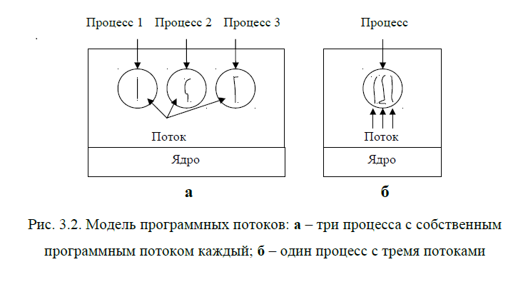

# Лекция № 1. ОСНОВНЫЕ ПОНЯТИЯ

## 1.1. Системное и прикладное программное обеспечение

Веб-браузер Базы данных Игры | Прикладное ПО
|-----|-----|
Компиляторы Редакторы Интерпретаторы Операционная система |    Системное ПО 
Машинный язык Микроархитектура Аппаратура | Физические устройства 

Под операционной системой обычно понимается то программное
обеспечение, которое запускается в режиме ядра или, как его еще называют,
режиме супервизора

С точки зрения пользователя операционная система
выполняет функцию виртуальной машины, для которой проще
программировать и с которой легче работать, чем непосредственно с
аппаратным обеспечением компьютера.

Тракт данных предназначен для выполнения набора команд.
Аппаратное обеспечение и команды, доступные программисту на языке
**ассемблера**, образуют архитектуру набора команд. Зачастую данный
уровень называют также машинным языком.

Под операционной системой обычно понимается то программное
обеспечение, которое запускается в **режиме ядра** или, как его еще называют,
**режиме супервизора**. Операционная система защищена от вмешательства
пользователя с помощью аппаратных средств.

## 1.2. Операционные системы

Операционная система (ОС) представляет собой комплекс
управляющих и обрабатывающих программ, которые, с одной стороны,
* выступают как интерфейс между аппаратурой компьютера и пользователем с
его задачами, а с другой стороны, 
* предназначены для наиболее эффективного
расходования ресурсов вычислительной системы и организации надежных
вычислений.

И пользователь, и его программы
взаимодействуют с компьютером через **интерфейсы** операционной системы.

Более детальный **перечень функций** приведен ниже:

1. Прием от пользователя (или от оператора системы) заданий, или
команд, сформулированных на соответствующем языке, и их
обработка.
2. Загрузка в оперативную память подлежащих исполнению программ.
3. Распределение памяти.
4. Запуск программы (передача ей управления, в результате чего
процессор исполняет программу).
5. Идентификация всех программ и данных.
6. Прием и исполнение различных запросов от выполняющихся
приложений. ОС умеет выполнять большое количество системных
функций (сервисов), которые могут быть запрошены из
выполняющейся программы. Обращение к этим сервисам
осуществляется по определенным правилам, которые определяют
интерфейс прикладного программирования (**Application Program
Interface**, API) этой операционной системы.
7. Обслуживание всех операций ввода-вывода.
8. Обеспечение работы систем управления файлами (СУФ) и/или
систем управления базами данных (СУБД), что позволяет резко
увеличить эффективность всего программного обеспечения.
9. Обеспечение режима мультипрограммирования, то есть
организации параллельного выполнения двух или более программ
на одном процессоре, которая создает видимость их
одновременного исполнения.
10. Планирование и диспетчеризация задач в соответствии с заданными
стратегией и дисциплинами обслуживания.
11. Организация механизмов обмена сообщениями и данными между
выполняющимися программами.
12. Для сетевых операционных систем характерной является функция
обеспечения взаимодействия связанных между собой компьютеров.
13. Защита одной программы от влияния другой, обеспечение
сохранности данных, защита самой операционной системы от
исполняющихся на компьютере приложений.
14. Аутентификация и авторизация пользователей (для большинства
диалоговых операционных систем). Под аутентификацией
понимается процедура проверки имени пользователя и его пароля на
соответствие тем значениям, которые хранятся в его учетной
записи. Если входное имя (login) пользователя и его пароль
совпадают, то, скорее всего, это и будет тот самый пользователь.
Термин авторизация означает, что в соответствии с учетной
записью пользователя, который прошел аутентификацию, ему (и
всем запросам, которые будут идти к операционной системе от его
имени) назначаются определенные права (привилегии),
определяющие, что он может, а чего не может делать на
компьютере.
15. Удовлетворение жестким ограничениям на время ответа в режиме
реального времени (характерно для операционных систем реального
времени).
16. Обеспечение работы систем программирования, с помощью
которых пользователи готовят свои программы.
17. Предоставление услуг на случай частичного сбоя системы.

Команда обращения к операционной системе передает ей управление,
переводя процессор в привилегированный режим работы. Большинство
компьютеров имеют два (и более) режима работы: **привилегированный**
(режим супервизора) и **пользовательский**. Ресурс может быть выделен
вычислительному процессу, обратившемуся к операционной системе с
соответствующим запросом, если:

1. ресурс свободен и в системе нет запросов от задач более высокого
приоритета к этому же ресурсу;
2. текущий запрос и ранее выданные запросы допускают совместное
использование ресурсов;
3. ресурс используется задачей низшего приоритета и может быть
временно отобран (разделяемый ресурс).

## 1.3. Операционные среды

**Операционная среда** – это то системное программное окружение, в
котором могут выполняться программы, созданные по правилам работы этой
среды. Операционная среда может быть либо нативной (естественной), либо
может быть организована в чужой операционной системе путем эмуляции.

Та программная среда, которая непосредственно образуется кодом
операционной системы, называется основной, естественной, или **нативной**
(native – по английски «туземец»). Помимо основной операционной среды в
операционной системе могут быть организованы (путем эмуляции иной
операционной среды) **дополнительные** программные среды.

Эмуляция (англ. emulation) – воспроизведение программными или
аппаратными средствами (либо их комбинацией) работы других программ
или устройств. В отличие от симуляции (simulation), которая лишь
воспроизводит поведение программы, при эмуляции ставится цель точного
моделирования состояния имитируемой системы, для выполнения
оригинального машинного кода.
Обычно эмуляцию используют для осуществления следующих целей.

* Создание нового микропроцессора. В этом случае при помощи
эмулятора на другом микропроцессоре выполняются команды этого
еще не существующего процессора.
* Необходимость выполнения программного обеспечения, написанного
для другого устройства или операционной системы.
* Тестирование программ написанных для различных систем.

## 1.4. Операционные оболочки

Как правило, все операционные системы имеют интерфейс командной
строки. Хотя системному администратору без него не обойтись, пользоваться
им не всегда удобно, поскольку необходимо держать в голове множество
команд, принятых в данной операционной системе.

Для преодоления этого недостатка было создано множество
программных «оболочек» – shell (по английски – «раковина»).

Norton Commander – программа, созданная как
надстройка над DOS

FAR Manager – текстовая оболочка для Windows
95/98/NT/2000/XP

Midnight Commander – программная оболочка системы
Linux

операционные оболочки можно рассматривать как нечто
промежуточное **между** интерфейсом командной строки и графическими
интерфейсами.

# Лекция № 2. КЛАССИФИКАЦИЯ ОПЕРАЦИОННЫХ СИСТЕМ

## 2.1. Введение

* В зависимости от количества одновременно выполняемых задач
операционные системы делятся на **однозадачные** и **многозадачные**.
* В зависимости от размера ядра – на **микроядерные** и **макроядерные**.
* В зависимости от количества выполняемых функций – на
**специализированные** и системы о**бщего назначения**.
* Операционные системы компьютеров, оснащенных несколькими
процессорами, делятся на две категории: с **асимметричной** либо
**симметричной** обработками.

## 2.2. Однозадачные и многозадачные ОС

Введение в состав вычислительной машины специальных
**контроллеров** позволило совместить во времени (распараллелить) операции
вывода полученных данных и последующие вычисления на центральном
процессоре.

Смысл мультипрограммного режима работы заключается в том, что
пока одна программа (один вычислительный процесс) ожидает завершения
очередной операции ввода-вывода, другая программа может быть поставлена
на решение.

## 2.3. Микроядерные и макроядерные ОС

Наиболее ярким представителем микроядерных операционных систем
является ОС реального времени QNX. Разные версии этой операционной
системы имеют объемы – от 8 до 46 Кбайт.

В макроядерных системах ядро получается монолитным, неделимым.
Современные ОС общего назначения, такие как Windows, UNIX и Linux
относятся к макроядерным системам.

## 2.4. Специализированные операционные системы

* ДОС (Дисковые Операционные Системы). Как правило, это просто
некий резидентный набор подпрограмм, не более того. Он загружает
пользовательскую программу в память и передает ей управление, после чего
программа делает с системой все, что ей заблагорассудится.

* Системы реального времени – системы, предназначенные для
облегчения разработки так называемых приложений реального времени. Это
программы, управляющие некомпьютерным по своей природе
оборудованием, часто с очень жесткими ограничениями по времени реакции.
Примером такого приложения может быть программа бортового компьютера
крылатой ракеты, системы управления ускорителем элементарных частиц
или промышленным оборудованием.

* Системы для обучения студентов.
MINIX (mini-UNIX), предназначенную
для обучения студентов, которая с точки зрения пользователя совместима с
UNIX, но внутри совершенно самостоятельна. Ядро этой системы имело
всего 4000 строк кода, в то время как в UNIX, или в Windows – это миллионы
строк кода. Система настолько мала, что даже начинающий мог понять, как
она работает. Одним из пользователей MINIX был финский студент по имени
Линус Торвальдсен. LINUX в 1991 году.

* Сетевые системы.
    1. Системы, предназначенные только для предоставления сетевых услуг,
    аналогично тому, как ДОС предназначена для предоставления
    средств работы с диском. Под такое понимание подходят
    узкоспециализированные системы, такие как Novell Netware или,
    например, программное обеспечение маршрутизаторов Cisco.
    2. Системы, способные предоставят сетевые услуги. Под такое
    определение подходят практически все современные ОС общего
    назначения.

## 2.5. Операционные системы общего назначения

К этому классу относятся системы, берущие на себя выполнение всех
ранее перечисленных функций (за исключением, может быть, поддержки
режима реального времени) и рассчитанные на интерактивную работу одного
или нескольких пользователей в режиме разделения времени, при не очень
жестких требованиях на время реакции системы на внешние события.

ОС общего назначения могут работать на компьютерах с одним или
несколькими процессорами. ОС с мультипроцессорной обработкой делятся
на две категории – с асимметричной либо симметричной обработкой.

## 2.6. Системы с асимметричной процессорной обработкой
Операционные системы с асимметричной мультипроцессорной
обработкой (asymmetric multiprocessing, ASMP) обычно выбирают для
исполнения собственного кода один и тот же процессор, в то время как
другие процессоры выполняют только пользовательские задачи.

## 2.7. Системы с симметричной процессорной обработкой
Системы с симметричной мультипроцессорной обработкой
(symmetric multiprocessing, SMP) позволяют коду ОС выполняться на любом
свободном процессоре или на всех процессорах одновременно, причем
каждому из процессоров доступна вся память.

Наконец, поскольку симметричная аппаратура реализуется разными
производителями сходным образом, имеется возможность создания
переносимой ОС SMP.

# Лекция № 3. ПРОЦЕССЫ

## Определение процесса

Процесс – это выполняемая программа вместе с текущими значениями
счетчика команд, регистров и переменных.

Концепция процесса является основополагающей для любой
операционной системы. Она предполагает два аспекта: 
* во-первых, процесс является носителем данных  и, 
* во-вторых, он собственно и выполняет операции, связанные с обработкой этих данных.

При исполнении программ на процессоре чаще всего различают
следующие характерные отдельные состояния:
*  порождение – подготовка для первого исполнения на процессоре;
*  активное состояние, или состояние “Счет” – программа исполняется
на процессоре;
*  ожидание – программа не исполняется на процессоре по причине
занятости какого-либо требуемого ресурса;
*  готовность – программа не исполняется, но для исполнения
предоставлены все необходимые в текущий момент ресурсы, кроме
центрального процессора;
*   окончание – нормальное или аварийное окончание исполнения
программы, после которого процессор и другие ресурсы ей не
предоставляются.

Для ОС процесс в такой трактовке рассматривается как **объект**, в
отношении которого требуется обеспечить реализацию каждого из
допустимых состояний, а также допустимые переходы из состояния в
состояние в ответ на события, которые могут явиться причиной таких
переходов. Эти события могут инициироваться и самими процессами,
которые способны затребовать процессор или какой-либо другой ресурс,
необходимый для исполнения программы.

## Классификация процессов

### интервалом существования процесса

В некоторый
момент времени процесс может быть порожден (образован), а через
некоторое время закончен. Интервал между этими моментами называют
интервалом существования процесса.

### трасса процесса

В момент порождения последовательность и длительность пребывания
процесса в каждом из своих состояний (трасса процесса) в общем случае
непредсказуемы. Следовательно, непредсказуема и длительность интервала
существования.

### процессами реального времени

Однако отдельные виды процессов требуют такого
планирования, чтобы гарантировать окончание процесса до наступления
некоторого конкретного момента времени. Процессы такого класса называют
процессами реального времени

### интерактивными

процессы, время
существования которых должно быть не более интервала времени
допустимой реакции компьютера на запросы пользователя. Процессы такого
класса называют интерактивными

### пакетными

Процессы, не вошедшие в эти классы,
называют пакетными.

### порождающим

В любой ОС по требованию существующего или существовавшего
процесса проводится работа по порождению процессов. Процесс, задающий
данное требование, называют порождающим

### порожденным.

создаваемый по требованию
– порожденным

### последовательными

Если интервалы двух процессов не пересекаются во времени, то такие
два процесса называют последовательными друга относительно друга

### параллельными

Если
на рассматриваемом интервале времени существуют одновременно два
процесса, то они на этом интервале являются параллельными друг
относительно друга

### комбинированными

Если на рассматриваемом интервале найдется хотя бы
одна точка, в которой существует один процесс, но не существует другой, и
хотя бы одна точка, в которой оба процесса существуют одновременно, то
такие два процесса называют комбинированными.

### системные и пользовательские

При развитии системного процесса исполняется
программный код из состава операционной системы. При развитии
пользовательского процесса исполняется пользовательская (прикладная)
программа.

### взаимосвязанными или изолированными

Два процесса являются взаимосвязанными,
если между ними поддерживаются с помощью системы управления
процессами какого-либо рода связи: функциональные, пространственно-
временные, управляющие, информационные и т.д. В противном случае они
являются изолированными (точнее – процессами со слабыми связями, так как
при отсутствии явных связей они могут быть связаны косвенно, и
определенным образом влиять на развитие друг друга).

### конкурирующими

Когда необходимо
подчеркнуть связь между взаимосвязанными процессами по ресурсам, их
называют конкурирующими

## виды отношений

Управление взаимосвязанными процессами в составе ОС основано на
контроле и удовлетворении определенных **ограничений**, которые
накладываются на порядок выполнения таких процессов. Данные
ограничения определяют виды отношений, которые допустимы между
процессами, и составляют в совокупности синхронизирующие правила.

### Отношение предшествования

Для двух процессов это отношение
означает, что первый процесс должен переходить в активное состояние
всегда раньше второго.

### Отношение предшествования

Для двух процессов это отношение
означает, что первый процесс должен переходить в активное состояние
всегда **раньше** второго.

### Отношение приоритетности

Процесс с приоритетом Р может быть
переведен в активное состояние только при соблюдении двух условий: в
состоянии готовности к рассматриваемому процессору нет процессов с
большим приоритетом; процессор либо свободен, либо используется
процессом с **меньшим**, чем Р, приоритетом.

### Отношение взаимного исключения

Здесь два процесса используют
общий ресурс. При этом совокупность действий над этим ресурсом в составе
одного процесса называют **критической областью**. Критическая область
одного процесса не должна выполняться одновременно с критической
областью над этим же ресурсом в составе другого процесса

## Программные потоки

### обычные процессы
В традиционных операционных системах у каждого процесса есть
адресное пространство и один поток управления

### легковесными процессами
Тем не менее, нередко
возникают ситуации, в которых желательно иметь несколько потоков
управления, квазипараллельно выполняющихся в одном адресном
пространстве так, как будто они представляют собой отдельные процессы (за
исключением общности адресного пространства). Такие потоки управления
называются программными потоками, или легковесными процессами.

В качестве примера приложения, рассчитанного на многопоточность,
можно привести веб-браузер. Веб-страницы часто содержат множество
картинок небольшого размера. Для загрузки каждой из них браузер должен
установить отдельное соединение с сайтом. Установка и разрыв соединения
отнимают много времени. При поддержке браузером многопоточности
можно загружать несколько картинок одновременно, что значительно
ускоряет загрузку страницы. Для небольших изображений установка
соединений занимает гораздо больше времени, чем передача данных.

# Лекция № 4. УПРАВЛЕНИЕ РЕСУРСАМИ

## 4.1. Понятие ресурса

Концепция процесса преследует цель выработки механизма
распределения и управления ресурсами. При разработке первых систем
ресурсами считались:

*  процессорное время,
*  память,
*  каналы ввода-вывода,
*  периферийные устройства.

Однако очень скоро понятие ресурса стало гораздо более
универсальным и общим. Различного рода программные и информационные
ресурсы также могут быть определены для системы как объекты, которые
могут распределяться, и доступ к которым необходимо соответствующим
образом контролировать.

В настоящее время понятие ресурса превратилось в абстрактную
**структуру** с целым рядом атрибутов, характеризующих способы доступа к этой структуре и ее физическое представление в системе. Ресурсами стали
называть и такие объекты, как **сообщения** и **синхросигналы**, которыми
обмениваются задачи.

Ресурсы могут быть разделяемыми, когда несколько процессов
используют их одновременно (в один и тот же момент времени) или
параллельно (попеременно в течение некоторого интервала времени), а
могут быть и неделимыми (рис. 4.1).

## 4.2. Способы управления памятью

### менеджером памяти

Часть операционной системы, отвечающая за управление памятью,
называется менеджером памяти. В самой простой однозадачной системе в
каждый конкретный момент времени работает только одна программа, при
этом память разделяется между программой и операционной системой.

### проблему переадресации

Предположим, что первая команда программы представляет собой
вызов процедуры с абсолютным адресом 100 внутри двоичного файла,
создаваемого компоновщиком. Если эта программа загрузится в раздел 1 (по
адресу 100К), команда обратится к абсолютному адресу 100,
принадлежащему операционной системе. А нужно вызвать процедуру по
адресу 100К+100. Если же программа загрузится в раздел 2, команду нужно
переадресовать по адресу 200К+100 и т.д. Эта проблема известна как
**проблема переадресации**.

### модификация команд

Одним из возможных решений является модификация команд во время
загрузки программы в память. В программе, загружаемой в раздел 1, к
каждому адресу прибавляется значение 100К, в программе, которая попадет в
раздел 2, к адресам добавляется значение 200К и т.д. Чтобы выполнить
подобную переадресацию во время загрузки, компоновщик должен включить
в двоичную программу список или битовую карту с информацией о том,
какие слова в программе являются адресами (их нужно перераспределить), а
какие – кодами машинных команд, которые не нужно изменять. Так работает
операционная система OS/MFT.

### подкачкой and виртуальной памяти

В случае пакетных систем память с фиксированными разделами
действует просто и эффективно. Но совершенно другая ситуация имеет место
в системах разделения времени и персональных компьютерах,
ориентированных на работу с графикой. Оперативной памяти иногда
оказывается недостаточно для того, чтобы вместить все текущие активный
процессы, и тогда избыток процессов приходится хранить на диске, а для
обработки динамически переносить в память.
Существует два основных подхода к управлению памятью, зависящих
от доступного аппаратного обеспечения. Самая простая стратегия,
называемая **подкачкой (swapping)**, заключается в том, что каждый процесс
полностью копируется в память, работает некоторое время и затем
полностью же возвращается на диск. Другая стратегия, носящая название
**виртуальной памяти**, позволяет программам работать даже тогда, когда они
только частично находятся в оперативной памяти.

## 4.3. Виртуальная память

### overlays

Еще на заре компьютерной техники люди столкнулись с проблемой
размещения программ, оказавшихся слишком большими и поэтому не
помещавшиеся в доступной физической памяти. Обычно принималось
решение о разделении программы на части, называемые оверлеями
(overlays). Нулевой оверлей запускался первым. По завершению своего
выполнения он вызывал следующий оверлей

### виртуальная память
Разработанный подход стал известен как виртуальная память.
Основная идея этого подхода состоит в том, что хотя общий размер
программы, данных и стека может превышать объем доступной физической
памяти, операционная система хранит части программы, используемые в
настоящий момент, в оперативной памяти, остальные – на диске.

### виртуальное адресное пространство

Например, программа размером 512 Мбайт сможет работать на машине
с объемом памяти 256 Мбайт, если тщательно продумать, какие 256 Мбайт
должны находиться в памяти в каждый момент времени. При этом по мере
необходимости части программы, находящиеся на диске, будут меняться
местами с частями в памяти.

Адреса виртуальной памяти формируются программным путем с
использованием для этой цели специальных регистров (базовых или
сегментных). Программно формируемые адреса, называемые виртуальными,
образуют виртуальное адресное пространство

### На компьютерах без виртуальной
На компьютерах без
виртуальной памяти виртуальные адреса подаются **непосредственно на шину**
памяти и при чтении или записи читается или записывается слово в
физической памяти с тем же самым адресом

### При применении виртуальной памяти
При применении виртуальной
памяти виртуальные адреса **не передаются** напрямую шиной памяти. Вместо
этого они направляются в **блок управления памятью**  (**Memory Management
Unit**, MMU), который отображает виртуальные адреса на физические адреса
(рис. 4.3).

### замещение страниц

Большинство систем виртуальной памяти опираются на прием,
называемый замещение страниц (paging). Пространство виртуальных
адресов разделено на единичные блоки, называемые страницами.

### страничными блоками (page frame)
Соответствующие блоки в физической памяти называются страничными
блоками (page frame). Размер страниц и их блоков всегда одинаков.
Используются размеры от 512 байт до 64 Кбайт. Передача данных между
ОЗУ и диском всегда происходит постранично.

## 4.4. Управление устройствами ввода-вывода

Операционная
система должна 
* давать этим устройствам команды, 
* перехватывать прерывания и 
* обрабатывать ошибки.
* простой и удобный интерфейс между устройствами

Устройства ввода-вывода можно грубо разделить на две категории:
* блочные : Блочными называются устройства, хранящие
информацию в виде адресуемых блоков фиксированного размера. Обычно
размеры блоков варьируются от 512 до 32 768 байт. Каждый блок может
быть прочитан независимо от остальных блоков. Наиболее
распространенными блочными устройствами являются диски.
* символьные : Символьное устройство принимает или предоставляет поток символов
без какой-либо блочной структуры. Символьное устройство не является
адресуемым и не выполняет операцию поиска. Принтеры, сетевые
интерфейсные адаптеры, мыши и большинство других устройств, не
похожих на диски, можно рассматривать как символьные устройства.

Устройства ввода-вывода, как правило, состоят из
* механических : Механический компонент – это само устройство. Плата контроллера
снабжается разъемом, к которому подключается кабель, ведущий к самому
устройству.
* электронных компонентов: Электронный компонент называется
контроллером устройства, или адаптером. В персональных компьютерах
он обычно имеет вид печатной платы, вставляемый в слот расширения

### по модели единой шины
Операционная система практически всегда имеет дело с контроллером,
а не с самим устройством. У большинства небольших компьютеров
взаимодействие с устройствами организуется по модели единой шины.

### каналами ввода-вывода
У
больших машин, мэйнфреймов, применяется другая модель с несколькими
шинами, которые обслуживаются специализированными компьютерами
ввода-вывода, называемыми каналами ввода-вывода. Такая организация
позволяет снизить нагрузку на основной процессор.

У каждого контроллера есть несколько регистров, с помощью которых
к ним может обращаться центральный процессор. Записывая в эти регистры
определенные значения, операционная система посылает устройству
команды передачи и приема данных, включения, отключения и др.
Считывание регистров устройства позволяет определить его состояние,
готовность принять команду и т. д.

Процессор взаимодействует с регистрами управления и буферами
данных устройств двумя способами.

* Первый предполагает назначение
каждому регистру номера порта ввода-вывода – 8-ми или 16-ти разрядного
числа.
* В других компьютерах регистры ввода-вывода являются частью
обычного адресного пространства памяти. Такая организация называется
вводом-выводом с отображением на память

### драйвером устройства

Для управления каждым устройством ввода-вывода, подключенным к
компьютеру, требуется специальная программа. Эта программа, называемая
драйвером устройства, часто пишется производителем устройства и
распространяется на компакт-дисках вместе с самим устройством. Поскольку
для каждой операционной системы требуются специальные драйверы,
производители обычно поставляют драйверы для нескольких наиболее
популярных операционных систем.

## 4.5. Прерывания

**Прерывание** – это принудительная передача управления от
выполняемой программы к операционной системе (а через нее – к
соответствующей программе обработки прерываний), происходящая при
возникновении определенного события. Механизм прерываний реализуется
аппаратно-программными средствами. Прерывание непременно влечет за
собой изменение порядка выполнения команд процессором.

### контроллера прерываний

Прерывания осуществляются с помощью контроллера прерываний.
Количество входов этого контроллера ограничено. Например, у
персональных компьютеров Pentium только 15 линий прерывания доступны
для устройств ввода-вывода.

### автоконфигурирования (Plug and Play),

Некоторые из контроллеров устаревших
компьютеров встроены в материнскую плату, как, например, контроллер
клавиатуры на IBM PC. У тех контроллеров, что вставляются в разъем на
объединительной плате, установить соответствие между IRQ сигналом и
устройством иногда можно при помощи перемычек или переключателей.
Если пользователь приобретал новую карту, он был вынужден вручную
устанавливать линию прерывания, чтобы избежать ее конфликта с
существующими устройствами. Большинство пользователей совершало в
этом ошибки, что, в конечном счете, привело к появлению механизма
автоконфигурирования (Plug and Play), благодаря которому BIOS
самостоятельно назначает устройствам корректные линии прерывания на
этапе загрузки системы.

### функции механизма прерываний

Главные функции механизма прерываний следующие:
1. распознавание прерываний;
2. передача управления соответствующему обработчику прерываний;
3. корректное возвращение к прерванной программе.

Прерывания бывают внешние (асинхронные) и внутренние (синхронные).

### внешние (асинхронные)

1. прерывания от таймера;
2. прерывания от внешних устройств (прерывания по вводу-выводу);
3. прерывания по нарушению питания;
4. прерывания с пульта оператора вычислительной системы;
5. прерывания от другого процессора или другой вычислительной
системы.

### внутренние (синхронные)

Внутренние прерывания вызываются событиями, которые связаны с
работой процессора и являются синхронными с его операциями. Примерами
являются следующие запросы на прерывания:

1. при нарушении адресации (в адресной части выполняемой команды
указан запрещенный или несуществующий адрес, обращение к
отсутствующему сегменту или странице при организации
механизмов виртуальной памяти);
2. при наличии в поле кода операции незадействованной двоичной
комбинации;
3. при делении на ноль;
4. вследствие переполнения или исчезновения порядка;
5. от средств контроля (например, вследствие обнаружения ошибки
четности, ошибок в работе различных устройств).
6. Могут еще существовать прерывания в связи с попыткой выполнить
команду, которая сейчас запрещена. Во многих компьютерах часть команд
должна выполняться только кодом самой операционной системы, но не
прикладными программами. Это делается с целью повышения защищенности
выполняемых на компьютере вычислений. Соответственно в аппаратуре
предусмотрены различные режимы работы, и пользовательские программы
выполняются в режиме, в котором некоторое подмножество команд,
называемых привилегированными, не исполняется. К привилегированным
командам помимо команд ввода-вывода относятся и команды переключения
режима работы центрального процессора, и команды инициализации
некоторых системных регистров процессора. При попытке использовать
команду, запрещенную в данном режиме, происходит внутреннее
прерывание, и управление передается самой операционной системе.

### программные прерывания

Наконец, существуют собственно программные прерывания. Эти
прерывания происходят по соответствующей команде прерываний, то есть по
этой команде процессор осуществляет практически те же действия, что и при
обычных внутренних прерываниях. Этот механизм был специально введен
для того, чтобы переключение на системные программные модули
происходило не просто как переход на подпрограмму, а точно таким же
образом, как и обычное прерывание.
Наличие сигнала прерывания не обязательно должно вызывать
прерывание исполняющей программы. Процессор может обладать
средствами защиты от прерываний:

* отключение системы прерываний,
* маскирование (запрет) отдельных сигналов прерывания.

# Лекция № 5. ФАЙЛОВЫЕ СИСТЕМЫ

## Введение

Часть операционной системы, работающая с файлами, называется
файловой системой. Она предоставляет пользователю следующие
возможности.
* создание, удаление, переименование (и другие операции) именованных
наборов данных (файлов) из своих программ или посредством
специальных управляющих программ, реализующих функции
интерфейса пользователя с его данными и активно использующих
систему управления файлами;
* работа с недисковыми периферийными устройствами как файлами;
* обмен данными между файлами, между устройствами, между файлом и
устройством (и наоборот);
* работа с файлами путем обращений к программным модулям системы
управления файлами (часть API ориентирована именно на работу с
файлами);
* защита файлов от несанкционированного доступа.

### монтируемых файловых системах

Как правило, все современные операционные системы имеют
соответствующие файловые системы. А некоторые операционные системы
имеют возможность работать с несколькими файловыми системами. В этом
случае говорят о монтируемых файловых системах.

Операционные системы персональных компьютеров MS DOC и
Windows имели файловую систему **FAT** (File Allocation Table – таблица
размещения файлов). Разработка новой операционной системы Windows NT
привела к появлению новой файловой системы, названной **NTFS** (New
Technology File System – файловая система новой технологии).

### Файловая система FAT

Эта файловая система получила свое название благодаря простой
таблице, в которой указываются:

* непосредственно адресуемые участки логического диска, отведенные
для размещения в них файлов или их фрагментов;
* свободные области дискового пространства;
* дефектные области диска (эти области содержат дефектные участки и
не гарантируют чтение и запись данных без ошибок).

### Файловая система NTFS

#### тома (volume)

Одним из
основных понятий, используемых при работе с NTFS, является понятие
тома (volume).

Том означает логическое дисковое пространство, которое
может быть воспринято как логический диск, то есть том может иметь
буквенный идентификатор диска.

Файловая система NTFS поддерживает объектную модель
безопасности операционной системы Windows NT и рассматривает все тома,
каталоги и файлы как самостоятельные объекты. Система NTFS
обеспечивает безопасность на уровне файлов и каталогов. Это означает, что
разрешения доступа к томам, каталогам и файлам могут зависеть от учетной
записи пользователя и тех групп, к которым он принадлежит.

#### MFT (Master File Table – главная таблица файлов)

Все дисковое пространство в NTFS делится на две неравные части.
Первые 12 % диска отводятся под так называемую зону MFT (Master File
Table – главная таблица файлов).

# Лекция № 6. АРХИТЕКТУРА ОПЕРАЦИОННЫХ СИСТЕМ
## 6.1. Принципы построения операционных систем

### Принцип модульности

Операционная система строится из множества
программных модулей. Под **модулем** понимают функционально
законченный элемент системы, выполненный в соответствии с
принятыми межмодульными интерфейсами. По своему определению
модуль предполагает легкий способ его замены другим при
необходимости. Принцип модульности отражает технологические и
эксплуатационные свойства системы. Наибольший эффект его
использования достижим в случае, когда принцип распространен
одновременно на операционную систему, прикладные программы и
аппаратуру. Принцип модульности является одним из основных в
UNIX-системах.

### Принцип виртуализации

Любая операционная система, являясь
средством распределения ресурсов и организуя по определенным
правилам управление процессами, скрывает от пользователя и его
приложений реальные аппаратные и иные ресурсы, заменяя их
некоторой абстракцией. Операционная система существенно изменяет
наши представления о компьютере. Она виртуализирует его, добавляя
ему функциональности, удобства управления, предоставляя средства
организации параллельных вычислений и т.д. Именно благодаря
операционной системе мы воспринимаем компьютер совершенно
иначе, чем без нее. Одним из аспектов принципа виртуализации
является независимость программ от внешних устройств. Связь
программы с этими устройствами производится не в процессе ее
создания, а в период планирования исполнения. В результате
перекомпиляция программы при работе с новым устройством не
требуется.

### Принцип мобильности

Мобильность означает возможность легкого
переноса операционной системы на другую аппаратную платформу.
Мобильная операционная система обычно разрабатывается с помощью
специального языка высокого уровня, предназначенного для создания
системного программного обеспечения. Одним из таких языков
является язык C, который был специально создан для того, чтобы
написать на нем очередную версию операционной системы UNIX. В
последние годы язык C++ также стал использоваться для этих целей,
поскольку идеи объектно-ориентированного программирования
оказались плодотворными не только для прикладного, но и для
системного программирования.

### Принцип совместимости

Соблюдение этого принципа гарантирует
способность операционной системы выполнять программы,
написанные для других систем или для более ранних версий данной
операционной системы, а также для другой аппаратной платформы.

### Принцип открытости

Этот принцип иногда трактуют как принцип
расширяемости системы. Открытая операционная система доступна
для анализа как пользователям, так и системным специалистам.
Прекрасные возможности для расширения ОС предоставляет подход к
структурированию операционной системы по типу клиент-сервер с
использованием микроядерной технологии. В соответствии с этим
подходом операционная система строится как совокупность
привилегированной управляющей программы и набора
непривилегированных служб – «серверов». Основная часть
операционной системы может оставаться неизменной, в то время как
добавляются новые службы или изменяются старые. К открытым ОС
прежде всего следует отнести UNIX-системы и Linux.

### Принцип генерируемости

Согласно этому принципу исходное
представление ядра системы должно обеспечивать возможность
настройки, исходя из конкретной конфигурации вычислительного
центра и круга решаемых задач. Под генерацией ОС понимается ее
сборка из отдельных программных модулей. Процесс генерации
осуществляется с помощью специальной программы-генератора. В
наши дни при использовании персональных компьютеров с принципом
генерируемости можно столкнуться разве что при работе с Linux. В
этой системе имеется возможность не только использовать какое-либо
готовое ядро, но и самому сгенерировать (скомпилировать) такое ядро,
которое будет оптимальным для данного конкретного персонального
компьютера и решаемых на нем задач. В остальных ОС
конфигурирование системы под соответствующий состав
оборудования осуществляется на этапе установки, причем в
большинстве случаев не представляется возможным серьезно
вмешаться в этот процесс.

## 6.2. Интерфейсы операционных систем

«В соответствии с принятой в данной книге
точке зрения Windows – это всего лишь API операционной системы,
предоставляющий набор вполне понятных средств».

1. Управление процессами, которое включает в себя следующий
набор основных функций:
    1. запуск, приостанов и снятие задачи с выполнения;
    2. задание или изменение приоритета задачи;
    3. взаимодействие задач между собой;
    4. вызов удаленных процедур (Remote Procedure Call).
2. Управление памятью:
    1. запрос на выделение блока памяти;
    2. освобождение памяти;
    3. изменение параметров блока памяти (например, память может
    быть заблокирована процессом либо предоставлена в общий
    доступ);
    4. отображение файлов на память (имеется не во всех системах).
3. Управление вводом-выводом:
    1. запрос на управление виртуальными устройствами
    (напомним, что управление вводом-выводом является
    привилегированной функцией самой операционной системы,
    и никакая из пользовательских задач не должна иметь
    возможности непосредственно управлять устройствами);
    2. файловые операции (запросы к системе управления файлами
    на создание, изменение и удаление данных, организованных в
    файлы).

Общий термин API (Application Program Interface – интерфейс
прикладного программирования) можно разделить на следующие
направления:
*  API как интерфейс высокого уровня, принадлежащий к библиотекам
RTL (Run Time Library); При реализации функций API на уровне системы программирования
эти функции предоставляются пользователю в виде библиотеки функций
соответствующего языка программирования. Обычно речь идет о библиотеке
времени исполнения (RTL). Очевидно, что эффективность вызова функций
API в таком варианте будет несколько ниже, чем при непосредственном
обращении к функциям операционной системы. Так происходит, поскольку
для выполнения многих функций API библиотека RTL должна все равно
выполнять обращения к функциям операционной системы.
Однако переносимость исходного кода программы в таком варианте
оказывается самой высокой, поскольку синтаксис и семантика всех функций
зависят от языка программирования и не зависят от архитектуры
вычислительной системы.
*  API прикладных и системных программ, входящих в поставку
операционной системы; При реализации функций API на уровне модулей операционной
системы результирующая программа обращается непосредственно к
операционной системе. Поэтому достигается наибольшая эффективность
выполнения функций API по сравнению со всеми другими вариантами
реализации API. Недостатком такой схемы является практически полное
отсутствие переносимости не только кода результирующей программы, но и
кода исходной программы.
*  Прочие интерфейсы API.  При реализации функций API с помощью внешних библиотек эти
функции предоставляются пользователю в виде библиотеки процедур и
функций, созданной сторонним разработчиком. Система программирования
ответственна только за то, чтобы подключить объектный код библиотеки к
результирующей программе. С точки зрения эффективности выполнения этот
метод реализации API имеет самые низкие результаты, поскольку внешняя
библиотека обращается как к функциям операционной системы, так и к
функциям RTL языка программирования.

### POSIX

Например, библиотеки, удовлетворяющие стандарту POSIX, доступны
в большинстве систем программирования для языка С. И если прикладная
программа использует только библиотеки этого стандарта, то ее исходный
код будет переносимым.

Стандарт POSIX (Portable Operating System Interface for Computer
Environments – независимый от платформы системный интерфейс для
компьютерного окружения) – это стандарт IEEE (Institute of Electrical and
Electronics Engineers – институт инженеров по электротехнике и
радиоэлектронике), описывающий системные интерфейсы для открытых
операционных систем, в том числе оболочки, утилиты и инструментарии.
Стандарт базируется на UNIX-системах, но допускает реализацию и в других
операционных системах

### XLib

Еще одним примером является широко известная
библиотека графического интерфейса XLib, поддерживающая стандарт
графической среды X-Windows.

# Лекция № 7. СРАВНЕНИЕ ОПЕРАЦИОННЫХ СИСТЕМ

## 7.1. Схема исторических связей между операционными системами

## 7.2. Семейство операционных систем UNIX

## 7.3. Операционная система VMS

# Лекция № 8. ОПЕРАЦИОННЫЕ СИСТЕМЫ MacOS и BeOS

## 8.1. Операционная система MacOS

## 8.2. Операционная система BeOS

# Лекция № 9. ОПЕРАЦИОННЫЕ СИСТЕМЫ ФИРМЫ IBM: OS/2, MVS и VM/CMS

## 9.1. Операционная система OS/2

## 9.2. Операционная система MVS

## 9.3. Операционная система VM/CMS

# Лекция № 10. ОПЕРАЦИОННЫЕ СИСТЕМЫ QNX и Linux

## 10.1. Операционная система реального времени QNX

Сетевая операционная система реального времени QNX является
мощной операционной системой, разработанной для процессоров с
архитектурой i32. Она позволяет проектировать сложные программные
комплексы, работающие в реальном времени как на отдельном компьютере,
так и в локальной вычислительной сети. Встроенные средства QNX
обеспечивают поддержку многозадачного режима на одном компьютере и
взаимодействие параллельно выполняемых задач на разных компьютерах,
работающих в среде локальной вычислительной сети.

Основным языком программирования в системе является C. Основная
операционная среда соответствует стандарту POSIX. Это позволяет с
небольшими доработками переносить ранее разработанное программное
обеспечение в QNX.
Операционная система QNX обладает свойствами предсказуемости и
масштабируемости.

### Предсказуемость

Предсказуемость означает применимость системы к задачам жесткого
реального времени. QNX является операционной системой, которая дает
полную гарантию того, что процесс с наивысшим приоритетом начнет
выполняться практически немедленно, и критически важное событие
(например, сигнал тревоги) никогда не будет потеряно.

### Масштабируемость

Масштабируемость – свойство, выражающееся в возможности
исполнения программы на различных ресурсах (объём памяти, число и
производительность процессоров) с пропорциональным изменению ресурсов
значением показателей эффективности. Именно способность работать на
ограниченных аппаратных ресурсах позволяет использовать QNX во
встроенных системах.

QNX была первой коммерческой операционной системой, построенной
на принципах микроядра и обмена сообщениями. Система реализована в
виде совокупности независимых (но взаимодействующих путем обмена
сообщениями) процессов различного уровня (менеджеры и драйверы),
каждый из которых реализует определенный вид услуг

Микроядро операционной системы QNX имеет объем всего в
несколько десятков килобайтов (в одной из версий – 10 Кбайт, в другой –
менее 32 Кбайт, хотя есть вариант и на 46 Кбайт). В этом объеме
помещаются:
*  Механизм передачи сообщений между процессами IPC (Inter ProcessCommunication).
*  Редиректор (redirector) прерываний.
*  Блок планирования выполнения задач (диспетчер задач).
*  Сетевой интерфейс для перенаправления сообщений (менеджер Net).

## 10.2. Операционная система Linux

# Лекция № 11. ОПЕРАЦИОННЫЕ СИСТЕМЫ ФИРМЫ MICROSOFT

## 11.1. Операционная система DOS

DOS (дисковая операционная система) – одна из первых операционных
систем, предназначенных для работы персональных компьютеров. Она
состоит из следующих частей.

*  Базовая система ввода-вывода (BIOS). Находится в ПЗУ
компьютера. Ее назначение состоит в выполнении наиболее простых и
универсальных услуг операционной системы, связанных с
осуществлением ввода-вывода. BIOS содержит также тест
функционирования компьютера, проверяющий работу памяти и
устройств компьютера при включении электропитания. Кроме того,
BIOS содержит также программу вызова загрузчика операционной
системы.
*  Загрузчик операционной системы. Это очень короткая
программа, находящаяся в первом секторе каждой дискеты с
операционной системой DOS. Функция этой программы заключается в
считывании в память еще двух модулей операционной системы.
*  Системные файлы IO.SYS и MSDOS.SYS. Эти файлы
загружаются в оперативную память компьютера загрузчиком
операционной системы и остаются там постоянно. Файл IO.SYS
представляет собой дополнение к BIOS. Файл MSDOS.SYS реализует
основные высокоуровневые услуги DOS.
*  Командный процессор DOS. Командный процессор
обрабатывает команды, вводимые пользователем. Он находится в
файле COMMAND.COM на диске, с которого загружается
операционная система. Некоторые команды пользователя, например
Type, Dir или Copy командный процессор выполняет сам. Такие
команды называются внутренними. Для выполнения остальных
(внешних) команд пользователя командный процессор ищет на дисках
программу с соответствующим именем и, если находит ее, то
загружает в память и передает ей управление. По окончании работы
программы командный процессор удаляет программу из памяти и
выводит сообщение о готовности к выполнению команд (приглашение
DOS).
*  Внешние команды DOS. Это программы, поставляемые вместе с
операционной системой в виде отдельных файлов. Эти программы
выполняют действия обслуживающего характера, например,
форматирование дискет, проверку дисков и т.д.
*  Драйверы устройств. Это специальные программы, которые
дополняют систему ввода-вывода DOS и обеспечивают обслуживание
новых или нестандартное использование имеющихся устройств.
Например, с помощью драйверов возможна работа с «электронным
диском», часть операционной памяти компьютера, с которой можно
работать так же, как с диском. Драйверы загружаются в операционную
память при загрузке операционной системы, их имена указываются в
специальном файле CONFIG.SYS. Такая схема облегчает добавление
новых устройств и позволяет делать это, не затрагивая системные
файлы DOS.

## 11.2. Windows NT

Windows NT (New Technology) – операционная система корпорации
Microsoft для использования на мощных персональных компьютерах и
серверах. Windows NT 4 (1996) (и все последующие модификации: Windows
2000 (2000), Windows XP (2002), Windows Server 2003 (2003), Windows Vista
(2007)) – это нечто совсем иное, чем DOS. Хотя в этих операционных
системах можно открыть окно сеанса DOS, они вовсе не являются оболочкой
в традиционном понимании этого слова. Здесь речь может идти, скорее, об
эмуляции DOS (для того чтобы все желающие могли поработать с
привычным интерфейсом командной строки). В сеансе DOS Windows NT
многие DOS-программы работать не будут. И символьного режима экрана,
который в Windows 9x предшествует загрузке графической оболочки, вы
здесь не увидите.

## 11.3. Windows API

В Windows API имеется множество как самых незаметных, так и
значительных отличий от других API, таких как POSIX API, с которым
знакомы программисты, работающие в UNIX и Linux. Многие системные
ресурсы Windows представляются в виде объектов ядра (kernel objects), для
идентификации и обращения к которым используются дескрипторы
(handles). По смыслу эти дескрипторы аналогичны дескрипторам (descriptors)
файлов и идентификаторам (ID) процессов в UNIX.

Любые манипуляции с объектами ядра осуществляются только с
использованием Windows API. "Лазеек" для обхода этого правила нет.
Подобная организация работы согласуется с принципами абстрагирования
данных, используемыми в объектно-ориентированном программировании,
хотя сама система Windows объектно-ориентированной не является.

К объектам относятся файлы, процессы, потоки, каналы
межпроцессного взаимодействия, объекты отображения файлов, события и
многое другое. Объекты имеют атрибуты защиты.

Windows – богатый возможностями и гибкий интерфейс. Во-первых,
одни и те же или аналогичные задачи могут решаться с помощью сразу
нескольких функций; так, имеются вспомогательные функции (convenience
functions), полученные объединением часто встречающихся
последовательностей функциональных вызовов в одну функцию (к числу
подобных функций принадлежит и функция CopyFile, используемая в одном
из примеров далее). Во-вторых, функции часто имеют многочисленные
параметры и флаги, многие из которых обычно игнорируются.

### thread

Базовой единицей выполнения в Windows является поток (thread).

### process

В
одном процессе (process) могут выполняться один или несколько потоков.

Базовой единицей выполнения в Windows является поток (thread).

# Лекция № 12. ВВЕДЕНИЕ В СИСТЕМНОЕ ПРОГРАММИРОВАНИЕ

## 12.1. Основные понятия
* Системная программа – программа, предназначенная для
поддержания работоспособности прикладных программ пользователя или
для повышения эффективности их использования.
* Прикладная программа – программа, предназначенная для решения
задач в определенной области науки, техники, культуры, или для личных
нужд пользователя.
* Системное программирование – это процесс разработки системных
программ.
* Промежуточное ПО (middleware) – это совокупность программ,
осуществляющих управление вторичными (конструируемыми самим ПО)
ресурсами, ориентированными на решение широкого класса задач
универсального значения. К такому ПО относятся менеджеры транзакций,
серверы БД, серверы коммуникаций и другие программные серверы.

Системное ПО подразделяется на системные управляющие программы
и системные обслуживающие программы.
* Управляющая программа – системная программа, реализующая набор
функций управления, который включает в себя управление ресурсами и
взаимодействие с внешней средой, восстановление работы системы после
проявления неисправностей в технических средствах.
* Программа обслуживания (утилита) – программа, предназначенная
для оказания услуг общего характера пользователям и обслуживающему
персоналу.

Система программирования – система, образуемая языком
программирования, компилятором или интерпретатором программ,
представленных на этом языке, соответствующей документацией, а также
вспомогательными средствами для подготовки программ к форме, **пригодной**
для выполнения.

## 12.2. Использование командной строки

### argc
(argument count – количество аргументов)

### argv 
(argument
vector – вектор аргумента);
Имя запускаемой программы является первым
аргументом, поэтому каждая программа имеет, по крайней мере, один
аргумент.

    #include <iostream.h>
    int main(int argc, char *argv[])
    {
    cout<<"Received "<<argc<<" arguments...\n";
    for (int i=0; i<argc; i++)
    cout<<"argument "<<i<<": "<<argv[i]<<endl;
    return 0;
    }
    
Этот код нужно запустить из командной строки. Предположим, что для
файла исполняемой программы мы выбрали название:

    TestProgram.exe.
Тогда требуется войти в ту папку, в которой размещается этот файл, и набрать
после знака приглашения, например, следующее:
TestProgram I am system programmer !
Получим следующий результат:

    Received 6 arguments…
    argument 0: TestProgram
    argument 1: I
    argument 2: am
    argument 3: system
    argument 4: programmer
    argument 5: !

## 12.3. Копирование файла с использованием стандартной библиотеки языка C

    /* Программа копирования файлов cpC.
    Реализация, использующая библиотеку C. */
    /* срC file1 file2: Копировать файл1 в файл2. */
    # include <iostream.h>
    # include <stdio.h>
    # include <errno.h>
    # define BUF_SIZE 256
    int main (int argc, char *argv [])
    {
    FILE *in_file, *out_file;
    char rec [BUF_SIZE];
    size_t bytes_in, bytes_out;
    if (argc != 3) {
    cout<< "Use: срС file1 file2\n";
    return 1;
    }
    in_file = fopen (argv [1], "rb");
    if (in_file == NULL) {
    perror (argv [1]);
    return 2;
    }
    out_file = fopen (argv [2], "wb");
    if (out_file == NULL) {
    perror (argv [2]);
    return 3;
    }
    /* Обработать входной файл по одной записи за один раз.*/
    while((bytes_in = fread (rec, 1, BUF_SIZE, in_file))>0) {
    bytes_out = fwrite (rec, 1, bytes_in, out_file);
    if (bytes_out != bytes_in) {
    perror ("Неустранимая ошибка записи.");
    return 4;
    }
    }
    fclose (in_file);
    fclose (out_file);
    return 0;
    }

Предположим, что с помощью приведенной программы мы хотим
содержание файла my.doc скопировать в файл my2.doc. Тогда в командной
строке нужно набрать следующее
cpC my.doc my2.doc
Расширения имен файлов нужно указывать обязательно. Исполняемый
файл должен иметь название cpC.exe.

## 12.4. Копирование файла с использованием Windows

В программе 12.3 решается та же задача копирования файлов, но
делается это с помощью Windows API.

    /* Программа копирования файлов cpW.
    Реализация, использующая Windows.*/
    /* cpW file1 file2: Копировать файл1 в файл2.*/
    #include <windows.h>
    #include <stdio.h>
    #include <iostream.h>
    #define BUF_SIZE 256
    int main(int argc, LPTSTR argv[]) {
    HANDLE hIn, hOut;
    DWORD nIn, nOut;
    CHAR Buffer [BUF_SIZE];
    if(argc != 3) {
    cout<<"Use: cpW file1 file2\n";
    return 1;
    }
    hIn = CreateFile(argv[1], GENERIC_READ, 0, NULL,
    OPEN_EXISTING, 0, NULL);
    if (hIn==INVALID_HANDLE_VALUE) {
    cout<<"Невозможно открыть входной файл.
    Ошибка: %x\n", GetLastError ();
    return 2;
    }
    hOut = CreateFile (argv[2], GENERIC_WRITE, 0,
    NULL, CREATE_ALWAYS, FILE_ATTRIBUTE_NORMAL, NULL);
    if(hOut==INVALID_HANDLE_VALUE) {
    cout<<"Невозможно открыть выходной файл.
    Ошибка: %x\n", GetLastError ();
    return 3;
    }
    while(ReadFile(hIn, Buffer, BUF_SIZE, &nIn,
    NULL)&&nIn > 0) {
    WriteFile (hOut, Buffer, nIn, &nOut, NULL);
    if (nIn != nOut) {
    cout<<"Неустранимая ошибка записи: %x\n",
    GetLastError ();
    return 4;
    }
    }
    CloseHandle (hIn);
    CloseHandle (hOut);
    return 0;
    }

## 12.5. Копирование файла с использованием вспомогательной функции Windows

    /* Программа копирования файлов cpCF.
    Реализация, в которой для повышения удобства
    использования и производительности программы
    используется функция Windows CopyFile. */
    /* cpCF файл1 файл2: Копировать файл1 в файл2. */
    #include <windows.h>
    #include <stdio.h>
    #include <iostream.h>
    int main (int argc, LPTSTR argv[]) {
    if (argc != 3) {
    cout<<"Use: cpCF file1 file2\n";
    return 1;
    }
    if(!CopyFile (argv[1], argv[2], FALSE)) {
    cout<<"Ошибка при выполнении функции CopyFile:
    %x\n", GetLastError ( ) ;
    return 2;
    }
    return 0;
    }

## 12.6. О целесообразности использования стандартной библиотеки С

В каких случаях при обработке файлов можно обойтись библиотекой С,
а в каких необходимо использовать системные вызовы Windows? Тот же
вопрос можно задать и в отношении использования потоков (streams)
ввода/вывода C++ или системы ввода/вывода, которая предоставляется
платформой .NET. Простых ответов на эти вопросы не существует, но если во
главу угла поставить переносимость программ на платформы, отличные от
Windows, то в тех случаях, когда приложению требуется только обработка
файлов, а не, например, управление процессами или другие специфические
возможности Windows, предпочтение следует отдавать библиотеке С и
потокам ввода/вывода C++.

К числу возможностей Windows, не поддерживаемых библиотекой С,
относятся блокирование и отображение файлов (необходимое для разделения
общих областей памяти), асинхронный ввод/вывод, произвольный доступ к
файлам чрезвычайно крупных размеров (4 Гбайт и выше) и взаимодействие
между процессами.

# Лекция № 13. ОПЕРАЦИИ ОТКРЫТИЯ, ЧТЕНИЯ, ЗАПИСИ И ЗАКРЫТИЯ ФАЙЛОВ

Первой функцией Windows, которую мы подробно опишем, является
функция CreateFile, используемая как для создания новых, так и для
открытия существующих файлов. Для этой функции, как и для всех
остальных, сначала приводится прототип, а затем обсуждаются
соответствующие параметры и порядок работы с ней.
Простейшее использование функции CreateFile иллюстрирует
приведенный в предыдущей лекции пример ознакомительной Windows-
программы (программа 12.3), содержащей два вызова функций, в которых для
параметров dwShareMode, lpSecurityAttributes и hTemplateFile
были использованы значения по умолчанию. Параметр dwAccess может
принимать значения GENERIC_READ и GENERIC_WRITE.

    HANDLE CreateFile (
    LPCTSTR lpName,
    DWORD dwAccess,
    DWORD dwShareMode,
    LPSECURITY_ATTRIBUTES lpSecurityAttributes,
    DWORD dwCreate,
    DWORD dwAttrsAndFlags,
    HANDLE hTemplateFile)

Возвращаемое значение: в случае успешного выполнения –
дескриптор открытого файла (типа HANDLE), иначе –
INVALID_HANDLE_VALUE.

## 13.2. Закрытие файла

Для закрытия объектов любого типа, объявления недействительными их
дескрипторов и освобождения системных ресурсов почти во всех случаях
используется одна и та же универсальная функция. Исключения из этого
правила будут оговариваться отдельно. Закрытие дескриптора
сопровождается уменьшением на единицу счетчика ссылок на объект, что
делает возможным удаление таких не хранимых постоянно (nonpersistent)
объектов, как временные файлы или события. При выходе из программы
система автоматически закрывает все открытые дескрипторы, однако лучше
все же, чтобы программа самостоятельно закрывала свои дескрипторы перед
тем, как завершить работу.
Попытки закрытия недействительных дескрипторов или повторного
закрытия одного и того же дескриптора приводят к исключениям. Не только
излишне, но и не следует закрывать дескрипторы стандартных устройств.
Рассмотрим следующий пример.

    BOOL CloseHandle (HANDLE hObject)
    
Возвращаемое значение: в случае успешного выполнения функции – TRUE,
иначе – FALSE.

## 13.3. Чтение файла

Чтение файла выполняется с помощью следующей функции:
    BOOL ReadFile (
    HANDLE hFile,
    LPVOID lpBuffer,
    DWORD nNumberOfBytesToRead,
    LPDWORD lpNumberOfBytesRead,
    LPOVERLAPPED lpOverlapped)
    
Возвращаемое значение: в случае успешного выполнения
(которое считается таковым, даже если не был считан ни один
байт из-за попытки чтения с выходом за пределы файла) – TRUE,
иначе – FALSE. 

## 13.4. Запись в файл

Запись в файл выполняется с помощью следующей функции:

    BOOL WritedFile (
    HANDLE hFile,
    LPCVOID lpBuffer,
    DWORD nNumberOfBytesToWrite,
    LPDWORD lpNumberOfBytesWritten,
    LPOVERLAPPED lpOverlapped)

# Лекция № 14. ОРГАНИЗАЦИЯ ПРОГРАММНЫХ ПОТОКОВ

