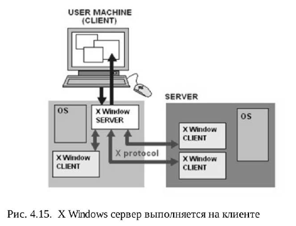

https://www.intuit.ru/studies/professional_skill_improvements/2023/courses/487/info

# Содержание

1. Архитектура, назначение и функции 4
операционных систем
2. Основные семейства операционных систем 66
3. Стандарты и лицензии на программное
обеспечение 102
4. Интерфейсы операционных систем 116
5. Организация вычислительного процесса 143
6. Управление памятью. Методы, алгоритмы и
средства 215
7. Подсистема ввода-вывода. Файловые системы 264
8. Основные события в истории семейства
UNIX/Linux 337
9. Первенство технологических достижений
двух основных версий UNIX 345

## Архитектура, назначение и функции операционных систем

Понятие операционной системы. Виртуальные машины. Операционнаясистема, среда и операционная оболочка. Эволюция операционныхсистем. Назначение, состав и функции ОС. Архитектура операционной системы. Классификация операционных систем. Эффективность итребования, предъявляемые к ОС. Совместимость и множественныеприкладные среды. Виртуальные машины как современный подход креализации множественных прикладных сред. Эффекты виртуализации

### <a href="https://www.intuit.ru/studies/professional_skill_improvements/2023/courses/487/lecture/11048" target="_blank">1.1. Понятие операционной системы. Виртуальные машины</a>

Компьютерпонимает только свой, машинный язык (назовем его **Я0**)

новые команды в совокупности формируют некоторый язык, которыйназовем **Я1**

Первый способ – замена каждой команды языка Я1 наэквивалентный набор команд в языке Я0. В этом случае компьютервыполняет новую программу, написанную на языке Я0, вместопрограммы, написанной на языке Я1. Эта технология называется **трансляцией**

Второй способ – написание программы на языке Я0, которая беретпрограммы, написанные на языке Я1, в качестве входных данных,рассматривает каждую команду по очереди и сразу выполняет эквивалентный набор команд языка Я0. Эта технология не требуетсоставления новой программы на Я0. Она называется интерпретацией,а программа, которая осуществляет **интерпретацию**, называется интерпретатором

В подобной ситуации проще представить себе существованиегипотетического компьютера или виртуальной машины, для котороймашинным языком является язык Я1, чем думать о трансляции иинтерпретации. Назовем такую виртуальную машину М1, авиртуальную машину с языком Я0 – М0. Для виртуальных машинможно будет писать программы, как будто они (машины) действительносуществуют.

Очевидно, можно пойти дальше – создать еще набор команд, который вбольшей степени ориентирован на человека и в меньшей степени накомпьютер, чем Я1. Этот набор формирует язык Я2 и, соответственно,виртуальную машину М2. Так можно продолжать до тех пор, пока недойдем до подходящего нам языка уровня n.

Большинство современных компьютеров состоит из двух и болееуровней. **Уровень 0** – аппаратное обеспечение машины. Электронныесхемы этого уровня выполняют программы, написанные на языке **уровня 1**. Следующий уровень – микроархитектурный уровень.

На этом уровне можно видеть совокупности 8 или 32 (иногда и больше)регистров, которые формируют локальную память и АЛУ (арифметико-логическое устройство). Регистры вместе с АЛУ формируют трактданных, по которому поступают данные. Основная операция этоготракта заключается в следующем. Выбирается один или два **регистра**,АЛУ производит над ними какую-то **операцию**, а результат помещаетсяв один из этих регистров. На некоторых машинах работа трактаконтролируется особой программой, которая называетсямикропрограммой. В других машинах такой контроль выполняетсяаппаратным обеспечением.

Следующий (**второй**) уровень составляет уровень архитектуры системыкоманд. Команды используют регистры и другие возможностиаппаратуры. Команды формируют уровень ISA (Instruction SetArchitecture), называемый машинным языком. Обычно машинный языксодержит от 50 до 300 команд, служащих преимущественно для перемещения данных по компьютеру, выполнения арифметическихопераций и сравнения величин.

Следующий (**третий**) уровень обычно – гибридный. Большинствокоманд в его языке есть также и на уровне архитектуры системы команд.У этого уровня есть некоторые дополнительные особенности: наборновых команд, другая организация памяти, способность выполнять двеи более программы одновременно и некоторые другие. С течениемвремени набор таких команд существенно расширился. В нем появилисьтак называемые макросы операционной системы или вызовысупервизора, называемые теперь системными вызовами.

Новые средства, появившиеся на **третьем уровне**, выполняютсяинтерпретатором, который работает на втором уровне. Этотинтерпретатор был когда-то назван операционной системой. Командытретьего уровня, идентичные командам второго уровня, выполняютсямикропрограммой или аппаратным обеспечением, но не операционнойсистемой. Иными словами, одна часть команд третьего уровняинтерпретируется операционной системой, а другая часть –микропрограммой. Вот почему этот уровень операционной системысчитается гибридным.

Операционная система была создана для того, чтобы автоматизироватьработу оператора и скрыть от пользователя сложности общения саппаратурой, предоставив ему более удобную систему команд. Нижниетри уровня (с нулевого по второй) конструируются не для того, чтобы сними работал обычный программист. Они изначально предназначеныдля работы интерпретаторов и трансляторов, поддерживающих болеевысокие уровни. Эти трансляторы и интерпретаторы составляютсясистемными программистами, которые специализируются наразработке и построении новых виртуальных машин.

Над операционной системой (ОС) расположены остальные системные
программы. Здесь находятся интерпретатор команд (оболочка),
компиляторы, редакторы и т.д. Подобные программы не являются
частью ОС (иногда оболочку пользователи считают операционной
системой). Под операционной системой обычно понимается то
программное обеспечение, которое запускается в режиме ядра или, как
еще его называют, режиме супервизора. Она защищена от вмешательства пользователя с помощью специальных аппаратных
средств.

**Четвертый** уровень представляет собой символическую qюрму одного
из языков низкого уровня ( обычно **ассемблер**). На этом уровне можно
писать программы в приемлемой для человека qюрме. Эти программы
сначала транслируются на язык уровня 1, 2 или 3, а затем
интерпретируются соответствующей виртуальной или факгически
существующей (физической) мalllliнoй.

Уровни с **пятого** и **выше** предназначены для прикладных
программистов, решающих конкретные задачи на языках высокого
уровня (С, С ++, С#, VВА и др.) . Компиляторы и редакторы этих
уровней запускаются в пользовательском режиме . На еще более высоких
уровнях располагаются прикладные программы пользователей.

Однако концепция, рассматривающзя операционную систему прежде
всего как **удобный интерфейс пользователя**, - это взгляд сверху вниз .
Альтернативный взгляд, снизу вверх, дает представление об
операционной системе как о механизме, присугствующем в компьютере
для **управления всеми компонентами** этой сложнейшей системы. В соотв етствии
заЮiючается в
с этим подходом работа операционной системы
обеспечении организованного и контролируемого
распределения процессоров, памяти, дисков, принтеров, устройств
ввода-вывода, датчиков времени и т.п. между различными
программами, конкурирующими за право их использовать.

### 1.2. Операционная система, среда и операционная оболочка

В конце 50-х годов проштюго века ведуrцие фирмы изготовители
поставляли операционные системы со следующими характеристиками:
* • пакетная обработка одного потока задач;
* • наличие стандартных программ ввода-вывода;
* • возможности автоматического перехода от программы к
программе;
* • средства восстановления после ошибок, обеспечивающие автоматическую "очистку" компьютера в случае аварийного
завершения очередной задачи и позволяющие запускать
следующую задачу при минимальном вмешательстве оператора;
* • языки управления заданиями, предоставляющие пользователям
возможность описывать свои задания и ресурсы, требуемые для
их выполнения.

Расположение операционной системы в иерархической структуре
программного и аппаратного обеспечения компьютера можно
представить, как показано на рис. 1.1.

* Самый нижний уровень содержит различные устройства компьютера,
состоящие из микросхем, проводников, источников питания,
электронно-лучевых трубок и т.п. Этот уровень можно разделить на
подуровни, например контроллеры устройств, а затем сами устройства.
Возможно деление и на большее число уровней. Выше расположен
микроархитектурный уровень, на котором физические устройства
рассматриваются как отдельные функциональные единицы.
* На микроархитектурном уровне находятся внутренние регистры
центрального процессора (их может быть несколько) и ариqметикологические
устройства со средствами управления ими. На этом уровне
реализуется выполнение машинных команд. В процессе выполнения
команд используются регистры процессора и устройств, а также другие
возможности аппаратуры. Команды, видимые для работающего на
ассемблере программиста, qюрмируют уровень ISA (Instruction Set
Aгcbltecture - архитектура системы команд), часто называемый
машинным языком.
* Операционная система предназначена для того, чтобы скрыть все эти
сложности. Конечный пользователь обычно не интересуется деталями
устройства аппаратного обеспечения компьютера. Компьютер ему
видится как набор приложений. Приложение может быть написано
программистом на каком-либо языке программирования. Для
упрощения этой работы программист использует набор системных
программ, некоторые из которых называются утилитами. С их помощью
реализуются часто используемые функции, которые помогают работать
с файлами, управлять устройствами ввода-вывода и т.п. Программист
применяет эти средства при разработке программ, а приложения во
время выполнения обращаются к утилитам для выполнения
определенных функций. Наиболее важной из системных программ
является операционная система, которая освобождает программиста от
необходимости глубокого знания устройства компьютера и представляет
ему У,Цобный интерфейс для его использования. Операционная система
выступает в роли посредника, облегчая программисту, пользователям и
программным приложениям доступ к различным службам и
возможностям компьютера [lQ].

### 1.3. Эволюция операционных систем

Одной из первых ОС, использующих эти новейlШlе решения, была
операционная система МСР (главная управляющая программа),
созданная фирмой Bшroughs для своих компьютеров В5000 в 1963 году.
В этой ОС были реализованы многие концепции и идеи, став1Ш1е
впоследствии стандартными для многих операционных систем:

* • мультипрограммирование;
* • мультипроцессорная обработка;
* • виртуальная память;
* • возможность отладки программ на исходном языке;
* • написание операционной системы на языке высокого уровня.

Одним из важнейll.IИХ событий в истории операционных систем
считается появление в 1964 году семейства компьютеров под названием
System'360 фирмы IВМ, а позже - System'370 [ll]. Это было первой в
мире реализацией концепции семейства программно и информационно
совместимых компьютеров, ставшей впоследствии стандартной для
всех фирм компьютерной отрасли .

Нужно отметить, что основной формой использования ЭВМ, как в
системах разделения времени, так и в системах пакетной обработки,
стал многотерминальный режим. При этом не только оператор, но и все
пользователи получали возможность формулировать свои задания и
управлять их выполнением со своего терминала. Поскольку
терминальные комплексы скоро стало возможным размещать на
значительных расстояниях от компьютера (благодаря модемным
телефонным соединениям), появились системы удаленного ввода
заданий и телеобработки данных. В ОС добавились модули,
реализующие **протоколы связи** [10, 13].

Важной вехой в истории мини-компьютеров и вообще в истории
операционных систем явилось создание ОС UNIX. Написал эту систему
Кен Томпсон (Ken Thompson), один из специалистов по компьютерам в
BELL Labs, работавший над проектом МИПСS. Собственно, его **UNIX**
 это усеченная однопользовательская версия системы MULПCS.
Первоначальное название этой системы - UNICS (UNiplexed lnformation
and Computing Service - примитивная информационная и компьютерная
служба). Так в шутку была названа эта система, поскольку MULTICS
(MUL1iplexed Information and Computing Service) - мультиплексная
информационная и компьютерная служба. С середины 70-х годов
началось массовое использование ОС UNIX, написанной на 90% на
языке С. lllиpoкoe распространение С-компиляторов сделало UNIX
уникальной переносимой ОС, а поскольку она поставлялась вместе с
исходными кодами, она стала первой открытой операционной
системой. Гибкость, элегантность, мощные функциональные
возможности и открытость позволили ей занять прочные позиции во
всех классах компьютеров - от персональных до супер-ЭВМ.

Дальнейшее развитие сетевых систем со стеком протоколов **TCP/IP**: в
1983 году он был принят МО CIIIA в качестве стандарта и использован
в сети ARPANEТ. В этом же году ARPANET разделилась на MILNET (для
17
Назаров С.В ., Широков А.И. Современные операционные с1ктемы
военного ведомства CIIIA) и новую ARPANET, которую стали называть
Intemet.

Еще одним знаменательным событием для истории операционных
систем было появление в начале 80-х годов персональных
компьютеров . Они послужили мощным толчком для распределения
локальных сетей, в результате поддержка сетевых функций стала для ОС
ПК необходимым условием. Однако и дружественный интер~йс, и
сетевые функции появились у ОС ПК не сразу [13].

Наиболее популярной версией ОС раннего этапа развития
персональных компьютеров была **MS-DOS** компании Мicrosoft -
однопрограммная, однопользовательская ОС с интер~йсом командной
строки. Многие функции, обеспечивающие удобство работы
пользователю, в этой ОС предоставлялись дополнительными
программами - оболочкой N orton Cornmander, РС Too1s и др. Наибольшее
влияние на развитие программного обеспечения ПК оказала
операционная среда Wmdows, первая версия которой появилась в 1985
году. Сетевые функции также реализовались с помощью сетевых
оболочек и появились в MS-DOS версии 3.1. В это же время появились
сетевые продукты Мicrosoft - MS-NET, а позже - LAN Manager, Windows
for Woгkgroup, а затем и Windows NТ.

Другим пугем попиа компания N ovell: ее продукг **NetWare** -
операционная система со встроенными сетевыми функциями. ОС
NetWare распространялась как операционная система для центральн ого
сервера локальной сети и за счет специализации функций файл-сервера
обеспечивала высокую скорость удаленного доступа к файлам и
повышенную безопасность данных. Одн ако эта ОС имела
специф,lческий программный интер~йс (API), что затрудняло
разработку приложений.

В 1987 году появилась первая **многозадачная ОС для ПК - OS/2**,
разработанная Мicrosoft совместно с IВМ. Эта была хорошо
продуманная система с виртуальной памятью, граф,lческим интер~йсом и возможностью выполнять DОS-приложения. Для нее
были созданы и получили распространение сетевые оболочки LAN
Manager (Мicrosoft:) и LAN Seiver (IВМ). Эти оболочки уступали по
производительности файловому серверу N etWare и потребляли больше
аппаратных ресурсов, но имели важные достоинства. Они позволяли
выполнять на сервере любые программы, разработанные для OS/2, MSDOS
и Windows, кроме того, можно было использовать компьютер, на
котором они работали, в качестве рабочей станции. Неудачная
рыночная судьба OS/2 не позволила системам LAN-Manager и LANSeiver
захватить заметную долю рынка, но принципы работы этих
сетевых систем во многом нашли свое воплощение в ОС 90-х годов -
MS Windows NТ.

### 1.4. Назначение состав и функции ОС 20

#### Назначение операционных систем
 можно разделить на четыре основные
составляющие [5, 10, 13.].

##### 1. Организация (обеспечение) удобного интерфейса между
приложениями и пользователями, с одной стороны, и аппаратурой
компьютера - с другой.

   1. **Разработка программ**: 
   ОС представляет программисту
разнообразные инструменты разработки приложений: редакторы,
отладчики и т.п .
    2. **Исполнение программ**. Для запуска программы нужно выполнить
ряд действий: загрузить в основную память программу и данные,инициализировать устройства ввода-вывода и файлы,
подготовить другие ресурсы. ОС выполняет всю эту рутинную
работу вместо пользователя.
    3. **Доступ к устройствам ввода-вывода**. Для управления каждым
устройством используется свой набор команд. ОС предоставляет
пользователю единообразный интерфейс, который скрывает все
эти детали и обеспечивает программисту доступ к устройствам
ввода-вывода с помощью простых команд чтения и записи .
    4. **Контролируемый доступ к файлам**. При работе с файлами
управление со стороны ОС предполагает не только глубокий учет
природы устройства ввода-вывода, но и знание структур данных,
записанных в файлах. Многопользовательские ОС, кроме того,
обеспечивают механизм защиты при обращении к файлам.
    5. **Системный доступ** . ОС управляет доступом к совместно
используемой или общедоступной вычислительной системе в
целом, а также к отдельным системным ресурсам. Она
обеспечивает защиту ресурсов и данных от
несанкционированного использования и разрешает конфликтные
ситуации.
    6. **Обнаружение ошибок и их обработка**. При работе компьютерной
системы могут происходить разнообразные сбои за счет
внутренних и внешних ошибок в аппаратном обеспечении,
различного рода программных ошибок (переполнение, попытка
обращения к ячейке памяти, доступ к которой запрещен и др.). В
каждом случае ОС выполняет действия, минимизирующие
влияние ошибки на работу приложения (от простого сообщения
об ошибке до аварийной остановки программы).
    7. **Учет использования ресурсов**. Хорошая ОС имеет средства учета
использования различных ресурсов и отображения параметров
производительности вычислительной системы. Эта информация
важна для настройки (оптимизации) вычислительной системы с
целью повышения ее производительности.

В результате реальная машина, способная выполнить только небольшой
набор элементарных действий (машинных команд), с помощью
операционной системы превращается в виртуальную машину,
выполняющую широкий набор гораздо более мощных фующий.
Виртуальная машина тоже управляется командами, но уже командами
более высокого уровня, например: удалить файл с определенным
именем, запустить на выполнение прикладную программу, повысить
приоритет задачи, вывести текст файла на печать и т.д. Таким образом,
назначение ОС состоит в предоставлении пользователю
(программисту) некоторой **расширенной виртуальной машины**, которую
легче программировать и с которой легче работать, чем
непосредственно с аппаратурой, составляющей реальный компьютер,
систему или сеть.

##### 2. Организация эффективного использования ресурсов компьютера. ОС
не только представляет пользователям и программистам удобный
интерфейс к аппаратным средствам компьютера, но и является
своеобразным диспетчером ресурсов компьютера.

> В отличие от программы, которая является статическим
объектом, выполняемая программа - это динамический объект, он
называется процессом и является базовым понятием современных ОС.

###### Управление ресурсами 
включает решение ряда общих, не зависящих от
типа ресурса задач:

1. планирование ресурса - определение, какому процессу, когда и в
каком качестве (если ресурс может выделяться частями) следует
выделить данный ресурс;
2. удовлетворение запросов на ресурсы - выделение ресурса
процессам;
3. отслеживание состояния и учет использования ресурса
поддержание оперативной инqюрмации о занятости ресурса и
распределенной его доли;
4. разрешение конфликтов между процессами, претендующими на
один и тот же ресурс.

##### 3. Облегчение процессов эксплуатации аппаратных и программных
средств вычислительной системы. Ряд операционных систем имеет в
своем составе наборы служебных программ, обеспечивающие
резервное копирование, архивацию данных, проверку, очистку и
де@аrментацию дисковых устройств и др.
Кроме того, современные ОС имеют достаточно большой набор
средств и способов диагностики и восстановления работоспособности
системы . Сюда относятся:

* • диагностические программы для выявления ошибок в
конфигурации ОС;
* • средства восстановления последней работоспособной
конфигурации;
* • средства восстановления поврежденных и пропавших системных
файлов и др.

##### 4. Возможность развития. Современные ОС организуются таким
образом, что допускают эwктивную разработку, тестирование и
внедрение новых системных функций, не прерывая процесса
нормального функционирования вычислительной системы.
Больпrn:нство операционных систем постоянно развиваются (нагляден
пример Windows). Происходит это в силу следующих причин.

###### 1. Обновление 
и возникновение новых видов аппаратного
обеспечения. Например, ранние версии ОС UNIX и OS/2 не
использовали механизмы страничной организации памяти (что
это такое, мы рассмотрим позже), потому, что они работали на
мапrn:нах, не обеспеченных соответствующими аппаратными
средствами.
###### 2. Новые сервисы. 
Для удовлетворения пользователей или нужд
системных администраторов ОС должны постоянно
предоставлять новые возможности. Например, может
потребоваться добавить новые инструменты для контроля или
оценки производительности, новые средства ввода-вывода
данных (речевой ввод). Другой пример - поддержка новых
приложений, использующих окна на экране дисплея.
###### 3. Исправления. 
В каждой ОС есть опrn:бки. Время от времени они
обнаруживаются и исправляются. Отсюда постоянные появления
новых версий и редакций ОС. Необходимость регулярных
изменений накладывает определенные требования на
организацию операционных систем. Очевидно, что эти системы
(как, впрочем, и другие сложные программы системы) должны
иметь модульную структуру с четко определенными
межмодульными связями (интерфейсами). Важную роль играет
хорошая и полная документированность системы.

###### Управление процессами.
Подсистема управления процессами
непосредственно влияет на фующионирование вычислительной
системы. Для каждой выполняемой программы ОС организует один
или более процессов. Каждый такой процесс представляется в ОС
информационной структурой (таблицей, дескриптором, контекстом
процессора), содержащей данные о потребностях процесса в ресурсах, а
также о фактически выделенных ему ресурсах (область оперативной
памяти, количество процессорного времени, файлы, устройства вводавывода
и др.). Кроме того, в этой информационной структуре хранятся
данные, характеризующие историю пребывания процесса в системе:
текущее состояние (активное или заблокированное), приоритет,
состояние регистров, программного счетчика и др.

В современных мультипрограммных ОС может существовать
одновременно несколько процессов, порожденных по инициативе
пользователей и их приложений, а также инициированных ОС для
выполнения своих функций (системные процессы). Поскольку
процессы могуг одновременно претендовать на одни и те же ресурсы,
подсистема управления процессами планирует очередность
выполнения процессов, обеспечивает их необходимыми ресурсами,
обеспечивает взаимодействие и синхронизацию процессов.

###### Управление памятью.
Подсистема управления памятью производит
распределение физической памяти между всеми существующими в
системе процессами, загрузку и удаление программных кодов и данных
процессов в отведенные им области памяти, настройку адреснозависимых
частей кодов процесса на физические адреса выделенной
области, а также защиту областей памяти каждого процесса. Стратегия
управления памятью складывается из стратегий выборки , размещения и
замещения блока программы или данных в основной памяти .
Соответственно используются различные алгоритмы, определяющие,
когда загрузить очередной блок в память (по запросу или с
упреждением), в какое место памяти его поместить и какой блок программы или данных удалить из основной памяти, чтобы освободить
место для размещения новых блоков.
Одним из наиболее популярных способов управления памятью в
современных ОС является виртуальная память. Реализация механизма
виртуальной памяти позволяет программисту считать, что в его
распоряжении имеется однородная оперативная память, объем которой
ограничивается только возможностями адресации, предоставляемыми
системой программирования.

###### защита памяти.
Важная функция управления памятью - защита памяти. Нарушения
защиты памяти связаны с обращениями процессов к участкам памяти,
выделенной другим процессам прикладных программ или программ
самой ОС. Средства защиты памяти должны пресекать такие попытки
доступа путем аварийного завершения программы-нарушителя.

###### Управление файлами.
Функции управления файлами сосредоточены в
файловой системе ОС. Операционная система виртуализирует
отдельный набор данных, хранящихся на внеumем накопителе, в виде
файла - простой неструктурированной последовательности байтов ,
имеющих символьное имя. Для удобства работы с данными файлы
группируются в каталоги, которые, в свою очередь, образуют группы -
каталоги более высокого уровня. Файловая система преобразует
символьные имена файлов, с которыми работает пользователь или
программист, в физические адреса данных на дисках, организует
совместный доступ к файлам, защищает их от несанкционированного
доступа.

###### Управление внеumими устройствами.
Функции управления внеumими
устройствами возлагаются на подсистему управления внеumими
устройствами, называемую также подсистемой ввода-вывода. Она
является интер~йсом между ядром компьютера и всеми
подключенными к нему устройствами. Спектр этих устройств очень
обширен (принтеры, сканеры, мониторы, модемы, манипуляторы,
сетевые адаптеры, АЦП разного рода и др.), сотни моделей этих
устройств отличаются набором и последовательностью команд,
используемых для обмена информацией с процессором и другими
деталями.

Программа, управляющая конкретной моделью внеumего устройства и учитывающая все его особенности, называется **драйвером**. Наличие
большого количества подходящих драйверов во многом определяет
успех ОС на рынке. Созданием драйверов занимаются как разработчики
ОС, так и компании, выпускающие внешние устройства. ОС должна
поддерживать четко определенный интерфейс между драйверами и
остальными частями ОС. Тогда разработчики компанийпроизводителей
устройств ввода-вывода могуг поставлять вместе со
своими устройствами драйверы для конкретной операционной
системы.

###### Защита данных и администрирование. 
Безопасность данных
вычислительной системы обеспечивается средствами
отказоустойчивости ОС, направленными на защиту от сбоев и отказов
аппаратуры и ошибок программного обеспечения, а также средствами
защиты от несанкционированного доступа. Для каждого пользователя
системы обязательна процедура логического входа, в процессе которой
ОС убеждается, что в систему входит пользователь, разрешенный
административной службой. Администратор вычислительной системы
определяет и ограничивает возможности пользователей в выполнении
тех или иных действий, т.е. определяет их права по обращению и
использованию ресурсов системы.

###### Пользовательский интерфейс.
ОС обеспечивает w:r;обный интерфейс не
только для прикладных программ, но и для пользователя
(программиста, администратора). В ранних ОС интерфейс сводился к
языку управления заданиями и не требовал терминала. Команды языка
управления заданиями набивались на перфокарты, а результаты
выполнения задания выводились на печатающее устройство.

###### Shell 
Вычислительные системы,
например UNIХ-системы,
управляемые из командной строки,
имеют командный интерпретатор, называемый оболочкой (Shell). Она, собственно, не входит в состав ОС,
но пользуется многими фующиями операционной системы . Когда
какой-либо пользователь входит в систему, запускается оболочка.
Стандартным терминалом для нее является монитор с клавиатурой.
Оболочка начинает работу с печати приглашения (prompt) - знака
доллара (или иного знака), говорящего пользователю, что оболочка
ожидает ввода команды (аналогично управляется MS-DOS). Если
теперь пользователь напечатает какую-либо команду, оболочка создает
системный вызов и ОС выполнит эту команду. После завершения
оболочка опять печатает приглашение и пытается прочесть следующую
входную строку.
Ввод команд может быть упрощен, если операционная система
поддерживает графический пользовательский интерфейс. В этом случае
пользователь выбирает на экране нужный пункт меню или графический
символ (так это происходит, например, в ОС Windows).

### 1.5. Архитектура операционной системы 27

> Под архитектурой операционной системы понимают структурную и
функциональную организацию ОС на основе некоторой совокупности
программных модулей. В состав ОС входят исполняемые и объектные
модули стандартных для данной ОС форматов , программные модули
специального формата (например, загрузчик ОС, драйверы вводавывода),
конф,tгурационные файлы, файлы документации, модули
справочной системы и т.д.

Большинство современных ОС представляют собой хорошо
структурированные мо,цульные системы, способные к развитию,
расширению и переносу на новые платформы. Какой-либо единой
унифщированной архитектуры ОС не существует, но известны
универсальные подходы к структурированию ОС. Принципиально
важными универсальными подходами к разработке архитектуры ОС
являются[~, 10, 13, 17]:

#### универсальными подходами к разработке архитектуры ОС

* • модульная организация;
* • функциональная избыточность;
* • функциональная избирательность;
* • параметрическая универсальность;
* • концепция многоуровневой иерархической вычислительной
системы, по которой ОС представляется многослойной
структурой;
* • разделение модулей на две группы по функциям: ядро - мо,цули,
выполняющие основные функции ОС, и модули, выполняющие
вспомогательные функции ОС;
* • разделение модулей ОС на две группы по размещению в памяти
вычислительной системы: резидентные, постоянно находящиеся в
оперативной памяти, и транзитные, загружаемые в оперативную
память только на время выполнения своих функций;
* • реализация двух режимов работы вычислительной системы:
привилегированного режима (режима ядра - Kemel пюdе), или
режима супервизора (supervisor пюdе), и пользовательского
режима (user пюdе), или режима задачи (task пюdе);
* • ограничение функций ядра (а следовательно, и количества
модулей ядра) до минимального количества необходимых самых
важных функций.

#### монолитные системы

Для построения монолитной системы необходимо скомпилировать все
отдельные процедуры, а затем связать их вместе в единый объектный
файл с помощью компоновщика (примерами могут служить ранние
версии ядра UNIX или Novell NetWare). Каждая процедура видит любую
другую процедуру (в отличие от структуры, содержащей модули, в
которой большая часть информации является локальной для модуля, и
процедуры модуля можно вызвать только через специально
определенные точки входа) .

Такая организация ОС предполагает следующую структуру [13]:
* • главная программа, которая вызывает требуемые сервисные
процедуры;
* • набор сервисных процедур, реализующих системные вызовы;
* • набор утилит, обслуживающих сервисные процедуры.

#### Классической считается
архитектура ОС, основанная на концепции
иерархической многоуровневой машины, привилегированном ядре и
пользовательском режиме работы транзитных модулей. Модули ядра
выполняют базовые функции ОС: управление процессами, памятью,
устройствами ввода-вывода и т.п . Ядро составляет сердцевину ОС, без
которой она является полностью неработоспособной и не может
выполнить ни одну из своих функций. В ядре решаются
внутрисистемные задачи организации вычислительного процесса,
недоступные для приложения.

#### прикладную программную среду

Особый класс функций ядра служит для поддержки приложений,
создавая для них так называемую прикладную программную среду.
Приложения могут обращаться к ядру с запросами - системными
вызовами - для выполнения тех или иных действий, например,
открытие и чтение файла, получение системного времени, вывода
инф:>рмации на дисплей и т.д. Функции ядра, которые могут
вызываться приложениями, образуют интерфейс прикладного
программирования - API (Application Programning Interface).
#### Kernel mode
Для обеспечения высокой скорости работы ОС модули ядра (п о крайней
мере, большая их часть) являются резидентными и работают в
привилегированном режиме (Kernel nюde). Этот режим, 
* во-первых,
должен обезопасить работу самой ОС от вмешательства приложений, и, 
* во-вторых, должен обеспечить возможность работы модулей ядра с
полным набором машинных инструкций, позволяющих собственно
ядру выполнять управление ресурсами компьютера, в частности,
переключение процессора с задачи на задачу, управлением
устройствами ввода-вывода, распределением и защитой памяти и др.

#### Вспомогательные модули
обычно подразделяются на группы:
* • угилиты программы, выполняющие отдельные задачи
управления и сопровождения вычислительной системы;
* • системные обрабатывающие программы текстовые и
графические редакторы (Pamt, Imaging в Windows 2000),
компиляторы и др.;
* • программы предоставления пользователю дополнительных услуг
( специальный вариант пользовательского интерфейса,
калькулятор, игры, средства мультимедиа Windows 2000);
* • библиотеки процедур различного назначения, упрощения
разработки приложений, например, библиотека функций вводавывода,
библиотека математических функций и т.п.

#### User mode

Эти модули ОС оформляются как обычные приложения, обращаются к
функциям ядра посредством системных вызовов и выполняются в
пользовательском режиме (нser пюdе). В этом режиме запрещается
выполнение некоторых команд, которые связаны с функциями ядра ОС
(управление ресурсами, распределение и защита памяти и т.п.).

#### В концепции многоуровневой (многослойной) иерархической машины
структура ОС также представляется рядом слоев. При такой
организации каждый слой обслуживает вышележащий слой, выполняя
для него некоторый набор функций, которые образуют межслойный
интерфейс . На основе этих функций следующий верхний по иерархии
слой строит свои функции - более сложные и более мощные и т.д. Такая
организация системы существенно упрощает ее разработку, т.к.
позволяет сначала "сверху вниз" определить функции слоев и межслойные интер~йсы, а при детальной реализации, двигаясь "снизу
вверх", - наращивать мощность функции слоев. Кроме того, модули
каждого слоя можно изменять без необходимости изменений в других
слоях (но не меняя межслойных интер~йсов!).

Многослойная структура ядра ОС может быть представлена, например,
вариантом, показанным на рис. 1.4.

##### 1. Средства аппаратной поддержки ОС.
Значительная часть функций
ОС может выполняться аппаратными средствами [1.Q]. Чисто
программные ОС сейчас не существуют. Как правило, в
современных системах всегда есть средства аппаратной
поддержки ОС, которые прямо участвуют в организации
вычислительных процессов. К ним относятся: система
прерываний, средства поддержки привилегированного режима,
средства поддержки виртуальной памяти, системный таймер средства переключения контексrов процессов (инф:>рмация о
состоянии процесса в момент его приостановки), средства
защиты памяти и др.
##### 2. Машинно-зависимые модули ОС.
Этот слой образует модули, в
которых отражается специфика аппаратной платф:>рмы
компьютера. Назначение этого слоя "экранирование"
вышележащих слоев ОС от особенносrей аппаратуры (например,
Windows 2000 - это слой НАL (Hardwaгe Abstгaction Lауег), уровень
аппаратных абстракций).
##### 3. Базовые механизмы ядра .
Этот слой модулей выполняет наиболее
примитивные операции ядра: программное переключение
контекстов процессов, диспетчерскую прерываний, перемещение
страниц между основной памятью и диском и т.п. Модули этого
слоя не принимают решений о распределении ресурсов, а только
обрабатывают решения, принятые модулями вышележащих
уровней. Поэтому их часто называют исполнительными
механизмами для модулей верхних слоев ОС.
##### 4. Менеджеры ресурсов .
Модули этого слоя выполняют
стратегические задачи по управлению ресурсами вычислительной
системы. Это менеджеры (диспетчеры) процессов ввода-вывода,
оперативной памяти и файловой системы. Каждый менеджер
ведет учет свободных и используемых ресурсов и планирует их
распределение в соответствии запросами приложений.
##### 5. Интерфейс системных вызовов . 
Это верхний слой ядра ОС,
взаимодействующий с приложениями и системными утилитами,
он образует прикладной программный интерфейс ОС. Функции
API, обслуживающие системные вызовы, предоставляют доступ к
ресурсам системы в у,цобной компактной ф:>рме, без указания
деталей их физического расположения.
##### привилегированный режим
Повышение устойчивости ОС обеспечивается переходом ядра в
привилегированный режим. При этом происходит некоторое
замедление выполнения системных вызовов. Системный вызов
привилегированного ядра инициирует переключение процессора из
пользовательского режима в привилегированный, а при возврате к
приложению - обратное переключение. За счет этого возникает
дополнительная задержка в обработке системного вызова (рис. 1.5).
Однако такое решение стало классическим и используется во многих ОС
(UNIX, VAX, VМS, IВМ OS/390, OS/2 и др.).

##### не лишена своих проблем

Многослойная классическая многоуровневая архитекгура ОС не лишена
своих проблем. Дело в том, что значительные изменения одного из
уровней могуr иметь трудно предвидимое влияние на смежные уровни.
Кроме того, многочисленные взаимодействия меж,цу соседними
уровнями усложняют обеспечение безопасности. Поэтому, как
альтернатива классическому варианту архитекгуры ОС, часто
используется микроядерная архитекгура ОС.

#### микроядерная архитекгура ОС

Суть этой архитекгуры состоит в следующем. В привилегированном
режиме остается работать только очень небольшая часть ОС,
называемая микроядром. Микроядро защищено от остальных частей ОС
и приложений. В его состав входят машинно-зависимые модули, а также
модули, выполняющие базовые механизмы обычного ядра. Все
остальные более высокоуровневые функции ядра оформляются как
модули, работающие в пользовательском режиме. Так, менеджеры
ресурсов, являющиеся неотъемлемой частью обычного ядра, становятся
"периферийными" модулями, работающими в пользовательском режиме.
Таким образом, в архитекгуре с микроядром традиционное
расположение уровней по вертикали заменяется горизонтальным. Это
можно представить, как показано на рис. 1.6.

Внешние по отношению к микроядру компоненты ОС реализуются как
обслуживающие процессы. Между собой они взаимодействуют как
равноправные партнеры с помощью обмена сообщениями, которые
передаются через микроядро. Поскольку назначением этих компонентов
ОС является обслуживание запросов приложений пользователей,
уrилит и системных обрабатывающих программ, менеджеры ресурсов,
вынесенные в пользовательский режим, называются серверами ОС, т.е.
модулями, основным назначением которых является обслуживание
запросов локальных приложений и других модулей ОС.

 

##### 4t

Схема смены режимов при выполнении системного вызова в ОС с
микроядерной архитектурой выглядит, как показано на рис. 1.8. Из
рисунка ясно, что выполнение системного вызова сопровождается
четырьмя переЮiючениями режимов (4 t), в то время как в Юiассической
архитектуре - двумя. Следовательно, производительность ОС с
микроядерной архитектурой при прочих равных условиях будет ниже,
чем у ОС с Юiассическим ядром.

##### достоинства микроядерной архитектуры

В то же время признаны следующие достоинства микроядерной
архитектуры [17]:
* • единообразные интерфейсы;
* • простота расп.mряемости;
* • высокая гибкость;
* • возможность переносимости;
* • высокая надежность;
* • поддержка распределенных систем;
* • поддержка объектно-ориентированных ОС.

Для возможности представления о размерах микроядер операционных
систем в ряде источников [lZ] приводятся такие данные:
* • типичное микроядро первого поколения - 300 Кбайт кода и 140
интерфейсов системных вызовов;
* • микроядро ОС L4 (второе поколение) - 12 Кбайт кода и 7
интерфейсов системных вызовов.

В современных операционных системах различают следующие виды
ядер.
##### 1. Наноядро (НЯ). Крайне упрощённое и минимальное ядро,
выполняет лишь одну задачу обработку аппаратных
прерываний, генерируемых устройствами компьютера. После
обработки посылает информацию о результатах обработки
вышележащему программному обеспечению. НЯ используются
для виртуализации аппаратного обеспечения реальных
компьютеров или для реализации механизма гипервизора.

##### 2. Микроядро (МЯ) 
предоставляет только элементарные функции
управления процессами и минимальный набор абстракций для
работы с оборудованием. Большая часть работы осуществляется с
помощью специальных пользовательских процессов, называемых
сервисами. В микроядерной операционной системе можно, не
прерывая ее работы, загружать и выгружать новые драйверы,
файловые системы и т. д. Микроядерными являются ядра ОС
Mirux и GNU Hurd и ядро систем семейства BSD. Классическим
примером микроядерной системы является Symblan OS. Это
пример распространенной и отработанной микроядерной (а
начиная с версии Symblan OS v8.1, и наноядерной) операционной
системы.

##### 3. Экзоядро (ЭЯ)
предоставляет лишь набор сервисов для
взаимодействия между приложениями, а таюке необходимый
минимум функций, связанных с защитой: выделение и
высвобождение ресурсов, контроль прав доступа и т. д. ЭЯ не
занимается предоставлением абстракций для физических ресурсов
- эти функции выносятся в библиотеку пользовательского уровня
(так называемую liЬOS). В отличие от микроядра ОС,
базирующиеся на ЭЯ, обеспечивают большую эффективность за
счет отсутствия необходимости в переключении между
процессами при каждом обращении к оборудованию.

##### 4. Монолитное ядро (МнЯ)
предоставляет пшрокий набор
абстракций оборудования. Все части ядра работают в одном
адресном пространстве. МнЯ требуют перекомпиляции при
изменении состава оборудования. Компоненты операционной
системы являются не самостоятельными модулями, а составными
частями одной программы. МнЯ более производительно, чем
микроядро, поскольку работает как один большой процесс. МнЯ
является больпшнство Umх-систем и Linux. Монолитность ядер
усложняет отладку, понимание кода ядра, добавление новых
функций и возможностей , удаление ненужного, унаследованного
от предыдущих версий кода. "Разбухание" кода монолитных ядер
таюке повышает требования к объёму оперативной памяти.

##### 5. Модульное ядро (Мод. Я)
- современная, усовершенствованная
модификация архитектуры МЯ. В отличие от "классических" МнЯ,
модульные ядра не требуют полной перекомпиляции ядра при
изменении состава аппаратного обеспечения компьютера. Вместо
этого они предоставляют тот или иной механизм подгрузки
модулей, поддерживающих то или иное аппаратное обеспечение
(например, драйверов). Подгрузка модулей может быть как
динамической, так и статической (при перезагрузке ОС после
переконфигурирования системы). Мод. Я удобнее для разработки,
чем традиционные монолитные ядра. Они предоставляют
программный интерфейс (API) для связывания модулей с ядром,
для обеспечения динамической подгрузки и выгрузки модулей. Не
все части ядра могуr быть сделаны модулями. Некоторые части
ядра всегда обязаны присуrствовать в оперативной памяти и
должны быть жёстко ''вllillты" в ядро.

##### 6. Гибридное ядро (ГЯ)
модифицированные микроядра,
позволяющие для ускорения работы запускать "несущественные"
части в пространстве ядра. Имеют "гибридные" достоинства и
недостатки. Примером смешанного подхода может служить['pl]
возможность запуска операционной системы с монолитным
ядром под управлением микроядра. Так устроены 4.4BSD и
MkLinux, основанные на микроядре Mach. Микроядро
обеспечивает управление виртуальной памятью и работу
низкоуровневых драйверов. Все остальные функции , в том числе
взаимодействие с прикладными программами, осуществляются
монолитным ядром. Данный подход сформировался в результате
попыток использовать преимущества микроядерной архитектуры,
сохраняя по возможности хорошо отлаженный код монолитного
ядра.

##### 7.Windows NТ
Наиболее тесно элементы микроядерной архитектуры и элементы
монолитного ядра переплетены в ядре Windows NТ. Хотя Windows
NT часто называют микроядерной операционной системой , это
не совсем так. Микроядро NT слишком велико (более 1 Мбайт),
чтобы носить приставку ''микро". Компоненты ядра Windows NT
располагаются в вытесняемой памяти и взаимодействуют друг с
другом пуrем передачи сообщений, как и положено в
микроядерных операционных системах. В то же время все
компоненты ядра работают в одном адресном пространстве и
активно используют общие структуры данных, что свойственно
операционным системам с монолитным ядром .

### 1.6. Классификация операционных систем 42

Все многообразие существующих (и ныне не использующихся) ОС
можно классифицировать по множеству различных признаков .
Остановимся на основных классификационных признаках.

#### 1. По назначению ОС 
делятся на универсальные и
специализированные. Специализированные ОС, как правило,
работают с фиксированным набором программ (функциональных
задач). Применение таких систем обусловлено невозможностью
использования универсальной ОС по соображениям
эффективности, надежности, защищенности и т.п., а также
вследствие специфики решаемых задач [10].
Универсальные ОС рассчитаны на решение любых задач
пользователей, но, как правило, форма эксплуатации
вычислительной системы может предъявлять особые требования
к ОС, т.е. к элементам ее специализации.
#### 2. По способу загрузки
можно выделить загружаемые ОС
(большинство) и системы, постоянно находящиеся в памяти
вычислительной системы. Последние, как правило,
специализированные и используются для управления работой
специализированных устройств (например, в БЦВМ
баллистической ракеты или спутника, научных приборах,
автоматических устройствах различного назначения и др.).
#### 3. По особенностям алгоритмов управления ресурсами.
Главным
ресурсом системы является процессор, поэтому дадим
классификацию по алгоритмам управления процессором, хотя
можно, конечно, классифицировать ОС по алгоритмам
управления памятью, устройствами ввода-вывода и.т.д.
##### Поддержка многозадачности (многопрограммности). 
По
числу одновременно выполняемых задач ОС делятся на 2
класса: однопрограммные (однозадачные) - например, MSDOS,
MSX, и многопрограммные (многозадачные) -
например, ОС ЕС ЭВМ, OS/360, OS/2, UNIX, Windows
разных версий.

##### Поддержка многопользовательского режима.
По числу
одновременно работающих пользователей ОС делятся: на
однопользовательские (MS-DOS, Wmdows Зх, ранние версии
OS/2) и многопользовательские (UNIX, Wmdows
NT/2000/2003/XPMsta).
Главное отличие многопользовательских систем от
однопользовательских наличие средств защиты
информации каждого пользователя от
несанкционированного доступа других пользователей.
Следует заметить, что может быть однопользовательская
мупьтипрограммная система.

#####  Виды многопрограммной работы. 
Специфику ОС во многом
определяет способ распределения времени между
несколькими одновременно существующими в системе
процессами (или потоками). По этому признаку можно
выделить 2 группы алгоритмов: 
###### не вытесняющ~я многопрограммность 
(WmdowsЗ.x, NetWare) и 
###### вытесняющ~я
многопрограммность 
(Wmdows 2000/2003/ХР, OS/2, Unix).
В первом случае активный процесс выполняется до тех пор,
пока он сам не отдает управление операционной системе.
Во втором случае решение о переключении процессов
принимает операционная система. Возможен и такой режим
многопрограммности, когда ОС разделяет процессорное
время между отдельными ветвями (потоками, волокнами)
одного процесса.

##### Многопроцессорная обработка. 
Важное свойство ОС -
отсутствие или наличие средств поддержки
многопроцессорной обработки. По этому признаку можно выделить ОС без поддержки мультипроцессирования
(Windows З.х, Wmdows 95) и с поддержкой
мультипроцессирования (Solaris, OS/2, UNIX, Windows
NT/2000/2003/XP).

Многопроцессорные ОС классифицируются по способу
организации вычислительного процесса на 
###### асимметричные ОС
(выполняются на одном процессоре, распределяя
прикладные задачи по остальным процессорам) и
###### симметричные ОС
(децентрализованная система).

#### 4. По области использования и форме эксплуатации. Обычно здесь
выделяют три типа в соответствии с использованными при их
разработке критериями эwктивности:
##### системы пакетной обработки (OS/360, ОС ЕС);
Первые предназначались для решения задач в основном
вычислительного характера, не требующих быстрого получения
результатов. Критерий создания таких ОС - максимальная
пропуская способность при хорошей загрузке всех ресурсов
компьютера. В таких системах пользователь отстранен от
компьютера.
##### системы разделения времени (UNIX, VМS);
Системы разделения времени обеспечивают У,Цобство и
эwктивность работы пользователя, который имеет терминал и
может вести диалог со своей программой.
##### системы реального времени (QNX, RT/11).
Системы реального времени предназначены для управления
техническими объектами ( станок, спутник, технологический
процесс, например доменный и т. п.), где существует предельное
время на выполнение программ, управляющих объектом.

#### 5. По аппаратной платформе 
(типу вычислительной техники), для
которой они предназначаются, операционные системы делят на
следующие группы.
#####  Операционные системы для смарт-карт.
Некоторые из них
могут управлять только одной операцией, например,
электронным платежом. Некоторые смарт- карты являются
JАVА-ориентированным и содержат интерпретатор
виртуальной мапшны JAVA. Апплеты JAVA загружаются на
карту и выполняются JVМ-интерпретатором. Некоторые из
таких карт могуг одновременно управлять несколькими
апплетами JAVA, что приводит к многозадачности и
необходимости планирования.
##### Встроенные операционные системы .
Управляют
карманными компьютерами (liahn OS, Windows СЕ -
Consumer Electronics - бытовая техника), мобильными
телефонами, телевизорами, микроволновыми печами и т.п .
##### Операционные системы для персональных компьютеров,
например, Wmdows 9.х, Windows ХР, Linux, Мае OSX и др .

##### Операционные системы мини-ЭВМ,
например, RГ-11 для
PDP-11 - 
###### ОС реального времени, RSX-11 М для PDP-11 -
###### ОС разделения времени, UNIX для PDP-7.
##### Операционные системы мэйнфреймов (больпшх мапшн),
например, OS/390, происходящая от OS/360 (IBM). Обычно
ОС мэйнфреймов предполагает одновременно три вида
обслуживания: 
###### пакетную обработку, 
###### обработку транзакций
(например, работа с БД, бронирование авиабилетов,
процесс работы в банках) и
###### разделение времени.

##### Серверные операционные системы,
например, UNIX,
Wmdows 2000, Linux. Область применения ЛВС,
региональные сети, Intranet, Internet.

##### Кластерные операционные системы.
Кластер 
###### слабо связанная совокупность
нескольких вычислительных
систем, работающих совместно для выполнения общих
приложений и 
###### представляющихся пользователю единой
системной, например, Wmdows 2000 CltJSter Seгver, Windows
2008 Server, SШ1 Cluster (базовая ОС - Solaris).

### 1.7. Эффективность и требования, предъявляемые к ос 45

К операционным системам современных компьютеров предъявляется
ряд требований. Главным требованием является выполнение основных
функций эqхрективного управления ресурсами и обеспечения удобного
интер~йса для пользователя и прикладных программ. Современная
ОС должна поддерживать мультипрограммную обработку, виртуальную
память, свопинг, развитый интерфейс пользователя (многооконный
графический, аудио -, менюориентированный и т.д. ), высокую степень
защиты, удобство работы, а таюке выполнять многие другие
необходимые функции и услуги. Кроме этих требований
функциональной полноты, к ОС предъявляется ряд важных
эксплуатационных требований.

#### 1. Э№ктивность. 
Под эwктивностью вообще любой технической
(да и не только технической) системы понимается степень
соответствия системы своему назначению, которая оценивается
некоторым множеством показателей эwктивности [10].
Поскольку ОС представляет собой сложную программную
систему, она использует для собственных нужд значительную
часть ресурсов компьютера. Часто эф!Jективность ОС оценивают
ее 
##### производительностью (пропускной способностью)
##### количеством задач пользователей,
выполняемых за некоторый
промежуток времени ,
##### временем реакции на запрос
пользователя и
др.
На все эти показатели эwктивности ОС влияет много
различных факторов, среди которых основными являются
архитектура ОС, многообразие ее функций, качество
программного кода, аппаратная платформа (компьютер) и др.

#### 2. Надежность и отказоустойчивость.
Операционная система должна
быть, по меньшей мере, так же надежна, как компьютер, на
котором она работает. Система должна быть защищена как от
внутренних, так и от внешних сбоев и отказов. В случае ошибки в
программе или аппаратуре система должна обнаружить ошибку и
попытаться исправить положение или, по крайней мере,
постараться свести к минимуму ущерб, нанесенный этой ошибкой
пользователям.
Надежность и отказоустойчивость ОС, прежде всего,
определяются архитектурными решениями , положенными в ее
основу, а таюке отлаженностью программного кода (основные
отказы и сбои ОС в основном обусловлены программными
ошибками в ее модулях). Кроме того, важно, чтобы компьютер
имел резервные дисковые массивы, источники бесперебойного
питания и др., а таюке программную поддержку этих средств.

#### 3. Безопасность (защищенность). 
Ни один пользователь не хочет,
чтобы другие пользователи ему мешали . ОС должна защищзть
пользователей и от воздействия 
##### чужих ошибок,
и от 
##### попыток злонамеренного вмеrштельства
(несанкционированного доступа).
С этой целью в ОС как минимум должны быть средства
ауrентификации 
###### определения легальности пользователей,
авторизации предоставления легальным пользователям
установленных им прав доступа к ресурсам, и 
###### аУдита - фиксации всех потенциально опасных для системы событий.
Свойства безопасности особенно важны для сетевых ОС. В таких
ОС к задаче контроля доступа добавляется задача защиты данных,
передаваемых по сети.
#### 3. Предсказуемость. 
Требования, которые пользователь может предъявить к системе, в большинстве случаев непредсказуемы. В то же время пользователь предпочитает, чтобы обслуживание не очень сильно менялось в течение предположительного времени. В частности, запуская свою программу в системе, пользователь должен иметь основанное на опыте работы с этой программной приблизительное представление, когда ему ожидать выдачи результатов.

#### 5. Расширяемость. 
В отличие от аппаратных средств компьютера полезная жизнь операционных систем измеряется десятками лет. Примером может служить ОС UNIX, да и MS-DOS. Операционные системы изменяются со временем, как правило, за счет приобретения новых свойств, например, поддержки новых типов внешних устройств или новых сетевых технологий.
##### расширяемой
Если программный код модулей ОС написан таким образом, что дополнения и изменения могут вноситься без нарушения целостности системы, то такую ОС называют расширяемой. Операционная система может быть расширяемой, если при ее создании руководствовались принципами модульности, функциональной избыточности, функциональной избирательности и параметрической универсальности.

#### 6. Переносимость.
В идеальном случае код ОС должен легко переноситься с процессора одного типа на процессор другого типа и с аппаратной платформы (которые различаются не только типом процессора, но и способом организации всей аппаратуры компьютера) одного типа на аппаратную платформу другого типа. Переносимые ОС имеют несколько вариантов реализации для разных платформ, такое свойство ОС называется также
##### многоплатформенностью.
Достигается это свойство за счет того, что основная часть ОС пишется на языке высокого уровня (например С, C++ и др.) и может быть легко перенесена на другой компьютер 
###### (машинно-независимая часть),
а некоторая меньшая часть ОС 
###### (программы ядра) 
является машинно-зависимой и разрабатывается на машинном языке другого компьютера.

#### 7. Совместимость. 
Существует несколько "долгоживущих" популярных ОС (разновидности UNIX, MS-DOS, Windows3.x, Windows NT, OS/2), для которых наработана широкая номенклатура приложений. Для пользователя, переходящего с одной ОС на другую, очень привлекательна возможность – выполнить свои приложения в новой операционной системе. Если ОС 
##### имеет средства для выполнения прикладных программ,
написанных для других операционных систем, то она совместима с этими системами. Следует различать 
###### совместимость на уровне двоичных кодов 
и 
###### совместимость на уровне исходных текстов. 
Кроме того, понятие совместимости включает также 
###### поддержку пользовательских интерфейсов других ОС.

#### 8. Удобство.
Средства ОС должны быть простыми и гибкими, а логика ее работы ясна пользователю. Современные ОС ориентированы на обеспечение пользователю максимально возможного удобства при работе с ними. Необходимым условием этого стало наличие у ОС графического пользовательского интерфейса и всевозможных мастеров – программ, автоматизирующих активизацию функций ОС, подключение периферийных устройств, установку, настройку и эксплуатацию самой ОС.

#### 9. Масштабируемость. 
Если ОС позволяет управлять компьютером с различным числом процессоров, обеспечивая 
##### линейное (или почти такое) возрастание 
производительности при увеличении числа процессоров, то такая ОС является масштабируемой. В масштабируемой ОС реализуется симметричная многопроцессорная обработка. С масштабируемостью связано
##### понятие кластеризации 
– объединения в систему двух (и более) многопроцессорных компьютеров. Правда, кластеризация направлена не столько на масштабируемость, сколько на обеспечение высокой готовности системы.

Производители могут предлагать свои ОС в различных, различающихся ценой и производительностью, конфигурациях. Например, Microsoft продает [10]:

* Windows 2003 Server (до 4-х процессоров) – для малого и среднего бизнеса;
* Windows 2003 Advanced Server (до 8 процессоров, 2-узловой кластер) – для средних и крупных предприятий;
* Windows 2003 DataCenter Server (16-32 процессора, 4-узловой кластер) – для особо крупных предприятий.

### 1.8. Совместимость и множественные прикладные среды 49

В то время как многие архитектурные особенности ОС непосредственно касаются только системных программистов, концепция множественных прикладных (операционных) средств непосредственно связана с нуждами конечных пользователей – возможностью операционной системы выполнять приложения, написанные для других операционных систем. Такое свойство операционной системы называется совместимостью.

Вид возможной совместимости зависит от многих факторов. Самый главный из них – архитектура процессора. Если процессор применяет тот же набор команд (возможно, с добавлениями, как в случае IBM PC: стандартный набор + мультимедиа + графика + потоковые) и тот же диапазон адресов, то двоичная совместимость может быть достигнута достаточно просто. Для этого необходимо соблюдение следующих условий:

* API, который использует приложение, должен поддерживаться данной ОС;
* внутренняя структура исполняемого файла приложения должна соответствовать структуре исполняемых файлов данной ОС.

Если процессоры имеют разную архитектуру, то, кроме перечисленных условий, необходимо организовать эмуляцию двоичного кода. Например, широко используется эмуляция команд процессора Intel на процессоре Motorola 680x0 компьютера Macintosh. Программный эмулятор в этом случае последовательно выбирает двоичную инструкцию процессора Intel и выполняет эквивалентную подпрограмму, написанную в инструкциях процессора Motorola. Так как у процессора Motorola нет в точности таких же регистров, флагов, внутреннего АЛУ и др., как в процессорах Intel, он должен также имитировать (эмулировать) все эти элементы с использованием своих регистров или памяти.

#### реализации множественных прикладных сред

Существуют различные варианты построения множественных прикладных сред, отличающиеся как особенностями архитектурных решений, так и функциональными возможностями, обеспечивающими разную степень переносимости приложений. Один из наиболее очевидных вариантов реализации множественных прикладных сред основывается на стандартной многоуровневой структуре ОС.

##### ОС OS

На рис. 1.9 ОС OS1 поддерживает кроме своих "родных" приложений приложения операционных систем OS2 и OS3. Для этого в её составе имеются специальные приложения, прикладные программные среды, которые транслируют интерфейсы "чужих" операционных систем API OS2 и API OS3 в интерфейс своей "родной" ОС – API OS1. Так, например, в случае если бы в качестве OS2 выступала ОС UNIX, а в качестве OS1 – OS/2, для выполнения системного вызова создания процесса fork () в UNIX-приложении программная среда должна обращаться к ядру операционной системы OS/2 с системным вызовом DOS ExecPgm ().

#### на микроядерном подходе

Еще один способ построения множественных прикладных сред основан на микроядерном подходе. При этом очень важно отметить базовое, общее для всех прикладных сред отличие механизмов операционной системы от специфических для каждой из прикладных сред высокоуровневых функций, решающих стратегические задачи. В соответствии с микроядерной архитектурой все функции ОС реализуются микроядром и серверами пользовательского режима. Важно, что прикладная среда оформляется в виде отдельного сервера пользовательского режима и не включает базовых механизмов.

Приложения, используя API , обращаются с системными вызовами к соответствующей прикладной среде через микроядро. Прикладная среда обрабатывает запрос, выполняет его (возможно, обращаясь для этого за помощью к базовым функциям микроядра) и отсылает приложению результат. В ходе выполнения запроса прикладной среде приходится, в свою очередь, обращаться к базовым механизмам ОС, реализуемым микроядром и другими серверами ОС.

Такому подходу к конструированию множественных прикладных сред присущи все достоинства и недостатки микро ядерной архитектуры, в частности:

* очень просто можно добавлять и исключать прикладные среды, что является следствием хорошей расширяемости микро ядерных ОС;
* при отказе одной из прикладных сред остальные сохраняют работоспособность, что способствует надежности и стабильности системы в целом;
* низкая производительность микроядерных ОС сказывается на скорости работы прикладных средств, а значит, и на скорости работы приложений.

### 1.9. Виртуальные машины как современный подход к реализации множественных прикладных сред 54

#### Понятие "монитор виртуальных машин" (МВМ) 
возникло в конце 60-х годов как программный уровень абстракции, разделявший аппаратную платформу на несколько виртуальных машин. Каждая из этих виртуальных машин (ВМ) была настолько похожа на базовую физическую машину, что существующее программное обеспечение могло выполняться на ней в неизменном виде. В то время вычислительные задачи общего характера решались на дорогих мэйнфреймах (типа IBM/360), и пользователи высоко оценили способность МВМ распределять дефицитные ресурсы среди нескольких приложений.

#### Виртуализация 
– развивающаяся технология. В общих словах, виртуализация позволяет отделить ПО от нижележащей аппаратной инфраструктуры. Фактически она разрывает связь между определенным набором программ и конкретным компьютером. Монитор виртуальных машин отделяет программное обеспечение от оборудования и формирует промежуточный уровень между ПО, выполняемым виртуальными машинами, и аппаратными средствами. Этот уровень позволяет МВМ полностью контролировать использование аппаратных ресурсов гостевыми операционными системами (GuestOS), которые выполняются на ВМ.

МВМ создает 
#### унифицированное представление базовых аппаратных средств,
благодаря чему физические машины различных поставщиков с разными подсистемами ввода-вывода выглядят одинаково и ВМ выполняются на любом доступном оборудовании. Не заботясь об отдельных машинах с их тесными взаимосвязями между аппаратными средствами и программным обеспечением, администраторы могут рассматривать оборудование просто как пул ресурсов для оказания любых услуг по требованию.

#### Благодаря полной инкапсуляции
состояния ПО на ВМ монитор МВМ может отобразить ВМ на любые доступные аппаратные ресурсы и даже перенести с одной физической машины на другую. Задача балансировки нагрузки в группе машин становится тривиальной, и появляются надежные способы борьбы с отказами оборудования и наращивания системы. Если нужно отключить отказавший компьютер или ввести в строй новый, МВМ способен соответствующим образом перераспределить виртуальные машины. Виртуальную машину легко тиражировать, что позволяет администраторам по мере необходимости оперативно предоставлять новые услуги.

Инкапсуляция также означает, что 
#### администратор 
может в любой момент 
##### приостановить 
##### или возобновить 
работу ВМ, а также 
##### сохранить 
текущее состояние виртуальной машины либо 
##### вернуть 
ее к предыдущему состоянию. Располагая возможностью универсальной отмены, удается легко справиться с авариями и ошибками конфигурации. Инкапсуляция является основой обобщенной модели мобильности, поскольку 
##### приостановленную ВМ можно копировать 
по сети, сохранять и транспортировать на сменных носителях.

#### МВМ играет роль посредника 
во всех взаимодействиях между ВМ и базовым оборудованием, поддерживая выполнение множества виртуальных машин на единой аппаратной платформе и обеспечивая их надежную 
##### изоляцию.
МВМ позволяет собрать 
##### группу ВМ 
с низкими потребностями в ресурсах на отдельном компьютере, снизив затраты на аппаратные средства и потребность в производственных площадях.

Полная изоляция также важна 
##### для надежности и обеспечения безопасности
. Приложения, которые раньше выполнялись на одной машине, теперь можно распределить по разным ВМ. Если одно из них в результате ошибки вызовет аварию ОС, другие приложения будут от нее изолированы и продолжат работу. Если же одному из приложений угрожает внешнее нападение, атака будет локализована в пределах "скомпрометированной" ВМ. Таким образом, МВМ – это инструмент реструктуризации системы для повышения ее устойчивости и безопасности, не требующий дополнительных площадей и усилий по администрированию, которые необходимы при выполнении приложений на отдельных физических машинах.

МВМ должен связать аппаратный интерфейс с ВМ, сохранив полный контроль над базовой машиной и процедурами взаимодействия с ее аппаратными средствами. Для достижения этой цели существуют разные методы, основанные на определенных технических компромиссах. При поиске таких компромиссов принимаются во внимание основные 
##### требования к МВМ: 
* совместимость, 
* производительность и 
* простота.

Совместимость важна потому, что главное достоинство МВМ – способность выполнять унаследованные приложения. Производительность определяет величину накладных расходов на виртуализацию – программы на ВМ должны выполняться с той же скоростью, что и на реальной машине. Простота необходима, поскольку отказ МВМ приведет к отказу всех ВМ, выполняющихся на компьютере. В частности, для надежной изоляции требуется, чтобы МВМ был свободен от ошибок, которые злоумышленники могут использовать для разрушения системы.

Вместо того чтобы заниматься сложной переработкой кода гостевой операционной системы, можно внести некоторые изменения в основную операционную систему, изменив некоторые наиболее "мешающие" части ядра. Подобный подход называется
##### паравиртуализацией 
[10]. Ясно, что в этом случае адаптировать ядро ОС может только автор, и, например, Microsoft не проявляет желания адаптировать популярное ядро Windows 2000 к реалиям конкретных виртуальных машин.

Самый большой 
##### недостаток паравиртуализации
– несовместимость. Любая операционная система, предназначенная для выполнения под управлением паравиртуализованного монитора МВМ, должна быть портирована в эту архитектуру, для чего нужно договариваться о сотрудничестве с поставщиками ОС. Кроме того, нельзя использовать унаследованные операционные системы, а существующие машины не удается легко заменить виртуальными.

##### быстрой трансляцией двоичного кода "на лету"

Чтобы добиться высокой производительности и совместимости при виртуализации архитектуры x86, компания VMware разработала новый метод виртуализации, который объединяет традиционное прямое выполнение с быстрой трансляцией двоичного кода "на лету". В большинстве современных ОС режимы работы процессора при выполнении обычных прикладных программ легко поддаются виртуализации, а следовательно, их можно виртуализировать посредством прямого выполнения. Непригодные для виртуализации привилегированные режимы может выполнять транслятор двоичного кода, исправляя "неудобные" команды x86. В результате получается высокопроизводительная виртуальная машина, которая полностью соответствует оборудованию и поддерживает полную совместимость ПО.

Преобразованный код очень похож на результаты паравиртуализации. Обычные команды выполняются в неизменном виде, а команды, нуждающиеся в специальной обработке (такие как POPF и команды чтения регистров сегмента кода), 
##### транслятор
заменяет последовательностями команд, которые подобны требующимся для выполнения на паравиртуализованной виртуальной машине. Однако есть важное различие: вместо того, чтобы изменять исходный код операционной системы или приложений, транслятор двоичного кода изменяет код при его выполнении в первый раз.

### 1.10. Эффекты виртуализации 60

Администраторы центра данных могут с единой консоли быстро вводить в действие ВМ и управлять тысячами виртуальных машин, выполняющихся на сотнях физических серверов. Вместо того чтобы конфигурировать отдельные компьютеры, администраторы будут создавать по имеющимся шаблонам новые экземпляры виртуальных серверов и отображать их на физические ресурсы в соответствии с политиками администрирования. Уйдет в прошлое взгляд на компьютер как на средство предоставления конкретных услуг. Администраторы будут рассматривать компьютеры просто как часть 
##### пула универсальных аппаратных ресурсов
(примером тому может служить виртуальный центр VMware VirtualCenter).

## Основные семейства операционных систем 66

### <a href="https://www.intuit.ru/studies/professional_skill_improvements/2023/courses/487/lecture/11050?page=1" target="_blank">2.1. История семеиства операционных систем UNIX/Linux 66</a>

Семейство операционных систем UNIX уникально по нескольким причинам [2, 14]:

* оно является долгожителем и, претерпев многочисленные изменения, "завоевало" разнообразную аппаратуру;
* при переходе UNIX на другие аппаратные платформы возникали интересные задачи, решение которых принесло много нового в компьютерные технологии;
* на одной из версий UNIX были реализованы протоколы обмена данными в компьютерных сетях с разной аппаратной платформой, что позволяет считать UNIX предвестницей сегодняшнего Интернета, а также основой для широкого развития локальных сетей;
* авторы ее первых версий создали язык программирования высокого уровня С, который можно назвать (с учетом его последующего совершенствования) самым распространенным среди разработчиков;
* использование этого языка дало возможность принять участие в разработке операционной системы тысячам специалистов;
* появившиеся в семействе UNIX свободно распространяемые операционные системы внесли много нового в представление о том, как разрабатывать и распространять программы для компьютеров.

https://www.intuit.ru/studies/professional_skill_improvements/2023/courses/487/lecture/11050?page=2

### 2.2. Генеалогия семейства операционных систем и некоторые известные версии UNIX 74

### 2.3. Операционные системы фирмы Мicrosoft 94

### 2.4. Отличия семейства UNIX/Linux от операционных систем Windows и MS DOS 99

## <a href="https://www.intuit.ru/studies/professional_skill_improvements/2023/courses/487/lecture/11051" target="_blank">Стандарты и лицензии на программное обеспечение 102</a>

### 3.1. Стандарты семейства UNIX 102

### 3.2. Лицензии на программное обеспечение и документацию 110

## <a href="https://www.intuit.ru/studies/professional_skill_improvements/2023/courses/487/lecture/11053" target="_blank">Интерфейсы  операционных систем 116</a>

Основные понятия, связанные с интерфейсом операционных систем .
Графический интерфейс пользователя в семействе UNIX/Lmux. К
истории Х Wmdow system Основные понятия системы Х Wmdow. Х
Wmdow в Linux. Интегрированная графическая среда КОЕ.
Интегрированная графическая среда GNOME.

### 4.1. Основные понятия, связанные с интерфейсом операционных систем 116

> Интерфейс в широком смысле - определенная стандартами граница
между взаимодействующими независимыми объектами. Интерфейс
задает параметры, процедуры и характеристики взаимодействия
объектов.

1. Система связей и взаимодействия устройств компьютера.
2. Средства взаимодействия пользователей с операционной
системой компьютера, или пользовательской программой .
Различают графический интерфейс пользователя (взаимодействие
с компьютером организуется с помощью пиктограмм, меню,
диалоговых окон и пр.) и интеллектуальный интерфейс (средства
взаимодействия пользователя с компьютером на естественном
языке пользователя) .

''Интерфейс
пользователя - это элементы и компоненты программы, которые
способны оказывать влияние на взаимодействие пользователя с
программным обеспечением, в том числе:
* • средства отображения инсjюрмации, отображаемая инсjюрмация,
сjюрматы и коды;
* • командные режимы, язык пользователь-интерфейс;
* • устройства и технологии ввода данных;
* • диалоги, взаимодействие и транзакции между пользователем и
компьютером;
* • обратная связь с пользователем;
* • поддержка принятия решений в конкретной предметной области;
* • порядок использования программы и документация на нее".

#####  Интерфейс командной строки
(англ. Command line interface, CLI) -
разновидность текстового интерфейса (СШ) между человеком и
компьютером, в котором инструкции компьютеру даются в основном
пугем ввода с клавиатуры текстовых строк (команд), в UNIХ-системах
возможно применение мыши. Также известен под названием ''консоль".

##### Norton Comrnander (NC) 
 популярный файловый менеджер для DOS,
первоначально разработанный американским программистом John
Socha
##### Midnight Commander,

##### WIМР-интер~йс (Wmdow - окно, Image - образ, Menu - меню, Роmtеrуказатель).
Характерной особенностью этого вида интер~йса является
то, что диалог с пользователем ведется не с помощью команд, а с
помощью графических образов - меню, окон, других элементов. Хотя и
в этом интер~йсе подаются команды машине, но это делается
"опосредованно", через графические образы. Этот вид интер~йса
реализован на двух уровнях технологий: простой графический

##### S ILК-интер~йс (Speech - речь, Image - образ, Language - язык,
Knowledge - знание) . Этот вид интер~йса наиболее приближен к
обычной, человеческой форме общения. В рамках этого интерйса идет
обычный ''разговор" человека и компьютера. При этом компьютер
находит для себя команды, анализируя человеческую речь и находя в ней
ключевые фразы . Результат выполнения команд он таюке преобразует в
понятную человеку форму. Этот вид интерфейса наиболее требователен
к аппаратным ресурсам компьютера, и поэтому его применяют в
основном для военных целей.
интерйс и "чистый" WIМР-интерйс.

##### GUI
(Graphics User Interface), что дословно переводят как "графический
интерфейс пользователя", но часто при переводе заменяют на
''многооконный графический интерфейс".

### 4.2. Графический интерфейс пользователя в семействе UNIX/Linux 129

#### 4.2.1. К истории Х Window system 129

##### X Window system 
появилась в результате объединения усилий двух
исследовательских групп МIТ: группа, ответственная за сетевую
программу (проект "Афина" - Project Athena) и Лаборатория
информатики (Laboratory for Computer Science).

приведены **примеры** четырех исторически появлявшихся
видов графического интерйса XWindows (
* OpenLook, 
* Motif, 
* KDE и
* трехмерный графический интерйс

).

#### 4.2.2. Основные понятия системы Х Window 134

Х Window system (или просто Х Window, а теперь часто и Х) -
графическая среда пользователя, поддерживающая одновременное
выполнение многих программ в сети. В основе Х Wmdow - библиотека
графических программ, используемых для создания GUI.

Достоинством системы Х Window является ее мобильность (она не
связана с конкретной операционной системой и не рассчитана на
специфическое техническое обеспечение). Работа Х-системы основана
на специфической модели клиент/сервер.

https://it.wikireading.ru/13751

Сама по себе система X Window не предоставляет никакого пользовательского интерфейса. Она только предоставляет другим программам средства для работы с видеосистемой компьютера, то есть видеокартой и монитором, и устройствами ввода: клавиатурой и мышью.

Организована она по модели клиент-сервер, хотя эти термины понимаются не совсем обычно. Обычно программа-клиент работает у вас дома, а сервер — в Калифорнии. X-сервер же — это аппаратно-зависимая система ввода-вывода, работающая там, где находятся устройства ввода-вывода, то есть на вашем компьютере. А X-клиент, выводящий данные в видеосистему, может быть запущен и на удаленной машине.

Один из X-клиентов — это оконный менеджер (или диспетчер окон). Он управляет размещением окон на экране, определяет их вид и характер управляющих элементов. То есть именно он и представляет собой графический интерфейс пользователя (GUI) в собственном смысле. Таким образом, пользователь ОС Linux, в отличие от пользователя Windows, не привязан к одному графическому интерфейсу; таковых, определяемых оконным менеджером, теоретически может быть невообразимое множество.

От оконных менеджеров отличаются так называемые интегрированные графические среды, или просто оконные среды. Их отличие в том, что наряду с функциями управления окнами они предоставляют доступ к некоторым наборам утилит и приложений, написанных специально для конкретной среды, более или менее тесно в нее встроенных и легко обменивающихся данными. Со многими популярными диспетчерами окон и оконными средами можно познакомиться по адресу http://xwinman.org.

Почти в любой дистрибутив включены хотя бы две интегрированные графические среды: KDE и GNOME. Я рекомендую использовать среду KDE — это очень мощная и одновременно простая в освоении и использовании оконная среда.

Не зря ее чаще, чем GNOME, назначают средой по умолчанию. По внешнему виду и функциональности вчерашним пользователям Windows она наиболее симпатична.

Обычно система X Window запускается автоматически при загрузке системы. Вы увидите графический менеджер регистрации (в зависимости от настроек вашей системы он может выглядеть по-разному), приглашающий вас ввести имя пользователя и пароль. Менеджер регистрации позволяет также выбрать сеанс, то есть оконную среду (KDE, GNOME или другую), которую вы будете использовать. Одна из установленных оконных сред запускается по умолчанию.

Из оконной среды вы можете переключиться на текстовую виртуальную консоль, нажав комбинацию клавиш Ctrl+Alt+F\<n\>, где n — число от 1 до количества запущенных виртуальных консолей (по умолчанию их 6, но несколько можно отключить. Как это сделать, вы узнаете в п.9.1.2). Чтобы вернуться на графическую консоль, нажмите Alt+F7.

#### 4.2.3. Х Window в Linux 137

Интерйс пользователя в UNIХподобных
системах:

##### 1. среды рабочего стола: 
CDE, EDE, etoile, GNOМE, JDS, KDE, LXDE,
Mezzo, OpenWmdows, ROX, Xfce, Xpde;
##### 2. оконные менеджеры: 
AfterStep, Awesome, B1ackbox, СТWМ, dwm,
Enlightenment, Fluxbox, FVWM, IceWМ, JWM, ОреnЬох, Sawfish, twm,
Window Maker, wmii;
##### 3. командные оболочки: 
ash, Bash, BusyBox, csh, dash, es shell, fish, ksh,
psh, гс, rsh, Sash, Scsh, sh, tcsh, Thompson shell, zsh и прочие.

В разных вариантах Linux распространена
оболочка, имя которой Bash образовано от Born again shell (разработана
Born).

#### 4.2.4. Интегрированная графическая среда KDE 139

KDE включает в себя набор тесно взаимосвязанных программ
пользователя. В его рамках разрабатывается полнофункциональный
##### офисный пакет KOffice,
а также интегрированная 
##### KDevelop.

* • переход на четвертую версию библиотеки элементов интерфейса
Qt;
* • новый стиль оф:)рмления - Oxygen;
* • новый мультимедийный интерфейс API - Phonon;
* • объединение SuperkaramЬa, рабочего стола и панели Kicker в одно
приложение - P1asma.

Еще отметим, что по адресу ссылка: http ://www.kde.гu/wiki/НomePage -
http://www.kde.ru/wiki/НomePage расположены страницы русского проекта
локализации KDE, где содержимое создается, изменяется, обсуждается и
поддерживается пользователями, разработчиками и всеми остальными,
кто как-либо причастен к этому проекту.

#### 4.2.5. Интегрированная графическая среда GNOME 141

Название GNOME является акронимом от английского GNU Network
Object Model Environm:'nt ("сетевая объектная среда GNU''). На
русскоязычном сайте [§1], посвященном этой интегрированной среде,
дается такой ответ на вопрос 'Что такое GNOME?": в рамках проекта
GNOМE создаются две вещи - 
##### рабочая среда GNOМE
, простая в
использовании и привлекательная на вид среда рабочего стола; а также
##### платф)рма разработки GNOME 
- расширяемая среда для создания
приложений, тесно интегрируемых с рабочим сrолом.

## Организация вычислительного процесса

### 5.1. Концепция процессов и потоков. Задание, процессы, потоки (нити), волокна 143

Одним из основных понятий, связанных с операционными системами,
является 
##### процесс
- абстракгное понятие, описывающее работу
программы [10]. Все функционирующее на компьютере программное
обеспечение, включая и операционную систему, можно представить
набором процессов.

Задачей ОС является управление процессами и ресурсами компьютера
или, точнее, организация рационального использования ресурсов в
интересах наиболее эффекгивного выполнения процессов. Для решения
этой задачи операционная система должна располагать информацией о
текущем состоянии каждого процесса и ресурса. Универсальный подход
к предоставлению такой информации заключается в создании и
поддержке 
##### таблиц
с информацией по каждому объекгу управления.

> Мультипрограммирование (многозадачность, multitasking) – это такой способ организации вычислительного процесса, при котором на одном процессоре попеременно выполняются несколько программ. Чтобы поддерживать мультипрограммирование, ОС должна определить для себя внутренние единицы работы, между которыми будут разделяться процессор и другие ресурсы компьютера. В ОС пакетной обработки, распространенных в компьютерах второго и сначала и третьего поколения, такой единицей работы было задание. В настоящее время в большинстве операционных систем определены два типа единиц работы: более крупная единица – процесс, или задача, и менее крупная – поток, или нить. Причем процесс выполняется в форме одного или нескольких потоков.

##### Мультипрограммирование
(многозадачность, multitasking) – это такой способ организации вычислительного процесса, при котором на одном процессоре попеременно выполняются несколько программ. Чтобы поддерживать мультипрограммирование, ОС должна определить для себя внутренние единицы работы, между которыми будут разделяться процессор и другие ресурсы компьютера. В ОС пакетной обработки, распространенных в компьютерах второго и сначала и третьего поколения, такой единицей работы было задание. В настоящее время в большинстве операционных систем определены 
##### два типа единиц работы
: более крупная единица – 
###### процесс
, или задача, и менее крупная – 
###### поток
, или нить. Причем процесс выполняется в форме одного или нескольких потоков.

Вместе с тем, в некоторых современных ОС вновь вернулись к такой единице работы, как 
##### задание
(Job), например, в Windows. Задание в Windows представляет собой набор из одного или нескольких процессов, управляемых как единое целое. В частности, с каждым заданием ассоциированы квоты и лимиты ресурсов, хранящиеся в соответствующем объекте задания. 
##### Квоты
включают такие пункты, как 
###### максимальное количество процессов 
(это не позволяет процессам задания создавать бесконтрольное количество дочерних процессов),
###### суммарное время центрального процессора
,доступное для каждого процесса в отдельности и для всех процессов вместе, а также 
###### максимальное количество используемой памяти
для процесса и всего задания. Задания также могут ограничивать свои процессы в вопросах безопасности, например, получать или запрещать права администратора (даже при наличии правильного пароля).

Процессы рассматриваются операционной системой как заявки или 
##### контейнеры для всех видов ресурсов
, кроме одного – процессорного времени. Это важнейший ресурс распределяется операционной системой между другими единицами работы – потоками, которые и получили свое название благодаря тому, что они представляют собой последовательности (потоки выполнения) команд. Каждый процесс начинается с одного потока, но новые потоки могут создаваться (порождаться) процессом динамически. В простейшем случае процесс состоит из одного потока, и именно таким образом трактовалось понятие "процесс" до середины 80-х годов (например, в ранних версиях UNIX). В некоторых современных ОС такое положение сохранилось, т.е. понятие "поток" полностью поглощается понятием "процесс".

Переключение потоков в ОС занимает довольно много времени, так как для этого необходимы переключение в режим ядра, а затем возврат в режим пользователя. Достаточно велики затраты процессорного времени на планирование и диспетчеризацию потоков. Для предоставления сильно облегченного 
##### псевдопараллелизма в Windows 
2000 (и последующих версиях) используются волокна
###### (Fiber)
, подобные потокам, но планируемые в пространстве пользователя создавшей их программой. У каждого потока может быть несколько волокон, с той разницей, что когда волокно логически блокируется, оно помещается в очередь блокированных волокон, после чего для работы выбирается другое волокно в контексте того же потока. При этом ОС "не знает" о смене волокон, так как все тот же поток продолжает работу.

Таким образом, существует 
##### иерархия рабочих единиц операционной системы
, которая применительно к Windows выглядит следующим образом (рис. 5.3).

Возникает вопрос: зачем нужна такая сложная организация работ, выполняемых операционной системой? Ответ нужно искать в развитии теории и практики мультипрограммирования, цель которой – в обеспечении максимально эффективного использования главного ресурса вычислительной системы – центрального процессора (нескольких центральных процессоров).

Поэтому прежде чем переходить к рассмотрению современных принципов управления процессором, процессами и потоками, следует остановиться на основных принципах мультипрограммирования.

### 5.2. Мультипрограммирование. Формы многопрограммной работы 147

Мультипрограммирование призвано повысить
##### эффективность
использования вычислительной системы [10, 17]. Однако эффективность может пониматься по-разному. Наиболее характерными показателями эффективности вычислительных систем являются:

###### пропускная способность
– количество задач, выполняемых системой в единицу времени;
###### удобство работы пользователей,
заключающихся, в частности, в том, что они могут одновременно работать в интерактивном режиме с несколькими приложениями на одной машине;
###### реактивность системы 
– способность выдерживать заранее заданные (возможно, очень короткие) интервалы времени между запуском программы и получением конечного результата.

В зависимости от выбора одного из этих 
##### показателей эффективности
ОС делятся на системы 
###### пакетной обработки, 
###### системы разделения времени
###### и системы реального времени
(некоторые ОС могут поддерживать одновременно несколько режимов).

##### Системы пакетной обработки 
предназначались для решения задач в основном вычислительного характера, 
###### не требующих быстрого получения результатов
[11]. Максимальная пропускная способность компьютера достигается в этом случае
###### минимизацией простоев
его устройств и прежде всего процессора. Для достижения этой цели пакет заданий формируется так, чтобы получающаяся мультипрограммная смесь сбалансированно загружала все устройства машины. Например, в такой смеси желательно присутствие задач вычислительного характера и с интенсивным вводом-выводом. Однако в этом случае
###### трудно гарантировать сроки 
выполнения того или иного задания.

В благоприятных случаях общее
###### время выполнения смеси задач меньше, 
чем суммарное время
###### их последовательного выполнения.
При этом времени выполнения отдельной задачи может быть затрачено больше, чем при монопольном ее выполнении (рис. 5.4).

##### В системах разделения времени
пользователям (в частном случае – одному) предоставляется возможность интерактивной работы сразу с несколькими приложениями. Для этого каждое приложение должно регулярно получать возможность "общения" с пользователем. Эта проблема решается за счет того, что ОС  
###### принудительно периодически приостанавливает приложения
, не дожидаясь, когда они "добровольно" освободят процессор.

Всем приложениям попеременно выделяются кванты времени процессора, таким образом, пользователи, запустившие программы на выполнение, получают возможность поддерживать с ними диалог (рис. 5.5) со своего терминала. Если время кванта выбрано достаточно небольшим, то у всех пользователей складывается
###### впечатление единоличной работы на машине.

##### Системы реального времени
предназначены для управления техническими объектами (спутник, ракета, атомные электростанции, станок, научная установка и др.), технологическими процессами (гальваническая линия, доменный процесс и т.п.), системами обслуживания разного рода (резервирование авиабилетов, оплата покупок и счетов и др.). Во всех этих случаях существует
###### предельно допустимое время
, в течение которого должна быть выполнена та или иная программа управления объектом. В противном случае возможны нежелательные последствия вплоть до аварии.

Критерием эффективности ОС в этом случае является способность выдерживать заранее 
###### заданные интервалы времени
между запуском программы и получением результата. Это время называется временем реакции системы, а соответствующее свойство –
###### реактивностью
. Требования ко времени реакции зависят от специфики управляемого объекта или процесса. В системах реального времени 
###### мультипрограммная смесь
представляет собой фиксированный набор заранее разработанных программ решения функциональных задач управления объектом или процессом. Выбор программы на выполнение осуществляется по прерываниям (исходя из текущего состояния объекта) или в соответствии с расписанием плановых работ.

В системе реального времени обычно
###### закладывается запас вычислительной мощности 
на случай пиковой нагрузки, а также принимаются меры обеспечения высокой надежности работы системы (
###### резервирование, дублирование, троирование
с мажоритарным элементом и др.).

Интересная форма мультипрограммной работы связана с мультипроцессорной обработкой. 
##### Мультипроцессорная обработка
– это способ организации вычислительного процесса в системе с несколькими процессорами, при котором несколько задач (процессов, потоков) могут одновременно выполняться на разных процессорах системы. Концепция мультипроцессирования не нова, она известна с 70-х годов, однако стала доступной в широком масштабе лишь в последнее десятилетие, особенно с появлением многопроцессорных ПК (часто в качестве серверов ЛВС).

В отличие от мультипрограммной обработки, в мультипроцессорных системах несколько задач выполняется одновременно, т.к. имеется несколько процессоров. Однако это не исключает мультипрограммной обработки на каждом процессоре. При этом резко усложняются все алгоритмы управления ресурсами, т.е. операционная система. Современные ОС, как правило, поддерживают мультипроцессирование (Sun Solaris 2.x, Santa Cruz Operation Open Server 3.x, OS/2, Windows NT/2000/2003/XP, NetWare, начиная с версии 4.1 и др.).

Мультипроцессорные системы часто характеризуют как **симметричные** и как **несимметричные**. Эти термины относятся, с одной стороны, к архитектуре вычислительной системы, а с другой – к способу организации вычислительного процесса.

##### Симметричная архитектура
мультипроцессорной системы предполагает
###### однотипность и единообразие
включения процессоров и большую разделяемую между этими процессорами память. Масштабируемость, т.е. возможность наращивания числа процессоров, в данном случае ограничена, т.к. все они используют одну и ту же оперативную память и, следовательно, должны располагаться в одном корпусе. В симметричных архитектурах вычислительных систем легко реализуется симметричное мультипроцессирование общей для всех процессоров операционной системой. При этом все процессоры равноправно участвуют 
###### и в управлении вычислительным процессом, 
###### и в выполнении прикладных задач.
Разные процессоры могут в какой-то момент времени одновременно обслуживать как разные, так и одинаковые модули общей ОС. Для этого программы ОС должны быть
###### реентерабельными (повторновходимыми).

Операционная система полностью
###### децентрализована
. Ее модули выполняются на любом доступном процессоре. Как только процессор завершает выполнение очередной задачи, он передает управление планировщику задач. Последний выбирает из общей для всех процессоров системной очереди задачу, которая будет выполняться на данном процессоре следующей.

В вычислительных системах 
##### с асимметричной архитектурой
процессоры могут быть 
###### различными как по характеристикам
(производительность, система команд), так 
###### и по функциональной роли
в работе системы. Например, могут быть выделены процессоры для вычислений, ввода-вывода и др. Эта неоднородность ведет к структурным отличиям во фрагментах системы, содержащих разные процессоры (разные схемы подключения, наборы периферийных устройств, способы взаимодействия процессоров с устройствами и др.).

###### Масштабирование 
в таких системах реализуется иначе, поскольку отсутствует требование единого корпуса. Система может состоять из нескольких устройств, каждое из которых содержит один или несколько процессоров. Масштабирование в данном случае называют
###### горизонтальным,
а мультипроцессорную систему –
###### кластерной.
В кластерной системе может быть реализовано только асимметричное мультипроцессирование с организацией вычислительного процесса по принципу
###### "ведущий – ведомый"
. Этот наиболее простой способ может быть использован и в вычислительных системах с симметричной архитектурой. В таких системах ОС работает на одном процессоре, который называется ведущим и организует централизованное управление вычислительным процессом и распределением всех ресурсов системы.

### 5.3. Управление процессами и потоками 152

Одной из основных подсистем любой современной мультипрограммной ОС, непосредственно влияющей на функционирование компьютера, является 
##### подсистема управления процессами и потоками
. Основные функции этой подсистемы [10, 12, 17]:

* создание процессов и потоков;
* обеспечение процессов и потоков необходимыми ресурсами;
* изоляция процессов;
* планирование выполнения процессов и потоков (вообще, следует говорить и о планировании заданий);
* диспетчеризация потоков;
* организация межпроцессного взаимодействия;
* синхронизация процессов и потоков;
* завершение и уничтожение процессов и потоков.

##### К созданию процесса приводя
пять основных событий:
1. инициализация ОС (загрузка);
2. выполнение запроса работающего процесса на создание процесса;
3. запрос пользователя на создание процесса, например, при входе в систему в интерактивном режиме;
4. инициирование пакетного задания;
5. создание операционной системой процесса, необходимого для работы каких-либо служб.

Обычно 
##### при загрузке ОС создаются
несколько процессов. Некоторые из них являются 
###### высокоприоритетными процессами
, обеспечивающими взаимодействие с пользователями и выполняющими заданную работу. Остальные процессы являются 
###### фоновыми
, они не связаны с конкретными пользователями, но выполняют особые функции – например, связанные с электронной почтой, Web-страницами, выводом на печать, передачей файлов по сети, периодическим запуском программ (например, дефрагментации дисков) и т.д. Фоновые процессы называют демонами.

##### Новый процесс
может быть создан по запросу текущего процесса. Создание новых процессов полезно в тех случаях, когда выполняемую задачу проще всего сформировать как набор 
###### связанных, но,
тем не менее, 
###### независимых взаимодействующих
процессов. В интерактивных системах пользователь может запустить программу, набрав на клавиатуре команду или дважды щелкнув на значке программы. В обоих случаях создается новый процесс и запуск в нем программы. В системах пакетной обработки на мэйнфреймах пользователи посылают задание (возможно, с использованием удаленного доступа), а ОС создает новый процесс и запускает следующее задание из очереди, когда освобождаются необходимые ресурсы.

С технической точки зрения во всех перечисленных случаях новый процесс формируется одинаково: текущий процесс выполняет системный запрос на создание нового процесса. Подсистема управления процессами и потоками отвечает за обеспечение процессов необходимыми ресурсами. ОС поддерживает в памяти специальные информационные структуры, в которые записывает, какие ресурсы выделены каждому процессу. Она может назначить процессу ресурсы в единоличное пользование или совместное пользование с другими процессами. Некоторые из ресурсов выделяются процессу при его создании, а некоторые – динамически по запросам во время выполнения. Ресурсы могут быть выделены процессу на все время его жизни или только на определенный период. При выполнении этих функций подсистема управления процессами 
###### взаимодействует с другими
подсистемами ОС, ответственными за управление ресурсами, такими как
###### подсистема управления памятью,
###### подсистема ввода-вывода,
###### файловая система.

Для того чтобы процессы не могли вмешаться в распределение ресурсов, а также не могли повредить коды и данные друг друга, важнейшей задачей ОС является 
##### изоляция одного процесса от другого.
Для этого операционная система обеспечивает каждый процесс
###### отдельным виртуальным адресным пространством
, так что ни один процесс не может получить прямого доступа к командам и данным другого процесса.

В ОС, где существуют процессы и потоки, 
##### процесс рассматривается как заявка
на потребление всех видов ресурсов, кроме одного – процессорного времени. Этот важнейший ресурс распределяется операционной системой между другими единицами работы –
##### (процессорного времени между)потоками
, которые и получили свое название благодаря тому, что они представляют собой последовательности (потоки выполнения) команд. 
> Переход от выполнения одного потока к другому осуществляется в результате планирования и диспетчеризации.

> Работа по определению момента, в который необходимо прервать выполнение текущего потока, и потока, которому следует предоставить возможность выполняться, называется планированием. 

Планирование потоков осуществляется на основе информации, хранящейся в описателях процессов и потоков. При планировании принимается во внимание: 
* приоритет потоков,
* время их ожидания в очереди,
* накопленное время выполнения,
* интенсивность обращения к вводу-выводу
* и другие факторы.

> Диспетчеризация заключается в реализации найденного в результате планирования решения, т.е. в переключении процессора с одного потока на другой. Диспетчеризация проходит в три этапа:
    * сохранение контекста текущего потока;
    * загрузка контекста потока, выбранного в результате планирования;
    * запуск нового потока на выполнение.
    
Когда в системе
##### одновременно выполняется несколько независимых задач
, возникают дополнительные проблемы. Хотя потоки возникают и выполняются синхронно, у них может возникнуть необходимость во взаимодействии, например, при обмене данными. Для общения друг с другом процессы и потоки могут использовать широкий спектр возможностей: каналы (в UNIX), почтовые ящики (Windows), вызов удаленной процедуры, сокеты (в Windows соединяют процессы на разных машинах). 
###### Согласование скоростей
потоков также очень важно для предотвращения эффекта "гонок" (когда несколько потоков пытаются изменить один и тот же файл),
###### взаимных блокировок 
и других коллизий, которые возникают при совместном использовании ресурсов.

##### Синхронизация потоков 
является одной из важнейших функций подсистемы управления процессами и потоками. Современные операционные системы предоставляют множество механизмов синхронизации, включая
###### семафоры, 
###### мьютексы, 
###### критические области 
###### и события.
Все эти механизмы работают с потоками, а не с процессами. Поэтому когда поток блокируется на семафоре, другие потоки этого процесса могут продолжать работу.

Каждый раз, когда 
###### процесс завершается
, – а это происходит благодаря одному из * следующих событий: 
* обычный выход,
* выход по ошибке,
* выход по неисправимой ошибке,
* уничтожение другим процессом

– ОС предпринимает шаги, чтобы "зачистить следы" его пребывания в системе. Подсистема управления процессами закрывает все файлы, с которыми работал процесс, освобождает области оперативной памяти, отведенные под коды, данные и системные информационные структуры процесса. Выполняется коррекция всевозможных очередей ОС и список ресурсов, в которых имелись ссылки на завершаемый процесс.

операционной системе наряду с процессами нужен другой механизм распараллеливания вычислений, который учитывал бы тесные связи между отдельными ветвями вычислений одного и того же приложения. Для этих целей современные ОС предлагают механизм многопоточной обработки 
##### (multithreading).
##### Понятию "поток" соответствует
последовательный переход процессора 
###### от одной команды к другой.
Процессу ОС назначают адресное пространство и набор ресурсов, которые совместно используются 
###### всеми его потоками
. В отличие от процессов, которые принадлежат, вообще говоря, конкурирующим приложениям, все потоки одного процесса всегда принадлежат одному приложению, поэтому ОС изолирует потоки в гораздо меньшей степени, чем процессы в традиционной мультипрограммной системе. Все потоки одного процесса используют 
###### общие файлы, таймеры, устройства,
одну и ту же область оперативной памяти, одно и то же адресное пространство.

### 5.4. Создание проце ссов и потоков. Модели процессов и потоков 158

##### Создать процесс – это,
прежде всего, создать описатель процесса: несколько информационных структур, содержащих все сведения (атрибуты) о процессе, необходимые операционной системе для управления им. В число таких сведений могут входить: 
###### идентификатор процесса,
###### данные о расположении
в памяти исполняемого модуля,
###### степень привилегированности
процесса (приоритет и права доступа) и т.п.

Примерами таких описателей процесса являются [10, 17]:

* блок управления задачей (ТСВ – Task Control Block) в OS/360;
* управляющий блок процесса (PCB – Process Control Block) в OS/2;
* дескриптор процесса в UNIX;
* объект-процесс (object-process) в Windows NT/2000/2003

##### Создание процесса включает 
###### загрузку кодов 
и данных исполняемой программы данного процесса с диска в операционную память. Для этого нужно найти эту программу на диске, перераспределить оперативную память и выделить память исполняемой программе нового процесса. Кроме того, при работе программы обычно
###### используется стек
, с помощью которого реализуются вызовы процедур и передача параметров.

Множество, в которое входят программа, данные, стеки и атрибуты процесса, называется 
##### образом процесса.

Типичные элементы образа процесса приведены ниже.

| Информация                 | Описание                                 |
|----------------------------|------------------------------------------|
| Данные пользователя        | Изменяемая часть пользовательского адресного пространства (данные программы, пользовательский стек, модифицируемый код) |
| Пользовательская программа | Программа, которую необходимо выполнить  |
| Системный стек             | Один или несколько системных стеков для хранения параметров и адресов вызова процедур и системных служб |
| Управляющий блок процесса  | Данные, необходимые операционной системе для управления процессом |

##### Местонахождение образа 
процесса зависит от используемой схемы управления памятью. В большинстве современных ОС с виртуальной памятью образ процесса состоит из набора блоков (сегменты, страницы или их комбинация), не обязательно расположенных последовательно. Такая организация памяти позволяет иметь в основной памяти лишь часть образа процесса
###### (активная часть),
в то время как во вторичной памяти находится полный образ. Когда в основную память загружается часть образа, она туда не переносится, а копируется. Однако если часть образа в основной памяти модифицируется, она должна быть скопирована на диск.

##### При управлении процессами ОС
использует два основных типа информационных структур: 
###### блок управления процессом ( дескриптор процесса)
###### и контекст процесса. 
Дескрипторы процессов объединяются в 
###### таблицу процессов,
которая размещается в области ядра. На основании информации, содержащейся в таблице процессов, ОС осуществляет
###### планирование и синхронизацию процессов.

##### В дескрипторе (блоке управления)
процесса содержится такая информация о процессе, которая 
###### необходима ядру 
в течение всего жизненного цикла процесса независимо от того, находится он в активном или пассивном состоянии и находится ли образ в оперативной памяти или на диске. Эту информацию можно разделить на три категории:

###### информация по идентификации процесса;
###### информация по состоянию процесса;
###### информация, используемая при управлении процессом.

Каждому процессу присваивается 
##### числовой идентификатор
, который может быть просто индексом в первичной таблице процессов. В любом случае должно существовать некоторое отображение, позволяющее операционной системе найти по идентификатору процесса 
###### соответствующие ему таблицы
. При создании нового процесса идентификаторы указывают родительский и дочерние процессы. В операционных системах, не поддерживающих иерархию процессов, например, в Windows 2000, все созданные процессы равноправны, но один из 18-ти параметров, возвращаемых вызывающему (родительскому) процессу, представляет собой дескриптор нового процесса. Кроме того, процессу может быть присвоен идентификатор пользователя, который указывает, кто из пользователей отвечает за данное задание.

##### Информация по состоянию и управлению процессом 
включает следующие основные данные:

* состояние процесса, определяющее
###### готовность процесса к выполнению
(выполняющийся, готовый к выполнению, ожидающий какого-либо события, приостановленный);
* .
###### данные о приоритете
(текущий приоритет, по умолчанию, максимально возможный);
* .
###### информация о событиях
– идентификация события, наступление которого позволит продолжить выполнение процесса;
* указатели, позволяющие определить
###### расположение образа процесса
в оперативной памяти и на диске;
* указатели на 
###### другие процессы 
(в частности, находящиеся в очереди на выполнение);
* .
###### флаги, сигналы и сообщения
, имеющие отношение к обмену информацией между двумя независимыми процессами;
* данные о привилегиях, определяющих 
###### права доступа
к определенной области памяти или возможности выполнять определенные виды команд, использовать системные утилиты и службы;
* .
###### указатели на ресурсы
, которыми управляет процесс (например, перечень открытых файлов);
* сведения по 
###### истории использования ресурсов
и процессора;
* информация, связанная
###### с планированием
. Эта информация во многом зависит от алгоритма планирования. Сюда относятся, например, такие данные, как время ожидания или время, в течение которого процесс выполнялся при последнем запуске, количество выполненных операций ввода-вывода и др.

##### Контекст процесса>потока содержит
информацию, позволяющую системе приостанавливать и возобновлять выполнение процесса с прерванного места.

В контексте процесса содержится следующая основная информация [10]:

* .
###### содержимое регистров
процессора, доступных пользователю;
* . 
###### содержимое счетчика команд;
* .
###### состояние управляющих регистров
и регистров состояния;
* .
###### коды условий
, отражающие результат выполнения последней арифметической или логической операции (например, знак равенства нулю, переполнения);
* .
###### указатели вершин стеков
, хранящие параметры и адреса вызова процедур и системных служб.

Самую простую модель процесса можно построить исходя из того, что в любой момент времени процесс либо выполняется, либо не выполняется, т.е. имеет только два состояния. Если бы все процессы были бы всегда готовы к выполнению, то очередь по этой схеме могла бы работать вполне эффективно. Такая очередь работает по принципу обработки в порядке поступления, а процессор обслуживает имеющиеся в наличии процессы круговым методом 
##### (Round-robin)
. Каждому процессу отводится определенный промежуток времени, по истечении которого он возвращается в очередь.

Однако в таком простом примере подобная реализация не является адекватной: часть процессов готова к выполнению, а часть заблокирована, например, по причине ожидания ввода-вывода. Поэтому при наличии одной очереди диспетчер не может просто выбрать для выполнения первый процесс из очереди. Перед этим он должен будет просматривать весь список, отыскивая незаблокированный процесс, который находится в очереди дальше других. Отсюда представляется естественным разделить все невыполняющиеся процессы на два типа: готовые к выполнению и заблокированные. Полезно добавить еще два состояния, как показано на рис. 5.6.

В чем достоинства и недостатки такой модели и как устранить эти недостатки? Поскольку процессор работает намного быстрее выполнения операций ввода-вывода, то вскоре все находящиеся в памяти процессы оказываются в состоянии ожидания ввода-вывода. Таким образом, процессор может простаивать даже в многозадачной системе. Что делать? Можно увеличить емкость основной памяти, чтобы в ней умещалось 
##### больше процессов.

##### При создании потоков,
так же как и при создании процессов, ОС генерирует специальную информационную структуру – 
###### описатель потока
, который содержит идентификатор потока
, данные о правах доступа и приоритете, о состоянии потока и другую информацию. Описатель потока можно разделить на две части:
###### атрибуты блока управления 
###### и контекст потока.
Заметим, что в случае
###### ! многопоточной системы процессы контекста не имеют
, так как им не выделяется процессор.

Есть два способа 
##### реализации пакета потоков:

###### в пространстве пользователя 

###### = User-level threads – ULT
или на уровне пользователя (User-level threads – ULT);
###### в ядре 
###### = kernel-level threads – KLT
или на уровне ядра (kernel-level threads – KLT).

В программе, полностью состоящей из
#####  на уровне пользователя
##### only ULT-потоков,
все действия по управлению потоками выполняются самим приложением. Ядро о потоках ничего не знает и управляет обычными однопоточными процессами (рис. 5.7).

Наиболее явное преимущество этого подхода состоит в том, что пакет потоков на уровне пользователя можно реализовать даже в ОС,
###### не поддерживающей потоки.

Если управление потоками происходит в пространстве пользователя, каждому процессу необходима 
###### собственная таблица потоков
. Она аналогична таблице процессов с той лишь разницей, что отслеживает такие характеристики потоков, как счетчик команд, указатель вершины стека, регистры состояния и т. п. Когда поток переходит в состояние готовности или блокировки, вся информация, необходимая для повторного запуска, хранится в таблице потоков.

По умолчанию 
##### приложение в начале
своей работы состоит 
###### из одного потока
и его выполнение начинается как выполнение этого потока. Такое приложение вместе с составляющим его потоком размещается в одном процессе, который управляется ядром. Выполняющийся поток может 
###### породить новый поток,
который будет выполняться 
###### = в пределах того же процесса
. Новый поток создается с помощью вызова специальной 
###### подпрограммы из библиотеки
###### =, предназначенной для работы с потоками.
Передача управления этой программе происходит в результате вызова соответствующей процедуры.

Таких процедур может быть по крайней мере четыре: 
###### thread-create, 
###### thread-exit, 
###### thread-wait 
###### и thread-yield
, но обычно их больше. Библиотека подпрограмм для работы с потоками создает структуру данных для нового потока, а потом передает управление одному из готовых к выполнению потоков данного процесса, руководствуясь некоторым алгоритмом планирования. Когда управление переходит к библиотечной программе, контекст текущего процесса сохраняется в таблице потоков, а когда управление возвращается к потоку, его контекст восстанавливается. Все эти события происходят в пользовательском пространстве в рамках одного процесса. Ядро даже "не подозревает" об этой деятельности и продолжает осуществлять планирование процесса как единого целого и приписывать ему
###### единое состояние выполнения.

Использование потоков на уровне пользователя имеет следующие преимущества [17]:

1. высокая производительность, поскольку для управления потоками процессу не нужно переключаться в режим ядра и обратно. Процедура, сохраняющая информацию о потоке, и планировщики являются локальными процедурами, их вызов существенно более эффективен, чем вызов ядра;
2. имеется возможность использования различных алгоритмов планирования потоков в различных приложениях (процессах) с учетом их специфики;
3. использование потоков на пользовательском уровне применимо для любой операционной системы. Для их поддержки в ядро системы не требуется вносить каких-либо изменений.

Однако имеются и 
###### недостатки
по сравнению с использованием потоков на уровне ядра:

* в типичной ОС многие 
###### = системные вызовы являются блокирующими
. Когда в потоке, работающем на пользовательском уровне, выполняется системный вызов, блокируется не только этот поток, но и все потоки того процесса, к которому он относится;
* в стратегии с наличием потоков только на пользовательском уровне приложение не может воспользоваться преимуществом многопроцессорной системы, так как ядро закрепляет за каждым процессом 
###### = только один процессор
. Поэтому несколько потоков одного и того же процесса не могут выполняться одновременно. В сущности, получается мультипрограммирование в рамках одного процесса;
* при запуске одного потока ни один другой поток не будет запущен, пока первый
###### = добровольно не отдаст процессор
. Внутри одного процесса 
###### = нет прерываний по таймеру
, в результате чего 
###### = невозможно создать планировщик
для поочередного выполнения потоков.

Рассмотрим теперь потоки
#####  на уровне ядра
. В этом случае в области приложения система поддержки исполнения программ не нужна, нет необходимости и в таблицах потоков в каждом процессе. Вместо этого есть единая таблица потоков, отслеживающая все потоки в системе. Если потоку необходимо создать новый поток или завершить имеющийся, он выполняет запрос ядра, который создает или завершает поток, внося изменения в таблицу потоков (рис. 5.8).

##### = only KLT-потоков,

Любое приложение можно 
###### запрограммировать как многопоточное
, при этом все потоки приложения поддерживаются в рамках единого процесса. Ядро поддерживается информацией контекста процесса как единого целого, а также контекстами каждого отдельного потока процесса. 
###### Планирование осуществляется ядром
, исходя из состояния потоков. С помощью такого подхода удается избавиться от основных недостатков потоков пользовательского уровня.

Возможно планирование работы нескольких потоков одного и того же процесса на нескольких процессорах:

* реализуется мультипрограммирование в режимах нескольких процессов (вообще – всех);
* при блокировке одного из потоков процесса ядро может выбрать для выполнения другой поток этого же процесса;
* процедуры ядра могут быть многопоточными.

Главный недостаток связан с 
###### необходимостью двукратного 
переключения режимов 
пользовательский – ядро, ядро – пользовательский для передачи одного потока к другому в рамках одного и того же процесса.

### 5.5. Планирование заданий, процессов и потоков 168

Основная 
##### цель планирования
вычислительного процесса заключается
###### в распределении времени
процессора (нескольких процессоров) между выполняющимися заданиями пользователей таким образом, чтобы
##### удовлетворять требованиям
, предъявляемым пользователями к вычислительной системе. Такими требованиями могут быть, как это уже отмечалось, 
###### пропускная способность,
###### время отклика, 
###### загрузка процессора и др.

Все 
#### виды планирования,
используемые в современных ОС, в зависимости от временного масштаба, делятся на долгосрочное,
##### среднесрочное, 
##### краткосрочное 
##### и планирование ввода-вывода.
Рассматривая частоту работы планировщика, можно сказать, что долгосрочное планирование выполняется сравнительно редко, среднесрочное несколько чаще. 
###### Краткосрочный планировщик,
называемый часто диспетчер 
###### = (dispatcher) 
, обычно работает, определяя, 
###### какой процесс или поток 
###### = будет выполняться следующим.
Ниже приведен перечень функций, выполняемых планировщиком каждого вида.

| Вид планирования          | Выполняемые функции                      |
|---------------------------|------------------------------------------|
| Долгосрочное              | Решение о добавлении задания (процесса) в пул выполняемых в системе |
| Среднесрочное             | Решение о добавлении процесса к числу процессов, полностью или частично размещенных в основной памяти |
| Краткосрочное             | Решение о том, какой из доступных процессов (потоков) будет выполняться процессором |
| Планирование ввода-вывода | Решение о том, какой из запросов процессов (потоков) на операцию ввода-вывода будет выполняться свободным устройством ввода-вывода |

Место планирования в графе состояний и переходов процессов показано на рис. 5.9. В большинстве операционных систем универсального назначения 
#### планирование (on-line),
осуществляется динамически  т.е. решения принимаются во время работы системы на основе анализа текущей ситуации, не используя никаких предложений о мультипрограммной смеси. Найденное оперативно решение в таких условиях редко бывает оптимальным.

Другой тип планирования – статический (предварительный), может быть использован только в специализированных системах с заданным набором задач (заранее определенным), например, в управляющих вычислительных системах или системах реального времени. В этом случае статический планировщик (или предварительный планировщик) принимает решение не во время работы системы, а заранее 
#### (off-line). 
Результатом его работы является 
##### расписание – таблица, 
в которой указано, какому процессу, когда и на какое время должен быть предоставлен процессор. При этом накладные расходы ОС на исполнение расписания значительно меньше, чем при динамическом планировании.

Краткосрочный планировщик 
##### (диспетчер) реализует 
найденное решение, т.е. переключает процессор с одного процесса (потока) на другой. Он вызывается при наступлении события, которое может приостановить текущий процессор или предоставить возможность прекратить выполнение данного процесса (потока) в пользу другого. Примерами этих событий могут быть:

###### прерывание таймера;
###### прерывание ввода-вывода;
###### вызовы операционной системы;
###### сигналы.

#### Среднесрочное планирование
##### является частью системы свопинга. 
Обычно решение о загрузке процесса в память принимается в зависимости от степени многозадачности (например, OS MFT, OS MVT). Кроме того, в системе с отсутствием виртуальной памяти среднесрочное планирование тесно связано с вопросами управления памятью.

Диспетчеризация 
##### сводится к следующему:

###### сохранение контекста текущего потока, 
который требуется сменить;
###### загрузка контекста нового потока,
выбранного в результате планирования;
###### запуск нового потока на выполнение.

В мультипрограммной системе поток (процесс, если операционная система работает только с процессами) может находиться в
##### поток одном из трех основных состояний:

###### выполнение 
– активное состояние потока, во время которого поток обладает всеми необходимыми ресурсами и непосредственно выполняется процессором;
######  ожидание 
– пассивное состояние потока, находясь в котором, поток заблокирован 
###### = по своим внутренним причинам
(ждет осуществления некоторого события, например, завершения операции ввода-вывода, получения сообщения от другого потока или освобождения какого-либо необходимого ему ресурса);
###### готовность 
– также пассивное состояние потока, но в этом случае поток заблокирован в связи с внешним по отношению к нему обстоятельством (имеет все требуемые ресурсы, 
###### = готов выполняться, но процессор 
занят выполнением другого потока).

В течение своей жизни каждый поток переходит из одного состояния в другое в соответствии с алгоритмом планирования потоков, принятом в данной операционной системе.

В состоянии выполнения в однопроцессорной системе может находиться не более одного потока, а в остальных состояниях – несколько. Эти потоки образуют очереди, соответственно, ожидающих и готовых потоков. Очереди организуются путем объединения в списки описателей отдельных потоков. С самых общих позиций все 
#### множество алгоритмов планирования
можно разделить на два класса: 
##### вытесняющие 
##### и не вытесняющие 
алгоритмы планирования.

Не вытесняющие 
##### (non-preemptive) алгоритмы
основаны на том, что активному потоку позволяется выполняться, пока он сам, 
##### по своей инициативе, не отдает
управление операционной системе, для того 
##### чтобы она выбрала из очереди
готовый к выполнению поток.

Вытесняющие 
#### (preemptive) алгоритмы –
это такие способы планирования потоков, в которых решение о переключении процессора с выполнения одного потока на выполнение другого потока 
##### принимается операционной системой
##### = , а не активной задачей.

Однако почти во всех ОС (UNIX, Windows NT/2000/2003, OS/2, VAX/VMS и др.) реализованы вытесняющие алгоритмы планирования. В основе многих таких алгоритмов лежит концепция квантования. В соответствии с ней каждому потоку поочередно для выполнения предоставляется ограниченный непрерывный период процессорного времени – квант.

#### Смена активного потока
происходит, если:

##### поток завершается
и покинул систему;
##### произошла ошибка;
##### поток перешел в состояние ожидания;
##### исчерпан квант времени,
отведенный данному потоку.

Поток, который исчерпал свой квант, переводится в 
###### состояние готовности и ожидает
, когда ему будет предоставлен
###### = новый квант процессорного времени
, а на выполнение в соответствии с определенным правилом выбирается новый поток из очереди готовых потоков.

Кванты, выделяемые потокам, могут быть равными или различными (типичное значение десятки – сотни мс). Например, первоначально каждому потоку назначается достаточно большой квант, а величина каждого следующего кванта уменьшается до некоторой заранее заданной величины. В таком случае преимущество получают короткие задачи, которые успевают выполняться в течение первого кванта (второго и т.д.), а длительные вычисления будут проводиться в фоновом режиме.

Некоторые потоки, получив квант времени, используют его не полностью, например, из-за необходимости выполнить ввод или вывод данных. В результате может возникнуть ситуация, когда потоки с интенсивным вводом-выводом используют только небольшую часть выделенного им процессорного времени. Можно исправить эту "несправедливость", изменив алгоритм планирования, например, так: создать две очереди потоков, 
##### очередь 1
– для потоков, которые пришли в состояние готовности
###### в результате исчерпания кванта
времени, и 
##### очередь 2
– для потоков, у которых 
###### завершилась операция ввода-вывода.
При выборе потока для выполнения сначала просматривается вторая очередь, и если она пуста, квант выделяется потоку из первой очереди.

Отметим три замечания 
#### об алгоритмах, основанных на квантовании.

Первое. Переключение контактов потоков связано с потерями процессорного времени, которые не зависят от величины кванта, но зависят 
##### от частоты переключения.
Поэтому чем больше квант, тем меньше суммарные затраты процессорного времени на переключение потоков.

Второе. С увеличением кванта может быть ухудшено
##### качество обслуживания
пользователей, связанное с ростом времени реакции системы.

Третье. В алгоритмах, основанных на квантовании, ОС не имеет никаких сведений о решаемых задачах (длинные или короткие, интенсивен "ввод-вывод" или нет, важно быстрое исполнение или нет и т.п.). Дифференциация обслуживания при квантовании
##### базируется на "истории существования" потока 
в системе.

Важной концепцией, лежащей в основе многих вытесняющих алгоритмов планирования, является 
#### приоритетное обслуживание
. Оно предполагает наличие у потоков некоторой изначально известной характеристики – приоритета, на основании которого определяется порядок выполнения потоков. Чем выше приоритет, тем выше привилегии потока, тем меньше времени поток находится в очередях. Приоритет
##### задается числом 
(целым или дробным, положительным или отрицательным).

В большинстве ОС, поддерживающих потоки, приоритет потока 
##### связан с приоритетом процесса,
в рамках которого выполняется поток. Приоритет процесса назначается операционной системой при его создании, его значение включается в описатель процесса и используется при назначении приоритета потоком этого процесса. При назначении приоритетов вновь созданному процессу ОС учитывается, является ли этот процесс
###### системным 
###### или прикладным, 
###### каков статус пользователя,
запустившего процесс (администратор, пользователь, часть и т.п.), было ли
###### явное указание 
пользователя на присвоение процессу определенного уровня приоритета. Поток может быть инициирован не только по команде пользователя, но и в результате выполнения системного вызова другим потоком. В этом случае ОС учитывает 
###### значения параметров системного вызова.

#### Изменения приоритета 
могут происходить 
##### по инициативе самого потока,
когда он обращается с соответствующим вызовом к ОС, или 
##### по инициативе пользователя
, когда он выполняет соответствующую команду. Кроме этого, сама ОС может изменить приоритеты потоков 
##### в зависимости от ситуации,
складывающейся в системе. В последнем случае приоритеты 
###### называются динамическими в
отличие от неизменяемых, фиксированных приоритетов. Возможности пользователей влиять на приоритеты процессов и потоков ограничены ОС. Обычно это разрешается администраторам, и то в определенных пределах. В большинстве случаев ОС присваивает приоритеты потокам по умолчанию.

Существует 
#### две разновидности приоритетного планирования: 
##### с относительными 
##### и абсолютными приоритетами.
В обоих случаях на выполнение выбирается поток, имеющий наивысший приоритет. 
##### Но определение момента смены активного потока 
решается по-разному. В системах
###### с относительными приоритетами 
активный поток выполняется до тех пор, пока он 
###### = сам не покинет процессор,
перейдя в состояние ожидания (по вводу-выводу, например), или не завершится, или не произойдет ошибка. В системах
###### с абсолютными приоритетами 
выполнение активного потока прерывается еще и
###### по причине появления потока,
###### = имеющего более высокий приоритет,
чем у активного потока. В этом случае прерванный поток переходит в состояние готовности.

В качестве примера рассмотрим организацию приоритетного обслуживания в Windows 2000/2003/XP/Vista. Здесь приоритеты организованны в виде двух групп, или классов: реального времени и переменные. Каждая из групп состоит из 16 уровней приоритетов (рис. 5.10). Потоки, требующие немедленного внимания, находятся в классе реального времени, который включает такие функции, как осуществление коммуникаций и задачи реального времени [17].

В целом, поскольку 
#### W2K
использует 
##### вытесняющий планировщик с учетом приоритетов
, потоки с приоритетами реального времени имеют преимущество по отношению к прочим потокам. В однопроцессорной системе, когда становится готовым к выполнению поток с более высоким приоритетом, чем выполняющийся в настоящий момент, текущий поток вытесняется и начинает выполняться поток с более высоким приоритетом.

Приоритеты из разных классов обрабатываются несколько по-разному. В классе приоритетов реального времени все потоки имеют фиксированный приоритет (от 16 до 31), который никогда не изменяется, и все активные потоки с определенным уровнем приоритета располагаются в круговой очереди данного класса (tкв=20 мс для W2K Professional, 120 мс – для однопроцессорных серверов).

В классе переменных приоритетов поток начинает работу с базового приоритета процесса, который может принимать значение от 1 до 15. Каждый поток, связанный с процессом имеет, свой базовый приоритет, равный базовому приоритету процесса, или отличающийся от него не более чем на 2 уровня в большую или меньшую сторону. После активации потока его динамический приоритет может колебаться в определенных пределах – он не может упасть ниже наименьшего базового приоритета данного класса, т.е. 15 (для потоков с приоритетом 16 и выше никогда не делается никаких изменений приоритетов).

#### Когда же увеличивается приоритет потока? 
Во-первых, 
##### когда завершается операция ввода-вывода 
и освобождается ожидающий ее поток, его приоритет увеличивается, чтобы дать шанс этому потоку запуститься быстрее и снова запустить операцию ввода-вывода. Суть в том, чтобы
###### поддержать занятость устройств ввода-вывода
. Величина, на которую увеличивается приоритет, зависит от устройства ввода-вывода. Как правило, это 1 – для диска, 2 – для последовательной линии, 6 – для клавиатуры и 8 – для звуковой карты.

Во-вторых, 
##### если поток ждал семафора, мьютекса или другого события,
то когда он отпускается, к его приоритету добавляется 2 единицы, если это поток переднего плана (т.е. управляет окном, к которому направляется ввод с клавиатуры), и одна единица – в противном случае. Таким образом, 
###### интерактивный процесс получает преимущество 
перед большим количеством других процессов. Наконец, если поток графического интерфейса пользователя просыпается, потому что стал доступен оконный ввод, он также получает прибавку к приоритету.

Эти увеличения приоритета 
##### не вечны.
Они незамедлительно вступают в силу, но если поток 
###### использует полностью свой следующий квант
###### = , он теряет один пункт
приоритета. Если он использует еще квант, то перемещается еще на уровень ниже и т.д. 
###### вплоть до своего базового уровня.

#### Последняя модификация
алгоритма планирования 
#### = W2K
заключается в том, что когда окно 
##### становится окном переднего плана
, 
###### все его потоки получают более длительные кванты в
ремени (величина прибавки хранится в системном реестре).

#### Поток в одном из 6 состояний,
созданный в системе, может находиться в одном из 6 состояний в соответствии с графом, приведенным на рис. 5.11.

### 5.6. Взаимодействие и синхронизация процессов и потоков 177

### 5.7. Методы взаимоисключений 186

### 5.8. Семафоры и мониторы 192

### 5.9. Взаимоблокировки (тупики) 198

### 5.10. Синхронизирующие объекты ОС 203

### 5.11. Аппараrно-программные средства поддержки мультипрограммирования  207

### 5.12. Системные вызовы 211

## Управление памятью. Методы, а.Ш'оритмы и средства 215

### 6.1. Организация памяти современного компьютера 215

### 6.2. Функции ОС по управлению памятью 220

### 6.3. Распределение памяти 223

### 6.4. Страничная организация виртуальной памяти 231

### 6.5. Оптимизация функционирования страничной виртуальной памяти 239

### 6.6. Сегментная организация виртуальной памяти 252

###  6.7. Сегментно-страничная виртуальная память 257

## Подсистема ввода-вывода. Файловые системы 264

### 7.1. Устройства ввода-вывода 264

### 7.2. Назначение, задачи и технологии подсистемы ввода-вывода 266

### 7.3. Согласование скоростей обмена и кэширования данных 272

### 7.4. Разделение устройств и данных между процессами 275

### 7.5. Обеспечение логического интерфейса между устройствами и системой 276

### 7.6. Поддержка широкого спектра драйверов 276

### 7. 7. Динамическая загрузка и выгрузка драйверов 279

### 7.8. Поддержка синхронных и асинхронных операций ввода-вывода 280

### 7.9. Многослойная (иерархическая) модель подсистемы ввода-вывода 281

### 7.10. Драйверы 284

### 7.11. Файловые системы. Основные понятия 287

### 7.12. Архитектура файловой системы 291

### 7.13. Организация файлов и доступ к ним 293

### 7.14. Каталоговые системы 302

### 7.15. Физическая организация файловой системы 305

### 7.16. Физическая организация и адресация файла 310

### 7.17. Физическая организация FАТ-системы 316

### 7.18. Файловые операции 323

### 7.19. Контроль до ступа к файлам 330

## Основные события в истории семейства UNIX/Linux 337

## Первенство технологических достижений двух основных версий UNIX 345

