http://bourabai.kz/dbt/uml/content.htm

* [Предисловие](pred.md)

ЧАСТЬ I. Введение в процесс моделирования
* [Глава 1. Зачем мы моделируем](ch1.md)
* [Глава 2. Введение в язык UML](ch2.md)
* [Глава 3. Здравствуй, мир!](ch3.md)

ЧАСТЬ II. Основы структурного моделирования
* [Глава 4. Классы](ch4.md)
* [Глава 5. Отношения](ch5.md)
* [Глава 6. Общие механизмы](ch6.md)
* [Глава 7. Диаграммы](ch7.md)
* [Глава 8. Диаграммы классов](ch1.md)

ЧАСТЬ III. Изучение структурного моделирования
* [Глава 9. Углубленное изучение классов](ch9.md)
* [Глава 10. Углубленное изучение отношений](ch10.md)
* [Глава 11. Интерфейсы, типы и роли](ch11.md)
* [Глава 12. Пакеты](ch12.md)
* [Глава 13. Экземпляры](ch13.md)
* [Глава 14. Диаграммы объектов](ch14.md)

ЧАСТЬ IV. Основы моделирования поведения
* [Глава 15. Взаимодействия](ch15.md)
* [Глава 16. Прецеденты](ch16.md)
* [Глава 17. Диаграммы прецедентов](ch17.md)
* [Глава 18. Диаграммы взаимодействий](ch18.md)
* [Глава 19. Диаграммы деятельности](ch19.md)

ЧАСТЬ V. Более сложные аспекты поведения
* [Глава 20. События и сигналы](ch20.md)
* [Глава 21. Автоматы](ch21.md)
* [Глава 22. Процессы и нити](ch22.md)
* [Глава 23. Время и пространство](ch23.md)
* [Глава 24. Диаграммы состояний](ch24.md)

ЧАСТЬ VI. Архитектурное моделирование
* [Глава 25. Компоненты](ch25.md)
* [Глава 26. Развертывание](ch26.md)
* [Глава 27. Кооперации](ch27.md)
* [Глава 28. Образцы и каркасы](ch28.md)
* [Глава 29. Диаграммы компонентов](ch29.md)
* [Глава 30. Диаграммы развертывания](ch30.md)
* [Глава 31. Системы и модели](ch31.md)

ЧАСТЬ VII. Подведем итоги
* [Глава 32. Применение UML](ch32.md)
* [Приложение А. Нотация UML](prA.md)
* [Приложение В. Стандартные элементы UML](prB.md)
* П[риложение С. Рациональный Унифицированный Процесс](prC.md)
* [Глоссарий](glossary.md)

http://bourabai.kz/dbt/uml/ch1.htm

Часть I - Введение в процесс моделирования
# Глава 1. Зачем мы моделируем

* Предисловие
* Значение моделирования
* Принципы моделирования
* Жизненный цикл разработки ПО

## Предисловие
Компания, занимающаяся производством программного обеспечения, может преуспевать только в том случае, если выпускаемая ею продукция всегда отличается высоким качеством и разработана в соответствии с запросами пользователей. Фирма, которая способна выпускать такую продукцию своевременно и регулярно, при максимально полном и эффективном использовании всех имеющихся человеческих и материальных ресурсов будет стабильно процветать.

Из сказанного следует, что основным продуктом такой компании является именно первоклассное программное обеспечение, удовлетворяющее повседневным нуждам пользователей. Все остальное - прекрасные документы, встречи на высшем уровне, великолепные лозунги и даже Пулитцеровская премия за идеальные строки исходного кода - вторично по сравнению с этой основной задачей.

К сожалению, во многих организациях путают понятия "вторичный" и "несущественный". Нельзя забывать, что для разработки эффективной программы, которая соответствует своему предполагаемому назначению, необходимо постоянно встречаться и работать с пользователями, чтобы выяснить реальные требования к вашей системе. Если вы хотите создать качественное программное обеспечение, вам необходимо разработать прочное архитектурное основание проекта, открытое к возможным усовершенствованиям. Для быстрой и эффективной разработки программного продукта с минимальным браком требуется привлечь рабочую силу, выбрать правильные инструменты и определить верное направление работы. Чтобы справиться с поставленной задачей, принимая во внимание затраты на обеспечение жизненного цикла системы, необходимо, чтобы процесс разработки приложения был тщательно продуман и мог быть адаптирован к изменяющимся потребностям вашего бизнеса и технологии.

Центральным элементом деятельности, ведущей к созданию первоклассного программного обеспечения, является моделирование. Модели позволяют нам наглядно продемонстрировать желаемую структуру и поведение системы. Они также необходимы для визуализации и управления ее архитектурой. Модели помогают добиться лучшего понимания создаваемой нами системы, что зачастую приводит к ее упрощению и возможности повторного использования. Наконец, модели нужны для минимизации риска.

## Значение моделирования
Если вы хотите соорудить собачью конуру, то можете приступить к работе, имея в наличии лишь кучу досок, горсть гвоздей, молоток, плоскогубцы и рулетку. Несколько часов работы после небольшого предварительного планирования - и вы, надо полагать, сколотите вполне приемлемую конуру, причем, скорее всего, без посторонней помощи. Если конура получится достаточно большой и не будет сильно протекать, собака останется довольна. В крайнем случае никогда не поздно начать все сначала - или приобрести менее капризного пса.

Если вам надо построить дом для своей семьи, вы, конечно, можете воспользоваться тем же набором инструментов, но времени на это уйдет значительно больше, и ваши домочадцы, надо полагать, окажутся более требовательными, чем собака. Если у вас нет особого опыта в области строительства, лучше тщательно все продумать перед тем, как забить первый гвоздь. Стоит, по меньшей мере, сделать хотя бы несколько эскизов внешнего вида будущей постройки. Без сомнения, вам нужно качественное жилье, удовлетворяющее запросам вашей семьи и не нарушающее местных строительных норм и правил, - а значит, придется сделать кое-какие чертежи с учетом назначения каждой комнаты и таких деталей, как освещение, отопление и водопровод. На основании этих планов вы сможете правильно рассчитать необходимое для работы время и выбрать подходящие стройматериалы. В принципе можно построить дом и самому, но гораздо выгоднее прибегнуть к помощи других людей, нанимая их для выполнения ключевых работ или покупая готовые детали. Коль скоро вы следуете плану и укладываетесь в смету, ваша семья будет довольна. Если же что-то не сладится, вряд ли стоит менять семью -лучше своевременно учесть пожелания родственников.

Задавшись целью построить небоскреб для офиса, было бы совсем неразумно браться за дело, имея в распоряжении груду досок и молоток. Поскольку в этом случае, скорее всего, будут привлекаться многочисленные капиталовложения, инвесторы потребуют, чтобы вы учли их пожелания касательно размера, стиля и формы строения. Кстати, они могут изменить свое решение уже после того, как вы приступили к строительству. Так как любой просчет слишком дорого вам обойдется, значение планирования многократно возрастает. По-видимому, вы окажетесь членом большого коллектива проектировщиков и застройщиков, и для успешного взаимодействия вам потребуется делать множество разнообразных чертежей и моделей здания.

Подобрав нужных людей, подходящие инструменты и приступив к реализации намеченного плана, вы с большой вероятностью сумеете построить здание, удовлетворяющее всем требованиям будущих обитателей. Если вы и дальше собираетесь возводить дома, то придется искать компромисс между пожеланиями заказчика и возможностями современной технологии строительства, а к рабочему коллективу относиться с заботой, не рискуя людьми и не требуя работы, отнимающей все силы без остатка.

Хотя это и кажется комичным, многие компании, разрабатывающие программное обеспечение, хотят создать небоскреб, в то время как их подход к делу очень напоминает строительство собачьей конуры.

Конечно, иногда вам может просто повезти. Если нужные люди оказались в нужном месте в нужный час и расположение планет благоприятствует новым начинаниям, то, возможно, вам посчастливится создать продукт, который придется потребителям по душе. Но, скорее всего, нанять подходящих работников не удастся (они все уже заняты), благоприятный момент вы упустите (вчера было бы лучше), а расположение планет будет крайне неудачным (этот фактор вообще неподвластен вашему контролю). В эпоху расцвета Internet, когда спрос на программистов постоянно растет, коллективы разработчиков часто ограничиваются тем единственным, что они по-настоящему умеют делать, - написанием все новых строк кода. Героические усилия, затрачиваемые на программирование, стали легендой в этой отрасли, и кажется, что единственным ответом на трудности в разработке ПО послужит еще более интенсивная работа. Однако написанный код вовсе не обязательно поможет решить проблему, а проект может быть столь грандиозным, что даже увеличения рабочего дня на несколько часов окажется недостаточно для его успешного завершения.

Если вы действительно желаете создать программный продукт, сопоставимый с жилым домом или небоскребом, то задача не сводится к написанию большого объема кода. На самом деле проблема в том, чтобы написать правильный код, причем так, чтобы его объем был минимален. При таком подходе разработка качественного программного обеспечения сводится к вопросам выбора архитектуры, подходящих инструментов и средств управления процессом. Кстати, нужно иметь в виду, что многие проекты, задуманные "по принципу конуры", быстро вырастали до размеров небоскреба, становясь жертвой собственного успеха. Если такой рост не был учтен в архитектуре приложения, технологическом процессе или при выборе инструментов, то неизбежно наступит время, когда выросшая до размеров огромного дома конура обрушится под тяжестью собственного веса. Но если разлетится в щепки конура, это лишь разозлит вашу собаку, а если рухнет небоскреб, это затронет материальные интересы его арендаторов.

Неудачные проекты заканчиваются крахом в силу самых разных причин, а вот успешные, как правило, имеют много общего. Хотя успех программного проекта обеспечивается множеством разных слагаемых, одним из общих является применение моделирования.

Моделирование - это устоявшаяся и повсеместно принятая инженерная методика. Мы строим архитектурные модели зданий, чтобы помочь их будущим обитателям во всех подробностях представить себе готовый продукт. Иногда прибегают даже к математическому моделированию зданий, чтобы учесть влияние сильного ветра или землетрясения.

Моделирование применяется не только в строительстве. Вряд ли вы сумеете наладить выпуск новых самолетов или автомобилей, не испытав свой проект на моделях: от компьютерных моделей и чертежей до физических моделей в аэродинамической трубе, а затем и полномасштабных прототипов. Электрические приборы, от микропроцессоров до телефонных коммутаторов, также требуют моделирования для лучшего понимания системы и организации общения с коллегами. Даже в кинематографии успех фильма невозможен без предварительно написанного сценария (тоже своеобразная форма модели). В социологии, экономике или менеджменте мы также прибегаем к моделированию, которое позволяет проверить наши теории и испытать новые идеи с минимальным риском и затратами.

Итак, что же такое модель? Попросту говоря, она является упрощенным представлением реальности. Модель - это чертеж системы: в нее может входить как детальный план, так и более абстрактное представление системы "с высоты птичьего полета". Хорошая модель всегда включает элементы, существенно влияющие на результат, и не включает те, которые малозначимы на данном уровне абстракции. Каждая система может быть описана с разных точек зрения, для чего используются различные модели, каждая из которых, следовательно, является семантически замкнутой абстракцией системы. Модель может быть структурной, подчеркивающей организацию системы, или поведенческой, то есть отражающей ее динамику.

Зачем мы моделируем? На это есть одна фундаментальная причина. Мы строим модели для того, чтобы лучше понимать разрабатываемую систему.

Моделирование позволяет решить четыре различных задачи (см. главу 2):

* визуализировать систему в ее текущем или желательном для нас состоянии;
* определить структуру или поведение системы;
* получить шаблон, позволяющий затем сконструировать систему;
* документировать принимаемые решения, используя полученные модели.

Моделирование предназначено не только для создания больших систем. Даже программный эквивалент собачьей конуры выиграет от этого процесса. Чем больше и сложнее система, тем большее значение приобретает моделирование при ее разработке. Дело в том, что моделировать сложную систему необходимо, поскольку иначе мы не можем воспринять ее как единое целое.

Восприятие человеком сложных сущностей ограничено. Моделируя, мы сужаем проблему, заостряя внимание в данный момент только на одном аспекте. В сущности, этот подход есть не что иное, как принцип "разделяй и властвуй", который Эдсгер Дейкстра провозгласил много лет назад: сложную задачу легче решить, если разделить ее на несколько меньших. Кроме того, моделирование усиливает возможности человеческого интеллекта, поскольку правильно выбранная модель дает возможность создавать проекты на более высоких уровнях абстракции.

Сказать, что моделирование имеет смысл, еще не означает, что оно абсолютно необходимо. И действительно, многие исследования показывают, что в большинстве компаний, разрабатывающих программное обеспечение, моделирование применяют редко или вовсе не применяют. Чем проще проект, тем менее вероятно, что в нем будет использовано формальное моделирование.

Ключевое слово здесь - "формальное". На практике даже при реализации простейшего проекта разработчики в той или иной мере применяют моделирование, хотя бы неформально. Для визуализации части системы ее проектировщик может нарисовать что-то на доске или на клочке бумаги. Коллектив авторов вправе использовать CRC-карточки, чтобы проработать сценарий или конструкцию механизма. Ничего плохого в таких моделях нет. Если они работают, их существование вполне оправдано. Но эти неформальные модели часто создаются для однократного применения и не обеспечивают общего языка, который был бы понятен другим участникам проекта. В строительстве существует общий, понятный для всех язык чертежей; имеются общие языки в электротехнике и математическом моделировании. Организация разработчиков также может извлечь выгоду от использования общего языка для моделирования программного обеспечения.

От моделирования может выиграть любой проект. Даже при создании одноразовых программ, когда зачастую бывает полезнее выбросить неподходящий код из-за преимуществ в скорости разработки, которые дают языки визуального программирования, моделирование поможет коллективу разработчиков лучше представить план системы, а значит, выполнить проект быстрее и создать именно то, что подразумевал изначальный замысел. Чем сложнее проект, тем более вероятно, что из-за отсутствия моделирования он потерпит неудачу или будет создано не то, что нужно. Все полезные и интересные системы с течением времени обычно усложняются. Пренебрегая моделированием в самом начале создания системы, вы, возможно, горько пожалеете об этом, когда будет уже слишком поздно.

## Принципы моделирования
Моделирование имеет богатую историю во всех инженерных дисциплинах. Длительный опыт его использования позволил сформулировать четыре основных принципа.

Во-первых, выбор модели оказывает определяющее влияние на подход к решению проблемы и на то, как будет выглядеть это решение. Иначе говоря, подходите к выбору модели вдумчиво. Правильно выбранная модель высветит самые коварные проблемы разработки и позволит проникнуть в самую суть задачи, что при ином подходе было бы попросту невозможно. Неправильная модель заведет вас в тупик, поскольку внимание будет заостряться на несущественных вопросах.

Давайте отвлечемся на минутку от обсуждения программного обеспечения и предположим, что вы должны решить задачу из области квантовой физики. Такие проблемы, как взаимодействие фотонов в пространстве-времени, могут потребовать чрезвычайно сложных математических расчетов. Но стоит изменить модель, забыв о математическом анализе, и вы тут же получите легко интерпретируемый результат. В данном случае речь идет о диаграммах Фейнмана, позволяющих графически представить чрезвычайно сложные проблемы. Рассмотрим еще одну область, где необходимо моделирование. Допустим, вы проектируете здание и хотите знать, как оно будет вести себя при сильном ветре. Построив макет и испытав его в аэродинамической трубе, вы узнаете много интересного по этому поводу, хотя уменьшенная копия будет вести себя не так, как полномасштабное здание. Имитационное моделирование с использованием математической модели даст вам дополнительную информацию и, возможно, позволит проработать больше различных сценариев, чем удалось бы при работе с физическим макетом. Тщательно изучив поведение здания на этих моделях, вы будете гораздо увереннее в том, что смоделированная система будет вести себя в реальных условиях так, как было задумано.

Возвращаясь к проблеме создания программного обеспечения, можно сказать, что ваш взгляд на мир существенно зависит от выбираемой вами модели. Если вы смотрите на систему глазами разработчика баз данных, то основное внимание будете уделять моделям "сущность-связь", где поведение инкапсулировано в триггерах и хранимых процедурах. Структурный аналитик, скорее всего, создал бы модель, в центре которой находятся алгоритмы и передача данных от одного процесса к другому. Результатом труда разработчика, пользующегося объектно-ориентированным методом, будет система, архитектура которой основана на множестве классов и образцах взаимодействия, определяющих, как эти классы действуют совместно. Любой из этих вариантов может оказаться подходящим для данного приложения и методики разработки, хотя опыт подсказывает, что объектно-ориентированная точка зрения более эффективна при создании гибких архитектур, даже если система должна будет работать с большими базами данных или производить сложные математические расчеты. При этом надо учитывать, что различные точки зрения на мир приводят к созданию различных систем, со своими преимуществами и недостатками.

Второй принцип формулируется так: каждая модель может быть воплощена с разной степенью абстракции.

При строительстве небоскреба может возникнуть необходимость показать его с высоты птичьего полета, например, чтобы с проектом могли ознакомиться инвесторы. В других случаях, наоборот, требуется самое детальное описание - допустим, чтобы показать какой-нибудь сложный изгиб трубы или необычный элемент конструкции.

То же происходит и при моделировании программного обеспечения. Иногда простая и быстро созданная модель пользовательского интерфейса - самый подходящий вариант. В других случаях приходится работать на уровне битов, например когда вы специфицируете межсистемные интерфейсы или боретесь с узкими местами в сети. В любом случае лучшей моделью будет та, которая позволяет выбрать уровень детализации в зависимости от того, кто и с какой целью на нее смотрит. Для аналитика или конечного пользователя наибольший интерес представляет вопрос "что", а для разработчика - вопрос "как". В обоих случаях необходима возможность рассматривать систему на разных уровнях детализации в разное время.

Третий принцип: лучшие модели - те, что ближе к реальности.

Физическая модель здания, которая ведет себя не так, как изготовленная из реальных материалов, имеет лишь ограниченную ценность. Математическая модель самолета, для которой предполагаются идеальные условия работы и безупречная сборка, может и не обладать некоторыми характеристиками, присущими настоящему изделию, что в ряде случаев приводит к фатальным последствиям. Лучше всего, если ваши модели будут во всем соотноситься с реальностью, а там, где связь ослабевает, должно быть понятно, в чем заключается различие и что из этого следует. Поскольку модель всегда упрощает реальность, задача в том, чтобы это упрощение не повлекло за собой какие-либо существенные потери.

Возвращаясь к программному обеспечению, можно сказать, что "ахиллесова пята" структурного анализа - несоответствие принятой в нем модели и модели системного проекта. Если этот разрыв не будет устранен, то поведение созданной системы с течением времени начнет все больше отличаться от задуманного. При объектно-ориентированном подходе можно объединить все почти независимые представления системы в единое семантическое целое.

Четвертый принцип заключается в том, что нельзя ограничиваться созданием только одной модели. Наилучший подход при разработке любой нетривиальной системы - использовать совокупность нескольких моделей, почти независимых друг от друга.

Если вы конструируете здание, то никакой отдельный комплект чертежей не поможет вам прояснить до конца все детали. Понадобятся, как минимум, поэтажные планы, виды в разрезе, схемы электропроводки, центрального отопления и водопровода.

Ключевым определением здесь является "почти независимые". В данном контексте оно означает, что модели могут создаваться и изучаться по отдельности, но вместе с тем остаются взаимосвязанными. Например, можно изучать только схемы электропроводки проектируемого здания, но при этом наложить их на поэтажный план пола и даже рассмотреть совместно с прокладкой труб на схеме водоснабжения.

Такой подход верен и в отношении объектно-ориентированных программных систем. Для понимания архитектуры подобной системы требуется несколько взаимодополняющих видов: вид с точки зрения прецедентов, или вариантов использования (чтобы выявить требования к системе), с точки зрения проектирования (чтобы построить словарь предметной области и области решения), с точки зрения процессов (чтобы смоделировать распределение процессов и потоков в системе), вид с точки зрения реализации, позволяющий рассмотреть физическую реализацию системы, и вид с точки зрения развертывания, помогающий сосредоточиться на вопросах системного проектирования. Каждый из перечисленных видов имеет множество структурных и поведенческих аспектов, которые в своей совокупности составляют детальный чертеж программной системы.

В зависимости от природы системы некоторые модели могут быть важнее других. Так, при создании систем для обработки больших объемов данных более важны модели, обращающиеся к точке зрения статического проектирования. В приложениях, ориентированных на интерактивную работу пользователя, на первый план выходят представления с точки зрения статических и динамических прецедентов. В системах реального времени наиболее существенными будут представления с точки зрения динамических процессов. Наконец, в распределенных системах, таких как Web-приложения, основное внимание нужно уделять моделям реализации и развертывания.

## Объектное моделирование
Инженеры-строители создают огромное количество моделей. Чаще всего это структурные модели, позволяющие визуализировать и специфицировать части системы и то, как они соотносятся друг с другом. Иногда, в особо критичных случаях, создаются также динамические модели - например, если надо изучить поведение конструкции при землетрясении. Эти два типа различаются по организации и по тому, на что в первую очередь обращается внимание при проектировании.

При разработке программного обеспечения тоже существует несколько подходов к моделированию. Важнейшие из них - алгоритмический и объектно-ориентированный.

Алгоритмический метод представляет традиционный подход к созданию программного обеспечения. Основным строительным блоком является процедура или функция, а внимание уделяется прежде всего вопросам передачи управления и декомпозиции больших алгоритмов на меньшие. Ничего плохого в этом нет, если не считать того, что системы не слишком легко адаптируются. При изменении требований или увеличении размера приложения (что происходит нередко) сопровождать их становится сложнее.

Наиболее современным подходом к разработке программного обеспечения является объектно-ориентированный. Здесь в качестве основного строительного блока выступает объект или класс. В самом общем смысле объект - это сущность, обычно извлекаемая из словаря предметной области или решения, а класс является описанием множества однотипных объектов. Каждый объект обладает идентичностью (его можно поименовать или как-то по-другому отличить от прочих объектов), состоянием (обычно с объектом бывают связаны некоторые данные) и поведением (с ним можно что-то делать или он сам может что-то делать с другими объектами).

В качестве примера давайте рассмотрим простую трехуровневую архитектуру биллинговой системы, состоящую из интерфейса пользователя, программного обеспечения промежуточного слоя и базы данных. Интерфейс содержит конкретные объекты - кнопки, меню и диалоговые окна. База данных также состоит из конкретных объектов, а именно таблиц, представляющих сущности предметной области: клиентов, продукты и заказы. Программы промежуточного слоя включают такие объекты, как транзакции и бизнес-правила, а также более абстрактные представления сущностей предметной области (клиентов, продуктов и заказов).

Объектно-ориентированный подход к разработке программного обеспечения является сейчас преобладающим просто потому, что он продемонстрировал свою полезность при построении систем в самых разных областях любого размера и сложности. Кроме того, большинство современных языков программирования, инструментальных средств и операционных систем являются в той или иной мере объектно-ориентированными, а это дает веские основания судить о мире в терминах объектов. Объектно-ориентированные методы разработки легли в основу идеологии сборки систем из отдельных компонентов; в качестве примера можно назвать такие технологии, как JavaBeans и СОМ+.

Если вы приняли объектно-ориентированный взгляд на мир, то придется ответить на ряд вопросов (см. главу 2). Какая структура должна быть у хорошей объектно-ориентированной архитектуры? Какие артефакты должны быть созданы в процессе работы над проектом? Кто должен создавать их? И наконец, как оценить результат?

Визуализация, специфицирование, конструирование и документирование объектно-ориентированных систем - это и есть назначение языка UML.

http://bourabai.kz/dbt/uml/ch2.htm

Часть I - Введение в процесс моделирования
# Глава 2. Введение в язык UML
* Предисловие
* Обзор UML
    * UML - это язык
    * UML - это язык визуализации
    * UML - это язык специфицирования
    * UML - это язык конструирования
    * UML - это язык документирования
    * Где используется UML
* Концептуальная модель UML
    * Строительные блоки UML
    * Правила языка UML
    * Общие механизмы языка UML
* Архитектура
* Жизненный цикл разработки ПО

## Предисловие
Унифицированный язык моделирования (UML) является стандартным инструментом для создания "чертежей" программного обеспечения. С помощью UML можно визуализировать, специфицировать, конструировать и документировать артефакты программных систем.

UML пригоден для моделирования любых систем: от информационных систем масштаба предприятия до распределенных Web-приложений и даже встроенных систем реального времени. Это очень выразительный язык, позволяющий рассмотреть систему со всех точек зрения, имеющих отношение к ее разработке и последующему развертыванию. Несмотря на обилие выразительных возможностей, этот язык прост для понимания и использования. Изучение UML удобнее всего начать с его концептуальной модели, которая включает в себя три основных элемента: базовые строительные блоки, правила, определяющие, как эти блоки могут сочетаться между собой, и некоторые общие механизмы языка.

Несмотря на свои достоинства, UML - это всего лишь язык; он является одной из составляющих процесса разработки программного обеспечения, и не более того. Хотя UML не зависит от моделируемой реальности, лучше всего применять его, когда процесс моделирования основан на рассмотрении прецедентов использования, является итеративным и пошаговым, а сама система имеет четко выраженную архитектуру.

## Обзор UML
UML - это язык для визуализации, специфицирования, конструирования и документирования артефактов программных систем.

UML - это язык
Язык состоит из словаря и правил, позволяющих комбинировать входящие в него слова и получать осмысленные конструкции. В языке моделирования словарь и правила ориентированы на концептуальное и физическое представление системы. Язык моделирования, подобный UML, является стандартным средством для составления "чертежей" программного обеспечения.

Моделирование необходимо для понимания системы. При этом единственной модели никогда не бывает достаточно. Напротив, для понимания любой нетривиальной системы приходится разрабатывать большое количество взаимосвязанных моделей. В применении к программным системам это означает, что необходим язык, с помощью которого можно с различных точек зрения описать представления архитектуры системы на протяжении цикла ее разработки (см. главу 1).

Словарь и правила такого языка, как UML, объясняют, как создавать и читать хорошо определенные модели, но ничего не сообщают о том, какие модели и в каких случаях нужно создавать. Это задача всего процесса разработки программного обеспечения. Хорошо организованный процесс должен подсказать вам, какие требуются артефакты, какие ресурсы необходимы для их создания, как можно использовать эти артефакты, чтобы оценить выполненную работу и управлять проектом в целом.

UML - это язык визуализации
С точки зрения большинства программистов, размышления по поводу реализации проекта почти эквивалентны написанию для него кода. Вы думаете - значит, вы кодируете. И действительно, некоторые вещи лучше всего выражаются непосредственно в коде на каком-либо языке программирования, поскольку текст программы - это самый простой и короткий путь для записи алгоритмов и выражений.

Но даже в таких случаях программист занимается моделированием, хотя и неформально. Он может, допустим, записать набросок идеи на доске или на салфетке. Однако такой подход чреват неприятностями. Во-первых, обмен мнениями по поводу концептуальной модели возможен только тогда, когда все участники дискуссии говорят на одном языке. Как правило, при разработке проектов компаниям приходится изобретать собственные языки, и новичку непросто догадаться, о чем идет речь. Во-вторых, нельзя получить представление об определенных аспектах программных систем без модели, выходящей за границы текстового языка программирования. Так, назначение иерархии классов можно, конечно, понять, если внимательно изучить код каждого класса, но воспринять всю структуру сразу и целиком не получится. Аналогично изучение кода системы не позволит составить целостное представление о физическом распределении и возможных миграциях объектов в Web-приложении. В-третьих, если автор кода никогда не воплощал в явной форме задуманные им модели, эта информация будет навсегда утрачена, если он сменит место работы. В лучшем случае ее можно будет лишь частично воссоздать исходя из реализации.

Использование UML позволяет решить третью проблему: явная модель облегчает общение.

Некоторые особенности системы лучше всего моделировать в виде текста, другие - графически. На самом деле во всех интересных системах существуют структуры, которые невозможно представить с помощью одного лишь языка программирования. UML - графический язык, что позволяет решить вторую из обозначенных проблем.

UML - это не просто набор графических символов. За каждым из них стоит хорошо определенная семантика (см. "The Unified Modeling Language Reference Manual"). Это значит, что модель, написанная одним разработчиком, может быть однозначно интерпретирована другим - или даже инструментальной программой. Так решается первая из перечисленных выше проблем.

### UML - это язык специфицирования
В данном контексте специфицирование означает построение точных, недвусмысленных и полных моделей. UML позволяет специфицировать все существенные решения, касающиеся анализа, проектирования и реализации, которые должны приниматься в процессе разработки и развертывания системы программного обеспечения.

### UML - это язык конструирования
UML не является языком визуального программирования, но модели, созданные с его помощью, могут быть непосредственно переведены на различные языки программирования. Иными словами, UML-модель можно отобразить на такие языки, как Java, C++, Visual Basic, и даже на таблицы реляционной базы данных или устойчивые объекты объектно-ориентированной базы данных. Те понятия, которые предпочтительно передавать графически, так и представляются в UML; те же, которые лучше описывать в текстовом виде, выражаются с помощью языка программирования.

Такое отображение модели на язык программирования позволяет осуществлять прямое проектирование: генерацию кода из модели UML в какой-то конкретный язык. Можно решить и обратную задачу: реконструировать модель по имеющейся реализации. Обратное проектирование не представляет собой ничего необычного. Если вы не закодировали информацию в реализации, то эта информация теряется при прямом переходе от моделей к коду. Поэтому для обратного проектирования необходимы как инструментальные средства, так и вмешательство человека. Сочетание прямой генерации кода и обратного проектирования позволяет работать как в графическом, так и в текстовом представлении, если инструментальные программы обеспечивают согласованность между обоими представлениями. Моделирование структуры системы обсуждается в частях 2 и 3.

Помимо прямого отображения в языки программирования UML в силу своей выразительности и однозначности позволяет непосредственно исполнять модели, имитировать поведение систем и контролировать действующие системы. Моделирование поведения системы обсуждается в частях 4 и 5.

### UML - это язык документирования
Компания, выпускающая программные средства, помимо исполняемого кода производит и другие артефакты, в том числе следующие:

* требования к системе;
* архитектуру;
* проект;
* исходный код;
* проектные планы;
* тесты;
* прототипы;
* версии, и др.

В зависимости от принятой методики разработки выполнение одних работ производится более формально, чем других. Упомянутые артефакты - это не просто поставляемые составные части проекта; они необходимы для управления, для оценки результата, а также в качестве средства общения между членами коллектива во время разработки системы и после ее развертывания.

UML позволяет решить проблему документирования системной архитектуры и всех ее деталей, предлагает язык для формулирования требований к системе и определения тестов и, наконец, предоставляет средства для моделирования работ на этапе планирования проекта и управления версиями.

### Где используется UML
Язык UML предназначен прежде всего для разработки программных систем. Его использование особенно эффективно в следующих областях:

* информационные системы масштаба предприятия;
* банковские и финансовые услуги;
* телекоммуникации;
* транспорт;
* оборонная промышленность, авиация и космонавтика;
* розничная торговля;
* медицинская электроника;
* наука;
* распределенные Web-системы.

Сфера применения UML не ограничивается моделированием программного обеспечения. Его выразительность позволяет моделировать, скажем, документооборот в юридических системах, структуру и функционирование системы обслуживания пациентов в больницах, осуществлять проектирование аппаратных средств.

## Концептуальная модель UML
Для понимания UML необходимо усвоить его концептуальную модель, которая включает в себя три составные части: основные строительные блоки языка, правила их сочетания и некоторые общие для всего языка механизмы. Усвоив эти элементы, вы сумеете читать модели на UML и самостоятельно создавать их -вначале, конечно, не очень сложные. По мере приобретения опыта в работе с языком вы научитесь пользоваться и более развитыми его возможностями.

### Строительные блоки UML
Словарь языка UML включает три вида строительных блоков:

* сущности;
* отношения;
* диаграммы.

Сущности - это абстракции, являющиеся основными элементами модели. Отношения связывают различные сущности; диаграммы группируют представляющие интерес совокупности сущностей.

В UML имеется четыре типа сущностей:

* структурные;
* поведенческие;
* группирующие;
* аннотационные.

Сущности являются основными объектно-ориентированными блоками языка.. С их помощью можно создавать корректные модели.

Структурные сущности - это имена существительные в моделях на языке UML. Как правило, они представляют собой статические части модели, соответствующие концептуальным или физическим элементам системы. Существует семь разновидностей структурных сущностей.

Класс (Class) - это описание совокупности объектов с общими атрибутами, операциями, отношениями и семантикой (см. главы 4 и 9). Класс реализует один или несколько интерфейсов. Графически класс изображается в виде прямоугольника, в котором обычно записаны его имя, атрибуты и операции, как показано на рис. 2.1.

#### Рис. 2.1 Классы

Интерфейс (Interface) - это совокупность операций, которые определяют сервис (набор услуг), предоставляемый классом или компонентом (см. главу 11). Таким образом, интерфейс описывает видимое извне поведение элемента. Интерфейс может представлять поведение класса или компонента полностью или частично; он определяет только спецификации операций (сигнатуры), но никогда - их реализации. Графически интерфейс изображается в виде круга, под которым пишется его имя, как показано на рис. 2.2. Интерфейс редко существует сам по себе - обычно он присоединяется к реализующему его классу или компоненту.

#### Рис. 2.2 Интерфейсы

Кооперация (Collaboration) определяет взаимодействие; она представляет собой совокупность ролей и других элементов, которые, работая совместно, производят некоторый кооперативный эффект, не сводящийся к простой сумме слагаемых (см. главу 27). Кооперация, следовательно, имеет как структурный, так и поведенческий аспект. Один и тот же класс может принимать участие в нескольких кооперациях; таким образом, они являются реализацией образцов поведения, формирующих систему. Графически кооперация изображается в виде эллипса, ограниченного пунктирной линией, в который обычно заключено только имя, как показано на рис. 2.3.

#### Рис. 2.3 Кооперации

Прецедент (Use case) - это описание последовательности выполняемых системой действий, которая производит наблюдаемый результат,значимый для какого-то определенного актера (Actor). Прецедент применяется для структурирования поведенческих сущностей модели (см. главу 16). Прецеденты реализуются посредством кооперации. Графически прецедент изображается в виде ограниченного непрерывной линией эллипса, обычно содержащего только его имя, как показано на рис. 2.4.

#### Рис. 2.4 Прецеденты

Три другие сущности - активные классы, компоненты и узлы - подобны классам: они описывают совокупности объектов с общими атрибутами, операциями, отношениями и семантикой. Тем не менее они в достаточной степени отличаются друг от друга и от классов и, учитывая их важность при моделировании определенных аспектов объектно-ориентированных систем, заслуживают специального рассмотрения.

Активным классом (Active class) называется класс, объекты которого вовлечены в один или несколько процессов, или нитей (Threads), и поэтому могут инициировать управляющее воздействие (см. главу 22). Активный класс во всем подобен обычному классу, за исключением того, что его объекты представляют собой элементы, деятельность которых осуществляется одновременно с деятельностью других элементов. Графически активный класс изображается так же, как простой класс, но ограничивающий прямоугольник рисуется жирной линией и обычно включает имя, атрибуты и операции, как показано на рис. 2.5.

#### Рис. 2.5 Активные классы

Два оставшихся элемента - компоненты и узлы - также имеют свои особенности. Они соответствуют физическим сущностям системы, в то время как пять предыдущих - концептуальным и логическим сущностям.

Компонент (Component) - это физическая заменяемая часть системы, которая соответствует некоторому набору интерфейсов и обеспечивает его реализацию (см. главу 24). В системе можно встретить различные виды устанавливаемых компонентов, такие как СОМ+ или Java Beans, а также компоненты, являющиеся артефактами процесса разработки, например файлы исходного кода. Компонент, как правило, представляет собой физическую упаковку логических элементов, таких как классы, интерфейсы и кооперации. Графически компонент изображается в виде прямоугольника с вкладками, содержащего обычно только имя, как показано на рис. 2.6.

#### Рис. 2.6 Компоненты

Узел (Node) - это элемент реальной (физической) системы, который существует во время функционирования программного комплекса и представляет собой вычислительный ресурс, обычно обладающий как минимум некоторым объемом памяти, а часто еще и способностью обработки (см. главу 26). Совокупность компонентов может размещаться в узле, а также мигрировать с одного узла на другой. Графически узел изображается в виде куба, обычно содержащего только имя, как показано на рис. 2.7

#### Рис. 2.7 Узлы

Эти семь базовых элементов - классы, интерфейсы, кооперации, прецеденты, активные классы, компоненты и узлы - являются основными структурными сущностями, которые могут быть включены в модель UML Существуют также разновидности этих сущностей: актеры, сигналы, утилиты (виды классов), процессы и нити (виды активных классов), приложения, документы, файлы, библиотеки, страницы и таблицы (виды компонентов).

Поведенческие сущности (Behavioral things) являются динамическими составляющими модели UML. Это глаголы языка: они описывают поведение модели во времени и пространстве. (Прецеденты, которые используются для их структурирования, рассмотрены в главе 16.) Существует всего два основных типа поведенческих сущностей.

Взаимодействие (Interaction) - это поведение, суть которого заключается в обмене сообщениями (Messages) между объектами в рамках конкретного контекста для достижения определенной цели (см. главу 15). С помощью взаимодействия можно описать как отдельную операцию, так и поведение совокупности объектов. Взаимодействие предполагает ряд других элементов, таких как сообщения, последовательности действий (поведение, инициированное сообщением) и связи (между объектами). Графически сообщения изображаются в виде стрелки, над которой почти всегда пишется имя соответствующей операции, как показано на рис. 2.8.

#### Рис. 2.8 Сообщения

Автомат (State machine) - это алгоритм поведения, определяющий последовательность состояний, через которые объект или взаимодействие проходят на протяжении своего жизненного цикла в ответ на различные события, а также реакции на эти события (см. главу 21). С помощью автомата можно описать поведение отдельного класса или кооперации классов. С автоматом связан ряд других элементов: состояния, переходы (из одного состояния в другое), события (сущности, инициирующие переходы) и виды действий (реакция на переход). Графически состояние изображается в виде прямоугольника с закругленными углами, содержащего имя и, возможно, подсостояния (см. рис. 2.9).

#### Рис. 2.9 Состояния

Эти два элемента - взаимодействия и автоматы -являются основными поведенческими сущностями, входящими в модель UML. Семантически они часто бывают связаны с различными структурными элементами, в первую очередь - классами, кооперациями и объектами.

Группирующие сущности являются организующими частями модели UML. Это блоки, на которые можно разложить модель. Есть только одна первичная группирующая сущность, а именно пакет.

Пакеты (Packages) представляют собой универсальный механизм организации элементов в группы (см. главу 12). В пакет можно поместить структурные, поведенческие и даже другие группирующие сущности. В отличие от компонентов, существующих во время работы программы, пакеты носят чисто концептуальный характер, то есть существуют только во время разработки.

Изображается пакет в виде папки с закладкой, содержащей, как правило, только имя и иногда - содержимое (см. рис. 2.10).

#### Рис. 2.10 Пакеты

Пакеты - это основные группирующие сущности, с помощью которых можно организовать модель UML. Существуют также вариации пакетов, например каркасы (Frameworks), модели и подсистемы.

Аннотационные сущности - пояснительные части модели UML. Это комментарии для дополнительного описания, разъяснения или замечания к любому элементу модели. Имеется только один базовый тип аннотационных элементов - примечание (Note). Примечание - это просто символ для изображения комментариев или ограничений, присоединенных к элементу или группе элементов (см. главу 6). Графически примечание изображается в виде прямоугольника с загнутым краем, содержащим текстовый или графический комментарий, как показано на рис. 2.11.

#### Рис. 2.11 Примечания

Этот элемент является основной аннотационной сущностью, которую можно включать в модель UML. Чаще всего примечания используются, чтобы снабдить диаграммы комментариями или ограничениями, которые можно выразить в виде неформального или формального текста. Существуют вариации этого элемента, например требования, где описывают некое желательное поведение с точки зрения внешней по отношению к модели.

В языке UML определены четыре типа отношений:

* зависимость;
* ассоциация;
* обобщение;
* реализация.

Эти отношения являются основными связующими строительными блоками в UML и применяются для создания корректных моделей.

Зависимость (Dependency) - это семантическое отношение между двумя сущностями, при котором изменение одной из них, независимой, может повлиять на семантику другой, зависимой (см. главы 5 и 10). Графически зависимость изображается в виде прямой пунктирной линии, часто со стрелкой, которая может содержать метку (см. рис. 2.12).

#### Рис. 2.12 Зависимости

Ассоциация (Association) - структурное отношение, описывающее совокупность связей; связь - это соединение между объектами (см. главы 5 и 10). Разновидностью ассоциации является агрегирование (Aggregation) - так называют структурное отношение между целым и его частями. Графически ассоциация изображается в виде прямой линии (иногда завершающейся стрелкой или содержащей метку), рядом с которой могут присутствовать дополнительные обозначения, например кратность и имена ролей. На рис. 2.13 показан пример отношений этого типа.

#### Рис. 2.13 Ассоциации

Обобщение (Generalization) - это отношение "специализация/обобщение", при котором объект специализированного элемента (потомок) может быть подставлен вместо объекта обобщенного элемента (родителя или предка). (О родителях и потомках подробно рассказывается в главах 5 и 10.) Таким образом, потомок (Child) наследует структуру и поведение своего родителя (Parent). Графически отношение обобщения изображается в виде линии с незакрашенной стрелкой, указывающей на родителя, как показано на рис. 2.14. Наконец, реализация (Realization) - это семантическое отношение между классификаторами, при котором один классификатор определяет "контракт", а другой гарантирует его выполнение (см. главу 10).

#### Рис. 2.14 Обобщения

Отношения реализации встречаются в двух случаях: во-первых, между интерфейсами и реализующими их классами или компонентами, а во-вторых, между прецедентами и реализующими их кооперациями. Отношение реализации изображается в виде пунктирной линии с незакрашенной стрелкой, как нечто среднее между отношениями обобщения и зависимости (см. рис. 2.15). Четыре описанных элемента являются основными типами отношений, которые можно включать в модели UML. Существуют также их вариации, например уточнение (Refinement), трассировка (Trace), включение и расширение (для зависимостей). Диаграмма в UML - это графическое представление набора элементов, изображаемое чаще всего в виде связанного графа с вершинами (сущностями) и ребрами (отношениями). Диаграммы рисуют для визуализации системы с разных точек зрения. Диаграмма - в некотором смысле одна из проекций системы. Как правило, за исключением наиболее тривиальных случаев, диаграммы дают свернутое представление элементов, из которых составлена система. Один и тот же элемент может присутствовать во всех диаграммах, или только в нескольких (самый распространенный вариант), или не присутствовать ни в одной (очень редко). Теоретически диаграммы могут содержать любые комбинации сущностей и отношений. На практике, однако, применяется сравнительно небольшое количество типовых комбинаций, соответствующих пяти наиболее употребительным видам, которые составляют архитектуру программной системы (см. следующий раздел).

#### Рис. 2.15 Реализации

Таким образом, в UML выделяют девять типов * диаграмм:
* диаграммы классов;
* диаграммы объектов;
* диаграммы прецедентов;
* диаграммы последовательностей;
* диаграммы кооперации;
* диаграммы состояний;
* диаграммы действий;
* диаграммы компонентов;
* диаграммы развертывания.

На диаграмме классов показывают классы, интерфейсы, объекты и кооперации, а также их отношения (см. главу 8). При моделировании объектно-ориентированных систем этот тип диаграмм используют чаще всего. Диаграммы классов соответствуют статическому виду системы с точки зрения проектирования. Диаграммы классов, которые включают активные классы, соответствуют статическому виду системы с точки зрения процессов.

На диаграмме объектов представлены объекты и отношения между ними (см. главу 14). Они являются статическими "фотографиями" экземпляров сущностей, показанных на диаграммах классов. Диаграммы объектов, как и диаграммы классов, относятся к статическому виду системы с точки зрения проектирования или процессов, но с расчетом на настоящую или макетную реализацию.

На диаграмме прецедентов представлены прецеденты и актеры (частный случай классов), а также отношения между ними (см. главу 17). Диаграммы прецедентов относятся к статическому виду системы с точки зрения прецедентов использования. Они особенно важны при организации и моделировании поведения системы.

Диаграммы последовательностей и кооперации являются частными случаями диаграмм взаимодействия. На диаграммах взаимодействия представлены связи между объектами; показаны, в частности, сообщения, которыми объекты могут обмениваться (см. главу 18). Диаграммы взаимодействия относятся к динамическому виду системы. При этом диаграммы последовательности отражают временную упорядоченность сообщений, а диаграммы кооперации - структурную организацию обменивающихся сообщениями объектов. Эти диаграммы являются изоморфными, то есть могут быть преобразованы друг в друга.

На диаграммах состояний (Statechart diagrams) представлен автомат, включающий в себя состояния, переходы, события и виды действий (см. главу 24). Диаграммы состояний относятся к динамическому виду системы; особенно они важны при моделировании поведения интерфейса, класса или кооперации. Они акцентируют внимание на поведении объекта, зависящем от последовательности событий, что очень полезно для моделирования реактивных систем.

Диаграмма деятельности - это частный случай диаграммы состояний; на ней представлены переходы потока управления от одной деятельности к другой внутри системы (см. главу 19). Диаграммы деятельности относятся к динамическому виду системы; они наиболее важны при моделировании ее функционирования и отражают поток управления между объектами.

На диаграмме компонентов представлена организация совокупности компонентов и существующие между ними зависимости (см. главу 29). Диаграммы компонентов относятся к статическому виду системы с точки зрения реализации. Они могут быть соотнесены с диаграммами классов, так как компонент обычно отображается на один или несколько классов, интерфейсов или коопераций.

На диаграмме развертывания представлена конфигурация обрабатывающих узлов системы и размещенных в них компонентов (см. главу 30). Диаграммы развертывания относятся к статическому виду архитектуры системы с точки зрения развертывания. Они связаны с диаграммами компонентов, поскольку в узле обычно размещаются один или несколько компонентов.

Здесь приведен неполный список диаграмм, применяемых в UML. Инструментальные средства позволяют генерировать и другие диаграммы, но девять перечисленных встречаются на практике чаще всего.

## Правила языка UML
Строительные блоки UML нельзя произвольно объединять друг с другом. Как и любой другой язык, UML характеризуется набором правил, определяющих, как должна выглядеть хорошо оформленная модель, то есть семантически самосогласованная и находящаяся в гармонии со всеми моделями, которые с нею связаны.

В языке UML имеются семантические правила, позволяющие корректно и однозначно определять:
* имена, которые можно давать сущностям, отношениям и диаграммам;
* область действия (контекст, в котором имя имеет некоторое значение);
* видимость (когда имена видимы и могут использоваться другими элементами);
* целостность (как элементы должны правильно и согласованно соотноситься друг с другом);
* выполнение (что значит выполнить или имитировать некоторую динамическую модель).

Модели, создаваемые в процессе разработки программных систем, эволюционируют со временем и могут неоднозначно рассматриваться разными участниками проекта в разное время. По этой причине создаются не только хорошо оформленные модели, но и такие, которые:

* содержат скрытые элементы (ряд элементов не показывают, чтобы упростить восприятие);
* неполные (отдельные элементы пропущены);
* несогласованные (целостность модели не гарантируется).

Появление не слишком хорошо оформленных моделей неизбежно в процессе разработки, пока не все детали системы прояснились в полной мере. Правила языка UML побуждают - хотя не требуют - в ходе работы над моделью решать наиболее важные вопросы анализа, проектирования и реализации, в результате чего модель со временем становится хорошо оформленной.

## Общие механизмы языка UML
Строительство упрощается и ведется более эффективно, если придерживаться некоторых соглашений. Следуя определенным архитектурным образцам, можно оформить здание в викторианском или французском стиле. Тот же принцип применим и в отношении UML. Работу с этим языком существенно облегчает последовательное использование общих механизмов, перечисленных ниже:

* спецификации (Specifications);
* дополнения (Adornments);
* принятые деления (Common divisions);
* механизмы расширения (Extensibility mechanisms).

UML - это не просто графический язык. За каждой частью его системы графической нотации стоит спецификация, содержащая текстовое представление синтаксиса и семантики соответствующего строительного блока. Например, пиктограмме класса соответствует спецификация, полностью описывающая его атрибуты, операции (включая полные сигнатуры) и поведение, хотя визуально пиктограмма порой отражает только малую часть этой совокупности. Более того, может существовать другое представление этого класса, отражающее совершенно иные его аспекты, но тем не менее соответствующее все той же спецификации. С помощью графической нотации UML вы визуализируете систему, с помощью спецификаций UML - описываете ее детали. Таким образом, допустимо строить модель инкрементно, то есть пошаговым образом - сначала нарисовать диаграмму, а потом добавить семантику в спецификацию модели, или наоборот - начать со спецификации (возможно, применив обратное проектирование к существующей системе), а потом на ее основе создавать диаграммы.

Спецификации UML создают семантический задний план, который полностью включает в себя составные части всех моделей системы, согласованные между собой. Таким образом, диаграммы UML можно считать визуальными проекциями на этот задний план, при этом каждая из них раскрывает один из значимых аспектов системы.

Почти каждый из элементов UML имеет соответствующее ему уникальное графическое обозначение, которое дает визуальное представление о самых важных аспектах этого элемента. Например, обозначение класса специально придумано так, чтобы его было легко рисовать, поскольку классы - наиболее употребительный элемент при моделировании объектно-ориентированных систем. Нотация класса содержит самые важные его характеристики: имя, атрибуты и операции.

Спецификация класса может содержать и другие детали, например видимость атрибутов и операций или указание на то, что класс является абстрактным. Многие такие детали можно визуализировать в виде графических или текстовых дополнений к стандартному прямоугольнику, служащему изображением класса. Так, на рис. 2.16 показан класс, в обозначение которого включены сведения о том, что он абстрактный и содержит две открытые, одну защищенную и одну закрытую операцию.

#### Рис. 2.16 Дополнения

Каждый элемент нотации UML содержит базовый для него символ, к которому можно добавлять разнообразные специфичные для него дополнения (см. главу 6).

Принятые деления. При моделировании объектно-ориентированных систем реальность членится с учетом по крайней мере двух подходов.

Прежде всего, существует разделение на классы и объекты. Класс - это абстракция, объект - конкретная материализация этой абстракции (см. главу 13). В языке UML можно моделировать и классы, и объекты, как показано на рис. 2.17.

#### Рис. 2.17 . Классы и объекты

На этом рисунке показан один класс Customer (Клиент) и три объекта: Jan (явно определенный как объект данного класса), :Customer (анонимный объект класса Customer) и Elyse (спецификация которого относит его к классу Customer, хотя это и не выражено явно).

Практически все строительные блоки UML характеризуются дихотомией "класс/объект". Так, имеются прецеденты и экземпляры прецедентов, компоненты и экземпляры компонентов, узлы и экземпляры узлов и т.д. В графическом представлении для объекта принято использовать тот же символ, что и для его класса, а название объекта подчеркивать.

Еще одним вариантом членения является деление на интерфейс и его реализацию. Интерфейс декларирует контракт (см. главу 11), а реализация представляет конкретное воплощение этого контракта и обязуется точно следовать объявленной семантике интерфейса. UML позволяет моделировать обе эти категории, интерфейсы и их реализации, как показано на рис. 2.18: в данном случае один компонент spellingwizard.dll реализует два интерфейса lUnknown и ISpelling. Почти все строительные блоки UML характеризуются дихотомией "интерфейс/реализация". Например, прецеденты реализуются кооперациями, а операции - методами.

#### Рис. 2.18 Интерфейсы и реализации

Механизмы расширения. UML - это стандартный язык для разработки "чертежей" программного обеспечения, но ни один замкнутый язык не в состоянии охватить нюансы всех возможных моделей в различных предметных областях. Поэтому UML является открытым языком, то есть допускает контролируемые расширения. Механизмы расширения UML (см. главу 6) включают:

* стереотипы;
* помеченные значения;
* ограничения.

Стереотип (Stereotype) расширяет словарь UML, позволяя на основе существующих блоков языка создавать новые, специфичные для решения конкретной проблемы. Например, работая с такими языками программирования, как Java или C++, часто приходится моделировать исключения (Exceptions) - они являются обыкновенными классами, хотя и рассматриваются особым образом. Обычно требуется, чтобы исключения можно было возбуждать и перехватывать, и ничего больше. Если пометить исключения соответствующим стереотипом, то с ними можно будет обращаться как с обычными строительными блоками языка; на рис. 2.19 это продемонстрировано на примере класса Overflow.

#### Рис. 2.19 Механизмы расширения

Помеченное значение (Tagged value) расширяет свойства строительных блоков UML, позволяя включать новую информацию в спецификацию элемента. Скажем, если вы работаете над "коробочным" продуктом и выпускаете много его версий, то зачастую необходимо отслеживать версию и автора какой-нибудь важной абстракции. Ни версия, ни автор не являются первичными концепциями UML, но их можно добавить к любому блоку, такому, например, как класс, задавая для него новые помеченные значения. На рис. 2.19 показано, как это можно сделать, на примере класса EventQueue.

Ограничения (Constraints) расширяют семантику строительных блоков UML, позволяя определять новые или изменять существующие правила. Вы можете, например, ограничить класс EventQueue так, чтобы все события добавлялись в очередь по порядку. На рис. 2.19 показано, как можно определить ограничение, которое явно постулирует это правило для операции add.

Совместно эти три механизма расширения языка позволяют модифицировать UML в соответствии с потребностями вашего проекта. Кроме того, они дают возможность адаптировать UML к новым технологиям разработки программного обеспечения, например к вероятному появлению более мощных языков распределенного программирования. С помощью механизмов расширения можно создавать новые строительные блоки, модифицировать существующие и даже изменять их семантику. Не забывайте, однако, о чувстве меры: за расширениями важно не потерять главную цель UML - возможность обмена информацией.

## Архитектура
Для визуализации, специфицирования, конструирования и документирования программных систем необходимо рассматривать их с различных точек зрения (см. главу 1). Все, кто имеет отношение к проекту, - конечные пользователи, аналитики, разработчики, системные интеграторы, тестировщики, технические писатели и менеджеры проектов - преследуют собственные интересы, и каждый смотрит на создаваемую систему, по-разному в различные моменты ее жизни. Системная архитектура является, пожалуй, наиболее важным артефактом, который используется для управления всевозможными точками зрения и тем самым способствует итеративной и инкрементной разработке системы на всем протяжении ее жизненного цикла.

Архитектура - это совокупность существенных решений касательно:

* организации программной системы;
* выбора структурных элементов, составляющих систему, и их интерфейсов;
* поведения этих элементов, специфицированного в кооперациях с другими элементами;
* составления из этих структурных и поведенческих элементов все более и более крупных подсистем;
* архитектурного стиля, направляющего и определяющего всю организацию системы: статические и динамические элементы, их интерфейсы, кооперации и способ их объединения.

Архитектура программной системы охватывает не только ее структурные и поведенческие аспекты, но и использование, функциональность, производительность, гибкость, возможности повторного применения, полноту, экономические и технологические ограничения и компромиссы, а также эстетические вопросы.

Как показано на рис. 2.20, архитектура программной системы наиболее оптимально может быть описана с помощью пяти взаимосвязанных видов или представлений, каждый из которых является одной из возможных проекций организации и структуры системы и заостряет внимание на определенном аспекте ее функционирования (см. главу 31).

#### Рис. 2.20 Моделирование системной архитектуры

Вид с точки зрения прецедентов (Use case view) охватывает прецеденты, которые описывают поведение системы, наблюдаемое конечными пользователями, аналитиками и тестировщиками. Этот вид специфицирует не истинную организацию программной системы, а те движущие силы, от которых зависит формирование системной архитектуры. В языке UML статические аспекты этого вида передаются диаграммами прецедентов, а динамические - диаграммами взаимодействия, состояний и действий.

Вид с точки зрения проектирования (Design view) охватывает классы, интерфейсы и кооперации, формирующие словарь задачи и ее решения. Этот вид поддерживает прежде всего функциональные требования, предъявляемые к системе,то есть те услуги, которые она должна предоставлять конечным пользователям. С помощью языка UML статические аспекты этого вида можно передавать диаграммами классов и объектов, а динамические - диаграммами взаимодействия, состояний и действий.

Вид с точки зрения процессов (Process view) охватывает нити и процессы, формирующие механизмы параллелизма и синхронизации в системе. Этот вид описывает главным образом производительность, масштабируемость и пропускную способность системы. В UML его статические и динамические аспекты визуализируются теми же диаграммами, что и для вида с точки зрения проектирования, но особое внимание при этом уделяется активным классам, которые представляют соответствующие нити и процессы.

Вид с точки зрения реализации (Implementation view) охватывает компоненты и файлы, используемые для сборки и выпуска конечного программного продукта. Этот вид предназначен в первую очередь для управления конфигурацией версий системы, составляемых из независимых (до некоторой степени) компонентов и файлов, которые могут по-разному объединяться между собой. В языке UML статические аспекты этого вида передают с помощью диаграмм компонентов, а динамические - с помощью диаграмм взаимодействия, состояний и действий.

Вид с точки зрения развертывания (Deployment view) охватывает узлы, формирующие топологию аппаратных средств системы, на которой она выполняется. В первую очередь он связан с распределением, поставкой и установкой частей, составляющих физическую систему. Его статические аспекты описываются диаграммами развертывания, а динамические - диаграммами взаимодействия, состояний и действий.

Каждый из перечисленных видов может считаться вполне самостоятельным, так что лица, имеющие отношение к разработке системы, могут сосредоточиться на изучении только тех аспектов архитектуры, которые непосредственно их касаются. Но нельзя забывать о том, что эти виды взаимодействуют друг с другом. Например, узлы вида с точки зрения развертывания содержат компоненты, описанные для вида с точки зрения реализации, а те, в свою очередь, представляют собой физическое воплощение классов, интерфейсов, коопераций и активных классов из видов с точки зрения проектирования и процессов. UML позволяет отобразить каждый из пяти перечисленных видов и их взаимодействия.

## Жизненный цикл разработки ПО
Используя UML, вы практически не зависите от организации процесса разработки; он не привязан к какому-либо конкретному циклу изготовления программного продукта. Тем не менее, если вы хотите извлечь из этого языка наибольшую пользу, лучше всего применять процесс, который:

* управляется прецедентами использования;
* основан на архитектуре;
* является итеративным и инкрементным.

Управляемость прецедентами использования означает, что прецеденты должны быть основным артефактом, на основании которого устанавливается желаемое поведение системы, проверяется и подтверждается правильность выбранной системной архитектуры, производится тестирование и осуществляется взаимодействие между участниками проекта.

Процесс называют основанным на архитектуре (Architecture-centric), когда системная архитектура является решающим фактором при разработке концепций, конструировании, управлении и развитии создаваемой системы.

Итеративным (Iterative) называется процесс, который предполагает управление потоком исполняемых версий системы. Инкрементный (Incremental) процесс подразумевает постоянное развитие системной архитектуры при выпуске новых версий, причем каждая следующая версия усовершенствована в сравнении с предыдущей. Процесс, являющийся одновременно итеративным и инкрементным, называется управляемым рисками (Risk-driven), поскольку при этом в каждой новой версии серьезное внимание уделяется выявлению факторов, представляющих наибольший риск для успешного завершения проекта, и сведению их до минимума.

Управляемый прецедентами, основанный на архитектуре, итеративный и ин-крементный процесс может быть разбит на фазы. Фазами (Phase) называют промежутки времени между двумя опорными точками процесса, в которых выполнены хорошо определенные цели, завершено создание артефактов и принимается решение, стоит ли переходить к следующей фазе. Как видно из рис. 2.21, жизненный цикл процесса разработки программного обеспечения состоит из четырех фаз: начало (Inception), исследование (Elaboration), построение (Construction) и внедрение (Transition). На этой диаграмме для каждой фазы показаны соответствующие производственные процессы. Нетрудно заметить, что в каждом из них с течением времени основные усилия сосредоточиваются на различных аспектах процесса разработки.

#### Рис. 2.21 . Жизненный цикл процесса разработки программного обеспечения

Начало - первая стадия процесса, на протяжении которой изначальная идея получает достаточное обоснование (по крайней мере, с точки зрения участников проекта), чтобы можно было принять решение о переходе к фазе исследования.

Исследование - это вторая фаза процесса; на этом этапе определяется видение продукта и его архитектура. Основное внимание уделяется конкретизации требований к системе и расстановке приоритетов. Сами требования могут выражаться как в виде общих утверждений, так и в виде четких критериев оценки, каждый из которых определяет функциональное или нефункциональное поведение системы и закладывает основы для тестирования.

Построение является третьей фазой процесса. Исполняемый архитектурный прототип приобретает форму, в которой он может быть представлен пользователям. На этом этапе требования к системе, и в особенности критерии оценки, подвергаются пересмотру в соответствии с изменяющимися потребностями, а для уменьшения риска выделяются необходимые ресурсы.

Внедрение - четвертая стадия процесса разработки программного обеспечения, в ходе которой готовая система передается в руки пользователей. Но разработка на этом, как правило, не заканчивается - ведь даже на протяжении данной фазы система непрерывно совершенствуется, устраняются ошибки и добавляются не вошедшие в ранние версии функциональные возможности.

Во всех четырех фазах присутствует элемент, характерный для описанного способа организации разработки программного обеспечения, - итерация. Итерацией называется четко определенная последовательность действий с ясно сформулированным планом и критериями оценки, которая приводит к появлению новой версии для внешнего или внутреннего использования. Это означает, что жизненный цикл процесса разработки представляет собой непрерывный поток исполняемых версий, реализующих архитектуру системы. Взгляд на архитектуру как на важнейший элемент программной системы и послужил причиной того, что UML концентрируется на моделировании различных представлений системной архитектуры. (Обзор Рационального Унифицированного Процесса - Rational Unified Process - можно найти в "Приложении С"; более подробно он рассматривается в книге "The Unified Software Development Process".)

http://bourabai.kz/dbt/uml/ch3.htm

Часть I - Введение в процесс моделирования
# Глава 3. Здравствуй, мир!
* Предисловие
* Ключевые абстракции
* Механизмы
* Компоненты

## Предисловие
Авторы языка Си (С) Брайан Керниган (Brian Kernighan) и Деннис Ричи (Dennis Ritchie) сказали как-то, что единственный способ выучить новый язык программирования - это писать на нем программы. Данное замечание верно и в отношении UML. Чтобы выучить этот язык, надо писать на нем модели.

Первая программа, которую обычно пишут новички, осваивая незнакомый язык, очень проста - она предполагает вывод на экран текстовой строки "Здравствуй, мир!". Это резонный подход, поскольку воплощение даже такого элементарного замысла вызывает вполне объяснимое чувство удовлетворения. Кроме того, как бы тривиальна ни была данная программа, она содержит всю инфраструктуру, необходимую для того, чтобы приложение могло работать.

Освоение UML мы начнем традиционным способом. Моделирование вывода фразы "Здравствуй, мир!" - пожалуй, простейшее применение языка, но эта простота обманчива, поскольку за ней скрыты некоторые любопытные механизмы, заставляющие приложение функционировать. С помощью UML эти механизмы легко моделируются. Поняв их, вы глубже проникнете в структуру этой незамысловатой программы

## Ключевые абстракции
На языке Java апплет для вывода на экран Web-браузера фразы "Здравствуй, мир!" не представляет собой ничего сложного:

	import java.awt.Graphics;
	class HelloWorld extends Java.applet.Applet {
	  public void paint (Graphics g) {
	    g.drawstring("Здравствуй, мир!", 10, 10);
	  } 
	}
Первая строка кода

	import java.awt.Graphics;
делает класс Graphics доступным программе. Префикс java.awt определяет конкретный пакет Java, в котором содержится этот класс. Вторая строка

	class HelloWorld extends Java.applet.Applet {
	 
определяет новый класс HelloWorld и указывает, что он является разновидностью класса Applet, находящегося в пакете java . applet.

В следующих трех строках

	
	public void paint (Graphics g) {
	  g.drawstring("Здравствуй, мир!", 10, 10);
	}
		 
объявляется операция с именем paint, при реализации которой вызывается другая операция, называемая drawstring, ответственная за вывод фразы "Здравствуй , мир!" в указанное место на экране. В полном соответствии с принятым в объектно-ориентированном программировании стиле drawString - это операция над параметром с именем g, типом которого является класс Graphics.

Моделирование этого приложения на языке UML не вызывает затруднений. Как видно из рис. 3.1, класс HelloWorld графически можно представить пиктограммой прямоугольника (информация о классах приводится в главах 4 и 9). Здесь же показана операция paint; ее формальные параметры скрыты, а реализация специфицирована в примечании.

#### Рис. 3.1 Ключевые абстракции класса HelloWorld

> Примечание: UML не является языком визуального программирования, хотя его модели можно - впрочем, не обязательно - выражать на различных языках программирования, таких, например, как Java. Конструкция UML позволяет трансформировать модели в код, а код - обратно в модели. Некоторые формы лучше записывать непосредственно на языке программирования (например, математические выражения), а другие удобнее визуализировать графически с помощью UML (например, иерархии классов).

На этой диаграмме классов представлена суть приложения "Здравствуй, мир!", но многие детали опущены. Как видно из приведенного выше кода, в профамме задействованы два других класса - Applet и Graphics - и каждый по-разному. Applet является родителем HelloWorld, а класс Graphics необходим для реализации одной из его операций - paint. Эти классы и их отношения с классом HelloWorld можно изобразить в виде другой диаграммы классов (см. рис. 3.2).

#### Рис. 3.2 . Непосредственные соседи класса HelloWorld

Классы Applet и Graphics показаны в виде прямоугольных пиктограмм. Операции не представлены и на пиктограммах скрыты. Незакрашенная стрелка, направленная от класса HelloWorld к классу Applet, соответствует отношению обобщения; в данном случае это означает, что HelloWorld является потомком Applet. Пунктирная стрелка от класса HelloWorld к классу Graphics означает отношение зависимости (см. главы 5 и 10), поскольку HelloWorld использует класс Graphics.

Это, однако, еще не завершение структуры, лежащей в основе класса Hello-World. Изучив библиотеки языка Java, содержащие классы Applet и Graphics, вы обнаружите, что оба они являются частью более обширной иерархии. На рис. 3.3 показана диаграмма классов, которые расширяет и реализует класс HelloWorld.

#### Рис. 3.3 Иерархия наследования класса HelloWorld

> Примечание: На этом рисунке приведен характерный пример диаграммы, созданной методом обратного проектирования готовой системы. Как вы уже знаете, обратное проектирование - это построение модели системы на основе ее кода.

Из рисунка видно, что HelloWorld - всего лишь листовой узел большой иерархии классов. Он выступает в качестве потомка класса Applet, который, в свою очередь, является потомком класса Panel, и так далее вплоть до Object -родителя всех классов в языке Java. Таким образом, данная модель соответствует библиотеке Java - у каждого класса есть родитель.

Отношение между элементами ImageObserver и Component отличается от остальных, и диаграмма классов передает это отличие. В библиотеке Java ImageObserver является интерфейсом (см. главу 11). Это означает, в частности, что у него нет реализации, а потому необходимо, чтобы его реализовывали другие классы. Как видно из рисунка, интерфейсы в UML обозначаются кружочком. О том, что класс Component реализует этот интерфейс, свидетельствует линия, направленная от реализации (Component) к интерфейсу (ImageObserver).

Итак, Не11oWorld непосредственно сотрудничает только с двумя классами (Applet и Graphics), но они являются всего лишь малой частью огромной библиотеки предопределенных классов Java. Для облегчения работы ее интерфейсы и классы организованы в виде нескольких пакетов. Корневой пакет среды разработки Java назван, как и следовало ожидать, java. Внутри него содержится несколько других пакетов, а внутри них - еще несколько пакетов, классы и интерфейсы. Класс Object заключен внутри пакета lang, так что его полное имя будет Java. lang.Object. Аналогично классы Panel, Container и Component содержатся в пакете awt, а класс Applet - в пакете applet. Интерфейс ImageObserver входит в состав пакета image, который, в свою очередь, находится в пакете awt, поэтому полное имя интерфейса будет выражено в виде довольно длинной строки j ava.awt.image.ImageObserver.

Разбивку на пакеты можно визуализировать с помощью диаграммы классов, представленной на рис. 3.4.

#### Рис. 3.4 Организация в пакеты классов, участвующих в приложении HelloWorld

Пакеты на языке UML изображают в виде папок с закладками (см. главу 12). Пакеты могут быть вложенными; существующие между ними зависимости показаны с помощью пунктирных стрелок. Например, класс HelloWorld зависит от пакета java.applet, a java.applet - от java.awt.

#### Рис. 3.5 . Механизм изображения

На рисунке представлена кооперация нескольких объектов, включая один экземпляр класса HelloWorld. Другие объекты являются частью рабочей среды Java и в основном остаются на заднем плане создаваемых вами апплетов. В UML экземпляры (см. главу 11) изображаются в точности как классы, но, в отличие от последних, с подчеркнутыми именами. Первые три объекта на диаграмме являются анонимными, то есть не имеют уникального имени. Объекту HelloWorld принадлежит имя (target), известное объекту ComponentPeer.

Порядок событий можно моделировать с помощью диаграммы последовательностей (см. главу 18), представленной на рис. 3.5. Последовательность начинается с запуска объекта Thread, который вызывает операцию run объекта Toolkit. Объект Toolkit обращается затем к одной из своих собственных операций (callbackLoop), которая, в свою очередь, вызывает операцию handleExpose объекта ComponentPeer. Только после этого ComponentPeer обращается к операции paint целевого объекта. ComponentPeer предполагает, что целевой объект является экземпляром класса Component, но в данном случае мы фактически имеем дело с его потомком (а именно HelloWorld), так что полиморфно вызывается операция paint класса HelloWorld.

## Компоненты
Программа "Здравствуй, мир!" реализована в виде апплета и поэтому не запускается самостоятельно, а существует как часть Web-страницы. Приложение начинает выполняться, только когда открывается содержащая его страница: запуск осуществляет механизм браузера, активизирующий выполнение объекта Thread этого апплета. Однако частью Web-страницы является не сам класс HelloWorld, а его двоичная форма, создаваемая компилятором Java, который преобразует исходный код в выполняемый компонент. Это позволяет взглянуть на систему совершенно с другой стороны. На всех предшествующих диаграммах мы видели логическое представление апплета, теперь же посмотрим на приложение как на набор физических компонентов (см. главу 25). Такой взгляд на систему представляет диаграмма компонентов (см. рис. 3.6).

#### Рис. 3.6 Компоненты HelloWorld

Каждая из показанных на этом рисунке пиктограмм соответствует элементу UML в представлении системы с точки зрения реализации. Компонент hello.java - это исходный код логического класса HelloWorld, то есть файл, которым можно манипулировать из среды разработки и с помощью инструментальных средств по управлению конфигурацией системы. Исходный код преобразуется в двоичный файл hellо.class компилятором Java, после чего может быть выполнен виртуальной машиной Java, установленной на компьютере.

Каноническая пиктограмма компонента - прямоугольник с двумя вкладками. Двоичный апплет HelloWorld.class является разновидностью этого символа, но границы прямоугольника толще, благодаря чему можно понять, что это исполняемый компонент (аналогично активному классу). Компоненту hello.java присвоена определенная пользователем пиктограмма, которая представляет текстовый файл. Аналогично и пиктограмма Web-страницы hello.html получена путем расширения нотации UML. Как видно из рисунка, в Web-страницу входит еще один компонент hello.jpg, также изображенный при помощи пользовательской пиктограммы, которая в данном случае содержит схематическое изображение рисунка. Так как последние три компонента представлены графическими символами, определенными пользователем, их имена расположены снаружи пиктограмм. (Механизмы расширения UML рассматриваются в главе 6.)

> Примечание: Отношения между классом (HelloWorld), его исходным текстом (hello.java,) и объектным кодом (HelloWorld.class) редко моделируются явным образом, хотя иногда это и бывает полезно для визуализации физической конфигурации системы. С другой стороны, организацию Web-систем, подобных вышеприведенной, часто визуализируют с помощью диаграмм компонентов, с целью моделирования страниц и других исполняемых компонентов.

http://bourabai.kz/dbt/uml/ch4.htm

Часть II - Основы структурного моделирования
# Глава 4. Классы
* Введение
* Термины и понятия
  * Имена
  * Атрибуты
  * Операции
  * Организация атрибутов и операций
  * Обязанности
  * Другие свойства
* Типичные приемы моделирования
  * Словарь системы
  * Распределение обязанностей в системе
  * Непрограммные сущности
  * Примитивные типы
* Советы

Классы - это самые важные строительные блоки любой объектно-ориентированной системы. Они представляют собой описание совокупности объектов с общими атрибутами, операциями, отношениями и семантикой. Класс реализует один или несколько интерфейсов.

Классы используются для составления словаря разрабатываемой системы. Это могут быть абстракции, являющиеся частью предметной области, либо классы, на которые опирается реализация. С их помощью описывают программные, аппаратные или чисто концептуальные сущности. (Более сложные аспекты классов рассматриваются в главе 9.)

Хорошо структурированные классы характеризуются четкими границами и помогают формировать сбалансированное распределение обязанностей в системе.

## Введение
Моделирование системы предполагает идентификацию сущностей, важных стой или иной точки зрения. Эти сущности составляют словарь моделируемой системы. Например, если вы строите дом, то для вас как домовладельца будут иметь значение стены, двери, окна, встроенные шкафы и освещение. Каждая из названных сущностей отличается от других и характеризуется собственным набором свойств. У стен есть высота и ширина, они твердые и сплошные. У дверей также есть высота и ширина, они тоже сплошные, но, кроме того, снабжены особым механизмом, позволяющим им открываться в одну сторону. Окна похожи на двери, поскольку представляют собой проемы в стенах, но в остальном свойства указанных сущностей различаются. Окна обычно (хотя и не всегда) проектируют так, чтобы через них можно было смотреть, но не проходить.

Стены, двери и окна редко существуют сами по себе, поэтому необходимо решить, как они будут стыковаться друг с другом. Какие сущности вы выберете и какие отношения между ними решите установить, очевидно, определяется в зависимости от того, как вы собираетесь использовать комнаты в доме, как будете перемещаться между ними, а также от общего стиля и обстановки, которые входят в ваш замысел.

Строителей, обслуживающий персонал и жильцов интересуют разные вещи. Водопроводчики обратят внимание на трубы, краны и вентиляционные отверстия. Вас как домовладельца это особенно не касается, если не считать случаев, когда указанные элементы пересекаются с теми, которые попадают в ваше поле зрения, - вас волнует, например, где труба вмонтирована в пол и в каком месте крыши открывается вентиляция

В языке UML все сущности подобного рода моделируются как классы. Класс - это абстракция сущностей, являющихся частью вашего словаря. Класс представляет не индивидуальный объект, а целую их совокупность (см. главу 13). Так, умозрительно вы можете считать, что "стена" - это класс объектов с некоторыми общими свойствами, такими как высота, длина, толщина, несущая это стена или нет, и т.д. При этом конкретные стены будут рассматриваться как отдельные экземпляры класса "стена", одним из которых является, например, "стена в юго-западной части моего кабинета".

Многие языки программирования непосредственно поддерживают концепцию классов. И это замечательно, поскольку в таком случае создаваемые вами абстракции могут быть непосредственно отображены в конструкциях языка программирования, даже если речь идет об абстракциях непрограммных сущностей типа "покупатель", "торговля" или "разговор".

Графическое изображение класса в UML показано на рис. 4.1. Такое обозначение позволяет визуализировать абстракцию независимо от конкретного языка программирования и подчеркнуть ее наиболее важные характеристики: имя, атрибуты и операции.

#### Рис. 4.1 Классы

## Термины и понятия
Классом (Class) называется описание совокупности объектов с общими атрибутами, операциями, отношениями и семантикой. Графически класс изображается в виде прямоугольника.

### Имена
У каждого класса должно быть имя, отличающее его от других классов. Имя класса - это текстовая строка. Взятое само по себе, оно называется простым именем; к составному имени спереди добавлено имя пакета, куда входит класс. Имя класса в объемлющем пакете должно быть уникальным (см. главу 12). При графическом изображении класса показывается только его имя, как на рис. 4.2.

#### Рис. 4.2 Простые и составные имена

> Примечание: Имя класса может состоять из любого числа букв, цифр и ряда знаков препинания (за исключением таких, например, как двоеточие, которое применяется для отделения имени класса от имени объемлющего пакета). Имя может занимать несколько строк. На практике для именования класса используют одно или несколько коротких существительных, взятых из словаря моделируемой системы. Обычно каждое слово в имени класса пишется с заглавной буквы, например: Customer (Клиент), Wall (Стена), TemperatureSensor (ДатчикТемпературы).

### Атрибуты
Атрибут - это именованное свойство класса, включающее описание множества значений, которые могут принимать экземпляры этого свойства. Класс может иметь любое число атрибутов или не иметь их вовсе. Атрибут представляет некоторое свойство моделируемой сущности, общее для всех объектов данного класса. Например, у любой стены есть высота, ширина и толщина; при моделировании клиентов можно задавать фамилию, адрес, номер телефона и дату рождения. Таким образом, атрибут является абстракцией данных объекта или его состояния. В каждый момент времени любой атрибут объекта, принадлежащего данному классу, обладает вполне определенным значением. (О том, как атрибуты связаны с семантикой агрегации, рассказано в главе 10.) Атрибуты представлены в разделе, который расположен под именем класса; при этом указываются только их имена (см. рис. 4.3).

#### Рис. 4.3 Атрибуты

> Примечание: Имя атрибута, как и имя класса, может быть произвольной текстовой строкой. На практике для именования атрибута используют одно или несколько коротких существительных, соответствующих некоторому свойству объемлющего класса. Каждое слово в имени атрибута, кроме самого первого, обычно пишется с заглавной буквы, например name или loadBearing.

При описании атрибута можно явным образом указывать его класс и начальное значение, принимаемое по умолчанию, как продемонстрировано на рис. 4.4.

#### Рис. 4.4 Атрибуты и их класс

О том, как специфицировать другие свойства атрибута, например пометить его "только для чтения" или объявить общим для всех объектов класса, рассказывается в главе 9.

### Операции
Операцией называется реализация услуги, которую можно запросить у любого объекта класса для воздействия на поведение. Иными словами, операция - это абстракция того, что позволено делать с объектом. У всех объектов класса имеется общий набор операций. Класс может содержать любое число операций или не содержать их вовсе. Например, для всех объектов класса Rectangle (Прямоугольник) из библиотеки для работы с окнами, содержащейся в пакете awt языка Java, определены операции перемещения, изменения размера и опроса значений свойств. Часто (хотя не всегда) обращение к операции объекта изменяет его состояние или его данные. Операции класса изображаются в разделе, расположенном ниже раздела с атрибутами. При этом можно ограничиться только именами, как показано на

Более детальная спецификация выполнения операции осуществляется с помощью примечаний (см. главу 6) и диаграмм деятельности (см. главу 19).

#### Рис. 4.5 Операции

> Примечание: Имя операции, как и имя класса, может быть произвольной текстовой строкой. На практике для именования операций используют короткий глагол или глагольный оборот, соответствующий определенному поведению объемлющего класса. Каждое слово в имени операции, кроме самого первого, обычно пишут с заглавной буквы, например move или isEmpty.

Операцию можно описать более подробно, указав ее сигнатуру, в которую входят имена и типы всех параметров, их значения, принятые по умолчанию, а применительно к функциям - тип возвращаемого значения, как показано на рис. 4.6. (О том, как специфицировать другие свойства операции, например пометить ее как полиморфную или константную либо задать ее видимость, рассказывается в главе 9.)

#### Рис. 4.6 Операции и их сигнатуры

### Организация атрибутов и операций
При изображении класса необязательно сразу показывать все его атрибуты и операции. Как правило, это попросту невозможно - их чересчур много для одного рисунка, - да и не требуется (поскольку для данного представления системы лишь небольшое подмножество атрибутов и операций имеет значение). По этим причинам класс обычно сворачивают, то есть изображают лишь некоторые из имеющихся атрибутов и операций, а то и вовсе опускают их. Таким образом, пустой раздел в соответствующем месте прямоугольника может означать не отсутствие атрибутов или операций, а только то, что их не сочли нужным изобразить. Явным образом наличие дополнительных атрибутов или операций можно обозначить, поставив в конце списка многоточие.

Для лучшей организации списков атрибутов и операций можно снабдить каждую группу дополнительным описанием, воспользовавшись стереотипами (см. главу 6), как показано на рис. 4.7.

#### Рис. 4.7 Использование стереотипов для описания свойств класса

На рисунке представлена кооперация нескольких объектов, включая один экземпляр класса HelloWorld. Другие объекты являются частью рабочей среды Java и в основном остаются на заднем плане создаваемых вами апплетов. В UML экземпляры (см. главу 11) изображаются в точности как классы, но, в отличие от последних, с подчеркнутыми именами. Первые три объекта на диаграмме являются анонимными, то есть не имеют уникального имени. Объекту HelloWorld принадлежит имя (target), известное объекту ComponentPeer.

Порядок событий можно моделировать с помощью диаграммы последовательностей (см. главу 18), представленной на рис. 3.5. Последовательность начинается с запуска объекта Thread, который вызывает операцию run объекта Toolkit. Объект Toolkit обращается затем к одной из своих собственных операций (callbackLoop), которая, в свою очередь, вызывает операцию handleExpose объекта ComponentPeer. Только после этого ComponentPeer обращается к операции paint целевого объекта. ComponentPeer предполагает, что целевой объект является экземпляром класса Component, но в данном случае мы фактически имеем дело с его потомком (а именно HelloWorld), так что полиморфно вызывается операция paint класса HelloWorld.

### Обязанности
Обязанности (Responsibilities) класса - это своего рода контракт, которому он должен подчиняться. Определяя класс, вы постулируете, что все его объекты имеют однотипное состояние и ведут себя одинаково. Выражаясь абстрактно, соответствующие атрибуты и операции как раз и являются теми свойствами, посредством которых выполняются обязанности класса. Например, класс Wall (Стена) отвечает за информацию о высоте, ширине и толщине. Класс FraudAgent (Агент ПоПредотвращениюМошенничества), который встречается в приложениях по обработке кредитных карточек, отвечает за оценку платежных требований - законные ли они, подозрительные или подложные. Класс TemperatureSensor (ДатчикТемпературы) отвечает за измерение температуры и подачу сигнала тревоги в случае превышения заданного уровня. (Обязанности класса - это пример определенного стереотипа, см. главу 6.)

Моделирование классов лучше всего начинать с определения обязанностей сущностей, которые входят в словарь системы (см. главу 9). На этом этапе особенно полезны будут такие методики, как применение CRC-карточек и анализ прецедентов. В принципе число обязанностей класса может быть произвольным, но на практике хорошо структурированный класс имеет по меньшей мере одну обязанность; с другой стороны, их не должно быть и слишком много. При уточнении модели обязанности класса преобразуются в совокупность атрибутов и операций, которые должны наилучшим образом обеспечить их выполнение.

Графически обязанности изображают в особом разделе в нижней части пиктограммы класса (см. рис. 4.8). Их можно указать также в примечании; подробно о примечаниях рассказывается в главе 6.

#### Рис. 4.8 Обязанности

> Примечание: Обязанности оформляются в виде произвольно составленного текста. Как правило, каждая обязанность излагается в одном предложении или, на крайний случай, в коротком абзаце

### Другие свойства
При создании абстракций вам чаще всего придется иметь дело с атрибутами, операциями и обязанностями. Для большинства моделей этого вполне достаточно, чтобы описать важнейшие черты семантики классов. Но иногда приходится визуализировать или специфицировать и другие особенности, как то: видимость отдельных атрибутов и операций, специфические для конкретного языка программирования свойства операции (например, является ли она полиморфной или константной) или даже исключения, которые объекты класса могут возбуждать или обрабатывать. Эти и многие другие особенности тоже можно выразить в UML, но в таком случае требуется обращение к более развитым возможностям языка (см. главу 9).

Занимаясь построением моделей, вы довольно быстро обнаружите, что почти все создаваемые абстракции являются разновидностью классов. Иногда бывает необходимо отделить реализацию класса от его спецификации, что в UML может быть выражено с помощью интерфейсов (см. главу 11).

Переходя к разработке более сложных моделей, вы всякий раз будете сталкиваться с теми же классами (которые представляют, например, параллельные процессы и потоки или физические сущности, в частности апплеты, компоненты JavaBeans и СОМ+, файлы, Web-страницы, аппаратные средства). Поскольку подобные классы очень распространены и представляют важные архитектурные абстракции, в UML имеются такие элементы, как активные классы (описывающие процессы и нити, см. главу 22), компоненты (соответствующие физическим программным компонентам, см. главу 24) и узлы (представляющие аппаратные средства, см. главу 26).

Наконец, классы редко существуют сами по себе. При построении моделей следует обращать внимание на группы взаимодействующих между собой классов. В языке UML такие сообщества принято называть кооперациями и изображать на диаграммах классов (см. главу 8).

## Типичные приемы моделирования

### Словарь системы

С помощью классов обычно моделируют абстракции, извлеченные из решаемой задачи или технологии, применяемой для ее решения. Такие абстракции являются составной частью словаря вашей системы, то есть представляют сущности, важные для пользователей и разработчиков.

Для пользователей не составляет труда идентифицировать большую часть абстракций, поскольку они созданы на основе тех сущностей, которые уже использовались для описания системы. Чтобы помочь пользователям выявить эти абстракций, поскольку они созданы на основе тех сущностей, которые уже использовались для описания системы.Чтобы помочь пользоввателям выявить эти абстракции (?????????) и анализ прецедентов (см. главу 16). Для разработчиков же абстракции являются обычно просто элементами технологии, которая была задействована при решении задачи.

Моделирование словаря системы включает в себя следующие этапы:

1. Определите, какие элементы пользователи и разработчики применяют для описания задачи или ее решения. Для отыскания правильных абстракций используйте CRC-карточки и анализ прецедентов.
2. Выявите для каждой абстракции соответствующее ей множество обязанно стей. Проследите, чтобы каждый класс был четко определен, а распределе ние обязанностей между ними хорошо сбалансировано.
3. Разработайте атрибуты и операции, необходимые для выполнения класса ми своих обязанностей.

На рис. 4.9 показан набор классов для системы розничной торговли: Customer (Клиент), Order (Заказ) и Product (Товар). Представлено несколько соотнесенных с ними абстракций, взятых из словаря проблемной области: Shipment (Отгрузка), Invoice (Накладная) и Warehouse (Склад). Одна абстракция, а именно Transaction (Транзакция), применяемая к заказам и отгрузкам, связана с технологией решения задачи.

#### Рис. 4.9 Моделирование словаря системы

По мере того как вы будете строить все более сложные модели, обнаружится, что многие классы естественным образом объединяются в концептуально и семантически родственные группы. В языке UML для моделирования таких групп классов используются пакеты (см. главу 12).

Как правило, модели не бывают статичными. Напротив, большинство абстракций из словаря системы динамически взаимодействует друг с другом. В UML существует несколько способов моделирования такого динамического поведения (см. части 4 и 5).

### Распределение обязанностей в системе
Если в ваш проект входит нечто большее, нежели пара несложных классов, предстоит позаботиться о cбалансированном распределении обязанностей. Это значит, что надо избегать слишком больших или, наоборот, чересчур маленьких классов. Каждый класс должен хорошо делать что-то одно. Если ваши абстрактные классы слишком велики, то модель будет трудно модифицировать и повторно использовать. Если же они слишком малы, то придется иметь дело с таким большим количеством абстракций, что ни понять, ни управлять ими будет невозможно. Язык UML способен помочь в визуализации и специфицировании баланса обязанностей.

Моделирование распределения обязанностей в системе включает в себя следующие этапы:

1. Идентифицируйте совокупность классов, совместно отвечающих за некоторое поведение.
2. Определите обязанности каждого класса.
3. Взгляните на полученные классы как на единое целое и разбейте те из них, у которых слишком много обязанностей, на меньшие - и наоборот, крошечные классы с элементарными обязанностями объедините в более крупные.
4. Перераспределите обязанности так, чтобы каждая абстракция стала в разумной степени автономной.
5. Рассмотрите, как классы кооперируются друг с другом (см. главу 27), и перераспределите обязанности с таким расчетом, чтобы ни один класс в рамках кооперации не делал слишком много или слишком мало.

В качестве примера на рис. 4.10 показано распределение обязанностей между классами Model (Модель), View (Вид) и Controller (Контроллер) из совокупности классов языка Smalltalk. Как видите, их совместная работа организована так, что ни одному из классов не приходится делать слишком мало или слишком много. (Это множество классов формирует образец проектирования - см. главу 28.)

#### Рис. 4.10 Моделирование распределения обязанностей в системе

### Непрограммные сущности
Моделируемые вами сущности могут не иметь аналогов в программном обеспечении. Например, частью рабочего процесса в модели предприятия розничной торговли могут быть люди, отправляющие накладные, и роботы, которые автоматически упаковывают заказанные товары для доставки со склада по месту назначения. В вашем приложении совсем не обязательно окажутся компоненты для представления этих сущностей (в отличие от сущности "клиент", для хранения информации о которой, собственно, и создается система).

Моделирование непрограммных сущностей производится следующим образом:

Смоделируйте сущности, абстрагируемые в виде классов.
Если вы хотите отличить эти сущности от предопределенных строительных блоков UML, создайте с помощью стереотипов (см. главу 6) новый строи тельный блок, опишите его семантику и сопоставьте с ним ясный визуальный образ.
Если моделируемый элемент является аппаратным средством с собствен ным программным обеспечением, рассмотрите возможность смоделировать его в виде узла (см. главу 26), которая позволила бы в дальнейшем рас ширить его структуру.
> Примечание: UML предназначен в первую очередь для моделирования программных систем, однако в сочетании с текстовым языком моделирования аппаратных средств, таким как VHDL, его вполне допустимо использовать и для моделирования аппаратных систем.

Как видно из рис. 4.11, абстрагирование людей (AccountsReceivableAgent -АгентПоДебиторскойЗадолженности) и аппаратуры (Robot) в виде классов вполне естественно, поскольку они представляют собой множества объектов с общей структурой и поведением. Сущности, внешние по отношению к системе, часто моделируются как актеры (см. главу 16).

#### Рис. 4.11 Моделирование непрограммных сущностей

### Примитивные типы
Другой крайностью являются сущности, взятые непосредственно из языка программирования, используемого при решении задачи. Обычно к таким абстракциям относят примитивные типы, например целые, символы, строки и даже перечислимые типы, которые вы создаете сами (см. главу 11).

Моделирование примитивных типов производится следующим образом:

1. Смоделируйте сущность, абстрагируемую вами в виде типа или перечисления. Она изображается с помощью нотации класса с подходящим стереотипом.
2. Если требуется задать связанный с типом диапазон значений, воспользуйтесь ограничениями (см. главу 6).

Рис. 4.12 показывает, что такие сущности можно моделировать в UML как типы (см. главу 11) или перечисления, которые изображаются точно так же, как классы, но с явно указанным стереотипом. Сущности, подобные целым числам (представленные классом Int), моделируются как типы, а с помощью ограничений вы можете явно указать диапазон принимаемых значений. Перечислимые типы (скажем, Boolean и Status) допустимо моделировать как перечисления, причем их конкретные значения становятся атрибутами.

#### Рис. 4.12 Моделирование примитивных типов

> Примечание: Такие языки, как С и C++, позволяют определить эквивалентные целые значения для перечислений. Подобное моделирование возможно и в UML, если указать для атрибута, обозначающего перечисление, константное начальное значение по умолчанию.

## Советы
При моделировании классов в UML всегда помните, что каждому классу должна соответствовать некоторая реальная сущность или концептуальная абстракция из области, с которой имеет дело пользователь или разработчик. Хорошо структурированный класс обладает следующими свойствами:

* является четко очерченной абстракцией некоторого понятия из словаря проблемной области или области решения;
* содержит небольшой, точно определенный набор обязанностей и выполняет каждую из них;
* поддерживает четкое разделение спецификаций абстракции и ее реализации;
* понятен и прост, но в то же время допускает расширение и адаптацию к новым задачам.

Изображая класс в UML, придерживайтесь следующих правил:

* показывайте только те его свойства, которые важны для понимания абстракции в данном контексте;
* разделяйте длинные списки атрибутов и операций на группы в соответствии с их категориями;
* показывайте взаимосвязанные классы на одной и той же диаграмме.

http://bourabai.kz/dbt/uml/ch5.htm

Часть II - Основы структурного моделирования
# Глава 5. Отношения

* Введение
* Термины и понятия
    * Зависимости
    * Обобщения
    * Ассоциации
    * Другие свойства
* Типичные приемы моделирования
    * Простые зависимости
    * Одиночное наследование
    * Структурные отношения
* Советы

При построении абстракций вы довольно скоро обнаружите, что классы редко существуют автономно. Как правило, они разными способами взаимодействуют между собой. Это значит, что, моделируя систему, вы должны будете не только идентифицировать сущности, составляющие ее словарь, но и описать, как они соотносятся друг с другом.

Существует три вида отношений, особенно важных для объектно-ориентированного моделирования:

* зависимости, которые описывают существующие между классами отношения использования (включая отношения уточнения, трассировки и связывания);
* обобщения, связывающие обобщенные классы со специализированными;
* ассоциации, представляющие структурные отношения между объектами.

Каждый из этих типов позволяет по-разному комбинировать абстракции (подробнее об отношениях рассказано в главе 10).

Построение сети отношений похоже на создание сбалансированного распределения обязанностей между классами. Стоит слегка перестараться - и вы получите запутанный клубок отношений; в результате модель окажется абсолютно непонятной. С другой стороны, чрезмерное упрощение приведет к тому, что останется нераскрытым богатство связей между различными элементами системы.

## Введение
Если вы строите дом, то такие сущности, как стены, окна, двери, встроенные шкафы, потолки и осветительные приборы, станут частью вашего словаря. Но ни одна из них не существует сама по себе. Стены соединены с другими стенами. Окна и двери располагаются в стенах, обеспечивая проходы для людей и пропуская свет. Встроенные шкафы и осветительные приборы физически связаны со стенами и потолком. Группируя все эти объекты, вы создаете сущности более высокого уровня, например комнаты.

Между сущностями можно обнаружить не только структурные отношения. В вашем доме наверняка есть окна, но, вполне возможно, разного типа. Это могут быть большие неоткрывающиеся окна-"фонари" или маленькие кухонные окошки. Некоторые открываются вверх и вниз, другие раздвигаются в стороны. Рама может быть одинарная или двойная. Независимо от перечисленных различий, всем этим видам присуще некоторое общее свойство "оконности": каждое окно встроено в стенной проем, чтобы пропускать свет, воздух, а иногда и людей

На языке UML способы, которыми элементы связаны друг с другом, моделируются в виде отношений. В объектно-ориентированном моделировании выделяют три типа наиболее важных отношений: зависимости, обобщения и ассоциации.

Отношения зависимости - это отношения использования. Например, трубы отопления зависят от нагревателя, подогревающего воду, которая в них течет.

Отношения обобщения связывают общие классы со специализированными; здесь также применяются термины "субкласс/суперкласс" или "потомок/родитель". Например, "фонарь" - это окно с большой нераздвижной рамой, а патио -окно, раздвигающееся в стороны.

Отношения ассоциации - структурные взаимосвязи между объектами: комнаты состоят из стен, в которые могут быть встроены двери и окна; иногда через стены проходят трубы отопления.

Эти три типа отношений охватывают большую часть способов взаимодействия элементов и, что неудивительно, хорошо отображаются на способы связи объектов, принятые в объектно-ориентированных языках программирования. (Другие виды отношений, в частности реализация и уточнение, рассматриваются в главе 10.)

Для каждого из названных типов отношений язык UML предоставляет графическое изображение, как показано на рис. 5.1. Эта нотация позволяет визуализировать моделируемые отношения независимо от применяемого языка программирования, так чтобы подчеркнуть их наиболее важные составляющие: имя, связываемые сущности и свойства.

#### Рис. 5.1 Отношения

## Термины и понятия
Отношением (Relationship) называется связь между элементами. В объектно-ориентированном моделировании тремя самыми важными отношениями являются зависимости, обобщения и ассоциации. Графически отношение представлено линией, тип которой зависит от вида отношения.

### Зависимости

Зависимостью (Dependency) называют отношение использования, согласно которому изменение в спецификации одного элемента (например, класса Event) может повлиять на другой элемент, его использующий (в данном случае - класс Window), причем обратное не обязательно. Графически зависимость изображается пунктирной линией со стрелкой, направленной от данного элемента на тот, от которого он зависит. Используйте зависимости, когда хотите показать, что один элемент использует другой.

Чаще всего зависимости применяются при работе с классами, чтобы отразить в сигнатуре операции тот факт, что один класс использует другой в качестве аргумента (см. рис. 5.2). Это хороший пример отношений зависимости - изменение одного класса отразится на работе другого, так как используемый класс может теперь представлять иной интерфейс или поведение. В UML разрешается определять зависимости и между другими элементами, например примечаниями (см. главу 6) или пакетами (см. главу 12).

#### Рис. 5.2 Зависимости

> Примечание: У зависимости может быть собственное имя, хотя оно редко требуется - разве что в случае, когда модель содержит много зависимостей и вам нужно ссылаться на них или отличать их друг от друга. Чаще, однако, для различения зависимостей используют стереотипы (см. главу 6).

### Обобщения
Обобщение (Generalization) - это отношение между общей сущностью (суперклассом, или родителем) и ее конкретным воплощением (субклассом, или потомком). Обобщения иногда называют отношениями типа "является", имея в виду, что одна сущность (например, класс BayWindow) является частным выражением другой, более общей (скажем, класса Window). Обобщение означает, что объекты класса-потомка могут использоваться всюду, где встречаются объекты класса-родителя, но не наоборот. Другими словами, потомок может быть подставлен вместо родителя. При этом он наследует свойства родителя, в частности его атрибуты и операции. Часто, хотя и не всегда, у потомков есть и свои собственные атрибуты и операции, помимо тех, что существуют у родителя. Операция потомка с той же сигнатурой, что и у родителя, замещает операцию родителя; это свойство называют полиморфизмом (Polymorphism). Графически отношение обобщения изображается в виде линии с большой незакрашенной стрелкой, направленной на родителя, как показано на рис. 5.3. Применяйте обобщения, когда хотите показать отношения типа "родитель/потомок".

#### Рис. 5.3 Обобщение

Класс может иметь одного или нескольких родителей или не иметь их вовсе. Класс, у которого нет родителей, но есть потомки, называется базовым (base) или корневым (root), а тот, у которого нет потомков, - листовым (leaf). О классе, у которого есть только один родитель, говорят, что он использует одиночное наследование (Single inheritance); если родителей несколько, речь идет о множественном наследовании (Multiple inheritance).

Обобщение чаще всего используют между классами и интерфейсами, чтобы показать отношения наследования. В UML можно создавать отношения обобщения и между другими элементами, в частности пакетами (см. главу 12).

> Примечание: Обобщение может обладать именем, хотя это требуется редко -лишь тогда, когда в модели много обобщений и вам нужно ссылать-ся на них или отличать друг от друга.

### Ассоциации
Ассоциацией (Association) называется структурное отношение, показывающее, что объекты одного типа неким образом связаны с объектами другого типа. Если между двумя классами определена ассоциация, то можно перемещаться от объектов одного класса к объектам другого. Вполне допустимы случаи, когда оба конца ассоциации относятся к одному и тому же классу. Это означает, что с объектом некоторого класса позволительно связать другие объекты из того же класса. Ассоциация, связывающая два класса, называется бинарной. Можно, хотя это редко бывает необходимым, создавать ассоциации, связывающие сразу несколько классов; они называются n-арными. Графически ассоциация изображается в виде линии, соединяющей класс сам с собой или с другими классами. Используйте ассоциации, когда хотите показать структурные отношения. (Ассоциации и зависимости, в отличие от отношений обобщения, могут быть рефлексивными - см. главу 10.)

Помимо описанной базовой формы существует четыре дополнения, применимых к ассоциациям

Имя. Ассоциации может быть присвоено имя, описывающее природу отношения. Чтобы избежать возможных двусмысленностей в понимании имени, достаточно с помощью черного треугольника указать направление, в котором оно должно читаться, как показано на рис. 5.4. Не путайте направление чтения имени с навигацией по ассоциации (см. главу 10).

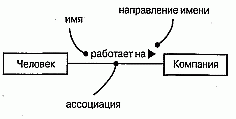

#### Рис. 5.4 Имена ассоциаций

> Примечание: Обычно имя ассоциации не указывается, если только вы не хотите явно задать для нее ролевые имена или в вашей модели настолько много ассоциаций, что возникает необходимость ссылаться на них и отличать друг от друга. Имя будет особенно полезным, если между одними и теми же классами существует несколько различных ассоциаций.

Роль. Класс, участвующий в ассоциации, играет в ней некоторую роль. По существу, это "лицо", которым класс, находящийся на одной стороне ассоциации, обращен к классу с другой ее стороны. Вы можете явно обозначить роль, которую класс играет в ассоциации. На рис. 5.5 показано, что класс Человек, играющий роль работника, ассоциирован с классом Компания, играющим роль работодателя. Роли тесно связаны с семантикой интерфейсов (см. главу 10).

#### Рис. 5.5 Роли

> Примечание: Один класс может играть в разных ассоциациях как одну и ту же роль, так и различные.

Кратность. Ассоциации отражают структурные отношения между объектами. Часто при моделировании бывает важно указать, сколько объектов может быть связано посредством одного экземпляра ассоциации (то есть одной связи, см. главу 15). Это число называется кратностью (Multiplicity) роли ассоциации и записывается либо как выражение, значением которого является диапазон значений, либо в явном виде, как показано на рис. 5.6. Указывая кратность на одном конце ассоциации, вы тем самым говорите, что на этом конце именно столько объектов должно соответствовать каждому объекту на противоположном конце. Кратность можно задать равной единице (1), можно указать диапазон: "ноль или единица" (0..1), "много" (0..*), "единица или больше" (1..*). Разрешается также указывать определенное число (например, 3).

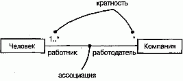

#### Рис. 5.6 Кратность

> Примечание: С помощью списка можно задать и более сложные кратности, например 0 . . 1, 3..4, 6..*, что означает "любое число объектов, кроме 2 и 5".

Агрегирование. Простая ассоциация между двумя классами отражает структурное отношение между равноправными сущностями, когда оба класса находятся на одном концептуальном уровне и ни один не является более важным, чем другой. Но иногда приходится моделировать отношение типа "часть/целое", в котором один из классов имеет более высокий ранг (целое) и состоит из нескольких меньших по рангу (частей). Отношение такого типа называют агрегированием; оно причислено к отношениям типа "имеет" (с учетом того, что объект-целое имеет несколько объектов-частей). Агрегирование является частным случаем ассоциации и изображается в виде простой ассоциации с незакрашенным ромбом со стороны "целого", как показано на рис. 5.7. Существует много важных разновидностей этого отношения (см. главу 10).

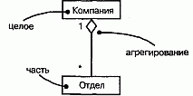

#### Рис. 5.7 Агрегирование

> Примечание: Незакрашенный ромб отличает "целое" от "части"- - и только. Эта простая форма агрегирования является чисто концептуальной; она не влияет на результат навигации по ассоциации между целым и его частями и не подразумевает наличия между ними какой-либо зависимости по времени жизни.

### Другие свойства
В процессе разработки абстракций вам чаще всего придется использовать простые зависимости и обобщения, а также ассоциации с именами, кратностями и ролями. В большинстве случаев базовых форм этих трех отношений вам будет вполне достаточно для передачи важнейших черт семантики моделируемых взаимосвязей. Но иногда все же возникает необходимость визуализировать и специфицировать другие особенности, такие как композитное агрегирование, навигация, дискриминанты, классы-ассоциации, а также специальные виды зависимостей и обобщений. Эти и многие другие особенности можно выразить на языке UML, однако предстоит воспользоваться концепциями более высокого уровня сложности (см. главу 10).

Зависимости, обобщения и ассоциации являются статическими сущностями, определенными на уровне классов. В UML эти отношения обычно визуализируют в виде диаграмм классов (см. главу 8).

Приступая к моделированию на уровне объектов - особенно при работе с динамическими кооперациями объектов - вы встретите еще два вида отношений: связи (экземпляры ассоциаций, представляющие соединения между объектами, по которым могут передаваться сообщения, см. главу 15) и переходы (связи между состояниями в автомате, см. главу 21).

## Типичные приемы моделирования

### Простые зависимости

Самым распространенным видом отношения зависимости является соединение между классами, когда один класс использует другой в качестве параметра операции.

Для моделирования такого отношения изобразите зависимость, направленную от класса с операцией к классу, используемому в качестве ее параметра.

Например, на рис. 5.8 показано несколько классов, взятых из системы, управляющей распределением студентов и преподавателей на университетских курсах. Зависимость направлена от класса РасписаниеЗанятий к классу Курс, поскольку последний используется в операциях add и remove класса РасписаниеЗанятий.

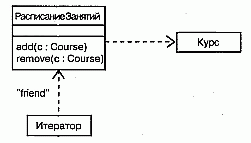

#### Рис. 5.8 Отношения зависимости

Если вы приводите полную сигнатуру операции, как на этом рисунке, то зависимости показывать не обязательно, поскольку имя класса уже явно присутствует в сигнатуре. Иногда продемонстрировать зависимость все же имеет смысл, особенно если сигнатуры операций скрыты или в модели показаны другие отношения, в которых участвует используемый класс.

На рис. 5.8 представлена еще одна зависимость, не предполагающая участия классов, а скорее моделирующая обычную для языка C++ идиому. Стрелка, направленная от класса Итератор, свидетельствует о том, что он использует класс РасписаниеЗанятий, который, однако, об этом ничего не "знает". Зависимость помечена стереотипом friend, который говорит, что она представляет отношение дружественности, как в языке C++. (Другие стереотипы отношений рассматриваются в главе 10.)

### Одиночное наследование
Моделируя словарь системы, вам часто придется работать с классами, похожими на другие по структуре и поведению. В принципе их можно моделировать как различные, независимые друг от друга абстракции. Но лучше выделить одинаковые свойства и сформировать на их основе общие классы, которым наследуют специализированные.

Моделирование отношений наследования осуществляется в таком порядке:

1. Найдите атрибуты, операции и обязанности, общие для двух или более классов из данной совокупности
2. Вынесите эти элементы в некоторый общий класс (если надо, создайте новый, но следите, чтобы уровней не оказалось слишком много).
3. Отметьте в модели, что более специализированные классы наследуют более общим, включив отношение обобщения, направленное от каждого потомка к его родителю.

На рис. 5.9 вы видите несколько классов, взятых из приложения по организации работы трейдеров. Здесь показано отношение обобщения, которое от четырех классов - РасчетныйСчет, Акция, Облигация и Собственность - направлено к более общему классу ЦенныеБумаги. Он является родителем, а остальные -его потомками. Каждый специализированный класс - это частный случай класса ЦенныеБумаги. Обратите внимание, что в классе ЦенныеБумаги есть две операции - presentValue (текущаяСтоимость) и history (история). Это значит, что все его потомки наследуют данные операции, а заодно и все остальные атрибуты и операции родителя, которые могут не изображаться на рисунке.

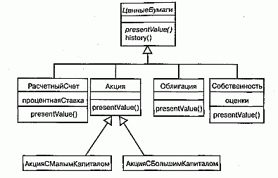

#### Рис. 5.9 Отношения наследования

Имена ЦенныеБумаги и presentValue на рисунке намеренно выделены курсивом. Дело в том, что, создавая иерархию подобного рода, часто приходится сталкиваться с нелистовыми классами, которые неполны или для которых не может существовать объектов. Такие классы называются абстрактными (см. главу 9), и на языке UML их названия пишутся курсивом, как в приведенном примере. Данное соглашение применимо и к операциям (например, presentValue); оно означает, что у операции есть сигнатура, но в других отношениях она неполна и требует реализации на более низком уровне абстракции (см. главу 9). В нашем примере все четыре непосредственных потомка класса ЦенныеВумаги конкретны (то есть не абстрактны) и реализуют операцию presentValue.

Иерархия "обобщение/специализация" не обязательно ограничивается двумя уровнями. Как видно из рисунка, вполне допустимо существование более двух уровней наследования. АкцияСМалымКапиталом и АкцияСБолышимКапиталом - потомки класса Акция, который, в свою очередь, является потомком класса Цен-ныеБумаги. Последний является базовым классом, поскольку не имеет родителей. Классы же АкцияСМалымКапиталом и АкцияСБольшимКапиталом - листовые, поскольку не имеют потомков. Наконец, класс Акция имеет как родителей, так и потомков, а следовательно, не является ни листовым, ни базовым.

Хотя на данном рисунке это не продемонстрировано, можно создавать классы, имеющие более одного родителя. В таком случае речь идет о множественном наследовании, которое означает, что данный класс перенимает атрибуты, операции и ассоциации всех своих родителей (см. главу 10).

Разумеется, в графе наследования не допускаются циклы - класс не может быть собственным родителем.

### Структурные отношения
Отношения зависимости и обобщения применяются при моделировании классов, которые находятся на разных уровнях абстракции или имеют различную значимость. Что касается отношения зависимости, один класс зависит от другого, но тот может ничего не "знать" о наличии первого. Когда речь идет об отношении обобщения, класс-потомок наследует своему родителю, но сам родитель о нем не осведомлен. Другими словами, отношения зависимости и обобщения являются односторонними.

Ассоциации предполагают участие равноправных классов. Если между двумя классами установлена ассоциация, то каждый из них каким-то образом зависит от другого, и навигацию можно осуществлять в обоих направлениях. В то время как зависимость - это отношение использования, а обобщение - отношение "является", ассоциации определяют структурный путь, обусловливающий взаимодействие объектов данных классов. По умолчанию ассоциации являются двунаправленными, но вы можете оставить только одно направление (см. главу 10).

Моделирование структурных отношений производится следующим образом:

1. Определите ассоциацию для каждой пары классов, между объектами которых надо будет осуществлять навигацию. Это взгляд на ассоциации с точки зрения данных.
2. Если объекты одного класса должны будут взаимодействовать с объектами другого иначе, чем в качестве параметров операции, следует определить между этими классами ассоциацию. Это взгляд на ассоциации с точки зрения поведения.
3. Для каждой из определенных ассоциаций задайте кратность (особенно если она не равна *, то есть значению по умолчанию) и имена ролей (особенно если это помогает объяснить модель).
4. Если один из классов ассоциации структурно или организационно представляет собой целое в отношении классов на другом конце ассоциации, выглядящих как его части, пометьте такую ассоциацию как агрегирование.

Как узнать, когда объекты данного класса должны взаимодействовать с объектами другого класса? Для этого рекомендуется воспользоваться CRC-карточка-ми и анализом прецедентов (см. главу 16). Эти методы очень помогают при рассмотрении структурных и поведенческих вариантов функционирования системы. Если в результате обнаружится взаимодействие между классами, специфицируйте ассоциацию.

На рис. 5.10 изображены классы, взятые из вузовской информационной системы. В нижней части диаграммы находятся классы Студент, Курс и Преподаватель. Между классами Студент и Курс существует ассоциация, показывающая, что студенты посещают курсы. Каждый студент может посещать любое число курсов, и на каждый курс может приходить любое количество студентов.

#### Рис. 5.10 Структурные отношения

Аналогичным образом между классами Курс и Преподаватель определена ассоциация, показывающая, что преподаватель читает курс. Для каждого курса должен быть хотя бы один преподаватель, и каждый преподаватель может вести любое количество курсов (в том числе и ни одного).

Отношения между классом Вуз и классами Студент и Факультет слегка отличаются друг от друга, хотя оба являются отношениями агрегирования. В вузе может быть любое количество студентов (включая ноль), и каждый студент может обучаться в одном или нескольких вузах; вуз может состоять из одного или нескольких факультетов, но каждый факультет принадлежит одному и только одному вузу. Отношение между классами Вуз и Факультет называют композитным агрегированием (см. главу 10). В принципе можно было бы обойтись без отношений агрегирования и использовать простые ассоциации, определяя при этом Вуз как целое, а Студента и Факультет - как его части. Тем самым вы ясно показываете, какой из классов организационно стоит выше остальных. Так, вузы в какой-то степени определяются своими студентами и факультетами. В то же время студенты и факультеты вообще не могут существовать вне связи со своим вузом, и в какой-то мере он формирует их облик.

Видно также, что между классами Факультет и Преподаватель установлены две ассоциации. Одна из них показывает, что каждый преподаватель работает на одном или нескольких факультетах, и на каждом факультете должен быть по меньшей мере один преподаватель. Здесь мы имеем дело с агрегированием, так как организационно факультеты находятся на более высоком уровне вузовской структуры, чем преподаватели. Другая ассоциация показывает, что каждым факультетом управляет только один преподаватель - декан. Согласно данной модели, преподаватель может быть деканом только одного факультета, причем некоторые преподаватели не являются деканами.

> Примечание: Разрабатывая подобную модель, вы можете обнаружить, что вышеприведенный пример не соответствует вашим условиям. В вузе может не быть факультетов. Деканы не всегда обязаны преподавать, а с другой стороны, встречаются студенты, одновременно работающие преподавателями. Все это не означает, что данная модель неверна, - просто она иллюстрирует один из частных случаев. Нельзя моделировать в отрыве от реальности, и всякая модель зависит от того, как вы собираетесь ее использовать

## Советы
При моделировании отношений в UML соблюдайте следующие правила:

* используйте зависимость, только если моделируемое отношение не является структурным;
* используйте обобщение, только если имеет место отношение типа "является";
* множественное наследование часто можно заменить агрегированием;
* остерегайтесь циклических отношений обобщения;
* поддерживайте баланс в отношениях обобщения: иерархия наследования не должна быть ни слишком глубокой (желательно не более пяти уровней), ни слишком широкой (лучше прибегнуть к промежуточным абстрактным классам);
* применяйте ассоциации прежде всего там, где между объектами существуют структурные отношения.

При изображении отношений в UML руководствуйтесь нижеследующими рекомендациями:

* выбрав один из стилей оформления линий (прямые или наклонные), в дальнейшем старайтесь его придерживаться. Прямые линии подчеркивают, что соединения идут от родственных сущностей к одному общему родителю. Наклонные линии позволяют существенно сэкономить пространство в сложных диаграммах. Если вы хотите привлечь внимание к разным группам отношений, применяйте одновременно оба типа линий;
* избегайте пересечения линий;
* показывайте только такие отношения, которые необходимы для понимания особенностей группирования элементов модели; скрывайте несущественные (особенно избыточные) ассоциации.

http://bourabai.kz/dbt/uml/ch6.htm

Часть II - Основы структурного моделирования
# Глава 6. Общие механизмы

* Введение
* Термины и понятия
    * Примечания
    * Другие дополнения
    * Стереотипы
    * Помеченные значения
    * Ограничения
    * Стандартные элементы
* Типичные приемы моделирования
    * Комментарии
    * Новые строительные блоки
    * Новые свойства
    * Новая семантика
* Советы

Работа с UML существенно упрощается благодаря наличию четырех постоянно применяемых общих механизмов (см. главу 2). Это спецификации, дополнения, принятые деления и механизмы расширения. В данной главе описаны два из них: дополнения и механизмы расширения.

Самой важной разновидностью дополнений являются примечания, которые представляют собой графические символы для изображения ограничений или комментариев, присоединяемых к одному элементу или их совокупности. Примечания используются для включения в модель дополнительной информации, например требований, наблюдений, обзоров и объяснений.

Механизмы расширения UML позволяют расширять его возможности контролируемым образом. В их число входят стереотипы, помеченные значения и ограничения. Стереотипы расширяют словарь UML, позволяя создавать новые виды строительных блоков, производные от существующих, но при этом более полно соответствующие задаче. Помеченные значения расширяют свойства строительных блоков UML, разрешая вносить новую информацию в спецификацию элемента. Ограничения расширяют семантику строительных блоков UML; c их помощью можно вводить новые или изменять существующие правила. Перечисленные механизмы используют, чтобы настроить язык на конкретные требования предметной области и применяемой разработчиком методики проектирования.

## Введение
Бывают случаи, когда в модель необходимо включить информацию, выходящую за пределы обычных формальностей. Так, архитектор порой пишет примечания на комплекте чертежей здания, чтобы обратить внимание строителей на некоторые тонкости. В студии звукозаписи композитор может изобрести новую музыкальную нотацию и прояснить с ее помощью какие-нибудь необычные эффекты, требуемые от исполнителя. Хотя в обоих случаях уже существуют хорошо определенные языки - строительных чертежей или музыкальной нотации, - их приходится некоторым образом модифицировать или расширять, чтобы наиболее адекватно выразить свои намерения.

Моделирование есть не что иное, как способ обмена информацией. UML предоставляет все необходимые инструменты для визуализации, специфицирования, конструирования и документирования артефактов разнообразных программных систем, однако при некоторых обстоятельствах его возможности требуется расширить или модифицировать. В человеческих языках такой процесс протекает непрерывно (вот почему ежегодно публикуются новые словари). Что касается языка моделирования, то всегда следует помнить, что он предназначен для обмена информацией между разработчиками, и потому стоит придерживаться его основных правил и принципов, пока не возникает острая необходимость отклониться от них. Но даже в этом случае неформальную информацию следует представлять контролируемым образом, иначе никто не сможет понять, о чем идет речь.

Примечания позволяют давать произвольные комментарии и ограничения для пояснения созданной модели. Они могут указывать на артефакты, играющие важную роль в жизненном цикле разработки программного обеспечения - такие, как требования - или же содержать наблюдения, обзоры или пояснения в свободной форме.

Графическим представлением комментариев и ограничений в UML является примечание (см. рис. 6.1). Эта нотация позволяет непосредственно визуализировать комментарии. В сочетании с подходящими инструментальными средствами примечания также могут служить опорной точкой, к которой привязываются или куда встраиваются другие документы.

#### Рис. 6.1 Примечания

Стереотипы, помеченные значения и ограничения - это механизмы UML, которые позволяют создавать новые строительные блоки, новые свойства и определять новую семантику. Например, если вы моделируете сеть, то могут понадобиться символы для маршрутизаторов и концентраторов; с помощью стереотипных узлов эти элементы можно представить в виде примитивных строительных блоков. Если вы отвечаете за сборку, тестирование и применение версий программного продукта, было бы целесообразно отслеживать номера версий и результаты тестов наиболее важных подсистем. Эту информацию стоит добавить в модель с помощью помеченных значений. Наконец, при разработке сложной системы, работающей в режиме реального времени, уместно дополнить модель информацией о временных ресурсах и сроках окончания работ; это можно сделать с помощью ограничений.

UML располагает средствами для текстового представления стереотипов, помеченных значений и ограничений, как показано на рис. 6.2. Кроме того, стереотипы дают возможность вводить новые графические символы, добавляя в модель визуальные образы, характерные для предметной области и среды разработки

#### Рис. 6.2 Стереотипы, помеченные значения и ограничения

## Термины и понятия
Примечание (Note) - это графический символ, используемый для изображения ограничений или комментариев, присоединенных к элементу модели или их совокупности. Примечание выглядит как прямоугольник с загнутым углом, содержащий текстовый или графический комментарий.

Стереотипом (Stereotype) называют расширение словаря UML, позволяющее создавать новые виды строительных блоков, аналогичные существующим, но специфичные для данной задачи. Стереотип представлен в виде имени, заключенного в кавычки и расположенного над именем другого элемента. Стереотипный элемент можно изображать также с помощью новой связанной с ним пиктограммы.

Помеченное значение (Tagged value) - это расширение свойств элемента UML, позволяющее вводить новую информацию в его спецификацию. Помеченные значения изображаются в виде строки в скобках, расположенной под именем другого элемента.

Ограничение (Constraint) - это расширение семантики элемента UML, позволяющее создавать новые или изменять существующие правила. Изображаются ограничения в виде строки в скобках, которая расположена возле ассоциированного элемента или связана с ним отношениями зависимости. Можно также представить ограничение в виде примечания.

### Примечания
Содержащее комментарий примечание не оказывает влияния на семантику, то есть не изменяет структуру модели. Поэтому примечания, наряду с ограничениями, используются для специфицирования таких элементов, как требования, наблюдения, обзоры и пояснения.

Примечание может содержать любые сочетания текста и графики. Если позволяет реализация, можно включить в примечание гиперссылку на Web-страницу, связать его с другим документом либо встроить в него. Таким образом UML можно использовать для организации всех артефактов, создаваемых или используемых в процессе разработки, как показано на рис. 6.3. Примечание можно присоединять не только к одному, но и к нескольким элементам с помощью зависимостей (см. главу 5).

#### Рис. 6.3 Примечания

> Примечание: В UML определен один стандартный стереотип, прилагаемый к примечаниям, - требования (Requirements). Так именуется распространенная категория примечаний, используемая для формулирования обязанностей или обязательств

### Другие дополнения
Дополнения (Adornments) - это текстовые или графические объекты, добавляемые к базовой нотации элемента и применяемые для визуализации каких-либо деталей его спецификации. Например, базовая нотация ассоциации - это линия, но она может быть дополнена указанием роли и кратности на каждом конце (см. главы 5 и 10). Общее правило при использовании UML таково: начинайте с базовой нотации для каждого элемента, а дополнения включайте, только если они необходимы для передачи специфической информации, важной для вашей модели.

Дополнения изображают, располагая текст рядом с соответствующим элементом или добавляя графический символ к базовой нотации. Иногда бывает необходимо включить в модель такие дополнительные детали, для описания которых недостаточно простого текста или графического образа. При работе с такими сущностями, как классы, компоненты или узлы, специальную информацию можно поместить в дополнительный раздел, расположенный ниже стандартных, как показано на рис. 6.4.

#### Рис. 6.4 Дополнительные разделы

> Примечание: Чтобы не возникло путаницы, рекомендуется явно именовать каждый дополнительный раздел, если его назначение не очевидно из содержимого. Дополнительные разделы лучше не использовать слишком часто, чтобы не загромождать диаграммы.

### Стереотипы
UML - это язык для описания структурных, поведенческих, группирующих и аннотационных сущностей. Эти четыре основных вида сущностей позволяют моделировать огромное количество систем (см. главу 2). Однако время от времени приходится вводить новые сущности, которые специфичны для словаря предметной области, хотя выглядят подобно примитивным строительным блокам, уже имеющимся в языке.

Стереотип - это не то же самое, что родительский класс в отношении обобщения "родитель/потомок". Точнее было бы охарактеризовать его как некоторый метатип, поскольку каждый стереотип создает эквивалент нового класса в мета-модели UML. Например, при моделировании бизнеспроцесса вам потребуется ввести в модель элементы, представляющие работников, документы и стратегии.

Пользуясь такой методикой разработки, как Рациональный Унифицированный

Процесс (Rational Unified Process, см. "Приложение С"), вы должны будете оперировать классами границ, управления и сущностей. Здесь и возникает необходимость в стереотипах. Приписывая стереотип таким элементам, как узел или класс, вы по сути дела расширяете UML, создавая новый строительный блок, который напоминает существующий, но обладает новыми специальными свойствами (каждый стереотип может содержать свой набор помеченных значений), новой семантикой (у каждого стереотипа могут быть собственные ограничения) и нотацией (каждому стереотипу может быть присвоена пиктограмма).

В самом простом случае стереотип изображается в виде имени в кавычках (например, "name"), расположенного над именем другого элемента. Для наглядно--сти стереотипу можно назначить пиктограмму, разместив ее справа от имени (если вы пользуетесь базовой нотацией для элемента) или применяя как базовый символ для стереотипной сущности. Все три подхода показаны на рис. 6.5. Определенные в UML стереотипы обсуждаются в "Приложении В".

#### Рис. 6.5 Стереотипы

> Примечание: Создавая пиктограмму для стереотипа, используйте цвет в качестве удобного визуального идентификатора (хотя злоупотреблять этой возможностью не следует). UML позволяет оформлять пиктограммы любым способом и, если позволяет реализация, они могут войти в набор примитивных инструментов, пополнив таким образом палитру средств, при помощи которых пользователи работают с данной предметной областью.

### Помеченные значения
У каждой сущности в UML есть фиксированный набор свойств: классы имеют имена, атрибуты и операции; ассоциации - имена и концевые точки (каждая со своими свойствами) и т.д. Стереотипы позволяют добавлять новые сущности в UML, а помеченные значения - новые свойства.

Метки можно определять для существующих элементов UML; можно также определить метки, применимые к отдельным стереотипам. В последнем случае все элементы, описанные этим стереотипом, будут иметь заданную метку. Помеченное значение - не то же самое, что атрибут класса (см. главы 4 и 9). Скорее, оно может быть представлено как метаданные, поскольку его значение применяется к самому элементу, а не к его экземплярам. Например, как показано на рис. 6.6, в диаграмме развертывания можно указать число процессоров, установленных на узле каждого вида, или потребовать, чтобы каждому компоненту был приписан стереотип библиотеки, если его предполагается развернуть на клиенте или сервере.

#### Рис. 6.6 Помеченные значения

В простейшем варианте помеченное значение изображается в виде строки в скобках, расположенной под именем другого элемента. Строка содержит имя (метку), разделитель (знак равенства) и значение этой метки. Можно указать только значение, если оно не допускает неоднозначной интерпретации, например в случае, если значение - это имя перечисления. Предопределенные в языке UML помеченные значения описаны в "Приложении В".

> Примечание: Чаще всего с помощью помеченных значений описывают свойства, относящиеся к генерации кода или к управлению конфигурацией. Например, ими можно воспользоваться для указания языка программирования, на котором будет кодироваться конкретный класс. Можно также применить помеченные значения для указания имени автора и номера версии компонента.

### Ограничения
Каждый элемент языка UML имеет свою семантику. В обобщениях используется принцип подстановки Лискова; множественные ассоциации, связанные с одним классом, обозначают разные отношения. С помощью ограничений можно создавать новую семантику или изменять существующие семантические правила. Ограничение определяет условия, которые должны выполняться, чтобы модель была хорошо оформлена. Например, на рис. 6.7 показано, как отразить тот факт, что информация, передаваемая вдоль данной ассоциации, зашифрована. Аналогично можно специфицировать, что из совокупности ассоциаций только одна про- -является в данный момент времени. При моделировании систем реального времени часто используются временные и пространственные ограничения (см. главу 23).

#### Рис. 6.7 Ограничение

> Примечание: Ограничения могут записываться в свободном формате. Если надо определить семантику более точно, следует воспользоваться входящим в состав UML языком объектных ограничений (Object Constraint Language, OCL). Более подробно он описывается в книге "The Unified Modeling Language Reference Manual". Предопределенные в UML ограничения рассмотрены в "Приложении В".

Ограничение изображается в виде строки в фигурных скобках, расположенной рядом с соответствующим элементом. Эта нотация также используется как дополнение к базовой нотации элемента для визуального представления тех частей его спецификации, которые не имеют графического образа. Например, с помощью нотации ограничений изображаются некоторые свойства ассоциаций (порядок и изменяемость). Ограничение можно присоединять сразу к нескольким элементам с помощью отношений зависимости (см. главу 5).

### Стандартные элементы
В языке UML определен ряд стандартных стереотипов для классификаторов, компонентов, отношений и других элементов модели (см. "Приложение В" и главу 9). Один из них, stereotype, позволяет моделировать сами стереотипы и представляет интерес в основном для разработчиков инструментальных средств. Он определяет, что классификатор является стереотипом, который может быть применен к другим элементам. Этот стереотип можно использовать, если нужно явно смоделировать стереотипы, которые вы определили в своем проекте.

В UML также определено одно стандартное помеченное значение, documentation, применимое ко всем моделирующим элементам. Оно задает комментарий, описание или объяснение элемента, к которому присоединено. Это помеченное значение используют, если надо присоединить комментарий непосредственно к спецификации какого-нибудь элемента, например класса.

## Типичные приемы моделирования

### Комментарии

Моделирование комментария производится следующим образом:

1. Включите его в виде текста в примечание и расположите рядом с элементом, к которому он относится. Можно показать отношение более явно, соединив примечание с соответствующими элементами при помощи зависимости.
2. Помните, что элементы модели можно скрыть или сделать видимыми. Это означает, что не обязательно делать комментарий видимым всегда, когда видны элементы, к которым он присоединен. Лучше раскрывать комментарии в диаграммах только тогда, когда это необходимо для передачи какой-либо информации.
3. Если комментарий длинный или содержит нечто более сложное, чем обычный текст, подумайте о том, чтобы вынести его во внешний документ, на который можно поставить ссылку, или встроить его в примечание, присоединенное к модели.
4. По мере продвижения процесса моделирования убирайте все комментарии, кроме тех, что содержат важные решения, которые не могут быть выведены из самой модели, либо тех, что представляют исторический интерес.

В качестве примера на рис. 6.8 показана промежуточная модель, возникшая в процессе работы над иерархией классов. Здесь отражены требования к модели наряду с некоторыми примечаниями, касающимися пересмотра проекта. (Вам может пригодиться материал глав 5 и 10, где обсуждаются, соответственно, простые обобщения и более сложные их формы.)

#### Рис. 6.8 Комментарии в процессе моделирования

Почти все комментарии в этом примере (скажем, замечание для Мэри) записаны в форме обычного текста, но один из них (примечание в нижней части диаграммы) представляет собой гиперссылку на другой документ.

Новые строительные блоки
Строительные блоки языка UML - классы, интерфейсы, кооперации, компоненты, узлы, ассоциации и т.д. - являются достаточно общими, чтобы их можно было применять для моделирования любых сущностей. Тем не менее, если вы хотите расширить словарь или создать специальные визуальные образы для абстракций, часто возникающих в вашей предметной области, можно воспользоваться стереотипами.

Моделирование новых строительных блоков производится в следующем порядке:

1. Убедитесь, что с помощью базового набора средств UML невозможно воплотить ваш замысел. Если вы столкнулись с типичной задачей моделирования, то, скорее всего, уже существует стандартный стереотип для ее решения.
2. Если вы убеждены, что никакого другого способа выразить соответствующую семантику не существует, подыщите примитив UML, более всего похожий на то, что вы собираетесь моделировать (например, класс, интерфейс, компонент, узел, ассоциацию и т.д.) и определите для него новый стереотип.
3. Помните, что вы можете определить иерархию стереотипов (см. главу 10), в которой есть как общие, так и специализированные элементы; однако не увлекайтесь этим чрезмерно.
4. Задайте общие свойства и семантику, выходящие за пределы базового элемента, определив множество помеченных значений и ограничений для стереотипа.
5. Если вы хотите связать со стереотипными элементами специальный визуальный образ, определите для каждого из них новую пиктограмму.

Допустим, вы используете диаграммы деятельности для моделирования бизнес-процесса, описывающего действия тренеров и команд во время какого-либо спортивного события. Следует визуально отличать тренеров и команды друг от друга и от иных сущностей предметной области, таких как состязания и занятые командами места. Как явствует из рис. 6.9, две сущности - Тренер (Coach) и Команда (Team) - отличаются от остальных. Это не просто разновидности классов, а новые примитивные строительные блоки, которые можно использовать в данном контексте. Создать такие блоки можно, определив стереотипы coach и team

#### Рис. 6.9 Моделирование новых строительных блоков

и применив их к классам UML. На рисунке анонимные экземпляры :Тренер и :Команда (последний существует в трех различных состояниях - не зарегистрирована, зарегистрирована и закончила выступление) сопровождаются пиктограммами, ассоциированным с их стереотипами. (Подробнее об экземплярах рассказано в главе 13, о ролях - в главе 11, о диаграммах деятельности - в главе 19.)

### Новые свойства
Базовые свойства строительных блоков UML - атрибуты и операции для классов, содержание пакетов и т.д. - являются достаточно общими, чтобы их можно было применять для моделирования любых сущностей. Все же, если вы хотите расширить набор свойств базовых блоков (или новых блоков, созданных с помощью стереотипов), вам необходимо воспользоваться помеченными значениями.

Моделирование новых свойств осуществляется следующим образом:

1. Сначала убедитесь, что с помощью базовых средств UML невозможно воплотить вашу задумку. Если вы столкнулись с типичной задачей моделирования, то, вероятнее всего, уже существует стандартное помеченное значение для ее решения.
2. Если вы уверены, что никакого другого способа выразить нужную семантику не существует, добавьте новое свойство к соответствующему элементу или стереотипу. Здесь действуют правила обобщения: помеченные значения, определенные для некоторого элемента, применяются и ко всем его потомкам.

Предположим, например, что вам нужно связать создаваемые модели с системой управления конфигурацией проекта. Помимо всего прочего, это предполагает отслеживание номера версии, текущего статуса версии в хранилище (Check in/check out status) и, возможно, дат создания и модификации каждой подсистемы (см. главу 31). Поскольку вся эта информация специфична для процесса разработки, она не является частью базового UML, хотя ее можно включить в модель с помощью помеченных значений. В частности, эта информация не является просто атрибутом класса. Номер версии подсистемы - это часть метаданных, но не самой модели.

На рис. 6.10 представлены четыре подсистемы, каждая из которых была расширена за счет включения номера версии и статуса. Для подсистемы Биллинг показано еще одно помеченное значение - имя человека, который извлек подсистему из хранилища.

#### Рис. 6.10 Моделирование новых свойств

> Примечание: Значения таких меток, как version и status, могут устанавливаться инструментальными средствами. Вместо того чтобы вручную задавать их в модели, для их автоматического сопровождения достаточно воспользоваться средой разработки, интегрированной с системой управления конфигурацией.

### Новая семантика
Создавая с помощью UML новые модели, вы используете принятые в этом языке правила. Это естественно, поскольку при соблюдении данного условия ваши модели будут однозначно восприняты каждым, кто знаком с этим языком. Но иногда требуется выразить новую семантику, которая отсутствует в UML, или изменить существующую. В таком случае вам помогут ограничения.

Моделирование новой семантики производится следующим образом:

Убедитесь, что с помощью базовых средств UML невозможно реализовать ваш замысел. Если вам предстоит решить типичную задачу моделирования, то, надо полагать, уже существует стандартное ограничение, которое подойдет для этой цели.
Если вы уверены, что никакого другого способа выразить нужную семантику не существует, оформите новую семантику в виде текста в ограничении и расположите рядом с элементом, к которому она относится. Более явно описать ограничение можно, связав его с элементами отношениями зависимости.
Если вы хотите описать новую семантику более четко и формально, воспользуйтесь языком ОСL.
В качестве примера на рис. 6.11 представлена модель небольшого фрагмента корпоративной системы управления человеческими ресурсами.

#### Рис. 6.11 Моделирование новой семантики

На этой диаграмме показано, что каждый Человек может быть сотрудником любого числа Отделов (включая ноль), а в каждом Отделе должен быть хотя бы один сотрудник. При этом в роли начальника Отдела может выступать только один Человек; в то же время любой Человек может быть начальником любого числа Отделов (включая ноль). Эта семантика выражается с помощью базовых правил UML. Однако то обстоятельство, что начальник должен быть также и сотрудником отдела, подразумевает несколько ассоциаций и не может быть выражено с помощью базового UML. Для формулирования такого инварианта необходимо написать ограничение, которое показывает, что начальник "принадлежит" (subset на диаграмме) множеству сотрудников отдела, и соединить две ассоциации с этим ограничением зависимостью, направленной от подмножества к надмножеству.

## Советы
Включая в модель примечания в виде дополнений:

* используйте примечания для описания только тех требований, наблюдений, обзоров и пояснений, которые нельзя выразить с помощью стандартных средств UML;
* используйте примечания в качестве электронной памятки, отслеживая с их помощью ход работы.
Изображая примечания, не перегружайте модель большими объемными комментариями. Если длинный комментарий действительно необходим, помещайте в примечания ссылку на документ, содержащий полный текст.

Расширяя модель за счет новых стереотипов, помеченных значений и ограничений, руководствуйтесь следующими принципами:

* определите небольшое число этих механизмов в качестве стандартных для проекта и не позволяйте разработчикам создавать ничего лишнего;
* выбирайте короткие осмысленные названия для стереотипов и помеченных значений;
* если точность описания не слишком важна, определяйте ограничения в свободной форме;
* в противном случае используйте язык ОСL.

Изображая стереотипы, помеченные значения и ограничения, действуйте согласно следующим правилам:

* прибегайте к графическим стереотипам только в случае острой необходимости. С помощью стереотипов можно полностью изменить базовую нотацию UML, но тогда уже никто, кроме вас, не поймет модель;
* подумайте, не стоит ли раскрасить или оттенить графические стереотипы и более сложные пиктограммы. Как правило, чем проще нотация, тем она лучше, и даже самых простых визуальных образов бывает вполне достаточно для передачи смысла.

http://bourabai.kz/dbt/uml/ch7.htm

Часть II - Основы структурного моделирования
# Глава 7. Диаграммы
* Введение
* Термины и понятия
    * Структурные диаграммы
    * Диаграммы поведения
* Типичные приемы моделирования
    * Различные представления системы
    * Различные уровни абстракции
    * Сложные представления
* Советы

В процессе моделирования человек упрощает реальность, чтобы лучше понять проектируемую систему (см. главу 1). Используя UML, вы можете строить модели из базовых блоков, таких как классы, интерфейсы, кооперации, компоненты, узлы, зависимости, обобщения и ассоциации. Диаграммы позволяют обозревать эти строительные блоки в удобной для понимания форме.

Диаграмма - это графическое представление совокупности элементов, чаще всего изображаемое в виде связного графа, состоящего из вершин (сущностей) и ребер (отношений). С помощью диаграмм можно визуализировать систему с различных точек зрения. Поскольку сложное целое нельзя понять, глядя на него лишь с одной стороны, в UML определено много разных диаграмм, которые позволяют сосредоточиться на различных аспектах моделируемой системы.

Хорошие диаграммы облегчают понимание модели. Продуманный выбор диаграмм при моделировании системы позволяет задавать правильные вопросы о ней, помогает грамотной постановке задачи и проясняет последствия принимаемых решений.

## Введение
Работая с архитектором, проектирующим ваш дом, вы, во-первых, составляете список пожеланий (например, "я хочу, чтобы в доме было три спальни" или "я хочу, чтобы постройка обошлась мне не дороже такой-то суммы"); во-вторых, подбираете несколько эскизов или фотографий других домов, где представлены их важнейшие особенности (например, фотография крыльца с винтовой лестницей); в-третьих, формулируете некую общую идею ("это будет французский сельский дом с элементами стиля, распространенного на калифорнийском побережье"). Задача архитектора заключается в том, чтобы на основе этих неполных, постоянно меняющихся и, возможно, противоречивых требований создать завершенный проект.

Начать, вероятно, придется с основных поэтажных планов. Оформив их, вы вместе с архитектором сможете представить себе окончательный вид дома, уточнить детали и документировать решения. При каждом пересмотре проекта может возникнуть желание внести какие-то изменения, например передвинуть стены, перепланировать комнаты или по-новому расположить окна и двери. На ранних стадиях чертежи будут меняться часто. По мере того как проект совершенствуется и вы наконец осознаете, что он наилучшим образом удовлетворяет всем требованиям по внешнему виду, функциональности, срокам и смете строительства, чертежи оформляются настолько четко, что их уже можно использовать для возведения дома. Однако даже в процессе строительства вы еще, вероятно, пожелаете изменить некоторые элементы и привнести нечто новое.

По ходу работы вам захочется увидеть не только поэтажный план, но и другие представления вашего дома - например, вертикальные разрезы с разных сторон. Конкретизируя детали и при этом не упуская из виду, что стоимость работ должна оставаться в разумных пределах, архитектору придется начертить схемы электропроводки, систем отопления и вентиляции, водоснабжения и канализации. Если в вашем проекте есть какие-то необычные черты (например, большие арочные пролеты) или существенные для вас особенности (скажем, камин требуется расположить так, чтобы рядом с ним можно было разместить домашний кинотеатр), то вам совместно с архитектором придется подробно проработать их на отдельных чертежах.

Практика создания чертежей для визуализации системы с различных точек зрения не ограничивается строительством. Вы встретите ее в любой инженерной дисциплине, связанной с разработкой сложных систем, от производства бытовой техники до авиа- и кораблестроения и, наконец, создания программного обеспечения.

Существует пять взаимно дополняющих друг друга видов, или представлений, особенно важных для визуализации, специфицирования, конструирования и документирования программной архитектуры: это представления с точки зрения прецедентов, проектирования, процессов, реализации и развертывания (см. главу 2). Каждое из них предполагает структурное и поведенческое моделирование (то есть моделирование статических и динамических сущностей соответственно). В своей совокупности эти виды позволяют передать наиболее важные решения, касающиеся системы в целом, а по отдельности каждый из них акцентирует внимание на одном ее аспекте, рассмотрение которого таким образом упрощается.

Чтобы изобразить систему с какой-либо точки зрения средствами UML, для организации представляющих интерес элементов используются диаграммы. В UML определено девять типов диаграмм, которые позволено комбинировать для создания нужного вида. Например, статические аспекты вида с точки зрения реализации системы удобнее визуализировать с помощью диаграмм компонентов, а динамические аспекты того же вида - с помощью диаграмм взаимодействия. Статические аспекты системной базы данных можно изобразить с помощью диаграмм классов, а динамические - с помощью диаграмм кооперации. (Моделирование архитектуры системы рассматривается в главе 31.)

Конечно, вы не ограничены только этими девятью типами диаграмм. Они определены в UML только потому, что позволяют представить наиболее часто встречающиеся комбинации рассматриваемых элементов. Но можно создавать и собственные виды диаграмм, если это потребуется для вашего проекта или организации.

Диаграммы UML можно использовать двумя способами: для описания моделей, на основе которых в дальнейшем будет сконструирована исполняемая система (прямое проектирование), или для воссоздания модели из частей уже существующей исполняемой системы (обратное проектирование). В любом случае вы, как и архитектор, будете разрабатывать диаграммы инкрементно (добавляя по одному новому фрагменту за раз) и итеративно (повторяя процесс проектирования после каждого нового усовершенствования). Удовлетворяющий обоим этим требованиям процесс проектирования описан в "Приложении С".

## Термины и понятия
Системой называют набор подсистем, организованных для достижения определенной цели и описываемых с помощью совокупности моделей, возможно с различных точек зрения. Подсистема - это совокупность элементов, часть из которых задает спецификацию поведения других элементов. Моделью называется семантически замкнутая абстракция системы. Другими словами, модель является полным и внутренне непротиворечивым упрощением реальности, которое создается для более глубокого понимания системы. В контексте архитектуры видом, или представлением, именуется проекция организации и структуры модели системы, в которой внимание сфокусировано на одном ее аспекте. (О системах, моделях и видах подробно рассказывается в главе 31.) Диаграмма - это графическое представление множества элементов, обычно изображаемое в виде связного графа из вершин (сущностей) и ребер (отношений).

Иначе говоря, система представляет собой разрабатываемую сущность, которая рассматривается с разных точек зрения с помощью моделей, многообразные представления которых отображены в форме диаграмм.

Диаграмма - это просто графическая проекция элементов, составляющих систему. Например, в проекте корпоративной системы управления человеческими ресурсами может быть несколько сотен классов. Вы никогда не сможете понять структуру и поведение этой системы, глядя на одну гигантскую диаграмму, где изображены все классы и их отношения. Вместо этого разумно создать несколько диаграмм, каждая из которых заостряет внимание на одном аспекте. Например, одна из диаграмм классов будет содержать описание классов Работник, Отдел и Офис, используемых при конструировании схемы базы данных. Некоторые из этих классов (наряду с другими) могут войти в состав интерфейса прикладного программирования, применяемого в клиентских приложениях. Частично они могут присутствовать еще и в диаграмме взаимодействия, которая определяет семантику транзакции, состоящей в переводе Работника в другой Отдел.

Как видно из примера, та или иная сущность в системе (например, класс Работник) может многократно повторяться на одной или даже нескольких диаграммах. Тем не менее во всех случаях речь идет об одной и той же сущности. Каждая диаграмма дает одно из возможных представлений элементов системы.

При моделировании реальных систем, независимо от предметной области, вы будете создавать все те же типы диаграмм, поскольку они соответствуют наиболее часто встречающимся представлениям модели. Как правило, при рассмотрении статических частей системы используются следующие четыре типа:

* диаграммы классов;
* диаграммы объектов;
* диаграммы компонентов;
* диаграммы развертывания.

Для работы с динамическими частями системы применяются пять типов, перечисленные ниже:

* диаграммы прецедентов;
* диаграммы последовательности;
* диаграммы кооперации;
* диаграммы состояний;
* диаграммы деятельности.

Всего в языке UML определено девять типов диаграмм.

В большинстве случаев создаваемые вами диаграммы можно будет отнести к одному из этих типов, и только изредка потребуются новые, специфические для вашего проекта или организации. У каждой диаграммы должно быть уникальное в объемлющем контексте имя, с помощью которого можно ссылаться на нее и отличать от остальных. При работе над сколько-нибудь сложной системой вам придется объединять диаграммы в пакеты (см. главу 12).

На одну и ту же диаграмму можно проецировать любую комбинацию элементов UML. Например, зачастую совместно показывают классы и объекты (это вполне допустимо), а иногда даже классы и компоненты (допустимо, но встречается реже). Хотя ничто не мешает вам разместить на одной диаграмме совершенно различные элементы моделирования, принято все-таки сводить воедино более или менее похожие сущности. Собственно, определенные в UML диаграммы и названы в соответствии с элементом, чаще всего встречающимся в них. Если вы хотите, например, визуализировать набор классов и отношений между ними, используйте диаграммы классов. Если же надо изобразить компоненты системы, лучше подойдут диаграммы компонентов.

> Примечание: На практике создаваемые вами диаграммы двумерны, то есть представляют собой плоские графы, которые можно нарисовать на листе бумаги, доске или экране компьютера. UML позволяет создавать и трехмерные, объемные диаграммы. Некоторые исследовательские коллективы, работающие в области виртуальной реальности, уже продемонстрировали такое нестандартное использование UML.

### Структурные диаграммы
В UML существует четыре структурных диаграммы для визуализации, специфицирования, конструирования и документирования статических аспектов системы, составляющих ее относительно прочный "костяк". Подобно тому как статические аспекты дома показывают, что и каким образом будет размещено в здании (стены, двери, окна, трубы, электропроводки, вентиляционные отверстия и т.д.), так и ста-ткческие аспекты программных систем отражают наличие и расположение классов интерфейсов, коопераций, компонентов, узлов и других сущностей.

Названия структурных диаграмм UML соответствуют названиям основных| групп сущностей, используемых при моделировании системы:

* диаграммы классов - классам, интерфейсам и кооперациям;
* диаграммы объектов - объектам;
* диаграммы компонентов - компонентам;
* диаграммы развертывания - узлам.

На диаграмме классов изображают множество классов, интерфейсов, коопераций и их отношений (см. главу 8). Это самый распространенный тип диаграмм, применяемый при моделировании объектно-ориентированных систем; он используется для иллюстрации статического вида системы с точки зрения проектирования. Диаграммы, на которых показаны активные классы, применяются для работы со статическим видом системы с точки зрения процессов.

На диаграмме объектов показывают множество объектов и отношения между ними (см. главу 14). Такие изображения используются для иллюстрации структуры данных, то есть статических "мгновенных снимков" экземпляров тех сущностей, которые представлены на диаграмме классов. Диаграммы объектов, так же как и диаграммы классов, относятся к статическому виду системы с точки зрения процессов, но заостряют внимание на реальных или модельных прецедентах.

На диаграммах компонентов показаны множества компонентов и отношения между ними (см. главу 29). С их помощью иллюстрируют статический вид системы с точки зрения реализации. Диаграммы компонентов соотносятся с диаграммами классов, так как обычно компонент отображается на один или несколько классов, интерфейсов или коопераций.

На диаграммах развертывания представлены узлы и отношения между ними (см. главу 30). С помощью таких изображений иллюстрируют статический вид системы с точки зрения развертывания. Они соотносятся с диаграммами компонентов, так как узел обычно содержит один или несколько компонентов.

> Примечание: Существует несколько распространенных разновидностей четырех основных типов диаграмм, названных по основным содержащимся в них объектам. Например, для иллюстрации структурной декомпозиции системы на подсистемы можно использовать диаграмму подсистем, которая представляет собой обыкновенную диаграмму классов, содержащую главным образом подсистемы.

### Диаграммы поведения
Пять основных диаграмм поведения в UML используются для визуализации, специфицирования, конструирования и документирования динамических аспектов системы. Можно считать, что динамические аспекты системы представляют собой ее изменяющиеся части. Например, динамические аспекты жилого дома -это перемещение потоков воздуха и людей по комнатам. Динамические аспекты программной системы охватывают такие ее элементы, как поток сообщений во времени и физическое перемещение компонентов по сети.

Диаграммы поведения в UML условно разделяются на пять типов в соответствии с основными способами моделирования динамики системы:

* диаграммы прецедентов описывают организацию поведения системы; D диаграммы последовательностей акцентируют внимание на временной упорядоченности сообщений;
* диаграммы кооперации сфокусированы на структурной организации объектов, посылающих и получающих сообщения;
* диаграммы состояний описывают изменение состояния системы в ответ на события;
* диаграммы деятельности демонстрируют передачу управления от одной деятельности к другой.

На диаграммах прецедентов показывается совокупность вариантов использования (прецедентов), актеров (частный случай классов) и отношений между ними (см. главу 17). С помощью таких диаграмм иллюстрируют статический вид системы с точки зрения прецедентов, что особенно важно для ее организации и моделирования ее поведения.

Следующие две диаграммы семантически идентичны, так же как и две последние. Иными словами, для моделирования динамики системы можно воспользоваться диаграммами одного типа, а затем преобразовать их к другому типу без потерь информации. Это позволяет лучше понять различные аспекты динамики системы. Например, можно сначала создать диаграмму последовательностей, иллюстрирующую временную упорядоченность сообщений, а затем преобразовать в диаграмму кооперации, помогающую легко разрабатывать структурные отношения между классами, объекты которых участвуют в этой кооперации (разумеется, не воспрещено двигаться и в обратном направлении, от диаграммы кооперации к диаграмм последовательностей). Можно также начать с диаграммы состояний, показывающей реакцию системы на события, и преобразовать ее в диаграмму действий, которая заостряет внимание на потоке управления (или же, наоборот, от диаграммы действий перейти к диаграмме состояний). Причина, по которой в UML предусмотрены семантически эквивалентные диаграммы, состоит в том, что моделирование динамики системы - очень непростая задача, и зачастую приходится подходит к решению какой-нибудь многогранной проблемы сразу с нескольких сторон.

Диаграммы взаимодействий - это общее наименование диаграмм последовательностей и кооперации. Любая диаграмма последовательностей или кооперации является диаграммой взаимодействия, а каждая диаграмма взаимодействия - это либо диаграмма последовательностей, либо диаграмма кооперации.

На диаграмме последовательностей основное внимание уделяется временно упорядоченности событий (см. главу 18). На них изображают множество объектов и посланные или принятые ими сообщения. Объекты, как правило, представляют собой анонимные или именованные экземпляры классов, но могут быть та: же экземплярами других сущностей, таких как кооперации, компоненты или узлы Диаграммы последовательностей относятся к динамическому виду системы.

Диаграммы кооперации заостряют внимание на структурной организации объектов, принимающих или отправляющих сообщения. На диаграмме кооперации показано множество объектов, связи между ними и сообщения, которые они посылают или получают (см. главу 18). Объекты обычно представляют собой анонимные или именованные экземпляры классов, но могут быть также экземпляр ми других сущностей, например коопераций, компонентов и узлов. Диаграммы коопераций относятся к динамическому виду системы.

> Примечание: Диаграммы последовательностей и кооперации изоморфны, то есть их можно преобразовывать друг в друга без потери информации.

Диаграмма состояний показывает автомат, содержащий состояния, переходы, события и действия (см. главу 24). Диаграммы такого рода относятся к динамическому виду системы и особенно важны при моделировании поведения интерфейса, класса или кооперации. Основное внимание в них уделяется порядку возникновения событий, связанных с объектом, что особенно полезно при моделировании реактивных систем.

На диаграммах деятельности изображают передачу управления от одной деятельности к другой внутри системы. На них показаны виды деятельности, последовательные или параллельные ветвления потока управления и объекты, которые воздействуют на что-то или сами подвергаются воздействию (см. главу 19). Диаграммы деятельности относятся к динамическому представлению системы и особенно важны при моделировании ее функций. Они являются особой разновидностью диаграмм состояния. На диаграммах деятельности основное внимание уделено потоку управления между объектами.

> Примечание: Разумеется, при попытке проиллюстрировать динамическое поведение системы с помощью диаграмм, которые по сути своей статичны (особенно если рисуются на листе бумаги, на доске или обратной стороне конверта), возникают определенные физические ограничения. При использовании компьютерных технологий к диаграммам поведения можно применять анимационные эффекты с целью имитации исполняемой системы или аппроксимации ее поведения. Язык UML позволяет рисовать динамические диаграммы, в которых цвет или другие визуальные факторы призваны создать впечатление изменяемости. Некоторые инструментальные средства, существующие на данный момент, уже поддерживают такую возможность.

## Типичные приемы моделирования

### Различные представления системы

При моделировании системы с различных точек зрения вы фактически конструируете ее сразу в нескольких измерениях. Правильный выбор совокупности видов или представлений позволит задать нужные вопросы, касающиеся системы, и выявить риск, который необходимо учесть. Если же виды выбраны плохо или вы сосредоточились только на одном из них в ущерб остальным, то возрастает опасность не заметить или отложить на будущее такие вопросы, пренебрежение которыми рано или поздно поставит под угрозу весь проект.

Моделирование системы с использованием различных представлений осуществляется следующим образом:

1. Решите, какие именно виды лучше всего отражают архитектуру систем и возможный технический риск, связанный с проектом. При этом стоит начать с описанных выше пяти взглядов на архитектуру (см. главу 2).
2. В отношении каждого из выбранных видов определите, какие артефакты необходимо создать для отражения его наиболее существенных деталей. Эти артефакты по большей части будут состоять из различных диаграмм UML
3. В ходе планирования процесса решите, какие из диаграмм удобнее все превратить в инструмент контроля (формального или неформального) разработкой системы. Эти диаграммы вы будете периодически корректировать и сохранять в составе проектной документации.
4. На всякий случай сохраняйте даже забракованные диаграммы, - они могут пригодиться при анализе результатов ваших действий и для эксперимент по изменению каких-либо рабочих параметров.

Допустим, если вы моделируете простое приложение, выполняемое на одном компьютере, могут потребоваться только нижеперечисленные диаграммы:

* вид с точки зрения вариантов использования - диаграммы прецедентов;
* вид с точки зрения проектирования - диаграммы классов (для структурного моделирования) и диаграммы взаимодействия (для моделирования поведения);
* вид с точки зрения процессов - не требуется;
* вид с точки зрения реализации - не требуется; вид с точки зрения развертывания - также не требуется.

Если же разрабатываемая система реактивна или относится к управлению рабочим процессом, то для моделирования ее поведения понадобятся соответственно но диаграммы состояний и действий.

Если система построена на архитектуре "клиент/сервер", то стоит включать в работу диаграммы компонентов и развертывания для моделирования конкретных физических деталей реализации.

Наконец, моделируя сложную распределенную систему, используйте все имеющиеся в UML диаграммы. Они позволят выразить ее архитектуру и связанный с проектом технический риск. Вам потребуется следующее:

* вид с точки зрения прецедентов - диаграммы прецедентов и диаграммы действий (для моделирования поведения);
* вид с точки зрения проектирования - диаграммы классов (структурное моделирование), диаграммы взаимодействия (моделирование поведения), диаграммы состояния (моделирование поведения);
* вид с точки зрения процессов - снова диаграммы классов (структурное моделирование) и диаграммы взаимодействия (моделирование поведения);
* вид с точки зрения реализации - диаграммы компонентов;
* вид с точки зрения развертывания - диаграммы развертывания.

### Различные уровни абстракции
Разработчикам необходимо рассматривать систему не только с различных точек зрения, но и на разных уровнях абстракции. Например, если есть набор классов, охватывающих словарь предметной области, то программист захочет изучить свойства каждого из них, вплоть до атрибутов, операций и отношений. С другой стороны, аналитику, который обсуждает с конечным пользователем многочисленные варианты использования системы, те же самые классы готовой системы понадобятся в максимально упрощенном виде. Таким образом, можно сказать, что программист работает на более низком, а аналитик и пользователь - на более высоком уровне абстракции, но и в том, и в другом случае приходится иметь дело с одной и той же моделью. Так как диаграммы, по сути, являются графическим изображением составляющих модель элементов, вы можете нарисовать несколько диаграмм одной модели, каждая из которых прячет или, наоборот, раскрывает некоторые элементы и, следовательно, показывает разные уровни детализации.

Существует два основных способа моделировать различные уровни абстракции системы: можно, во-первых, строить диаграммы одной и той же модели, характеризующиеся различными уровнями детализации, а во-вторых, создавать разные модели с различными степенями абстракции и диаграммы трассировки от одной модели к другой.

Моделирование системы на разных уровнях абстракции с применением диаграмм разной степени детализации осуществляется следующим образом:

1. Изучите потребности ваших читателей и приступайте к созданию модели.
2. Если читатель будет использовать модель для создания реализации, то понадобятся диаграммы самого низкого уровня, содержащие много деталей. Если же он рассчитывает применять модель для изложения основных концепций конечному пользователю, то нужны высокоуровневые диаграммы, где большая часть деталей скрыта.
3. В зависимости от того, какие потребности читателя вам предстоит учесть, создайте диаграмму на подходящем уровне абстракции, скрыв или показав четыре категории сущностей, составляющих модель:

    * строительные блоки и отношения. Скройте те из них, которые не соответствуют предполагаемому уровню диаграммы или запросам читателя;
    * дополнения. Оставьте только те дополнения к показанным строительным блокам и отношениям, которые существенны для понимания ваших намерений;
    * поток управления. В диаграммах поведения раскрывайте только те сообщения (см. главу 15) или переходы (см. главу 21), которые имеют значение для понимания читателем ваших намерений;
    * стереотипы (см. главу 6). Если они используются для классификации перечней таких сущностей, как атрибуты и операции, показывайте только те из них, что необходимы для понимания вашего замысла.

Основное преимущество данного подхода состоит в том, что в процессе моделирования всегда используется общий набор семантических понятий. Основной недостаток в следующем: изменения в диаграмме на одном уровне абстракции могут привести к тому, что диаграммы на другом уровне утратят актуальность.

Проектирование системы на различных уровнях абстракции с применением разноуровневых моделей производится так:

1. Рассмотрите потребности читателей и выберите необходимый уровень абстракции для каждого из них, после чего создайте для каждого уровня свою модель.
2. Модели, находящиеся на более высоком уровне, должны содержать по возможности простые абстракции, а на более низком - детализированные. Установите отношения трассировки (Trace dependencies) между связанными элементами различных моделей (см. главу 31).
3. Если вы следуете в своей работе идеологии пяти архитектурных видов системы, то возможны четыре типовые ситуации, с которыми предстоит столкнуться в процессе моделирования системы на различных уровнях абстракции:

    * прецеденты и их реализация. В модели с точки зрения прецедентов использования (см. главу 16) прецеденты трассируются к кооперациям модели с точки зрения проектирования;
    * кооперации и их реализация. Кооперации (см. главу 27) трассируются к сообществу классов, совместно функционирующих для осуществления данной кооперации;
    * компоненты и их проектирование. Компоненты (см. главу 25) модели реализации трассируются к элементам модели с точки зрения проектирования;
    * узлы и их компоненты. Узлы (см. главу 26) модели с точки зрения развертывания трассируются к компонентам модели с точки зрения реализации

Главное преимущество такого подхода в том, что диаграммы различных уровней абстракции менее тесно связаны друг с другом. Изменение в одной модели не окажет слишком сильного влияния на остальные. Главный недостаток заключается в необходимости затрачивать дополнительные усилия на синхронизацию моделей и их диаграмм. Он становится наиболее очевидным, если ваши модели соответствуют различным фазам жизненного цикла разработки приложения, например, когда аналитическая модель отделена от проектной.

В качестве примера рассмотрим процесс моделирования системы электронной торговли. Одним из основных прецедентов такой системы является размещений заказа. Аналитику или конечному пользователю понадобятся диаграммы взаимен действия (см. главу 18) на высоком уровне абстракции, которые схематично изображают этот процесс, как на рис. 7.1.

Рис. 7.1 Диаграмма взаимодействия на высоком уровне абстракции

С другой стороны, программист, отвечающий за реализацию такого сценария должен воспользоваться более проработанной диаграммой, в которой следует расширить некоторые сообщения и добавить новые действующие лица. Такой пример показан на рис. 7.2.

Рис. 7.2 Взаимодействие на более низком уровне абстракции

Обе диаграммы относятся к одной и той же модели, но демонстрируют различные уровни детализации. Представляется разумным создать большое число подобных диаграмм, особенно если ваши инструментальные средства позволяют легко осуществлять навигацию между ними.

Сложные представления
Независимо от того, как вы члените модели на части, настанет момент, когда придется нарисовать большую и сложную диаграмму. Например, для анализа всей схемы базы данных, насчитывающей 100 и более абстракций, будет целесообразно объединить все классы и их ассоциации в одной диаграмме, поскольку это позволит вам увидеть типичные образцы кооперации. Показав эту модель на высоком уровне абстракции, где ряд деталей скрыт, вы потеряете часть информации, необходимой для понимания системы.

Моделирование сложных представлений осуществляется следующим образом:

1. Прежде всего убедитесь, что для достижения ваших целей нельзя ограничиться более высоким уровнем абстракции, скрыв некоторые детали и переместив их на другую диаграмму.
2. Если после того, как вы скрыли максимально возможное число деталей, диаграмма все еще остается слишком сложной, попробуйте объединить некоторые элементы в пакеты (см. главу 12) или в кооперации (см. главу 27) более высокого уровня и нарисуйте только эти пакеты и кооперации.
3. Если ваша диаграмма все еще слишком сложна, используйте примечания и цвет, чтобы привлечь внимание читателя к наиболее важным аспектам.
4. Если даже после этого диаграмма чересчур громоздка, распечатайте ее целиком и повесьте на очень большой стене. При этом будет утрачена интерактивность, предоставляемая электронной версией диаграммы, но, отойдя от стены на шаг-другой, вы сможете подробно рассмотреть все изображение и отыскать типичные образцы структуры.

## Советы
При разработке диаграмм руководствуйтесь следующими правилами:

* помните, что цель создания диаграмм на языке UML - не рисование красивых картинок, а визуализация, специфицирование, конструирование и документирование. Диаграммы - это только одно из средств, помогающих привести разработку программной системы к успешному завершению;
* не все диаграммы необходимо сохранять. Иногда стоит создавать их "на лету", путем опроса элементов модели, и использовать для анализа системы по мере ее построения. Многие диаграммы такого рода можно будет выбросить после того, как они выполнят свое назначение (хотя семантика, лежащая в их основе, останется частью модели);
* избегайте избыточных диаграмм, они только загромождают модель;
* каждая диаграмма должна содержать только необходимые для ее целей детали. Лишняя информация отвлечет внимание читателя от более важных элементов модели;
* старайтесь не делать диаграммы слишком краткими, если только не хотите представить что-либо на очень высоком уровне абстракции. Чрезмерное упрощение может скрыть детали, важные для понимания модели;
* поддерживайте баланс между структурными диаграммами и диаграммами поведения. Очень немногие системы являются только статическими или только динамическими;
* не делайте диаграммы очень большими (если объем превышает несколько печатных страниц, это затрудняет навигацию) или очень маленькими (в последнем случае лучше объединить несколько простых диаграмм в одну);
* y каждой диаграммы должно быть осмысленное имя, ясно отражающее ее назначение;
* организуйте диаграммы, группируя их в пакеты в соответствии с представлением;
* не обременяйте себя форматированием диаграммы - используйте для этого соответствующие инструменты.

Хорошо структурированная диаграмма обладает следующими свойствами:

* заостряет внимание на одном аспекте некоторого представления системы;
* содержит только элементы, существенные для понимания этого аспекта;
* содержит детали, соответствующие выбранному уровню абстракции (не обременена деталями, без которых можно обойтись);
* не настолько лаконична, чтобы ввести читателя в заблуждение относительно важных аспектов семантики.

Изображая диаграмму, воспользуйтесь нижеприведенными рекомендациями:

* дайте диаграмме имя, соответствующее ее назначению;
* расположите элементы так, чтобы свести к минимуму число пересечений;
* пространственно организуйте элементы так, чтобы семантически близкие сущности располагались на диаграмме рядом;
* используйте примечания и цвет, чтобы привлечь внимание читателя к важным особенностям диаграммы.

http://bourabai.kz/dbt/uml/ch8.htm

Часть II - Основы структурного моделирования
# Глава 8. Диаграммы классов
* Введение
* Термины и понятия
    * Общие свойства
    * Содержание
    * Типичные примеры применения
* Типичные приемы моделирования
    * Простые кооперации
    * Логическая схема базы данных
    * Прямое и обратное проектирование
* Советы

Диаграммы классов при моделировании объектно-ориентированных систем встречаются чаще других. На таких диаграммах показывается множество классов, интерфейсов, коопераций и отношений между ними.

Диаграммы классов используются для моделирования статического вида системы с точки зрения проектирования. Сюда по большей части относится моделирование словаря системы, коопераций и схем. Кроме того, диаграммы классов составляют основу еще двух диаграмм - компонентов и развертывания.

Диаграммы классов важны не только для визуализации, специфицирования и документирования структурных моделей, но также для прямого и обратного проектирования исполняемых систем.

## Введение
Строя дом, вы начинаете со словаря, включающего его основные строительные блоки: стены, потолки, окна, двери, полы, стропила. Хотя все эти сущности носят преимущественно структурный характер (например, стена характеризуется высотой, шириной и толщиной), они имеют еще и поведенческие особенности (скажем, стены могут выдерживать определенную нагрузку, двери - открываться и закрываться; имеются ограничения на длину пролета без опор). Структурные и поведенческие аспекты нельзя рассматривать изолированно. Напротив, при строительстве дома необходимо учитывать их взаимодействие. Процесс архитектурного проектирования состоит в том, чтобы, объединив все вышеупомянутые сущности, смоделировать красивое и непохожее на другие здание, способное удовлетворить все ваши функциональные и нефункциональные потребности. При этом чертежи, создаваемые для визуализации дома и специфицирования его деталей для подрядчика, представляют собой графическое изображение всех составляющих его элементов и их взаимодействие.

Создание программного обеспечения похоже на строительство дома, но в силу умозрительной природы программ вы можете сами с нуля создавать нужные строительные блоки. В UML диаграммы классов служат для визуализации статических аспектов этих строительных блоков и их отношений, а также для специфицирования деталей конструкции (см. рис. 8.1).

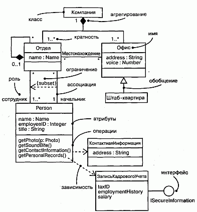

#### Рис. 8.1 Диаграмма классов

## Термины и понятия
Диаграммой классов (Class diagram) называют диаграмму, на которой показано множество классов, интерфейсов, коопераций и отношений между ними. Ее изображают в виде множества вершин и дуг.

### Общие свойства
Диаграмме классов присущи общие для всех диаграмм свойства (см. главу 7): имя и графическое содержание, являющееся одной из проекций модели. Вместе с тем диаграммы такого рода отличаются от остальных специфичным содержанием

Содержание
Диаграммы классов обычно содержат следующие сущности:

* классы (см. главы 4 и 9);
* интерфейсы (см. главу 11);
* кооперации (см. главу 27);
* отношения зависимости, обобщения и ассоциации (см. главы 5 и 10).

Подобно всем остальным диаграммам, они могут включать в себя примечания и ограничения.

Также в диаграммах классов могут присутствовать пакеты (см. главу 12) или подсистемы (см. главу 31), применяемые для группирования элементов модели в более крупные блоки. Иногда в эти диаграммы помещают экземпляры (см. главу 13), особенно если требуется визуализировать их тип (возможно, динамический).

> Примечание: На диаграммы классов похожи диаграммы компонентов и развертывания, но вместо классов они содержат соответственно компоненты и узлы.

### Типичные примеры применения
Диаграммы классов применяют для моделирования статического вида системы с точки зрения проектирования. В этом представлении удобнее всего описывать функциональные требования к системе - услуги, которые она предоставляет конечному пользователю.

Обычно диаграммы классов используются в следующих целях:

* для моделирования словаря системы (см. главу 4). Моделирование словаря системы предполагает принятие решения о том, какие абстракции являются частью системы, а какие - нет. С помощью диаграмм классов вы можете определить эти абстракции и их обязанности;
* для моделирования простых коопераций (см. главу 27). Кооперация - это сообщество классов, интерфейсов и других элементов, работающих совместно для обеспечения некоторого кооперативного поведения, более значимого, чем сумма составляющих его элементов. Например, моделируя семантику транзакций в распределенной системе, вы не сможете понять происходящие процессы, глядя на один-единственный класс, поскольку соответствующая семантика обеспечивается несколькими совместно работающими классами. С помощью диаграмм классов удается визуализировать и специфицировать эти классы и отношения между ними;
* для моделирования логической схемы базы данных. Логическую схему можно представлять себе как чертеж концептуального проекта базы данных. Во многих сферах деятельности требуется хранить устойчивую (persistent) информацию (см. главу 23) в реляционной или объектно-ориентированной базе данных. Моделировать схемы (см. главу 29) также можно с помощью диаграмм классов.

## Типичные приемы моделирования

### Простые кооперации

Классы не существуют сами по себе. Любой класс функционирует совместно с другими, реализуя семантику, выходящую за границы каждого отдельного элемента. Таким образом, кроме определения словаря системы нужно уделить внимание визуализации, специфицированию, конструированию и документированию различных способов совместной работы вошедших в словарь сущностей. Для моделирования такого "сотрудничества" применяются диаграммы классов.

Создавая диаграмму классов, вы просто моделируете часть сущностей и отношений, описываемых в представлении системы с точки зрения проектирования. Желательно, чтобы каждая диаграмма описывала только одну кооперацию.

Моделирование кооперации осуществляется следующим образом:

1. Идентифицируйте механизмы, которые вы собираетесь моделировать. Механизм - это некоторая функция или поведение части моделируемой системы, появляющееся в результате взаимодействия сообщества классов, интерфейсов и других сущностей. (Механизмы, как правило, тесно связаны с прецедентами, см. главу 16.)
2. Для каждого механизма идентифицируйте классы, интерфейсы и другие кооперации, принимающие участие в рассматриваемой кооперации. Идентифицируйте также отношения между этими сущностями.
3. Проверьте работоспособность системы с помощью прецедентов (см. главу 15). По ходу дела вы, возможно, обнаружите, что некоторые ее части оказались пропущены, а некоторые - семантически неправильны.
4. Заполните идентифицированные элементы содержанием. Что касается классов, начните с правильного распределения обязанностей; позже можно будет превратить их в конкретные атрибуты и операции.

В качестве примера на рис. 8.2 показаны классы, взятые из реализации автономного робота. Основное внимание здесь уделено тем классам, которые участвуют в механизме движения робота по заданной траектории. Как видно из рисунка, существует один абстрактный класс Мотор с двумя конкретными потомками, Мо-торПоворотногоМеханизма и ГлавныйМотор, которые наследуют пять операций их родителя. Эти два класса, в свою очередь, являются частью класса Привод. Класс АгентТраектории связан отношением ассоциации "один к одному" с классом Привод и отношением "один ко многим" - с классом ДатчикСтолкновений. Для класса АгентТраектории не показано ни атрибутов, ни операций, хотя приведены обязанности.

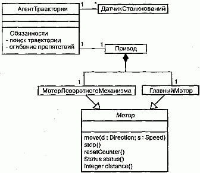

#### Рис. 8.2 Моделирование простых коопераций

В описанную систему, конечно, входит значительно больше классов, но внимание на диаграмме заостряется только на таких абстракциях, которые непосредственно участвуют в движении робота. Некоторые указанные классы могут присутствовать и на других диаграммах. Например, хотя здесь это не показано, АгентТраектории сотрудничает по крайней мере еще с двумя классами (Окружение и АгентЦели) в механизме более высокого уровня, управляющем поведением робота при наличии конфликтующих целей. ДатчикСтолкновений и Привод, а также их части сотрудничают с другим, не показанным на диаграмме классом АгентОтказа в механизме, отвечающем за постоянный контроль аппаратных сбоев. Описывая каждую из этих коопераций в отдельных диаграммах, вы сможете создать простое для восприятия представление системы с различных точек зрения.

### Логическая схема базы данных
Многие моделируемые системы содержат устойчивые объекты, то есть такие, которые можно сохранять в базе данных и впоследствии извлекать при необходимости (см. главу 23). Для этого чаще всего используют реляционные, объектно-ориентированные или гибридные объектно-реляционные базы данных. UML позволяет моделировать логические схемы баз данных, равно как и сами физические базы (см. главу 29).

Диаграммы классов UML включают в себя, как частный случай, диаграммы "сущность-связь" (E-R диаграммы), которые часто используются для логического проектирования баз данных. Но если в классических E-R диаграммах внимание сосредоточено только на данных, диаграммы классов - это шаг вперед: они позволяют моделировать также и поведение. В реальной базе данных подобные логические операции обычно трансформируются в триггеры или хранимые процедуры.

Моделирование схемы производится следующим образом:

1. Идентифицируйте классы вашей модели, состояние которых должно сохраняться и после завершения работы создавшего их приложения.
2. Создайте содержащую эти классы диаграмму классов и характеризуйте их как устойчивые с помощью стандартного помеченного значения persistent (устойчивый). Для работы со специфическими деталями базы данных вы можете определить и свои собственные помеченные значения.
3. Раскройте структурные особенности классов. В общем случае это означает, что надо детально специфицировать их атрибуты и обратить особое внимание на ассоциации и их кратности.
4. Поищите типичные структурные образцы, усложняющие проектирование физической базы данных, например циклические ассоциации, ассоциации "один к одному" и n-арные ассоциации. При необходимости создайте промежуточные абстракции для упрощения логической структуры.
5. Рассмотрите поведение этих классов, раскрывая операции, важные для доступа к данным и поддержания их целостности. В общем случае для лучшего разделения обязанностей бизнес-правила, отвечающие за манипуляции наборами объектов, должны быть инкапсулированы в слое, находящемся над этими устойчивыми классами.

Старайтесь использовать в своей работе инструментальные средства, позволяющие преобразовать логический проект в физический
> Примечание: Рассмотрение логического проектирования базы данных выходит за рамки данной книги, цель которой состоит только в том, чтобы показать, как моделировать схемы с помощью языка UML. На практике все сводится к применению стереотипов (см. главу 6), настроенных на конкретный тип используемой базы данных (реляционной или объектно-ориентированной).

На рис. 8.3 показана совокупность классов, взятых из информационной системы вуза. Этот рисунок является расширением приведенной ранее диаграммы классов и содержит достаточное количество деталей для конструирования физической базы данных. В левой нижней части диаграммы расположены классы Студент, Курс и Преподаватель. Между классами Студент и Курс есть ассоциация, показывающая, что студенты могут посещать курсы. Более того, каждый студент может посещать любое количество курсов и на каждый курс может записаться любое число студентов.

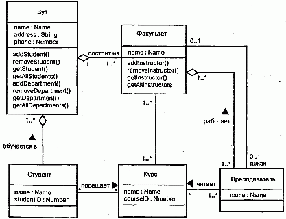

#### Рис. 8.3 Моделирование схемы

Все шесть классов на диаграмме помечены как устойчивые (persistent), то есть их экземпляры должны содержаться в базе данных или каком-то ином хранилище. Приведены также атрибуты всех шести классов. Обратите внимание, что все атрибуты являются примитивными типами (см. главу 4). Моделируя схему, отношения с непримитивными типами лучше всего представлять с помощью явного агрегирования (см. главы 5 и 10), а не с помощью атрибутов.

Два класса (Вуз и Факультет) содержат несколько операций, позволяющих манипулировать их частями. Эти операции включены из-за их важности для поддержания целостности данных (например, добавление или удаление Факультета затрагивает целый ряд других объектов).

Существует много других операций, которые стоило бы рассмотреть при проектировании этих и иных классов, например запрос о необходимых предварительных знаниях перед зачислением студента на курс. Но это, скорее, бизнес-правила, а не операции по поддержанию целостности данных, поэтому лучше располагать их на более высоком уровне абстракции.

### Прямое и обратное проектирование
Моделирование, конечно, важная вещь, но следует помнить, что основным результатом деятельности группы разработчиков являются не диаграммы, а программное обеспечение. Все усилия по созданию моделей направлены только на то, чтобы в оговоренные сроки написать программу, которая отвечает изменяющимся потребностям пользователей и бизнеса. Поэтому очень важно, чтобы ваши модели и основанные на них реализации соответствовали друг другу, причем с минимальными затратами по поддержанию синхронизации между ними (см. главу 1).

Иногда UML применяется так, что создаваемая модель впоследствии не отображается ни в какой программный код. Если вы, например, моделируете с помощью диаграмм действий (см. главу 19) бизнес-процесс, то во многих действиях будут участвовать люди, а не компьютеры. В других случаях необходимо моделировать системы, составными частями которых на данном уровне абстракции являются только аппаратные средства (хотя на другом уровне абстракции вполне может оказаться, что они содержат встроенные процессоры с соответствующим программным обеспечением).

Но чаще всего модели все-таки преобразуются в код. Хотя UML не определяет конкретного способа отображения на какой-либо объектно-ориентированный язык, он проектировался с учетом этого требования. В наибольшей степени это относится к диаграммам классов, содержание которых без труда отображается на такие известные объектно-ориентированные языки программирования, как Java, C++, Smalltalk, Eiffel, Ada, ObjectPascal и Forte. Кроме того, в проект UML была заложена возможность отображения на коммерческие объектные языки, например Visual Basic.

> Примечание: Раскрытие темы отображения UML на конкретные языки программирования для прямого и обратного проектирования выходит за рамки данной книги. На практике этот процесс сводится к использованию стереотипов и помеченных значений (см. главу 6), настроенных на определенный язык.

Прямым проектированием (Forward engineering) называется процесс преобразования модели в код путем отображения на некоторый язык реализации. Процесс прямого проектирования приводит к потере информации, поскольку написанные на языке UML модели семантически богаче любого из существующих объектно-ориентированных языков. Фактически именно это различие и является основной причиной, по которой мы, помимо кода, нуждаемся и в моделях. Некоторые структурные свойства системы, такие как кооперации, или ее поведенческие особенности, например взаимодействия, могут быть легко визуализированы в UML, но в чистом коде наглядность теряется.

Прямое проектирование диаграммы классов производится следующим образом:

1. Идентифицируйте правила отображения модели на один или несколько языков программирования по вашему выбору. Это допустимо делать как при работе над одним конкретным проектом, так и для вашей организации в целом.
2. В зависимости от семантики выбранных языков, вероятно, придется отказаться от использования некоторых возможностей UML. Например, язык UML допускает множественное наследование, а язык программирования Smalltalk - только одиночное. В связи с этим можно или запретить авторам моделей пользоваться множественным наследованием (что сделает создаваемые модели зависимыми от языка), или разработать идиомы для трансляции таких расширенных возможностей в конструкции, поддерживаемые данным языком программирования (что усложнит отображение).
3. Применяйте помеченные значения для специфицирования языка программирования. Это можно сделать как на уровне индивидуальных классов (если нужна тонкая настройка), так и на более высоком уровне, например для пакетов или коопераций.
4. Пользуйтесь инструментальными средствами для прямого проектирования моделей.

На рис. 8.4 изображена простая диаграмма классов, на которой проиллюстрирована реализация образца (см. главу 28) цепочки обязанностей. В данном примере представлены три класса: Client (Клиент), EventHandler (Обработ-чикСобытий) и GUIEventHandler (ОбработчикСобытийГИП). Первые два из них являются абстрактными, а последний - конкретным. Класс EventHandler содержит обычную для данного образца операцию handleRequest (обработатьЗапрос), хотя в рассматриваемом случае было добавлено два скрытых атрибута.

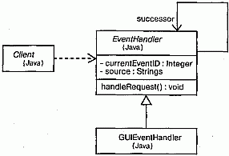

#### Рис. 8.4 Прямое проектирование

Определенное для каждого класса помеченное значение показывает, что они будут преобразованы в код на языке Java. Прямое проектирование в данном случае легко осуществимо с помощью специального инструмента. Так, для класса EventHandler будет сгенерирован следующий код:

	public abstract class EventHandler {
	  EventHandler successor;
	  private Integer currentEventID;
	  private String source;
	  EventHandler()   {}	
	  public void handleRequest()   {} 
	}

Обратным проектированием (Reverse engineering) называется процесс преобразования в модель кода, записанного на каком-либо языке программирования. В результате этого процесса вы получаете огромный объем информации, часть которой находится на более низком уровне детализации, чем необходимо для построения полезных моделей. В то же время обратное проектирование никогда не бывает полным. Как уже упоминалось, прямое проектирование ведет к потере информации, так что полностью восстановить модель на основе кода не удастся, если только инструментальные средства не включали в комментариях к исходному тексту информацию, выходящую за пределы семантики языка реализации. Пример, представленный на рис. 3.3, был создан с помощью обратного проектирования библиотеки классов языка Java.

Обратное проектирование диаграммы классов осуществляется так:

1. Идентифицируйте правила для преобразования из выбранного вами языка реализации. Это можно сделать на уровне проекта или организации в целом.
2. С помощью инструментального средства укажите код, который вы хотите подвергнуть обратному проектированию. Воспользуйтесь этим средством для создания новой модели или для модификации ранее созданной.
3. Пользуясь инструментальными средствами, создайте диаграмму классов путем опроса полученной модели. Можно начать, например, с одного или нескольких классов, а затем расширить диаграмму, следуя вдоль некоторых отношений или добавив соседние классы. Раскройте или спрячьте детали содержания диаграммы в зависимости от ваших намерений.

## Советы
Создавая диаграмму классов на языке UML, помните, что это всего лишь графическое изображение статического вида системы с точки зрения проектирования. Взятая в отрыве от остальных, ни одна диаграмма классов не может и не должна охватывать этот вид целиком. Диаграммы классов описывают его исчерпывающе, но каждая в отдельности - лишь один из его аспектов.

Хорошо структурированная диаграмма классов обладает следующими свойствами:

* заостряет внимание только на одном аспекте статического вида системы с токи зрения проектирования;
* содержит лишь элементы, существенные для понимания данного аспекта;
* показывает детали, соответствующие требуемому уровню абстракции, опуская те, без которых можно обойтись;
* не настолько лаконична, чтобы ввести читателя в заблуждение относительно важных аспектов семантики.

При изображении диаграммы классов руководствуйтесь следующими правилами:

* дайте диаграмме имя, связанное с ее назначением;
* располагайте элементы так, чтобы свести к минимуму число пересекающиеся линий;
* пространственно организуйте элементы так, чтобы семантически близкие сущности располагались рядом;
* чтобы привлечь внимание к важным особенностям диаграммы, используйте примечания и цвет;
* старайтесь не показывать слишком много разных видов отношений; как правило, в каждой диаграмме классов должны доминировать отношения какого-либо одного вида.

http://bourabai.kz/dbt/uml/ch9.htm

ЧАСТЬ III - Изучение структурного моделирования
# Глава 9. Углубленное изучение классов
* Введение
* Термины и понятия
    * Классификаторы
    * Видимость
    * Область действия
    * Абстрактные, корневые, листовые и полиморфные элементы
    * Кратность
    * Атрибуты
    * Операции
    * Шаблоны классов
    * Стандартные элементы
* Типичные приемы моделирования
    * Семантика класса
* Советы

Классы - это самые важные строительные блоки объектно-ориентированных систем. Однако классы являются всего лишь одной из разновидностей более общих строительных блоков UML - классификаторов. Классификатор - это механизм, описывающий структурные и поведенческие свойства. К числу классификаторов относятся классы, интерфейсы, типы данных, сигналы, компоненты, узлы, прецеденты (варианты использования) и подсистемы.

Классификаторы, и в особенности классы, характеризуются большим количеством дополнительных свойств, кроме простейших, таких как атрибуты и операции, которые были описаны в предыдущих разделах (см. главу 4). Можно моделировать кратность, видимость, сигнатуры, полиморфизм и другие характеристики. Язык UML позволяет определить семантику класса с расчетом на любой нужный вам уровень формализации.

В UML существует несколько разновидностей классификаторов и классов; важно выбрать ту из них, которая позволяет лучше всего моделировать необходимую вам абстракцию реальности.

## Введение
На определенном этапе строительства дома вам надлежит принять решение о том, какие материалы нужно использовать (см. главу 2). В самом начале достаточно лишь указать, что это будет дерево, камень или сталь. Такой степени детализации довольно для того, чтобы двигаться дальше. На выбор материалов, разумеется, будут влиять требования проекта, - например, сталь и бетон подойдут, если дом должен выдерживать натиск ураганов. Впоследствии ваш выбор определит дальнейшее развитие проекта, - скажем, выбрав дерево вместо стали, вы должны будете учитывать, что оно выдерживает меньшую нагрузку.

По мере дальнейшей работы над проектом базовые решения придется уточнить и добавить ряд деталей, которые позволят конструктору произвести расчеты на прочность, а строителям - приступить к возведению дома. Например, вы можете выбрать не просто дерево, но дерево определенной твердости или пропитанное определенным составом, который защищает древесину от насекомых.

Те же самые правила применимы и к созданию программного обеспечения. В самом начале работы над проектом достаточно сказать, что вы собираетесь использовать класс Клиент, выполняющий определенные обязанности (см. главу 6). По мере уточнения архитектуры и перехода к конструированию придется определить структуру класса (его атрибуты) и его поведение (операции), необходимые и достаточные для выполнения указанных обязанностей. Наконец, дойдя до стадии преобразования модели в исполняемую систему, вы должны будете смоделировать и такие детали, как видимость отдельных атрибутов и операций, семантику параллелизма класса в целом и его операций, а также реализуемые классом интерфейсы. Как видно из рис. 9.1, язык UML позволяет определять большое количество развитых свойств класса. Эта нотация дает возможность визуализировать, специфицировать, конструировать и документировать класс на любом желаемом уровне детализации, достаточном для поддержки прямого и обратного проектирования моделей и кода (см. главы 8, 14, 17-19, 24, 29, 30).

vРис. 9.1 Развитые свойства класса

## Термины и понятия
Классификатор (Classifier) - это механизм, описывающий структурные и поведенческие свойства. К числу классификаторов относятся классы, интерфейсы, типы данных, сигналы, компоненты, узлы, прецеденты и подсистемы.

### Классификаторы
В процессе моделирования вы сталкиваетесь с абстракциями сущностей, принадлежащих реальному миру, и сущностей, введенных вами для решения задачи (см. главу 4). Например, при создании системы заказов, работающей через сеть Internet, вам, скорее всего, придется включить в проект класс Клиент (описывающий заказчика) и класс Транзакция (артефакт реализации, соответствующий атомарному действию). В детализированной системе, вероятно, будет еще компонент Цены, экземпляры которого размещаются на всех клиентских узлах. Каждая из перечисленных абстракций фигурирует в модели вместе со своими конкретными экземплярами, поэтому разделение логики и экземпляров сущностей является важной частью моделирования. (Дихотомия "класс/объект" обсуждается в главе 2.)

Некоторые сущности в UML не имеют экземпляров (см. главу 13). К их числу относятся, например, пакеты (см. главу 12) и отношения обобщения (см. главы 5 и 10). В общем смысле те элементы моделирования, которые могут иметь экземпляры, называются классификаторами (ассоциации, рассматриваемые в главах 5 и 10, и сообщения, обсуждаемые в главе 15, также могут иметь экземпляры, но они отличаются от экземпляров классов). Еще важнее то, что классификаторы характеризуются структурными (в форме атрибутов) и поведенческими (в форме операций) свойствами. Все экземпляры одного классификатора обладают общим рядом свойств.

Самым важным видом классификатора в UML является класс. Классом называется описание совокупности объектов с общими атрибутами, операциями, отношениями и семантикой. Однако помимо классов существуют и другие классификаторы:

* интерфейс - набор операций, используемых для того, чтобы специфицировать услуги, предоставляемые классом или компонентом (см. главу 11);
* тип данных - тип, значения которого не индивидуализированы; сюда входят примитивные встроенные типы, такие как числа и строки, а также перечислимые типы, например Boolean (см. главу 4);
* сигнал - спецификация асинхронного стимула, используемого для связи между экземплярами (см. главу 20);
* компонент - физическая замещаемая часть системы, соответствующая спецификации набора интерфейсов и обеспечивающая их реализацию (см. главу 25);
* узел - физический элемент, который существует во время выполнения приложения и представляет собой вычислительный ресурс; обычно он обладает, как минимум, некоторой памятью, а иногда и способностью к обработке данных (см. главу 26);
* прецедент, или вариант использования, - описание совокупности последовательностей действий (в том числе вариантных), выполняемых системой, которые вызывают наблюдаемое изменение, представляющее интерес для конкретного актера (см. главу 16);
* подсистема - совокупность элементов, из которых отдельные составляют спецификацию поведения других элементов (см. главу 31).

Почти каждый из перечисленных видов классификаторов обладает как структурными, так и поведенческими свойствами (исключением являются интерфейсы -они могут не иметь атрибутов). Используя любой из них в модели, вы можете применять все описанные в этой главе свойства, обеспечивая такой уровень детализации, который необходим для адекватного описания сути вашей абстракции.

Графические изображения классификаторов представлены на рис. 9.2.

#### Рис. 9.2 Классификаторы

> Примечание: Придерживаясь минималистского подхода, можно было бы использовать одну и ту же пиктограмму для всех классификаторов. Однако это неразумно, поскольку, например, классы и компоненты являются принципиально разными абстракциями (первый - логической, а второй - физической), и на этом основании стоит отвести для них несходные графические образы. С другой стороны, бросаться в противоположную крайность - использовать различные пиктограммы для каждого типа классификаторов - также нe имeem смысла, поскольку, например, классы и типы данных не слишком различаются между собой. В языке UML найден компромисс: существенно различающиеся классификаторы имеют собственные пиктограммы, а остальные выделяются специальными ключевыми словами (такими, как type, signal или subsystem).

### Видимость
Одна из деталей, наиболее существенных для атрибутов и операций классификаторов, - их видимость. Видимость свойства говорит о том, может ли оно использоваться другими классификаторами. Естественно, это подразумевает видимость самого классификатора. Один классификатор может "видеть" другой, если тот находится в области действия первого и между ними существует явное или неявное отношение (см. главы 5 и 10). В языке UML можно определить три уровня видимости:

* public (открытый) - любой внешний классификатор, который "видит" данный, может пользоваться его открытыми свойствами. Обозначается знаком + (плюс) перед именем атрибута или операции;
* protected (защищенный) - любой потомок данного классификатора (см. главу 5) может пользоваться его защищенными свойствами. Обозначается знаком # (диез);
* private (закрытый) - только данный классификатор может пользоваться закрытыми свойствами. Обозначается символом - (минус).

На рис. 9.3 показаны открытые, защищенные и закрытые атрибуты и методы для класса Toolbar.

#### Рис. 9.3 Видимость

Видимость свойств классификатора определяют для того, чтобы скрыть детали его реализации и показать только те особенности, которые необходимы для осуществления обязанностей, продекларированных абстракцией. В этом и заключается основная причина сокрытия информации, без чего не обойтись при создании надежной и гибкой системы. Если символ видимости явно не указан, обычно предполагается, что свойство является открытым. Отношения дружественности (Friendship) позволяют классификатору показывать другим свои закрытые детали (см. главу 10).

> Примечание: Видимость в UML соответствует общепринятой семантике большинства языков программирования, таких как С++, Java, Ada и Eiffel.

### Область действия
Еще одной важной характеристикой атрибутов и операций классификатора является область действия (Scope). Задавая область действия некоторого свойства, тем самым указывают, будет ли оно проявлять себя по-разному в каждом экземпляре (см. главу 13) классификатора, или одно и то же значение свойства будет разделяться (то есть совместно использоваться) всеми экземплярами. В UML определены два вида областей действия:

* instance (экземпляр) - у каждого экземпляра классификатора есть собственное значение данного свойства;
* classifier (классификатор) - все экземпляры классификатора совместно используют общее значение данного свойства.

На рис. 9.4 (упрощенный вариант предыдущего рисунка) показано, что имя свойства, которое имеет область действия classifier, подчеркивается. Если подчеркивание отсутствует, предполагается область действия instance.

#### Рис. 9.4 Область действия

Как правило, свойства моделируемых классификаторов имеют область действия экземпляра. Свойства с областью действия классификатора чаще всего применяются для описания закрытых атрибутов, общих для всех экземпляров, например для генерации уникальных идентификаторов или в операциях, создающих экземпляры класса.

### Абстрактные, корневые, листовые и полиморфные элементы
Отношения обобщения используются для моделирования иерархии классов, верхние уровни которой занимают общие абстракции, а ниже находятся специализированные (см. главы 5 и 10). Внутри этой иерархии некоторые классы определяют как абстрактные, то есть не имеющие непосредственных экземпляров (см. главу 13). В языке UML имя абстрактного класса пишут курсивом. Например, как видно из рис. 9.5, абстрактными являются классы Icon, Rectangularlcon и Arbitrarylcon. Наоборот, конкретными называются классы, которые могут иметь непосредственные экземпляры (на рис. 9.5 это Button и OkButton).

#### Рис. 9.5 Абстрактные и конкретные классы и операции

При моделировании класса часто возникает потребность задать ему свойства, унаследованные от более общих классов и, наоборот, предоставить возможность более специализированным классам наследовать особенности данного. Такая семантика легко обеспечивается для классов средствами UML. Можно определить и такие классы, у которых нет потомков. Они называются листовыми и задаются в UML c помощью свойства leaf, написанного под именем класса. Например, класс OkButton на рис. 9.5 является листовым и поэтому не имеет потомков.

Реже используется, хотя и остается весьма полезной, возможность задать класс, не имеющий родителей. Такой класс называется корневым и специфицируется с помощью свойства root, записанного под его именем. На рис. 9.5 корневым является класс Icon. Если имеется несколько независимых иерархий наследования, то начало каждой удобно обозначать таким способом.

Операции могут иметь сходные свойства. Как правило, операции являются полиморфными, - это значит, что в различных местах иерархии классов можно определять операции с одинаковыми сигнатурами. При этом те операции, которые определены в классе-потомке, перекрывают действие тех, что определены в родительских классах. Когда во время исполнения системы поступает какое-то сообщение (см. главу 15), операция по его обработке вызывается полиморфно, -иными словами, выбирается та, которая соответствует типу объекта. На рис. 9.5 операции display и islnside являются полиморфными, a Icon: :display ( ), кроме того, еще и абстрактна. Это значит, что она неполна и реализацию должен предоставить потомок. В UML имена абстрактных операций пишутся курсивом, как и в случае с классами. Напротив, операция Icon: : get ID () является листовой, на что указывает слово leaf. Это означает, что данная операция не полиморфна и не может быть перекрыта другой.

> Примечание: Абстрактные операции соответствуют чисто виртуальным операциям языка C++, листовые операции - невиртуальным операциям этого языка

### Кратность
При работе с классом разумно предположить, что может существовать любое количество его экземпляров (см. главу 13) - если, конечно, это не абстрактный класс, у которого вообще не существует непосредственных экземпляров, хотя у его потомков их может быть любое количество. В некоторых случаях, однако, число экземпляров класса нужно ограничить. Чаще всего возникает необходимость задать класс, у которого:

* нет ни одного экземпляра - тогда класс становится служебным (Utility), содержащим только атрибуты и операции с областью действия класса; D ровно один экземпляр - такой класс называют синглетным (Singleton);
* заданное число экземпляров;
* произвольное число экземпляров - вариант по умолчанию.

Количество экземпляров класса называется его кратностью. В общем смысле кратность - это диапазон возможных кардинальных чисел некоторой сущности (кратность встречается также у ассоциаций, см. главы 5 и 10). В языке UML кратность класса задается выражением, написанным в правом верхнем углу его пиктограммы. Например, как показано на рис. 9.6, класс NetworkController является синглетным, а у класса ControlRod имеется ровно три экземпляра.

#### Рис. 9.6 Кратность

Кратность применима и к атрибутам (их связь с семантикой ассоциаций обсуждается в главе 10). Кратность атрибута записывают в виде выражения, заключенного в квадратные скобки и расположенного сразу после имени атрибута. Например, у экземпляра класса NetworkController может быть два или более экземпляров атрибута consolePort.

### Атрибуты
На самом высоком уровне абстракции, моделируя структурные свойства класса (то есть атрибуты), вы просто записываете их имена. Обычно этого вполне достаточно, чтобы читатель мог понять общее назначение модели. В дополнение к этому, как было описано выше, можно определить видимость, область действия и кратность каждого атрибута. Кроме того, можно задать тип, начальное значение и изменяемость атрибутов. А для обозначения множества логически связанных атрибутов допустимо использовать стереотипы (см. главу 6).

Полная форма синтаксиса атрибута в языке UML следующая:

	[visibility] name [multiplicity]   [: type] 
	  [= initial-value]   [{property-string}]

Ниже приводятся примеры допустимых объявлений атрибутов:

* origin - только имя;
* + origin - видимость и имя;
* origin : Point - имя и тип;
* head : *Item - имя и сложный тип;
* name [ 0 . . 1 ] : String - имя, кратность и тип;
* origin : Point = (0 , 0) - имя, тип и начальное значение;
* id : Integer {frozen} - имя и свойство.

Наряду с атрибутами можно использовать три свойства:

* changeable (изменяемый) - ограничений на изменение значений атрибута не установлено;
* addOnly (только добавляемый) - разрешается добавлять новые значения для атрибутов с кратностью больше единицы, но созданное значение не может быть изменено или удалено;
* frozen (замороженный) - после инициализации объекта нельзя изменять значения его атрибутов.

Если явно не оговорено противное, то все атрибуты изменяемы (changeable). При моделировании постоянных или однократно задаваемых атрибутов можно использовать свойство frozen.

> Примечание: Свойство frozen соответствует ключевому слову const вязыке C++.

### Операции
На самом высоком уровне абстракции при моделировании поведенческих характеристик класса (то есть его операций и сигналов, см. главу 20) вы просто записываете их имена. Этого обычно бывает достаточно, чтобы читатель мог понять общее назначение модели. Кроме этого, как описывалось в предыдущих разделах, вы можете определить видимость и область действия каждой операции. Можно задать также ее параметры, тип возвращаемого значения, семантику параллелизма и некоторые другие свойства. Имя операции совместно с ее параметрами (включая тип возвращаемого значения, если таковое имеется) называют сигнатурой операции. Для описания множества логически связанных операций, таких, например, как вспомогательные функции, можно использовать стереотипы (см. главу 6).

> Примечание: В языке UML существует различие между операцией и методом. Операциями называются услуги, которые можно запросить у любого объекта класса для изменения поведения; метод - это реализация операции. Для любой неабстрактной операции класса должен быть определен метод, содержащий ее исполняемый алгоритм (обычно записываемый в виде структурированного текста или на каком-либо языке программирования). В иерархии наследования для одной операции может быть определено несколько методов, из которых нужный полиморфно выбирается во время выполнения.

Полный синтаксис операции в языке UML таков:

	[visibility] name [(parameter-list)]   [: return-type] 
	  [{property-string}]

Ниже приводятся некоторые допустимые объявления операций:

display - только имя;
\+ display - видимость и имя;
set (n: Name, s: String) - имя и параметры;
getID() : Integer - имя и возвращаемое значение;
restart() {guarded} - имя и свойство.
Сигнатура операции может содержать ноль или более параметров, каждый из которых имеет следующий синтаксис:

    [direction] name : type [= default-value] 

Параметр direction может принимать любое из нижеперечисленных значений:

* in - входящий параметр, который не может быть модифицирован;
* out - выходящий параметр, который может быть изменен, чтобы передать информацию вызвавшей процедуре;
* inout - входящий параметр, который может быть изменен.

Помимо описанного ранее свойства leaf для операций определены еще четыре свойства:

* isQuery (запрос) - выполнение операции не изменяет состояния системы. Другими словами, операция является просто функцией без побочных эффектов;
* sequential (последовательная) - при вызове операции необходимо гарантировать, что в любой момент объект выполняет только один поток. При наличии нескольких потоков управления нельзя обеспечить семантику и целостность объекта;
* guarded (охраняемая) - семантика и целостность объекта при наличии нескольких потоков управления гарантируются упорядочением всех обращений к его охраняемым операциям. На практике это означает возможность вызова только одной операции объекта в любой момент времени, то есть все сводится к семантике sequential;
* concurrent (параллельная) - семантика и целостность объекта при наличии нескольких потоков управления гарантируются благодаря тому, что операция рассматривается как атомарная. Разные параллельные потоки управления могут одновременно вызывать одну и ту же параллельную операцию объекта без нарушения семантики. Проектировать параллельные операции необходимо так, чтобы обеспечивалась корректность работы в случае одновременного выполнения в том же объекте какой-либо последовательной или охраняемой операции.

Последние три свойства (sequential, guarded и concurrent) описывают семантику параллелизма операции, поэтому задавать их имеет смысл только при наличии в вашей модели активных объектов, процессов или нитей (см. главу 22).

### Шаблоны классов
Шаблоном называется параметризованный элемент. В таких языках программирования, как C++ или Ada, предусмотрена возможность создавать шаблоны классов, определяющие семейства классов (можно задавать также шаблоны функций, определяющие семейства функций). Параметрами шаблона могут быть классы, объекты или значения. Шаблон нельзя использовать непосредственно; сначала его нужно инстанцировать, то есть конкретизировать. Процесс инстанцирова-ния - это связывание формальных параметров шаблона с фактическими. В результате из шаблона класса получается конкретный класс, с которым можно работать как с любым другим.

Чаще всего шаблоны классов используют при описании контейнеров, чтобы затем инстанцировать их для хранения конкретных элементов, - такой подход делает их безопасными по отношению к типам. Например, в нижеприведенном фрагменте кода на языке C++ объявляется параметризованный класс Map (Карта).

	template<class Item, class Value, int Buckets>
	class Map {
	public:
	  virtual Boolean bind (const Item&, const Value&);
	  virtual Boolean isBound (const Items) const;
	  . . .
	};

Затем можно инстанцировать этот шаблон для отображения объектов класса Customer (Клиент) на объекты класса Order (Заказ):

	m : Map <Customer, Order, 3>

Язык UML также позволяет моделировать шаблоны классов (базовые свойства классов обсуждаются в главе 4). Как видно из рис. 9.7, такой класс изображается в точности как обычный, но в верхнем правом углу его пиктограммы находится дополнительная ячейка, нарисованная пунктиром; в ней перечислены параметры шаблона.

#### Рис. 9.7 Шаблоны классов

На данном рисунке показано также, что моделировать инстанцирование шаблона класса можно двумя способами. Во-первых - неявно, для чего требуется объявить класс, имя которого обеспечивает связывание. Во-вторых, можно явным образом определить зависимость (см. главы 5 и 10) со стереотипом bind (см. главу 6), показывающую, что источник инстанцирует целевой шаблон с заданными фактическими параметрами.

Стандартные элементы
Все механизмы расширения UML (см. главу 6) применимы к классам. Чаще всего для расширения свойств класса (например, для специфицирования его версии) используются помеченные значения, а для определения новых видов компонентов (специфичных для данной модели) - стереотипы.

В UML определены четыре стандартных стереотипа, применимые к классам:

* metaclass - определяет классификатор, все объекты которого являются классами;
* powertype - определяет классификатор, все объекты которого являются потомками данного родителя;
* stereotype - определяет, что данный классификатор является стереотипом, который можно применить к другим элементам;
* utility - определяет класс, атрибуты и операции которого находятся в области действия всех классов.

> Примечание: В следующих главах книги рассматривается ряд других стандартных стереотипов, применимых к классам: interface, type, implementationClass (см. главу 11), actor (см. главу 16), exception, signal (см. главу 20), process и thread.

## Типичные приемы моделирования

### Семантика класса

Чаще всего классы используют для моделирования абстракций, извлеченных из решаемой проблемы или технологии, применяемой для ее решения (см. главу 4). Следующим шагом после того, как вы идентифицировали эти абстракции, будет определение их семантики.

Язык UML предоставляет в ваше распоряжение широчайший спектр возможностей моделирования (см. главу 1), начиная от неформальных (обязанности) и заканчивая сугубо формальными (OCL - язык объектных ограничений). Имея такой богатый выбор, вы сами можете решить, какой уровень детализации необходим для выражения модели. Если создаваемая модель предназначена для общения с конечными пользователями или экспертами в предметной области, то лучше сделать ее менее формальной. Когда в вашу задачу входит двусторонняя поддержка проектирования, то есть переход от модели к коду и обратно, стоит прибегнуть к большей формализации. Если же вам требуется приводить математически строгие суждения о модели и доказывать ее корректность, формализуйте ее настолько, насколько это возможно.

> Примечание: Менее формальная модель - не обязательно менее аккуратная. Скорее, это значит, что она менее полна и детализирована. Вообще, целесообразно придерживаться середины между крайней степенью формализма и неформальным подходом. Необходимо включать достаточно деталей, чтобы можно было конструировать исполняемые артефакты, но в то же время скрывать некоторые элементы, чтобы не запутать читателя.

Для моделирования семантики класса можно воспользоваться любыми из перечисленных ниже возможностей (они расположены в порядке возрастания формализации):

1. Определите обязанности класса. Обязанностью называется контракт или обязательство, "подписываемое" типом или классом (см. главу 4). Изображается оно в виде присоединенного к классу примечания (со стереотипом responsibility) или дополнительного раздела в его пиктограмме.
2. Опишите семантику класса в целом с помощью структурированного текста, который изображается в виде примечания (со стереотипом semantics), присоединенного к классу.
3. Определите тело каждого метода (см. главу 3) с помощью структурированного текста или языка программирования и поместите определение в примечание, присоединенное к операции отношением зависимости.
4. Специфицируйте пред- и постусловия каждой операции (см. главу 19), а также инварианты класса в целом с помощью структурированного текста. Эти элементы изображаются в виде примечаний (со стереотипами precondition, postcondition и invariant), присоединенных к операции или классу отношениями зависимости.
5. Определите автомат класса. Автомат - это алгоритм поведения, описывающий последовательность состояний, через которые проходит объект на протяжении своего жизненного цикла, реагируя на различные события, а также сами реакции на эти события (см. главу 21).
6. Специфицируйте представляющие класс кооперации. Кооперацией называется совокупность ролей и других элементов, работающих совместно для обеспечения некоторого кооперативного поведения, более значимого, чем сумма всех его составляющих (см. главу 27). Поскольку у кооперации имеются структурная и динамическая составляющие, вы можете с их помощью специфицировать все аспекты семантики класса.
7. Определите пред- и постусловия каждой операции и инварианты класса в целом с помощью такого формализованного языка, как ОСL (язык ОСL обсуждается в книге "The Unified Modeling Language Reference Manual")

На практике для моделирования различных абстракций системы используется некоторая комбинация вышеописанных методов. (Для моделирования семантики операций можно применять также диаграммы деятельности, см. главу 19.)

> Примечание: Описывая семантику класса, помните, что ваша главная цель -определить, что и как делает класс. Семантика того, что делает класс, соответствует его открытому, внешнему представлению, а того, как он это делает, - закрытому, внутреннему. Часто используют комбинацию этих двух видов, акцентируя внимание на внешнем представлении для клиентов класса и на внутреннем - для тех, кто его реализует.

## Советы
Моделируя классификаторы в языке UML, помните, что в вашем распоряжении имеется множество строительных блоков - интерфейсы, классы, компоненты и т.д. Из них вы должны выбрать тот, который наилучшим образом соответствует вашей абстракции. Хорошо структурированный классификатор обладает следующими свойствами:

* наделен как структурными, так и поведенческими аспектами;
* внутренне согласован и слабо связан с другими классификаторами;
* раскрывает только те особенности, которые необходимы для использующих класс клиентов, и скрывает остальные;
* его семантика и назначение не допускают неоднозначного толкования;
* не настолько формализован, чтобы лишить всякой свободы тех, кто будет его реализовывать;
* специфицирован в достаточной степени, чтобы исключить неоднозначное толкование его назначения
.
Изображая классификатор в UML, примите во внимание следующие рекомендации:

* показывайте только те его свойства, которые необходимы для понимания абстракции в контексте класса;
* используйте такие стереотипы, которые наилучшим образом отражают назначение классификатора.

http://bourabai.kz/dbt/uml/ch10.htm

ЧАСТЬ III - Изучение структурного моделирования
# Глава 10. Углубленное изучение отношений
* Введение
* Термины и понятия
    * Зависимости
    * Обобщения
    * Ассоциации
    * Реализация
* Типичные приемы моделирования
    * Сети отношений
* Советы
    
Моделируя сущности, составляющие словарь системы, необходимо показать и отношения между ними. Эти отношения могут быть весьма сложными. Для визуализации, специфицирования, конструирования и документирования сетей отношений необходимо воспользоваться более развитыми возможностями UML.

Отношения зависимости, обобщения и ассоциации представляют собой три наиболее важных связующих строительных блока в UML. Они характеризуются рядом дополнительных свойств, помимо тех, что описаны в предыдущих разделах книги (см. главу 5) - в частности, позволяют моделировать множественное наследование, навигацию, композицию, уточнение и другие характеристики модели. Четвертый тип отношений - отношения реализации - нужен для моделирования связей между интерфейсом (см. главу 11) и классом или компонентом (см. главу 25), а также между прецедентом (см. главу 16) и кооперацией (см. главу 27). Язык UML дает возможность моделировать семантику отношений на любом уровне формализации.

При работе со сложным рядом отношений на каждом уровне детализации системы необходимо выбирать подходящие отношения, чтобы в итоге не создать чрезмерно усложненную или слишком упрощенную модель.

## Введение
Одной из наиболее ответственных задач при строительстве дома является определение взаимного расположения комнат. На одном из уровней абстракции вы можете решить, что главная спальня должна находиться на первом этаже, подальше от фасада дома. Затем, проигрывая в уме различные сценарии (см. главу 16), вы станете обдумывать плюсы и минусы такого расположения. Предположим, например, что требуется перенести в дом из гаража купленные в магазине продукты. Вряд ли стоит ходить из гаража на кухню через спальню, так что от принятого решения придется отказаться.

Вы можете составить довольно полную картину поэтажного плана, обдумывая подобные базовые отношения и варианты использования. Этого, однако, будет недостаточно. Чтобы избежать серьезных просчетов, придется рассмотреть и более сложные отношения.

Например, вас может устраивать расположение комнат на каждом этаже, но при этом комнаты, находящиеся на различных этажах, могут стыковаться совершенно непредсказуемым образом. Допустим, комната вашей дочери-подростка оказалась прямо над вашей спальней, и дочь вдруг решила научиться играть на барабане... Наверняка вы решите, что такой план дома следует отвергнуть.

Потребуется учитывать также системы жизнеобеспечения. В целях снижения затрат разумно было бы расположить комнаты так, чтобы системы отопления и вентиляции размещались в смежных стенах, распространяя свое действие сразу на несколько комнат.

Подобные проблемы возникают и при создании программного обеспечения. Зависимости, обобщения и ассоциации - это самые распространенные типы отношений, встречающиеся при моделировании программных систем. Однако вам придется освоить ряд достаточно сложных возможностей их использования, чтобы адекватно передать детали, необходимые для успешного завершения работы над проектом.

UML предоставляет разработчику довольно широкий простор для деятельности, как показывает рис. 10.1. Данная нотация позволяет визуализировать, специфицировать, конструировать и документировать комплекс отношений на любом желаемом уровне детализации. Ее возможностей вполне достаточно для поддержки прямого и обратного проектирования моделей и кода (см. главы 8, 14, 17-19, 24, 29 и 30).

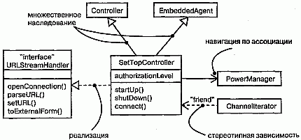

#### Рис. 10.1 Различные типы отношений

## Термины и понятия
Отношением (Relationship) называется связь между сущностями. В объектно-ориентированном моделировании особое значение имеют четыре типа отношений: зависимости, обобщения, ассоциации и реализации. Отношения изображаются в виде линий различного начертания.

### Зависимости
Зависимостью (Dependency) называется отношение использования, определяющее, что изменение в спецификации одной сущности (например, класса SetTopController) может повлиять на другую сущность, которая ее использует (в данном случае - на класс ChannelIterator), причем обратное в общем случае неверно (см. главу 5). Графически зависимости изображают в виде пунктирной линии со стрелкой, направленной в сторону той сущности, от которой зависит еще одна. Применяйте зависимости, если хотите показать, что одна сущность использует другую.

Для большинства отношений использования вполне достаточно обычной зависимости без каких-либо дополнений. Но если необходимо передать некий смысловой нюанс, то стоит учесть, что в UML определен целый ряд стереотипов, применимых к зависимостям (о механизмах расширения UML см. главу 6). Всего существует 17 таких стереотипов, объединенных в шесть групп:

Прежде всего, это восемь стереотипов, применимых к отношениям зависимости между классами и объектами на диаграмме классов (см. главу 8).

* bind - определяет, что источник инстанцирует целевой шаблон с заданными фактическими параметрами. Этот стереотип используют при моделировании деталей шаблонов классов (см. главу 9). Например, отношения между шаблоном класса-контейнера и экземпляром этого класса моделируются как зависимость bind. Стереотип bind должен содержать список фактических аргументов, соответствующих формальным аргументам шаблона;
* derive - показывает, что источник может быть вычислен по целевому элементу. С помощью этого стереотипа моделируют отношения между двумя атрибутами (см. главу 4 и 9) или ассоциациями (см. главу 5), причем один из соотносимых элементов является конкретным, а другой - концептуальным. Скажем, класс Человек имеет атрибут Дата Рождения (конкретный) и атрибут Возраст (который может быть выведен из первого и потому не объявлен в классе отдельно). Отношения между ними можно определить с помощью зависимости типа derive, при этом Возраст будет производным от ДатаРождения;
* friend - указывает, что источнику даются специальные права видимости свойств цели (см. главу 5). Используйте этот стереотип для моделирования отношений, подобных отношениям между классом и его друзьями в языке C++;
* instanceOf - говорит, что исходный объект является экземпляром целевого классификатора;
* instantiate - показывает, что источник создает экземпляры целевого элемента.
* Последние два стереотипа позволяют явно моделировать отношения "класс/ объект" (см. главу 2). instanceOf применяется для моделирования отношения между классом и объектом на одной и той же диаграмме или же между классом и его метаклассом instantiate указывает, какой элемент создает объекты другого;
* powertype - означает, что все объекты целевого классификатора являются потомками заданного родителя. Этот стереотип применяется при моделировании классов, содержащих другие классы, например при проектировании баз данных, о чем идет речь в главах 8 (логические базы данных) и 29 (физические базы данных).
* refine - свидетельствует, что источник находится на более низком уровне абстракции, чем цель. Данный стереотип используется для моделирования концептуально одинаковых классов, рассматриваемых на различных уровнях абстракции. Так, класс Клиент, возникший на стадии анализа, будет уточнен в фазе проектирования, в результате чего появится более детальный класс Клиент вместе со своей реализацией;
* use - показывает, что семантика исходного элемента зависит от семантики открытой части целевого. Этот стереотип позволяет явно указать, что зависимость по своему типу принадлежит к отношениям использования, в отличие от отношений зависимости, обозначаемых другими стереотипами.

Следующая группа, состоящая из двух стереотипов, применяется для описания отношений зависимости между пакетами (см. главу 12):

* access - показывает, что исходный пакет имеет право ссылаться на элементы целевого пакета;
* import - вид доступа, определяющий, что открытое содержание целевого пакета входит в простое (неструктурированное) пространство имен источника, как если бы оно было там объявлено.

Стереотипы access и import применяются для моделирования отношений между пакетами. Элементы двух равноправных пакетов не могут ссылаться друг на друга, если между ними явно не определена зависимость типа access или import. Допустим, например, что целевой пакет Т содержит класс С. Если определить зависимость типа access от S к Т, то элементы S могут ссылаться на С, используя его полностью квалифицированное имя Т: : С. Если же от пакета S к Т определена зависимость типа import, то элементы S могут ссылаться на класс С, используя простые имена, то есть не квалифицируя имя целиком.

Два стереотипа применимы к отношениям зависимости между прецедентами (см. главу 16):

* extend - показывает, что целевой прецедент расширяет поведение исходного;
* include - говорит о том, что исходный прецедент явным образом включает в себя поведение целевого.

Эти стереотипы (совместно с простыми обобщениями) применяются, если надо разложить прецедент на части, допускающие многократное применение.

При моделировании взаимодействий между объектами (см. главу 15) используют следующие три стереотипа:

* become - сообщает, что целевой объект - тот же исходный, но в более поздний момент времени и, возможно, с другими значениями, состоянием или ролями;
* call - указывает, что исходная операция вызывает целевую;
* copy - говорит, что целевой объект является точной, но независимой копией исходного.

Стереотипы become и copy используются, чтобы показать роли, состояния или значения атрибутов одного объекта в различные моменты времени и в различных точках пространства (см. главу 23). Стереотип call применяется для моделирования вызывающих зависимостей между операциями.

В контексте автоматов (см. главу 21) применяют только один стереотип.

* send - определяет, что исходная операция посылает событие целевому объекту. Его используют для моделирования операций (например, входящей в состав действия, ассоциированного с изменением состояния), которые отправляют заданное событие целевому объекту (с ним, в свою очередь, может быть ассоциирован автомат). Фактически зависимости типа send позволяют связать вместе независимые автоматы.

Наконец, последний стереотип встречается в контексте организации элементов системы в подсистемы и модели (см. главу 31).

* trace - показывает, что целевой объект является историческим предшественником исходного. Его применяют при моделировании отношений между элементами различных моделей. Так, в контексте системной архитектуры (см. главу 2) прецедент из одноименного вида (представляющего функциональные требования) можно связать отношением трассировки с пакетом в виде с точки зрения проектирования (представляющем артефакты, которые реализуют этот прецедент).

> Примечание: Семантически все отношения, включая обобщения, ассоциации и реализации, являются разновидностями отношений зависимости. Но обобщения, ассоциации и реализации обладают семантикой, достаточно важной для того, чтобы рассматривать их как особые виды отношений. Между тем вышеперечисленные стереотипы, которые позволяют выразить семантические нюансы отношений зависимости, не настолько далеки от простого отношения зависимости, чтобы выделять какой-то из них в особый вид отношений. Опыт показывает, что подобный подход позволяет соблюсти баланс между возможностью подчеркнуть важные разновидности отношений и нежеланием смутить разработчика слишком большим числом вариантов выбора. Лучше всего, если вы начнете с моделирования обобщений, ассоциаций и реализаций, а все остальные отношения будете рассматривать Как вариации отношений зависимости.

### Обобщения
Обобщением называется отношение между общей сущностью, которую называют суперклассом или родителем, и более специализированной ее разновидностью, называемой подклассом или потомком (см. главу 5). Например, общий класс Window (Окно) можно специализировать, создав класс-потомок Mu1tiPaneWindow (МногоФорточноеОкно). Благодаря отношениям обобщения от потомка к родителю MultiPaneWindow унаследует структуру и поведение своего родителя - Window. У потомка могут появиться новые элементы структуры или поведения, а унаследованные - модифицироваться. В отношениях обобщения экземпляры потомка везде могут использоваться вместо экземпляров родителя, - это значит, что потомок может замещать родителя. Как правило, достаточно одиночного наследования, когда у класса имеется всего один родитель. Но иногда используют и множественное наследование, которое тоже можно моделировать на языке UML. Так, на рис. 10.2 показано множество классов, взятых из финансового приложения. Как видите, класс Активы имеет трех потомков: БанковскийСчет, Недвижимость и ЦенныеБумаги. У первого и последнего из них имеются собственные потомки. Например, Акция и Облигация являются потомками класса ЦенныеВумаги.

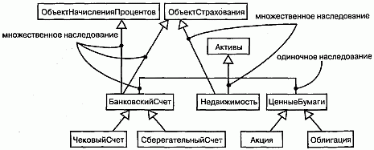

#### Рис. 10.2 Множественное наследование

Два класса (БанковскийСчет и Недвижимость) наследуют от нескольких родителей. Класс Недвижимость, например, является потомком классов Активы и ОбъектСтрахования, а класс БанковскийСчет - потомком классов Объ-ектНачисленияПроцентов, ОбъектСтрахования и Активы. Классы-родители (в данном случае ОбъектНачисленияПроцентов и ОбъектСтрахования) называются смешивающими (mixins), поскольку порождают потомков не самостоятельно, а совместно с другими классами (Активы).
Примечание: С множественным наследованием следует обращаться осторожно. Если структура или поведение нескольких предков перекрываются, у вас могут возникнуть проблемы. Как правило, множественное наследование можно заменить делегированием, когда потомок наследует только от одного родителя, а затем использует агрегирование для получения структуры и поведения от второстепенных предков. Недостатком такого подхода является потеря семантики замещаемости с второстепенными предками.
Для большинства отношений наследования, которые вам встретятся, будет достаточно простых отношений обобщения без каких-либо дополнений (механизмы расширения UML рассмотрены в главе 6). Но если вы хотите специфицировать смысловые нюансы, можно воспользоваться одним стереотипом и четырьмя ограничениями, определенными в языке UML для применения совместно с обобщениями (см. "Приложение В").

Во-первых, имеется один стереотип.

* implementation - показывает, что потомок наследует реализацию родителя, но не открывает и не поддерживает его интерфейсы, тем самым делая невозможным замещение. Этот стереотип можно использовать для моделирования закрытого наследования, поддерживаемого в языке C++.

Кроме стереотипа, к отношениям обобщения применимы четыре стандартных ограничения. Вот первая пара:
* complete - показывает, что в модели определены все потомки в данном отношении обобщения (хотя некоторые могут быть скрыты на диаграмме) и наличие дополнительных потомков не допускается;
* incomplete - показывает, что определены не все потомки в данном отношении (считая и тех, которые скрыты на диаграмме) и допускается включение дополнительных.

Если явно не оговорено противное, то можно считать, что на любой диаграмме показана лишь часть иерархии наследования, то есть некоторые ветви скрыты. Однако сокрытие ветвей не означает неполноту модели. Поэтому, если вы хотите явным образом показать, что полностью определили иерархию в модели (хотя и не показали ее целиком на диаграмме), применяйте ограничение complete. Равным образом с помощью ограничения incomplete можно явно показать, что вы не специфицировали иерархию наследования целиком (хотя на диаграмме показаны все элементы модели).

Вторая пара ограничений:

* disjoint - показывает, что объекты класса родителя могут иметь не более одного потомка на правах типа (см. главу H);
* overlapping - показывает, что объекты класса родителя могут иметь более одного потомка на правах типа.

Эти ограничения применимы только в контексте множественного наследования, если вы хотите различить статическую (disjoint) и динамическую (overlapping) классификации.

> Примечание: Чаще всего объект имеет один постоянный тип во время выполнения программы, - это называется статической классификацией. Если тип объекта может меняться, то имеет место динамическая классификация. Моделирование последней является непростой задачей, однако в UML можно использовать комбинацию множественного наследования с типами, чтобы показать потенциальные типы объекта, и взаимодействиями (см. главу 15),чтобы показать изменение типа объекта во время работы программы.

### Ассоциации
Ассоциацией (Association) называется структурное отношение, показывающее, что объекты одной сущности связаны с объектами другой (см. главу 5). Так, класс Библиотека может быть связан ассоциацией "один ко многим" с классом Книга, показывая, что все экземпляры второго принадлежат одному экземпляру первого. Если имеется объект класса Книга, можно всегда найти содержащую его Библиотеку, а зная Библиотеку, в ней можно осуществить навигацию ко всем Книгам. Графически ассоциация изображается в виде линии, связывающей класс сам с собой или с другими классами. Используйте ассоциации, если хотите показать структурные отношения.

К ассоциациям применимы четыре базовых дополнения: имя, роль и кратность на каждом конце и агрегирование. В распоряжении опытных пользователей имеется ряд других свойств для моделирования тонких деталей, например навигация, квалификация и различные виды агрегирования.

Навигация. С помощью простой, не содержащей дополнений ассоциации между двумя классами (скажем, Книга и Библиотека) можно осуществлять навигацию между их объектами. Если явно не оговорено противное, то навигация по ассоциации может осуществляться в обоих направлениях. Но бывают случаи, когда необходимо ограничить ее только одним направлением. Например, как показано на рис. 10.3, при моделировании сервисов операционной системы можно столкнуться с ассоциацией между объектами User (пользователь) и Password (пароль). Если дан объект класса User, то нужно уметь находить соответствующие объекты класса Password, но обратное недопустимо, то есть не должно быть возможности по паролю определить пользователя. Направление ассоциации можно выразить явно, дополнив ее стрелкой, указывающей на допустимое направление движения.

#### Рис. 10.3 Навигация

> Примечание: Если задано направление движения, это не обязательно означает, что вы никогда не сможете добраться от объектов на одном конце ассоциации к объектам на другом ее конце. Навигация описывает, скорее, эффективность перемещения. Так, в приведенном выше примере все-таки можно найти пользователя, зная его пароль, с помощью других ассоциаций, не показанных на этом рисунке. Возможность осуществлять навигацию в данном случае означает толькото, что до объектов на другом конце ассоциации можно добраться легко и быстро (как правило, потому, что в объекте-источнике хранятся ссылки на объекты-цели).

Видимость. При наличии ассоциации между классами объекты одного класса могут "видеть" объекты другого и осуществлять навигацию к ним, если это не запрещено явным указанием односторонней навигации. Но иногда бывает необходимо ограничить видимость объектов, связанных ассоциацией, для объектов, внешних по отношению к ней (открытый, защищенный и закрытый уровни видимости определены в главе 9). Например, как показано на рис. 10.4, между объектами UserGroup (группа пользователей) и User существует одна ассоциация, а другая - между объектами User и Password. Зная пользователя, можно найти его пароль, но эта информация принадлежит пользователю и не должна быть доступна извне (если, конечно, объект User явно не даст доступ к объекту Password, возможно посредством открытой операции). Поэтому, как явствует из рисунка, можно осуществлять навигацию от объекта UserGroup к входящим в нее объектам User и обратно, но из объекта UserGroup нельзя видеть объекты Password, принадлежащие отдельным объектам User.

#### Рис. 10.4 Видимость

В языке UML можно описать три уровня видимости для концевой точки ассоциации, подобно тому как это делается для классов. Для этого достаточно добавить символ видимости к ролевому имени. Если явно не оговорено противное, видимость роли устанавливается открытой. Закрытая видимость означает, что объекты на соответствующем конце недоступны для внешних по отношению к ассоциации объектов. Защищенная видимость показывает, что объекты на соответствующем конце недоступны внешним объектам, за исключением тех, что являются потомками объектов на противоположном конце ассоциации.

Квалификаторы. Одной из наиболее распространенных идиом в контексте ассоциаций является задача поиска. Как, зная объект на одном конце ассоциации, можно определить объект или группу объектов на другом ее конце? Рассмотрим для примера моделирование рабочего стола в мастерской, на котором сортируются возвращенные изделия, подлежащие ремонту. Как видно из рис. 10.5, для этого нужно смоделировать ассоциацию между классами РабочийСтол и Возвращен-ноеИзделие. Применительно к РабочемуСтолу определен jobID - идентификатор задания, связанный с каждым конкретным ВозвращеннымИзделием. В этом смысле jobID - атрибут ассоциации (см. главы 4 и 9). Он не является свойством объекта ВозвращенноеИзделие, поскольку изделия ничего не знают ни о ремонте, ни о заданиях. Если известен объект РабочийСтол и значение jobID, то можно осуществить навигацию к нулю или одному объекту ВозвращенноеИзделие. В языке UML эта идиома моделируется с помощью квалификатора, являющегося атрибутом ассоциации, значения которого разбивают множество объектов на подмножества, связанные с объектом на другом конце ассоциации. Квалифика-тор изображается в виде маленького прямоугольника, присоединенного к одной из концевых точек ассоциации, внутри которого располагаются атрибуты квалификатора (см. рис. 10.5). Объект-источник вместе со значениями атрибутов квалификатора порождает один целевой объект (если кратность цели не больше единицы) или множество таких объектов (если кратность больше единицы).

#### Рис. 10.5 Квалификатор

> Примечание: Семантика квалификаторов нетривиальна, и существует ряд сложных примеров их использования. Однако чаще всего ситуации, в которых нужны квалификаторы, довольно просты. Если на одном конце ассоциации вы можете поместить поисковую структуру данных (например, хэш-таблииу или В-дерево), то объявите индекс, по которому производится поиск, как Квалификатор. Обычно кратность на исходном конце будет "много", а на целевом - 0..1.

Спецификатор интерфейса. Интерфейсом называется набор операций, которые используются для спецификации услуг, предоставляемых классом или компонентом, причем один класс может реализовывать несколько интерфейсов (см. главу 11). Перечень всех реализуемых классом интерфейсов образует полную спецификацию поведения класса. Однако в контексте ассоциации с другим целевым классом исходный класс может не раскрывать все свои возможности. Так, в словаре системы управления человеческими ресурсами класс Person (Сотрудник) способен реализовывать несколько интерфейсов: IManager (Управляющий), lEmployee (Работник), IOfficer (Служащий) и т.д. Как видно из рис. 10.6, отношения между начальником и подчиненными можно моделировать с помощью ассоциации типа "один ко многим", явно пометив роли в ней (см. главу 4) как supervisor (контролер) и worker (рабочий). В контексте этой ассоциации объект класса Person в роли supervisor предоставляет объектам worker только интерфейс Imanager; он же в роли worker предоставляет объекту supervisor лишь интерфейс IEmployee. На рисунке показано, что можно явно описать тип роли с помощью синтаксиса rolename : iname, где iname - некоторый интерфейс другого классификатора (см. главу 9).

#### Рис. 10.6 Указание типов интерфейсов

Композиция. Агрегирование является простой концепцией с достаточно глубокой семантикой. Простое агрегирование - чисто концептуальное отношение, оно лишь позволяет отличить "целое" от "части" (см. главу 5), но не изменяет смысла навигации по ассоциации между целым и его частями и не накладывает никаких ограничений на соотношение времен жизни целого и частей.

Однако существует вариация простого агрегирования - композиция, которая добавляет к семантике агрегирования новые важные особенности (для моделирования композиции используются атрибуты, см. главы 4 и 9). Композицией называется форма агрегирования с четко выраженным отношением владения, причем время жизни частей и целого совпадают. Части с нефиксированной кратностью могут быть созданы уже после самого композита, но, будучи созданы, живут и умирают вместе с ним. Впрочем, части могут быть удалены явным образом еще до уничтожения композита.

Это означает, что в случае композитного агрегирования объект в любой момент времени может быть частью только одного композита. Например, в оконной системе класс Frame (Рама) принадлежит только одному классу Window (Окно), тогда как при простом агрегировании "часть" может принадлежать одновременно нескольким "целым". Скажем, в модели дома объект Стена может принадлежать нескольким объектам Комната.

Кроме того, в композитном агрегировании целое отвечает за диспозицию своих частей, то есть композит должен управлять их созданием и уничтожением. Например, создав объект Frame в системе окон, вы должны присоединить его к объемлющему окну. Когда объект Window удаляется, он в свою очередь должен уничтожить принадлежащие ему объекты Frame.

Как показано на рис. 10.7, композиция является просто частным случаем ассоциации и обозначается путем дополнения ассоциации закрашенным ромбом на конце со стороны "целого".

#### Рис. 10.7 Композиция

> Примечание: Композицию можно обозначить по-другому, включив символы частей внутрь символа композита. Эта форма особенно полезна, если вы хотите подчеркнуть отношения между частями, действительные только в контексте целого.

Классы-ассоциации. В ассоциации между двумя классами сама ассоциация также может иметь свойства. Например, в отношениях типа "работодатель/работник" между классами Компания и Человек имеется объект Работа, который описывает свойства отношения, применимые только к одной паре объектов Компания и Человек. Моделирование данной ситуации с помощью пары ассоциаций от Компании к Работе и от Работы к Человеку было бы неправильно, поскольку таким образом нельзя передать связь конкретного экземпляра объекта Работа с конкретной парой классов Компания и Человек.

На языке UML такая ситуация моделируется с помощью класса-ассоциации (Association class) - элемента, сочетающего в себе свойства как ассоциации, так и класса. Это означает, что класс-ассоциацию можно считать или ассоциацией, имеющей свойства класса, или классом со свойствами ассоциации. Изображают его в виде класса, соединенного пунктирной линией с ассоциацией, как показано на рис. 10.8.

#### Рис. 10.8 Классы-ассоциации

> Примечание: Иногда возникает необходимость определить одинаковые свойства у нескольких классов-ассоциаций. Однако непосредственно присоединить один такой класс-ассоциацию к нескольким различным ассоциациям нельзя, поскольку он сам является ассоциацией. Чтобы достичь желаемого результата, определите обычный класс (например, С), а затем сделайте каждый класс-ассоциацию, которому нужны определенные свойства, наследником С, или используйте С как тип атрибута.

Ограничения. Рассмотренных выше простых и более развитых свойств отношений ассоциации, как правило, бывает вполне достаточно. Однако на тот случай, если вы хотите специфицировать смысловые нюансы, в языке UML предусмотрено пять ограничений, применимых к отношениям ассоциации (механизмы расширения UML обсуждаются в главе 6, а определенные в UML стереотипы и ограничения - в "Приложении В").

Прежде всего, можно указать, является ассоциация реальной или концептуальной:

* Q implicit (неявный) - говорит о том, что данное отношение не показано явно (сделать вывод о его наличии можно только логическим путем), то есть является исключительно концептуальным. Например, если имеется ассоциация между двумя базовыми классами, то вы можете определить ту же самую ассоциацию и между их потомками (так как они наследуют отношения родительских классов). При этом данное отношение будет помечено словом implicit, поскольку оно не задано отдельно, а неявно вытекает из отношения, которое существует между родительскими классами.

Во-вторых, можно указать, упорядочены ли объекты на одном конце ассоциации (если ее кратность больше единицы):

* ordered (упорядоченный) - определяет, что объекты на одном конце ассоциации явным образом упорядочены. Например, в ассоциации User/Password связанные с пользователем (User) пароли (Password) могут храниться в порядке их использования; в этом случае они должны быть помечены ключевым словом ordered.

Наконец, три последних ограничения связаны с изменяемостью экземпляров ассоциации (перечисленные ниже характеристики изменяемости применимы также к атрибутам, см. главу 9):

* changeable (изменяемый) - показывает, что можно добавлять, удалять и изменять связи между объектами;
* addOnly (только добавляемый) - говорит, что от объекта на противоположном конце ассоциации можно добавлять новые связи (см. главу 15);
* frozen (замороженный) - означает, что связь, добавленная от объекта на противоположном конце ассоциации, не может быть впоследствии изменена или удалена.

> Примечание: Строго говоря, ordered, changeable, frozen и addOnly - это свойства концевой точки ассоциации. Однако изображаются они с помощью нотации ограничений.

### Реализация
Реализацией (Realization) называется семантическое отношение между классификаторами, при котором один из них описывает контракт, а другой гарантирует его выполнение. Изображается реализация в виде пунктирной линии с большой незакрашенной стрелкой, указывающей на классификатор, который определяет контракт.

Реализации настолько отличаются от зависимостей, обобщений и ассоциаций, что выделяются в отдельный тип отношений. Семантически реализация - это нечто среднее между обобщением и зависимостью, и нотация для нее несет в себе черты того и другого. Реализации употребляются в двух ситуациях - в контексте интерфейсов и в контексте коопераций.

Чаще всего реализации используют для определения отношений между интерфейсом и классом или компонентом, который предоставляет объявленные в интерфейсе операции или услуги. Интерфейс (см. главу 11) - это набор операций, которые применяются для специфицирования услуг, предоставляемых классом (см. главы 4 и 9) или компонентом (см. главу 25). Таким образом, интерфейс определяет обязательства, которые должен выполнять компонент или класс. Один интерфейс может реализовываться несколькими классами или компонентами, а с другой стороны, класс или компонент может реализовывать несколько интерфейсов. Пожалуй, самой главной особенностью интерфейсов является то, что они позволяют отделить спецификацию контракта (сам интерфейс) от их реализации (классом или компонентом). Кроме того, интерфейсы могут пересекать границу между логическими и физическими частями системной архитектуры. Например, как видно из рис. 10.9, класс в представлении системы с точки зрения проектирования (скажем, AccountBusinessRules в системе ввода заказов) может осуществлять реализацию интерфейса (IRuleAgent). Однако тот же самый интерфейс может быть реализован и компонентом (файлом acctrule.dll) вида системы с точки зрения реализации (пять различных видов системной архитектуры обсуждаются в главе 2). Обратите внимание, что реализацию можно графически показать двумя способами - в канонической форме (используя стереотип interface и пунктирную линию с большой незакрашенной стрелкой) и в свернутой (обозначая интерфейс кружочком).

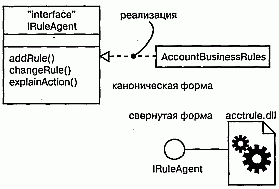

#### Рис. 10.9 Реализация интерфейса

Реализацию можно использовать также для специфицирования отношений между прецедентом (см. главу 16) и реализующей его кооперацией (см. главу 27), как показано на рис. 10.10. В данном контексте почти всегда применяют каноническую форму записи.

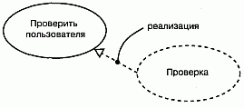

#### Рис. 10.10 Реализация прецедента

> Примечание: Если класс или компонент реализуют интерфейс, это означает, что специфицированное интерфейсом поведение действительно будет обеспечено. Другими словами, такой класс или компонент реализует все операции интерфейса, отвечает на все посылаемые ему сигналы и во всем следует протоколу, установленному интерфейсом.

## Типичные приемы моделирования

### Сети отношений

Моделируя словарь сложной системы, приходится описывать десятки, если не сотни, различных классов, интерфейсов, компонентов, узлов и прецедентов. Определить четкие границы для всех этих абстракций весьма непросто. Установить мириады отношений между ними еще труднее; для этого требуется сбалансированно распределить обязанности в системе, причем конкретные абстракции должны быть логически непротиворечивы, а отношения точны и при этом слабо связаны (см. главу 4).

Для того чтобы спроектировать комплекс отношений в системе, необходимо следовать советам, приведенным ниже:

1. Не начинайте этот процесс в отрыве от остальных. Для выявления отношений между множествами абстракций используйте прецеденты (см. главу 16) и сценарии.
2. Начните с моделирования имеющихся структурных отношений. Они отражают статический вид системы и поэтому более просты в обращении.
3. Затем рассмотрите возможность использования отношений обобщения/специализации; не злоупотребляйте множественным наследованием.
4. Только после завершения предыдущих шагов поищите в системе зависимости; обычно они соответствуют более тонким формам семантических связей.
5. При проектировании каждого вида отношений старайтесь ограничиться основными формами; более сложные возможности используйте, только если это абсолютно необходимо для выражения ваших намерений.
6. Помните, что нет необходимости моделировать все существующие в системе отношения между множествами абстракций на одной-единственной диаграмме или в рамках одного вида. Лучше рассмотреть несколько архитектурных видов системы (см. главу 2) и показать интересующие вас отношения на различных диаграммах.

Залогом успешного моделирования сложной сети отношений является инкре-ментное выполнение этого процесса. Создавайте новые отношения по мере развития структуры системной архитектуры. Упрощайте их, если вам удается обнаружить возможности применения более общих механизмов. При выпуске каждой версии заново оценивайте отношения между ключевыми абстракциями системы. (Рассмотрение Рационального Унифицированного Процесса приводится в "Приложении С".)

## Советы
Моделируя в UML более сложные отношения, помните, что в вашем распоряжении находится широкий спектр строительных блоков, от простых ассоциаций до многообразных свойств навигации, квалификации, агрегирования и т.д. Старайтесь выбирать наиболее адекватный вашим целям тип и уровень детализации отношений. Хорошо структурированное отношение обладает следующими характеристиками:

* раскрывает только такие особенности, которые необходимы для использования отношения клиентом, и скрывает все остальные;
* однозначно отражает свое назначение и семантику;
* не слишком детализировано, чтобы не ограничивать свободу программиста, реализующего модель;
* не слишком упрощено, чтобы значение данного отношения не стало расплывчатым.

Изображая отношение в UML, руководствуйтесь следующими принципами:

* показывайте только такие его свойства, которые необходимы для понимания абстракции в соответствующем контексте;
* выбирайте подходящий стереотип, который лучше всего выражает назначение данного отношения.

http://bourabai.kz/dbt/uml/ch11.htm

ЧАСТЬ III - Изучение структурного моделирования
# Глава 11. Интерфейсы, типы и роли
* Введение
* Термины и понятия
    * Имена
    * Операции
    * Отношения
    * Как разобраться в интерфейсе
    * Типы и роли
* Типичные приемы моделирования
    * Стыковочные узлы системы
    * Статические и динамические типы
* Советы

Интерфейс определяет границу между спецификацией того, что делает абстракция, и реализацией того, как она это делает. Интерфейс - это набор операций, используемых для специфицирования услуг, предоставляемых классом или компонентом.

Интерфейсы используются для визуализации, специфицирования, конструирования и документирования стыковочных узлов между составными частями системы. Типы и роли обеспечивают механизм моделирования статического и динамического соответствия абстракции интерфейсу в конкретном контексте.

Хорошо структурированный интерфейс предусматривает четкую границу между внешним и внутренним представлениями абстракции, делая возможным ее понимание и работу с ней без необходимости углубляться в детали реализации.

## Введение
Неразумно было бы проектировать дом так, что каждый раз, когда вы захотите перекрасить стены, придется перекладывать фундамент (см. главу 1). Наверняка вы будете недовольны, если для того, чтобы сменить лампочку, понадобится менять всю проводку в доме. Владелец небоскреба вряд ли придет в восторг при мысли о необходимости переставлять двери и заменять все телефонные и электрические розетки каждый раз, когда появляется новый арендатор.

Тысячелетний опыт строительства выработал рациональные приемы решения очевидных - а иногда и не столь очевидных - проблем, возникающих при возведении и реконструкции зданий. На языке программирования такие приемы называют четким разделением задач. Например, в хорошо спроектированном доме можно заменить или перестроить фасад, не затрагивая прочих частей здания. Мебель тоже можно переставить с места на место, не изменяя инфраструктуры. Системы, вмонтированные в стены здания (электричество, отопление, канализация), нельзя переделать, совсем не касаясь остального, но даже в этом случае не обязательно ломать весь дом.

Успехи строительной практики не ограничиваются возможностью совершенствовать дома после их постройки; существует множество стандартных интерфейсов, с помощью которых можно составлять здание из готовых компонентов. Например, имеются стандарты на размеры пиломатериалов, и это облегчает возведение стен, размеры которых кратны стандартным. Есть также стандарты на размеры окон и дверей, а значит, не требуется вручную делать все проемы в стенах. Существуют даже стандарты для электрических и телефонных розеток (хотя в разных странах они различны), что позволяет использовать электрооборудование от разных производителей.

При создании программного обеспечения важно строить системы с четким разделением задач, так чтобы при развитии системы изменения в одной ее части не затронули другие. Для достижения этой цели необходимо специфицировать стыковочные узлы системы, к которым присоединяются эти независимо изменяемые части. Кроме того, правильно подобрав интерфейсы, вы сможете использовать имеющиеся стандартные библиотеки, компоненты и каркасы (см. главу 28) для их реализации, не программируя все это самостоятельно. Обнаружив впоследствии лучшую реализацию, вы сможете заменить старую, не беспокоя пользователей.

В языке UML для моделирования стыковочных узлов в системе используются интерфейсы. Интерфейс - это набор операций, специфицирующих услуги, предоставляемые классом (см. главы 4 и 9) или компонентом (см. главу 25). Объявляя интерфейс, вы получаете возможность постулировать желаемое поведение абстракции, не зависящее от ее реализации. Клиенты будут спокойно полагаться на объявленный интерфейс, а вы в дальнейшем можете создать или купить любую его реализацию. Важно только, чтобы она выполняла обязательства, объявленные интерфейсом.

Почти все современные языки программирования, в том числе Java и CORBA IDL, поддерживают концепцию интерфейсов. Интерфейсы важны не только для отделения спецификации от реализации класса или компонента, но и для внешнего описания пакета (см. главу 12) или подсистемы (см. главу 31) в случае увеличения размеров системы.

Графическое представление интерфейсов в языке UML показано на рис. 11.1. Такая нотация позволяет раздельно визуализировать описание абстракции и ее реализацию.

#### Рис. 11.1 Интерфейсы

## Термины и понятия
Интерфейсом (Interface) называется набор операций, используемый для специфицирования услуг, предоставляемых классом или компонентом. Типом (Туре) называют стереотип класса, используемый для определения области значений объектов вместе с применимыми к ним операциями (но не методами). Роль (Role) -это поведение сущности в данном контексте. Графически интерфейс изображается в виде кружочка; в развернутой форме его можно представить как стереотипный класс, чтобы раскрыть операции и другие свойства.

> Примечание: С помощью интерфейсов можно также специфицировать контракт, который обязуется выполнять прецедент (см. главу 16) или подсистема (см. главу 31).

### Имена
У любого интерфейса должно быть имя, отличающее его от остальных. Имя интерфейса представляет собой текстовую строку. Взятое само по себе, оно называется простым. Составное имя образуется путем добавления в его начало имени пакета, в который входит данный интерфейс. Имя интерфейса должно быть уникальным внутри объемлющего пакета (см. главу 12). При изображении интерфейса можно ограничиться только его именем, как показано на рис. 11.2.

#### Рис. 11.2 Простые и составные имена

> Примечание: Имя интерфейса может состоять из любого числа букв, цифр и некоторых знаков препинания (за исключением таких, как двоеточия, которые применяются для отделения имени интерфейса от имени объемлющего пакета). Имя может занимать несколько строк. Обычно для именования интерфейсов используют одно или несколько коротких существительных, взятых из словаря моделируемой системы. Чтобы отличить интерфейс от класса, принято добавлять к его имени начальную букву I, например IUnknown или ISpelling. Те же правила применяются и к типам. Чтобы отличить тип от интерфейса или класса, принято начинать его имя с буквы Т, например TNatural или TCharacter.

### Операции
Как уже отмечалось выше, интерфейс - это именованный набор операций (см. главы 4 и 9) для специфицирования сервиса, предоставляемого классом или компонентом. В отличие от классов и типов, интерфейсы не описывают структуры (поэтому не могут содержать атрибуты) и реализации (а значит, не содержат реализующих рперации методов). Как и класс, интерфейс может включать любое число операций, которые могут быть дополнены свойствами видимости, параллельности, стереотипами, помеченными значениями и ограничениями (см. главу 6).

Изображая интерфейс в виде кружочка, вы по определению подавляете показ этих операций. Однако, если это необходимо для понимания модели, можно изобразить интерфейс как стереотипный класс, перечислив операции в соответствующем разделе. При этом можно показывать только имя операции или же предоставить развернутое описание с сигнатурой и другими свойствами, как показано на рис. 11.3.

#### Рис. 11.3 Операции

> Примечание: С интерфейсом можно ассоциировать и сигналы (см. главу 20).

### Отношения
Подобно классам, интерфейсы могут принимать участие в отношениях обобщения, ассоциации и зависимости (см. главы 5 и 10). Кроме того, для них определено еще и отношение реализации, представляющее собой семантическое отношение между двумя классификаторами, один из которых определяет ряд обязательств (контракт), а другой обеспечивает их выполнение.

Интерфейс специфицирует контракт класса или компонента, но не накладывает никаких ограничений на реализацию. Класс или компонент могут реализовывать несколько интерфейсов. При этом они обязуются выполнить все свои контракты, то есть должны содержать методы, корректно реализующие объявленные интерфейсом операции. Точно так же класс или компонент может зависеть от нескольких интерфейсов. При этом он ожидает, что объявленные контракты будут выполнены каким-то набором реализующих их компонентов. Именно поэтому говорят, что интерфейс представляет собой стыковочный узел в системе. Он определяет условия контракта, после чего обе стороны - клиент и поставщик - могут действовать независимо друг от друга, полностью полагаясь на взаимные обязательства.

Как видно из рис. 11.4, связь интерфейса с реализующим его элементом можно графически представить двумя способами. Во-первых, существует простая форма: отношения между интерфейсом и его реализацией изображаются кружочком с одной стороны класса или компонента. Этот способ удобен, когда требуется показать стыковочные узлы системы. Однако операции и сигналы, предоставляемые интерфейсом, таким способом визуализировать нельзя. Во-вторых, можно воспользоваться расширенной формой, когда интерфейс представляют в виде стереотипного класса и связывают отношением реализации с классификатором или компонентом. При этом разрешается показать его операции и другие свойства. В UML отношение реализации изображают в виде пунктирной линии с большой незакрашенной стрелкой, направленной в сторону интерфейса. В этой нотации суммируются обобщение и зависимость.

#### Рис. 11.4 Визуализация интерфейса

В обоих случаях класс или компонент, использующий интерфейс, соединяют с ним отношением зависимости.

> Примечание: Интерфейсы напоминают абстрактные классы (см. главу 4), в частности потому, что ни у тех, ни у других нет непосредственных экземпляров. Но все же между ними имеется достаточно различий, чтобы считать их отдельными элементами моделирования. У абстрактного класса могут быть атрибуты, а у интерфейса - нет. Кроме того, интерфейсы пересекают границы модели. Например, один и тот же интерфейс может быть реализован как классом (логическая абстракция), так и компонентом (физическая абстракция, материализующая класс, - см. главу 25).

### Как разобраться в интерфейсе
Создав новый интерфейс, вы первым делом смотрите на набор операций, определяющих сервис класса или компонента. Если заглянуть поглубже, то станут видны полные сигнатуры этих операций, а также их специальные свойства (см. главу 9): видимость, область действия и семантика одновременности (см. главу 23).

Несмотря на важность этих свойств, их недостаточно для понимания семантики сервиса, предоставляемого сложными интерфейсами, не говоря уже о правильном использовании этих операций. При отсутствии другого источника информации для решения этой задачи приходится углубляться в реализующую интерфейс абстракцию, чтобы понять, для чего конкретно предназначена каждая операция и как они взаимодействуют между собой. Это, однако, противоречит назначению интерфейса, который должен обеспечивать четкое разделение задач в системе.

На языке UML вы можете связать с интерфейсом значительно больше информации, чтобы сделать его понятнее. Прежде всего, можно описать предусловия и постусловия для каждой операции, а также инварианты для класса или компонента в целом (см. главу 9). Таким образом, клиент сумеет понять, что и как делает интерфейс, без необходимости изучать его реализацию. Если вы хотите формально описать семантику, воспользуйтесь языком ОСL (см. главу 6). Кроме того, к интерфейсу можно присоединить автомат (см. главу 21) и использовать его для специфицирования корректной частичной упорядоченности операций. Наконец, с ним допустимо связать кооперации (см. главу 27), описывающие ожидаемое поведение интерфейса с помощью последовательности диаграмм взаимодействия.

### Типы и роли
Класс может реализовывать несколько интерфейсов. Любой экземпляр данного класса должен поддерживать их все, так как интерфейс определяет условия контракта, и все соответствующие ему абстракции обязаны соблюдать эти условия. Тем не менее в конкретном контексте экземпляр может предоставлять только те интерфейсы, которые соответствуют ситуации. Это означает, что каждый интерфейс определяет роль, которую играет объект. Роль, таким образом, - это именованное поведение некоторой сущности в конкретном контексте, или, иными словами, - лицо, которым абстракция обращена к миру. (Роли принимают участие также в кооперациях - см. главу 27.)

Рассмотрим, например, экземпляр класса Человек. В зависимости от контекста экземпляр этого класса может играть роль Матери, Налогоплательщика, Работника, Покупателя, Менеджера, Летчика, Певца и т.д. Следовательно, объект предъявляет миру ту или иную "личину", и взаимодействующие с ним клиенты ожидают от него соответствующего поведения. Например, экземпляр класса Человек в роли Менеджера обладает не таким набором свойств, какой был бы у него в роли Матери.

На языке UML роль, которую одна абстракция играет по отношению к другой, можно описать, дополнив соответствующую концевую точку ассоциации (см. главы 5 и 10) именем интерфейса. Например, на рис. 11.5 показан интерфейс Работник, определение которого включает три операции. Между классами Человек и Компания существует ассоциация, в контексте которой Человек играет роль е, относящуюся к типу Работник. В другой ассоциации этот класс может быть "обращен к миру иным лицом". При наличии явного типа роль, которую играет Человек, - это не просто слово, понятное для читателя, изучающего диаграмму. В UML это означает, что класс Человек играет для класса Компания роль Работника, и в данном контексте для Компании будут видимы и существенны только свойства, определенные данной ролью.

#### Рис. 11.5 Роли

Диаграмма классов (см. главу 8), подобная приведенной выше, полезна для моделирования статического связывания абстракции с ее интерфейсом. Динамическое связывание абстракции с интерфейсом моделируют с помощью стереотипа become (см. главу 13) на диаграмме взаимодействия, отражающей смену ролей объекта.

Для формального моделирования семантики абстракции и ее соответствия некоторому интерфейсу применяется предопределенный стереотип type. Это стереотип класса; с его помощью определяют область действия объектов совместно с операциями (но не методами), применимыми к объектам этого типа. Концепция типа тесно связана с концепцией интерфейса, только описание типа может содержать атрибуты, а описание интерфейса - нет. Если надо показать, что некоторая абстракция статически типизирована, используйте стереотип implementationClass, который специфицирует класс со статически типизированными экземплярами (класс Человек из рассмотренного примера не относится к их числу) и определяет физическую структуру данных и методы объекта так, как это делается в традиционных языках программирования.

> Примечание: В большинстве случаев понятия "тип" и "интерфейс" взаимозаменяемы

## Типичные приемы моделирования

### Стыковочные узлы системы

Чаще всего с помощью интерфейсов моделируют стыковочные узлы в системе, состоящей из таких программных компонентов (см. главу 25), как СОМ+ или JavaBeans. Некоторые компоненты вы создаете сами с нуля, остальные покупаете или заимствуете из других систем (см. главу 31). В любом случае придется написать некоторый код для "склеивания" этих компонентов, ввиду чего необходимо понимать, какие интерфейсы реализуются и потребляются каждым из них.

Идентификация стыковочных узлов в системе предполагает наличие четких линий демаркации в ее архитектуре. По одну сторону от такой линии находятся компоненты, которые могут изменяться независимо от компонентов с другой стороны, при условии, что обе стороны выполняют контракт, объявленный интерфейсом.

Взяв готовый компонент из другой системы или купив его, вы, скорее всего, получите набор операций и минимальную документацию о назначении каждой из них. Это полезно, но еще не достаточно. Гораздо важнее понять, в каком порядке должны вызываться операции и каковы внутренние механизмы, воплощенные в интерфейсе. К сожалению, если компонент плохо документирован, вам придется самому методом проб и ошибок строить концептуальную модель работы его интерфейса. Затем можно задокументировать то, что вы обнаружили, путем моделирования данного стыковочного узла с помощью интерфейсов UML, - так, чтобы впоследствии вам и другим людям было проще работать с этим компонентом. Разрабатывая собственный компонент, вы должны отслеживать его контекст, то есть специфицировать интерфейсы, на наличие которых он рассчитывает для выполнения своей работы, а также интерфейсы, представляемые им самим для использования в других компонентах.

> Примечание: Большинство компонентных систем, таких как СОМ+ или Enterprise JavaBeans, предоставляют возможность интроспекции, то есть программного запроса у интерфейса информации о его операциях. Это первый шаг к пониманию природы недостаточно документированного компонента.

Моделирование стыковочных узлов системы производится следующим образом (подробнее моделирование поведения рассматривается в частях 4 и 5):

1. Изобразив набор классов и компонентов системы, проведите линии, отделяющие друг от друга группы тесно связанных классов и компонентов.
2. Уточните выбранное разделение с учетом изменяемости системы. Совместно изменяемые классы или компоненты должны быть сгруппированы в отдельные кооперации (см. главу 27).
3. Изучите операции и сигналы, которые пересекают определенные вами границы.
4. Объедините логически связанные наборы операций и сигналов, оформив их как интерфейсы.
5. Для каждой обнаруженной в системе кооперации идентифицируйте интерфейсы, на которые она полагается в своей работе (импортирует) и те, которые она предоставляет другим (экспортирует). Импорт интерфейсов моделируется с помощью отношений зависимости, а экспорт - с помощью отношений реализации.
6. Документируйте динамику интерфейсов с помощью предусловий и постусловий для каждой операции, а также прецедентов и автоматов для интерфейса в целом.

Например, на рис. 11.6 изображены стыковочные узлы для библиотеки ledger. dll - компонента, взятого из финансовой системы. Этот компонент реализует три интерфейса - lUnknown, ILedger и IReports. На диаграмме первый из них показан в расширенной форме, а остальные два - в сокращенной. Все три интерфейса реализуются компонентом ledger.dll и экспортируются в другие компоненты, которые используют их в своей работе

#### Рис. 11.6 Моделирование стыковочных узлов системы

Как видно из диаграммы, компонент ledger.dll импортирует два интерфейса, IStreaming и ITransaction, причем последний показан в расширенной форме. Оба они нужны компоненту ledger.dll для корректной работы. Следовательно, в работающую систему вы должны будете включить также и реализующие их компоненты. Выделив интерфейс, например ITransaction, вы тем самым разъединили находящиеся по разные стороны от него компоненты. А это значит, что вы можете использовать любой компонент, лишь бы он соответствовал спецификации интерфейса.

Такие интерфейсы, как ITransaction, - это не просто совокупность операций. Данный интерфейс содержит определенные предположения о том, в каком порядке должны вызываться операции. Хотя на диаграмме это не показано, можно было бы присоединить к интерфейсу прецедент (см. главу 16) и перечислить типичные способы применения интерфейса.

### Большинство объектно-ориентированных языков программирования являются статически типизированными. Другими словами, тип связывается с объектом в момент создания последнего (подробнее об экземплярах см. главу 13). И все же объект будет, вероятно, играть различные роли в разные моменты времени. Это означает, что использующие объект клиенты взаимодействуют с ним посредством различных наборов интерфейсов, которые описывают представляющие интерес и, возможно, перекрывающиеся множества операций.

Модель статических характеристик объекта может быть визуализирована в виде диаграммы классов (см. главу 8). Однако при моделировании таких сущностей, как бизнес-объекты, чьи роли естественно изменяются по ходу работы, бывает полезно явным образом промоделировать динамическую природу типа таких объектов. В этих условиях объект во время своей жизни может приобретать и утрачивать типы.

Моделирование динамического типа состоит из следующих шагов:

1. Определите возможные типы объекта, показав каждый из них в виде класса со стереотипом type (если от абстракции требуется структура и поведение) или interface (если требуется только поведение).
2. Смоделируйте все роли класса объекта в любой возможный момент време ни. Это делается двумя способами:

    * во-первых, на диаграмме классов явно прописывается каждая роль, которую данный класс играет в ассоциациях с другими классами (см. главы 5 и 10). Тем самым определяется лицо, которое класс имеет в контексте ассоци ированного с ним объекта;
    * во-вторых, на диаграмме классов с помощью обобщений специфицируют ся отношения "класс-тип".

4. На диаграмме взаимодействий (см. главу 18) изобразите каждый экземпляр динамически типизированного класса. Роль экземпляра нужно указать в скоб ках ниже имени объекта.
2. Чтобы показать смену ролей объекта, изобразите объект по одному разу для каждой роли, которую он играет во взаимодействии, и соедините эти объек ты сообщением со стереотипом become.
3. В качестве примера на рис. 11.7 показаны роли, которые класс Человек может играть в контексте системы управления человеческими ресурсами.

#### Рис. 11.7 Моделирование статических типов

Из этой диаграммы явствует, что экземпляры класса Человек могут относиться к одному из трех типов - Кандидат, Работник и Пенсионер.

Динамическая природа типа Человека изображена на рис. 11.8. В этом фрагменте диаграммы взаимодействия объект p (Человек) меняет роль с Кандидата на Работника.

#### Рис. 11.8 Моделирование динамических типов

### Советы
Моделируя интерфейс на языке UML, помните, что он должен описывать некоторый стыковочный узел системы, отделяя спецификацию от реализации. Хорошо структурированный интерфейс характеризуется следующими свойствами:

* одновременно обладает простотой и завершенностью, то есть содержит все операции, необходимые и достаточные для специфицирования конкретного сервиса;
* понятен, то есть содержит информацию, достаточную для его применения, и не требует для этого обращения к его реализации и примерам использования;
* содержит информацию, достаточную для понимания пользователем основных свойств, но не перегружен сведениями, касающимися деталей всех операций.

Изображая интерфейс на языке UML, руководствуйтесь приведенными ниже правилами:

* используйте сокращенную нотацию, если надо просто показать наличие стыковочного узла в системе. Чаще всего она применяется при работе с компонентами, а не с классами;
* расширенную форму применяйте в случае, если надо визуализировать детали самого сервиса. Чаще всего это нужно делать при специфицировании стыковочных узлов в системе, содержащей пакеты или подсистемы.

http://bourabai.kz/dbt/uml/ch12.htm

ЧАСТЬ III - Изучение структурного моделирования
# Глава 12. Пакеты
* Введение
* Термины и понятия
    * Имена
    * Элементы, принадлежащие пакету
    * Видимость
    * Импорт и экспорт
    * Обобщения
    * Стандартные элементы
* Типичные приемы моделирования
    * Группы элементов
    * Архитектурные виды
* Советы

Визуализация, специфицирование, конструирование и документирование больших систем предполагает работу с потенциально большим количеством классов, интерфейсов, узлов, компонентов, диаграмм и других элементов. Масштабируя такие системы, вы столкнетесь с необходимостью организовывать эти сущности в более крупные блоки. В языке UML для организации моделирующих элементов в группы применяют пакеты (Packages).

Пакет - это способ организации элементов модели в более крупные блоки, которыми впоследствии позволяется манипулировать как единым целым. Можно управлять видимостью входящих в пакет сущностей, так что некоторые будут видимы извне, а другие - нет. Кроме того, с помощью пакетов можно представлять различные виды архитектуры системы.

Хорошо спроектированный пакет группирует семантически близкие элементы, которые имеют тенденцию изменяться совместно. Таким образом, хорошо структурированные пакеты слабо связаны и обладают четко выраженной семантикой, причем доступ к содержимому пакета извне строго контролируется.

## Введение
Устройство собачьей конуры не представляет из себя ничего сложного: четыре стены, лаз для собаки в одной из них и крыша. При изготовлении конуры нужно всего лишь несколько досок - конструкция не требует большего.

Жилые дома устроены сложнее (см. главу 1). Стены, потолки и полы соединяются между собой, образуя более крупные абстракции, которые мы называем комнатами. Комнаты организованы в еще более крупные блоки - жилая зона, зона досуга и т.д. Такие блоки физически могут быть и не материализованы в конструкции дома. Это всего лишь имена, которые мы даем логически связанным друг с другом комнатам, чтобы удобнее было говорить о предполагаемом использовании домашнего пространства.

Небоскребы устроены еще сложнее. Там вы найдете не только простейшие конструкции вроде стен, полов или потолков, но и более крупные образования - места, открытые для общего доступа, сдаваемые в аренду квартиры и офисы. Эти образования, вероятно, сгруппированы в еще более крупные, такие как арендуемая площадь и инфраструктура обслуживания здания. Разумеется, они не имеют ничего общего с самим зданием, а являются лишь артефактами, которые мы применяли при планировании небоскреба.

Каждая большая система состоит из нескольких подобных слоев. По-настоящему понять ее можно, только если объединить входящие в нее абстракции в более крупные группы. Большинство блоков среднего размера (например, комнаты) сами по себе являются абстракциями, похожими на классы, и у них бывает много экземпляров. Крупные блоки обычно чисто умозрительны (например, часть здания для продажи), и у них не бывает экземпляров. Они не реализуются на физическом уровне; их единственная цель - облегчить понимание системы. Такого рода блоки не будут представлены в развернутой системе - они существуют лишь на уровне модели.

В языке UML организующие модель блоки называют пакетами. Пакет является универсальным механизмом организации элементов в группы, благодаря которому понимание модели упрощается. Пакеты позволяют также контролировать доступ к своему содержимому, что облегчает работу со стыковочными узлами в архитектуре системы (о системной архитектуре и ее моделировании рассказано в главах 2 и 31).

Графическое представление пакетов в языке UML показано на рис. 12.1. Такая нотация позволяет визуализировать группы элементов, с которыми можно обращаться как с единым целым, контролируя при этом видимость и возможность доступа к отдельным элементам.

#### Рис. 12.1 Пакеты

## Термины и понятия
Пакет (Package) представляет собой общий механизм организации элементов в группы. Его изображают в виде папки с закладкой.

### Имена

У каждого пакета должно быть имя, отличающее его от других пакетов. Имя -это текстовая строка. Взятое само по себе, оно называется простым. К составному имени спереди добавлено имя объемлющего его пакета, если таковой существует. Имя пакета должно быть уникальным в объемлющем пакете. Обычно при изображении компонента указывают только его имя, как показано на рис. 12.2. Но, как и в случае с классами, вы можете дополнять пакеты помеченными значениями или дополнительными разделами, чтобы показать детали.

#### Рис. 12.2 Простой и расширенный пакеты

> Примечание: Имя пакета может состоять из любого числа букв, цифр и некоторых знаков препинания (за исключением таких, как двоеточия, которые применяются для отделения имени пакета от имени объемлющего пакета). Оно может занимать несколько строк. Обычно для именования пакетов используют одно или несколько коротких существительных, взятых из словаря модели.

### Элементы, принадлежащие пакету
Пакет может владеть другими элементами, в том числе классами, интерфейсами, компонентами, узлами, кооперациями, диаграммами и даже прочими пакетами. Владение - это композитное отношение (см. главу 10), означающее, что элемент объявлен внутри пакета. Если пакет удаляется, то уничтожается и принадлежащий ему элемент. Элемент может принадлежать только одному пакету.

Пакет определяет свое пространство имен; это значит, что элементы одного вида должны иметь имена, уникальные в контексте объемлющего пакета. Например, в одном пакете не может быть двух классов Queue, но может быть один класс Queue в пакете Р1, а другой - в пакете Р2. Р1: : Queue и Р2 : : Queue имеют разные составные имена и поэтому являются различными классами.

Элементы различного вида могут иметь одинаковые имена в пределах пакета. Так, допустимо наличие класса Timer и компонента Timer. Однако на практике, во избежание недоразумений, лучше всем элементам давать уникальные имена в пакете.

Пакету могут принадлежать другие пакеты, а значит, позволительно осуществить иерархическую декомпозицию модели. Например, может существовать класс Camera, принадлежащий пакету Vision, который, в свою очередь, содержится в пакете Sensors. Составное имя этого класса будет Sensors: : Vis ion: : Camera. Лучше, однако, избегать слишком глубокой вложенности пакетов - два-три уровня являются пределом. В случае необходимости для организации пакетов стоит использовать импортирование (см. ниже), а не вложенность.

Описанная семантика владения или принадлежности делает пакеты важным механизмом масштабирования системы. Без них пришлось бы создавать большие плоские модели, все элементы которой должны иметь уникальные имена. Такие конструкции были бы совершенно неуправляемы, особенно если входящие в модель классы и другие элементы созданы различными коллективами. Пакеты позволяют контролировать элементы системы, даже если они разрабатываются в разном темпе.

Как показывает рис. 12.3, содержание пакета можно представить графически или в текстовом виде. Обратите внимание, что если вы изображаете принадлежащие пакету элементы, то имя пакета пишется внутри закладки. Впрочем, содержимое пакета обычно не показывают таким образом, а применяют имеющиеся инструментальные средства, позволяющие раскрыть пакет и просмотреть его содержимое.

#### Рис. 12.3 Элементы, принадлежащие пакету

> Примечание: Язык UML подразумевает наличие в любой модели анонимного корневого пакета, а значит, все элементы одного и того же вида на верхнем уровне пакета должны иметь уникальные имена.

### Видимость
Видимость (см. главу 9) принадлежащих пакету элементов можно контролировать точно так же, как видимость атрибутов и операций класса. По умолчанию такие элементы являются открытыми, то есть видимы для всех элементов, содержащихся в любом пакете, импортирующем данный. Защищенные элементы видимы только для потомков, а закрытые вообще невидимы вне своего пакета. Например, на рис. 12.3 OrderForm (БланкЗаказа) - это открытая часть пакета С1ient(Клиент), a Order (Заказ) - закрытая. Любой пакет, импортирующий данный, может "видеть" объект OrderForm, но не "видит" Order. При этом составное имя для OrderForm будет Client: : OrderForm.

Видимость принадлежащих пакету элементов обозначается с помощью символа видимости перед именем этого элемента. Для открытых элементов используется символ + (плюс), как и в случае с OrderForm. Все открытые части пакета составляют его интерфейс.

Аналогично классам для имен защищенных элементов используют символ # (диез), а для закрытых добавляют символ - (минус). Напомним, что защищенные элементы будут видны только для пакетов, наследующих данному (см. далее), а закрытые вообще не видны вне пакета, в котором объявлены.

> Примечание: Пакеты, связанные с некоторым пакетом отношениями зависимости со стереотипом friend (см. главу 10), могут "видеть" все элементы данного пакета, независимо от объявленной для них видимости.

### Импорт и экспорт
Предположим, у вас есть два класса одного уровня А и В, расположенных рядом друг с другом. А может "видеть" В и наоборот, то есть любой из них может зависеть от другого. Два таких класса составляют стандартную систему, и для них не надо задавать никаких пакетов.

Допустим теперь, что у вас имеется несколько сотен равноправных классов. Размер "паутины" отношений, которую вы можете соткать между ними, не поддается воображению. Более того, столь огромную неорганизованную группу классов просто невозможно воспринять в ее целостности. Описанная ситуация порождает реальную проблему больших систем: простой неограниченный доступ не позволяет осуществить масштабирование. В таких случаях для организации абстракций приходится применять пакеты.

Итак, допустим, что класс А расположен в одном пакете, а класс В - в другом, причем оба пакета равноправны. Допустим также, что как А, так и В объявлены открытыми частями в своих пакетах. Эта ситуация коренным образом отличается от двух предыдущих. Хотя оба класса объявлены открытыми, свободный доступ одного из них к другому невозможен, ибо границы пакетов непрозрачны. Однако если пакет, содержащий класс А, импортирует пакет-владелец класса в, то А сможет "видеть" В, хотя В по-прежнему не будет "видеть" А. Импорт дает элементам одного пакета односторонний доступ к элементам другого. На языке UML отношения импорта моделируют как зависимости (см. главу 5), дополненные стереотипом import (о механизмах расширения UML см. главу 6). Упаковывая абстракции в семантически осмысленные блоки и контролируя доступ к ним с помощью импорта, вы можете управлять сложностью систем, насчитывающих множество абстракций.

> Примечание: Фактически в рассмотренной ситуации применяются два стереотипа - import и access, - и оба они показывают, что исходный пакет имеет доступ к элементам целевого. Стереотип import добавляет содержимое целевого пакета в пространство имен исходного. Таким образом, возникает вероятность конфликта имен, которой необходимо избегать, если вы хотите, чтобы модель была хорошо оформлена. Стереотип access не изменяет пространство имен цели, поэтому содержащиеся в исходном пакете имена необходимо квалифицировать. Чаще используют стереотип import.

Открытые элементы пакета называются экспортируемыми. Так, на рис. 12.4 пакет GUI экспортирует два класса - Windows и Form. Класс EventHandler является защищенной частью пакета. Довольно часто экспортируемыми элементами пакета оказываются интерфейсы (см. главу H).

#### Рис. 12.4 Импорт и экспорт

Экспортируемые элементы будут видны только тем пакетам, которые явно импортируют данный. В примере на рис. 12.4 пакет Policies импортирует GUI. Таким образом, классы GUI: : Window и GUI: : Form будут из него видны. Но класс GUI: : EventHandler виден не будет, так как является защищенным. С другой стороны, пакет Server не импортирует GUI, и потому элементы Server не имеют права доступа к элементам GUI. По той же причине у GUI нет доступа к содержимому пакета Server.

Зависимости импорта и доступа не являются транзитивными. В данном примере пакет Client импортирует Policies, a Policies - GUI, однако это не значит, что Client импортирует GUI. Таким образом, доступ из пакета Client к экспортируемым частям пакета Policies разрешен, а к экспортируемым частям пакета GUI - нет. Чтобы получить такой доступ, надо явно указать, что Client импортирует GUI.

> Примечание: Элемент, видимый внутри пакета, будет видим также и внутри всех вложенных в него пакетов. Вообще, вложенные пакеты могут "видеть"- все, что "видит" объемлющий их пакет.

### Обобщения
Между пакетами определены два типа отношений: зависимости импорта и доступа, применяемые для импорта в пакет элементов, экспортируемых другим пакетом, и обобщения (см. главы 5 и 10), используемые для специфицирования семейств пакетов.

Отношения обобщения между пакетами очень похожи на отношения обобщения между классами. Например, как видно из рис. 12.5, пакет GUI содержит два экспортируемых класса (Windows и Form) и один защищенный (EventHandler). Существуют две специализации пакета GUI а именно: WindowsGUI и MacGUI. Они наследуют открытые и защищенные элементы своего родителя. Как и в случае с классами, пакеты могут замещать наследуемые элементы или добавлять новые. Например, пакет WindowsGUI содержит классы GUI: : Windows и GUI: : Event-Handler. Кроме того, в нем переписан класс Form и добавлен новый класс VBForm. Участвующие в обобщении пакеты следуют тому же принципу подстановки, что и классы. Специализированные пакеты (такие, как WindowsGUI) могут использоваться всюду, где допустимо использование их родителей (наподобие GUI).

#### Рис. 12.5 Отношения обобщения между пакетами

К пакетам применимы все механизмы расширения UML (см. главу 6). Чаще всего используют помеченные значения для определения новых свойств (например, указания имени автора) и стереотипы для определения новых видов пакетов (например, пакетов, инкапсулирующих сервисы операционных систем).

В языке UML определены пять стандартных стереотипов (см. "Приложение В"), применимых к пакетам:

* facade (фасад) - определяет пакет, являющийся всего лишь представлением какого-то другого пакета;
* framework (каркас) - определяет пакет, состоящий в основном из образцов (паттернов - см. главу 28);
* stub (стаб, заглушка) - определяет пакет, служащий заместителем открытого содержимого другого пакета;
* subsystem (подсистема) - определяет пакет, представляющий независимую часть моделируемой системы (см. главу 31);
* system (система) - определяет пакет, представляющий всю моделируемую систему.
* языке UML не определены пиктограммы для этих стереотипов. Помимо них применяется еще стереотип import, которым помечают отношения зависимости (см. главы 5 и 10) между пакетами, один из которых импортирует другой.

Практически все эти стандартные элементы рассматриваются в других местах книги. Здесь мы коснемся только стереотипов facade и stub. Оба они предназначены для работы с очень большими моделями. Стереотип facade используется для показа свернутого представления сложного пакета. Предположим, что ваша система содержит пакет BusinessModel. Некоторым пользователям вы захотите показать одно подмножество его элементов (например, только те, что связаны с клиентами), другим - другое (связанное с продуктами). С этой целью определяют фасады, которые импортируют только подмножества элементов другого пакета (но никогда не владеют ими). Стереотип stub используют, если в вашем распоряжении имеются инструменты, расщепляющие систему на пакеты для последующей работы с ними в разное время и в разных местах. Например, если есть две группы разработчиков, работающие в двух разных офисах, то первая из них может создать стабы (Stubs) для пакетов, необходимых другой группе. Такая стратегия позволяет командам работать независимо и не мешать друг другу, причем пакеты-стабы будут описывать стыковочные узлы системы, требующие особенно тщательной проработки.

## Типичные приемы моделирования

### Группы элементов

Чаще всего пакеты применяют для организации элементов моделирования в именованные группы, с которыми затем можно будет работать как с единым целым. Создавая простое приложение, можно вообще обойтись без пакетов, поскольку все ваши абстракции прекрасно разместятся в единственном пакете. В более сложных системах вы вскоре обнаружите, что многие классы, компоненты, узлы, интерфейсы и даже диаграммы естественным образом разделяются на группы. Эти группы и моделируют в виде пакетов.

Между классами и пакетами есть одно значительное различие: классы являются абстракцией сущностей из предметной области или области решения, а пакеты - это механизмы организации таких сущностей в модели. Пакеты не имеют "индивидуальности" (то есть нельзя создать экземпляры пакетов, поэтому в работающей системе они невидимы); классы же можно индивидуализировать (у них есть экземпляры, которые являются элементами работающей системы). Системы и подсистемы, во многом подобные пакетам, отличаются от них тем, что имеют "индивидуальность", как и классы (см. главу 31).

Чаще всего с помощью пакетов элементы одинаковых типов организуют в группы. Например, классы и их отношения в представлении системы с точки зрения проектирования (см. главу 2) можно разбить на несколько пакетов и контролировать доступ к ним с помощью зависимостей импорта. Компоненты вида системы с точки зрения реализации допустимо организовать таким же образом.

Пакеты также применяются для группирования элементов различных типов. Например, если система создается несколькими коллективами разработчиков, расположенными в разных местах, то пакеты можно использовать для управления конфигурацией, размещая в них все классы и диаграммы, так чтобы члены разных коллективов могли независимо извлекать их из хранилища и помещать обратно. На практике пакеты часто применяют для группирования элементов моделирования и ассоциированных с ними диаграмм.

Моделирование группы элементов производится так:

1. Просмотрите моделирующие элементы в некотором представлении архитек туры системы с целью поиска групп семантически или концептуально близ ких элементов.
2. Поместите каждую такую группу в пакет.
3. Для каждого пакета определите, какие элементы должны быть доступны извне. Пометьте их как открытые, а остальные - как защищенные или за крытые. Если сомневаетесь, скройте элемент.
4. Явно соедините пакеты отношениями импорта с теми пакетами, от которых они зависят.
5. Если имеются в наличии семейства пакетов, соедините специализированные пакеты с общими отношениями обобщения.

В качестве примера на рис. 12.6 показаны пакеты, которые организуют в классическую трехуровневую архитектуру классы, являющиеся частями представления информационной системы с точки зрения проектирования. Элементы пакета Сервисы Пользователя предоставляют визуальный интерфейс для ввода и вывода информации. Элементы пакета Сервисы Данных обеспечивают доступ к данным и их обновление. Пакет Бизнес-Сервисы является связующим звеном между элементами первых двух пакетов; он охватывает все классы и другие элементы, отвечающие за выполнение бизнес-задачи, - в том числе бизнес-правила, которые диктуют стратегию манипулирования данными в ответ на запросы пользователя.

#### Рис. 12.6 Моделирование групп элементов

Как уже упоминалось, все абстракции простой системы можно поместить в один пакет. Однако, организуя классы и другие элементы представления системы с точки зрения проектирования в три пакета, вы не только сделаете модель более понятной, но и сможете контролировать доступ к ее элементам, скрывая одни и экспортируя другие.

> Примечание: Изображая подобные модели, обычно показывают элементы, центральные для каждого пакета. Чтобы прояснить назначение пакета, можно также раскрыть помеченные значения, содержащие документацию (см. главу 6).

### Архитектурные виды
Использование пакетов для группирования родственных элементов является весьма важным - без него нельзя разработать сложную модель. Этот подход применим к организации таких элементов, как классы, интерфейсы, компоненты, узлы и диаграммы. Но при рассмотрении архитектурных видов программных систем возникает потребность в еще более крупных блоках. Архитектурные виды тоже можно моделировать с помощью пакетов.

Напомним, что видом или представлением называется проекция организации и структуры системы, в которой внимание акцентируется на одном из конкретных аспектов этой системы (пять видов системной архитектуры описаны в главе 2, а их связь с моделями - в главе 31). Из этого определения вытекают два следствия. Во-первых, систему можно разложить на почти ортогональные пакеты, каждый из которых имеет дело с набором архитектурно значимых решений (например, можно создать виды с точки зрения проектирования, процессов, реализации, развертывания и прецедентов). Во-вторых, этим пакетам будут принадлежать все абстракции, относящиеся к данному виду. Так, все компоненты модели принадлежат пакету, который представляет вид системы с точки зрения реализации.

> Примечание: Пакеты как виды отличаются от фасадов. Виду принадлежат его элементы, а фасад лишь ссылается на элементы, входящие в состав других пакетов. Элемент может принадлежать только одному пакету, хотя ссылаться на него можно из нескольких фасадов.

Моделирование архитектурных видов осуществляется следующим образом:

1. Определите, какие виды важны для решения вашей проблемы. Обычно это виды с точки зрения проектирования, процессов, реализации, развертыва ния и прецедентов.
2. Поместите в соответствующие пакеты элементы и диаграммы, необходимые и достаточные для визуализации, специфицирования, конструирования, документирования семантики каждого вида.
3. При необходимости сгруппируйте элементы каждого вида в более мелкие пакеты.
4. Между элементами из различных видов, скорее всего, будут существовать отношения зависимости, поэтому в общем случае стоит открыть все виды на верхнем уровне системы для всех остальных видов того же уровня.

В качестве примера на рис. 12.7 показана каноническая декомпозиция верхнего уровня, пригодная даже для самых сложных систем (см. главу 31).

#### Рис. 12.7 Моделирование архитектурных видов

## Советы
Моделируя пакеты в UML, помните, что они нужны только для организации элементов вашей модели. Если имеются абстракции, непосредственно материализуемые как объект в системе, не пользуйтесь пакетами. Вместо этого применяйте такие элементы моделирования, как классы или компоненты. Хорошо структурированный пакет характеризуется следующими свойствами:

* он внутренне согласован и очерчивает четкую границу вокруг группы родственных элементов;
* он слабо связан и экспортирует в другие пакеты только те элементы, которые они действительно должны "видеть", а импортирует лишь элементы, которые необходимы и достаточны для того, чтобы его собственные элементы могли работать;
* глубина вложенности пакета невелика, поскольку человек не способен воспринимать слишком глубоко вложенные структуры;
* владея сбалансированным набором элементов, пакет по отношению к другим пакетам в системе не должен быть ни слишком большим (если надо, расщепляйте его на более мелкие), ни слишком маленьким (объединяйте элементы, которыми можно манипулировать как единым целым).

Изображая пакет в UML, руководствуйтесь следующими принципами:

* применяйте простую форму пиктограммы пакета, если не требуется явно раскрыть его содержимое;
* раскрывая содержимое пакета, показывайте только те элементы, которые абсолютно необходимы для понимания его назначения в данном контексте;
* моделируя с помощью пакетов сущности, относящиеся к управлению конфигурацией, раскрывайте значения меток, связанных с номерами версий.

http://bourabai.kz/dbt/uml/ch13.htm

 ЧАСТЬ III - Изучение структурного моделирования
# Глава 13. Экземпляры
* Введение
* Термины и понятия
    * Абстракции и экземпляры
    * Имена
    * Операции
    * Состояние
    * Другие особенности
    * Стандартные элементы
* Типичные приемы моделирования
    * Конкретные экземпляры
    * Экземпляры-прототипы
* Советы

Термины "экземпляр" и "объект" в большинстве случаев являются синонимами и часто бывают взаимозаменяемы. Экземпляром называется конкретная материализация абстракции, к которой может быть применен определенный набор операций и которая обладает состоянием для сохранения результатов этих операций. Экземпляры используют для моделирования конкретных сущностей реального мира, или прототипов. Почти все строительные блоки UML вовлечены в дихотомию "класс/объект". Например, бывают прецеденты и экземпляры прецедентов, узлы и экземпляры узлов, ассоциации и экземпляры ассоциаций и т.д.

## Введение
Предположим, вы строите дом для своей семьи. Используя слово "дом", а не "автомобиль" или какое-нибудь другое понятие, вы заранее сужаете словарь, применяемый при решении задачи. Дом является абстракцией "постоянного или временного жилища, цель которого - предоставить убежище". Напротив, автомобиль -это "мобильное самодвижущееся устройство, предназначенное для перевозки людей с места на место". В ходе работы, состоящей в соединении различных, зачастую противоречивых требований, абстракция дома постепенно уточняется. Например, вы можете выбрать "дом с тремя спальнями и подвалом" - словом, какую-либо частную разновидность.

Получив ключи от готового дома и войдя внутрь, вы погружаетесь в конкретную обстановку - оцениваете здание не просто как дом с тремя спальнями, а как "мой дом с тремя спальнями, расположенный по такому-то адресу". Если вы по характеру сентиментальны, то можете даже дать ему какое-нибудь имя, например "Святой приют".

Между "домом с трем спальнями" и "моим домом с тремя спальнями, именуемым Святой приют" существует фундаментальное различие. Первый - это только абстракция, описывающая определенный тип дома с различными свойствами, в то время как второй представляет собой конкретный экземпляр этой абстракции, существующий в реальном мире, и каждое его свойство имеет теперь реальное значение.

Абстракция описывает идеальную суть предмета, экземпляр - его конкретную материализацию. Такое разделение на абстракцию и экземпляр обнаружится во всем, что вы моделируете. У одной абстракции может быть сколько угодно экземпляров. Для данного экземпляра всегда существует абстракция, определяющая характеристики, общие для всех подобных экземпляров.

В языке UML можно представлять как абстракции, так и их экземпляры. Почти все строительные блоки этого языка, в особенности классы (см. главы 4 и 9), компоненты (см. главу 29), узлы (см. главу 26) и прецеденты (см. главу 16), могут быть промоделированы в терминах своей сущности или своей материализации. По большей части вы будете работать с ними как с абстракциями, но если захотите промоделировать конкретные реализации или прототипы, то придется иметь дело с экземплярами.

Графическое представление экземпляров показано на рис. 13.1. Эта нотация позволяет визуализировать именованные, равно как и анонимные экземпляры.

#### Рис. 13.1 Экземпляры

## Термины и понятия
Экземпляром (Instance) называется конкретная материализация абстракции, к которой могут быть применены операции и которая может сохранять их результаты. Понятия "экземпляр" и "объект" практически синонимичны (дихотомия "класс/ объект" описана в главе 2). Экземпляр изображают с подчеркнутым именем.

> Примечание: Обычно объектом называют конкретную материализацию класса. Объекты - это экземпляры классов; можно сказать, что все объекты являются экземплярами, но не все экземпляры - объектами. Например, экземпляр ассоциации (см. главы 5 и 10) не является объектом; это просто экземпляр, также называемый связью (см. главы 14 и 15). Впрочем, лишь самые дотошные создатели моделей обращают внимание на такие нюансы терминологии.

### Абстракции и экземпляры
Экземпляры не существуют сами по себе: они всегда связаны с абстракциями. На языке UML чаще всего моделируют экземпляры классов (называемые объектами), хотя бывают также экземпляры и других сущностей, таких как компоненты, узлы, прецеденты и ассоциации. В UML экземпляр легко отличить от абстракции - для этого надо просто подчеркнуть его имя.

Объект в общем случае занимает некоторое место в реальном или концептуальном мире, и им можно тем или иным способом манипулировать. Например, экземпляром узла обычно является компьютер, физически расположенный в некоем помещении; экземпляром компонента - файл, размещенный в том или ином каталоге; экземпляр записи о клиенте занимает какой-то объем в оперативной памяти компьютера. Экземпляр траектории полета самолета тоже являет собой нечто конкретное, поддающееся обработке математическими методами.

С помощью UML допустимо моделировать не только непосредственные физические экземпляры, но и менее конкретные сущности. Например, абстрактный класс по определению не может иметь непосредственных экземпляров (см. главу 9). Разрешается, однако, моделировать косвенные экземпляры абстрактных классов, чтобы показать, как данный класс можно использовать в качестве прототипа. Строго говоря, такого объекта не существует, но с практической точки зрения он позволяет поименовать любой потенциальный экземпляр конкретного потомка этого абстрактного класса. То же самое относится и к интерфейсам (см. главу 11). Хотя они по определению не могут иметь непосредственных экземпляров, можно смоделировать экземпляр-прототип интерфейса, который будет представлять один из потенциальных экземпляров конкретных классов, реализующих этот интерфейс.

Моделируемые экземпляры помещают в диаграммы объектов (см. главу 14), если надо показать их структурные детали, или в диаграммы взаимодействия (см. главу 18) и деятельности (см. главу 19), если нужно визуализировать их участие в динамических ситуациях. Хотя обычно это не требуется, их можно включать и в диаграммы классов, если надо явно показать отношения объекта и его абстракции.

Классификатор экземпляра обычно статичен (см. главу 9). Например, если вы создадите экземпляр класса, то сам класс не будет изменяться в течение жизни объекта. Но при моделировании некоторых ситуаций, а также в некоторых языках программирования, есть возможность изменить абстракцию экземпляра. И тогда объект Гусеница способен стать объектом Бабочка (динамические типы рассматриваются в главе 11). Это один и тот же объект, но реализующий различные абстракции.

#### Рис. 13.2 Экземпляры - именованные, анонимные, множественные и "сироты"

> Примечание: В процессе разработки могут возникнуть экземпляры, не связанные ни с каким классификатором и изображаемые как объекты с отсутствующими именами абстракций (см. рис. 13.2). Такие объекты-сироты" можно вводить при моделировании очень неопределенного поведения, хотя в конце концов их все равно нужно будет связать с некоей абстракцией, если вы хотите приписать объекту определенную семантику.

### Имена
Каждый экземпляр должен обладать именем, отличающим его в данном контексте от остальных экземпляров. Обычно объект существует в контексте операции (см. главы 4 и 9), компонента (см. главу 25) или узла (см. главу 26). Имя - это текстовая строка, например t или myCustomer на рис. 13.2. Взятое само по себе, оно называется простым именем. Абстракция экземпляра может иметь как простое имя (скажем, Transaction), так и составное (Multimedia: :AudioStream). Составное имя образуется, если к имени абстракции спереди добавить имя пакета, в котором она находится.

Объект можно именовать явно, давая ему настоящее имя (например, t), которое будет использоваться человеком. Можно дать ему простое имя (например, aCustomer) и скрыть его абстракцию, если она очевидна из контекста. Однако зачастую настоящее имя объекта известно только компьютеру, который с ним работает. В таких случаях появляется анонимный объект (например, : Multimedia: :AudioStream). Каждое появление анонимного объекта считается отличным от всех других его появлений. Если вы не знаете связанную с объектом абстракцию, то должны дать ему явное имя (например, agent :).

Работая с большими коллекциями объектов, неудобно каждый раз изображать коллекцию как сумму индивидуальных экземпляров. На рис. 13.2 показан альтернативный способ - моделирование мультиобъектов (таких, как : keyCode), которые представляют коллекцию анонимных объектов. Для обозначения типа коллекции, представленной мультиобъектом, можно использовать стереотипы (см. главу 6).

> Примечание: Имя экземпляра может состоять из любого числа буке, цифр и некоторых знаков препинания (за исключением таких, как двоеточие, которые применяются для отделения имени экземпляра от имени его абстракции). Имя может занимать несколько строк. На практике для именования экземпляров используют одно или несколько - коротких существительных, взятых из словаря моделируемой системы. При этом каждое слово, кроме первого, пишется обычно с заглавной буквы (например, t или myCustomer).

### Операции
Объект не только занимает место в реальном мире, им можно также манипулировать. Операции (см. главы 4 и 9), выполняемые над объектом, объявляются в его абстракции. Например, если класс Transaction содержит операцию commit и у него имеется экземпляр t : Transaction, то можно написать выражение t.commit (). Его выполнение означает, что над объектом t осуществляется операция commit. В зависимости от связанной с этим классом иерархии наследования данная операция может быть вызвана полиморфно (см. главу 9).

### Состояние
Состоянием объекта называется совокупность всех его свойств (обычно статических) и их текущих значений (обычно динамических). В число свойств входят атрибуты объекта (см. главу 4), а также всех его агрегированных частей. Таким образом, состояние объекта динамично, и при его визуализации вы фактически описываете значение его состояния в данный момент времени и в данной точке пространства. Процесс изменения состояния объекта можно изобразить графически, если на одной и той же диаграмме взаимодействия (см. главу 18) нарисовать его несколько раз, причем на каждом рисунке будет отражено новое состояние. Другой способ показать этот процесс дает использование автоматов (см. главу 21).

Совершая над объектом операцию, вы изменяете его состояние, однако при опросе объекта состояние не меняется. Например, резервируя билет на самолет (объект r : Reservation), вы определяете значение одного из его атрибутов (например, цена билета = 395.75). Изменив впоследствии условия резервирования, скажем, добавив к маршруту еще одну пересадку, вы тем самым изменяете и его состояние (например, цена билета становится равной 1024.86).

На рис. 13.3 показано, как можно с помощью языка UML изображать значения атрибутов объектов. Так, значение атрибута id объекта myCustomer равно "432-89-1783". В данном случае тип идентификатора (номер социального страхования) показан явно, хотя его можно и опустить (как это сделано для атрибута active = True), поскольку тип содержится в объявлении id в ассоциированном классе объекта myCustomer.

#### Рис. 13.3 Состояния объекта

С классом можно ассоциировать также автомат, что особенно полезно при моделировании управляемых событиями систем или жизненного цикла класса. В таких случаях можно показать состояние автомата для данного объекта в данный момент времени. Например, на рис. 13.3 показано, что объект с (экземпляр класса Phone) находится в состоянии WaitingForAnswer (ЖдетОтвета), определенном в автомате для класса Phone.

> Примечание: Так как объект может одновременно находиться в нескольких состояниях, вы вправе показать весь список текущих состояний.

### Другие особенности
Поскольку процессы и нити (см. главу 22) являются важными составными частями вида системы с точки зрения процессов, в UML имеется графический образ для различения активных и пассивных элементов (элемент считается активным, если он является частью процесса или нити и представляет собой исходную точку потока управления). Вы можете объявить активные классы, материализующие процесс или нить, и, соотвественно, выделить экземпляр активного класса (см. рис. 13.4).

#### Рис. 13.4 Активные объекты

> Примечание: Чаще всего активные объекты применяются в контексте диаграмм взаимодействия (см. главу 18), моделирующих множественные потоки управления. Каждый активный объект представляет исходную точку потока управления и может использоваться для именования различных потоков.

Кроме объектов, в UML существует еще две сущности, у которых могут быть экземпляры. Первая - это связь (Link), представляющая собой семантическое соединение между объектами (см. главы 14 и 15). Связь, таким образом, является экземпляром ассоциации. Связь, как и ассоциация, изображается в виде линии; от ассоциации ее можно отличить по тому, что она соединяет только объекты. Второй важный случай - атрибуты и операции, область действия которых ограничена классом (см. главу 9). Свойство с областью действия класса - это, по сути дела, объект в этом классе, совместно используемый всеми его экземплярами.?

### Стандартные элементы
Все механизмы расширения языка UML (см. главу 6) применимы к объектам. Тем не менее экземплярам обычно не приписывают стереотип непосредственно и не связывают с ними помеченных значений. Вместо этого стереотипы и помеченные значения объекта выводятся из ассоциированных с ним абстракций. В качестве примера на рис. 13.5 показано, как можно явно приписать стереотип самому объекту или его абстракции.

#### Рис. 13.5 Стереотипные объекты

В UML определено два стандартных стереотипа (см. "Приложение В"), применимых к отношениям зависимости между объектами и классами.

* instanceOf - показывает, что объект-клиент является экземпляром классификатора-поставщика;
* instantiate - показывает, что класс-клиент создает экземпляры классификатора-поставщика.

Существует также два относящихся к объектам стереотипа, применимых к сообщениям и переходам между состояниями (см. главу 18):

* become - говорит, что объект-клиент - это тот же объект, что и поставщик, но в более поздний момент времени и, возможно, имеющий другие значения, состояния или роли;
* copy - показывает, что объект-клиент является точной, но независимой копией поставщика.

Кроме стереотипов, в UML определено одно стандартное ограничение, применимое к объектам:

* transient - показывает, что во время выполнения взаимодействия (см. главу 15) создается экземпляр роли, который уничтожается перед завершением выполнения.

## Типичные приемы моделирования

### Конкретные экземпляры

Моделируя конкретные экземпляры, вы визуализируете сущности, принадлежащие реальному миру. Конечно, вы не сможете увидеть экземпляр класса Клиент, если этот клиент не стоит перед вами, но в отладчике вы можете увидеть представление этого объекта.

Одна из сфер применения объектов - моделирование конкретных экземпляров, существующих в реальном мире. Например, моделируя топологию сети вашей организации, вы пользуетесь диаграммами развертывания (см. главу 30), содержащими экземпляры узлов. Аналогично, если вы хотите моделировать компоненты, расположенные в физических узлах этой сети, то будете пользоваться диаграммами компонентов (см. главу 29), которые содержат их экземпляры. Наконец, если к вашей работающей системе подключен отладчик, вы сможете представить структурные отношения между экземплярами с помощью диаграммы объектов (см. главу 14).

Моделирование конкретных экземпляров осуществляется так:

1. Идентифицируйте экземпляры, необходимые и достаточные для визуализа ции, специфицирования, конструирования или документирования модели руемой задачи.
2. Изобразите эти объекты как экземпляры с помощью UML. Если можно, дай те каждому из них собственное имя. Если для объекта не существует осмыс ленного имени, изобразите его как анонимный объект.
3. Выявите для каждого экземпляра стереотипы, помеченные значения и атри буты (вместе с их значениями), необходимые и достаточные для моделиро вания задачи.
4. Изобразите эти экземпляры и отношения между ними на диаграмме объек тов или на другой диаграмме, соответствующей виду экземпляра.

В качестве примера на рис. 13.6 показана диаграмма объектов, взятая из системы проверки подлинности кредитных карточек. Такой ее можно увидеть в отладчике, тестирующем работающее приложение. На рисунке показан один мульти-объект, содержащий анонимные экземпляры класса Transact ion. Присутствуют также два явно поименованных объекта - primaryAgent и current, в описании которых показан класс, хотя и по-разному. На диаграмме явно показано и текущее состояние объекта primaryAgent.

#### Рис. 13.6 Моделирование конкретных экземпляров

Обратите внимание на использование зависимости со стереотипом instanceOf, указывающей на класс primaryAgent. Обычно такие отношения "класс/объект" показывают явным образом, только если собираются показать и отношения с другими классами.

### Экземпляры-прототипы
Одним из наиболее важных применений экземпляров является моделирование динамических взаимодействий (см. главу 18) между объектами. При этом вы, как правило, не моделируете конкретные экземпляры, существующие в реальном мире. Вместо этого моделируются концептуальные объекты-заместители настоящих объектов, которые будут действовать в реальном мире. Такие заместители называются объектами-прототипами и фактически являются ролями, с которыми согласуются конкретные экземпляры. Например, для моделирования способов реагирования объектов оконного приложения на события, связанные с мышью, нужно нарисовать диаграмму взаимодействий, содержащую экземпляры-прототипы окон, событий и обработчиков.

> Примечание: Семантическое различие между конкретными объектами и объекта -ми-прототипами незначительно и имеет смысл только для очень опытных разработчиков. Скорее всего, вы никогда не почувствуете этой разницы. Однако, чтобы быть точными, отметим, что в UML используется термин "роль классификатора" для обозначения роли, с которой согласуется экземпляр. Здесь имеется тонкое контекстно-зависимое различие. Конкретные объекты появляются в статических местах, например в диаграммах объектов, компонентов и применения. В отличие от них объекты-прототипы появляются в таких местах, как диаграммы взаимодействия и действий.

Моделирование экземпляров-прототипов осуществляется следующим образом:

1. Идентифицируйте те экземпляры-прототипы, которые необходимы и доста точны для визуализации, специфицирования, конструирования или доку ментирования моделируемой задачи.
2. Изобразите их с помощью UML как экземпляры. По возможности дайте им имена. Если для объекта не существует осмысленного имени, изобразите его как анонимный объект.
3. Выявите для каждого экземпляра свойства, необходимые и достаточные для моделирования задачи.
4. Изобразите эти экземпляры и отношения между ними на диаграмме взаи модействий (см. главу 15) или на диаграмме деятельности (см. главу 19)
.
На рис. 13.7 показана диаграмма взаимодействий, иллюстрирующая частичный сценарий инициирования телефонного звонка с точки зрения коммутатора. На ней показаны четыре объекта-прототипа: а (ВызывающийАбонент), с (Соединение), tl и t2 (оба являются экземплярами класса Терминал). Все четыре объекта - прототипы, и каждый из них служит концептуальным заместителем для конкретных объектов, которые могут существовать в реальном мире.

#### Рис. 13.7 Моделирование экземпляров-прототипов

> Примечание: Это пример кооперации, так как в нем представлено сообщество ролей и других элементов, которые, работая совместно, определяют некоторое кооперативное поведение, большее, нежели сумма составляющих элементов. Кооперации характеризуются двумя аспектами: структурным (представляя роли и отношения классификаторов) и динамическим (представляя взаимодействие между экземплярами-прототипами).

## Советы
Моделируя экземпляры на языке UML, помните, что каждый из них должен обозначать конкретную материализацию некоторой абстракции (обычно - класса, компонента, узла, прецедента или ассоциации). Хорошо структурированный экземпляр обладает следующими свойствами:

* явно ассоциирован с конкретной абстракцией;
* имеет уникальное имя, взятое из словаря предметной области или области решения.

Изображая экземпляры в UML, руководствуйтесь следующими принципами:

* всегда показывайте имя абстракции, которой принадлежит экземпляр, если это не очевидно из контекста;
* показывайте стереотип, роль или состояние экземпляра, только если это необходимо для понимания объекта в данном контексте. В таких случаях организуйте длинные списки атрибутов экземпляра, группируя их вместе с их значениями в соответствии с категориями.

http://bourabai.kz/dbt/uml/ch14.htm

ЧАСТЬ III - Изучение структурного моделирования
# Глава 14. Диаграммы объектов
* Введение
* Термины и понятия
    * Общие свойства
    * Содержание
    * Типичные примеры применения
* Типичные приемы моделирования
    * Объектные структуры
    * Прямое и обратное проектирование
* Советы

Диаграммы объектов позволяют моделировать экземпляры сущностей, которые содержатся в диаграммах классов. На диаграмме объектов показано множество объектов и отношений между ними в некоторый момент времени.

Диаграммы объектов применяют при моделировании статических видов системы с точки зрения проектирования и процессов. При этом моделируется "снимок" системы в данный момент времени и изображается множество объектов, их состояний и отношений между ними.

Диаграммы объектов важны не только для визуализации, специфицирования и документирования структурных моделей, но и для конструирования статических аспектов системы с помощью прямого и обратного проектирования.

## Введение
Для человека, не знакомого с правилами игры, футбол может показаться чрезвычайно простым видом спорта - толпа народа беспорядочно бегает по полю, преследуя белый мяч. Глядя на размытые изображения движущихся тел, вряд ли можно будет различить в этом какой-либо порядок или оценить утонченность игры.

Если остановить игру и классифицировать отдельных игроков, получится совсем другая картина. В общей массе вы сможете различить нападающих, защитников и полузащитников. Копните чуть глубже, и вы поймете, как они взаимодействуют, следуя определенной стратегии, направленной на то, чтобы забить гол: ведут мяч по полю, отбирают его друг у друга и атакуют. В опытной команде вы никогда не найдете игроков, беспорядочно и бесцельно перемещающихся по полю. Напротив, в любой момент времени расположение игроков и их взаимодействия точно рассчитаны.

То же самое верно и в применении к процессу визуализации, специфицирования, конструирования и документирования программных систем. Стараясь проследить за потоком управления в работающей системе, вы быстро потеряете общее представление о том, как организованы ее составляющие части, особенно если имеется несколько потоков. Аналогично изучение состояния одного объекта в данный момент времени не поможет понять сложную структуру данных. Чтобы решить данную проблему, придется рассмотреть не только сам объект, но и его ближайших соседей и отношения между ними. Вообще, во всех объектно-ориентированных системах, кроме самых простых, объекты не существуют сами по себе, а связаны множеством отношений с другими объектами. Более того, неполадки в таких системах связаны чаще всего не с логическими ошибками, а именно с нарушениями взаимодействия объектов или с непредвиденными изменениями их состояния.

В языке UML статические аспекты строительных блоков системы визуализируют с помощью диаграмм классов (см. главу 8). Диаграммы взаимодействия (см. главу 18) позволяют увидеть динамические аспекты системы, включая экземпляры этих строительных блоков и сообщения, которыми они обмениваются. Диаграмма объектов содержит множество экземпляров сущностей, представленных на диаграмме классов. Таким образом, диаграммы объектов выражают статическую составляющую взаимодействия и состоят из сотрудничающих объектов, однако сообщения на них не показаны. Диаграмма объектов отражает состояние системы в фиксированный момент времени, как показано на рис. 14.1.

#### Рис. 14.1 Диаграмма объектов

## Термины и понятия
Диаграммой объектов (Object diagram) называется диаграмма, на которой показаны объекты и их отношения в некоторый момент времени. Графически диаграмму объектов представляют в виде графа, состоящего из вершин и ребер.

### Общие свойства
Диаграмма объектов - это частный случай диаграммы, она имеет те же общие свойства, что и прочие диаграммы (см. главу 7), а именно название и графическое содержание, являющееся проекцией модели. От остальных диаграмму объектов отличает ее конкретное содержание.

### Содержание
Диаграммы объектов, как правило, содержат:

* объекты (см. главу 13);
* связи (см. главу 15).

Диаграммы объектов, как и все прочие диаграммы, могут включать в себя примечания и ограничения.

Они могут содержать также пакеты (см. главу 12) и подсистемы (см. главу 31), используемые для группирования элементов модели в более крупные блоки. Иногда в них помещают и классы, особенно если надо визуализировать классы, стоящие за каждым экземпляром.

> Примечание: Диаграмма объектов - это, по существу, экземпляр диаграммы классов (см. главу 8) или статическая часть диаграммы взаимодействия (см. главу 18). В любом случае она содержит прежде всего объекты и связи и акцентирует внимание на конкретных экземплярах или экземплярах-прототипах. Диаграммы компонентов и развертывания также могут содержать экземпляры, причем если они не содержат ничего другого (в частности, сообщений), то могут рассматриваться как частные случаи диаграммы объектов.

### Типичные примеры применения
С помощью диаграмм объектов, как и с помощью диаграмм классов, моделируют статический вид системы с точки зрения проектирования (см. главу 2) или процессов, но принимая во внимание реальные экземпляры или прототипы. Этот вид описывает главным образом функциональные требования к системе, то есть услуги, которые она должна предоставлять конечным пользователям. Диаграммы объектов позволяют моделировать статические структуры данных.

При моделировании статического вида системы с точки зрения проектирования или процессов объектные диаграммы применяют для того, чтобы моделировать структуру объектов.

Моделирование структуры объектов предполагает получение "снимка" объектов системы в некоторый момент времени. Диаграммы объектов предоставляют статическую основу динамического сценария, описываемого диаграммой взаимодействия (см. главу 18). Они применяются для визуализации, специфицирования, конструирования и документирования определенных экземпляров в системе, а также отношений между этими экземплярами.

## Типичные приемы моделирования

### Объектные структуры

Конструируя диаграмму классов, компонентов или развертывания, вы описываете группу интересующих вас абстракций и раскрываете в данном контексте их семантику и отношения с другими абстракциями в группе. Эти диаграммы отражают только потенциальные возможности. Например, если класс А связан с классом В ассоциацией типа "один-ко-многим", то с одним экземпляром класса А может быть связано пять экземпляров класса В, а с другим - только один. Кроме того, в любой конкретный момент времени экземпляр класса А и связанные с ним экземпляры класса В будут иметь вполне определенные значения своих атрибутов и состояния автоматов.

Заморозив работающую систему или просто представив себе некий миг в жизни моделируемой системы, вы обнаружите совокупность объектов, каждый из которых находится в определенном состоянии и связан конкретными отношениями с другими объектами. Диаграммы объектов позволяют визуализировать, специфицировать, конструировать и документировать структуру, образуемую этими объектами. Особенно полезны они бывают при моделировании сложных структур данных.

При моделировании вида системы с точки зрения проектирования с помощью набора диаграмм классов можно полностью определить семантику абстракций и их отношений. Однако диаграммы объектов не позволяют полностью описать объектную структуру системы. У класса может быть большое количество различных экземпляров, а при наличии нескольких классов, связанных друг с другом отношениями, число возможных конфигураций объектов многократно возрастает. Поэтому при использовании диаграмм объектов нужно сосредоточиться только на изображении интересующих вас наборов конкретных объектов или объектов-прототипов. Именно это и понимается под моделированием объектной структуры - отображение на диаграмме объектов множества объектов и отношений между ними в некоторый момент времени.

Моделирование объектной структуры осуществляется так:

1. Идентифицируйте механизм, который собираетесь моделировать. Механизм представляет собой некоторую функцию или поведение части моделируемой системы, являющееся результатом взаимодействия сообщества классов, интерфейсов и других сущностей (о том, как механизмы связаны с прецедентами, см. главы 26 и 28).
2. Для каждого обнаруженного механизма идентифицируйте классы, интерфейсы и другие элементы, участвующие в кооперации, а также отношения между ними.
3. Рассмотрите один из сценариев использования работы механизма. Заморозьте этот сценарий в некоторый момент времени и изобразите все объекты, участвующие в механизме.
4. Покажите состояние и значения атрибутов каждого такого объекта, если это необходимо для понимания сценария.
5. Покажите также связи между этими объектами, которые представляют экземпляры существующих ассоциаций.

В качестве примера на рис. 14.2 показана совокупность объектов, взятая из реализации автономного робота. Внимание здесь акцентировано на нескольких объектах, составляющих часть механизма робота, предназначенного для расчета модели мира, в котором тот перемещается. Разумеется, в работе системы принимает участие гораздо больше объектов, но в этой диаграмме рассматриваются только абстракции, непосредственно вовлеченные в процесс формирования взгляда на мир.

#### Рис. 14.2 Моделирование объектных структур

Как видно из рисунка, один из объектов соответствует самому роботу (r, экземпляр класса Robot); в настоящий момент он находится в состоянии moving (движется). Этот объект связан с экземпляром w класса World (Мир), являющегося абстракцией модели мира робота. В свою очередь объект w связан с мультиобъектом, который состоит из экземпляров класса Element, описывающего сущности, опознанные роботом, но еще не включенные в его модель мира. Эти элементы помечены как части глобального состояния робота.

В текущий момент времени экземпляр w связан с двумя экземплярами класса Area. У одного из них (а2) показаны его собственные связи с тремя объектами класса Wall (Стена) и одним - класса Door (Дверь). Указана ширина каждой из трех стен и обозначено, что каждая связана с соседними. Как видно из диаграммы, робот распознал, что замкнутое помещение, в котором он находится, имеет с трех сторон стены, а с четвертой - дверь.

### Прямое и обратное проектирование
Хотя прямое проектирование диаграммы объектов (создание кода на основе модели) теоретически возможно, на практике его ценность невелика. В объектно-ориентированных системах экземпляры создаются и разрушаются приложением во время работы, поэтому вы не сможете создать точно такие объекты извне.

Исключением из этого правила являются диаграммы, содержащие экземпляры компонентов и узлов. Те и другие представляют собой разновидность соответственно диаграмм компонентов (см. главу 29) и развертывания (см. главу 30) и рассматриваются ниже. Здесь отметим только, что экземпляры компонентов и узлов существуют вне работающей системы и до некоторой степени поддаются прямому проектированию.

Обратное проектирование диаграмм объектов (создание модели на основе кода) -это совершенно другое дело. Фактически, отлаживая вашу систему, вы непосредственно или с помощью каких-либо инструментов непрерывно осуществляете этот процесс. Например, чтобы отыскать "висячую" связь, необходимо реально или мысленно нарисовать диаграмму взаимодействующих объектов, которая и позволит определить, в каком месте нарушилось состояние одного из них или его отношения с другими.

Обратное проектирование объектной диаграммы осуществляется так:

1. Выберите, что именно вы хотите реконструировать. Обычно базовой точкой является какая-либо операция или экземпляр конкретного класса.
2. С помощью инструментальных средств или просто пройдясь по сценарию, зафиксируйте выполнение системы в некоторый момент времени.
3. Идентифицируйте множество интересующих вас объектов, сотрудничаю щих в данном контексте, и изобразите их на диаграмме объектов.
4. Если это необходимо для понимания семантики, покажите состояния объ ектов.
5. Чтобы обеспечить понимание семантики, идентифицируйте связи, суще ствующие между объектами.
6. Если диаграмма оказалась слишком сложной, упростите ее, убрав объекты, не существенные для прояснения данного сценария. Если диаграмма слиш ком проста, включите в нее окружение некоторых представляющих интерес объектов и подробнее покажите состояние каждого объекта.

## Советы
Создавая диаграммы объектов на языке UML, помните, что каждая такая диаграмма - это всего лишь графическое представление статического вида системы с точки зрения проектирования или процессов. Это означает, что ни одна отдельно взятая диаграмма объектов не в состоянии передать всю заключенную в этих видах информацию. На самом деле во всех системах, кроме самых тривиальных, существуют сотни, а то и тысячи объектов, большая часть которых анонимна. Полностью специфицировать все объекты системы и все способы, которыми они могут быть ассоциированы, невозможно. Следовательно, диаграммы объектов должны отражать только некоторые конкретные объекты или прототипы, входящие в состав работающей системы.

Хорошо структурированная диаграмма объектов характеризуется следующими свойствами:

* акцентирует внимание на одном аспекте статического вида системы с точки зрения проектирования или процессов;
* представляет лишь один из кадров динамического сценария, показанного на диаграмме взаимодействия;
* содержит только существенные для понимания данного аспекта элементы;
* уровень ее детализации соответствует; уровню абстракции системы. (Показывайте только те значения атрибутов и дополнения, которые существенны для понимания);
* не настолько лаконична, чтобы ввести читателя в заблуждение относительно важной семантики.

Изображая диаграмму объектов, придерживайтесь следующих правил:

* давайте ей имя, соответствующее назначению;
* располагайте элементы так, чтобы число пересечений было минимальным;
* располагайте элементы так, чтобы семантически близкие сущности оказывались рядом;
* используйте примечания и цвет для привлечения внимания к важным особенностям диаграммы;
* включайте в описания каждого объекта значения, состояния и роли, если это необходимо для понимания ваших намерений.

http://bourabai.kz/dbt/uml/ch15.htm

ЧАСТЬ IV - Основы моделирования поведения
# Глава 15. Взаимодействия
* Введение
* Термины и понятия
    * Контекст
    * Объекты и роли
    * Связи
    * Сообщения
    * Последовательности
    * Представление
* Типичные приемы моделирования
    * Поток управления
* Советы

В крупных системах объекты не остаются статичными: они взаимодействуют друг с другом, постоянно обмениваясь сообщениями. Взаимодействием (Interactions) называется поведение, выражаемое в обмене сообщениями между объектами данной совокупности в данном контексте, в результате чего достигается определенная цель.

Взаимодействия применяют для моделирования динамических аспектов коопераций (Collaborations). Последние представляют собой сообщества играющих определенные роли объектов, совместное поведение которых более значимо, чем сумма его слагаемых. Роли (Roles) - экземпляры-прототипы классов, интерфейсов, компонентов, узлов и прецедентов, динамические аспекты которых визуализируются, специфицируются, конструируются и документируются в виде потоков управления. Это могут быть простые последовательные вычислительные потоки или более сложные, включающие ветвления, циклы, рекурсию и параллелизм. Каждое взаимодействие можно моделировать двумя способами: акцентируя внимание на временной упорядоченности сообщений или на их последовательности в контексте некоей структурной организации объектов.

Хорошо структурированные взаимодействия похожи на хорошо структурированные алгоритмы - они эффективны, просты, понятны и пригодны для адаптации к различным задачам.

## Введение
Каждое здание живет своей жизнью. Хотя дома конструируют из статических материалов (кирпичей, известкового раствора, дерева, пластика, стекла, стали), в процессе эксплуатации жилища совокупность этих объектов работает в динамике, реализуя поведение, призванное обеспечить удобство жильцов (см. главу 1). Двери и окна открываются и закрываются; свет включается и выключается; кондиционеры, отопление, термостаты и вентиляционые отверстия поддерживают требуемую температуру. В некоторых помещениях устанавливаются даже специальные детекторы, регулирующие освещение, обогрев и громкость музыки в зависимости от наличия или отсутствия людей. Дома строятся так, чтобы облегчить перемещение людей и вещей из одной комнаты в другую. При проектировании зданий учитываются суточные и сезонные перепады температур, из-за которых материалы сжимаются и расширяются. Хорошо спроектированные здания реагируют и на динамические нагрузки, так что при ветре, землетрясении или передвижении жильцов строение сохраняет равновесие.

Программные системы функционируют аналогично. Например, система управления авиалиниями может работать с десятками терабайтов информации, однако в течение длительного времени эта информация не используется, а "оживает" только под воздействием внешних событий - таких, например, как заказ билета, перемещение самолета или планирование рейса. В реактивных системах (скажем, в процессоре микроволновой печи) активизацией и работой объектов управляют такие события, как нажатие кнопки пользователем или истечение некоторого промежутка времени.

В UML статические аспекты системы (см. части 2 и 3 этой книги) моделируются с помощью диаграмм классов или диаграмм объектов (см. главу 14). Они позволяют визуализировать, специфицировать, конструировать и документировать сущности, входящие в состав системы, включая классы, интерфейсы, компоненты, узлы, прецеденты и их экземпляры, а также способы их взаимодействия друг с другом.

Динамические аспекты системы в UML моделируются с помощью взаимодействий (а также с помощью автоматов - см. главу 21). Подобно диаграммам объектов, диаграммы взаимодействия (см. главу 18) готовят статическую сцену, на которой затем будет "разворачиваться" некоторое поведение, выводя на эту сцену объекты, работающие совместно ради выполнения определенного действия. Но в диаграммах взаимодействия, помимо всего прочего, фигурируют и сообщения, передаваемые между объектами. Чаще всего сообщение (Message) сводится к вызову операции или посылке сигнала, но оно может также создавать и уничтожать другие объекты.

С помощью взаимодействий моделируют потоки управления внутри операции, класса, компонента, прецедента или системы в целом. Взаимодействия позволяют анализировать такие потоки по двум критериям: во-первых, можно сосредоточиться на временной последовательности сообщений, во-вторых - акцентировать внимание на структурных отношениях между взаимосвязанными объектами и затем рассмотреть, как сообщения передаются в контексте этой структуры.

Графическое изображение сообщений в UML показано на рис. 15.1. Эта нотация позволяет визуализировать основные составные части сообщений: их имена, параметры (если таковые имеются) и последовательность. Сообщения представляют в виде линии со стрелкой и почти всегда добавляют название соответствующей операции.

#### Рис. 15.1 Сообщения, связи и последовательность

## Термины и понятия
Взаимодействием (Interaction) называется поведение, выражающееся в обмене сообщениями между множеством объектов в некотором контексте, в результате чего достигается определенная цель. Сообщение (Message) - это спецификация обмена данными между объектами, при котором передается некая информация в расчете на то, что в ответ последует определенное действие.

### Контекст
Взаимодействия имеют место всегда, когда объекты связаны друг с другом (эти структурные связи отображаются на диаграммах объектов, см. главу 14). Взаимодействия можно обнаружить в кооперациях объектов (см. главу 27) в контексте системы или подсистемы (см. главу 31). Они существуют и в контексте операций, и в контексте классов.

Чаще всего взаимодействия обнаруживаются в кооперации объектов в контексте системы или подсистемы как целого. Скажем, в системе электронной коммерции на стороне клиента есть взаимодействующие друг с другом объекты (например, экземпляры класса ЗаказКниги и ФормаЗаказа). На стороне клиента есть объекты (тот же ЗаказКниги), которые взаимодействуют с объектами на стороне сервера (например, с экземпляром класса ДиспетчерЗаказов). Таким образом, взаимодействия охватывают не только локальные кооперации объектов, как в первом случае, но могут распространяться и на несколько концептуальных уровней системы, как во втором случае.

Взаимодействия между объектами встречаются и при реализации операций (см. главы 4 и 9). Параметры операции, любые локальные для нее переменные и глобальные объекты, видимые внутри операции, могут взаимодействовать друг с другом для выполнения реализуемого ею алгоритма (о моделировании операций подробно рассказывается в главах 19 и 27). Так, вызов операции moveToPo-sition (p : Position), определенной в классе мобильного робота, предполагает взаимодействие между параметром (p), глобальным для операции объектом (currentPosition) и, возможно, несколькими локальными объектами (скажем, локальными переменными, используемыми внутри операции для вычисления промежуточных точек на пути робота к новому местоположению).

Наконец, взаимодействия существуют в контексте класса (см. главы 4 и 9). С их помощью можно визуализировать, специфицировать, конструировать и документировать семантику класса. Например, для понимания назначения класса RayTraceAgent (АгентТрассировкиЛучей) можно создать взаимодействие, показывающее, как атрибуты этого класса сотрудничают друг с другом (а также с глобальными по отношению к его экземплярам объектами и с параметрами, определенными в операциях класса).

> Примечание: Взаимодействия могут входить и в представление компонента (см. главу 25), узла (см. главу 26) или прецедента (см. главу 16), которые в UML являются разновидностями классификаторов (см. главу 9). В контексте прецедентов взаимодействие являет собой сценарий, который, в свою очередь, представляет один из потоков деятельности прецедента (о моделировании реализации прецедента рассказывается в главе 27).

### Объекты и роли
Участвующие во взаимодействии объекты могут быть конкретными сущностями или прототипами. В качестве конкретной сущности объект представляет нечто, существующее в реальном мире. Так, p, экземпляр класса Человек, может обозначать конкретного человека. Напротив, прототип p может представлять любой экземпляр класса Человек.

> Примечание: Именно эта особенность отличает кооперации, все объекты которых являются прототипами, играющими определенные роли, а не конкретными объектами реального мира.

В контексте взаимодействия можно встретить экземпляры (см. главу 13) классов, компонентов, узлов и прецедентов. Хотя у абстрактных классов (см. главу 4) и интерфейсов (см. главу 11) по определению не бывает непосредственных экземпляров, во взаимодействиях их присутствие допустимо. Конечно, они представляют собой не экземпляры абстрактного класса или интерфейса, а экземпляры (или прототипы) любого конкретного потомка данного абстрактного класса или некоего конкретного класса, реализующего интерфейс.

Диаграмму объектов (см. главу 14) можно рассматривать как представление статического аспекта взаимодействия, поскольку она описывает сцену, определяя все объекты, работающие совместно. Взаимодействие добавляет к этому динамическую последовательность сообщений, циркулирующих вдоль связей между объектами.

### Связи
Связью (Link) называется семантическое соединение между объектами. В об-щем случае связь представляет собой экземпляр ассоциации (см. главы 5 и 10). Как показано на рис. 15.2, если два класса входят в ассоциацию, то между их экземплярами может наличествовать связь; если же между двумя объектами существует связь, один из них может посылать сообщения другому.

#### Рис. 15.2 Связи и ассоциации

Связь определяет путь, по которому один объект передает сообщения другому | (или самому себе). Чаще всего достаточно указать, что такой путь существует. Если вы хотите его подробно специфицировать, дополните соответствующую концевую точку связи одним из следующих стандартных стереотипов (см. главу 6 и "Приложение В"):

* association - показывает, что соответствующий объект видим для ассоциации;
* self - соответствующий объект видим, потому что является диспетчером для операции;
* global - соответствующий объект видим, так как находится в объемлющей области действия;
* local - соответствующий объект видим, поскольку находится в локальной области действия;
* parameter - соответствующий объект видим, так как является параметром (примеры перечисленных выше стереотипов представлены в главе 18).

> Примечание: Поскольку связь является экземпляром ассоциации, при ее изображении можно использовать большую часть применимых к ассоциациям дополнений: имя, ролевое имя, навигацию и агрегирование. Однако кратность к связям не применима, поскольку они являются экземплярами ассоциации.

### Сообщения
Предположим, что есть множество объектов и множество соединяющих эти объекты связей. Если больше ничего не задано, то перед вами статическая модель, которая может быть представлена на диаграмме объектов (см. главу 14). Такие диаграммы моделируют состояние сообщества объектов в данный момент времени и оказываются полезны для визуализации, специфицирования, конструирования и документирования статической объектной структуры.

Допустим, вы хотите показать, как изменяется состояние сообщества объектов на протяжении некоего временного интервала. Вообразите, что вы снимаете объекты на пленку, в которой кадры представляют последовательные моменты времени. Если объекты не являются полностью статичными, то вы увидите, как они обмениваются между собой сообщениями, инициируют события (см. главу 20) и вызывают операции (см. главы 4 и 9). Кроме того, на каждом кадре вы можете явно визуализировать текущее состояние и роли отдельных экземпляров (см. главу 13).

Сообщением называется спецификация обмена данными между объектами, при котором передается некая информация в расчете на то, что в ответ последует определенное действие. Получение объектом экземпляра сообщения можно считать экземпляром события.

Действие, являющееся результатом получения сообщения, - это исполняемое предложение, которое образует абстракцию вычислительной процедуры. Действие может привести к изменению состояния.

UML позволяет моделировать действия нескольких видов:

* call (вызвать) - вызывает операцию, применяемую к объекту. Объект может послать сообщение самому себе, что приведет к локальному вызову операции;
* return (возвратить) - возвращает значение вызывающему объекту;
* send (послать) - посылает объекту сигнал (см. главу 20);
* create (создать) - создает новый объект;
* destroy (уничтожить) - удаляет объект. Объект может уничтожить самого себя.

> Примечание: В UML можно моделировать и сложные действия. Помимо пяти основных перечисленных видов действий к сообщению можно присоединить произвольную строку, содержащую запись сложного выражения. UML не определяет синтаксис или семантику таких строк.

Перечисленные виды сообщений можно различить визуально, как показано на рис. 15.3. При этом действия create и destroy визуализируются как стереотипы (см. главу 6). Различие между синхронными и асинхронными действиями наиболее существенно в контексте одновременности (см. главу 22).

#### Рис. 15.3 Сообщения

Чаще всего встречающийся в моделях вид сообщений - вызов одним объектом операции другого (или своей собственной). Объект не может вызвать произвольную операцию. Если, например, объект с из вышеприведенного примера вызывает операцию setItinerary экземпляра класса (см. главы 4 и 9) TicketAgent, то она должна быть не только определена в классе TicketAgent (другими словами, объявлена либо непосредственно в нем, либо в одном из его предков), но и доступна для объекта с.

> Примечание: Такие языки программирования, как C++, статически типизированы (хотя и полиморфны), то есть законность вызова проверяется во время компиляции. Но, например, Smalltalk является динамически типизированным языком, то есть до момента выполнения нельзя определить, может ли объект получать сообщение данного типа. Хорошо оформленную модель UML в общем случае можно проверить статически с помощью инструментальных средств, так как на этапе моделирования разработчику обычно известно назначение каждой операции.

Когда объект вызывает операцию или посылает сигнал другому объекту, вместе с сообщением можно передать его фактические параметры. Аналогичным образом, когда объект возвращает управление другому объекту, можно смоделировать возвращаемое значение.

> Примечание: Операции допустимо квалифицировать также по классу или интерфейсу (см. главу 11), в котором они были объявлены. Так, выполнение операции register на экземпляре класса Student полиморфно вызывает ту операцию, которая соответствует имени в иерархии данного класса; обращение к IMember:: register вызывает операцию, определенную в интерфейсе IMember (и реализованную каким-нибудь подходящим классом, также принадлежащим к иерархии класса Student).

### Последовательности
Когда объект посылает сообщение другому объекту (фактически делегируя ему некоторое действие), получатель может, в свою очередь, отправить сообщение третьему объекту, тот - четвертому и т.д. Такой поток сообщений формирует последовательность (Sequence). Она всегда должна иметь начало в некотором процессе или вычислительной нити (см. главу 22); последовательность может продолжаться, пока существует владеющий ею процесс или нить. Постоянно работающая система (см. главу 31), например встроенная в некоторое устройство реального времени, продолжает выполняться, пока не остановлен содержащий ее узел.

Каждый процесс и нить в системе определяет отдельный поток управления, и в каждом таком потоке сообщения упорядочены по времени. Чтобы удачно визуализировать последовательность сообщений, можно явно смоделировать их порядок относительно начала последовательности, предпослав каждому сообщению его порядковый номер, отделенный двоеточием.

Процедурные и вложенные потоки управления обычно изображают в виде линий с закрашенными стрелками, как показано на рис. 15.4. В данном случае сообщение findAt является первым из тех, которые вложены во второе сообщение последовательности (2.1).

#### Рис. 15.4 Процедурная последовательность

Менее распространенный, но вполне приемлемый способ показан на рис. 15.5. Здесь линия с незакрашенной стрелкой представляет простой (неструктурированный) поток управления, который моделирует непроцедурную передачу управления от одного шага к другому. В данном случае сообщение assertCall является вторым в последовательности.

#### Рис. 15.5 Одноуровневая (простая) последовательность

> Примечание: Различие между простой и процедурной последовательностью довольно тонкое и принадлежит к числу сложных вопросов моделирования. Обычно простые последовательности применяют только при моделировании взаимодействий в контексте прецедентов, относящихся к системе в целом, включая актеры вне системы. Такие последовательности зачастую оказываются простыми, поскольку управление передается от шага к шагу без учета вложенных потоков управления. Почти во всех остальных случаях применяют процедурные последовательности, поскольку с их помощью представляются вложенные вызовы операций, примеры которых можно найти в большинстве языков программирования.

Моделируя взаимодействия, в которых участвует несколько потоков управления, особенно важно идентифицировать процесс или нить (см. главу 22), пославшие сообщение. Для того чтобы различать потоки управления, в UML перед порядковым номером сообщения можно указать имя процесса или нити, являющихся источником данной последовательности сообщений. Например, выражение

	D5 : ejectHatch(3)
показывает, что операция ejectHatch (c фактическим параметром 3) выполняется в результате получения пятого сообщения в последовательности, начатой процессом или потоком D. Асинхронный поток управления изображается с помощью "полустрелки" (см. главу 22).

Можно показывать не только фактические аргументы, посланные вместе с операцией или сигналом в контексте взаимодействия, но и возвращаемые значения функции. Например, из выражения ниже явствует, что операция find c фактическим параметром "Rachel1е" возвращает значение p. Это вложенная последовательность: операция выполняется в результате второго сообщения, вложенного в третье, которое, в свою очередь, вложено в первое сообщение последовательности. На той же самой диаграмме p можно использовать в качестве фактического параметра других сообщений.

	1.3.2 : p := find("Rachel1е")
> Примечание: UML позволяет моделировать и более сложные виды последовательностей: итерации, ветвления и охраняемые сообщения (см. главу 18). Кроме того, для моделирования временных ограничений, встречающихся в системах реального времени, с последовательностью можно связать отметки времени (см. главу 23). Более экзотические виды передачи сообщений (например, тайм-ауты) допустимо моделировать, определяя подходящий стереотип (см. главу 6).

### Создание, модификация и уничтожение
Чаще всего участвующие во взаимодействии объекты существуют на протяжении всего взаимодействия. Но иногда объекты приходится создавать (с помощью сообщения create) и уничтожать (с помощью сообщения destroy). Сказанное относится и к связям: отношения между объектами могут возникать и исчезать. Чтобы отметить, что объекты или связи появились либо пропали в ходе взаимодействия, к элементу присоединяют одно из следующих ограничений (см. главу 6):

* new (новый) - показывает, что данный экземпляр или связь создается во время выполнения объемлющего взаимодействия;
* destroyed (уничтоженный) - экземпляр или связь уничтожается до завершения выполнения объемлющего взаимодействия;
* transient (временный) - экземпляр или связь создается во время выполнения объемлющего взаимодействия и уничтожается до его завершения.

Во время взаимодействия значение атрибутов объекта, его состояние или роли, как правило, изменяются. Это можно отобразить, создавая копии объекта с другими значениями атрибутов, состоянием и ролями. При этом на диаграмме последовательностей все вариации объекта должны быть расположены на одной и той же линии жизни (см. главу 18). На диаграмме взаимодействий их нужно связать друг с другом посредством сообщения со стереотипом become (см. главу 13).

### Представление
При моделировании взаимодействия обычно включают как объекты, каждый из которых играет свою роль, так и сообщения, каждое из которых представляет обмен данными между объектами, в результате чего выполняются определенные действия.

Участвующие во взаимодействии сообщения и объекты можно визуализировать двумя способами: акцентируя внимание на временной упорядоченности сообщений или на структурной организации объектов, посылающих и принимающих сообщения. В UML первый тип называется диаграммами последовательностей, а второй -диаграммами кооперации; те и другие являются разновидностью диаграмм взаимодействий (см. главу 18).

Диаграммы последовательностей и кооперации являются изоморфными, то есть могут быть преобразованы друг в друга без потери информации. Однако между ними существуют визуальные различия. Диаграммы последовательностей обеспечивают моделирование линии жизни объекта, которая описывает его существование в определенный промежуток времени - возможно, включая моменты создания и уничтожения объекта. Диаграммы кооперации позволяют моделировать структурные связи, существующие между объектами, которые участвуют во взаимодействии.

## Типичные приемы моделирования

### Поток управления

Чаще всего взаимодействия используют для моделирования потока управления, характеризующего поведение системы в целом, включая прецеденты (см. главу 16), образцы, механизмы и каркасы (см. главу 28), поведение одного класса или отдельной операции (см. главы 4 и 9). При этом классы, интерфейсы (см. главу H), компоненты (см. главу 25), узлы (см. главу 26) и отношения между ними моделируют статические аспекты системы, а взаимодействия - ее динамические аспекты (для моделирования последних используются также автоматы, см. главу 21).

Моделируя взаимодействия, вы, по сути дела, описываете последовательности действий, выполняемых объектами из некоторой совокупности. Для выявления и осмысления взаимодействий очень полезно применение CRC-карточек.

Моделирование потока управления состоит из следующих шагов:

1. Определите контекст взаимодействия, будь то система в целом, одиночный класс или отдельная операция.
2. Опишите сцену, на которой будет происходить взаимодействие. Для этого нужно идентифицировать объекты, играющие какую-либо роль, и установить их начальные свойства, в том числе значения атрибутов, состояния и роли.
3. Если в вашей модели внимание акцентируется на структурной организации объектов, идентифицируйте связи между ними, имеющие отношение к об мену данными, который происходит во взаимодействии. При необходимо сти опишите особенности каждой связи с помощью стандартных стереоти пов и ограничений UML.
4. Если основное внимание уделяется временной упорядоченности, специфи цируйте сообщения, передаваемые между объектами. В случае необходи мости выделите разные виды сообщений, включите в описание параметры и возвращаемые значения.
5. Для передачи существенных деталей взаимодействия можно указать состо яние и роль каждого объекта в любой момент времени.

В качестве примера на рис. 15.6 показаны объекты, взаимодействующие в контексте механизма публикации и подписки (экземпляр образца проектирования observer). Вы видите три объекта: p (экземпляр класса StockQuotePublisher), s1 и s2 (экземпляры класса StockQuoteSubscriber). Этот рисунок является примером диаграммы последовательностей (см. главу 18), описывающей временную упорядоченность сообщений.

#### Рис. 15.6 Поток управления с точки зрения последовательности во времени

На рис. 15.7 показана диаграмма кооперации (см. главу 18), семантически эквивалентная предыдущей, но описывающая структурную организацию объектов. Вы видите тот же самый поток управления, но на этот раз вместе со связями между объектами.

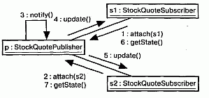

#### Рис. 15.7 Поток управления с точки зрения организации

## Советы
Моделируя взаимодействия на языке UML, помните, что они отражают динамические аспекты совокупности объектов. Хорошо структурированное взаимодействие обладает следующими свойствами:

* является достаточно простым и охватывает только такие объекты, в результате совместной работы которых достигается поведение более значимое, чем сумма его составных частей;
* обладает четко определенным контекстом. Это может быть контекст операции, класса или системы в целом;
* является эффективным и реализует описываемое поведение при оптимальных затратах времени и ресурсов;
* легко адаптируется для применения в различных задачах: элементы взаимодействия, которые с большой вероятностью могут изменяться, должны быть изолированы, что облегчит задачу модификации в будущем;
* доступно, не грешит запутанностью, обходится без скрытых побочных эффектов или неочевидной семантики.

При рисовании диаграммы взаимодействия в UML руководствуйтесь следующими принципами:

* выберите аспект взаимодействия, на котором требуется акцентировать внимание. Это может быть либо временное упорядочение сообщений, либо их последовательность в контексте той или иной структурной организации объектов. Нельзя показать то и другое одновременно;
* указывайте только такие свойства объектов (значения атрибутов, роли и состояния), которые важны для понимания взаимодействия в выбранном контексте;
* отображайте только такие свойства сообщений (параметры, семантику параллелизма или возвращаемое значение), которые необходимы для понимания взаимодействия в выбранном контексте.

http://bourabai.kz/dbt/uml/ch16.htm

ЧАСТЬ IV - Основы моделирования поведения
# Глава 16. Прецеденты
* Введение
* Термины и понятия
    * Имена
    * Прецеденты и актеры
    * Прецеденты и поток событий
    * Прецеденты и сценарии
    * Прецеденты и кооперации
    * Организация прецедентов
    * Другие возможности
* Типичные приемы моделирования
    * Поведение элемента
* Советы

Системы не существуют в изоляции. Как правило, они взаимодействуют с актерами - людьми или программами - которые используют систему в своих целях, причем каждый актер ожидает, что она будет вести себя определенным, вполне предсказуемым образом. Прецедент (Use case) специфицирует поведение системы или ее части и представляет собой описание множества последовательностей действий (включая варианты), выполняемых системой для того, чтобы актер мог получить определенный результат.

С помощью прецедентов можно описать поведение разрабатываемой системы, не определяя ее реализацию. Таким образом, они позволяют достичь взаимопонимания между разработчиками, экспертами и конечными пользователями продукта. Кроме того, прецеденты помогают проверить архитектуру системы в процессе ее разработки. Реализуются они кооперациями.

Хорошо структурированные прецеденты описывают только существенное поведение системы или подсистемы и не являются ни слишком общими, ни слишком специфическими.

## Введение

Хорошо спроектированный жилой дом - это не просто ряд стен, подпирающих крышу, которая защищает жильцов от непогоды. Работая вместе с архитектором над проектом дома, вы наверняка будете учитывать предполагаемое использование помещения. Если вы любите приглашать гостей, следует продумать план гостиной, чтобы людям было удобно общаться. Проектируя кухню, нужно определить местонахождение шкафчиков и бытовой техники. Неплохо было бы также принять во внимание маршрут транспортировки продуктов из машины на кухню, от которого во многом зависит взаимное расположение комнат. Если у вас большая семья, надо позаботиться о количестве и размещении ванных комнат, иначе каждое утро там будут выстраиваться очереди. Это особенно чревато скандалами, если в семье есть дети-подростки.

Размышления о том, как вы и ваша семья будете распоряжаться домом, - это пример анализа на основе прецедентов. Вы рассматриваете разные способы использования дома, которые в конечном счете обусловливают архитектуру. Для многих семей прецеденты использования схожи - во всех домах едят, спят, растят детей, отдыхают и хранят воспоминания. Но в каждом случае выдвигаются индивидуальные требования (или разновидности базовых требований) к жилищу. Потребности большой семьи, например, будут отличаться от запросов молодого человека, только что закончившего колледж. Эти различия окажут решающее влияние на то, как будет выглядеть готовый дом.

Важнейшая особенность разработки прецедентов состоит в том, что вы не специфицируете, как они будут реализованы. Например, поведение банкомата можно описать с помощью вариантов взаимодействия с ним пользователей, но вам не обязательно знать, как он устроен. Прецеденты специфицируют желаемое поведение, но ничего не говорят о том, как его достичь. И, что очень важно, это позволяет вам как эксперту или конечному пользователю общаться с разработчиками, конструирующими систему в соответствии с вашими требованиями, не углубляясь в детали реализации. Подробности будут рассмотрены позже, а на данном этапе вы можете сконцентрироваться на наиболее существенных проблемах.

В UML поведение моделируется с помощью прецедентов, специфируемых в отрыве от реализации. Прецедент - это описание множества последовательностей действий (включая их варианты), которые выполняются системой для того, чтобы актер получил результат, имеющий для него определенное значение. Это определение включает в себя несколько важных пунктов.

Прецедент описывает множество последовательностей, каждая из которых представляет взаимодействие (см. главу 15) сущностей, находящихся вне системы (ее актеров), с системой как таковой и ее ключевыми абстракциями. Такие взаимодействия являются в действительности функциями уровня системы, которыми вы пользуетесь для визуализации, специфицирования, конструирования и документирования ее желаемого поведения на этапах сбора и анализа требований (см. главу 6). Прецедент представляет функциональные требования к системе в целом. Например, основной прецедент в работе банка - это обработка займов.

Прецеденты предполагают взаимодействие актеров и системы. Актер представляет собой логически связанное множество ролей, которые играют пользователи прецедентов во время взаимодействия с ними. Актерами могут быть как люди, так и автоматизированные системы. Например, при моделировании работы банка процесс обработки займов включает в себя, помимо всего прочего, взаимодействие между клиентом и сотрудником кредитного отдела.

Развитие прецедентов может осуществляться по-разному. В любой хорошо продуманной системе существуют прецеденты, которые либо являются специализированными версиями других, более общих, либо входят в состав прочих прецедентов, либо расширяют их поведение. Общее поведение множества прецедентов, допускающее повторное применение, можно выделить, организуя их в соответствии с тремя описанными видами отношений. В частности, при моделировании работы банка базовый прецедент, описывающий обработку займов, подразделяется на несколько вариаций, от оформления крупной закладной до выдачи маленькой деловой ссуды. Однако все эти прецеденты имеют нечто общее в особенностях поведения, например оценку платежеспособности клиента.

Всякий прецедент должен выполнять некоторый объем работы. С точки зрения данного актера, прецедент делает нечто представляющее для него определенную ценность, например вычисляет результат, создает новый объект или изменяет состояние другого объекта. В примере с работой банка процесс обработки заявки на займ приводит к подписанию расходного ордера и материализуется в виде некоторой суммы денег, вручаемой клиенту.

Прецеденты могут быть применены ко всей системе или к ее части, в том числе к подсистемам (см. главу 31) или даже к отдельным классам (см. главы 4 и 9) и интерфейсам (см. главу 11). В любом случае прецеденты не только представляют желаемое поведение этих элементов, но могут быть использованы как основа для их тестирования на различных этапах разработки. Прецеденты в применении к подсистемам - это прекрасный источник регрессионных тестов, а в применении к системе в целом - источник комплексных и системных тестов. Графическое изображение прецедента и актера показано на рис. 16.1. Эта нотация позволяет визуализировать прецедент в контексте других прецедентов и отдельно от его реализации.

#### Рис. 16.1 Актеры и прецеденты

## Термины и понятия
Прецедентом (Use case) называется описание множества последовательностей действий (включая варианты), выполняемых системой для того, чтобы актер мог получить определенный результат. Графически прецедент изображается в виде эллипса. Нотация прецедента похожа на нотацию кооперации (см. главу 27).

### Имена
Любой прецедент должен иметь имя, отличающее его от других прецедентов. Оно должно быть уникально внутри объемлющего пакета (см. главу 12). Имя прецедента представляет собой текстовую строку. Взятое само по себе, оно называется простым именем. К составному имени спереди добавлено имя пакета, в котором он находится. Обычно при изображении прецедента указывают только его имя, как показано на рис. 16.2.

#### Рис. 16.2 Простые и составные имена

> Примечание: Имя прецедента может состоять из любого числа букв, цифр и некоторых знаков препинания (за исключением таких, как двоеточия, которые применяются для отделения имени прецедента от имени объемлющего пакета). Имя может занимать несколько строк. На практике для именования прецедентов используют короткие глагольные фразы в активной форме, обозначающие некоторое поведение и взятые из словаря моделируемой системы.

### Прецеденты и актеры
Актер представляет собой связное множество ролей, которые пользователи прецедентов исполняют во время взаимодействия с ними. Обычно актер представляет роль, которую в данной системе играет человек, аппаратное устройство или даже другая система. Например, если вы работаете в банке, то можете играть роль СотрудникКредит-ногоОтдела. Если в этом банке у вас имеется счет, вы играете роль Клиента. Таким образом, экземпляр актера представляет собой конкретную личность, взаимодействующую с системой определенным образом. Хотя вы и используете актеров в своих моделях, они не являются частью системы, так как существуют вне ее.

Как показано на рис. 16.3, актеров изображают в виде человеческих фигурок. Можно определить общие типы актеров (например, Клиент) и затем специализировать их (например, создав разновидность КоммерческийКлиент) с помощью отношений обобщения (см. главы 5 и 10).

#### Рис. 16.3 Актеры

> Примечание: Можно использовать механизмы расширения UML для приписывания актеру стереотипа (см. главу 6), чтобы создать другую пиктограмму, адекватную поставленным целям.

Актеров можно связывать с прецедентами только отношениями ассоциации (см. главы 5 и 10). Ассоциация между актером и прецедентом показывает, что они общаются друг с другом, возможно, посылая или принимая сообщения (см. главу 15).

### Прецеденты и поток событий
Прецедент описывает, что делает система (подсистема, класс или интерфейс), но не определяет, каким образом она это делает. В процессе моделирования всегда важно разделять внешнее и внутреннее представления.

Можно специфицировать поведение прецедента путем описания потока событий в текстовой форме - в виде, понятном для постороннего читателя. В описание необходимо включить указание на то, как и когда прецедент начинается и заканчивается, когда он взаимодействует с актерами и какими объектами они обмениваются. Важно обозначить также основной и альтернативный потоки поведения системы.

Например, в контексте банкомата можно было бы следующим образом описать прецедент ValidateUser (ПроверитьПользователя).

Основной поток событий. Прецедент начинается, когда система запрашивает у клиента его персональный идентификационный номер (PIN). Клиент (Customer) может ввести его с клавиатуры. Завершается ввод нажатием клавиши Enter. После этого система проверяет введенный PIN и, если он правильный, подтверждает ввод. На этом прецедент заканчивается.

Исключительный поток событий. Клиент может прекратить транзакцию в любой момент, нажав клавишу Cancel. Это действие начинает прецедент заново. Никаких изменений на счету клиента на производится.

Исключительный поток событий. Клиент может в любой момент до нажатия клавиши Enter стереть свой PIN и ввести новый.

Исключительный поток событий. Если клиент ввел неправильный PIN, прецедент запускается сначала. Если это происходит три раза подряд, система отменяет всю транзакцию и не позволяет данному клиенту снова начать работу с банкоматом в течение 60 секунд.

> Примечание: Поток событий в прецеденте можно описать различными способами, в том числе в виде неформализованного структурированного текста (как в примере выше), формализованного структурированного текста (с пред- и постусловиями) или с помощью псевдокода.

### Прецеденты и сценарии
Как правило, в начале работы потоки событий прецедента описывают в текстовой форме. По мере уточнения требований к системе будет удобнее перейти к графическому изображению потоков на диаграммах взаимодействия (см. главу 18). Обычно для описания главного потока прецедента используют диаграмму последовательностей, а для дополнительных - ее варианты.

Желательно отделять главный поток от альтернативных, поскольку прецедент описывает не одну, а множество последовательностей, и выразить все детали интересующего вас Прецедента с помощью одной последовательности невозможно. Например, в системе управления человеческими ресурсами присутствует прецедент Нанять работника. У этой общей бизнес-функции существует множество вариаций. Вы можете переманить сотрудника из другой компании (так бывает чаще всего), перевести человека из одного подразделения в другое (эта практика распространена в транснациональных компаниях) или нанять иностранца (особый случай, регулируемый специальными правилами). Каждый вариант описывается своей последовательностью.

Таким образом, один прецедент Нанять работника описывает несколько последовательностей, или сценариев, каждый из которых представляет одну из возможных вариаций данного потока событий. Сценарий (Scenario) - это некоторая последовательность действий, иллюстрирующая поведение системы. Сценарии находятся в таком же отношении к прецедентам, как экземпляры (см. главу 13) к классам, то есть сценарий - это экземпляр прецедента.

> Примечание: Относительно сложная система содержит несколько десятков прецедентов, каждый из которых может разворачиваться в несколько десятков сценариев. Для любого прецедента можно выделить основные сценарии, описывающие важнейшие последовательности, и вспомогательные, описывающие альтернативные последовательности.

### Прецеденты и кооперации
Как было указано, прецедент описывает желательное поведение системы (подсистемы, класса или интерфейса), но не специфицирует его реализацию. Это важная особенность, поскольку анализ системы (по результатам которого специфицируется ее поведение) по возможности не должен учитывать проблемы реализации (иными словами, как это поведение должно быть материализовано - см. главы 9 и 10). В конце концов, однако, прецеденты придется реализовать. Для этого необходимо будет создать сообщество классов и других элементов, в результате совместной работы которых будет достигнуто желаемое поведение. Такое сообщество, включая его динамическую и статическую структуру, называется в UML кооперацией (см. главу 27).

Как видно из рис. 16.4, реализацию прецедента с помощью кооперации можно специфицировать явно. Но чаще всего один прецедент реализуется в точности одной кооперацией, так что явно описывать отношение не нужно.

#### Рис. 16.4 Прецеденты и кооперации

> Примечание: Хотя вы можете не визуализировать это отношение явно, применяемые для работы с моделями инструментальные средства, скорее всего, будут так или иначе его поддерживать.

> Примечание: Нахождение минимального набора хорошо структурированных коопераций, реализующих определенный во всех прецедентах системы поток событий, - основная задача системной архитектуры (см. главу 2).

### Организация прецедентов
Для организации прецедентов их группируют в пакеты (см. главу 12), так же как и классы.

Кроме того, прецеденты можно организовать, определив между ними отношения обобщения, включения и расширения. Эти отношения применяют, чтобы выделить некоторое общее поведение (извлекая его из других прецедентов, которые его включают) или, наоборот, вариации (поместив такое поведение в другие прецеденты, которые его расширяют).

Отношение обобщения (см. главы 5 и 10) между прецедентами аналогично отношениям обобщения между классами. Это означает, что прецедент-потомок наследует поведение и семантику своего родителя, может замещать его или дополнять его поведение, а кроме того, может быть подставлен всюду, где появляется его родитель (как родитель, так и потомок могут иметь конкретные экземпляры). Например, в банковской системе возможно наличие прецедента Проверить Клиента, который отвечает за проверку личности клиента. Он может иметь двух специализированных потомков (Проверить пароль И Сканирование сетчатки). Оба потомка ведут себя так же, как прецедент Проверить клиента, и могут использоваться везде, где используется их родитель, но при этом каждый из них добавляет и свое собственное поведение (первый проверяет текстовый пароль, а второй - рисунок сетчатки глаза). Как показано на рис. 16.5, обобщения между прецедентами изображаются точно так же, как и обобщения между классами -в виде линии с незакрашенной стрелкой.

#### Рис. 16.5 Обобщения, включения и расширения

Отношение включения между прецедентами означает, что в некоторой точке базового прецедента инкорпорировано поведение другого прецедента. Включаемый прецедент никогда не существует автономно, а инстанцируется только как часть объемлющего прецедента. Можно считать, что базовый прецедент заимствует поведение включаемых.

Благодаря наличию отношений включения удается избежать многократного описания одного и того же потока событий, поскольку общее поведение можно описать в виде самостоятельного прецедента, включаемого в базовые. Отношение включения является примером делегирования, при котором ряд обязанностей системы описывается в одном месте (во включаемом прецеденте), а остальные прецеденты, когда необходимо, включают эти обязанности в свой набор.

Отношения включения изображаются в виде зависимостей (см. главы 5 и 10) со стереотипом (см. главу 6) include. Чтобы специфицировать место в потоке событий, где базовый прецедент включает поведение другого, вы просто пишете слово include, за которым следует имя включаемого прецедента. Проиллюстрируем это на примере, описывающем поток для прецедента Следить за выполнением заказа.

Основной поток событий. Получить и проверить номер заказа, include (Проверить клиента). Запросить статус каждой части заказа и доложить клиенту.

Отношение расширения подразумевает, что базовый прецедент неявно содержит поведение другого прецедента в точке, которая косвенно задается расширяющим прецедентом. Базовый прецедент может быть автономным, но при определенных обстоятельствах его поведение расширяется за счет другого. Базовый прецедент допустимо расширить только в некоторых точках, называемых точками расширения. Можно считать, что расширяющий прецедент передает свое поведение базовому.

Отношение расширения применяют для моделирования таких частей прецедента, которые пользователь воспринимает как необязательное поведение системы. Тем самым можно разделить обязательное и необязательное поведение. Отношения расширения используются также для моделирования отдельных субпотоков, выполняемых лишь при определенных обстоятельствах. Наконец, их применяют для моделирования нескольких потоков, которые могут включаться в некоторой точке сценария в результате явного взаимодействия с актером.

Отношение расширения изображают в виде зависимости со стереотипом extend. Точки расширения базового сценария перечисляются в дополнительном разделе. Они являются просто метками, которые могут появляться в потоке базового прецедента. Например, поток для прецедента Разместить заказ можно было бы описать нижеследующим образом.

Основной поток событий include (Проверить Клиента). Собрать все пункты сделанного клиентом заказа. (Установить приоритет). Отправить заказ на обработку.

В данном примере фраза Установить приоритет - это точка расширения. Прецедент может содержать несколько точек расширения (причем каждую по несколько раз), идентифицируемых по именам. При обычных обстоятельствах базовый прецедент в этом примере выполняется без учета приоритетности заказа. Если же поступает приоритетный заказ, то поток будет выполняться, как обычно, до точки расширения (Установить приоритет), а в ней будет выполнен расширяющий прецедент (Разместить срочный заказ), после чего возобновится работа главного потока. Если определено несколько точек расширения, то расширяющие прецеденты будут последовательно выполняться в собственных потоках.

> Примечание: Организация прецедентов путем выделения общего поведения (отношение включения) и различных вариаций (отношение расширения) является важной составной частью процесса разработки простого, сбалансированного и понятного набора прецедентов системы.

### Рис. 16.5 Обобщения, включения и расширения

Отношение включения между прецедентами означает, что в некоторой точке базового прецедента инкорпорировано поведение другого прецедента. Включаемый прецедент никогда не существует автономно, а инстанцируется только как часть объемлющего прецедента. Можно считать, что базовый прецедент заимствует поведение включаемых.

Благодаря наличию отношений включения удается избежать многократного описания одного и того же потока событий, поскольку общее поведение можно описать в виде самостоятельного прецедента, включаемого в базовые. Отношение включения является примером делегирования, при котором ряд обязанностей системы описывается в одном месте (во включаемом прецеденте), а остальные прецеденты, когда необходимо, включают эти обязанности в свой набор.

Отношения включения изображаются в виде зависимостей (см. главы 5 и 10) со стереотипом (см. главу 6) include. Чтобы специфицировать место в потоке событий, где базовый прецедент включает поведение другого, вы просто пишете слово include, за которым следует имя включаемого прецедента. Проиллюстрируем это на примере, описывающем поток для прецедента Следить за выполнением заказа.

Основной поток событий. Получить и проверить номер заказа, include (Проверить клиента). Запросить статус каждой части заказа и доложить клиенту.

Отношение расширения подразумевает, что базовый прецедент неявно содержит поведение другого прецедента в точке, которая косвенно задается расширяющим прецедентом. Базовый прецедент может быть автономным, но при определенных обстоятельствах его поведение расширяется за счет другого. Базовый прецедент допустимо расширить только в некоторых точках, называемых точками расширения. Можно считать, что расширяющий прецедент передает свое поведение базовому.

Отношение расширения применяют для моделирования таких частей прецедента, которые пользователь воспринимает как необязательное поведение системы. Тем самым можно разделить обязательное и необязательное поведение. Отношения расширения используются также для моделирования отдельных субпотоков, выполняемых лишь при определенных обстоятельствах. Наконец, их применяют для моделирования нескольких потоков, которые могут включаться в некоторой точке сценария в результате явного взаимодействия с актером.

Отношение расширения изображают в виде зависимости со стереотипом extend. Точки расширения базового сценария перечисляются в дополнительном разделе. Они являются просто метками, которые могут появляться в потоке базового прецедента. Например, поток для прецедента Разместить заказ можно было бы описать нижеследующим образом.

Основной поток событий include (Проверить Клиента). Собрать все пункты сделанного клиентом заказа. (Установить приоритет). Отправить заказ на обработку.

В данном примере фраза Установить приоритет - это точка расширения. Прецедент может содержать несколько точек расширения (причем каждую по несколько раз), идентифицируемых по именам. При обычных обстоятельствах базовый прецедент в этом примере выполняется без учета приоритетности заказа. Если же поступает приоритетный заказ, то поток будет выполняться, как обычно, до точки расширения (Установить приоритет), а в ней будет выполнен расширяющий прецедент (Разместить срочный заказ), после чего возобновится работа главного потока. Если определено несколько точек расширения, то расширяющие прецеденты будут последовательно выполняться в собственных потоках.

> Примечание: Организация прецедентов путем выделения общего поведения (отношение включения) и различных вариаций (отношение расширения) является важной составной частью процесса разработки простого, сбалансированного и понятного набора прецедентов системы.

## Типичные приемы моделирования

### Поведение элемента
Чаще всего с помощью прецедентов моделируют поведение элемента: системы в целом, подсистемы (см. главу 31) или класса (см. главы 4 и 9). При этом важно сконцентрироваться исключительно на том, что должен делать элемент, а не на том, как он это будет делать.

Подобное применение прецедентов к элементам представляет важность по трем причинам. Во-первых, моделируя поведение элемента с помощью прецедентов, эксперты в предметной области могут описать взгляд на систему извне с такой степенью детализации, что разработчики сумеют сконструировать ее внутреннее представление. Прецеденты дают возможность экспертам, конечным пользователям и разработчикам общаться на одном языке. Во-вторых, прецеденты позволяют разработчикам понять назначение элемента. Система, подсистема или класс могут быть сложными образованиями с большим числом операций и других составных частей. Описав прецеденты элемента, вы поможете их потенциальным пользователям разобраться в том, как с ним обращаться. В противном случае им пришлось бы на собственном опыте постигать, как следует использовать тот или иной элемент. В-третьих, прецеденты являются основой для тестирования каждого элемента на всем протяжении его разработки. Постоянно сравнивая функционирование каждого элемента с прецедентами, вы будете контролировать корректность его реализации. При этом вы не только получаете источник регрессионных тестов, но будете вынуждены при появлении нового прецедента данного элемента пересмотреть реализацию, чтобы убедиться в том, что элемент в достаточной степени изменяем. Если это не так, следует пересмотреть архитектуру.

Моделирование поведения элемента осуществляется следующим образом:

1. Идентифицируйте актеры, взаимодействующие с данным элементом. К чис лу актеров-кандидатов относятся группы, которые требуют определенного по ведения для выполнения своих задач либо необходимы, прямо или косвенно, для выполнения функций элемента.
2. Организуйте актеры, выделив общие и специализированные роли.
3. Для каждого актера рассмотрите основные пути его взаимодействия с элемен том. Рассмотрите также взаимодействия, изменяющие состояние элемента или его окружения либо предполагающие реакцию на некоторое событие.
4. Рассмотрите альтернативные (исключительные) способы взаимодействия актеров с элементом.
5. Организуйте выявленное поведение в виде прецедентов, применяя отноше ния включения и расширения для выделения общего и исключительного по ведения.

Например, система розничной торговли должна взаимодействовать с клиентами, которые размещают заказы и хотят отслеживать их продвижение. Система будет отгружать выполненные заказы и выставлять счета клиентам. Как видно из рис. 16.6, моделировать поведение такой системы можно, объявляя его в виде прецедентов (Разместить заказ, Следить за выполнением заказа, Отгрузить заказ и Выставить счет). Можно выделить общее поведение (Проверить клиента) и вариации (Отгрузить частично выполненный заказ). Для каждого из этих прецедентов следует включить спецификацию поведения с помощью текста, автомата или взаимодействий.

#### Рис. 16.6 Моделирование поведения элемента

По мере развития модели вы обнаружите тенденцию к объединению прецеден-тов в концептуально и семантически близкие группы. В UML для моделирований таких групп применяются пакеты (см. главу 12).

## Советы
Моделируя прецеденты в UML, помните, что каждый из них должен представ лять некоторое четко идентифицируемое поведение системы или ее части. Хоро шо структурированный прецедент обладает следующими свойствами:

* именует простое, идентифицируемое и в некоторой степени атомарное пове дение системы или ее части;
* выделяет общее поведение, извлекая его из всех прецедентов, которые его включают;
* выделяет вариации, помещая некоторое поведение в другие прецеденты, которые его расширяют;
* описывает поток событий в степени, достаточной для понимания посторонним читателем;
* описывается с помощью минимального набора сценариев, специфицирующих его нормальную и дополнительную семантику.

Изображая прецеденты в UML, пользуйтесь следующими правилами:

* показывайте только такие прецеденты, которые важны для понимания поведения системы или ее части в данном контексте;
* показывайте только те актеры, которые связаны с этими прецедентами.

http://bourabai.kz/dbt/uml/ch17.htm

ЧАСТЬ IV - Основы моделирования поведения
# Глава 17. Диаграммы прецедентов
* Введение
* Термины и понятия
    * Общие свойства
    * Содержание
    * Типичные примеры применения
* Типичные приемы моделирования
    * Контекст системы
    * Требования к системе
    * Прямое и обратное проектирование
* Советы 

Диаграммы прецедентов представляют собой один из пяти типов диаграмм, применяемых в UML для моделирования динамических аспектов системы (остальные четыре типа - это диаграммы деятельности, состояний, последовательностей и кооперации, см. главы 19, 24 и 18 соответственно). Диаграммы прецедентов играют основную роль в моделировании поведения системы, подсистемы или класса. Каждая такая диаграмма показывает множество прецедентов, актеров и отношения между ними.

Диаграммы прецедентов применяются для моделировании вида системы с точки зрения прецедентов (или вариантов использования). Чаще всего это предполагает моделирование контекста системы, подсистемы или класса либо моделирование требований, предъявляемых к поведению указанных элементов.

Диаграммы прецедентов имеют большое значение для визуализации, специфицирования и документирования поведения элемента. Они облегчают понимание систем, подсистем или классов, представляя взгляд извне на то, как данные элементы могут быть использованы в соответствующем контексте. Кроме того, такие диаграммы важны для тестирования исполняемых систем в процессе прямого проектирования и для понимания их внутреннего устройства при обратном проектировании.

## Введение
Предположим, что вы получили по почте загадочное устройство, с одной сто-роны которого находятся несколько кнопок и маленький жидкокристаллический дисплей. Помимо этого в нем нет ничего примечательного, и у вас нет даже наме-' ка на то, как его использовать. Можно, конечно, использовать метод проб и ошибок: произвольно нажимать на кнопки и смотреть, что получится, но таким путем на изучение устройства вам придется потратить огромное количество времени.

Программные системы часто выглядят столь же непривычно. Вам как пользователю могут передать некоторое приложение и посоветовать поработать с ним. Если это приложение следует принятым соглашениям используемой вами операционной системы, то, быть может, после нескольких попыток вы добьетесь каких-то полезных результатов, но понять таким образом более сложные и тонкие аспекты поведения программы вам никогда не удастся. Если вы разработчик, то вам могут передать на сопровождение унаследованное приложение или набор компонентов и сказать, что их надо применить в работе. Вряд ли вы сумеете постичь, как нужно с ними обращаться, пока не сформируете концептуальную модель их работы.

В языке UML диаграммы прецедентов как раз и позволяют визуализировать поведение системы, подсистемы или класса, чтобы пользователи могли понять как их использовать, а разработчики - реализовать соответствующий элемент. На рис. 17.1 приводится диаграмма, описывающая использование устройства, которое упоминалось в начале главы, - обычно его называют сотовым телефоном.

#### Рис. 17.1 Диаграмма прецедентов

## Термины и понятия
Диаграммой прецедентов, или использования (Use case diagram), называется диаграмма, на которой показана совокупность прецедентов и актеров, а также отношения между ними.

### Общие свойства
Диаграмма прецедентов обладает стандартными свойствами, присущими любой диаграмме (см. главу 7), - именем и графическим содержанием, которое представляет собой одну из проекций модели. Диаграмма прецедентов отличается от прочих своим конкретным содержанием.

### Содержание
Диаграммы прецедентов обычно включают в себя:

* прецеденты (см. главу 16);
* актеры (см. главу 16);
* отношения зависимости, обобщения и ассоциации (см. главы 5 и 10).

 Как и все остальные диаграммы, они могут содержать примечания и ограничения.

Иногда в диаграммы прецедентов помещают пакеты (см. главу 12), применяемые для группирования элементов модели в более крупные блоки, а в ряде случаев и экземпляры (см. главу 13) прецедентов, особенно если надо визуализировать конкретную исполняемую систему.

### Типичные примеры применения
Диаграммы прецедентов, или использования, применяют для моделирования статического вида системы с точки зрения прецедентов. Этот вид (см. главу 2) охватывает главным образом поведение системы, то есть видимые извне сервисы, предоставляемые системой в контексте ее окружения.

При моделировании статического вида системы с точки зрения прецедентов диаграммы использования обычно применяются двумя способами:

* для моделирования контекста системы. Моделирование контекста подразумевает, что мы обводим систему воображаемой линией и выявляем актеры, которые находятся за этой линией и взаимодействуют с системой. Диаграммы прецедентов нужны на этом этапе для идентификации актеров и семантики их ролей;
* для моделирования требований (см. главы 4 и 6) к системе. Моделирование требований к системе предполагает указание на то, что система должна делать (с точки зрения внешнего наблюдателя), независимо от того, как она должна это делать. Диаграммы прецедентов нужны здесь для специфицирования желаемого поведения системы. Они позволяют рассматривать всю систему как "черный ящик": вы видите все, что находится вне нее, наблюдаете за ее реакцией на события, но ничего не знаете о ее внутреннем устройстве.

## Типичные приемы моделирования

### Контекст системы
Любая система содержит внутри себя какие-либо сущности, в то время как другие сущности остаются за ее пределами. Например, в системе проверки кредитных карточек имеются счета, транзакции и механизмы проверки подлинности. В то же время обладатели кредитных карточек и торговые предприятия находятся вне системы. Сущности внутри системы отвечают за реализацию поведения, которого ожидают сущности, находящиеся снаружи. Сущности, находящиеся вне системы и взаимодействующие с ней, составляют ее контекст. Таким образом, контекстом называется окружение системы.

UML позволяет моделировать контекст с помощью диаграмм прецедентов, в которых внимание акцентируется на окружающих систему (см. главу 31) актерах. Важно правильно определить актеры, поскольку это позволяет описать класс сущностей, взаимодействующих с системой. Еще важнее определить, что не является актером, так как при этом ограничивается окружение системы: в нем остаются только те элементы, которые участвуют в ее работе.

Моделирование контекста системы состоит из следующих шагов:

1. Идентифицируйте окружающие систему актеры. Для этого нужно найти группы, которым участие системы требуется для выполнения их задач; группы, которые необходимы для осуществления системой своих функций; группы, взаимодействующие с внешними программными и аппаратными средствами, а также группы, выполняющие вспомогательные функции администрирования и поддержки.
2. Организуйте похожих актеров с помощью отношений обобщения/специа лизации.
3. Введите стереотипы для каждого актера, если это облегчает понимание.
4. Поместите актеров на диаграмму прецедентов и определите способы их свя зи с прецедентами системы.

Например, на рис. 17.2 показан контекст системы, работающей с кредитными карточками, где основное внимание уделяется окружающим ее актерам. В первую очередь это Клиенты двух типов (Индивидуальный клиент и Корпоративный клиент), соответствующие ролям, которые играют люди при взаимодействии с системой. В этом контексте показаны и актеры, представляющие другие организации, такие как Торговые предприятия (с ними покупатели совершают карточные транзакции, приобретая вещи или услуги) и Субсидирующие финансовые институты (выполняющие роль клиринговой палаты для карточных счетов). В реальном мире последние два актера, скорее всего, сами будут программными системами.

#### Рис. 17.2 Моделирование контекста системы

Тот же метод позволяет моделировать и контекст подсистемы (см. главу 31). Вообще, элемент, который на одном уровне абстракции выглядит как система, часто становится подсистемой на другом, более высоком уровне абстракции. Моделирование контекста подсистемы может пригодиться при построении системы из нескольких взаимосвязанных частей.

### Требования к системе
Требование (Requirement) - это особенность проекта, свойство или поведение системы. Приступая к сбору требований, вы как бы описываете условия контракта, заключаемого между системой и сущностями вне нее, в котором декларируется, что система должна делать. При этом, как правило, вас заботит не то, как именно система будет выполнять поставленные задачи, а только то, что она будет делать. Хорошо спроектированная система должна полностью выполнять все требования, причем делать это предсказуемо и надежно. Ее создание начинается с соглашения о том, каково ее назначение, хотя в ходе разработки понимание требований будет постепенно изменяться. Аналогично при работе с готовой системой понимание того, как она себя ведет, имеет принципиальное значение для ее правильного использования.

Требования можно выразить по-разному, от неструктурированного текста до выражений на формальном языке (или, например, с помощью примечаний, см. главу 6). Большая часть функциональных требований к системе - или даже все они - может быть выражена в виде прецедентов использования, в чем помогают диаграммы прецедентов UML.

Моделирование требований к системе производится следующим образом:

1. Установите контекст системы, идентифицировав окружающие ее актеры.
2. Для каждого актера рассмотрите поведение, которого он ожидает или требу ет от системы.
3. Поименуйте эти общие варианты поведения как прецеденты.
4. Выделите общее поведение в новые прецеденты, которые будут использо ваться другими; выделите вариации поведения в новые прецеденты, расши ряющие основные потоки событий.
5. Смоделируйте эти прецеденты, актеры и отношения между ними на диа грамме прецедентов.
6. Дополните прецеденты примечаниями, описывающими нефункциональные требования; некоторые из таких примечаний можно присоединить к систе ме в целом.

Рис. 17.3 расширяет предыдущую диаграмму. Хотя отношения между актерами и прецедентами на ней опущены, но присутствуют дополнительные прецеденты, которые описывают важные, пусть и невидимые для обычного пользователя, элементы поведения системы. Эта диаграмма удобна, поскольку дает возможность пользователям, экспертам и разработчикам совместно визуализировать, специфицировать, конструировать и документировать свои решения относительно функциональных требований к системе. Например, прецедент Обнаружение фальшивых карточек описывает поведение, важное как для Торговых предприятий, так и для Субсидирующих финансовых институтов. Другой прецедент - Отчет о состоянии счета - также описывает поведение, требуемое от системы различными организациями в своих контекстах.

#### Рис. 17.3 Моделирование требований к системе

Требование, моделируемое прецедентом Управление сбоями в сети, немного отличается от остальных, поскольку представляет вспомогательное поведение системы, необходимое, чтобы гарантировать надежное и непрерывное функционирование (см. главу 23).

Такая же методика применима и при моделировании требований к подсистеме (см. главу 31).

### Прямое и обратное проектирование
Большинство других диаграмм UML (см. главу 7), включая диаграммы классов, компонентов и состояний, удобно для прямого и обратного проектирования, поскольку у каждой из них имеется аналог в исполняемой системе. С диаграммами прецедентов дело обстоит несколько иначе, поскольку они скорее отражают, чем определяют реализацию системы, подсистемы или класса. Прецеденты (см. главу 16) описывают то, как ведет себя элемент, а не то, как реализуется соответствующее поведение, и поэтому не могут быть непосредственно подвергнуты прямому и обратному проектированию.

Прямое проектирование подразумевает преобразование модели в исполняемый код на каком-либо языке программирования. Прямое проектирование диаграмм прецедентов приводит к получению тестов для соответствующего элемента. Каждый прецедент в диаграмме определяет поток событий (и его варианты), а эти потоки специфицируют ожидаемое поведение элементов - иначе говоря, именно то, что подлежит тестированию. Хорошо структурированный прецедент содержит также пред- и постусловия, с помощью которых можно определить начальное состояние теста и критерии успешности. Для каждого сценария в диаграмме вы можете разработать тест, а затем запускать его при появлении каждой новой версии элемента, подтверждая тем самым, что он работает корректно, и, стало быть, другие элементы могут на него полагаться.

Прямое проектирование диаграммы прецедентов состоит из следующих шагов:

1. Идентифицируйте основной и альтернативный потоки событий для всех прецедентов, представленных на диаграмме.
2. В зависимости от предполагаемой глубины тестирования сгенерируйте тес товый скрипт для каждого потока, используя предусловия в качестве началь ного состояния, а постусловия - в качестве критерия успешности.
3. При необходимости сгенерируйте тестовое окружение, в котором представ лены все актеры, взаимодействующие с прецедентом. Актеры, которые пере дают элементу информацию или на которых элемент воздействует, можно имитировать или же подставить вместо них реальные эквиваленты.
4. С помощью инструментальных средств выполняйте эти тесты всякий раз после завершения разработки новой версии элемента, к которому применя ется диаграмма.
5. Обратным проектированием называется процесс преобразования кода, написанного на каком-либо языке программирования, в модель. Автоматическое обратное проектирование диаграмм прецедентов на данном этапе развития отрасли практически невыполнимо из-за потери информации при переходе от спецификации поведения элемента к его реализации. Тем не менее можно изучить существующую систему и разобраться в ее поведении самостоятельно, а затем представить результаты анализа в виде диаграммы прецедентов. Фактически это придется делать всякий раз, когда вы столкнетесь с недокументированным программным обеспечением. Диаграммы прецедентов UML в данном случае просто предоставляют в ваше распоряжение стандартный и выразительный язык для описания того, что вы обнаружите.

Обратное проектирование диаграмм прецедентов производится так:

1. Идентифицируйте все взаимодействующие с системой актеры.
2. Изучите способы, посредством которых актеры взаимодействуют с систе мой, изменяют состояние системы или ее окружения, а также реагируют на события.
3. Осуществите трассировку потока событий в исполняемой системе относи тельно каждого актера. Начинать при этом нужно всегда с главных потоков и только потом рассматривать альтернативные.
4. Сгруппируйте родственные потоки, объявив соответствующий прецедент. Подумайте о моделировании вариаций с помощью отношений расширения и о моделировании общих потоков с помощью отношений включения.
5. Изобразите актеры и прецеденты на диаграмме прецедентов и установите отношения между ними.

## Советы
Создавая диаграммы прецедентов в UML, помните, что каждая из них является всего лишь графическим представлением статического вида системы с точки зрения прецедентов. Это означает, что ни одна диаграмма прецедентов, взятая в отдельности, не может, да и не должна охватывать весь этот вид целиком. В совокупности диаграммы прецедентов дают полное представление о виде системы с точки зрения прецедентов, а каждая из них в отдельности - только об одном из его аспектов.

Хорошо структурированная диаграмма прецедентов обладает следующими свойствами:

* акцентирует внимание только на одном аспекте статического вида системы с точки зрения прецедентов;
* содержит только такие прецеденты и актеров, которые важны для понимания этого аспекта;
* содержит только такие детали, которые соответствуют данному уровню абстракции; следует показывать только те дополнения (например, точки расширения), которые необходимы для понимания системы;
* не настолько лаконична, чтобы ввести читателя в заблуждение относительно важной семантики.

При изображении диаграммы прецедентов руководствуйтесь следующими принципами:

* дайте ей имя, соответствующее назначению;
* расположите элементы так, чтобы свести к минимуму число пересечений;
* пространственно организуйте элементы так, чтобы семантически близкие сущности физически располагались рядом;
* используйте примечания и цвет, чтобы привлечь внимание читателя к важным особенностям диаграммы;
* старайтесь не показывать слишком много видов отношений. В общем случае, если есть много сложных отношений включения и расширения, выделите их в отдельную диаграмму.

http://bourabai.kz/dbt/uml/ch18.htm

ЧАСТЬ IV - Основы моделирования поведения
# Глава 18. Диаграммы взаимодействий
* Введение
* Термины и понятия
    * Общие свойства
    * Содержание
    * Диаграммы последовательностей
    * Диаграммы кооперации
    * Семантическая эквивалентность
    * Типичные примеры применения
* Типичные приемы моделирования
    * Потоки управления во времени
    * Структура потоков управления
    * Прямое и обратное проектирование
* Советы

Диаграммы последовательностей и кооперации (и те, и другие называются диаграммами взаимодействий) относятся к числу пяти видов диаграмм, применяемых в UML для моделирования динамических аспектов системы (остальные три вида- диаграммы деятельности, состояния и прецедентов, см. главы 19, 24 и 17 соответственно). На диаграммах взаимодействий показывают связи, включающие множество объектов и отношений между ними, в том числе сообщения, которыми объекты обмениваются. При этом диаграмма последовательностей акцентирует внимание на временной упорядоченности сообщений, а диаграмма кооперации - на структурной организации посылающих и принимающих сообщения объектов.

Диаграммы взаимодействий используются для моделирования динамических аспектов системы. Сюда входит моделирование конкретных и прототипических экземпляров классов, интерфейсов, компонентов и узлов, а также сообщений, которыми они обмениваются, - и все это в контексте сценария, иллюстрирующего данное поведение. Диаграммы взаимодействий могут существовать автономно и служить для визуализации, специфицирования, конструирования и документирования динамики конкретного сообщества объектов, а могут использоваться для моделирования отдельного потока управления в составе прецедента.

Диаграммы взаимодействий важны не только для моделирования динамических аспектов системы, но и для создания исполняемых систем посредством прямого и обратного проектирования.

## Введение
Когда вы смотрите фильм в кинотеатре или по телевизору, ваше восприятие обманывает вас. На самом деле вы видите не непрерывный процесс, как в жизни, а последовательность статичных изображений, меняющихся так быстро, что создается иллюзия движения.

При планировании съемок фильма режиссеры и аниматоры используют ту же технику, но с меньшим разрешением. Выделяя основные кадры, они строят модель каждой сцены, уровень детализации которой достаточен для того, чтобы передать ее суть всем участникам съемочной команды. Фактически создание сценария - это ключевой момент кинематографического процесса, поскольку он помогает всей команде визуализировать, специфицировать, конструировать и документировать модель фильма в течение работы над ним, от первоначального замысла до выхода в прокат.

При моделировании программной системы возникает похожая проблема: как лучше смоделировать ее динамические аспекты (о моделировании структурных аспектов рассказано в частях 2 и 3 данной книги). Вообразите на минуту, что вы способны визуализировать работающую систему. Если бы вы подключили к ней интерактивный отладчик, то могли бы сосредоточить внимание на любом участке памяти и наблюдать, как он изменяется. Можно было бы даже наблюдать за работой нескольких интересующих вас объектов. Вы увидели бы, как с течением времени объекты создаются, изменяют значения атрибутов и уничтожаются.

Однако ценность такой визуализации будет весьма ограничена, особенно если речь идет о распределенной системе с несколькими параллельными потоками управления. Это напоминает попытку понять кровеносную систему человека, изучая кровоток через одно из сечений его артерии. В данном случае лучше разработать несколько сценариев, описывающих взаимодействие определенных объектов и сообщения, которыми они обмениваются.

В UML это достигается с помощью диаграмм взаимодействий. Как показано на рис. 18.1, такие диаграммы можно строить двумя способами - уделяя основное внимание временной упорядоченности сообщений или структурным отношениям между взаимодействующими объектами. Получаемые любым из этих способов диаграммы семантически эквивалентны и преобразуются друг в друга без потери информации.

#### Рис. 18.1 Диаграммы взаимодействий

## Термины и понятия
Диаграмма взаимодействий (Interaction diagram) описывает взаимодействия, состоящие из множества объектов и отношений между ними, включая сообщения, которыми они обмениваются. Диаграммой последовательностей (Sequence diagram) называется диаграмма взаимодействий, акцентирующая внимание на временной упорядоченности сообщений. Графически такая диаграмма представляет собой таблицу, объекты в которой располагаются вдоль оси X, а сообщения в порядке возрастания времени - вдоль оси Y. Диаграммой кооперации (Collaboration diagram) называется диаграмма взаимодействий, основное внимание в которой уделяется структурной организации объектов, принимающих и отправляющих сообщения. Графически такая диаграмма представляет собой граф из вершин и ребер.

### Общие свойства

Поскольку диаграмма взаимодействий - это частный случай диаграммы, ей присущи общие для всех диаграмм свойства (см. главу 7): имя и графическое содержание, являющееся одной из проекций модели. От других диаграмм ее отличает содержание

### Содержание
Как правило, диаграммы взаимодействий (см. главу 15) содержат:

* объекты (см. главу 13);
* связи (см. главы 14 и 15);
* сообщения (см. главу 15).

> Примечание: Диаграммы взаимодействий являются, по сути, проекцией участвующих во взаимодействии элементов. К этим диаграммам применима семантика контекста взаимодействий, объектов, ролей, связей, сообщений и последовательностей.

Подобно прочим диаграммам, диаграммы взаимодействий могут содержать также примечания и ограничения.

### Диаграммы последовательностей
На диаграммах последовательностей внимание акцентируется прежде всего на временной упорядоченности сообщений. На рис. 18.2 показано, что для создания такой диаграммы надо прежде всего расположить объекты, участвующие во взаимодействии, в верхней ее части вдоль оси X. Обычно инициирующий взаимодействие объект размещают слева, а остальные - правее (тем дальше, чем более подчиненным является объект). Затем вдоль оси Y размещаются сообщения, которые объекты посылают и принимают, причем более поздние оказываются ниже. Это дает читателю наглядную картину, позволяющую понять развитие потока управления во времени.

#### Рис. 18.2 Диаграмма последовательностей

Диаграммы последовательностей характеризуются двумя особенностями, отличающими их от диаграмм кооперации.

Во-первых, на них показана линия жизни объекта. Это вертикальная пунктирная линия, отражающая существование объекта во времени. Большая часть объектов, представленных на диаграмме взаимодействий, существует на протяжении всего взаимодействия, поэтому их изображают в верхней части диаграммы, а их линии жизни прорисованы сверху донизу. Объекты могут создаваться и во время взаимодействий. Линии жизни таких объектов начинаются с получения сообщения со стереотипом create. Объекты могут также уничтожаться во время взаимодействий; в таком случае их линии жизни заканчиваются получением сообщения со стереотипом destroy, а в качестве визуального образа используется большая буква X, обозначающая конец жизни объекта. (Обстоятельства жизненного цикла объекта можно указывать с помощью ограничений new, destroyed и transient, см. главу 15.)

> Примечание: Если объект на протяжении своей жизни изменяет значения атрибутов, состояние или роль, это можно показать (см. главу 13), поместив копию его пиктограммы на линии жизни в точке изменения.

Вторая особенность этих диаграмм - фокус управления. Он изображается в виде вытянутого прямоугольника, показывающего промежуток времени, в течение которого объект выполняет какое-либо действие, непосредственно или с помощью подчиненной процедуры. Верхняя грань прямоугольника выравнивается по временной оси с моментом начала действия, нижняя - с моментом его завершения (и может быть помечена сообщением о возврате). Вложенность фокуса управления, вызван ную рекурсией (то есть обращением к собственной операции) или обратным вы зовом со стороны другого объекта, можно показать, расположив другой фокус управления чуть правее своего родителя (допускается вложенность произвольно! глубины). Если место расположения фокуса управления требуется указать с максимальной точностью, можно заштриховать область прямоугольника, соответствующую времени, в течение которого метод действительно работает и не пере дает управление другому объекту.

> Примечание: На диаграммах кооперации линию жизни объекта явным образом не показывают, хотя можно показать сообщения create и destroy. Не показывают там и фокус управления, однако порядковые номера сообщения могут отображать вложенность.

### Диаграммы кооперации
Диаграмма кооперации акцентирует внимание на организации объектов, прини-мающие участие во взаимодействии. Как показано на рис. 18.3, для создания диа граммы кооперации нужно расположить участвующие во взаимодействии объекта в виде вершин графа. Затем связи, соединяющие эти объекты, изображаются в вид дуг этого графа. Наконец, связи дополняются сообщениями, которые объекты при нимают и посылают. Это дает пользователю ясное визуальное представление о по токе управления в контексте структурной организации кооперирующихся объектов.

#### Рис. 18.3 Диаграмма кооперации

У диаграмм кооперации есть два свойства, которые отличают их от диаграмм последовательностей.

Первое - это путь. Для описания связи одного объекта с другим к дальней концевой точке этой связи можно присоединить стереотип пути (например, local показывающий, что помеченный объект является локальным по отношению к от правителю сообщения). Имеет смысл явным образом изображать путь связи только в отношении путей типа local, parameter, global и self (но не associations).

Второе свойство - это порядковый номер сообщения. Для обозначения временной последовательности перед сообщением можно поставить номер (нумерация начинается с единицы), который должен постепенно возрастать для каждого нового сообщения (2, 3 и т.д.). Для обозначения вложенности используется десятичная нотация Дьюи (1 - первое сообщение; 1.1 - первое сообщение, вложенное в сообщение 1; 1.2- второе сообщение, вложенное в сообщение 1 и т.д.). Уровень вложенности не ограничен. Для каждой связи можно показать несколько сообщений (вероятно, посылаемых разными отправителями), и каждое из них должно иметь уникальный порядковый номер.

Чаще всего вам придется моделировать неветвящиеся последовательные потоки управления. Однако можно моделировать и более сложные потоки, содержащие итерации и ветвления (для этого более удобна диаграмма деятельности - см. главу 19). Итерация представляет собой повторяющуюся последовательность сообщений. Для ее моделирования перед номером сообщения в последовательности ставится выражение итерации, например * [ i : = 1. . n] (или просто *, если надо обозначить итерацию без дальнейшей детализации). Итерация показывает, что сообщение (и все вложенные в него сообщения) будет повторяться в соответствии со значением заданного выражения. Аналогично условие представляет собой сообщение, выполнение которого зависит от результатов вычисления некоторого булевского выражения. Для моделирования условия перед порядковым номером сообщения ставится выражение, например [х>0]. У всех альтернативных ветвей будет один и тот же порядковый номер, но условия на каждой ветви должны быть заданы так, чтобы два из них не выполнялись одновременно (не перекрывались). (Более сложная форма порядковой нумерации, применяемая для различения параллельных потоков управления, рассматривается в главе 22.)

UML не определяет никакого особенного формата для выражений в квадратных скобках при описании итераций и ветвлений; можно использовать псевдокод или синтаксис какого-либо конкретного языка программирования.

> Примечание: Не показывайте явно связи между объектами на диаграмме последовательностей. Также не указывайте порядковый номер сообщения, поскольку он неявно определяется физическим расположением сообщения относительно верха или низа диаграммы. Итерации и ветвления показывать можно; при этом альтернативные ветви изображают с помощью отдельных сообщений, исходящих из одной точки. Как правило, на диаграммах последовательностей показывают только простые ветвления; более сложные изображаются на диаграмме кооперации.

### Семантическая эквивалентность
Поскольку диаграммы последовательностей и кооперации используют одну и ту же информацию из метамодели UML, они семантически эквивалентны. Это означает, что можно преобразовать диаграмму одного типа в другой без какой-либо потери информации, что и было показано на двух предыдущих рисунках. Это не означает, однако, что на обеих диаграммах представлена в точности одна и та же информация. Так, на упомянутых рисунках диаграмма кооперации показывает, как связаны объекты (обратите внимание на стереотипы local и global), а соответствующая диаграмма последовательностей - нет. С другой стороны, на диаграмме последовательностей могут быть показаны возвращаемые сообщения (сообщение committed), а на соответствующей диаграмме кооперации они отсутствуют. Таким образом, можно сказать, что диаграммы обоих типов используют одну модель, но визуализируют разные ее особенности.

### Типичные примеры применения
Диаграммы взаимодействий используются для моделирования динамических аспектов системы. Речь идет о взаимодействии экземпляра (см. главу 13) любой разновидности в любом представлении системной архитектуры (см. главу 2), включая экземпляры классов (см. главы 4 и 9), в том числе активных (см. главу 22), интерфейсов (см. главу 11), компонентов (см. главу 25) и узлов (ем. главу 26).

Моделирование динамических аспектов системы с помощью диаграммы взаимодействий возможно в контексте системы в целом, подсистемы (см. главу 31), операции (см. главы 4 и 9) или класса. Диаграммы взаимодействий можно присоединять также к прецедентам (для моделирования сценария) и к кооперациям (для моделирования динамических аспектов сообщества объектов).

При моделировании динамических аспектов системы диаграммы взаимодей ствий обычно используются двояко:

* для моделирования временной упорядоченности потоков управления. С этой целью используют диаграммы последовательностей. При этом внимание акцентируется на передаче сообщений во времени, что бывает особенно полезно для визуализации динамического поведения в контексте прецедентов. Простые итерации и ветвления на диаграммах последовательностей отображать удобнее, чем на диаграммах кооперации;
* для моделирования структурной организации потоков управления. В этом случае нужны диаграммы кооперации. Основное внимание при этом уделяется моделированию структурных отношений между взаимодействующими экземплярами, вдоль которых передаются сообщения. Для визуализации сложных итераций, ветвлений и параллельных потоков управления диаграммы кооперации подходят лучше, чем диаграммы последовательностей.

## Типичные приемы моделирования

Потоки управления во времени
Рассмотрим объекты, существующие в контексте системы, подсистемы (см. главу 31), операции или класса (см. главы 4 и 9). Рассмотрим также объекты и роли, сопричастные прецеденту (см. главу 16) или кооперации (см. главу 27). Для моде-лирования потока управления, проходящего через эти объекты и роли, применяются диаграммы взаимодействий; при этом, если на первый план нужно вынести передачу сообщений во времени, используют их разновидность - диаграммы последовательностей.

Моделирование временной упорядоченности потока управления осуществляется следующим образом:

1. Установите контекст взаимодействия, будь то система, подсистема, опера ция, класс или один из сценариев прецедента либо кооперации.
2. Определите сцену для взаимодействия, выяснив, какие объекты принимают в нем участие. Разместите их на диаграмме последовательностей слева на право так, чтобы более важные объекты были расположены левее.
3. Проведите для каждого объекта линию жизни. Чаще всего объекты суще ствуют на протяжении всего взаимодействия. Для тех же объектов, которые создаются или уничтожаются в ходе взаимодействия, явно отметьте на ли ниях жизни моменты рождения и смерти с помощью подходящих стереотип ных сообщений.
4. Начав с сообщения, инициирующего взаимодействие, расположите все по следующие сообщения сверху вниз между линиями жизни объектов. Если необходимо объяснить семантику взаимодействия, покажите свойства каж дого сообщения (например, его параметры).
5. Если требуется показать вложенность сообщений или точный промежуток времени, когда происходят вычисления, дополните линии жизни объектов фокусами управления.
6. Если необходимо специфицировать временные или пространственные огра ничения, дополните сообщения отметками времени (см. главу 23) и присо едините соответствующие ограничения.
7. Для более строгого и формального описания потока управления присоеди ните к каждому сообщению пред- и постусловия (см. главу 4).

На одной диаграмме последовательностей можно показать только один поток управления (хотя с помощью нотации UML для итераций и ветвлений можно проиллюстрировать простые вариации). Поэтому, как правило, создают несколько диаграмм взаимодействий, одни из которых считаются основными, а другие описывают альтернативные пути и исключительные условия. Такой набор диаграмм последовательностей можно организовать в пакет (см. главу 12), дав каждой диаграмме подходящее имя, отличающее ее от остальных.

В качестве примера на рис. 18.4 показана диаграмма последовательностей, где описан поток управления, относящийся к инициации простого двустороннего телефонного разговора. На данном уровне абстракции есть четыре объекта: два абонента (Callers) - они названы s и r, безымянный телефонный коммутатор (Switch) и объект с, являющийся материализацией разговора (Conversation) между абонентами. Последовательность начинается с отправки одним абонентом (s) сигнала (см. главу 20) liftReceiver (поднятьТрубку) коммутатору. Коммутатор, в свою очередь, посылает абоненту сообщение setDialTone (задатьТоновыйНаборНо-мера), после чего абонент несколько раз посылает сообщение dialDigit (на-братьЦифру). Обратите внимание, что это сообщение имеет отметку времени (см. главу 23) dialing, которая используется во временном ограничении (время выполнения executionTime - меньше 30 секунд). На диаграмме не показано, что случится при нарушении ограничения (см. главу 6), - для этой цели можно было бы включить отдельную ветвь или нарисовать другую диаграмму. Далее коммутатор посылает сам себе сообщение routeCall (маршрутизировать вызов), а затем создает объект (с) класса Conversation (разговор), которому делегирует остальную часть работы. Хотя это и не показано во взаимодействии, у с есть дополнительная обязанность (см. главу 4), связанная с механизмом начисления платы за разговор (это должно быть выражено на другой диаграмме взаимодействий). Объект Conversation звонит второму абоненту (r), который асинхронно посылает сообщение liftReceiver (поднятие трубки). После этого объект Conversation говорит коммутатору, что надо установить соединение (connect), а коммутатор сообщает обоим абонентам, что они соединены (connect), после чего абоненты наконец могут начать обмен информацией - это и показано в присоединенном примечании (см. главу 6).

#### Рис. 18.4 Моделирование временной упорядоченности потоков управления

> Примечание: На диаграмме последовательностей можно моделировать изменения состояния, роли и значений атрибутов объекта. Для этого есть два способа. Во-первых, можно изобразить объект несколько раз с различными состояниями, ролями и атрибутами, а потом для обозначения изменений воспользоваться переходом со стереотипом become. Во-вторых, для изменения состояния можно прямо на линии жизни объекта поместить соответствующую пиктограмму состояния.

Диаграмма взаимодействий может начинаться или заканчиваться в любой точке последовательности. Полная трассировка потока - это чрезвычайно сложная задача, поэтому имеет смысл разбить его на части и показать их на разных диаграммах.

### Структура потоков управления
Рассмотрим объекты, существующие в контексте системы, подсистемы (см. главу 31), операции или класса (см. главы 4 и 9). Рассмотрим также объекты и роли, принимающие участие в прецеденте (см. главу 16) или кооперации (см. главу 27). Для моделирования потока управления, проходящего через эти объекты и роли, применяются диаграммы взаимодействий; при этом, чтобы показать передачу сообщений в контексте данной структуры, используют их разновидность - диаграммы кооперации.

Моделирование структурной организации потоков управления состоит из следующих шагов:

1. Установите контекст взаимодействия. Это может быть система, подсистема, операция, класс или один из сценариев прецедента либо кооперации.
2. Определите сцену для взаимодействия, выяснив, какие объекты принимают в нем участие. Разместите их на диаграмме кооперации в виде вершин графа так, чтобы более важные объекты оказались в центре диаграммы, а их соседи - по краям.
3. Определите начальные свойства каждого из этих объектов. Если значения атрибутов, помеченные значения, состояния или роли объектов изменяются во время взаимодействия, поместите на диаграмму дубликаты с новыми значениями и соедините их сообщениями со стереотипами become и copy (см. главу 13), сопроводив их соответствующими порядковыми номерами.
4. Детально опишите связи между объектами, вдоль которых передаются сообщения. Для этого:
    * сначала нарисуйте связи-ассоциации. Они наиболее важны, поскольку представляют структурные соединения;
    * после этого нарисуйте остальные связи, дополнив их соответствующими
7. стереотипами пути (такими, как global или local, см. главу 15), чтобы явным образом показать, как объекты связаны друг с другом.
8. Начав с сообщения, инициирующего взаимодействие, присоедините все по следующие сообщения к соответствующим связям, задав порядковые номера. Вложенность показывайте с помощью нотации Дьюи.
9. Если требуется специфицировать временные или пространственные ограничения, дополните сообщения отметками времени (см. главу 23) и присоедините нужные ограничения.
10. Если требуется описать поток управления более формально, присоедините к каждому сообщению пред- и постусловия (см. главу 4).

Как и в случае диаграмм последовательностей, на одной диаграмме кооперации можно показать только один поток управления (хотя нотация UML для итераций и ветвлений помогает проиллюстрировать простые вариации). Поэтому, как правило, создают несколько диаграмм взаимодействий, одни из которых считаются основными, а другие описывают альтернативные пути и исключительные условия. Такие наборы диаграмм кооперации можно организовать в пакеты (см. главу 12), дав каждой диаграмме подходящее имя, отличающее ее от остальных.

В качестве примера на рис. 18.5 показана диаграмма кооперации, которая описывает поток управления, связанный с регистрацией нового студента, причем внимание акцентируется на структурных отношениях между объектами. На диаграмме представлено пять объектов: RegistrarAgent, r (Регистратура), Student, s (Студент), два объекта Course, cl и с2 (Курс) и безымянный объект School (Вуз). Поток управления пронумерован явно. Действие начинается с того, что RegistrarAgent создает объект Student и добавляет его к School (сообщение addStudent), а затем дает ему указание зарегистрироваться. После этого объект Student посылает себе сообщение getschedule, предположительно получив сначала Course, на который он хочет записаться. Затем объект Student добавляет себя к каждому объекту Course. В конце опять показан объект s с об новленным значением атрибута registered.

#### Рис. 18.5 Моделирование организации потоков управления

Обратите внимание, что на диаграмме показаны связи между объектом School и двумя объектами Course, а также между объектами School и Student, хотя вдоль этих путей не передаются никакие сообщения. Связи просто поясняют, как Student может "видеть" два Course, на которые он записывается. Объекты s cl и с2 связаны с School ассоциацией; следовательно, s может найти cl и с2 во время обращения к операции getSchedule (которая может вернуть набор объек тов Course) косвенно, через объект School.

### Прямое и обратное проектирование
Прямое проектирование (создание кода на основе модели) возможно и для диаграмм последовательностей, и для диаграмм кооперации, особенно если их контекстом является операция. Например, используя достаточно развитый инструмент прямого проектирования, для операции register класса student из только что описанной диаграммы можно сгенерировать следующий код на языке Java:

	
	public void register()
	  CourseCollection c = getSchedule();
	  for (int i = 0; i < c.size(); i++) 
	    c.item(i).add(this);
	  this.registered = true; 
	}
 
Слова "достаточно развитый" означают следующее: из сигнатуры операции getSchedule инструмент должен понять, что она возвращает объект CourseCollection. Обходя содержимое этого объекта с помощью стандартной идиомы итерации (о которой инструмент должен знать), код может быть обобщен на любое число предлагаемых студенту курсов.

Обратное проектирование (создание модели на основе кода) также возможно для обоих видов диаграмм, особенно если контекстом кода является тело операции. Фрагменты приведенной выше диаграммы можно было бы сгенерировать с помощью соответствующего инструмента на основе прототипного исполнения операции register.

> Примечание: Прямое проектирование осуществляется непосредственно, а обратное требует усилий. Простая операция обратного проектирования может привести к избытку информации; проблема состоит в том, чтобы определить детали, которые следует оставить.

Более интересной по сравнению с обратным проектированием задачей является анимация модели вместо выполнения развернутой системы. Например, для предыдущей диаграммы инструмент мог бы анимировать сообщения так, как они должны возникать в работающей системе. Более того, поместив этот инструмент под управление отладчика, можно было бы контролировать скорость выполнения, устанавливать в интересующих местах точки останова и таким образом наблюдать за значениями атрибутов индивидуальных объектов.

## Советы
Создавая диаграммы взаимодействий в UML, помните, что и диаграммы последовательностей, и диаграммы кооперации являются проекциями динамических аспектов системы на одну и ту же модель. Ни одна диаграмма взаимодействий, взятая в отдельности, не может охватить все динамические аспекты. Для моделирования динамики системы в целом, равно как и ее подсистем, операций, классов, прецедентов и коопераций, лучше использовать сразу несколько диаграмм взаимодействий.

Хорошо структурированная диаграмма взаимодействий обладает следующими свойствами:

* акцентирует внимание только на одном аспекте динамики системы;
* содержит только такие прецеденты и актеры, которые важны для понимания этого аспекта;
* содержит только такие детали, которые соответствуют данному уровню абстракции, и только те дополнения, которые необходимы для понимания системы;
* не настолько лаконична, чтобы ввести читателя в заблуждение относительно важных аспектов семантики.

При изображении диаграммы взаимодействий следует пользоваться нижеприведенными рекомендациями:

* дайте ей имя, соответствующее ее назначению;
* используйте диаграмму последовательностей, если хотите подчеркнуть временную упорядоченность сообщений, и диаграмму кооперации - если хотите подчеркнуть структурную организацию участвующих во взаимодействии объектов;
* расположите элементы так, чтобы свести к минимуму число пересечений;
* пространственно организуйте элементы так, чтобы семантически близкие сущности на диаграмме располагались рядом;
* используйте примечания и цвет, чтобы привлечь внимание читателя к важным особенностям диаграммы;
* не злоупотребляйте ветвлениями. Сложные ветвления лучше показывать на диаграммах деятельности.

http://bourabai.kz/dbt/uml/ch19.htm

ЧАСТЬ IV - Основы моделирования поведения
# Глава 19. Диаграммы деятельности
* Введение
* Термины и понятия
    * Общие свойства
    * Наполнение
    * Состояния действия и состояния деятельности
    * Переходы
    * Ветвление
    * Разделение и слияние
    * Дорожки
    * Траектория объекта
    * Типичные примеры применения
* Типичные приемы моделирования
    * Рабочий процесс
    * Операция
    * Прямое и обратное проектирование
* Советы

Диаграммы деятельности - это один из пяти видов диаграмм, применяемых в UML для моделирования динамических аспектов поведения системы (другие виды: диаграммы последовательностей и кооперации, состояний, прецедентов, см. главы 18, 24 и 17 соответственно). Диаграмма деятельности - это, по существу, блок-схема, которая показывает, как поток управления переходит от одной деятельности к другой.

Диаграммы деятельности можно использовать для моделирования динамических аспектов поведения системы. Как правило, они применяются, чтобы промоделировать последовательные (а иногда и параллельные) шаги вычислительного процесса. С помощью диаграмм деятельности можно также моделировать жизнь объекта, когда он переходит из одного состояния в другое в разных точках потока управления. Диаграммы деятельности могут использоваться самостоятельно для визуализации, специфицирования, конструирования и документирования динамики совокупности объектов, но они пригодны также и для моделирования потока управления при выполнении некоторой операции. Если в диаграммах взаимодействий акцент делается на переходах потока управления от объекта к объекту, то диаграммы деятельности описывают переходы от одной деятельности к другой. Деятельность (Activity) - это некоторый относительно продолжительный этап выполнения в автомате. В конечном итоге деятельность сводится к некоторому действию (Action, см. главу 15), которое составлено из атомарных вычислений, приводящих к изменению состояния системы или возврату значения.

Диаграммы деятельности важны не только для моделирования динамических аспектов поведения системы, но и для построения выполняемых систем посредством прямого и обратного проектирования.

## Введение
Рассмотрим последовательность операций при постройке дома. Сначала выбирается место. Затем вы нанимаете архитектора, который проектирует дом. После согласования проекта подрядчик предоставляет смету. После того как договорились о цене и проекте, начинается строительство. Местные власти дают разрешение, роется котлован, заливается фундамент, возводится каркас и так далее, пока работа не будет завершена. Наконец, вам вручают ключи и удостоверение на право проживания, и вы вступаете во владение домом.

Хотя в действительности процесс строительства намного сложнее, все же это описание дает представление об основных операциях. В реальном проекте ведется множество параллельных работ. Скажем, электрики могут работать одновременно с водопроводчиками и плотниками. Встречаются также условия и ветвления.

Например, в зависимости от характера грунта при рытье котлована можно будет обойтись экскаватором, но не исключено, что придется прибегнуть к взрывным работам или бороться с плывунами. Вероятны и циклы: к примеру, инспектор может обнаружить нарушение строительных норм и правил, и тогда придется часть работы переделывать заново.

В строительной индустрии, как правило, применяются методики, основанные на Gantt- и Pert-диаграммах, которые позволяют визуализировать, специфицировать, конструировать и документировать последовательность операций при выполнении проекта.

При моделировании программных систем вы сталкиваетесь с аналогичной проблемой. Как лучше всего промоделировать рабочий процесс или функционирование системы? То и другое - аспекты ее динамики (моделирование структурных аспектов системы рассмотрено в частях 2 и 3 данной книги). В принципе есть два варианта, которые напоминают применение Gantt- и Pert-диаграмм.

С одной стороны, можно построить несколько прецедентов, описывающих взаимодействие различных представляющих интерес объектов и сообщения, которыми они обмениваются. В UML такие прецеденты можно моделировать двумя способами: делая акцент на упорядочении сообщений по времени (с помощью диаграмм последовательностей) или на структурных отношениях между взаимодействующими объектами (с помощью диаграмм кооперации, см. главу 18). Такого рода диаграммы взаимодействия близки к Gantt-диаграммам, в фокусе которых находятся объекты (ресурсы), выполняющие некоторую работу во времени.

С другой стороны, динамику поведения можно моделировать с помощью диаграмм деятельности, в которых внимание сосредоточено прежде всего на содержании деятельности, в которой принимают участие объекты, как показано на рис. 19.1. С этой точки зрения диаграммы деятельности напоминают Pert-диаграммы. Диаграмма деятельности - это своеобразная блок-схема, которая описывает последовательность выполнения операций во времени. Ее можно представлять себе как вывернутую наизнанку диаграмму взаимодействий. Диаграмма взаимодействий - это взгляд на объекты, которые передают друг другу сообщения, а диаграмма деятельности - взгляд на операции, которые передаются от одного объекта другому. Семантическое различие трудноуловимо, но в результате нам открываются два совершенно разных взгляда на мир.

#### Рис. 19.1 Диаграмма деятельности

## Термины и понятия
Диаграмма деятельности (Activity diagram) показывает поток переходов от одной деятельности к другой. Деятельность (Activity) - это продолжающийся во времени неатомарный шаг вычислений в автомате. Деятельности в конечном счете приводят к выполнению некоего действия (Action, см. главу 15), составленного из выполняемых атомарных вычислений, каждое из которых либо изменяет состояние системы, либо возвращает какое-то значение. Действие может заключаться в вызове другой операции, посылке сигнала, создании или уничтожении объекта либо в простом вычислении - скажем, значения выражения. Графически диаграмма деятельности представляется в виде графа, имеющего вершины и ребра.

### Общие свойства
Диаграмма деятельности обладает теми же общими свойствами (см. главу 7), которые присущи всем остальным диаграммам: именем и графическим наполнением, проецирующим ее на модель. От всех прочих диаграмму деятельности отличает ее специфичное содержание.

### Наполнение
Диаграмма деятельности в общем случае состоит из:

* состояний деятельности и состояний действия;
* переходов (см. главу 21); Q объектов (см. главу 13).

> Примечание: Диаграмма деятельности, собственно, представляет собой проекцию элементов, присутствующих в графе деятельности, - разновидности автомата, в которой все или большинство состояний - это состояния деятельности, а все или большинство переходов обусловлены завершением деятельности в состоянии-источнике. Поскольку диаграмма деятельности - это автомат, то к ней применимы все характеристики автоматов. Это означает, в частности, что диаграмма деятельности может содержать простые и составные состояния, точки ветвления, разделения и слияния.

Диаграмма деятельности, как и любая другая диаграмма, может содержать примечания и ограничения.

### Состояния действия и состояния деятельности
В потоке управления, моделируемом диаграммой деятельности, происходят различные события. Вы можете вычислить выражение, в результате чего изменяется значение некоторого атрибута или возвращается некоторое значение. Также, например, можно выполнить операцию (см. главы 4 и 9) над объектом (см. главу 15), послать ему сигнал (см. главу 20) или даже создать его или уничтожить. Все эти выполняемые атомарные вычисления называются состояниями (см. главу 21) действия, поскольку каждое из них есть состояние системы, представляющее собой выполнение некоторого действия. Как показано на рис. 19.2, состояния действия изображаются прямоугольниками с закругленными краями. Внутри такого символа можно записывать произвольное выражение.

#### Рис. 19.2 Состояния действия

> Примечание: UML не требует использования какого-либо специального языка для записи таких выражений. Можно просто написать любой структурированный текст, а при необходимости конкретизации заимствовать синтаксис и семантику того или иного языка программирования.

Состояния действия не могут быть подвергнуты декомпозиции. Кроме того, они атомарны. Это значит, что внутри них могут происходить различные события, но выполняемая в состоянии действия работа не может быть прервана. И наконец, обычно предполагается, что длительность одного состояния действия занимает неощутимо малое время.

> Примечание: Конечно, в реальном мире для любого вычисления требуется некоторое время и память. Учет этих свойств в модели особенно важен для встроенных систем реального времени. (Моделирование времени и пространства обсуждается в главе 23.)

В противоположность этому состояния деятельности могут быть подвергнуты дальнейшей декомпозиции, вследствие чего выполняемую деятельность можно представить с помощью других диаграмм деятельности. Состояния деятельности не являются атомарными, то есть могут быть прерваны. Предполагается, что для их завершения требуется заметное время. Можно считать, что состояние действия - это частный вид состояния деятельности, а конкретнее - такое состояние, которое не может быть подвергнуто дальнейшей декомпозиции. А состояние деятельности можно представлять себе как составное состояние, поток управления которого включает только другие состояния деятельности и действий. Взгляните более пристально на внутреннюю структуру состояния деятельности, и вы найдете еще одну диаграмму деятельности. Как видно из рис. 19.3, состояния деятельности и действий обозначаются одинаково, с тем отличием, что у первого могут быть дополнительные части, такие как действия входа и выхода (то есть выполняемые соответственно при входе в состояние и выходе из него), и оно может сопровождаться спецификациями подавтоматов (см. главу 21).

#### Рис. 19.3 Состояния деятельности

> Примечание: Состояния действий и состояния деятельности - это не что иное, как частные случаи состояний автомата. Входя в одно из таких состояний, вы просто выполняете некоторое действие или деятельность, а при выходе управление передается следующему действию или деятельности. Таким образом, состояния деятельности в какой-то мере напоминают стенограмму. Семантически состояние деятельности эквивалентно транзитивному расширению графа деятельности по месту до тех пор, пока не останутся только действия. Тем не менее состояния деятельности важны, поскольку они помогают разбить сложные вычисления на более простые части, точно так же, как операции используются для группировки и повторного использования выражений.

### Переходы
Когда действие или деятельность в некотором состоянии завершается, поток управления сразу переходит в следующее состояние действия или деятельности. Для описания этого потока используются переходы (Transitions, см. главу 21), показывающие путь из одного состояния действия или деятельности в другое. В UML переход представляется простой линией со стрелкой, как показано на рис. 19.4.

#### Рис. 19.4 Нетриггерные переходы

> Примечание: Такие переходы называются переходами по завершении, или не-триггерными (Triggerless), поскольку управление по завершении работы в исходном состоянии немедленно передается дальше. После того как действие в данном исходном состоянии закончилось, выполняется определенное для него действие выхода (если таковое имеется). Далее, безо всякой задержки, поток управления следует переходу и попадает в очередное состояние действия или деятельности. При этом выполняется определенное для нового состояния действие входа (если таковое имеется), затем - действие или деятельность самого состояния и следующий переход. Управление может таким образом переходить из состояния в состояние неопределенно долго (в случае незавершающейся деятельности) или до попадания в конечное состояние. (Нетриггерные переходы могут иметь сторожевые условия, которые обусловливают их активизацию, - см. главу 21.)

Поток управления должен где-то начинаться и заканчиваться (разумеется, если это не бесконечный поток, у которого есть начало, но нет конца). Как показано на рисунке, вы можете задать как начальное состояние (закрашенный кружок), так и конечное (закрашенный кружок внутри окружности).

### Ветвление
Простые последовательные переходы встречаются наиболее часто, но их одних недостаточно для моделирования любого потока управления. Как и в блок-схеме, вы можете включить в модель ветвление, которое описывает различные пути выполнения в зависимости от значения некоторого булевского выражения. Как видно из рис. 19.5, точка ветвления представляется ромбом. В точку ветвления может входить ровно один переход, а выходить - два или более. Для каждого исходящего перехода задается булевское выражение, которое вычисляется только один раз при входе в точку ветвления. Ни для каких двух исходящих переходов эти сторожевые условия не должны одновременно принимать значение "истина", иначе поток управления окажется неоднозначным. Но эти условия должны покрывать все возможные варианты, иначе поток остановится. (Ветвление семантически эквивалентно множественным переходам со сторожевыми условиями, см. главу 21.)

#### Рис. 19.5 Ветвление

Для удобства разрешается использовать ключевое слово else для пометки того из исходящих переходов, который должен быть выбран в случае, если условия, заданные для всех остальных переходов, не выполнены.

Реализовать итерацию можно, если ввести два состояния действия - в первом устанавливается значение счетчика, во втором оно увеличивается - и точку ветвления, вычисление в которой показывает, следует ли прекратить итерации. (Ветвление и итерация возможны также на диаграммах взаимодействий, см. главу 18.)

> Примечание: UML не предписывает язык для этих выражений. В общем случае вы можете использовать структурированный текст; для большей строгости можно воспользоваться синтаксисом и семантикой определенного языка программирования.

### Разделение и слияние
Простые и ветвящиеся последовательные переходы в диаграммах деятельности используются чаще всего. Однако можно встретить и параллельные потоки, и это особенно характерно для моделирования бизнес-процессов. В UML для обозначения разделения и слияния таких параллельных потоков выполнения используется синхронизационная черта, которая рисуется в виде жирной вертикальной или горизонтальной линии. Каждый из параллельно выполняющихся потоков управления существует в контексте независимого активного объекта, который, как правило, моделируется либо процессом, либо вычислительной нитью (см. главу 22).

Рассмотрим, например, параллельные потоки, используемые в устройстве, которое имитирует человеческую речь и жестикуляцию. Как показано на рис. 19.6, точка разделения соответствует расщеплению одного потока управления на два выполняющихся параллельно. В этой точке может существовать ровно один входящий переход и два или более исходящих. Каждый исходящий переход представляет один независимый поток управления. После точки разделения деятельности, ассоциированные с каждым путем в графе, продолжают выполняться параллельно. С концептуальной точки зрения имеется в виду истинный параллелизм, то есть одновременное выполнение, но в реальной системе это может как выполняться (если система функционирует на нескольких узлах, см. главу 26), так и не выполняться (если система размещена только на одном узле). В последнем случае имеет место последовательное выполнение с переключением между потоками, что дает лишь иллюзию истинного параллелизма.

#### Рис. 19.6 Разделение и слияние

Из рисунка также видно, что точка слияния представляет собой механизм синхронизации нескольких параллельных потоков выполнения. В эту точку входят два или более перехода, а выходит ровно один. Выше точки слияния деятельности, ассоциированные с приходящими в нее путями, выполняются параллельно. В точке слияния параллельные потоки синхронизируются, то есть каждый из них ждет, пока все остальные достигнут этой точки, после чего выполнение продолжается в рамках одного потока.

> Примечание: Должен поддерживаться баланс между точками разделения и слияния. Это означает, что число потоков, исходящих из точки разделения, должно быть равно числу потоков, приходящих в соответствую -щую ей точку слияния. Деятельности, выполняемые в параллельных потоках, могут обмениваться друг с другом информацией, посылая сигналы. Такой способ организация взаимодействия последовательных процессов называется сопрограммами (Coroutine). В большинстве случаев при моделировании такого взаимодействия применяются активные объекты (см. главу 22). Но посылку сигналов (см. главу 20) и получение ответов можно моделировать и с помощью подавтоматов, ассоциированных с каждым из взаимодействующих состояний деятельности. Предположим, к примеру, что деятельность Поток речи должна сообщить деятельности Синхронизация движения губ о важных паузах и интонациях. Тогда в автомате, реализующем Поток речи, нужно было бы посылать сигналы автомату, реализующему Синхронизацию движения губ. А в автомате для Синхронизации движения губ присутствовали бы срабатывающие при получении таких сигналов переходы в состояния, где этот автомат на них отвечает.

### Дорожки
При моделировании течения бизнес-процессов иногда бывает полезно разбить состояния деятельности на диаграммах деятельности на группы, каждая из которых представляет отдел компании, отвечающий за ту или иную работу. В UML такие группы называются дорожками (Swimlanes), поскольку визуально каждая группа отделяется от соседних вертикальной чертой, как плавательные дорожки в бассейне (см. рис. 19.7). Дорожки - это разновидность пакетов (см. главу 12), описывающие связанную совокупность работ.

#### Рис. 19.7 Дорожки

Каждой присутствующей на диаграмме дорожке присваивается уникальное имя. Никакой глубокой семантики дорожка не несет, разве что может отражать некоторую сущность реального мира. Каждая дорожка представляет сферу ответственности за часть всей работы, изображенной на диаграмме, и в конечном счете может быть реализована одним или несколькими классами (главы 4 и 9). На диаграмме деятельности, разбитой на дорожки, каждая деятельность принадлежит ровно одной дорожке, но переходы могут пересекать границы дорожек.

> Примечание: Имеется некоторая связь между дорожками и параллельными потоками выполнения. Концептуально деятельность внутри каждой дорожки обычно - но не всегда - рассматривается отдельно от деятельности в соседних дорожках. Это разумно, поскольку в реальном мире подразделения организации, представленные дорожками, как правило, независимы и функционируют параллельно.

### Траектория объекта
В потоке управления, ассоциированном с диаграммой деятельности, могут участвовать объекты (см. главу 13). К примеру, для последовательности операций по обработке заказа, которая изображена на рис. 19.7, словарь (см. главу 4) проблемной области будет, вероятно, включать такие классы, как Заказ и Счет. Некоторые виды деятельности будут порождать объекты-экземпляры этих классов (например, Обработать заказ создаст объект Заказ), тогда как другие виды деятельности будут модифицировать эти объекты (например, Отгрузить заказ может изменить состояние объекта Заказ на выполнен).

Как видно из рис. 19.8, относящиеся к деятельности объекты можно включить в диаграмму деятельности и с помощью символа зависимости (см. главы 5 и 10) привязать к той деятельности или переходу, где они создаются, модифицируются или уничтожаются. Такое сочетание зависимостей и объекта называется траекторией объекта (Object flow), поскольку описывает его участие в потоке управления.

#### Рис. 19.8 Траектория объекта

Кроме изображения траектории объекта на диаграмме деятельности вы можете показать, как изменяются его роль, состояние (см. главу 13) и значения атрибутов (см. главы 4 и 9). Как показано на рисунке, для изображения состояния объекта его имя заключается в скобки и помещается под именем объекта. Аналогично можно представить и значения атрибутов объекта.

### Типичные примеры применения
Диаграммы деятельности используются для моделирования динамических аспектов системы. Эти динамические аспекты могут предполагать деятельность любого уровня абстракции любого вида системной архитектуры (см. главу 2), включая классы (в том числе активные, см. главу 22), интерфейсы (см. главу 11), компоненты (см. главу 2.5) и узлы (см. главу 26).

Использовать диаграмму деятельности для моделирования некоторого динамического аспекта системы можно в контексте практически любого элемента модели. Но чаще всего они рассматриваются в контексте системы в целом, подсистемы (см. главу 31), операции (см. главы 4 и 9) или класса (см. там же). Можно присоединять диаграммы деятельности к прецедентам (см. главу 16) и кооперациям (для моделирования динамических аспектов сообщества объектов).

При моделировании динамических аспектов системы диаграммы деятельности применяются в основном двумя способами:

* для моделирования рабочего процесса. Здесь внимание фокусируется на деятельности с точки зрения актеров, которые сотрудничают с системой. Рабочие процессы часто оказываются с внешней, обращенной к пользователю стороны программной системы и используются для визуализации, специфицирования, конструирования и документирования бизнес-процессов, составляющих существо разрабатываемой системы. Для такого применения диаграмм деятельности моделирование траекторий объектов имеет особенно важное значение;
* для моделирования операции. В этом случае диаграммы деятельности используются как блок-схемы для моделирования деталей вычислений. Для такого применения особенно важно моделирование точек ветвления, разделения и слияния. При этом контекст диаграммы деятельности включает параметры операции и ее локальные объекты.

## Типичные приемы моделирования

### Рабочий процесс
Программные системы не существуют изолированно; всегда имеется некоторый контекст (см. главу 17), в рамках которого система функционирует, причем он всегда включает актеры, взаимодействующие с системой. Рассматривая необходимое для бизнеса программное обеспечение масштаба предприятия, вы обязательно обнаружите, что автоматизированная система работает в контексте бизнес-процессов более высокого уровня. Такие бизнес-процессы являются примерами рабочих процессов, поскольку описывают, как функционирует предприятие и какие в него вовлечены объекты. Например, в розничной торговле имеются как автоматизированные системы (скажем, кассовые терминалы, взаимодействующие с подсистемами маркетинга и складского учета), так и неавтоматизированные (люди, работающие в торговых точках, в отделах дистанционных продаж, маркетинга, заказов и отгрузки). Моделировать эти бизнес-процессы с точки зрения кооперации различных автоматизированных и неавтоматизированных систем можно с помощью диаграмм деятельности.

Для того чтобы построить модель рабочего процесса, необходимо следующее:

1. Выделите какой-либо участок рабочего процесса. Проектируя непростые системы, невозможно отразить все представляющие интерес последовательности на одной диаграмме.
2. Выберите бизнес-объекты, на которые возложена ответственность высокого уровня за части всего рабочего процесса. Это могут быть реальные сущности, вошедшие в системный словарь (см. главу 4), или более абстрактные объекты. В любом случае следует создать отдельную дорожку для каждого бизнес-объекта.
3. Идентифицируйте предусловия для начального состояния рабочего процесса и постусловия (см. главу 9) для его конечного состояния. Это поможет при моделировании границ процесса.
4. Начиная с исходного состояния опишите деятельности и действия, выполняемые в различные моменты времени, а затем отразите их на диаграмме деятельности в виде состояний деятельности или действий.
5. Сложные действия или множества действий, встречающиеся многократно, следует свернуть в состояния деятельности и для каждого из таких состояний составить отдельную диаграмму деятельности.
6. Изобразите переходы, соединяющие состояния этих деятельностей и действий. Сначала нужно сосредоточиться на последовательных потоках, затем перейти к ветвлениям и в последнюю очередь рассмотреть разделения и слияния.
7. Если в рабочий процесс вовлечены важные объекты, изобразите их на диаграмме деятельности. В случае необходимости следует показать изменение значений и состояний таких объектов, чтобы прояснить суть траектории каждого.

Например, на рис. 19.9 показана диаграмма действий для бизнеса, связанного с розничной торговлей. Диаграмма описывает, что происходит, когда клиент возвращает товар, заказанный по почте. Процесс начинается с действия Запрос возврата со стороны Клиента, затем переходит на дорожку Дистанционные продажи (Получить номер возврата), возвращается на дорожку Клиент (Отправить товар), переходит на дорожку Склад (Принять товар, затем Переучесть товар) и завершается на дорожке Бухгалтерия (Кредитовать расчетный счет). Как видно из диаграммы, в процессе участвует один существенный объект (i - экземпляр класса Товар), состояние которого изменяется с возвращен на доступен.

#### Рис. 19.9 Моделирование рабочего процесса

> Примечание: Рабочие процессы, чаще всего представляют собой бизнес-процессы, но это не обязательно. Например, диаграммы действий можно применить для описания процессов разработки программного обеспечения - скажем, процесса управления конфигурацией. В равной мере они пригодны для моделирования непрограммных систем, таких как поток пациентов в учреждении здравоохранения.

В этом примере нет ни ветвлений, ни разделений, ни слияний. С этими элементами мы встретимся при рассмотрении более сложных рабочих процессов.

### Операция
Диаграмму деятельности можно присоединить к любому элементу модели для визуализации, специфицирования, конструирования и документирования поведения этого элемента, в частности к классам (см. главы 4 и 9), интерфейсам (см. главу 11), компонентам (см. главу 25), узлам (см. главу 26), прецедентам (см. главу 16) и кооперациям (см. главу 27). Чаще всего диаграммы деятельности присоединяются к операциям.

При таком использовании диаграмма деятельности становится просто блок-схемой выполняемых действий. Основное преимущество диаграммы деятельности заключается в том, что все ее элементы семантически связаны с лежащей в ее основе богатой моделью. Например, любая другая операция или сигнал, на который есть ссылка из состояния действия, могут быть проверены на соответствие типа классу целевого объекта.

Моделирование операции состоит из следующих шагов:

1. Выявить абстракции, относящиеся к операции. Сюда относятся параметры операции (включая тип возвращаемого значения, если таковое имеется), атрибуты объемлющего класса и некоторых соседних классов.
2. Идентифицируйте предусловия в начальном состоянии и постусловия в конечном состоянии операции. Следует идентифицировать также инварианты объемлющего класса, которые должны сохраняться во время выполнения операции. (Предусловия, постусловия и инварианты рассмотрены в главе 9.)
3. Начиная с исходного состояния операции, специфицируйте деятельности и действия, протекающие во времени, и изобразите их на диаграмме деятельности в виде состояний деятельности или действий.
4. При необходимости используйте точки ветвления для описания условных переходов и итераций.
5. Лишь в том случае, если владельцем операции является активный класс (см. главу 22), используйте точки разделения и слияния для описания параллельных потоков выполнения, если в этом возникает необходимость.

Если операция включает в себя взаимодействие сообщества объектов, ее реализацию можно моделировать с использованием коопераций - см. главу 27.

Так, на рис. 19.10 представлена диаграмма деятельности для класса Line (ПрямаяЛиния), которая описывает алгоритм операции пересечение. Сигнатура алгоритма состоит из одного параметра (1 - входной параметр класса Line) и одного возвращаемого значения (класса Point, Точка). Из атрибутов класса Line интерес представляют два: slope (тангенс угла наклона прямой) и delta (смещение прямой относительно начала координат).

#### Рис. 19.10 Моделирование операции

Алгоритм операции пересечения несложен, как явствует из диаграммы деятельности. В самом начале имеется сторожевое условие, которое проверяет, совпадает ли наклон текущей прямой с наклоном параметра 1. Если условие выполнено, то прямые не пересекаются и возвращается точка Point (0, 0). В противном случае сначала вычисляется абсцисса х точки пересечения, а затем - ордината у. Объекты х и у являются локальными для операции. И наконец, возвращается точка Point (х,у).

> Примечание: Использование диаграмм деятельности в качестве блок-схем практически превращает UML в язык визуального программирования. Можно нарисовать блок-схему для каждой операции, но вряд ли в этом есть необходимость. Более естественно кодировать тело операции на некотором языке программирования. Использование диаграмм деятельности для моделирования операции становится разумным, когда эта операции сложна, так что разобраться в ней, глядя только на код, достаточно трудно. Взгляд же на блок-схему позволит понять такие аспекты алгоритма, которые нелегко было бы уловить, изучая один лишь код.

### Прямое и обратное проектирование
Для диаграмм деятельности возможно прямое проектирование (создание кода на основе модели), особенно если диаграмма моделирует операцию. Например, из показанной выше диаграммы работ инструментальная программа могла бы сгенерировать для операции пересечение следующий код на языке C++:

	
	Point Line::intersection(I : Line)  {
	   if (slope == 1.slope) return Point(0,0);
	   int x =  (1.delta - delta)  /  (slope - 1.slope);
	   int у =  (slope * x) + delta;
	   return Point(x,y); 
	}
 
В этом коде отражена некоторая тонкость - объявление двух локальных переменных одновременно с присваиванием. "Менее развитый" инструмент мог бы сначала объявить переменные и лишь затем присвоить им значения.

Обратное проектирование (создание модели на основе кода) для диаграмм деятельности также возможно, особенно в случае, когда код представляет собой тело операции. В частности, из реализации класса Line может быть сгенерирована показанная выше диаграмма.

Однако интереснее не конструировать модель по коду, а подвергнуть ее анимации, демонстрируя, как "живет" установленная система. Например, инструментальная программа могла бы анимировать состояния действий на диаграмме, описанной выше, показывая, как они изменяются в работающей системе. Еще лучше было бы, если, работая с этой программой под отладчиком, вы могли бы контролировать скорость выполнения и, возможно, устанавливать точки прерывания в представляющих интерес местах, чтобы просмотреть значения атрибутов отдельных объектов.

## Советы
Создавая в UML диаграммы деятельности, не забывайте, что они лишь моделируют срез некоторых динамических аспектов поведения системы. С помощью единственной диаграммы деятельности никогда не удастся охватить все динамические аспекты системы. Вместо этого следует использовать разные диаграммы деятельности для моделирования динамики рабочих процессов или отдельных операций.

Диаграмму деятельности можно признать хорошо структурированной, если она:

* сконцентрирована на описании одного аспекта динамики системы;
* содержит только те элементы, которые существенны для понимания этого аспекта;
* представляет лишь те детали, которые соответствуют своему уровню абстракции; не должно быть дополнений, которые не являются необходимыми для понимания;
* не настолько кратка, чтобы читатель упустил из виду важные аспекты семантики.

Рисуя диаграмму деятельности, руководствуйтесь следующими принципами:

* дайте диаграмме имя, соответствующее ее назначению;
* начинайте с моделирования главного потока. Ветвления, параллельность и траектории объектов являются второстепенными деталями, которые можно изобразить на отдельной диаграмме;
* располагайте элементы так, чтобы число пересечений было минимальным;
* используйте примечания и закраску, чтобы привлечь внимание к важным особенностям диаграммы.

http://bourabai.kz/dbt/uml/ch20.htm

ЧАСТЬ V - Более сложные аспекты поведения
# Глава 20. События и сигналы
* Введение
* Термины и понятия
    * Виды событий
    * Сигналы
    * События вызова
    * События времени и изменения
    * Посылка и получение событий
* Типичные приемы моделирования
    * Семейства сигналов
    * Исключения
* Советы

Реальный мир ежедневно несет нам новые впечатления. Мало того, они порой возникают одновременно и неожиданно. Различные явления, происходящие в окружающем мире, называются событиями. Каждое событие описывает существенный факт, локализованный во времени и пространстве.

В контексте автоматов события используются для моделирования некоторого стимула, который может вызвать переход из одного состояния в другое. К числу событий относятся сигналы, вызовы, истечение определенного промежутка времени или изменение состояния.

События могут быть синхронными или асинхронными, и их моделирование является составной частью моделирования процессов и нитей.

## Введение
Абсолютно статичная система не представляет ни малейшего интереса, поскольку в ней ничего не происходит. Все реальные системы в той или иной мере динамичны, и их динамичность обусловлена событиями, происходящими внутри или вне системы. Работу банкомата инициирует пользователь, который нажимает кнопку для совершения банковской транзакции. Автономный робот начинает действовать, когда встречается с некоторым предметом. Сетевой маршрутизатор реагирует на обнаружение переполнения буферов сообщений. На химическом заводе сигналом к действию служит окончание промежутка времени, необходимого для завершения реакции.

В UML любое явление, которое может произойти, моделируется как событие. Событие - это описание существенного факта, имеющего определенное местоположение во времени и пространстве. Получение сигнала, истечение промежутка времени и изменение состояния - это примеры асинхронных событий, которые могут наступить в любой момент. Вызовы - это, как правило, синхронные события, используемые для запуска некоторой операции.

UML предоставляет средства для графического представления событий, как видно из рис. 20.1. Такая нотация позволяет визуализировать объявления событий (например, сигнала ТрубкаПовешена) и показать, как наступление события приводит к переключению между состояниями (например, сигнал ТрубкаПовешена вызывает переход телефона из состояния Активен в состояние Ожидание).

#### Рис. 20.1 События

## Термины и понятия
Событие (Event) - это описание существенного факта, который занимает некоторое положение во времени и в пространстве. В контексте автоматов событие - это стимул, который может вызвать переход из одного состояния в другое. Сигнал (Signal) - это вид события, в котором стимул передается асинхронно от одного экземпляра другому.

### Виды событий
События могут быть внутренними или внешними. Внешние события передаются между системой (см. главу 31) и ее актерами (см. главу 16). Примерами могут служить нажатие кнопки или прерывание от датчика столкновений. Внутренние события передаются между объектами, существующими внутри самой системы. Так, исключение, генерируемое при переполнении, является примером внутреннего события.

В UML можно моделировать четыре вида событий: сигналы, вызовы, истечение промежутка времени и изменение состояния.

### Сигналы
Сигнал - это именованный объект, который асинхронно возбуждается одним объектом и принимается (перехватывается) другим. Исключения, которые поддерживаются в большинстве современных языков программирования, - это наиболее распространенный вид внутренних сигналов, который вам придется моделировать. (Создание и уничтожение объектов - это тоже разновидность сигналов, см. главу 15.)

У сигналов есть много общего с простыми классами (см. главы 4 и 9). Например, можно говорить об экземплярах сигналов, хотя обычно не возникает необходимость моделировать их явно. Сигналы могут также участвовать в отношениях обобщения (см. главы 5 и 10), что позволяет моделировать иерархии событий, в которых одни (например, сигнал СбойСети) являются общими, а другие (например, специализация события СбойСети под названием ОтказСкладскогоСер-вера) - частными. Как и классы, сигналы могут иметь атрибуты и операции.

> Примечание: Атрибуты сигнала выступают в роли его параметров. Например, при посылке сигнала Столкновение можно указать значения его атрибутов в виде параметров: Столкновение (3,5).

Сигнал может быть послан как действие перехода (изменения) состояния в автомате или как отправка сообщения при взаимодействии. При выполнении операции тоже могут посылаться сигналы. На практике, когда моделируется класс или интерфейс (см. главу 11), важной частью спецификации поведения является указание сигналов, которые он может посылать. В UML связь между операцией и событиями, которые она может посылать, моделируется с помощью отношения зависимости (см. главу 5) со стереотипом (см. главу 6) send.

Как показано на рис. 20.2, в UML сигналы (и исключения) моделируются стереотипными классами. Для указания на то, что некоторая операция посылает сигнал, можно воспользоваться зависимостью со стереотипом send.

#### Рис. 20.2 Сигналы

### События вызова
Если событие сигнала представляет возбуждение сигнала, то событие вызова предназначено для описания выполнения операции. И в том, и в другом случае событие может вызвать переход состояния в автомате (см. главу 21).

В то время как сигнал является событием асинхронным, событие вызова обычно синхронно. Это означает, что, когда один объект инициирует выполнение операции на другом объекте, у которого есть свой автомат, управление передается от отправителя получателю, срабатывает соответствующий переход, затем операция завершается, получатель переходит в новое состояние и возвращает управление отправителю.

По рис. 20.3 видно, что в модели событие вызова неотличимо от события сигнала. В обоих случаях событие вместе со своими параметрами выглядит как триггер для перехода состояния.

#### Рис. 20.3 События вызоыа

> Примечание: Хотя визуально события сигнала и вызова неотличимы, разница совершенно отчетливо проявляется на заднем плане модели. Получатель события, конечно же, знает о различии (путем объявления операции в своем списке операций). Сигнал, как правило, обрабатывается на уровне автомата, а событие вызова - методом. Для перехода от события к сигналу или операции можно воспользоваться инструментальной программой.

### События времени и изменения
Событие времени представляет собой истечение промежутка времени. На рис. 20.4 показано, что в UML событие времени моделируется с помощью ключевого слова after (после), за которым следует выражение, вычисляющее некоторый промежуток времени. Выражение может быть простым (например, after 2 seconds) или сложным (например, after 1 ms c момента выхода из состояния Ожидание). Если явно не указано противное, то отсчет времени начинается с момента входа в текущее состояние.

#### Рис. 20.4 События времени и изменения

С помощью события изменения описывается изменение состояния или выполнение некоторого условия. На рис. 20.4 показано, что в UML событие изменения моделируется посредством ключевого слова when, за которым следует булевское выражение. Такое выражение может использоваться для обозначения абсолютного момента времени (например, when time=11: 59) или проверки условия (например, when altitude < 1000).

> Примечание: Хотя событие изменения моделирует условие, проверяемое непрерывно, обычно, проанализировав ситуацию, можно выявить дискретные моменты времени, когда это условие нужно проверять.

### Посылка и получение событий
В событиях сигнала и вызова участвуют по крайней мере два объекта: объект, посылающий сигнал или инициирующий операцию, и объект, которому событие адресовано. Поскольку сигналы по своей природе асинхронны, а асинхронные вызовы сами по себе являются сигналами, то семантика событий перекликается с семантикой активных и пассивных объектов.

Экземпляр (см. главу 13) любого класса может посылать сигнал принимающему объекту или инициировать в нем операцию. Отправив сигнал получателю, он продолжает свой поток управления, не дожидаясь от него ответа. Например, после того как актер, взаимодействующий с банкоматом, пошлет сигнал нажатьКнопку, он может выполнять другие действия независимо от того, что делает система, которой был послан сигнал. Напротив, если объект инициирует операцию, он должен дождаться ответа от получателя. Допустим, в трейдерской системе экземпляр класса Трейдер может инициировать операцию подтвердитьТранзакцию в некотором экземпляре класса Сделка, косвенно изменив тем самым состояние последнего. Если это синхронный вызов, то объект Трейдер будет ждать, пока операция закончится.

> Примечание: В некоторых случаях возникает необходимость в изображении объекта, который посылает сигнал сразу нескольким объектам (мулъти-вещание, Multicasting) или всем ожидающим объектам в системе (широковещание, Broadcasting). Для моделирования мулътивещания следует изобразить объект, посылающий сигнал коллекции, в которую входят все получатели. Для моделирования широковещания нужно показать, что объект посылает сигнал другому объекту, представляющему систему в целом.

Любой экземпляр любого класса может быть получателем события вызова или сигнала. Если это синхронное событие, то отправитель и получатель находятся в состоянии рандеву на всем протяжении выполнения операции. Это означает, что поток управления отправителя блокируется потоком управления получателя, пока операция не завершится. Если это сигнал, то отправитель и получатель не входят в состояние рандеву: отправитель посылает сигнал, но не дожидается ответа от получателя. В любом случае событие может быть потеряно (если не указано, что нужен ответ), может вызвать переход состояния в автомате (см. главу 21), если он существует, или просто инициировать обычный вызов метода.

В UML события вызова, которые получает объект, моделируются как операции (см. главу 4) над классом этого объекта. Именованные сигналы, получаемые объектом, моделируются путем перечисления в дополнительном разделе класса, как показано на рис. 20.5.

#### Рис. 20.5 Сигналы и активные классы

> Примечание: Точно так же можно присоединить именованные сигналы к интерфейсу (см. главу 11). В любом случае, имена сигналов, перечисленные в дополнительном разделе (см. главу 4), являются не объявлениями, а лишь указаниями на то, что сигнал используется. Сигналы, которые являются асинхронными операциями (см. главу 22), перечисляются в разделе обычных операций класса.

## Типичные приемы моделирования

Семейства сигналов
В большинстве систем, управляемых событиями, события сигналов образуют иерархию. Например, автономный робот может различать внешние сигналы, такие как Столкновение, и внутренние, например АппаратныйОтказ. Однако множества внешних и внутренних сигналов могут пересекаться. И даже внутри этих двух широких областей классификации можно обнаружить частные разновидно сти. К примеру, АппаратныйОтказ можно подразделить на ОтказБатареи и От-казДвигательногоМеханизма. Допускается и дальнейшая специализация. Так, разновидностью сигнала ОтказДвигательногоМеханизма является Оста-новЭлектромотора. (Об отношениях обобщения рассказано в главах 5 и 10.)

Моделируя таким образом иерархии сигналов, можно специфицировать полиморфные события. Рассмотрим, к примеру, автомат (см. главу 21), в котором некоторый переход срабатывает лишь при получении сигнала ОстановЭлектромото-ра. Поскольку этот сигнал является в иерархии листовым, то переход инициируется только им, так что полиморфизм отсутствует. Но предположим теперь, что вы построили автомат, в котором переход срабатывает при получении сигнала АппаратныйОтказ. В этом случае переход полиморфен, его возбуждает как сам сигнал АппаратныйОтказ, так и любая его специализация (разновидность), включая ОтказБатареи, ОтказДвигательногоМеханизма и ОстановЭлектромотора.

Моделирование семейства сигналов включает следующие этапы:

1. Рассмотрите все разновидности сигналов, на которые может отвечать данное множество активных объектов.
2. Выявите схожие виды сигналов и поместите их в иерархию типа "обобщение/специализация", используя наследование. На верхних уровнях иерархии будут располагаться общие сигналы, а на нижних -специализированные.
3. Определите возможности полиморфизма в автоматах этих активных объектов. Обнаружив полиморфизм, скорректируйте иерархию, добавив при необходимости промежуточные абстрактные сигналы.

На рис. 20.6 приведена модель семейства сигналов, которые могли бы обрабатываться автономным роботом. Обратите внимание, что корневой сигнал (СигналРо-боту) является абстрактным (см. главу 5), то есть прямое создание его экземпляров невозможно. У этого сигнала есть две конкретные специализации (Столкновение и АппаратныйОтказ), одна из которых (АппаратныйОтказ) специализируется и дальше. Заметьте, что у сигнала Столкновение есть один параметр.

#### Рис. 20.6 Моделирование семейства сигналов

### Исключения
Важной частью визуализации, специфицирования и документирования поведения класса (см. главы 4 и 9) или интерфейса (см. главу 11) является спецификация исключений, которые могут возбуждать его операции. Если вам предоставили класс или интерфейс, то операции, которые можно на нем вызывать, ясны из описания, но понять, какие исключения они могут возбуждать, нелегко, если это явно не указано в модели.

В UML исключения являются частными случаями сигналов и моделируются с помощью стереотипных (см. главу 6) классов. Исключения можно присоединить к спецификациям операций. Моделирование исключений является операцией, в некотором смысле противоположной моделированию семейства сигналов. Основная цель моделирования семейства сигналов - специфицировать, какие сигналы могут получать активные объекты; цель же моделирования исключений состоит в том, чтобы показать, какие исключения могут возбуждаться объектом через свои операции.

Моделирование исключений производится так:

1. Для каждого класса и интерфейса и для каждой определенной в них опера ции рассмотрите, какие исключения могут возбуждаться.
2. Организуйте исключения в иерархию. На верхних уровнях разместите об щие исключения, на нижних - специализированные, а при необходимости введите промежуточные исключения.
3. Укажите для каждой операции, какие исключения она может возбуждать. Это можно сделать явно на диаграмме (проведя зависимости типа send от операции к ее исключениям) или же поместить перечень исключений в спе цификацию операции.

На рис. 20.7 представлена модель иерархии исключений, которые могут возбуждаться контейнерными классами из стандартной библиотеки, например шаблоном (см. главу 9) класса Set. В корне этой иерархии находится абстрактный сигнал Exception, а ниже расположены специализированные исключения: Duplicate, Overflow и Underflow. Как видно, операция add возбуждает исключения Duplicate и Overflow, а операция remove - только исключение Underflow. Вместо этого можно было бы убрать зависимости с переднего плана, перечислив возбуждаемые исключения в спецификации каждой операции. Как бы то ни было, зная, какие исключения может возбудить операция, вы сможете успешно создавать программы, использующие класс Set.

#### Рис. 20.7 Моделирование исключений

## Советы
При моделировании событий исходите из следующих соображений:

* стройте иерархию сигналов так, чтобы можно было воспользоваться общими для них свойствами;
* не прибегайте к посылке сигналов и тем более к возбуждению исключений, если позволительно обойтись обычным потоком управления;
* не забывайте ассоциировать подходящий автомат с каждым элементом, который может получать события;
* обязательно моделируйте не только те элементы, которые могут получать события, но и те, которые могут их посылать.

Изображая событие в UML, в общем случае моделируйте иерархии событий явно, а их использование специфицируйте на заднем плане тех классов или операций, которые посылают или получают событие.

http://bourabai.kz/dbt/uml/ch21.htm

ЧАСТЬ V - Более сложные аспекты поведения
# Глава 21. Автоматы
* Введение
* Термины и понятия
    * Контекст
    * Состояния
    * Переходы
    * Более сложные аспекты состояний и переходов
    * Подсостояния
* Типичные приемы моделирования
    * Жизненный цикл объекта
* Советы

С помощью взаимодействий (см. главу 15) можно моделировать поведение сообщества совместно работающих объектов (см. главу 13). Автомат же позволяет моделировать поведение отдельного объекта. Автомат (State machine) описывает поведение в терминах последовательности состояний, через которые проходит объект в течение своей жизни, отвечая на события, а также его реакций на эти события.

Автоматы используются для моделирования динамических аспектов системы. По большей части под этим понимается описание жизни экземпляров класса (см. главы 4 и 9), прецедентов (см. главу 16) и системы (см. главу 31) в целом. Экземпляры могут реагировать на такие события, как сигналы, операции или истечение промежутка времени. Когда происходит событие, в зависимости от текущего состояния объекта имеет место та или иная деятельность. Деятельность (Activity) -это занимающее некоторое время неатомарное вычисление внутри автомата. Результатом деятельности является некоторое действие, составленное из атомарных вычислений, которое приводит к изменению состояния модели или возврату значения. Состояние (State) объекта - это ситуация в его жизни, на протяжении которой он удовлетворяет некоторому условию, осуществляет определенную деятельность или ожидает какого-то события.

Визуализировать автомат можно двумя способами: выделяя передачу потока управления от одной деятельности к другой (с помощью диаграммы деятельности, см. главу 19) или выделяя потенциальные состояния объектов и переходы между ними (с помощью диаграммы состояний, см. главу 24).

Хорошо структурированные автоматы подобны хорошо структурированным алгоритмам - они эффективны, просты, адаптируемы к разным ситуациям и просты для понимания.

## Введение
Рассмотрим "жизнь" домашнего термостата в прохладный осенний день.

Ранним утром ничто не тревожит его покой. Температура в доме стабильная; если не задует сильный ветер и не налетит ураган, то снаружи температура меняться тоже не будет. Ближе к рассвету картина меняется. Над горизонтом встает солнце, и наружная температура слегка поднимается. Начинают просыпаться домочадцы; вот кто-то вылез из кровати и подкрутил регулятор. Оба этих события существенны для домашней климатической системы. Наш термостат начинает вести себя как все порядочные термостаты и отдает команду либо обогревателю (чтобы подогреть воздух), либо кондиционеру (чтобы его охладить).

После того как обитатели дома ушли на работу или в школу, движение прекращается, и температура снова становится постоянной. Но тут может вмешаться автоматическая программа и приказать термостату понизить температуру, чтобы не расходовать зря электричество и газ. Термостат снова принимается за работу. Ближе к концу дня автоматическая программа снова "оживает", но на этот раз велит поднять температуру, поскольку вот-вот семейство начнет собираться, и дом к этому моменту должен стать уютным.

Вечером, когда дом наполнен теплом, исходящим от человеческих тел, а на плите готовится еда, у термостата полно работы - он должен включать то обогреватель, то кондиционер, чтобы температура оставалась постоянной.

Наконец, ночью все снова успокаивается.

Многие программные системы ведут себя аналогично термостату. Сердечный стимулятор работает круглосуточно, но адаптируется к изменениям кровяного давления или выполняемой человеком работе. Сетевой маршрутизатор тоже работает непрерывно, незаметно перенаправляя потоки битов, а иногда модифицируя свое поведение в ответ на команды администратора сети. Сотовый телефон работает по запросам, отвечая на действия своего владельца и на сообщения из локальных ячеек сотовой сети связи.

В UML статические аспекты системы моделируются с использованием таких элементов, как диаграммы классов и диаграммы объектов (моделирование структурных аспектов системы рассматривается в частях 2 и 3 данной книги). Они позволяют визуализировать, специфицировать и документировать все, что существует внутри системы, включая классы, интерфейсы, компоненты, узлы, прецеденты, отдельные экземпляры всех перечисленных сущностей, а также их отношения друг с другом.

Динамические аспекты системы в UML моделируются с помощью автоматов и взаимодействий (см. главу 15). Если взаимодействие моделирует сообщество объектов, которые совместно работают для выполнения некоторого действия, то автомат моделирует жизненный цикл отдельного объекта, будь то экземпляр класса, прецедент или даже система в целом. На протяжении своей жизни объект может столкнуться с различными событиями (см. главу 20), такими как сигнал, запрос на выполнение операции, создание или уничтожение объекта, истечение промежутка времени или изменение некоторого условия. В ответ на событие объект выполняет некоторое действие, то есть атомарное вычисление, приводящее к изменению состояния объекта или возврату значения. Таким образом, на поведение объекта оказывает влияние его прошлое. Объект может "получить" событие, отреагировать на него выполнением действия, а затем изменить свое состояние. Если после этого он получит другое событие, то реакция на него в общем случае может быть иной, в зависимости от состояния, в которое он пришел после предыдущего события.

Автоматы применяются для моделирования поведения любого элемента модели, но чаще всего - классов, прецедентов или системы в целом. Автоматы можно визуализировать двумя способами. Во-первых, с помощью диаграммы действий (см. главу 19) можно сконцентрировать внимание на действиях, происходящих внутри объекта. Во-вторых, с помощью диаграмм состояний (см. главу 24) можно сосредоточиться на поведении объекта при упорядоченном поступлении событий, что особенно полезно при моделировании реактивных систем.

В UML имеются средства для графического представления состояний, переходов, событий и действий, как показано на рис. 21.1. Эта нотация позволят визуализировать поведение объекта так, чтобы подчеркнуть наиболее важные элементы его жизненного цикла.

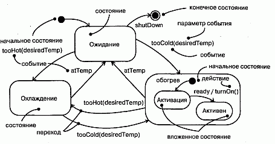

#### Рис. 21.1 Автоматы

## Термины и понятия
Автомат (State machine) описывает поведение в терминах последовательности состояний, через которые проходит объект в течение своего жизненного цикла, отвечая на различные события, а также его реакций на эти события. Состояние (State) - это ситуация в жизни объекта, на протяжении которой он удовлетворяет некоторому условию, выполняет определенную деятельность или ожидает какого-то события. Событие (Event) - это спецификация существенного факта, имеющего место в пространстве и во времени. В контексте автоматов событие - это некий стимул, инициирующий переход из одного состояния в другое. Переход (Transition) -это отношение между двумя состояниями, показывающее, что объект, находящийся в первом состоянии, должен выполнить определенные действия и перейти во второе состояние, как только произойдет указанное событие и будут удовлетворены определенные условия. Деятельность (Activity) - это протяженное во времени неатомарное вычисление внутри автомата. Действие (Action) - это атомарное вычисление, которое приводит к изменению состояния модели или возврату значения. Состояние изображается в виде прямоугольника с закругленными углами. Переход обозначается линией со стрелкой.

### Контекст
У каждого объекта (см. главу 13) есть некоторое время жизни. Объект рождается, когда его создают, и перестает существовать после уничтожения. В промежутке он может воздействовать на другие объекты (посылая им сообщения, см. главу 15), а также сам подвергаться воздействиям (являясь получателем сообщения). Во многих случаях сообщения могут быть простыми синхронными вызовами. Например, экземпляр класса Клиент может инициировать операцию получитьБалансСчета на экземпляре класса БанковскийСчет. Чтобы специфицировать поведение такого рода объектов, автомат не нужен, поскольку в любой момент времени их поведение не зависит от прошлого.

В системах иного типа встречаются объекты, которые должны реагировать на сигналы (см. главу 20) - асинхронные стимулы, которыми обмениваются экземпляры. Например, сотовый телефон должен отвечать на вызовы от других телефонов, которые происходят в случайные моменты времени, на события нажатия клавиши владельцем, набирающим номер, и на события сети (когда телефон перемещается из одной ячейки сотовой связи в другую). Бывают также объекты, текущее поведение которых зависит от прошлого. Так, поведение системы наведения ракеты "воздух-воздух" зависит от ее текущего состояния, например НеЛетит (вряд ли стоит запускать ракету с самолета, находящегося на земле) или Поиск (нельзя ее запускать, пока нет ясного представления, какую цель надо поразить).

Если объекты должны реагировать на асинхронные стимулы или их текущее поведение зависит от их прошлого, лучше всего описывать это поведение с помощью автомата. К этой категории относятся экземпляры классов, которые могут получать сигналы, включая и многие активные объекты (см. главу 22). Фактически объект, который получает сигнал, но не имеет описывающего его автомата, попросту проигнорирует этот сигнал. Автоматы применяются также для моделирования систем в целом, в особенности реактивных (см. главу 24), то есть таких, которые должны отвечать на сигналы от внешних актеров (см. главу 16).

> Примечание: Обычно для моделирования поведения прецедента (см. главу 16) используются взаимодействия (см. главу 15), но можно применять и автоматы. Последние пригодны также для моделирования поведения интерфейса (см. главу 11). Хотя у интерфейса не может быть непосредственных экземпляров, их может иметь класс, реализующий этот интерфейс. Поведение такого класса должно соответствовать поведению, специфицированному автоматом для интерфейса.

### Состояния
Состояние - это ситуация в жизни объекта, на протяжении которой он удовлетворяет некоторому условию, выполняет определенную деятельность или ожидает какого-то события. Объект остается в некотором состоянии в течение конечного отрезка времени. Например, Обогреватель в доме может находиться в одном из четырех состояний: Ожидание (ждет команды "начать обогревать дом").

Активация (газ подается, но не достигнута нужная температура), Активен (газ и вентилятор включены), Выключается (газ не подается, но вентилятор еще включен и удаляет остаточное тепло из системы).

Когда автомат объекта находится в данном состоянии, говорят, что и объект находится в этом состоянии. Например, экземпляр класса Обогреватель может находиться в состоянии Ожидание или Выключается. (Состояние объекта можно визуализировать во взаимодействии, см. главу 13.)

Состояние определяют следующие элементы:

* имя - текстовая строка, которая отличает одно состояние от всех остальных. Имя состояния должно быть уникальным внутри объемлющего пакета;
* действия при входе/выходе - действия, выполняемые при входе в состояние и выходе из него;
* внутренние переходы - переходы, обрабатываемые без выхода из состояния;
* подсостояния - внутри состояния могут существовать подсостояния, как непересекающиеся (активизируемые последовательно), так и параллельные (активные одновременно);
* отложенные события - список событий, которые не обработаны в этом состоянии, а отложены и поставлены в очередь для обработки объектом в некотором другом состоянии.

> Примечание: Имя состояния может иметь произвольную длину и включать любые цифры и буквы, а также некоторые знаки препинания (за исключением имеющих специальный смысл, например двоеточия). Имя может занимать несколько строк. На практике оно чаще всего бывает коротким, составленным из одного или нескольких существительных, взятых из словаря моделируемой системы. Первую букву каждого слова в имени состояния принято делать заглавной, например Ожидание или ИдетОтключение.

Как показано на рис. 21.2, состояние изображается прямоугольником с закругленными углами.

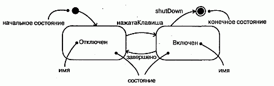

#### Рис. 21.2 Состояния

Начальное и конечное состояния. Как видно из рисунка, в автомате объекта могут быть определены два специальных состояния. Во-первых, есть начальное состояние, в котором автомат или подсостояние находятся по умолчанию в исходный момент времени. Изображается оно в виде закрашенного кружка. Во-вторых, есть конечное состояние, в котором завершается выполнение автомата или объемлющего состояния. Оно представлено закрашенным кружком, заключенным в окружность.

> Примечание: На самом деле начальное и конечное состояния - это псевдосостояния: они не имеют ни одной из характеристик нормального состояния, кроме имени. Однако переход из начального состояния в конечное может обладать всеми свойствами, включая сторожевое условие и действие (но не событие-триггер).

### Переходы
Переход - это отношение между двумя состояниями, показывающее, что объект, находящийся в первом состоянии, должен выполнить определенные действия и перейти во второе состояние, как только произойдет указанное событие и будут удовлетворены указанные условия. Говорят, что при таком изменении состояния переход срабатывает. Пока переход не сработал, объект находится в исходном состоянии; после срабатывания он находится в целевом состоянии. Например, Обогреватель может перейти из состояния Ожидание в состояние Активация при возникновении события tooCold (слишкомХолодно) с параметром desiredTemp (желаемаяТемпература).

Переход определяют пять элементов:

* исходное состояние - состояние, из которого происходит переход. Если объект находится в исходном состоянии, то исходящий переход может сработать, когда объект получит событие-триггер, инициирующее этот переход, причем должно быть выполнено сторожевое условие (если оно задано);
* событие-триггер - событие (см. главу 20), при получении которого объектом, находящимся в исходном состоянии, может сработать переход (при этом должно быть выполнено сторожевое условие);
* сторожевое условие - булевское выражение, которое вычисляется при получении события-триггера. Если значение истинно, то переходу разрешено сработать, если ложно - переход не срабатывает. Если при этом не задано никакого другого перехода, инициируемого тем же самым событием, то событие теряется;
* действие - атомарное вычисление, которое может непосредственно воздействовать на объект, владеющий автоматом, или оказать косвенное воздействие на другие объекты, находящиеся в области видимости;
* целевое состояние - состояние, которое становится активным после завершения перехода.

Как показано на рис. 20.3, переходы изображаются в виде линии со стрелкой, направленной от исходного к целевому состоянию. Исходное и целевое состояния перехода в себя совпадают.

> Примечание: У перехода может быть несколько исходных состояний (в этом случае он представляет собой слияние нескольких параллельных состояний), а также несколько целевых состояний (в этом случае он представляет собой разделение на несколько параллельных состояний). 0 слиянии и разделении рассказывается в главе 19.

Событие-триггер. Событие (см. главу 20) - это спецификация существенного факта, происходящего в пространстве и во времени. В контексте автоматов событие - это некий стимул, инициирующий переход из одного состояния в другое. Из рис. 21.3 видно, что в число событий включаются сигналы, вызовы, истечение промежутка времени или изменение состояния. У сигнала и вызова могут быть параметры, значения которых доступны переходу, в том числе при вычислении сторожевого условия и выполнении действия.

#### Рис. 21.3 Переходы

Существуют и нетриггерные переходы, для которых нет никакого события-триггера. Нетриггерный переход, называемый также переходом по завершении, инициируется неявно, когда работа в исходном состоянии закончится.

> Примечание: Событие-триггер может быть полиморфным. Например, если специфицировано семейство сигналов (см. главу 20), то переход, инициируемый событием S, может быть инициирован также и любым потомком S.

Сторожевое условие. На рисунке показано, что сторожевое условие изображается булевским выражением, заключенным в квадратные скобки, которое помещается после события-триггера. Сторожевое условие вычисляется только после возникновения события-триггера, инициирующего соответствующий переход. Поэтому из одного состояния может быть несколько переходов с одним и тем же событием-триггером в том случае, если никакие два сторожевых условия не становятся одновременно истинными.

Сторожевое условие вычисляется ровно один раз для каждого перехода в момент наступления события, но может быть вычислено снова, если переход инициируется повторно. В булевское выражение можно включать условия, в которых фигурирует состояние объекта (например, выражение Обогреватель in Ожидание истинно, если объект Обогреватель находится в состоянии Ожидание).

> Примечание: Если сторожевое условие вычисляется лишь однажды при каждом инициировании перехода, то событие изменения (см. главу 20) потенциально вычисляется постоянно.

Действие (см. главу 15) - это атомарное вычисление. К действиям относятся вызовы операций (объекта, который владеет автоматом, а также любых других видимых объектов), создание и уничтожение другого объекта или посылка объекту сигнала. Как видно из рис. 21.3, для обозначения посылки сигнала определена специальная нотация - имени сигнала предшествует ключевое слово send.

Действие (Action) всегда атомарно, то есть не может быть прервано другим событием и, следовательно, выполняется до полного завершения. Этим оно отличается от деятельности (Activity, см. следующие главы данной части), выполнение которой может быть прервано другими событиями.

> Примечание: Объект, которому посылается сигнал, можно показать явно, если воспользоваться зависимостью (см. главы 5 и 10) со стереотипом send, для которой источником является состояние, а целью - объект.

### Более сложные аспекты состояний и переходов
Существует широкий спектр типов поведения, которые можно моделировать, даже не выходя за пределы базовых возможностей состояний и переходов в UML. С их помощью удается получить простые (Flat) автоматы, описывающие модели поведения, граф которых состоит только из ребер (переходов) и вершин (состояний).

Однако автоматы в UML обладают рядом дополнительных возможностей, обеспечивающих создание более сложных моделей поведения. Их использование зачастую позволяет уменьшить число состояний и переходов и ввести в обиход ряд распространенных и довольно сложных идиом, которые трудно выразить с помощью одних лишь простых автоматов. К числу таких дополнительных возможностей относятся действия при входе и выходе, внутренние переходы, деятельности и отложенные события.

Действия при входе и выходе. При моделировании часто встречаются ситуации, когда необходимо выполнить некоторое действие вне зависимости от того, по какому переходу был осуществлен вход в состояние. Равным образом бывает нужно выполнить одно и то же действие при выходе из состояния по любому переходу. Например, в системе наведения ракет нужно объявить, что система ведетПре-следование, как только она вошла в состояние Преследование, и прекрати-лаПреследование, когда она вышла из этого состояния. Пользуясь простыми автоматами, данного эффекта можно достичь, ассоциируя указанные действия с каждым входящим и исходящим переходом соответственно. Однако такая методика подвержена ошибкам - важно не забыть добавить эти действия при добавлении каждого нового перехода. Кроме того, при модификации любого такого действия придется просматривать все связанные с состоянием переходы.

Как показано на рис. 21.4, в UML имеется сокращенная нотация для этой идиомы. В символ, обозначающий состояние, можно включить любое действие при входе (оно помечается ключевым словом entry) и действие при выходе (помечаемое ключевым словом exit). Тогда указанные действия будут выполняться, соответственно, при входе в состояние и выходе из него.

#### Рис. 21.4 Более сложные аспекты состояний и переходов

> Примечание: Действия при входе и выходе не могут иметь ни аргументов, ни сторожевых условий. Однако действие при входе, определенное на верхнем уровне автомата для класса, может иметь параметры, которые служат для представления аргументов, передаваемых автомату при создании объекта этого класса.

Внутренние переходы. Находясь внутри некоторого состояния, вы можете получить события, которые желательно обработать, не покидая состояния. Такая обработка называется внутренним переходом. Между внутренним переходом и переходом в себя имеется тонкое различие. При переходе в себя, например подобном тому, что изображен на рис. 21Д событие инициирует переход, происходит выход из текущего состояния, выполняется некоторое действие (если оно специфицировано), после чего вы возвращаетесь в исходное состояние. Поскольку при переходе в себя происходит выход из состояния и повторный вход в него же, то выполняется действие, ассоциированное с переходом, и, кроме того, действие при входе в состояние. Предположим, однако, что необходимо обработать событие, не возбуждая действия при входе и выходе. В принципе это можно сделать и с помощью простых автоматов, но при этом нужно внимательно следить за тем, для каких переходов эти действия должны быть определены, а для каких - нет.

На рис. 21.4 показано, что в UML есть сокращенная нотация и для этой идиомы (например, в случае события newTarget). В символ, обозначающий состояние, можно включить внутренний переход (записываемый как событие). Если вы находитесь в таком состоянии и происходит указанное событие, то соответствующее действие выполняется без выхода и повторного входа в состояние, то есть событие обрабатывается, не возбуждая действий при входе и выходе.

> Примечание: С внутренними переходами могут быть связаны события, имеющие параметры и сторожевые условия, то есть внутренние переходы по существу являются прерываниями.

Деятельность. Когда объект находится в некотором состоянии, он обычно бездействует и ожидает возникновения какого-либо события. Но иногда приходится моделировать и ситуацию непрерывно продолжающейся деятельности. Находясь в таком состоянии, объект чем-нибудь занимается до тех пор, пока эта деятельность не будет прервана событием. Например, пока объект находится в состоянии Преследования, он все это время может следоватьЗаЦелью. Из рис. 21.4 видно, что в UML имеется специальный переход do (выполнять) для обозначения работы, которая должна выполняться внутри состояния после того, как было отработано действие при входе. Деятельность, связанная с do-переходом, может быть именем какого-то другого автомата (скажем, следоватьЗаЦелью). Допустимо специфицировать и последовательность действий, например do / opl (a) ; ор2 (b) ; орЗ (с). Единичное действие не может быть прервано, но к последовательности действий это не относится. Между выполнением соседних действий (которые отделяются друг от друга точкой с запятой) объемлющее состояние может обрабатывать события, и не исключено, что это повлечет за собой выход из состояния.

Отложенные события. Рассмотрим состояние Преследование. Предположим, что (как показано на рис. 21.3), из этого состояния исходит только один переход, инициируемый событием contact. Если мы находимся в состоянии Преследование, то все события (см. главу 20), кроме contact и тех, что обрабатываются внутри подсостояний, будут потеряны. Это означает, что событие может произойти, но будет отложено и не повлечет за собой выполнения какого-либо действия.

В любой моделируемой ситуации бывает необходимо одни события распознавать, а другие игнорировать. Распознаваемые события моделируются как триггеры переходов, игнорируемые просто не включаются в модель. Между тем иногда необходимо распознать событие, но отложить его обработку на будущее. Например, находясь в состоянии Преследование, ракета может отложить обработку сигнала самоПроверка, посылаемого некоторым агентом системы, отвечающим за периодическое обслуживание.

В UML такое поведение специфицируется с помощью отложенных событий. Отложенное событие (Deferred event) - это список событий, возникновение которых в конкретном состоянии отложено до перехода в состояние, где этот список не является отложенным событием. В этот момент события могут быть обработаны и инициировать те или иные переходы, как будто они произошли только что. На рис. 21.4 показано, что событие описывается как отложенное путем связывания с ним специального действия defer (отложить). В нашем примере событие самоПроверка может произойти в состоянии Преследование, но реакция на него откладывается до перехода в состояние Включение, где оно обрабатывается, как если бы произошло только что.

> Примечание: Для реализации отложенных событий должна существовать внутренняя очередность событий. Если событие происходит, но внесено в список отложенных, то оно помещается в очередь. События извлекаются из очереди, как только объект входит в состояние, где они не помечены как отложенные.

### Подсостояния
Рассмотренные выше свойства состояний и переходов решают целый ряд типичных проблем моделирования автоматов. Но у автоматов, рассматриваемых в UML, есть свойство, которое позволяет еще больше упростить моделирование сложного поведения. Это подсостояние (Substate) - состояние, являющееся частью другого состояния. Например, Обогреватель может находиться в состоянии Обогрев, внутри которого содержится еще одно состояние- Активация. В таком случае говорят, что объект находится одновременно в состояниях Обогрев и Активация.

Простым называется такое состояние, которое не имеет внутренней структуры. Состояние, у которого есть подсостояния, то есть вложенные состояния, именуется составным. Оно может содержать как параллельные (независимые), так и последовательные (непересекающиеся) подсостояния. В UML составное состояние изображается так же, как и простое, но имеет дополнительный графический раздел, в котором показан вложенный автомат. Глубина вложенности состояний не ограничена. (Вложенная структура составного состояния подобна композиции - см. главы 5 и 10.)

Последовательные подсостояния. Рассмотрим задачу моделирования банкомата. Система может находиться в одном из трех основных состояний: Ожидание (действий со стороны пользователя), Активен (выполняет транзакцию, запрошенную пользователем) или Обслуживается (возможно, пополняется запас банкнот). В состоянии Активен поведение банкомата описывается простой схемой: проверить счет пользователя, выбрать тип транзакции, выполнить транзакцию, напечатать квитанцию. После печати банкомат возвращается в состояние Ожидание. Эти этапы можно представить как состояния Проверка, Выбор, Обработка, Печать. Стоило бы даже дать пользователю возможность выбрать и выполнить несколько транзакций после того, как проверка счета выполнена, но еще до печати окончательной квитанции.

Проблема в том, что на любом этапе пользователь может отменить транзакцию и вернуть банкомат в состояние Ожидание. С помощью простых автоматов реализовать это можно, но не очень удобно. Поскольку пользователь имеет право отменить транзакцию в любой точке, пришлось бы включать соответствующий переход из любого состояния в последовательности Активен. Это может привести к ошибкам, так как очень легко забыть включить все необходимые переходы, а наличие множества событий, прерывающих основной поток управления, приведет к появлению большого числа переходов из разных исходных состояний, которые оканчиваются в одном и том же целевом. При этом у каждого такого перехода будет одинаковое событие-триггер, сторожевое условие и действие.

Использование последовательных подсостояний позволяет упростить моделирование этой задачи, как показано на рис. 21.5. Здесь у состояния Активен имеется внутренний автомат, в который входят подсостояния Проверка, Выбор, Обработка, Печать. Состояние банкомата изменяется с Ожидание на Активен, когда пользователь вставляет в прорезь кредитную карту. При входе в состояние Активен выполняется действие readCard (прочитатьКарту). Начав с исходного состояния внутреннего автомата, управление переходит в состояние Проверка, затем - в Выбор, и, наконец, в состояние Обработка. После выхода из состояния Обработка управление может вернуться в Выбор (если пользователь избрал другую транзакцию) или попасть в Печать. Из состояния Печать предусмотрен нетриггерный переход назад в Ожидание. Обратите внимание, что у состояния Активен есть действие при выходе, которое обеспечивает выбрасывание кредитной карты (ejectCard).

#### Рис. 21.5 Последовательные подсостояния

Обратите внимание также на переход из состояния Активен в состояние Ожидание, инициируемый событием cancel. В любом подсостояний состояния Активен пользователь может отменить транзакцию, что вернет банкомат в состояние Ожидание (но лишь после возврата кредитной карты владельцу, то есть после выполнения действия при выходе из состояния Активен, что произойдет вне зависимости от того, чем вызван переход из этого состояния). Если бы подсостоя-ний не было, то пришлось бы вводить переход, инициируемый событием cancel из каждого состояния вложенного автомата.

Такие подсостояния, как Проверка и Обработка, называются последовательными или непересекающимися. Если в объемлющем составном состоянии имеется несколько непересекающихся подсостояний, то говорят, что объект одновременно находится в составном состоянии и ровно в одном из подсостояний. Таким образом, последовательные подсостояния разбивают множество вариантов составного состояния на непересекающиеся (дизъюнктные) части.

Переход из состояния, находящегося вне объемлющего составного состояния, может вести как в само это составное состояние, так и в любое из его подсостояний. Если целевое состояние является составным, то вложенный автомат должен иметь некоторое начальное состояние, куда управление попадает при входе в составное состояние после выполнения ассоциированного с ним действия при входе (если таковое определено). Если же целевым является одно из вложенных состояний, то управление попадает в него, но опять-таки после выполнения действий при входе в объемлющее составное состояние и в подсостояние (если таковые определены).

Для перехода, исходящего из составного состояния, исходным может быть как оно само, так и какое-либо из его подсостояний. В любом случае управление сначала покидает вложенное подсостояние (тогда выполняется его действие при выходе, если оно определено), а затем составное состояние (тогда также выполняется действие при выходе). Переход, для которого исходным является составное состояние, по существу прерывает работу вложенного автомата.

> Примечание: Вложенный последовательный автомат может иметь не более одного начального и не более одного конечного состояния.

Исторические состояния. Автомат описывает динамические аспекты объекта, текущее поведение которого зависит от его прошлого. По сути дела, автомат специфицирует корректный порядок состояний, через которые объект может проходить на протяжении своего жизненного цикла.

Если явно не оговорено противное, то в случае, когда переход ведет в составное состояние, действие вложенного автомата начинается с его начального состояния (если, конечно, переход не ведет сразу в какое-то из подсостояний). Но часто возникает необходимость промоделировать объект так, чтобы он помнил то последнее подсостояние, в котором он находился перед выходом из составного состояния. Например, при моделировании агента, выполняющего автоматическое резервное копирование компьютеров в сети, хотелось бы помнить, в какой точке находился процесс, когда он был прерван, скажем, запросом оператора.

Смоделировать такую ситуацию с помощью простых автоматов можно, хотя и не просто. Для этого требуется, чтобы у каждого последовательного подсостояния его действие при выходе записывало некоторое значение в переменную, локальную для объемлющего составного состояния. Начальное же подсостояние для данного составного состояния должно иметь переходы во все остальные состояния со сторожевыми условиями, в которых проверяется эта переменная. При таком подходе выход из составного состояния сопровождался бы запоминанием последнего подсостояния, а вход приводил бы к следованию вдоль перехода в запомненное под-состояние. Этот процесс чреват ошибками, поскольку приходится задавать нужные действия при выходе для всех подсостояний. В результате получается множество переходов, веером расходящихся из одного начального состояния в разные целевые подсостояния и имеющих схожие (но не идентичные) сторожевые условия.

В UML для моделирования такой идиомы применяется более простой механизм - исторические состояния (History states). Историческое состояние позволяет составному состоянию, содержащему последовательные подсостояния, запоминать, какое из подсостояний было текущим в момент выхода из составного состояния. На рис. 21.6 недавнее (shallow) историческое состояние представлено в виде небольшого кружочка с символом H.

#### Рис. 21.6 Историческое состояние

Переход, необходимый для активации последнего подсостояния, показывают как ведущий извне составного состояния прямо в историческое состояние. При первом входе в составное состояние истории еще нет. В этом заключается смысл одиночного перехода из исторического состояния в одно из последовательных подсостояний, например в Сбор. Целевое для этого перехода состояние - это не что иное, как начальное состояние вложенного автомата при первом входе в него. Предположим далее, что событие запрос поступило, когда агент находился в состоянии РезервноеКопирование и подсостояний Копирование. При этом управление покидает оба этих состояния (возможно, после выполнения действий при выходе) и возвращается в состояние Команда. Когда завершается действие в состоянии Команда, нетриггерный переход возвращает агента в историческое состояние составного состояния РезервноеКопирование. На этот раз, поскольку у вложенного автомата уже есть история, управление попадает в состояние Копирование -обходя состояние Сбор, так как Копирование было последним активным подсо-стоянием перед выходом из состояния РезервноеКопирование.

> Примечание: Символом H обозначается недавняя история, в которой запоминается предшествующее состояние только самого внешнего из вложенных автоматов. Можно определить и давнюю (deep) историю, которая изображается кружочком с символом H*. Давняя история способна запомнить последние состояния всех вложенных подавтоматов любого уровня вложенности. При наличии только одного уровня вложенности давняя и недавняя истории семантически эквивалентны. Если же глубина вложенности больше 1, то недавняя история помнит только самое внешнее из вложенных подсостояний, а давняя - все вложенные подсостояния любого уровня.

В любом случае, лишь только вложенный автомат доходит до конечного состояния, вся история теряется, и в дальнейшем он ведет себя так, как если бы вход в него осуществлялся в первый раз.

Параллельные подсостояния. Последовательные подсостояния встречаются наиболее часто. Но в некоторых ситуациях возникает необходимость в параллельных (Concurrent) подсостояниях. Они позволяют специфицировать два или более автомата, которые выполняются параллельно в контексте объемлющего объекта.

> Примечание: Другим способом моделирования параллельности являются активные объекты (см. главу 22). Так, вместо разбиения автомата одного объекта на два или более параллельных подавтомата можно было бы определить два активных объекта, каждый из которых отвечает за поведение, реализуемое одним из этих подавтоматов. Если на поведение одного из параллельных потоков управления влияет состояние другого, то предпочтение следует отдать модели с использованием параллельных подсостояний. Если же на поведение одного параллельного потока оказывают влияние сообщения, посылаемые другим потоком, то лучше воспользоваться активными объектами. Если потоки совсем или почти совсем не взаимодействуют, то выбор подхода является делом вкуса, хотя применение активных объектов обычно позволяет создать более понятную модель.

На рис. 21.7 показано развернутое представление состояния Обслуживается (см. рис. 21.5). Это состояние разделено на два параллельных подсостояния: Тестирование и приемКоманд, которые изображены как вложенные в состояние Обслуживается, но отделены друг от друга пунктирной линией. Каждое из этих двух параллельных подсостояний далее разделено на последовательные подсостояния (о разделении и слиянии см. главу 19). Когда управление переходит из состояния Ожидание в состояние Обслуживается, происходит разделение на два параллельных потока: объемлющий объект находится в состояниях Тестирование и приемКоманд. Кроме того, находясь в состоянии приемКоманд, этот объект будет либо в состоянии Жду, либо в состоянии Команда.

#### Рис. 21.7 Параллельные подсостояния

> Примечание: Именно это отличает последовательные состояния от параллельных. Если имеется два или более последовательных подсостояний одного и того же уровня вложенности, то объект может находиться только в одном из них. Если налицо два или более параллельных подсостояний одного и того же уровня вложенности, то объект будет одновременно находиться в одном из последовательных состояний каждого из них.

Выполнение двух параллельных подсостояний протекает одновременно. В конце концов каждый из вложенных параллельных подавтоматов достигнет своего конечного состояния. Если один из них "придет к финишу" раньше другого, то поток управления будет ждать. Когда и второй автомат доберется до своего конечного состояния, оба потока вновь сольются в один.

Если есть переход в составное состояние, разложенное на параллельные под-состояния, то поток управления разделяется на столько параллельных потоков, сколько имеется подсостояний. Напротив, при переходе из составного состояния, разложенного на параллельные подсостояния, потоки сливаются в один. Это справедливо во всех случаях. Если все параллельные подавтоматы достигают конечного состояния или имеется явный переход из объемлющего составного состояния, все параллельные потоки управления сливаются в один.

> Примечание: Вложенный параллельный автомат не имеет начального, конечного или исторического состояний. Однако последовательные подсостояния, входящие в состав параллельного, могут обладать такими свойствами.

## Типичные приемы моделирования

### Жизненный цикл объекта
Автоматы чаще всего применяются для моделирования жизненного цикла объекта (см. главу 13), особенно если это экземпляр класса (см. главы 4 и 9), прецедент (см. главу 16) или система (см. главу 31) в целом. В то время как взаимодействия (см. главу 15) моделируют поведение сообщества объектов, работающих совместно, автоматы предназначены для моделирования поведения единичного объекта на протяжении времени его жизни. Примерами могут служить интерфейсы, контроллеры и устройства.

При моделировании жизненного цикла объекта особое внимание уделяется специфицированию следующих элементов: событий, на которые объект должен реагировать, реакций на такие события, а также влияния прошлого на поведение в текущий момент. Кроме того, необходимо решить, в каком порядке объект будет осмысленно реагировать на события, начиная с момента его создания и вплоть до уничтожения.

Моделирование жизненного цикла объекта осуществляется следующим образом:

1. Выберите контекст для автомата, будь то класс, прецедент или система в це лом. При этом:
    * если контекстом является класс или прецедент, идентифицируйте соседние классы, включая предков, а также все классы, доступные из данного с помощью зависимостей или ассоциаций (такие соседи - кандидаты на роль целей для действий или на включение в сторожевые условия);
    * если контекстом является система в целом, то следует сосредоточиться на какой-либо одной стороне ее поведения (теоретически каждый объект в системе может принимать участие в модели ее жизненного цикла, но за исключением простейших случаев такую полную модель практически невозможно воспринять).
4. Установите для объекта начальное и конечное состояния. Если предполагается его использование в остальной части модели, возможно, стоит сформулировать пред- и постусловия (см. главу 10) для начального и конечного состояний.
5. Решите, на какие события объект может реагировать. Если интерфейсы (см. главу 11) объекта уже специфицированы, то в них и содержится описание таких событий; в противном случае необходимо рассмотреть, какие объекты могут взаимодействовать с объектом в данном контексте и какие события они могут посылать.
6. Изобразите все состояния верхнего уровня, от начального до конечного, в которых может находиться объект. Соедините эти состояния переходами, инициируемыми теми или иными событиями, а затем свяжите с этими переходами действия.
7. Идентифицируйте все действия при входе и выходе (особенно если обнаружится, что выражаемая с их помощью идиома используется в автомате).
8. Если это необходимо, разверните выявленные к этому моменту состояния, применяя аппарат подсостояний.
9. Убедитесь, что все события, встречающиеся в автомате, соответствуют тем, которые ожидает интерфейс объекта. Следует убедиться также в том, что все события, ожидаемые интерфейсом объекта, нашли отражение в автомате. Наконец, нужно выявить те места, где имеет смысл игнорировать события.
10. Убедитесь, что все действия, упомянутые в автомате, поддержаны отноше ниями, методами и операциями объемлющего объекта.
11. Следуя переходам автомата вручную или с помощью инструментальных средств, проверьте ожидаемые последовательности событий и реакций на них. Особое внимание нужно обратить на недостижимые состояния и состо яния, в которых автомат может "застрять" (то есть тупиковые).
12. Изменив по результатам проверки структуру автомата, снова проверьте его на ожидаемые последовательности событий, чтобы убедиться, что семантика объекта не изменилась.

В качестве примера на рис. 21.8 показан автомат для контроллера в домашней системе безопасности, который следит за различными датчиками, расставленными по периметру дома.

#### Рис. 21.8 Моделирование жизненного цикла объекта

В жизненном цикле такого контроллера есть четыре основных состояния: Инициализация (контроллер входит в рабочий режим), Ожидание (контроллер готов к работе и ожидает тревожных сигналов или команд от пользователя), Команда (контроллер занят отработкой команды пользователя) и Активен (контроллер обрабатывает сигнал тревоги). Когда объект контроллера создается впервые, он сначала переходит в состояние Инициализация, а затем без каких-либо условий - в состояние Ожидание. Подробно эти два состояния не показаны; изображен лишь переход в себя по событию времени для состояния Ожидание. Такого рода событие времени типично для встроенных систем, в которых часто присутствует таймер, предназначенный для периодического запуска процедуры самодиагностики.

При получении события alarm (тревога), которое имеет параметр s, идентифицирующий сработавший датчик, управление переходит из состояния Ожидание в состояние Активен. При вхождении в состояние Активен выполняется действие при входе setAlarm и управление попадает в состояние Проверка (где проверяется, не ложная ли тревога), затем в состояние Звонок (в компанию, установившую сигнализацию для регистрации тревоги) и, наконец, в состояние Жду. Из состояний Жду и Активен контроллер может выйти только после сброса сигнала тревоги (действие clear) или получения от пользователя события attention, возможно, предшествующего выдаче команды.

Обратите внимание на отсутствие конечного состояния. Это тоже типично для встроенных систем, которые должны работать непрерывно.

## Советы
При моделировании автоматов в UML помните, что каждый автомат представляет динамические аспекты поведения отдельного объекта - как правило, экземпляра класса, прецедента или системы в целом. Хорошо структурированный автомат обладает следующими свойствами:

* он прост и не содержит избыточных состояний или переходов;
* имеет ясный контекст и потому может получить доступ ко всем объектам, видимым из объемлющего объекта (такие соседи должны использоваться только при необходимости обеспечить поведение, специфицированное автоматом);
* эффективен и реализует моделируемое поведение с оптимальным балансом времени и ресурсов в соответствии с требованиями, которые накладывают выполняемые им действия;
* легок для понимания, в частности потому, что имена всех состояний и пере- ходов взяты из словаря системы (см. главу 4);
* его глубина вложенности не слишком велика (ограничивается одним-двумя уровнями для обработки наиболее сложных аспектов поведения);
* использует параллельные состояния в умеренном количестве, поскольку ак-тивные объекты зачастую подходят лучше.

Изображая автомат в UML, руководствуйтесь следующими принципами:

* избегайте пересекающихся переходов;
* раскрывайте составные состояния в месте расположения только в том случае, если это делает диаграмму более понятной.

http://bourabai.kz/dbt/uml/ch22.htm

ЧАСТЬ V - Более сложные аспекты поведения
# Глава 22. Процессы и нити
* Введение
* Термины и понятия
    * Поток управления
    * Классы и события
    * Стандартные элементы
    * Коммуникация
    * Синхронизация
    * Представления с точки зрения процессов
* Типичные приемы моделирования
    * Несколько потоков управления
    * Межпроцессная коммуникация
* Советы

Реальный мир суров и не прощает ошибок; вдобавок к этому в нем постоянно что-то случается. Различные события происходят одновременно. Поэтому при моделировании системы, предназначенной для работы в реальном мире, следует учитывать ее вид с точки зрения процессов (см. главу 2), в котором основное внимание уделяется процессам и нитям, лежащим в основе механизмов параллельности и синхронизации.

В UML каждый независимый поток управления моделируется как активный объект, описывающий процесс или нить и способный инициировать некоторое управляющее воздействие. Процесс (Process) - это ресурсоемкий поток управления, который выполняется параллельно с другими процессами; нить (Thread) - это облегченный поток управления, выполняемый параллельно с другими нитями в рамках одного и того же процесса.

Построение абстракций таким образом, чтобы они могли безопасно функционировать при наличии нескольких потоков управления, - непростое дело. В частности, механизмы обмена информацией и синхронизации, которые при этом придется применять, должны быть существенно сложнее, чем для последовательных систем. Следует избегать как переусложнения модели (поскольку при наличии слишком большого числа параллельных потоков управления система начнет пробуксовывать), так и чрезмерного упрощения (потому что недостаточная степень параллелизма не позволит оптимизировать пропускную способность системы).

## Введение
Для собаки, живущей в конуре (см. главу 1), распорядок дня прост и последователен. Едим. Спим. Гоняемся за кошкой. Снова едим. Мечтаем о том, как будем гоняться за кошкой. Забраться в конуру, чтобы поспать или укрыться от дождя, не представляет проблемы, поскольку лишь у собаки возникает потребность воспользоваться входом. Никакой конкуренции за ресурсы.

Семейные заботы не столь просты. Не впадая в философствование, отметим, что каждый член семьи живет своей собственной жизнью, но в то же время взаимодействует с другими домочадцами (вместе обедают, смотрят телевизор, играют, делают уборку). Члены семьи совместно пользуются некоторыми ресурсами. Порой у детей бывает общая спальня, на всю семью может быть только один телефон или компьютер. Родственники распределяют между собой обязанности: отец ходит в прачечную и в бакалейную лавку, мать оплачивает счета и работает в саду, дети помогают делать уборку и готовить. Борьба за использование общих ресурсов и координация домашних обязанностей становятся предметом споров. Наличие одной ванной комнаты в ситуации, когда все одновременно собираются в школу или на работу, - это проблема, а обед не будет готов, если папа не сходил в магазин.

Но по-настоящему сложна жизнь небоскреба и его арендаторов. Сотни, а то и тысячи людей приходят в одно и то же здание, и у каждого из них свои планы. Все должны пройти через определенное число подъездов. Все пользуются одними и теми же лифтами, а их число тоже не бесконечно. Посетителей обслуживают одни и те системы отопления, кондиционирования, водоснабжения, канализации и подачи электроэнергии. На всех одна парковка. Если люди хотят работать слаженно, то должны общаться и синхронизировать свои действия.

В UML каждый независимый поток управления моделируется в виде активного объекта (см. главу 13). Активный объект - это процесс или нить, способные инициировать управляющее воздействие. Как и любой другой объект, активный объект может быть экземпляром класса. В таком случае говорят, что он является экземпляром активного класса. Подобно прочим объектам, активные объекты могут общаться друг с другом, посылая сообщения, хотя в данном случае передача сообщений должна быть дополнена семантикой параллелизма, чтобы облегчить взаимодействие независимых потоков управления.

Многие языки программирования непосредственно поддерживают концепцию активного объекта. В языки Java, Smalltalk и Ada параллелизм встроен. C++ поддерживает параллелизм за счет различных библиотек, в основе которых лежат механизмы параллельности, обеспечиваемые операционной системой. Применение UML для визуализации, специфицирования, конструирования и документирования этих абстракций необходимо потому, что без него почти невозможно рассуждать о параллельности, обмене информацией и синхронизации.

Графическое изображение активного класса, принятое в UML, показано на рис. 22.1. Активный класс - это частный случай класса (см. главы 4 и 9), и его нотация включает все соответствующие разделы - для имени класса, атрибутов и операций. Активные классы часто получают сигналы (см. главу 20), которые обычно перечисляются в дополнительном разделе.

#### Рис. 22.1 Активный класс

## Термины и понятия
Активный объект (Active object) - это объект, который владеет процессом или нитью и может инициировать управляющее воздействие. Активный класс (Active class) - это класс, экземплярами которого являются активные объекты. Процесс (Process) - это ресурсоемкий поток управления, который может выполняться параллельно с другими процессами. Нить (Thread) - это облегченный поток управления, который может выполняться параллельно с другими нитями в рамках одного процесса. Графически активный класс изображается в виде прямоугольника с жирными границами. Процессы и нити изображаются в виде стереотипных активных классов, а на диаграммах взаимодействия (см. главу 18) часто выступают в роли последовательностей.

### Поток управления
В строго последовательных системах имеется только один поток управления. Это означает, что в каждый момент времени выполняется одно и только одно действие. При запуске последовательной программы управление переходит к точке входа в программу, после чего последовательно выполняется одна операция за другой. Даже если внешние по отношению к системе актеры (см. главу 16) функционируют параллельно, последовательная программа будет обрабатывать по одному событию за раз, отбрасывая тем самым одновременные с ним события.

Поэтому такая последовательность и называется потоком управления. Если трассировать выполнение последовательной программы, то точка исполнения будет перемещаться от одного предложения программы к другому - последовательно. Встречаются, конечно, ветвления, циклы, переходы, а при наличии рекурсии или итерации - движение потока вокруг одной точки. Но, несмотря на все это, в последовательной системе есть только один поток выполнения..

В параллельной же системе потоков управления несколько, а значит, в один и тот же момент времени имеет место различная деятельность. Каждый из нескольких одновременно выполняемых потоков управления начинается с точки входа в некоторый независимый процесс или нить. Если сделать моментальный снимок параллельной системы во время ее работы, то мы увидим несколько точек выполнения (по крайней мере, логических).

Активный класс в UML используется для представления процесса (или нити), в контексте которого выполняется независимый поток управления, работающий параллельно с другими, пользующимися равными с ним правами.

> Примечание: Истинного параллелизма можно достичь тремя способами: во-первых, распределяя активные объекты между несколькими узлами (см. главу 26), во-вторых, помещая активные объекты на узлы с несколькими процессорами, и, в-третьих, комбинируя оба метода.

### Классы и события
Активные классы - это именно классы (см. главы 4 и 9), хотя и обладающие весьма специфическим свойством. Активный класс представляет независимый поток управления, тогда как обычный класс не связан с таковым. В отличие от активных, обычные классы неявно называют пассивными, так как они не способны инициировать независимое управляющее воздействие.

Активные классы применяются для моделирования семейств процессов или нитей. Технически это означает, что активный объект (см. главу 13) - экземпляр активного класса - материализует процесс или нить. При моделировании параллельных систем с помощью активных объектов вы присваиваете имя каждому независимому потоку управления. Когда активный объект создается, запускается ассоциированный с ним поток управления. Когда активный объект уничтожается, этот поток завершается.

Активные классы обладают теми же свойствами, что и любые другие классы. Они могут иметь экземпляры, атрибуты и операции (см. главу 4), а также принимать участие в отношениях (см. главы 4 и 10) зависимости, обобщения и ассоциации (включая агрегирование). Активные классы вправе пользоваться предоставляемыми UML механизмами расширения (см. главу 6), в том числе стереотипами, помеченными значениями и ограничениями. Встречаются активные классы - реализации интерфейсов (см. главу 11). Наконец, они могут реализовываться кооперациями, а их поведение - специфицироваться с помощью автоматов.

На диаграммах активные объекты встречаются там же, где и пассивные. Можно моделировать кооперации активных и пассивных объектов с помощью диаграмм взаимодействия (включая диаграммы последовательности и кооперации). Активный объект может выступать в роли целевого объекта события (см. главу 20) в автомате (см. главу 21).

Если речь зашла об автоматах, то как активные, так и пассивные объекты могут посылать и получать события сигналов и вызовов.

### Стандартные элементы
Все механизмы расширения (см. главу 6) UML применимы в том числе и к активным классам. Чаще всего используются помеченные значения для расширения их свойств, например для специфицирования политики планирования активного класса.

В UML определены два стандартных (см. "Приложение В") стереотипа, применимых к активным классам:

* process (процесс) - ресурсоемкий поток управления, который может выполняться параллельно с другими процессами;
* thread (нить) - облегченный поток управления, который может выполняться параллельно с другими нитями в рамках одного и того же процесса.

Различие между процессом и нитями связано с разными способами создания потоков управления операционной системой, работающей на узле (см. главу 26), где размещается объект.

Процесс известен самой операционной системе и выполняется в независимом адресном пространстве. В большинстве операционных систем, например в Unix и Windows, каждая программа представляет собой процесс. Вообще говоря, все процессы, исполняемые на некотором узле, пользуются равными правами и претендуют на общие ресурсы, которыми располагает узел. Процессы никогда не бывают вложенными. Если узел оборудован несколькими процессорами, то на нем достижим истинный параллелизм. Если же есть только один процессор, то возможна лишь иллюзия параллелизма, обеспечиваемая операционной системой.

Нить называют облегченным потоком управления, поскольку она требует меньше системных ресурсов. Нить может быть известна операционной системе, но чаще всего бывает скрыта от нее внутри некоего процесса, в адресном пространстве которого она и исполняется. Например, в языке Java нить наследует классу Thread. Все нити, существующие в контексте некоторого процесса, имеют одинаковые права и претендуют на ресурсы, доступные внутри процесса. Нити также не бывают вложенными. В общем случае существует лишь иллюзия параллельного выполнения нитей, поскольку не нить, а процесс является объектом планирования операционной системы.

### Коммуникация
Кооперирующиеся друг с другом объекты взаимодействуют (см. главу 15) путем обмена сообщениями. В системе, где есть одновременно активные и пассивные объекты, следует рассматривать четыре возможных комбинации.

Во-первых, сообщение может быть передано одним пассивным объектом другому такому же. В предположении, что в любой момент времени существует лишь один поток управления, проходящий через оба объекта, такое взаимодействие -не что иное, как простой вызов операции.

Во-вторых, сообщение может быть передано от одного активного объекта другому активному. Здесь мы имеем случай межпроцессной коммуникации, которая может осуществляться двумя способами. В первом варианте некоторый активный объект может синхронно вызывать операцию другого (о событиях сигналов и вызовов см. главу 20). Такой способ имеет семантику рандеву (Rendezvous): вызывающий объект затребует выполнение операции и ждет, пока принимающая сторона получит вызов, выполнит операцию и вернет некоторый объект (если есть что возвращать); затем оба объекта продолжают работать независимо друг от друга. В течение всего времени выполнения вызова оба потока управления будут блокированы. Во втором варианте один активный объект может асинхронно послать сигнал другому или вызвать его операцию. Семантика такого способа напоминает почтовый ящик (Mailbox): вызывающая сторона посылает сигнал или вызывает операцию, после чего продолжает выполняться. Тем временем получающая сторона принимает сигнал или вызов, как только будет к этому готова. Пока она обрабатывает запрос, все вновь поступающие события или вызовы ставятся в очередь. Отреагировав на запрос, принимающий объект продолжает свою работу. Семантика почтового ящика проявляется в том, что оба объекта не синхронизированы, просто один оставляет сообщение для другого.

В UML синхронное сообщение изображается полной стрелкой, а асинхронное - "полустрелкой" (см. рис. 22.2).

#### Рис. 22.2 Коммуникация

В-третьих, сообщение может быть передано от активного объекта пассивному. Трудности возникают в случае, когда сразу несколько активных объектов передают свой поток управлению одному и тому же пассивному. В такой ситуации следует очень аккуратно моделировать синхронизацию потоков, о чем мы поговорим в следующем разделе.

В-четвертых, пассивный объект может передавать сообщение активному. На первый взгляд это может показаться некорректным, но если вспомнить, что каждый поток управления принадлежит некоторому активному объекту, то становится ясно, что передача пассивным объектом сообщения активному имеет ту же семантику, что и обмен сообщениями между двумя активными объектами.

> Примечание: С помощью ограничений (см. главу 6) можно моделировать различные вариации посылки синхронных и асинхронных сообщений. Например, для моделирования отложенного рандеву (Balking rendezvous), имеющегося в языке Ada, можно воспользоваться синхронным сообщением с ограничением вида {wait = 0}, которое говорит о том, что вызывающий объект не будет дожидаться получателя. Можно смоделировать и тайм-аут с помощью ограничения вида {wait = 1 ms}, которое говорит, что вызывающий объект будет ждать приема сообщения получателем не более одной миллисекунды.

### Синхронизация
Попробуйте на секунду представить себе многочисленные потоки управления в параллельной системе. Когда поток проходит через некоторую операцию, мы говорим, что эта операция является точкой выполнения. Если операция определена в некотором классе, то можно сказать, что точкой выполнения является конкретный экземпляр этого класса. В одной операции (и, стало быть, в одном объекте) могут одновременно находиться несколько потоков управления, а бывает и так, что разные потоки находятся в разных операциях, но все же в одном объекте.

Проблема возникает тогда, когда в одном объекте находится сразу несколько потоков управления. Если не проявить осторожность, то потоки могут мешать друг другу, что приведет к некорректному изменению состояния объекта. Это классическая проблема взаимного исключения. Ошибки при обработке этой ситуации могут стать причиной различных видов конкуренции между потоками (Race conditions) и их взаимной интерференции, что проявляется в таинственных и не поддающихся воспроизведению сбоях параллельной системы.

Ключом к решению этой проблемы в объектно-ориентированных системах является трактовка объекта как критической области. У этого подхода есть три разновидности, суть каждой из которых заключается в присоединении к операциям, определенным в классе, некоторых сихронизирующих свойств. UML позволяет моделировать все три возможности:

* sequential (последовательная) - вызывающие стороны должны координировать свои действия еще до входа в вызываемый объект, так что в любой момент времени внутри объекта находится ровно один поток управления. При наличии нескольких потоков управления не могут гарантироваться семантика и целостность объекта;
* guarded (охраняемая) - семантика и целостность объекта гарантируются при наличии нескольких потоков управления путем упорядочения вызовов всех охраняемых операций объекта. По существу, в каждый момент времени может выполняться ровно одна операция над объектом, что сводит такой подход к последовательному;
* concurrent (параллельная) - семантика и целостность объекта при наличии нескольких потоков управления гарантируются тем, что операция рассматривается как атомарная.

Некоторые языки программирования поддерживают перечисленные конструкции непосредственно. Так в языке Java есть свойство synchronized, эквивалентное свойству concurrent в UML. В любом языке, поддерживающем параллельность, все три подхода можно реализовать с помощью семафоров (Semaphores).

На рис. 22.3 показано, как эти свойства присоединяются к операции, - это достигается применением нотации, принятой в UML для ограничений (см. главу 6).

#### Рис. 22.3 Синхронизация

> Примечание: С помощью ограничений можно моделировать различные вариации примитивов синхронизации. Например, можно модифицировать свойство concur rent, разрешив наличие нескольких читателей, но только одного писателя.

### Представления с точки зрения процессов

Активные объекты играют важную роль в визуализации, специфицировании, конструировании и документировании представления системы с точки зрения процессов (см. главу 2). Такое представление охватывает нити и процессы, формирующие системный параллелизм, а также механизмы синхронизации. Это представление фокусирует внимание прежде всего на производительности, масштабируемости и пропускной способности системы. UML позволяет выразить статические и динамические аспекты такого представления с помощью тех же диаграмм, которые применяются для представления с точки зрения проектирования, то есть диаграмм классов, взаимодействия, деятельности и состояний, с той только разницей, что основное внимание на них уделяется активным классам, представляющим нити и процессы.

## Типичные приемы моделирования

### Несколько потоков управления
Построение системы с несколькими потоками управления - непростая задача. Надо не только решить, как лучше всего распределить работу между параллельными активными объектами, но и продумать правильные механизмы (см. главу 28) коммуникации и синхронизации между активными и пассивными объектами в системе, гарантирующие правильность их поведения в присутствии нескольких потоков управления. Поэтому полезно визуализировать способы взаимодействия этих потоков между собой. В UML это можно сделать с помощью диаграмм классов (для описания статической семантики) и диаграмм взаимодействия (для описания динамической семантики), в которых участвуют активные классы и объекты.

Моделирование нескольких потоков управления осуществляется так:

1. Идентифицируйте возможности распараллеливания действий и материализуйте каждый поток управления в виде активного класса. Сгруппируйте общие множества активных объектов в активный класс. Избегайте пере усложнения вида системы с точки зрения процессов (см. главу 2), причиной которого может стать введение слишком большой степени параллелизма.
2. Рассмотрите баланс распределения обязанностей между активными класса ми (см. главы 4 и 9), а затем исследуйте, с какими другими активными и пассивными классами статически кооперируется каждый из них. Убедитесь, что каждый активный класс имеет внутреннюю структуру с высокой степенью связаности и слабо связан с соседними классами, и что для каждого класса правильно выбран набор атрибутов, операций и сигналов.
3. Отобразите статические решения в виде диаграмм классов, явно выделив каждый активный класс.
4. Рассмотрите, как каждая группа классов динамически кооперируется с прочими. Отобразите свои решения на диаграммах взаимодействия. Явно покажите активные объекты как начальные точки соответствующих потоков управления. Идентифицируйте каждую связанную последовательность, присваивая ей имя активного объекта.
5. Обратите особое внимание на коммуникации между активными объектами. Пользуйтесь по мере необходимости как синхронными, так и асинхронными сообщениями.
6. Обратите внимание на синхронизацию активных объектов и тех пассивных объектов, с которыми они кооперируются. Применяйте наиболее подходящую семантику - последовательную, охраняемую или параллельную.

На рис. 22.4 показана часть вида трейдерской системы с точки зрения процессов. Вы видите три объекта, которые параллельно питают систему информацией: StockTicker (БиржевойТикер), indexWatcher (наблюдательИндекса) и CNNNewsFeed (НовостнаяЛентаСММ), названные соответственно s, i и с. Два из них, s и i, обмениваются каждый со своим экземпляром класса Analyst (Аналитик) - al и а2. В рамках этого небольшого фрагмента модели класс Analyst может быть спроектирован в упрощенном виде - из расчета на то, что в каждый момент времени в любом из его экземпляров может быть активен только один поток управления. Однако оба экземпляра класса Analyst одновременно общаются с объектом AlertManager (ДиспетчерОповещений), которому мы дали имя т. Следовательно, m необходимо спроектировать так, чтобы он сохранял свою семантику в присутствии нескольких потоков управления m и c одновременно общаются с t - объектом класса TradingManager (управляющийТрейдингом). Каждому соединению присвоен порядковый номер, определяемый тем, какой поток управления им владеет.

#### Рис. 22.4 Моделирование потоков управления

> Примечание: Диаграммы взаимодействия, подобные представленной выше, полезны для визуализации тех мест, где два потока управления могут пересекаться и где, следовательно, необходимо обратить особое внимание на проблемы коммуникации и синхронизации. Инструментальным программам разрешается реализовывать и дополнительные визуальные указания, например раскрашивать потоки в разные цвета.

К подобным диаграммам часто присоединяют автоматы (см. главу 21) с ортогональными состояниями, чтобы детально показать поведение активных объектов.

### Межпроцессная коммуникация

При включении в систему нескольких потоков управления необходимо также рассмотреть механизмы, с помощью которых объекты из разных потоков управления взаимодействуют друг с другом. Объекты, находящиеся в разных нитях (существующих в рамках одного и того же процесса), могут общаться с помощью событий сигналов или вызовов (см. главу 20), причем последние могут иметь синхронную или асинхронную семантику. Для обмена информацией через границы процессов, у каждого из которых свое собственное адресное пространство, обычно применяются другие механизмы.

Сложность проблемы межпроцессной коммуникации усугубляется еще и тем, что в распределенных системах процессы могут исполняться на различных узлах (о моделировании местоположения см. главу 23). Существует два классических подхода к межпроцессной коммуникации: передача сообщений и вызовы удаленных процедур. В UML эти механизмы моделируются как асинхронные и синхронные события соответственно. Но поскольку это уже не простые вызовы внутри одного процесса, то проект необходимо обогатить дополнительной информацией.

Моделирование межпроцессной коммуникации производится следующим образом:

1. Смоделируйте несколько потоков управления.
2. Рассмотрите, какие из этих активных объектов могут быть представлены процессами, а какие - нитями. Чтобы их различить, воспользуйтесь подходящими стереотипами (см. главу 6).
3. Смоделируйте обмен сообщениями с помощью асинхронных, а вызовы удаленных процедур - с помощью синхронных коммуникаций.
4. Неформально опишите используемый механизм с помощью примечаний (см. главу 6) или - более строго - с помощью коопераций (см. главу 27).

На рис. 22.5 показана распределенная система бронирования билетов, в которой процессы исполняются на четырех узлах (см. главу 26). Каждый объект маркирован стереотипом process, а также помеченным значением location, которое определяет его физическое положение. Коммуникации между объектами ReservatibnAgent (АгентБронирования), TicketingManager (ДиспетчерВы-дачиБилетов) и HotelAgent (ГостиничныйАгент) асинхронны. В примечании написано, что коммуникации построены на основе службы сообщений, реализованной на JavaBeans. Коммуникация между объектами TripPlanner (Планиров-щикМаршрута) и ReservationSystem (СистемаРезервирования) синхронная.

#### Рис. 22.5 Моделирование межпроцессной коммуникации

Семантика их взаимодействия показана в кооперации, названной CORBA ORB. TripPlanner выступает в роли клиента, a ReservationAgent - сервера. Раскрыв эту кооперацию, вы увидите детали совместной работы сервера и клиента.

## Советы
Хорошо структурированный активный класс и активный объект обладают следующими свойствами:

* представляют независимый поток управления, который максимально использует потенциальные возможности истинного параллелизма в системе;
* не настолько мелки, чтобы требовать наличия множества других активных элементов, которое может привести к переусложненной и нестабильной архитектуре процессов;
* аккуратно управляют коммуникацией между активными элементами, выбирая наиболее подходящий случаю механизм - синхронный или асинхронный;
* исходят из трактовки каждого объекта как критической области, используя подходящие синхронизирующие свойства для сохранения его семантики в присутствии нескольких потоков управления;
* явно разграничивают семантику процесса и нити.

Рисуя в UML активный класс или активный объект:

* показывайте только те атрибуты, операции и сигналы, которые важны для понимания абстракции в соответствующем контексте;
* явно показывайте все синхронизирующие свойства операции.

http://bourabai.kz/dbt/uml/ch23.htm

ЧАСТЬ V - Более сложные аспекты поведения
# Глава 23. Время и пространство
* Введение
* Термины и понятия
    * Время
    * Местоположение
* Типичные приемы моделирования
    * Временные ограничения
    * Распределение объектов
    * Мигрирующие объекты
* Советы

Как уже говорилось, реальный мир суров и не прощает ошибок. События в нем происходят в непредсказуемые моменты времени и тем не менее требуют адекватной и своевременной реакции. Системные ресурсы могут быть распределены по всему миру, а некоторые даже способны перемещаться в пространстве, - в связи с этим возникают проблемы задержек, синхронизации, безопасности и качества услуг.

Моделирование времени и пространства - важный элемент любой распределенной системы или системы реального времени. Для визуализации, специфицирования, конструирования и документирования таких систем UML предлагает различные средства, включая отметки времени, временные выражения, ограничения и помеченные значения.

Проектирование систем реального времени и распределенных систем - трудная задача. Хорошая модель должна высветить все необходимые и достаточные пространственно-временные свойства системы.

## Введение
Приступая к моделированию большинства программных систем, обычно исходят из расчета на идеальность среды: предполагают, что для доставки сообщения требуется нулевое время, сетевых сбоев не бывает, рабочие станции никогда не выходят из строя, а загрузка сети всегда равномерна. К сожалению, реальный мир устроен не так: сообщения доставляются с задержкой (а иногда и вовсе не доставляются), сеть "падает", рабочие станции "зависают" и загрузка сети далека от сбалансированной. Поэтому, рассматривая систему, которая должна работать в реальном мире, необходимо принимать во внимание как пространственные, так и временные характеристики.

Система реального времени (Real time system) называется так потому, что она должна выполнять свои функции в строго определенный абсолютный или относительный момент времени и затрачивать на это предсказуемое и зачастую ограниченное время. Среди подобных систем бывают такие, для которых требуемое время реакции исчисляется нано- или миллисекундами. Но встречаются и системы почти реального времени, для которых допустимое время реакции - порядка секунды и даже дольше.

Под распределенной системой (Distributed system) понимается такая система, компоненты (см. главу 25) которой могут быть физически размещены на различных узлах (см. главу 26). Узлы могут представлять собой разные процессоры, смонтированные в одном и том же корпусе, или разные компьютеры, находящиеся в противоположных точках земного шара.

Чтобы удовлетворить потребностям моделирования систем реального времени и распределенных систем, UML включает графическое представление для отметок времени, временных выражений, временных ограничений и местоположения, как показано на рис. 23.1.

#### Рис. 23.1 Временные ограничения и местоположение

## Термины и понятия
Отметка времени (Timing mark) служит для обозначения момента времени, в который произошло событие. Она изображается как выражение, зависящее от имени, присвоенного сообщению (которое, как правило, отлично от имени действия, инициируемого этим сообщением).

Временное выражение (Time expression) - это выражение, значением которого является абсолютное или относительное время. Временное ограничение (Timing constraint) - это семантическое утверждение об относительном или абсолютном времени. Графически временное ограничение изображается как любое другое ограничение - строкой, заключенной в скобки, и обычно связано с некоторым элементом отношением зависимости. Местоположение (Location) - это размещение компонента в узле. Изображается оно помеченным значением, то есть строкой, заключенной в фигурные скобки и размещенной под именем элемента или в виде вложенных в узел компонентов

### Время
Системы реального времени, как следует из самого названия, критичны по времени. События (см. главу 20) в них могут происходить регулярно или спонтанно, но в любом случае время реакции на событие должно быть предсказуемо - либо по абсолютной продолжительности, либо относительно момента возникновения события.

Передача сообщений (см. главу 15) - это один из динамических аспектов системы, поэтому при моделировании временных особенностей системы с помощью UML можно каждому сообщению, принимающему участие во взаимодействии (см. там же), дать имя, которое будет использоваться как отметка времени. Обычно сообщениям, принимающим участие во взаимодействии, имена не присваиваются. Как правило, при их изображении используется имя события, например сигнала или вызова. При этом невозможно использовать имя события в записи выражения, поскольку одно и то же событие может быть причиной различных сообщений. Если имеет место такого рода неоднозначность, следует присвоить явное имя сообщению в отметке времени, чтобы в дальнейшем его можно было использовать во временном выражении. Отметка времени - это не что иное, как выражение, в котором встречается имя сообщения, принимающего участие во взаимодействии. Если задано имя сообщения, то можно использовать любую из трех функций от этого сообщения - startTime, stopTime, executionTime. В свою очередь, эти три функции можно использовать для построения временных выражений произвольной сложности, возможно, включающих веса или смещения, которые могут быть константами или переменными (если только эти переменные можно вычислить в момент выполнения). Наконец, как показано на рис. 23.2, временное выражение можно поместить внутрь временного ограничения (см. главу 6), чтобы описать поведение системы во времени. Как и любые другие ограничения, их можно изобразить рядом с соответствующим сообщением или явно присоединить с помощью отношения зависимости.

#### Рис. 23.2 Время

> Примечание: Стоит употреблять в выражениях именованные константы вместо явного упоминания времени, в особенности для сложных систем. Константы можно определить в одной части модели, а затем использовать в других местах. При этом будет проще модифицировать модель, если временные требования к системе изменятся.

> Примечание: Временные выражения можно применять и к операциям. К любой операции разрешается присоединить помеченное значение semantics (см. главу 9) и, используя временное выражение, специфицировать временную сложность операции. Временная сложность (Time complexity) применяется для моделирования минимального, максимального или среднего времени, в течение которого операция должна завершиться. Временная сложность операции, по существу, описывает ее временной бюджет, который можно использовать двумя способами. Во-первых, назначая временной бюджет в ходе разработки, а затем измеряя его на работающей системе, вы получаете возможность сравнивать поведение задуманной и реализованной системы. Во-вторых, складывая результаты (спроектированные или реальные) вычисления временных выражений для всех операций во взаимодействии, можно получить временную сложность всей транзакции.

### Местоположение
Распределенные системы по своей природе состоят из компонентов, физически разбросанных по разным узлам. Для многих систем местоположение (Location) компонентов (см. главу 25) фиксируется в момент установки системы. Но встречаются и такие системы, в которых компоненты мигрируют с одного узла (см. главу 26) на другой.

В UML вид системы с точки зрения развертывания моделируется с помощью диаграмм развертывания (см. главу 30), описывающих топологию процессоров и устройств, на которых выполняется система. Компоненты, такие как исполняемые модули, библиотеки и таблицы, размещаются в этих узлах. Каждый экземпляр узла владеет собственными экземплярами тех или иных компонентов, а каждый экземпляр компонента принадлежит ровно одному экземпляру узла (хотя различные экземпляры компонента одного вида могут находиться на разных узлах, - о дихотомии "класс/объект" см. главы 2 и 13). Например, на рис. 23.3 показан исполняемый компонент vision.exe, находящийся в узле с именем KioskServer.

#### Рис. 23.3 Местоположение

В узле могут размещаться и экземпляры простых классов (см. главы 4 и 9). Так, на рис. 23.3 мы видим экземпляр класса LoadAgent в узле Router.

Как видно из рисунка, моделировать положение элемента в UML можно двумя способами. Во-первых, как в случае KioskServer, можно физически поместить элемент (его текстовое или графическое описание) в дополнительный раздел объемлющего узла. Во-вторых - примером является LoadAgent - можно воспользоваться помеченным значением location для обозначения узла, на котором размещен класс (о помеченных значениях и дополнительных разделах см. главу 6). Обычно первый способ применяется, когда важно дать в диаграмме визуальное представление пространственного разделения и группирования компонентов. Второй способ удобнее, когда моделирование положения элемента для данной диаграммы является хотя и важным, но второстепенным, например, когда вы хотите визуализировать передачу сообщений между экземплярами.

> Примечание: Второй способ моделирования положения элемента особенно полезен, когда нужно показать изменение местонахождения компонента во времени. Например, можно воспользоваться сообщением become (см. главу 13), чтобы смоделировать объект, который в текущий момент находится в одном месте, но переместится в другое. Аналогично для показа семантических отношений между разнесенными объектами можно применить сообщение copy (см. главу 13).

## Типичные приемы моделирования

Временные ограничения
Абсолютное время события, интервал между событиями и время, требуемое для выполнения действия, - вот три основных временных аспекта систем реального времени, при моделировании которых находят применение временные ограничения (см. главу 6).

Моделирование временных ограничений осуществляется так:

1. Для каждого события во взаимодействии рассмотрите, должно ли оно начинаться в определенный абсолютный момент времени. Промоделируйте это свойство с помощью временного ограничения на сообщение.
2. Для каждой представляющей интерес последовательности сообщений во взаимодействии рассмотрите, ограничено ли время ее выполнения. Промоделируйте это свойство с помощью временного ограничения на последовательность.
3. Для каждой критичной по времени операции рассмотрите ее временную сложность. Промоделируйте эту семантику с помощью временного ограничения на операцию.

Например, левое ограничение на рис. 23.4 специфицирует начальное время повторяющегося события вызова refresh. Временное ограничение, находящееся в середине рисунка, специфицирует максимальную продолжительность вызова get Image. Наконец, правое ограничение специфицирует временную сложность события вызова get Image.

#### Рис. 23.4 Моделирование временных ограничений

> Примечание: Обратите внимание, что функция executionTime может быть применена как к действиям типа get Image, так и к меткам синхронизации типа а и b. Кроме того, подобные временные ограничения можно записать в свободном формате. При желании более детально специфицировать семантику стоит воспользоваться языком объектных ограничений (Object Constraint Language - ОСL), который является частью UML и подробно описан в книге "Unified Modeling Language Reference Manual".

Как правило, рекомендуется выбирать для сообщений короткие имена, чтобы не путать их с именами операций.

### Распределение объектов
При моделировании топологии распределенной системы следует рассмотреть физическое размещение экземпляров как компонентов, так и классов. Если в центре внимания находится управление конфигурацией развернутой системы, то моделирование распределения компонентов (см. главу 25) особенно важно для визуализации, специфицирования, конструирования и документирования размещения таких физических сущностей, как исполняемые модули, библиотеки и таблицы. Если же вас больше интересует функциональность, масштабируемость и пропускная способность системы, то важнее всего моделирование распределения объектов.

Решение о том, как распределить объекты в системе, - это болезненная проблема, и не только потому, что вопросы распределения объектов тесно связаны с вопросами параллельности (о моделировании процессов и нитей см. главу 22). Непродуманное решение может стать причиной очень низкой производительности, но слишком изощренные подходы немногим лучше, а пожалуй, даже и хуже поскольку приводят к нестабильности.

1. Для каждого представляющего интерес класса объектов в системе рассмотрите локальность ссылок - другими словами, выявите всех соседей и- их местоположение. Сильносвязная локальность означает, что логически сосед ние объекты находятся рядом, а слабосвязная - что они физически удалены друг от друга (и значит, при обмене информацией между ними будут иметь место временные задержки). Старайтесь размещать объекты рядом с актера ми, которые ими манипулируют.
2. Затем рассмотрите типичные взаимодействия между связанными множе ствами объектов. Расположите множества объектов с высокой степенью вза имодействия рядом, чтобы уменьшить стоимость коммуникации. Разнесите по разным узлам объекты, которые слабо взаимодействуют между собой.
3. Далее рассмотрите распределение ответственности в системе. Перераспре делите объекты так, чтобы сбалансировать загрузку каждого узла.
4. Не забудьте о безопасности, подвижности и качестве услуг и учтите эти со ображения при размещении объектов.
5. Изобразите объекты на диаграмме одним из двух способов:
    * включив объекты непосредственно в узлы на диаграмме развертывания;
    * явно указав положение объекта с помощью помеченного значения.

На рис. 23.5 представлена диаграмма объектов (см. главу 14), которая моделирует распределение объектов в гипотетической системе розничной торговли. Ценность этой диаграммы в том, что она позволяет визуализировать физическое размещение ключевых объектов. Как видно, два объекта Order (Заказ) и Sales (Продажи) находятся в узле Workstation (РабочаяСтанция), два других (ObserverAgent, агентНаблюдения, и Product, Продукт) - в узле Server и один (ProductTable, таблицаПродуктов) - в узле DataWarehouse (ХранилищеДанных).

#### Рис. 23.5 Моделирование распределения объектов

Мигрирующие объекты
Во многих рапределенных системах компоненты и объекты не меняют свое положение после начального развертывания. На протяжении всего жизненного цикла - от создания до уничтожения - они остаются на том узле, где родились. Однако встречаются категории распределенных систем, в которых различные сущности перемещаются, в основном по двум причинам.

Во-первых, объекты мигрируют, чтобы приблизиться к актерам и другим объектам, с которыми они должны кооперироваться для лучшего выполнения работы. Например, в глобальной системе грузового пароходства имеются объекты, представляющие суда, контейнеры и декларации судового груза, которые перемещаются из одного узла в другой, следуя за своими физическими прообразами. Если судно находится в Гонконге, то для улучшения локальности ссылок разумно переместить объекты, представляющие судно, находящиеся на нем контейнеры и его грузовую декларацию в узел в Гонконге. А когда судно направляется в Сан-Диего, то все эти объекты следуют за ним.

Во-вторых, объекты мигрируют из-за отказа узла (или соединения) либо с целью сбалансировать нагрузки между разными узлами. Например, в системе управления воздушным транспортом нельзя допустить, чтобы отказ одного узла заблокировал работу всей национальной сети. Поэтому отказоустойчивые системы такого типа перемещают все элементы на другие узлы. При этом, возможно, пострадают производительность и пропускная способность, но будет сохранена безопасность функционирования. Аналогичным образом в системах, ориентированных на работу в Web-среде, где возможен непредсказуемый рост пиковой нагрузки, часто предусматриваются механизмы автоматической балансировки загрузки, возможно за счет перемещения компонентов и объектов на недогруженные узлы.

Решение о том, как перемещать объекты в системе, вызывает еще больше сложностей, чем планирование простого статического распределения, поскольку с миграцией связан ряд трудноразрешимых задач синхронизации и сохранения идентичности.

Моделирование миграции объектов осуществляется так:

1. Выберите механизм (см. главу 28) физической транспортировки объектов между узлами.
2. Представьте на диаграмме размещение объекта в узле, явно указав его поло жение с помощью помеченного значения.
3. С помощью стереотипных сообщений become и copy (см. главу 13) изобра зите перемещение объекта на новый узел.
4. Рассмотрите вопросы синхронизации (сохранение корректности состояния клонированных объектов) и идентичности (сохранение имени объекта при его перемещении).

На рис. 23.6 приведена диаграмма кооперации (см. главу 18), моделирующая миграцию Web-агента, который перемещается между узлами, собирая информацию и торгуясь за ресурсы с целью автоматически найти минимальную стоимость билета. Точнее, на этой диаграмме показан экземпляр (с именем t) класса ТурАгент, мигрирующий с одного сервера на другой. По пути этот объект взаимодействует с анонимными экземплярами класса Аукционер на каждом узле и в конце концов доставляет результат торгов объекту Маршрут, который расположен на узле Client server.

#### Рис. 23.6 Моделирование мигрирующих объектов

## Советы
Хорошо структурированная модель с пространственно-временными свойствами обладает следующими особенностями:

* описывает только те пространственно-временные свойства, которые необходимы и достаточны для понимания желаемого поведения системы;
* централизует использование этих свойств, так чтобы их легко было найти и модифицировать.

Изображая в UML пространственное или временное свойство, руководствуйтесь следующими принципами:

* давайте отметкам времени (то есть соответствующим сообщениям) осмысленные имена;
* проводите явное различие между временными выражениями, значениями которых является абсолютное и относительное время;
* пространственные свойства показывайте преимущественно с помощью помеченных значений. Вложенную форму применяйте только тогда, когда важно визуализировать местонахождение элементов в развернутой системе.

http://bourabai.kz/dbt/uml/ch24.htm

ЧАСТЬ V - Более сложные аспекты поведения
# Глава 24. Диаграммы состояний
* Введение
* Термины и понятия
    * Общие свойства
    * Содержание
    * Типичные примеры использования
* Типичные приемы моделирования
    * Реактивные объекты
    * Прямое и обратное проектирование
* Советы

Диаграммы состояний - это один из пяти видов диаграмм в языке UML, используемых для моделирования динамических аспектов системы (к их числу относятся также диаграммы последовательностей и кооперации, диаграммы деятельности и диаграммы прецедентов - см. главы 18, 19 и 17 соответственно). Диаграмма состояний показывает автомат. Ее частной разновидностью является диаграмма деятельности, в которой все или большая часть состояний - это состояния деятельности, а все или большая часть переходов инициируются в результате завершения деятельности в исходном состоянии. Таким образом, при моделировании жизненного цикла объекта полезны как диаграммы деятельности, так и диаграммы состояний. Но если диаграмма деятельности показывает поток управления от деятельности к деятельности, то на диаграмме состояний представлен поток управления от состояния к состоянию.

Диаграммы состояний используются для моделирования динамических аспектов системы. По большей части под этим подразумевается моделирование поведения реактивных объектов. Реактивным называется объект, поведение которого лучше всего характеризуется его реакцией на события, произошедшие вне его собственного контекста. У реактивного объекта есть четко выраженный жизненный цикл, когда текущее поведение обусловлено прошлым. Диаграммы состояний можно присоединять к классам, прецедентам или системе в целом для визуализации, специфицирования, конструирования и документирования динамики отдельного объекта.

Диаграммы состояний важны не только для моделирования динамических аспектов системы, но и для конструирования исполняемых систем путем прямого и обратного проектирования.

Введение
Рассмотрим деятельность инвестора, финансирующего строительство нового небоскреба (см. главу 1). Маловероятно, что этому человеку будут интересны подробности процесса возведения здания. Выбор материалов, график поставок и многочисленные совещания по поводу технических деталей - это заботы подрядчика, но никак не лица, вкладывающего в проект деньги.

Инвестор заинтересован в получении хорошей прибыли и, как следствие, в защите капиталовложений от рисков. Инвестор, доверяющий подрядчику, внесет определенную сумму денег, на время строительства займется другими делами и вернется только тогда, когда подрядчик будет готов вручить ему ключи от здания. Такой вкладчик заинтересован только в конечном результате.

Более прагматичный инвестор тоже доверится подрядчику, но все же, прежде чем давать деньги, захочет удостовериться в том, что процесс протекает в правильном направлении. Поэтому, вместо того чтобы предоставлять бесконтрольный доступ к банковскому счету, осторожный вкладчик сначала наметит основные вехи проекта, каждая из которых соотносится с завершением определенной стадии работ. Лишь на исходе одного этапа инвестор выделит сумму для выполнения следующего. Например, в самом начале может быть выдана сравнительно скромная сумма на создание архитектурного проекта. После его одобрения очередная инвестиция выделяется на инженерную подготовку. Когда и этот этап закончится, вносятся деньги на рытье котлована. И так на всем пути, от закладки фундамента до получения свидетельства о праве владения, расставлены вехи.

Каждая такая веха обозначает некое устойчивое состояние проекта: закончено архитектурное проектирование, проведена инженерная подготовка, вырыт котлован, завершена подводка коммуникаций, загерметизированы швы и т.д. Для инвестора наблюдение за изменениями в ходе процесса намного важнее, чем контроль последовательности работ: этим может заняться подрядчик с помощью Pert-диаграмм (см. главу 19).

При моделировании программных систем также необходимо отыскать наиболее естественный способ визуализации, специфицирования, конструирования и документирования поведения определенных типов объектов, когда основное внимание уделяется переходам из состояния в состояние, а не от деятельности к деятельности. Последнее можно выполнить с помощью блок-схем (или диаграмм деятельности в UML, см. главу 19). Представьте себе моделирование поведения встроенной системы безопасности у себя дома. Она работает непрерывно, реагируя на внешние события, скажем на разбитое окно. Порядок событий изменяет поведение системы. Например, обнаружение разбитого окна вызовет срабатывание сигнализации, только если система предварительно была активизирована. Поведение такой системы лучше всего описывается путем моделирования ее устойчивых состояний (например, Ожидание, Активна, Проверка и т.д.), событий, инициирующих смену состояния, и действий, выполняемых при каждой такой смене.

В UML для моделирования поведения объекта с точки зрения порядка возникновения событий используются диаграммы состояний. Из рис. 24.1 видно, что диаграмма состояний - это просто представление автомата (см. главу 21), и основное внимание уделено потоку управления от одного состояния к другому.

#### Рис. 24.1 Диаграмма состояний

## Термины и понятия
Диаграмма состояний (Statechart diagram) показывает автомат, фокусируя внимание на потоке управления от состояния к состоянию. Автомат (State machine) -это описание последовательности состояний, через которые проходит объект на протяжении своего жизненного цикла, реагируя на события, - в том числе описание реакций на эти события. Состояние (State) - это ситуация в жизни объекта, на протяжении которой он удовлетворяет некоторому условию, осуществляет определенную деятельность или ожидает какого-то события. Событие (Event) - это спецификация существенного факта, который происходит во времени и пространстве. В контексте автоматов событие - это стимул, способный вызвать срабатывание перехода. Переход (Transition) - это отношение между двумя состояниями, показывающее, что объект, находящийся в первом состоянии, должен выполнить некоторые действия и перейти во второе состояние, как только произойдет определенное событие и будут выполнены заданные условия. Деятельность (Activity) -это продолжающееся неатомарное вычисление внутри автомата. Действие (Action) - это атомарное вычисление, которое приводит к смене состояния или возврату значения. Диаграмма состояний изображается в виде графа с вершинами и ребрами.

### Общие свойства

Диаграмма состояний обладает свойствами, общими для всех диаграмм (см. главу 7), то есть имеет имя и графическое содержание, проецируемое на модель. От прочих диаграмм она отличается именно этим содержанием.

### Содержание
Обычно диаграмма состояний включает в себя:

* простые и составные состояния (см. главу 21);
* переходы вместе с ассоциированными событиями и действиями (см. ту же главу).

> Примечание: Диаграмма состояний, по сути, составлена из элементов, встречающихся в любом автомате. Она может содержать ветвления, разделения, слияния, состояния деятельности и действий, объекты, начальные и конечные состояния, исторические состояния и т.д., - в общем, к диаграмме состояний применимы все без исключения характеристики автомата. Диаграмму деятельности (см. главу 19) отличает от диаграммы состояний лишь то, что она состоит в основном из элементов, встречающихся в графе деятельности, и представляет собой разновидность автомата, в котором все или большая часть состояний есть состояния деятельности, а все или большая часть переходов инициируются фактом завершения деятельности в исходном состоянии.

Как и все прочие диаграммы, диаграмма состояний может содержать примечания и ограничения (см. главу 6).

### Типичные примеры использования
Диаграммы состояний применяются для моделирования динамических аспектов системы. Имеется в виду обусловленное порядком возникновения событий поведение объектов любого рода в любом представлении системной архитектуры (см. главу 2), включая классы (в том числе активные, см. главу 22), интерфейсы (см. главу 11), компоненты (см. главу 25) и узлы (см. главу 26).

Использовать диаграммы состояний для моделирования некоторого динамического аспекта системы можно в контексте практически любого элемента модели. Обычно, однако, диаграммы состояний применяются в контексте системы в целом, подсистемы или класса. Можно присоединять диаграммы состояний и к прецедентам (для моделирования сценария).

При моделировании динамических аспектов системы (см. главу 31), класса (см. главы 4 и 9) или прецедента (см. главу 16) диаграммы состояний обычно используются только с целью моделирования реактивных объектов.

Реактивный, или управляемый событиями, объект - это такой объект, поведение которого лучше всего характеризовать его реакцией на внешние события. Как правило, реактивный объект находится в состоянии ожидания, пока не получит событие, а когда это случается, его реакция зависит от предшествующих событий. После того как объект отреагирует на событие, он снова переходит в состояние ожидания следующего события. Для таких объектов интерес представляют прежде всего устойчивые состояния, события, инициирующие переходы из одного состояния в другое, и действия, выполняемые при смене состояния.

> Примечание: В противоположность этому диаграммы деятельности используются для моделирования рабочего процесса или операции. Они в большей степени подходят для показа протекания деятельности во времени и этим напоминают блок-схемы.

## Типичные приемы моделирования

### Реактивные объекты
Чаще всего диаграммы состояний используются для моделирования реактивных объектов, особенно экземпляров классов, прецедентов и системы в целом.

В то время как взаимодействия (см. главу 15) применяются для моделирования поведения сообщества объектов, совместно решающих некоторую задачу, диаграммы состояний предназначены для моделирования поведения одного объекта на протяжении его жизненного цикла. Если диаграммы деятельности (см. главу 19) моделируют поток управления от деятельности к деятельности, то диаграммы состояний - поток управления от события к событию.

При моделировании поведения реактивного объекта нужно специфицировать главным образом три вещи: устойчивые состояния, в которых может находиться объект, события, которые иницируют переходы из одного состояния в другое, и действия, выполняемые при каждой смене состояния. Моделирование реактивного объекта подразумевает моделирование всего его жизненного цикла (см. главу 21), начиная с момента создания и вплоть до уничтожения, с особым акцентом на устойчивые состояния, в которых может находиться объект.

Устойчивое состояние - такое, в котором объект может находиться неопределенно долгое время (см. главу 23). Когда происходит некое событие, объект переходит в новое состояние. События могут также инициировать переходы в себя и внутренние переходы, когда исходное и целевое состояния совпадают. В ходе реакции на событие или изменения состояния объект может выполнить некоторое действие.

> Примечание: При моделировании поведения реактивного объекта вы можете специфицировать действие, привязав его к переходу или изменению состояния. В специальной литературе автомат, все действия которого привязаны к переходам, называется машиной Мили (Mealy), а автомат, все действия которого привязаны к состояниям, машиной Мура (Moore). C математической точки зрения тот и другой обладают одинаковой выразительной мощью. На практике при разработке диаграмм состояний обычно используется комбинация машин Мили и Мура.

Моделирование реактивного объекта складывается из следующих процессов:

1. Выберите контекст для автомата - класс, прецедент или систему в целом.
2. Выберите начальное и конечное состояния для объекта. Для использования в остальной части модели, возможно, стоит сформулировать пред- и пост условия (см. главу 10) для начального и конечного состояния.
3. Определите устойчивые состояния объекта, - те, в которых он может находиться неопределенно долгое время. Начните с состояний верхнего уровня, а затем переходите к подсостояниям.
4. Определите разумное частичное упорядочение устойчивых состояний на протяжении жизненного цикла объекта.
5. Определите, какие события могут инициировать переходы между состояниями. Смоделируйте эти события как триггеры переходов из одного допустимого упорядочения состояний в другое.
6. Присоедините действия к переходам (как в машине Мили) и/или к состояниям (как в машине Мура).
7. Рассмотрите, как можно упростить автомат за счет использования подсостояний, ветвлений, разделений, слияний и исторических состояний.
8. Проверьте, что любое из состояний достижимо при некоторой комбинации событий.
9. Убедитесь в отсутствии тупиковых состояний, то есть таких, из которых нет переходов ни при какой комбинации событий.
10. Трассируйте автомат вручную или с помощью инструментальных средств и проверьте, как он ведет себя при ожидаемых последовательностях событий и реакций на них.

На рис. 24.2 показана диаграмма состояний для разбора простого контекстно-свободного языка. Примеры таких язков можно найти в системах, для которых входной или выходной поток составляют XML-сообщения. В таких случаях проектируется автомат для разбора потока символов, удовлетворяющего синтаксису языка:

#### Рис. 24.2 Моделирование реактивных объектов

	сообщение: ' <' строка ' >' строка ' ; '
Первая строка представляет тэг, вторая - тело сообщения. Из данного потока символов извлекаются только сообщения, удовлетворяющие правилам синтаксиса.

Из рисунка видно, что для автомата предусмотрены только три устойчивых состояния: Ожидание, ПолучениеЛексемы и ПолучениеТела. Диаграмма состояний спроектирована в виде машины Мили - действия привязаны к переходам. На самом деле в автомате есть только одно представляющее интерес событие (см. главу 20) - вызов put с фактическим параметром с (символом). В состоянии Ожидание автомат отбрасывает все символы, не интерпретируемые как начало лексемы (это специфицировано сторожевым условием). При обнаружении начала лексемы состояние объекта изменяется на ПолучениеЛексемы. Находясь в этом состоянии, автомат сохраняет все символы, не интерпретируемые как конец лексемы (это тоже специфицировано сторожевым условием). Обнаружив конец лексемы, объект переходит в состояние ПолучениеТела. В этом состоянии автомат сохраняет все символы, не интерпретируемые как конец сообщения (см. сторожевое условие). Как только получен конец сообщения, состояние объекта меняется на Ожидание; возвращается значение, показывающее, что сообщение разобрано и автомат готов к приему следующего.

Обратите внимание, что эта диаграмма описывает автомат, работающий непрерывно - в нем нет конечного состояния.

Прямое и обратное проектирование
Для диаграмм состояния возможно прямое проектирование (создание кода по модели), в особенности если контекстом диаграммы является класс. Так, из показанной выше диаграммы инструментальное средство могло бы сгенерировать следующий код на языке Java для класса MessageParser:

	
	class MessageParser { 
	public
	  boolean put (char c)  { 
	  	switch (state)  { 
	 	  case Waiting : 
	        if (c == '<')  { 
	          state = GettingToken; 
	          token = new StringBuffer () ; 
	          body = new StringBuffer () ; 
	        }
	        break;
	      case GettingToken : 
	        if (c == '>')
	          state = GettingBody; 
	        else
	          token.append(c); 
	        break;
	      case GettingBody : 
	        if (c ==';')
	          state = Waiting; 
	        else
	          body.append(c); 
	        return true; 
	    }
	    return false; 
	  } 
	  StringBuffer getToken( ) {
	    return token; 
	  } 
	  StringBuffer getBody( ) {
	    return body; 
	  }
	private
	  final static int Waiting = 0; 
	  final static int GettingToken = 1; 
	  final static int GettingBody = 2; 
	  int state = Waiting; 
	  StringBuffer token, body; 
	}
Генерация такого кода требует от инструмента некоторых "ухищрений", чтобы включить необходимые закрытые поля и константы с атрибутами final static.

Обратное проектирование (создание модели по коду) теоретически возможно, но практически не очень полезно. Выбор того, что составляет значимое состояние, - прерогатива проектировщика. Инструмент для обратного проектирования не обладает способностью к абстрагированию и потому не может автоматически породить осмысленные диаграммы состояний. Более интересный вариант - анимация модели, задача которой заключается в том, чтобы показать, как будет исполняться развернутая система. Скажем, в предыдущем примере инструментальная программа могла бы анимировать состояния диаграммы по мере их достижения в работающей системе. При этом можно также подвергнуть анимации и срабатывание переходов, показав получение событий и выполнение соответствующих действий. Под управлением отладчика допустимо контролировать скорость выполнения и устанавливать точки прерывания для остановки работы в представляющих интерес состояниях, чтобы просмотреть значения атрибутов отдельного объекта.

## Советы
При создании диаграммы состояний в UML не забывайте, что все диаграммы -это лишь проекции динамических аспектов одной и той же системы. Одна диаграмма состояний может описать семантику одного реактивного объекта, но никогда - семантику всей системы, за исключением самых тривиальных случаев.

Хорошо структурированная диаграмма состояний обладает следующими свойствами:

* сосредоточена на описании какого-либо одного аспекта динамики системы;
* содержит только те элементы, которые существенны для понимания этого аспекта;
* описывает лишь детали, которые соответствуют своему уровню абстракции;
* сбалансированно использует стилистику машин Мили и Мура.

При изображении диаграммы состояний пользуйтесь следующими рекомендациями:

* дайте ей имя, соответствующее назначению;
* начинайте с моделирования устойчивых состояний объекта, затем переходите к допустимым переходам состояний. Ветвления, параллельность и траектории объектов являются второстепенными деталями, которые можно изобразить на отдельной диаграмме;
* располагайте элементы так, чтобы число пересечений было минимальным.

http://bourabai.kz/dbt/uml/ch25.htm

ЧАСТЬ VI - Архитектурное моделирование
# Глава 25. Компоненты
* Введение
* Термины и понятия
    * Имена
    * Компоненты и классы
    * Компоненты и интерфейсы
    * Заменяемость двоичного кода
    * Виды компонентов
    * Организация компонентов
    * Стандартные элементы
* Типичные приемы моделирования
    * Исполняемые программы и библиотеки
    * Таблицы, файлы и документы
    * Интерфейс прикладного программирования
    * Исходный код
* Советы

Компоненты существуют в материальном мире, в виде совокупности битов и потому являются важными строительными блоками при моделировании физических аспектов системы. Компонент - это физическая заменяемая часть системы , совместимая с одним набором интерфейсов и обеспечивающая реализацию какого-либо другого.

Компоненты используются для моделирования физических сущностей размещенных в узле: исполняемых модулей, библиотек, таблиц, файлов и документов Обычно компонент представляет собой физическую упаковку логических элементов, таких как классы, интерфейсы и кооперации.

Удачные компоненты определяют ясно очерченные абстракции с хорошо определенными интерфейсами, что позволяет в будущем легко заменить устаревшие компоненты более новыми без потери совместимости.

## Введение
Конечный результат работы строительной компании - здение существующее в реальном мире. Для визуализации, специфицирования и документирования принимаемых по ходу строительства решений предназначены логические модели. Заранее продумывается расположение стен, дверей и окон, схемы электропроводки и водопровода, общий архитектурный стиль. В ходе строительства эти воображаемые стены, двери, окна и другие элементы конструкции материализуются в реальные объекты.

И логический, и физический вид системы в равной мере необходимы для разработчика. При постройке времянки(например конуры - см. главу 1), расходы на переделку которой невелики, вы, скорее всего, сразу приступите к строительству, обойдясь без логического моделирования. С другой стороны, если возводится сооружение, рассчитанное на длительный срок эксплуатации, причем стоимость изменений или неудачного завершения проекта достаточно высока, создание как логической, так и физической модели окупится сторицей и позволит избежать неоправданного риска.

Точно так же обстоит дело при создании программных систем. Логическое моделирование выполняется с целью визуализации, специфицирования и документирования решений по поводу словаря предметной области и взаимодействия различных сущностей (со структурной и поведенческой точек зрения). Физическое моделирование служит для построения исполняемой системы. В то время как логические сущности присутствуют лишь в концептуальном мире, физические существуют в мире битов, то есть в конечном счете размещаются в физических узлах и могут либо исполняться непосредственно, либо косвенно участвовать в работе системы.

В UML все физические сущности моделируются в виде компонентов. Компонент (Component) - это физическая сущность, реализующая некоторый набор интерфейсов (см. главу H). Таким образом, интерфейсы образуют мост между логическими и физическими моделями. Например, в логической модели можно специфицировать интерфейс некоторого класса, который затем будет реализован каким-либо компонентом в физической модели.

Многие операционные системы и языки программирования непосредственно поддерживают понятие компонента. Объектные библиотеки, исполняемые программы, компоненты СОМ+, Enterprise JavaBeans - все это примеры сущностей, которые могут быть непосредственно представлены компонентами в смысле UML. Компоненты могут использоваться не только для моделирования такого рода сущностей, но и для представления иных элементов работающей системы - к примеру, таблиц, файлов и документов.

Графически компонент в UML изображается так, как показано на рис. 25.1. Это каноническое обозначение позволяет визуализировать компонент без привязки к конкретной операционной системе или языку программирования. С помощью стереотипов (см. главу 6) - одного из механизмов расширения UML - вы можете приспособить эту нотацию для представления конкретных видов компонентов.

#### Рис. 25.1 Компоненты

## Термины и понятия
Компонент (Component) - это физическая заменяемая часть системы, совместимая с одним набором интерфейсов и обеспечивающая реализацию какого-либо другого. Компонент изображается в виде прямоугольника с вкладками.

### Имена
У каждого компонента должно быть имя, отличающее его от других компонентов. Имя - это текстовая строка; взятое само по себе, оно называется простым. К составному имени спереди добавлено имя пакета, в котором находится компонент. Имя компонента должно быть уникальным внутри объемлющего пакета (см. главу 12). Обычно при изображении компонента указывают только его имя, как видно из рис. 25.2. Тем не менее, как и в случае с классами, вы можете снабжать компоненты помеченными значениями или дополнительными разделами (см. главу 6), чтобы показать детали.

#### Рис. 25.2 Простое и расширенное изображение компонентов

> Примечание: Имя компонента может состоять из любого числа букв, цифр и некоторых знаков препинания (за исключением таких, как двоеточия, которые применяются для отделения имени компонента от имени объемлющего пакета). Имя может занимать несколько строк. Как правило, для именования компонентов используют одно или несколько коротких существительных, взятых из словаря реализации, и в зависимости от выбранной операционной системы добавляют расширения имен файлов (например, java или dll).

### Компоненты и классы
Во многих отношениях компоненты подобны классам (см. главы 4 и 9). Те и другие наделены именами, могут реализовывать набор интерфейсов, вступать в отношения зависимости, обобщения и ассоциации, быть вложенными, иметь экземпляры и принимать участие во взаимодействиях (см. главу 15). Однако между компонентами и классами есть существенные различия:

* классы представляют собой логические абстракции, а компоненты - физические сущности. Таким образом, компоненты могут размещаться в узлах, а классы - нет;
* компоненты представляют собой физическую упаковку логических сущностей и, следовательно, находятся на другом уровне абстракции;
* классы могут обладать атрибутами и операциями. Компоненты обладают только операциями, доступными через их интерфейсы.

Первое отличие самое важное. При моделировании системы решение о том, что использовать - класс или компонент, - очевидно: если моделируемая сущность непосредственно размещается в узле (см. главу 26), то это компонент, в противном случае - класс.

Второе различие предполагает существование некоторого отношения между классами и компонентами, а именно: компонент - это физическая реализация множества логических элементов, таких как классы и кооперации (см. главу 27). Как показано на рис. 25.3, отношение между компонентом и классом, который он реализует, может быть явно изображено с помощью отношения зависимости (см. главы 5 и 10). Как правило, вам не придется визуализировать такие отношения; лучше хранить их как часть спецификации компонента.

#### Рис. 25.3 Компоненты и классы

Третье различие подчеркивает, что интерфейсы (см. главу 11) являются мостом между компонентами и классами. В следующем разделе более подробно объясняется, что, хотя и компоненты, и классы могут реализовывать интерфейсы, в отличие от класса услуги компонента обычно доступны только через его интерфейсы.

> Примечание: Компоненты похожи на классы еще и потому, что в принципе для них можно задать атрибуты и операции, хотя необходимость в этом возникает редко - разве что при моделировании рефлексивных систем, которые могут манипулировать своими компонентами.

### Компоненты и интерфейсы
Интерфейс (см. главу 11) - это набор операций, которые описывают услуги, предоставляемые классом или компонентом. Существенным является отношение между компонентом и интерфейсом. Все популярные компонентные средства операционных систем (такие как СОМ+, CORBAи Enterprise JavaBeans) используют интерфейсы для "склеивания" различных компонентов.

Пользуясь любым из таких средств, можно построить декомпозицию физической реализации путем специфицирования интерфейсов, представляющих основные стыковочные узлы системы. Затем вы можете предоставить компоненты, реализующие интерфейсы, наряду с другими компонентами, которые через эти интерфейсы получают доступ к предоставляемым услугам. Такой механизм позволяет развернуть систему, службы которой в значительной мере независимы от места своего размещения и, как обсуждается в следующем разделе, являются заменяемыми (моделирование распределенной системы рассматривается в главе 23).

Как видно из рис. 25.4, отношения между компонентом и его интерфейсами можно изобразить двумя способами. Первый, наиболее распространенный, состоит в том, что интерфейс рисуется в свернутой (elided) форме. Компонент, реализующий интерфейс, присоединяется к нему с помощью отношения свернутой реализации (см. главу 10). Во втором случае интерфейс рисуется в развернутом виде, возможно с раскрытием операций. Реализующий его компонент присоединяется с помощью отношения полной реализации. В обоих случаях компонент, получающий доступ к услугам других компонентов через этот интерфейс, подключается к нему с помощью отношения зависимости.

#### Рис. 25.4 Компоненты и интерфейсы

Интерфейс, реализуемый компонентом, называется экспортируемым интерфейсом (Export interface). Это означает, что компонент через данный интерфейс предоставляет ряд услуг другим компонентам. Компонент может экспортировать много интерфейсов. Интерфейс, которым компонент пользуется, называется импортируемым (Import interface). Это означает, что компонент совместим с таким интерфейсом и зависит от него при выполнении своих функций. Компонент может импортировать различные интерфейсы, причем ему разрешается одновременно экспортировать и импортировать интерфейсы.

Конкретный интерфейс может экспортироваться одним компонентом и импортироваться другим. Если между двумя компонентами располагается интерфейс, их непосредственная взаимозависимость разрывается. Компонент, использующий данный интерфейс, будет функционировать корректно (притом безразлично, каким именно компонентом реализован интерфейс). Разумеется, компонент можно использовать в некотором контексте только тогда, когда все импортируемые им интерфейсы экспортируются какими-либо другими компонентами.

> Примечание: Интерфейсы пересекают границы между логическими и физическими сущностями. Тот же самый интерфейс, который используется или реализуется компонентом, будет использоваться или реализовываться классами, которые реализует этот компонент.

### Заменяемость двоичного кода
Главная задача каждого компонентно-ориентированного средства в любой операционной системе - обеспечить возможность сборки приложений из заменяемых двоичных частей. Это означает, что вы можете создать систему из компонентов, а затем развивать ее, добавляя новые компоненты или заменяя старые, - без перекомпиляции. Именно интерфейсы позволяют достичь этого. Специфицируя интерфейс, вы можете вставить в уже работающую систему любой компонент, который совместим с этим интерфейсом или предоставляет его. Систему можно расширять, подставляя компоненты, обеспечивающие новые услуги с помощью дополнительных интерфейсов, а также компоненты, способные распознать и использовать эти новые интерфейсы. Такая семантика объясняет, что стоит за определением компонентов в UML. Компонент - это физическая заменяемая часть системы, которая совместима с одними интерфейсами и реализует другие.

Во-первых, компонент имеет физическую природу. Он существует в реальном мире битов, а не в мире концепций.

Во-вторых, компонент заменяем. Вместо одного компонента можно подставить другой, если он совместим с тем же набором интерфейсов. Обычно механизм добавления или замены компонента с целью формирования исполняемой системы прозрачен для пользователя и обеспечивается либо объектными моделями (такими, как СОМ+ или EnterpriseJavaBeans), которые часто совсем не требуют внешнего вмешательства, либо инструментальными средствами, автоматизирующими этот механизм.

В-третьих, компонент - это часть системы (см. главу 31). Компонент редко выступает в отрыве от остальных: обычно он работает совместно с другими компонентами и, стало быть, встраивается в архитектурный или технологический контекст, для которого предназначен. Компонент является логически и физически способным к сцеплению, то есть представляет собой значимый структурный и/или поведенческий фрагмент некоторой большей системы. Компонент можно повторно использовать в различных системах. Таким образом, компоненты представляют собой фундаментальные строительные блоки, из которых собираются системы. Это определение рекурсивно - система, рассматриваемая на одном уровне абстракции, может быть всего лишь компонентом на более высоком уровне.

В-четвертых, как упоминалось выше, компонент совместим с одним набором интерфейсов и реализует другой набор.

### Виды компонентов
Можно выделить три вида компонентов.

Во-первых, это компоненты развертывания (Deployment components), которые необходимы и достаточны для построения исполняемой системы. К их числу относятся динамически подключаемые библиотеки (DLL) и исполняемые программы (EXE). Определение компонентов в UML достаточно широко, чтобы охватить как классические объектные модели, вроде СОМ+, CORBA и Enterprise JavaBeans, так и альтернативные, возможно содержащие динамические Web-страницы, таблицы базы данных и исполняемые модули, где используются закрытые механизмы коммуникации.

Во-вторых, есть компоненты - рабочие продукты (Work product components). По сути дела, это побочный результат процесса разработки. Сюда можно отнести файлы с исходными текстами программ и данными, из которых создаются компоненты развертывания. Такие компоненты не принимают непосредственного участия в работе исполняемой системы, но являются рабочими продуктами, из которых исполняемая система создается.

В-третьих, есть компоненты исполнения (Execution components). Они создаются как следствие работы системы. Примером может служить объект СОМ+, экземпляр которого создается из DLL.

### Организация компонентов
Вы можете организовывать компоненты, группируя их в пакеты (см. главу 12), так же, как это делается для классов.

При организации компонентов между ними можно специфицировать отношения (см. главы 5 и 10) зависимости, обобщения, ассоциации (включая агрегирование) и реализации.

### Стандартные элементы
Все механизмы расширения UML (см. главу 6) применимы и к компонентам. Чаще всего используются помеченные значения для расширения свойств компонентов (например, для задания версии компонента) и стереотипы для задания новых видов компонентов (например, зависимых от операционной системы).

В UML определены пять стандартных стереотипов (см. "Приложение В"), применимых к компонентам:

* executable (исполнимый) - определяет компонент, который может исполняться в узле;
* library (библиотека) - определяет статическую или динамическую объектную библиотеку;
* table (таблица) - определяет компонент, представляющий таблицу базы данных;
* file (файл) - определяет компонент, представляющий документ, который содержит исходный текст или данные;
* document (документ) - определяет компонент, представляющий документ.

> Примечание: UML не определяет пиктограмм для этих стереотипов, хотя в "Приложении В" предлагается некоторая общепринятая нотация.

## Типичные приемы моделирования

Исполняемые программы и библиотеки
Чаще всего компоненты UML используются для моделирования компонентов развертывания, составляющих реализацию системы. При развертывании тривиальной системы, состоящей ровно из одного исполняемого файла, моделировать компоненты необязательно. Если же система состоит из нескольких компонентов и ассоциированных с ними объектных библиотек, то моделирование компонентов поможет при визуализации, специфицировании, конструировании и документировании решений, принятых относительно физической системы. Моделирование компонентов приобретает еще большее значение, если вы предполагаете заниматься контролем версий и управлением конфигурацией различных частей системы по мере ее развития.

В большинстве случаев компоненты развертывания определяются решениями, принятыми относительно сегментирования физической реализации системы. На эти решения оказывает влияние ряд технических факторов (например, выбор компонентных средств, имеющихся в операционной системе), вопросы управления конфигурацией (скажем, какие части системы могут изменяться с течением времени) и повторного использования (какие компоненты можно будет использовать в других системах или, наоборот, позаимствовать из них). Имеет значение также топология используемой системы (см. главу 26).

Моделирование исполняемых программ и библиотек осуществляется следующим образом:

1. Решите, на какие части будет разбита физическая система. Принимайте во внимание технические факторы, а также соображения относительно управ ления конфигурацией и повторного использования.
2. Смоделируйте исполняемые программы и библиотеки как компоненты, пользуясь подходящими стандартными элементами. Если для вашей реа лизации требуются новые виды компонентов, введите соответствующие новые стереотипы.
3. Если для вас важно управлять стыковочными узлами системы, смоделируй те важнейшие интерфейсы, которые одни компоненты должны реализовы вать, а другие - использовать.
4. В той мере, в какой это необходимо для изложения ваших намерений, смо делируйте отношения между исполняемыми программами, библиотеками и интерфейсами. Чаще всего вам будет нужно моделировать зависимости между этими частями системы, чтобы визуализировать влияние возмож ных изменений.

Например, на рис. 25.5 показан набор компонентов, входящий в состав инструментальной программы, работающей на одном персональном компьютере. Мы видим одну исполняемую программу (animator. exe с помеченным значением, обозначающим номер версии) и четыре библиотеки (dlog.dll, wrfrme.dll, render.dll и raytrce.dll). Для изображения компонентов использованы стандартные элементы (см. "Приложение В") для исполняемых программ и библиотек. На диаграмме представлены также зависимости между компонентами.

#### Рис. 25.5 Моделирование исполняемых программ и библиотек

> Примечание: Непосредственный показ зависимости между двумя компонентами - это на самом деле свернутая форма представления реальных отношений между ними. Компонент редко зависит от другого компонента напрямую; чаще он импортирует один или несколько интерфейсов, экспортируемых вторым компонентом. Можно было бы, к примеру, изменить представленную на рис. 25.5 диаграмму, явно указав интерфейсы, которые реализует (экспортирует) render.dll и использует (импортирует) animator.exe. Но для простоты эти детали можно скрыть, показав лишь, что существует зависимость между компонентами.

По мере разрастания модели вы обнаружите, что многие компоненты объединяются в концептуально и семантически связанные группы. В UML для моделирования таких групп можно использовать пакеты (см. главу 12).

Для больших систем, которые устанавливаются на несколько компьютеров, вам, вероятно, придется моделировать способ распределения компонентов, назначая каждому из них узел, на котором он будет находиться (моделирование развертывания системы обсуждается в главе 26).

### Таблицы, файлы и документы
Моделирование исполняемых программ и библиотек, составляющих физическую реализацию системы, весьма полезно. Однако зачастую оказывается, что существует масса вспомогательных компонентов развертывания, которые нельзя отнести к этим категориям, но которые тем не менее критичны для физического развертывания системы. Например, реализация может включать файлы данных, файлы оперативной подсказки, скрипты на каком-либо интерпретируемом языке, файлы журналов, инициализационные файлы и протоколы установки или удаления системы. Моделирование этих компонентов - важная составная часть управления конфигурацией системы. К счастью, в UML существуют средства для моделирования всех этих артефактов.

Моделирование таблиц, файлов и документов осуществляется так:

1. Выявите те вспомогательные элементы, которые являются частью физичес кой реализации системы.
2. Смоделируйте их в виде компонентов. Если в вашей реализации появляют ся новые виды артефактов, введите подходящий новый стереотип.
3. В той мере, в какой это необходимо для изложения ваших намерений, смо делируйте отношения между вспомогательными компонентами и исполняе мыми программами, библиотеками и интерфейсами в системе. Чаще всего вам понадобится моделировать зависимости между этими частями, чтобы визуализировать то, как скажутся изменения компонентов.

Так, на рис. 25.6, расширяющем предыдущий, показаны таблицы, файлы и документы, которые являются частью развернутой системы, построенной вокруг программы animator.exe. Мы видим один документ (animator .hip), один простой файл (animator.ini) и одну таблицу базы данных (shapes.tbl). Для их изображения используются соответствующие стандартные элементы UML.

#### Рис. 25.6 . Моделирование таблиц, файлов и документов

Моделирование баз данных (см. главы 8 и 29) может усложниться, если приходится иметь дело с несколькими таблицами, триггерами и хранимыми процедурами. Для визуализации, специфицирования, конструирования и документирования этих особенностей нужно будет моделировать как логическую схему, так и физические базы данных.

### Интерфейс прикладного программирования
Если вы - разработчик, собирающий систему из компонентов, то вам часто нужно знать интерфейсы прикладного программирования (API - Application Programming Interface), которыми можно пользоваться для "склейки" разных частей. API - это способы стыковки различных программ в системе, моделируемые с помощью интерфейсов и компонентов.

API - это, по сути дела, интерфейс, реализуемый одним или несколькими компонентами. Разработчику интересен только сам интерфейс, а не то, каким именно компонентом он реализован, - конечно, при условии, что какой-то компонент его все-таки реализует. Но с точки зрения управления конфигурацией системы особенности реализации важны, поскольку, когда вы публикуете API, необходимо быть уверенным в том, что присутствует хоть какая-то реализация этого API. UML позволяет вам моделировать обе точки зрения.

Операций, ассоциированных с любым семантически богатым API, существует довольно много, и нет необходимости визуализировать их все сразу. Вместо этого следует оставить операции на заднем плане модели и пользоваться интерфейсами как дескрипторами, с помощью которых эти операции можно отыскать. При желании построить исполняемую систему, использующую данный API, вам потребуется добавить ряд деталей, чтобы имеющиеся в вашем распоряжении средства разработки могли успешно откомпилировать код. Помимо сигнатур всех операций, вы, наверное, захотите привести примеры, поясняющие, как следует использовать каждый интерфейс.

Моделирование API производится так:

1. Идентифицируйте стыковочные узлы в своей системе и промоделируйте каждый из них в виде интерфейса, собрав вместе соответствующие атрибу ты и операции.
2. Раскрывайте только те свойства интерфейса, которые важно визуализиро вать в данном контексте. Остальные свойства спрячьте, поместив их в спе цификацию интерфейса для справки.
3. Реализацию каждого API моделируйте только в той мере, насколько это важно для понимания конфигурации конкретной физической реализации системы.

На рис. 25.7 раскрыты API исполняемой программы, фигурирующей на двух предыдущих рисунках. Вы видите четыре интерфейса: IApplication, IModels, IRendering и IScripts.

#### Рис. 25.7 Моделирование API

### Исходный код
Чаще всего компоненты используются для моделирования физических частей, составляющих реализацию. Сюда же относится моделирование вспомогательных элементов развернутой системы: таблиц, файлов, документов и API. Другое назначение компонентов - моделирование конфигурации всех файлов, содержащих исходный код, из которых с помощью средств разработки были созданы исполняемые части. Это компоненты, являющиеся рабочими продуктами процесса разработки.

Графическое моделирование исходного кода особенно полезно для визуализации зависимостей между различными файлами при компиляции, а также для управления разбиением файлов на относительно независимые группы и последующим их объединением в ходе ветвления процесса разработки. Таким образом, компоненты UML можно использовать в качестве графического интерфейса к средствам контроля версий и управления конфигурацией.

Для большинства систем состав файлов с исходным кодом диктуется требуемыми средой разработки решениями, которые вы приняли относительно структурирования файлов. В этих файлах хранятся детали реализации классов, интерфейсов, коопераций и других логических элементов, которые впоследствии преобразуются в физические двоичные компоненты с помощью средств разработки. Как правило, средства разработки определяют способ организации исходного кода (например, для каждого класса обычно используется один или два файла), но необходимость в визуализации отношений между файлами все равно остается. Методы группировки файлов в пакеты и методы управления версиями диктуются решениями о стратегии внесения изменений в систему.

Моделирование исходного кода осуществляется следующим образом:

1. В зависимости от того, какие ограничения накладывают средства разработ ки, смоделируйте файлы, в которых будут храниться все логические элемен ты, а также зависимости между ними при компиляции.
2. Если нужно привязать модели к средствам контроля версий и управления конфигурацией, включите для каждого управляемого файла помеченные зна чения, такие как номер версии, имя автора и информацию о выборке и воз врате файла в депозитарий.
3. По мере возможности оставляйте управление отношениями между файлами инструментам разработки, используя UML только для визуализации и доку ментирования отношений.

Например, на рис. 25.8 показаны некоторые исходные файлы, из которых строится библиотека render.dll. Вы видите четыре заголовочных файла (render.h, rengine.h, poly.h и colortab.h), представляющих спецификации некоторых классов, а также файл render. cpp, представляющий собой реализацию одного из этих классов.

#### Рис. 25.8 Моделирование исходного кода

По мере увеличения размера модели вы обнаружите, что многие файлы с исходными текстами объединяются в концептуально и семантически связанные группы. Скорее всего, система разработки поместит эти группы файлов в отдельные каталоги. В UML для моделирования таких групп можно использовать пакеты (см. главу 12).

UML позволяет визуализировать отношение между классом и соответствующим исходным файлом, а также отношение между исходным файлом и исполняемой программой или библиотекой. Для этого используются отношения трассировки (см. главы 5 и 10). Однако такие детали требуется прорабатывать сравнительно редко.

## Советы
Моделируя компоненты в UML, помните, что вы моделируете физические аспекты системы. Хорошо структурированный компонент обладает следующими свойствами:

* предоставляет четкую абстракцию некоторой сущности, которая является частью физического аспекта системы;
* предоставляет реализацию небольшого, хорошо определенного набора интерфейсов;
* включает набор классов, которые, действуя совместно, реализуют семантику интерфейсов изящно и экономно;
* слабо связан с другими компонентами; как правило, компоненты моделируются только совместно с отношениями зависимости и реализации.

Изображая компонент в UML, руководствуйтесь следующими правилами:

* применяйте свернутую форму интерфейса, если только не возникает острой необходимости раскрыть операции, предлагаемые этим интерфейсом;
* показывайте только те интерфейсы, которые необходимы для понимания назначения компонента в данном контексте;
* в тех случаях, когда вы используете компоненты для моделирования библиотек и исходного кода, указывайте помеченные значения, относящиеся к контролю версий.

http://bourabai.kz/dbt/uml/ch26.htm

ЧАСТЬ VI - Архитектурное моделирование
# Глава 26. Развертывание
* Введение
* Термины и понятия
    * Имена
    * Узлы и компоненты
    * Организация узлов
    * Соединения
* Типичные приемы моделирования
    * Процессоры и устройства
    * Распределение компонентов
* Советы

Узел, равно как и компонент, существует в материальном мире и является важным строительным блоком при моделировании физических аспектов системы. Узел - это физический элемент, который существует во время выполнения и представляет вычислительный ресурс, обычно обладающий как минимум некоторым объемом памяти, а зачастую также и процессором.

Узлы используются для моделирования топологии аппаратных средств, на которых исполняется система. Как правило, узел - это процессор или устройство, на котором могут быть развернуты компоненты.

Хорошо спроектированные узлы точно соответствуют словарю аппаратного обеспечения области решения.

## Введение
Компоненты, которые вы разрабатываете или повторно используете в программной системе, должны быть развернуты на какой-то аппаратуре, иначе они не смогут выполняться. Собственно, программная система и состоит из этих двух частей: программного и аппаратного обеспечения (о моделировании непрограммных сущностей см. главу 4).

При проектировании архитектуры программной системы приходится рассматривать как логические, так и физические ее аспекты (пять видов системной архитектуры описаны в главе 2). К логическим элементам относятся такие сущности, как классы, интерфейсы, кооперации, взаимодействия и автоматы, а к физическим - компоненты (представляющие физическую упаковку логических сущностей) и узлы (представляющие аппаратуру, на которой развертываются и исполняются компоненты).

Графическое изображение узла в UML показано на рис. 26.1. Это каноническое обозначение позволяет визуализировать узел, не конкретизируя стоящей за ним аппаратуры. С помощью стереотипов (см. главу 6) - одного из механизмов расширения UML - можно адаптировать эту нотацию для представления конкретных процессоров и устройств.

#### Рис. 26.1 Узлы

> Примечание: UML предназначен главным образом для моделирования программных систем, хотя в сочетании с языками моделирования аппаратных средств типа VHDL он может оказаться весьма полезным и при моделировании аппаратных систем. UML обладает также достаточной выразительной мощностью для моделирования топологии автономных (Stand-alone), встроенных (Embedded), клиент-серверных (Client-server) и распределенных (Distributed) систем.

## Термины и понятия
Узел (Node) - это физический элемент, который существует во время выполнения и представляет вычислительный ресурс, обычно обладающий как минимум некоторым объемом памяти, а зачастую также и процессором. Графически узел изображается в виде куба.

### Имена
Каждый узел должен иметь имя, отличающее его от прочих узлов. Имя - это текстовая строка. Взятое само по себе, оно называется простым именем. Составное имя - это имя узла, к которому спереди добавлено имя пакета, в котором он находится. Имя узла должно быть уникальным внутри объемлющего пакета (см. главу 12). Обычно при изображении узла указывают только его имя, как видно из рис. 26.2. Но, как и в случае с классами, вы можете снабжать узлы помеченными значениями или дополнительными разделами, чтобы показать детали.

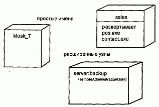

#### Рис. 26.2 Простое и расширенное изображение узлов

> Примечание: Имя узла может состоять из любого числа букв, цифр и некоторых знаков препинания (за исключением таких, как двоеточия, которые применяются для отделения имени узла от имени объемлющего пакета). Имя может занимать несколько строк. На практике для именования узлов используют одно или несколько коротких существительных, взятых из словаря реализации.

### Узлы и компоненты
Во многих отношениях узлы подобны компонентам (см. главу 25). Те и другие наделены именами, могут быть участниками отношений зависимости, обобщения и ассоциации, бывают вложенными, могут иметь экземпляры и принимать участие во взаимодействиях. Однако между ними есть и существенные различия:

компоненты принимают участие в исполнении системы; узлы - это сущности, которые исполняют компоненты;
компоненты представляют физическую упаковку логических элементов; узлы представляют средства физического развертывания компонентов.
Первое из этих отличий самое важное. Здесь все просто - узлы исполняют компоненты, компоненты исполняются в узлах.

Второе различие предполагает наличие некоего отношения между классами, компонентами и узлами. В самом деле, компонент - это материализация множества других логических элементов, таких как классы и кооперации, а узел - место, на котором развернут компонент. Класс может быть реализован одним или несколькими компонентами, а компонент, в свою очередь, развернут в одном или нескольких узлах. Как показано на рис. 26.3, отношение между узлом и компонентом, который на нем развернут, может быть явно изображено с помощью отношения зависимости (см. главы 5 и 10). Как правило, вам не придется визуализировать такие отношения. Лучше хранить их как часть спецификации узла.

#### Рис. 26.3 Узлы и компоненты

Множество объектов или компонентов, приписанных к узлу как группа, называется элементом распределения (Distribution unit).

> Примечание: Умы подобны классам в том отношении, что для них можно задать атрибуты и операции. Например, можно указать, что у узла есть атрибуты скоростьПроцессора и память, а также операции включить, выключить, приостановить.

### Организация узлов
Узлы можно организовывать, группируя их в пакеты (см. главу 12), точно так же, как это делается с классами и компонентами.

Можно организовывать узлы, специфицируя отношения (см. главы 5 и 10) зависимости, обобщения и ассоциации (включая агрегирование), существующие между ними.

### Соединения
Самый распространенный вид отношения между узлами - это ассоциация. В данном контексте ассоциация представляет физическое соединение узлов, например линию Ethernet, последовательный канал или разделяемую шину (см. рис. 26.4). Ассоциации можно использовать даже для моделирования непрямых соединений типа спутниковой линии связи между двумя удаленными процессорами.

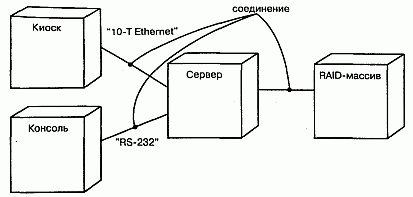

#### Рис. 26.4 Соединения

Поскольку узлы аналогичны классам, в нашем распоряжении находится весь аппарат ассоциаций. Иными словами, можно использовать роли, кратности и ограничения. Как показано на рис. 26.4, следует применять стереотипы, если необходимо моделировать разные виды соединений - к примеру, чтобы отличить соединение 10-Т Ethernet от соединения по последовательному каналу RS-232.

## Типичные приемы моделирования

### Процессоры и устройства
Моделирование процессоров и устройств, образующих топологию автономной, встроенной, клиент-серверной или распределенной системы, - вот самый распространенный пример использования узлов.

Поскольку все механизмы расширения UML (см. главу 6) применимы и к узлам, то для описания новых видов узлов, представляющих конкретные процессоры и устройства, часто используются стереотипы. Процессор (Processor) - это узел, способный обрабатывать данные, то есть исполнять компонент. Устройство (Device) - это узел, не способный обрабатывать данные (по крайней мере, на выбранном уровне абстракции) и в общем случае используемый для представления чего-либо связанного с реальным миром.

Моделирование процессоров и устройств осуществляется так:

1. Идентифицируйте вычислительные элементы представления системы с точ ки зрения развертывания и смоделируйте каждый из них как узел.
2. Если эти элементы представляют процессоры и устройства общего вида, то припишите им соответствующие стандартные стереотипы. Если же это процессоры и устройства, входящие в словарь предметной области, то сопоставьте им подходящие стереотипы, пометив каждый пиктограммой. 3. Как и в случае моделирования классов, рассмотрите атрибуты и операции, применимые к каждому узлу.

Например, на рис. 26.5 изображена предыдущая диаграмма, на которой каждому узлу приписан стереотип. Сервер - это узел со стереотипом процессора общего вида; киоск и консоль - узлы со стереотипами специализированных процессоров, а RAID-массив - узел со стереотипом специализированного устройства.

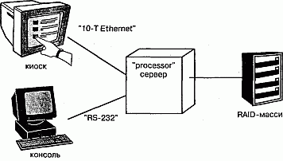

#### Рис. 26.5 Процессоры и устройства

> Примечание: Узлы - это те строительные блоки UML, которым стереотипы приписываются чаще всего. Когда в ходе проектирования программной системы вы моделируете ее с точки зрения развертывания, очень важно предоставлять потенциальным читателям визуальные указания. Моделируя процессор, являющийся компьютером общего назначения, присвойте ему пиктограмму компьютера. Моделируя какое-либо устройство, например сотовый телефон, факс, модем или видеокамеру, представьте и его подходящей пиктограммой.

### Распределение компонентов
При моделировании топологии системы часто бывает полезно визуализировать или специфицировать физическое распределение ее компонентов по процессорам и устройствам, входящим в состав системы. (Семантика местоположения рассматривается в главе 23.)

Моделирование распределения компонентов состоит из следующих шагов:

1. Припишите каждый значимый компонент системы к определенному узлу.
2. Рассмотрите возможности дублирования размещения компонентов. Доволь но распространен случай, когда одни и те же компоненты (например, неко торые исполняемые программы и библиотеки) размещаются одновременно в нескольких узлах.
3. Изобразите распределение компонентов по узлам одним из трех способов:

* не делайте размещение видимым, но оставьте его на заднем плане модели, то есть в спецификации узла;
* соедините каждый узел с компонентами, которые на нем развернуты, от ношением зависимости;
* перечислите компоненты, развернутые на узле, в дополнительном разделе.

Для иллюстрации третьего способа на рис. 26.6, основанном на предыдущих диаграммах, специфицированы исполняемые компоненты, размещенные в каждом узле. Эта диаграмма несколько отличается от предыдущих - она является диаграммой объектов (см. главу 14), на которой визуализированы конкретные экземпляры (см. главу 11) каждого узла. В данном случае экземпляры RAID-массив и Киоск анонимны, а у остальных двух экземпляров есть имена (с для Консоли и s для Сервера). Для каждого процессора на рисунке отведен дополнительный раздел, показывающий, какие компоненты на нем развернуты. Объект Сервер также изображен со своими атрибутами (processorSpeed - скоростьПроцессора и memory -память), причем их значения видимы.

#### Рис. 26.6 Моделирование распределения компонентов

Компоненты не обязательно должны быть статически распределены по узлам системы. В UML можно моделировать динамическую миграцию компонентов из одного узла в другой (см. главу 30), как бывает в системах, включающих агенты, или в системах повышенной надежности, в состав которых входят кластерные серверы и реплицируемые базы данных

## Советы
Хорошо структурированный узел обладает следующими свойствами:

* представляет четкую абстракцию некоей сущности из словаря аппаратных средств области решения;
* декомпозирован только до уровня, необходимого для того, чтобы донести ваши идеи до читателя;
* раскрывает только те атрибуты и операции, которые относятся к моделируемой области;
* явно показывает, какие компоненты на нем развернуты;
* связан с другими узлами способом, отражающим топологию реальной системы.

Изображая узел в UML, руководствуйтесь следующими принципами:

* определите для своего проекта или организации в целом набор стереотипов с подходящими пиктограммами, которые несут очевидную для читателя смысловую нагрузку;
* показывайте только те атрибуты и операции (если таковые существуют), которые необходимы для понимания назначения узла в данном контексте.

http://bourabai.kz/dbt/uml/ch27.htm

ЧАСТЬ VI - Архитектурное моделирование
# Глава 27. Кооперации
* Введение
* Термины и понятия
* Имена
* Структуры
* Поведение
* Организация коопераций
* Типичные приемы моделирования
* Реализация прецедента
* Реализация операции
* Механизм
* Советы

В контексте архитектуры системы кооперация позволяет присвоить имя некоторому концептуальному фрагменту, охватывающему как статические, так и динамические аспекты. Кооперация (Collaboration) именует сообщество классов, интерфейсов и других элементов, которые работают совместно для обеспечения кооперативного поведения, более значимого, чем сумма его слагаемых.

Кооперации используются для описания реализации прецедентов и операций и для моделирования архитектурно-значимых механизмов системы.

## Введение
Представьте себе самое красивое из когда-либо виденных вами зданий - быть может, Тадж-Махал или Нотр-Дам. Достоинства той и другой конструкции не поддаются описанию. Хотя во многих отношениях оба строения архитектурно просты, но идеи, заложенные в них, исключительно глубоки. Во-первых, вы сразу распознаете определенную симметрию. Приглядитесь внимательнее, и вы заметите детали, которые красивы сами по себе, но в совокупности привносят изящество и функциональность в большей степени, чем по отдельности.

А теперь вспомните о самых безобразных из виденных вами зданий - скажем, о забегаловке на углу вашей улицы. Вы увидите зрительную какофонию архитектурных стилей - тут кусочек модернизма, там островерхая крыша, украшения не гармонируют ни с тем, ни с другим, кричащие цвета оскорбляют взгляд. Обычно такие здания - "шедевры" обычных ремесленников, выполняющие сугубо прагматические функции, без претензий на стиль.

Что же отличает эти два вида гражданской архитектуры? Во-первых, в величественных зданиях мы видим изящество дизайна, которого явно не достает забегаловкам. В настоящей архитектуре (см. главу 2) используется не так уж много стилей, которые удачно сочетаются друг с другом. Например, в конструкции Тадж-Махала повсеместно применяются сложные, симметричные и сбалансированные геометрические элементы. Во-вторых, в тех зданиях, которые спроектированы со вкусом, мы обнаруживаем общие структуры, которым подчинены все отдельные элементы конструкции. Так, в Нотр-Даме некоторые стены являются несущими и служат опорой куполу собора. А часть из них, вместе с другими архитектурными деталями, используется для отвода воды и нечистот.

Так же обстоит дело и с программным обеспечением. Хорошая программная система не только выполняет возложенные на нее функции, но и демонстрирует гармоничный и сбалансированный проект, благодаря которому она легко поддается модификации. Эта гармоничность и сбалансированность чаще всего объясняются тем, что хорошо структурированные объектно-ориентированные системы содержат множество повторяющихся структурных элементов-образцов (паттернов). Взгляните на любую качественную объектно-ориентированную систему, и вы обнаружите элементы, которые взаимодействуют друг с другом, демонстрируя кооперативное поведение, более значимое, нежели сумма его составляющих. Многие элементы хорошо структурированных систем в разных комбинациях принимают участие в функционировании различных механизмов.

> Примечание: Образец, или паттерн (Pattern), описывает общее решение некоей общей проблемы в определенном контексте. В хорошо структурированной системе всегда есть целый спектр паттернов, включая идиомы (часто встречающиеся программные конструкции), механизмы (паттерны проектирования, представляющие концептуально законченные фрагменты системной архитектуры) и каркасы (архитектурные паттерны, представляющие расширяемые шаблоны приложений в определенной области). Паттерны и каркасы рассматриваются в главе 28.

В UML механизмы моделируются с помощью коопераций. Кооперация именует совокупность концептуальных строительных блоков вашей системы, включая как структурные, так и поведенческие элементы (структурное моделирование описывается в частях 2 и 3 данной книги, а поведенческое - в частях 4 и 5). Например, можно рассмотреть распределенную систему управления информацией, база данных которой размещается на нескольких узлах. С точки зрения пользователя обновление представляется атомарной операцией. Если же взглянуть на нее изнутри, все окажется не так просто, поскольку в обновлении участвует несколько машин. Для создания иллюзии простоты необходимо ввести механизм транзакций (Transactions), c помощью которого клиент сможет присвоить имя некоей операции, которая представляется единой атомарной операцией, несмотря на то что затрагивает несколько баз данных. В работе такого механизма могли бы принимать участие несколько кооперирующихся классов, совместно обеспечивающих семантику транзакции. Многие из них будут вовлечены и в другие механизмы, например обеспечения устойчивого хранения информации. Такой набор классов (структурная составляющая), взятый вместе с взаимодействиями (см. главу 15) между ними (поведенческая составляющая), и образует механизм, который в UML представляется кооперацией.

Кооперации не только именуют системные механизмы, но и служат для реализации прецедентов (см. главу 16) и операций (см. главы 4 и 9).

Кооперация в UML изображается, как показано на рис. 27.1. Эта нотация позволяет визуализировать структурные и поведенческие строительные блоки системы, особенно в ситуациях, когда они перекрываются с классами, интерфейсами и другими элементами.

#### Рис 27-1

> Примечание: Эта нотация позволяет визуализировать кооперацию как единый фрагмент по отношению к внешним элементам. Но более интересно то, что находится внутри кооперации. Раскройте ее, и вы увидите другие диаграммы, из которых наиболее важны диаграммы классов (структурная составляющая кооперации, см. главу 8) и диаграммы взаимодействий (ее поведенческая составляющая, см. главу 18).

## Термины и понятия
Кооперация (Collaboration) - это сообщество классов, интерфейсов и других элементов, которые работают совместно для обеспечения кооперативного поведения, более значимого, чем сумма его составляющих. Кооперация также специфицирует то, как некий элемент, допустим классификатор (класс, интерфейс, компонент, узел или прецедент) либо операция, реализуется с помощью классификаторов и ассоциаций, каждая из которых играет свою роль. Изображается кооперация в виде эллипса с пунктирной границей. (Эта нотация отнюдь не случайно подобна нотации прецедента - см. главу 16.)

### Имена
Каждая кооперация должна иметь имя, отличающее ее от других коопераций. Имя - это текстовая строка. Взятое само по себе, оно называется простым. К составному имени кооперации спереди добавлено имя пакета, в котором она находится. Внутри объемлющего пакета имя должно быть уникальным (см. главу 12). Обычно при изображении кооперации указывают только ее имя, как показано на рис. 27.1.

> Примечание: Имя кооперации может состоять из любого числа букв, цифр и некоторых знаков препинания (за исключением таких, как двоеточие, . которое применяется для отделения имени кооперации от имени объемлющего пакета). Имя может занимать несколько строк. На практике для именования коопераций используют одно или несколько коротких существительных, взятых из словаря моделируемой системы. Обычно первая буква имени заглавная, например: Транзакция, ЦепочкаОтветственности.

### Структуры
У коопераций есть два аспекта. Структурная составляющая описывает классы, интерфейсы и другие совместно работающие элементы (см. части 2 и 3 данной книги). Поведенческая составляющая описывает динамику взаимодействия этих элементов.

Структурная составляющая кооперации может включать любую комбинацию классификаторов (см. главу 9), таких как классы, интерфейсы, компоненты и узлы. Внутри кооперации для организации этих классификаторов могут использоваться все обычные отношения (см. главы 5 и 10), имеющиеся в UML, в том числе ассоциации, обобщения и зависимости. На самом деле для описания структурных элементов кооперации можно применять весь спектр средств структурного моделирования, которыми располагает UML.

Однако, в отличие от пакетов (см. главу 12) или подсистем (см. главу 31), кооперация не владеет ни одним из своих структурных элементов. Она лишь ссылается на классы, интерфейсы, компоненты, узлы и другие структурные элементы, объявленные в другом месте, или использует их. Вот почему кооперация именует именно концептуальный - а не физический - фрагмент системной архитектуры. Таким образом, кооперация может пересекать многие уровни системы. Более того, один и тот же элемент может принимать участие в нескольких кооперациях (а некоторые элементы не будут частью ни одной кооперации).

Например, система розничной продажи через Internet описывается примерно десятком прецедентов (см. главу 16): Покупка Товаров, Возврат Товаров, Просмотр Заказа и т.д., и каждый из них реализован отдельной кооперацией. Кроме того, все эти кооперации разделяют одни и те же структурные элементы (такие, как классы Клиент и Заказ), но организованы по-разному. На более глубоких уровнях системы также обнаружатся кооперации, представляющие архитектурно значимые механизмы. Так, в системе розничной торговли вполне может быть кооперация Межузловые сообщения, которая описывает детали защищенной передачи сообщений между узлами.

Если имеется кооперация, именующая концептуальный фрагмент системы, вы можете раскрыть ее, чтобы посмотреть на скрытые внутри структурные детали. Например, на рис. 27.2 показано, что при раскрытии кооперации Межузловые сообщения обнаруживается набор классов, изображенных на диаграмме классов (см. главу 8).

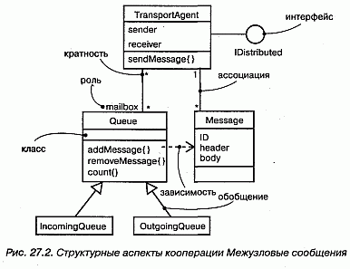

#### Рис 27-2

### Поведение
В то время как структурная составляющая кооперации обычно изображается с помощью диаграммы классов, ее поведенческая составляющая как правило представлена диаграммой взаимодействия (см. главу 18). Эта диаграмма описывает взаимодействие, которое соответствует поведению, состоящему в обмене сообщениями между объектами в некотором контексте для достижения определенной цели. Контекст взаимодействия устанавливает объемлющая кооперация, которая конфигурирует классы, интерфейсы, компоненты, узлы и другие структурные элементы, экземпляры которых (см. главу 13) могут принимать участие во взаимодействии.

Поведенческую составляющую кооперации можно описывать одной или несколькими диаграммами. Если необходимо подчеркнуть упорядочение сообщений во времени, пользуйтесь диаграммой последовательностей. Если же основной акцент нужно сделать на структурных отношениях между объектами, возникающими в ходе совместной деятельности, применяйте диаграммы кооперации. Можно использовать любой вид диаграмм, поскольку в большинстве случаев они семантически эквивалентны.

Это означает, что, моделируя взаимодействия внутри некоторого сообщества классов как кооперацию, вы можете раскрыть ее и ознакомиться с деталями поведения. Так, раскрывая кооперацию Межузловые сообщения, вы могли бы увидеть диаграмму взаимодействия, показанную на рис. 27.3.

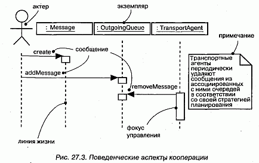

#### Рис 27-3

> Примечание: Поведенческие части кооперации должны быть согласованы со структурными. Это значит, что объекты, участвующие в кооперативных взаимодействиях, должны быть экземплярами классов, входящих в структурную часть. Аналогичным образом поименованные во взаимодействии сообщения должны соотноситься с операциями, видимыми в структурной части кооперации. С кооперацией может быть ассоциировано несколько взаимодействий, показывающих разные (но согласованные) аспекты поведения.

Организация коопераций
Кооперации являются сердцем системной архитектуры, поскольку лежащие в основе системы механизмы представляют существенные проектные решения. Все хорошо структурированные объектно-ориентированные системы состоят из регулярно устроенного множества коопераций относительно небольшого размера, поэтому очень важно научиться их организовывать. Существует два вида относящихся к кооперациям отношений, которые следует принимать во внимание.

Во-первых, это отношения между кооперацией и тем, что она реализует. Кооперация может реализовывать либо классификатор, либо операцию (см. главы 4 и 9). Это означает, что кооперация описывает структурную или поведенческую реализацию соответствующего классификатора или операции. Например, прецедент, который именует набор последовательностей действий, выполняемых системой, может быть реализован в виде кооперации. Этот прецедент (см. главу 16) вместе с ассоциированными актерами и соседними прецедентами предоставляет контекст для кооперации. Аналогично кооперацией может быть реализована и операция (которая именует реализацию некоторой системной услуги). В таком случае контекст формирует эта операция вместе со своими параметрами и, возможно, возвращаемым значением. Такое отношение между прецедентом или операцией и реализующей кооперацией моделируется в виде отношения реализации (см. главу 10).

Примечание: Кооперация может реализовывать любой вид классификатора (см. главу 9), включая классы, прецеденты, интерфейсы, компоненты и узлы. Кооперация, которая моделирует системный механизм, может быть и автономной, в таком случае ее контекстом является вся система в целом.
Во-вторых, имеются отношения между самими кооперациями. Кооперации могут уточнять описания других коопераций, что может быть смоделировано в виде отношения уточнения. Отношения уточнения между кооперациями обычно отражают отношения уточнения, существующие между представленными ими прецедентами.

Эти два вида отношений иллюстрируются на рис. 27.4.

#### Рис 27-4

> Примечание: Кооперации, как и любые другие элементы моделей UML, могут группироваться в пакеты (см. главу 12). Обычно к этому приходится прибегать только при моделировании очень больших систем.

## Типичные приемы моделирования

### Реализация прецедента
Одно из назначений коопераций состоит в моделировании прецедентов (см. главу 16). Как правило, при анализе системы вы руководствуетесь тем, как она может использоваться. Переходя же к этапу реализации, вы должны реализовать идентифицированные прецеденты в виде конкретных структур и поведений. В общем случае каждый прецедент должен быть реализован одной или несколькими кооперациями. Если рассматривать систему в целом, то классификаторы, участвующие в кооперации, которая связана с некоторым прецедентом, будут принимать участие и в других кооперациях.

Моделирование реализации прецедента состоит из следующих этапов:

1. Идентифицируйте те структурные элементы, которые необходимы и достаточны для осуществления семантики прецедента.
2. Организуйте эти структурные элементы в диаграмму классов
3. Рассмотрите отдельные сценарии, которые представляют данный прецедент. Каждый сценарий описывает один из путей прохождения прецедента.
4. Отобразите динамику этих сценариев на диаграммах взаимодействия. Воспользуйтесь диаграммами последовательности, если нужно подчеркнуть порядок сообщений, и диаграммами кооперации, если более важны структурные отношения между кооперирующимися объектами. 5. Организуйте эти структурные и поведенческие элементы как кооперацию, которую вы можете соединить с прецедентом через реализацию.

Например, на рис. 27.5 изображены прецеденты, относящиеся к системе контроля кредитных карточек, в том числе основные из них - Разместить заказ и Создать счет, а также два вспомогательных - Распознать подлог и Проверить транзакцию. Хотя в большинстве случаев не возникает необходимости в явном моделировании этого отношения (такую задачу можно оставить инструментальным средствам), на рисунке показана явная модель реализации Разместить заказ с помощью кооперации Управление заказами. В свою очередь эта кооперация может быть разложена на структурный и поведенческий аспекты, что в итоге дает диаграмму классов и диаграмму взаимодействия. Вот так, через отношение реализации, вы и связываете прецедент с его сценариями.

#### Рис 27-5

В большинстве случаев нет необходимости явно моделировать отношение между прецедентом и реализующей его кооперацией. Лучше оставить это на заднем плане модели и позволить инструментальным средствам воспользоваться имеющейся связью для навигации между прецедентом и его реализацией.

### Реализация операции
Еще одна цель, ради которой применяются кооперации, - это моделирование реализации операции (см. главы 4 и 9). Часто реализацию операции можно специфицировать непосредственно в коде. Однако для тех операций, которые требуют совместной работы нескольких объектов, перед написанием кода лучше смоделировать реализацию при помощи кооперации.

> Примечание: Моделировать операцию можно и с помощью диаграмм деятельности (см. главу 19). Диаграммы деятельности - это, по существу, блок-схемы. Поэтому для алгоритмически сложных операций, которые вы хотели бы моделировать явно, диаграммы деятельности -самый подходящий выбор. Но если в операции принимают участие много объектов, то лучше воспользоваться кооперациями, поскольку они позволяют моделировать как структурные, так и поведенческие аспекты операции.

Контекст реализации некоторой операции составляют параметры, возвращаемое значение и объекты, локальные по отношению к ней. Таким образом, эти элементы видимы для кооперации, с помощью которой реализуется операция, точно так же, как актеры видимы для кооперации, реализующей прецедент. Отношения между этими частями можно моделировать с помощью диаграмм классов, которые описывают структурную составляющую кооперации.

Моделирование реализации операции осуществляется так:

1. Идентифицируйте параметры, возвращаемое значение и другие объекты, видимые для операции.
2. Если операция тривиальна, представьте ее реализацию непосредственно в коде, который можно поместить на задний план модели или явно визуализировать в примечании (см. главу 6).
3. Если операция алгоритмически сложна, смоделируйте ее реализацию с помощью диаграммы деятельности.
4. Если операция требует большого объема детального проектирования, представьте ее реализацию в виде кооперации. В дальнейшем вы сможете развернуть структурную и поведенческую составляющие кооперации с помощью диаграмм классов и взаимодействия соответственно.

Так, на рис. 27.6 показан активный класс (см. главу 22) RenderFrame и раскрыты три его операции. Функция progress достаточно проста и может быть реализована сразу в коде, приведенном в примечании.

#### Рис 27-6

Однако операция render намного сложнее, и ее реализация возложена на кооперацию Ray trace (трассировка лучей). Хотя на рисунке этого и нет, вы могли бы раскрыть кооперацию и увидеть ее структурную и поведенческую составляющие.

### Механизм
В хорошо структурированной объектно-ориентированной системе всегда присутствует целый спектр стандартных образцов (паттернов). На одном конце этого спектра вы обнаружите идиомы, представляющие устойчивые конструкции языка реализации, а на другом - архитектурные образцы и каркасы (см. главу 28), образующие систему в целом и задающие определенный стиль. В середине же спектра располагаются механизмы (см. ту же главу), описывающие распространенные образцы проектирования, посредством которых элементы системы взаимодействуют между собой. Механизмы в UML представляются с помощью коопераций.

Механизмы (Mechanisms) - это автономные кооперации; их контекстом является не какой-то один прецедент или операция, но система в целом. Любой элемент, видимый в некоторой части системы, является кандидатом на участие в механизме.

Такого рода механизмы представляют архитектурно значимые проектные решения, и относиться к ним надо серьезно. Обычно механизмы предлагает системный архитектор, и с каждой новой версией они эволюционируют. В конце концов вы обнаруживаете, что система стала простой (поскольку в механизмах материализованы типичные взаимодействия), легко воспринимаемой (так как к пониманию системы можно подойти со стороны ее механизмов) и гибкой (настраивая каждый механизм, вы настраиваете систему в целом).

Моделирование механизмов осуществляется следующим образом:

1. Идентифицируйте основные механизмы, образующие архитектуру системы. Их выбор диктуется общим архитектурным стилем, который вы решили положить в основу своей реализации, а также стилем, наиболее отвечающим предметной области.
2. Представьте каждый механизм в виде кооперации.
3. Раскройте структурную и поведенческую составляющие каждой кооперации. Всюду, где можно, попытайтесь отыскать совместно используемые элементы.
4. Утвердить эти механизмы следует на ранних стадиях жизненного цикла раз работки (они имеют стратегически важное значение), но развивать их нужно в каждой новой версии, по мере более тесного знакомства с деталями реализации.

## Советы
При моделировании коопераций в UML помните, что каждая кооперация должна представлять реализацию прецедента или операции либо служить автономным механизмом на уровне всей системы. Хорошо структурированная кооперация обладает следующими свойствами:

* включает структурную и поведенческую составляющие;
* представляет собой четкую абстракцию некоторого взаимодействия в системе;
* редко является полностью независимой - обычно перекрывается со структурными элементами других коопераций;
* проста и легка для понимания.

Изображая кооперацию в UML, пользуйтесь следующими правилами:

* явно прорисовывайте кооперацию только тогда, когда это необходимо для понимания ее отношений с другими кооперациями, классификаторами, операциями или системой в целом. В остальных случаях используйте кооперации, но оставляйте их на заднем плане модели;
* организуйте кооперации в соответствии с представляемыми ими классификаторами или операциями либо помещайте в пакеты, ассоциированные с системой в целом

http://bourabai.kz/dbt/uml/ch28.htm

ЧАСТЬ VI - Архитектурное моделирование
# Глава 28. Образцы и каркасы
* Введение
* Термины и понятия
* Образцы и архитектура
* Механизмы
* Каркасы
* Типичные приемы моделирования
* Образцы проектирования
* Архитектурные образцы
* Советы

Все хорошо структурированные системы изобилуют образцами. Образец (Pattern) предлагает типичное решение типичной проблемы в данном контексте. Механизм - это образец проектирования, применимый к сообществу классов; каркас (Framework) - это, как правило, архитектурный образец, предлагающий расширяемый шаблон для приложений в одной конкретной области.

Образцы используются для специфицирования механизмов и каркасов, образующих архитектуру системы. Вы делаете его доступным, ясно идентифицируя те элементы управления и стыковки, с помощью которых пользователь настраивает образец для применения в имеющемся контексте.

## Введение
Захватывает дух, когда думаешь о том, сколько существует способов собрать дом из кучи досок. Мастер из Сан-Франциско, наверное, построит викторианское здание, увенчает его остроконечной крышей и покрасит в яркий цвет. А мастер из штата Мэн, скорее всего, из тех же досок соорудит домик в виде солонки, обшитый дранкой.

Внешне два этих дома - представители совершенно разных архитектурных стилей. Каждый строитель, основываясь на своем опыте, выбирает тот стиль, который лучше всего удовлетворяет потребностям заказчика, а затем адаптирует с учетом пожеланий своего клиента и ограничений, накладываемых выбранным местом, а также строительными нормами и правилами.

Если же взглянуть на проблему изнутри, то окажется, что любой строитель должен при проектировании дома решить и некоторые типичные задачи. Есть лишь ограниченное число проверенных способов конструирования стропил, на которые опирается крыша, и ограниченное число способов проектирования несущей стены с дверными и оконными проемами. Каждому строителю для решения этих типичных проблем придется выбрать те или иные механизмы, приспосабливая их к общему архитектурному стилю и местным нормам.

Создание программных систем подчиняется тем же закономерностям. Всякий раз, отрывая глаза от конкретных строк кода, вы обнаружите типичные механизмы, с помощью которых привыкли организовывать свои классы и другие абстракции. Например, в управляемой событиями системе применение образца проектирования, который можно было бы назвать "цепочка ответственности", - это типичный способ организации обработчиков событий. Теперь поднимитесь чуть выше уровня таких механизмов, и вы увидите типичные каркасы, образующие архитектуру всей системы. Например, использование трехзвенной архитектуры в информационных системах - это широко распространенный способ четко разделить обязанности между пользовательским интерфейсом, хранением информации и бизнес-объектами и правилами.

В UML обычно моделируются образцы проектирования - они также называются механизмами, - которые можно представить в виде коопераций (см. главу 27). Аналогично архитектурные образцы моделируются как каркасы, представляемые в виде стереотипных пакетов (см. главу 12).

Для обоих видов образцов предусмотрены графические изображения, показанные на рис. 28.1.

#### Рис 28-1

## Термины и понятия
Образец, или паттерн (Pattern), - это типичное решение типичной проблемы в данном контексте. Механизм (Mechanism) - это образец проектирования, применимый к сообществу классов. Каркас (Framework) - это архитектурный образец, предлагающий расширяемый шаблон для приложений в одной конкретной области.

### Образцы и архитектура
Занимаясь разработкой архитектуры новой системы или развитием существующей, вы в любом случае никогда не начинаете с нуля (см. главу 2). Напротив, прежний опыт и принятые соглашения наводят вас на мысль применить типичные способы для решения типичных проблем. Например, при построении системы, активно взаимодействующей с пользователем, вы можете прибегнуть к испытанному подходу "модель-вид-контроллер", который позволяет четко отделить объекты (модель) от их представления (вида) и от агентов, обеспечивающих синхронизацию между тем и другим (контроллеров). Аналогично при создании системы для дешифровки доказала свою полезность архитектура на основе "классной доски" (blackboard), хорошо приспособленная для решения сложных задач методом проб и ошибок.

То и другое является примером образцов, или паттернов, - типичных решений для типичных задач в данном контексте. Любая хорошо структурированная система изобилует образцами на разных уровнях абстракции. Образцы проектирования описывают структуру и поведение сообщества классов, архитектурные образцы -структуру и поведение системы в целом.

Образцы входят в UML просто потому, что являются важной составляющей словаря разработчика. Явно выделив образцы в системе, вы сделаете ее более понятной и простой для развития и сопровождения. Например, если вам дадут неизвестный исходный текст и попросят его модифицировать, вы будете долго недоумевать, пытаясь понять, как его части связаны друг с другом. Вместе с тем, если вам дадут тот же текст и скажут, что перечисленные классы взаимодействуют на основе механизма публикации-подписки, вы получите гораздо более ясное представление о том, как все работает. Та же идея применима к системе в целом. Одна лишь фраза "система организована как набор конвейеров и фильтров" очень много говорит об архитектуре системы, а понять это, просто глядя на код классов, было бы куда сложнее.

Образцы помогают при визуализации, специфицировании, конструировании и документировании артефактов программной системы. Можно заниматься прямым проектированием системы, выбрав подходящий набор образцов и применяя их к абстракциям, специфичным для данной предметной области, - или же обратным проектированием, выявляя содержащиеся в системе образцы (хотя вряд ли этот процесс можно назвать очень продуктивным). Скорее наоборот, при поставке системы разумно было бы описать характерные для нее образцы, чтобы помочь тому, кто в дальнейшем захочет повторно использовать или модифицировать ваш код.

На практике интерес представляют два вида образцов: образцы проектирования и каркасы. В UML есть средства для моделирования и тех, и других. При моделировании любого образца вы обнаружите, что он, как правило, оказывается автономным в контексте некоторого большего пакета, если не считать отношений зависимости, связывающих его с остальными частями системы.

### Механизмы
Механизм - это просто другое название образца проектирования, когда он применяется к сообществу классов. Например, типичная проблема проектирования, с который сталкивается программист, пишущий на языке Java, - как видоизменить класс, который умеет отвечать на некоторое множество событий, таким образом, чтобы он отвечал на события иного рода, не трогая кода исходного класса. Типичным решением этой проблемы является адаптер (Adaptor pattern) - структурный образец проектирования для преобразования одного интерфейса в другой. Этот образец является настолько общим, что имеет смысл дать ему название, а затем использовать в моделях всякий раз, как возникает аналогичная проблема.

При моделировании механизмы проявляют себя двояко.

Во-первых, как показано на рис. 28.1, механизм просто именует множество абстракций, которые совместно работают для обеспечения типичного поведения, представляющего некий интерес. Такие механизмы моделируются как простые кооперации (см. главу 27), поскольку являются всего лишь именами для сообщества классов. Раскрыв такую кооперацию, можно увидеть ее структурные аспекты (обычно изображаемые в виде диаграмм классов) и поведенческие (обычно изображаемые в виде диаграмм взаимодействия). Кооперации подобного типа захватывают разные абстракции системы; весьма вероятно, что некоторый класс будет членом нескольких коопераций.

Во-вторых, как показано на рис. 28.2, механизм именует шаблон для множества совместно работающих абстракций. Такие механизмы моделируются в виде параметризованных коопераций, которые в UML изображаются аналогично шаблонам классов (см. главу 9). Раскройте такую кооперацию - и вы увидите ее структурные и поведенческие аспекты. Сверните ее, и вы увидите, как образец применяется к вашей системе путем связывания частей кооперации с существующими в системе абстракциями. При моделировании механизма в виде параметризованной кооперации вы описываете те элементы управления и стыковки, с помощью которых можно адаптировать шаблон, меняя его параметры. Подобные кооперации могут появляться в разных частях системы и связываться с различными абстракциями. В приведенном примере классы Предмет и Наблюдатель образца связаны с конкретными классами ОчередьЗадач и Ползунок соответственно.

#### Рис 28-2

> Примечание: Решение о том, моделировать ли механизм с помощью простой или параметризованной кооперации, не вызывает затруднений. Если нужно лишь поименовать сообщество совместно работающих классов в системе, применяйте простую кооперацию. Если же нужно абстрагировать существенные структурные и поведенческие аспекты механизма способом, независящим от конкретной предметной области, а затем связать их с абстракциями в данном контексте, пользуйтесь параметризованной кооперацией.

### Каркасы

Каркас - это архитектурный образец, предлагающий расширяемый шаблон для приложений в некоторой конкретной области. Например, в системах реального времени часто применяется архитектурный образец "циклический исполнитель", делящий время на кадры и подкадры, в которых обработка протекает в строгих временных рамках. Выбор такого образца вместо управляемой событиями архитектуры оказывает влияние на всю систему. Этот образец (равно как и его альтернатива) является настолько общим, что имеет смысл назвать его каркасом.

Каркас - это больше чем механизм. Фактически можно считать, что каркас - это род микроархитектуры, включающий в себя множество механизмов, совместно работающих для разрешения типичной для данной предметной области проблемы. Специфицируя каркас, вы описываете скелет архитектуры со всеми управляющими органами, которые раскрываются пользователям, желающим адаптировать этот каркас для применения в нужном контексте.

В UML каркас моделируется в виде стереотипного (см. главу 6) пакета (см. главу 12). Раскрыв этот пакет, вы увидите механизмы, существующие в любом из видов системной архитектуры (см. главу 2). В частности, можно обнаружить параметризованные кооперации, а также прецеденты, поясняющие, как работать с каркасом, или простые кооперации, представляющие набор абстракций, на базе которых можно строить систему, например путем порождения производных классов.

На рис. 28.3 показан такой каркас, названный ЦиклическийИсполнитель. Среди прочего каркас включает кооперацию (ОбщиеСобытия), охватывающую множество классов событий (см. главу 20), и механизм (ОбработчикСобытий) для циклической обработки событий. Клиент, построенный на базе этого каркаса (к примеру, СердечныйСтимулятор) может пользоваться абстракциями из кооперации ОбщиеСобытия путем порождения производных классов, а также применять механизм ОбработчикСобытий.

#### Рис 28-3

> Примечание: Каркасы отличаются от обычных библиотек классов. Библиотека классов содержит абстракции, конкретизируемые или вызываемые абстракциями программы. Каркас же содержит абстракции, которые вызывают или конкретизируют ваши абстракции. Оба вида соединений образуют те элементы управления и стыковки, с помощью которых каркас настраивается на ваш контекст.

## Типичные приемы моделирования

### Образцы проектирования
В числе прочего образцы используются для моделирования типичных ситуаций, возникающих при проектировании. При моделировании подобного механизма следует принимать во внимание его внутренний и внешний вид.

При взгляде снаружи образец проектирования изображается в виде параметризованной кооперации. Будучи кооперацией, образец предоставляет набор абстракций, структура и поведение которых призваны в ходе совместной работы выполнить некоторую полезную функцию. Параметры кооперации именуют те элементы, которые пользователь образца должен с чем-то связать. В связи с этим образец проектирования превращается в шаблон, который используется в конкретном контексте путем подстановки элементов, соответствующих параметрам шаблона.

При взгляде изнутри образец проектирования представляется простой кооперацией и изображается со своими структурной и поведенческой составляющими. Обычно кооперация моделируется с помощью диаграмм классов (для структурной составляющей) и диаграмм взаимодействий (для поведенческой составляющей). Параметры кооперации именуют некоторые из структурных элементов, которые при связывании с каким-то определенным контекстом конкретизируются абстракциями из этого контекста.

Моделирование образца проектирования осуществляется так:

1. Идентифицируйте типичное решение типичной проблемы и материализуйте его в виде механизма.
2. Смоделируйте механизм в виде кооперации (см. главу 27), описав ее структурный и поведенческий аспекты.
3. Идентифицируйте те элементы образца проектирования, которые должны быть связаны с элементами в конкретном контексте, и изобразите их в виде параметров кооперации.

Например, на рис. 28.4 показано использование образца проектирования Команда (см. Gamma et al, "Design Patterns". Reading, Massachusetts: Addison-Wesley, 1995). Документация гласит, что этот образец "инкапсулирует запрос в виде объекта, позволяя тем самым параметризовать клиенты, выдающие разные запросы, ставить запросы в очередь и протоколировать их, а также поддерживать операции, допускающие отмену". Как видно из модели, этот образец имеет четыре параметра, которые должны быть связаны с элементами в данном контексте. Модель показывает пример такого связывания, где с параметрами образца связаны классы Приложение, КомандаВставки, КомандаОткрытия, ПунктМеню и Документ.

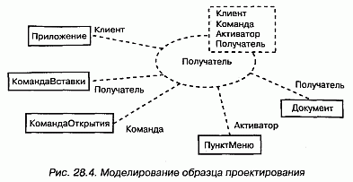

#### Рис 28-4

Обратите внимание на то, что КомандаВставки и КомандаОткрытия связаны несколько иначе, чем остальные параметры. Оба являются подклассами класса Команда, предоставляемого самим образцом проектирования. Если вы понимаете, как функционирует образец проектирования, то, глядя на эту модель, сразу догадаетесь, как в данном контексте совместно работают эти пять классов. Весьма вероятно, что в вашей системе этот образец будет использоваться неоднократно, быть может, с различными связями. Возможность повторного использования образца проектирования и делает процесс разработки на основе образцов столь эффективным.

> Примечание: Хотя на рисунке этого не видно, классификаторы, которые материализуют данный образец проектирования (Приложение, КомандаВставки, КомандаОткрытия, ПунктМеню и Документ) по своей структуре изоморфны обобщенному образцу, показанному на рис. 28.5. Поэтому там, где в обобщенном образце есть ассоциация между Клиентом и Получателем, существует и ассоциация между Приложением и Документом. Применение образца означает конкретизацию как его сущностей, так и связей между ними.

Чтобы завершить модель образца проектирования, вы должны специфицировать его структурную и поведенческую составляющие, которые представляют собой взгляд на кооперацию (см. главу 27) изнутри.

Например, на рис. 28.5 показана диаграмма классов (см. главу 8), представляющая структуру образца проектирования. Заметьте, что классы на этой диаграмме названы так же, как и параметры образца.

#### Рис 28-5

На рис. 28.6 показана диаграмма последовательностей (см. главу 18), представляющая поведение этого образца.

#### Рис 28-6

### Архитектурные образцы
Образцы используются также для моделирования типичных архитектурных решений. При моделировании каркаса вы, собственно, моделируете инфраструктуру, которую в дальнейшем планируете повторно использовать или адаптировать к некоторому контексту.

Каркас изображается в виде стереотипного пакета (см. главу 12). Будучи пакетом, каркас предоставляет ряд элементов, в частности (хотя этим все разнообразие не исчерпывается) классы, интерфейсы, прецеденты, компоненты, узлы, кооперации и даже другие каркасы. Иными словами, вы помещаете в каркас все абстракции, которые, работая совместно, формируют расширяемый шаблон для приложений в конкретной области. Некоторые из этих элементов будут являться открытыми и представлять ресурсы, которые надстраивает клиент. Это стыковочные элементы каркаса, которые вы можете подсоединить к абстракциям из своего контекста. Другие открытые элементы будут являться образцами проектирования и соответствовать ресурсам, с которыми связывается клиент. Это "разъемы" каркаса, заполняемые при связывании с образцом проектирования. И наконец, некоторые элементы будут закрытыми или защищенными; они соответствуют инкапсулированным элементам каркаса, невидимым снаружи.

При моделировании архитектурного образца помните, что каркас является, по сути дела, описанием архитектуры (см. главу 2), хотя неполным и, возможно, параметризованным. Следовательно, все, что вы знаете о моделировании хорошо структурированной архитектуры, в полной мере применимо и к хорошо структурированным каркасам. Самые лучшие каркасы не проектируются изолированно от остальной системы, - на практике такая попытка обречена на неудачу. В основе каркасов лежат уже существующие архитектуры, доказавшие свою работоспособность. Затем каркасы развиваются, чтобы найти те элементы управления и стыковки, которые необходимы и достаточны для применимости каркаса к новым областям.

Моделирование архитектурного образца осуществляется следующим образом:

1. Положите в основу каркаса уже существующую, проверенную архитектуру.
2. Смоделируйте каркас в виде стереотипного пакета, содержащего все элементы (и в особенности образцы проектирования), которые необходимы и достаточны для описания различных представлений каркаса.
3. Раскройте те элементы управления и стыковки, которые нужны, чтобы адаптировать каркас, представив их в виде образцов проектирования и коопераций. Это главным образом означает, что пользователь образца должен понимать, какие классы следует расширить, какие операции реализовать и какие сигналы обрабатывать.

На рис. 28.7 показана спецификация архитектурного образца КласснаяДоска (он рассматривается в книге Buschmann et al., "Pattern-Oriented Software Architecture", New York, New York: Wiley, 1996). Как говорится в документации, этот образец "применим к задачам преобразования исходных данных в высокоуровневые структуры, которые не имеют простого детерминированного решения". В основе архитектуры лежит образец проектирования КласснаяДоска, который определяет порядок совместной работы классов ИсточникЗнаний, КласснаяДоска и Контроллер. Еще каркас включает образец проектирования Процессор логического вывода, который определяет общий механизм работы класса ИсточникЗнаний. И наконец, как видно из рисунка, каркас раскрывает один вариант использования Применить новые источники знаний, поясняющий клиенту, как можно его адаптировать.

#### Рис 28-7

> Примечание: Полное моделирование каркаса - задача отнюдь не более простая, чем моделирование архитектуры всей системы. В некоторых отношениях она даже сложнее, поскольку для того, чтобы с каркасом можно было работать, вы должны раскрыть все его элементы управления и стыковки и, возможно, представить мета-прецеденты (типа Применить новые источники знаний), которые объясняют, как каркас настраивается, а также простые прецеденты, поясняющие его поведение.

## Советы
При моделировании образцов в UML помните, что они работают на многих уровнях абстракции, начиная от отдельных классов и кончая системой в целом. Самые интересные виды образцов - это механизмы и каркасы. Хорошо структурированный образец обладает следующими свойствами:

* решает типичную проблему типичным способом;
* включает структурную и поведенческую составляющие;
* раскрывает элементы управления и стыковки, с помощью которых его можно настроить на разные контексты;.
* является атомарным, то есть не разбивается на меньшие образцы;
* охватывает разные индивидуальные абстракции в системе.

Изображая образец в UML, руководствуйтесь следующими правилами:

* раскрывайте те его элементы, которые необходимо адаптировать для применения в конкретном контексте;
* делайте образец доступным, приводя прецеденты его использования, а также способы настройки.

http://bourabai.kz/dbt/uml/ch29.htm

ЧАСТЬ VI - Архитектурное моделирование
# Глава 29. Диаграммы компонентов
* Введение
* Термины и понятия
    * Общие свойства
    * Содержание
    * Типичные примеры применения
* Типичные приемы моделирования
    * Исходный код
    * Исполняемая версия
    * Физическая база данных
    * Адаптивные системы
    * Прямое и обратное проектирование
* Советы

Диаграммы компонентов - это один из двух видов диаграмм, применяемых при моделировании физических аспектов объектно-ориентированной системы (второй вид - диаграммы развертывания, см. главу 30). Они показывают организацию наборов компонентов и зависимости между ними.

Диаграммы компонентов применяются для моделирования статического вида системы с точки зрения реализации. Сюда относится моделирование физических сущностей, развернутых в узле, например исполняемых программ, библиотек, таблиц, файлов и документов. По существу, диаграммы компонентов - это не что иное, как диаграммы классов, сфокусированные на системных компонентах.

Диаграммы компонентов важны не только для визуализации, специфицирования и документирования системы, основанной на компонентах, но и для создания исполняемых систем путем прямого и обратного проектирования.

## Введение
Строительство дома не ограничивается созданием комплекта чертежей. Они, конечно, очень важны, так как помогают визуализировать, специфицировать и документировать, какой именно дом вы собираетесь построить, и обеспечить выполнение замысла с соблюдением сроков и сметы. Но рано или поздно поэтажные планы и разрезы придется воплощать в реальные стены, полы и потолки, сделанные из дерева, камня или металла. При этом вы, скорее всего, будете использовать и уже готовые компоненты, например встроенные шкафы, окна, двери и вентиляционные решетки. А если вы переоборудуете здание, то число готовых компонентов возрастет -это будут целые комнаты и инженерные конструкции.

Так же обстоит дело с программным обеспечением. Для того чтобы можно было рассуждать о желаемом поведении системы, вы создаете диаграммы прецедентов. Словарь предметной области вы описываете с помощью диаграмм классов. Чтобы показать, как описанные в словаре сущности совместно работают для обеспечения нужного поведения, вы пользуетесь диаграммами последовательностей, кооперации, состояний и деятельности. В конечном счете логические чертежи превращаются в реальные вещи, существующие в мире битов, например в исполняемые программы, библиотеки, таблицы, файлы и документы. Вы обнаруживаете, что некоторые из этих компонентов необходимо создавать с нуля, но находятся также и способы по-новому использовать старые компоненты.

Для визуализации статического аспекта физических компонентов и их отношений, а кроме того, для специфицирования деталей конструкции в UML используются диаграммы компонентов (см. рис. 29.1).

#### Рис 29-1

## Термины и понятия
Диаграмма компонентов (Component diagram) показывает набор компонентов и отношения между ними. Графически диаграмма компонентов представляется в виде графа с ребрами и вершинами.

### Общие свойства
Диаграмма компонентов обладает общими свойствами, присущими всем диаграммам (см. главу 7), - именем и графическим содержанием, которое отражает одну из проекций модели. Отличается она от других диаграмм своим специфичным содержанием.

### Содержание
Диаграммы компонентов обычно включают в себя:

* компоненты (см. главу 25);
* интерфейсы (см. главу 11);
* отношения (см. главы 5 и 10) зависимости, обобщения, ассоциации и реализации.

Подобно всем прочим, диаграммы компонентов могут содержать примечания и ограничения.

Диаграммы компонентов могут также содержать пакеты (см. главу 12) или подсистемы (см. главу 31), - те и другие используются для группирования элементов модели в крупные блоки. Иногда бывает полезно поместить в диаграмму компонентов еще и экземпляры (см. главу 13), особенно если вы хотите визуализировать один экземпляр из семейства компонентных систем.

> Примечание: Во многих отношениях диаграмма компонентов представляет собой разновидность диаграммы классов (см. главу 8), в которой внимание обращено прежде всего на системные компоненты.

### Типичные примеры применения
Диаграммы компонентов используются для моделирования статического вида системы с точки зрения реализации (см. главу 2). Этот вид в первую очередь связан с управлением конфигурацией частей системы, составленной из компонентов, которые можно соединять между собой различными способами.

При моделировании статического вида системы с точки зрения реализации диаграммы компонентов, как правило, используются в четырех случаях:

* моделирование исходного кода. В большинстве современных объектно-ориентированных языков программирования код пишется в интегрированных средах разработки, которые сохраняют исходные тексты в файлах. Диаграммы компонентов можно применять для моделирования управления конфигурированием этих файлов, которые представляют собой компоненты - рабочие продукты;
* моделирование исполняемых версий. Версия - это относительно полный и согласованный набор артефактов, предоставляемый внутреннему или внешнему пользователю. Для системы, составленной из компонентов, версия прежде всего подразумевает те части, которые необходимо поставить для получения работающей системы. При моделировании версий с помощью диаграмм компонентов вы визуализируете, специфицируете и документируете решения, принятые относительно физических составляющих системы, то есть компонентов развертывания;
* моделирование физических баз данных. Представляйте себе физическую базу данных как конкретную реализацию схемы, существующую в мире битов. Схемы, по сути дела, описывают API для доступа к хранимой информации; модель же физической базы данных (см. главу 8) представляет способы хранения этой информации в таблицах реляционной базы данных или на страницах объектно-ориентированной БД. Для представления этих и иных видов физических баз данных вы можете пользоваться диаграммами компонентов;
* моделирование адаптивных систем. Некоторые системы абсолютно статичны - их компоненты появляются на сцене, принимают участие в выполнении, а затем покидают сцену. Другие системы более динамичны; они включают мобильных агентов или компоненты, которые мигрируют с целью выравнивания нагрузки и восстановления после сбоев. Для представления таких систем применяются диаграммы компонентов совместно с некоторыми другими диаграммами UML.

## Типичные приемы моделирования

Исходный код
При разработке программы на языке Java исходный код обычно сохраняют в файлах с расширением .java. Программы, написанные на языке C++, обычно хранят исходный код в заголовочных файлах с расширением .h и в файлах реализации с расширением .cpp. При использовании языка IDL для разработки приложений СОМ+ или CORBA один, с точки зрения проектирования, интерфейс распадается на четыре исходных файла: сам интерфейс, клиентский заместитель (Proxy), серверная заглушка (Stub) и класс-мост (Bridge class). По мере роста объема приложения, на каком бы языке оно ни было написано, эти файлы придется организовывать в группы. Затем, на стадии сборки приложения, вы, вероятно, станете создавать различные варианты одних и тех же файлов для каждой новой промежуточной версии, и захотите поместить все это в систему управления конфигурацией.

В большинстве случаев нет необходимости моделировать этот аспект системы напрямую. Вместо этого вы сообщаете среде разработки, что надо следить за файлами и их отношениями. Иногда, однако, бывает полезно визуализировать исходные файлы и связи между ними с помощью диаграмм компонентов. Применяемые таким образом диаграммы компонентов обычно содержат только компоненты - рабочие продукты со стереотипом file (см. главу 25), а также отношения зависимости между ними. Например, вы могли бы выполнить обратное проектирование набора исходных файлов для визуализации сложной системы зависимостей между ними при компиляции. Можно пойти и в другом направлении, специфицировав отношения между исходными файлами и подав затем эту модель на вход средства компиляции, например make в ОС UNIX. Точно так же можно использовать диаграммы компонентов для визуализации истории набора исходных файлов, хранящихся в системе управления конфигурацией. Получая информацию от этой системы, например о том, сколько раз некоторый файл извлекался для редактирования на протяжении определенного периода времени, вы вправе воспользоваться ею для раскрашивания диаграмм компонентов. Это поможет выявить среди исходных файлов "горячие точки", в которых архитектура системы наиболее часто подвергается модификации.

Моделирование исходного кода системы осуществляется следующим образом:

1. С помощью прямого или обратного проектирования идентифицируйте представляющие интерес наборы исходных файлов и смоделируйте их в виде компонентов со стереотипом file.
2. Для больших систем воспользуйтесь пакетами, чтобы показать группы исходных файлов.
3. Подумайте о том, чтобы с помощью помеченных значений явно показать такую информацию, как номер версии файла, его автора и дату последнего изменения (для отслеживания таких значений пользуйтесь инструментальными средствами).
4. Моделируйте зависимости компиляции между исходными файлами с помощью отношений зависимости (для генерирования таких зависимостей применяйте инструментальные средства).

В качестве примера на рис. 29.2 показано пять исходных файлов, из которых signal.h - заголовочный. Приведены три его версии начиная с самой последней. Каждая версия помечена значением, содержащим ее номер.

#### Рис 29-2

Этот заголовочный файл (signal.h) используется двумя другими файлами (interp.cpp и signal.cpp). Один из них (interp.cpp) зависит при компиляции от другого заголовчного файла (irq.h). В свою очередь файл device.cpp зависит от interp.cpp. При наличии такой диаграммы компонентов легко проследить, что произойдет при изменениях. Так, изменение исходного файла signal.h потребует перекомпиляции трех других файлов: signal.cpp, interp.cpp и, тран-зитивно, device.cpp. Из той же диаграммы видно, что файл irq.h такое изменение не затронет.

Подобные диаграммы легко генерируются путем обратного проектирования на основе информации, хранящейся в системе управления конфигурацией.

### Исполняемая версия
Выпуск версий простого приложения несложен. Одна-единственная исполняемая программа записывается на диск, и пользователи могут смело ее запускать. Для таких приложений диаграммы компонентов не требуются: там нечего визуализировать, специфицировать, конструировать и документировать.

Выпуск версий более сложных приложений уже представляет определенные трудности. Кроме главной исполняемой программы (обычно ехе-файл) нужен ряд вспомогательных модулей, таких как библиотеки (обычно dll-файлы при работе в контексте СОМ+ или class- либо jar-файлы при работе с языком Java), файлы оперативной справки и файлы ресурсов. Для распределенных систем, вероятно, потребуется несколько исполняемых программ и других файлов, разбросанных по разным узлам. Если вы работаете с системой приложений, то может оказаться так, что одни компоненты уникальны, а другие используются в нескольких приложениях. По мере развития системы управление конфигурацией множества компонентов становится важной задачей, и сложность ее растет, поскольку изменение некоторых компонентов в одном приложении может сказаться на работе других.

По этим причинам для визуализации, специфицирования, конструирования и документирования исполняемых версий применяются диаграммы компонентов. Эти диаграммы охватывают как развертывание компонентов, входящих в состав каждой версии, так и связи между ними. Диаграммы компонентов пригодны для прямого проектирования новой системы и для обратного проектирования существующей.

При создании подобных диаграмм компонентов вы фактически просто моделируете часть сущностей и отношений, составляющих вид системы с точки зрения реализации. Поэтому каждая диаграмма должна концентрироваться только на каком-то одном наборе компонентов.

Моделирование исполняемой версии осуществляется так:

1. Идентифицируйте набор компонентов, который вы хотите моделировать. Как правило, сюда войдут все или некоторые из компонентов, размещенные в одном узле, или же распределение таких наборов компонентов по всем узлам системы.
2. Примите во внимание стереотип каждого компонента в наборе. В большинстве систем имеется лишь небольшое число различных видов компонентов (таких, как исполняемые программы, библиотеки, таблицы, файлы и документы). Для визуального представления этих стереотипов можно воспользоваться механизмами расширения UML (см. главу 6).
3. Рассмотрите связи каждого компонента с соседями. Чаще всего это предполагает интерфейсы (см. главу 11), которые экспортируют (реализуют) одни компоненты и импортируют (используют) другие. Если вы хотите раскрыть стыковочные узлы системы, смоделируйте эти интерфейсы явно; если же не обходимо представить модель на более высоком уровне абстракции, скройте такие связи, показав лишь зависимости между компонентами.

В качестве примера на рис. 29.3 представлена модель части исполняемой версии автономного робота. Основное внимание обращено на компоненты развертывания, ассоциированные с функциями приводов робота и вычислительными операциями. Вы видите один компонент (driver.dll), который экспортирует интерфейс (IDrive), импортируемый другим компонентом (path.dll). driver.dll экспортирует еще один интерфейс (ISelfTest), который, по всей видимости, используется другими компонентами в системе, хотя они здесь и не показаны. На диаграмме присутствует еще один компонент (collision.dll), который также экспортирует набор интерфейсов, хотя их детали скрыты: показана лишь зависимость от path.dll к collision.dll.

#### Рис 29-3

В системе участвует много компонентов. Но данная диаграмма сфокусирована лишь на тех компонентах развертывания, которые напрямую вовлечены в процесс перемещения робота. Заметьте, что в этой компонентной архитектуре вы могли бы заменить конкретную версию driver.dll на другую; при условии, что она реализует те же (и, возможно, некоторые дополнительные) интерфейсы, path.dll продолжала бы работать правильно. Если вы хотите явно указать операции, реализуемые driver.dll, то всегда можно изобразить его интерфейсы с помощью нотации классов со стереотипом interface.

### Физическая база данных
Логическая схема базы данных (см. главу 8) описывает словарь хранимых данных системы, а также семантику связей между ними. Физически все это хранится в базе данных - реляционной, объектно-ориентированной или гибридной объектно-реляционной. UML вполне пригоден для моделирования физических баз данных, равно как и их логических схем. (Обсуждение проектирования физических баз данных выходит за рамки книги; здесь эта тема затрагивается только для того, чтобы продемонстрировать, как при помощи UML можно моделировать базы данных и таблицы.)

Отображение логической схемы на объектно-ориентированную базу данных не вызывает затруднений, так как даже сложные цепочки наследования могут быть сохранены непосредственно. Отображение схемы на реляционную базу уже сложнее. При наличии наследования вы должны решить, как отображать классы на таблицы. Как правило, применяется одна из трех следующих стратегий или их комбинация:

* можно определить отдельную таблицу для каждого класса. Это простой, но наивный подход, поскольку при добавлении новых наследующих классов или модификации родительских возникнут проблемы сопровождения;
* можно свернуть цепочки наследования, так чтобы все реализации любого класса в иерархии имели одно и то же состояние. Недостаток этого подхода состоит в том, что во многих экземплярах хранится избыточная информация;
* наконец, можно вынести данные порожденного класса, отсутствующие в родительском, в отдельную таблицу. Этот подход лучше прочих отражает структуру наследования, а недостаток его в том, что для доступа к данным придется выполнять соединение многих таблиц.

Проектируя физическую базу данных, вы должны также решить, как отобразить операции, определенные в логической схеме. В отношении объектно-ориентированных баз такое отображение достаточно прозрачно, а для реляционных предстоит уяснить, как будут реализовываться операции. Здесь тоже есть несколько вариантов:

* простые операции создания, выборки, обновления и удаления реализуются стандартными средствами SQL или ODBC;
* более сложное поведение (например, бизнес-правила) отображаются на триггеры или хранимые процедуры.

С учетом указанных выше соображений моделирование физической базы данных осуществляется следующим образом:
1. Идентифицируйте в вашей модели классы, представляющие логическую схему базы данных.
2. Выберите стратегию отображения этих классов на таблицы. Необходимо рас смотреть и вопрос о физическом распределении файлов базы данных в развернутой системе - от этого тоже будет зависеть выбор стратегии.
3. Для визуализации, специфицирования, конструирования и документирования отображения создайте диаграмму компонентов, в которой компоненты имеют стереотип таблицы.
4. Всюду, где можно, пользуйтесь инструментальными средствами для преобразования логической схемы в физическую.

На рис. 29.4 показано несколько таблиц базы данных, взятых из вузовской информационной системы. Вы видите одну базу (school.db, изображенную в виде компонента со стереотипом database), которая состоит из пяти таблиц: course, department, instructor, school и student (все они изображены в виде компонентов со стереотипом interface - одним из стандартных элементов UML, см. "Приложение В"). В соответствующей логической схеме не было наследования, поэтому отображение на физическую базу данных не вызвало затруднений.

#### Рис 29-4

Хотя в данном примере это и не показано, вы можете специфицировать содержимое каждой таблицы. У компонентов могут быть атрибуты, поэтому при моделировании физических баз данных широко применяется использование атрибутов для описания колонок каждой таблицы. Также у компонентов могут быть операции, которыми можно воспользоваться для обозначения хранимых процедур.

### Адаптивные системы
Все продемонстрированные до сих пор диаграммы компонентов использовались для моделирования статических видов системы. Участвующие в них компоненты проводили всю свою жизнь на одном узле. Хотя такая ситуация является наиболее распространенной, иногда, особенно при работе со сложными распределенными системами, приходится моделировать и динамические представления. Например, некоторая система может реплицировать свои базы данных на несколько узлов и переключаться на резервный сервер в случае отказа главного. При моделировании глобальной распределенной системы, работающей в режиме 24x7 (то есть семь дней в неделю, 24 часа в сутки) вы, скорее всего, встретитесь с мобильными агентами -компонентами, которые мигрируют с одного узла на другой для выполнения некоторой операции. Для того чтобы моделировать такие динамические представления, вам понадобится комбинировать диаграммы компонентов, объектов и взаимодействия.

Моделирование адаптивной системы производится так:

1. Рассмотрите физическое распределение компонентов, которые могут мигрировать с одного узла на другой. Специфицировать положение экземпляра компонента можно с помощью помеченного значения location (см. главу 23), изобразив его затем на диаграмме компонентов (хотя, строго говоря, диаграмма, содержащая только экземпляры, - это диаграмма объектов, см. главу 15.
2. Если нужно смоделировать действия, вызывающие миграцию компонентов, создайте соответствующую диаграмму взаимодействия, которая будет содержать экземпляры компонентов. Изменение положения можно проиллюстрировать, нарисовав один экземпляр несколько раз, но с разными помеченными значениями.

Например, на рис. 29.5 представлена модель репликации базы данных, изображенной на предыдущем рисунке. Мы видим два экземпляра компонента school.db - оба анонимны и имеют разные помеченные значения location. Есть также примечание, в котором явно поясняется, какой экземпляр первичен, а какой является репликой.

#### Рис 29-5

При желании показать детали каждой базы данных вы можете изобразить их в канонической форме - в виде компонента со стереотипом database.

Хотя на рисунке это не показано, допустимо воспользоваться диаграммой взаимодействия (см. главу 18) для моделирования динамики переключения с главного сервера на резервный.

### Прямое и обратное проектирование
Прямое и обратное проектирование компонентов выполняется довольно просто, так как компоненты - это физические сущности (исполняемые программы, библиотеки, таблицы, файлы и документы), а потому они близки к работающей системе. При прямом проектировании класса или кооперации вы на самом деле проектируете компонент, который представляет исходный код, двоичную библиотеку или исполняемую программу для этого класса или кооперации. Точно так же при обратном проектировании исходного кода, двоичной библиотеки или исполняемой программы вы в действительности проектируете компонент или множество компонентов, которые отображаются на классы или кооперации.

Решая заняться прямым проектированием (созданием кода по модели) класса или кооперации, вы должны определиться, во что их нужно преобразовать: в исходный код, двоичную библиотеку или исполняемую программу. Логическую модель имеет смысл превратить в исходный код, если вас интересует управление конфигурацией файлов, которые затем будут поданы на вход среды разработки. Логические модели следует непосредственно преобразовать в двоичные библиотеки или исполняемые программы, если вас интересует управление компонентами, которые фактически будут развернуты в составе работающей системы. Иногда нужно и то, и другое. Классу или кооперации можно поставить в соответствие как исходный код, так и двоичную библиотеку или исполняемую программу.

Прямое проектирование диаграммы компонентов состоит из следующих этапов:

1. Для каждого компонента идентифицируйте реализуемые им классы или кооперации.
2. Выберите для каждого компонента целевое представление. Это может быть либо исходный код (или иная форма, которой может манипулировать сис тема разработки), либо двоичная библиотека, либо исполняемая программа (или иная форма, которая может быть включена в работающую систему).
3. Используйте инструментальные средства для прямого проектирования модели.

Обратное проектирование (создание модели по коду) диаграммы компонентов - не идеальный процесс, поскольку всегда имеет место потеря информации. По исходному коду вы можете обратно спроектировать классы - это более или менее обычное дело (см. главу 8). Обратное проектирование компонентов из исходного кода выявляет существующие между файлами зависимости компиляции. Для двоичных библиотек самое большее, на что можно рассчитывать, - это обозначить библиотеку как компонент, а затем путем обратного проектирования раскрыть его интерфейсы. Это второе из распространенных действий, которые выполняются над диаграммами компонентов. Такой подход может быть полезен при знакомстве с новыми плохо документированными библиотеками. Исполняемую программу можно лишь обозначить как компонент и затем дизассемблировать ее код, но вряд ли вы будете этим заниматься, если не пишете на языке ассемблера. Обратное проектирование диаграммы компонентов осуществляется так:

1. Выберите целевое представление. Исходный код можно реконструировать в компоненты, а затем и в классы. Двоичные библиотеки можно подвергнуть обратному проектированию для раскрытия их интерфейсов. Исполняемые программы поддаются обратному проектированию в наименьшей степени.
2. С помощью инструментальных средств укажите на код, который вы хотите подвергнуть обратному проектированию. Воспользуйтесь инструментами для генерации новой модели или модификации существующей, для которой ранее было проведено прямое проектирование.
3. Воспользуйтесь инструментальными средствами для создания диаграммы компонентов путем сверки с моделью. Например, можно начать с одного или нескольких компонентов, а затем расширять диаграмму, следуя по связям или переходя к соседним компонентам. Раскройте или спрячьте детали этой диаграммы компонентов в соответствии с тем, что именно вы хотите донести до читателя.

В качестве примера на рис. 29.6 представлена диаграмма компонентов, полученная в результате обратного проектирования компонента ActiveX vbrun.dll. Видно, что компонент реализует 11 интерфейсов. Имея такую диаграмму, вы начинаете понимать семантику компонента и можете переходить к исследованию деталей интерфейсов.

#### Рис 29-6

Чаще всего при обратном проектировании исходного кода, а иногда и двоичных библиотек или исполняемых программ, прибегают к помощи системы управления конфигурацией. Это означает, что вы будете работать с конкретными версиями файлов или библиотек, совместимых друг с другом. В таких случаях бывает полезно включить помеченное значение, представляющее версию компонента, - ее может предоставить система управления конфигурацией. Тогда вы сможете воспользоваться UML для визуализации истории компонента при смене версий.

## Советы
Создавая в UML диаграммы компонентов, помните, что каждая такая диаграмма - это графическое представление статического вида системы с точки зрения реализации. Ни одна отдельно взятая диаграмма компонентов не должна показывать все, что известно о системе. Собранные вместе, диаграммы компонентов дают полное представление о системе с точки зрения реализации, по отдельности же каждая диаграмма описывает лишь один аспект.

Хорошо структурированная диаграмма компонентов обладает следующими свойствами:

* фокусирует внимание на каком-то одном аспекте статического представления системы с точки зрения реализации;
* содержит только те элементы, которые существенны для понимания этого аспекта;
* раскрывает только те детали, которые находятся на выбранном уровне абстракции;
* не является настолько краткой, чтобы скрыть от читателя важную семантику.

Изображая диаграмму компонентов, руководствуйтесь следующими правилами:

* дайте ей имя, соответствующее назначению;
* располагайте элементы так, чтобы число пересечений было минимальным;
* располагайте элементы так, чтобы семантически близкие сущности оказывались рядом;
* используйте примечания и цвет для привлечения внимания к важным особенностям диаграммы;
* с осторожностью подходите к использованию стереотипных элементов. Выберите ряд общих для вашего проекта (или организации в целом) пиктограмм и последовательно их применяйте.

http://bourabai.kz/dbt/uml/ch30.htm

ЧАСТЬ VI - Архитектурное моделирование
# Глава 30. Диаграммы развертывания
* Введение
* Термины и понятия
    * Общие свойства
    * Содержание
    * Типичное применение
* Типичные приемы моделирования
    * Встроенная система
    * Клиент-серверная система
    * Полностью распределенная система
    * Прямое и обратное проектирование
* Советы

Диаграммы развертывания, или применения, - это один из двух видов диаграмм, используемых при моделировании физических аспектов объектно-ориентированной системы (другой вид - диаграммы компонентов, см. главу 29). Такая диаграмма показывает конфигурацию узлов, где производится обработка информации, и то, какие компоненты размещены на каждом узле.

Диаграммы развертывания используются для моделирования статического вида системы с точки зрения развертывания. В основном под этим понимается моделирование топологии аппаратных средств, на которых выполняется система. По существу, диаграммы развертывания - это просто диаграммы классов, сосредоточенные на системных узлах.

Диаграммы развертывания важны не только для визуализации, специфицирования и документирования встроенных, клиент-серверных и распределенных систем, но и для управления исполняемыми системами с использованием прямого и обратного проектирования.

## Введение
При создании программной системы вы как разработчик программного обеспечения обращаете внимание в первую очередь на архитектуру и развертывание своих программ. Но в качестве системного инженера вы заинтересованы главным образом в аппаратных и программных средствах системы и в том, как достичь оптимального их сочетания. Иными словами, разработчики программного обеспечения имеют дело с неосязаемыми артефактами, вроде моделей и кода, а разработчики систем - еще и с аппаратурой, вполне осязаемой.

Хотя основное назначение UML - визуализация, специфицирование, конструирование и документирование программных артефактов, он применим также и для работы с аппаратными артефактами. Из этого не следует, что UML - универсальный язык описания аппаратных средств наподобие VHDL. Однако он все же способен моделировать многие аппаратные аспекты системы, чего разработчику программного обеспечения достаточно для описания платформы, на которой система будет исполняться, а системному инженеру - для сопряжения программных и аппаратных средств. В UML в качестве основы для рассуждений о структуре программной системы используются диаграммы классов и компонентов. Для специфицирования поведения программ применяются диаграммы последовательностей, кооперации, состояний и деятельности. А на стыке программ и аппаратуры располагаются диаграммы развертывания, которые позволяют говорить о топологии процессоров и устройств, на которых выполняется система.

В UML диаграммы развертывания используются для визуализации статических аспектов физических узлов и их взаимосвязей, а также для описания их деталей, которые имеют отношение к конструированию системы (см. рис. 30.1).

#### Рис 30-1

## Термины и понятия
На диаграмме развертывания, или применения (Deployment diagram), показана конфигурация обрабатывающих узлов, на которых выполняется система, и компонентов, размещенных в этих узлах. Диаграмма развертывания представлена в виде графа с ребрами и вершинами.

### Термины и понятия
На диаграмме развертывания, или применения (Deployment diagram), показана конфигурация обрабатывающих узлов, на которых выполняется система, и компонентов, размещенных в этих узлах. Диаграмма развертывания представлена в виде графа с ребрами и вершинами.

### Содержание
Диаграммы развертывания обычно включают в себя:

* узлы (см. главу 26);
* отношения зависимости и ассоциации (см. главы 5 и 10).

Подобно всем прочим диаграммам, диаграммы развертывания могут содержать примечания и ограничения.

На них бывают представлены компоненты (см. главу 25), каждый из которых должен быть размещен на каком-то узле, а кроме того, пакеты (см. главу 12) или подсистемы (см. главу 31), - те и другие используются для группирования элементов модели в крупные блоки. Иногда бывает полезно поместить в диаграмму объектов еще и экземпляры (см. главу 13), особенно если вы хотите визуализировать один экземпляр из семейства топологий расположения аппаратных средств.

> Примечание: Во многих отношениях диаграмма развертывания является разно -видностъю диаграммы классов (см. главу 8), в которой внимание обращено прежде всего на системные узлы.

### Типичное применение
Диаграммы развертывания используются для моделирования статического вида системы с точки зрения развертывания (см. главу 2). Это представление в первую очередь обращено на распределение, поставку и установку частей, из которых состоит физическая система.

Есть несколько типов систем, для которых диаграммы развертывания не нужны. Если вы разрабатываете программу, исполняемую на одной машине и обращающуюся только к стандартным устройствам на этой же машине, управление которыми целиком возложено на операционную систему (возьмем для примера клавиатуру, дисплей и модем персонального компьютера), то диаграммы развертывания можно игнорировать. Но если разрабатываемая программа обращается к устройствам, которыми операционная система обычно не управляет, или эта программа физически размещена на разных процессорах, то диаграмма развертывания поможет выявить отношения между программными и аппаратными средствами.

При моделировании статического вида системы с точки зрения развертывания диаграммы развертывания используются, как правило, в трех случаях:

* моделирование встроенных (embedded) систем. Встроенной системой называется аппаратный комплекс, взаимодействующий с физическим миром, в котором велика роль программного обеспечения. Встроенные системы управляют двигателями, приводами и дисплеями, а сами управляются внешними стимулами, например датчиками температуры и перемещения. Диаграмму развертывания можно использовать для моделирования устройств и процессоров, из которых состоит встроенная система;
* моделирование клиент-серверных (client/server) систем. Клиент-серверная система - это типичный пример архитектуры, где основное внимание уделяется четкому разделению обязанностей между интерфейсом пользователя, существующим на клиенте, и хранимыми данными системы, существующими на сервере. Клиент-серверные системы находятся на одном конце спектра распределенных систем и требуют от вас принятия решений о том, как связать клиенты и серверы сетью, а также о том, как физически распределеныпрограммные компоненты между узлами (см. главу 26). Диаграммы развертывания позволяют моделировать топологию такой системы;
* моделирование полностью распределенных (fully distributed) систем. Ha другом конце спектра распределенных систем находятся такие системы, которые распределены широко или даже глобально и охватывают серверы различных уровней. Часто на таких системах устанавливаются разные версии программных компонентов, часть из которых даже мигрирует с одного узла на другой. Проектирование подобной системы требует решений, которые допускают непрерывное изменение системной топологии. Диаграммы развертывания можно использовать для визуализации текущей топологии и распределения компонентов системы, чтобы можно было осмысленно говорить о влиянии на нее различных изменений.

## Типичные приемы моделирования

Встроенная система
Разработка встроенной системы не сводится к созданию программного обеспечения: ведь лриходится управлять физическим миром, где движущиеся части имеют склонность ломаться, сигналы зашумлены, а поведение нелинейно. При моделировании такой системы нужно принимать во внимание взаимодействие ее интерфейса с внешним миром, а это, как правило, нестандартные устройства и узлы (см. главу 26).

Диаграммы развертывания способны облегчить общение инженеров-электронщиков и разработчиков программного обеспечения. Используя узлы со стереотипами, похожими на знакомые устройства, можно создавать диаграммы, которые одинаково понятны и тем, и другим (о стереотипах и других механизмах расширения UML см. главу 6). Диаграммы развертывания помогают также формулировать суждения о сопряжениях программных и аппаратных средств. Они, таким образом, применяются для визуализации, специфицирования, конструирования и документирования проектных решений.

Моделирование встроенной системы включает в себя следующие этапы:

1. Идентифицируйте устройства и узлы, уникальные для системы.
2. Позаботьтесь о визуальных обозначениях для нестандартных устройств, воспользовавшись механизмами расширения UML для определения специфических стереотипов в виде подходящих пиктограмм. Как минимум, необходимо различать процессоры, на которых размещены программные компоненты, и устройства, которые на данном уровне абстракции не содержат программных компонентов.
3. Смоделируйте отношения между процессорами и устройствами на диаграмме развертывания. Кроме того, специфируйте отношения между компонентами вида системы с точки зрения реализации и узлами вида с точки зрения развертывания.
4. При необходимости раскройте описание наиболее "интеллектуальных" устройств, промоделировав их структуру на более детальной диаграмме раз вертывания.

Например, на рис. 30.2 показана аппаратная реализация автономного робота. Вы видите один узел (материнская плата на базе процессора Pentium) со стереотипом processor.

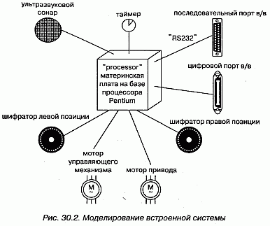

#### Рис 30-2

Вокруг этого узла расположено восемь устройств, каждое из которых имеет стереотип device и изображено в виде пиктограммы, похожей на реальный прототип.

### Клиент-серверная система
В тот момент, когда вы приступаете к разработке системы, которая не полностью размещена на одном процессоре, вы сразу же сталкиваетесь с целым рядом вопросов. Как оптимально распределить программные компоненты по узлам? Как они будут обмениваться информацией? Как быть с отказами и шумом? На одном конце спектра распределенных систем находятся клиент-серверные системы, в которых ясно прослеживается граница между пользовательским интерфейсом, обычно расположенном на клиенте, и данными, обычно хранящимися на сервере.

Существует множество вариаций этой темы. Например, можно выбрать "тонкого" клиента, вычислительные мощности которого ограничены и который, следовательно, занят в основном взаимодействием с пользователем и отображением информации. У "тонких" клиентов может даже не быть собственных компонентов; вместо этого они загружают компоненты с сервера по мере необходимости, как, скажем, в случае с Enterprise JavaBeans. C другой стороны, можно выбрать и "толстого" клиента, у которого вычислительных ресурсов больше и который вследствие этого может заниматься не только визуализацией. Выбор между "тонким" и "толстым" клиентом - это архитектурное решение, на которое влияют различные технические, экономические и политические факторы.

В любом случае при разделении системы на клиентскую и серверную части предстоит принять непростые решения о том, где физически разместить компоненты и как обеспечить баланс ответственности между ними. Например, архитектура большинства систем управления информацией трехуровневая, то есть пользовательский интерфейс, бизнес-логика и база данных физически отделены друг от друга. Решение о том, куда поместить интерфейс и базу данных, как правило, очевидно, а вот понять, где должны находиться компоненты, реализующие бизнес-логику, куда сложнее.

Диаграммы развертывания UML можно использовать для визуализации, специфицирования и документирования решений, принятых о топологии клиент-серверной системы и о распределении программных компонентов между клиентом и сервером. Обычно требуется создать одну диаграмму развертывания для системы в целом и ряд дополнительных диаграмм, укрупняющих отдельные ее участки.

Моделирование клиент-серверной системы осуществляется так:

1. Идентифицируйте узлы, представляющие процессоры клиента и сервера.
2. Выделите те устройства, которые так или иначе влияют на поведение системы. Например, вы, скорее всего, захотите смоделировать устройства считывания кредитных карточек и устройства отображения, отличные от стандартных мониторов, поскольку их место в составе аппаратных средств системы имеет важное значение с точки зрения системной архитектуры.
3. С помощью стереотипов разработайте визуальные обозначения для процессоров и устройств.
4. Смоделируйте топологию узлов на диаграмме развертывания. Специфируйте также отношения между компонентами вида системы с точки зрения реализации и узлами вида с точки зрения развертывания.

На рис. 30.3 показана топология системы, следующей классической клиент-серверной архитектуре. Мы видим, что граница между клиентом и сервером проведена явно путем использования пакетов (см. главу 12) клиент и сервер. Пакет клиент содержит два узла (консоль и киоск), имеющих свои стереотипы и потому визуально легко отличимых. Пакет сервер содержит два вида узлов (кэширующий сервер и сервер), для каждого из которых дополнительно описаны компоненты, размещаемые в узле. Заметьте, что как для кэширующего сервера, так и для сервера указаны кратности (см. главу 10), специфирующие, сколько экземпляров ожидается в конкретной развернутой конфигурации. К примеру, из диаграммы видно, что кэширующих серверов должно быть не меньше двух.

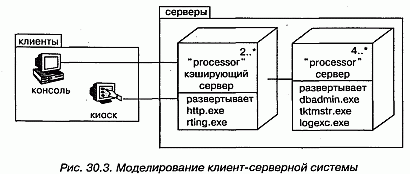

#### Рис 30-3

### Полностью распределенная система
Распределенные системы могут быть самыми разными - от простых двухпроцессорных до разветвленных, размещающихся на многих географически удаленных узлах. Последние, как правило, не бывают статическими. Узлы появляются и исчезают по мере изменения сетевого трафика и выхода процессоров из строя; создаются новые, более быстрые каналы связи, функционирующие параллельно медленным, постепенно устаревающим, которые в конце концов демонтируются. Изменяется не только топология системы, но и распределение программных компонентов. Например, таблицы баз данных могут реплицироваться между серверами с целью приблизить их к потребителю информации по мере изменений трафика. В некоторых глобальных системах компоненты могут мигрировать вслед за солнцем, перемещаясь с одного сервера на другой по мере того, как рабочий день начинается в одной части света и заканчивается в другой.

Визуализация, специфицирование и документирование топологии полностью распределенных систем представляют собой ценное подспорье для администратора, который должен вести учет вычислительных средств системы. Для этого можно применять диаграммы развертывания UML. Документируя полностью распределенную систему, вы можете раскрыть детали сетевых устройств, представляя их в виде стереотипных узлов.

Моделирование полностью распределенной системы осуществляется следующим образом:

1. Идентифицируйте устройства и процессоры, как и в отношении более про стой клиент-серверной системы.
2. Если необходимо строить выводы о производительности сетевой инфра структуры или о влиянии на сеть изменений, не забудьте промоделировать коммуникационные устройства со степенью детализации, достаточной для такого рода оценок.
3. Обратите особое внимание на логическое группирование узлов; для этого можно воспользоваться пакетами (см. главу 12).
4. Смоделируйте устройства и процессоры с помощью диаграмм развертывания. Всюду, где есть возможность, пользуйтесь инструментальными средствами для раскрытия сетевой топологии системы.
5. Если необходимо сфокусировать внимание на динамике системы, включите диаграммы прецедентов (см. главу 16) для специфицирования представля-ющих интерес видов поведения и раскройте их с помощью диаграмм взаимодействия (см. главу 20).

> Примечание: При моделировании полностью распределенной системы саму сеть ча- сто также изображают в виде узла. Например, можно представить Internet, как показано на рис. 30.4, в виде стереотипного узла. Таким же образом позволяется оформить локальную (LAN) или глобальную (WAN) сеть (см. рис. 30.1). В любом случае вы можете воспользоваться атрибутами и операциями узла для описания свойств сети.

На рис. 30.4 показана топология полностью распределенной системы. Эта конкретная диаграмма развертывания является также диаграммой объектов, поскольку содержит только экземпляры (см. главу 13). Вы видите три консоли (анонимные экземпляры стереотипного узла консоль), которые связаны с internet (очевидно, что этот узел существует лишь в единственном экземпляре). С другой стороны, есть три экземпляра региональных серверов, которые служат для интерфейса с национальными серверами (из них показан лишь один). Как следует из примечания, национальные серверы соединены друг с другом, но такие связи на диаграмме не отражены.

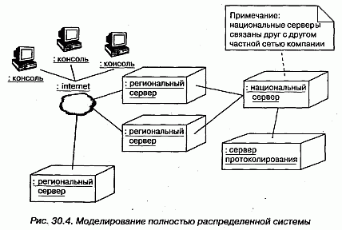

#### Рис 30-4

На этой диаграмме вся сеть Internet представлена стереотипным узлом.

### Прямое и обратное проектирование
Прямому проектированию (созданию кода по модели) диаграммы развертывания поддаются лишь в очень небольшой степени. Например, после специфицирования физического распределения компонентов по узлам на диаграмме развертывания можно воспользоваться инструментальными средствами, чтобы показать, как эти компоненты будут выглядеть в реальном мире. Для системных администраторов такое использование UML может оказать существенную помощь при решении весьма сложных задач.

Обратное проектирование (создание модели по коду) из реального мира в диаграммы развертывания может иметь огромную ценность, особенно для полностью распределенных систем, которые постоянно изменяются. Чтобы приспособить UML к нужной предметной области, вы, вероятно, захотите подготовить набор стереотипных узлов, понятных сетевому администратору. Преимущество использования UML состоит в том, что это стандартный язык, на котором можно выразить интересы не только администратора, но и разработчиков программного обеспечения.

Обратное проектирование диаграммы развертывания производится так:

1. Выберите, что именно вы хотите подвергнуть обратному проектированию. В некоторых случаях вам нужно будет пройти по всей сети, но иногда достаточно ограничиться ее фрагментом.
2. Выберите степень детализации обратного проектирования. Зачастую работать можно на уровне всех процессоров системы, но бывает необходимо включить и сетевые периферийные устройства.
3. Воспользуйтесь инструментальным средством, позволяющим совершить обход системы и показать ее топологию. Зафиксируйте эту топологию в своей модели развертывания.
4. По ходу дела с помощью других инструментов выясните, какие компоненты размещены в каждом узле, и занесите их в модель развертывания. Вам предстоит сложная поисковая работа, поскольку даже простейший персональный компьютер может содержать гигабайты разных компонентов, многие из которых к вашей системе не имеют отношения.
5. Используя инструменты моделирования, создайте диаграмму развертывания путем опроса модели. Например, можно начать с визуализации базовой клиент-серверной топологии, а затем расширять диаграмму, добавляя в описания тех или иных узлов размещенные в них компоненты. Раскройте детали содержания диаграммы развертывания в той степени, в какой это требуется, чтобы донести ваши идеи до читателя.

## Советы
При создании в UML диаграмм развертывания помните, что они являются всего лишь графическим представлением статического вида системы с точки зрения развертывания. Это значит, что ни одна диаграмма, взятая сама по себе, не может описать все, что относится к развертыванию системы. Собранные вместе, диаграммы развертывания дают полное представление о системе с соответствующей точки зрения, по отдельности же каждая диаграмма описывает лишь какой-то один аспект.

Хорошо структурированная диаграмма развертывания обладает следующими свойствами:

* сосредоточена на каком-то одном аспекте статического вида системы с точки зрения развертывания;
* содержит только те элементы, которые существенны для понимания этогоаспекта;
* раскрывает только те детали, которые присутствуют на выбранном уровне абстракции;
* не является настолько краткой, чтобы скрыть от читателя важную семантику.

Изображая диаграмму развертывания, пользуйтесь следующими правилами:

* дайте диаграмме имя, соответствующее ее назначению;
* располагайте элементы так, чтобы число пересечений было минимальным;
* располагайте элементы так, чтобы семантически близкие сущности оказывались рядом;
* используйте примечания и цвет, чтобы привлечь внимание к важным особенностям диаграммы;
* с осторожностью подходите к использованию стереотипных элементов. Выберите ряд общих для вашего проекта или организации пиктограмм и применяйте их всюду единообразно.

http://bourabai.kz/dbt/uml/ch31.htm

ЧАСТЬ VI - Архитектурное моделирование
# Глава 31. Системы и модели
* Введение
* Термины и понятия
    * Системы и подсистемы
    * Модели и представления
    * Трассировка
* Типичные приемы моделирования
    * Архитектура системы
    * Системы систем
* Советы

UML - это графический язык для визуализации, специфицирования, конструирования и документирования артефактов программной системы. Его используют для того, чтобы моделировать системы. Модель - это упрощение реальности, абстракция, создаваемая, чтобы лучше понять систему. Система, зачастую разложенная на ряд подсистем, - это множество элементов, организованных некоторым образом для выполнения определенной цели. Система описывается набором моделей, по возможности рассматривающих ее с различных точек зрения. Важными составными частями модели являются такие сущности, как классы, интерфейсы, компоненты и узлы. В UML модели применяются для организации подобных абстракций системы. По мере возрастания сложности обнаруживается, что сущность, на одном уровне абстракции представлявшаяся как система, на другом - более высоком - оказывается лишь подсистемой. В UML можно моделировать системы и подсистемы как единое целое и тем самым органично решать проблему масштабирования.

Хорошо структурированные модели помогают визуализировать, специфицировать, конструировать и документировать систему под разными (но вместе с тем взаимосвязанными) углами зрения. Хорошо структурированные системы функционально, логически и физически связаны, но при этом составлены из мало зависящих друг от друга подсистем.

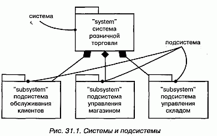

#### Рис 31-1

## Термины и понятия
Система (System), возможно разложенная на ряд подсистем, - это множество элементов, организованных некоторым образом для выполнения определенной цели. Она описывается набором моделей, зачастую с различных точек зрения. Подсистема (Subsystem) - это объединение элементов, ряд которых составляет спецификацию поведения, предложенного другими ее элементами. Система и подсистема изображаются в виде пиктограммы стереотипного пакета. Модель (Model) - это упрощение реальности, абстракция, создаваемая для лучшего восприятия системы. Вид, или представление (View), - это модель, рассматриваемая под определенным углом зрения: в ней отражены одни сущности и опущены другие, которые с данной точки зрения не представляют интереса.

### Системы и подсистемы
Система, собственно, и есть та сущность, которую вы разрабатываете и для которой строите модели. Система охватывает все артефакты, составляющие эту сущность, включая модели и элементы этих моделей, такие как классы (см. главы 4 и 9), интерфейсы, компоненты, узлы и связи между ними. Все, что необходимо для визуализации, специфицирования, конструирования и документирования системы, является ее частью, а все, что для этой цели не требуется, лежит за пределами системы.

В UML система изображается в виде стереотипного (см. главу 6) пакета (см. главу 12), как показано на рис. 31.1. Являясь стереотипным пакетом, она владеет некоторыми элементами. Если заглянуть внутрь системы, то можно увидеть все ее модели и отдельные элементы (в том числе и диаграммы), зачастую разложенные на более мелкие подсистемы. Являясь классификатором, система иногда имеет экземпляры (может существовать несколько систем, развернутых в разных точках), атрибуты и операции (внешние по отношению к системе актеры способны воздействовать на систему в целом), прецеденты (см. главу 16), автоматы (см. главу 21) и кооперации (см. главу 27); все они могут принимать участие в специфицировании поведения системы. В ряде случаев она обладает даже интерфейсами, что оказывается важным при конструировании системы систем.

Подсистемы - это образования, которые используются для декомпозиции сложной системы на более простые, слабо зависящие друг от друга составляющие. То, что на одном уровне абстракции выглядит системой, на другом - более высоком - может рассматриваться как подсистема.

В UML подсистема изображается в виде пиктограммы стереотипного пакета (см. рис. 31.1). Семантически подсистема - это одновременно и разновидность пакета, и разновидность классификатора.

Основное отношение между системами и подсистемами - это агрегирование (см. главы 5 и 10). Система (целое) может состоять из нуля или более подсистем (частей). Но между системами и подсистемами допускается существование отношения обобщения. С его помощью можно моделировать семейства систем и подсистем, ряд которых представляет общий случай, а другие являют собой специализацию для конкретных условий.

> Примечание: Система - это сущность самого высокого уровня в данном контексте; составляющие ее подсистемы разбивают систему на непересекающиеся части.

### Модели и представления
Модель - это упрощение реального мира; реальность в ней описывается в контексте моделируемой системы. Проще говоря, модель - это абстракция системы.

В то время как подсистема представляет собой разбиение множества элементов большей системы на независимые части, модель - это разбиение множества абстракций, используемых для визуализации, специфицирования, конструирования и документирования этой системы. Различие тонкое, но важное. Вы раскладываете систему на подсистемы, чтобы их можно было разрабатывать и развертывать в некоторой степени независимо друг от друга. Абстракции же системы или подсистемы вы разбиваете на модели, дабы лучше понять то, что собираетесь разрабатывать или развертывать. Сложная система, например самолет, состоит из многих частей (каркас, реактивные двигатели, авиационная электроника, подсистема обслуживания пассажиров), причем эти подсистемы и система в целом могут моделироваться с разных точек зрения (в частности, с точки зрения конструкции, динамики, электросистемы, моделей отопления и кондиционирования).

Модель - это разновидность пакета (см. главу 12). Явно моделировать ее приходится не так уж часто, поэтому специального графического символа для моделей в UML не предусмотрено. Однако инструментальные средства должны каким-то образом манипулировать моделями; обычно они используют для представления моделей нотацию пакетов.

Будучи пакетом, модель владеет некоторыми элементами. Модели, ассоциированные с системой или подсистемой, образуют исчерпывающее разбиение ее элементов. Это означает, что каждый элемент принадлежит одному и только одному пакету. Как правило, артефакты системы или подсистемы организуются в несколько неперекрывающихся моделей. Все возможные модели охватываются пятью представлениями, или видами архитектуры программного обеспечения, описанными в главе 2 данной книги.

Модель (к примеру, процесса) может содержать так много артефактов - скажем, активных классов, отношений и взаимодействий, - что в большой системе всю их совокупность нельзя охватить сразу. Вид системной архитектуры можно представлять себе как одну из проекций модели. Для каждой модели предусмотрен ряд диаграмм (см. главу 7), с помощью которых удобно обозревать принадлежащие ей сущности. Представление охватывает подмножество сущностей, входящих в состав модели. Границы моделей представления обычно пересекать не могут. В следующем разделе будет показано, что между моделями нет прямых отношений, хотя между элементами, содержащимися в различных моделях, могут существовать отношения трассировки.

> Примечание: UML не диктует вам, какими именно моделями следует пользоваться для визуализации, специфицирования, конструирования и документирования системы, хотя Рациональный Унифицированный Процесс предлагает некоторое множество разумных моделей, проверенное на практике.

### Трассировка
Специфицирование отношений (см. главы 5 и 10) между такими элементами, как классы, интерфейсы, компоненты и узлы, - это важная структурная составляющая модели. Для управления артефактами процесса разработки сложных систем, многие из которых существуют более чем в одной версии, большую роль играет специфицирование отношений между такими элементами, как документы, диаграммы и пакеты, присутствующими в разных моделях.

В UML концептуальные связи между элементами, существующими в различных моделях, можно моделировать с помощью отношения трассировки (Trace relationship). Трассировку нельзя применять к элементам в рамках одной модели. Трассировка представляется в виде стереотипной (см. главу 6) зависимости (см. главу 5). Часто можно не обращать внимания на направление такой зависимости, хотя обычно стрелка указывает на более ранний или более специфичный элемент, как показано на рис. 31.2. Чаще всего отношения трассировки используются, чтобы показать путь от требований к реализации, на котором лежат все промежуточные артефакты, а также для отслеживания версий.

#### Рис 31-2

> Примечание: Как правило, вместо явного изображения отношений трассировки вы будете пользоваться гиперссылками.

## Типичные приемы моделирования

### Архитектура системы
Наиболее распространенный случай применения систем и моделей - это организация элементов, используемых с целью визуализации, специфицирования, конструирования и документирования архитектуры системы (см. главу 1). При этом затрагиваются практически все артефакты, встречающиеся в проекте разработки программного обеспечения. Моделируя системную архитектуру, вы сводите воедино решения, принятые относительно требований к системе, ее логических и физических элементов. Моделируются структурные и поведенческие аспекты системы, образцы (или паттерны), формирующие ее различные представления. Наконец, следует обратить внимание на стыковку подсистем и трассировку решений, начиная от формулировки требований до этапа развертывания.

Моделирование архитектуры системы производится так:

1. Идентифицируйте виды, которые вы будете использовать для представления архитектуры (см. главу 2). Чаще всего это виды с точки зрения прецедентов, процессов, реализации и развертывания, как показано на рис. 31.3.
2. Специфицируйте контекст системы, включая и окружающие ее актеры.
3. При необходимости разложите систему на элементарные подсистемы.

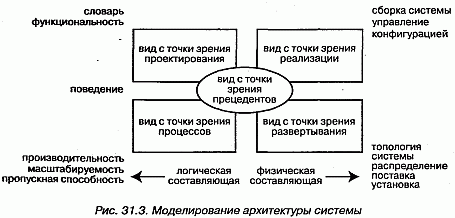

#### Рис 31-3

При моделировании системы в целом и ее подсистем выполняются следующие действия:

1. Специфицируйте вид системы с точки зрения вариантов использования или прецедентов, которые описывают поведение системы таким, каким оно представляется конечным пользователям, аналитикам и тестировщикам. Для моделирования статических аспектов примените диаграммы (см. главу 7) прецедентов, а для моделирования динамических - диаграммы взаимодействия, состояний и деятельности.
2. Специфицируйте вид системы с точки зрения проектирования, куда входят классы, интерфейсы и кооперации, формирующие словарь предметной области и предлагаемого решения. Для моделирования статических аспектов примените диаграммы классов и объектов, а для моделирования динамических - диаграммы последовательностей, состояний и деятельности.
3. Специфицируйте вид системы с точки зрения процессов, куда входят нити и процессы, формирующие механизмы параллельности и синхронизации в системе. Используйте те же диаграммы, что и для вида с позиции проектирования, но основное внимание уделите активным классам и объектам, которыми представлены процессы и нити.
4. Специфицируйте вид системы с точки зрения реализации, куда входят компоненты, используемые для сборки и выпуска готовой физической системы. Для моделирования статических аспектов используйте диаграммы компонентов, для моделирования динамических - диаграммы взаимодействия, состояний и деятельности.
5. Специфицируйте вид системы с точки зрения развертывания, куда входят узлы, формирующие топологию аппаратных средств, на которых выполняется система. Для моделирования статических аспектов применяются диаграммы развертывания, для моделирования динамических - диаграммы взаимодействия, состояний и деятельности.
6. Смоделируйте архитектурные образцы (паттерны) и образцы проектирования с помощью коопераций.

Необходимо понимать, что системная архитектура не рождается в ходе единичного акта творения. Напротив, хорошо структурированный процесс применения UML подразумевает последовательное уточнение архитектуры на основе анализа прецедентов, итеративное и инкрементное (Рациональный Унифицированный Процесс обсуждается в главе 2).

Если не брать в расчет простейшие системы, вам необходимо управлять версиями системных артефактов. Для представления решений о версиях каждого элемента можно воспользоваться механизмами расширения UML (см. главу 6), в частности помеченными значениями.

### Системы систем

о, что на одном уровне абстракции выглядит как система, на другом, более высоком, представляется подсистемой. Аналогичным образом то, что на одном уровне является подсистемой, вполне может рассматриваться как полноценная система группой разработчиков, ответственных за ее создание.

Такая иерархия наблюдается во всех сложных системах. По мере возрастания сложности систем вы встанете перед необходимостью ее декомпозиции на более простые подсистемы, каждую из которых можно разрабатывать отдельно, а затем постепенно объединять их. Разработка подсистемы выглядит в точности так же, как разработка всей системы.

Моделирование системы или подсистемы осуществляется следующим образом:

1. Идентифицируйте основные функциональные составляющие системы, которые можно разрабатывать, выпускать и развертывать до некоторой степени независимо. На результаты этого разбиения системы часто влияют технические, политические и юридические факторы.
2. Для каждой подсистемы специфицируйте ее контекст, так же как это делается для системы в целом (при этом в число актеров, окружающих подсистему, включаются все соседние подсистемы, поэтому необходимо проектировать их совместную работу).
3. Смоделируйте архитектуру каждой подсистемы так же, как это делается для всей системы.

## Советы
Важно выбрать правильное множество моделей для визуализации, специфицирования, конструирования и документирования системы. Хорошо структурированная модель:

* дает упрощенное представление реальности с одной относительно независимой точки зрения;
* самодостаточна, то есть не требует для понимания ее семантики никакой дополнительной информации;
* слабо связана с другими моделями посредством отношений трассировки;
* коллективно (совместно с другими смежными моделями) дает полное представление обо всех артефактах системы.

Столь же важно бывает представить сложную систему в виде декомпозиции хорошо структурированных подсистем. Хорошо структурированная система:

* функционально, логически и физически связна;
* может быть разложена на почти независимые подсистемы, которые сами являются системами на более низком уровне абстракции;
* может быть визуализирована, специфицирована, сконструирована и документирована в виде набора взаимосвязанных, неперекрывающихся моделей.

Для моделей в UML не предусмотрено специального графического представления (за исключением пиктограмм стереотипных пакетов), хотя инструментальные средства обычно изображают в виде пакетов, каждому из которых соответствует разбиение элементов системы с определенной точки зрения.

При изображении системы или подсистемы в UML:

* используйте каждую из них как начальную точку для всех артефактов, ассоциированных с ней;
* показывайте только основные виды агрегирования между системой и ее подсистемами; выносите детали связей между ними на диаграммы более низкого уровня.

http://bourabai.kz/dbt/uml/ch32.htm

ЧАСТЬ VII - Подведем итоги
# Глава 32. Применение UML
* Переход к UML
* Рекомендуемая литература

Простые задачи моделируются с помощью UML без труда. Легко поддаются моделированию и сложные задачи, особенно если вы уже приобрели некоторый опыт использования этого языка.

Одного только чтения литературы о языке UML недостаточно, - чтобы в полной мере овладеть языком, необходимо применять его на практике. В зависимости от того, что вы уже знаете, начинать работу с UML можно по-разному. По мере приобретения опыта вы поймете и оцените более сложные его конструкции.

Если вы способны рассматривать и оценивать какой-либо предмет с разных позиций, то UML поможет его смоделировать.

## Переход к UML
80% всевозможных проектов можно воплотить, используя 20% средств UML. Для создания статических моделей в большинстве предметных областей достаточно базовых структурных сущностей, таких как классы, атрибуты, операции, прецеденты, компоненты и пакеты, наряду с базовыми структурными отношениями -зависимостями, обобщениями и ассоциациями. Добавьте к этому списку еще и базовые поведенческие сущности наподобие простых автоматов и взаимодействий, и вы сможете моделировать множество полезных аспектов динамики системы. Нестандартные возможности UML придется использовать только тогда, когда вы приступите к моделированию более сложных ситуаций, например параллельности и распределения.

Неплохой отправной пункт, с которого можно начать изучение UML, - моделирование ряда базовых абстракций или поведения, уже имеющегося в одной из ваших систем. Разработайте для себя концептуальную модель UML (см. главу 2), и у вас появится фундамент, который впоследствии позволит вам развить свое понимание языка. Позже предоставится шанс постичь, как состыкованы между собой более развитые конструкции UML. Приступая к решению сложной задачи, разберитесь в соответствующих языковых средствах, изучив представленные в этой книге типичные приемы моделирования.

Если у вас нет опыта объектно-ориентированной разработки, воспользуйтесь следующими рекомендациями:

1. Понемногу начинайте применять идею абстрагирования в отношении конкретных моделей. Коллективные упражнения с анализом прецедентов - прекрасный способ выработать навыки выявления четких абстракций.
2. Постройте модель простой статической части задачи с помощью классов, зависимостей, обобщений и ассоциаций, чтобы осознать, как визуализируются сообщества абстракций.
3. Примените простые диаграммы последовательностей или кооперации для моделирования динамической части задачи. Можно начать с построения модели взаимодействия пользователя с системой: подобная практика позволит вам высказывать суждения о наиболее важных прецедентах использования системы.

Если у вас нет опыта моделирования, поступите так:

1. Возьмите какую-нибудь часть ранее созданной вами системы (желательно, чтобы она была реализована на одном из объектно-ориентированных языков программирования, скажем Java или C++) и постройте модель использованных в ней классов и отношений между ними.
2. С помощью UML попытайтесь прояснить некоторые детали идиом или механизмов программирования из тех, что были использованы в системе, но не отражены в коде явно, а находятся только в стадии замысла.
3. Если ваше приложение нетривиально, попробуйте реконструировать модель его архитектуры, используя пакеты UML для представления основных структурных элементов.
4. Освоив словарь UML, прежде чем приступать к переводу в код своего следующего проекта, постройте его модель. Сосредоточьтесь на специфицированном поведении и структуре; только после вывода о том, что размер, форма и семантика вас устраивают, начинайте использовать построенную модель как основу для реализации.

Если вы уже знакомы с какой-либо другой объектно-ориентированной методикой, поступите следующим образом:

1. Установите соответствие между элементами используемого вами языка моделирования и элементами UML. В большинстве случаев, особенно если выпользуетесь методиками Booch, OOSE или ОМТ, соответствие будет взаимно-однозначным, и потребуется внести лишь косметические изменения.
2. Рассмотрите какую-нибудь сложную проблему моделирования, которую вам с трудом удалось или вообще не удалось решить с помощью знакомого языка. Выясните, нет ли среди средств UML таких, которые позволят решить ее проще или изящнее.

Если вы опытный пользователь, вам пригодятся следующие советы:

1. Составьте для себя концептуальную модель UML. Вы можете упустить из виду гармоничность сочетания его элементов, если сразу перейдете к сложным конструкциям, предварительно не изучив базовый словарь.
2. Обратите особое внимание на средства UML для моделирования компонентов, параллельности, распределенности и образцов (паттернов). Это вопросы, семантика которых сложна и подлежит тщательному анализу.
3. Познакомьтесь с механизмами расширения UML и подумайте о том, как можно приспособить язык к вашей предметной области. Не поддавайтесь искушению использовать сразу все средства UML, иначе прочесть вашу модель смогут только самые опытные пользователи.

## Рекомендуемая литература
Настоящее руководство пользователя - лишь одна из ряда книг, которые помогут вам приступить к практическому применению UML. Можно порекомендовать справочник "The Unified Modeling Language Reference Manual", где описывается полный синтаксис и семантика UML, а также книгу "The Unified Software Development Process", где приводятся рекомендации о том, как организовать процесс разработки с использованием данного языка.

Тем, кто хочет больше узнать о моделировании, стоит обратиться к следующим изданиям (все книги написаны основными создателями UML):

* Booch G. "Object-Oriented Analysis and Design with Applications", 2nd ed. Redwood City, California, Addison-Wesley Publishing Company, 1993.
* Jacobson I., Christerson M., Jonsson P., Overgaard G. "Object-Oriented Software Engineering: A Use Case Driven Approach". Wokingham, England, Addison- Wesley Publishing Company, 1992.
* Rumbaugh J., Blaha M., Premerlani W., Eddy E, Lorensen W. "Object-Oriented Modeling and Design". Englewood Cliffs, New Jersey, Prentice-Hall, 1991.

Самую свежую информацию о UML вы найдете в Internet по адресу http:// www.rational.com. Там, равно как и на сайте http://www.omg.org можно получить и последнюю версию стандарта UML.

http://bourabai.kz/dbt/uml/prA.htm

ЧАСТЬ VII - Подведем итоги
# Приложение А. Нотация UML
* Сущности
    * Структурные сущности
    * Поведенческие сущности
    * Группирующие сущности
    * Аннотационные сущности
* Отношения
    * Зависимость
    * Ассоциация
    * Обобщение
    * Расширение
* Диаграммы

UML - это язык для визуализации, специфицирования, конструирования и документирования артефактов программной системы (общий обзор UML приведен в главе 2). Унифицированный язык моделирования имеет хорошо определенные синтаксис и семантику; наиболее заметная часть синтаксиса этого языка - его графическая нотация.

В настоящем разделе перечислены элементы нотации UML.

## Сущности

### Структурные сущности
Структурные сущности - это существительные, применяемые в моделях UML. К ним относятся классы (Classes), интерфейсы (Interfaces), кооперации (Collaborations), прецеденты (Use cases), активные классы (Active classes), компоненты (Components) и узлы (Nodes).

#### Рис. prA-1

#### Рис. prA-2

### Поведенческие сущности
Поведенческие сущности - это динамические части моделей UML. К ним относятся взаимодействия (Interactions) и автоматы (State machines).

#### Рис. prA-3

#### Рис. prA-3

### Группирующие сущности
Группирующие сущности - это организационные составляющие моделей UML. К их числу относятся пакеты (Packages).

#### Рис. prA-4

### Аннотационные сущности
Аннотационные сущности - это пояснительные составляющие моделей UML. К их числу относятся примечания (Notes).

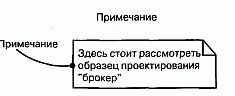

#### Рис. prA-5

## Отношения

### Зависимость
Зависимость (Dependency) - это семантическое отношение между двумя сущностями, при котором изменение одной из них (независимой сущности) может отразиться на семантике другой (зависимой).

#### Рис. prA-6

### Ассоциация
Ассоциация (Association) - структурное отношение, описывающее множество связей. Связь (Link) - это соединение между объектами.

#### Рис. prA-7

### Обобщение
Обобщение (Generalization) - это отношение специализации/обобщения, при котором объекты специализированного элемента (потомка - Child) можно подставить вместо объектов обобщенного элемента (родителя, или предка, - Parent).

#### Рис. prA-8

### Расширение
В UML существуют три механизма расширения синтаксиса и семантики языка: стереотипы (Stereotypes), представляющие новые элементы модели, помеченные значения (Tagged values), которые представляют новые атрибуты, и ограничения (Constraint), отражающие новую семантику.

#### Рис. prA-9

## Диаграммы
Диаграмма (Diagram) - это графическое представление множества элементов. Чаще всего она изображается в виде связного графа с вершинами (сущностями) и ребрами (отношениями). Диаграмма являет собой некоторую проекцию системы. В UML определено девять видов диаграмм:

* диаграмма классов (Class diagram) - структурная диаграмма, на которой показано множество классов, интерфейсов, коопераций и отношения между ними;
* диаграмма объектов (Object diagram) - структурная диаграмма, на которой показано множество объектов и отношения между ними;
* диаграмма прецедентов (Use case diagram) - диаграмма поведения, на которой показано множество прецедентов и актеров, а также отношения между ними;
* диаграмма последовательностей (Sequence diagram) - диаграмма поведения, на которой показано взаимодействие и подчеркнута временная последовательность событий;
* диаграмма кооперации (Collaboration diagram) - диаграмма поведения, на которой показано взаимодействие и подчеркнута структурная организация объектов, посылающих и принимающих сообщения;
* диаграмма состояний (Statechart diagram) - диаграмма поведения, на которой показан автомат и подчеркнуто поведение объектов с точки зрения порядка получения событий;
* диаграмма деятельности (Activity diagram) - диаграмма поведения, на которой показан автомат и подчеркнуты переходы потока управления от одной деятельности к другой;
* диаграмма компонентов (Component diagram) - диаграмма поведения, на которой показан автомат и подчеркнуто поведение объектов с точки зрения порядка получения событий;
* диаграмма развертывания (Deployment diagram) - структурная диаграмма, на которой показаны узлы и отношения между ними.

http://bourabai.kz/dbt/uml/prB.htm

ЧАСТЬ VII - Подведем итоги
# Приложение В. Стандартные элементы UML
* Стереотипы
* Помеченные значения
* Ограничения

UML - это стандартный язык для составления чертежей программного обеспечения. Однако ни один язык в достаточной мере не пригоден для выражения всех нюансов модели в разных предметных областях на протяжении работы системы. Поэтому в идею UML заложена открытость - иными словами, возможность расширять язык контролируемым способом. К механизмам расширения UML (см. главу 6) относятся:

* стереотипы;
* помеченные значения;
* ограничения.

Стереотип (Stereotype) расширяет словарь UML, то есть позволяет создавать из существующих строительных блоков новые, специфичные для конкретной решаемой задачи. Помеченное значение (Tagged value) расширяет свойства строительного блока UML, то есть дает возможность включать новую информацию в спецификацию элемента. Ограничение (Constraint) расширяет семантику строительного блока UML, позволяя добавлять новые или модифицировать существующие правила.

Эти три механизма расширения в их совокупности позволяют приспособить UML к нуждам вашего проекта. Они также оставляют возможность адаптировать UML к новым технологиям программирования, например к вероятному появлению более мощных языков распределенного программирования и к взаимопроникновению языков моделирования программных и аппаратных средств. Разрешается добавлять новые строительные блоки, модифицировать спецификации существующих и даже изменять их семантику. Естественно, это надо делать контролируемым способом, так чтобы изменения не затронули сам смысл языка UML как средства обмена информацией.

UML можно использовать и не прибегая к механизмам расширения. В действительности за счет трактовки всех вариантов строительных блоков UML как расширений его ядро удалось сделать компактнее и проще.

Однако при построении сложных моделей, когда возникает необходимость визуализировать или специфицировать тонкую, но существенную семантику, вы снова и снова будете пользоваться стереотипами, помеченными значениями и ограничениями. Некоторые расширения обрели такую популярность, что были определены как стандартные элементы UML.

В настоящем разделе описываются все стандартные элементы подобного рода.

## Стереотипы
Следующие стереотипы определены в качестве стандартных элементов UML. В приведенной таблице для каждого стереотипа указываются имя, символ UML, к которому применим стереотип, и назначение.

> Примечание: Некоторые из элементов, представленных в таблице, являются, строго говоря, не стереотипами, а стандартными ключевыми словами. Различие между ними довольно тонкое. В метамодели UML некоторые элементы, например trace, имеют очевидную семантику, то есть являются явной частью метамодели, а не настоящими стереотипами. С точки зрения разработчика, однако, они все равно изображаются в нотации стереотипов. Такие элементы определены как стандартные ключевые слова, чтобы можно было зарезервировать их использование в согласии с метамоделъю UML. В таблице ключевые слова выделены курсивом.

Обычно стереотипный элемент изображается следующим образом: имя стереотипа размещается над именем элемента и заключается в двойные кавычки, например "trace". Co стереотипом может быть ассоциирована пиктограмма, используемая как альтернативная форма визуализации данного элемента. Хотя в самом UML такие пиктограммы ни для одного стереотипа не заданы, в таблице все же приводятся некоторые общепринятые изображения.

| Стереотип/ ключевое слово                | Символ, к которому он применим       | Назначение                               |
|------------------------------------------|--------------------------------------|------------------------------------------|
| actor                                    | Класс (class)                        | Определяет связанное множество ролей, которые играет пользователь прецедента при взаимодействии с ним |
| access                                   | Зависимость (dependency)             | Сообщает, что открытое содержание целевого пакета доступно в пространстве имен исходного пакета |
| association                              | Концевая точка связи (link end)      | Указывает, что соответствующий объект видим ассоциацией |
| become                                   | Сообщение (message)                  | Целевой объект совпадает с исходным, но в более поздний момент времени. При этом, возможно, у него будут другие значения, состояния или роли |
| bind                                     | Зависимость (dependency)             | Исходный класс инстанцирует целевой шаблон с данными фактическими параметрами |
| call                                     | Зависимость (dependency)             | Исходная операция вызывает целевую       |
| copy                                     | Сообщение (message)                  | Целевой объект - это точная, но независимая копия исходного |
| create                                   | Событие (event), сообщение (message) | Целевой объект создан в результате события или сообщения |
| derive                                   | Зависимость (dependency)             | Исходный объект может быть вычислен по целевому |
| destroy                                  | Событие (event), сообщение (message) | Целевой объект уничтожен в результате события или сообщения |
| document | Компонент (component)                | Компонент представляет документ          |
| enumeration                              | Класс (class)                        | Определяет перечислимый тип, включая его возможные значения как набор идентификаторов |
| exception                                | Класс (class)                        | Определяет событие, которое может быть возбуждено или перехвачено операцией |
| executable | Компонент (component)                | Описывает компонент, который может быть выполнен в узле |
| extend                                   | Зависимость (dependency)             | Целевой вариант использования расширяет поведение исходного в данной точке расширения |
| facade                                   | Пакет (package)                      | Пакет, который является лишь представлением другого пакета |
| file | Компонент (component)                | Компонент, который представляет документ, содержащий исходный код или данные |
| framework                                | Пакет (package)                      | Пакет, состоящий в основном из образцов (паттернов) |
| friend                                   | Зависимость (dependency)             | Исходный класс имеет специальные права видимости в целевом |
| global                                   | Концевая точка связи (link end)      | Соответствующий объект видим, поскольку принадлежит объемлющей области действия |
| import                                   | Зависимость (dependency)             | Открытое содержание целевого пакета становится частью плоского пространства имен исходного пакета, как если бы оно было объявлено непосредственно в нем |
| implementation                           | Обобщение (generalization)           | Потомок наследует реализацию родителя, но не открывает и не поддерживает его интерфейсов, вследствие чего не может быть подставлен вместо родителя |
| implementationClass                      | Класс (class)                        | Реализация класса на некотором языке программирования |
| include                                  | Зависимость (dependency)             | Исходный прецедент явно включает поведение другого прецедента в точке, определяемой исходным |
| instanceOf                               | Зависимость (dependency)             | Исходный объект является экземпляром целевого классификатора |
| instantiate                              | Зависимость (dependency)             | Операции над исходным классом создают экземпляры целевого класса |
| interface                                | Класс (class)                        | Описывает множество операций, определяющих, что может делать класс или компонент |
| invariant                                | Ограничение (constraint)             | Ограничение, которое всегда должно выполняться для ассоциированного элемента |
| library  | Компонент (component)                | Статическая или динамическая объектная библиотека |
| local                                    | Концевая точка связи (link end)      | Соответствующий объект видим, так как находится в локальной области действия |
| metaclass                                | Классификатор (classifier)           | Классификатор, все объекты которого являются классами |
| model                                    | Пакет (package)                      | Описывает семантически замкнутую абстракцию системы |
| parameter                                | Концевая точка связи (link end)      | Соответствующий объект видим, так как является параметром |
| postcondition                            | Ограничение (constraint)             | Ограничение, которое должно выполняться после выполнения операции |
| powertype                                | Класс (class)                        | Классификатор, все объекты которого являются потомками данного родителя |
|                                          | Зависимость (dependency)             | Говорит, что целевой классификатор связан с исходным отношением powertype |
| precondition                             | Ограничение (constraint)             | Ограничение, которое должно выполняться перед выполнением операции |
| process                                  | Класс (class)                        | Классификатор, экземпляр которого представляет ресурсоемкий поток управления |
| refine                                   | Зависимость (dependency)             | Говорит, что исходный объект является более детальной абстракцией, чем целевой |
| requirement                              | Комментарий (comment)                | Описывает желаемое свойство или поведение системы |
| responsibility                           | Комментарий (comment)                | Описывает контракт или обязательство класса |
| send                                     | Зависимость (dependency)             | Исходная операция посылает целевое событие |
| signal                                   | Класс (class)                        | Асинхронный стимул, который передается одним экземпляром другому |
| stereotype                               | Класс (class)                        | Классификатор - это стереотип, который может быть применен к другим элементам |
| stub                                     | Пакет (package)                      | Пакет выступает в роли заместителя для открытого содержимого другого пакета |
| subsystem                                | Пакет (package)                      | Описывает группирование элементов, ряд которых составляет спецификацию поведения других элементов |
| system                                   | Пакет (package)                      | Описывает пакет, представляющий всю моделируемую систему |
| table | Компонент (component)                | Компонент, представляющий таблицу базы данных |
| thread                                   | Класс (class)                        | Классификатор, экземпляр которого представляет облегченный поток управления |
| trace                                    | Зависимость (dependency)             | Целевой элемент - это исторический предок исходного |
| type                                     | Класс (class)                        | Абстрактный класс, который используется только для спецификации структуры и поведения (но не реализации) множества объектов |
| use                                      | Зависимость (dependency)             | Семантика исходного элемента зависит от семантики открытого содержания целевого элемента |
| utility                                  | Класс (class)                        | Определяет класс, для которого область действия всех атрибутов и операций - класс |

## Помеченные значения
Приведенные ниже помеченные значения определены как стандартные элементы UML. Для каждого помеченного значения в таблице указывается имя, символ UML, к которому оно применимо, и назначение.

В большинстве случаев помеченное значение изображается посредством размещения метки и значения под именем элемента, к которому оно присоединено. При этом все сочетание заключается в фигурные скобки, например {location = client }. Если значение метки представляет собой длинный текст, то помеченное значение можно поместить в дополнительный раздел классификатора.

| Помеченное значение | Символы, к которым оно применимо         | Назначение                               |
|---------------------|------------------------------------------|------------------------------------------|
| documentation       | Все элементы                             | Содержит комментарий, описание или пояснение к тому элементу, к которому присоединено |
| location            | Большинство элементов                    | Определяет узел или компонент, которому принадлежит элемент |
| persistence         | Класс (class), ассоциация (association) атрибут (attribute) | Определяет, сохраняется ли состояние , экземпляра после завершения создавшего его процесса. Состояния бывают устойчивыми (сохраняющими значение) или временными (не сохраняющими значение) |
| semantics           | Класс (class), операция (operation)      | Описывает назначение класса или операции |

## Ограничения
Приведенные ниже ограничения определены как стандартные элементы UML. Для каждого помеченного значения в таблице указывается имя, символ UML, к которому оно применимо, и назначение.

В большинстве случаев ограничение размещается рядом с элементом и заключается в фигурные скобки, например {complete}. Можно изображать ограничение и по-другому - помещая в примечание, соединенное с элементом зависимостью.

| Ограничение | Символ, к которому оно применимо   | Назначение (о чем говорит данное ограничение) |
|-------------|------------------------------------|------------------------------------------|
| complete    | Обобщение (generalization)         | В модели специфицированы все потомки в данном обобщении (хотя некоторые могут быть скрыты на диаграммах), и дополнительных потомков определять не разрешается |
| destroyed   | Экземпляр (instance), связь (link) | Экземпляр или связь уничтожаются до завершения выполнения объемлющего взаимодействия |
| disjoint    | Обобщение (generalization)         | Объекты данного родителя могут иметь не более одного заданного потомка в качестве типа |
| implicit    | Ассоциация (association)           | Отношение является не явно выраженным, а концептуальным |
| incomplete  | Обобщение (generalization)         | Специфицированы не все потомки в обобщении (учитывая и скрытых). Разрешается определять дополнительных потомков |
| new         | Экземпляр (instance), связь (link) | Экземпляр или связь создаются в процессе выполнения объемлющего взаимодействия |
| or          | Ассоциация (association)           | Из множества ассоциаций ровно одна является явно выраженной для каждого ассоциированного объекта |
| overlapping | Обобщение (generalization)         | Объекты данного родителя могут иметь более одного заданного потомка в качестве типа |
| transient   | Экземпляр (instance), связь (link) | Экземпляр или связь создаются в процессе выполнения объемлющего взаимодействия, но уничтожаются до его завершения |

http://bourabai.kz/dbt/uml/prC.htm

ЧАСТЬ VII - Подведем итоги
# Приложение С. Рациональный Унифицированный Процесс
* Характеристики процесса
* Фазы и итерации
    * Фазы
    * Итерации
    * Циклы разработки
* Рабочие процессы
* Артефакты
    * Модели
    * Переход к UML

Процессом называется частично упорядоченное множество шагов, направленных на достижение некоторой цели. В контексте проектирования программного обеспечения вашей целью является поставка в предсказуемые сроки продукта, удовлетворяющего потребностям бизнеса.

UML практически не зависит от процесса, то есть его можно использовать в различно организованных процессах изготовления программного продукта. Но один способ организации, называемый Рациональным Унифицированным Процессом (Rational Unified Process), особенно хорошо приспособлен к UML. Цель Рационального Унифицированного Процесса - обеспечить изготовление программного продукта высочайшего качества, соответствующего потребностям пользователя, в заданные сроки и в пределах заранее составленной сметы. Рациональный Унифицированный Процесс вобрал в себя лучшие из существующих методик разработки и придал им форму, которая может быть легко адаптирована для самых разных проектов и организаций. С точки зрения управления проектом Рациональный Унифицированный Процесс предлагает упорядоченный подход к тому, как должны распределяться работа и ответственность в организации, занимающейся производством программного обеспечения.

В настоящем разделе описываются основные элементы Рационального Унифицированного Процесса.

## Характеристики процесса
Рациональный Унифицированный Процесс итеративен. Если речь идет о простых системах, не представляет особого труда последовательно определить задачу, спроектировать ее целостное решение, написать программу и протестировать конечный продукт. Но, учитывая сложность и разветвленность современных систем, такой линейный подход к разработке оказывается нереалистичным. Итеративный подход предполагает постепенное проникновение в суть проблемы путем последовательных уточнений и построение все более емкого решения на протяжении нескольких циклов. Итеративному подходу присуща внутренняя гибкость, позволяющая включать в бизнес-цели новые требования или тактические изменения. Его использование оставляет возможность выявить и устранить риски, связанные с проектом, на возможно более ранних этапах разработки.

Суть работы в рамках Рационального Унифицированного Процесса - это создание и сопровождение моделей, а не бумажных документов. Модели, особенно выраженные на языке UML, дают семантически насыщенное представление разрабатываемого программного комплекса. На них можно смотреть с разных точек зрения, а представленную в них информацию допустимо мгновенно извлечь и проконтролировать электронным способом. Рациональный Унифицированный Процесс обращен прежде всего на модели, а не на бумажные документы; причина состоит в том, чтобы свести к минимуму накладные расходы, связанные с созданием и сопровождением документов, и повысить степень информационного наполнения проектирования.

В центре разработки в рамках Рационального Унифицированного Процесса лежит архитектура. Основное внимание уделяется раннему определению архитектуры программного комплекса и формулированию основных ее особенностей. Наличие прочной архитектуры позволяет "распараллелить" разработку, сводит к минимуму переделки, увеличивает вероятность того, что компоненты можно будет использовать повторно, и в конечном счете делает систему более удобной для последующего сопровождения. Подобный архитектурный чертеж - это фундамент, на базе которого можно планировать процесс разработки компонентного программного обеспечения и управлять им.

Разработка в рамках Рационального Унифицированного Процесса сосредоточена на прецедентах. В основу построения системы положено исчерпывающее представление о том, каково ее назначение. Концепции прецедентов и сценариев используются на всех стадиях процесса, от формулирования требований до тестирования; они помогают проследить все действия от начала разработки до поставки готовой системы.

Рациональный Унифицированный Процесс поддерживает объектно-ориентированные методики. Каждая модель объектно-ориентирована. Модели, применяемые в рамках Рационального Унифицированного Процесса, основаны на понятиях объектов и классов и отношений между ними, а в качестве общей нотации используют нотацию UML.

Рациональный Унифицированный Процесс поддается конфигурированию. Хотя ни один отдельно взятый процесс не способен удовлетворить требованиям всех организаций, занимающихся разработкой программного обеспечения, Рациональный Унифицированный Процесс поддается настройке и масштабируется для использования как в совсем небольших коллективах, так и в гигантских компаниях. Он базируется на простой и ясной архитектуре, которая обеспечивает концептуальное единство во множестве всех процессов разработки, но при этом адаптируется к различным ситуациям. Составной частью Рационального Унифицированного Процесса являются рекомендации по его конфигурированию для нужд конкретной организации.

Рациональный Унифицированный Процесс поощряет объективный контроль качества и управление рисками на всех стадиях воплощения проекта. Контроль качества является неотъемлемой частью процесса, охватывает все виды работ и всех участников. При этом применяются объективные критерии и методы оценки. Контроль качества не рассматривается как особый род деятельности, которой можно заняться по завершении разработки. Управление рисками также встроено в процесс, так что возможные препятствия на пути успешного завершения проекта выявляются и устраняются на ранних этапах разработки, когда для реагирования еще остается время.

## Фазы и итерации
Фаза (Phase) - это промежуток времени между двумя важными опорными точками процесса, в которых должны быть достигнуты четко определенные цели, подготовлены те или иные артефакты и принято решение о том, следует ли переходить к следующей фазе. Как видно из рисунка, приведенного ниже, Рациональ ный Унифицированный Процесс состоит из следующих четырех фаз:

* Начало (Inception) - определение бизнес-целей проекта.
* Исследование (Elaboration) - разработка плана и архитектуры проекта.
* Построение (Construction) - постепенное создание системы.
* Внедрение (Transition) - поставка системы конечным пользователям.

Фазы начала и исследования охватывают проектные стадии жизненного цикла процесса разработки; фазы построения и внедрения относятся к производству.

Внутри каждой фазы происходит несколько итераций. Итерация (Iteration) представляет полный цикл разработки, от выработки требований во время анализа до реализации и тестирования. Конечным результатом является выпуск готового продукта.

#### Рис prC-1

Все фазы и итерации подразумевают определенные затраты усилий на снижение рисков. В конце каждой фазы находится четко определенная опорная точка, где оценивается, в какой мере достигнуты намеченные цели и не следует ли внести в процесс изменения, прежде чем двигаться дальше.

### Фазы
Начало. На этой стадии определяются цели системы и устанавливаются рамки проекта. Анализ целей включает выработку критерия успешности, оценку рисков, необходимых ресурсов и составление плана, в котором отражены основные опорные точки. Нередко создается исполняемый прототип, демонстрирующий реалистичность концепции.

В конце начальной фазы еще раз подвергается внимательному изучению весь жизненный цикл проекта и принимается решение, стоит ли начинать полномасштабную разработку.

Исследование. На данном этапе стоит задача проанализировать предметную область, выработать прочные архитектурные основы, составить план проекта и устранить наиболее опасные риски. Архитектурные решения должны приниматься тогда, когда стала ясна структура системы в целом, то есть большая часть требований уже сформулирована. Для подтверждения правильности выбора архитектуры создается система, демонстрирующая выбранные принципы в действии и реализующая некоторые наиболее важные прецеденты.

В конце фазы исследования изучаются детально расписанные цели проекта, его рамки, выбор архитектуры и методы управления основными рисками, а затем принимается решение о том, надо ли приступать к построению.

Построение. В фазе построения постепенно и итеративно разрабатывается продукт, готовый к внедрению. На этом этапе описываются оставшиеся требования и критерии приемки, проект "обрастает плотью", завершается разработка и тестирование программного комплекса.

В конце фазы построения принимается решение о готовности программ, эксплуатационных площадок и пользователей к внедрению.

Внедрение. В фазе внедрения программное обеспечение передается пользователям. После этого часто возникают требующие дополнительной проработки вопросы по настройке системы, исправлению ошибок, ранее оставшихся незамеченными, и окончательному оформлению ряда функций, реализация которых была отложена. Обычно эта стадия воплощения проекта начинается с выпуска бета-версии системы, которая затем замещается коммерческой версией.

В конце фазы внедрения делается заключение о том, достигнуты ли цели проекта и надо ли начинать новый цикл разработки. Подводятся итоги работы над проектом и извлекаются уроки, которые помогут улучшить процесс разработки в ходе работы над новым проектом.

### Итерации
Каждая фаза Рационального Унифицированного Процесса может быть разбита на итерации. Итерация - это завершенный этап, в результате которого выпускается версия (для внутреннего или внешнего использования) исполняемого продукта, реализующая часть запланированных функций. Затем эта версия от итерации к итерации наращивается до получения готовой системы. Во время каждой итерации выполняются особые рабочие процессы, хотя в разных фазах основной упор делается на разных работах. В начальной фазе главней задачей является выработка требований, в фазе исследования - анализ и проектирование, в фазе построения - реализация, а в фазе внедрения - развертывание.

### Циклы разработки
Прохождение через четыре основные фазы называется циклом разработки. Каждый цикл завершается генерацией версии системы. Первый проход через все четыре фазы называют начальным циклом разработки. Если после этого работа над проектом не прекращается, то полученный продукт продолжает развиваться и снова минует те же фазы: начальную, исследования, построения и внедрения. Система таким образом эволюционирует, поэтому все циклы, следующие за начальным, называются эволюционными.

### Рабочие процессы
Рациональный Унифицированный Процесс состоит из девяти рабочих процессов:

* моделирование бизнес-процессов - описывается структура и динамика организации;
* разработка требований - описывается основанный на прецедентах метод постановки требований;
* анализ и проектирование - описываются различные виды архитектуры системы;
* реализация - собственно разработка программ, автономное тестирование и интеграция;
* тестирование - описываются тестовые сценарии, процедуры и метрики для измерения числа ошибок;
* развертывание - охватывает конфигурирование поставляемой системы;
* управление конфигурацией - управление изменениями и поддержание целостности артефактов проекта;
* управление проектом - описывает разные стратегии работы с итеративным процессом;
* анализ среды - рассматриваются вопросы инфраструктуры, необходимой для разработки системы.

Внутри каждого рабочего процесса сосредоточены связанные между собой артефакты и деятельности. Артефакт (Artifact) - это некоторый документ, отчет или исполняемая программа, которые производятся, а впоследствии преобразуются или потребляются. Термином деятельность (Activity) описываются задачи - обдумывание, выполнение, анализ проекта - которые решаются сотрудниками с целью создания или модификации артефактов, а также способы и рекомендации по решению этих задач. В число таких способов могут входить и инструментальные средства, позволяющие автоматизировать решение части задач.

С некоторыми из рабочих процессов ассоциированы важные связи между артефактами. Например, модель прецедентов, созданная в ходе выработки требований, конкретизируется в виде проектной модели, являющейся результатом процесса анализа и проектирования, воплощается в модели реализации, которая получена в процессе реализации, и верифицируется моделью тестирования из процесса тестирования.

## Артефакты
С каждой деятельностью в Рациональном Унифицированном Процессе связаны артефакты, которые либо подаются на вход, либо получаются на выходе. Артефакты используются как исходные данные для последующей деятельности, содержат справочные сведения о проекте или выступают в роли поставляемых по контракту составляющих.

### Модели
Модели - это самый важный вид артефактов в Рациональном Унифицированном Процессе. Модель - это упрощение реальности (см. главу 1); она создается для лучшего понимания разрабатываемой системы. В Рациональном Унифицированном Процессе имеется девять моделей, которые совместно охватывают все важнейшие решения относительно визуализации, специфицирования, конструирования и документирования программной системы:

* модель бизнес-процессов - формализует абстракцию организации;
* модель предметной области - формализует контекст системы;
* модель прецедентов - формализует функциональные требования к системе;
* аналитическая модель (необязательная) - формализует идею проекта;
* проектная модель - формализует словарь предметной области и области решения;
* модель процессов (необязательная) - формализует механизмы параллелизма и синхронизации в системе;
* модель развертывания - формализует топологию аппаратных средств, на которых выполняется система;
* модель реализации - описывает части, из которых собирается физическая система;
* модель тестирования - формализует способы проверки и приемки системы.

Вид - это одна из проекций модели. В Рациональном Унифицированном Процессе существует пять тесно связанных друг с другом видов системной архитектуры (см. главу 2): с точки зрения проектирования, процессов, развертывания, реализации и прецедентов.

### Другие артефакты
Артефакты в Рациональном Унифицированном Процессе подразделяются на две группы: административные и технические. Технические артефакты, в свою очередь, делятся на четыре большие подгруппы:

* группа требований - описывает, что система должна делать;
* группа проектирования - описывает, как система должна быть построена;
* группа реализации - описывает сборку разработанных программных компонентов.
* группа развертывания - содержит все данные, необходимые для конфигурирования предоставленной системы.
* В группу требований включается информация о том, что система должна делать. В составе этих артефактов могут быть модели прецедентов, нефункциональных требований, предметной области и иные формы выражения потребностей пользователя, в том числе макеты, прототипы интерфейсов, юридические ограничения и т.д.

Группа проектирования содержит информацию о том, как система должна быть построена с учетом ограничений по времени и бюджету, наличия унаследованных систем, повторного использования, требований к качеству и т.д. Сюда относятся проектная модель, модель тестирования и иные формы выражения потребностей пользователя, в том числе прототипы и исполняемые архитектуры.

К группе реализации относится вся информация о программных элементах, из которых состоит система, в том числе исходный код на различных языках программирования, конфигурационные файлы, файлы данных, программные компоненты и т.д., а также информация о том, как собирать систему.

Группа развертывания сообщает о том, как программный комплекс разбит на пакеты, в каком виде он поставляется, как устанавливается и запускается на площадке заказчика.

http://bourabai.kz/dbt/uml/glossary.htm

# Глоссарий

* OCL (Object Constraint Language) - язык ограничений объектов. Формальный язык для выражения ограничений без побочных эффектов.
* UML (Unified Modeling Language) - Унифицированный язык моделирования, предназначенный для визуализации, специфицирования, конструирования и документирования артефактов программных систем.

## А
* Абстрактный класс - класс, для которого нельзя непосредственно создать экземпляры объектов.
* Абстракция - важная характеристика сущности, отличающая ее от всех иных сущностей. Абстракция проводит границу между сущностями лишь с какой-то определенной точки зрения.
* Автомат - поведение, которое специфицирует последовательность состояний, через которые проходит объект на протяжении своего жизненного цикла, реагируя на события, включая описание реакций на эти события.
* Агрегат - класс, представляющий "целое" в отношении агрегирования.
* Агрегирование - специальный вид ассоциации, описывающий отношение между агрегатом (целым) и компонентом (частью).
* Актер - множество логически связанных ролей, исполняемых при взаимодействии с прецедентами.
* Активация - выполнение операции включения в действие объекта.
* Активный класс - Класс, экземплярами которого являются активные объекты.
* Активный объект - объект, который владеет процессом или нитью и может инициировать управляющее воздействие.
* Аргумент - фактическое значение, соответствующее формальному параметру.
* Артефакт - элемент информации, используемый или порождаемый в процессе разработки программного обеспечения.
* Архитектура - совокупность существенных решений об организации программной системы; набор структурных элементов и интерфейсов, из которых она состоит, вкупе с поведением, описываемым в терминах коопераций этих элементов; составление из данных структурных и поведенческих элементов все более крупных систем; архитектурный стиль, которому подчинена организация элементов, интерфейсов, коопераций и их композиции. К архитектуре программного обеспечения относятся не только структура и поведение, но также использование, функциональность, производительность, гибкость, повторное применение, ясность, экономические и технологические ограничения и компромиссы, а также эстетические аспекты.
* Асинхронное действие - запрос, при котором посылающий объект не дожидается получения результата.

* Ассоциация - структурное отношение, описывающее набор связей, в котором каждая из них представляет собой соединение между объектами; семантическое отношение между двумя или более классификаторами, в котором участвуют соединения между их экземплярами.

* Ассоциация n-арная - ассоциация между тремя и более классами.

* Атрибут - поименованное свойство классификатора, описывающее диапазон значений, которые могут принимать экземпляры этого свойства.

## Б

* Бинарная ассоциация - ассоциация между двумя классами.

* Булевский - перечислимый тип, значениями которого являются "истина" или "ложь".

* Булевское выражение - выражение, результатом вычисления которого является булевское значение.

## В

* Версия - относительно полный и самосогласованный набор артефактов, предназначенный для внутреннего или внешнего использования.

* Взаимодействие - поведение, описываемое набором сообщений, которыми обмениваются между собой объекты в некотором контексте для достижения определенной цели.

* Вид (представление) - проекция модели, рассматриваемой с определенной точки зрения, в которой высвечены детали, важные в данном аспекте, и опущены несущественные.

* Вид (представление) системы с точки зрения прецедентов - вид системной архитектуры, охватывающий прецеденты, с помощью которых описывается поведение системы с точки зрения конечных пользователей, аналитиков и тех, кто тестирует программы.

* Вид (представление) с точки зрения проектирования - вид системной архитектуры, охватывающий классы, интерфейсы и кооперации, которые образуют словарь задачи и ее решения. Этот вид обращен к функциональным требованиям, предъявляемым к системе.

* Вид (представление) с точки зрения процессов - вид системной архитектуры, охватывающий процессы и нити, которые формируют механизмы параллельности и синхронизации. Этот вид фокусирует внимание на производительности, масштабируемости и пропускной способности системы.

* Вид (представление) с точки зрения развертывания - вид системной архитектуры, охватывающий узлы, образующие топологию аппаратных средств, на которых система исполняется. Этот вид отражает распределенность, поставку и установку частей, из которых составлена система.

* Вид (представление) с точки зрения реализации - вид системной архитектуры, охватывающий компоненты, используемые при сборке и выпуске физической системы. Этот вид важен для управления конфигурированием версий системы, составленной из независимых (до определенной степени) компонентов, которые могут быть по-разному собраны для получения работающего комплекса.

* Видимость - указывает, при каких обстоятельствах то или иное имя видимо и может быть использовано.

* Внедрение - четвертая фаза цикла разработки программного обеспечения, в течение которой оно передается пользователям.

* Временное выражение - выражение, результатом вычисления которого является абсолютный или относительный момент времени.
* Временное ограничение - семантическое утверждение об абсолютном или относительном значении времени или временного интервала.

* Временный объект - объект, который существует только до тех пор, пока выполняется создавший его процесс или нить.

* Время - значение, представляющее абсолютный или относительный временной момент.

* Выражение - строка, которая может быть использована для получения значения определенного типа.

* Выражение действия - выражение, значением которого является набор действий.

* Выражение типа - выражение, которое определяет ссылку на один или несколько типов.

## Д

* Действие - выполнимое атомарное вычисление, которое приводит к изменению состояния системы или возврату значения.

* Делегирование - способность объекта посылать сообщение другому объекту в ответ на получение сообщения.

* Деятельность - протяженное во времени неатомарное вычисление внутри автомата.

* Диаграмма - графическое представление множества элементов. Обычно изображается в виде графа с вершинами (сущностями) и ребрами (отношениями).

* Диаграмма взаимодействия - диаграмма, на которой представлено взаимодействие, состоящее из множества объектов и отношений между ними, включая и сообщения, которыми они обмениваются. Диаграммы взаимодействия относятся к динамическому виду системы. Этот обобщенный термин применяется к нескольким видам диаграмм, в которых делается акцент на взаимодействии объектов, в том числе к диаграммам кооперации, последовательности и деятельности.

* Диаграмма деятельности - диаграмма, на которой представлены переходы потока управления от одной деятельности к другой. Диаграммы деятельности относятся к динамическому аспекту поведения системы. Это разновидность диаграмм состояний, где все или большая часть состояний являются состояниями деятельности, а все или большая часть переходов срабатывают при завершении деятельности в исходном состоянии.

* Диаграмма классов - диаграмма, на которой представлено множество классов, интерфейсов, коопераций и отношений между ними; диаграммы классов относятся к статическому виду системы. Иными словами, это диаграмма, на которой показано множество декларативных (статических) элементов.

* Диаграмма компонентов - диаграмма, на которой изображена организация некоторого множества компонентов и зависимости между ними; относится к статическому виду системы.
* Диаграмма кооперации - диаграмма взаимодействий, в которой основной акцент сделан на структурной организации объектов, посылающих и получающих сообщения. На этой диаграмме изображено, как организованы взаимодействия между экземплярами и какие между ними существуют связи.
* Диаграмма объектов - диаграмма, на которой представлено множество объектов и отношений между ними в некоторый момент времени. Диаграммы объектов относятся к статическому виду системы с точки зрения проектирования или процессов.
* Диаграмма последовательностей - диаграмма взаимодействия, в которой основной акцент сделан на временном упорядочении сообщений.
* Диаграмма прецедентов - диаграмма, на которой представлено множество прецедентов и актеров, а также отношения между ними. Диаграммы прецедентов относятся к статическому виду системы.
* Диаграмма развертывания - диаграмма, на которой представлена конфигурация обрабатывающих узлов и размещенные на них компоненты; относится к статическому виду системы.
* Диаграмма состояний - диаграмма, на которой изображен автомат; диаграммы состояний относятся к динамическому виду системы.
* Динамическая классификация - семантическая разновидность обобщения, при которой объект может изменять тип или роль.
* Динамический вид - аспект системы, в котором основное внимание уделено ее поведению.
* Дополнение - деталь элемента спецификации, добавляемая к его базовому графическому символу.
* Дорожка - разбиение диаграммы взаимодействия для распределения ответственности за действия.

## З

* Зависимость - семантическое отношение между двумя сущностями, при которой изменение одной (независимой) сущности может повлиять на семантику другой (зависимой).
* Задача - путь выполнения программы, динамической модели или иного представления потока управления; процесс или нить.
* Запрос - спецификация стимула, посылаемого объекту.
* Значение - элемент области определения типа.

## И

* Иерархия вложенности - иерархия в пространстве имен, состоящая из элементов и отношений агрегирования между ними.
* Импорт: в контексте пакетов - зависимость, показывающая пакет, на классы которого можно ссылаться внутри данного пакета (включая и рекурсивно вложенные в него пакеты).
* Имя - название сущности, отношения или диаграммы; строка, идентифицирующая элемент.
* Инкрементный подход: в контексте цикла разработки программного обеспечения - процесс непрерывного развития архитектуры системы, когда каждая новая версия содержит улучшения по сравнению с предыдущей.
* Интерфейс - множество операций, составляющее спецификацию услуг, которые предоставляет класс или компонент.
* Исполнение - прогон динамической модели.
* Использование - зависимость, при которой один элемент (клиент) для правильного функционирования требует наличия другого элемента (поставщика).
* Исследование - вторая фаза цикла разработки программного обеспечения, в ходе которой определяется общее видение продукта и его архитектура.
* Итеративный подход: в контексте цикла разработки программного обеспечения - процесс управления потоком исполняемых версий.
* Итерация - четко очерченный перечень работ, для которых определены конечная цель и критерий оценки. В результате нескольких итераций должна быть выпущена версия для внутреннего или внешнего использования.

## К

* Каркас - архитектурный образец (паттерн), обеспечивающий расширяемый шаблон приложений в некоторой предметной области.
* Квалификатор - атрибут ассоциации, значения которого разбивают множество объектов, связанных с некоторым объектом посредством данной ассоциации, на непересекающиеся подмножества.
* Класс - описание множества объектов, обладающих общими атрибутами, операциями, отношениями и семантикой.
* Класс-ассоциация - элемент модели, обладающий свойствами как класса, так и ассоциации. Класс-ассоциацию можно рассматривать либо как ассоциацию, обладающую свойствами класса, либо как класс, обладающий свойствами ассоциации.
* Классификатор - механизм, с помощью которого описываются структурные и поведенческие особенности. К числу классификаторов относятся классы, интерфейсы, типы данных, сигналы, компоненты, узлы, прецеденты и подсистемы.
* Клиент - классификатор, запрашивающий услугу у другого классификатора.
* Комментарий - аннотация, присоединенная к элементу или множеству элементов.
* Композит - класс, который связывается с одним или несколькими классами посредством отношения композиции.
* Композиция - форма агрегирования, в которой целое владеет своими частями, имеющими одинаковое время жизни. Части с нефиксированной кратностью могут быть созданы после создания самого композита, но, будучи созданными, живут и умирают вместе с ним; такие части могут быть и явно удалены до момента уничтожения композита.
* Компонент - физическая заменяемая часть системы, реализующая спецификацию интерфейсов.
* Конкретный класс - класс, для которого можно непосредственно создать экземпляры объектов.
* Контейнер - объект, назначение которого - быть вместилищем других объектов; он предоставляет операции для доступа или последовательного обхода своего содержимого.
* Контекст - множество взаимосвязанных элементов, предназначенное для определенной цели, например для специфицирования операции.
* Концевая точка ассоциации - точка, в которой ассоциация соединяется с классификатором.
* Концевая точка связи - экземпляр концевой точки ассоциации.
* Кооперация - множество ролей и других элементов, совместно работающих для обеспечения кооперативного поведения, которое оказывается более значимо, чем сумма его составляющих; спецификация того, как элемент наподобие прецедента или операции реализуется посредством набора классификаторов и ассоциаций, играющих конкретные роли и используемых конкретным способом.
* Кратность - спецификация диапазона возможных значений мощности множества.

## Л

* Линия жизни объекта - линия на диаграмме последовательностей, которая описывает существование объекта на протяжении некоторого промежутка времени.

## М

* Метакласс - класс, экземплярами которого являются классы.
* Метод - реализация операции.
* Механизм - образец (паттерн) проектирования, применимый к сообществу классов.
* Механизм расширения - один из трех механизмов (стереотипы, помеченные значения и ограничения), с помощью которых можно контролируемым способом расширять язык UML.
* Множественная классификация - семантическая разновидность обобщения, в которой объект может непосредственно принадлежать более чем одному классу.
* Множественное наследование - семантическая разновидность обобщения, в которой потомок может иметь более чем одного родителя.
* Модель - упрощение реальности, создаваемое для лучшего понимания разрабатываемой системы; семантически замкнутая абстракция системы.
* Мощность множества - число элементов в множестве.

## Н

* Наследование - механизм, с помощью которого более специализированные элементы заимствуют структуру и поведение более общих элементов.
* Наследование интерфейса - наследование интерфейса более специализированного элемента; не включает наследование реализации.
* Наследование реализации - наследование реализации более специализированного элемента; включает также наследование интерфейса.
* Начальная фаза - первая фаза цикла разработки программного обеспечения, в которой исходная идея становится достаточно обоснованной, чтобы можно было принять решение о переходе к фазе исследования.
* Неполнота - моделирование элемента, некоторые части которого отсутствуют.
* Несовместимое подсостояние - подсостояние, в котором система не может находиться, одновременно находясь в других подсостояниях внутри одного и того же состояния.
* Несогласованность - моделирование элемента, для которого не гарантируется логическая непротиворечивость модели.
* Нить - облегченный поток управления, который может выполняться параллельно с другими (вьчислительными) нитями в пределах одного и того же процесса.

## О

* Область действия - контекст, в котором употребление некоего имени является осмысленным.
* Обобщение - отношение специализации/обобщения, в котором объекты специализированного элемента (потомка) могут быть подставлены вместо объектов обобщенного элемента (родителя, или предка).
* Образец (паттерн) - типичное решение типичной проблемы в данном контексте.
* Обратное проектирование - процесс преобразования кода на конкретном языке программирования в модель.
* Объект - конкретная материализация абстракции; сущность с хорошо определенными границами, в которой инкапсулированы состояние и поведение; экземпляр класса.
* Обязанность - контракт или обязательство, принимаемое на себя типом или классом.
* Ограничение - расширение семантики элемента UML, позволяющее добавлять новые или модифицировать существующие правила.
* Одиночное наследование - семантическая разновидность обобщения, когда потомок может иметь только одного родителя.
* Операция - реализация услуги, которая может быть запрошена у любого объекта класса.
* Особенность - свойство, например операция или атрибут, которое инкапсулировано внутри другой сущности, такой как интерфейс, класс или тип данных.
* Особенность поведения - динамическая характеристика элемента, такого как операция или метод.
* Отметка времени - обозначение для момента наступления события. Отношение - семантическая связь между элементами.
* Отправитель - объект, передающий экземпляр сообщения объекту-получателю. Отправка - передача экземпляра сообщения от объекта-отправителя объекту-получателю.

## П

* Пакет - универсальный механизм организации элементов в группы.
* Параллельное подсостояние - подсостояние, в котором система может находиться одновременно с нахождением в других подсостояниях внутри одного и того же составного состояния.
* Параллельность - выполнение двух или более работ в течение одного и того же промежутка времени. Параллельность может быть достигнута путем перемежающегося или истинного одновременного выполнения двух или более нитей.
* Параметр - спецификация переменной, которая может быть изменена, передана или возвращена.
* Параметризованный элемент - дескриптор элемента с одним или более несвязанными параметрами.
* Паттерн (образец) - типичное решение типичной проблемы в данном контексте.
* Переход - отношение между двумя состояниями, показывающее, что объект, находящийся в первом состоянии, должен выполнить некоторые действия и перейти во второе состояние, как только наступит некоторое событие и при этом будут выполнены определенные условия.
* Перечислимый тип - список поименованных величин, образующих область значений некоторого атрибута.
* Поведение - наблюдаемый эффект события, в том числе его результаты. Поведенческое свойство - динамическое свойство элемента, такое как операция или метод.
* Подкласс: в отношении обобщения - специализация другого класса, родителя.
* Подсистема - группирование элементов, часть из которых составляет спецификацию поведения, предлагаемого другими содержащимися в нем элементами.
* Подсостояние - состояние, являющееся частью другого состояния. Положение - размещение компонента в узле.
* Получатель - объект, обрабатывающий экземпляр сообщения, переданного объектом-отправителем.
* Получение - обработка экземпляра сообщения, переданного объектом-отправителем.
* Помеченное значение - расширение свойств элемента UML, которое позволяет включать новую информацию в его спецификацию.
* Поставщик - тип, класс или компонент, предоставляющий услуги, которые могут быть востребованы другими элементами.
* Построение - третья фаза цикла разработки программного обеспечения, в ходе которой исполняемый архитектурный прототип доводится до состояния, когда он может быть передан пользователям.
* Постусловие - ограничение, которое должно быть выполнено по завершении операции.
* Потомок - подкласс.
* Предметная область - область знаний или деятельности, характеризуемая концепциями и терминами, понятными тем, кто работает в данной области.
* Предусловие - ограничение, которое должно быть выполнено, когда вызывается операция.
* Прецедент - описание множества последовательных событий (включая варианты), выполняемых системой, которые приводят к наблюдаемому актером результату.
* Примечание - графический символ для изображения ограничений или комментариев, присоединяемый к элементу или множеству элементов.
* Примитивный тип - базовый тип, например "целое" или "строка".
* Продукт - артефакт процесса разработки, такой как модель, код, документация и рабочий план.
* Проекция - отображение множества на его подмножество.
* Производный элемент - элемент модели, который можно вычислить по другим элементам, но который тем не менее включен в нее для ясности или для удобства проектирования, несмотря на то что он не привносит новой семантики.
* Пространство имен - область действия, в которой могут быть определены и использованы имена; внутри пространства имен каждое имя идентифицирует уникальный элемент.
* Процесс - ресурсоемкий поток управления, который может выполняться параллельно с другими процессами.
* Прямое проектирование - процесс преобразования модели в код путем отображения на конкретный язык программирования.
* Псевдосостояние - вершина автомата, которая выглядит как состояние, но не ведет себя как таковое. К числу псевдосостояний относятся начальное, конечное и историческое состояния.

## Р

* Реализация (Implementation) - конкретное воплощение контракта, объявленного интерфейсом; определение того, как что-либо конструируется или вычисляется.
* Реализация (Realization) - семантическое отношение между классификаторами, в котором одна сторона формулирует условия контракта, а другая обязуется его выполнить.
* Родитель - суперкласс, или "надкласс".
* Роль - поведение сущности, участвующей в конкретном контексте.

## С

* Свертывание - моделирование элемента, некоторые части которого скрыты для упрощения восприятия.
* Свойство - поименованное значение, обозначающее некоторую характеристику элемента.
* Связывание - создание элемента по шаблону путем подстановки фактических аргументов вместо формальных параметров шаблона.
* Связь - семантическое соединение между объектами; экземпляр ассоциации.
* Сигнал - спецификация асинхронного стимула, передаваемого от одного экземпляра другому.
* Сигнатура - совокупность имени и параметров операции.
* Синхронное действие - запрос, послав который, объект-отправитель ожидает результат.
* Система - множество элементов, организованных для достижения конкретной цели, иногда разложенное на несколько подсистем и описываемое набором моделей, возможно с различных точек зрения.
* Событие - спецификация существенного факта, имеющего положение в пространстве и во времени. В контексте автоматов событие - это возникновение стимула, который может активизировать переход из одного состсяния в другое.
* Событие времени - событие, обозначающее истечение промежутка времени с момента входа в текущее состояние.
* Сообщение - спецификация передачи информации между объектами в расчете на то, что за этим последует некоторая деятельность; прием сообщения обычно трактуется как возникновение события..
* Составное состояние - состояние, составленное из параллельных или несовместимых подсостояний.
* Состояние - ситуация в жизненном цикле объекта, во время которой он удовлетворяет некоторому условию, выполняет определенную деятельность или ожидает какого-то события.
* Состояние действия - состояние, которое представляет вычисление атомарного действия, как правило - вызов операции.
* Спецификация - текстовое объявление синтаксиса и семантики некоторого строительного блока; декларативное описание того, чем является или что делает некая сущность.
* Срабатывание - выполнение перехода состояний.
* Статическая классификация - семантическая разновидность обобщения, в которой объект не может изменять свой тип или роль.
* Статический вид - аспект системы, в котором основное внимание уделяется ее структуре.
* Стереотип - расширение словаря UML, позволяющее создавать новые виды строительных блоков, производные от существующих, но специфичные для конкретной задачи.
* Стимул - операция или сигнал.
* Сторожевое условие - условие, которое должно быть выполнено для того, чтобы сработал переход, с которым оно ассоциировано.
* Строка - последовательность символов, имеющих графическое начертание.
* Структурное свойство - статическое свойство элемента.
* Суперкласс: в отношении обобщения - обобщение другого класса, потомка.
* Сценарий - конкретная последовательность действий, иллюстрирующая поведение.

## Т

* Тип - стереотип класса, используемый для специфицирования семейства объектов, а также операций (но не методов), применимых к этим объектам.
* Тип данных - тип, значения которого никак не идентифицированы. К типам данных относятся примитивные встроенные типы (например, числа и строки), а также перечислимые типы (например, булевский).
* Трассировка - зависимость, которая показывает историческое или процессуальное отношение между двумя элементами, представляющими одну и ту же концепцию, без указания правил вывода одного элемента из другого.
* Требование - желаемая функциональность, свойство или поведение системы.

## У

* Узел - физический элемент, существующий во время выполнения системы и представляющий вычислительный ресурс, который обладает по меньшей мере памятью, а зачастую также и процессором.
* Управляемый прецедентами: в контексте цикла разработки программного обеспечения - процесс, в котором прецеденты служат основным артефактом для формулирования желаемого поведения системы, для верификации и контроля системной архитектуры, для тестирования и для обмена информацией между участниками проекта.
* Управляемый рисками: в контексте цикла разработки программного обеспечения - процесс, в котором при выпуске каждой новой версии основное внимание обращается на выявление и уменьшение факторов, представляющих наибольший риск для успешного завершения проекта.
* Уровень абстракции - точка в иерархии абстракций, нисходящей от верхних (очень абстрактных) до нижних (очень конкретных) уровней.
* Устойчивый объект - объект, который продолжает существовать после завершения создавшего его процесса или потомка.
* Уточнение - отношение, которое представляет более полную спецификацию того, что ранее уже было специфицировано на определенном уровне детализации.

## Ф

* Фаза - промежуток времени между двумя опорными точками в процессе разработки, в течение которого должны быть достигнуты заранее поставленные хорошо определенные цели, артефакты доведены до готовности и принято решение о том, следует ли переходить к следующей фазе.
* Фактический параметр - аргумент функции или процедуры.
* Фокус управления - символ на диаграмме последовательностей, показывающий промежуток времени, в течение которого объект выполняет некоторое действие непосредственно или путем вызова подчиненной операции.
* Формальный параметр - см. Параметр.

## Ц

* Целостность - правильность и согласованность взаимодействия различных сущностей.

## Ш

* Шаблон - параметризованный элемент.

## Э

* Экземпляр - конкретная материализация абстракции. К этой сущности могут быть применены операции; она обладает состоянием, в котором запоминаются результаты операций.
* Экспортировать: в контексте пакетов - делать элемент видимым вне объемлющего пространства имен.
* Элемент - атомарная составляющая модели.
* Элемент распределения - множество объектов или компонентов, размещенных в некотором узле как единая группа.

