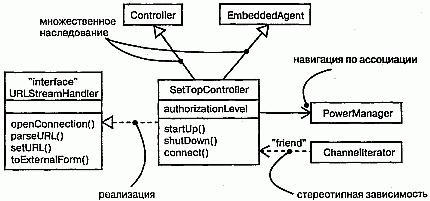
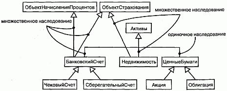
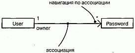
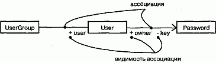
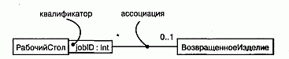
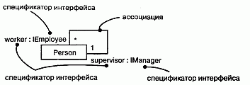
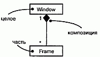
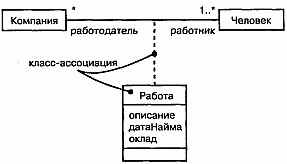
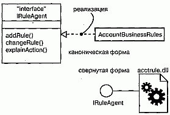
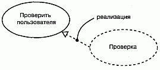

http://bourabai.kz/dbt/uml/ch10.htm

ЧАСТЬ III - Изучение структурного моделирования
# Глава 10. Углубленное изучение отношений
* Введение
* Термины и понятия
    * Зависимости
    * Обобщения
    * Ассоциации
    * Реализация
* Типичные приемы моделирования
    * Сети отношений
* Советы
    
Моделируя сущности, составляющие словарь системы, необходимо показать и отношения между ними. Эти отношения могут быть весьма сложными. Для визуализации, специфицирования, конструирования и документирования сетей отношений необходимо воспользоваться более развитыми возможностями UML.

Отношения зависимости, обобщения и ассоциации представляют собой три наиболее важных связующих строительных блока в UML. Они характеризуются рядом дополнительных свойств, помимо тех, что описаны в предыдущих разделах книги (см. главу 5) - в частности, позволяют моделировать множественное наследование, навигацию, композицию, уточнение и другие характеристики модели. Четвертый тип отношений - отношения реализации - нужен для моделирования связей между интерфейсом (см. главу 11) и классом или компонентом (см. главу 25), а также между прецедентом (см. главу 16) и кооперацией (см. главу 27). Язык UML дает возможность моделировать семантику отношений на любом уровне формализации.

При работе со сложным рядом отношений на каждом уровне детализации системы необходимо выбирать подходящие отношения, чтобы в итоге не создать чрезмерно усложненную или слишком упрощенную модель.

## Введение
Одной из наиболее ответственных задач при строительстве дома является определение взаимного расположения комнат. На одном из уровней абстракции вы можете решить, что главная спальня должна находиться на первом этаже, подальше от фасада дома. Затем, проигрывая в уме различные сценарии (см. главу 16), вы станете обдумывать плюсы и минусы такого расположения. Предположим, например, что требуется перенести в дом из гаража купленные в магазине продукты. Вряд ли стоит ходить из гаража на кухню через спальню, так что от принятого решения придется отказаться.

Вы можете составить довольно полную картину поэтажного плана, обдумывая подобные базовые отношения и варианты использования. Этого, однако, будет недостаточно. Чтобы избежать серьезных просчетов, придется рассмотреть и более сложные отношения.

Например, вас может устраивать расположение комнат на каждом этаже, но при этом комнаты, находящиеся на различных этажах, могут стыковаться совершенно непредсказуемым образом. Допустим, комната вашей дочери-подростка оказалась прямо над вашей спальней, и дочь вдруг решила научиться играть на барабане... Наверняка вы решите, что такой план дома следует отвергнуть.

Потребуется учитывать также системы жизнеобеспечения. В целях снижения затрат разумно было бы расположить комнаты так, чтобы системы отопления и вентиляции размещались в смежных стенах, распространяя свое действие сразу на несколько комнат.

Подобные проблемы возникают и при создании программного обеспечения. Зависимости, обобщения и ассоциации - это самые распространенные типы отношений, встречающиеся при моделировании программных систем. Однако вам придется освоить ряд достаточно сложных возможностей их использования, чтобы адекватно передать детали, необходимые для успешного завершения работы над проектом.

UML предоставляет разработчику довольно широкий простор для деятельности, как показывает рис. 10.1. Данная нотация позволяет визуализировать, специфицировать, конструировать и документировать комплекс отношений на любом желаемом уровне детализации. Ее возможностей вполне достаточно для поддержки прямого и обратного проектирования моделей и кода (см. главы 8, 14, 17-19, 24, 29 и 30).

#### Рис. 10.1 Различные типы отношений

## Термины и понятия
Отношением (Relationship) называется связь между сущностями. В объектно-ориентированном моделировании особое значение имеют четыре типа отношений: зависимости, обобщения, ассоциации и реализации. Отношения изображаются в виде линий различного начертания.

### Зависимости
Зависимостью (Dependency) называется отношение использования, определяющее, что изменение в спецификации одной сущности (например, класса SetTopController) может повлиять на другую сущность, которая ее использует (в данном случае - на класс ChannelIterator), причем обратное в общем случае неверно (см. главу 5). Графически зависимости изображают в виде пунктирной линии со стрелкой, направленной в сторону той сущности, от которой зависит еще одна. Применяйте зависимости, если хотите показать, что одна сущность использует другую.

Для большинства отношений использования вполне достаточно обычной зависимости без каких-либо дополнений. Но если необходимо передать некий смысловой нюанс, то стоит учесть, что в UML определен целый ряд стереотипов, применимых к зависимостям (о механизмах расширения UML см. главу 6). Всего существует 17 таких стереотипов, объединенных в шесть групп:

Прежде всего, это восемь стереотипов, применимых к отношениям зависимости между классами и объектами на диаграмме классов (см. главу 8).

* bind - определяет, что источник инстанцирует целевой шаблон с заданными фактическими параметрами. Этот стереотип используют при моделировании деталей шаблонов классов (см. главу 9). Например, отношения между шаблоном класса-контейнера и экземпляром этого класса моделируются как зависимость bind. Стереотип bind должен содержать список фактических аргументов, соответствующих формальным аргументам шаблона;
* derive - показывает, что источник может быть вычислен по целевому элементу. С помощью этого стереотипа моделируют отношения между двумя атрибутами (см. главу 4 и 9) или ассоциациями (см. главу 5), причем один из соотносимых элементов является конкретным, а другой - концептуальным. Скажем, класс Человек имеет атрибут Дата Рождения (конкретный) и атрибут Возраст (который может быть выведен из первого и потому не объявлен в классе отдельно). Отношения между ними можно определить с помощью зависимости типа derive, при этом Возраст будет производным от ДатаРождения;
* friend - указывает, что источнику даются специальные права видимости свойств цели (см. главу 5). Используйте этот стереотип для моделирования отношений, подобных отношениям между классом и его друзьями в языке C++;
* instanceOf - говорит, что исходный объект является экземпляром целевого классификатора;
* instantiate - показывает, что источник создает экземпляры целевого элемента.
* Последние два стереотипа позволяют явно моделировать отношения "класс/ объект" (см. главу 2). instanceOf применяется для моделирования отношения между классом и объектом на одной и той же диаграмме или же между классом и его метаклассом instantiate указывает, какой элемент создает объекты другого;
* powertype - означает, что все объекты целевого классификатора являются потомками заданного родителя. Этот стереотип применяется при моделировании классов, содержащих другие классы, например при проектировании баз данных, о чем идет речь в главах 8 (логические базы данных) и 29 (физические базы данных).
* refine - свидетельствует, что источник находится на более низком уровне абстракции, чем цель. Данный стереотип используется для моделирования концептуально одинаковых классов, рассматриваемых на различных уровнях абстракции. Так, класс Клиент, возникший на стадии анализа, будет уточнен в фазе проектирования, в результате чего появится более детальный класс Клиент вместе со своей реализацией;
* use - показывает, что семантика исходного элемента зависит от семантики открытой части целевого. Этот стереотип позволяет явно указать, что зависимость по своему типу принадлежит к отношениям использования, в отличие от отношений зависимости, обозначаемых другими стереотипами.

Следующая группа, состоящая из двух стереотипов, применяется для описания отношений зависимости между пакетами (см. главу 12):

* access - показывает, что исходный пакет имеет право ссылаться на элементы целевого пакета;
* import - вид доступа, определяющий, что открытое содержание целевого пакета входит в простое (неструктурированное) пространство имен источника, как если бы оно было там объявлено.

Стереотипы access и import применяются для моделирования отношений между пакетами. Элементы двух равноправных пакетов не могут ссылаться друг на друга, если между ними явно не определена зависимость типа access или import. Допустим, например, что целевой пакет Т содержит класс С. Если определить зависимость типа access от S к Т, то элементы S могут ссылаться на С, используя его полностью квалифицированное имя Т: : С. Если же от пакета S к Т определена зависимость типа import, то элементы S могут ссылаться на класс С, используя простые имена, то есть не квалифицируя имя целиком.

Два стереотипа применимы к отношениям зависимости между прецедентами (см. главу 16):

* extend - показывает, что целевой прецедент расширяет поведение исходного;
* include - говорит о том, что исходный прецедент явным образом включает в себя поведение целевого.

Эти стереотипы (совместно с простыми обобщениями) применяются, если надо разложить прецедент на части, допускающие многократное применение.

При моделировании взаимодействий между объектами (см. главу 15) используют следующие три стереотипа:

* become - сообщает, что целевой объект - тот же исходный, но в более поздний момент времени и, возможно, с другими значениями, состоянием или ролями;
* call - указывает, что исходная операция вызывает целевую;
* copy - говорит, что целевой объект является точной, но независимой копией исходного.

Стереотипы become и copy используются, чтобы показать роли, состояния или значения атрибутов одного объекта в различные моменты времени и в различных точках пространства (см. главу 23). Стереотип call применяется для моделирования вызывающих зависимостей между операциями.

В контексте автоматов (см. главу 21) применяют только один стереотип.

* send - определяет, что исходная операция посылает событие целевому объекту. Его используют для моделирования операций (например, входящей в состав действия, ассоциированного с изменением состояния), которые отправляют заданное событие целевому объекту (с ним, в свою очередь, может быть ассоциирован автомат). Фактически зависимости типа send позволяют связать вместе независимые автоматы.

Наконец, последний стереотип встречается в контексте организации элементов системы в подсистемы и модели (см. главу 31).

* trace - показывает, что целевой объект является историческим предшественником исходного. Его применяют при моделировании отношений между элементами различных моделей. Так, в контексте системной архитектуры (см. главу 2) прецедент из одноименного вида (представляющего функциональные требования) можно связать отношением трассировки с пакетом в виде с точки зрения проектирования (представляющем артефакты, которые реализуют этот прецедент).

> Примечание: Семантически все отношения, включая обобщения, ассоциации и реализации, являются разновидностями отношений зависимости. Но обобщения, ассоциации и реализации обладают семантикой, достаточно важной для того, чтобы рассматривать их как особые виды отношений. Между тем вышеперечисленные стереотипы, которые позволяют выразить семантические нюансы отношений зависимости, не настолько далеки от простого отношения зависимости, чтобы выделять какой-то из них в особый вид отношений. Опыт показывает, что подобный подход позволяет соблюсти баланс между возможностью подчеркнуть важные разновидности отношений и нежеланием смутить разработчика слишком большим числом вариантов выбора. Лучше всего, если вы начнете с моделирования обобщений, ассоциаций и реализаций, а все остальные отношения будете рассматривать Как вариации отношений зависимости.

### Обобщения
Обобщением называется отношение между общей сущностью, которую называют суперклассом или родителем, и более специализированной ее разновидностью, называемой подклассом или потомком (см. главу 5). Например, общий класс Window (Окно) можно специализировать, создав класс-потомок Mu1tiPaneWindow (МногоФорточноеОкно). Благодаря отношениям обобщения от потомка к родителю MultiPaneWindow унаследует структуру и поведение своего родителя - Window. У потомка могут появиться новые элементы структуры или поведения, а унаследованные - модифицироваться. В отношениях обобщения экземпляры потомка везде могут использоваться вместо экземпляров родителя, - это значит, что потомок может замещать родителя. Как правило, достаточно одиночного наследования, когда у класса имеется всего один родитель. Но иногда используют и множественное наследование, которое тоже можно моделировать на языке UML. Так, на рис. 10.2 показано множество классов, взятых из финансового приложения. Как видите, класс Активы имеет трех потомков: БанковскийСчет, Недвижимость и ЦенныеБумаги. У первого и последнего из них имеются собственные потомки. Например, Акция и Облигация являются потомками класса ЦенныеВумаги.

#### Рис. 10.2 Множественное наследование

Два класса (БанковскийСчет и Недвижимость) наследуют от нескольких родителей. Класс Недвижимость, например, является потомком классов Активы и ОбъектСтрахования, а класс БанковскийСчет - потомком классов Объ-ектНачисленияПроцентов, ОбъектСтрахования и Активы. Классы-родители (в данном случае ОбъектНачисленияПроцентов и ОбъектСтрахования) называются смешивающими (mixins), поскольку порождают потомков не самостоятельно, а совместно с другими классами (Активы).
Примечание: С множественным наследованием следует обращаться осторожно. Если структура или поведение нескольких предков перекрываются, у вас могут возникнуть проблемы. Как правило, множественное наследование можно заменить делегированием, когда потомок наследует только от одного родителя, а затем использует агрегирование для получения структуры и поведения от второстепенных предков. Недостатком такого подхода является потеря семантики замещаемости с второстепенными предками.
Для большинства отношений наследования, которые вам встретятся, будет достаточно простых отношений обобщения без каких-либо дополнений (механизмы расширения UML рассмотрены в главе 6). Но если вы хотите специфицировать смысловые нюансы, можно воспользоваться одним стереотипом и четырьмя ограничениями, определенными в языке UML для применения совместно с обобщениями (см. "Приложение В").

Во-первых, имеется один стереотип.

* implementation - показывает, что потомок наследует реализацию родителя, но не открывает и не поддерживает его интерфейсы, тем самым делая невозможным замещение. Этот стереотип можно использовать для моделирования закрытого наследования, поддерживаемого в языке C++.

Кроме стереотипа, к отношениям обобщения применимы четыре стандартных ограничения. Вот первая пара:
* complete - показывает, что в модели определены все потомки в данном отношении обобщения (хотя некоторые могут быть скрыты на диаграмме) и наличие дополнительных потомков не допускается;
* incomplete - показывает, что определены не все потомки в данном отношении (считая и тех, которые скрыты на диаграмме) и допускается включение дополнительных.

Если явно не оговорено противное, то можно считать, что на любой диаграмме показана лишь часть иерархии наследования, то есть некоторые ветви скрыты. Однако сокрытие ветвей не означает неполноту модели. Поэтому, если вы хотите явным образом показать, что полностью определили иерархию в модели (хотя и не показали ее целиком на диаграмме), применяйте ограничение complete. Равным образом с помощью ограничения incomplete можно явно показать, что вы не специфицировали иерархию наследования целиком (хотя на диаграмме показаны все элементы модели).

Вторая пара ограничений:

* disjoint - показывает, что объекты класса родителя могут иметь не более одного потомка на правах типа (см. главу H);
* overlapping - показывает, что объекты класса родителя могут иметь более одного потомка на правах типа.

Эти ограничения применимы только в контексте множественного наследования, если вы хотите различить статическую (disjoint) и динамическую (overlapping) классификации.

> Примечание: Чаще всего объект имеет один постоянный тип во время выполнения программы, - это называется статической классификацией. Если тип объекта может меняться, то имеет место динамическая классификация. Моделирование последней является непростой задачей, однако в UML можно использовать комбинацию множественного наследования с типами, чтобы показать потенциальные типы объекта, и взаимодействиями (см. главу 15),чтобы показать изменение типа объекта во время работы программы.

### Ассоциации
Ассоциацией (Association) называется структурное отношение, показывающее, что объекты одной сущности связаны с объектами другой (см. главу 5). Так, класс Библиотека может быть связан ассоциацией "один ко многим" с классом Книга, показывая, что все экземпляры второго принадлежат одному экземпляру первого. Если имеется объект класса Книга, можно всегда найти содержащую его Библиотеку, а зная Библиотеку, в ней можно осуществить навигацию ко всем Книгам. Графически ассоциация изображается в виде линии, связывающей класс сам с собой или с другими классами. Используйте ассоциации, если хотите показать структурные отношения.

К ассоциациям применимы четыре базовых дополнения: имя, роль и кратность на каждом конце и агрегирование. В распоряжении опытных пользователей имеется ряд других свойств для моделирования тонких деталей, например навигация, квалификация и различные виды агрегирования.

Навигация. С помощью простой, не содержащей дополнений ассоциации между двумя классами (скажем, Книга и Библиотека) можно осуществлять навигацию между их объектами. Если явно не оговорено противное, то навигация по ассоциации может осуществляться в обоих направлениях. Но бывают случаи, когда необходимо ограничить ее только одним направлением. Например, как показано на рис. 10.3, при моделировании сервисов операционной системы можно столкнуться с ассоциацией между объектами User (пользователь) и Password (пароль). Если дан объект класса User, то нужно уметь находить соответствующие объекты класса Password, но обратное недопустимо, то есть не должно быть возможности по паролю определить пользователя. Направление ассоциации можно выразить явно, дополнив ее стрелкой, указывающей на допустимое направление движения.

#### Рис. 10.3 Навигация

> Примечание: Если задано направление движения, это не обязательно означает, что вы никогда не сможете добраться от объектов на одном конце ассоциации к объектам на другом ее конце. Навигация описывает, скорее, эффективность перемещения. Так, в приведенном выше примере все-таки можно найти пользователя, зная его пароль, с помощью других ассоциаций, не показанных на этом рисунке. Возможность осуществлять навигацию в данном случае означает толькото, что до объектов на другом конце ассоциации можно добраться легко и быстро (как правило, потому, что в объекте-источнике хранятся ссылки на объекты-цели).

Видимость. При наличии ассоциации между классами объекты одного класса могут "видеть" объекты другого и осуществлять навигацию к ним, если это не запрещено явным указанием односторонней навигации. Но иногда бывает необходимо ограничить видимость объектов, связанных ассоциацией, для объектов, внешних по отношению к ней (открытый, защищенный и закрытый уровни видимости определены в главе 9). Например, как показано на рис. 10.4, между объектами UserGroup (группа пользователей) и User существует одна ассоциация, а другая - между объектами User и Password. Зная пользователя, можно найти его пароль, но эта информация принадлежит пользователю и не должна быть доступна извне (если, конечно, объект User явно не даст доступ к объекту Password, возможно посредством открытой операции). Поэтому, как явствует из рисунка, можно осуществлять навигацию от объекта UserGroup к входящим в нее объектам User и обратно, но из объекта UserGroup нельзя видеть объекты Password, принадлежащие отдельным объектам User.

#### Рис. 10.4 Видимость

В языке UML можно описать три уровня видимости для концевой точки ассоциации, подобно тому как это делается для классов. Для этого достаточно добавить символ видимости к ролевому имени. Если явно не оговорено противное, видимость роли устанавливается открытой. Закрытая видимость означает, что объекты на соответствующем конце недоступны для внешних по отношению к ассоциации объектов. Защищенная видимость показывает, что объекты на соответствующем конце недоступны внешним объектам, за исключением тех, что являются потомками объектов на противоположном конце ассоциации.

Квалификаторы. Одной из наиболее распространенных идиом в контексте ассоциаций является задача поиска. Как, зная объект на одном конце ассоциации, можно определить объект или группу объектов на другом ее конце? Рассмотрим для примера моделирование рабочего стола в мастерской, на котором сортируются возвращенные изделия, подлежащие ремонту. Как видно из рис. 10.5, для этого нужно смоделировать ассоциацию между классами РабочийСтол и Возвращен-ноеИзделие. Применительно к РабочемуСтолу определен jobID - идентификатор задания, связанный с каждым конкретным ВозвращеннымИзделием. В этом смысле jobID - атрибут ассоциации (см. главы 4 и 9). Он не является свойством объекта ВозвращенноеИзделие, поскольку изделия ничего не знают ни о ремонте, ни о заданиях. Если известен объект РабочийСтол и значение jobID, то можно осуществить навигацию к нулю или одному объекту ВозвращенноеИзделие. В языке UML эта идиома моделируется с помощью квалификатора, являющегося атрибутом ассоциации, значения которого разбивают множество объектов на подмножества, связанные с объектом на другом конце ассоциации. Квалифика-тор изображается в виде маленького прямоугольника, присоединенного к одной из концевых точек ассоциации, внутри которого располагаются атрибуты квалификатора (см. рис. 10.5). Объект-источник вместе со значениями атрибутов квалификатора порождает один целевой объект (если кратность цели не больше единицы) или множество таких объектов (если кратность больше единицы).

#### Рис. 10.5 Квалификатор

> Примечание: Семантика квалификаторов нетривиальна, и существует ряд сложных примеров их использования. Однако чаще всего ситуации, в которых нужны квалификаторы, довольно просты. Если на одном конце ассоциации вы можете поместить поисковую структуру данных (например, хэш-таблииу или В-дерево), то объявите индекс, по которому производится поиск, как Квалификатор. Обычно кратность на исходном конце будет "много", а на целевом - 0..1.

Спецификатор интерфейса. Интерфейсом называется набор операций, которые используются для спецификации услуг, предоставляемых классом или компонентом, причем один класс может реализовывать несколько интерфейсов (см. главу 11). Перечень всех реализуемых классом интерфейсов образует полную спецификацию поведения класса. Однако в контексте ассоциации с другим целевым классом исходный класс может не раскрывать все свои возможности. Так, в словаре системы управления человеческими ресурсами класс Person (Сотрудник) способен реализовывать несколько интерфейсов: IManager (Управляющий), lEmployee (Работник), IOfficer (Служащий) и т.д. Как видно из рис. 10.6, отношения между начальником и подчиненными можно моделировать с помощью ассоциации типа "один ко многим", явно пометив роли в ней (см. главу 4) как supervisor (контролер) и worker (рабочий). В контексте этой ассоциации объект класса Person в роли supervisor предоставляет объектам worker только интерфейс Imanager; он же в роли worker предоставляет объекту supervisor лишь интерфейс IEmployee. На рисунке показано, что можно явно описать тип роли с помощью синтаксиса rolename : iname, где iname - некоторый интерфейс другого классификатора (см. главу 9).

#### Рис. 10.6 Указание типов интерфейсов

Композиция. Агрегирование является простой концепцией с достаточно глубокой семантикой. Простое агрегирование - чисто концептуальное отношение, оно лишь позволяет отличить "целое" от "части" (см. главу 5), но не изменяет смысла навигации по ассоциации между целым и его частями и не накладывает никаких ограничений на соотношение времен жизни целого и частей.

Однако существует вариация простого агрегирования - композиция, которая добавляет к семантике агрегирования новые важные особенности (для моделирования композиции используются атрибуты, см. главы 4 и 9). Композицией называется форма агрегирования с четко выраженным отношением владения, причем время жизни частей и целого совпадают. Части с нефиксированной кратностью могут быть созданы уже после самого композита, но, будучи созданы, живут и умирают вместе с ним. Впрочем, части могут быть удалены явным образом еще до уничтожения композита.

Это означает, что в случае композитного агрегирования объект в любой момент времени может быть частью только одного композита. Например, в оконной системе класс Frame (Рама) принадлежит только одному классу Window (Окно), тогда как при простом агрегировании "часть" может принадлежать одновременно нескольким "целым". Скажем, в модели дома объект Стена может принадлежать нескольким объектам Комната.

Кроме того, в композитном агрегировании целое отвечает за диспозицию своих частей, то есть композит должен управлять их созданием и уничтожением. Например, создав объект Frame в системе окон, вы должны присоединить его к объемлющему окну. Когда объект Window удаляется, он в свою очередь должен уничтожить принадлежащие ему объекты Frame.

Как показано на рис. 10.7, композиция является просто частным случаем ассоциации и обозначается путем дополнения ассоциации закрашенным ромбом на конце со стороны "целого".

#### Рис. 10.7 Композиция

> Примечание: Композицию можно обозначить по-другому, включив символы частей внутрь символа композита. Эта форма особенно полезна, если вы хотите подчеркнуть отношения между частями, действительные только в контексте целого.

Классы-ассоциации. В ассоциации между двумя классами сама ассоциация также может иметь свойства. Например, в отношениях типа "работодатель/работник" между классами Компания и Человек имеется объект Работа, который описывает свойства отношения, применимые только к одной паре объектов Компания и Человек. Моделирование данной ситуации с помощью пары ассоциаций от Компании к Работе и от Работы к Человеку было бы неправильно, поскольку таким образом нельзя передать связь конкретного экземпляра объекта Работа с конкретной парой классов Компания и Человек.

На языке UML такая ситуация моделируется с помощью класса-ассоциации (Association class) - элемента, сочетающего в себе свойства как ассоциации, так и класса. Это означает, что класс-ассоциацию можно считать или ассоциацией, имеющей свойства класса, или классом со свойствами ассоциации. Изображают его в виде класса, соединенного пунктирной линией с ассоциацией, как показано на рис. 10.8.

#### Рис. 10.8 Классы-ассоциации

> Примечание: Иногда возникает необходимость определить одинаковые свойства у нескольких классов-ассоциаций. Однако непосредственно присоединить один такой класс-ассоциацию к нескольким различным ассоциациям нельзя, поскольку он сам является ассоциацией. Чтобы достичь желаемого результата, определите обычный класс (например, С), а затем сделайте каждый класс-ассоциацию, которому нужны определенные свойства, наследником С, или используйте С как тип атрибута.

Ограничения. Рассмотренных выше простых и более развитых свойств отношений ассоциации, как правило, бывает вполне достаточно. Однако на тот случай, если вы хотите специфицировать смысловые нюансы, в языке UML предусмотрено пять ограничений, применимых к отношениям ассоциации (механизмы расширения UML обсуждаются в главе 6, а определенные в UML стереотипы и ограничения - в "Приложении В").

Прежде всего, можно указать, является ассоциация реальной или концептуальной:

* Q implicit (неявный) - говорит о том, что данное отношение не показано явно (сделать вывод о его наличии можно только логическим путем), то есть является исключительно концептуальным. Например, если имеется ассоциация между двумя базовыми классами, то вы можете определить ту же самую ассоциацию и между их потомками (так как они наследуют отношения родительских классов). При этом данное отношение будет помечено словом implicit, поскольку оно не задано отдельно, а неявно вытекает из отношения, которое существует между родительскими классами.

Во-вторых, можно указать, упорядочены ли объекты на одном конце ассоциации (если ее кратность больше единицы):

* ordered (упорядоченный) - определяет, что объекты на одном конце ассоциации явным образом упорядочены. Например, в ассоциации User/Password связанные с пользователем (User) пароли (Password) могут храниться в порядке их использования; в этом случае они должны быть помечены ключевым словом ordered.

Наконец, три последних ограничения связаны с изменяемостью экземпляров ассоциации (перечисленные ниже характеристики изменяемости применимы также к атрибутам, см. главу 9):

* changeable (изменяемый) - показывает, что можно добавлять, удалять и изменять связи между объектами;
* addOnly (только добавляемый) - говорит, что от объекта на противоположном конце ассоциации можно добавлять новые связи (см. главу 15);
* frozen (замороженный) - означает, что связь, добавленная от объекта на противоположном конце ассоциации, не может быть впоследствии изменена или удалена.

> Примечание: Строго говоря, ordered, changeable, frozen и addOnly - это свойства концевой точки ассоциации. Однако изображаются они с помощью нотации ограничений.

### Реализация
Реализацией (Realization) называется семантическое отношение между классификаторами, при котором один из них описывает контракт, а другой гарантирует его выполнение. Изображается реализация в виде пунктирной линии с большой незакрашенной стрелкой, указывающей на классификатор, который определяет контракт.

Реализации настолько отличаются от зависимостей, обобщений и ассоциаций, что выделяются в отдельный тип отношений. Семантически реализация - это нечто среднее между обобщением и зависимостью, и нотация для нее несет в себе черты того и другого. Реализации употребляются в двух ситуациях - в контексте интерфейсов и в контексте коопераций.

Чаще всего реализации используют для определения отношений между интерфейсом и классом или компонентом, который предоставляет объявленные в интерфейсе операции или услуги. Интерфейс (см. главу 11) - это набор операций, которые применяются для специфицирования услуг, предоставляемых классом (см. главы 4 и 9) или компонентом (см. главу 25). Таким образом, интерфейс определяет обязательства, которые должен выполнять компонент или класс. Один интерфейс может реализовываться несколькими классами или компонентами, а с другой стороны, класс или компонент может реализовывать несколько интерфейсов. Пожалуй, самой главной особенностью интерфейсов является то, что они позволяют отделить спецификацию контракта (сам интерфейс) от их реализации (классом или компонентом). Кроме того, интерфейсы могут пересекать границу между логическими и физическими частями системной архитектуры. Например, как видно из рис. 10.9, класс в представлении системы с точки зрения проектирования (скажем, AccountBusinessRules в системе ввода заказов) может осуществлять реализацию интерфейса (IRuleAgent). Однако тот же самый интерфейс может быть реализован и компонентом (файлом acctrule.dll) вида системы с точки зрения реализации (пять различных видов системной архитектуры обсуждаются в главе 2). Обратите внимание, что реализацию можно графически показать двумя способами - в канонической форме (используя стереотип interface и пунктирную линию с большой незакрашенной стрелкой) и в свернутой (обозначая интерфейс кружочком).

#### Рис. 10.9 Реализация интерфейса

Реализацию можно использовать также для специфицирования отношений между прецедентом (см. главу 16) и реализующей его кооперацией (см. главу 27), как показано на рис. 10.10. В данном контексте почти всегда применяют каноническую форму записи.

#### Рис. 10.10 Реализация прецедента

> Примечание: Если класс или компонент реализуют интерфейс, это означает, что специфицированное интерфейсом поведение действительно будет обеспечено. Другими словами, такой класс или компонент реализует все операции интерфейса, отвечает на все посылаемые ему сигналы и во всем следует протоколу, установленному интерфейсом.

## Типичные приемы моделирования

### Сети отношений

Моделируя словарь сложной системы, приходится описывать десятки, если не сотни, различных классов, интерфейсов, компонентов, узлов и прецедентов. Определить четкие границы для всех этих абстракций весьма непросто. Установить мириады отношений между ними еще труднее; для этого требуется сбалансированно распределить обязанности в системе, причем конкретные абстракции должны быть логически непротиворечивы, а отношения точны и при этом слабо связаны (см. главу 4).

Для того чтобы спроектировать комплекс отношений в системе, необходимо следовать советам, приведенным ниже:

1. Не начинайте этот процесс в отрыве от остальных. Для выявления отношений между множествами абстракций используйте прецеденты (см. главу 16) и сценарии.
2. Начните с моделирования имеющихся структурных отношений. Они отражают статический вид системы и поэтому более просты в обращении.
3. Затем рассмотрите возможность использования отношений обобщения/специализации; не злоупотребляйте множественным наследованием.
4. Только после завершения предыдущих шагов поищите в системе зависимости; обычно они соответствуют более тонким формам семантических связей.
5. При проектировании каждого вида отношений старайтесь ограничиться основными формами; более сложные возможности используйте, только если это абсолютно необходимо для выражения ваших намерений.
6. Помните, что нет необходимости моделировать все существующие в системе отношения между множествами абстракций на одной-единственной диаграмме или в рамках одного вида. Лучше рассмотреть несколько архитектурных видов системы (см. главу 2) и показать интересующие вас отношения на различных диаграммах.

Залогом успешного моделирования сложной сети отношений является инкре-ментное выполнение этого процесса. Создавайте новые отношения по мере развития структуры системной архитектуры. Упрощайте их, если вам удается обнаружить возможности применения более общих механизмов. При выпуске каждой версии заново оценивайте отношения между ключевыми абстракциями системы. (Рассмотрение Рационального Унифицированного Процесса приводится в "Приложении С".)

## Советы
Моделируя в UML более сложные отношения, помните, что в вашем распоряжении находится широкий спектр строительных блоков, от простых ассоциаций до многообразных свойств навигации, квалификации, агрегирования и т.д. Старайтесь выбирать наиболее адекватный вашим целям тип и уровень детализации отношений. Хорошо структурированное отношение обладает следующими характеристиками:

* раскрывает только такие особенности, которые необходимы для использования отношения клиентом, и скрывает все остальные;
* однозначно отражает свое назначение и семантику;
* не слишком детализировано, чтобы не ограничивать свободу программиста, реализующего модель;
* не слишком упрощено, чтобы значение данного отношения не стало расплывчатым.

Изображая отношение в UML, руководствуйтесь следующими принципами:

* показывайте только такие его свойства, которые необходимы для понимания абстракции в соответствующем контексте;
* выбирайте подходящий стереотип, который лучше всего выражает назначение данного отношения.

