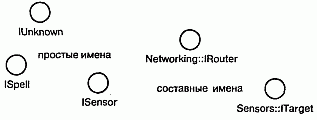
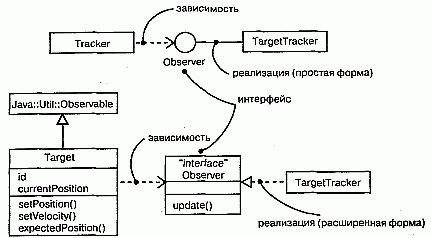
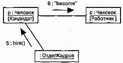

http://bourabai.kz/dbt/uml/ch11.htm

ЧАСТЬ III - Изучение структурного моделирования
# Глава 11. Интерфейсы, типы и роли
* Введение
* Термины и понятия
    * Имена
    * Операции
    * Отношения
    * Как разобраться в интерфейсе
    * Типы и роли
* Типичные приемы моделирования
    * Стыковочные узлы системы
    * Статические и динамические типы
* Советы

Интерфейс определяет границу между спецификацией того, что делает абстракция, и реализацией того, как она это делает. Интерфейс - это набор операций, используемых для специфицирования услуг, предоставляемых классом или компонентом.

Интерфейсы используются для визуализации, специфицирования, конструирования и документирования стыковочных узлов между составными частями системы. Типы и роли обеспечивают механизм моделирования статического и динамического соответствия абстракции интерфейсу в конкретном контексте.

Хорошо структурированный интерфейс предусматривает четкую границу между внешним и внутренним представлениями абстракции, делая возможным ее понимание и работу с ней без необходимости углубляться в детали реализации.

## Введение
Неразумно было бы проектировать дом так, что каждый раз, когда вы захотите перекрасить стены, придется перекладывать фундамент (см. главу 1). Наверняка вы будете недовольны, если для того, чтобы сменить лампочку, понадобится менять всю проводку в доме. Владелец небоскреба вряд ли придет в восторг при мысли о необходимости переставлять двери и заменять все телефонные и электрические розетки каждый раз, когда появляется новый арендатор.

Тысячелетний опыт строительства выработал рациональные приемы решения очевидных - а иногда и не столь очевидных - проблем, возникающих при возведении и реконструкции зданий. На языке программирования такие приемы называют четким разделением задач. Например, в хорошо спроектированном доме можно заменить или перестроить фасад, не затрагивая прочих частей здания. Мебель тоже можно переставить с места на место, не изменяя инфраструктуры. Системы, вмонтированные в стены здания (электричество, отопление, канализация), нельзя переделать, совсем не касаясь остального, но даже в этом случае не обязательно ломать весь дом.

Успехи строительной практики не ограничиваются возможностью совершенствовать дома после их постройки; существует множество стандартных интерфейсов, с помощью которых можно составлять здание из готовых компонентов. Например, имеются стандарты на размеры пиломатериалов, и это облегчает возведение стен, размеры которых кратны стандартным. Есть также стандарты на размеры окон и дверей, а значит, не требуется вручную делать все проемы в стенах. Существуют даже стандарты для электрических и телефонных розеток (хотя в разных странах они различны), что позволяет использовать электрооборудование от разных производителей.

При создании программного обеспечения важно строить системы с четким разделением задач, так чтобы при развитии системы изменения в одной ее части не затронули другие. Для достижения этой цели необходимо специфицировать стыковочные узлы системы, к которым присоединяются эти независимо изменяемые части. Кроме того, правильно подобрав интерфейсы, вы сможете использовать имеющиеся стандартные библиотеки, компоненты и каркасы (см. главу 28) для их реализации, не программируя все это самостоятельно. Обнаружив впоследствии лучшую реализацию, вы сможете заменить старую, не беспокоя пользователей.

В языке UML для моделирования стыковочных узлов в системе используются интерфейсы. Интерфейс - это набор операций, специфицирующих услуги, предоставляемые классом (см. главы 4 и 9) или компонентом (см. главу 25). Объявляя интерфейс, вы получаете возможность постулировать желаемое поведение абстракции, не зависящее от ее реализации. Клиенты будут спокойно полагаться на объявленный интерфейс, а вы в дальнейшем можете создать или купить любую его реализацию. Важно только, чтобы она выполняла обязательства, объявленные интерфейсом.

Почти все современные языки программирования, в том числе Java и CORBA IDL, поддерживают концепцию интерфейсов. Интерфейсы важны не только для отделения спецификации от реализации класса или компонента, но и для внешнего описания пакета (см. главу 12) или подсистемы (см. главу 31) в случае увеличения размеров системы.

Графическое представление интерфейсов в языке UML показано на рис. 11.1. Такая нотация позволяет раздельно визуализировать описание абстракции и ее реализацию.

#### Рис. 11.1 Интерфейсы

## Термины и понятия
Интерфейсом (Interface) называется набор операций, используемый для специфицирования услуг, предоставляемых классом или компонентом. Типом (Туре) называют стереотип класса, используемый для определения области значений объектов вместе с применимыми к ним операциями (но не методами). Роль (Role) -это поведение сущности в данном контексте. Графически интерфейс изображается в виде кружочка; в развернутой форме его можно представить как стереотипный класс, чтобы раскрыть операции и другие свойства.

> Примечание: С помощью интерфейсов можно также специфицировать контракт, который обязуется выполнять прецедент (см. главу 16) или подсистема (см. главу 31).

### Имена
У любого интерфейса должно быть имя, отличающее его от остальных. Имя интерфейса представляет собой текстовую строку. Взятое само по себе, оно называется простым. Составное имя образуется путем добавления в его начало имени пакета, в который входит данный интерфейс. Имя интерфейса должно быть уникальным внутри объемлющего пакета (см. главу 12). При изображении интерфейса можно ограничиться только его именем, как показано на рис. 11.2.

#### Рис. 11.2 Простые и составные имена

> Примечание: Имя интерфейса может состоять из любого числа букв, цифр и некоторых знаков препинания (за исключением таких, как двоеточия, которые применяются для отделения имени интерфейса от имени объемлющего пакета). Имя может занимать несколько строк. Обычно для именования интерфейсов используют одно или несколько коротких существительных, взятых из словаря моделируемой системы. Чтобы отличить интерфейс от класса, принято добавлять к его имени начальную букву I, например IUnknown или ISpelling. Те же правила применяются и к типам. Чтобы отличить тип от интерфейса или класса, принято начинать его имя с буквы Т, например TNatural или TCharacter.

### Операции
Как уже отмечалось выше, интерфейс - это именованный набор операций (см. главы 4 и 9) для специфицирования сервиса, предоставляемого классом или компонентом. В отличие от классов и типов, интерфейсы не описывают структуры (поэтому не могут содержать атрибуты) и реализации (а значит, не содержат реализующих рперации методов). Как и класс, интерфейс может включать любое число операций, которые могут быть дополнены свойствами видимости, параллельности, стереотипами, помеченными значениями и ограничениями (см. главу 6).

Изображая интерфейс в виде кружочка, вы по определению подавляете показ этих операций. Однако, если это необходимо для понимания модели, можно изобразить интерфейс как стереотипный класс, перечислив операции в соответствующем разделе. При этом можно показывать только имя операции или же предоставить развернутое описание с сигнатурой и другими свойствами, как показано на рис. 11.3.

#### Рис. 11.3 Операции

> Примечание: С интерфейсом можно ассоциировать и сигналы (см. главу 20).

### Отношения
Подобно классам, интерфейсы могут принимать участие в отношениях обобщения, ассоциации и зависимости (см. главы 5 и 10). Кроме того, для них определено еще и отношение реализации, представляющее собой семантическое отношение между двумя классификаторами, один из которых определяет ряд обязательств (контракт), а другой обеспечивает их выполнение.

Интерфейс специфицирует контракт класса или компонента, но не накладывает никаких ограничений на реализацию. Класс или компонент могут реализовывать несколько интерфейсов. При этом они обязуются выполнить все свои контракты, то есть должны содержать методы, корректно реализующие объявленные интерфейсом операции. Точно так же класс или компонент может зависеть от нескольких интерфейсов. При этом он ожидает, что объявленные контракты будут выполнены каким-то набором реализующих их компонентов. Именно поэтому говорят, что интерфейс представляет собой стыковочный узел в системе. Он определяет условия контракта, после чего обе стороны - клиент и поставщик - могут действовать независимо друг от друга, полностью полагаясь на взаимные обязательства.

Как видно из рис. 11.4, связь интерфейса с реализующим его элементом можно графически представить двумя способами. Во-первых, существует простая форма: отношения между интерфейсом и его реализацией изображаются кружочком с одной стороны класса или компонента. Этот способ удобен, когда требуется показать стыковочные узлы системы. Однако операции и сигналы, предоставляемые интерфейсом, таким способом визуализировать нельзя. Во-вторых, можно воспользоваться расширенной формой, когда интерфейс представляют в виде стереотипного класса и связывают отношением реализации с классификатором или компонентом. При этом разрешается показать его операции и другие свойства. В UML отношение реализации изображают в виде пунктирной линии с большой незакрашенной стрелкой, направленной в сторону интерфейса. В этой нотации суммируются обобщение и зависимость.

#### Рис. 11.4 Визуализация интерфейса

В обоих случаях класс или компонент, использующий интерфейс, соединяют с ним отношением зависимости.

> Примечание: Интерфейсы напоминают абстрактные классы (см. главу 4), в частности потому, что ни у тех, ни у других нет непосредственных экземпляров. Но все же между ними имеется достаточно различий, чтобы считать их отдельными элементами моделирования. У абстрактного класса могут быть атрибуты, а у интерфейса - нет. Кроме того, интерфейсы пересекают границы модели. Например, один и тот же интерфейс может быть реализован как классом (логическая абстракция), так и компонентом (физическая абстракция, материализующая класс, - см. главу 25).

### Как разобраться в интерфейсе
Создав новый интерфейс, вы первым делом смотрите на набор операций, определяющих сервис класса или компонента. Если заглянуть поглубже, то станут видны полные сигнатуры этих операций, а также их специальные свойства (см. главу 9): видимость, область действия и семантика одновременности (см. главу 23).

Несмотря на важность этих свойств, их недостаточно для понимания семантики сервиса, предоставляемого сложными интерфейсами, не говоря уже о правильном использовании этих операций. При отсутствии другого источника информации для решения этой задачи приходится углубляться в реализующую интерфейс абстракцию, чтобы понять, для чего конкретно предназначена каждая операция и как они взаимодействуют между собой. Это, однако, противоречит назначению интерфейса, который должен обеспечивать четкое разделение задач в системе.

На языке UML вы можете связать с интерфейсом значительно больше информации, чтобы сделать его понятнее. Прежде всего, можно описать предусловия и постусловия для каждой операции, а также инварианты для класса или компонента в целом (см. главу 9). Таким образом, клиент сумеет понять, что и как делает интерфейс, без необходимости изучать его реализацию. Если вы хотите формально описать семантику, воспользуйтесь языком ОСL (см. главу 6). Кроме того, к интерфейсу можно присоединить автомат (см. главу 21) и использовать его для специфицирования корректной частичной упорядоченности операций. Наконец, с ним допустимо связать кооперации (см. главу 27), описывающие ожидаемое поведение интерфейса с помощью последовательности диаграмм взаимодействия.

### Типы и роли
Класс может реализовывать несколько интерфейсов. Любой экземпляр данного класса должен поддерживать их все, так как интерфейс определяет условия контракта, и все соответствующие ему абстракции обязаны соблюдать эти условия. Тем не менее в конкретном контексте экземпляр может предоставлять только те интерфейсы, которые соответствуют ситуации. Это означает, что каждый интерфейс определяет роль, которую играет объект. Роль, таким образом, - это именованное поведение некоторой сущности в конкретном контексте, или, иными словами, - лицо, которым абстракция обращена к миру. (Роли принимают участие также в кооперациях - см. главу 27.)

Рассмотрим, например, экземпляр класса Человек. В зависимости от контекста экземпляр этого класса может играть роль Матери, Налогоплательщика, Работника, Покупателя, Менеджера, Летчика, Певца и т.д. Следовательно, объект предъявляет миру ту или иную "личину", и взаимодействующие с ним клиенты ожидают от него соответствующего поведения. Например, экземпляр класса Человек в роли Менеджера обладает не таким набором свойств, какой был бы у него в роли Матери.

На языке UML роль, которую одна абстракция играет по отношению к другой, можно описать, дополнив соответствующую концевую точку ассоциации (см. главы 5 и 10) именем интерфейса. Например, на рис. 11.5 показан интерфейс Работник, определение которого включает три операции. Между классами Человек и Компания существует ассоциация, в контексте которой Человек играет роль е, относящуюся к типу Работник. В другой ассоциации этот класс может быть "обращен к миру иным лицом". При наличии явного типа роль, которую играет Человек, - это не просто слово, понятное для читателя, изучающего диаграмму. В UML это означает, что класс Человек играет для класса Компания роль Работника, и в данном контексте для Компании будут видимы и существенны только свойства, определенные данной ролью.

#### Рис. 11.5 Роли

Диаграмма классов (см. главу 8), подобная приведенной выше, полезна для моделирования статического связывания абстракции с ее интерфейсом. Динамическое связывание абстракции с интерфейсом моделируют с помощью стереотипа become (см. главу 13) на диаграмме взаимодействия, отражающей смену ролей объекта.

Для формального моделирования семантики абстракции и ее соответствия некоторому интерфейсу применяется предопределенный стереотип type. Это стереотип класса; с его помощью определяют область действия объектов совместно с операциями (но не методами), применимыми к объектам этого типа. Концепция типа тесно связана с концепцией интерфейса, только описание типа может содержать атрибуты, а описание интерфейса - нет. Если надо показать, что некоторая абстракция статически типизирована, используйте стереотип implementationClass, который специфицирует класс со статически типизированными экземплярами (класс Человек из рассмотренного примера не относится к их числу) и определяет физическую структуру данных и методы объекта так, как это делается в традиционных языках программирования.

> Примечание: В большинстве случаев понятия "тип" и "интерфейс" взаимозаменяемы

## Типичные приемы моделирования

### Стыковочные узлы системы

Чаще всего с помощью интерфейсов моделируют стыковочные узлы в системе, состоящей из таких программных компонентов (см. главу 25), как СОМ+ или JavaBeans. Некоторые компоненты вы создаете сами с нуля, остальные покупаете или заимствуете из других систем (см. главу 31). В любом случае придется написать некоторый код для "склеивания" этих компонентов, ввиду чего необходимо понимать, какие интерфейсы реализуются и потребляются каждым из них.

Идентификация стыковочных узлов в системе предполагает наличие четких линий демаркации в ее архитектуре. По одну сторону от такой линии находятся компоненты, которые могут изменяться независимо от компонентов с другой стороны, при условии, что обе стороны выполняют контракт, объявленный интерфейсом.

Взяв готовый компонент из другой системы или купив его, вы, скорее всего, получите набор операций и минимальную документацию о назначении каждой из них. Это полезно, но еще не достаточно. Гораздо важнее понять, в каком порядке должны вызываться операции и каковы внутренние механизмы, воплощенные в интерфейсе. К сожалению, если компонент плохо документирован, вам придется самому методом проб и ошибок строить концептуальную модель работы его интерфейса. Затем можно задокументировать то, что вы обнаружили, путем моделирования данного стыковочного узла с помощью интерфейсов UML, - так, чтобы впоследствии вам и другим людям было проще работать с этим компонентом. Разрабатывая собственный компонент, вы должны отслеживать его контекст, то есть специфицировать интерфейсы, на наличие которых он рассчитывает для выполнения своей работы, а также интерфейсы, представляемые им самим для использования в других компонентах.

> Примечание: Большинство компонентных систем, таких как СОМ+ или Enterprise JavaBeans, предоставляют возможность интроспекции, то есть программного запроса у интерфейса информации о его операциях. Это первый шаг к пониманию природы недостаточно документированного компонента.

Моделирование стыковочных узлов системы производится следующим образом (подробнее моделирование поведения рассматривается в частях 4 и 5):

1. Изобразив набор классов и компонентов системы, проведите линии, отделяющие друг от друга группы тесно связанных классов и компонентов.
2. Уточните выбранное разделение с учетом изменяемости системы. Совместно изменяемые классы или компоненты должны быть сгруппированы в отдельные кооперации (см. главу 27).
3. Изучите операции и сигналы, которые пересекают определенные вами границы.
4. Объедините логически связанные наборы операций и сигналов, оформив их как интерфейсы.
5. Для каждой обнаруженной в системе кооперации идентифицируйте интерфейсы, на которые она полагается в своей работе (импортирует) и те, которые она предоставляет другим (экспортирует). Импорт интерфейсов моделируется с помощью отношений зависимости, а экспорт - с помощью отношений реализации.
6. Документируйте динамику интерфейсов с помощью предусловий и постусловий для каждой операции, а также прецедентов и автоматов для интерфейса в целом.

Например, на рис. 11.6 изображены стыковочные узлы для библиотеки ledger. dll - компонента, взятого из финансовой системы. Этот компонент реализует три интерфейса - lUnknown, ILedger и IReports. На диаграмме первый из них показан в расширенной форме, а остальные два - в сокращенной. Все три интерфейса реализуются компонентом ledger.dll и экспортируются в другие компоненты, которые используют их в своей работе

#### Рис. 11.6 Моделирование стыковочных узлов системы

Как видно из диаграммы, компонент ledger.dll импортирует два интерфейса, IStreaming и ITransaction, причем последний показан в расширенной форме. Оба они нужны компоненту ledger.dll для корректной работы. Следовательно, в работающую систему вы должны будете включить также и реализующие их компоненты. Выделив интерфейс, например ITransaction, вы тем самым разъединили находящиеся по разные стороны от него компоненты. А это значит, что вы можете использовать любой компонент, лишь бы он соответствовал спецификации интерфейса.

Такие интерфейсы, как ITransaction, - это не просто совокупность операций. Данный интерфейс содержит определенные предположения о том, в каком порядке должны вызываться операции. Хотя на диаграмме это не показано, можно было бы присоединить к интерфейсу прецедент (см. главу 16) и перечислить типичные способы применения интерфейса.

### Большинство объектно-ориентированных языков программирования являются статически типизированными. Другими словами, тип связывается с объектом в момент создания последнего (подробнее об экземплярах см. главу 13). И все же объект будет, вероятно, играть различные роли в разные моменты времени. Это означает, что использующие объект клиенты взаимодействуют с ним посредством различных наборов интерфейсов, которые описывают представляющие интерес и, возможно, перекрывающиеся множества операций.

Модель статических характеристик объекта может быть визуализирована в виде диаграммы классов (см. главу 8). Однако при моделировании таких сущностей, как бизнес-объекты, чьи роли естественно изменяются по ходу работы, бывает полезно явным образом промоделировать динамическую природу типа таких объектов. В этих условиях объект во время своей жизни может приобретать и утрачивать типы.

Моделирование динамического типа состоит из следующих шагов:

1. Определите возможные типы объекта, показав каждый из них в виде класса со стереотипом type (если от абстракции требуется структура и поведение) или interface (если требуется только поведение).
2. Смоделируйте все роли класса объекта в любой возможный момент време ни. Это делается двумя способами:

    * во-первых, на диаграмме классов явно прописывается каждая роль, которую данный класс играет в ассоциациях с другими классами (см. главы 5 и 10). Тем самым определяется лицо, которое класс имеет в контексте ассоци ированного с ним объекта;
    * во-вторых, на диаграмме классов с помощью обобщений специфицируют ся отношения "класс-тип".

4. На диаграмме взаимодействий (см. главу 18) изобразите каждый экземпляр динамически типизированного класса. Роль экземпляра нужно указать в скоб ках ниже имени объекта.
2. Чтобы показать смену ролей объекта, изобразите объект по одному разу для каждой роли, которую он играет во взаимодействии, и соедините эти объек ты сообщением со стереотипом become.
3. В качестве примера на рис. 11.7 показаны роли, которые класс Человек может играть в контексте системы управления человеческими ресурсами.

#### Рис. 11.7 Моделирование статических типов

Из этой диаграммы явствует, что экземпляры класса Человек могут относиться к одному из трех типов - Кандидат, Работник и Пенсионер.

Динамическая природа типа Человека изображена на рис. 11.8. В этом фрагменте диаграммы взаимодействия объект p (Человек) меняет роль с Кандидата на Работника.

#### Рис. 11.8 Моделирование динамических типов

### Советы
Моделируя интерфейс на языке UML, помните, что он должен описывать некоторый стыковочный узел системы, отделяя спецификацию от реализации. Хорошо структурированный интерфейс характеризуется следующими свойствами:

* одновременно обладает простотой и завершенностью, то есть содержит все операции, необходимые и достаточные для специфицирования конкретного сервиса;
* понятен, то есть содержит информацию, достаточную для его применения, и не требует для этого обращения к его реализации и примерам использования;
* содержит информацию, достаточную для понимания пользователем основных свойств, но не перегружен сведениями, касающимися деталей всех операций.

Изображая интерфейс на языке UML, руководствуйтесь приведенными ниже правилами:

* используйте сокращенную нотацию, если надо просто показать наличие стыковочного узла в системе. Чаще всего она применяется при работе с компонентами, а не с классами;
* расширенную форму применяйте в случае, если надо визуализировать детали самого сервиса. Чаще всего это нужно делать при специфицировании стыковочных узлов в системе, содержащей пакеты или подсистемы.

