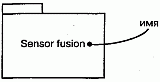
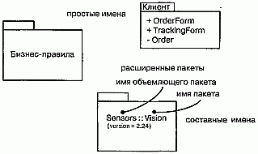
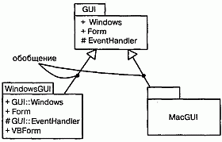
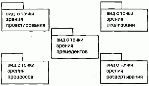

http://bourabai.kz/dbt/uml/ch12.htm

ЧАСТЬ III - Изучение структурного моделирования
# Глава 12. Пакеты
* Введение
* Термины и понятия
    * Имена
    * Элементы, принадлежащие пакету
    * Видимость
    * Импорт и экспорт
    * Обобщения
    * Стандартные элементы
* Типичные приемы моделирования
    * Группы элементов
    * Архитектурные виды
* Советы

Визуализация, специфицирование, конструирование и документирование больших систем предполагает работу с потенциально большим количеством классов, интерфейсов, узлов, компонентов, диаграмм и других элементов. Масштабируя такие системы, вы столкнетесь с необходимостью организовывать эти сущности в более крупные блоки. В языке UML для организации моделирующих элементов в группы применяют пакеты (Packages).

Пакет - это способ организации элементов модели в более крупные блоки, которыми впоследствии позволяется манипулировать как единым целым. Можно управлять видимостью входящих в пакет сущностей, так что некоторые будут видимы извне, а другие - нет. Кроме того, с помощью пакетов можно представлять различные виды архитектуры системы.

Хорошо спроектированный пакет группирует семантически близкие элементы, которые имеют тенденцию изменяться совместно. Таким образом, хорошо структурированные пакеты слабо связаны и обладают четко выраженной семантикой, причем доступ к содержимому пакета извне строго контролируется.

## Введение
Устройство собачьей конуры не представляет из себя ничего сложного: четыре стены, лаз для собаки в одной из них и крыша. При изготовлении конуры нужно всего лишь несколько досок - конструкция не требует большего.

Жилые дома устроены сложнее (см. главу 1). Стены, потолки и полы соединяются между собой, образуя более крупные абстракции, которые мы называем комнатами. Комнаты организованы в еще более крупные блоки - жилая зона, зона досуга и т.д. Такие блоки физически могут быть и не материализованы в конструкции дома. Это всего лишь имена, которые мы даем логически связанным друг с другом комнатам, чтобы удобнее было говорить о предполагаемом использовании домашнего пространства.

Небоскребы устроены еще сложнее. Там вы найдете не только простейшие конструкции вроде стен, полов или потолков, но и более крупные образования - места, открытые для общего доступа, сдаваемые в аренду квартиры и офисы. Эти образования, вероятно, сгруппированы в еще более крупные, такие как арендуемая площадь и инфраструктура обслуживания здания. Разумеется, они не имеют ничего общего с самим зданием, а являются лишь артефактами, которые мы применяли при планировании небоскреба.

Каждая большая система состоит из нескольких подобных слоев. По-настоящему понять ее можно, только если объединить входящие в нее абстракции в более крупные группы. Большинство блоков среднего размера (например, комнаты) сами по себе являются абстракциями, похожими на классы, и у них бывает много экземпляров. Крупные блоки обычно чисто умозрительны (например, часть здания для продажи), и у них не бывает экземпляров. Они не реализуются на физическом уровне; их единственная цель - облегчить понимание системы. Такого рода блоки не будут представлены в развернутой системе - они существуют лишь на уровне модели.

В языке UML организующие модель блоки называют пакетами. Пакет является универсальным механизмом организации элементов в группы, благодаря которому понимание модели упрощается. Пакеты позволяют также контролировать доступ к своему содержимому, что облегчает работу со стыковочными узлами в архитектуре системы (о системной архитектуре и ее моделировании рассказано в главах 2 и 31).

Графическое представление пакетов в языке UML показано на рис. 12.1. Такая нотация позволяет визуализировать группы элементов, с которыми можно обращаться как с единым целым, контролируя при этом видимость и возможность доступа к отдельным элементам.

#### Рис. 12.1 Пакеты

## Термины и понятия
Пакет (Package) представляет собой общий механизм организации элементов в группы. Его изображают в виде папки с закладкой.

### Имена

У каждого пакета должно быть имя, отличающее его от других пакетов. Имя -это текстовая строка. Взятое само по себе, оно называется простым. К составному имени спереди добавлено имя объемлющего его пакета, если таковой существует. Имя пакета должно быть уникальным в объемлющем пакете. Обычно при изображении компонента указывают только его имя, как показано на рис. 12.2. Но, как и в случае с классами, вы можете дополнять пакеты помеченными значениями или дополнительными разделами, чтобы показать детали.

#### Рис. 12.2 Простой и расширенный пакеты

> Примечание: Имя пакета может состоять из любого числа букв, цифр и некоторых знаков препинания (за исключением таких, как двоеточия, которые применяются для отделения имени пакета от имени объемлющего пакета). Оно может занимать несколько строк. Обычно для именования пакетов используют одно или несколько коротких существительных, взятых из словаря модели.

### Элементы, принадлежащие пакету
Пакет может владеть другими элементами, в том числе классами, интерфейсами, компонентами, узлами, кооперациями, диаграммами и даже прочими пакетами. Владение - это композитное отношение (см. главу 10), означающее, что элемент объявлен внутри пакета. Если пакет удаляется, то уничтожается и принадлежащий ему элемент. Элемент может принадлежать только одному пакету.

Пакет определяет свое пространство имен; это значит, что элементы одного вида должны иметь имена, уникальные в контексте объемлющего пакета. Например, в одном пакете не может быть двух классов Queue, но может быть один класс Queue в пакете Р1, а другой - в пакете Р2. Р1: : Queue и Р2 : : Queue имеют разные составные имена и поэтому являются различными классами.

Элементы различного вида могут иметь одинаковые имена в пределах пакета. Так, допустимо наличие класса Timer и компонента Timer. Однако на практике, во избежание недоразумений, лучше всем элементам давать уникальные имена в пакете.

Пакету могут принадлежать другие пакеты, а значит, позволительно осуществить иерархическую декомпозицию модели. Например, может существовать класс Camera, принадлежащий пакету Vision, который, в свою очередь, содержится в пакете Sensors. Составное имя этого класса будет Sensors: : Vis ion: : Camera. Лучше, однако, избегать слишком глубокой вложенности пакетов - два-три уровня являются пределом. В случае необходимости для организации пакетов стоит использовать импортирование (см. ниже), а не вложенность.

Описанная семантика владения или принадлежности делает пакеты важным механизмом масштабирования системы. Без них пришлось бы создавать большие плоские модели, все элементы которой должны иметь уникальные имена. Такие конструкции были бы совершенно неуправляемы, особенно если входящие в модель классы и другие элементы созданы различными коллективами. Пакеты позволяют контролировать элементы системы, даже если они разрабатываются в разном темпе.

Как показывает рис. 12.3, содержание пакета можно представить графически или в текстовом виде. Обратите внимание, что если вы изображаете принадлежащие пакету элементы, то имя пакета пишется внутри закладки. Впрочем, содержимое пакета обычно не показывают таким образом, а применяют имеющиеся инструментальные средства, позволяющие раскрыть пакет и просмотреть его содержимое.

#### Рис. 12.3 Элементы, принадлежащие пакету

> Примечание: Язык UML подразумевает наличие в любой модели анонимного корневого пакета, а значит, все элементы одного и того же вида на верхнем уровне пакета должны иметь уникальные имена.

### Видимость
Видимость (см. главу 9) принадлежащих пакету элементов можно контролировать точно так же, как видимость атрибутов и операций класса. По умолчанию такие элементы являются открытыми, то есть видимы для всех элементов, содержащихся в любом пакете, импортирующем данный. Защищенные элементы видимы только для потомков, а закрытые вообще невидимы вне своего пакета. Например, на рис. 12.3 OrderForm (БланкЗаказа) - это открытая часть пакета С1ient(Клиент), a Order (Заказ) - закрытая. Любой пакет, импортирующий данный, может "видеть" объект OrderForm, но не "видит" Order. При этом составное имя для OrderForm будет Client: : OrderForm.

Видимость принадлежащих пакету элементов обозначается с помощью символа видимости перед именем этого элемента. Для открытых элементов используется символ + (плюс), как и в случае с OrderForm. Все открытые части пакета составляют его интерфейс.

Аналогично классам для имен защищенных элементов используют символ # (диез), а для закрытых добавляют символ - (минус). Напомним, что защищенные элементы будут видны только для пакетов, наследующих данному (см. далее), а закрытые вообще не видны вне пакета, в котором объявлены.

> Примечание: Пакеты, связанные с некоторым пакетом отношениями зависимости со стереотипом friend (см. главу 10), могут "видеть" все элементы данного пакета, независимо от объявленной для них видимости.

### Импорт и экспорт
Предположим, у вас есть два класса одного уровня А и В, расположенных рядом друг с другом. А может "видеть" В и наоборот, то есть любой из них может зависеть от другого. Два таких класса составляют стандартную систему, и для них не надо задавать никаких пакетов.

Допустим теперь, что у вас имеется несколько сотен равноправных классов. Размер "паутины" отношений, которую вы можете соткать между ними, не поддается воображению. Более того, столь огромную неорганизованную группу классов просто невозможно воспринять в ее целостности. Описанная ситуация порождает реальную проблему больших систем: простой неограниченный доступ не позволяет осуществить масштабирование. В таких случаях для организации абстракций приходится применять пакеты.

Итак, допустим, что класс А расположен в одном пакете, а класс В - в другом, причем оба пакета равноправны. Допустим также, что как А, так и В объявлены открытыми частями в своих пакетах. Эта ситуация коренным образом отличается от двух предыдущих. Хотя оба класса объявлены открытыми, свободный доступ одного из них к другому невозможен, ибо границы пакетов непрозрачны. Однако если пакет, содержащий класс А, импортирует пакет-владелец класса в, то А сможет "видеть" В, хотя В по-прежнему не будет "видеть" А. Импорт дает элементам одного пакета односторонний доступ к элементам другого. На языке UML отношения импорта моделируют как зависимости (см. главу 5), дополненные стереотипом import (о механизмах расширения UML см. главу 6). Упаковывая абстракции в семантически осмысленные блоки и контролируя доступ к ним с помощью импорта, вы можете управлять сложностью систем, насчитывающих множество абстракций.

> Примечание: Фактически в рассмотренной ситуации применяются два стереотипа - import и access, - и оба они показывают, что исходный пакет имеет доступ к элементам целевого. Стереотип import добавляет содержимое целевого пакета в пространство имен исходного. Таким образом, возникает вероятность конфликта имен, которой необходимо избегать, если вы хотите, чтобы модель была хорошо оформлена. Стереотип access не изменяет пространство имен цели, поэтому содержащиеся в исходном пакете имена необходимо квалифицировать. Чаще используют стереотип import.

Открытые элементы пакета называются экспортируемыми. Так, на рис. 12.4 пакет GUI экспортирует два класса - Windows и Form. Класс EventHandler является защищенной частью пакета. Довольно часто экспортируемыми элементами пакета оказываются интерфейсы (см. главу H).

#### Рис. 12.4 Импорт и экспорт

Экспортируемые элементы будут видны только тем пакетам, которые явно импортируют данный. В примере на рис. 12.4 пакет Policies импортирует GUI. Таким образом, классы GUI: : Window и GUI: : Form будут из него видны. Но класс GUI: : EventHandler виден не будет, так как является защищенным. С другой стороны, пакет Server не импортирует GUI, и потому элементы Server не имеют права доступа к элементам GUI. По той же причине у GUI нет доступа к содержимому пакета Server.

Зависимости импорта и доступа не являются транзитивными. В данном примере пакет Client импортирует Policies, a Policies - GUI, однако это не значит, что Client импортирует GUI. Таким образом, доступ из пакета Client к экспортируемым частям пакета Policies разрешен, а к экспортируемым частям пакета GUI - нет. Чтобы получить такой доступ, надо явно указать, что Client импортирует GUI.

> Примечание: Элемент, видимый внутри пакета, будет видим также и внутри всех вложенных в него пакетов. Вообще, вложенные пакеты могут "видеть"- все, что "видит" объемлющий их пакет.

### Обобщения
Между пакетами определены два типа отношений: зависимости импорта и доступа, применяемые для импорта в пакет элементов, экспортируемых другим пакетом, и обобщения (см. главы 5 и 10), используемые для специфицирования семейств пакетов.

Отношения обобщения между пакетами очень похожи на отношения обобщения между классами. Например, как видно из рис. 12.5, пакет GUI содержит два экспортируемых класса (Windows и Form) и один защищенный (EventHandler). Существуют две специализации пакета GUI а именно: WindowsGUI и MacGUI. Они наследуют открытые и защищенные элементы своего родителя. Как и в случае с классами, пакеты могут замещать наследуемые элементы или добавлять новые. Например, пакет WindowsGUI содержит классы GUI: : Windows и GUI: : Event-Handler. Кроме того, в нем переписан класс Form и добавлен новый класс VBForm. Участвующие в обобщении пакеты следуют тому же принципу подстановки, что и классы. Специализированные пакеты (такие, как WindowsGUI) могут использоваться всюду, где допустимо использование их родителей (наподобие GUI).

#### Рис. 12.5 Отношения обобщения между пакетами

К пакетам применимы все механизмы расширения UML (см. главу 6). Чаще всего используют помеченные значения для определения новых свойств (например, указания имени автора) и стереотипы для определения новых видов пакетов (например, пакетов, инкапсулирующих сервисы операционных систем).

В языке UML определены пять стандартных стереотипов (см. "Приложение В"), применимых к пакетам:

* facade (фасад) - определяет пакет, являющийся всего лишь представлением какого-то другого пакета;
* framework (каркас) - определяет пакет, состоящий в основном из образцов (паттернов - см. главу 28);
* stub (стаб, заглушка) - определяет пакет, служащий заместителем открытого содержимого другого пакета;
* subsystem (подсистема) - определяет пакет, представляющий независимую часть моделируемой системы (см. главу 31);
* system (система) - определяет пакет, представляющий всю моделируемую систему.
* языке UML не определены пиктограммы для этих стереотипов. Помимо них применяется еще стереотип import, которым помечают отношения зависимости (см. главы 5 и 10) между пакетами, один из которых импортирует другой.

Практически все эти стандартные элементы рассматриваются в других местах книги. Здесь мы коснемся только стереотипов facade и stub. Оба они предназначены для работы с очень большими моделями. Стереотип facade используется для показа свернутого представления сложного пакета. Предположим, что ваша система содержит пакет BusinessModel. Некоторым пользователям вы захотите показать одно подмножество его элементов (например, только те, что связаны с клиентами), другим - другое (связанное с продуктами). С этой целью определяют фасады, которые импортируют только подмножества элементов другого пакета (но никогда не владеют ими). Стереотип stub используют, если в вашем распоряжении имеются инструменты, расщепляющие систему на пакеты для последующей работы с ними в разное время и в разных местах. Например, если есть две группы разработчиков, работающие в двух разных офисах, то первая из них может создать стабы (Stubs) для пакетов, необходимых другой группе. Такая стратегия позволяет командам работать независимо и не мешать друг другу, причем пакеты-стабы будут описывать стыковочные узлы системы, требующие особенно тщательной проработки.

## Типичные приемы моделирования

### Группы элементов

Чаще всего пакеты применяют для организации элементов моделирования в именованные группы, с которыми затем можно будет работать как с единым целым. Создавая простое приложение, можно вообще обойтись без пакетов, поскольку все ваши абстракции прекрасно разместятся в единственном пакете. В более сложных системах вы вскоре обнаружите, что многие классы, компоненты, узлы, интерфейсы и даже диаграммы естественным образом разделяются на группы. Эти группы и моделируют в виде пакетов.

Между классами и пакетами есть одно значительное различие: классы являются абстракцией сущностей из предметной области или области решения, а пакеты - это механизмы организации таких сущностей в модели. Пакеты не имеют "индивидуальности" (то есть нельзя создать экземпляры пакетов, поэтому в работающей системе они невидимы); классы же можно индивидуализировать (у них есть экземпляры, которые являются элементами работающей системы). Системы и подсистемы, во многом подобные пакетам, отличаются от них тем, что имеют "индивидуальность", как и классы (см. главу 31).

Чаще всего с помощью пакетов элементы одинаковых типов организуют в группы. Например, классы и их отношения в представлении системы с точки зрения проектирования (см. главу 2) можно разбить на несколько пакетов и контролировать доступ к ним с помощью зависимостей импорта. Компоненты вида системы с точки зрения реализации допустимо организовать таким же образом.

Пакеты также применяются для группирования элементов различных типов. Например, если система создается несколькими коллективами разработчиков, расположенными в разных местах, то пакеты можно использовать для управления конфигурацией, размещая в них все классы и диаграммы, так чтобы члены разных коллективов могли независимо извлекать их из хранилища и помещать обратно. На практике пакеты часто применяют для группирования элементов моделирования и ассоциированных с ними диаграмм.

Моделирование группы элементов производится так:

1. Просмотрите моделирующие элементы в некотором представлении архитек туры системы с целью поиска групп семантически или концептуально близ ких элементов.
2. Поместите каждую такую группу в пакет.
3. Для каждого пакета определите, какие элементы должны быть доступны извне. Пометьте их как открытые, а остальные - как защищенные или за крытые. Если сомневаетесь, скройте элемент.
4. Явно соедините пакеты отношениями импорта с теми пакетами, от которых они зависят.
5. Если имеются в наличии семейства пакетов, соедините специализированные пакеты с общими отношениями обобщения.

В качестве примера на рис. 12.6 показаны пакеты, которые организуют в классическую трехуровневую архитектуру классы, являющиеся частями представления информационной системы с точки зрения проектирования. Элементы пакета Сервисы Пользователя предоставляют визуальный интерфейс для ввода и вывода информации. Элементы пакета Сервисы Данных обеспечивают доступ к данным и их обновление. Пакет Бизнес-Сервисы является связующим звеном между элементами первых двух пакетов; он охватывает все классы и другие элементы, отвечающие за выполнение бизнес-задачи, - в том числе бизнес-правила, которые диктуют стратегию манипулирования данными в ответ на запросы пользователя.

#### Рис. 12.6 Моделирование групп элементов

Как уже упоминалось, все абстракции простой системы можно поместить в один пакет. Однако, организуя классы и другие элементы представления системы с точки зрения проектирования в три пакета, вы не только сделаете модель более понятной, но и сможете контролировать доступ к ее элементам, скрывая одни и экспортируя другие.

> Примечание: Изображая подобные модели, обычно показывают элементы, центральные для каждого пакета. Чтобы прояснить назначение пакета, можно также раскрыть помеченные значения, содержащие документацию (см. главу 6).

### Архитектурные виды
Использование пакетов для группирования родственных элементов является весьма важным - без него нельзя разработать сложную модель. Этот подход применим к организации таких элементов, как классы, интерфейсы, компоненты, узлы и диаграммы. Но при рассмотрении архитектурных видов программных систем возникает потребность в еще более крупных блоках. Архитектурные виды тоже можно моделировать с помощью пакетов.

Напомним, что видом или представлением называется проекция организации и структуры системы, в которой внимание акцентируется на одном из конкретных аспектов этой системы (пять видов системной архитектуры описаны в главе 2, а их связь с моделями - в главе 31). Из этого определения вытекают два следствия. Во-первых, систему можно разложить на почти ортогональные пакеты, каждый из которых имеет дело с набором архитектурно значимых решений (например, можно создать виды с точки зрения проектирования, процессов, реализации, развертывания и прецедентов). Во-вторых, этим пакетам будут принадлежать все абстракции, относящиеся к данному виду. Так, все компоненты модели принадлежат пакету, который представляет вид системы с точки зрения реализации.

> Примечание: Пакеты как виды отличаются от фасадов. Виду принадлежат его элементы, а фасад лишь ссылается на элементы, входящие в состав других пакетов. Элемент может принадлежать только одному пакету, хотя ссылаться на него можно из нескольких фасадов.

Моделирование архитектурных видов осуществляется следующим образом:

1. Определите, какие виды важны для решения вашей проблемы. Обычно это виды с точки зрения проектирования, процессов, реализации, развертыва ния и прецедентов.
2. Поместите в соответствующие пакеты элементы и диаграммы, необходимые и достаточные для визуализации, специфицирования, конструирования, документирования семантики каждого вида.
3. При необходимости сгруппируйте элементы каждого вида в более мелкие пакеты.
4. Между элементами из различных видов, скорее всего, будут существовать отношения зависимости, поэтому в общем случае стоит открыть все виды на верхнем уровне системы для всех остальных видов того же уровня.

В качестве примера на рис. 12.7 показана каноническая декомпозиция верхнего уровня, пригодная даже для самых сложных систем (см. главу 31).

#### Рис. 12.7 Моделирование архитектурных видов

## Советы
Моделируя пакеты в UML, помните, что они нужны только для организации элементов вашей модели. Если имеются абстракции, непосредственно материализуемые как объект в системе, не пользуйтесь пакетами. Вместо этого применяйте такие элементы моделирования, как классы или компоненты. Хорошо структурированный пакет характеризуется следующими свойствами:

* он внутренне согласован и очерчивает четкую границу вокруг группы родственных элементов;
* он слабо связан и экспортирует в другие пакеты только те элементы, которые они действительно должны "видеть", а импортирует лишь элементы, которые необходимы и достаточны для того, чтобы его собственные элементы могли работать;
* глубина вложенности пакета невелика, поскольку человек не способен воспринимать слишком глубоко вложенные структуры;
* владея сбалансированным набором элементов, пакет по отношению к другим пакетам в системе не должен быть ни слишком большим (если надо, расщепляйте его на более мелкие), ни слишком маленьким (объединяйте элементы, которыми можно манипулировать как единым целым).

Изображая пакет в UML, руководствуйтесь следующими принципами:

* применяйте простую форму пиктограммы пакета, если не требуется явно раскрыть его содержимое;
* раскрывая содержимое пакета, показывайте только те элементы, которые абсолютно необходимы для понимания его назначения в данном контексте;
* моделируя с помощью пакетов сущности, относящиеся к управлению конфигурацией, раскрывайте значения меток, связанных с номерами версий.

