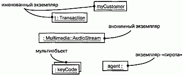
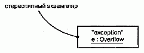
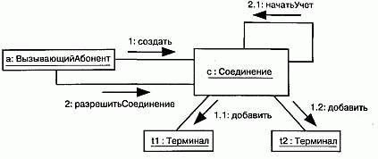

http://bourabai.kz/dbt/uml/ch13.htm

 ЧАСТЬ III - Изучение структурного моделирования
# Глава 13. Экземпляры
* Введение
* Термины и понятия
    * Абстракции и экземпляры
    * Имена
    * Операции
    * Состояние
    * Другие особенности
    * Стандартные элементы
* Типичные приемы моделирования
    * Конкретные экземпляры
    * Экземпляры-прототипы
* Советы

Термины "экземпляр" и "объект" в большинстве случаев являются синонимами и часто бывают взаимозаменяемы. Экземпляром называется конкретная материализация абстракции, к которой может быть применен определенный набор операций и которая обладает состоянием для сохранения результатов этих операций. Экземпляры используют для моделирования конкретных сущностей реального мира, или прототипов. Почти все строительные блоки UML вовлечены в дихотомию "класс/объект". Например, бывают прецеденты и экземпляры прецедентов, узлы и экземпляры узлов, ассоциации и экземпляры ассоциаций и т.д.

## Введение
Предположим, вы строите дом для своей семьи. Используя слово "дом", а не "автомобиль" или какое-нибудь другое понятие, вы заранее сужаете словарь, применяемый при решении задачи. Дом является абстракцией "постоянного или временного жилища, цель которого - предоставить убежище". Напротив, автомобиль -это "мобильное самодвижущееся устройство, предназначенное для перевозки людей с места на место". В ходе работы, состоящей в соединении различных, зачастую противоречивых требований, абстракция дома постепенно уточняется. Например, вы можете выбрать "дом с тремя спальнями и подвалом" - словом, какую-либо частную разновидность.

Получив ключи от готового дома и войдя внутрь, вы погружаетесь в конкретную обстановку - оцениваете здание не просто как дом с тремя спальнями, а как "мой дом с тремя спальнями, расположенный по такому-то адресу". Если вы по характеру сентиментальны, то можете даже дать ему какое-нибудь имя, например "Святой приют".

Между "домом с трем спальнями" и "моим домом с тремя спальнями, именуемым Святой приют" существует фундаментальное различие. Первый - это только абстракция, описывающая определенный тип дома с различными свойствами, в то время как второй представляет собой конкретный экземпляр этой абстракции, существующий в реальном мире, и каждое его свойство имеет теперь реальное значение.

Абстракция описывает идеальную суть предмета, экземпляр - его конкретную материализацию. Такое разделение на абстракцию и экземпляр обнаружится во всем, что вы моделируете. У одной абстракции может быть сколько угодно экземпляров. Для данного экземпляра всегда существует абстракция, определяющая характеристики, общие для всех подобных экземпляров.

В языке UML можно представлять как абстракции, так и их экземпляры. Почти все строительные блоки этого языка, в особенности классы (см. главы 4 и 9), компоненты (см. главу 29), узлы (см. главу 26) и прецеденты (см. главу 16), могут быть промоделированы в терминах своей сущности или своей материализации. По большей части вы будете работать с ними как с абстракциями, но если захотите промоделировать конкретные реализации или прототипы, то придется иметь дело с экземплярами.

Графическое представление экземпляров показано на рис. 13.1. Эта нотация позволяет визуализировать именованные, равно как и анонимные экземпляры.

#### Рис. 13.1 Экземпляры

## Термины и понятия
Экземпляром (Instance) называется конкретная материализация абстракции, к которой могут быть применены операции и которая может сохранять их результаты. Понятия "экземпляр" и "объект" практически синонимичны (дихотомия "класс/ объект" описана в главе 2). Экземпляр изображают с подчеркнутым именем.

> Примечание: Обычно объектом называют конкретную материализацию класса. Объекты - это экземпляры классов; можно сказать, что все объекты являются экземплярами, но не все экземпляры - объектами. Например, экземпляр ассоциации (см. главы 5 и 10) не является объектом; это просто экземпляр, также называемый связью (см. главы 14 и 15). Впрочем, лишь самые дотошные создатели моделей обращают внимание на такие нюансы терминологии.

### Абстракции и экземпляры
Экземпляры не существуют сами по себе: они всегда связаны с абстракциями. На языке UML чаще всего моделируют экземпляры классов (называемые объектами), хотя бывают также экземпляры и других сущностей, таких как компоненты, узлы, прецеденты и ассоциации. В UML экземпляр легко отличить от абстракции - для этого надо просто подчеркнуть его имя.

Объект в общем случае занимает некоторое место в реальном или концептуальном мире, и им можно тем или иным способом манипулировать. Например, экземпляром узла обычно является компьютер, физически расположенный в некоем помещении; экземпляром компонента - файл, размещенный в том или ином каталоге; экземпляр записи о клиенте занимает какой-то объем в оперативной памяти компьютера. Экземпляр траектории полета самолета тоже являет собой нечто конкретное, поддающееся обработке математическими методами.

С помощью UML допустимо моделировать не только непосредственные физические экземпляры, но и менее конкретные сущности. Например, абстрактный класс по определению не может иметь непосредственных экземпляров (см. главу 9). Разрешается, однако, моделировать косвенные экземпляры абстрактных классов, чтобы показать, как данный класс можно использовать в качестве прототипа. Строго говоря, такого объекта не существует, но с практической точки зрения он позволяет поименовать любой потенциальный экземпляр конкретного потомка этого абстрактного класса. То же самое относится и к интерфейсам (см. главу 11). Хотя они по определению не могут иметь непосредственных экземпляров, можно смоделировать экземпляр-прототип интерфейса, который будет представлять один из потенциальных экземпляров конкретных классов, реализующих этот интерфейс.

Моделируемые экземпляры помещают в диаграммы объектов (см. главу 14), если надо показать их структурные детали, или в диаграммы взаимодействия (см. главу 18) и деятельности (см. главу 19), если нужно визуализировать их участие в динамических ситуациях. Хотя обычно это не требуется, их можно включать и в диаграммы классов, если надо явно показать отношения объекта и его абстракции.

Классификатор экземпляра обычно статичен (см. главу 9). Например, если вы создадите экземпляр класса, то сам класс не будет изменяться в течение жизни объекта. Но при моделировании некоторых ситуаций, а также в некоторых языках программирования, есть возможность изменить абстракцию экземпляра. И тогда объект Гусеница способен стать объектом Бабочка (динамические типы рассматриваются в главе 11). Это один и тот же объект, но реализующий различные абстракции.

#### Рис. 13.2 Экземпляры - именованные, анонимные, множественные и "сироты"

> Примечание: В процессе разработки могут возникнуть экземпляры, не связанные ни с каким классификатором и изображаемые как объекты с отсутствующими именами абстракций (см. рис. 13.2). Такие объекты-сироты" можно вводить при моделировании очень неопределенного поведения, хотя в конце концов их все равно нужно будет связать с некоей абстракцией, если вы хотите приписать объекту определенную семантику.

### Имена
Каждый экземпляр должен обладать именем, отличающим его в данном контексте от остальных экземпляров. Обычно объект существует в контексте операции (см. главы 4 и 9), компонента (см. главу 25) или узла (см. главу 26). Имя - это текстовая строка, например t или myCustomer на рис. 13.2. Взятое само по себе, оно называется простым именем. Абстракция экземпляра может иметь как простое имя (скажем, Transaction), так и составное (Multimedia: :AudioStream). Составное имя образуется, если к имени абстракции спереди добавить имя пакета, в котором она находится.

Объект можно именовать явно, давая ему настоящее имя (например, t), которое будет использоваться человеком. Можно дать ему простое имя (например, aCustomer) и скрыть его абстракцию, если она очевидна из контекста. Однако зачастую настоящее имя объекта известно только компьютеру, который с ним работает. В таких случаях появляется анонимный объект (например, : Multimedia: :AudioStream). Каждое появление анонимного объекта считается отличным от всех других его появлений. Если вы не знаете связанную с объектом абстракцию, то должны дать ему явное имя (например, agent :).

Работая с большими коллекциями объектов, неудобно каждый раз изображать коллекцию как сумму индивидуальных экземпляров. На рис. 13.2 показан альтернативный способ - моделирование мультиобъектов (таких, как : keyCode), которые представляют коллекцию анонимных объектов. Для обозначения типа коллекции, представленной мультиобъектом, можно использовать стереотипы (см. главу 6).

> Примечание: Имя экземпляра может состоять из любого числа буке, цифр и некоторых знаков препинания (за исключением таких, как двоеточие, которые применяются для отделения имени экземпляра от имени его абстракции). Имя может занимать несколько строк. На практике для именования экземпляров используют одно или несколько - коротких существительных, взятых из словаря моделируемой системы. При этом каждое слово, кроме первого, пишется обычно с заглавной буквы (например, t или myCustomer).

### Операции
Объект не только занимает место в реальном мире, им можно также манипулировать. Операции (см. главы 4 и 9), выполняемые над объектом, объявляются в его абстракции. Например, если класс Transaction содержит операцию commit и у него имеется экземпляр t : Transaction, то можно написать выражение t.commit (). Его выполнение означает, что над объектом t осуществляется операция commit. В зависимости от связанной с этим классом иерархии наследования данная операция может быть вызвана полиморфно (см. главу 9).

### Состояние
Состоянием объекта называется совокупность всех его свойств (обычно статических) и их текущих значений (обычно динамических). В число свойств входят атрибуты объекта (см. главу 4), а также всех его агрегированных частей. Таким образом, состояние объекта динамично, и при его визуализации вы фактически описываете значение его состояния в данный момент времени и в данной точке пространства. Процесс изменения состояния объекта можно изобразить графически, если на одной и той же диаграмме взаимодействия (см. главу 18) нарисовать его несколько раз, причем на каждом рисунке будет отражено новое состояние. Другой способ показать этот процесс дает использование автоматов (см. главу 21).

Совершая над объектом операцию, вы изменяете его состояние, однако при опросе объекта состояние не меняется. Например, резервируя билет на самолет (объект r : Reservation), вы определяете значение одного из его атрибутов (например, цена билета = 395.75). Изменив впоследствии условия резервирования, скажем, добавив к маршруту еще одну пересадку, вы тем самым изменяете и его состояние (например, цена билета становится равной 1024.86).

На рис. 13.3 показано, как можно с помощью языка UML изображать значения атрибутов объектов. Так, значение атрибута id объекта myCustomer равно "432-89-1783". В данном случае тип идентификатора (номер социального страхования) показан явно, хотя его можно и опустить (как это сделано для атрибута active = True), поскольку тип содержится в объявлении id в ассоциированном классе объекта myCustomer.

#### Рис. 13.3 Состояния объекта

С классом можно ассоциировать также автомат, что особенно полезно при моделировании управляемых событиями систем или жизненного цикла класса. В таких случаях можно показать состояние автомата для данного объекта в данный момент времени. Например, на рис. 13.3 показано, что объект с (экземпляр класса Phone) находится в состоянии WaitingForAnswer (ЖдетОтвета), определенном в автомате для класса Phone.

> Примечание: Так как объект может одновременно находиться в нескольких состояниях, вы вправе показать весь список текущих состояний.

### Другие особенности
Поскольку процессы и нити (см. главу 22) являются важными составными частями вида системы с точки зрения процессов, в UML имеется графический образ для различения активных и пассивных элементов (элемент считается активным, если он является частью процесса или нити и представляет собой исходную точку потока управления). Вы можете объявить активные классы, материализующие процесс или нить, и, соотвественно, выделить экземпляр активного класса (см. рис. 13.4).

#### Рис. 13.4 Активные объекты

> Примечание: Чаще всего активные объекты применяются в контексте диаграмм взаимодействия (см. главу 18), моделирующих множественные потоки управления. Каждый активный объект представляет исходную точку потока управления и может использоваться для именования различных потоков.

Кроме объектов, в UML существует еще две сущности, у которых могут быть экземпляры. Первая - это связь (Link), представляющая собой семантическое соединение между объектами (см. главы 14 и 15). Связь, таким образом, является экземпляром ассоциации. Связь, как и ассоциация, изображается в виде линии; от ассоциации ее можно отличить по тому, что она соединяет только объекты. Второй важный случай - атрибуты и операции, область действия которых ограничена классом (см. главу 9). Свойство с областью действия класса - это, по сути дела, объект в этом классе, совместно используемый всеми его экземплярами.?

### Стандартные элементы
Все механизмы расширения языка UML (см. главу 6) применимы к объектам. Тем не менее экземплярам обычно не приписывают стереотип непосредственно и не связывают с ними помеченных значений. Вместо этого стереотипы и помеченные значения объекта выводятся из ассоциированных с ним абстракций. В качестве примера на рис. 13.5 показано, как можно явно приписать стереотип самому объекту или его абстракции.

#### Рис. 13.5 Стереотипные объекты

В UML определено два стандартных стереотипа (см. "Приложение В"), применимых к отношениям зависимости между объектами и классами.

* instanceOf - показывает, что объект-клиент является экземпляром классификатора-поставщика;
* instantiate - показывает, что класс-клиент создает экземпляры классификатора-поставщика.

Существует также два относящихся к объектам стереотипа, применимых к сообщениям и переходам между состояниями (см. главу 18):

* become - говорит, что объект-клиент - это тот же объект, что и поставщик, но в более поздний момент времени и, возможно, имеющий другие значения, состояния или роли;
* copy - показывает, что объект-клиент является точной, но независимой копией поставщика.

Кроме стереотипов, в UML определено одно стандартное ограничение, применимое к объектам:

* transient - показывает, что во время выполнения взаимодействия (см. главу 15) создается экземпляр роли, который уничтожается перед завершением выполнения.

## Типичные приемы моделирования

### Конкретные экземпляры

Моделируя конкретные экземпляры, вы визуализируете сущности, принадлежащие реальному миру. Конечно, вы не сможете увидеть экземпляр класса Клиент, если этот клиент не стоит перед вами, но в отладчике вы можете увидеть представление этого объекта.

Одна из сфер применения объектов - моделирование конкретных экземпляров, существующих в реальном мире. Например, моделируя топологию сети вашей организации, вы пользуетесь диаграммами развертывания (см. главу 30), содержащими экземпляры узлов. Аналогично, если вы хотите моделировать компоненты, расположенные в физических узлах этой сети, то будете пользоваться диаграммами компонентов (см. главу 29), которые содержат их экземпляры. Наконец, если к вашей работающей системе подключен отладчик, вы сможете представить структурные отношения между экземплярами с помощью диаграммы объектов (см. главу 14).

Моделирование конкретных экземпляров осуществляется так:

1. Идентифицируйте экземпляры, необходимые и достаточные для визуализа ции, специфицирования, конструирования или документирования модели руемой задачи.
2. Изобразите эти объекты как экземпляры с помощью UML. Если можно, дай те каждому из них собственное имя. Если для объекта не существует осмыс ленного имени, изобразите его как анонимный объект.
3. Выявите для каждого экземпляра стереотипы, помеченные значения и атри буты (вместе с их значениями), необходимые и достаточные для моделиро вания задачи.
4. Изобразите эти экземпляры и отношения между ними на диаграмме объек тов или на другой диаграмме, соответствующей виду экземпляра.

В качестве примера на рис. 13.6 показана диаграмма объектов, взятая из системы проверки подлинности кредитных карточек. Такой ее можно увидеть в отладчике, тестирующем работающее приложение. На рисунке показан один мульти-объект, содержащий анонимные экземпляры класса Transact ion. Присутствуют также два явно поименованных объекта - primaryAgent и current, в описании которых показан класс, хотя и по-разному. На диаграмме явно показано и текущее состояние объекта primaryAgent.

#### Рис. 13.6 Моделирование конкретных экземпляров

Обратите внимание на использование зависимости со стереотипом instanceOf, указывающей на класс primaryAgent. Обычно такие отношения "класс/объект" показывают явным образом, только если собираются показать и отношения с другими классами.

### Экземпляры-прототипы
Одним из наиболее важных применений экземпляров является моделирование динамических взаимодействий (см. главу 18) между объектами. При этом вы, как правило, не моделируете конкретные экземпляры, существующие в реальном мире. Вместо этого моделируются концептуальные объекты-заместители настоящих объектов, которые будут действовать в реальном мире. Такие заместители называются объектами-прототипами и фактически являются ролями, с которыми согласуются конкретные экземпляры. Например, для моделирования способов реагирования объектов оконного приложения на события, связанные с мышью, нужно нарисовать диаграмму взаимодействий, содержащую экземпляры-прототипы окон, событий и обработчиков.

> Примечание: Семантическое различие между конкретными объектами и объекта -ми-прототипами незначительно и имеет смысл только для очень опытных разработчиков. Скорее всего, вы никогда не почувствуете этой разницы. Однако, чтобы быть точными, отметим, что в UML используется термин "роль классификатора" для обозначения роли, с которой согласуется экземпляр. Здесь имеется тонкое контекстно-зависимое различие. Конкретные объекты появляются в статических местах, например в диаграммах объектов, компонентов и применения. В отличие от них объекты-прототипы появляются в таких местах, как диаграммы взаимодействия и действий.

Моделирование экземпляров-прототипов осуществляется следующим образом:

1. Идентифицируйте те экземпляры-прототипы, которые необходимы и доста точны для визуализации, специфицирования, конструирования или доку ментирования моделируемой задачи.
2. Изобразите их с помощью UML как экземпляры. По возможности дайте им имена. Если для объекта не существует осмысленного имени, изобразите его как анонимный объект.
3. Выявите для каждого экземпляра свойства, необходимые и достаточные для моделирования задачи.
4. Изобразите эти экземпляры и отношения между ними на диаграмме взаи модействий (см. главу 15) или на диаграмме деятельности (см. главу 19)
.
На рис. 13.7 показана диаграмма взаимодействий, иллюстрирующая частичный сценарий инициирования телефонного звонка с точки зрения коммутатора. На ней показаны четыре объекта-прототипа: а (ВызывающийАбонент), с (Соединение), tl и t2 (оба являются экземплярами класса Терминал). Все четыре объекта - прототипы, и каждый из них служит концептуальным заместителем для конкретных объектов, которые могут существовать в реальном мире.

#### Рис. 13.7 Моделирование экземпляров-прототипов

> Примечание: Это пример кооперации, так как в нем представлено сообщество ролей и других элементов, которые, работая совместно, определяют некоторое кооперативное поведение, большее, нежели сумма составляющих элементов. Кооперации характеризуются двумя аспектами: структурным (представляя роли и отношения классификаторов) и динамическим (представляя взаимодействие между экземплярами-прототипами).

## Советы
Моделируя экземпляры на языке UML, помните, что каждый из них должен обозначать конкретную материализацию некоторой абстракции (обычно - класса, компонента, узла, прецедента или ассоциации). Хорошо структурированный экземпляр обладает следующими свойствами:

* явно ассоциирован с конкретной абстракцией;
* имеет уникальное имя, взятое из словаря предметной области или области решения.

Изображая экземпляры в UML, руководствуйтесь следующими принципами:

* всегда показывайте имя абстракции, которой принадлежит экземпляр, если это не очевидно из контекста;
* показывайте стереотип, роль или состояние экземпляра, только если это необходимо для понимания объекта в данном контексте. В таких случаях организуйте длинные списки атрибутов экземпляра, группируя их вместе с их значениями в соответствии с категориями.

