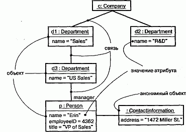
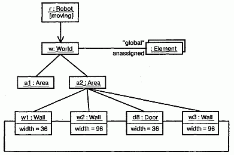

http://bourabai.kz/dbt/uml/ch14.htm

ЧАСТЬ III - Изучение структурного моделирования
# Глава 14. Диаграммы объектов
* Введение
* Термины и понятия
    * Общие свойства
    * Содержание
    * Типичные примеры применения
* Типичные приемы моделирования
    * Объектные структуры
    * Прямое и обратное проектирование
* Советы

Диаграммы объектов позволяют моделировать экземпляры сущностей, которые содержатся в диаграммах классов. На диаграмме объектов показано множество объектов и отношений между ними в некоторый момент времени.

Диаграммы объектов применяют при моделировании статических видов системы с точки зрения проектирования и процессов. При этом моделируется "снимок" системы в данный момент времени и изображается множество объектов, их состояний и отношений между ними.

Диаграммы объектов важны не только для визуализации, специфицирования и документирования структурных моделей, но и для конструирования статических аспектов системы с помощью прямого и обратного проектирования.

## Введение
Для человека, не знакомого с правилами игры, футбол может показаться чрезвычайно простым видом спорта - толпа народа беспорядочно бегает по полю, преследуя белый мяч. Глядя на размытые изображения движущихся тел, вряд ли можно будет различить в этом какой-либо порядок или оценить утонченность игры.

Если остановить игру и классифицировать отдельных игроков, получится совсем другая картина. В общей массе вы сможете различить нападающих, защитников и полузащитников. Копните чуть глубже, и вы поймете, как они взаимодействуют, следуя определенной стратегии, направленной на то, чтобы забить гол: ведут мяч по полю, отбирают его друг у друга и атакуют. В опытной команде вы никогда не найдете игроков, беспорядочно и бесцельно перемещающихся по полю. Напротив, в любой момент времени расположение игроков и их взаимодействия точно рассчитаны.

То же самое верно и в применении к процессу визуализации, специфицирования, конструирования и документирования программных систем. Стараясь проследить за потоком управления в работающей системе, вы быстро потеряете общее представление о том, как организованы ее составляющие части, особенно если имеется несколько потоков. Аналогично изучение состояния одного объекта в данный момент времени не поможет понять сложную структуру данных. Чтобы решить данную проблему, придется рассмотреть не только сам объект, но и его ближайших соседей и отношения между ними. Вообще, во всех объектно-ориентированных системах, кроме самых простых, объекты не существуют сами по себе, а связаны множеством отношений с другими объектами. Более того, неполадки в таких системах связаны чаще всего не с логическими ошибками, а именно с нарушениями взаимодействия объектов или с непредвиденными изменениями их состояния.

В языке UML статические аспекты строительных блоков системы визуализируют с помощью диаграмм классов (см. главу 8). Диаграммы взаимодействия (см. главу 18) позволяют увидеть динамические аспекты системы, включая экземпляры этих строительных блоков и сообщения, которыми они обмениваются. Диаграмма объектов содержит множество экземпляров сущностей, представленных на диаграмме классов. Таким образом, диаграммы объектов выражают статическую составляющую взаимодействия и состоят из сотрудничающих объектов, однако сообщения на них не показаны. Диаграмма объектов отражает состояние системы в фиксированный момент времени, как показано на рис. 14.1.

#### Рис. 14.1 Диаграмма объектов

## Термины и понятия
Диаграммой объектов (Object diagram) называется диаграмма, на которой показаны объекты и их отношения в некоторый момент времени. Графически диаграмму объектов представляют в виде графа, состоящего из вершин и ребер.

### Общие свойства
Диаграмма объектов - это частный случай диаграммы, она имеет те же общие свойства, что и прочие диаграммы (см. главу 7), а именно название и графическое содержание, являющееся проекцией модели. От остальных диаграмму объектов отличает ее конкретное содержание.

### Содержание
Диаграммы объектов, как правило, содержат:

* объекты (см. главу 13);
* связи (см. главу 15).

Диаграммы объектов, как и все прочие диаграммы, могут включать в себя примечания и ограничения.

Они могут содержать также пакеты (см. главу 12) и подсистемы (см. главу 31), используемые для группирования элементов модели в более крупные блоки. Иногда в них помещают и классы, особенно если надо визуализировать классы, стоящие за каждым экземпляром.

> Примечание: Диаграмма объектов - это, по существу, экземпляр диаграммы классов (см. главу 8) или статическая часть диаграммы взаимодействия (см. главу 18). В любом случае она содержит прежде всего объекты и связи и акцентирует внимание на конкретных экземплярах или экземплярах-прототипах. Диаграммы компонентов и развертывания также могут содержать экземпляры, причем если они не содержат ничего другого (в частности, сообщений), то могут рассматриваться как частные случаи диаграммы объектов.

### Типичные примеры применения
С помощью диаграмм объектов, как и с помощью диаграмм классов, моделируют статический вид системы с точки зрения проектирования (см. главу 2) или процессов, но принимая во внимание реальные экземпляры или прототипы. Этот вид описывает главным образом функциональные требования к системе, то есть услуги, которые она должна предоставлять конечным пользователям. Диаграммы объектов позволяют моделировать статические структуры данных.

При моделировании статического вида системы с точки зрения проектирования или процессов объектные диаграммы применяют для того, чтобы моделировать структуру объектов.

Моделирование структуры объектов предполагает получение "снимка" объектов системы в некоторый момент времени. Диаграммы объектов предоставляют статическую основу динамического сценария, описываемого диаграммой взаимодействия (см. главу 18). Они применяются для визуализации, специфицирования, конструирования и документирования определенных экземпляров в системе, а также отношений между этими экземплярами.

## Типичные приемы моделирования

### Объектные структуры

Конструируя диаграмму классов, компонентов или развертывания, вы описываете группу интересующих вас абстракций и раскрываете в данном контексте их семантику и отношения с другими абстракциями в группе. Эти диаграммы отражают только потенциальные возможности. Например, если класс А связан с классом В ассоциацией типа "один-ко-многим", то с одним экземпляром класса А может быть связано пять экземпляров класса В, а с другим - только один. Кроме того, в любой конкретный момент времени экземпляр класса А и связанные с ним экземпляры класса В будут иметь вполне определенные значения своих атрибутов и состояния автоматов.

Заморозив работающую систему или просто представив себе некий миг в жизни моделируемой системы, вы обнаружите совокупность объектов, каждый из которых находится в определенном состоянии и связан конкретными отношениями с другими объектами. Диаграммы объектов позволяют визуализировать, специфицировать, конструировать и документировать структуру, образуемую этими объектами. Особенно полезны они бывают при моделировании сложных структур данных.

При моделировании вида системы с точки зрения проектирования с помощью набора диаграмм классов можно полностью определить семантику абстракций и их отношений. Однако диаграммы объектов не позволяют полностью описать объектную структуру системы. У класса может быть большое количество различных экземпляров, а при наличии нескольких классов, связанных друг с другом отношениями, число возможных конфигураций объектов многократно возрастает. Поэтому при использовании диаграмм объектов нужно сосредоточиться только на изображении интересующих вас наборов конкретных объектов или объектов-прототипов. Именно это и понимается под моделированием объектной структуры - отображение на диаграмме объектов множества объектов и отношений между ними в некоторый момент времени.

Моделирование объектной структуры осуществляется так:

1. Идентифицируйте механизм, который собираетесь моделировать. Механизм представляет собой некоторую функцию или поведение части моделируемой системы, являющееся результатом взаимодействия сообщества классов, интерфейсов и других сущностей (о том, как механизмы связаны с прецедентами, см. главы 26 и 28).
2. Для каждого обнаруженного механизма идентифицируйте классы, интерфейсы и другие элементы, участвующие в кооперации, а также отношения между ними.
3. Рассмотрите один из сценариев использования работы механизма. Заморозьте этот сценарий в некоторый момент времени и изобразите все объекты, участвующие в механизме.
4. Покажите состояние и значения атрибутов каждого такого объекта, если это необходимо для понимания сценария.
5. Покажите также связи между этими объектами, которые представляют экземпляры существующих ассоциаций.

В качестве примера на рис. 14.2 показана совокупность объектов, взятая из реализации автономного робота. Внимание здесь акцентировано на нескольких объектах, составляющих часть механизма робота, предназначенного для расчета модели мира, в котором тот перемещается. Разумеется, в работе системы принимает участие гораздо больше объектов, но в этой диаграмме рассматриваются только абстракции, непосредственно вовлеченные в процесс формирования взгляда на мир.

#### Рис. 14.2 Моделирование объектных структур

Как видно из рисунка, один из объектов соответствует самому роботу (r, экземпляр класса Robot); в настоящий момент он находится в состоянии moving (движется). Этот объект связан с экземпляром w класса World (Мир), являющегося абстракцией модели мира робота. В свою очередь объект w связан с мультиобъектом, который состоит из экземпляров класса Element, описывающего сущности, опознанные роботом, но еще не включенные в его модель мира. Эти элементы помечены как части глобального состояния робота.

В текущий момент времени экземпляр w связан с двумя экземплярами класса Area. У одного из них (а2) показаны его собственные связи с тремя объектами класса Wall (Стена) и одним - класса Door (Дверь). Указана ширина каждой из трех стен и обозначено, что каждая связана с соседними. Как видно из диаграммы, робот распознал, что замкнутое помещение, в котором он находится, имеет с трех сторон стены, а с четвертой - дверь.

### Прямое и обратное проектирование
Хотя прямое проектирование диаграммы объектов (создание кода на основе модели) теоретически возможно, на практике его ценность невелика. В объектно-ориентированных системах экземпляры создаются и разрушаются приложением во время работы, поэтому вы не сможете создать точно такие объекты извне.

Исключением из этого правила являются диаграммы, содержащие экземпляры компонентов и узлов. Те и другие представляют собой разновидность соответственно диаграмм компонентов (см. главу 29) и развертывания (см. главу 30) и рассматриваются ниже. Здесь отметим только, что экземпляры компонентов и узлов существуют вне работающей системы и до некоторой степени поддаются прямому проектированию.

Обратное проектирование диаграмм объектов (создание модели на основе кода) -это совершенно другое дело. Фактически, отлаживая вашу систему, вы непосредственно или с помощью каких-либо инструментов непрерывно осуществляете этот процесс. Например, чтобы отыскать "висячую" связь, необходимо реально или мысленно нарисовать диаграмму взаимодействующих объектов, которая и позволит определить, в каком месте нарушилось состояние одного из них или его отношения с другими.

Обратное проектирование объектной диаграммы осуществляется так:

1. Выберите, что именно вы хотите реконструировать. Обычно базовой точкой является какая-либо операция или экземпляр конкретного класса.
2. С помощью инструментальных средств или просто пройдясь по сценарию, зафиксируйте выполнение системы в некоторый момент времени.
3. Идентифицируйте множество интересующих вас объектов, сотрудничаю щих в данном контексте, и изобразите их на диаграмме объектов.
4. Если это необходимо для понимания семантики, покажите состояния объ ектов.
5. Чтобы обеспечить понимание семантики, идентифицируйте связи, суще ствующие между объектами.
6. Если диаграмма оказалась слишком сложной, упростите ее, убрав объекты, не существенные для прояснения данного сценария. Если диаграмма слиш ком проста, включите в нее окружение некоторых представляющих интерес объектов и подробнее покажите состояние каждого объекта.

## Советы
Создавая диаграммы объектов на языке UML, помните, что каждая такая диаграмма - это всего лишь графическое представление статического вида системы с точки зрения проектирования или процессов. Это означает, что ни одна отдельно взятая диаграмма объектов не в состоянии передать всю заключенную в этих видах информацию. На самом деле во всех системах, кроме самых тривиальных, существуют сотни, а то и тысячи объектов, большая часть которых анонимна. Полностью специфицировать все объекты системы и все способы, которыми они могут быть ассоциированы, невозможно. Следовательно, диаграммы объектов должны отражать только некоторые конкретные объекты или прототипы, входящие в состав работающей системы.

Хорошо структурированная диаграмма объектов характеризуется следующими свойствами:

* акцентирует внимание на одном аспекте статического вида системы с точки зрения проектирования или процессов;
* представляет лишь один из кадров динамического сценария, показанного на диаграмме взаимодействия;
* содержит только существенные для понимания данного аспекта элементы;
* уровень ее детализации соответствует; уровню абстракции системы. (Показывайте только те значения атрибутов и дополнения, которые существенны для понимания);
* не настолько лаконична, чтобы ввести читателя в заблуждение относительно важной семантики.

Изображая диаграмму объектов, придерживайтесь следующих правил:

* давайте ей имя, соответствующее назначению;
* располагайте элементы так, чтобы число пересечений было минимальным;
* располагайте элементы так, чтобы семантически близкие сущности оказывались рядом;
* используйте примечания и цвет для привлечения внимания к важным особенностям диаграммы;
* включайте в описания каждого объекта значения, состояния и роли, если это необходимо для понимания ваших намерений.

