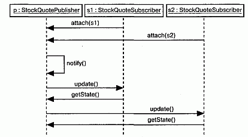

http://bourabai.kz/dbt/uml/ch15.htm

ЧАСТЬ IV - Основы моделирования поведения
# Глава 15. Взаимодействия
* Введение
* Термины и понятия
    * Контекст
    * Объекты и роли
    * Связи
    * Сообщения
    * Последовательности
    * Представление
* Типичные приемы моделирования
    * Поток управления
* Советы

В крупных системах объекты не остаются статичными: они взаимодействуют друг с другом, постоянно обмениваясь сообщениями. Взаимодействием (Interactions) называется поведение, выражаемое в обмене сообщениями между объектами данной совокупности в данном контексте, в результате чего достигается определенная цель.

Взаимодействия применяют для моделирования динамических аспектов коопераций (Collaborations). Последние представляют собой сообщества играющих определенные роли объектов, совместное поведение которых более значимо, чем сумма его слагаемых. Роли (Roles) - экземпляры-прототипы классов, интерфейсов, компонентов, узлов и прецедентов, динамические аспекты которых визуализируются, специфицируются, конструируются и документируются в виде потоков управления. Это могут быть простые последовательные вычислительные потоки или более сложные, включающие ветвления, циклы, рекурсию и параллелизм. Каждое взаимодействие можно моделировать двумя способами: акцентируя внимание на временной упорядоченности сообщений или на их последовательности в контексте некоей структурной организации объектов.

Хорошо структурированные взаимодействия похожи на хорошо структурированные алгоритмы - они эффективны, просты, понятны и пригодны для адаптации к различным задачам.

## Введение
Каждое здание живет своей жизнью. Хотя дома конструируют из статических материалов (кирпичей, известкового раствора, дерева, пластика, стекла, стали), в процессе эксплуатации жилища совокупность этих объектов работает в динамике, реализуя поведение, призванное обеспечить удобство жильцов (см. главу 1). Двери и окна открываются и закрываются; свет включается и выключается; кондиционеры, отопление, термостаты и вентиляционые отверстия поддерживают требуемую температуру. В некоторых помещениях устанавливаются даже специальные детекторы, регулирующие освещение, обогрев и громкость музыки в зависимости от наличия или отсутствия людей. Дома строятся так, чтобы облегчить перемещение людей и вещей из одной комнаты в другую. При проектировании зданий учитываются суточные и сезонные перепады температур, из-за которых материалы сжимаются и расширяются. Хорошо спроектированные здания реагируют и на динамические нагрузки, так что при ветре, землетрясении или передвижении жильцов строение сохраняет равновесие.

Программные системы функционируют аналогично. Например, система управления авиалиниями может работать с десятками терабайтов информации, однако в течение длительного времени эта информация не используется, а "оживает" только под воздействием внешних событий - таких, например, как заказ билета, перемещение самолета или планирование рейса. В реактивных системах (скажем, в процессоре микроволновой печи) активизацией и работой объектов управляют такие события, как нажатие кнопки пользователем или истечение некоторого промежутка времени.

В UML статические аспекты системы (см. части 2 и 3 этой книги) моделируются с помощью диаграмм классов или диаграмм объектов (см. главу 14). Они позволяют визуализировать, специфицировать, конструировать и документировать сущности, входящие в состав системы, включая классы, интерфейсы, компоненты, узлы, прецеденты и их экземпляры, а также способы их взаимодействия друг с другом.

Динамические аспекты системы в UML моделируются с помощью взаимодействий (а также с помощью автоматов - см. главу 21). Подобно диаграммам объектов, диаграммы взаимодействия (см. главу 18) готовят статическую сцену, на которой затем будет "разворачиваться" некоторое поведение, выводя на эту сцену объекты, работающие совместно ради выполнения определенного действия. Но в диаграммах взаимодействия, помимо всего прочего, фигурируют и сообщения, передаваемые между объектами. Чаще всего сообщение (Message) сводится к вызову операции или посылке сигнала, но оно может также создавать и уничтожать другие объекты.

С помощью взаимодействий моделируют потоки управления внутри операции, класса, компонента, прецедента или системы в целом. Взаимодействия позволяют анализировать такие потоки по двум критериям: во-первых, можно сосредоточиться на временной последовательности сообщений, во-вторых - акцентировать внимание на структурных отношениях между взаимосвязанными объектами и затем рассмотреть, как сообщения передаются в контексте этой структуры.

Графическое изображение сообщений в UML показано на рис. 15.1. Эта нотация позволяет визуализировать основные составные части сообщений: их имена, параметры (если таковые имеются) и последовательность. Сообщения представляют в виде линии со стрелкой и почти всегда добавляют название соответствующей операции.

#### Рис. 15.1 Сообщения, связи и последовательность

## Термины и понятия
Взаимодействием (Interaction) называется поведение, выражающееся в обмене сообщениями между множеством объектов в некотором контексте, в результате чего достигается определенная цель. Сообщение (Message) - это спецификация обмена данными между объектами, при котором передается некая информация в расчете на то, что в ответ последует определенное действие.

### Контекст
Взаимодействия имеют место всегда, когда объекты связаны друг с другом (эти структурные связи отображаются на диаграммах объектов, см. главу 14). Взаимодействия можно обнаружить в кооперациях объектов (см. главу 27) в контексте системы или подсистемы (см. главу 31). Они существуют и в контексте операций, и в контексте классов.

Чаще всего взаимодействия обнаруживаются в кооперации объектов в контексте системы или подсистемы как целого. Скажем, в системе электронной коммерции на стороне клиента есть взаимодействующие друг с другом объекты (например, экземпляры класса ЗаказКниги и ФормаЗаказа). На стороне клиента есть объекты (тот же ЗаказКниги), которые взаимодействуют с объектами на стороне сервера (например, с экземпляром класса ДиспетчерЗаказов). Таким образом, взаимодействия охватывают не только локальные кооперации объектов, как в первом случае, но могут распространяться и на несколько концептуальных уровней системы, как во втором случае.

Взаимодействия между объектами встречаются и при реализации операций (см. главы 4 и 9). Параметры операции, любые локальные для нее переменные и глобальные объекты, видимые внутри операции, могут взаимодействовать друг с другом для выполнения реализуемого ею алгоритма (о моделировании операций подробно рассказывается в главах 19 и 27). Так, вызов операции moveToPo-sition (p : Position), определенной в классе мобильного робота, предполагает взаимодействие между параметром (p), глобальным для операции объектом (currentPosition) и, возможно, несколькими локальными объектами (скажем, локальными переменными, используемыми внутри операции для вычисления промежуточных точек на пути робота к новому местоположению).

Наконец, взаимодействия существуют в контексте класса (см. главы 4 и 9). С их помощью можно визуализировать, специфицировать, конструировать и документировать семантику класса. Например, для понимания назначения класса RayTraceAgent (АгентТрассировкиЛучей) можно создать взаимодействие, показывающее, как атрибуты этого класса сотрудничают друг с другом (а также с глобальными по отношению к его экземплярам объектами и с параметрами, определенными в операциях класса).

> Примечание: Взаимодействия могут входить и в представление компонента (см. главу 25), узла (см. главу 26) или прецедента (см. главу 16), которые в UML являются разновидностями классификаторов (см. главу 9). В контексте прецедентов взаимодействие являет собой сценарий, который, в свою очередь, представляет один из потоков деятельности прецедента (о моделировании реализации прецедента рассказывается в главе 27).

### Объекты и роли
Участвующие во взаимодействии объекты могут быть конкретными сущностями или прототипами. В качестве конкретной сущности объект представляет нечто, существующее в реальном мире. Так, p, экземпляр класса Человек, может обозначать конкретного человека. Напротив, прототип p может представлять любой экземпляр класса Человек.

> Примечание: Именно эта особенность отличает кооперации, все объекты которых являются прототипами, играющими определенные роли, а не конкретными объектами реального мира.

В контексте взаимодействия можно встретить экземпляры (см. главу 13) классов, компонентов, узлов и прецедентов. Хотя у абстрактных классов (см. главу 4) и интерфейсов (см. главу 11) по определению не бывает непосредственных экземпляров, во взаимодействиях их присутствие допустимо. Конечно, они представляют собой не экземпляры абстрактного класса или интерфейса, а экземпляры (или прототипы) любого конкретного потомка данного абстрактного класса или некоего конкретного класса, реализующего интерфейс.

Диаграмму объектов (см. главу 14) можно рассматривать как представление статического аспекта взаимодействия, поскольку она описывает сцену, определяя все объекты, работающие совместно. Взаимодействие добавляет к этому динамическую последовательность сообщений, циркулирующих вдоль связей между объектами.

### Связи
Связью (Link) называется семантическое соединение между объектами. В об-щем случае связь представляет собой экземпляр ассоциации (см. главы 5 и 10). Как показано на рис. 15.2, если два класса входят в ассоциацию, то между их экземплярами может наличествовать связь; если же между двумя объектами существует связь, один из них может посылать сообщения другому.

#### Рис. 15.2 Связи и ассоциации

Связь определяет путь, по которому один объект передает сообщения другому | (или самому себе). Чаще всего достаточно указать, что такой путь существует. Если вы хотите его подробно специфицировать, дополните соответствующую концевую точку связи одним из следующих стандартных стереотипов (см. главу 6 и "Приложение В"):

* association - показывает, что соответствующий объект видим для ассоциации;
* self - соответствующий объект видим, потому что является диспетчером для операции;
* global - соответствующий объект видим, так как находится в объемлющей области действия;
* local - соответствующий объект видим, поскольку находится в локальной области действия;
* parameter - соответствующий объект видим, так как является параметром (примеры перечисленных выше стереотипов представлены в главе 18).

> Примечание: Поскольку связь является экземпляром ассоциации, при ее изображении можно использовать большую часть применимых к ассоциациям дополнений: имя, ролевое имя, навигацию и агрегирование. Однако кратность к связям не применима, поскольку они являются экземплярами ассоциации.

### Сообщения
Предположим, что есть множество объектов и множество соединяющих эти объекты связей. Если больше ничего не задано, то перед вами статическая модель, которая может быть представлена на диаграмме объектов (см. главу 14). Такие диаграммы моделируют состояние сообщества объектов в данный момент времени и оказываются полезны для визуализации, специфицирования, конструирования и документирования статической объектной структуры.

Допустим, вы хотите показать, как изменяется состояние сообщества объектов на протяжении некоего временного интервала. Вообразите, что вы снимаете объекты на пленку, в которой кадры представляют последовательные моменты времени. Если объекты не являются полностью статичными, то вы увидите, как они обмениваются между собой сообщениями, инициируют события (см. главу 20) и вызывают операции (см. главы 4 и 9). Кроме того, на каждом кадре вы можете явно визуализировать текущее состояние и роли отдельных экземпляров (см. главу 13).

Сообщением называется спецификация обмена данными между объектами, при котором передается некая информация в расчете на то, что в ответ последует определенное действие. Получение объектом экземпляра сообщения можно считать экземпляром события.

Действие, являющееся результатом получения сообщения, - это исполняемое предложение, которое образует абстракцию вычислительной процедуры. Действие может привести к изменению состояния.

UML позволяет моделировать действия нескольких видов:

* call (вызвать) - вызывает операцию, применяемую к объекту. Объект может послать сообщение самому себе, что приведет к локальному вызову операции;
* return (возвратить) - возвращает значение вызывающему объекту;
* send (послать) - посылает объекту сигнал (см. главу 20);
* create (создать) - создает новый объект;
* destroy (уничтожить) - удаляет объект. Объект может уничтожить самого себя.

> Примечание: В UML можно моделировать и сложные действия. Помимо пяти основных перечисленных видов действий к сообщению можно присоединить произвольную строку, содержащую запись сложного выражения. UML не определяет синтаксис или семантику таких строк.

Перечисленные виды сообщений можно различить визуально, как показано на рис. 15.3. При этом действия create и destroy визуализируются как стереотипы (см. главу 6). Различие между синхронными и асинхронными действиями наиболее существенно в контексте одновременности (см. главу 22).

#### Рис. 15.3 Сообщения

Чаще всего встречающийся в моделях вид сообщений - вызов одним объектом операции другого (или своей собственной). Объект не может вызвать произвольную операцию. Если, например, объект с из вышеприведенного примера вызывает операцию setItinerary экземпляра класса (см. главы 4 и 9) TicketAgent, то она должна быть не только определена в классе TicketAgent (другими словами, объявлена либо непосредственно в нем, либо в одном из его предков), но и доступна для объекта с.

> Примечание: Такие языки программирования, как C++, статически типизированы (хотя и полиморфны), то есть законность вызова проверяется во время компиляции. Но, например, Smalltalk является динамически типизированным языком, то есть до момента выполнения нельзя определить, может ли объект получать сообщение данного типа. Хорошо оформленную модель UML в общем случае можно проверить статически с помощью инструментальных средств, так как на этапе моделирования разработчику обычно известно назначение каждой операции.

Когда объект вызывает операцию или посылает сигнал другому объекту, вместе с сообщением можно передать его фактические параметры. Аналогичным образом, когда объект возвращает управление другому объекту, можно смоделировать возвращаемое значение.

> Примечание: Операции допустимо квалифицировать также по классу или интерфейсу (см. главу 11), в котором они были объявлены. Так, выполнение операции register на экземпляре класса Student полиморфно вызывает ту операцию, которая соответствует имени в иерархии данного класса; обращение к IMember:: register вызывает операцию, определенную в интерфейсе IMember (и реализованную каким-нибудь подходящим классом, также принадлежащим к иерархии класса Student).

### Последовательности
Когда объект посылает сообщение другому объекту (фактически делегируя ему некоторое действие), получатель может, в свою очередь, отправить сообщение третьему объекту, тот - четвертому и т.д. Такой поток сообщений формирует последовательность (Sequence). Она всегда должна иметь начало в некотором процессе или вычислительной нити (см. главу 22); последовательность может продолжаться, пока существует владеющий ею процесс или нить. Постоянно работающая система (см. главу 31), например встроенная в некоторое устройство реального времени, продолжает выполняться, пока не остановлен содержащий ее узел.

Каждый процесс и нить в системе определяет отдельный поток управления, и в каждом таком потоке сообщения упорядочены по времени. Чтобы удачно визуализировать последовательность сообщений, можно явно смоделировать их порядок относительно начала последовательности, предпослав каждому сообщению его порядковый номер, отделенный двоеточием.

Процедурные и вложенные потоки управления обычно изображают в виде линий с закрашенными стрелками, как показано на рис. 15.4. В данном случае сообщение findAt является первым из тех, которые вложены во второе сообщение последовательности (2.1).

#### Рис. 15.4 Процедурная последовательность

Менее распространенный, но вполне приемлемый способ показан на рис. 15.5. Здесь линия с незакрашенной стрелкой представляет простой (неструктурированный) поток управления, который моделирует непроцедурную передачу управления от одного шага к другому. В данном случае сообщение assertCall является вторым в последовательности.

#### Рис. 15.5 Одноуровневая (простая) последовательность

> Примечание: Различие между простой и процедурной последовательностью довольно тонкое и принадлежит к числу сложных вопросов моделирования. Обычно простые последовательности применяют только при моделировании взаимодействий в контексте прецедентов, относящихся к системе в целом, включая актеры вне системы. Такие последовательности зачастую оказываются простыми, поскольку управление передается от шага к шагу без учета вложенных потоков управления. Почти во всех остальных случаях применяют процедурные последовательности, поскольку с их помощью представляются вложенные вызовы операций, примеры которых можно найти в большинстве языков программирования.

Моделируя взаимодействия, в которых участвует несколько потоков управления, особенно важно идентифицировать процесс или нить (см. главу 22), пославшие сообщение. Для того чтобы различать потоки управления, в UML перед порядковым номером сообщения можно указать имя процесса или нити, являющихся источником данной последовательности сообщений. Например, выражение

	D5 : ejectHatch(3)
показывает, что операция ejectHatch (c фактическим параметром 3) выполняется в результате получения пятого сообщения в последовательности, начатой процессом или потоком D. Асинхронный поток управления изображается с помощью "полустрелки" (см. главу 22).

Можно показывать не только фактические аргументы, посланные вместе с операцией или сигналом в контексте взаимодействия, но и возвращаемые значения функции. Например, из выражения ниже явствует, что операция find c фактическим параметром "Rachel1е" возвращает значение p. Это вложенная последовательность: операция выполняется в результате второго сообщения, вложенного в третье, которое, в свою очередь, вложено в первое сообщение последовательности. На той же самой диаграмме p можно использовать в качестве фактического параметра других сообщений.

	1.3.2 : p := find("Rachel1е")
> Примечание: UML позволяет моделировать и более сложные виды последовательностей: итерации, ветвления и охраняемые сообщения (см. главу 18). Кроме того, для моделирования временных ограничений, встречающихся в системах реального времени, с последовательностью можно связать отметки времени (см. главу 23). Более экзотические виды передачи сообщений (например, тайм-ауты) допустимо моделировать, определяя подходящий стереотип (см. главу 6).

### Создание, модификация и уничтожение
Чаще всего участвующие во взаимодействии объекты существуют на протяжении всего взаимодействия. Но иногда объекты приходится создавать (с помощью сообщения create) и уничтожать (с помощью сообщения destroy). Сказанное относится и к связям: отношения между объектами могут возникать и исчезать. Чтобы отметить, что объекты или связи появились либо пропали в ходе взаимодействия, к элементу присоединяют одно из следующих ограничений (см. главу 6):

* new (новый) - показывает, что данный экземпляр или связь создается во время выполнения объемлющего взаимодействия;
* destroyed (уничтоженный) - экземпляр или связь уничтожается до завершения выполнения объемлющего взаимодействия;
* transient (временный) - экземпляр или связь создается во время выполнения объемлющего взаимодействия и уничтожается до его завершения.

Во время взаимодействия значение атрибутов объекта, его состояние или роли, как правило, изменяются. Это можно отобразить, создавая копии объекта с другими значениями атрибутов, состоянием и ролями. При этом на диаграмме последовательностей все вариации объекта должны быть расположены на одной и той же линии жизни (см. главу 18). На диаграмме взаимодействий их нужно связать друг с другом посредством сообщения со стереотипом become (см. главу 13).

### Представление
При моделировании взаимодействия обычно включают как объекты, каждый из которых играет свою роль, так и сообщения, каждое из которых представляет обмен данными между объектами, в результате чего выполняются определенные действия.

Участвующие во взаимодействии сообщения и объекты можно визуализировать двумя способами: акцентируя внимание на временной упорядоченности сообщений или на структурной организации объектов, посылающих и принимающих сообщения. В UML первый тип называется диаграммами последовательностей, а второй -диаграммами кооперации; те и другие являются разновидностью диаграмм взаимодействий (см. главу 18).

Диаграммы последовательностей и кооперации являются изоморфными, то есть могут быть преобразованы друг в друга без потери информации. Однако между ними существуют визуальные различия. Диаграммы последовательностей обеспечивают моделирование линии жизни объекта, которая описывает его существование в определенный промежуток времени - возможно, включая моменты создания и уничтожения объекта. Диаграммы кооперации позволяют моделировать структурные связи, существующие между объектами, которые участвуют во взаимодействии.

## Типичные приемы моделирования

### Поток управления

Чаще всего взаимодействия используют для моделирования потока управления, характеризующего поведение системы в целом, включая прецеденты (см. главу 16), образцы, механизмы и каркасы (см. главу 28), поведение одного класса или отдельной операции (см. главы 4 и 9). При этом классы, интерфейсы (см. главу H), компоненты (см. главу 25), узлы (см. главу 26) и отношения между ними моделируют статические аспекты системы, а взаимодействия - ее динамические аспекты (для моделирования последних используются также автоматы, см. главу 21).

Моделируя взаимодействия, вы, по сути дела, описываете последовательности действий, выполняемых объектами из некоторой совокупности. Для выявления и осмысления взаимодействий очень полезно применение CRC-карточек.

Моделирование потока управления состоит из следующих шагов:

1. Определите контекст взаимодействия, будь то система в целом, одиночный класс или отдельная операция.
2. Опишите сцену, на которой будет происходить взаимодействие. Для этого нужно идентифицировать объекты, играющие какую-либо роль, и установить их начальные свойства, в том числе значения атрибутов, состояния и роли.
3. Если в вашей модели внимание акцентируется на структурной организации объектов, идентифицируйте связи между ними, имеющие отношение к об мену данными, который происходит во взаимодействии. При необходимо сти опишите особенности каждой связи с помощью стандартных стереоти пов и ограничений UML.
4. Если основное внимание уделяется временной упорядоченности, специфи цируйте сообщения, передаваемые между объектами. В случае необходи мости выделите разные виды сообщений, включите в описание параметры и возвращаемые значения.
5. Для передачи существенных деталей взаимодействия можно указать состо яние и роль каждого объекта в любой момент времени.

В качестве примера на рис. 15.6 показаны объекты, взаимодействующие в контексте механизма публикации и подписки (экземпляр образца проектирования observer). Вы видите три объекта: p (экземпляр класса StockQuotePublisher), s1 и s2 (экземпляры класса StockQuoteSubscriber). Этот рисунок является примером диаграммы последовательностей (см. главу 18), описывающей временную упорядоченность сообщений.

#### Рис. 15.6 Поток управления с точки зрения последовательности во времени

На рис. 15.7 показана диаграмма кооперации (см. главу 18), семантически эквивалентная предыдущей, но описывающая структурную организацию объектов. Вы видите тот же самый поток управления, но на этот раз вместе со связями между объектами.

#### Рис. 15.7 Поток управления с точки зрения организации

## Советы
Моделируя взаимодействия на языке UML, помните, что они отражают динамические аспекты совокупности объектов. Хорошо структурированное взаимодействие обладает следующими свойствами:

* является достаточно простым и охватывает только такие объекты, в результате совместной работы которых достигается поведение более значимое, чем сумма его составных частей;
* обладает четко определенным контекстом. Это может быть контекст операции, класса или системы в целом;
* является эффективным и реализует описываемое поведение при оптимальных затратах времени и ресурсов;
* легко адаптируется для применения в различных задачах: элементы взаимодействия, которые с большой вероятностью могут изменяться, должны быть изолированы, что облегчит задачу модификации в будущем;
* доступно, не грешит запутанностью, обходится без скрытых побочных эффектов или неочевидной семантики.

При рисовании диаграммы взаимодействия в UML руководствуйтесь следующими принципами:

* выберите аспект взаимодействия, на котором требуется акцентировать внимание. Это может быть либо временное упорядочение сообщений, либо их последовательность в контексте той или иной структурной организации объектов. Нельзя показать то и другое одновременно;
* указывайте только такие свойства объектов (значения атрибутов, роли и состояния), которые важны для понимания взаимодействия в выбранном контексте;
* отображайте только такие свойства сообщений (параметры, семантику параллелизма или возвращаемое значение), которые необходимы для понимания взаимодействия в выбранном контексте.

