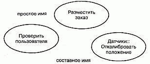
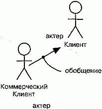
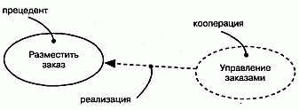
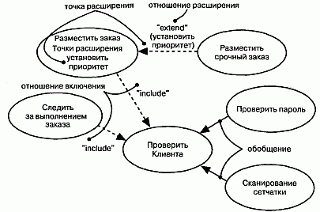

http://bourabai.kz/dbt/uml/ch16.htm

ЧАСТЬ IV - Основы моделирования поведения
# Глава 16. Прецеденты
* Введение
* Термины и понятия
    * Имена
    * Прецеденты и актеры
    * Прецеденты и поток событий
    * Прецеденты и сценарии
    * Прецеденты и кооперации
    * Организация прецедентов
    * Другие возможности
* Типичные приемы моделирования
    * Поведение элемента
* Советы

Системы не существуют в изоляции. Как правило, они взаимодействуют с актерами - людьми или программами - которые используют систему в своих целях, причем каждый актер ожидает, что она будет вести себя определенным, вполне предсказуемым образом. Прецедент (Use case) специфицирует поведение системы или ее части и представляет собой описание множества последовательностей действий (включая варианты), выполняемых системой для того, чтобы актер мог получить определенный результат.

С помощью прецедентов можно описать поведение разрабатываемой системы, не определяя ее реализацию. Таким образом, они позволяют достичь взаимопонимания между разработчиками, экспертами и конечными пользователями продукта. Кроме того, прецеденты помогают проверить архитектуру системы в процессе ее разработки. Реализуются они кооперациями.

Хорошо структурированные прецеденты описывают только существенное поведение системы или подсистемы и не являются ни слишком общими, ни слишком специфическими.

## Введение

Хорошо спроектированный жилой дом - это не просто ряд стен, подпирающих крышу, которая защищает жильцов от непогоды. Работая вместе с архитектором над проектом дома, вы наверняка будете учитывать предполагаемое использование помещения. Если вы любите приглашать гостей, следует продумать план гостиной, чтобы людям было удобно общаться. Проектируя кухню, нужно определить местонахождение шкафчиков и бытовой техники. Неплохо было бы также принять во внимание маршрут транспортировки продуктов из машины на кухню, от которого во многом зависит взаимное расположение комнат. Если у вас большая семья, надо позаботиться о количестве и размещении ванных комнат, иначе каждое утро там будут выстраиваться очереди. Это особенно чревато скандалами, если в семье есть дети-подростки.

Размышления о том, как вы и ваша семья будете распоряжаться домом, - это пример анализа на основе прецедентов. Вы рассматриваете разные способы использования дома, которые в конечном счете обусловливают архитектуру. Для многих семей прецеденты использования схожи - во всех домах едят, спят, растят детей, отдыхают и хранят воспоминания. Но в каждом случае выдвигаются индивидуальные требования (или разновидности базовых требований) к жилищу. Потребности большой семьи, например, будут отличаться от запросов молодого человека, только что закончившего колледж. Эти различия окажут решающее влияние на то, как будет выглядеть готовый дом.

Важнейшая особенность разработки прецедентов состоит в том, что вы не специфицируете, как они будут реализованы. Например, поведение банкомата можно описать с помощью вариантов взаимодействия с ним пользователей, но вам не обязательно знать, как он устроен. Прецеденты специфицируют желаемое поведение, но ничего не говорят о том, как его достичь. И, что очень важно, это позволяет вам как эксперту или конечному пользователю общаться с разработчиками, конструирующими систему в соответствии с вашими требованиями, не углубляясь в детали реализации. Подробности будут рассмотрены позже, а на данном этапе вы можете сконцентрироваться на наиболее существенных проблемах.

В UML поведение моделируется с помощью прецедентов, специфируемых в отрыве от реализации. Прецедент - это описание множества последовательностей действий (включая их варианты), которые выполняются системой для того, чтобы актер получил результат, имеющий для него определенное значение. Это определение включает в себя несколько важных пунктов.

Прецедент описывает множество последовательностей, каждая из которых представляет взаимодействие (см. главу 15) сущностей, находящихся вне системы (ее актеров), с системой как таковой и ее ключевыми абстракциями. Такие взаимодействия являются в действительности функциями уровня системы, которыми вы пользуетесь для визуализации, специфицирования, конструирования и документирования ее желаемого поведения на этапах сбора и анализа требований (см. главу 6). Прецедент представляет функциональные требования к системе в целом. Например, основной прецедент в работе банка - это обработка займов.

Прецеденты предполагают взаимодействие актеров и системы. Актер представляет собой логически связанное множество ролей, которые играют пользователи прецедентов во время взаимодействия с ними. Актерами могут быть как люди, так и автоматизированные системы. Например, при моделировании работы банка процесс обработки займов включает в себя, помимо всего прочего, взаимодействие между клиентом и сотрудником кредитного отдела.

Развитие прецедентов может осуществляться по-разному. В любой хорошо продуманной системе существуют прецеденты, которые либо являются специализированными версиями других, более общих, либо входят в состав прочих прецедентов, либо расширяют их поведение. Общее поведение множества прецедентов, допускающее повторное применение, можно выделить, организуя их в соответствии с тремя описанными видами отношений. В частности, при моделировании работы банка базовый прецедент, описывающий обработку займов, подразделяется на несколько вариаций, от оформления крупной закладной до выдачи маленькой деловой ссуды. Однако все эти прецеденты имеют нечто общее в особенностях поведения, например оценку платежеспособности клиента.

Всякий прецедент должен выполнять некоторый объем работы. С точки зрения данного актера, прецедент делает нечто представляющее для него определенную ценность, например вычисляет результат, создает новый объект или изменяет состояние другого объекта. В примере с работой банка процесс обработки заявки на займ приводит к подписанию расходного ордера и материализуется в виде некоторой суммы денег, вручаемой клиенту.

Прецеденты могут быть применены ко всей системе или к ее части, в том числе к подсистемам (см. главу 31) или даже к отдельным классам (см. главы 4 и 9) и интерфейсам (см. главу 11). В любом случае прецеденты не только представляют желаемое поведение этих элементов, но могут быть использованы как основа для их тестирования на различных этапах разработки. Прецеденты в применении к подсистемам - это прекрасный источник регрессионных тестов, а в применении к системе в целом - источник комплексных и системных тестов. Графическое изображение прецедента и актера показано на рис. 16.1. Эта нотация позволяет визуализировать прецедент в контексте других прецедентов и отдельно от его реализации.

#### Рис. 16.1 Актеры и прецеденты

## Термины и понятия
Прецедентом (Use case) называется описание множества последовательностей действий (включая варианты), выполняемых системой для того, чтобы актер мог получить определенный результат. Графически прецедент изображается в виде эллипса. Нотация прецедента похожа на нотацию кооперации (см. главу 27).

### Имена
Любой прецедент должен иметь имя, отличающее его от других прецедентов. Оно должно быть уникально внутри объемлющего пакета (см. главу 12). Имя прецедента представляет собой текстовую строку. Взятое само по себе, оно называется простым именем. К составному имени спереди добавлено имя пакета, в котором он находится. Обычно при изображении прецедента указывают только его имя, как показано на рис. 16.2.

#### Рис. 16.2 Простые и составные имена

> Примечание: Имя прецедента может состоять из любого числа букв, цифр и некоторых знаков препинания (за исключением таких, как двоеточия, которые применяются для отделения имени прецедента от имени объемлющего пакета). Имя может занимать несколько строк. На практике для именования прецедентов используют короткие глагольные фразы в активной форме, обозначающие некоторое поведение и взятые из словаря моделируемой системы.

### Прецеденты и актеры
Актер представляет собой связное множество ролей, которые пользователи прецедентов исполняют во время взаимодействия с ними. Обычно актер представляет роль, которую в данной системе играет человек, аппаратное устройство или даже другая система. Например, если вы работаете в банке, то можете играть роль СотрудникКредит-ногоОтдела. Если в этом банке у вас имеется счет, вы играете роль Клиента. Таким образом, экземпляр актера представляет собой конкретную личность, взаимодействующую с системой определенным образом. Хотя вы и используете актеров в своих моделях, они не являются частью системы, так как существуют вне ее.

Как показано на рис. 16.3, актеров изображают в виде человеческих фигурок. Можно определить общие типы актеров (например, Клиент) и затем специализировать их (например, создав разновидность КоммерческийКлиент) с помощью отношений обобщения (см. главы 5 и 10).

#### Рис. 16.3 Актеры

> Примечание: Можно использовать механизмы расширения UML для приписывания актеру стереотипа (см. главу 6), чтобы создать другую пиктограмму, адекватную поставленным целям.

Актеров можно связывать с прецедентами только отношениями ассоциации (см. главы 5 и 10). Ассоциация между актером и прецедентом показывает, что они общаются друг с другом, возможно, посылая или принимая сообщения (см. главу 15).

### Прецеденты и поток событий
Прецедент описывает, что делает система (подсистема, класс или интерфейс), но не определяет, каким образом она это делает. В процессе моделирования всегда важно разделять внешнее и внутреннее представления.

Можно специфицировать поведение прецедента путем описания потока событий в текстовой форме - в виде, понятном для постороннего читателя. В описание необходимо включить указание на то, как и когда прецедент начинается и заканчивается, когда он взаимодействует с актерами и какими объектами они обмениваются. Важно обозначить также основной и альтернативный потоки поведения системы.

Например, в контексте банкомата можно было бы следующим образом описать прецедент ValidateUser (ПроверитьПользователя).

Основной поток событий. Прецедент начинается, когда система запрашивает у клиента его персональный идентификационный номер (PIN). Клиент (Customer) может ввести его с клавиатуры. Завершается ввод нажатием клавиши Enter. После этого система проверяет введенный PIN и, если он правильный, подтверждает ввод. На этом прецедент заканчивается.

Исключительный поток событий. Клиент может прекратить транзакцию в любой момент, нажав клавишу Cancel. Это действие начинает прецедент заново. Никаких изменений на счету клиента на производится.

Исключительный поток событий. Клиент может в любой момент до нажатия клавиши Enter стереть свой PIN и ввести новый.

Исключительный поток событий. Если клиент ввел неправильный PIN, прецедент запускается сначала. Если это происходит три раза подряд, система отменяет всю транзакцию и не позволяет данному клиенту снова начать работу с банкоматом в течение 60 секунд.

> Примечание: Поток событий в прецеденте можно описать различными способами, в том числе в виде неформализованного структурированного текста (как в примере выше), формализованного структурированного текста (с пред- и постусловиями) или с помощью псевдокода.

### Прецеденты и сценарии
Как правило, в начале работы потоки событий прецедента описывают в текстовой форме. По мере уточнения требований к системе будет удобнее перейти к графическому изображению потоков на диаграммах взаимодействия (см. главу 18). Обычно для описания главного потока прецедента используют диаграмму последовательностей, а для дополнительных - ее варианты.

Желательно отделять главный поток от альтернативных, поскольку прецедент описывает не одну, а множество последовательностей, и выразить все детали интересующего вас Прецедента с помощью одной последовательности невозможно. Например, в системе управления человеческими ресурсами присутствует прецедент Нанять работника. У этой общей бизнес-функции существует множество вариаций. Вы можете переманить сотрудника из другой компании (так бывает чаще всего), перевести человека из одного подразделения в другое (эта практика распространена в транснациональных компаниях) или нанять иностранца (особый случай, регулируемый специальными правилами). Каждый вариант описывается своей последовательностью.

Таким образом, один прецедент Нанять работника описывает несколько последовательностей, или сценариев, каждый из которых представляет одну из возможных вариаций данного потока событий. Сценарий (Scenario) - это некоторая последовательность действий, иллюстрирующая поведение системы. Сценарии находятся в таком же отношении к прецедентам, как экземпляры (см. главу 13) к классам, то есть сценарий - это экземпляр прецедента.

> Примечание: Относительно сложная система содержит несколько десятков прецедентов, каждый из которых может разворачиваться в несколько десятков сценариев. Для любого прецедента можно выделить основные сценарии, описывающие важнейшие последовательности, и вспомогательные, описывающие альтернативные последовательности.

### Прецеденты и кооперации
Как было указано, прецедент описывает желательное поведение системы (подсистемы, класса или интерфейса), но не специфицирует его реализацию. Это важная особенность, поскольку анализ системы (по результатам которого специфицируется ее поведение) по возможности не должен учитывать проблемы реализации (иными словами, как это поведение должно быть материализовано - см. главы 9 и 10). В конце концов, однако, прецеденты придется реализовать. Для этого необходимо будет создать сообщество классов и других элементов, в результате совместной работы которых будет достигнуто желаемое поведение. Такое сообщество, включая его динамическую и статическую структуру, называется в UML кооперацией (см. главу 27).

Как видно из рис. 16.4, реализацию прецедента с помощью кооперации можно специфицировать явно. Но чаще всего один прецедент реализуется в точности одной кооперацией, так что явно описывать отношение не нужно.

#### Рис. 16.4 Прецеденты и кооперации

> Примечание: Хотя вы можете не визуализировать это отношение явно, применяемые для работы с моделями инструментальные средства, скорее всего, будут так или иначе его поддерживать.

> Примечание: Нахождение минимального набора хорошо структурированных коопераций, реализующих определенный во всех прецедентах системы поток событий, - основная задача системной архитектуры (см. главу 2).

### Организация прецедентов
Для организации прецедентов их группируют в пакеты (см. главу 12), так же как и классы.

Кроме того, прецеденты можно организовать, определив между ними отношения обобщения, включения и расширения. Эти отношения применяют, чтобы выделить некоторое общее поведение (извлекая его из других прецедентов, которые его включают) или, наоборот, вариации (поместив такое поведение в другие прецеденты, которые его расширяют).

Отношение обобщения (см. главы 5 и 10) между прецедентами аналогично отношениям обобщения между классами. Это означает, что прецедент-потомок наследует поведение и семантику своего родителя, может замещать его или дополнять его поведение, а кроме того, может быть подставлен всюду, где появляется его родитель (как родитель, так и потомок могут иметь конкретные экземпляры). Например, в банковской системе возможно наличие прецедента Проверить Клиента, который отвечает за проверку личности клиента. Он может иметь двух специализированных потомков (Проверить пароль И Сканирование сетчатки). Оба потомка ведут себя так же, как прецедент Проверить клиента, и могут использоваться везде, где используется их родитель, но при этом каждый из них добавляет и свое собственное поведение (первый проверяет текстовый пароль, а второй - рисунок сетчатки глаза). Как показано на рис. 16.5, обобщения между прецедентами изображаются точно так же, как и обобщения между классами -в виде линии с незакрашенной стрелкой.

#### Рис. 16.5 Обобщения, включения и расширения

Отношение включения между прецедентами означает, что в некоторой точке базового прецедента инкорпорировано поведение другого прецедента. Включаемый прецедент никогда не существует автономно, а инстанцируется только как часть объемлющего прецедента. Можно считать, что базовый прецедент заимствует поведение включаемых.

Благодаря наличию отношений включения удается избежать многократного описания одного и того же потока событий, поскольку общее поведение можно описать в виде самостоятельного прецедента, включаемого в базовые. Отношение включения является примером делегирования, при котором ряд обязанностей системы описывается в одном месте (во включаемом прецеденте), а остальные прецеденты, когда необходимо, включают эти обязанности в свой набор.

Отношения включения изображаются в виде зависимостей (см. главы 5 и 10) со стереотипом (см. главу 6) include. Чтобы специфицировать место в потоке событий, где базовый прецедент включает поведение другого, вы просто пишете слово include, за которым следует имя включаемого прецедента. Проиллюстрируем это на примере, описывающем поток для прецедента Следить за выполнением заказа.

Основной поток событий. Получить и проверить номер заказа, include (Проверить клиента). Запросить статус каждой части заказа и доложить клиенту.

Отношение расширения подразумевает, что базовый прецедент неявно содержит поведение другого прецедента в точке, которая косвенно задается расширяющим прецедентом. Базовый прецедент может быть автономным, но при определенных обстоятельствах его поведение расширяется за счет другого. Базовый прецедент допустимо расширить только в некоторых точках, называемых точками расширения. Можно считать, что расширяющий прецедент передает свое поведение базовому.

Отношение расширения применяют для моделирования таких частей прецедента, которые пользователь воспринимает как необязательное поведение системы. Тем самым можно разделить обязательное и необязательное поведение. Отношения расширения используются также для моделирования отдельных субпотоков, выполняемых лишь при определенных обстоятельствах. Наконец, их применяют для моделирования нескольких потоков, которые могут включаться в некоторой точке сценария в результате явного взаимодействия с актером.

Отношение расширения изображают в виде зависимости со стереотипом extend. Точки расширения базового сценария перечисляются в дополнительном разделе. Они являются просто метками, которые могут появляться в потоке базового прецедента. Например, поток для прецедента Разместить заказ можно было бы описать нижеследующим образом.

Основной поток событий include (Проверить Клиента). Собрать все пункты сделанного клиентом заказа. (Установить приоритет). Отправить заказ на обработку.

В данном примере фраза Установить приоритет - это точка расширения. Прецедент может содержать несколько точек расширения (причем каждую по несколько раз), идентифицируемых по именам. При обычных обстоятельствах базовый прецедент в этом примере выполняется без учета приоритетности заказа. Если же поступает приоритетный заказ, то поток будет выполняться, как обычно, до точки расширения (Установить приоритет), а в ней будет выполнен расширяющий прецедент (Разместить срочный заказ), после чего возобновится работа главного потока. Если определено несколько точек расширения, то расширяющие прецеденты будут последовательно выполняться в собственных потоках.

> Примечание: Организация прецедентов путем выделения общего поведения (отношение включения) и различных вариаций (отношение расширения) является важной составной частью процесса разработки простого, сбалансированного и понятного набора прецедентов системы.

### Рис. 16.5 Обобщения, включения и расширения

Отношение включения между прецедентами означает, что в некоторой точке базового прецедента инкорпорировано поведение другого прецедента. Включаемый прецедент никогда не существует автономно, а инстанцируется только как часть объемлющего прецедента. Можно считать, что базовый прецедент заимствует поведение включаемых.

Благодаря наличию отношений включения удается избежать многократного описания одного и того же потока событий, поскольку общее поведение можно описать в виде самостоятельного прецедента, включаемого в базовые. Отношение включения является примером делегирования, при котором ряд обязанностей системы описывается в одном месте (во включаемом прецеденте), а остальные прецеденты, когда необходимо, включают эти обязанности в свой набор.

Отношения включения изображаются в виде зависимостей (см. главы 5 и 10) со стереотипом (см. главу 6) include. Чтобы специфицировать место в потоке событий, где базовый прецедент включает поведение другого, вы просто пишете слово include, за которым следует имя включаемого прецедента. Проиллюстрируем это на примере, описывающем поток для прецедента Следить за выполнением заказа.

Основной поток событий. Получить и проверить номер заказа, include (Проверить клиента). Запросить статус каждой части заказа и доложить клиенту.

Отношение расширения подразумевает, что базовый прецедент неявно содержит поведение другого прецедента в точке, которая косвенно задается расширяющим прецедентом. Базовый прецедент может быть автономным, но при определенных обстоятельствах его поведение расширяется за счет другого. Базовый прецедент допустимо расширить только в некоторых точках, называемых точками расширения. Можно считать, что расширяющий прецедент передает свое поведение базовому.

Отношение расширения применяют для моделирования таких частей прецедента, которые пользователь воспринимает как необязательное поведение системы. Тем самым можно разделить обязательное и необязательное поведение. Отношения расширения используются также для моделирования отдельных субпотоков, выполняемых лишь при определенных обстоятельствах. Наконец, их применяют для моделирования нескольких потоков, которые могут включаться в некоторой точке сценария в результате явного взаимодействия с актером.

Отношение расширения изображают в виде зависимости со стереотипом extend. Точки расширения базового сценария перечисляются в дополнительном разделе. Они являются просто метками, которые могут появляться в потоке базового прецедента. Например, поток для прецедента Разместить заказ можно было бы описать нижеследующим образом.

Основной поток событий include (Проверить Клиента). Собрать все пункты сделанного клиентом заказа. (Установить приоритет). Отправить заказ на обработку.

В данном примере фраза Установить приоритет - это точка расширения. Прецедент может содержать несколько точек расширения (причем каждую по несколько раз), идентифицируемых по именам. При обычных обстоятельствах базовый прецедент в этом примере выполняется без учета приоритетности заказа. Если же поступает приоритетный заказ, то поток будет выполняться, как обычно, до точки расширения (Установить приоритет), а в ней будет выполнен расширяющий прецедент (Разместить срочный заказ), после чего возобновится работа главного потока. Если определено несколько точек расширения, то расширяющие прецеденты будут последовательно выполняться в собственных потоках.

> Примечание: Организация прецедентов путем выделения общего поведения (отношение включения) и различных вариаций (отношение расширения) является важной составной частью процесса разработки простого, сбалансированного и понятного набора прецедентов системы.

## Типичные приемы моделирования

### Поведение элемента
Чаще всего с помощью прецедентов моделируют поведение элемента: системы в целом, подсистемы (см. главу 31) или класса (см. главы 4 и 9). При этом важно сконцентрироваться исключительно на том, что должен делать элемент, а не на том, как он это будет делать.

Подобное применение прецедентов к элементам представляет важность по трем причинам. Во-первых, моделируя поведение элемента с помощью прецедентов, эксперты в предметной области могут описать взгляд на систему извне с такой степенью детализации, что разработчики сумеют сконструировать ее внутреннее представление. Прецеденты дают возможность экспертам, конечным пользователям и разработчикам общаться на одном языке. Во-вторых, прецеденты позволяют разработчикам понять назначение элемента. Система, подсистема или класс могут быть сложными образованиями с большим числом операций и других составных частей. Описав прецеденты элемента, вы поможете их потенциальным пользователям разобраться в том, как с ним обращаться. В противном случае им пришлось бы на собственном опыте постигать, как следует использовать тот или иной элемент. В-третьих, прецеденты являются основой для тестирования каждого элемента на всем протяжении его разработки. Постоянно сравнивая функционирование каждого элемента с прецедентами, вы будете контролировать корректность его реализации. При этом вы не только получаете источник регрессионных тестов, но будете вынуждены при появлении нового прецедента данного элемента пересмотреть реализацию, чтобы убедиться в том, что элемент в достаточной степени изменяем. Если это не так, следует пересмотреть архитектуру.

Моделирование поведения элемента осуществляется следующим образом:

1. Идентифицируйте актеры, взаимодействующие с данным элементом. К чис лу актеров-кандидатов относятся группы, которые требуют определенного по ведения для выполнения своих задач либо необходимы, прямо или косвенно, для выполнения функций элемента.
2. Организуйте актеры, выделив общие и специализированные роли.
3. Для каждого актера рассмотрите основные пути его взаимодействия с элемен том. Рассмотрите также взаимодействия, изменяющие состояние элемента или его окружения либо предполагающие реакцию на некоторое событие.
4. Рассмотрите альтернативные (исключительные) способы взаимодействия актеров с элементом.
5. Организуйте выявленное поведение в виде прецедентов, применяя отноше ния включения и расширения для выделения общего и исключительного по ведения.

Например, система розничной торговли должна взаимодействовать с клиентами, которые размещают заказы и хотят отслеживать их продвижение. Система будет отгружать выполненные заказы и выставлять счета клиентам. Как видно из рис. 16.6, моделировать поведение такой системы можно, объявляя его в виде прецедентов (Разместить заказ, Следить за выполнением заказа, Отгрузить заказ и Выставить счет). Можно выделить общее поведение (Проверить клиента) и вариации (Отгрузить частично выполненный заказ). Для каждого из этих прецедентов следует включить спецификацию поведения с помощью текста, автомата или взаимодействий.

#### Рис. 16.6 Моделирование поведения элемента

По мере развития модели вы обнаружите тенденцию к объединению прецеден-тов в концептуально и семантически близкие группы. В UML для моделирований таких групп применяются пакеты (см. главу 12).

## Советы
Моделируя прецеденты в UML, помните, что каждый из них должен представ лять некоторое четко идентифицируемое поведение системы или ее части. Хоро шо структурированный прецедент обладает следующими свойствами:

* именует простое, идентифицируемое и в некоторой степени атомарное пове дение системы или ее части;
* выделяет общее поведение, извлекая его из всех прецедентов, которые его включают;
* выделяет вариации, помещая некоторое поведение в другие прецеденты, которые его расширяют;
* описывает поток событий в степени, достаточной для понимания посторонним читателем;
* описывается с помощью минимального набора сценариев, специфицирующих его нормальную и дополнительную семантику.

Изображая прецеденты в UML, пользуйтесь следующими правилами:

* показывайте только такие прецеденты, которые важны для понимания поведения системы или ее части в данном контексте;
* показывайте только те актеры, которые связаны с этими прецедентами.

