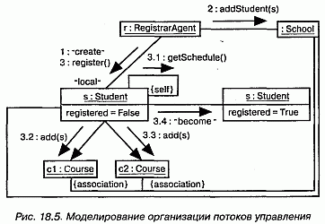

http://bourabai.kz/dbt/uml/ch18.htm

ЧАСТЬ IV - Основы моделирования поведения
# Глава 18. Диаграммы взаимодействий
* Введение
* Термины и понятия
    * Общие свойства
    * Содержание
    * Диаграммы последовательностей
    * Диаграммы кооперации
    * Семантическая эквивалентность
    * Типичные примеры применения
* Типичные приемы моделирования
    * Потоки управления во времени
    * Структура потоков управления
    * Прямое и обратное проектирование
* Советы

Диаграммы последовательностей и кооперации (и те, и другие называются диаграммами взаимодействий) относятся к числу пяти видов диаграмм, применяемых в UML для моделирования динамических аспектов системы (остальные три вида- диаграммы деятельности, состояния и прецедентов, см. главы 19, 24 и 17 соответственно). На диаграммах взаимодействий показывают связи, включающие множество объектов и отношений между ними, в том числе сообщения, которыми объекты обмениваются. При этом диаграмма последовательностей акцентирует внимание на временной упорядоченности сообщений, а диаграмма кооперации - на структурной организации посылающих и принимающих сообщения объектов.

Диаграммы взаимодействий используются для моделирования динамических аспектов системы. Сюда входит моделирование конкретных и прототипических экземпляров классов, интерфейсов, компонентов и узлов, а также сообщений, которыми они обмениваются, - и все это в контексте сценария, иллюстрирующего данное поведение. Диаграммы взаимодействий могут существовать автономно и служить для визуализации, специфицирования, конструирования и документирования динамики конкретного сообщества объектов, а могут использоваться для моделирования отдельного потока управления в составе прецедента.

Диаграммы взаимодействий важны не только для моделирования динамических аспектов системы, но и для создания исполняемых систем посредством прямого и обратного проектирования.

## Введение
Когда вы смотрите фильм в кинотеатре или по телевизору, ваше восприятие обманывает вас. На самом деле вы видите не непрерывный процесс, как в жизни, а последовательность статичных изображений, меняющихся так быстро, что создается иллюзия движения.

При планировании съемок фильма режиссеры и аниматоры используют ту же технику, но с меньшим разрешением. Выделяя основные кадры, они строят модель каждой сцены, уровень детализации которой достаточен для того, чтобы передать ее суть всем участникам съемочной команды. Фактически создание сценария - это ключевой момент кинематографического процесса, поскольку он помогает всей команде визуализировать, специфицировать, конструировать и документировать модель фильма в течение работы над ним, от первоначального замысла до выхода в прокат.

При моделировании программной системы возникает похожая проблема: как лучше смоделировать ее динамические аспекты (о моделировании структурных аспектов рассказано в частях 2 и 3 данной книги). Вообразите на минуту, что вы способны визуализировать работающую систему. Если бы вы подключили к ней интерактивный отладчик, то могли бы сосредоточить внимание на любом участке памяти и наблюдать, как он изменяется. Можно было бы даже наблюдать за работой нескольких интересующих вас объектов. Вы увидели бы, как с течением времени объекты создаются, изменяют значения атрибутов и уничтожаются.

Однако ценность такой визуализации будет весьма ограничена, особенно если речь идет о распределенной системе с несколькими параллельными потоками управления. Это напоминает попытку понять кровеносную систему человека, изучая кровоток через одно из сечений его артерии. В данном случае лучше разработать несколько сценариев, описывающих взаимодействие определенных объектов и сообщения, которыми они обмениваются.

В UML это достигается с помощью диаграмм взаимодействий. Как показано на рис. 18.1, такие диаграммы можно строить двумя способами - уделяя основное внимание временной упорядоченности сообщений или структурным отношениям между взаимодействующими объектами. Получаемые любым из этих способов диаграммы семантически эквивалентны и преобразуются друг в друга без потери информации.

#### Рис. 18.1 Диаграммы взаимодействий

## Термины и понятия
Диаграмма взаимодействий (Interaction diagram) описывает взаимодействия, состоящие из множества объектов и отношений между ними, включая сообщения, которыми они обмениваются. Диаграммой последовательностей (Sequence diagram) называется диаграмма взаимодействий, акцентирующая внимание на временной упорядоченности сообщений. Графически такая диаграмма представляет собой таблицу, объекты в которой располагаются вдоль оси X, а сообщения в порядке возрастания времени - вдоль оси Y. Диаграммой кооперации (Collaboration diagram) называется диаграмма взаимодействий, основное внимание в которой уделяется структурной организации объектов, принимающих и отправляющих сообщения. Графически такая диаграмма представляет собой граф из вершин и ребер.

### Общие свойства

Поскольку диаграмма взаимодействий - это частный случай диаграммы, ей присущи общие для всех диаграмм свойства (см. главу 7): имя и графическое содержание, являющееся одной из проекций модели. От других диаграмм ее отличает содержание

### Содержание
Как правило, диаграммы взаимодействий (см. главу 15) содержат:

* объекты (см. главу 13);
* связи (см. главы 14 и 15);
* сообщения (см. главу 15).

> Примечание: Диаграммы взаимодействий являются, по сути, проекцией участвующих во взаимодействии элементов. К этим диаграммам применима семантика контекста взаимодействий, объектов, ролей, связей, сообщений и последовательностей.

Подобно прочим диаграммам, диаграммы взаимодействий могут содержать также примечания и ограничения.

### Диаграммы последовательностей
На диаграммах последовательностей внимание акцентируется прежде всего на временной упорядоченности сообщений. На рис. 18.2 показано, что для создания такой диаграммы надо прежде всего расположить объекты, участвующие во взаимодействии, в верхней ее части вдоль оси X. Обычно инициирующий взаимодействие объект размещают слева, а остальные - правее (тем дальше, чем более подчиненным является объект). Затем вдоль оси Y размещаются сообщения, которые объекты посылают и принимают, причем более поздние оказываются ниже. Это дает читателю наглядную картину, позволяющую понять развитие потока управления во времени.

#### Рис. 18.2 Диаграмма последовательностей

Диаграммы последовательностей характеризуются двумя особенностями, отличающими их от диаграмм кооперации.

Во-первых, на них показана линия жизни объекта. Это вертикальная пунктирная линия, отражающая существование объекта во времени. Большая часть объектов, представленных на диаграмме взаимодействий, существует на протяжении всего взаимодействия, поэтому их изображают в верхней части диаграммы, а их линии жизни прорисованы сверху донизу. Объекты могут создаваться и во время взаимодействий. Линии жизни таких объектов начинаются с получения сообщения со стереотипом create. Объекты могут также уничтожаться во время взаимодействий; в таком случае их линии жизни заканчиваются получением сообщения со стереотипом destroy, а в качестве визуального образа используется большая буква X, обозначающая конец жизни объекта. (Обстоятельства жизненного цикла объекта можно указывать с помощью ограничений new, destroyed и transient, см. главу 15.)

> Примечание: Если объект на протяжении своей жизни изменяет значения атрибутов, состояние или роль, это можно показать (см. главу 13), поместив копию его пиктограммы на линии жизни в точке изменения.

Вторая особенность этих диаграмм - фокус управления. Он изображается в виде вытянутого прямоугольника, показывающего промежуток времени, в течение которого объект выполняет какое-либо действие, непосредственно или с помощью подчиненной процедуры. Верхняя грань прямоугольника выравнивается по временной оси с моментом начала действия, нижняя - с моментом его завершения (и может быть помечена сообщением о возврате). Вложенность фокуса управления, вызван ную рекурсией (то есть обращением к собственной операции) или обратным вы зовом со стороны другого объекта, можно показать, расположив другой фокус управления чуть правее своего родителя (допускается вложенность произвольно! глубины). Если место расположения фокуса управления требуется указать с максимальной точностью, можно заштриховать область прямоугольника, соответствующую времени, в течение которого метод действительно работает и не пере дает управление другому объекту.

> Примечание: На диаграммах кооперации линию жизни объекта явным образом не показывают, хотя можно показать сообщения create и destroy. Не показывают там и фокус управления, однако порядковые номера сообщения могут отображать вложенность.

### Диаграммы кооперации
Диаграмма кооперации акцентирует внимание на организации объектов, прини-мающие участие во взаимодействии. Как показано на рис. 18.3, для создания диа граммы кооперации нужно расположить участвующие во взаимодействии объекта в виде вершин графа. Затем связи, соединяющие эти объекты, изображаются в вид дуг этого графа. Наконец, связи дополняются сообщениями, которые объекты при нимают и посылают. Это дает пользователю ясное визуальное представление о по токе управления в контексте структурной организации кооперирующихся объектов.

#### Рис. 18.3 Диаграмма кооперации

У диаграмм кооперации есть два свойства, которые отличают их от диаграмм последовательностей.

Первое - это путь. Для описания связи одного объекта с другим к дальней концевой точке этой связи можно присоединить стереотип пути (например, local показывающий, что помеченный объект является локальным по отношению к от правителю сообщения). Имеет смысл явным образом изображать путь связи только в отношении путей типа local, parameter, global и self (но не associations).

Второе свойство - это порядковый номер сообщения. Для обозначения временной последовательности перед сообщением можно поставить номер (нумерация начинается с единицы), который должен постепенно возрастать для каждого нового сообщения (2, 3 и т.д.). Для обозначения вложенности используется десятичная нотация Дьюи (1 - первое сообщение; 1.1 - первое сообщение, вложенное в сообщение 1; 1.2- второе сообщение, вложенное в сообщение 1 и т.д.). Уровень вложенности не ограничен. Для каждой связи можно показать несколько сообщений (вероятно, посылаемых разными отправителями), и каждое из них должно иметь уникальный порядковый номер.

Чаще всего вам придется моделировать неветвящиеся последовательные потоки управления. Однако можно моделировать и более сложные потоки, содержащие итерации и ветвления (для этого более удобна диаграмма деятельности - см. главу 19). Итерация представляет собой повторяющуюся последовательность сообщений. Для ее моделирования перед номером сообщения в последовательности ставится выражение итерации, например * [ i : = 1. . n] (или просто *, если надо обозначить итерацию без дальнейшей детализации). Итерация показывает, что сообщение (и все вложенные в него сообщения) будет повторяться в соответствии со значением заданного выражения. Аналогично условие представляет собой сообщение, выполнение которого зависит от результатов вычисления некоторого булевского выражения. Для моделирования условия перед порядковым номером сообщения ставится выражение, например [х>0]. У всех альтернативных ветвей будет один и тот же порядковый номер, но условия на каждой ветви должны быть заданы так, чтобы два из них не выполнялись одновременно (не перекрывались). (Более сложная форма порядковой нумерации, применяемая для различения параллельных потоков управления, рассматривается в главе 22.)

UML не определяет никакого особенного формата для выражений в квадратных скобках при описании итераций и ветвлений; можно использовать псевдокод или синтаксис какого-либо конкретного языка программирования.

> Примечание: Не показывайте явно связи между объектами на диаграмме последовательностей. Также не указывайте порядковый номер сообщения, поскольку он неявно определяется физическим расположением сообщения относительно верха или низа диаграммы. Итерации и ветвления показывать можно; при этом альтернативные ветви изображают с помощью отдельных сообщений, исходящих из одной точки. Как правило, на диаграммах последовательностей показывают только простые ветвления; более сложные изображаются на диаграмме кооперации.

### Семантическая эквивалентность
Поскольку диаграммы последовательностей и кооперации используют одну и ту же информацию из метамодели UML, они семантически эквивалентны. Это означает, что можно преобразовать диаграмму одного типа в другой без какой-либо потери информации, что и было показано на двух предыдущих рисунках. Это не означает, однако, что на обеих диаграммах представлена в точности одна и та же информация. Так, на упомянутых рисунках диаграмма кооперации показывает, как связаны объекты (обратите внимание на стереотипы local и global), а соответствующая диаграмма последовательностей - нет. С другой стороны, на диаграмме последовательностей могут быть показаны возвращаемые сообщения (сообщение committed), а на соответствующей диаграмме кооперации они отсутствуют. Таким образом, можно сказать, что диаграммы обоих типов используют одну модель, но визуализируют разные ее особенности.

### Типичные примеры применения
Диаграммы взаимодействий используются для моделирования динамических аспектов системы. Речь идет о взаимодействии экземпляра (см. главу 13) любой разновидности в любом представлении системной архитектуры (см. главу 2), включая экземпляры классов (см. главы 4 и 9), в том числе активных (см. главу 22), интерфейсов (см. главу 11), компонентов (см. главу 25) и узлов (ем. главу 26).

Моделирование динамических аспектов системы с помощью диаграммы взаимодействий возможно в контексте системы в целом, подсистемы (см. главу 31), операции (см. главы 4 и 9) или класса. Диаграммы взаимодействий можно присоединять также к прецедентам (для моделирования сценария) и к кооперациям (для моделирования динамических аспектов сообщества объектов).

При моделировании динамических аспектов системы диаграммы взаимодей ствий обычно используются двояко:

* для моделирования временной упорядоченности потоков управления. С этой целью используют диаграммы последовательностей. При этом внимание акцентируется на передаче сообщений во времени, что бывает особенно полезно для визуализации динамического поведения в контексте прецедентов. Простые итерации и ветвления на диаграммах последовательностей отображать удобнее, чем на диаграммах кооперации;
* для моделирования структурной организации потоков управления. В этом случае нужны диаграммы кооперации. Основное внимание при этом уделяется моделированию структурных отношений между взаимодействующими экземплярами, вдоль которых передаются сообщения. Для визуализации сложных итераций, ветвлений и параллельных потоков управления диаграммы кооперации подходят лучше, чем диаграммы последовательностей.

## Типичные приемы моделирования

Потоки управления во времени
Рассмотрим объекты, существующие в контексте системы, подсистемы (см. главу 31), операции или класса (см. главы 4 и 9). Рассмотрим также объекты и роли, сопричастные прецеденту (см. главу 16) или кооперации (см. главу 27). Для моде-лирования потока управления, проходящего через эти объекты и роли, применяются диаграммы взаимодействий; при этом, если на первый план нужно вынести передачу сообщений во времени, используют их разновидность - диаграммы последовательностей.

Моделирование временной упорядоченности потока управления осуществляется следующим образом:

1. Установите контекст взаимодействия, будь то система, подсистема, опера ция, класс или один из сценариев прецедента либо кооперации.
2. Определите сцену для взаимодействия, выяснив, какие объекты принимают в нем участие. Разместите их на диаграмме последовательностей слева на право так, чтобы более важные объекты были расположены левее.
3. Проведите для каждого объекта линию жизни. Чаще всего объекты суще ствуют на протяжении всего взаимодействия. Для тех же объектов, которые создаются или уничтожаются в ходе взаимодействия, явно отметьте на ли ниях жизни моменты рождения и смерти с помощью подходящих стереотип ных сообщений.
4. Начав с сообщения, инициирующего взаимодействие, расположите все по следующие сообщения сверху вниз между линиями жизни объектов. Если необходимо объяснить семантику взаимодействия, покажите свойства каж дого сообщения (например, его параметры).
5. Если требуется показать вложенность сообщений или точный промежуток времени, когда происходят вычисления, дополните линии жизни объектов фокусами управления.
6. Если необходимо специфицировать временные или пространственные огра ничения, дополните сообщения отметками времени (см. главу 23) и присо едините соответствующие ограничения.
7. Для более строгого и формального описания потока управления присоеди ните к каждому сообщению пред- и постусловия (см. главу 4).

На одной диаграмме последовательностей можно показать только один поток управления (хотя с помощью нотации UML для итераций и ветвлений можно проиллюстрировать простые вариации). Поэтому, как правило, создают несколько диаграмм взаимодействий, одни из которых считаются основными, а другие описывают альтернативные пути и исключительные условия. Такой набор диаграмм последовательностей можно организовать в пакет (см. главу 12), дав каждой диаграмме подходящее имя, отличающее ее от остальных.

В качестве примера на рис. 18.4 показана диаграмма последовательностей, где описан поток управления, относящийся к инициации простого двустороннего телефонного разговора. На данном уровне абстракции есть четыре объекта: два абонента (Callers) - они названы s и r, безымянный телефонный коммутатор (Switch) и объект с, являющийся материализацией разговора (Conversation) между абонентами. Последовательность начинается с отправки одним абонентом (s) сигнала (см. главу 20) liftReceiver (поднятьТрубку) коммутатору. Коммутатор, в свою очередь, посылает абоненту сообщение setDialTone (задатьТоновыйНаборНо-мера), после чего абонент несколько раз посылает сообщение dialDigit (на-братьЦифру). Обратите внимание, что это сообщение имеет отметку времени (см. главу 23) dialing, которая используется во временном ограничении (время выполнения executionTime - меньше 30 секунд). На диаграмме не показано, что случится при нарушении ограничения (см. главу 6), - для этой цели можно было бы включить отдельную ветвь или нарисовать другую диаграмму. Далее коммутатор посылает сам себе сообщение routeCall (маршрутизировать вызов), а затем создает объект (с) класса Conversation (разговор), которому делегирует остальную часть работы. Хотя это и не показано во взаимодействии, у с есть дополнительная обязанность (см. главу 4), связанная с механизмом начисления платы за разговор (это должно быть выражено на другой диаграмме взаимодействий). Объект Conversation звонит второму абоненту (r), который асинхронно посылает сообщение liftReceiver (поднятие трубки). После этого объект Conversation говорит коммутатору, что надо установить соединение (connect), а коммутатор сообщает обоим абонентам, что они соединены (connect), после чего абоненты наконец могут начать обмен информацией - это и показано в присоединенном примечании (см. главу 6).

#### Рис. 18.4 Моделирование временной упорядоченности потоков управления

> Примечание: На диаграмме последовательностей можно моделировать изменения состояния, роли и значений атрибутов объекта. Для этого есть два способа. Во-первых, можно изобразить объект несколько раз с различными состояниями, ролями и атрибутами, а потом для обозначения изменений воспользоваться переходом со стереотипом become. Во-вторых, для изменения состояния можно прямо на линии жизни объекта поместить соответствующую пиктограмму состояния.

Диаграмма взаимодействий может начинаться или заканчиваться в любой точке последовательности. Полная трассировка потока - это чрезвычайно сложная задача, поэтому имеет смысл разбить его на части и показать их на разных диаграммах.

### Структура потоков управления
Рассмотрим объекты, существующие в контексте системы, подсистемы (см. главу 31), операции или класса (см. главы 4 и 9). Рассмотрим также объекты и роли, принимающие участие в прецеденте (см. главу 16) или кооперации (см. главу 27). Для моделирования потока управления, проходящего через эти объекты и роли, применяются диаграммы взаимодействий; при этом, чтобы показать передачу сообщений в контексте данной структуры, используют их разновидность - диаграммы кооперации.

Моделирование структурной организации потоков управления состоит из следующих шагов:

1. Установите контекст взаимодействия. Это может быть система, подсистема, операция, класс или один из сценариев прецедента либо кооперации.
2. Определите сцену для взаимодействия, выяснив, какие объекты принимают в нем участие. Разместите их на диаграмме кооперации в виде вершин графа так, чтобы более важные объекты оказались в центре диаграммы, а их соседи - по краям.
3. Определите начальные свойства каждого из этих объектов. Если значения атрибутов, помеченные значения, состояния или роли объектов изменяются во время взаимодействия, поместите на диаграмму дубликаты с новыми значениями и соедините их сообщениями со стереотипами become и copy (см. главу 13), сопроводив их соответствующими порядковыми номерами.
4. Детально опишите связи между объектами, вдоль которых передаются сообщения. Для этого:
    * сначала нарисуйте связи-ассоциации. Они наиболее важны, поскольку представляют структурные соединения;
    * после этого нарисуйте остальные связи, дополнив их соответствующими
7. стереотипами пути (такими, как global или local, см. главу 15), чтобы явным образом показать, как объекты связаны друг с другом.
8. Начав с сообщения, инициирующего взаимодействие, присоедините все по следующие сообщения к соответствующим связям, задав порядковые номера. Вложенность показывайте с помощью нотации Дьюи.
9. Если требуется специфицировать временные или пространственные ограничения, дополните сообщения отметками времени (см. главу 23) и присоедините нужные ограничения.
10. Если требуется описать поток управления более формально, присоедините к каждому сообщению пред- и постусловия (см. главу 4).

Как и в случае диаграмм последовательностей, на одной диаграмме кооперации можно показать только один поток управления (хотя нотация UML для итераций и ветвлений помогает проиллюстрировать простые вариации). Поэтому, как правило, создают несколько диаграмм взаимодействий, одни из которых считаются основными, а другие описывают альтернативные пути и исключительные условия. Такие наборы диаграмм кооперации можно организовать в пакеты (см. главу 12), дав каждой диаграмме подходящее имя, отличающее ее от остальных.

В качестве примера на рис. 18.5 показана диаграмма кооперации, которая описывает поток управления, связанный с регистрацией нового студента, причем внимание акцентируется на структурных отношениях между объектами. На диаграмме представлено пять объектов: RegistrarAgent, r (Регистратура), Student, s (Студент), два объекта Course, cl и с2 (Курс) и безымянный объект School (Вуз). Поток управления пронумерован явно. Действие начинается с того, что RegistrarAgent создает объект Student и добавляет его к School (сообщение addStudent), а затем дает ему указание зарегистрироваться. После этого объект Student посылает себе сообщение getschedule, предположительно получив сначала Course, на который он хочет записаться. Затем объект Student добавляет себя к каждому объекту Course. В конце опять показан объект s с об новленным значением атрибута registered.

#### Рис. 18.5 Моделирование организации потоков управления

Обратите внимание, что на диаграмме показаны связи между объектом School и двумя объектами Course, а также между объектами School и Student, хотя вдоль этих путей не передаются никакие сообщения. Связи просто поясняют, как Student может "видеть" два Course, на которые он записывается. Объекты s cl и с2 связаны с School ассоциацией; следовательно, s может найти cl и с2 во время обращения к операции getSchedule (которая может вернуть набор объек тов Course) косвенно, через объект School.

### Прямое и обратное проектирование
Прямое проектирование (создание кода на основе модели) возможно и для диаграмм последовательностей, и для диаграмм кооперации, особенно если их контекстом является операция. Например, используя достаточно развитый инструмент прямого проектирования, для операции register класса student из только что описанной диаграммы можно сгенерировать следующий код на языке Java:

	
	public void register()
	  CourseCollection c = getSchedule();
	  for (int i = 0; i < c.size(); i++) 
	    c.item(i).add(this);
	  this.registered = true; 
	}
 
Слова "достаточно развитый" означают следующее: из сигнатуры операции getSchedule инструмент должен понять, что она возвращает объект CourseCollection. Обходя содержимое этого объекта с помощью стандартной идиомы итерации (о которой инструмент должен знать), код может быть обобщен на любое число предлагаемых студенту курсов.

Обратное проектирование (создание модели на основе кода) также возможно для обоих видов диаграмм, особенно если контекстом кода является тело операции. Фрагменты приведенной выше диаграммы можно было бы сгенерировать с помощью соответствующего инструмента на основе прототипного исполнения операции register.

> Примечание: Прямое проектирование осуществляется непосредственно, а обратное требует усилий. Простая операция обратного проектирования может привести к избытку информации; проблема состоит в том, чтобы определить детали, которые следует оставить.

Более интересной по сравнению с обратным проектированием задачей является анимация модели вместо выполнения развернутой системы. Например, для предыдущей диаграммы инструмент мог бы анимировать сообщения так, как они должны возникать в работающей системе. Более того, поместив этот инструмент под управление отладчика, можно было бы контролировать скорость выполнения, устанавливать в интересующих местах точки останова и таким образом наблюдать за значениями атрибутов индивидуальных объектов.

## Советы
Создавая диаграммы взаимодействий в UML, помните, что и диаграммы последовательностей, и диаграммы кооперации являются проекциями динамических аспектов системы на одну и ту же модель. Ни одна диаграмма взаимодействий, взятая в отдельности, не может охватить все динамические аспекты. Для моделирования динамики системы в целом, равно как и ее подсистем, операций, классов, прецедентов и коопераций, лучше использовать сразу несколько диаграмм взаимодействий.

Хорошо структурированная диаграмма взаимодействий обладает следующими свойствами:

* акцентирует внимание только на одном аспекте динамики системы;
* содержит только такие прецеденты и актеры, которые важны для понимания этого аспекта;
* содержит только такие детали, которые соответствуют данному уровню абстракции, и только те дополнения, которые необходимы для понимания системы;
* не настолько лаконична, чтобы ввести читателя в заблуждение относительно важных аспектов семантики.

При изображении диаграммы взаимодействий следует пользоваться нижеприведенными рекомендациями:

* дайте ей имя, соответствующее ее назначению;
* используйте диаграмму последовательностей, если хотите подчеркнуть временную упорядоченность сообщений, и диаграмму кооперации - если хотите подчеркнуть структурную организацию участвующих во взаимодействии объектов;
* расположите элементы так, чтобы свести к минимуму число пересечений;
* пространственно организуйте элементы так, чтобы семантически близкие сущности на диаграмме располагались рядом;
* используйте примечания и цвет, чтобы привлечь внимание читателя к важным особенностям диаграммы;
* не злоупотребляйте ветвлениями. Сложные ветвления лучше показывать на диаграммах деятельности.

