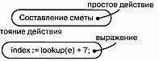
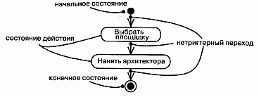
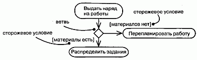
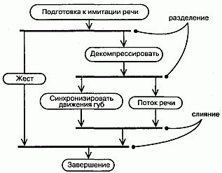
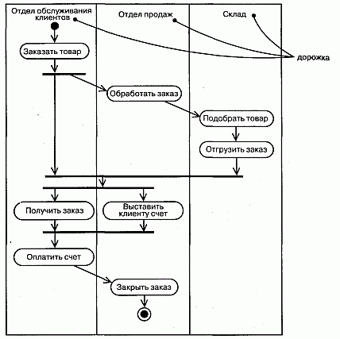
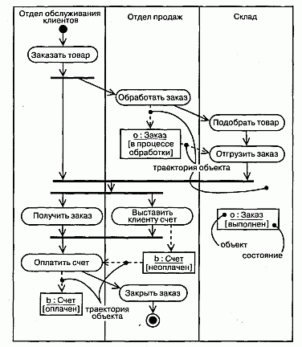
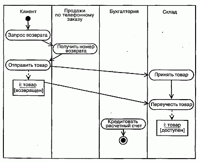

http://bourabai.kz/dbt/uml/ch19.htm

ЧАСТЬ IV - Основы моделирования поведения
# Глава 19. Диаграммы деятельности
* Введение
* Термины и понятия
    * Общие свойства
    * Наполнение
    * Состояния действия и состояния деятельности
    * Переходы
    * Ветвление
    * Разделение и слияние
    * Дорожки
    * Траектория объекта
    * Типичные примеры применения
* Типичные приемы моделирования
    * Рабочий процесс
    * Операция
    * Прямое и обратное проектирование
* Советы

Диаграммы деятельности - это один из пяти видов диаграмм, применяемых в UML для моделирования динамических аспектов поведения системы (другие виды: диаграммы последовательностей и кооперации, состояний, прецедентов, см. главы 18, 24 и 17 соответственно). Диаграмма деятельности - это, по существу, блок-схема, которая показывает, как поток управления переходит от одной деятельности к другой.

Диаграммы деятельности можно использовать для моделирования динамических аспектов поведения системы. Как правило, они применяются, чтобы промоделировать последовательные (а иногда и параллельные) шаги вычислительного процесса. С помощью диаграмм деятельности можно также моделировать жизнь объекта, когда он переходит из одного состояния в другое в разных точках потока управления. Диаграммы деятельности могут использоваться самостоятельно для визуализации, специфицирования, конструирования и документирования динамики совокупности объектов, но они пригодны также и для моделирования потока управления при выполнении некоторой операции. Если в диаграммах взаимодействий акцент делается на переходах потока управления от объекта к объекту, то диаграммы деятельности описывают переходы от одной деятельности к другой. Деятельность (Activity) - это некоторый относительно продолжительный этап выполнения в автомате. В конечном итоге деятельность сводится к некоторому действию (Action, см. главу 15), которое составлено из атомарных вычислений, приводящих к изменению состояния системы или возврату значения.

Диаграммы деятельности важны не только для моделирования динамических аспектов поведения системы, но и для построения выполняемых систем посредством прямого и обратного проектирования.

## Введение
Рассмотрим последовательность операций при постройке дома. Сначала выбирается место. Затем вы нанимаете архитектора, который проектирует дом. После согласования проекта подрядчик предоставляет смету. После того как договорились о цене и проекте, начинается строительство. Местные власти дают разрешение, роется котлован, заливается фундамент, возводится каркас и так далее, пока работа не будет завершена. Наконец, вам вручают ключи и удостоверение на право проживания, и вы вступаете во владение домом.

Хотя в действительности процесс строительства намного сложнее, все же это описание дает представление об основных операциях. В реальном проекте ведется множество параллельных работ. Скажем, электрики могут работать одновременно с водопроводчиками и плотниками. Встречаются также условия и ветвления.

Например, в зависимости от характера грунта при рытье котлована можно будет обойтись экскаватором, но не исключено, что придется прибегнуть к взрывным работам или бороться с плывунами. Вероятны и циклы: к примеру, инспектор может обнаружить нарушение строительных норм и правил, и тогда придется часть работы переделывать заново.

В строительной индустрии, как правило, применяются методики, основанные на Gantt- и Pert-диаграммах, которые позволяют визуализировать, специфицировать, конструировать и документировать последовательность операций при выполнении проекта.

При моделировании программных систем вы сталкиваетесь с аналогичной проблемой. Как лучше всего промоделировать рабочий процесс или функционирование системы? То и другое - аспекты ее динамики (моделирование структурных аспектов системы рассмотрено в частях 2 и 3 данной книги). В принципе есть два варианта, которые напоминают применение Gantt- и Pert-диаграмм.

С одной стороны, можно построить несколько прецедентов, описывающих взаимодействие различных представляющих интерес объектов и сообщения, которыми они обмениваются. В UML такие прецеденты можно моделировать двумя способами: делая акцент на упорядочении сообщений по времени (с помощью диаграмм последовательностей) или на структурных отношениях между взаимодействующими объектами (с помощью диаграмм кооперации, см. главу 18). Такого рода диаграммы взаимодействия близки к Gantt-диаграммам, в фокусе которых находятся объекты (ресурсы), выполняющие некоторую работу во времени.

С другой стороны, динамику поведения можно моделировать с помощью диаграмм деятельности, в которых внимание сосредоточено прежде всего на содержании деятельности, в которой принимают участие объекты, как показано на рис. 19.1. С этой точки зрения диаграммы деятельности напоминают Pert-диаграммы. Диаграмма деятельности - это своеобразная блок-схема, которая описывает последовательность выполнения операций во времени. Ее можно представлять себе как вывернутую наизнанку диаграмму взаимодействий. Диаграмма взаимодействий - это взгляд на объекты, которые передают друг другу сообщения, а диаграмма деятельности - взгляд на операции, которые передаются от одного объекта другому. Семантическое различие трудноуловимо, но в результате нам открываются два совершенно разных взгляда на мир.

#### Рис. 19.1 Диаграмма деятельности

## Термины и понятия
Диаграмма деятельности (Activity diagram) показывает поток переходов от одной деятельности к другой. Деятельность (Activity) - это продолжающийся во времени неатомарный шаг вычислений в автомате. Деятельности в конечном счете приводят к выполнению некоего действия (Action, см. главу 15), составленного из выполняемых атомарных вычислений, каждое из которых либо изменяет состояние системы, либо возвращает какое-то значение. Действие может заключаться в вызове другой операции, посылке сигнала, создании или уничтожении объекта либо в простом вычислении - скажем, значения выражения. Графически диаграмма деятельности представляется в виде графа, имеющего вершины и ребра.

### Общие свойства
Диаграмма деятельности обладает теми же общими свойствами (см. главу 7), которые присущи всем остальным диаграммам: именем и графическим наполнением, проецирующим ее на модель. От всех прочих диаграмму деятельности отличает ее специфичное содержание.

### Наполнение
Диаграмма деятельности в общем случае состоит из:

* состояний деятельности и состояний действия;
* переходов (см. главу 21); Q объектов (см. главу 13).

> Примечание: Диаграмма деятельности, собственно, представляет собой проекцию элементов, присутствующих в графе деятельности, - разновидности автомата, в которой все или большинство состояний - это состояния деятельности, а все или большинство переходов обусловлены завершением деятельности в состоянии-источнике. Поскольку диаграмма деятельности - это автомат, то к ней применимы все характеристики автоматов. Это означает, в частности, что диаграмма деятельности может содержать простые и составные состояния, точки ветвления, разделения и слияния.

Диаграмма деятельности, как и любая другая диаграмма, может содержать примечания и ограничения.

### Состояния действия и состояния деятельности
В потоке управления, моделируемом диаграммой деятельности, происходят различные события. Вы можете вычислить выражение, в результате чего изменяется значение некоторого атрибута или возвращается некоторое значение. Также, например, можно выполнить операцию (см. главы 4 и 9) над объектом (см. главу 15), послать ему сигнал (см. главу 20) или даже создать его или уничтожить. Все эти выполняемые атомарные вычисления называются состояниями (см. главу 21) действия, поскольку каждое из них есть состояние системы, представляющее собой выполнение некоторого действия. Как показано на рис. 19.2, состояния действия изображаются прямоугольниками с закругленными краями. Внутри такого символа можно записывать произвольное выражение.

#### Рис. 19.2 Состояния действия

> Примечание: UML не требует использования какого-либо специального языка для записи таких выражений. Можно просто написать любой структурированный текст, а при необходимости конкретизации заимствовать синтаксис и семантику того или иного языка программирования.

Состояния действия не могут быть подвергнуты декомпозиции. Кроме того, они атомарны. Это значит, что внутри них могут происходить различные события, но выполняемая в состоянии действия работа не может быть прервана. И наконец, обычно предполагается, что длительность одного состояния действия занимает неощутимо малое время.

> Примечание: Конечно, в реальном мире для любого вычисления требуется некоторое время и память. Учет этих свойств в модели особенно важен для встроенных систем реального времени. (Моделирование времени и пространства обсуждается в главе 23.)

В противоположность этому состояния деятельности могут быть подвергнуты дальнейшей декомпозиции, вследствие чего выполняемую деятельность можно представить с помощью других диаграмм деятельности. Состояния деятельности не являются атомарными, то есть могут быть прерваны. Предполагается, что для их завершения требуется заметное время. Можно считать, что состояние действия - это частный вид состояния деятельности, а конкретнее - такое состояние, которое не может быть подвергнуто дальнейшей декомпозиции. А состояние деятельности можно представлять себе как составное состояние, поток управления которого включает только другие состояния деятельности и действий. Взгляните более пристально на внутреннюю структуру состояния деятельности, и вы найдете еще одну диаграмму деятельности. Как видно из рис. 19.3, состояния деятельности и действий обозначаются одинаково, с тем отличием, что у первого могут быть дополнительные части, такие как действия входа и выхода (то есть выполняемые соответственно при входе в состояние и выходе из него), и оно может сопровождаться спецификациями подавтоматов (см. главу 21).

#### Рис. 19.3 Состояния деятельности

> Примечание: Состояния действий и состояния деятельности - это не что иное, как частные случаи состояний автомата. Входя в одно из таких состояний, вы просто выполняете некоторое действие или деятельность, а при выходе управление передается следующему действию или деятельности. Таким образом, состояния деятельности в какой-то мере напоминают стенограмму. Семантически состояние деятельности эквивалентно транзитивному расширению графа деятельности по месту до тех пор, пока не останутся только действия. Тем не менее состояния деятельности важны, поскольку они помогают разбить сложные вычисления на более простые части, точно так же, как операции используются для группировки и повторного использования выражений.

### Переходы
Когда действие или деятельность в некотором состоянии завершается, поток управления сразу переходит в следующее состояние действия или деятельности. Для описания этого потока используются переходы (Transitions, см. главу 21), показывающие путь из одного состояния действия или деятельности в другое. В UML переход представляется простой линией со стрелкой, как показано на рис. 19.4.

#### Рис. 19.4 Нетриггерные переходы

> Примечание: Такие переходы называются переходами по завершении, или не-триггерными (Triggerless), поскольку управление по завершении работы в исходном состоянии немедленно передается дальше. После того как действие в данном исходном состоянии закончилось, выполняется определенное для него действие выхода (если таковое имеется). Далее, безо всякой задержки, поток управления следует переходу и попадает в очередное состояние действия или деятельности. При этом выполняется определенное для нового состояния действие входа (если таковое имеется), затем - действие или деятельность самого состояния и следующий переход. Управление может таким образом переходить из состояния в состояние неопределенно долго (в случае незавершающейся деятельности) или до попадания в конечное состояние. (Нетриггерные переходы могут иметь сторожевые условия, которые обусловливают их активизацию, - см. главу 21.)

Поток управления должен где-то начинаться и заканчиваться (разумеется, если это не бесконечный поток, у которого есть начало, но нет конца). Как показано на рисунке, вы можете задать как начальное состояние (закрашенный кружок), так и конечное (закрашенный кружок внутри окружности).

### Ветвление
Простые последовательные переходы встречаются наиболее часто, но их одних недостаточно для моделирования любого потока управления. Как и в блок-схеме, вы можете включить в модель ветвление, которое описывает различные пути выполнения в зависимости от значения некоторого булевского выражения. Как видно из рис. 19.5, точка ветвления представляется ромбом. В точку ветвления может входить ровно один переход, а выходить - два или более. Для каждого исходящего перехода задается булевское выражение, которое вычисляется только один раз при входе в точку ветвления. Ни для каких двух исходящих переходов эти сторожевые условия не должны одновременно принимать значение "истина", иначе поток управления окажется неоднозначным. Но эти условия должны покрывать все возможные варианты, иначе поток остановится. (Ветвление семантически эквивалентно множественным переходам со сторожевыми условиями, см. главу 21.)

#### Рис. 19.5 Ветвление

Для удобства разрешается использовать ключевое слово else для пометки того из исходящих переходов, который должен быть выбран в случае, если условия, заданные для всех остальных переходов, не выполнены.

Реализовать итерацию можно, если ввести два состояния действия - в первом устанавливается значение счетчика, во втором оно увеличивается - и точку ветвления, вычисление в которой показывает, следует ли прекратить итерации. (Ветвление и итерация возможны также на диаграммах взаимодействий, см. главу 18.)

> Примечание: UML не предписывает язык для этих выражений. В общем случае вы можете использовать структурированный текст; для большей строгости можно воспользоваться синтаксисом и семантикой определенного языка программирования.

### Разделение и слияние
Простые и ветвящиеся последовательные переходы в диаграммах деятельности используются чаще всего. Однако можно встретить и параллельные потоки, и это особенно характерно для моделирования бизнес-процессов. В UML для обозначения разделения и слияния таких параллельных потоков выполнения используется синхронизационная черта, которая рисуется в виде жирной вертикальной или горизонтальной линии. Каждый из параллельно выполняющихся потоков управления существует в контексте независимого активного объекта, который, как правило, моделируется либо процессом, либо вычислительной нитью (см. главу 22).

Рассмотрим, например, параллельные потоки, используемые в устройстве, которое имитирует человеческую речь и жестикуляцию. Как показано на рис. 19.6, точка разделения соответствует расщеплению одного потока управления на два выполняющихся параллельно. В этой точке может существовать ровно один входящий переход и два или более исходящих. Каждый исходящий переход представляет один независимый поток управления. После точки разделения деятельности, ассоциированные с каждым путем в графе, продолжают выполняться параллельно. С концептуальной точки зрения имеется в виду истинный параллелизм, то есть одновременное выполнение, но в реальной системе это может как выполняться (если система функционирует на нескольких узлах, см. главу 26), так и не выполняться (если система размещена только на одном узле). В последнем случае имеет место последовательное выполнение с переключением между потоками, что дает лишь иллюзию истинного параллелизма.

#### Рис. 19.6 Разделение и слияние

Из рисунка также видно, что точка слияния представляет собой механизм синхронизации нескольких параллельных потоков выполнения. В эту точку входят два или более перехода, а выходит ровно один. Выше точки слияния деятельности, ассоциированные с приходящими в нее путями, выполняются параллельно. В точке слияния параллельные потоки синхронизируются, то есть каждый из них ждет, пока все остальные достигнут этой точки, после чего выполнение продолжается в рамках одного потока.

> Примечание: Должен поддерживаться баланс между точками разделения и слияния. Это означает, что число потоков, исходящих из точки разделения, должно быть равно числу потоков, приходящих в соответствую -щую ей точку слияния. Деятельности, выполняемые в параллельных потоках, могут обмениваться друг с другом информацией, посылая сигналы. Такой способ организация взаимодействия последовательных процессов называется сопрограммами (Coroutine). В большинстве случаев при моделировании такого взаимодействия применяются активные объекты (см. главу 22). Но посылку сигналов (см. главу 20) и получение ответов можно моделировать и с помощью подавтоматов, ассоциированных с каждым из взаимодействующих состояний деятельности. Предположим, к примеру, что деятельность Поток речи должна сообщить деятельности Синхронизация движения губ о важных паузах и интонациях. Тогда в автомате, реализующем Поток речи, нужно было бы посылать сигналы автомату, реализующему Синхронизацию движения губ. А в автомате для Синхронизации движения губ присутствовали бы срабатывающие при получении таких сигналов переходы в состояния, где этот автомат на них отвечает.

### Дорожки
При моделировании течения бизнес-процессов иногда бывает полезно разбить состояния деятельности на диаграммах деятельности на группы, каждая из которых представляет отдел компании, отвечающий за ту или иную работу. В UML такие группы называются дорожками (Swimlanes), поскольку визуально каждая группа отделяется от соседних вертикальной чертой, как плавательные дорожки в бассейне (см. рис. 19.7). Дорожки - это разновидность пакетов (см. главу 12), описывающие связанную совокупность работ.

#### Рис. 19.7 Дорожки

Каждой присутствующей на диаграмме дорожке присваивается уникальное имя. Никакой глубокой семантики дорожка не несет, разве что может отражать некоторую сущность реального мира. Каждая дорожка представляет сферу ответственности за часть всей работы, изображенной на диаграмме, и в конечном счете может быть реализована одним или несколькими классами (главы 4 и 9). На диаграмме деятельности, разбитой на дорожки, каждая деятельность принадлежит ровно одной дорожке, но переходы могут пересекать границы дорожек.

> Примечание: Имеется некоторая связь между дорожками и параллельными потоками выполнения. Концептуально деятельность внутри каждой дорожки обычно - но не всегда - рассматривается отдельно от деятельности в соседних дорожках. Это разумно, поскольку в реальном мире подразделения организации, представленные дорожками, как правило, независимы и функционируют параллельно.

### Траектория объекта
В потоке управления, ассоциированном с диаграммой деятельности, могут участвовать объекты (см. главу 13). К примеру, для последовательности операций по обработке заказа, которая изображена на рис. 19.7, словарь (см. главу 4) проблемной области будет, вероятно, включать такие классы, как Заказ и Счет. Некоторые виды деятельности будут порождать объекты-экземпляры этих классов (например, Обработать заказ создаст объект Заказ), тогда как другие виды деятельности будут модифицировать эти объекты (например, Отгрузить заказ может изменить состояние объекта Заказ на выполнен).

Как видно из рис. 19.8, относящиеся к деятельности объекты можно включить в диаграмму деятельности и с помощью символа зависимости (см. главы 5 и 10) привязать к той деятельности или переходу, где они создаются, модифицируются или уничтожаются. Такое сочетание зависимостей и объекта называется траекторией объекта (Object flow), поскольку описывает его участие в потоке управления.

#### Рис. 19.8 Траектория объекта

Кроме изображения траектории объекта на диаграмме деятельности вы можете показать, как изменяются его роль, состояние (см. главу 13) и значения атрибутов (см. главы 4 и 9). Как показано на рисунке, для изображения состояния объекта его имя заключается в скобки и помещается под именем объекта. Аналогично можно представить и значения атрибутов объекта.

### Типичные примеры применения
Диаграммы деятельности используются для моделирования динамических аспектов системы. Эти динамические аспекты могут предполагать деятельность любого уровня абстракции любого вида системной архитектуры (см. главу 2), включая классы (в том числе активные, см. главу 22), интерфейсы (см. главу 11), компоненты (см. главу 2.5) и узлы (см. главу 26).

Использовать диаграмму деятельности для моделирования некоторого динамического аспекта системы можно в контексте практически любого элемента модели. Но чаще всего они рассматриваются в контексте системы в целом, подсистемы (см. главу 31), операции (см. главы 4 и 9) или класса (см. там же). Можно присоединять диаграммы деятельности к прецедентам (см. главу 16) и кооперациям (для моделирования динамических аспектов сообщества объектов).

При моделировании динамических аспектов системы диаграммы деятельности применяются в основном двумя способами:

* для моделирования рабочего процесса. Здесь внимание фокусируется на деятельности с точки зрения актеров, которые сотрудничают с системой. Рабочие процессы часто оказываются с внешней, обращенной к пользователю стороны программной системы и используются для визуализации, специфицирования, конструирования и документирования бизнес-процессов, составляющих существо разрабатываемой системы. Для такого применения диаграмм деятельности моделирование траекторий объектов имеет особенно важное значение;
* для моделирования операции. В этом случае диаграммы деятельности используются как блок-схемы для моделирования деталей вычислений. Для такого применения особенно важно моделирование точек ветвления, разделения и слияния. При этом контекст диаграммы деятельности включает параметры операции и ее локальные объекты.

## Типичные приемы моделирования

### Рабочий процесс
Программные системы не существуют изолированно; всегда имеется некоторый контекст (см. главу 17), в рамках которого система функционирует, причем он всегда включает актеры, взаимодействующие с системой. Рассматривая необходимое для бизнеса программное обеспечение масштаба предприятия, вы обязательно обнаружите, что автоматизированная система работает в контексте бизнес-процессов более высокого уровня. Такие бизнес-процессы являются примерами рабочих процессов, поскольку описывают, как функционирует предприятие и какие в него вовлечены объекты. Например, в розничной торговле имеются как автоматизированные системы (скажем, кассовые терминалы, взаимодействующие с подсистемами маркетинга и складского учета), так и неавтоматизированные (люди, работающие в торговых точках, в отделах дистанционных продаж, маркетинга, заказов и отгрузки). Моделировать эти бизнес-процессы с точки зрения кооперации различных автоматизированных и неавтоматизированных систем можно с помощью диаграмм деятельности.

Для того чтобы построить модель рабочего процесса, необходимо следующее:

1. Выделите какой-либо участок рабочего процесса. Проектируя непростые системы, невозможно отразить все представляющие интерес последовательности на одной диаграмме.
2. Выберите бизнес-объекты, на которые возложена ответственность высокого уровня за части всего рабочего процесса. Это могут быть реальные сущности, вошедшие в системный словарь (см. главу 4), или более абстрактные объекты. В любом случае следует создать отдельную дорожку для каждого бизнес-объекта.
3. Идентифицируйте предусловия для начального состояния рабочего процесса и постусловия (см. главу 9) для его конечного состояния. Это поможет при моделировании границ процесса.
4. Начиная с исходного состояния опишите деятельности и действия, выполняемые в различные моменты времени, а затем отразите их на диаграмме деятельности в виде состояний деятельности или действий.
5. Сложные действия или множества действий, встречающиеся многократно, следует свернуть в состояния деятельности и для каждого из таких состояний составить отдельную диаграмму деятельности.
6. Изобразите переходы, соединяющие состояния этих деятельностей и действий. Сначала нужно сосредоточиться на последовательных потоках, затем перейти к ветвлениям и в последнюю очередь рассмотреть разделения и слияния.
7. Если в рабочий процесс вовлечены важные объекты, изобразите их на диаграмме деятельности. В случае необходимости следует показать изменение значений и состояний таких объектов, чтобы прояснить суть траектории каждого.

Например, на рис. 19.9 показана диаграмма действий для бизнеса, связанного с розничной торговлей. Диаграмма описывает, что происходит, когда клиент возвращает товар, заказанный по почте. Процесс начинается с действия Запрос возврата со стороны Клиента, затем переходит на дорожку Дистанционные продажи (Получить номер возврата), возвращается на дорожку Клиент (Отправить товар), переходит на дорожку Склад (Принять товар, затем Переучесть товар) и завершается на дорожке Бухгалтерия (Кредитовать расчетный счет). Как видно из диаграммы, в процессе участвует один существенный объект (i - экземпляр класса Товар), состояние которого изменяется с возвращен на доступен.

#### Рис. 19.9 Моделирование рабочего процесса

> Примечание: Рабочие процессы, чаще всего представляют собой бизнес-процессы, но это не обязательно. Например, диаграммы действий можно применить для описания процессов разработки программного обеспечения - скажем, процесса управления конфигурацией. В равной мере они пригодны для моделирования непрограммных систем, таких как поток пациентов в учреждении здравоохранения.

В этом примере нет ни ветвлений, ни разделений, ни слияний. С этими элементами мы встретимся при рассмотрении более сложных рабочих процессов.

### Операция
Диаграмму деятельности можно присоединить к любому элементу модели для визуализации, специфицирования, конструирования и документирования поведения этого элемента, в частности к классам (см. главы 4 и 9), интерфейсам (см. главу 11), компонентам (см. главу 25), узлам (см. главу 26), прецедентам (см. главу 16) и кооперациям (см. главу 27). Чаще всего диаграммы деятельности присоединяются к операциям.

При таком использовании диаграмма деятельности становится просто блок-схемой выполняемых действий. Основное преимущество диаграммы деятельности заключается в том, что все ее элементы семантически связаны с лежащей в ее основе богатой моделью. Например, любая другая операция или сигнал, на который есть ссылка из состояния действия, могут быть проверены на соответствие типа классу целевого объекта.

Моделирование операции состоит из следующих шагов:

1. Выявить абстракции, относящиеся к операции. Сюда относятся параметры операции (включая тип возвращаемого значения, если таковое имеется), атрибуты объемлющего класса и некоторых соседних классов.
2. Идентифицируйте предусловия в начальном состоянии и постусловия в конечном состоянии операции. Следует идентифицировать также инварианты объемлющего класса, которые должны сохраняться во время выполнения операции. (Предусловия, постусловия и инварианты рассмотрены в главе 9.)
3. Начиная с исходного состояния операции, специфицируйте деятельности и действия, протекающие во времени, и изобразите их на диаграмме деятельности в виде состояний деятельности или действий.
4. При необходимости используйте точки ветвления для описания условных переходов и итераций.
5. Лишь в том случае, если владельцем операции является активный класс (см. главу 22), используйте точки разделения и слияния для описания параллельных потоков выполнения, если в этом возникает необходимость.

Если операция включает в себя взаимодействие сообщества объектов, ее реализацию можно моделировать с использованием коопераций - см. главу 27.

Так, на рис. 19.10 представлена диаграмма деятельности для класса Line (ПрямаяЛиния), которая описывает алгоритм операции пересечение. Сигнатура алгоритма состоит из одного параметра (1 - входной параметр класса Line) и одного возвращаемого значения (класса Point, Точка). Из атрибутов класса Line интерес представляют два: slope (тангенс угла наклона прямой) и delta (смещение прямой относительно начала координат).

#### Рис. 19.10 Моделирование операции

Алгоритм операции пересечения несложен, как явствует из диаграммы деятельности. В самом начале имеется сторожевое условие, которое проверяет, совпадает ли наклон текущей прямой с наклоном параметра 1. Если условие выполнено, то прямые не пересекаются и возвращается точка Point (0, 0). В противном случае сначала вычисляется абсцисса х точки пересечения, а затем - ордината у. Объекты х и у являются локальными для операции. И наконец, возвращается точка Point (х,у).

> Примечание: Использование диаграмм деятельности в качестве блок-схем практически превращает UML в язык визуального программирования. Можно нарисовать блок-схему для каждой операции, но вряд ли в этом есть необходимость. Более естественно кодировать тело операции на некотором языке программирования. Использование диаграмм деятельности для моделирования операции становится разумным, когда эта операции сложна, так что разобраться в ней, глядя только на код, достаточно трудно. Взгляд же на блок-схему позволит понять такие аспекты алгоритма, которые нелегко было бы уловить, изучая один лишь код.

### Прямое и обратное проектирование
Для диаграмм деятельности возможно прямое проектирование (создание кода на основе модели), особенно если диаграмма моделирует операцию. Например, из показанной выше диаграммы работ инструментальная программа могла бы сгенерировать для операции пересечение следующий код на языке C++:

	
	Point Line::intersection(I : Line)  {
	   if (slope == 1.slope) return Point(0,0);
	   int x =  (1.delta - delta)  /  (slope - 1.slope);
	   int у =  (slope * x) + delta;
	   return Point(x,y); 
	}
 
В этом коде отражена некоторая тонкость - объявление двух локальных переменных одновременно с присваиванием. "Менее развитый" инструмент мог бы сначала объявить переменные и лишь затем присвоить им значения.

Обратное проектирование (создание модели на основе кода) для диаграмм деятельности также возможно, особенно в случае, когда код представляет собой тело операции. В частности, из реализации класса Line может быть сгенерирована показанная выше диаграмма.

Однако интереснее не конструировать модель по коду, а подвергнуть ее анимации, демонстрируя, как "живет" установленная система. Например, инструментальная программа могла бы анимировать состояния действий на диаграмме, описанной выше, показывая, как они изменяются в работающей системе. Еще лучше было бы, если, работая с этой программой под отладчиком, вы могли бы контролировать скорость выполнения и, возможно, устанавливать точки прерывания в представляющих интерес местах, чтобы просмотреть значения атрибутов отдельных объектов.

## Советы
Создавая в UML диаграммы деятельности, не забывайте, что они лишь моделируют срез некоторых динамических аспектов поведения системы. С помощью единственной диаграммы деятельности никогда не удастся охватить все динамические аспекты системы. Вместо этого следует использовать разные диаграммы деятельности для моделирования динамики рабочих процессов или отдельных операций.

Диаграмму деятельности можно признать хорошо структурированной, если она:

* сконцентрирована на описании одного аспекта динамики системы;
* содержит только те элементы, которые существенны для понимания этого аспекта;
* представляет лишь те детали, которые соответствуют своему уровню абстракции; не должно быть дополнений, которые не являются необходимыми для понимания;
* не настолько кратка, чтобы читатель упустил из виду важные аспекты семантики.

Рисуя диаграмму деятельности, руководствуйтесь следующими принципами:

* дайте диаграмме имя, соответствующее ее назначению;
* начинайте с моделирования главного потока. Ветвления, параллельность и траектории объектов являются второстепенными деталями, которые можно изобразить на отдельной диаграмме;
* располагайте элементы так, чтобы число пересечений было минимальным;
* используйте примечания и закраску, чтобы привлечь внимание к важным особенностям диаграммы.

