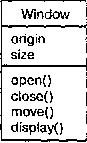
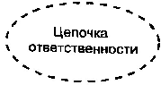
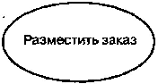
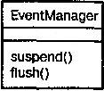
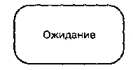
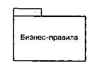
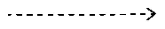

http://bourabai.kz/dbt/uml/ch2.htm

Часть I - Введение в процесс моделирования
# Глава 2. Введение в язык UML
* Предисловие
* Обзор UML
    * UML - это язык
    * UML - это язык визуализации
    * UML - это язык специфицирования
    * UML - это язык конструирования
    * UML - это язык документирования
    * Где используется UML
* Концептуальная модель UML
    * Строительные блоки UML
    * Правила языка UML
    * Общие механизмы языка UML
* Архитектура
* Жизненный цикл разработки ПО

## Предисловие
Унифицированный язык моделирования (UML) является стандартным инструментом для создания "чертежей" программного обеспечения. С помощью UML можно визуализировать, специфицировать, конструировать и документировать артефакты программных систем.

UML пригоден для моделирования любых систем: от информационных систем масштаба предприятия до распределенных Web-приложений и даже встроенных систем реального времени. Это очень выразительный язык, позволяющий рассмотреть систему со всех точек зрения, имеющих отношение к ее разработке и последующему развертыванию. Несмотря на обилие выразительных возможностей, этот язык прост для понимания и использования. Изучение UML удобнее всего начать с его концептуальной модели, которая включает в себя три основных элемента: базовые строительные блоки, правила, определяющие, как эти блоки могут сочетаться между собой, и некоторые общие механизмы языка.

Несмотря на свои достоинства, UML - это всего лишь язык; он является одной из составляющих процесса разработки программного обеспечения, и не более того. Хотя UML не зависит от моделируемой реальности, лучше всего применять его, когда процесс моделирования основан на рассмотрении прецедентов использования, является итеративным и пошаговым, а сама система имеет четко выраженную архитектуру.

## Обзор UML
UML - это язык для визуализации, специфицирования, конструирования и документирования артефактов программных систем.

UML - это язык
Язык состоит из словаря и правил, позволяющих комбинировать входящие в него слова и получать осмысленные конструкции. В языке моделирования словарь и правила ориентированы на концептуальное и физическое представление системы. Язык моделирования, подобный UML, является стандартным средством для составления "чертежей" программного обеспечения.

Моделирование необходимо для понимания системы. При этом единственной модели никогда не бывает достаточно. Напротив, для понимания любой нетривиальной системы приходится разрабатывать большое количество взаимосвязанных моделей. В применении к программным системам это означает, что необходим язык, с помощью которого можно с различных точек зрения описать представления архитектуры системы на протяжении цикла ее разработки (см. главу 1).

Словарь и правила такого языка, как UML, объясняют, как создавать и читать хорошо определенные модели, но ничего не сообщают о том, какие модели и в каких случаях нужно создавать. Это задача всего процесса разработки программного обеспечения. Хорошо организованный процесс должен подсказать вам, какие требуются артефакты, какие ресурсы необходимы для их создания, как можно использовать эти артефакты, чтобы оценить выполненную работу и управлять проектом в целом.

UML - это язык визуализации
С точки зрения большинства программистов, размышления по поводу реализации проекта почти эквивалентны написанию для него кода. Вы думаете - значит, вы кодируете. И действительно, некоторые вещи лучше всего выражаются непосредственно в коде на каком-либо языке программирования, поскольку текст программы - это самый простой и короткий путь для записи алгоритмов и выражений.

Но даже в таких случаях программист занимается моделированием, хотя и неформально. Он может, допустим, записать набросок идеи на доске или на салфетке. Однако такой подход чреват неприятностями. Во-первых, обмен мнениями по поводу концептуальной модели возможен только тогда, когда все участники дискуссии говорят на одном языке. Как правило, при разработке проектов компаниям приходится изобретать собственные языки, и новичку непросто догадаться, о чем идет речь. Во-вторых, нельзя получить представление об определенных аспектах программных систем без модели, выходящей за границы текстового языка программирования. Так, назначение иерархии классов можно, конечно, понять, если внимательно изучить код каждого класса, но воспринять всю структуру сразу и целиком не получится. Аналогично изучение кода системы не позволит составить целостное представление о физическом распределении и возможных миграциях объектов в Web-приложении. В-третьих, если автор кода никогда не воплощал в явной форме задуманные им модели, эта информация будет навсегда утрачена, если он сменит место работы. В лучшем случае ее можно будет лишь частично воссоздать исходя из реализации.

Использование UML позволяет решить третью проблему: явная модель облегчает общение.

Некоторые особенности системы лучше всего моделировать в виде текста, другие - графически. На самом деле во всех интересных системах существуют структуры, которые невозможно представить с помощью одного лишь языка программирования. UML - графический язык, что позволяет решить вторую из обозначенных проблем.

UML - это не просто набор графических символов. За каждым из них стоит хорошо определенная семантика (см. "The Unified Modeling Language Reference Manual"). Это значит, что модель, написанная одним разработчиком, может быть однозначно интерпретирована другим - или даже инструментальной программой. Так решается первая из перечисленных выше проблем.

### UML - это язык специфицирования
В данном контексте специфицирование означает построение точных, недвусмысленных и полных моделей. UML позволяет специфицировать все существенные решения, касающиеся анализа, проектирования и реализации, которые должны приниматься в процессе разработки и развертывания системы программного обеспечения.

### UML - это язык конструирования
UML не является языком визуального программирования, но модели, созданные с его помощью, могут быть непосредственно переведены на различные языки программирования. Иными словами, UML-модель можно отобразить на такие языки, как Java, C++, Visual Basic, и даже на таблицы реляционной базы данных или устойчивые объекты объектно-ориентированной базы данных. Те понятия, которые предпочтительно передавать графически, так и представляются в UML; те же, которые лучше описывать в текстовом виде, выражаются с помощью языка программирования.

Такое отображение модели на язык программирования позволяет осуществлять прямое проектирование: генерацию кода из модели UML в какой-то конкретный язык. Можно решить и обратную задачу: реконструировать модель по имеющейся реализации. Обратное проектирование не представляет собой ничего необычного. Если вы не закодировали информацию в реализации, то эта информация теряется при прямом переходе от моделей к коду. Поэтому для обратного проектирования необходимы как инструментальные средства, так и вмешательство человека. Сочетание прямой генерации кода и обратного проектирования позволяет работать как в графическом, так и в текстовом представлении, если инструментальные программы обеспечивают согласованность между обоими представлениями. Моделирование структуры системы обсуждается в частях 2 и 3.

Помимо прямого отображения в языки программирования UML в силу своей выразительности и однозначности позволяет непосредственно исполнять модели, имитировать поведение систем и контролировать действующие системы. Моделирование поведения системы обсуждается в частях 4 и 5.

### UML - это язык документирования
Компания, выпускающая программные средства, помимо исполняемого кода производит и другие артефакты, в том числе следующие:

* требования к системе;
* архитектуру;
* проект;
* исходный код;
* проектные планы;
* тесты;
* прототипы;
* версии, и др.

В зависимости от принятой методики разработки выполнение одних работ производится более формально, чем других. Упомянутые артефакты - это не просто поставляемые составные части проекта; они необходимы для управления, для оценки результата, а также в качестве средства общения между членами коллектива во время разработки системы и после ее развертывания.

UML позволяет решить проблему документирования системной архитектуры и всех ее деталей, предлагает язык для формулирования требований к системе и определения тестов и, наконец, предоставляет средства для моделирования работ на этапе планирования проекта и управления версиями.

### Где используется UML
Язык UML предназначен прежде всего для разработки программных систем. Его использование особенно эффективно в следующих областях:

* информационные системы масштаба предприятия;
* банковские и финансовые услуги;
* телекоммуникации;
* транспорт;
* оборонная промышленность, авиация и космонавтика;
* розничная торговля;
* медицинская электроника;
* наука;
* распределенные Web-системы.

Сфера применения UML не ограничивается моделированием программного обеспечения. Его выразительность позволяет моделировать, скажем, документооборот в юридических системах, структуру и функционирование системы обслуживания пациентов в больницах, осуществлять проектирование аппаратных средств.

## Концептуальная модель UML
Для понимания UML необходимо усвоить его концептуальную модель, которая включает в себя три составные части: основные строительные блоки языка, правила их сочетания и некоторые общие для всего языка механизмы. Усвоив эти элементы, вы сумеете читать модели на UML и самостоятельно создавать их -вначале, конечно, не очень сложные. По мере приобретения опыта в работе с языком вы научитесь пользоваться и более развитыми его возможностями.

### Строительные блоки UML
Словарь языка UML включает три вида строительных блоков:

* сущности;
* отношения;
* диаграммы.

Сущности - это абстракции, являющиеся основными элементами модели. Отношения связывают различные сущности; диаграммы группируют представляющие интерес совокупности сущностей.

В UML имеется четыре типа сущностей:

* структурные;
* поведенческие;
* группирующие;
* аннотационные.

Сущности являются основными объектно-ориентированными блоками языка.. С их помощью можно создавать корректные модели.

Структурные сущности - это имена существительные в моделях на языке UML. Как правило, они представляют собой статические части модели, соответствующие концептуальным или физическим элементам системы. Существует семь разновидностей структурных сущностей.

Класс (Class) - это описание совокупности объектов с общими атрибутами, операциями, отношениями и семантикой (см. главы 4 и 9). Класс реализует один или несколько интерфейсов. Графически класс изображается в виде прямоугольника, в котором обычно записаны его имя, атрибуты и операции, как показано на рис. 2.1.

#### Рис. 2.1 Классы

Интерфейс (Interface) - это совокупность операций, которые определяют сервис (набор услуг), предоставляемый классом или компонентом (см. главу 11). Таким образом, интерфейс описывает видимое извне поведение элемента. Интерфейс может представлять поведение класса или компонента полностью или частично; он определяет только спецификации операций (сигнатуры), но никогда - их реализации. Графически интерфейс изображается в виде круга, под которым пишется его имя, как показано на рис. 2.2. Интерфейс редко существует сам по себе - обычно он присоединяется к реализующему его классу или компоненту.

#### Рис. 2.2 Интерфейсы

Кооперация (Collaboration) определяет взаимодействие; она представляет собой совокупность ролей и других элементов, которые, работая совместно, производят некоторый кооперативный эффект, не сводящийся к простой сумме слагаемых (см. главу 27). Кооперация, следовательно, имеет как структурный, так и поведенческий аспект. Один и тот же класс может принимать участие в нескольких кооперациях; таким образом, они являются реализацией образцов поведения, формирующих систему. Графически кооперация изображается в виде эллипса, ограниченного пунктирной линией, в который обычно заключено только имя, как показано на рис. 2.3.

#### Рис. 2.3 Кооперации

Прецедент (Use case) - это описание последовательности выполняемых системой действий, которая производит наблюдаемый результат,значимый для какого-то определенного актера (Actor). Прецедент применяется для структурирования поведенческих сущностей модели (см. главу 16). Прецеденты реализуются посредством кооперации. Графически прецедент изображается в виде ограниченного непрерывной линией эллипса, обычно содержащего только его имя, как показано на рис. 2.4.

#### Рис. 2.4 Прецеденты

Три другие сущности - активные классы, компоненты и узлы - подобны классам: они описывают совокупности объектов с общими атрибутами, операциями, отношениями и семантикой. Тем не менее они в достаточной степени отличаются друг от друга и от классов и, учитывая их важность при моделировании определенных аспектов объектно-ориентированных систем, заслуживают специального рассмотрения.

Активным классом (Active class) называется класс, объекты которого вовлечены в один или несколько процессов, или нитей (Threads), и поэтому могут инициировать управляющее воздействие (см. главу 22). Активный класс во всем подобен обычному классу, за исключением того, что его объекты представляют собой элементы, деятельность которых осуществляется одновременно с деятельностью других элементов. Графически активный класс изображается так же, как простой класс, но ограничивающий прямоугольник рисуется жирной линией и обычно включает имя, атрибуты и операции, как показано на рис. 2.5.

#### Рис. 2.5 Активные классы

Два оставшихся элемента - компоненты и узлы - также имеют свои особенности. Они соответствуют физическим сущностям системы, в то время как пять предыдущих - концептуальным и логическим сущностям.

Компонент (Component) - это физическая заменяемая часть системы, которая соответствует некоторому набору интерфейсов и обеспечивает его реализацию (см. главу 24). В системе можно встретить различные виды устанавливаемых компонентов, такие как СОМ+ или Java Beans, а также компоненты, являющиеся артефактами процесса разработки, например файлы исходного кода. Компонент, как правило, представляет собой физическую упаковку логических элементов, таких как классы, интерфейсы и кооперации. Графически компонент изображается в виде прямоугольника с вкладками, содержащего обычно только имя, как показано на рис. 2.6.

#### Рис. 2.6 Компоненты

Узел (Node) - это элемент реальной (физической) системы, который существует во время функционирования программного комплекса и представляет собой вычислительный ресурс, обычно обладающий как минимум некоторым объемом памяти, а часто еще и способностью обработки (см. главу 26). Совокупность компонентов может размещаться в узле, а также мигрировать с одного узла на другой. Графически узел изображается в виде куба, обычно содержащего только имя, как показано на рис. 2.7

#### Рис. 2.7 Узлы

Эти семь базовых элементов - классы, интерфейсы, кооперации, прецеденты, активные классы, компоненты и узлы - являются основными структурными сущностями, которые могут быть включены в модель UML Существуют также разновидности этих сущностей: актеры, сигналы, утилиты (виды классов), процессы и нити (виды активных классов), приложения, документы, файлы, библиотеки, страницы и таблицы (виды компонентов).

Поведенческие сущности (Behavioral things) являются динамическими составляющими модели UML. Это глаголы языка: они описывают поведение модели во времени и пространстве. (Прецеденты, которые используются для их структурирования, рассмотрены в главе 16.) Существует всего два основных типа поведенческих сущностей.

Взаимодействие (Interaction) - это поведение, суть которого заключается в обмене сообщениями (Messages) между объектами в рамках конкретного контекста для достижения определенной цели (см. главу 15). С помощью взаимодействия можно описать как отдельную операцию, так и поведение совокупности объектов. Взаимодействие предполагает ряд других элементов, таких как сообщения, последовательности действий (поведение, инициированное сообщением) и связи (между объектами). Графически сообщения изображаются в виде стрелки, над которой почти всегда пишется имя соответствующей операции, как показано на рис. 2.8.

#### Рис. 2.8 Сообщения

Автомат (State machine) - это алгоритм поведения, определяющий последовательность состояний, через которые объект или взаимодействие проходят на протяжении своего жизненного цикла в ответ на различные события, а также реакции на эти события (см. главу 21). С помощью автомата можно описать поведение отдельного класса или кооперации классов. С автоматом связан ряд других элементов: состояния, переходы (из одного состояния в другое), события (сущности, инициирующие переходы) и виды действий (реакция на переход). Графически состояние изображается в виде прямоугольника с закругленными углами, содержащего имя и, возможно, подсостояния (см. рис. 2.9).

#### Рис. 2.9 Состояния

Эти два элемента - взаимодействия и автоматы -являются основными поведенческими сущностями, входящими в модель UML. Семантически они часто бывают связаны с различными структурными элементами, в первую очередь - классами, кооперациями и объектами.

Группирующие сущности являются организующими частями модели UML. Это блоки, на которые можно разложить модель. Есть только одна первичная группирующая сущность, а именно пакет.

Пакеты (Packages) представляют собой универсальный механизм организации элементов в группы (см. главу 12). В пакет можно поместить структурные, поведенческие и даже другие группирующие сущности. В отличие от компонентов, существующих во время работы программы, пакеты носят чисто концептуальный характер, то есть существуют только во время разработки.

Изображается пакет в виде папки с закладкой, содержащей, как правило, только имя и иногда - содержимое (см. рис. 2.10).

#### Рис. 2.10 Пакеты

Пакеты - это основные группирующие сущности, с помощью которых можно организовать модель UML. Существуют также вариации пакетов, например каркасы (Frameworks), модели и подсистемы.

Аннотационные сущности - пояснительные части модели UML. Это комментарии для дополнительного описания, разъяснения или замечания к любому элементу модели. Имеется только один базовый тип аннотационных элементов - примечание (Note). Примечание - это просто символ для изображения комментариев или ограничений, присоединенных к элементу или группе элементов (см. главу 6). Графически примечание изображается в виде прямоугольника с загнутым краем, содержащим текстовый или графический комментарий, как показано на рис. 2.11.

#### Рис. 2.11 Примечания

Этот элемент является основной аннотационной сущностью, которую можно включать в модель UML. Чаще всего примечания используются, чтобы снабдить диаграммы комментариями или ограничениями, которые можно выразить в виде неформального или формального текста. Существуют вариации этого элемента, например требования, где описывают некое желательное поведение с точки зрения внешней по отношению к модели.

В языке UML определены четыре типа отношений:

* зависимость;
* ассоциация;
* обобщение;
* реализация.

Эти отношения являются основными связующими строительными блоками в UML и применяются для создания корректных моделей.

Зависимость (Dependency) - это семантическое отношение между двумя сущностями, при котором изменение одной из них, независимой, может повлиять на семантику другой, зависимой (см. главы 5 и 10). Графически зависимость изображается в виде прямой пунктирной линии, часто со стрелкой, которая может содержать метку (см. рис. 2.12).

#### Рис. 2.12 Зависимости

Ассоциация (Association) - структурное отношение, описывающее совокупность связей; связь - это соединение между объектами (см. главы 5 и 10). Разновидностью ассоциации является агрегирование (Aggregation) - так называют структурное отношение между целым и его частями. Графически ассоциация изображается в виде прямой линии (иногда завершающейся стрелкой или содержащей метку), рядом с которой могут присутствовать дополнительные обозначения, например кратность и имена ролей. На рис. 2.13 показан пример отношений этого типа.

#### Рис. 2.13 Ассоциации

Обобщение (Generalization) - это отношение "специализация/обобщение", при котором объект специализированного элемента (потомок) может быть подставлен вместо объекта обобщенного элемента (родителя или предка). (О родителях и потомках подробно рассказывается в главах 5 и 10.) Таким образом, потомок (Child) наследует структуру и поведение своего родителя (Parent). Графически отношение обобщения изображается в виде линии с незакрашенной стрелкой, указывающей на родителя, как показано на рис. 2.14. Наконец, реализация (Realization) - это семантическое отношение между классификаторами, при котором один классификатор определяет "контракт", а другой гарантирует его выполнение (см. главу 10).

#### Рис. 2.14 Обобщения

Отношения реализации встречаются в двух случаях: во-первых, между интерфейсами и реализующими их классами или компонентами, а во-вторых, между прецедентами и реализующими их кооперациями. Отношение реализации изображается в виде пунктирной линии с незакрашенной стрелкой, как нечто среднее между отношениями обобщения и зависимости (см. рис. 2.15). Четыре описанных элемента являются основными типами отношений, которые можно включать в модели UML. Существуют также их вариации, например уточнение (Refinement), трассировка (Trace), включение и расширение (для зависимостей). Диаграмма в UML - это графическое представление набора элементов, изображаемое чаще всего в виде связанного графа с вершинами (сущностями) и ребрами (отношениями). Диаграммы рисуют для визуализации системы с разных точек зрения. Диаграмма - в некотором смысле одна из проекций системы. Как правило, за исключением наиболее тривиальных случаев, диаграммы дают свернутое представление элементов, из которых составлена система. Один и тот же элемент может присутствовать во всех диаграммах, или только в нескольких (самый распространенный вариант), или не присутствовать ни в одной (очень редко). Теоретически диаграммы могут содержать любые комбинации сущностей и отношений. На практике, однако, применяется сравнительно небольшое количество типовых комбинаций, соответствующих пяти наиболее употребительным видам, которые составляют архитектуру программной системы (см. следующий раздел).

#### Рис. 2.15 Реализации

Таким образом, в UML выделяют девять типов * диаграмм:
* диаграммы классов;
* диаграммы объектов;
* диаграммы прецедентов;
* диаграммы последовательностей;
* диаграммы кооперации;
* диаграммы состояний;
* диаграммы действий;
* диаграммы компонентов;
* диаграммы развертывания.

На диаграмме классов показывают классы, интерфейсы, объекты и кооперации, а также их отношения (см. главу 8). При моделировании объектно-ориентированных систем этот тип диаграмм используют чаще всего. Диаграммы классов соответствуют статическому виду системы с точки зрения проектирования. Диаграммы классов, которые включают активные классы, соответствуют статическому виду системы с точки зрения процессов.

На диаграмме объектов представлены объекты и отношения между ними (см. главу 14). Они являются статическими "фотографиями" экземпляров сущностей, показанных на диаграммах классов. Диаграммы объектов, как и диаграммы классов, относятся к статическому виду системы с точки зрения проектирования или процессов, но с расчетом на настоящую или макетную реализацию.

На диаграмме прецедентов представлены прецеденты и актеры (частный случай классов), а также отношения между ними (см. главу 17). Диаграммы прецедентов относятся к статическому виду системы с точки зрения прецедентов использования. Они особенно важны при организации и моделировании поведения системы.

Диаграммы последовательностей и кооперации являются частными случаями диаграмм взаимодействия. На диаграммах взаимодействия представлены связи между объектами; показаны, в частности, сообщения, которыми объекты могут обмениваться (см. главу 18). Диаграммы взаимодействия относятся к динамическому виду системы. При этом диаграммы последовательности отражают временную упорядоченность сообщений, а диаграммы кооперации - структурную организацию обменивающихся сообщениями объектов. Эти диаграммы являются изоморфными, то есть могут быть преобразованы друг в друга.

На диаграммах состояний (Statechart diagrams) представлен автомат, включающий в себя состояния, переходы, события и виды действий (см. главу 24). Диаграммы состояний относятся к динамическому виду системы; особенно они важны при моделировании поведения интерфейса, класса или кооперации. Они акцентируют внимание на поведении объекта, зависящем от последовательности событий, что очень полезно для моделирования реактивных систем.

Диаграмма деятельности - это частный случай диаграммы состояний; на ней представлены переходы потока управления от одной деятельности к другой внутри системы (см. главу 19). Диаграммы деятельности относятся к динамическому виду системы; они наиболее важны при моделировании ее функционирования и отражают поток управления между объектами.

На диаграмме компонентов представлена организация совокупности компонентов и существующие между ними зависимости (см. главу 29). Диаграммы компонентов относятся к статическому виду системы с точки зрения реализации. Они могут быть соотнесены с диаграммами классов, так как компонент обычно отображается на один или несколько классов, интерфейсов или коопераций.

На диаграмме развертывания представлена конфигурация обрабатывающих узлов системы и размещенных в них компонентов (см. главу 30). Диаграммы развертывания относятся к статическому виду архитектуры системы с точки зрения развертывания. Они связаны с диаграммами компонентов, поскольку в узле обычно размещаются один или несколько компонентов.

Здесь приведен неполный список диаграмм, применяемых в UML. Инструментальные средства позволяют генерировать и другие диаграммы, но девять перечисленных встречаются на практике чаще всего.

## Правила языка UML
Строительные блоки UML нельзя произвольно объединять друг с другом. Как и любой другой язык, UML характеризуется набором правил, определяющих, как должна выглядеть хорошо оформленная модель, то есть семантически самосогласованная и находящаяся в гармонии со всеми моделями, которые с нею связаны.

В языке UML имеются семантические правила, позволяющие корректно и однозначно определять:
* имена, которые можно давать сущностям, отношениям и диаграммам;
* область действия (контекст, в котором имя имеет некоторое значение);
* видимость (когда имена видимы и могут использоваться другими элементами);
* целостность (как элементы должны правильно и согласованно соотноситься друг с другом);
* выполнение (что значит выполнить или имитировать некоторую динамическую модель).

Модели, создаваемые в процессе разработки программных систем, эволюционируют со временем и могут неоднозначно рассматриваться разными участниками проекта в разное время. По этой причине создаются не только хорошо оформленные модели, но и такие, которые:

* содержат скрытые элементы (ряд элементов не показывают, чтобы упростить восприятие);
* неполные (отдельные элементы пропущены);
* несогласованные (целостность модели не гарантируется).

Появление не слишком хорошо оформленных моделей неизбежно в процессе разработки, пока не все детали системы прояснились в полной мере. Правила языка UML побуждают - хотя не требуют - в ходе работы над моделью решать наиболее важные вопросы анализа, проектирования и реализации, в результате чего модель со временем становится хорошо оформленной.

## Общие механизмы языка UML
Строительство упрощается и ведется более эффективно, если придерживаться некоторых соглашений. Следуя определенным архитектурным образцам, можно оформить здание в викторианском или французском стиле. Тот же принцип применим и в отношении UML. Работу с этим языком существенно облегчает последовательное использование общих механизмов, перечисленных ниже:

* спецификации (Specifications);
* дополнения (Adornments);
* принятые деления (Common divisions);
* механизмы расширения (Extensibility mechanisms).

UML - это не просто графический язык. За каждой частью его системы графической нотации стоит спецификация, содержащая текстовое представление синтаксиса и семантики соответствующего строительного блока. Например, пиктограмме класса соответствует спецификация, полностью описывающая его атрибуты, операции (включая полные сигнатуры) и поведение, хотя визуально пиктограмма порой отражает только малую часть этой совокупности. Более того, может существовать другое представление этого класса, отражающее совершенно иные его аспекты, но тем не менее соответствующее все той же спецификации. С помощью графической нотации UML вы визуализируете систему, с помощью спецификаций UML - описываете ее детали. Таким образом, допустимо строить модель инкрементно, то есть пошаговым образом - сначала нарисовать диаграмму, а потом добавить семантику в спецификацию модели, или наоборот - начать со спецификации (возможно, применив обратное проектирование к существующей системе), а потом на ее основе создавать диаграммы.

Спецификации UML создают семантический задний план, который полностью включает в себя составные части всех моделей системы, согласованные между собой. Таким образом, диаграммы UML можно считать визуальными проекциями на этот задний план, при этом каждая из них раскрывает один из значимых аспектов системы.

Почти каждый из элементов UML имеет соответствующее ему уникальное графическое обозначение, которое дает визуальное представление о самых важных аспектах этого элемента. Например, обозначение класса специально придумано так, чтобы его было легко рисовать, поскольку классы - наиболее употребительный элемент при моделировании объектно-ориентированных систем. Нотация класса содержит самые важные его характеристики: имя, атрибуты и операции.

Спецификация класса может содержать и другие детали, например видимость атрибутов и операций или указание на то, что класс является абстрактным. Многие такие детали можно визуализировать в виде графических или текстовых дополнений к стандартному прямоугольнику, служащему изображением класса. Так, на рис. 2.16 показан класс, в обозначение которого включены сведения о том, что он абстрактный и содержит две открытые, одну защищенную и одну закрытую операцию.

#### Рис. 2.16 Дополнения

Каждый элемент нотации UML содержит базовый для него символ, к которому можно добавлять разнообразные специфичные для него дополнения (см. главу 6).

Принятые деления. При моделировании объектно-ориентированных систем реальность членится с учетом по крайней мере двух подходов.

Прежде всего, существует разделение на классы и объекты. Класс - это абстракция, объект - конкретная материализация этой абстракции (см. главу 13). В языке UML можно моделировать и классы, и объекты, как показано на рис. 2.17.

#### Рис. 2.17 . Классы и объекты

На этом рисунке показан один класс Customer (Клиент) и три объекта: Jan (явно определенный как объект данного класса), :Customer (анонимный объект класса Customer) и Elyse (спецификация которого относит его к классу Customer, хотя это и не выражено явно).

Практически все строительные блоки UML характеризуются дихотомией "класс/объект". Так, имеются прецеденты и экземпляры прецедентов, компоненты и экземпляры компонентов, узлы и экземпляры узлов и т.д. В графическом представлении для объекта принято использовать тот же символ, что и для его класса, а название объекта подчеркивать.

Еще одним вариантом членения является деление на интерфейс и его реализацию. Интерфейс декларирует контракт (см. главу 11), а реализация представляет конкретное воплощение этого контракта и обязуется точно следовать объявленной семантике интерфейса. UML позволяет моделировать обе эти категории, интерфейсы и их реализации, как показано на рис. 2.18: в данном случае один компонент spellingwizard.dll реализует два интерфейса lUnknown и ISpelling. Почти все строительные блоки UML характеризуются дихотомией "интерфейс/реализация". Например, прецеденты реализуются кооперациями, а операции - методами.

#### Рис. 2.18 Интерфейсы и реализации

Механизмы расширения. UML - это стандартный язык для разработки "чертежей" программного обеспечения, но ни один замкнутый язык не в состоянии охватить нюансы всех возможных моделей в различных предметных областях. Поэтому UML является открытым языком, то есть допускает контролируемые расширения. Механизмы расширения UML (см. главу 6) включают:

* стереотипы;
* помеченные значения;
* ограничения.

Стереотип (Stereotype) расширяет словарь UML, позволяя на основе существующих блоков языка создавать новые, специфичные для решения конкретной проблемы. Например, работая с такими языками программирования, как Java или C++, часто приходится моделировать исключения (Exceptions) - они являются обыкновенными классами, хотя и рассматриваются особым образом. Обычно требуется, чтобы исключения можно было возбуждать и перехватывать, и ничего больше. Если пометить исключения соответствующим стереотипом, то с ними можно будет обращаться как с обычными строительными блоками языка; на рис. 2.19 это продемонстрировано на примере класса Overflow.

#### Рис. 2.19 Механизмы расширения

Помеченное значение (Tagged value) расширяет свойства строительных блоков UML, позволяя включать новую информацию в спецификацию элемента. Скажем, если вы работаете над "коробочным" продуктом и выпускаете много его версий, то зачастую необходимо отслеживать версию и автора какой-нибудь важной абстракции. Ни версия, ни автор не являются первичными концепциями UML, но их можно добавить к любому блоку, такому, например, как класс, задавая для него новые помеченные значения. На рис. 2.19 показано, как это можно сделать, на примере класса EventQueue.

Ограничения (Constraints) расширяют семантику строительных блоков UML, позволяя определять новые или изменять существующие правила. Вы можете, например, ограничить класс EventQueue так, чтобы все события добавлялись в очередь по порядку. На рис. 2.19 показано, как можно определить ограничение, которое явно постулирует это правило для операции add.

Совместно эти три механизма расширения языка позволяют модифицировать UML в соответствии с потребностями вашего проекта. Кроме того, они дают возможность адаптировать UML к новым технологиям разработки программного обеспечения, например к вероятному появлению более мощных языков распределенного программирования. С помощью механизмов расширения можно создавать новые строительные блоки, модифицировать существующие и даже изменять их семантику. Не забывайте, однако, о чувстве меры: за расширениями важно не потерять главную цель UML - возможность обмена информацией.

## Архитектура
Для визуализации, специфицирования, конструирования и документирования программных систем необходимо рассматривать их с различных точек зрения (см. главу 1). Все, кто имеет отношение к проекту, - конечные пользователи, аналитики, разработчики, системные интеграторы, тестировщики, технические писатели и менеджеры проектов - преследуют собственные интересы, и каждый смотрит на создаваемую систему, по-разному в различные моменты ее жизни. Системная архитектура является, пожалуй, наиболее важным артефактом, который используется для управления всевозможными точками зрения и тем самым способствует итеративной и инкрементной разработке системы на всем протяжении ее жизненного цикла.

Архитектура - это совокупность существенных решений касательно:

* организации программной системы;
* выбора структурных элементов, составляющих систему, и их интерфейсов;
* поведения этих элементов, специфицированного в кооперациях с другими элементами;
* составления из этих структурных и поведенческих элементов все более и более крупных подсистем;
* архитектурного стиля, направляющего и определяющего всю организацию системы: статические и динамические элементы, их интерфейсы, кооперации и способ их объединения.

Архитектура программной системы охватывает не только ее структурные и поведенческие аспекты, но и использование, функциональность, производительность, гибкость, возможности повторного применения, полноту, экономические и технологические ограничения и компромиссы, а также эстетические вопросы.

Как показано на рис. 2.20, архитектура программной системы наиболее оптимально может быть описана с помощью пяти взаимосвязанных видов или представлений, каждый из которых является одной из возможных проекций организации и структуры системы и заостряет внимание на определенном аспекте ее функционирования (см. главу 31).

#### Рис. 2.20 Моделирование системной архитектуры

Вид с точки зрения прецедентов (Use case view) охватывает прецеденты, которые описывают поведение системы, наблюдаемое конечными пользователями, аналитиками и тестировщиками. Этот вид специфицирует не истинную организацию программной системы, а те движущие силы, от которых зависит формирование системной архитектуры. В языке UML статические аспекты этого вида передаются диаграммами прецедентов, а динамические - диаграммами взаимодействия, состояний и действий.

Вид с точки зрения проектирования (Design view) охватывает классы, интерфейсы и кооперации, формирующие словарь задачи и ее решения. Этот вид поддерживает прежде всего функциональные требования, предъявляемые к системе,то есть те услуги, которые она должна предоставлять конечным пользователям. С помощью языка UML статические аспекты этого вида можно передавать диаграммами классов и объектов, а динамические - диаграммами взаимодействия, состояний и действий.

Вид с точки зрения процессов (Process view) охватывает нити и процессы, формирующие механизмы параллелизма и синхронизации в системе. Этот вид описывает главным образом производительность, масштабируемость и пропускную способность системы. В UML его статические и динамические аспекты визуализируются теми же диаграммами, что и для вида с точки зрения проектирования, но особое внимание при этом уделяется активным классам, которые представляют соответствующие нити и процессы.

Вид с точки зрения реализации (Implementation view) охватывает компоненты и файлы, используемые для сборки и выпуска конечного программного продукта. Этот вид предназначен в первую очередь для управления конфигурацией версий системы, составляемых из независимых (до некоторой степени) компонентов и файлов, которые могут по-разному объединяться между собой. В языке UML статические аспекты этого вида передают с помощью диаграмм компонентов, а динамические - с помощью диаграмм взаимодействия, состояний и действий.

Вид с точки зрения развертывания (Deployment view) охватывает узлы, формирующие топологию аппаратных средств системы, на которой она выполняется. В первую очередь он связан с распределением, поставкой и установкой частей, составляющих физическую систему. Его статические аспекты описываются диаграммами развертывания, а динамические - диаграммами взаимодействия, состояний и действий.

Каждый из перечисленных видов может считаться вполне самостоятельным, так что лица, имеющие отношение к разработке системы, могут сосредоточиться на изучении только тех аспектов архитектуры, которые непосредственно их касаются. Но нельзя забывать о том, что эти виды взаимодействуют друг с другом. Например, узлы вида с точки зрения развертывания содержат компоненты, описанные для вида с точки зрения реализации, а те, в свою очередь, представляют собой физическое воплощение классов, интерфейсов, коопераций и активных классов из видов с точки зрения проектирования и процессов. UML позволяет отобразить каждый из пяти перечисленных видов и их взаимодействия.

## Жизненный цикл разработки ПО
Используя UML, вы практически не зависите от организации процесса разработки; он не привязан к какому-либо конкретному циклу изготовления программного продукта. Тем не менее, если вы хотите извлечь из этого языка наибольшую пользу, лучше всего применять процесс, который:

* управляется прецедентами использования;
* основан на архитектуре;
* является итеративным и инкрементным.

Управляемость прецедентами использования означает, что прецеденты должны быть основным артефактом, на основании которого устанавливается желаемое поведение системы, проверяется и подтверждается правильность выбранной системной архитектуры, производится тестирование и осуществляется взаимодействие между участниками проекта.

Процесс называют основанным на архитектуре (Architecture-centric), когда системная архитектура является решающим фактором при разработке концепций, конструировании, управлении и развитии создаваемой системы.

Итеративным (Iterative) называется процесс, который предполагает управление потоком исполняемых версий системы. Инкрементный (Incremental) процесс подразумевает постоянное развитие системной архитектуры при выпуске новых версий, причем каждая следующая версия усовершенствована в сравнении с предыдущей. Процесс, являющийся одновременно итеративным и инкрементным, называется управляемым рисками (Risk-driven), поскольку при этом в каждой новой версии серьезное внимание уделяется выявлению факторов, представляющих наибольший риск для успешного завершения проекта, и сведению их до минимума.

Управляемый прецедентами, основанный на архитектуре, итеративный и ин-крементный процесс может быть разбит на фазы. Фазами (Phase) называют промежутки времени между двумя опорными точками процесса, в которых выполнены хорошо определенные цели, завершено создание артефактов и принимается решение, стоит ли переходить к следующей фазе. Как видно из рис. 2.21, жизненный цикл процесса разработки программного обеспечения состоит из четырех фаз: начало (Inception), исследование (Elaboration), построение (Construction) и внедрение (Transition). На этой диаграмме для каждой фазы показаны соответствующие производственные процессы. Нетрудно заметить, что в каждом из них с течением времени основные усилия сосредоточиваются на различных аспектах процесса разработки.

#### Рис. 2.21 . Жизненный цикл процесса разработки программного обеспечения

Начало - первая стадия процесса, на протяжении которой изначальная идея получает достаточное обоснование (по крайней мере, с точки зрения участников проекта), чтобы можно было принять решение о переходе к фазе исследования.

Исследование - это вторая фаза процесса; на этом этапе определяется видение продукта и его архитектура. Основное внимание уделяется конкретизации требований к системе и расстановке приоритетов. Сами требования могут выражаться как в виде общих утверждений, так и в виде четких критериев оценки, каждый из которых определяет функциональное или нефункциональное поведение системы и закладывает основы для тестирования.

Построение является третьей фазой процесса. Исполняемый архитектурный прототип приобретает форму, в которой он может быть представлен пользователям. На этом этапе требования к системе, и в особенности критерии оценки, подвергаются пересмотру в соответствии с изменяющимися потребностями, а для уменьшения риска выделяются необходимые ресурсы.

Внедрение - четвертая стадия процесса разработки программного обеспечения, в ходе которой готовая система передается в руки пользователей. Но разработка на этом, как правило, не заканчивается - ведь даже на протяжении данной фазы система непрерывно совершенствуется, устраняются ошибки и добавляются не вошедшие в ранние версии функциональные возможности.

Во всех четырех фазах присутствует элемент, характерный для описанного способа организации разработки программного обеспечения, - итерация. Итерацией называется четко определенная последовательность действий с ясно сформулированным планом и критериями оценки, которая приводит к появлению новой версии для внешнего или внутреннего использования. Это означает, что жизненный цикл процесса разработки представляет собой непрерывный поток исполняемых версий, реализующих архитектуру системы. Взгляд на архитектуру как на важнейший элемент программной системы и послужил причиной того, что UML концентрируется на моделировании различных представлений системной архитектуры. (Обзор Рационального Унифицированного Процесса - Rational Unified Process - можно найти в "Приложении С"; более подробно он рассматривается в книге "The Unified Software Development Process".)

