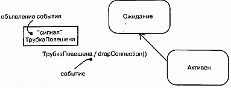
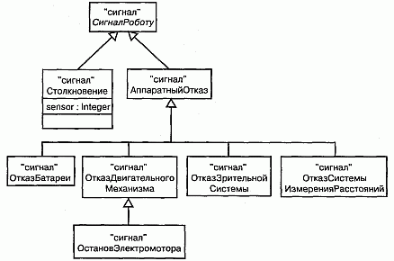
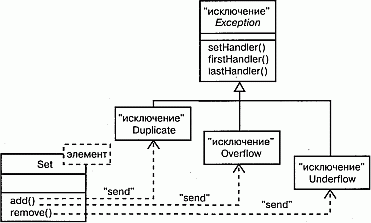

http://bourabai.kz/dbt/uml/ch20.htm

ЧАСТЬ V - Более сложные аспекты поведения
# Глава 20. События и сигналы
* Введение
* Термины и понятия
    * Виды событий
    * Сигналы
    * События вызова
    * События времени и изменения
    * Посылка и получение событий
* Типичные приемы моделирования
    * Семейства сигналов
    * Исключения
* Советы

Реальный мир ежедневно несет нам новые впечатления. Мало того, они порой возникают одновременно и неожиданно. Различные явления, происходящие в окружающем мире, называются событиями. Каждое событие описывает существенный факт, локализованный во времени и пространстве.

В контексте автоматов события используются для моделирования некоторого стимула, который может вызвать переход из одного состояния в другое. К числу событий относятся сигналы, вызовы, истечение определенного промежутка времени или изменение состояния.

События могут быть синхронными или асинхронными, и их моделирование является составной частью моделирования процессов и нитей.

## Введение
Абсолютно статичная система не представляет ни малейшего интереса, поскольку в ней ничего не происходит. Все реальные системы в той или иной мере динамичны, и их динамичность обусловлена событиями, происходящими внутри или вне системы. Работу банкомата инициирует пользователь, который нажимает кнопку для совершения банковской транзакции. Автономный робот начинает действовать, когда встречается с некоторым предметом. Сетевой маршрутизатор реагирует на обнаружение переполнения буферов сообщений. На химическом заводе сигналом к действию служит окончание промежутка времени, необходимого для завершения реакции.

В UML любое явление, которое может произойти, моделируется как событие. Событие - это описание существенного факта, имеющего определенное местоположение во времени и пространстве. Получение сигнала, истечение промежутка времени и изменение состояния - это примеры асинхронных событий, которые могут наступить в любой момент. Вызовы - это, как правило, синхронные события, используемые для запуска некоторой операции.

UML предоставляет средства для графического представления событий, как видно из рис. 20.1. Такая нотация позволяет визуализировать объявления событий (например, сигнала ТрубкаПовешена) и показать, как наступление события приводит к переключению между состояниями (например, сигнал ТрубкаПовешена вызывает переход телефона из состояния Активен в состояние Ожидание).

#### Рис. 20.1 События

## Термины и понятия
Событие (Event) - это описание существенного факта, который занимает некоторое положение во времени и в пространстве. В контексте автоматов событие - это стимул, который может вызвать переход из одного состояния в другое. Сигнал (Signal) - это вид события, в котором стимул передается асинхронно от одного экземпляра другому.

### Виды событий
События могут быть внутренними или внешними. Внешние события передаются между системой (см. главу 31) и ее актерами (см. главу 16). Примерами могут служить нажатие кнопки или прерывание от датчика столкновений. Внутренние события передаются между объектами, существующими внутри самой системы. Так, исключение, генерируемое при переполнении, является примером внутреннего события.

В UML можно моделировать четыре вида событий: сигналы, вызовы, истечение промежутка времени и изменение состояния.

### Сигналы
Сигнал - это именованный объект, который асинхронно возбуждается одним объектом и принимается (перехватывается) другим. Исключения, которые поддерживаются в большинстве современных языков программирования, - это наиболее распространенный вид внутренних сигналов, который вам придется моделировать. (Создание и уничтожение объектов - это тоже разновидность сигналов, см. главу 15.)

У сигналов есть много общего с простыми классами (см. главы 4 и 9). Например, можно говорить об экземплярах сигналов, хотя обычно не возникает необходимость моделировать их явно. Сигналы могут также участвовать в отношениях обобщения (см. главы 5 и 10), что позволяет моделировать иерархии событий, в которых одни (например, сигнал СбойСети) являются общими, а другие (например, специализация события СбойСети под названием ОтказСкладскогоСер-вера) - частными. Как и классы, сигналы могут иметь атрибуты и операции.

> Примечание: Атрибуты сигнала выступают в роли его параметров. Например, при посылке сигнала Столкновение можно указать значения его атрибутов в виде параметров: Столкновение (3,5).

Сигнал может быть послан как действие перехода (изменения) состояния в автомате или как отправка сообщения при взаимодействии. При выполнении операции тоже могут посылаться сигналы. На практике, когда моделируется класс или интерфейс (см. главу 11), важной частью спецификации поведения является указание сигналов, которые он может посылать. В UML связь между операцией и событиями, которые она может посылать, моделируется с помощью отношения зависимости (см. главу 5) со стереотипом (см. главу 6) send.

Как показано на рис. 20.2, в UML сигналы (и исключения) моделируются стереотипными классами. Для указания на то, что некоторая операция посылает сигнал, можно воспользоваться зависимостью со стереотипом send.

#### Рис. 20.2 Сигналы

### События вызова
Если событие сигнала представляет возбуждение сигнала, то событие вызова предназначено для описания выполнения операции. И в том, и в другом случае событие может вызвать переход состояния в автомате (см. главу 21).

В то время как сигнал является событием асинхронным, событие вызова обычно синхронно. Это означает, что, когда один объект инициирует выполнение операции на другом объекте, у которого есть свой автомат, управление передается от отправителя получателю, срабатывает соответствующий переход, затем операция завершается, получатель переходит в новое состояние и возвращает управление отправителю.

По рис. 20.3 видно, что в модели событие вызова неотличимо от события сигнала. В обоих случаях событие вместе со своими параметрами выглядит как триггер для перехода состояния.

#### Рис. 20.3 События вызоыа

> Примечание: Хотя визуально события сигнала и вызова неотличимы, разница совершенно отчетливо проявляется на заднем плане модели. Получатель события, конечно же, знает о различии (путем объявления операции в своем списке операций). Сигнал, как правило, обрабатывается на уровне автомата, а событие вызова - методом. Для перехода от события к сигналу или операции можно воспользоваться инструментальной программой.

### События времени и изменения
Событие времени представляет собой истечение промежутка времени. На рис. 20.4 показано, что в UML событие времени моделируется с помощью ключевого слова after (после), за которым следует выражение, вычисляющее некоторый промежуток времени. Выражение может быть простым (например, after 2 seconds) или сложным (например, after 1 ms c момента выхода из состояния Ожидание). Если явно не указано противное, то отсчет времени начинается с момента входа в текущее состояние.

#### Рис. 20.4 События времени и изменения

С помощью события изменения описывается изменение состояния или выполнение некоторого условия. На рис. 20.4 показано, что в UML событие изменения моделируется посредством ключевого слова when, за которым следует булевское выражение. Такое выражение может использоваться для обозначения абсолютного момента времени (например, when time=11: 59) или проверки условия (например, when altitude < 1000).

> Примечание: Хотя событие изменения моделирует условие, проверяемое непрерывно, обычно, проанализировав ситуацию, можно выявить дискретные моменты времени, когда это условие нужно проверять.

### Посылка и получение событий
В событиях сигнала и вызова участвуют по крайней мере два объекта: объект, посылающий сигнал или инициирующий операцию, и объект, которому событие адресовано. Поскольку сигналы по своей природе асинхронны, а асинхронные вызовы сами по себе являются сигналами, то семантика событий перекликается с семантикой активных и пассивных объектов.

Экземпляр (см. главу 13) любого класса может посылать сигнал принимающему объекту или инициировать в нем операцию. Отправив сигнал получателю, он продолжает свой поток управления, не дожидаясь от него ответа. Например, после того как актер, взаимодействующий с банкоматом, пошлет сигнал нажатьКнопку, он может выполнять другие действия независимо от того, что делает система, которой был послан сигнал. Напротив, если объект инициирует операцию, он должен дождаться ответа от получателя. Допустим, в трейдерской системе экземпляр класса Трейдер может инициировать операцию подтвердитьТранзакцию в некотором экземпляре класса Сделка, косвенно изменив тем самым состояние последнего. Если это синхронный вызов, то объект Трейдер будет ждать, пока операция закончится.

> Примечание: В некоторых случаях возникает необходимость в изображении объекта, который посылает сигнал сразу нескольким объектам (мулъти-вещание, Multicasting) или всем ожидающим объектам в системе (широковещание, Broadcasting). Для моделирования мулътивещания следует изобразить объект, посылающий сигнал коллекции, в которую входят все получатели. Для моделирования широковещания нужно показать, что объект посылает сигнал другому объекту, представляющему систему в целом.

Любой экземпляр любого класса может быть получателем события вызова или сигнала. Если это синхронное событие, то отправитель и получатель находятся в состоянии рандеву на всем протяжении выполнения операции. Это означает, что поток управления отправителя блокируется потоком управления получателя, пока операция не завершится. Если это сигнал, то отправитель и получатель не входят в состояние рандеву: отправитель посылает сигнал, но не дожидается ответа от получателя. В любом случае событие может быть потеряно (если не указано, что нужен ответ), может вызвать переход состояния в автомате (см. главу 21), если он существует, или просто инициировать обычный вызов метода.

В UML события вызова, которые получает объект, моделируются как операции (см. главу 4) над классом этого объекта. Именованные сигналы, получаемые объектом, моделируются путем перечисления в дополнительном разделе класса, как показано на рис. 20.5.

#### Рис. 20.5 Сигналы и активные классы

> Примечание: Точно так же можно присоединить именованные сигналы к интерфейсу (см. главу 11). В любом случае, имена сигналов, перечисленные в дополнительном разделе (см. главу 4), являются не объявлениями, а лишь указаниями на то, что сигнал используется. Сигналы, которые являются асинхронными операциями (см. главу 22), перечисляются в разделе обычных операций класса.

## Типичные приемы моделирования

Семейства сигналов
В большинстве систем, управляемых событиями, события сигналов образуют иерархию. Например, автономный робот может различать внешние сигналы, такие как Столкновение, и внутренние, например АппаратныйОтказ. Однако множества внешних и внутренних сигналов могут пересекаться. И даже внутри этих двух широких областей классификации можно обнаружить частные разновидно сти. К примеру, АппаратныйОтказ можно подразделить на ОтказБатареи и От-казДвигательногоМеханизма. Допускается и дальнейшая специализация. Так, разновидностью сигнала ОтказДвигательногоМеханизма является Оста-новЭлектромотора. (Об отношениях обобщения рассказано в главах 5 и 10.)

Моделируя таким образом иерархии сигналов, можно специфицировать полиморфные события. Рассмотрим, к примеру, автомат (см. главу 21), в котором некоторый переход срабатывает лишь при получении сигнала ОстановЭлектромото-ра. Поскольку этот сигнал является в иерархии листовым, то переход инициируется только им, так что полиморфизм отсутствует. Но предположим теперь, что вы построили автомат, в котором переход срабатывает при получении сигнала АппаратныйОтказ. В этом случае переход полиморфен, его возбуждает как сам сигнал АппаратныйОтказ, так и любая его специализация (разновидность), включая ОтказБатареи, ОтказДвигательногоМеханизма и ОстановЭлектромотора.

Моделирование семейства сигналов включает следующие этапы:

1. Рассмотрите все разновидности сигналов, на которые может отвечать данное множество активных объектов.
2. Выявите схожие виды сигналов и поместите их в иерархию типа "обобщение/специализация", используя наследование. На верхних уровнях иерархии будут располагаться общие сигналы, а на нижних -специализированные.
3. Определите возможности полиморфизма в автоматах этих активных объектов. Обнаружив полиморфизм, скорректируйте иерархию, добавив при необходимости промежуточные абстрактные сигналы.

На рис. 20.6 приведена модель семейства сигналов, которые могли бы обрабатываться автономным роботом. Обратите внимание, что корневой сигнал (СигналРо-боту) является абстрактным (см. главу 5), то есть прямое создание его экземпляров невозможно. У этого сигнала есть две конкретные специализации (Столкновение и АппаратныйОтказ), одна из которых (АппаратныйОтказ) специализируется и дальше. Заметьте, что у сигнала Столкновение есть один параметр.

#### Рис. 20.6 Моделирование семейства сигналов

### Исключения
Важной частью визуализации, специфицирования и документирования поведения класса (см. главы 4 и 9) или интерфейса (см. главу 11) является спецификация исключений, которые могут возбуждать его операции. Если вам предоставили класс или интерфейс, то операции, которые можно на нем вызывать, ясны из описания, но понять, какие исключения они могут возбуждать, нелегко, если это явно не указано в модели.

В UML исключения являются частными случаями сигналов и моделируются с помощью стереотипных (см. главу 6) классов. Исключения можно присоединить к спецификациям операций. Моделирование исключений является операцией, в некотором смысле противоположной моделированию семейства сигналов. Основная цель моделирования семейства сигналов - специфицировать, какие сигналы могут получать активные объекты; цель же моделирования исключений состоит в том, чтобы показать, какие исключения могут возбуждаться объектом через свои операции.

Моделирование исключений производится так:

1. Для каждого класса и интерфейса и для каждой определенной в них опера ции рассмотрите, какие исключения могут возбуждаться.
2. Организуйте исключения в иерархию. На верхних уровнях разместите об щие исключения, на нижних - специализированные, а при необходимости введите промежуточные исключения.
3. Укажите для каждой операции, какие исключения она может возбуждать. Это можно сделать явно на диаграмме (проведя зависимости типа send от операции к ее исключениям) или же поместить перечень исключений в спе цификацию операции.

На рис. 20.7 представлена модель иерархии исключений, которые могут возбуждаться контейнерными классами из стандартной библиотеки, например шаблоном (см. главу 9) класса Set. В корне этой иерархии находится абстрактный сигнал Exception, а ниже расположены специализированные исключения: Duplicate, Overflow и Underflow. Как видно, операция add возбуждает исключения Duplicate и Overflow, а операция remove - только исключение Underflow. Вместо этого можно было бы убрать зависимости с переднего плана, перечислив возбуждаемые исключения в спецификации каждой операции. Как бы то ни было, зная, какие исключения может возбудить операция, вы сможете успешно создавать программы, использующие класс Set.

#### Рис. 20.7 Моделирование исключений

## Советы
При моделировании событий исходите из следующих соображений:

* стройте иерархию сигналов так, чтобы можно было воспользоваться общими для них свойствами;
* не прибегайте к посылке сигналов и тем более к возбуждению исключений, если позволительно обойтись обычным потоком управления;
* не забывайте ассоциировать подходящий автомат с каждым элементом, который может получать события;
* обязательно моделируйте не только те элементы, которые могут получать события, но и те, которые могут их посылать.

Изображая событие в UML, в общем случае моделируйте иерархии событий явно, а их использование специфицируйте на заднем плане тех классов или операций, которые посылают или получают событие.

