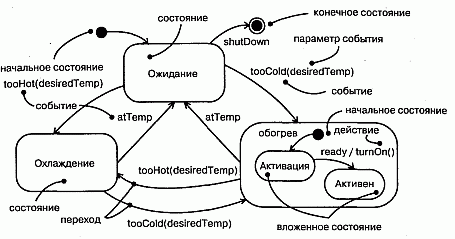
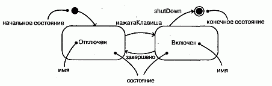
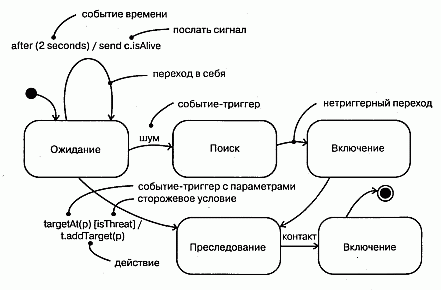
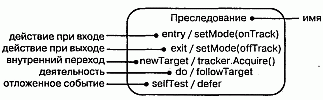
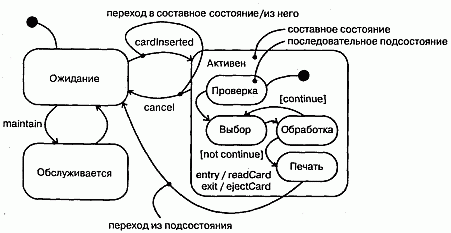
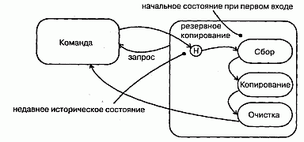
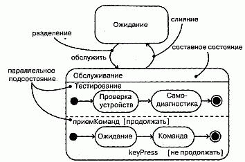
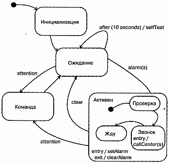

http://bourabai.kz/dbt/uml/ch21.htm

ЧАСТЬ V - Более сложные аспекты поведения
# Глава 21. Автоматы
* Введение
* Термины и понятия
    * Контекст
    * Состояния
    * Переходы
    * Более сложные аспекты состояний и переходов
    * Подсостояния
* Типичные приемы моделирования
    * Жизненный цикл объекта
* Советы

С помощью взаимодействий (см. главу 15) можно моделировать поведение сообщества совместно работающих объектов (см. главу 13). Автомат же позволяет моделировать поведение отдельного объекта. Автомат (State machine) описывает поведение в терминах последовательности состояний, через которые проходит объект в течение своей жизни, отвечая на события, а также его реакций на эти события.

Автоматы используются для моделирования динамических аспектов системы. По большей части под этим понимается описание жизни экземпляров класса (см. главы 4 и 9), прецедентов (см. главу 16) и системы (см. главу 31) в целом. Экземпляры могут реагировать на такие события, как сигналы, операции или истечение промежутка времени. Когда происходит событие, в зависимости от текущего состояния объекта имеет место та или иная деятельность. Деятельность (Activity) -это занимающее некоторое время неатомарное вычисление внутри автомата. Результатом деятельности является некоторое действие, составленное из атомарных вычислений, которое приводит к изменению состояния модели или возврату значения. Состояние (State) объекта - это ситуация в его жизни, на протяжении которой он удовлетворяет некоторому условию, осуществляет определенную деятельность или ожидает какого-то события.

Визуализировать автомат можно двумя способами: выделяя передачу потока управления от одной деятельности к другой (с помощью диаграммы деятельности, см. главу 19) или выделяя потенциальные состояния объектов и переходы между ними (с помощью диаграммы состояний, см. главу 24).

Хорошо структурированные автоматы подобны хорошо структурированным алгоритмам - они эффективны, просты, адаптируемы к разным ситуациям и просты для понимания.

## Введение
Рассмотрим "жизнь" домашнего термостата в прохладный осенний день.

Ранним утром ничто не тревожит его покой. Температура в доме стабильная; если не задует сильный ветер и не налетит ураган, то снаружи температура меняться тоже не будет. Ближе к рассвету картина меняется. Над горизонтом встает солнце, и наружная температура слегка поднимается. Начинают просыпаться домочадцы; вот кто-то вылез из кровати и подкрутил регулятор. Оба этих события существенны для домашней климатической системы. Наш термостат начинает вести себя как все порядочные термостаты и отдает команду либо обогревателю (чтобы подогреть воздух), либо кондиционеру (чтобы его охладить).

После того как обитатели дома ушли на работу или в школу, движение прекращается, и температура снова становится постоянной. Но тут может вмешаться автоматическая программа и приказать термостату понизить температуру, чтобы не расходовать зря электричество и газ. Термостат снова принимается за работу. Ближе к концу дня автоматическая программа снова "оживает", но на этот раз велит поднять температуру, поскольку вот-вот семейство начнет собираться, и дом к этому моменту должен стать уютным.

Вечером, когда дом наполнен теплом, исходящим от человеческих тел, а на плите готовится еда, у термостата полно работы - он должен включать то обогреватель, то кондиционер, чтобы температура оставалась постоянной.

Наконец, ночью все снова успокаивается.

Многие программные системы ведут себя аналогично термостату. Сердечный стимулятор работает круглосуточно, но адаптируется к изменениям кровяного давления или выполняемой человеком работе. Сетевой маршрутизатор тоже работает непрерывно, незаметно перенаправляя потоки битов, а иногда модифицируя свое поведение в ответ на команды администратора сети. Сотовый телефон работает по запросам, отвечая на действия своего владельца и на сообщения из локальных ячеек сотовой сети связи.

В UML статические аспекты системы моделируются с использованием таких элементов, как диаграммы классов и диаграммы объектов (моделирование структурных аспектов системы рассматривается в частях 2 и 3 данной книги). Они позволяют визуализировать, специфицировать и документировать все, что существует внутри системы, включая классы, интерфейсы, компоненты, узлы, прецеденты, отдельные экземпляры всех перечисленных сущностей, а также их отношения друг с другом.

Динамические аспекты системы в UML моделируются с помощью автоматов и взаимодействий (см. главу 15). Если взаимодействие моделирует сообщество объектов, которые совместно работают для выполнения некоторого действия, то автомат моделирует жизненный цикл отдельного объекта, будь то экземпляр класса, прецедент или даже система в целом. На протяжении своей жизни объект может столкнуться с различными событиями (см. главу 20), такими как сигнал, запрос на выполнение операции, создание или уничтожение объекта, истечение промежутка времени или изменение некоторого условия. В ответ на событие объект выполняет некоторое действие, то есть атомарное вычисление, приводящее к изменению состояния объекта или возврату значения. Таким образом, на поведение объекта оказывает влияние его прошлое. Объект может "получить" событие, отреагировать на него выполнением действия, а затем изменить свое состояние. Если после этого он получит другое событие, то реакция на него в общем случае может быть иной, в зависимости от состояния, в которое он пришел после предыдущего события.

Автоматы применяются для моделирования поведения любого элемента модели, но чаще всего - классов, прецедентов или системы в целом. Автоматы можно визуализировать двумя способами. Во-первых, с помощью диаграммы действий (см. главу 19) можно сконцентрировать внимание на действиях, происходящих внутри объекта. Во-вторых, с помощью диаграмм состояний (см. главу 24) можно сосредоточиться на поведении объекта при упорядоченном поступлении событий, что особенно полезно при моделировании реактивных систем.

В UML имеются средства для графического представления состояний, переходов, событий и действий, как показано на рис. 21.1. Эта нотация позволят визуализировать поведение объекта так, чтобы подчеркнуть наиболее важные элементы его жизненного цикла.

#### Рис. 21.1 Автоматы

## Термины и понятия
Автомат (State machine) описывает поведение в терминах последовательности состояний, через которые проходит объект в течение своего жизненного цикла, отвечая на различные события, а также его реакций на эти события. Состояние (State) - это ситуация в жизни объекта, на протяжении которой он удовлетворяет некоторому условию, выполняет определенную деятельность или ожидает какого-то события. Событие (Event) - это спецификация существенного факта, имеющего место в пространстве и во времени. В контексте автоматов событие - это некий стимул, инициирующий переход из одного состояния в другое. Переход (Transition) -это отношение между двумя состояниями, показывающее, что объект, находящийся в первом состоянии, должен выполнить определенные действия и перейти во второе состояние, как только произойдет указанное событие и будут удовлетворены определенные условия. Деятельность (Activity) - это протяженное во времени неатомарное вычисление внутри автомата. Действие (Action) - это атомарное вычисление, которое приводит к изменению состояния модели или возврату значения. Состояние изображается в виде прямоугольника с закругленными углами. Переход обозначается линией со стрелкой.

### Контекст
У каждого объекта (см. главу 13) есть некоторое время жизни. Объект рождается, когда его создают, и перестает существовать после уничтожения. В промежутке он может воздействовать на другие объекты (посылая им сообщения, см. главу 15), а также сам подвергаться воздействиям (являясь получателем сообщения). Во многих случаях сообщения могут быть простыми синхронными вызовами. Например, экземпляр класса Клиент может инициировать операцию получитьБалансСчета на экземпляре класса БанковскийСчет. Чтобы специфицировать поведение такого рода объектов, автомат не нужен, поскольку в любой момент времени их поведение не зависит от прошлого.

В системах иного типа встречаются объекты, которые должны реагировать на сигналы (см. главу 20) - асинхронные стимулы, которыми обмениваются экземпляры. Например, сотовый телефон должен отвечать на вызовы от других телефонов, которые происходят в случайные моменты времени, на события нажатия клавиши владельцем, набирающим номер, и на события сети (когда телефон перемещается из одной ячейки сотовой связи в другую). Бывают также объекты, текущее поведение которых зависит от прошлого. Так, поведение системы наведения ракеты "воздух-воздух" зависит от ее текущего состояния, например НеЛетит (вряд ли стоит запускать ракету с самолета, находящегося на земле) или Поиск (нельзя ее запускать, пока нет ясного представления, какую цель надо поразить).

Если объекты должны реагировать на асинхронные стимулы или их текущее поведение зависит от их прошлого, лучше всего описывать это поведение с помощью автомата. К этой категории относятся экземпляры классов, которые могут получать сигналы, включая и многие активные объекты (см. главу 22). Фактически объект, который получает сигнал, но не имеет описывающего его автомата, попросту проигнорирует этот сигнал. Автоматы применяются также для моделирования систем в целом, в особенности реактивных (см. главу 24), то есть таких, которые должны отвечать на сигналы от внешних актеров (см. главу 16).

> Примечание: Обычно для моделирования поведения прецедента (см. главу 16) используются взаимодействия (см. главу 15), но можно применять и автоматы. Последние пригодны также для моделирования поведения интерфейса (см. главу 11). Хотя у интерфейса не может быть непосредственных экземпляров, их может иметь класс, реализующий этот интерфейс. Поведение такого класса должно соответствовать поведению, специфицированному автоматом для интерфейса.

### Состояния
Состояние - это ситуация в жизни объекта, на протяжении которой он удовлетворяет некоторому условию, выполняет определенную деятельность или ожидает какого-то события. Объект остается в некотором состоянии в течение конечного отрезка времени. Например, Обогреватель в доме может находиться в одном из четырех состояний: Ожидание (ждет команды "начать обогревать дом").

Активация (газ подается, но не достигнута нужная температура), Активен (газ и вентилятор включены), Выключается (газ не подается, но вентилятор еще включен и удаляет остаточное тепло из системы).

Когда автомат объекта находится в данном состоянии, говорят, что и объект находится в этом состоянии. Например, экземпляр класса Обогреватель может находиться в состоянии Ожидание или Выключается. (Состояние объекта можно визуализировать во взаимодействии, см. главу 13.)

Состояние определяют следующие элементы:

* имя - текстовая строка, которая отличает одно состояние от всех остальных. Имя состояния должно быть уникальным внутри объемлющего пакета;
* действия при входе/выходе - действия, выполняемые при входе в состояние и выходе из него;
* внутренние переходы - переходы, обрабатываемые без выхода из состояния;
* подсостояния - внутри состояния могут существовать подсостояния, как непересекающиеся (активизируемые последовательно), так и параллельные (активные одновременно);
* отложенные события - список событий, которые не обработаны в этом состоянии, а отложены и поставлены в очередь для обработки объектом в некотором другом состоянии.

> Примечание: Имя состояния может иметь произвольную длину и включать любые цифры и буквы, а также некоторые знаки препинания (за исключением имеющих специальный смысл, например двоеточия). Имя может занимать несколько строк. На практике оно чаще всего бывает коротким, составленным из одного или нескольких существительных, взятых из словаря моделируемой системы. Первую букву каждого слова в имени состояния принято делать заглавной, например Ожидание или ИдетОтключение.

Как показано на рис. 21.2, состояние изображается прямоугольником с закругленными углами.

#### Рис. 21.2 Состояния

Начальное и конечное состояния. Как видно из рисунка, в автомате объекта могут быть определены два специальных состояния. Во-первых, есть начальное состояние, в котором автомат или подсостояние находятся по умолчанию в исходный момент времени. Изображается оно в виде закрашенного кружка. Во-вторых, есть конечное состояние, в котором завершается выполнение автомата или объемлющего состояния. Оно представлено закрашенным кружком, заключенным в окружность.

> Примечание: На самом деле начальное и конечное состояния - это псевдосостояния: они не имеют ни одной из характеристик нормального состояния, кроме имени. Однако переход из начального состояния в конечное может обладать всеми свойствами, включая сторожевое условие и действие (но не событие-триггер).

### Переходы
Переход - это отношение между двумя состояниями, показывающее, что объект, находящийся в первом состоянии, должен выполнить определенные действия и перейти во второе состояние, как только произойдет указанное событие и будут удовлетворены указанные условия. Говорят, что при таком изменении состояния переход срабатывает. Пока переход не сработал, объект находится в исходном состоянии; после срабатывания он находится в целевом состоянии. Например, Обогреватель может перейти из состояния Ожидание в состояние Активация при возникновении события tooCold (слишкомХолодно) с параметром desiredTemp (желаемаяТемпература).

Переход определяют пять элементов:

* исходное состояние - состояние, из которого происходит переход. Если объект находится в исходном состоянии, то исходящий переход может сработать, когда объект получит событие-триггер, инициирующее этот переход, причем должно быть выполнено сторожевое условие (если оно задано);
* событие-триггер - событие (см. главу 20), при получении которого объектом, находящимся в исходном состоянии, может сработать переход (при этом должно быть выполнено сторожевое условие);
* сторожевое условие - булевское выражение, которое вычисляется при получении события-триггера. Если значение истинно, то переходу разрешено сработать, если ложно - переход не срабатывает. Если при этом не задано никакого другого перехода, инициируемого тем же самым событием, то событие теряется;
* действие - атомарное вычисление, которое может непосредственно воздействовать на объект, владеющий автоматом, или оказать косвенное воздействие на другие объекты, находящиеся в области видимости;
* целевое состояние - состояние, которое становится активным после завершения перехода.

Как показано на рис. 20.3, переходы изображаются в виде линии со стрелкой, направленной от исходного к целевому состоянию. Исходное и целевое состояния перехода в себя совпадают.

> Примечание: У перехода может быть несколько исходных состояний (в этом случае он представляет собой слияние нескольких параллельных состояний), а также несколько целевых состояний (в этом случае он представляет собой разделение на несколько параллельных состояний). 0 слиянии и разделении рассказывается в главе 19.

Событие-триггер. Событие (см. главу 20) - это спецификация существенного факта, происходящего в пространстве и во времени. В контексте автоматов событие - это некий стимул, инициирующий переход из одного состояния в другое. Из рис. 21.3 видно, что в число событий включаются сигналы, вызовы, истечение промежутка времени или изменение состояния. У сигнала и вызова могут быть параметры, значения которых доступны переходу, в том числе при вычислении сторожевого условия и выполнении действия.

#### Рис. 21.3 Переходы

Существуют и нетриггерные переходы, для которых нет никакого события-триггера. Нетриггерный переход, называемый также переходом по завершении, инициируется неявно, когда работа в исходном состоянии закончится.

> Примечание: Событие-триггер может быть полиморфным. Например, если специфицировано семейство сигналов (см. главу 20), то переход, инициируемый событием S, может быть инициирован также и любым потомком S.

Сторожевое условие. На рисунке показано, что сторожевое условие изображается булевским выражением, заключенным в квадратные скобки, которое помещается после события-триггера. Сторожевое условие вычисляется только после возникновения события-триггера, инициирующего соответствующий переход. Поэтому из одного состояния может быть несколько переходов с одним и тем же событием-триггером в том случае, если никакие два сторожевых условия не становятся одновременно истинными.

Сторожевое условие вычисляется ровно один раз для каждого перехода в момент наступления события, но может быть вычислено снова, если переход инициируется повторно. В булевское выражение можно включать условия, в которых фигурирует состояние объекта (например, выражение Обогреватель in Ожидание истинно, если объект Обогреватель находится в состоянии Ожидание).

> Примечание: Если сторожевое условие вычисляется лишь однажды при каждом инициировании перехода, то событие изменения (см. главу 20) потенциально вычисляется постоянно.

Действие (см. главу 15) - это атомарное вычисление. К действиям относятся вызовы операций (объекта, который владеет автоматом, а также любых других видимых объектов), создание и уничтожение другого объекта или посылка объекту сигнала. Как видно из рис. 21.3, для обозначения посылки сигнала определена специальная нотация - имени сигнала предшествует ключевое слово send.

Действие (Action) всегда атомарно, то есть не может быть прервано другим событием и, следовательно, выполняется до полного завершения. Этим оно отличается от деятельности (Activity, см. следующие главы данной части), выполнение которой может быть прервано другими событиями.

> Примечание: Объект, которому посылается сигнал, можно показать явно, если воспользоваться зависимостью (см. главы 5 и 10) со стереотипом send, для которой источником является состояние, а целью - объект.

### Более сложные аспекты состояний и переходов
Существует широкий спектр типов поведения, которые можно моделировать, даже не выходя за пределы базовых возможностей состояний и переходов в UML. С их помощью удается получить простые (Flat) автоматы, описывающие модели поведения, граф которых состоит только из ребер (переходов) и вершин (состояний).

Однако автоматы в UML обладают рядом дополнительных возможностей, обеспечивающих создание более сложных моделей поведения. Их использование зачастую позволяет уменьшить число состояний и переходов и ввести в обиход ряд распространенных и довольно сложных идиом, которые трудно выразить с помощью одних лишь простых автоматов. К числу таких дополнительных возможностей относятся действия при входе и выходе, внутренние переходы, деятельности и отложенные события.

Действия при входе и выходе. При моделировании часто встречаются ситуации, когда необходимо выполнить некоторое действие вне зависимости от того, по какому переходу был осуществлен вход в состояние. Равным образом бывает нужно выполнить одно и то же действие при выходе из состояния по любому переходу. Например, в системе наведения ракет нужно объявить, что система ведетПре-следование, как только она вошла в состояние Преследование, и прекрати-лаПреследование, когда она вышла из этого состояния. Пользуясь простыми автоматами, данного эффекта можно достичь, ассоциируя указанные действия с каждым входящим и исходящим переходом соответственно. Однако такая методика подвержена ошибкам - важно не забыть добавить эти действия при добавлении каждого нового перехода. Кроме того, при модификации любого такого действия придется просматривать все связанные с состоянием переходы.

Как показано на рис. 21.4, в UML имеется сокращенная нотация для этой идиомы. В символ, обозначающий состояние, можно включить любое действие при входе (оно помечается ключевым словом entry) и действие при выходе (помечаемое ключевым словом exit). Тогда указанные действия будут выполняться, соответственно, при входе в состояние и выходе из него.

#### Рис. 21.4 Более сложные аспекты состояний и переходов

> Примечание: Действия при входе и выходе не могут иметь ни аргументов, ни сторожевых условий. Однако действие при входе, определенное на верхнем уровне автомата для класса, может иметь параметры, которые служат для представления аргументов, передаваемых автомату при создании объекта этого класса.

Внутренние переходы. Находясь внутри некоторого состояния, вы можете получить события, которые желательно обработать, не покидая состояния. Такая обработка называется внутренним переходом. Между внутренним переходом и переходом в себя имеется тонкое различие. При переходе в себя, например подобном тому, что изображен на рис. 21Д событие инициирует переход, происходит выход из текущего состояния, выполняется некоторое действие (если оно специфицировано), после чего вы возвращаетесь в исходное состояние. Поскольку при переходе в себя происходит выход из состояния и повторный вход в него же, то выполняется действие, ассоциированное с переходом, и, кроме того, действие при входе в состояние. Предположим, однако, что необходимо обработать событие, не возбуждая действия при входе и выходе. В принципе это можно сделать и с помощью простых автоматов, но при этом нужно внимательно следить за тем, для каких переходов эти действия должны быть определены, а для каких - нет.

На рис. 21.4 показано, что в UML есть сокращенная нотация и для этой идиомы (например, в случае события newTarget). В символ, обозначающий состояние, можно включить внутренний переход (записываемый как событие). Если вы находитесь в таком состоянии и происходит указанное событие, то соответствующее действие выполняется без выхода и повторного входа в состояние, то есть событие обрабатывается, не возбуждая действий при входе и выходе.

> Примечание: С внутренними переходами могут быть связаны события, имеющие параметры и сторожевые условия, то есть внутренние переходы по существу являются прерываниями.

Деятельность. Когда объект находится в некотором состоянии, он обычно бездействует и ожидает возникновения какого-либо события. Но иногда приходится моделировать и ситуацию непрерывно продолжающейся деятельности. Находясь в таком состоянии, объект чем-нибудь занимается до тех пор, пока эта деятельность не будет прервана событием. Например, пока объект находится в состоянии Преследования, он все это время может следоватьЗаЦелью. Из рис. 21.4 видно, что в UML имеется специальный переход do (выполнять) для обозначения работы, которая должна выполняться внутри состояния после того, как было отработано действие при входе. Деятельность, связанная с do-переходом, может быть именем какого-то другого автомата (скажем, следоватьЗаЦелью). Допустимо специфицировать и последовательность действий, например do / opl (a) ; ор2 (b) ; орЗ (с). Единичное действие не может быть прервано, но к последовательности действий это не относится. Между выполнением соседних действий (которые отделяются друг от друга точкой с запятой) объемлющее состояние может обрабатывать события, и не исключено, что это повлечет за собой выход из состояния.

Отложенные события. Рассмотрим состояние Преследование. Предположим, что (как показано на рис. 21.3), из этого состояния исходит только один переход, инициируемый событием contact. Если мы находимся в состоянии Преследование, то все события (см. главу 20), кроме contact и тех, что обрабатываются внутри подсостояний, будут потеряны. Это означает, что событие может произойти, но будет отложено и не повлечет за собой выполнения какого-либо действия.

В любой моделируемой ситуации бывает необходимо одни события распознавать, а другие игнорировать. Распознаваемые события моделируются как триггеры переходов, игнорируемые просто не включаются в модель. Между тем иногда необходимо распознать событие, но отложить его обработку на будущее. Например, находясь в состоянии Преследование, ракета может отложить обработку сигнала самоПроверка, посылаемого некоторым агентом системы, отвечающим за периодическое обслуживание.

В UML такое поведение специфицируется с помощью отложенных событий. Отложенное событие (Deferred event) - это список событий, возникновение которых в конкретном состоянии отложено до перехода в состояние, где этот список не является отложенным событием. В этот момент события могут быть обработаны и инициировать те или иные переходы, как будто они произошли только что. На рис. 21.4 показано, что событие описывается как отложенное путем связывания с ним специального действия defer (отложить). В нашем примере событие самоПроверка может произойти в состоянии Преследование, но реакция на него откладывается до перехода в состояние Включение, где оно обрабатывается, как если бы произошло только что.

> Примечание: Для реализации отложенных событий должна существовать внутренняя очередность событий. Если событие происходит, но внесено в список отложенных, то оно помещается в очередь. События извлекаются из очереди, как только объект входит в состояние, где они не помечены как отложенные.

### Подсостояния
Рассмотренные выше свойства состояний и переходов решают целый ряд типичных проблем моделирования автоматов. Но у автоматов, рассматриваемых в UML, есть свойство, которое позволяет еще больше упростить моделирование сложного поведения. Это подсостояние (Substate) - состояние, являющееся частью другого состояния. Например, Обогреватель может находиться в состоянии Обогрев, внутри которого содержится еще одно состояние- Активация. В таком случае говорят, что объект находится одновременно в состояниях Обогрев и Активация.

Простым называется такое состояние, которое не имеет внутренней структуры. Состояние, у которого есть подсостояния, то есть вложенные состояния, именуется составным. Оно может содержать как параллельные (независимые), так и последовательные (непересекающиеся) подсостояния. В UML составное состояние изображается так же, как и простое, но имеет дополнительный графический раздел, в котором показан вложенный автомат. Глубина вложенности состояний не ограничена. (Вложенная структура составного состояния подобна композиции - см. главы 5 и 10.)

Последовательные подсостояния. Рассмотрим задачу моделирования банкомата. Система может находиться в одном из трех основных состояний: Ожидание (действий со стороны пользователя), Активен (выполняет транзакцию, запрошенную пользователем) или Обслуживается (возможно, пополняется запас банкнот). В состоянии Активен поведение банкомата описывается простой схемой: проверить счет пользователя, выбрать тип транзакции, выполнить транзакцию, напечатать квитанцию. После печати банкомат возвращается в состояние Ожидание. Эти этапы можно представить как состояния Проверка, Выбор, Обработка, Печать. Стоило бы даже дать пользователю возможность выбрать и выполнить несколько транзакций после того, как проверка счета выполнена, но еще до печати окончательной квитанции.

Проблема в том, что на любом этапе пользователь может отменить транзакцию и вернуть банкомат в состояние Ожидание. С помощью простых автоматов реализовать это можно, но не очень удобно. Поскольку пользователь имеет право отменить транзакцию в любой точке, пришлось бы включать соответствующий переход из любого состояния в последовательности Активен. Это может привести к ошибкам, так как очень легко забыть включить все необходимые переходы, а наличие множества событий, прерывающих основной поток управления, приведет к появлению большого числа переходов из разных исходных состояний, которые оканчиваются в одном и том же целевом. При этом у каждого такого перехода будет одинаковое событие-триггер, сторожевое условие и действие.

Использование последовательных подсостояний позволяет упростить моделирование этой задачи, как показано на рис. 21.5. Здесь у состояния Активен имеется внутренний автомат, в который входят подсостояния Проверка, Выбор, Обработка, Печать. Состояние банкомата изменяется с Ожидание на Активен, когда пользователь вставляет в прорезь кредитную карту. При входе в состояние Активен выполняется действие readCard (прочитатьКарту). Начав с исходного состояния внутреннего автомата, управление переходит в состояние Проверка, затем - в Выбор, и, наконец, в состояние Обработка. После выхода из состояния Обработка управление может вернуться в Выбор (если пользователь избрал другую транзакцию) или попасть в Печать. Из состояния Печать предусмотрен нетриггерный переход назад в Ожидание. Обратите внимание, что у состояния Активен есть действие при выходе, которое обеспечивает выбрасывание кредитной карты (ejectCard).

#### Рис. 21.5 Последовательные подсостояния

Обратите внимание также на переход из состояния Активен в состояние Ожидание, инициируемый событием cancel. В любом подсостояний состояния Активен пользователь может отменить транзакцию, что вернет банкомат в состояние Ожидание (но лишь после возврата кредитной карты владельцу, то есть после выполнения действия при выходе из состояния Активен, что произойдет вне зависимости от того, чем вызван переход из этого состояния). Если бы подсостоя-ний не было, то пришлось бы вводить переход, инициируемый событием cancel из каждого состояния вложенного автомата.

Такие подсостояния, как Проверка и Обработка, называются последовательными или непересекающимися. Если в объемлющем составном состоянии имеется несколько непересекающихся подсостояний, то говорят, что объект одновременно находится в составном состоянии и ровно в одном из подсостояний. Таким образом, последовательные подсостояния разбивают множество вариантов составного состояния на непересекающиеся (дизъюнктные) части.

Переход из состояния, находящегося вне объемлющего составного состояния, может вести как в само это составное состояние, так и в любое из его подсостояний. Если целевое состояние является составным, то вложенный автомат должен иметь некоторое начальное состояние, куда управление попадает при входе в составное состояние после выполнения ассоциированного с ним действия при входе (если таковое определено). Если же целевым является одно из вложенных состояний, то управление попадает в него, но опять-таки после выполнения действий при входе в объемлющее составное состояние и в подсостояние (если таковые определены).

Для перехода, исходящего из составного состояния, исходным может быть как оно само, так и какое-либо из его подсостояний. В любом случае управление сначала покидает вложенное подсостояние (тогда выполняется его действие при выходе, если оно определено), а затем составное состояние (тогда также выполняется действие при выходе). Переход, для которого исходным является составное состояние, по существу прерывает работу вложенного автомата.

> Примечание: Вложенный последовательный автомат может иметь не более одного начального и не более одного конечного состояния.

Исторические состояния. Автомат описывает динамические аспекты объекта, текущее поведение которого зависит от его прошлого. По сути дела, автомат специфицирует корректный порядок состояний, через которые объект может проходить на протяжении своего жизненного цикла.

Если явно не оговорено противное, то в случае, когда переход ведет в составное состояние, действие вложенного автомата начинается с его начального состояния (если, конечно, переход не ведет сразу в какое-то из подсостояний). Но часто возникает необходимость промоделировать объект так, чтобы он помнил то последнее подсостояние, в котором он находился перед выходом из составного состояния. Например, при моделировании агента, выполняющего автоматическое резервное копирование компьютеров в сети, хотелось бы помнить, в какой точке находился процесс, когда он был прерван, скажем, запросом оператора.

Смоделировать такую ситуацию с помощью простых автоматов можно, хотя и не просто. Для этого требуется, чтобы у каждого последовательного подсостояния его действие при выходе записывало некоторое значение в переменную, локальную для объемлющего составного состояния. Начальное же подсостояние для данного составного состояния должно иметь переходы во все остальные состояния со сторожевыми условиями, в которых проверяется эта переменная. При таком подходе выход из составного состояния сопровождался бы запоминанием последнего подсостояния, а вход приводил бы к следованию вдоль перехода в запомненное под-состояние. Этот процесс чреват ошибками, поскольку приходится задавать нужные действия при выходе для всех подсостояний. В результате получается множество переходов, веером расходящихся из одного начального состояния в разные целевые подсостояния и имеющих схожие (но не идентичные) сторожевые условия.

В UML для моделирования такой идиомы применяется более простой механизм - исторические состояния (History states). Историческое состояние позволяет составному состоянию, содержащему последовательные подсостояния, запоминать, какое из подсостояний было текущим в момент выхода из составного состояния. На рис. 21.6 недавнее (shallow) историческое состояние представлено в виде небольшого кружочка с символом H.

#### Рис. 21.6 Историческое состояние

Переход, необходимый для активации последнего подсостояния, показывают как ведущий извне составного состояния прямо в историческое состояние. При первом входе в составное состояние истории еще нет. В этом заключается смысл одиночного перехода из исторического состояния в одно из последовательных подсостояний, например в Сбор. Целевое для этого перехода состояние - это не что иное, как начальное состояние вложенного автомата при первом входе в него. Предположим далее, что событие запрос поступило, когда агент находился в состоянии РезервноеКопирование и подсостояний Копирование. При этом управление покидает оба этих состояния (возможно, после выполнения действий при выходе) и возвращается в состояние Команда. Когда завершается действие в состоянии Команда, нетриггерный переход возвращает агента в историческое состояние составного состояния РезервноеКопирование. На этот раз, поскольку у вложенного автомата уже есть история, управление попадает в состояние Копирование -обходя состояние Сбор, так как Копирование было последним активным подсо-стоянием перед выходом из состояния РезервноеКопирование.

> Примечание: Символом H обозначается недавняя история, в которой запоминается предшествующее состояние только самого внешнего из вложенных автоматов. Можно определить и давнюю (deep) историю, которая изображается кружочком с символом H*. Давняя история способна запомнить последние состояния всех вложенных подавтоматов любого уровня вложенности. При наличии только одного уровня вложенности давняя и недавняя истории семантически эквивалентны. Если же глубина вложенности больше 1, то недавняя история помнит только самое внешнее из вложенных подсостояний, а давняя - все вложенные подсостояния любого уровня.

В любом случае, лишь только вложенный автомат доходит до конечного состояния, вся история теряется, и в дальнейшем он ведет себя так, как если бы вход в него осуществлялся в первый раз.

Параллельные подсостояния. Последовательные подсостояния встречаются наиболее часто. Но в некоторых ситуациях возникает необходимость в параллельных (Concurrent) подсостояниях. Они позволяют специфицировать два или более автомата, которые выполняются параллельно в контексте объемлющего объекта.

> Примечание: Другим способом моделирования параллельности являются активные объекты (см. главу 22). Так, вместо разбиения автомата одного объекта на два или более параллельных подавтомата можно было бы определить два активных объекта, каждый из которых отвечает за поведение, реализуемое одним из этих подавтоматов. Если на поведение одного из параллельных потоков управления влияет состояние другого, то предпочтение следует отдать модели с использованием параллельных подсостояний. Если же на поведение одного параллельного потока оказывают влияние сообщения, посылаемые другим потоком, то лучше воспользоваться активными объектами. Если потоки совсем или почти совсем не взаимодействуют, то выбор подхода является делом вкуса, хотя применение активных объектов обычно позволяет создать более понятную модель.

На рис. 21.7 показано развернутое представление состояния Обслуживается (см. рис. 21.5). Это состояние разделено на два параллельных подсостояния: Тестирование и приемКоманд, которые изображены как вложенные в состояние Обслуживается, но отделены друг от друга пунктирной линией. Каждое из этих двух параллельных подсостояний далее разделено на последовательные подсостояния (о разделении и слиянии см. главу 19). Когда управление переходит из состояния Ожидание в состояние Обслуживается, происходит разделение на два параллельных потока: объемлющий объект находится в состояниях Тестирование и приемКоманд. Кроме того, находясь в состоянии приемКоманд, этот объект будет либо в состоянии Жду, либо в состоянии Команда.

#### Рис. 21.7 Параллельные подсостояния

> Примечание: Именно это отличает последовательные состояния от параллельных. Если имеется два или более последовательных подсостояний одного и того же уровня вложенности, то объект может находиться только в одном из них. Если налицо два или более параллельных подсостояний одного и того же уровня вложенности, то объект будет одновременно находиться в одном из последовательных состояний каждого из них.

Выполнение двух параллельных подсостояний протекает одновременно. В конце концов каждый из вложенных параллельных подавтоматов достигнет своего конечного состояния. Если один из них "придет к финишу" раньше другого, то поток управления будет ждать. Когда и второй автомат доберется до своего конечного состояния, оба потока вновь сольются в один.

Если есть переход в составное состояние, разложенное на параллельные под-состояния, то поток управления разделяется на столько параллельных потоков, сколько имеется подсостояний. Напротив, при переходе из составного состояния, разложенного на параллельные подсостояния, потоки сливаются в один. Это справедливо во всех случаях. Если все параллельные подавтоматы достигают конечного состояния или имеется явный переход из объемлющего составного состояния, все параллельные потоки управления сливаются в один.

> Примечание: Вложенный параллельный автомат не имеет начального, конечного или исторического состояний. Однако последовательные подсостояния, входящие в состав параллельного, могут обладать такими свойствами.

## Типичные приемы моделирования

### Жизненный цикл объекта
Автоматы чаще всего применяются для моделирования жизненного цикла объекта (см. главу 13), особенно если это экземпляр класса (см. главы 4 и 9), прецедент (см. главу 16) или система (см. главу 31) в целом. В то время как взаимодействия (см. главу 15) моделируют поведение сообщества объектов, работающих совместно, автоматы предназначены для моделирования поведения единичного объекта на протяжении времени его жизни. Примерами могут служить интерфейсы, контроллеры и устройства.

При моделировании жизненного цикла объекта особое внимание уделяется специфицированию следующих элементов: событий, на которые объект должен реагировать, реакций на такие события, а также влияния прошлого на поведение в текущий момент. Кроме того, необходимо решить, в каком порядке объект будет осмысленно реагировать на события, начиная с момента его создания и вплоть до уничтожения.

Моделирование жизненного цикла объекта осуществляется следующим образом:

1. Выберите контекст для автомата, будь то класс, прецедент или система в це лом. При этом:
    * если контекстом является класс или прецедент, идентифицируйте соседние классы, включая предков, а также все классы, доступные из данного с помощью зависимостей или ассоциаций (такие соседи - кандидаты на роль целей для действий или на включение в сторожевые условия);
    * если контекстом является система в целом, то следует сосредоточиться на какой-либо одной стороне ее поведения (теоретически каждый объект в системе может принимать участие в модели ее жизненного цикла, но за исключением простейших случаев такую полную модель практически невозможно воспринять).
4. Установите для объекта начальное и конечное состояния. Если предполагается его использование в остальной части модели, возможно, стоит сформулировать пред- и постусловия (см. главу 10) для начального и конечного состояний.
5. Решите, на какие события объект может реагировать. Если интерфейсы (см. главу 11) объекта уже специфицированы, то в них и содержится описание таких событий; в противном случае необходимо рассмотреть, какие объекты могут взаимодействовать с объектом в данном контексте и какие события они могут посылать.
6. Изобразите все состояния верхнего уровня, от начального до конечного, в которых может находиться объект. Соедините эти состояния переходами, инициируемыми теми или иными событиями, а затем свяжите с этими переходами действия.
7. Идентифицируйте все действия при входе и выходе (особенно если обнаружится, что выражаемая с их помощью идиома используется в автомате).
8. Если это необходимо, разверните выявленные к этому моменту состояния, применяя аппарат подсостояний.
9. Убедитесь, что все события, встречающиеся в автомате, соответствуют тем, которые ожидает интерфейс объекта. Следует убедиться также в том, что все события, ожидаемые интерфейсом объекта, нашли отражение в автомате. Наконец, нужно выявить те места, где имеет смысл игнорировать события.
10. Убедитесь, что все действия, упомянутые в автомате, поддержаны отноше ниями, методами и операциями объемлющего объекта.
11. Следуя переходам автомата вручную или с помощью инструментальных средств, проверьте ожидаемые последовательности событий и реакций на них. Особое внимание нужно обратить на недостижимые состояния и состо яния, в которых автомат может "застрять" (то есть тупиковые).
12. Изменив по результатам проверки структуру автомата, снова проверьте его на ожидаемые последовательности событий, чтобы убедиться, что семантика объекта не изменилась.

В качестве примера на рис. 21.8 показан автомат для контроллера в домашней системе безопасности, который следит за различными датчиками, расставленными по периметру дома.

#### Рис. 21.8 Моделирование жизненного цикла объекта

В жизненном цикле такого контроллера есть четыре основных состояния: Инициализация (контроллер входит в рабочий режим), Ожидание (контроллер готов к работе и ожидает тревожных сигналов или команд от пользователя), Команда (контроллер занят отработкой команды пользователя) и Активен (контроллер обрабатывает сигнал тревоги). Когда объект контроллера создается впервые, он сначала переходит в состояние Инициализация, а затем без каких-либо условий - в состояние Ожидание. Подробно эти два состояния не показаны; изображен лишь переход в себя по событию времени для состояния Ожидание. Такого рода событие времени типично для встроенных систем, в которых часто присутствует таймер, предназначенный для периодического запуска процедуры самодиагностики.

При получении события alarm (тревога), которое имеет параметр s, идентифицирующий сработавший датчик, управление переходит из состояния Ожидание в состояние Активен. При вхождении в состояние Активен выполняется действие при входе setAlarm и управление попадает в состояние Проверка (где проверяется, не ложная ли тревога), затем в состояние Звонок (в компанию, установившую сигнализацию для регистрации тревоги) и, наконец, в состояние Жду. Из состояний Жду и Активен контроллер может выйти только после сброса сигнала тревоги (действие clear) или получения от пользователя события attention, возможно, предшествующего выдаче команды.

Обратите внимание на отсутствие конечного состояния. Это тоже типично для встроенных систем, которые должны работать непрерывно.

## Советы
При моделировании автоматов в UML помните, что каждый автомат представляет динамические аспекты поведения отдельного объекта - как правило, экземпляра класса, прецедента или системы в целом. Хорошо структурированный автомат обладает следующими свойствами:

* он прост и не содержит избыточных состояний или переходов;
* имеет ясный контекст и потому может получить доступ ко всем объектам, видимым из объемлющего объекта (такие соседи должны использоваться только при необходимости обеспечить поведение, специфицированное автоматом);
* эффективен и реализует моделируемое поведение с оптимальным балансом времени и ресурсов в соответствии с требованиями, которые накладывают выполняемые им действия;
* легок для понимания, в частности потому, что имена всех состояний и пере- ходов взяты из словаря системы (см. главу 4);
* его глубина вложенности не слишком велика (ограничивается одним-двумя уровнями для обработки наиболее сложных аспектов поведения);
* использует параллельные состояния в умеренном количестве, поскольку ак-тивные объекты зачастую подходят лучше.

Изображая автомат в UML, руководствуйтесь следующими принципами:

* избегайте пересекающихся переходов;
* раскрывайте составные состояния в месте расположения только в том случае, если это делает диаграмму более понятной.

