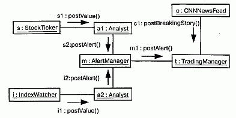
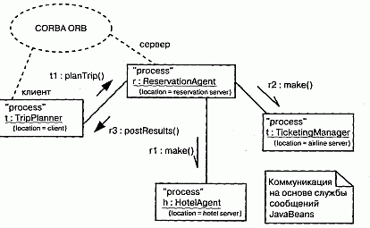

http://bourabai.kz/dbt/uml/ch22.htm

ЧАСТЬ V - Более сложные аспекты поведения
# Глава 22. Процессы и нити
* Введение
* Термины и понятия
    * Поток управления
    * Классы и события
    * Стандартные элементы
    * Коммуникация
    * Синхронизация
    * Представления с точки зрения процессов
* Типичные приемы моделирования
    * Несколько потоков управления
    * Межпроцессная коммуникация
* Советы

Реальный мир суров и не прощает ошибок; вдобавок к этому в нем постоянно что-то случается. Различные события происходят одновременно. Поэтому при моделировании системы, предназначенной для работы в реальном мире, следует учитывать ее вид с точки зрения процессов (см. главу 2), в котором основное внимание уделяется процессам и нитям, лежащим в основе механизмов параллельности и синхронизации.

В UML каждый независимый поток управления моделируется как активный объект, описывающий процесс или нить и способный инициировать некоторое управляющее воздействие. Процесс (Process) - это ресурсоемкий поток управления, который выполняется параллельно с другими процессами; нить (Thread) - это облегченный поток управления, выполняемый параллельно с другими нитями в рамках одного и того же процесса.

Построение абстракций таким образом, чтобы они могли безопасно функционировать при наличии нескольких потоков управления, - непростое дело. В частности, механизмы обмена информацией и синхронизации, которые при этом придется применять, должны быть существенно сложнее, чем для последовательных систем. Следует избегать как переусложнения модели (поскольку при наличии слишком большого числа параллельных потоков управления система начнет пробуксовывать), так и чрезмерного упрощения (потому что недостаточная степень параллелизма не позволит оптимизировать пропускную способность системы).

## Введение
Для собаки, живущей в конуре (см. главу 1), распорядок дня прост и последователен. Едим. Спим. Гоняемся за кошкой. Снова едим. Мечтаем о том, как будем гоняться за кошкой. Забраться в конуру, чтобы поспать или укрыться от дождя, не представляет проблемы, поскольку лишь у собаки возникает потребность воспользоваться входом. Никакой конкуренции за ресурсы.

Семейные заботы не столь просты. Не впадая в философствование, отметим, что каждый член семьи живет своей собственной жизнью, но в то же время взаимодействует с другими домочадцами (вместе обедают, смотрят телевизор, играют, делают уборку). Члены семьи совместно пользуются некоторыми ресурсами. Порой у детей бывает общая спальня, на всю семью может быть только один телефон или компьютер. Родственники распределяют между собой обязанности: отец ходит в прачечную и в бакалейную лавку, мать оплачивает счета и работает в саду, дети помогают делать уборку и готовить. Борьба за использование общих ресурсов и координация домашних обязанностей становятся предметом споров. Наличие одной ванной комнаты в ситуации, когда все одновременно собираются в школу или на работу, - это проблема, а обед не будет готов, если папа не сходил в магазин.

Но по-настоящему сложна жизнь небоскреба и его арендаторов. Сотни, а то и тысячи людей приходят в одно и то же здание, и у каждого из них свои планы. Все должны пройти через определенное число подъездов. Все пользуются одними и теми же лифтами, а их число тоже не бесконечно. Посетителей обслуживают одни и те системы отопления, кондиционирования, водоснабжения, канализации и подачи электроэнергии. На всех одна парковка. Если люди хотят работать слаженно, то должны общаться и синхронизировать свои действия.

В UML каждый независимый поток управления моделируется в виде активного объекта (см. главу 13). Активный объект - это процесс или нить, способные инициировать управляющее воздействие. Как и любой другой объект, активный объект может быть экземпляром класса. В таком случае говорят, что он является экземпляром активного класса. Подобно прочим объектам, активные объекты могут общаться друг с другом, посылая сообщения, хотя в данном случае передача сообщений должна быть дополнена семантикой параллелизма, чтобы облегчить взаимодействие независимых потоков управления.

Многие языки программирования непосредственно поддерживают концепцию активного объекта. В языки Java, Smalltalk и Ada параллелизм встроен. C++ поддерживает параллелизм за счет различных библиотек, в основе которых лежат механизмы параллельности, обеспечиваемые операционной системой. Применение UML для визуализации, специфицирования, конструирования и документирования этих абстракций необходимо потому, что без него почти невозможно рассуждать о параллельности, обмене информацией и синхронизации.

Графическое изображение активного класса, принятое в UML, показано на рис. 22.1. Активный класс - это частный случай класса (см. главы 4 и 9), и его нотация включает все соответствующие разделы - для имени класса, атрибутов и операций. Активные классы часто получают сигналы (см. главу 20), которые обычно перечисляются в дополнительном разделе.

#### Рис. 22.1 Активный класс

## Термины и понятия
Активный объект (Active object) - это объект, который владеет процессом или нитью и может инициировать управляющее воздействие. Активный класс (Active class) - это класс, экземплярами которого являются активные объекты. Процесс (Process) - это ресурсоемкий поток управления, который может выполняться параллельно с другими процессами. Нить (Thread) - это облегченный поток управления, который может выполняться параллельно с другими нитями в рамках одного процесса. Графически активный класс изображается в виде прямоугольника с жирными границами. Процессы и нити изображаются в виде стереотипных активных классов, а на диаграммах взаимодействия (см. главу 18) часто выступают в роли последовательностей.

### Поток управления
В строго последовательных системах имеется только один поток управления. Это означает, что в каждый момент времени выполняется одно и только одно действие. При запуске последовательной программы управление переходит к точке входа в программу, после чего последовательно выполняется одна операция за другой. Даже если внешние по отношению к системе актеры (см. главу 16) функционируют параллельно, последовательная программа будет обрабатывать по одному событию за раз, отбрасывая тем самым одновременные с ним события.

Поэтому такая последовательность и называется потоком управления. Если трассировать выполнение последовательной программы, то точка исполнения будет перемещаться от одного предложения программы к другому - последовательно. Встречаются, конечно, ветвления, циклы, переходы, а при наличии рекурсии или итерации - движение потока вокруг одной точки. Но, несмотря на все это, в последовательной системе есть только один поток выполнения..

В параллельной же системе потоков управления несколько, а значит, в один и тот же момент времени имеет место различная деятельность. Каждый из нескольких одновременно выполняемых потоков управления начинается с точки входа в некоторый независимый процесс или нить. Если сделать моментальный снимок параллельной системы во время ее работы, то мы увидим несколько точек выполнения (по крайней мере, логических).

Активный класс в UML используется для представления процесса (или нити), в контексте которого выполняется независимый поток управления, работающий параллельно с другими, пользующимися равными с ним правами.

> Примечание: Истинного параллелизма можно достичь тремя способами: во-первых, распределяя активные объекты между несколькими узлами (см. главу 26), во-вторых, помещая активные объекты на узлы с несколькими процессорами, и, в-третьих, комбинируя оба метода.

### Классы и события
Активные классы - это именно классы (см. главы 4 и 9), хотя и обладающие весьма специфическим свойством. Активный класс представляет независимый поток управления, тогда как обычный класс не связан с таковым. В отличие от активных, обычные классы неявно называют пассивными, так как они не способны инициировать независимое управляющее воздействие.

Активные классы применяются для моделирования семейств процессов или нитей. Технически это означает, что активный объект (см. главу 13) - экземпляр активного класса - материализует процесс или нить. При моделировании параллельных систем с помощью активных объектов вы присваиваете имя каждому независимому потоку управления. Когда активный объект создается, запускается ассоциированный с ним поток управления. Когда активный объект уничтожается, этот поток завершается.

Активные классы обладают теми же свойствами, что и любые другие классы. Они могут иметь экземпляры, атрибуты и операции (см. главу 4), а также принимать участие в отношениях (см. главы 4 и 10) зависимости, обобщения и ассоциации (включая агрегирование). Активные классы вправе пользоваться предоставляемыми UML механизмами расширения (см. главу 6), в том числе стереотипами, помеченными значениями и ограничениями. Встречаются активные классы - реализации интерфейсов (см. главу 11). Наконец, они могут реализовываться кооперациями, а их поведение - специфицироваться с помощью автоматов.

На диаграммах активные объекты встречаются там же, где и пассивные. Можно моделировать кооперации активных и пассивных объектов с помощью диаграмм взаимодействия (включая диаграммы последовательности и кооперации). Активный объект может выступать в роли целевого объекта события (см. главу 20) в автомате (см. главу 21).

Если речь зашла об автоматах, то как активные, так и пассивные объекты могут посылать и получать события сигналов и вызовов.

### Стандартные элементы
Все механизмы расширения (см. главу 6) UML применимы в том числе и к активным классам. Чаще всего используются помеченные значения для расширения их свойств, например для специфицирования политики планирования активного класса.

В UML определены два стандартных (см. "Приложение В") стереотипа, применимых к активным классам:

* process (процесс) - ресурсоемкий поток управления, который может выполняться параллельно с другими процессами;
* thread (нить) - облегченный поток управления, который может выполняться параллельно с другими нитями в рамках одного и того же процесса.

Различие между процессом и нитями связано с разными способами создания потоков управления операционной системой, работающей на узле (см. главу 26), где размещается объект.

Процесс известен самой операционной системе и выполняется в независимом адресном пространстве. В большинстве операционных систем, например в Unix и Windows, каждая программа представляет собой процесс. Вообще говоря, все процессы, исполняемые на некотором узле, пользуются равными правами и претендуют на общие ресурсы, которыми располагает узел. Процессы никогда не бывают вложенными. Если узел оборудован несколькими процессорами, то на нем достижим истинный параллелизм. Если же есть только один процессор, то возможна лишь иллюзия параллелизма, обеспечиваемая операционной системой.

Нить называют облегченным потоком управления, поскольку она требует меньше системных ресурсов. Нить может быть известна операционной системе, но чаще всего бывает скрыта от нее внутри некоего процесса, в адресном пространстве которого она и исполняется. Например, в языке Java нить наследует классу Thread. Все нити, существующие в контексте некоторого процесса, имеют одинаковые права и претендуют на ресурсы, доступные внутри процесса. Нити также не бывают вложенными. В общем случае существует лишь иллюзия параллельного выполнения нитей, поскольку не нить, а процесс является объектом планирования операционной системы.

### Коммуникация
Кооперирующиеся друг с другом объекты взаимодействуют (см. главу 15) путем обмена сообщениями. В системе, где есть одновременно активные и пассивные объекты, следует рассматривать четыре возможных комбинации.

Во-первых, сообщение может быть передано одним пассивным объектом другому такому же. В предположении, что в любой момент времени существует лишь один поток управления, проходящий через оба объекта, такое взаимодействие -не что иное, как простой вызов операции.

Во-вторых, сообщение может быть передано от одного активного объекта другому активному. Здесь мы имеем случай межпроцессной коммуникации, которая может осуществляться двумя способами. В первом варианте некоторый активный объект может синхронно вызывать операцию другого (о событиях сигналов и вызовов см. главу 20). Такой способ имеет семантику рандеву (Rendezvous): вызывающий объект затребует выполнение операции и ждет, пока принимающая сторона получит вызов, выполнит операцию и вернет некоторый объект (если есть что возвращать); затем оба объекта продолжают работать независимо друг от друга. В течение всего времени выполнения вызова оба потока управления будут блокированы. Во втором варианте один активный объект может асинхронно послать сигнал другому или вызвать его операцию. Семантика такого способа напоминает почтовый ящик (Mailbox): вызывающая сторона посылает сигнал или вызывает операцию, после чего продолжает выполняться. Тем временем получающая сторона принимает сигнал или вызов, как только будет к этому готова. Пока она обрабатывает запрос, все вновь поступающие события или вызовы ставятся в очередь. Отреагировав на запрос, принимающий объект продолжает свою работу. Семантика почтового ящика проявляется в том, что оба объекта не синхронизированы, просто один оставляет сообщение для другого.

В UML синхронное сообщение изображается полной стрелкой, а асинхронное - "полустрелкой" (см. рис. 22.2).

#### Рис. 22.2 Коммуникация

В-третьих, сообщение может быть передано от активного объекта пассивному. Трудности возникают в случае, когда сразу несколько активных объектов передают свой поток управлению одному и тому же пассивному. В такой ситуации следует очень аккуратно моделировать синхронизацию потоков, о чем мы поговорим в следующем разделе.

В-четвертых, пассивный объект может передавать сообщение активному. На первый взгляд это может показаться некорректным, но если вспомнить, что каждый поток управления принадлежит некоторому активному объекту, то становится ясно, что передача пассивным объектом сообщения активному имеет ту же семантику, что и обмен сообщениями между двумя активными объектами.

> Примечание: С помощью ограничений (см. главу 6) можно моделировать различные вариации посылки синхронных и асинхронных сообщений. Например, для моделирования отложенного рандеву (Balking rendezvous), имеющегося в языке Ada, можно воспользоваться синхронным сообщением с ограничением вида {wait = 0}, которое говорит о том, что вызывающий объект не будет дожидаться получателя. Можно смоделировать и тайм-аут с помощью ограничения вида {wait = 1 ms}, которое говорит, что вызывающий объект будет ждать приема сообщения получателем не более одной миллисекунды.

### Синхронизация
Попробуйте на секунду представить себе многочисленные потоки управления в параллельной системе. Когда поток проходит через некоторую операцию, мы говорим, что эта операция является точкой выполнения. Если операция определена в некотором классе, то можно сказать, что точкой выполнения является конкретный экземпляр этого класса. В одной операции (и, стало быть, в одном объекте) могут одновременно находиться несколько потоков управления, а бывает и так, что разные потоки находятся в разных операциях, но все же в одном объекте.

Проблема возникает тогда, когда в одном объекте находится сразу несколько потоков управления. Если не проявить осторожность, то потоки могут мешать друг другу, что приведет к некорректному изменению состояния объекта. Это классическая проблема взаимного исключения. Ошибки при обработке этой ситуации могут стать причиной различных видов конкуренции между потоками (Race conditions) и их взаимной интерференции, что проявляется в таинственных и не поддающихся воспроизведению сбоях параллельной системы.

Ключом к решению этой проблемы в объектно-ориентированных системах является трактовка объекта как критической области. У этого подхода есть три разновидности, суть каждой из которых заключается в присоединении к операциям, определенным в классе, некоторых сихронизирующих свойств. UML позволяет моделировать все три возможности:

* sequential (последовательная) - вызывающие стороны должны координировать свои действия еще до входа в вызываемый объект, так что в любой момент времени внутри объекта находится ровно один поток управления. При наличии нескольких потоков управления не могут гарантироваться семантика и целостность объекта;
* guarded (охраняемая) - семантика и целостность объекта гарантируются при наличии нескольких потоков управления путем упорядочения вызовов всех охраняемых операций объекта. По существу, в каждый момент времени может выполняться ровно одна операция над объектом, что сводит такой подход к последовательному;
* concurrent (параллельная) - семантика и целостность объекта при наличии нескольких потоков управления гарантируются тем, что операция рассматривается как атомарная.

Некоторые языки программирования поддерживают перечисленные конструкции непосредственно. Так в языке Java есть свойство synchronized, эквивалентное свойству concurrent в UML. В любом языке, поддерживающем параллельность, все три подхода можно реализовать с помощью семафоров (Semaphores).

На рис. 22.3 показано, как эти свойства присоединяются к операции, - это достигается применением нотации, принятой в UML для ограничений (см. главу 6).

#### Рис. 22.3 Синхронизация

> Примечание: С помощью ограничений можно моделировать различные вариации примитивов синхронизации. Например, можно модифицировать свойство concur rent, разрешив наличие нескольких читателей, но только одного писателя.

### Представления с точки зрения процессов

Активные объекты играют важную роль в визуализации, специфицировании, конструировании и документировании представления системы с точки зрения процессов (см. главу 2). Такое представление охватывает нити и процессы, формирующие системный параллелизм, а также механизмы синхронизации. Это представление фокусирует внимание прежде всего на производительности, масштабируемости и пропускной способности системы. UML позволяет выразить статические и динамические аспекты такого представления с помощью тех же диаграмм, которые применяются для представления с точки зрения проектирования, то есть диаграмм классов, взаимодействия, деятельности и состояний, с той только разницей, что основное внимание на них уделяется активным классам, представляющим нити и процессы.

## Типичные приемы моделирования

### Несколько потоков управления
Построение системы с несколькими потоками управления - непростая задача. Надо не только решить, как лучше всего распределить работу между параллельными активными объектами, но и продумать правильные механизмы (см. главу 28) коммуникации и синхронизации между активными и пассивными объектами в системе, гарантирующие правильность их поведения в присутствии нескольких потоков управления. Поэтому полезно визуализировать способы взаимодействия этих потоков между собой. В UML это можно сделать с помощью диаграмм классов (для описания статической семантики) и диаграмм взаимодействия (для описания динамической семантики), в которых участвуют активные классы и объекты.

Моделирование нескольких потоков управления осуществляется так:

1. Идентифицируйте возможности распараллеливания действий и материализуйте каждый поток управления в виде активного класса. Сгруппируйте общие множества активных объектов в активный класс. Избегайте пере усложнения вида системы с точки зрения процессов (см. главу 2), причиной которого может стать введение слишком большой степени параллелизма.
2. Рассмотрите баланс распределения обязанностей между активными класса ми (см. главы 4 и 9), а затем исследуйте, с какими другими активными и пассивными классами статически кооперируется каждый из них. Убедитесь, что каждый активный класс имеет внутреннюю структуру с высокой степенью связаности и слабо связан с соседними классами, и что для каждого класса правильно выбран набор атрибутов, операций и сигналов.
3. Отобразите статические решения в виде диаграмм классов, явно выделив каждый активный класс.
4. Рассмотрите, как каждая группа классов динамически кооперируется с прочими. Отобразите свои решения на диаграммах взаимодействия. Явно покажите активные объекты как начальные точки соответствующих потоков управления. Идентифицируйте каждую связанную последовательность, присваивая ей имя активного объекта.
5. Обратите особое внимание на коммуникации между активными объектами. Пользуйтесь по мере необходимости как синхронными, так и асинхронными сообщениями.
6. Обратите внимание на синхронизацию активных объектов и тех пассивных объектов, с которыми они кооперируются. Применяйте наиболее подходящую семантику - последовательную, охраняемую или параллельную.

На рис. 22.4 показана часть вида трейдерской системы с точки зрения процессов. Вы видите три объекта, которые параллельно питают систему информацией: StockTicker (БиржевойТикер), indexWatcher (наблюдательИндекса) и CNNNewsFeed (НовостнаяЛентаСММ), названные соответственно s, i и с. Два из них, s и i, обмениваются каждый со своим экземпляром класса Analyst (Аналитик) - al и а2. В рамках этого небольшого фрагмента модели класс Analyst может быть спроектирован в упрощенном виде - из расчета на то, что в каждый момент времени в любом из его экземпляров может быть активен только один поток управления. Однако оба экземпляра класса Analyst одновременно общаются с объектом AlertManager (ДиспетчерОповещений), которому мы дали имя т. Следовательно, m необходимо спроектировать так, чтобы он сохранял свою семантику в присутствии нескольких потоков управления m и c одновременно общаются с t - объектом класса TradingManager (управляющийТрейдингом). Каждому соединению присвоен порядковый номер, определяемый тем, какой поток управления им владеет.

#### Рис. 22.4 Моделирование потоков управления

> Примечание: Диаграммы взаимодействия, подобные представленной выше, полезны для визуализации тех мест, где два потока управления могут пересекаться и где, следовательно, необходимо обратить особое внимание на проблемы коммуникации и синхронизации. Инструментальным программам разрешается реализовывать и дополнительные визуальные указания, например раскрашивать потоки в разные цвета.

К подобным диаграммам часто присоединяют автоматы (см. главу 21) с ортогональными состояниями, чтобы детально показать поведение активных объектов.

### Межпроцессная коммуникация

При включении в систему нескольких потоков управления необходимо также рассмотреть механизмы, с помощью которых объекты из разных потоков управления взаимодействуют друг с другом. Объекты, находящиеся в разных нитях (существующих в рамках одного и того же процесса), могут общаться с помощью событий сигналов или вызовов (см. главу 20), причем последние могут иметь синхронную или асинхронную семантику. Для обмена информацией через границы процессов, у каждого из которых свое собственное адресное пространство, обычно применяются другие механизмы.

Сложность проблемы межпроцессной коммуникации усугубляется еще и тем, что в распределенных системах процессы могут исполняться на различных узлах (о моделировании местоположения см. главу 23). Существует два классических подхода к межпроцессной коммуникации: передача сообщений и вызовы удаленных процедур. В UML эти механизмы моделируются как асинхронные и синхронные события соответственно. Но поскольку это уже не простые вызовы внутри одного процесса, то проект необходимо обогатить дополнительной информацией.

Моделирование межпроцессной коммуникации производится следующим образом:

1. Смоделируйте несколько потоков управления.
2. Рассмотрите, какие из этих активных объектов могут быть представлены процессами, а какие - нитями. Чтобы их различить, воспользуйтесь подходящими стереотипами (см. главу 6).
3. Смоделируйте обмен сообщениями с помощью асинхронных, а вызовы удаленных процедур - с помощью синхронных коммуникаций.
4. Неформально опишите используемый механизм с помощью примечаний (см. главу 6) или - более строго - с помощью коопераций (см. главу 27).

На рис. 22.5 показана распределенная система бронирования билетов, в которой процессы исполняются на четырех узлах (см. главу 26). Каждый объект маркирован стереотипом process, а также помеченным значением location, которое определяет его физическое положение. Коммуникации между объектами ReservatibnAgent (АгентБронирования), TicketingManager (ДиспетчерВы-дачиБилетов) и HotelAgent (ГостиничныйАгент) асинхронны. В примечании написано, что коммуникации построены на основе службы сообщений, реализованной на JavaBeans. Коммуникация между объектами TripPlanner (Планиров-щикМаршрута) и ReservationSystem (СистемаРезервирования) синхронная.

#### Рис. 22.5 Моделирование межпроцессной коммуникации

Семантика их взаимодействия показана в кооперации, названной CORBA ORB. TripPlanner выступает в роли клиента, a ReservationAgent - сервера. Раскрыв эту кооперацию, вы увидите детали совместной работы сервера и клиента.

## Советы
Хорошо структурированный активный класс и активный объект обладают следующими свойствами:

* представляют независимый поток управления, который максимально использует потенциальные возможности истинного параллелизма в системе;
* не настолько мелки, чтобы требовать наличия множества других активных элементов, которое может привести к переусложненной и нестабильной архитектуре процессов;
* аккуратно управляют коммуникацией между активными элементами, выбирая наиболее подходящий случаю механизм - синхронный или асинхронный;
* исходят из трактовки каждого объекта как критической области, используя подходящие синхронизирующие свойства для сохранения его семантики в присутствии нескольких потоков управления;
* явно разграничивают семантику процесса и нити.

Рисуя в UML активный класс или активный объект:

* показывайте только те атрибуты, операции и сигналы, которые важны для понимания абстракции в соответствующем контексте;
* явно показывайте все синхронизирующие свойства операции.

