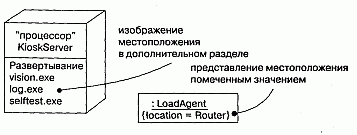
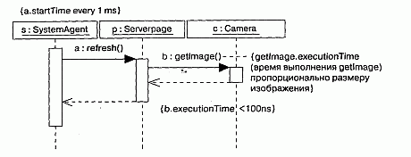
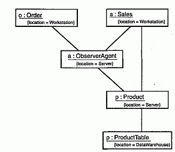
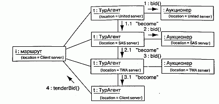

http://bourabai.kz/dbt/uml/ch23.htm

ЧАСТЬ V - Более сложные аспекты поведения
# Глава 23. Время и пространство
* Введение
* Термины и понятия
    * Время
    * Местоположение
* Типичные приемы моделирования
    * Временные ограничения
    * Распределение объектов
    * Мигрирующие объекты
* Советы

Как уже говорилось, реальный мир суров и не прощает ошибок. События в нем происходят в непредсказуемые моменты времени и тем не менее требуют адекватной и своевременной реакции. Системные ресурсы могут быть распределены по всему миру, а некоторые даже способны перемещаться в пространстве, - в связи с этим возникают проблемы задержек, синхронизации, безопасности и качества услуг.

Моделирование времени и пространства - важный элемент любой распределенной системы или системы реального времени. Для визуализации, специфицирования, конструирования и документирования таких систем UML предлагает различные средства, включая отметки времени, временные выражения, ограничения и помеченные значения.

Проектирование систем реального времени и распределенных систем - трудная задача. Хорошая модель должна высветить все необходимые и достаточные пространственно-временные свойства системы.

## Введение
Приступая к моделированию большинства программных систем, обычно исходят из расчета на идеальность среды: предполагают, что для доставки сообщения требуется нулевое время, сетевых сбоев не бывает, рабочие станции никогда не выходят из строя, а загрузка сети всегда равномерна. К сожалению, реальный мир устроен не так: сообщения доставляются с задержкой (а иногда и вовсе не доставляются), сеть "падает", рабочие станции "зависают" и загрузка сети далека от сбалансированной. Поэтому, рассматривая систему, которая должна работать в реальном мире, необходимо принимать во внимание как пространственные, так и временные характеристики.

Система реального времени (Real time system) называется так потому, что она должна выполнять свои функции в строго определенный абсолютный или относительный момент времени и затрачивать на это предсказуемое и зачастую ограниченное время. Среди подобных систем бывают такие, для которых требуемое время реакции исчисляется нано- или миллисекундами. Но встречаются и системы почти реального времени, для которых допустимое время реакции - порядка секунды и даже дольше.

Под распределенной системой (Distributed system) понимается такая система, компоненты (см. главу 25) которой могут быть физически размещены на различных узлах (см. главу 26). Узлы могут представлять собой разные процессоры, смонтированные в одном и том же корпусе, или разные компьютеры, находящиеся в противоположных точках земного шара.

Чтобы удовлетворить потребностям моделирования систем реального времени и распределенных систем, UML включает графическое представление для отметок времени, временных выражений, временных ограничений и местоположения, как показано на рис. 23.1.

#### Рис. 23.1 Временные ограничения и местоположение

## Термины и понятия
Отметка времени (Timing mark) служит для обозначения момента времени, в который произошло событие. Она изображается как выражение, зависящее от имени, присвоенного сообщению (которое, как правило, отлично от имени действия, инициируемого этим сообщением).

Временное выражение (Time expression) - это выражение, значением которого является абсолютное или относительное время. Временное ограничение (Timing constraint) - это семантическое утверждение об относительном или абсолютном времени. Графически временное ограничение изображается как любое другое ограничение - строкой, заключенной в скобки, и обычно связано с некоторым элементом отношением зависимости. Местоположение (Location) - это размещение компонента в узле. Изображается оно помеченным значением, то есть строкой, заключенной в фигурные скобки и размещенной под именем элемента или в виде вложенных в узел компонентов

### Время
Системы реального времени, как следует из самого названия, критичны по времени. События (см. главу 20) в них могут происходить регулярно или спонтанно, но в любом случае время реакции на событие должно быть предсказуемо - либо по абсолютной продолжительности, либо относительно момента возникновения события.

Передача сообщений (см. главу 15) - это один из динамических аспектов системы, поэтому при моделировании временных особенностей системы с помощью UML можно каждому сообщению, принимающему участие во взаимодействии (см. там же), дать имя, которое будет использоваться как отметка времени. Обычно сообщениям, принимающим участие во взаимодействии, имена не присваиваются. Как правило, при их изображении используется имя события, например сигнала или вызова. При этом невозможно использовать имя события в записи выражения, поскольку одно и то же событие может быть причиной различных сообщений. Если имеет место такого рода неоднозначность, следует присвоить явное имя сообщению в отметке времени, чтобы в дальнейшем его можно было использовать во временном выражении. Отметка времени - это не что иное, как выражение, в котором встречается имя сообщения, принимающего участие во взаимодействии. Если задано имя сообщения, то можно использовать любую из трех функций от этого сообщения - startTime, stopTime, executionTime. В свою очередь, эти три функции можно использовать для построения временных выражений произвольной сложности, возможно, включающих веса или смещения, которые могут быть константами или переменными (если только эти переменные можно вычислить в момент выполнения). Наконец, как показано на рис. 23.2, временное выражение можно поместить внутрь временного ограничения (см. главу 6), чтобы описать поведение системы во времени. Как и любые другие ограничения, их можно изобразить рядом с соответствующим сообщением или явно присоединить с помощью отношения зависимости.

#### Рис. 23.2 Время

> Примечание: Стоит употреблять в выражениях именованные константы вместо явного упоминания времени, в особенности для сложных систем. Константы можно определить в одной части модели, а затем использовать в других местах. При этом будет проще модифицировать модель, если временные требования к системе изменятся.

> Примечание: Временные выражения можно применять и к операциям. К любой операции разрешается присоединить помеченное значение semantics (см. главу 9) и, используя временное выражение, специфицировать временную сложность операции. Временная сложность (Time complexity) применяется для моделирования минимального, максимального или среднего времени, в течение которого операция должна завершиться. Временная сложность операции, по существу, описывает ее временной бюджет, который можно использовать двумя способами. Во-первых, назначая временной бюджет в ходе разработки, а затем измеряя его на работающей системе, вы получаете возможность сравнивать поведение задуманной и реализованной системы. Во-вторых, складывая результаты (спроектированные или реальные) вычисления временных выражений для всех операций во взаимодействии, можно получить временную сложность всей транзакции.

### Местоположение
Распределенные системы по своей природе состоят из компонентов, физически разбросанных по разным узлам. Для многих систем местоположение (Location) компонентов (см. главу 25) фиксируется в момент установки системы. Но встречаются и такие системы, в которых компоненты мигрируют с одного узла (см. главу 26) на другой.

В UML вид системы с точки зрения развертывания моделируется с помощью диаграмм развертывания (см. главу 30), описывающих топологию процессоров и устройств, на которых выполняется система. Компоненты, такие как исполняемые модули, библиотеки и таблицы, размещаются в этих узлах. Каждый экземпляр узла владеет собственными экземплярами тех или иных компонентов, а каждый экземпляр компонента принадлежит ровно одному экземпляру узла (хотя различные экземпляры компонента одного вида могут находиться на разных узлах, - о дихотомии "класс/объект" см. главы 2 и 13). Например, на рис. 23.3 показан исполняемый компонент vision.exe, находящийся в узле с именем KioskServer.

#### Рис. 23.3 Местоположение

В узле могут размещаться и экземпляры простых классов (см. главы 4 и 9). Так, на рис. 23.3 мы видим экземпляр класса LoadAgent в узле Router.

Как видно из рисунка, моделировать положение элемента в UML можно двумя способами. Во-первых, как в случае KioskServer, можно физически поместить элемент (его текстовое или графическое описание) в дополнительный раздел объемлющего узла. Во-вторых - примером является LoadAgent - можно воспользоваться помеченным значением location для обозначения узла, на котором размещен класс (о помеченных значениях и дополнительных разделах см. главу 6). Обычно первый способ применяется, когда важно дать в диаграмме визуальное представление пространственного разделения и группирования компонентов. Второй способ удобнее, когда моделирование положения элемента для данной диаграммы является хотя и важным, но второстепенным, например, когда вы хотите визуализировать передачу сообщений между экземплярами.

> Примечание: Второй способ моделирования положения элемента особенно полезен, когда нужно показать изменение местонахождения компонента во времени. Например, можно воспользоваться сообщением become (см. главу 13), чтобы смоделировать объект, который в текущий момент находится в одном месте, но переместится в другое. Аналогично для показа семантических отношений между разнесенными объектами можно применить сообщение copy (см. главу 13).

## Типичные приемы моделирования

Временные ограничения
Абсолютное время события, интервал между событиями и время, требуемое для выполнения действия, - вот три основных временных аспекта систем реального времени, при моделировании которых находят применение временные ограничения (см. главу 6).

Моделирование временных ограничений осуществляется так:

1. Для каждого события во взаимодействии рассмотрите, должно ли оно начинаться в определенный абсолютный момент времени. Промоделируйте это свойство с помощью временного ограничения на сообщение.
2. Для каждой представляющей интерес последовательности сообщений во взаимодействии рассмотрите, ограничено ли время ее выполнения. Промоделируйте это свойство с помощью временного ограничения на последовательность.
3. Для каждой критичной по времени операции рассмотрите ее временную сложность. Промоделируйте эту семантику с помощью временного ограничения на операцию.

Например, левое ограничение на рис. 23.4 специфицирует начальное время повторяющегося события вызова refresh. Временное ограничение, находящееся в середине рисунка, специфицирует максимальную продолжительность вызова get Image. Наконец, правое ограничение специфицирует временную сложность события вызова get Image.

#### Рис. 23.4 Моделирование временных ограничений

> Примечание: Обратите внимание, что функция executionTime может быть применена как к действиям типа get Image, так и к меткам синхронизации типа а и b. Кроме того, подобные временные ограничения можно записать в свободном формате. При желании более детально специфицировать семантику стоит воспользоваться языком объектных ограничений (Object Constraint Language - ОСL), который является частью UML и подробно описан в книге "Unified Modeling Language Reference Manual".

Как правило, рекомендуется выбирать для сообщений короткие имена, чтобы не путать их с именами операций.

### Распределение объектов
При моделировании топологии распределенной системы следует рассмотреть физическое размещение экземпляров как компонентов, так и классов. Если в центре внимания находится управление конфигурацией развернутой системы, то моделирование распределения компонентов (см. главу 25) особенно важно для визуализации, специфицирования, конструирования и документирования размещения таких физических сущностей, как исполняемые модули, библиотеки и таблицы. Если же вас больше интересует функциональность, масштабируемость и пропускная способность системы, то важнее всего моделирование распределения объектов.

Решение о том, как распределить объекты в системе, - это болезненная проблема, и не только потому, что вопросы распределения объектов тесно связаны с вопросами параллельности (о моделировании процессов и нитей см. главу 22). Непродуманное решение может стать причиной очень низкой производительности, но слишком изощренные подходы немногим лучше, а пожалуй, даже и хуже поскольку приводят к нестабильности.

1. Для каждого представляющего интерес класса объектов в системе рассмотрите локальность ссылок - другими словами, выявите всех соседей и- их местоположение. Сильносвязная локальность означает, что логически сосед ние объекты находятся рядом, а слабосвязная - что они физически удалены друг от друга (и значит, при обмене информацией между ними будут иметь место временные задержки). Старайтесь размещать объекты рядом с актера ми, которые ими манипулируют.
2. Затем рассмотрите типичные взаимодействия между связанными множе ствами объектов. Расположите множества объектов с высокой степенью вза имодействия рядом, чтобы уменьшить стоимость коммуникации. Разнесите по разным узлам объекты, которые слабо взаимодействуют между собой.
3. Далее рассмотрите распределение ответственности в системе. Перераспре делите объекты так, чтобы сбалансировать загрузку каждого узла.
4. Не забудьте о безопасности, подвижности и качестве услуг и учтите эти со ображения при размещении объектов.
5. Изобразите объекты на диаграмме одним из двух способов:
    * включив объекты непосредственно в узлы на диаграмме развертывания;
    * явно указав положение объекта с помощью помеченного значения.

На рис. 23.5 представлена диаграмма объектов (см. главу 14), которая моделирует распределение объектов в гипотетической системе розничной торговли. Ценность этой диаграммы в том, что она позволяет визуализировать физическое размещение ключевых объектов. Как видно, два объекта Order (Заказ) и Sales (Продажи) находятся в узле Workstation (РабочаяСтанция), два других (ObserverAgent, агентНаблюдения, и Product, Продукт) - в узле Server и один (ProductTable, таблицаПродуктов) - в узле DataWarehouse (ХранилищеДанных).

#### Рис. 23.5 Моделирование распределения объектов

Мигрирующие объекты
Во многих рапределенных системах компоненты и объекты не меняют свое положение после начального развертывания. На протяжении всего жизненного цикла - от создания до уничтожения - они остаются на том узле, где родились. Однако встречаются категории распределенных систем, в которых различные сущности перемещаются, в основном по двум причинам.

Во-первых, объекты мигрируют, чтобы приблизиться к актерам и другим объектам, с которыми они должны кооперироваться для лучшего выполнения работы. Например, в глобальной системе грузового пароходства имеются объекты, представляющие суда, контейнеры и декларации судового груза, которые перемещаются из одного узла в другой, следуя за своими физическими прообразами. Если судно находится в Гонконге, то для улучшения локальности ссылок разумно переместить объекты, представляющие судно, находящиеся на нем контейнеры и его грузовую декларацию в узел в Гонконге. А когда судно направляется в Сан-Диего, то все эти объекты следуют за ним.

Во-вторых, объекты мигрируют из-за отказа узла (или соединения) либо с целью сбалансировать нагрузки между разными узлами. Например, в системе управления воздушным транспортом нельзя допустить, чтобы отказ одного узла заблокировал работу всей национальной сети. Поэтому отказоустойчивые системы такого типа перемещают все элементы на другие узлы. При этом, возможно, пострадают производительность и пропускная способность, но будет сохранена безопасность функционирования. Аналогичным образом в системах, ориентированных на работу в Web-среде, где возможен непредсказуемый рост пиковой нагрузки, часто предусматриваются механизмы автоматической балансировки загрузки, возможно за счет перемещения компонентов и объектов на недогруженные узлы.

Решение о том, как перемещать объекты в системе, вызывает еще больше сложностей, чем планирование простого статического распределения, поскольку с миграцией связан ряд трудноразрешимых задач синхронизации и сохранения идентичности.

Моделирование миграции объектов осуществляется так:

1. Выберите механизм (см. главу 28) физической транспортировки объектов между узлами.
2. Представьте на диаграмме размещение объекта в узле, явно указав его поло жение с помощью помеченного значения.
3. С помощью стереотипных сообщений become и copy (см. главу 13) изобра зите перемещение объекта на новый узел.
4. Рассмотрите вопросы синхронизации (сохранение корректности состояния клонированных объектов) и идентичности (сохранение имени объекта при его перемещении).

На рис. 23.6 приведена диаграмма кооперации (см. главу 18), моделирующая миграцию Web-агента, который перемещается между узлами, собирая информацию и торгуясь за ресурсы с целью автоматически найти минимальную стоимость билета. Точнее, на этой диаграмме показан экземпляр (с именем t) класса ТурАгент, мигрирующий с одного сервера на другой. По пути этот объект взаимодействует с анонимными экземплярами класса Аукционер на каждом узле и в конце концов доставляет результат торгов объекту Маршрут, который расположен на узле Client server.

#### Рис. 23.6 Моделирование мигрирующих объектов

## Советы
Хорошо структурированная модель с пространственно-временными свойствами обладает следующими особенностями:

* описывает только те пространственно-временные свойства, которые необходимы и достаточны для понимания желаемого поведения системы;
* централизует использование этих свойств, так чтобы их легко было найти и модифицировать.

Изображая в UML пространственное или временное свойство, руководствуйтесь следующими принципами:

* давайте отметкам времени (то есть соответствующим сообщениям) осмысленные имена;
* проводите явное различие между временными выражениями, значениями которых является абсолютное и относительное время;
* пространственные свойства показывайте преимущественно с помощью помеченных значений. Вложенную форму применяйте только тогда, когда важно визуализировать местонахождение элементов в развернутой системе.

