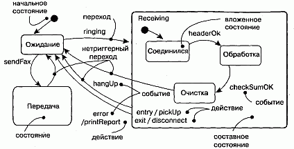
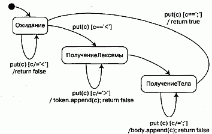

http://bourabai.kz/dbt/uml/ch24.htm

ЧАСТЬ V - Более сложные аспекты поведения
# Глава 24. Диаграммы состояний
* Введение
* Термины и понятия
    * Общие свойства
    * Содержание
    * Типичные примеры использования
* Типичные приемы моделирования
    * Реактивные объекты
    * Прямое и обратное проектирование
* Советы

Диаграммы состояний - это один из пяти видов диаграмм в языке UML, используемых для моделирования динамических аспектов системы (к их числу относятся также диаграммы последовательностей и кооперации, диаграммы деятельности и диаграммы прецедентов - см. главы 18, 19 и 17 соответственно). Диаграмма состояний показывает автомат. Ее частной разновидностью является диаграмма деятельности, в которой все или большая часть состояний - это состояния деятельности, а все или большая часть переходов инициируются в результате завершения деятельности в исходном состоянии. Таким образом, при моделировании жизненного цикла объекта полезны как диаграммы деятельности, так и диаграммы состояний. Но если диаграмма деятельности показывает поток управления от деятельности к деятельности, то на диаграмме состояний представлен поток управления от состояния к состоянию.

Диаграммы состояний используются для моделирования динамических аспектов системы. По большей части под этим подразумевается моделирование поведения реактивных объектов. Реактивным называется объект, поведение которого лучше всего характеризуется его реакцией на события, произошедшие вне его собственного контекста. У реактивного объекта есть четко выраженный жизненный цикл, когда текущее поведение обусловлено прошлым. Диаграммы состояний можно присоединять к классам, прецедентам или системе в целом для визуализации, специфицирования, конструирования и документирования динамики отдельного объекта.

Диаграммы состояний важны не только для моделирования динамических аспектов системы, но и для конструирования исполняемых систем путем прямого и обратного проектирования.

Введение
Рассмотрим деятельность инвестора, финансирующего строительство нового небоскреба (см. главу 1). Маловероятно, что этому человеку будут интересны подробности процесса возведения здания. Выбор материалов, график поставок и многочисленные совещания по поводу технических деталей - это заботы подрядчика, но никак не лица, вкладывающего в проект деньги.

Инвестор заинтересован в получении хорошей прибыли и, как следствие, в защите капиталовложений от рисков. Инвестор, доверяющий подрядчику, внесет определенную сумму денег, на время строительства займется другими делами и вернется только тогда, когда подрядчик будет готов вручить ему ключи от здания. Такой вкладчик заинтересован только в конечном результате.

Более прагматичный инвестор тоже доверится подрядчику, но все же, прежде чем давать деньги, захочет удостовериться в том, что процесс протекает в правильном направлении. Поэтому, вместо того чтобы предоставлять бесконтрольный доступ к банковскому счету, осторожный вкладчик сначала наметит основные вехи проекта, каждая из которых соотносится с завершением определенной стадии работ. Лишь на исходе одного этапа инвестор выделит сумму для выполнения следующего. Например, в самом начале может быть выдана сравнительно скромная сумма на создание архитектурного проекта. После его одобрения очередная инвестиция выделяется на инженерную подготовку. Когда и этот этап закончится, вносятся деньги на рытье котлована. И так на всем пути, от закладки фундамента до получения свидетельства о праве владения, расставлены вехи.

Каждая такая веха обозначает некое устойчивое состояние проекта: закончено архитектурное проектирование, проведена инженерная подготовка, вырыт котлован, завершена подводка коммуникаций, загерметизированы швы и т.д. Для инвестора наблюдение за изменениями в ходе процесса намного важнее, чем контроль последовательности работ: этим может заняться подрядчик с помощью Pert-диаграмм (см. главу 19).

При моделировании программных систем также необходимо отыскать наиболее естественный способ визуализации, специфицирования, конструирования и документирования поведения определенных типов объектов, когда основное внимание уделяется переходам из состояния в состояние, а не от деятельности к деятельности. Последнее можно выполнить с помощью блок-схем (или диаграмм деятельности в UML, см. главу 19). Представьте себе моделирование поведения встроенной системы безопасности у себя дома. Она работает непрерывно, реагируя на внешние события, скажем на разбитое окно. Порядок событий изменяет поведение системы. Например, обнаружение разбитого окна вызовет срабатывание сигнализации, только если система предварительно была активизирована. Поведение такой системы лучше всего описывается путем моделирования ее устойчивых состояний (например, Ожидание, Активна, Проверка и т.д.), событий, инициирующих смену состояния, и действий, выполняемых при каждой такой смене.

В UML для моделирования поведения объекта с точки зрения порядка возникновения событий используются диаграммы состояний. Из рис. 24.1 видно, что диаграмма состояний - это просто представление автомата (см. главу 21), и основное внимание уделено потоку управления от одного состояния к другому.

#### Рис. 24.1 Диаграмма состояний

## Термины и понятия
Диаграмма состояний (Statechart diagram) показывает автомат, фокусируя внимание на потоке управления от состояния к состоянию. Автомат (State machine) -это описание последовательности состояний, через которые проходит объект на протяжении своего жизненного цикла, реагируя на события, - в том числе описание реакций на эти события. Состояние (State) - это ситуация в жизни объекта, на протяжении которой он удовлетворяет некоторому условию, осуществляет определенную деятельность или ожидает какого-то события. Событие (Event) - это спецификация существенного факта, который происходит во времени и пространстве. В контексте автоматов событие - это стимул, способный вызвать срабатывание перехода. Переход (Transition) - это отношение между двумя состояниями, показывающее, что объект, находящийся в первом состоянии, должен выполнить некоторые действия и перейти во второе состояние, как только произойдет определенное событие и будут выполнены заданные условия. Деятельность (Activity) -это продолжающееся неатомарное вычисление внутри автомата. Действие (Action) - это атомарное вычисление, которое приводит к смене состояния или возврату значения. Диаграмма состояний изображается в виде графа с вершинами и ребрами.

### Общие свойства

Диаграмма состояний обладает свойствами, общими для всех диаграмм (см. главу 7), то есть имеет имя и графическое содержание, проецируемое на модель. От прочих диаграмм она отличается именно этим содержанием.

### Содержание
Обычно диаграмма состояний включает в себя:

* простые и составные состояния (см. главу 21);
* переходы вместе с ассоциированными событиями и действиями (см. ту же главу).

> Примечание: Диаграмма состояний, по сути, составлена из элементов, встречающихся в любом автомате. Она может содержать ветвления, разделения, слияния, состояния деятельности и действий, объекты, начальные и конечные состояния, исторические состояния и т.д., - в общем, к диаграмме состояний применимы все без исключения характеристики автомата. Диаграмму деятельности (см. главу 19) отличает от диаграммы состояний лишь то, что она состоит в основном из элементов, встречающихся в графе деятельности, и представляет собой разновидность автомата, в котором все или большая часть состояний есть состояния деятельности, а все или большая часть переходов инициируются фактом завершения деятельности в исходном состоянии.

Как и все прочие диаграммы, диаграмма состояний может содержать примечания и ограничения (см. главу 6).

### Типичные примеры использования
Диаграммы состояний применяются для моделирования динамических аспектов системы. Имеется в виду обусловленное порядком возникновения событий поведение объектов любого рода в любом представлении системной архитектуры (см. главу 2), включая классы (в том числе активные, см. главу 22), интерфейсы (см. главу 11), компоненты (см. главу 25) и узлы (см. главу 26).

Использовать диаграммы состояний для моделирования некоторого динамического аспекта системы можно в контексте практически любого элемента модели. Обычно, однако, диаграммы состояний применяются в контексте системы в целом, подсистемы или класса. Можно присоединять диаграммы состояний и к прецедентам (для моделирования сценария).

При моделировании динамических аспектов системы (см. главу 31), класса (см. главы 4 и 9) или прецедента (см. главу 16) диаграммы состояний обычно используются только с целью моделирования реактивных объектов.

Реактивный, или управляемый событиями, объект - это такой объект, поведение которого лучше всего характеризовать его реакцией на внешние события. Как правило, реактивный объект находится в состоянии ожидания, пока не получит событие, а когда это случается, его реакция зависит от предшествующих событий. После того как объект отреагирует на событие, он снова переходит в состояние ожидания следующего события. Для таких объектов интерес представляют прежде всего устойчивые состояния, события, инициирующие переходы из одного состояния в другое, и действия, выполняемые при смене состояния.

> Примечание: В противоположность этому диаграммы деятельности используются для моделирования рабочего процесса или операции. Они в большей степени подходят для показа протекания деятельности во времени и этим напоминают блок-схемы.

## Типичные приемы моделирования

### Реактивные объекты
Чаще всего диаграммы состояний используются для моделирования реактивных объектов, особенно экземпляров классов, прецедентов и системы в целом.

В то время как взаимодействия (см. главу 15) применяются для моделирования поведения сообщества объектов, совместно решающих некоторую задачу, диаграммы состояний предназначены для моделирования поведения одного объекта на протяжении его жизненного цикла. Если диаграммы деятельности (см. главу 19) моделируют поток управления от деятельности к деятельности, то диаграммы состояний - поток управления от события к событию.

При моделировании поведения реактивного объекта нужно специфицировать главным образом три вещи: устойчивые состояния, в которых может находиться объект, события, которые иницируют переходы из одного состояния в другое, и действия, выполняемые при каждой смене состояния. Моделирование реактивного объекта подразумевает моделирование всего его жизненного цикла (см. главу 21), начиная с момента создания и вплоть до уничтожения, с особым акцентом на устойчивые состояния, в которых может находиться объект.

Устойчивое состояние - такое, в котором объект может находиться неопределенно долгое время (см. главу 23). Когда происходит некое событие, объект переходит в новое состояние. События могут также инициировать переходы в себя и внутренние переходы, когда исходное и целевое состояния совпадают. В ходе реакции на событие или изменения состояния объект может выполнить некоторое действие.

> Примечание: При моделировании поведения реактивного объекта вы можете специфицировать действие, привязав его к переходу или изменению состояния. В специальной литературе автомат, все действия которого привязаны к переходам, называется машиной Мили (Mealy), а автомат, все действия которого привязаны к состояниям, машиной Мура (Moore). C математической точки зрения тот и другой обладают одинаковой выразительной мощью. На практике при разработке диаграмм состояний обычно используется комбинация машин Мили и Мура.

Моделирование реактивного объекта складывается из следующих процессов:

1. Выберите контекст для автомата - класс, прецедент или систему в целом.
2. Выберите начальное и конечное состояния для объекта. Для использования в остальной части модели, возможно, стоит сформулировать пред- и пост условия (см. главу 10) для начального и конечного состояния.
3. Определите устойчивые состояния объекта, - те, в которых он может находиться неопределенно долгое время. Начните с состояний верхнего уровня, а затем переходите к подсостояниям.
4. Определите разумное частичное упорядочение устойчивых состояний на протяжении жизненного цикла объекта.
5. Определите, какие события могут инициировать переходы между состояниями. Смоделируйте эти события как триггеры переходов из одного допустимого упорядочения состояний в другое.
6. Присоедините действия к переходам (как в машине Мили) и/или к состояниям (как в машине Мура).
7. Рассмотрите, как можно упростить автомат за счет использования подсостояний, ветвлений, разделений, слияний и исторических состояний.
8. Проверьте, что любое из состояний достижимо при некоторой комбинации событий.
9. Убедитесь в отсутствии тупиковых состояний, то есть таких, из которых нет переходов ни при какой комбинации событий.
10. Трассируйте автомат вручную или с помощью инструментальных средств и проверьте, как он ведет себя при ожидаемых последовательностях событий и реакций на них.

На рис. 24.2 показана диаграмма состояний для разбора простого контекстно-свободного языка. Примеры таких язков можно найти в системах, для которых входной или выходной поток составляют XML-сообщения. В таких случаях проектируется автомат для разбора потока символов, удовлетворяющего синтаксису языка:

#### Рис. 24.2 Моделирование реактивных объектов

	сообщение: ' <' строка ' >' строка ' ; '
Первая строка представляет тэг, вторая - тело сообщения. Из данного потока символов извлекаются только сообщения, удовлетворяющие правилам синтаксиса.

Из рисунка видно, что для автомата предусмотрены только три устойчивых состояния: Ожидание, ПолучениеЛексемы и ПолучениеТела. Диаграмма состояний спроектирована в виде машины Мили - действия привязаны к переходам. На самом деле в автомате есть только одно представляющее интерес событие (см. главу 20) - вызов put с фактическим параметром с (символом). В состоянии Ожидание автомат отбрасывает все символы, не интерпретируемые как начало лексемы (это специфицировано сторожевым условием). При обнаружении начала лексемы состояние объекта изменяется на ПолучениеЛексемы. Находясь в этом состоянии, автомат сохраняет все символы, не интерпретируемые как конец лексемы (это тоже специфицировано сторожевым условием). Обнаружив конец лексемы, объект переходит в состояние ПолучениеТела. В этом состоянии автомат сохраняет все символы, не интерпретируемые как конец сообщения (см. сторожевое условие). Как только получен конец сообщения, состояние объекта меняется на Ожидание; возвращается значение, показывающее, что сообщение разобрано и автомат готов к приему следующего.

Обратите внимание, что эта диаграмма описывает автомат, работающий непрерывно - в нем нет конечного состояния.

Прямое и обратное проектирование
Для диаграмм состояния возможно прямое проектирование (создание кода по модели), в особенности если контекстом диаграммы является класс. Так, из показанной выше диаграммы инструментальное средство могло бы сгенерировать следующий код на языке Java для класса MessageParser:

	
	class MessageParser { 
	public
	  boolean put (char c)  { 
	  	switch (state)  { 
	 	  case Waiting : 
	        if (c == '<')  { 
	          state = GettingToken; 
	          token = new StringBuffer () ; 
	          body = new StringBuffer () ; 
	        }
	        break;
	      case GettingToken : 
	        if (c == '>')
	          state = GettingBody; 
	        else
	          token.append(c); 
	        break;
	      case GettingBody : 
	        if (c ==';')
	          state = Waiting; 
	        else
	          body.append(c); 
	        return true; 
	    }
	    return false; 
	  } 
	  StringBuffer getToken( ) {
	    return token; 
	  } 
	  StringBuffer getBody( ) {
	    return body; 
	  }
	private
	  final static int Waiting = 0; 
	  final static int GettingToken = 1; 
	  final static int GettingBody = 2; 
	  int state = Waiting; 
	  StringBuffer token, body; 
	}
Генерация такого кода требует от инструмента некоторых "ухищрений", чтобы включить необходимые закрытые поля и константы с атрибутами final static.

Обратное проектирование (создание модели по коду) теоретически возможно, но практически не очень полезно. Выбор того, что составляет значимое состояние, - прерогатива проектировщика. Инструмент для обратного проектирования не обладает способностью к абстрагированию и потому не может автоматически породить осмысленные диаграммы состояний. Более интересный вариант - анимация модели, задача которой заключается в том, чтобы показать, как будет исполняться развернутая система. Скажем, в предыдущем примере инструментальная программа могла бы анимировать состояния диаграммы по мере их достижения в работающей системе. При этом можно также подвергнуть анимации и срабатывание переходов, показав получение событий и выполнение соответствующих действий. Под управлением отладчика допустимо контролировать скорость выполнения и устанавливать точки прерывания для остановки работы в представляющих интерес состояниях, чтобы просмотреть значения атрибутов отдельного объекта.

## Советы
При создании диаграммы состояний в UML не забывайте, что все диаграммы -это лишь проекции динамических аспектов одной и той же системы. Одна диаграмма состояний может описать семантику одного реактивного объекта, но никогда - семантику всей системы, за исключением самых тривиальных случаев.

Хорошо структурированная диаграмма состояний обладает следующими свойствами:

* сосредоточена на описании какого-либо одного аспекта динамики системы;
* содержит только те элементы, которые существенны для понимания этого аспекта;
* описывает лишь детали, которые соответствуют своему уровню абстракции;
* сбалансированно использует стилистику машин Мили и Мура.

При изображении диаграммы состояний пользуйтесь следующими рекомендациями:

* дайте ей имя, соответствующее назначению;
* начинайте с моделирования устойчивых состояний объекта, затем переходите к допустимым переходам состояний. Ветвления, параллельность и траектории объектов являются второстепенными деталями, которые можно изобразить на отдельной диаграмме;
* располагайте элементы так, чтобы число пересечений было минимальным.

