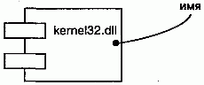
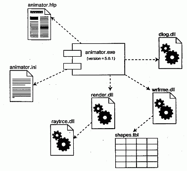
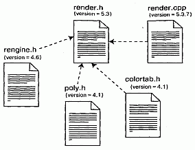

http://bourabai.kz/dbt/uml/ch25.htm

ЧАСТЬ VI - Архитектурное моделирование
# Глава 25. Компоненты
* Введение
* Термины и понятия
    * Имена
    * Компоненты и классы
    * Компоненты и интерфейсы
    * Заменяемость двоичного кода
    * Виды компонентов
    * Организация компонентов
    * Стандартные элементы
* Типичные приемы моделирования
    * Исполняемые программы и библиотеки
    * Таблицы, файлы и документы
    * Интерфейс прикладного программирования
    * Исходный код
* Советы

Компоненты существуют в материальном мире, в виде совокупности битов и потому являются важными строительными блоками при моделировании физических аспектов системы. Компонент - это физическая заменяемая часть системы , совместимая с одним набором интерфейсов и обеспечивающая реализацию какого-либо другого.

Компоненты используются для моделирования физических сущностей размещенных в узле: исполняемых модулей, библиотек, таблиц, файлов и документов Обычно компонент представляет собой физическую упаковку логических элементов, таких как классы, интерфейсы и кооперации.

Удачные компоненты определяют ясно очерченные абстракции с хорошо определенными интерфейсами, что позволяет в будущем легко заменить устаревшие компоненты более новыми без потери совместимости.

## Введение
Конечный результат работы строительной компании - здение существующее в реальном мире. Для визуализации, специфицирования и документирования принимаемых по ходу строительства решений предназначены логические модели. Заранее продумывается расположение стен, дверей и окон, схемы электропроводки и водопровода, общий архитектурный стиль. В ходе строительства эти воображаемые стены, двери, окна и другие элементы конструкции материализуются в реальные объекты.

И логический, и физический вид системы в равной мере необходимы для разработчика. При постройке времянки(например конуры - см. главу 1), расходы на переделку которой невелики, вы, скорее всего, сразу приступите к строительству, обойдясь без логического моделирования. С другой стороны, если возводится сооружение, рассчитанное на длительный срок эксплуатации, причем стоимость изменений или неудачного завершения проекта достаточно высока, создание как логической, так и физической модели окупится сторицей и позволит избежать неоправданного риска.

Точно так же обстоит дело при создании программных систем. Логическое моделирование выполняется с целью визуализации, специфицирования и документирования решений по поводу словаря предметной области и взаимодействия различных сущностей (со структурной и поведенческой точек зрения). Физическое моделирование служит для построения исполняемой системы. В то время как логические сущности присутствуют лишь в концептуальном мире, физические существуют в мире битов, то есть в конечном счете размещаются в физических узлах и могут либо исполняться непосредственно, либо косвенно участвовать в работе системы.

В UML все физические сущности моделируются в виде компонентов. Компонент (Component) - это физическая сущность, реализующая некоторый набор интерфейсов (см. главу H). Таким образом, интерфейсы образуют мост между логическими и физическими моделями. Например, в логической модели можно специфицировать интерфейс некоторого класса, который затем будет реализован каким-либо компонентом в физической модели.

Многие операционные системы и языки программирования непосредственно поддерживают понятие компонента. Объектные библиотеки, исполняемые программы, компоненты СОМ+, Enterprise JavaBeans - все это примеры сущностей, которые могут быть непосредственно представлены компонентами в смысле UML. Компоненты могут использоваться не только для моделирования такого рода сущностей, но и для представления иных элементов работающей системы - к примеру, таблиц, файлов и документов.

Графически компонент в UML изображается так, как показано на рис. 25.1. Это каноническое обозначение позволяет визуализировать компонент без привязки к конкретной операционной системе или языку программирования. С помощью стереотипов (см. главу 6) - одного из механизмов расширения UML - вы можете приспособить эту нотацию для представления конкретных видов компонентов.

#### Рис. 25.1 Компоненты

## Термины и понятия
Компонент (Component) - это физическая заменяемая часть системы, совместимая с одним набором интерфейсов и обеспечивающая реализацию какого-либо другого. Компонент изображается в виде прямоугольника с вкладками.

### Имена
У каждого компонента должно быть имя, отличающее его от других компонентов. Имя - это текстовая строка; взятое само по себе, оно называется простым. К составному имени спереди добавлено имя пакета, в котором находится компонент. Имя компонента должно быть уникальным внутри объемлющего пакета (см. главу 12). Обычно при изображении компонента указывают только его имя, как видно из рис. 25.2. Тем не менее, как и в случае с классами, вы можете снабжать компоненты помеченными значениями или дополнительными разделами (см. главу 6), чтобы показать детали.

#### Рис. 25.2 Простое и расширенное изображение компонентов

> Примечание: Имя компонента может состоять из любого числа букв, цифр и некоторых знаков препинания (за исключением таких, как двоеточия, которые применяются для отделения имени компонента от имени объемлющего пакета). Имя может занимать несколько строк. Как правило, для именования компонентов используют одно или несколько коротких существительных, взятых из словаря реализации, и в зависимости от выбранной операционной системы добавляют расширения имен файлов (например, java или dll).

### Компоненты и классы
Во многих отношениях компоненты подобны классам (см. главы 4 и 9). Те и другие наделены именами, могут реализовывать набор интерфейсов, вступать в отношения зависимости, обобщения и ассоциации, быть вложенными, иметь экземпляры и принимать участие во взаимодействиях (см. главу 15). Однако между компонентами и классами есть существенные различия:

* классы представляют собой логические абстракции, а компоненты - физические сущности. Таким образом, компоненты могут размещаться в узлах, а классы - нет;
* компоненты представляют собой физическую упаковку логических сущностей и, следовательно, находятся на другом уровне абстракции;
* классы могут обладать атрибутами и операциями. Компоненты обладают только операциями, доступными через их интерфейсы.

Первое отличие самое важное. При моделировании системы решение о том, что использовать - класс или компонент, - очевидно: если моделируемая сущность непосредственно размещается в узле (см. главу 26), то это компонент, в противном случае - класс.

Второе различие предполагает существование некоторого отношения между классами и компонентами, а именно: компонент - это физическая реализация множества логических элементов, таких как классы и кооперации (см. главу 27). Как показано на рис. 25.3, отношение между компонентом и классом, который он реализует, может быть явно изображено с помощью отношения зависимости (см. главы 5 и 10). Как правило, вам не придется визуализировать такие отношения; лучше хранить их как часть спецификации компонента.

#### Рис. 25.3 Компоненты и классы

Третье различие подчеркивает, что интерфейсы (см. главу 11) являются мостом между компонентами и классами. В следующем разделе более подробно объясняется, что, хотя и компоненты, и классы могут реализовывать интерфейсы, в отличие от класса услуги компонента обычно доступны только через его интерфейсы.

> Примечание: Компоненты похожи на классы еще и потому, что в принципе для них можно задать атрибуты и операции, хотя необходимость в этом возникает редко - разве что при моделировании рефлексивных систем, которые могут манипулировать своими компонентами.

### Компоненты и интерфейсы
Интерфейс (см. главу 11) - это набор операций, которые описывают услуги, предоставляемые классом или компонентом. Существенным является отношение между компонентом и интерфейсом. Все популярные компонентные средства операционных систем (такие как СОМ+, CORBAи Enterprise JavaBeans) используют интерфейсы для "склеивания" различных компонентов.

Пользуясь любым из таких средств, можно построить декомпозицию физической реализации путем специфицирования интерфейсов, представляющих основные стыковочные узлы системы. Затем вы можете предоставить компоненты, реализующие интерфейсы, наряду с другими компонентами, которые через эти интерфейсы получают доступ к предоставляемым услугам. Такой механизм позволяет развернуть систему, службы которой в значительной мере независимы от места своего размещения и, как обсуждается в следующем разделе, являются заменяемыми (моделирование распределенной системы рассматривается в главе 23).

Как видно из рис. 25.4, отношения между компонентом и его интерфейсами можно изобразить двумя способами. Первый, наиболее распространенный, состоит в том, что интерфейс рисуется в свернутой (elided) форме. Компонент, реализующий интерфейс, присоединяется к нему с помощью отношения свернутой реализации (см. главу 10). Во втором случае интерфейс рисуется в развернутом виде, возможно с раскрытием операций. Реализующий его компонент присоединяется с помощью отношения полной реализации. В обоих случаях компонент, получающий доступ к услугам других компонентов через этот интерфейс, подключается к нему с помощью отношения зависимости.

#### Рис. 25.4 Компоненты и интерфейсы

Интерфейс, реализуемый компонентом, называется экспортируемым интерфейсом (Export interface). Это означает, что компонент через данный интерфейс предоставляет ряд услуг другим компонентам. Компонент может экспортировать много интерфейсов. Интерфейс, которым компонент пользуется, называется импортируемым (Import interface). Это означает, что компонент совместим с таким интерфейсом и зависит от него при выполнении своих функций. Компонент может импортировать различные интерфейсы, причем ему разрешается одновременно экспортировать и импортировать интерфейсы.

Конкретный интерфейс может экспортироваться одним компонентом и импортироваться другим. Если между двумя компонентами располагается интерфейс, их непосредственная взаимозависимость разрывается. Компонент, использующий данный интерфейс, будет функционировать корректно (притом безразлично, каким именно компонентом реализован интерфейс). Разумеется, компонент можно использовать в некотором контексте только тогда, когда все импортируемые им интерфейсы экспортируются какими-либо другими компонентами.

> Примечание: Интерфейсы пересекают границы между логическими и физическими сущностями. Тот же самый интерфейс, который используется или реализуется компонентом, будет использоваться или реализовываться классами, которые реализует этот компонент.

### Заменяемость двоичного кода
Главная задача каждого компонентно-ориентированного средства в любой операционной системе - обеспечить возможность сборки приложений из заменяемых двоичных частей. Это означает, что вы можете создать систему из компонентов, а затем развивать ее, добавляя новые компоненты или заменяя старые, - без перекомпиляции. Именно интерфейсы позволяют достичь этого. Специфицируя интерфейс, вы можете вставить в уже работающую систему любой компонент, который совместим с этим интерфейсом или предоставляет его. Систему можно расширять, подставляя компоненты, обеспечивающие новые услуги с помощью дополнительных интерфейсов, а также компоненты, способные распознать и использовать эти новые интерфейсы. Такая семантика объясняет, что стоит за определением компонентов в UML. Компонент - это физическая заменяемая часть системы, которая совместима с одними интерфейсами и реализует другие.

Во-первых, компонент имеет физическую природу. Он существует в реальном мире битов, а не в мире концепций.

Во-вторых, компонент заменяем. Вместо одного компонента можно подставить другой, если он совместим с тем же набором интерфейсов. Обычно механизм добавления или замены компонента с целью формирования исполняемой системы прозрачен для пользователя и обеспечивается либо объектными моделями (такими, как СОМ+ или EnterpriseJavaBeans), которые часто совсем не требуют внешнего вмешательства, либо инструментальными средствами, автоматизирующими этот механизм.

В-третьих, компонент - это часть системы (см. главу 31). Компонент редко выступает в отрыве от остальных: обычно он работает совместно с другими компонентами и, стало быть, встраивается в архитектурный или технологический контекст, для которого предназначен. Компонент является логически и физически способным к сцеплению, то есть представляет собой значимый структурный и/или поведенческий фрагмент некоторой большей системы. Компонент можно повторно использовать в различных системах. Таким образом, компоненты представляют собой фундаментальные строительные блоки, из которых собираются системы. Это определение рекурсивно - система, рассматриваемая на одном уровне абстракции, может быть всего лишь компонентом на более высоком уровне.

В-четвертых, как упоминалось выше, компонент совместим с одним набором интерфейсов и реализует другой набор.

### Виды компонентов
Можно выделить три вида компонентов.

Во-первых, это компоненты развертывания (Deployment components), которые необходимы и достаточны для построения исполняемой системы. К их числу относятся динамически подключаемые библиотеки (DLL) и исполняемые программы (EXE). Определение компонентов в UML достаточно широко, чтобы охватить как классические объектные модели, вроде СОМ+, CORBA и Enterprise JavaBeans, так и альтернативные, возможно содержащие динамические Web-страницы, таблицы базы данных и исполняемые модули, где используются закрытые механизмы коммуникации.

Во-вторых, есть компоненты - рабочие продукты (Work product components). По сути дела, это побочный результат процесса разработки. Сюда можно отнести файлы с исходными текстами программ и данными, из которых создаются компоненты развертывания. Такие компоненты не принимают непосредственного участия в работе исполняемой системы, но являются рабочими продуктами, из которых исполняемая система создается.

В-третьих, есть компоненты исполнения (Execution components). Они создаются как следствие работы системы. Примером может служить объект СОМ+, экземпляр которого создается из DLL.

### Организация компонентов
Вы можете организовывать компоненты, группируя их в пакеты (см. главу 12), так же, как это делается для классов.

При организации компонентов между ними можно специфицировать отношения (см. главы 5 и 10) зависимости, обобщения, ассоциации (включая агрегирование) и реализации.

### Стандартные элементы
Все механизмы расширения UML (см. главу 6) применимы и к компонентам. Чаще всего используются помеченные значения для расширения свойств компонентов (например, для задания версии компонента) и стереотипы для задания новых видов компонентов (например, зависимых от операционной системы).

В UML определены пять стандартных стереотипов (см. "Приложение В"), применимых к компонентам:

* executable (исполнимый) - определяет компонент, который может исполняться в узле;
* library (библиотека) - определяет статическую или динамическую объектную библиотеку;
* table (таблица) - определяет компонент, представляющий таблицу базы данных;
* file (файл) - определяет компонент, представляющий документ, который содержит исходный текст или данные;
* document (документ) - определяет компонент, представляющий документ.

> Примечание: UML не определяет пиктограмм для этих стереотипов, хотя в "Приложении В" предлагается некоторая общепринятая нотация.

## Типичные приемы моделирования

Исполняемые программы и библиотеки
Чаще всего компоненты UML используются для моделирования компонентов развертывания, составляющих реализацию системы. При развертывании тривиальной системы, состоящей ровно из одного исполняемого файла, моделировать компоненты необязательно. Если же система состоит из нескольких компонентов и ассоциированных с ними объектных библиотек, то моделирование компонентов поможет при визуализации, специфицировании, конструировании и документировании решений, принятых относительно физической системы. Моделирование компонентов приобретает еще большее значение, если вы предполагаете заниматься контролем версий и управлением конфигурацией различных частей системы по мере ее развития.

В большинстве случаев компоненты развертывания определяются решениями, принятыми относительно сегментирования физической реализации системы. На эти решения оказывает влияние ряд технических факторов (например, выбор компонентных средств, имеющихся в операционной системе), вопросы управления конфигурацией (скажем, какие части системы могут изменяться с течением времени) и повторного использования (какие компоненты можно будет использовать в других системах или, наоборот, позаимствовать из них). Имеет значение также топология используемой системы (см. главу 26).

Моделирование исполняемых программ и библиотек осуществляется следующим образом:

1. Решите, на какие части будет разбита физическая система. Принимайте во внимание технические факторы, а также соображения относительно управ ления конфигурацией и повторного использования.
2. Смоделируйте исполняемые программы и библиотеки как компоненты, пользуясь подходящими стандартными элементами. Если для вашей реа лизации требуются новые виды компонентов, введите соответствующие новые стереотипы.
3. Если для вас важно управлять стыковочными узлами системы, смоделируй те важнейшие интерфейсы, которые одни компоненты должны реализовы вать, а другие - использовать.
4. В той мере, в какой это необходимо для изложения ваших намерений, смо делируйте отношения между исполняемыми программами, библиотеками и интерфейсами. Чаще всего вам будет нужно моделировать зависимости между этими частями системы, чтобы визуализировать влияние возмож ных изменений.

Например, на рис. 25.5 показан набор компонентов, входящий в состав инструментальной программы, работающей на одном персональном компьютере. Мы видим одну исполняемую программу (animator. exe с помеченным значением, обозначающим номер версии) и четыре библиотеки (dlog.dll, wrfrme.dll, render.dll и raytrce.dll). Для изображения компонентов использованы стандартные элементы (см. "Приложение В") для исполняемых программ и библиотек. На диаграмме представлены также зависимости между компонентами.

#### Рис. 25.5 Моделирование исполняемых программ и библиотек

> Примечание: Непосредственный показ зависимости между двумя компонентами - это на самом деле свернутая форма представления реальных отношений между ними. Компонент редко зависит от другого компонента напрямую; чаще он импортирует один или несколько интерфейсов, экспортируемых вторым компонентом. Можно было бы, к примеру, изменить представленную на рис. 25.5 диаграмму, явно указав интерфейсы, которые реализует (экспортирует) render.dll и использует (импортирует) animator.exe. Но для простоты эти детали можно скрыть, показав лишь, что существует зависимость между компонентами.

По мере разрастания модели вы обнаружите, что многие компоненты объединяются в концептуально и семантически связанные группы. В UML для моделирования таких групп можно использовать пакеты (см. главу 12).

Для больших систем, которые устанавливаются на несколько компьютеров, вам, вероятно, придется моделировать способ распределения компонентов, назначая каждому из них узел, на котором он будет находиться (моделирование развертывания системы обсуждается в главе 26).

### Таблицы, файлы и документы
Моделирование исполняемых программ и библиотек, составляющих физическую реализацию системы, весьма полезно. Однако зачастую оказывается, что существует масса вспомогательных компонентов развертывания, которые нельзя отнести к этим категориям, но которые тем не менее критичны для физического развертывания системы. Например, реализация может включать файлы данных, файлы оперативной подсказки, скрипты на каком-либо интерпретируемом языке, файлы журналов, инициализационные файлы и протоколы установки или удаления системы. Моделирование этих компонентов - важная составная часть управления конфигурацией системы. К счастью, в UML существуют средства для моделирования всех этих артефактов.

Моделирование таблиц, файлов и документов осуществляется так:

1. Выявите те вспомогательные элементы, которые являются частью физичес кой реализации системы.
2. Смоделируйте их в виде компонентов. Если в вашей реализации появляют ся новые виды артефактов, введите подходящий новый стереотип.
3. В той мере, в какой это необходимо для изложения ваших намерений, смо делируйте отношения между вспомогательными компонентами и исполняе мыми программами, библиотеками и интерфейсами в системе. Чаще всего вам понадобится моделировать зависимости между этими частями, чтобы визуализировать то, как скажутся изменения компонентов.

Так, на рис. 25.6, расширяющем предыдущий, показаны таблицы, файлы и документы, которые являются частью развернутой системы, построенной вокруг программы animator.exe. Мы видим один документ (animator .hip), один простой файл (animator.ini) и одну таблицу базы данных (shapes.tbl). Для их изображения используются соответствующие стандартные элементы UML.

#### Рис. 25.6 . Моделирование таблиц, файлов и документов

Моделирование баз данных (см. главы 8 и 29) может усложниться, если приходится иметь дело с несколькими таблицами, триггерами и хранимыми процедурами. Для визуализации, специфицирования, конструирования и документирования этих особенностей нужно будет моделировать как логическую схему, так и физические базы данных.

### Интерфейс прикладного программирования
Если вы - разработчик, собирающий систему из компонентов, то вам часто нужно знать интерфейсы прикладного программирования (API - Application Programming Interface), которыми можно пользоваться для "склейки" разных частей. API - это способы стыковки различных программ в системе, моделируемые с помощью интерфейсов и компонентов.

API - это, по сути дела, интерфейс, реализуемый одним или несколькими компонентами. Разработчику интересен только сам интерфейс, а не то, каким именно компонентом он реализован, - конечно, при условии, что какой-то компонент его все-таки реализует. Но с точки зрения управления конфигурацией системы особенности реализации важны, поскольку, когда вы публикуете API, необходимо быть уверенным в том, что присутствует хоть какая-то реализация этого API. UML позволяет вам моделировать обе точки зрения.

Операций, ассоциированных с любым семантически богатым API, существует довольно много, и нет необходимости визуализировать их все сразу. Вместо этого следует оставить операции на заднем плане модели и пользоваться интерфейсами как дескрипторами, с помощью которых эти операции можно отыскать. При желании построить исполняемую систему, использующую данный API, вам потребуется добавить ряд деталей, чтобы имеющиеся в вашем распоряжении средства разработки могли успешно откомпилировать код. Помимо сигнатур всех операций, вы, наверное, захотите привести примеры, поясняющие, как следует использовать каждый интерфейс.

Моделирование API производится так:

1. Идентифицируйте стыковочные узлы в своей системе и промоделируйте каждый из них в виде интерфейса, собрав вместе соответствующие атрибу ты и операции.
2. Раскрывайте только те свойства интерфейса, которые важно визуализиро вать в данном контексте. Остальные свойства спрячьте, поместив их в спе цификацию интерфейса для справки.
3. Реализацию каждого API моделируйте только в той мере, насколько это важно для понимания конфигурации конкретной физической реализации системы.

На рис. 25.7 раскрыты API исполняемой программы, фигурирующей на двух предыдущих рисунках. Вы видите четыре интерфейса: IApplication, IModels, IRendering и IScripts.

#### Рис. 25.7 Моделирование API

### Исходный код
Чаще всего компоненты используются для моделирования физических частей, составляющих реализацию. Сюда же относится моделирование вспомогательных элементов развернутой системы: таблиц, файлов, документов и API. Другое назначение компонентов - моделирование конфигурации всех файлов, содержащих исходный код, из которых с помощью средств разработки были созданы исполняемые части. Это компоненты, являющиеся рабочими продуктами процесса разработки.

Графическое моделирование исходного кода особенно полезно для визуализации зависимостей между различными файлами при компиляции, а также для управления разбиением файлов на относительно независимые группы и последующим их объединением в ходе ветвления процесса разработки. Таким образом, компоненты UML можно использовать в качестве графического интерфейса к средствам контроля версий и управления конфигурацией.

Для большинства систем состав файлов с исходным кодом диктуется требуемыми средой разработки решениями, которые вы приняли относительно структурирования файлов. В этих файлах хранятся детали реализации классов, интерфейсов, коопераций и других логических элементов, которые впоследствии преобразуются в физические двоичные компоненты с помощью средств разработки. Как правило, средства разработки определяют способ организации исходного кода (например, для каждого класса обычно используется один или два файла), но необходимость в визуализации отношений между файлами все равно остается. Методы группировки файлов в пакеты и методы управления версиями диктуются решениями о стратегии внесения изменений в систему.

Моделирование исходного кода осуществляется следующим образом:

1. В зависимости от того, какие ограничения накладывают средства разработ ки, смоделируйте файлы, в которых будут храниться все логические элемен ты, а также зависимости между ними при компиляции.
2. Если нужно привязать модели к средствам контроля версий и управления конфигурацией, включите для каждого управляемого файла помеченные зна чения, такие как номер версии, имя автора и информацию о выборке и воз врате файла в депозитарий.
3. По мере возможности оставляйте управление отношениями между файлами инструментам разработки, используя UML только для визуализации и доку ментирования отношений.

Например, на рис. 25.8 показаны некоторые исходные файлы, из которых строится библиотека render.dll. Вы видите четыре заголовочных файла (render.h, rengine.h, poly.h и colortab.h), представляющих спецификации некоторых классов, а также файл render. cpp, представляющий собой реализацию одного из этих классов.

#### Рис. 25.8 Моделирование исходного кода

По мере увеличения размера модели вы обнаружите, что многие файлы с исходными текстами объединяются в концептуально и семантически связанные группы. Скорее всего, система разработки поместит эти группы файлов в отдельные каталоги. В UML для моделирования таких групп можно использовать пакеты (см. главу 12).

UML позволяет визуализировать отношение между классом и соответствующим исходным файлом, а также отношение между исходным файлом и исполняемой программой или библиотекой. Для этого используются отношения трассировки (см. главы 5 и 10). Однако такие детали требуется прорабатывать сравнительно редко.

## Советы
Моделируя компоненты в UML, помните, что вы моделируете физические аспекты системы. Хорошо структурированный компонент обладает следующими свойствами:

* предоставляет четкую абстракцию некоторой сущности, которая является частью физического аспекта системы;
* предоставляет реализацию небольшого, хорошо определенного набора интерфейсов;
* включает набор классов, которые, действуя совместно, реализуют семантику интерфейсов изящно и экономно;
* слабо связан с другими компонентами; как правило, компоненты моделируются только совместно с отношениями зависимости и реализации.

Изображая компонент в UML, руководствуйтесь следующими правилами:

* применяйте свернутую форму интерфейса, если только не возникает острой необходимости раскрыть операции, предлагаемые этим интерфейсом;
* показывайте только те интерфейсы, которые необходимы для понимания назначения компонента в данном контексте;
* в тех случаях, когда вы используете компоненты для моделирования библиотек и исходного кода, указывайте помеченные значения, относящиеся к контролю версий.

