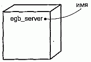
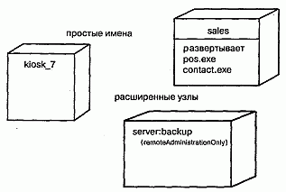
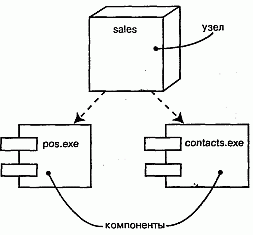
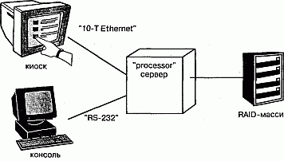
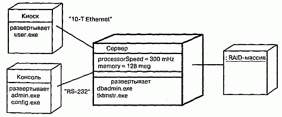

http://bourabai.kz/dbt/uml/ch26.htm

ЧАСТЬ VI - Архитектурное моделирование
# Глава 26. Развертывание
* Введение
* Термины и понятия
    * Имена
    * Узлы и компоненты
    * Организация узлов
    * Соединения
* Типичные приемы моделирования
    * Процессоры и устройства
    * Распределение компонентов
* Советы

Узел, равно как и компонент, существует в материальном мире и является важным строительным блоком при моделировании физических аспектов системы. Узел - это физический элемент, который существует во время выполнения и представляет вычислительный ресурс, обычно обладающий как минимум некоторым объемом памяти, а зачастую также и процессором.

Узлы используются для моделирования топологии аппаратных средств, на которых исполняется система. Как правило, узел - это процессор или устройство, на котором могут быть развернуты компоненты.

Хорошо спроектированные узлы точно соответствуют словарю аппаратного обеспечения области решения.

## Введение
Компоненты, которые вы разрабатываете или повторно используете в программной системе, должны быть развернуты на какой-то аппаратуре, иначе они не смогут выполняться. Собственно, программная система и состоит из этих двух частей: программного и аппаратного обеспечения (о моделировании непрограммных сущностей см. главу 4).

При проектировании архитектуры программной системы приходится рассматривать как логические, так и физические ее аспекты (пять видов системной архитектуры описаны в главе 2). К логическим элементам относятся такие сущности, как классы, интерфейсы, кооперации, взаимодействия и автоматы, а к физическим - компоненты (представляющие физическую упаковку логических сущностей) и узлы (представляющие аппаратуру, на которой развертываются и исполняются компоненты).

Графическое изображение узла в UML показано на рис. 26.1. Это каноническое обозначение позволяет визуализировать узел, не конкретизируя стоящей за ним аппаратуры. С помощью стереотипов (см. главу 6) - одного из механизмов расширения UML - можно адаптировать эту нотацию для представления конкретных процессоров и устройств.

#### Рис. 26.1 Узлы

> Примечание: UML предназначен главным образом для моделирования программных систем, хотя в сочетании с языками моделирования аппаратных средств типа VHDL он может оказаться весьма полезным и при моделировании аппаратных систем. UML обладает также достаточной выразительной мощностью для моделирования топологии автономных (Stand-alone), встроенных (Embedded), клиент-серверных (Client-server) и распределенных (Distributed) систем.

## Термины и понятия
Узел (Node) - это физический элемент, который существует во время выполнения и представляет вычислительный ресурс, обычно обладающий как минимум некоторым объемом памяти, а зачастую также и процессором. Графически узел изображается в виде куба.

### Имена
Каждый узел должен иметь имя, отличающее его от прочих узлов. Имя - это текстовая строка. Взятое само по себе, оно называется простым именем. Составное имя - это имя узла, к которому спереди добавлено имя пакета, в котором он находится. Имя узла должно быть уникальным внутри объемлющего пакета (см. главу 12). Обычно при изображении узла указывают только его имя, как видно из рис. 26.2. Но, как и в случае с классами, вы можете снабжать узлы помеченными значениями или дополнительными разделами, чтобы показать детали.

#### Рис. 26.2 Простое и расширенное изображение узлов

> Примечание: Имя узла может состоять из любого числа букв, цифр и некоторых знаков препинания (за исключением таких, как двоеточия, которые применяются для отделения имени узла от имени объемлющего пакета). Имя может занимать несколько строк. На практике для именования узлов используют одно или несколько коротких существительных, взятых из словаря реализации.

### Узлы и компоненты
Во многих отношениях узлы подобны компонентам (см. главу 25). Те и другие наделены именами, могут быть участниками отношений зависимости, обобщения и ассоциации, бывают вложенными, могут иметь экземпляры и принимать участие во взаимодействиях. Однако между ними есть и существенные различия:

компоненты принимают участие в исполнении системы; узлы - это сущности, которые исполняют компоненты;
компоненты представляют физическую упаковку логических элементов; узлы представляют средства физического развертывания компонентов.
Первое из этих отличий самое важное. Здесь все просто - узлы исполняют компоненты, компоненты исполняются в узлах.

Второе различие предполагает наличие некоего отношения между классами, компонентами и узлами. В самом деле, компонент - это материализация множества других логических элементов, таких как классы и кооперации, а узел - место, на котором развернут компонент. Класс может быть реализован одним или несколькими компонентами, а компонент, в свою очередь, развернут в одном или нескольких узлах. Как показано на рис. 26.3, отношение между узлом и компонентом, который на нем развернут, может быть явно изображено с помощью отношения зависимости (см. главы 5 и 10). Как правило, вам не придется визуализировать такие отношения. Лучше хранить их как часть спецификации узла.

#### Рис. 26.3 Узлы и компоненты

Множество объектов или компонентов, приписанных к узлу как группа, называется элементом распределения (Distribution unit).

> Примечание: Умы подобны классам в том отношении, что для них можно задать атрибуты и операции. Например, можно указать, что у узла есть атрибуты скоростьПроцессора и память, а также операции включить, выключить, приостановить.

### Организация узлов
Узлы можно организовывать, группируя их в пакеты (см. главу 12), точно так же, как это делается с классами и компонентами.

Можно организовывать узлы, специфицируя отношения (см. главы 5 и 10) зависимости, обобщения и ассоциации (включая агрегирование), существующие между ними.

### Соединения
Самый распространенный вид отношения между узлами - это ассоциация. В данном контексте ассоциация представляет физическое соединение узлов, например линию Ethernet, последовательный канал или разделяемую шину (см. рис. 26.4). Ассоциации можно использовать даже для моделирования непрямых соединений типа спутниковой линии связи между двумя удаленными процессорами.

#### Рис. 26.4 Соединения

Поскольку узлы аналогичны классам, в нашем распоряжении находится весь аппарат ассоциаций. Иными словами, можно использовать роли, кратности и ограничения. Как показано на рис. 26.4, следует применять стереотипы, если необходимо моделировать разные виды соединений - к примеру, чтобы отличить соединение 10-Т Ethernet от соединения по последовательному каналу RS-232.

## Типичные приемы моделирования

### Процессоры и устройства
Моделирование процессоров и устройств, образующих топологию автономной, встроенной, клиент-серверной или распределенной системы, - вот самый распространенный пример использования узлов.

Поскольку все механизмы расширения UML (см. главу 6) применимы и к узлам, то для описания новых видов узлов, представляющих конкретные процессоры и устройства, часто используются стереотипы. Процессор (Processor) - это узел, способный обрабатывать данные, то есть исполнять компонент. Устройство (Device) - это узел, не способный обрабатывать данные (по крайней мере, на выбранном уровне абстракции) и в общем случае используемый для представления чего-либо связанного с реальным миром.

Моделирование процессоров и устройств осуществляется так:

1. Идентифицируйте вычислительные элементы представления системы с точ ки зрения развертывания и смоделируйте каждый из них как узел.
2. Если эти элементы представляют процессоры и устройства общего вида, то припишите им соответствующие стандартные стереотипы. Если же это процессоры и устройства, входящие в словарь предметной области, то сопоставьте им подходящие стереотипы, пометив каждый пиктограммой. 3. Как и в случае моделирования классов, рассмотрите атрибуты и операции, применимые к каждому узлу.

Например, на рис. 26.5 изображена предыдущая диаграмма, на которой каждому узлу приписан стереотип. Сервер - это узел со стереотипом процессора общего вида; киоск и консоль - узлы со стереотипами специализированных процессоров, а RAID-массив - узел со стереотипом специализированного устройства.

#### Рис. 26.5 Процессоры и устройства

> Примечание: Узлы - это те строительные блоки UML, которым стереотипы приписываются чаще всего. Когда в ходе проектирования программной системы вы моделируете ее с точки зрения развертывания, очень важно предоставлять потенциальным читателям визуальные указания. Моделируя процессор, являющийся компьютером общего назначения, присвойте ему пиктограмму компьютера. Моделируя какое-либо устройство, например сотовый телефон, факс, модем или видеокамеру, представьте и его подходящей пиктограммой.

### Распределение компонентов
При моделировании топологии системы часто бывает полезно визуализировать или специфицировать физическое распределение ее компонентов по процессорам и устройствам, входящим в состав системы. (Семантика местоположения рассматривается в главе 23.)

Моделирование распределения компонентов состоит из следующих шагов:

1. Припишите каждый значимый компонент системы к определенному узлу.
2. Рассмотрите возможности дублирования размещения компонентов. Доволь но распространен случай, когда одни и те же компоненты (например, неко торые исполняемые программы и библиотеки) размещаются одновременно в нескольких узлах.
3. Изобразите распределение компонентов по узлам одним из трех способов:

* не делайте размещение видимым, но оставьте его на заднем плане модели, то есть в спецификации узла;
* соедините каждый узел с компонентами, которые на нем развернуты, от ношением зависимости;
* перечислите компоненты, развернутые на узле, в дополнительном разделе.

Для иллюстрации третьего способа на рис. 26.6, основанном на предыдущих диаграммах, специфицированы исполняемые компоненты, размещенные в каждом узле. Эта диаграмма несколько отличается от предыдущих - она является диаграммой объектов (см. главу 14), на которой визуализированы конкретные экземпляры (см. главу 11) каждого узла. В данном случае экземпляры RAID-массив и Киоск анонимны, а у остальных двух экземпляров есть имена (с для Консоли и s для Сервера). Для каждого процессора на рисунке отведен дополнительный раздел, показывающий, какие компоненты на нем развернуты. Объект Сервер также изображен со своими атрибутами (processorSpeed - скоростьПроцессора и memory -память), причем их значения видимы.

#### Рис. 26.6 Моделирование распределения компонентов

Компоненты не обязательно должны быть статически распределены по узлам системы. В UML можно моделировать динамическую миграцию компонентов из одного узла в другой (см. главу 30), как бывает в системах, включающих агенты, или в системах повышенной надежности, в состав которых входят кластерные серверы и реплицируемые базы данных

## Советы
Хорошо структурированный узел обладает следующими свойствами:

* представляет четкую абстракцию некоей сущности из словаря аппаратных средств области решения;
* декомпозирован только до уровня, необходимого для того, чтобы донести ваши идеи до читателя;
* раскрывает только те атрибуты и операции, которые относятся к моделируемой области;
* явно показывает, какие компоненты на нем развернуты;
* связан с другими узлами способом, отражающим топологию реальной системы.

Изображая узел в UML, руководствуйтесь следующими принципами:

* определите для своего проекта или организации в целом набор стереотипов с подходящими пиктограммами, которые несут очевидную для читателя смысловую нагрузку;
* показывайте только те атрибуты и операции (если таковые существуют), которые необходимы для понимания назначения узла в данном контексте.

