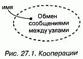

http://bourabai.kz/dbt/uml/ch27.htm

ЧАСТЬ VI - Архитектурное моделирование
# Глава 27. Кооперации
* Введение
* Термины и понятия
* Имена
* Структуры
* Поведение
* Организация коопераций
* Типичные приемы моделирования
* Реализация прецедента
* Реализация операции
* Механизм
* Советы

В контексте архитектуры системы кооперация позволяет присвоить имя некоторому концептуальному фрагменту, охватывающему как статические, так и динамические аспекты. Кооперация (Collaboration) именует сообщество классов, интерфейсов и других элементов, которые работают совместно для обеспечения кооперативного поведения, более значимого, чем сумма его слагаемых.

Кооперации используются для описания реализации прецедентов и операций и для моделирования архитектурно-значимых механизмов системы.

## Введение
Представьте себе самое красивое из когда-либо виденных вами зданий - быть может, Тадж-Махал или Нотр-Дам. Достоинства той и другой конструкции не поддаются описанию. Хотя во многих отношениях оба строения архитектурно просты, но идеи, заложенные в них, исключительно глубоки. Во-первых, вы сразу распознаете определенную симметрию. Приглядитесь внимательнее, и вы заметите детали, которые красивы сами по себе, но в совокупности привносят изящество и функциональность в большей степени, чем по отдельности.

А теперь вспомните о самых безобразных из виденных вами зданий - скажем, о забегаловке на углу вашей улицы. Вы увидите зрительную какофонию архитектурных стилей - тут кусочек модернизма, там островерхая крыша, украшения не гармонируют ни с тем, ни с другим, кричащие цвета оскорбляют взгляд. Обычно такие здания - "шедевры" обычных ремесленников, выполняющие сугубо прагматические функции, без претензий на стиль.

Что же отличает эти два вида гражданской архитектуры? Во-первых, в величественных зданиях мы видим изящество дизайна, которого явно не достает забегаловкам. В настоящей архитектуре (см. главу 2) используется не так уж много стилей, которые удачно сочетаются друг с другом. Например, в конструкции Тадж-Махала повсеместно применяются сложные, симметричные и сбалансированные геометрические элементы. Во-вторых, в тех зданиях, которые спроектированы со вкусом, мы обнаруживаем общие структуры, которым подчинены все отдельные элементы конструкции. Так, в Нотр-Даме некоторые стены являются несущими и служат опорой куполу собора. А часть из них, вместе с другими архитектурными деталями, используется для отвода воды и нечистот.

Так же обстоит дело и с программным обеспечением. Хорошая программная система не только выполняет возложенные на нее функции, но и демонстрирует гармоничный и сбалансированный проект, благодаря которому она легко поддается модификации. Эта гармоничность и сбалансированность чаще всего объясняются тем, что хорошо структурированные объектно-ориентированные системы содержат множество повторяющихся структурных элементов-образцов (паттернов). Взгляните на любую качественную объектно-ориентированную систему, и вы обнаружите элементы, которые взаимодействуют друг с другом, демонстрируя кооперативное поведение, более значимое, нежели сумма его составляющих. Многие элементы хорошо структурированных систем в разных комбинациях принимают участие в функционировании различных механизмов.

> Примечание: Образец, или паттерн (Pattern), описывает общее решение некоей общей проблемы в определенном контексте. В хорошо структурированной системе всегда есть целый спектр паттернов, включая идиомы (часто встречающиеся программные конструкции), механизмы (паттерны проектирования, представляющие концептуально законченные фрагменты системной архитектуры) и каркасы (архитектурные паттерны, представляющие расширяемые шаблоны приложений в определенной области). Паттерны и каркасы рассматриваются в главе 28.

В UML механизмы моделируются с помощью коопераций. Кооперация именует совокупность концептуальных строительных блоков вашей системы, включая как структурные, так и поведенческие элементы (структурное моделирование описывается в частях 2 и 3 данной книги, а поведенческое - в частях 4 и 5). Например, можно рассмотреть распределенную систему управления информацией, база данных которой размещается на нескольких узлах. С точки зрения пользователя обновление представляется атомарной операцией. Если же взглянуть на нее изнутри, все окажется не так просто, поскольку в обновлении участвует несколько машин. Для создания иллюзии простоты необходимо ввести механизм транзакций (Transactions), c помощью которого клиент сможет присвоить имя некоей операции, которая представляется единой атомарной операцией, несмотря на то что затрагивает несколько баз данных. В работе такого механизма могли бы принимать участие несколько кооперирующихся классов, совместно обеспечивающих семантику транзакции. Многие из них будут вовлечены и в другие механизмы, например обеспечения устойчивого хранения информации. Такой набор классов (структурная составляющая), взятый вместе с взаимодействиями (см. главу 15) между ними (поведенческая составляющая), и образует механизм, который в UML представляется кооперацией.

Кооперации не только именуют системные механизмы, но и служат для реализации прецедентов (см. главу 16) и операций (см. главы 4 и 9).

Кооперация в UML изображается, как показано на рис. 27.1. Эта нотация позволяет визуализировать структурные и поведенческие строительные блоки системы, особенно в ситуациях, когда они перекрываются с классами, интерфейсами и другими элементами.

#### Рис 27-1

> Примечание: Эта нотация позволяет визуализировать кооперацию как единый фрагмент по отношению к внешним элементам. Но более интересно то, что находится внутри кооперации. Раскройте ее, и вы увидите другие диаграммы, из которых наиболее важны диаграммы классов (структурная составляющая кооперации, см. главу 8) и диаграммы взаимодействий (ее поведенческая составляющая, см. главу 18).

## Термины и понятия
Кооперация (Collaboration) - это сообщество классов, интерфейсов и других элементов, которые работают совместно для обеспечения кооперативного поведения, более значимого, чем сумма его составляющих. Кооперация также специфицирует то, как некий элемент, допустим классификатор (класс, интерфейс, компонент, узел или прецедент) либо операция, реализуется с помощью классификаторов и ассоциаций, каждая из которых играет свою роль. Изображается кооперация в виде эллипса с пунктирной границей. (Эта нотация отнюдь не случайно подобна нотации прецедента - см. главу 16.)

### Имена
Каждая кооперация должна иметь имя, отличающее ее от других коопераций. Имя - это текстовая строка. Взятое само по себе, оно называется простым. К составному имени кооперации спереди добавлено имя пакета, в котором она находится. Внутри объемлющего пакета имя должно быть уникальным (см. главу 12). Обычно при изображении кооперации указывают только ее имя, как показано на рис. 27.1.

> Примечание: Имя кооперации может состоять из любого числа букв, цифр и некоторых знаков препинания (за исключением таких, как двоеточие, . которое применяется для отделения имени кооперации от имени объемлющего пакета). Имя может занимать несколько строк. На практике для именования коопераций используют одно или несколько коротких существительных, взятых из словаря моделируемой системы. Обычно первая буква имени заглавная, например: Транзакция, ЦепочкаОтветственности.

### Структуры
У коопераций есть два аспекта. Структурная составляющая описывает классы, интерфейсы и другие совместно работающие элементы (см. части 2 и 3 данной книги). Поведенческая составляющая описывает динамику взаимодействия этих элементов.

Структурная составляющая кооперации может включать любую комбинацию классификаторов (см. главу 9), таких как классы, интерфейсы, компоненты и узлы. Внутри кооперации для организации этих классификаторов могут использоваться все обычные отношения (см. главы 5 и 10), имеющиеся в UML, в том числе ассоциации, обобщения и зависимости. На самом деле для описания структурных элементов кооперации можно применять весь спектр средств структурного моделирования, которыми располагает UML.

Однако, в отличие от пакетов (см. главу 12) или подсистем (см. главу 31), кооперация не владеет ни одним из своих структурных элементов. Она лишь ссылается на классы, интерфейсы, компоненты, узлы и другие структурные элементы, объявленные в другом месте, или использует их. Вот почему кооперация именует именно концептуальный - а не физический - фрагмент системной архитектуры. Таким образом, кооперация может пересекать многие уровни системы. Более того, один и тот же элемент может принимать участие в нескольких кооперациях (а некоторые элементы не будут частью ни одной кооперации).

Например, система розничной продажи через Internet описывается примерно десятком прецедентов (см. главу 16): Покупка Товаров, Возврат Товаров, Просмотр Заказа и т.д., и каждый из них реализован отдельной кооперацией. Кроме того, все эти кооперации разделяют одни и те же структурные элементы (такие, как классы Клиент и Заказ), но организованы по-разному. На более глубоких уровнях системы также обнаружатся кооперации, представляющие архитектурно значимые механизмы. Так, в системе розничной торговли вполне может быть кооперация Межузловые сообщения, которая описывает детали защищенной передачи сообщений между узлами.

Если имеется кооперация, именующая концептуальный фрагмент системы, вы можете раскрыть ее, чтобы посмотреть на скрытые внутри структурные детали. Например, на рис. 27.2 показано, что при раскрытии кооперации Межузловые сообщения обнаруживается набор классов, изображенных на диаграмме классов (см. главу 8).

#### Рис 27-2

### Поведение
В то время как структурная составляющая кооперации обычно изображается с помощью диаграммы классов, ее поведенческая составляющая как правило представлена диаграммой взаимодействия (см. главу 18). Эта диаграмма описывает взаимодействие, которое соответствует поведению, состоящему в обмене сообщениями между объектами в некотором контексте для достижения определенной цели. Контекст взаимодействия устанавливает объемлющая кооперация, которая конфигурирует классы, интерфейсы, компоненты, узлы и другие структурные элементы, экземпляры которых (см. главу 13) могут принимать участие во взаимодействии.

Поведенческую составляющую кооперации можно описывать одной или несколькими диаграммами. Если необходимо подчеркнуть упорядочение сообщений во времени, пользуйтесь диаграммой последовательностей. Если же основной акцент нужно сделать на структурных отношениях между объектами, возникающими в ходе совместной деятельности, применяйте диаграммы кооперации. Можно использовать любой вид диаграмм, поскольку в большинстве случаев они семантически эквивалентны.

Это означает, что, моделируя взаимодействия внутри некоторого сообщества классов как кооперацию, вы можете раскрыть ее и ознакомиться с деталями поведения. Так, раскрывая кооперацию Межузловые сообщения, вы могли бы увидеть диаграмму взаимодействия, показанную на рис. 27.3.

#### Рис 27-3

> Примечание: Поведенческие части кооперации должны быть согласованы со структурными. Это значит, что объекты, участвующие в кооперативных взаимодействиях, должны быть экземплярами классов, входящих в структурную часть. Аналогичным образом поименованные во взаимодействии сообщения должны соотноситься с операциями, видимыми в структурной части кооперации. С кооперацией может быть ассоциировано несколько взаимодействий, показывающих разные (но согласованные) аспекты поведения.

Организация коопераций
Кооперации являются сердцем системной архитектуры, поскольку лежащие в основе системы механизмы представляют существенные проектные решения. Все хорошо структурированные объектно-ориентированные системы состоят из регулярно устроенного множества коопераций относительно небольшого размера, поэтому очень важно научиться их организовывать. Существует два вида относящихся к кооперациям отношений, которые следует принимать во внимание.

Во-первых, это отношения между кооперацией и тем, что она реализует. Кооперация может реализовывать либо классификатор, либо операцию (см. главы 4 и 9). Это означает, что кооперация описывает структурную или поведенческую реализацию соответствующего классификатора или операции. Например, прецедент, который именует набор последовательностей действий, выполняемых системой, может быть реализован в виде кооперации. Этот прецедент (см. главу 16) вместе с ассоциированными актерами и соседними прецедентами предоставляет контекст для кооперации. Аналогично кооперацией может быть реализована и операция (которая именует реализацию некоторой системной услуги). В таком случае контекст формирует эта операция вместе со своими параметрами и, возможно, возвращаемым значением. Такое отношение между прецедентом или операцией и реализующей кооперацией моделируется в виде отношения реализации (см. главу 10).

Примечание: Кооперация может реализовывать любой вид классификатора (см. главу 9), включая классы, прецеденты, интерфейсы, компоненты и узлы. Кооперация, которая моделирует системный механизм, может быть и автономной, в таком случае ее контекстом является вся система в целом.
Во-вторых, имеются отношения между самими кооперациями. Кооперации могут уточнять описания других коопераций, что может быть смоделировано в виде отношения уточнения. Отношения уточнения между кооперациями обычно отражают отношения уточнения, существующие между представленными ими прецедентами.

Эти два вида отношений иллюстрируются на рис. 27.4.

#### Рис 27-4

> Примечание: Кооперации, как и любые другие элементы моделей UML, могут группироваться в пакеты (см. главу 12). Обычно к этому приходится прибегать только при моделировании очень больших систем.

## Типичные приемы моделирования

### Реализация прецедента
Одно из назначений коопераций состоит в моделировании прецедентов (см. главу 16). Как правило, при анализе системы вы руководствуетесь тем, как она может использоваться. Переходя же к этапу реализации, вы должны реализовать идентифицированные прецеденты в виде конкретных структур и поведений. В общем случае каждый прецедент должен быть реализован одной или несколькими кооперациями. Если рассматривать систему в целом, то классификаторы, участвующие в кооперации, которая связана с некоторым прецедентом, будут принимать участие и в других кооперациях.

Моделирование реализации прецедента состоит из следующих этапов:

1. Идентифицируйте те структурные элементы, которые необходимы и достаточны для осуществления семантики прецедента.
2. Организуйте эти структурные элементы в диаграмму классов
3. Рассмотрите отдельные сценарии, которые представляют данный прецедент. Каждый сценарий описывает один из путей прохождения прецедента.
4. Отобразите динамику этих сценариев на диаграммах взаимодействия. Воспользуйтесь диаграммами последовательности, если нужно подчеркнуть порядок сообщений, и диаграммами кооперации, если более важны структурные отношения между кооперирующимися объектами. 5. Организуйте эти структурные и поведенческие элементы как кооперацию, которую вы можете соединить с прецедентом через реализацию.

Например, на рис. 27.5 изображены прецеденты, относящиеся к системе контроля кредитных карточек, в том числе основные из них - Разместить заказ и Создать счет, а также два вспомогательных - Распознать подлог и Проверить транзакцию. Хотя в большинстве случаев не возникает необходимости в явном моделировании этого отношения (такую задачу можно оставить инструментальным средствам), на рисунке показана явная модель реализации Разместить заказ с помощью кооперации Управление заказами. В свою очередь эта кооперация может быть разложена на структурный и поведенческий аспекты, что в итоге дает диаграмму классов и диаграмму взаимодействия. Вот так, через отношение реализации, вы и связываете прецедент с его сценариями.

#### Рис 27-5

В большинстве случаев нет необходимости явно моделировать отношение между прецедентом и реализующей его кооперацией. Лучше оставить это на заднем плане модели и позволить инструментальным средствам воспользоваться имеющейся связью для навигации между прецедентом и его реализацией.

### Реализация операции
Еще одна цель, ради которой применяются кооперации, - это моделирование реализации операции (см. главы 4 и 9). Часто реализацию операции можно специфицировать непосредственно в коде. Однако для тех операций, которые требуют совместной работы нескольких объектов, перед написанием кода лучше смоделировать реализацию при помощи кооперации.

> Примечание: Моделировать операцию можно и с помощью диаграмм деятельности (см. главу 19). Диаграммы деятельности - это, по существу, блок-схемы. Поэтому для алгоритмически сложных операций, которые вы хотели бы моделировать явно, диаграммы деятельности -самый подходящий выбор. Но если в операции принимают участие много объектов, то лучше воспользоваться кооперациями, поскольку они позволяют моделировать как структурные, так и поведенческие аспекты операции.

Контекст реализации некоторой операции составляют параметры, возвращаемое значение и объекты, локальные по отношению к ней. Таким образом, эти элементы видимы для кооперации, с помощью которой реализуется операция, точно так же, как актеры видимы для кооперации, реализующей прецедент. Отношения между этими частями можно моделировать с помощью диаграмм классов, которые описывают структурную составляющую кооперации.

Моделирование реализации операции осуществляется так:

1. Идентифицируйте параметры, возвращаемое значение и другие объекты, видимые для операции.
2. Если операция тривиальна, представьте ее реализацию непосредственно в коде, который можно поместить на задний план модели или явно визуализировать в примечании (см. главу 6).
3. Если операция алгоритмически сложна, смоделируйте ее реализацию с помощью диаграммы деятельности.
4. Если операция требует большого объема детального проектирования, представьте ее реализацию в виде кооперации. В дальнейшем вы сможете развернуть структурную и поведенческую составляющие кооперации с помощью диаграмм классов и взаимодействия соответственно.

Так, на рис. 27.6 показан активный класс (см. главу 22) RenderFrame и раскрыты три его операции. Функция progress достаточно проста и может быть реализована сразу в коде, приведенном в примечании.

#### Рис 27-6

Однако операция render намного сложнее, и ее реализация возложена на кооперацию Ray trace (трассировка лучей). Хотя на рисунке этого и нет, вы могли бы раскрыть кооперацию и увидеть ее структурную и поведенческую составляющие.

### Механизм
В хорошо структурированной объектно-ориентированной системе всегда присутствует целый спектр стандартных образцов (паттернов). На одном конце этого спектра вы обнаружите идиомы, представляющие устойчивые конструкции языка реализации, а на другом - архитектурные образцы и каркасы (см. главу 28), образующие систему в целом и задающие определенный стиль. В середине же спектра располагаются механизмы (см. ту же главу), описывающие распространенные образцы проектирования, посредством которых элементы системы взаимодействуют между собой. Механизмы в UML представляются с помощью коопераций.

Механизмы (Mechanisms) - это автономные кооперации; их контекстом является не какой-то один прецедент или операция, но система в целом. Любой элемент, видимый в некоторой части системы, является кандидатом на участие в механизме.

Такого рода механизмы представляют архитектурно значимые проектные решения, и относиться к ним надо серьезно. Обычно механизмы предлагает системный архитектор, и с каждой новой версией они эволюционируют. В конце концов вы обнаруживаете, что система стала простой (поскольку в механизмах материализованы типичные взаимодействия), легко воспринимаемой (так как к пониманию системы можно подойти со стороны ее механизмов) и гибкой (настраивая каждый механизм, вы настраиваете систему в целом).

Моделирование механизмов осуществляется следующим образом:

1. Идентифицируйте основные механизмы, образующие архитектуру системы. Их выбор диктуется общим архитектурным стилем, который вы решили положить в основу своей реализации, а также стилем, наиболее отвечающим предметной области.
2. Представьте каждый механизм в виде кооперации.
3. Раскройте структурную и поведенческую составляющие каждой кооперации. Всюду, где можно, попытайтесь отыскать совместно используемые элементы.
4. Утвердить эти механизмы следует на ранних стадиях жизненного цикла раз работки (они имеют стратегически важное значение), но развивать их нужно в каждой новой версии, по мере более тесного знакомства с деталями реализации.

## Советы
При моделировании коопераций в UML помните, что каждая кооперация должна представлять реализацию прецедента или операции либо служить автономным механизмом на уровне всей системы. Хорошо структурированная кооперация обладает следующими свойствами:

* включает структурную и поведенческую составляющие;
* представляет собой четкую абстракцию некоторого взаимодействия в системе;
* редко является полностью независимой - обычно перекрывается со структурными элементами других коопераций;
* проста и легка для понимания.

Изображая кооперацию в UML, пользуйтесь следующими правилами:

* явно прорисовывайте кооперацию только тогда, когда это необходимо для понимания ее отношений с другими кооперациями, классификаторами, операциями или системой в целом. В остальных случаях используйте кооперации, но оставляйте их на заднем плане модели;
* организуйте кооперации в соответствии с представляемыми ими классификаторами или операциями либо помещайте в пакеты, ассоциированные с системой в целом

