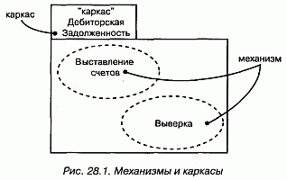
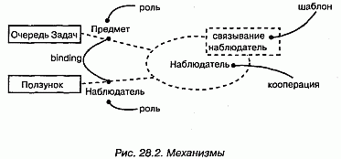
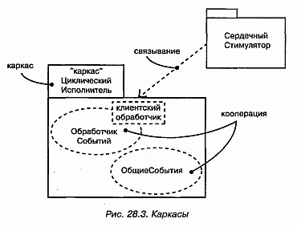
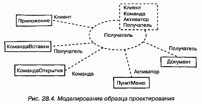
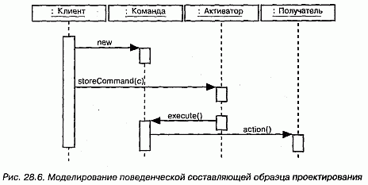
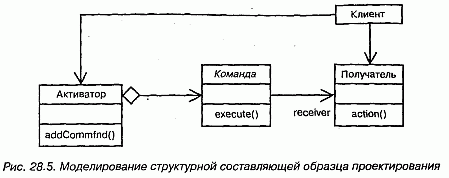
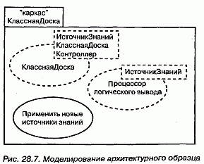

http://bourabai.kz/dbt/uml/ch28.htm

ЧАСТЬ VI - Архитектурное моделирование
# Глава 28. Образцы и каркасы
* Введение
* Термины и понятия
* Образцы и архитектура
* Механизмы
* Каркасы
* Типичные приемы моделирования
* Образцы проектирования
* Архитектурные образцы
* Советы

Все хорошо структурированные системы изобилуют образцами. Образец (Pattern) предлагает типичное решение типичной проблемы в данном контексте. Механизм - это образец проектирования, применимый к сообществу классов; каркас (Framework) - это, как правило, архитектурный образец, предлагающий расширяемый шаблон для приложений в одной конкретной области.

Образцы используются для специфицирования механизмов и каркасов, образующих архитектуру системы. Вы делаете его доступным, ясно идентифицируя те элементы управления и стыковки, с помощью которых пользователь настраивает образец для применения в имеющемся контексте.

## Введение
Захватывает дух, когда думаешь о том, сколько существует способов собрать дом из кучи досок. Мастер из Сан-Франциско, наверное, построит викторианское здание, увенчает его остроконечной крышей и покрасит в яркий цвет. А мастер из штата Мэн, скорее всего, из тех же досок соорудит домик в виде солонки, обшитый дранкой.

Внешне два этих дома - представители совершенно разных архитектурных стилей. Каждый строитель, основываясь на своем опыте, выбирает тот стиль, который лучше всего удовлетворяет потребностям заказчика, а затем адаптирует с учетом пожеланий своего клиента и ограничений, накладываемых выбранным местом, а также строительными нормами и правилами.

Если же взглянуть на проблему изнутри, то окажется, что любой строитель должен при проектировании дома решить и некоторые типичные задачи. Есть лишь ограниченное число проверенных способов конструирования стропил, на которые опирается крыша, и ограниченное число способов проектирования несущей стены с дверными и оконными проемами. Каждому строителю для решения этих типичных проблем придется выбрать те или иные механизмы, приспосабливая их к общему архитектурному стилю и местным нормам.

Создание программных систем подчиняется тем же закономерностям. Всякий раз, отрывая глаза от конкретных строк кода, вы обнаружите типичные механизмы, с помощью которых привыкли организовывать свои классы и другие абстракции. Например, в управляемой событиями системе применение образца проектирования, который можно было бы назвать "цепочка ответственности", - это типичный способ организации обработчиков событий. Теперь поднимитесь чуть выше уровня таких механизмов, и вы увидите типичные каркасы, образующие архитектуру всей системы. Например, использование трехзвенной архитектуры в информационных системах - это широко распространенный способ четко разделить обязанности между пользовательским интерфейсом, хранением информации и бизнес-объектами и правилами.

В UML обычно моделируются образцы проектирования - они также называются механизмами, - которые можно представить в виде коопераций (см. главу 27). Аналогично архитектурные образцы моделируются как каркасы, представляемые в виде стереотипных пакетов (см. главу 12).

Для обоих видов образцов предусмотрены графические изображения, показанные на рис. 28.1.

#### Рис 28-1

## Термины и понятия
Образец, или паттерн (Pattern), - это типичное решение типичной проблемы в данном контексте. Механизм (Mechanism) - это образец проектирования, применимый к сообществу классов. Каркас (Framework) - это архитектурный образец, предлагающий расширяемый шаблон для приложений в одной конкретной области.

### Образцы и архитектура
Занимаясь разработкой архитектуры новой системы или развитием существующей, вы в любом случае никогда не начинаете с нуля (см. главу 2). Напротив, прежний опыт и принятые соглашения наводят вас на мысль применить типичные способы для решения типичных проблем. Например, при построении системы, активно взаимодействующей с пользователем, вы можете прибегнуть к испытанному подходу "модель-вид-контроллер", который позволяет четко отделить объекты (модель) от их представления (вида) и от агентов, обеспечивающих синхронизацию между тем и другим (контроллеров). Аналогично при создании системы для дешифровки доказала свою полезность архитектура на основе "классной доски" (blackboard), хорошо приспособленная для решения сложных задач методом проб и ошибок.

То и другое является примером образцов, или паттернов, - типичных решений для типичных задач в данном контексте. Любая хорошо структурированная система изобилует образцами на разных уровнях абстракции. Образцы проектирования описывают структуру и поведение сообщества классов, архитектурные образцы -структуру и поведение системы в целом.

Образцы входят в UML просто потому, что являются важной составляющей словаря разработчика. Явно выделив образцы в системе, вы сделаете ее более понятной и простой для развития и сопровождения. Например, если вам дадут неизвестный исходный текст и попросят его модифицировать, вы будете долго недоумевать, пытаясь понять, как его части связаны друг с другом. Вместе с тем, если вам дадут тот же текст и скажут, что перечисленные классы взаимодействуют на основе механизма публикации-подписки, вы получите гораздо более ясное представление о том, как все работает. Та же идея применима к системе в целом. Одна лишь фраза "система организована как набор конвейеров и фильтров" очень много говорит об архитектуре системы, а понять это, просто глядя на код классов, было бы куда сложнее.

Образцы помогают при визуализации, специфицировании, конструировании и документировании артефактов программной системы. Можно заниматься прямым проектированием системы, выбрав подходящий набор образцов и применяя их к абстракциям, специфичным для данной предметной области, - или же обратным проектированием, выявляя содержащиеся в системе образцы (хотя вряд ли этот процесс можно назвать очень продуктивным). Скорее наоборот, при поставке системы разумно было бы описать характерные для нее образцы, чтобы помочь тому, кто в дальнейшем захочет повторно использовать или модифицировать ваш код.

На практике интерес представляют два вида образцов: образцы проектирования и каркасы. В UML есть средства для моделирования и тех, и других. При моделировании любого образца вы обнаружите, что он, как правило, оказывается автономным в контексте некоторого большего пакета, если не считать отношений зависимости, связывающих его с остальными частями системы.

### Механизмы
Механизм - это просто другое название образца проектирования, когда он применяется к сообществу классов. Например, типичная проблема проектирования, с который сталкивается программист, пишущий на языке Java, - как видоизменить класс, который умеет отвечать на некоторое множество событий, таким образом, чтобы он отвечал на события иного рода, не трогая кода исходного класса. Типичным решением этой проблемы является адаптер (Adaptor pattern) - структурный образец проектирования для преобразования одного интерфейса в другой. Этот образец является настолько общим, что имеет смысл дать ему название, а затем использовать в моделях всякий раз, как возникает аналогичная проблема.

При моделировании механизмы проявляют себя двояко.

Во-первых, как показано на рис. 28.1, механизм просто именует множество абстракций, которые совместно работают для обеспечения типичного поведения, представляющего некий интерес. Такие механизмы моделируются как простые кооперации (см. главу 27), поскольку являются всего лишь именами для сообщества классов. Раскрыв такую кооперацию, можно увидеть ее структурные аспекты (обычно изображаемые в виде диаграмм классов) и поведенческие (обычно изображаемые в виде диаграмм взаимодействия). Кооперации подобного типа захватывают разные абстракции системы; весьма вероятно, что некоторый класс будет членом нескольких коопераций.

Во-вторых, как показано на рис. 28.2, механизм именует шаблон для множества совместно работающих абстракций. Такие механизмы моделируются в виде параметризованных коопераций, которые в UML изображаются аналогично шаблонам классов (см. главу 9). Раскройте такую кооперацию - и вы увидите ее структурные и поведенческие аспекты. Сверните ее, и вы увидите, как образец применяется к вашей системе путем связывания частей кооперации с существующими в системе абстракциями. При моделировании механизма в виде параметризованной кооперации вы описываете те элементы управления и стыковки, с помощью которых можно адаптировать шаблон, меняя его параметры. Подобные кооперации могут появляться в разных частях системы и связываться с различными абстракциями. В приведенном примере классы Предмет и Наблюдатель образца связаны с конкретными классами ОчередьЗадач и Ползунок соответственно.

#### Рис 28-2

> Примечание: Решение о том, моделировать ли механизм с помощью простой или параметризованной кооперации, не вызывает затруднений. Если нужно лишь поименовать сообщество совместно работающих классов в системе, применяйте простую кооперацию. Если же нужно абстрагировать существенные структурные и поведенческие аспекты механизма способом, независящим от конкретной предметной области, а затем связать их с абстракциями в данном контексте, пользуйтесь параметризованной кооперацией.

### Каркасы

Каркас - это архитектурный образец, предлагающий расширяемый шаблон для приложений в некоторой конкретной области. Например, в системах реального времени часто применяется архитектурный образец "циклический исполнитель", делящий время на кадры и подкадры, в которых обработка протекает в строгих временных рамках. Выбор такого образца вместо управляемой событиями архитектуры оказывает влияние на всю систему. Этот образец (равно как и его альтернатива) является настолько общим, что имеет смысл назвать его каркасом.

Каркас - это больше чем механизм. Фактически можно считать, что каркас - это род микроархитектуры, включающий в себя множество механизмов, совместно работающих для разрешения типичной для данной предметной области проблемы. Специфицируя каркас, вы описываете скелет архитектуры со всеми управляющими органами, которые раскрываются пользователям, желающим адаптировать этот каркас для применения в нужном контексте.

В UML каркас моделируется в виде стереотипного (см. главу 6) пакета (см. главу 12). Раскрыв этот пакет, вы увидите механизмы, существующие в любом из видов системной архитектуры (см. главу 2). В частности, можно обнаружить параметризованные кооперации, а также прецеденты, поясняющие, как работать с каркасом, или простые кооперации, представляющие набор абстракций, на базе которых можно строить систему, например путем порождения производных классов.

На рис. 28.3 показан такой каркас, названный ЦиклическийИсполнитель. Среди прочего каркас включает кооперацию (ОбщиеСобытия), охватывающую множество классов событий (см. главу 20), и механизм (ОбработчикСобытий) для циклической обработки событий. Клиент, построенный на базе этого каркаса (к примеру, СердечныйСтимулятор) может пользоваться абстракциями из кооперации ОбщиеСобытия путем порождения производных классов, а также применять механизм ОбработчикСобытий.

#### Рис 28-3

> Примечание: Каркасы отличаются от обычных библиотек классов. Библиотека классов содержит абстракции, конкретизируемые или вызываемые абстракциями программы. Каркас же содержит абстракции, которые вызывают или конкретизируют ваши абстракции. Оба вида соединений образуют те элементы управления и стыковки, с помощью которых каркас настраивается на ваш контекст.

## Типичные приемы моделирования

### Образцы проектирования
В числе прочего образцы используются для моделирования типичных ситуаций, возникающих при проектировании. При моделировании подобного механизма следует принимать во внимание его внутренний и внешний вид.

При взгляде снаружи образец проектирования изображается в виде параметризованной кооперации. Будучи кооперацией, образец предоставляет набор абстракций, структура и поведение которых призваны в ходе совместной работы выполнить некоторую полезную функцию. Параметры кооперации именуют те элементы, которые пользователь образца должен с чем-то связать. В связи с этим образец проектирования превращается в шаблон, который используется в конкретном контексте путем подстановки элементов, соответствующих параметрам шаблона.

При взгляде изнутри образец проектирования представляется простой кооперацией и изображается со своими структурной и поведенческой составляющими. Обычно кооперация моделируется с помощью диаграмм классов (для структурной составляющей) и диаграмм взаимодействий (для поведенческой составляющей). Параметры кооперации именуют некоторые из структурных элементов, которые при связывании с каким-то определенным контекстом конкретизируются абстракциями из этого контекста.

Моделирование образца проектирования осуществляется так:

1. Идентифицируйте типичное решение типичной проблемы и материализуйте его в виде механизма.
2. Смоделируйте механизм в виде кооперации (см. главу 27), описав ее структурный и поведенческий аспекты.
3. Идентифицируйте те элементы образца проектирования, которые должны быть связаны с элементами в конкретном контексте, и изобразите их в виде параметров кооперации.

Например, на рис. 28.4 показано использование образца проектирования Команда (см. Gamma et al, "Design Patterns". Reading, Massachusetts: Addison-Wesley, 1995). Документация гласит, что этот образец "инкапсулирует запрос в виде объекта, позволяя тем самым параметризовать клиенты, выдающие разные запросы, ставить запросы в очередь и протоколировать их, а также поддерживать операции, допускающие отмену". Как видно из модели, этот образец имеет четыре параметра, которые должны быть связаны с элементами в данном контексте. Модель показывает пример такого связывания, где с параметрами образца связаны классы Приложение, КомандаВставки, КомандаОткрытия, ПунктМеню и Документ.

#### Рис 28-4

Обратите внимание на то, что КомандаВставки и КомандаОткрытия связаны несколько иначе, чем остальные параметры. Оба являются подклассами класса Команда, предоставляемого самим образцом проектирования. Если вы понимаете, как функционирует образец проектирования, то, глядя на эту модель, сразу догадаетесь, как в данном контексте совместно работают эти пять классов. Весьма вероятно, что в вашей системе этот образец будет использоваться неоднократно, быть может, с различными связями. Возможность повторного использования образца проектирования и делает процесс разработки на основе образцов столь эффективным.

> Примечание: Хотя на рисунке этого не видно, классификаторы, которые материализуют данный образец проектирования (Приложение, КомандаВставки, КомандаОткрытия, ПунктМеню и Документ) по своей структуре изоморфны обобщенному образцу, показанному на рис. 28.5. Поэтому там, где в обобщенном образце есть ассоциация между Клиентом и Получателем, существует и ассоциация между Приложением и Документом. Применение образца означает конкретизацию как его сущностей, так и связей между ними.

Чтобы завершить модель образца проектирования, вы должны специфицировать его структурную и поведенческую составляющие, которые представляют собой взгляд на кооперацию (см. главу 27) изнутри.

Например, на рис. 28.5 показана диаграмма классов (см. главу 8), представляющая структуру образца проектирования. Заметьте, что классы на этой диаграмме названы так же, как и параметры образца.

#### Рис 28-5

На рис. 28.6 показана диаграмма последовательностей (см. главу 18), представляющая поведение этого образца.

#### Рис 28-6

### Архитектурные образцы
Образцы используются также для моделирования типичных архитектурных решений. При моделировании каркаса вы, собственно, моделируете инфраструктуру, которую в дальнейшем планируете повторно использовать или адаптировать к некоторому контексту.

Каркас изображается в виде стереотипного пакета (см. главу 12). Будучи пакетом, каркас предоставляет ряд элементов, в частности (хотя этим все разнообразие не исчерпывается) классы, интерфейсы, прецеденты, компоненты, узлы, кооперации и даже другие каркасы. Иными словами, вы помещаете в каркас все абстракции, которые, работая совместно, формируют расширяемый шаблон для приложений в конкретной области. Некоторые из этих элементов будут являться открытыми и представлять ресурсы, которые надстраивает клиент. Это стыковочные элементы каркаса, которые вы можете подсоединить к абстракциям из своего контекста. Другие открытые элементы будут являться образцами проектирования и соответствовать ресурсам, с которыми связывается клиент. Это "разъемы" каркаса, заполняемые при связывании с образцом проектирования. И наконец, некоторые элементы будут закрытыми или защищенными; они соответствуют инкапсулированным элементам каркаса, невидимым снаружи.

При моделировании архитектурного образца помните, что каркас является, по сути дела, описанием архитектуры (см. главу 2), хотя неполным и, возможно, параметризованным. Следовательно, все, что вы знаете о моделировании хорошо структурированной архитектуры, в полной мере применимо и к хорошо структурированным каркасам. Самые лучшие каркасы не проектируются изолированно от остальной системы, - на практике такая попытка обречена на неудачу. В основе каркасов лежат уже существующие архитектуры, доказавшие свою работоспособность. Затем каркасы развиваются, чтобы найти те элементы управления и стыковки, которые необходимы и достаточны для применимости каркаса к новым областям.

Моделирование архитектурного образца осуществляется следующим образом:

1. Положите в основу каркаса уже существующую, проверенную архитектуру.
2. Смоделируйте каркас в виде стереотипного пакета, содержащего все элементы (и в особенности образцы проектирования), которые необходимы и достаточны для описания различных представлений каркаса.
3. Раскройте те элементы управления и стыковки, которые нужны, чтобы адаптировать каркас, представив их в виде образцов проектирования и коопераций. Это главным образом означает, что пользователь образца должен понимать, какие классы следует расширить, какие операции реализовать и какие сигналы обрабатывать.

На рис. 28.7 показана спецификация архитектурного образца КласснаяДоска (он рассматривается в книге Buschmann et al., "Pattern-Oriented Software Architecture", New York, New York: Wiley, 1996). Как говорится в документации, этот образец "применим к задачам преобразования исходных данных в высокоуровневые структуры, которые не имеют простого детерминированного решения". В основе архитектуры лежит образец проектирования КласснаяДоска, который определяет порядок совместной работы классов ИсточникЗнаний, КласснаяДоска и Контроллер. Еще каркас включает образец проектирования Процессор логического вывода, который определяет общий механизм работы класса ИсточникЗнаний. И наконец, как видно из рисунка, каркас раскрывает один вариант использования Применить новые источники знаний, поясняющий клиенту, как можно его адаптировать.

#### Рис 28-7

> Примечание: Полное моделирование каркаса - задача отнюдь не более простая, чем моделирование архитектуры всей системы. В некоторых отношениях она даже сложнее, поскольку для того, чтобы с каркасом можно было работать, вы должны раскрыть все его элементы управления и стыковки и, возможно, представить мета-прецеденты (типа Применить новые источники знаний), которые объясняют, как каркас настраивается, а также простые прецеденты, поясняющие его поведение.

## Советы
При моделировании образцов в UML помните, что они работают на многих уровнях абстракции, начиная от отдельных классов и кончая системой в целом. Самые интересные виды образцов - это механизмы и каркасы. Хорошо структурированный образец обладает следующими свойствами:

* решает типичную проблему типичным способом;
* включает структурную и поведенческую составляющие;
* раскрывает элементы управления и стыковки, с помощью которых его можно настроить на разные контексты;.
* является атомарным, то есть не разбивается на меньшие образцы;
* охватывает разные индивидуальные абстракции в системе.

Изображая образец в UML, руководствуйтесь следующими правилами:

* раскрывайте те его элементы, которые необходимо адаптировать для применения в конкретном контексте;
* делайте образец доступным, приводя прецеденты его использования, а также способы настройки.

