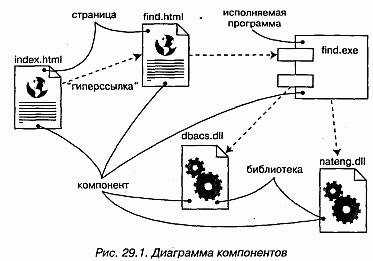
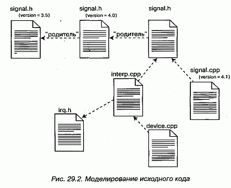

http://bourabai.kz/dbt/uml/ch29.htm

ЧАСТЬ VI - Архитектурное моделирование
# Глава 29. Диаграммы компонентов
* Введение
* Термины и понятия
    * Общие свойства
    * Содержание
    * Типичные примеры применения
* Типичные приемы моделирования
    * Исходный код
    * Исполняемая версия
    * Физическая база данных
    * Адаптивные системы
    * Прямое и обратное проектирование
* Советы

Диаграммы компонентов - это один из двух видов диаграмм, применяемых при моделировании физических аспектов объектно-ориентированной системы (второй вид - диаграммы развертывания, см. главу 30). Они показывают организацию наборов компонентов и зависимости между ними.

Диаграммы компонентов применяются для моделирования статического вида системы с точки зрения реализации. Сюда относится моделирование физических сущностей, развернутых в узле, например исполняемых программ, библиотек, таблиц, файлов и документов. По существу, диаграммы компонентов - это не что иное, как диаграммы классов, сфокусированные на системных компонентах.

Диаграммы компонентов важны не только для визуализации, специфицирования и документирования системы, основанной на компонентах, но и для создания исполняемых систем путем прямого и обратного проектирования.

## Введение
Строительство дома не ограничивается созданием комплекта чертежей. Они, конечно, очень важны, так как помогают визуализировать, специфицировать и документировать, какой именно дом вы собираетесь построить, и обеспечить выполнение замысла с соблюдением сроков и сметы. Но рано или поздно поэтажные планы и разрезы придется воплощать в реальные стены, полы и потолки, сделанные из дерева, камня или металла. При этом вы, скорее всего, будете использовать и уже готовые компоненты, например встроенные шкафы, окна, двери и вентиляционные решетки. А если вы переоборудуете здание, то число готовых компонентов возрастет -это будут целые комнаты и инженерные конструкции.

Так же обстоит дело с программным обеспечением. Для того чтобы можно было рассуждать о желаемом поведении системы, вы создаете диаграммы прецедентов. Словарь предметной области вы описываете с помощью диаграмм классов. Чтобы показать, как описанные в словаре сущности совместно работают для обеспечения нужного поведения, вы пользуетесь диаграммами последовательностей, кооперации, состояний и деятельности. В конечном счете логические чертежи превращаются в реальные вещи, существующие в мире битов, например в исполняемые программы, библиотеки, таблицы, файлы и документы. Вы обнаруживаете, что некоторые из этих компонентов необходимо создавать с нуля, но находятся также и способы по-новому использовать старые компоненты.

Для визуализации статического аспекта физических компонентов и их отношений, а кроме того, для специфицирования деталей конструкции в UML используются диаграммы компонентов (см. рис. 29.1).

#### Рис 29-1

## Термины и понятия
Диаграмма компонентов (Component diagram) показывает набор компонентов и отношения между ними. Графически диаграмма компонентов представляется в виде графа с ребрами и вершинами.

### Общие свойства
Диаграмма компонентов обладает общими свойствами, присущими всем диаграммам (см. главу 7), - именем и графическим содержанием, которое отражает одну из проекций модели. Отличается она от других диаграмм своим специфичным содержанием.

### Содержание
Диаграммы компонентов обычно включают в себя:

* компоненты (см. главу 25);
* интерфейсы (см. главу 11);
* отношения (см. главы 5 и 10) зависимости, обобщения, ассоциации и реализации.

Подобно всем прочим, диаграммы компонентов могут содержать примечания и ограничения.

Диаграммы компонентов могут также содержать пакеты (см. главу 12) или подсистемы (см. главу 31), - те и другие используются для группирования элементов модели в крупные блоки. Иногда бывает полезно поместить в диаграмму компонентов еще и экземпляры (см. главу 13), особенно если вы хотите визуализировать один экземпляр из семейства компонентных систем.

> Примечание: Во многих отношениях диаграмма компонентов представляет собой разновидность диаграммы классов (см. главу 8), в которой внимание обращено прежде всего на системные компоненты.

### Типичные примеры применения
Диаграммы компонентов используются для моделирования статического вида системы с точки зрения реализации (см. главу 2). Этот вид в первую очередь связан с управлением конфигурацией частей системы, составленной из компонентов, которые можно соединять между собой различными способами.

При моделировании статического вида системы с точки зрения реализации диаграммы компонентов, как правило, используются в четырех случаях:

* моделирование исходного кода. В большинстве современных объектно-ориентированных языков программирования код пишется в интегрированных средах разработки, которые сохраняют исходные тексты в файлах. Диаграммы компонентов можно применять для моделирования управления конфигурированием этих файлов, которые представляют собой компоненты - рабочие продукты;
* моделирование исполняемых версий. Версия - это относительно полный и согласованный набор артефактов, предоставляемый внутреннему или внешнему пользователю. Для системы, составленной из компонентов, версия прежде всего подразумевает те части, которые необходимо поставить для получения работающей системы. При моделировании версий с помощью диаграмм компонентов вы визуализируете, специфицируете и документируете решения, принятые относительно физических составляющих системы, то есть компонентов развертывания;
* моделирование физических баз данных. Представляйте себе физическую базу данных как конкретную реализацию схемы, существующую в мире битов. Схемы, по сути дела, описывают API для доступа к хранимой информации; модель же физической базы данных (см. главу 8) представляет способы хранения этой информации в таблицах реляционной базы данных или на страницах объектно-ориентированной БД. Для представления этих и иных видов физических баз данных вы можете пользоваться диаграммами компонентов;
* моделирование адаптивных систем. Некоторые системы абсолютно статичны - их компоненты появляются на сцене, принимают участие в выполнении, а затем покидают сцену. Другие системы более динамичны; они включают мобильных агентов или компоненты, которые мигрируют с целью выравнивания нагрузки и восстановления после сбоев. Для представления таких систем применяются диаграммы компонентов совместно с некоторыми другими диаграммами UML.

## Типичные приемы моделирования

Исходный код
При разработке программы на языке Java исходный код обычно сохраняют в файлах с расширением .java. Программы, написанные на языке C++, обычно хранят исходный код в заголовочных файлах с расширением .h и в файлах реализации с расширением .cpp. При использовании языка IDL для разработки приложений СОМ+ или CORBA один, с точки зрения проектирования, интерфейс распадается на четыре исходных файла: сам интерфейс, клиентский заместитель (Proxy), серверная заглушка (Stub) и класс-мост (Bridge class). По мере роста объема приложения, на каком бы языке оно ни было написано, эти файлы придется организовывать в группы. Затем, на стадии сборки приложения, вы, вероятно, станете создавать различные варианты одних и тех же файлов для каждой новой промежуточной версии, и захотите поместить все это в систему управления конфигурацией.

В большинстве случаев нет необходимости моделировать этот аспект системы напрямую. Вместо этого вы сообщаете среде разработки, что надо следить за файлами и их отношениями. Иногда, однако, бывает полезно визуализировать исходные файлы и связи между ними с помощью диаграмм компонентов. Применяемые таким образом диаграммы компонентов обычно содержат только компоненты - рабочие продукты со стереотипом file (см. главу 25), а также отношения зависимости между ними. Например, вы могли бы выполнить обратное проектирование набора исходных файлов для визуализации сложной системы зависимостей между ними при компиляции. Можно пойти и в другом направлении, специфицировав отношения между исходными файлами и подав затем эту модель на вход средства компиляции, например make в ОС UNIX. Точно так же можно использовать диаграммы компонентов для визуализации истории набора исходных файлов, хранящихся в системе управления конфигурацией. Получая информацию от этой системы, например о том, сколько раз некоторый файл извлекался для редактирования на протяжении определенного периода времени, вы вправе воспользоваться ею для раскрашивания диаграмм компонентов. Это поможет выявить среди исходных файлов "горячие точки", в которых архитектура системы наиболее часто подвергается модификации.

Моделирование исходного кода системы осуществляется следующим образом:

1. С помощью прямого или обратного проектирования идентифицируйте представляющие интерес наборы исходных файлов и смоделируйте их в виде компонентов со стереотипом file.
2. Для больших систем воспользуйтесь пакетами, чтобы показать группы исходных файлов.
3. Подумайте о том, чтобы с помощью помеченных значений явно показать такую информацию, как номер версии файла, его автора и дату последнего изменения (для отслеживания таких значений пользуйтесь инструментальными средствами).
4. Моделируйте зависимости компиляции между исходными файлами с помощью отношений зависимости (для генерирования таких зависимостей применяйте инструментальные средства).

В качестве примера на рис. 29.2 показано пять исходных файлов, из которых signal.h - заголовочный. Приведены три его версии начиная с самой последней. Каждая версия помечена значением, содержащим ее номер.

#### Рис 29-2

Этот заголовочный файл (signal.h) используется двумя другими файлами (interp.cpp и signal.cpp). Один из них (interp.cpp) зависит при компиляции от другого заголовчного файла (irq.h). В свою очередь файл device.cpp зависит от interp.cpp. При наличии такой диаграммы компонентов легко проследить, что произойдет при изменениях. Так, изменение исходного файла signal.h потребует перекомпиляции трех других файлов: signal.cpp, interp.cpp и, тран-зитивно, device.cpp. Из той же диаграммы видно, что файл irq.h такое изменение не затронет.

Подобные диаграммы легко генерируются путем обратного проектирования на основе информации, хранящейся в системе управления конфигурацией.

### Исполняемая версия
Выпуск версий простого приложения несложен. Одна-единственная исполняемая программа записывается на диск, и пользователи могут смело ее запускать. Для таких приложений диаграммы компонентов не требуются: там нечего визуализировать, специфицировать, конструировать и документировать.

Выпуск версий более сложных приложений уже представляет определенные трудности. Кроме главной исполняемой программы (обычно ехе-файл) нужен ряд вспомогательных модулей, таких как библиотеки (обычно dll-файлы при работе в контексте СОМ+ или class- либо jar-файлы при работе с языком Java), файлы оперативной справки и файлы ресурсов. Для распределенных систем, вероятно, потребуется несколько исполняемых программ и других файлов, разбросанных по разным узлам. Если вы работаете с системой приложений, то может оказаться так, что одни компоненты уникальны, а другие используются в нескольких приложениях. По мере развития системы управление конфигурацией множества компонентов становится важной задачей, и сложность ее растет, поскольку изменение некоторых компонентов в одном приложении может сказаться на работе других.

По этим причинам для визуализации, специфицирования, конструирования и документирования исполняемых версий применяются диаграммы компонентов. Эти диаграммы охватывают как развертывание компонентов, входящих в состав каждой версии, так и связи между ними. Диаграммы компонентов пригодны для прямого проектирования новой системы и для обратного проектирования существующей.

При создании подобных диаграмм компонентов вы фактически просто моделируете часть сущностей и отношений, составляющих вид системы с точки зрения реализации. Поэтому каждая диаграмма должна концентрироваться только на каком-то одном наборе компонентов.

Моделирование исполняемой версии осуществляется так:

1. Идентифицируйте набор компонентов, который вы хотите моделировать. Как правило, сюда войдут все или некоторые из компонентов, размещенные в одном узле, или же распределение таких наборов компонентов по всем узлам системы.
2. Примите во внимание стереотип каждого компонента в наборе. В большинстве систем имеется лишь небольшое число различных видов компонентов (таких, как исполняемые программы, библиотеки, таблицы, файлы и документы). Для визуального представления этих стереотипов можно воспользоваться механизмами расширения UML (см. главу 6).
3. Рассмотрите связи каждого компонента с соседями. Чаще всего это предполагает интерфейсы (см. главу 11), которые экспортируют (реализуют) одни компоненты и импортируют (используют) другие. Если вы хотите раскрыть стыковочные узлы системы, смоделируйте эти интерфейсы явно; если же не обходимо представить модель на более высоком уровне абстракции, скройте такие связи, показав лишь зависимости между компонентами.

В качестве примера на рис. 29.3 представлена модель части исполняемой версии автономного робота. Основное внимание обращено на компоненты развертывания, ассоциированные с функциями приводов робота и вычислительными операциями. Вы видите один компонент (driver.dll), который экспортирует интерфейс (IDrive), импортируемый другим компонентом (path.dll). driver.dll экспортирует еще один интерфейс (ISelfTest), который, по всей видимости, используется другими компонентами в системе, хотя они здесь и не показаны. На диаграмме присутствует еще один компонент (collision.dll), который также экспортирует набор интерфейсов, хотя их детали скрыты: показана лишь зависимость от path.dll к collision.dll.

#### Рис 29-3

В системе участвует много компонентов. Но данная диаграмма сфокусирована лишь на тех компонентах развертывания, которые напрямую вовлечены в процесс перемещения робота. Заметьте, что в этой компонентной архитектуре вы могли бы заменить конкретную версию driver.dll на другую; при условии, что она реализует те же (и, возможно, некоторые дополнительные) интерфейсы, path.dll продолжала бы работать правильно. Если вы хотите явно указать операции, реализуемые driver.dll, то всегда можно изобразить его интерфейсы с помощью нотации классов со стереотипом interface.

### Физическая база данных
Логическая схема базы данных (см. главу 8) описывает словарь хранимых данных системы, а также семантику связей между ними. Физически все это хранится в базе данных - реляционной, объектно-ориентированной или гибридной объектно-реляционной. UML вполне пригоден для моделирования физических баз данных, равно как и их логических схем. (Обсуждение проектирования физических баз данных выходит за рамки книги; здесь эта тема затрагивается только для того, чтобы продемонстрировать, как при помощи UML можно моделировать базы данных и таблицы.)

Отображение логической схемы на объектно-ориентированную базу данных не вызывает затруднений, так как даже сложные цепочки наследования могут быть сохранены непосредственно. Отображение схемы на реляционную базу уже сложнее. При наличии наследования вы должны решить, как отображать классы на таблицы. Как правило, применяется одна из трех следующих стратегий или их комбинация:

* можно определить отдельную таблицу для каждого класса. Это простой, но наивный подход, поскольку при добавлении новых наследующих классов или модификации родительских возникнут проблемы сопровождения;
* можно свернуть цепочки наследования, так чтобы все реализации любого класса в иерархии имели одно и то же состояние. Недостаток этого подхода состоит в том, что во многих экземплярах хранится избыточная информация;
* наконец, можно вынести данные порожденного класса, отсутствующие в родительском, в отдельную таблицу. Этот подход лучше прочих отражает структуру наследования, а недостаток его в том, что для доступа к данным придется выполнять соединение многих таблиц.

Проектируя физическую базу данных, вы должны также решить, как отобразить операции, определенные в логической схеме. В отношении объектно-ориентированных баз такое отображение достаточно прозрачно, а для реляционных предстоит уяснить, как будут реализовываться операции. Здесь тоже есть несколько вариантов:

* простые операции создания, выборки, обновления и удаления реализуются стандартными средствами SQL или ODBC;
* более сложное поведение (например, бизнес-правила) отображаются на триггеры или хранимые процедуры.

С учетом указанных выше соображений моделирование физической базы данных осуществляется следующим образом:
1. Идентифицируйте в вашей модели классы, представляющие логическую схему базы данных.
2. Выберите стратегию отображения этих классов на таблицы. Необходимо рас смотреть и вопрос о физическом распределении файлов базы данных в развернутой системе - от этого тоже будет зависеть выбор стратегии.
3. Для визуализации, специфицирования, конструирования и документирования отображения создайте диаграмму компонентов, в которой компоненты имеют стереотип таблицы.
4. Всюду, где можно, пользуйтесь инструментальными средствами для преобразования логической схемы в физическую.

На рис. 29.4 показано несколько таблиц базы данных, взятых из вузовской информационной системы. Вы видите одну базу (school.db, изображенную в виде компонента со стереотипом database), которая состоит из пяти таблиц: course, department, instructor, school и student (все они изображены в виде компонентов со стереотипом interface - одним из стандартных элементов UML, см. "Приложение В"). В соответствующей логической схеме не было наследования, поэтому отображение на физическую базу данных не вызвало затруднений.

#### Рис 29-4

Хотя в данном примере это и не показано, вы можете специфицировать содержимое каждой таблицы. У компонентов могут быть атрибуты, поэтому при моделировании физических баз данных широко применяется использование атрибутов для описания колонок каждой таблицы. Также у компонентов могут быть операции, которыми можно воспользоваться для обозначения хранимых процедур.

### Адаптивные системы
Все продемонстрированные до сих пор диаграммы компонентов использовались для моделирования статических видов системы. Участвующие в них компоненты проводили всю свою жизнь на одном узле. Хотя такая ситуация является наиболее распространенной, иногда, особенно при работе со сложными распределенными системами, приходится моделировать и динамические представления. Например, некоторая система может реплицировать свои базы данных на несколько узлов и переключаться на резервный сервер в случае отказа главного. При моделировании глобальной распределенной системы, работающей в режиме 24x7 (то есть семь дней в неделю, 24 часа в сутки) вы, скорее всего, встретитесь с мобильными агентами -компонентами, которые мигрируют с одного узла на другой для выполнения некоторой операции. Для того чтобы моделировать такие динамические представления, вам понадобится комбинировать диаграммы компонентов, объектов и взаимодействия.

Моделирование адаптивной системы производится так:

1. Рассмотрите физическое распределение компонентов, которые могут мигрировать с одного узла на другой. Специфицировать положение экземпляра компонента можно с помощью помеченного значения location (см. главу 23), изобразив его затем на диаграмме компонентов (хотя, строго говоря, диаграмма, содержащая только экземпляры, - это диаграмма объектов, см. главу 15.
2. Если нужно смоделировать действия, вызывающие миграцию компонентов, создайте соответствующую диаграмму взаимодействия, которая будет содержать экземпляры компонентов. Изменение положения можно проиллюстрировать, нарисовав один экземпляр несколько раз, но с разными помеченными значениями.

Например, на рис. 29.5 представлена модель репликации базы данных, изображенной на предыдущем рисунке. Мы видим два экземпляра компонента school.db - оба анонимны и имеют разные помеченные значения location. Есть также примечание, в котором явно поясняется, какой экземпляр первичен, а какой является репликой.

#### Рис 29-5

При желании показать детали каждой базы данных вы можете изобразить их в канонической форме - в виде компонента со стереотипом database.

Хотя на рисунке это не показано, допустимо воспользоваться диаграммой взаимодействия (см. главу 18) для моделирования динамики переключения с главного сервера на резервный.

### Прямое и обратное проектирование
Прямое и обратное проектирование компонентов выполняется довольно просто, так как компоненты - это физические сущности (исполняемые программы, библиотеки, таблицы, файлы и документы), а потому они близки к работающей системе. При прямом проектировании класса или кооперации вы на самом деле проектируете компонент, который представляет исходный код, двоичную библиотеку или исполняемую программу для этого класса или кооперации. Точно так же при обратном проектировании исходного кода, двоичной библиотеки или исполняемой программы вы в действительности проектируете компонент или множество компонентов, которые отображаются на классы или кооперации.

Решая заняться прямым проектированием (созданием кода по модели) класса или кооперации, вы должны определиться, во что их нужно преобразовать: в исходный код, двоичную библиотеку или исполняемую программу. Логическую модель имеет смысл превратить в исходный код, если вас интересует управление конфигурацией файлов, которые затем будут поданы на вход среды разработки. Логические модели следует непосредственно преобразовать в двоичные библиотеки или исполняемые программы, если вас интересует управление компонентами, которые фактически будут развернуты в составе работающей системы. Иногда нужно и то, и другое. Классу или кооперации можно поставить в соответствие как исходный код, так и двоичную библиотеку или исполняемую программу.

Прямое проектирование диаграммы компонентов состоит из следующих этапов:

1. Для каждого компонента идентифицируйте реализуемые им классы или кооперации.
2. Выберите для каждого компонента целевое представление. Это может быть либо исходный код (или иная форма, которой может манипулировать сис тема разработки), либо двоичная библиотека, либо исполняемая программа (или иная форма, которая может быть включена в работающую систему).
3. Используйте инструментальные средства для прямого проектирования модели.

Обратное проектирование (создание модели по коду) диаграммы компонентов - не идеальный процесс, поскольку всегда имеет место потеря информации. По исходному коду вы можете обратно спроектировать классы - это более или менее обычное дело (см. главу 8). Обратное проектирование компонентов из исходного кода выявляет существующие между файлами зависимости компиляции. Для двоичных библиотек самое большее, на что можно рассчитывать, - это обозначить библиотеку как компонент, а затем путем обратного проектирования раскрыть его интерфейсы. Это второе из распространенных действий, которые выполняются над диаграммами компонентов. Такой подход может быть полезен при знакомстве с новыми плохо документированными библиотеками. Исполняемую программу можно лишь обозначить как компонент и затем дизассемблировать ее код, но вряд ли вы будете этим заниматься, если не пишете на языке ассемблера. Обратное проектирование диаграммы компонентов осуществляется так:

1. Выберите целевое представление. Исходный код можно реконструировать в компоненты, а затем и в классы. Двоичные библиотеки можно подвергнуть обратному проектированию для раскрытия их интерфейсов. Исполняемые программы поддаются обратному проектированию в наименьшей степени.
2. С помощью инструментальных средств укажите на код, который вы хотите подвергнуть обратному проектированию. Воспользуйтесь инструментами для генерации новой модели или модификации существующей, для которой ранее было проведено прямое проектирование.
3. Воспользуйтесь инструментальными средствами для создания диаграммы компонентов путем сверки с моделью. Например, можно начать с одного или нескольких компонентов, а затем расширять диаграмму, следуя по связям или переходя к соседним компонентам. Раскройте или спрячьте детали этой диаграммы компонентов в соответствии с тем, что именно вы хотите донести до читателя.

В качестве примера на рис. 29.6 представлена диаграмма компонентов, полученная в результате обратного проектирования компонента ActiveX vbrun.dll. Видно, что компонент реализует 11 интерфейсов. Имея такую диаграмму, вы начинаете понимать семантику компонента и можете переходить к исследованию деталей интерфейсов.

#### Рис 29-6

Чаще всего при обратном проектировании исходного кода, а иногда и двоичных библиотек или исполняемых программ, прибегают к помощи системы управления конфигурацией. Это означает, что вы будете работать с конкретными версиями файлов или библиотек, совместимых друг с другом. В таких случаях бывает полезно включить помеченное значение, представляющее версию компонента, - ее может предоставить система управления конфигурацией. Тогда вы сможете воспользоваться UML для визуализации истории компонента при смене версий.

## Советы
Создавая в UML диаграммы компонентов, помните, что каждая такая диаграмма - это графическое представление статического вида системы с точки зрения реализации. Ни одна отдельно взятая диаграмма компонентов не должна показывать все, что известно о системе. Собранные вместе, диаграммы компонентов дают полное представление о системе с точки зрения реализации, по отдельности же каждая диаграмма описывает лишь один аспект.

Хорошо структурированная диаграмма компонентов обладает следующими свойствами:

* фокусирует внимание на каком-то одном аспекте статического представления системы с точки зрения реализации;
* содержит только те элементы, которые существенны для понимания этого аспекта;
* раскрывает только те детали, которые находятся на выбранном уровне абстракции;
* не является настолько краткой, чтобы скрыть от читателя важную семантику.

Изображая диаграмму компонентов, руководствуйтесь следующими правилами:

* дайте ей имя, соответствующее назначению;
* располагайте элементы так, чтобы число пересечений было минимальным;
* располагайте элементы так, чтобы семантически близкие сущности оказывались рядом;
* используйте примечания и цвет для привлечения внимания к важным особенностям диаграммы;
* с осторожностью подходите к использованию стереотипных элементов. Выберите ряд общих для вашего проекта (или организации в целом) пиктограмм и последовательно их применяйте.

