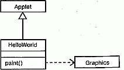
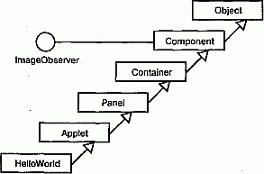
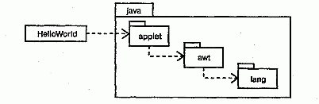

http://bourabai.kz/dbt/uml/ch3.htm

Часть I - Введение в процесс моделирования
# Глава 3. Здравствуй, мир!
* Предисловие
* Ключевые абстракции
* Механизмы
* Компоненты

## Предисловие
Авторы языка Си (С) Брайан Керниган (Brian Kernighan) и Деннис Ричи (Dennis Ritchie) сказали как-то, что единственный способ выучить новый язык программирования - это писать на нем программы. Данное замечание верно и в отношении UML. Чтобы выучить этот язык, надо писать на нем модели.

Первая программа, которую обычно пишут новички, осваивая незнакомый язык, очень проста - она предполагает вывод на экран текстовой строки "Здравствуй, мир!". Это резонный подход, поскольку воплощение даже такого элементарного замысла вызывает вполне объяснимое чувство удовлетворения. Кроме того, как бы тривиальна ни была данная программа, она содержит всю инфраструктуру, необходимую для того, чтобы приложение могло работать.

Освоение UML мы начнем традиционным способом. Моделирование вывода фразы "Здравствуй, мир!" - пожалуй, простейшее применение языка, но эта простота обманчива, поскольку за ней скрыты некоторые любопытные механизмы, заставляющие приложение функционировать. С помощью UML эти механизмы легко моделируются. Поняв их, вы глубже проникнете в структуру этой незамысловатой программы

## Ключевые абстракции
На языке Java апплет для вывода на экран Web-браузера фразы "Здравствуй, мир!" не представляет собой ничего сложного:

	import java.awt.Graphics;
	class HelloWorld extends Java.applet.Applet {
	  public void paint (Graphics g) {
	    g.drawstring("Здравствуй, мир!", 10, 10);
	  } 
	}
Первая строка кода

	import java.awt.Graphics;
делает класс Graphics доступным программе. Префикс java.awt определяет конкретный пакет Java, в котором содержится этот класс. Вторая строка

	class HelloWorld extends Java.applet.Applet {
	 
определяет новый класс HelloWorld и указывает, что он является разновидностью класса Applet, находящегося в пакете java . applet.

В следующих трех строках

	
	public void paint (Graphics g) {
	  g.drawstring("Здравствуй, мир!", 10, 10);
	}
		 
объявляется операция с именем paint, при реализации которой вызывается другая операция, называемая drawstring, ответственная за вывод фразы "Здравствуй , мир!" в указанное место на экране. В полном соответствии с принятым в объектно-ориентированном программировании стиле drawString - это операция над параметром с именем g, типом которого является класс Graphics.

Моделирование этого приложения на языке UML не вызывает затруднений. Как видно из рис. 3.1, класс HelloWorld графически можно представить пиктограммой прямоугольника (информация о классах приводится в главах 4 и 9). Здесь же показана операция paint; ее формальные параметры скрыты, а реализация специфицирована в примечании.

#### Рис. 3.1 Ключевые абстракции класса HelloWorld

> Примечание: UML не является языком визуального программирования, хотя его модели можно - впрочем, не обязательно - выражать на различных языках программирования, таких, например, как Java. Конструкция UML позволяет трансформировать модели в код, а код - обратно в модели. Некоторые формы лучше записывать непосредственно на языке программирования (например, математические выражения), а другие удобнее визуализировать графически с помощью UML (например, иерархии классов).

На этой диаграмме классов представлена суть приложения "Здравствуй, мир!", но многие детали опущены. Как видно из приведенного выше кода, в профамме задействованы два других класса - Applet и Graphics - и каждый по-разному. Applet является родителем HelloWorld, а класс Graphics необходим для реализации одной из его операций - paint. Эти классы и их отношения с классом HelloWorld можно изобразить в виде другой диаграммы классов (см. рис. 3.2).

#### Рис. 3.2 . Непосредственные соседи класса HelloWorld

Классы Applet и Graphics показаны в виде прямоугольных пиктограмм. Операции не представлены и на пиктограммах скрыты. Незакрашенная стрелка, направленная от класса HelloWorld к классу Applet, соответствует отношению обобщения; в данном случае это означает, что HelloWorld является потомком Applet. Пунктирная стрелка от класса HelloWorld к классу Graphics означает отношение зависимости (см. главы 5 и 10), поскольку HelloWorld использует класс Graphics.

Это, однако, еще не завершение структуры, лежащей в основе класса Hello-World. Изучив библиотеки языка Java, содержащие классы Applet и Graphics, вы обнаружите, что оба они являются частью более обширной иерархии. На рис. 3.3 показана диаграмма классов, которые расширяет и реализует класс HelloWorld.

#### Рис. 3.3 Иерархия наследования класса HelloWorld

> Примечание: На этом рисунке приведен характерный пример диаграммы, созданной методом обратного проектирования готовой системы. Как вы уже знаете, обратное проектирование - это построение модели системы на основе ее кода.

Из рисунка видно, что HelloWorld - всего лишь листовой узел большой иерархии классов. Он выступает в качестве потомка класса Applet, который, в свою очередь, является потомком класса Panel, и так далее вплоть до Object -родителя всех классов в языке Java. Таким образом, данная модель соответствует библиотеке Java - у каждого класса есть родитель.

Отношение между элементами ImageObserver и Component отличается от остальных, и диаграмма классов передает это отличие. В библиотеке Java ImageObserver является интерфейсом (см. главу 11). Это означает, в частности, что у него нет реализации, а потому необходимо, чтобы его реализовывали другие классы. Как видно из рисунка, интерфейсы в UML обозначаются кружочком. О том, что класс Component реализует этот интерфейс, свидетельствует линия, направленная от реализации (Component) к интерфейсу (ImageObserver).

Итак, Не11oWorld непосредственно сотрудничает только с двумя классами (Applet и Graphics), но они являются всего лишь малой частью огромной библиотеки предопределенных классов Java. Для облегчения работы ее интерфейсы и классы организованы в виде нескольких пакетов. Корневой пакет среды разработки Java назван, как и следовало ожидать, java. Внутри него содержится несколько других пакетов, а внутри них - еще несколько пакетов, классы и интерфейсы. Класс Object заключен внутри пакета lang, так что его полное имя будет Java. lang.Object. Аналогично классы Panel, Container и Component содержатся в пакете awt, а класс Applet - в пакете applet. Интерфейс ImageObserver входит в состав пакета image, который, в свою очередь, находится в пакете awt, поэтому полное имя интерфейса будет выражено в виде довольно длинной строки j ava.awt.image.ImageObserver.

Разбивку на пакеты можно визуализировать с помощью диаграммы классов, представленной на рис. 3.4.

#### Рис. 3.4 Организация в пакеты классов, участвующих в приложении HelloWorld

Пакеты на языке UML изображают в виде папок с закладками (см. главу 12). Пакеты могут быть вложенными; существующие между ними зависимости показаны с помощью пунктирных стрелок. Например, класс HelloWorld зависит от пакета java.applet, a java.applet - от java.awt.

#### Рис. 3.5 . Механизм изображения

На рисунке представлена кооперация нескольких объектов, включая один экземпляр класса HelloWorld. Другие объекты являются частью рабочей среды Java и в основном остаются на заднем плане создаваемых вами апплетов. В UML экземпляры (см. главу 11) изображаются в точности как классы, но, в отличие от последних, с подчеркнутыми именами. Первые три объекта на диаграмме являются анонимными, то есть не имеют уникального имени. Объекту HelloWorld принадлежит имя (target), известное объекту ComponentPeer.

Порядок событий можно моделировать с помощью диаграммы последовательностей (см. главу 18), представленной на рис. 3.5. Последовательность начинается с запуска объекта Thread, который вызывает операцию run объекта Toolkit. Объект Toolkit обращается затем к одной из своих собственных операций (callbackLoop), которая, в свою очередь, вызывает операцию handleExpose объекта ComponentPeer. Только после этого ComponentPeer обращается к операции paint целевого объекта. ComponentPeer предполагает, что целевой объект является экземпляром класса Component, но в данном случае мы фактически имеем дело с его потомком (а именно HelloWorld), так что полиморфно вызывается операция paint класса HelloWorld.

## Компоненты
Программа "Здравствуй, мир!" реализована в виде апплета и поэтому не запускается самостоятельно, а существует как часть Web-страницы. Приложение начинает выполняться, только когда открывается содержащая его страница: запуск осуществляет механизм браузера, активизирующий выполнение объекта Thread этого апплета. Однако частью Web-страницы является не сам класс HelloWorld, а его двоичная форма, создаваемая компилятором Java, который преобразует исходный код в выполняемый компонент. Это позволяет взглянуть на систему совершенно с другой стороны. На всех предшествующих диаграммах мы видели логическое представление апплета, теперь же посмотрим на приложение как на набор физических компонентов (см. главу 25). Такой взгляд на систему представляет диаграмма компонентов (см. рис. 3.6).

#### Рис. 3.6 Компоненты HelloWorld

Каждая из показанных на этом рисунке пиктограмм соответствует элементу UML в представлении системы с точки зрения реализации. Компонент hello.java - это исходный код логического класса HelloWorld, то есть файл, которым можно манипулировать из среды разработки и с помощью инструментальных средств по управлению конфигурацией системы. Исходный код преобразуется в двоичный файл hellо.class компилятором Java, после чего может быть выполнен виртуальной машиной Java, установленной на компьютере.

Каноническая пиктограмма компонента - прямоугольник с двумя вкладками. Двоичный апплет HelloWorld.class является разновидностью этого символа, но границы прямоугольника толще, благодаря чему можно понять, что это исполняемый компонент (аналогично активному классу). Компоненту hello.java присвоена определенная пользователем пиктограмма, которая представляет текстовый файл. Аналогично и пиктограмма Web-страницы hello.html получена путем расширения нотации UML. Как видно из рисунка, в Web-страницу входит еще один компонент hello.jpg, также изображенный при помощи пользовательской пиктограммы, которая в данном случае содержит схематическое изображение рисунка. Так как последние три компонента представлены графическими символами, определенными пользователем, их имена расположены снаружи пиктограмм. (Механизмы расширения UML рассматриваются в главе 6.)

> Примечание: Отношения между классом (HelloWorld), его исходным текстом (hello.java,) и объектным кодом (HelloWorld.class) редко моделируются явным образом, хотя иногда это и бывает полезно для визуализации физической конфигурации системы. С другой стороны, организацию Web-систем, подобных вышеприведенной, часто визуализируют с помощью диаграмм компонентов, с целью моделирования страниц и других исполняемых компонентов.

