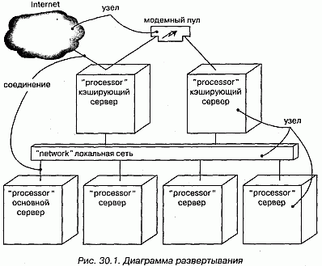
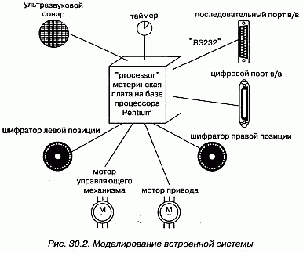
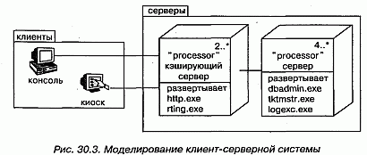
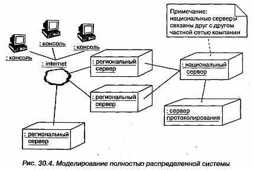

http://bourabai.kz/dbt/uml/ch30.htm

ЧАСТЬ VI - Архитектурное моделирование
# Глава 30. Диаграммы развертывания
* Введение
* Термины и понятия
    * Общие свойства
    * Содержание
    * Типичное применение
* Типичные приемы моделирования
    * Встроенная система
    * Клиент-серверная система
    * Полностью распределенная система
    * Прямое и обратное проектирование
* Советы

Диаграммы развертывания, или применения, - это один из двух видов диаграмм, используемых при моделировании физических аспектов объектно-ориентированной системы (другой вид - диаграммы компонентов, см. главу 29). Такая диаграмма показывает конфигурацию узлов, где производится обработка информации, и то, какие компоненты размещены на каждом узле.

Диаграммы развертывания используются для моделирования статического вида системы с точки зрения развертывания. В основном под этим понимается моделирование топологии аппаратных средств, на которых выполняется система. По существу, диаграммы развертывания - это просто диаграммы классов, сосредоточенные на системных узлах.

Диаграммы развертывания важны не только для визуализации, специфицирования и документирования встроенных, клиент-серверных и распределенных систем, но и для управления исполняемыми системами с использованием прямого и обратного проектирования.

## Введение
При создании программной системы вы как разработчик программного обеспечения обращаете внимание в первую очередь на архитектуру и развертывание своих программ. Но в качестве системного инженера вы заинтересованы главным образом в аппаратных и программных средствах системы и в том, как достичь оптимального их сочетания. Иными словами, разработчики программного обеспечения имеют дело с неосязаемыми артефактами, вроде моделей и кода, а разработчики систем - еще и с аппаратурой, вполне осязаемой.

Хотя основное назначение UML - визуализация, специфицирование, конструирование и документирование программных артефактов, он применим также и для работы с аппаратными артефактами. Из этого не следует, что UML - универсальный язык описания аппаратных средств наподобие VHDL. Однако он все же способен моделировать многие аппаратные аспекты системы, чего разработчику программного обеспечения достаточно для описания платформы, на которой система будет исполняться, а системному инженеру - для сопряжения программных и аппаратных средств. В UML в качестве основы для рассуждений о структуре программной системы используются диаграммы классов и компонентов. Для специфицирования поведения программ применяются диаграммы последовательностей, кооперации, состояний и деятельности. А на стыке программ и аппаратуры располагаются диаграммы развертывания, которые позволяют говорить о топологии процессоров и устройств, на которых выполняется система.

В UML диаграммы развертывания используются для визуализации статических аспектов физических узлов и их взаимосвязей, а также для описания их деталей, которые имеют отношение к конструированию системы (см. рис. 30.1).

#### Рис 30-1

## Термины и понятия
На диаграмме развертывания, или применения (Deployment diagram), показана конфигурация обрабатывающих узлов, на которых выполняется система, и компонентов, размещенных в этих узлах. Диаграмма развертывания представлена в виде графа с ребрами и вершинами.

### Термины и понятия
На диаграмме развертывания, или применения (Deployment diagram), показана конфигурация обрабатывающих узлов, на которых выполняется система, и компонентов, размещенных в этих узлах. Диаграмма развертывания представлена в виде графа с ребрами и вершинами.

### Содержание
Диаграммы развертывания обычно включают в себя:

* узлы (см. главу 26);
* отношения зависимости и ассоциации (см. главы 5 и 10).

Подобно всем прочим диаграммам, диаграммы развертывания могут содержать примечания и ограничения.

На них бывают представлены компоненты (см. главу 25), каждый из которых должен быть размещен на каком-то узле, а кроме того, пакеты (см. главу 12) или подсистемы (см. главу 31), - те и другие используются для группирования элементов модели в крупные блоки. Иногда бывает полезно поместить в диаграмму объектов еще и экземпляры (см. главу 13), особенно если вы хотите визуализировать один экземпляр из семейства топологий расположения аппаратных средств.

> Примечание: Во многих отношениях диаграмма развертывания является разно -видностъю диаграммы классов (см. главу 8), в которой внимание обращено прежде всего на системные узлы.

### Типичное применение
Диаграммы развертывания используются для моделирования статического вида системы с точки зрения развертывания (см. главу 2). Это представление в первую очередь обращено на распределение, поставку и установку частей, из которых состоит физическая система.

Есть несколько типов систем, для которых диаграммы развертывания не нужны. Если вы разрабатываете программу, исполняемую на одной машине и обращающуюся только к стандартным устройствам на этой же машине, управление которыми целиком возложено на операционную систему (возьмем для примера клавиатуру, дисплей и модем персонального компьютера), то диаграммы развертывания можно игнорировать. Но если разрабатываемая программа обращается к устройствам, которыми операционная система обычно не управляет, или эта программа физически размещена на разных процессорах, то диаграмма развертывания поможет выявить отношения между программными и аппаратными средствами.

При моделировании статического вида системы с точки зрения развертывания диаграммы развертывания используются, как правило, в трех случаях:

* моделирование встроенных (embedded) систем. Встроенной системой называется аппаратный комплекс, взаимодействующий с физическим миром, в котором велика роль программного обеспечения. Встроенные системы управляют двигателями, приводами и дисплеями, а сами управляются внешними стимулами, например датчиками температуры и перемещения. Диаграмму развертывания можно использовать для моделирования устройств и процессоров, из которых состоит встроенная система;
* моделирование клиент-серверных (client/server) систем. Клиент-серверная система - это типичный пример архитектуры, где основное внимание уделяется четкому разделению обязанностей между интерфейсом пользователя, существующим на клиенте, и хранимыми данными системы, существующими на сервере. Клиент-серверные системы находятся на одном конце спектра распределенных систем и требуют от вас принятия решений о том, как связать клиенты и серверы сетью, а также о том, как физически распределеныпрограммные компоненты между узлами (см. главу 26). Диаграммы развертывания позволяют моделировать топологию такой системы;
* моделирование полностью распределенных (fully distributed) систем. Ha другом конце спектра распределенных систем находятся такие системы, которые распределены широко или даже глобально и охватывают серверы различных уровней. Часто на таких системах устанавливаются разные версии программных компонентов, часть из которых даже мигрирует с одного узла на другой. Проектирование подобной системы требует решений, которые допускают непрерывное изменение системной топологии. Диаграммы развертывания можно использовать для визуализации текущей топологии и распределения компонентов системы, чтобы можно было осмысленно говорить о влиянии на нее различных изменений.

## Типичные приемы моделирования

Встроенная система
Разработка встроенной системы не сводится к созданию программного обеспечения: ведь лриходится управлять физическим миром, где движущиеся части имеют склонность ломаться, сигналы зашумлены, а поведение нелинейно. При моделировании такой системы нужно принимать во внимание взаимодействие ее интерфейса с внешним миром, а это, как правило, нестандартные устройства и узлы (см. главу 26).

Диаграммы развертывания способны облегчить общение инженеров-электронщиков и разработчиков программного обеспечения. Используя узлы со стереотипами, похожими на знакомые устройства, можно создавать диаграммы, которые одинаково понятны и тем, и другим (о стереотипах и других механизмах расширения UML см. главу 6). Диаграммы развертывания помогают также формулировать суждения о сопряжениях программных и аппаратных средств. Они, таким образом, применяются для визуализации, специфицирования, конструирования и документирования проектных решений.

Моделирование встроенной системы включает в себя следующие этапы:

1. Идентифицируйте устройства и узлы, уникальные для системы.
2. Позаботьтесь о визуальных обозначениях для нестандартных устройств, воспользовавшись механизмами расширения UML для определения специфических стереотипов в виде подходящих пиктограмм. Как минимум, необходимо различать процессоры, на которых размещены программные компоненты, и устройства, которые на данном уровне абстракции не содержат программных компонентов.
3. Смоделируйте отношения между процессорами и устройствами на диаграмме развертывания. Кроме того, специфируйте отношения между компонентами вида системы с точки зрения реализации и узлами вида с точки зрения развертывания.
4. При необходимости раскройте описание наиболее "интеллектуальных" устройств, промоделировав их структуру на более детальной диаграмме раз вертывания.

Например, на рис. 30.2 показана аппаратная реализация автономного робота. Вы видите один узел (материнская плата на базе процессора Pentium) со стереотипом processor.

#### Рис 30-2

Вокруг этого узла расположено восемь устройств, каждое из которых имеет стереотип device и изображено в виде пиктограммы, похожей на реальный прототип.

### Клиент-серверная система
В тот момент, когда вы приступаете к разработке системы, которая не полностью размещена на одном процессоре, вы сразу же сталкиваетесь с целым рядом вопросов. Как оптимально распределить программные компоненты по узлам? Как они будут обмениваться информацией? Как быть с отказами и шумом? На одном конце спектра распределенных систем находятся клиент-серверные системы, в которых ясно прослеживается граница между пользовательским интерфейсом, обычно расположенном на клиенте, и данными, обычно хранящимися на сервере.

Существует множество вариаций этой темы. Например, можно выбрать "тонкого" клиента, вычислительные мощности которого ограничены и который, следовательно, занят в основном взаимодействием с пользователем и отображением информации. У "тонких" клиентов может даже не быть собственных компонентов; вместо этого они загружают компоненты с сервера по мере необходимости, как, скажем, в случае с Enterprise JavaBeans. C другой стороны, можно выбрать и "толстого" клиента, у которого вычислительных ресурсов больше и который вследствие этого может заниматься не только визуализацией. Выбор между "тонким" и "толстым" клиентом - это архитектурное решение, на которое влияют различные технические, экономические и политические факторы.

В любом случае при разделении системы на клиентскую и серверную части предстоит принять непростые решения о том, где физически разместить компоненты и как обеспечить баланс ответственности между ними. Например, архитектура большинства систем управления информацией трехуровневая, то есть пользовательский интерфейс, бизнес-логика и база данных физически отделены друг от друга. Решение о том, куда поместить интерфейс и базу данных, как правило, очевидно, а вот понять, где должны находиться компоненты, реализующие бизнес-логику, куда сложнее.

Диаграммы развертывания UML можно использовать для визуализации, специфицирования и документирования решений, принятых о топологии клиент-серверной системы и о распределении программных компонентов между клиентом и сервером. Обычно требуется создать одну диаграмму развертывания для системы в целом и ряд дополнительных диаграмм, укрупняющих отдельные ее участки.

Моделирование клиент-серверной системы осуществляется так:

1. Идентифицируйте узлы, представляющие процессоры клиента и сервера.
2. Выделите те устройства, которые так или иначе влияют на поведение системы. Например, вы, скорее всего, захотите смоделировать устройства считывания кредитных карточек и устройства отображения, отличные от стандартных мониторов, поскольку их место в составе аппаратных средств системы имеет важное значение с точки зрения системной архитектуры.
3. С помощью стереотипов разработайте визуальные обозначения для процессоров и устройств.
4. Смоделируйте топологию узлов на диаграмме развертывания. Специфируйте также отношения между компонентами вида системы с точки зрения реализации и узлами вида с точки зрения развертывания.

На рис. 30.3 показана топология системы, следующей классической клиент-серверной архитектуре. Мы видим, что граница между клиентом и сервером проведена явно путем использования пакетов (см. главу 12) клиент и сервер. Пакет клиент содержит два узла (консоль и киоск), имеющих свои стереотипы и потому визуально легко отличимых. Пакет сервер содержит два вида узлов (кэширующий сервер и сервер), для каждого из которых дополнительно описаны компоненты, размещаемые в узле. Заметьте, что как для кэширующего сервера, так и для сервера указаны кратности (см. главу 10), специфирующие, сколько экземпляров ожидается в конкретной развернутой конфигурации. К примеру, из диаграммы видно, что кэширующих серверов должно быть не меньше двух.

#### Рис 30-3

### Полностью распределенная система
Распределенные системы могут быть самыми разными - от простых двухпроцессорных до разветвленных, размещающихся на многих географически удаленных узлах. Последние, как правило, не бывают статическими. Узлы появляются и исчезают по мере изменения сетевого трафика и выхода процессоров из строя; создаются новые, более быстрые каналы связи, функционирующие параллельно медленным, постепенно устаревающим, которые в конце концов демонтируются. Изменяется не только топология системы, но и распределение программных компонентов. Например, таблицы баз данных могут реплицироваться между серверами с целью приблизить их к потребителю информации по мере изменений трафика. В некоторых глобальных системах компоненты могут мигрировать вслед за солнцем, перемещаясь с одного сервера на другой по мере того, как рабочий день начинается в одной части света и заканчивается в другой.

Визуализация, специфицирование и документирование топологии полностью распределенных систем представляют собой ценное подспорье для администратора, который должен вести учет вычислительных средств системы. Для этого можно применять диаграммы развертывания UML. Документируя полностью распределенную систему, вы можете раскрыть детали сетевых устройств, представляя их в виде стереотипных узлов.

Моделирование полностью распределенной системы осуществляется следующим образом:

1. Идентифицируйте устройства и процессоры, как и в отношении более про стой клиент-серверной системы.
2. Если необходимо строить выводы о производительности сетевой инфра структуры или о влиянии на сеть изменений, не забудьте промоделировать коммуникационные устройства со степенью детализации, достаточной для такого рода оценок.
3. Обратите особое внимание на логическое группирование узлов; для этого можно воспользоваться пакетами (см. главу 12).
4. Смоделируйте устройства и процессоры с помощью диаграмм развертывания. Всюду, где есть возможность, пользуйтесь инструментальными средствами для раскрытия сетевой топологии системы.
5. Если необходимо сфокусировать внимание на динамике системы, включите диаграммы прецедентов (см. главу 16) для специфицирования представля-ющих интерес видов поведения и раскройте их с помощью диаграмм взаимодействия (см. главу 20).

> Примечание: При моделировании полностью распределенной системы саму сеть ча- сто также изображают в виде узла. Например, можно представить Internet, как показано на рис. 30.4, в виде стереотипного узла. Таким же образом позволяется оформить локальную (LAN) или глобальную (WAN) сеть (см. рис. 30.1). В любом случае вы можете воспользоваться атрибутами и операциями узла для описания свойств сети.

На рис. 30.4 показана топология полностью распределенной системы. Эта конкретная диаграмма развертывания является также диаграммой объектов, поскольку содержит только экземпляры (см. главу 13). Вы видите три консоли (анонимные экземпляры стереотипного узла консоль), которые связаны с internet (очевидно, что этот узел существует лишь в единственном экземпляре). С другой стороны, есть три экземпляра региональных серверов, которые служат для интерфейса с национальными серверами (из них показан лишь один). Как следует из примечания, национальные серверы соединены друг с другом, но такие связи на диаграмме не отражены.

#### Рис 30-4

На этой диаграмме вся сеть Internet представлена стереотипным узлом.

### Прямое и обратное проектирование
Прямому проектированию (созданию кода по модели) диаграммы развертывания поддаются лишь в очень небольшой степени. Например, после специфицирования физического распределения компонентов по узлам на диаграмме развертывания можно воспользоваться инструментальными средствами, чтобы показать, как эти компоненты будут выглядеть в реальном мире. Для системных администраторов такое использование UML может оказать существенную помощь при решении весьма сложных задач.

Обратное проектирование (создание модели по коду) из реального мира в диаграммы развертывания может иметь огромную ценность, особенно для полностью распределенных систем, которые постоянно изменяются. Чтобы приспособить UML к нужной предметной области, вы, вероятно, захотите подготовить набор стереотипных узлов, понятных сетевому администратору. Преимущество использования UML состоит в том, что это стандартный язык, на котором можно выразить интересы не только администратора, но и разработчиков программного обеспечения.

Обратное проектирование диаграммы развертывания производится так:

1. Выберите, что именно вы хотите подвергнуть обратному проектированию. В некоторых случаях вам нужно будет пройти по всей сети, но иногда достаточно ограничиться ее фрагментом.
2. Выберите степень детализации обратного проектирования. Зачастую работать можно на уровне всех процессоров системы, но бывает необходимо включить и сетевые периферийные устройства.
3. Воспользуйтесь инструментальным средством, позволяющим совершить обход системы и показать ее топологию. Зафиксируйте эту топологию в своей модели развертывания.
4. По ходу дела с помощью других инструментов выясните, какие компоненты размещены в каждом узле, и занесите их в модель развертывания. Вам предстоит сложная поисковая работа, поскольку даже простейший персональный компьютер может содержать гигабайты разных компонентов, многие из которых к вашей системе не имеют отношения.
5. Используя инструменты моделирования, создайте диаграмму развертывания путем опроса модели. Например, можно начать с визуализации базовой клиент-серверной топологии, а затем расширять диаграмму, добавляя в описания тех или иных узлов размещенные в них компоненты. Раскройте детали содержания диаграммы развертывания в той степени, в какой это требуется, чтобы донести ваши идеи до читателя.

## Советы
При создании в UML диаграмм развертывания помните, что они являются всего лишь графическим представлением статического вида системы с точки зрения развертывания. Это значит, что ни одна диаграмма, взятая сама по себе, не может описать все, что относится к развертыванию системы. Собранные вместе, диаграммы развертывания дают полное представление о системе с соответствующей точки зрения, по отдельности же каждая диаграмма описывает лишь какой-то один аспект.

Хорошо структурированная диаграмма развертывания обладает следующими свойствами:

* сосредоточена на каком-то одном аспекте статического вида системы с точки зрения развертывания;
* содержит только те элементы, которые существенны для понимания этогоаспекта;
* раскрывает только те детали, которые присутствуют на выбранном уровне абстракции;
* не является настолько краткой, чтобы скрыть от читателя важную семантику.

Изображая диаграмму развертывания, пользуйтесь следующими правилами:

* дайте диаграмме имя, соответствующее ее назначению;
* располагайте элементы так, чтобы число пересечений было минимальным;
* располагайте элементы так, чтобы семантически близкие сущности оказывались рядом;
* используйте примечания и цвет, чтобы привлечь внимание к важным особенностям диаграммы;
* с осторожностью подходите к использованию стереотипных элементов. Выберите ряд общих для вашего проекта или организации пиктограмм и применяйте их всюду единообразно.

