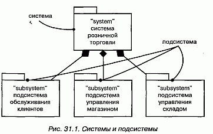
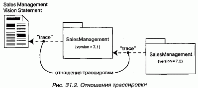
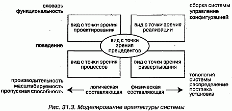

http://bourabai.kz/dbt/uml/ch31.htm

ЧАСТЬ VI - Архитектурное моделирование
# Глава 31. Системы и модели
* Введение
* Термины и понятия
    * Системы и подсистемы
    * Модели и представления
    * Трассировка
* Типичные приемы моделирования
    * Архитектура системы
    * Системы систем
* Советы

UML - это графический язык для визуализации, специфицирования, конструирования и документирования артефактов программной системы. Его используют для того, чтобы моделировать системы. Модель - это упрощение реальности, абстракция, создаваемая, чтобы лучше понять систему. Система, зачастую разложенная на ряд подсистем, - это множество элементов, организованных некоторым образом для выполнения определенной цели. Система описывается набором моделей, по возможности рассматривающих ее с различных точек зрения. Важными составными частями модели являются такие сущности, как классы, интерфейсы, компоненты и узлы. В UML модели применяются для организации подобных абстракций системы. По мере возрастания сложности обнаруживается, что сущность, на одном уровне абстракции представлявшаяся как система, на другом - более высоком - оказывается лишь подсистемой. В UML можно моделировать системы и подсистемы как единое целое и тем самым органично решать проблему масштабирования.

Хорошо структурированные модели помогают визуализировать, специфицировать, конструировать и документировать систему под разными (но вместе с тем взаимосвязанными) углами зрения. Хорошо структурированные системы функционально, логически и физически связаны, но при этом составлены из мало зависящих друг от друга подсистем.

#### Рис 31-1

## Термины и понятия
Система (System), возможно разложенная на ряд подсистем, - это множество элементов, организованных некоторым образом для выполнения определенной цели. Она описывается набором моделей, зачастую с различных точек зрения. Подсистема (Subsystem) - это объединение элементов, ряд которых составляет спецификацию поведения, предложенного другими ее элементами. Система и подсистема изображаются в виде пиктограммы стереотипного пакета. Модель (Model) - это упрощение реальности, абстракция, создаваемая для лучшего восприятия системы. Вид, или представление (View), - это модель, рассматриваемая под определенным углом зрения: в ней отражены одни сущности и опущены другие, которые с данной точки зрения не представляют интереса.

### Системы и подсистемы
Система, собственно, и есть та сущность, которую вы разрабатываете и для которой строите модели. Система охватывает все артефакты, составляющие эту сущность, включая модели и элементы этих моделей, такие как классы (см. главы 4 и 9), интерфейсы, компоненты, узлы и связи между ними. Все, что необходимо для визуализации, специфицирования, конструирования и документирования системы, является ее частью, а все, что для этой цели не требуется, лежит за пределами системы.

В UML система изображается в виде стереотипного (см. главу 6) пакета (см. главу 12), как показано на рис. 31.1. Являясь стереотипным пакетом, она владеет некоторыми элементами. Если заглянуть внутрь системы, то можно увидеть все ее модели и отдельные элементы (в том числе и диаграммы), зачастую разложенные на более мелкие подсистемы. Являясь классификатором, система иногда имеет экземпляры (может существовать несколько систем, развернутых в разных точках), атрибуты и операции (внешние по отношению к системе актеры способны воздействовать на систему в целом), прецеденты (см. главу 16), автоматы (см. главу 21) и кооперации (см. главу 27); все они могут принимать участие в специфицировании поведения системы. В ряде случаев она обладает даже интерфейсами, что оказывается важным при конструировании системы систем.

Подсистемы - это образования, которые используются для декомпозиции сложной системы на более простые, слабо зависящие друг от друга составляющие. То, что на одном уровне абстракции выглядит системой, на другом - более высоком - может рассматриваться как подсистема.

В UML подсистема изображается в виде пиктограммы стереотипного пакета (см. рис. 31.1). Семантически подсистема - это одновременно и разновидность пакета, и разновидность классификатора.

Основное отношение между системами и подсистемами - это агрегирование (см. главы 5 и 10). Система (целое) может состоять из нуля или более подсистем (частей). Но между системами и подсистемами допускается существование отношения обобщения. С его помощью можно моделировать семейства систем и подсистем, ряд которых представляет общий случай, а другие являют собой специализацию для конкретных условий.

> Примечание: Система - это сущность самого высокого уровня в данном контексте; составляющие ее подсистемы разбивают систему на непересекающиеся части.

### Модели и представления
Модель - это упрощение реального мира; реальность в ней описывается в контексте моделируемой системы. Проще говоря, модель - это абстракция системы.

В то время как подсистема представляет собой разбиение множества элементов большей системы на независимые части, модель - это разбиение множества абстракций, используемых для визуализации, специфицирования, конструирования и документирования этой системы. Различие тонкое, но важное. Вы раскладываете систему на подсистемы, чтобы их можно было разрабатывать и развертывать в некоторой степени независимо друг от друга. Абстракции же системы или подсистемы вы разбиваете на модели, дабы лучше понять то, что собираетесь разрабатывать или развертывать. Сложная система, например самолет, состоит из многих частей (каркас, реактивные двигатели, авиационная электроника, подсистема обслуживания пассажиров), причем эти подсистемы и система в целом могут моделироваться с разных точек зрения (в частности, с точки зрения конструкции, динамики, электросистемы, моделей отопления и кондиционирования).

Модель - это разновидность пакета (см. главу 12). Явно моделировать ее приходится не так уж часто, поэтому специального графического символа для моделей в UML не предусмотрено. Однако инструментальные средства должны каким-то образом манипулировать моделями; обычно они используют для представления моделей нотацию пакетов.

Будучи пакетом, модель владеет некоторыми элементами. Модели, ассоциированные с системой или подсистемой, образуют исчерпывающее разбиение ее элементов. Это означает, что каждый элемент принадлежит одному и только одному пакету. Как правило, артефакты системы или подсистемы организуются в несколько неперекрывающихся моделей. Все возможные модели охватываются пятью представлениями, или видами архитектуры программного обеспечения, описанными в главе 2 данной книги.

Модель (к примеру, процесса) может содержать так много артефактов - скажем, активных классов, отношений и взаимодействий, - что в большой системе всю их совокупность нельзя охватить сразу. Вид системной архитектуры можно представлять себе как одну из проекций модели. Для каждой модели предусмотрен ряд диаграмм (см. главу 7), с помощью которых удобно обозревать принадлежащие ей сущности. Представление охватывает подмножество сущностей, входящих в состав модели. Границы моделей представления обычно пересекать не могут. В следующем разделе будет показано, что между моделями нет прямых отношений, хотя между элементами, содержащимися в различных моделях, могут существовать отношения трассировки.

> Примечание: UML не диктует вам, какими именно моделями следует пользоваться для визуализации, специфицирования, конструирования и документирования системы, хотя Рациональный Унифицированный Процесс предлагает некоторое множество разумных моделей, проверенное на практике.

### Трассировка
Специфицирование отношений (см. главы 5 и 10) между такими элементами, как классы, интерфейсы, компоненты и узлы, - это важная структурная составляющая модели. Для управления артефактами процесса разработки сложных систем, многие из которых существуют более чем в одной версии, большую роль играет специфицирование отношений между такими элементами, как документы, диаграммы и пакеты, присутствующими в разных моделях.

В UML концептуальные связи между элементами, существующими в различных моделях, можно моделировать с помощью отношения трассировки (Trace relationship). Трассировку нельзя применять к элементам в рамках одной модели. Трассировка представляется в виде стереотипной (см. главу 6) зависимости (см. главу 5). Часто можно не обращать внимания на направление такой зависимости, хотя обычно стрелка указывает на более ранний или более специфичный элемент, как показано на рис. 31.2. Чаще всего отношения трассировки используются, чтобы показать путь от требований к реализации, на котором лежат все промежуточные артефакты, а также для отслеживания версий.

#### Рис 31-2

> Примечание: Как правило, вместо явного изображения отношений трассировки вы будете пользоваться гиперссылками.

## Типичные приемы моделирования

### Архитектура системы
Наиболее распространенный случай применения систем и моделей - это организация элементов, используемых с целью визуализации, специфицирования, конструирования и документирования архитектуры системы (см. главу 1). При этом затрагиваются практически все артефакты, встречающиеся в проекте разработки программного обеспечения. Моделируя системную архитектуру, вы сводите воедино решения, принятые относительно требований к системе, ее логических и физических элементов. Моделируются структурные и поведенческие аспекты системы, образцы (или паттерны), формирующие ее различные представления. Наконец, следует обратить внимание на стыковку подсистем и трассировку решений, начиная от формулировки требований до этапа развертывания.

Моделирование архитектуры системы производится так:

1. Идентифицируйте виды, которые вы будете использовать для представления архитектуры (см. главу 2). Чаще всего это виды с точки зрения прецедентов, процессов, реализации и развертывания, как показано на рис. 31.3.
2. Специфицируйте контекст системы, включая и окружающие ее актеры.
3. При необходимости разложите систему на элементарные подсистемы.

#### Рис 31-3

При моделировании системы в целом и ее подсистем выполняются следующие действия:

1. Специфицируйте вид системы с точки зрения вариантов использования или прецедентов, которые описывают поведение системы таким, каким оно представляется конечным пользователям, аналитикам и тестировщикам. Для моделирования статических аспектов примените диаграммы (см. главу 7) прецедентов, а для моделирования динамических - диаграммы взаимодействия, состояний и деятельности.
2. Специфицируйте вид системы с точки зрения проектирования, куда входят классы, интерфейсы и кооперации, формирующие словарь предметной области и предлагаемого решения. Для моделирования статических аспектов примените диаграммы классов и объектов, а для моделирования динамических - диаграммы последовательностей, состояний и деятельности.
3. Специфицируйте вид системы с точки зрения процессов, куда входят нити и процессы, формирующие механизмы параллельности и синхронизации в системе. Используйте те же диаграммы, что и для вида с позиции проектирования, но основное внимание уделите активным классам и объектам, которыми представлены процессы и нити.
4. Специфицируйте вид системы с точки зрения реализации, куда входят компоненты, используемые для сборки и выпуска готовой физической системы. Для моделирования статических аспектов используйте диаграммы компонентов, для моделирования динамических - диаграммы взаимодействия, состояний и деятельности.
5. Специфицируйте вид системы с точки зрения развертывания, куда входят узлы, формирующие топологию аппаратных средств, на которых выполняется система. Для моделирования статических аспектов применяются диаграммы развертывания, для моделирования динамических - диаграммы взаимодействия, состояний и деятельности.
6. Смоделируйте архитектурные образцы (паттерны) и образцы проектирования с помощью коопераций.

Необходимо понимать, что системная архитектура не рождается в ходе единичного акта творения. Напротив, хорошо структурированный процесс применения UML подразумевает последовательное уточнение архитектуры на основе анализа прецедентов, итеративное и инкрементное (Рациональный Унифицированный Процесс обсуждается в главе 2).

Если не брать в расчет простейшие системы, вам необходимо управлять версиями системных артефактов. Для представления решений о версиях каждого элемента можно воспользоваться механизмами расширения UML (см. главу 6), в частности помеченными значениями.

### Системы систем

о, что на одном уровне абстракции выглядит как система, на другом, более высоком, представляется подсистемой. Аналогичным образом то, что на одном уровне является подсистемой, вполне может рассматриваться как полноценная система группой разработчиков, ответственных за ее создание.

Такая иерархия наблюдается во всех сложных системах. По мере возрастания сложности систем вы встанете перед необходимостью ее декомпозиции на более простые подсистемы, каждую из которых можно разрабатывать отдельно, а затем постепенно объединять их. Разработка подсистемы выглядит в точности так же, как разработка всей системы.

Моделирование системы или подсистемы осуществляется следующим образом:

1. Идентифицируйте основные функциональные составляющие системы, которые можно разрабатывать, выпускать и развертывать до некоторой степени независимо. На результаты этого разбиения системы часто влияют технические, политические и юридические факторы.
2. Для каждой подсистемы специфицируйте ее контекст, так же как это делается для системы в целом (при этом в число актеров, окружающих подсистему, включаются все соседние подсистемы, поэтому необходимо проектировать их совместную работу).
3. Смоделируйте архитектуру каждой подсистемы так же, как это делается для всей системы.

## Советы
Важно выбрать правильное множество моделей для визуализации, специфицирования, конструирования и документирования системы. Хорошо структурированная модель:

* дает упрощенное представление реальности с одной относительно независимой точки зрения;
* самодостаточна, то есть не требует для понимания ее семантики никакой дополнительной информации;
* слабо связана с другими моделями посредством отношений трассировки;
* коллективно (совместно с другими смежными моделями) дает полное представление обо всех артефактах системы.

Столь же важно бывает представить сложную систему в виде декомпозиции хорошо структурированных подсистем. Хорошо структурированная система:

* функционально, логически и физически связна;
* может быть разложена на почти независимые подсистемы, которые сами являются системами на более низком уровне абстракции;
* может быть визуализирована, специфицирована, сконструирована и документирована в виде набора взаимосвязанных, неперекрывающихся моделей.

Для моделей в UML не предусмотрено специального графического представления (за исключением пиктограмм стереотипных пакетов), хотя инструментальные средства обычно изображают в виде пакетов, каждому из которых соответствует разбиение элементов системы с определенной точки зрения.

При изображении системы или подсистемы в UML:

* используйте каждую из них как начальную точку для всех артефактов, ассоциированных с ней;
* показывайте только основные виды агрегирования между системой и ее подсистемами; выносите детали связей между ними на диаграммы более низкого уровня.

