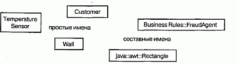
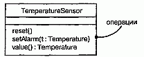
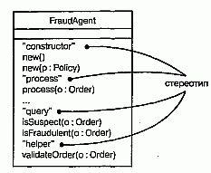
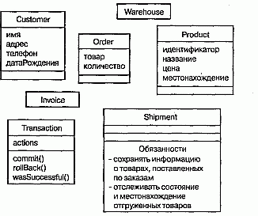
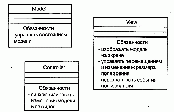
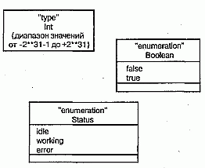

http://bourabai.kz/dbt/uml/ch4.htm

Часть II - Основы структурного моделирования
# Глава 4. Классы
* Введение
* Термины и понятия
  * Имена
  * Атрибуты
  * Операции
  * Организация атрибутов и операций
  * Обязанности
  * Другие свойства
* Типичные приемы моделирования
  * Словарь системы
  * Распределение обязанностей в системе
  * Непрограммные сущности
  * Примитивные типы
* Советы

Классы - это самые важные строительные блоки любой объектно-ориентированной системы. Они представляют собой описание совокупности объектов с общими атрибутами, операциями, отношениями и семантикой. Класс реализует один или несколько интерфейсов.

Классы используются для составления словаря разрабатываемой системы. Это могут быть абстракции, являющиеся частью предметной области, либо классы, на которые опирается реализация. С их помощью описывают программные, аппаратные или чисто концептуальные сущности. (Более сложные аспекты классов рассматриваются в главе 9.)

Хорошо структурированные классы характеризуются четкими границами и помогают формировать сбалансированное распределение обязанностей в системе.

## Введение
Моделирование системы предполагает идентификацию сущностей, важных стой или иной точки зрения. Эти сущности составляют словарь моделируемой системы. Например, если вы строите дом, то для вас как домовладельца будут иметь значение стены, двери, окна, встроенные шкафы и освещение. Каждая из названных сущностей отличается от других и характеризуется собственным набором свойств. У стен есть высота и ширина, они твердые и сплошные. У дверей также есть высота и ширина, они тоже сплошные, но, кроме того, снабжены особым механизмом, позволяющим им открываться в одну сторону. Окна похожи на двери, поскольку представляют собой проемы в стенах, но в остальном свойства указанных сущностей различаются. Окна обычно (хотя и не всегда) проектируют так, чтобы через них можно было смотреть, но не проходить.

Стены, двери и окна редко существуют сами по себе, поэтому необходимо решить, как они будут стыковаться друг с другом. Какие сущности вы выберете и какие отношения между ними решите установить, очевидно, определяется в зависимости от того, как вы собираетесь использовать комнаты в доме, как будете перемещаться между ними, а также от общего стиля и обстановки, которые входят в ваш замысел.

Строителей, обслуживающий персонал и жильцов интересуют разные вещи. Водопроводчики обратят внимание на трубы, краны и вентиляционные отверстия. Вас как домовладельца это особенно не касается, если не считать случаев, когда указанные элементы пересекаются с теми, которые попадают в ваше поле зрения, - вас волнует, например, где труба вмонтирована в пол и в каком месте крыши открывается вентиляция

В языке UML все сущности подобного рода моделируются как классы. Класс - это абстракция сущностей, являющихся частью вашего словаря. Класс представляет не индивидуальный объект, а целую их совокупность (см. главу 13). Так, умозрительно вы можете считать, что "стена" - это класс объектов с некоторыми общими свойствами, такими как высота, длина, толщина, несущая это стена или нет, и т.д. При этом конкретные стены будут рассматриваться как отдельные экземпляры класса "стена", одним из которых является, например, "стена в юго-западной части моего кабинета".

Многие языки программирования непосредственно поддерживают концепцию классов. И это замечательно, поскольку в таком случае создаваемые вами абстракции могут быть непосредственно отображены в конструкциях языка программирования, даже если речь идет об абстракциях непрограммных сущностей типа "покупатель", "торговля" или "разговор".

Графическое изображение класса в UML показано на рис. 4.1. Такое обозначение позволяет визуализировать абстракцию независимо от конкретного языка программирования и подчеркнуть ее наиболее важные характеристики: имя, атрибуты и операции.

#### Рис. 4.1 Классы

## Термины и понятия
Классом (Class) называется описание совокупности объектов с общими атрибутами, операциями, отношениями и семантикой. Графически класс изображается в виде прямоугольника.

### Имена
У каждого класса должно быть имя, отличающее его от других классов. Имя класса - это текстовая строка. Взятое само по себе, оно называется простым именем; к составному имени спереди добавлено имя пакета, куда входит класс. Имя класса в объемлющем пакете должно быть уникальным (см. главу 12). При графическом изображении класса показывается только его имя, как на рис. 4.2.

#### Рис. 4.2 Простые и составные имена

> Примечание: Имя класса может состоять из любого числа букв, цифр и ряда знаков препинания (за исключением таких, например, как двоеточие, которое применяется для отделения имени класса от имени объемлющего пакета). Имя может занимать несколько строк. На практике для именования класса используют одно или несколько коротких существительных, взятых из словаря моделируемой системы. Обычно каждое слово в имени класса пишется с заглавной буквы, например: Customer (Клиент), Wall (Стена), TemperatureSensor (ДатчикТемпературы).

### Атрибуты
Атрибут - это именованное свойство класса, включающее описание множества значений, которые могут принимать экземпляры этого свойства. Класс может иметь любое число атрибутов или не иметь их вовсе. Атрибут представляет некоторое свойство моделируемой сущности, общее для всех объектов данного класса. Например, у любой стены есть высота, ширина и толщина; при моделировании клиентов можно задавать фамилию, адрес, номер телефона и дату рождения. Таким образом, атрибут является абстракцией данных объекта или его состояния. В каждый момент времени любой атрибут объекта, принадлежащего данному классу, обладает вполне определенным значением. (О том, как атрибуты связаны с семантикой агрегации, рассказано в главе 10.) Атрибуты представлены в разделе, который расположен под именем класса; при этом указываются только их имена (см. рис. 4.3).

#### Рис. 4.3 Атрибуты

> Примечание: Имя атрибута, как и имя класса, может быть произвольной текстовой строкой. На практике для именования атрибута используют одно или несколько коротких существительных, соответствующих некоторому свойству объемлющего класса. Каждое слово в имени атрибута, кроме самого первого, обычно пишется с заглавной буквы, например name или loadBearing.

При описании атрибута можно явным образом указывать его класс и начальное значение, принимаемое по умолчанию, как продемонстрировано на рис. 4.4.

#### Рис. 4.4 Атрибуты и их класс

О том, как специфицировать другие свойства атрибута, например пометить его "только для чтения" или объявить общим для всех объектов класса, рассказывается в главе 9.

### Операции
Операцией называется реализация услуги, которую можно запросить у любого объекта класса для воздействия на поведение. Иными словами, операция - это абстракция того, что позволено делать с объектом. У всех объектов класса имеется общий набор операций. Класс может содержать любое число операций или не содержать их вовсе. Например, для всех объектов класса Rectangle (Прямоугольник) из библиотеки для работы с окнами, содержащейся в пакете awt языка Java, определены операции перемещения, изменения размера и опроса значений свойств. Часто (хотя не всегда) обращение к операции объекта изменяет его состояние или его данные. Операции класса изображаются в разделе, расположенном ниже раздела с атрибутами. При этом можно ограничиться только именами, как показано на

Более детальная спецификация выполнения операции осуществляется с помощью примечаний (см. главу 6) и диаграмм деятельности (см. главу 19).

#### Рис. 4.5 Операции

> Примечание: Имя операции, как и имя класса, может быть произвольной текстовой строкой. На практике для именования операций используют короткий глагол или глагольный оборот, соответствующий определенному поведению объемлющего класса. Каждое слово в имени операции, кроме самого первого, обычно пишут с заглавной буквы, например move или isEmpty.

Операцию можно описать более подробно, указав ее сигнатуру, в которую входят имена и типы всех параметров, их значения, принятые по умолчанию, а применительно к функциям - тип возвращаемого значения, как показано на рис. 4.6. (О том, как специфицировать другие свойства операции, например пометить ее как полиморфную или константную либо задать ее видимость, рассказывается в главе 9.)

#### Рис. 4.6 Операции и их сигнатуры

### Организация атрибутов и операций
При изображении класса необязательно сразу показывать все его атрибуты и операции. Как правило, это попросту невозможно - их чересчур много для одного рисунка, - да и не требуется (поскольку для данного представления системы лишь небольшое подмножество атрибутов и операций имеет значение). По этим причинам класс обычно сворачивают, то есть изображают лишь некоторые из имеющихся атрибутов и операций, а то и вовсе опускают их. Таким образом, пустой раздел в соответствующем месте прямоугольника может означать не отсутствие атрибутов или операций, а только то, что их не сочли нужным изобразить. Явным образом наличие дополнительных атрибутов или операций можно обозначить, поставив в конце списка многоточие.

Для лучшей организации списков атрибутов и операций можно снабдить каждую группу дополнительным описанием, воспользовавшись стереотипами (см. главу 6), как показано на рис. 4.7.

#### Рис. 4.7 Использование стереотипов для описания свойств класса

На рисунке представлена кооперация нескольких объектов, включая один экземпляр класса HelloWorld. Другие объекты являются частью рабочей среды Java и в основном остаются на заднем плане создаваемых вами апплетов. В UML экземпляры (см. главу 11) изображаются в точности как классы, но, в отличие от последних, с подчеркнутыми именами. Первые три объекта на диаграмме являются анонимными, то есть не имеют уникального имени. Объекту HelloWorld принадлежит имя (target), известное объекту ComponentPeer.

Порядок событий можно моделировать с помощью диаграммы последовательностей (см. главу 18), представленной на рис. 3.5. Последовательность начинается с запуска объекта Thread, который вызывает операцию run объекта Toolkit. Объект Toolkit обращается затем к одной из своих собственных операций (callbackLoop), которая, в свою очередь, вызывает операцию handleExpose объекта ComponentPeer. Только после этого ComponentPeer обращается к операции paint целевого объекта. ComponentPeer предполагает, что целевой объект является экземпляром класса Component, но в данном случае мы фактически имеем дело с его потомком (а именно HelloWorld), так что полиморфно вызывается операция paint класса HelloWorld.

### Обязанности
Обязанности (Responsibilities) класса - это своего рода контракт, которому он должен подчиняться. Определяя класс, вы постулируете, что все его объекты имеют однотипное состояние и ведут себя одинаково. Выражаясь абстрактно, соответствующие атрибуты и операции как раз и являются теми свойствами, посредством которых выполняются обязанности класса. Например, класс Wall (Стена) отвечает за информацию о высоте, ширине и толщине. Класс FraudAgent (Агент ПоПредотвращениюМошенничества), который встречается в приложениях по обработке кредитных карточек, отвечает за оценку платежных требований - законные ли они, подозрительные или подложные. Класс TemperatureSensor (ДатчикТемпературы) отвечает за измерение температуры и подачу сигнала тревоги в случае превышения заданного уровня. (Обязанности класса - это пример определенного стереотипа, см. главу 6.)

Моделирование классов лучше всего начинать с определения обязанностей сущностей, которые входят в словарь системы (см. главу 9). На этом этапе особенно полезны будут такие методики, как применение CRC-карточек и анализ прецедентов. В принципе число обязанностей класса может быть произвольным, но на практике хорошо структурированный класс имеет по меньшей мере одну обязанность; с другой стороны, их не должно быть и слишком много. При уточнении модели обязанности класса преобразуются в совокупность атрибутов и операций, которые должны наилучшим образом обеспечить их выполнение.

Графически обязанности изображают в особом разделе в нижней части пиктограммы класса (см. рис. 4.8). Их можно указать также в примечании; подробно о примечаниях рассказывается в главе 6.

#### Рис. 4.8 Обязанности

> Примечание: Обязанности оформляются в виде произвольно составленного текста. Как правило, каждая обязанность излагается в одном предложении или, на крайний случай, в коротком абзаце

### Другие свойства
При создании абстракций вам чаще всего придется иметь дело с атрибутами, операциями и обязанностями. Для большинства моделей этого вполне достаточно, чтобы описать важнейшие черты семантики классов. Но иногда приходится визуализировать или специфицировать и другие особенности, как то: видимость отдельных атрибутов и операций, специфические для конкретного языка программирования свойства операции (например, является ли она полиморфной или константной) или даже исключения, которые объекты класса могут возбуждать или обрабатывать. Эти и многие другие особенности тоже можно выразить в UML, но в таком случае требуется обращение к более развитым возможностям языка (см. главу 9).

Занимаясь построением моделей, вы довольно быстро обнаружите, что почти все создаваемые абстракции являются разновидностью классов. Иногда бывает необходимо отделить реализацию класса от его спецификации, что в UML может быть выражено с помощью интерфейсов (см. главу 11).

Переходя к разработке более сложных моделей, вы всякий раз будете сталкиваться с теми же классами (которые представляют, например, параллельные процессы и потоки или физические сущности, в частности апплеты, компоненты JavaBeans и СОМ+, файлы, Web-страницы, аппаратные средства). Поскольку подобные классы очень распространены и представляют важные архитектурные абстракции, в UML имеются такие элементы, как активные классы (описывающие процессы и нити, см. главу 22), компоненты (соответствующие физическим программным компонентам, см. главу 24) и узлы (представляющие аппаратные средства, см. главу 26).

Наконец, классы редко существуют сами по себе. При построении моделей следует обращать внимание на группы взаимодействующих между собой классов. В языке UML такие сообщества принято называть кооперациями и изображать на диаграммах классов (см. главу 8).

## Типичные приемы моделирования

### Словарь системы

С помощью классов обычно моделируют абстракции, извлеченные из решаемой задачи или технологии, применяемой для ее решения. Такие абстракции являются составной частью словаря вашей системы, то есть представляют сущности, важные для пользователей и разработчиков.

Для пользователей не составляет труда идентифицировать большую часть абстракций, поскольку они созданы на основе тех сущностей, которые уже использовались для описания системы. Чтобы помочь пользователям выявить эти абстракций, поскольку они созданы на основе тех сущностей, которые уже использовались для описания системы.Чтобы помочь пользоввателям выявить эти абстракции (?????????) и анализ прецедентов (см. главу 16). Для разработчиков же абстракции являются обычно просто элементами технологии, которая была задействована при решении задачи.

Моделирование словаря системы включает в себя следующие этапы:

1. Определите, какие элементы пользователи и разработчики применяют для описания задачи или ее решения. Для отыскания правильных абстракций используйте CRC-карточки и анализ прецедентов.
2. Выявите для каждой абстракции соответствующее ей множество обязанно стей. Проследите, чтобы каждый класс был четко определен, а распределе ние обязанностей между ними хорошо сбалансировано.
3. Разработайте атрибуты и операции, необходимые для выполнения класса ми своих обязанностей.

На рис. 4.9 показан набор классов для системы розничной торговли: Customer (Клиент), Order (Заказ) и Product (Товар). Представлено несколько соотнесенных с ними абстракций, взятых из словаря проблемной области: Shipment (Отгрузка), Invoice (Накладная) и Warehouse (Склад). Одна абстракция, а именно Transaction (Транзакция), применяемая к заказам и отгрузкам, связана с технологией решения задачи.

#### Рис. 4.9 Моделирование словаря системы

По мере того как вы будете строить все более сложные модели, обнаружится, что многие классы естественным образом объединяются в концептуально и семантически родственные группы. В языке UML для моделирования таких групп классов используются пакеты (см. главу 12).

Как правило, модели не бывают статичными. Напротив, большинство абстракций из словаря системы динамически взаимодействует друг с другом. В UML существует несколько способов моделирования такого динамического поведения (см. части 4 и 5).

### Распределение обязанностей в системе
Если в ваш проект входит нечто большее, нежели пара несложных классов, предстоит позаботиться о cбалансированном распределении обязанностей. Это значит, что надо избегать слишком больших или, наоборот, чересчур маленьких классов. Каждый класс должен хорошо делать что-то одно. Если ваши абстрактные классы слишком велики, то модель будет трудно модифицировать и повторно использовать. Если же они слишком малы, то придется иметь дело с таким большим количеством абстракций, что ни понять, ни управлять ими будет невозможно. Язык UML способен помочь в визуализации и специфицировании баланса обязанностей.

Моделирование распределения обязанностей в системе включает в себя следующие этапы:

1. Идентифицируйте совокупность классов, совместно отвечающих за некоторое поведение.
2. Определите обязанности каждого класса.
3. Взгляните на полученные классы как на единое целое и разбейте те из них, у которых слишком много обязанностей, на меньшие - и наоборот, крошечные классы с элементарными обязанностями объедините в более крупные.
4. Перераспределите обязанности так, чтобы каждая абстракция стала в разумной степени автономной.
5. Рассмотрите, как классы кооперируются друг с другом (см. главу 27), и перераспределите обязанности с таким расчетом, чтобы ни один класс в рамках кооперации не делал слишком много или слишком мало.

В качестве примера на рис. 4.10 показано распределение обязанностей между классами Model (Модель), View (Вид) и Controller (Контроллер) из совокупности классов языка Smalltalk. Как видите, их совместная работа организована так, что ни одному из классов не приходится делать слишком мало или слишком много. (Это множество классов формирует образец проектирования - см. главу 28.)

#### Рис. 4.10 Моделирование распределения обязанностей в системе

### Непрограммные сущности
Моделируемые вами сущности могут не иметь аналогов в программном обеспечении. Например, частью рабочего процесса в модели предприятия розничной торговли могут быть люди, отправляющие накладные, и роботы, которые автоматически упаковывают заказанные товары для доставки со склада по месту назначения. В вашем приложении совсем не обязательно окажутся компоненты для представления этих сущностей (в отличие от сущности "клиент", для хранения информации о которой, собственно, и создается система).

Моделирование непрограммных сущностей производится следующим образом:

Смоделируйте сущности, абстрагируемые в виде классов.
Если вы хотите отличить эти сущности от предопределенных строительных блоков UML, создайте с помощью стереотипов (см. главу 6) новый строи тельный блок, опишите его семантику и сопоставьте с ним ясный визуальный образ.
Если моделируемый элемент является аппаратным средством с собствен ным программным обеспечением, рассмотрите возможность смоделировать его в виде узла (см. главу 26), которая позволила бы в дальнейшем рас ширить его структуру.
> Примечание: UML предназначен в первую очередь для моделирования программных систем, однако в сочетании с текстовым языком моделирования аппаратных средств, таким как VHDL, его вполне допустимо использовать и для моделирования аппаратных систем.

Как видно из рис. 4.11, абстрагирование людей (AccountsReceivableAgent -АгентПоДебиторскойЗадолженности) и аппаратуры (Robot) в виде классов вполне естественно, поскольку они представляют собой множества объектов с общей структурой и поведением. Сущности, внешние по отношению к системе, часто моделируются как актеры (см. главу 16).

#### Рис. 4.11 Моделирование непрограммных сущностей

### Примитивные типы
Другой крайностью являются сущности, взятые непосредственно из языка программирования, используемого при решении задачи. Обычно к таким абстракциям относят примитивные типы, например целые, символы, строки и даже перечислимые типы, которые вы создаете сами (см. главу 11).

Моделирование примитивных типов производится следующим образом:

1. Смоделируйте сущность, абстрагируемую вами в виде типа или перечисления. Она изображается с помощью нотации класса с подходящим стереотипом.
2. Если требуется задать связанный с типом диапазон значений, воспользуйтесь ограничениями (см. главу 6).

Рис. 4.12 показывает, что такие сущности можно моделировать в UML как типы (см. главу 11) или перечисления, которые изображаются точно так же, как классы, но с явно указанным стереотипом. Сущности, подобные целым числам (представленные классом Int), моделируются как типы, а с помощью ограничений вы можете явно указать диапазон принимаемых значений. Перечислимые типы (скажем, Boolean и Status) допустимо моделировать как перечисления, причем их конкретные значения становятся атрибутами.

#### Рис. 4.12 Моделирование примитивных типов

> Примечание: Такие языки, как С и C++, позволяют определить эквивалентные целые значения для перечислений. Подобное моделирование возможно и в UML, если указать для атрибута, обозначающего перечисление, константное начальное значение по умолчанию.

## Советы
При моделировании классов в UML всегда помните, что каждому классу должна соответствовать некоторая реальная сущность или концептуальная абстракция из области, с которой имеет дело пользователь или разработчик. Хорошо структурированный класс обладает следующими свойствами:

* является четко очерченной абстракцией некоторого понятия из словаря проблемной области или области решения;
* содержит небольшой, точно определенный набор обязанностей и выполняет каждую из них;
* поддерживает четкое разделение спецификаций абстракции и ее реализации;
* понятен и прост, но в то же время допускает расширение и адаптацию к новым задачам.

Изображая класс в UML, придерживайтесь следующих правил:

* показывайте только те его свойства, которые важны для понимания абстракции в данном контексте;
* разделяйте длинные списки атрибутов и операций на группы в соответствии с их категориями;
* показывайте взаимосвязанные классы на одной и той же диаграмме.

