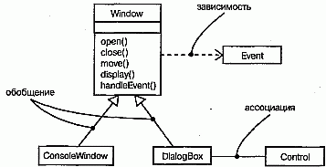
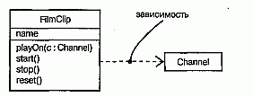
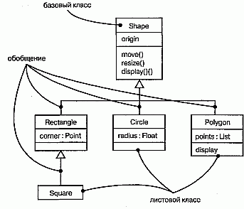
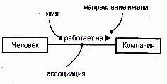
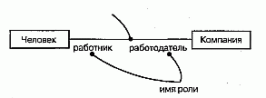
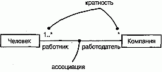
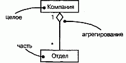
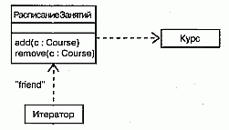
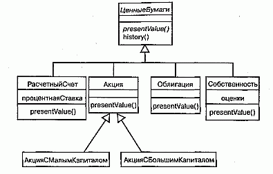
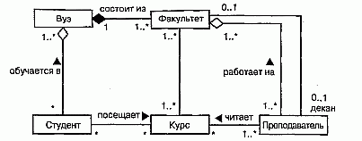

http://bourabai.kz/dbt/uml/ch5.htm

Часть II - Основы структурного моделирования
# Глава 5. Отношения

* Введение
* Термины и понятия
    * Зависимости
    * Обобщения
    * Ассоциации
    * Другие свойства
* Типичные приемы моделирования
    * Простые зависимости
    * Одиночное наследование
    * Структурные отношения
* Советы

При построении абстракций вы довольно скоро обнаружите, что классы редко существуют автономно. Как правило, они разными способами взаимодействуют между собой. Это значит, что, моделируя систему, вы должны будете не только идентифицировать сущности, составляющие ее словарь, но и описать, как они соотносятся друг с другом.

Существует три вида отношений, особенно важных для объектно-ориентированного моделирования:

* зависимости, которые описывают существующие между классами отношения использования (включая отношения уточнения, трассировки и связывания);
* обобщения, связывающие обобщенные классы со специализированными;
* ассоциации, представляющие структурные отношения между объектами.

Каждый из этих типов позволяет по-разному комбинировать абстракции (подробнее об отношениях рассказано в главе 10).

Построение сети отношений похоже на создание сбалансированного распределения обязанностей между классами. Стоит слегка перестараться - и вы получите запутанный клубок отношений; в результате модель окажется абсолютно непонятной. С другой стороны, чрезмерное упрощение приведет к тому, что останется нераскрытым богатство связей между различными элементами системы.

## Введение
Если вы строите дом, то такие сущности, как стены, окна, двери, встроенные шкафы, потолки и осветительные приборы, станут частью вашего словаря. Но ни одна из них не существует сама по себе. Стены соединены с другими стенами. Окна и двери располагаются в стенах, обеспечивая проходы для людей и пропуская свет. Встроенные шкафы и осветительные приборы физически связаны со стенами и потолком. Группируя все эти объекты, вы создаете сущности более высокого уровня, например комнаты.

Между сущностями можно обнаружить не только структурные отношения. В вашем доме наверняка есть окна, но, вполне возможно, разного типа. Это могут быть большие неоткрывающиеся окна-"фонари" или маленькие кухонные окошки. Некоторые открываются вверх и вниз, другие раздвигаются в стороны. Рама может быть одинарная или двойная. Независимо от перечисленных различий, всем этим видам присуще некоторое общее свойство "оконности": каждое окно встроено в стенной проем, чтобы пропускать свет, воздух, а иногда и людей

На языке UML способы, которыми элементы связаны друг с другом, моделируются в виде отношений. В объектно-ориентированном моделировании выделяют три типа наиболее важных отношений: зависимости, обобщения и ассоциации.

Отношения зависимости - это отношения использования. Например, трубы отопления зависят от нагревателя, подогревающего воду, которая в них течет.

Отношения обобщения связывают общие классы со специализированными; здесь также применяются термины "субкласс/суперкласс" или "потомок/родитель". Например, "фонарь" - это окно с большой нераздвижной рамой, а патио -окно, раздвигающееся в стороны.

Отношения ассоциации - структурные взаимосвязи между объектами: комнаты состоят из стен, в которые могут быть встроены двери и окна; иногда через стены проходят трубы отопления.

Эти три типа отношений охватывают большую часть способов взаимодействия элементов и, что неудивительно, хорошо отображаются на способы связи объектов, принятые в объектно-ориентированных языках программирования. (Другие виды отношений, в частности реализация и уточнение, рассматриваются в главе 10.)

Для каждого из названных типов отношений язык UML предоставляет графическое изображение, как показано на рис. 5.1. Эта нотация позволяет визуализировать моделируемые отношения независимо от применяемого языка программирования, так чтобы подчеркнуть их наиболее важные составляющие: имя, связываемые сущности и свойства.

#### Рис. 5.1 Отношения

## Термины и понятия
Отношением (Relationship) называется связь между элементами. В объектно-ориентированном моделировании тремя самыми важными отношениями являются зависимости, обобщения и ассоциации. Графически отношение представлено линией, тип которой зависит от вида отношения.

### Зависимости

Зависимостью (Dependency) называют отношение использования, согласно которому изменение в спецификации одного элемента (например, класса Event) может повлиять на другой элемент, его использующий (в данном случае - класс Window), причем обратное не обязательно. Графически зависимость изображается пунктирной линией со стрелкой, направленной от данного элемента на тот, от которого он зависит. Используйте зависимости, когда хотите показать, что один элемент использует другой.

Чаще всего зависимости применяются при работе с классами, чтобы отразить в сигнатуре операции тот факт, что один класс использует другой в качестве аргумента (см. рис. 5.2). Это хороший пример отношений зависимости - изменение одного класса отразится на работе другого, так как используемый класс может теперь представлять иной интерфейс или поведение. В UML разрешается определять зависимости и между другими элементами, например примечаниями (см. главу 6) или пакетами (см. главу 12).

#### Рис. 5.2 Зависимости

> Примечание: У зависимости может быть собственное имя, хотя оно редко требуется - разве что в случае, когда модель содержит много зависимостей и вам нужно ссылаться на них или отличать их друг от друга. Чаще, однако, для различения зависимостей используют стереотипы (см. главу 6).

### Обобщения
Обобщение (Generalization) - это отношение между общей сущностью (суперклассом, или родителем) и ее конкретным воплощением (субклассом, или потомком). Обобщения иногда называют отношениями типа "является", имея в виду, что одна сущность (например, класс BayWindow) является частным выражением другой, более общей (скажем, класса Window). Обобщение означает, что объекты класса-потомка могут использоваться всюду, где встречаются объекты класса-родителя, но не наоборот. Другими словами, потомок может быть подставлен вместо родителя. При этом он наследует свойства родителя, в частности его атрибуты и операции. Часто, хотя и не всегда, у потомков есть и свои собственные атрибуты и операции, помимо тех, что существуют у родителя. Операция потомка с той же сигнатурой, что и у родителя, замещает операцию родителя; это свойство называют полиморфизмом (Polymorphism). Графически отношение обобщения изображается в виде линии с большой незакрашенной стрелкой, направленной на родителя, как показано на рис. 5.3. Применяйте обобщения, когда хотите показать отношения типа "родитель/потомок".

#### Рис. 5.3 Обобщение

Класс может иметь одного или нескольких родителей или не иметь их вовсе. Класс, у которого нет родителей, но есть потомки, называется базовым (base) или корневым (root), а тот, у которого нет потомков, - листовым (leaf). О классе, у которого есть только один родитель, говорят, что он использует одиночное наследование (Single inheritance); если родителей несколько, речь идет о множественном наследовании (Multiple inheritance).

Обобщение чаще всего используют между классами и интерфейсами, чтобы показать отношения наследования. В UML можно создавать отношения обобщения и между другими элементами, в частности пакетами (см. главу 12).

> Примечание: Обобщение может обладать именем, хотя это требуется редко -лишь тогда, когда в модели много обобщений и вам нужно ссылать-ся на них или отличать друг от друга.

### Ассоциации
Ассоциацией (Association) называется структурное отношение, показывающее, что объекты одного типа неким образом связаны с объектами другого типа. Если между двумя классами определена ассоциация, то можно перемещаться от объектов одного класса к объектам другого. Вполне допустимы случаи, когда оба конца ассоциации относятся к одному и тому же классу. Это означает, что с объектом некоторого класса позволительно связать другие объекты из того же класса. Ассоциация, связывающая два класса, называется бинарной. Можно, хотя это редко бывает необходимым, создавать ассоциации, связывающие сразу несколько классов; они называются n-арными. Графически ассоциация изображается в виде линии, соединяющей класс сам с собой или с другими классами. Используйте ассоциации, когда хотите показать структурные отношения. (Ассоциации и зависимости, в отличие от отношений обобщения, могут быть рефлексивными - см. главу 10.)

Помимо описанной базовой формы существует четыре дополнения, применимых к ассоциациям

Имя. Ассоциации может быть присвоено имя, описывающее природу отношения. Чтобы избежать возможных двусмысленностей в понимании имени, достаточно с помощью черного треугольника указать направление, в котором оно должно читаться, как показано на рис. 5.4. Не путайте направление чтения имени с навигацией по ассоциации (см. главу 10).

#### Рис. 5.4 Имена ассоциаций

> Примечание: Обычно имя ассоциации не указывается, если только вы не хотите явно задать для нее ролевые имена или в вашей модели настолько много ассоциаций, что возникает необходимость ссылаться на них и отличать друг от друга. Имя будет особенно полезным, если между одними и теми же классами существует несколько различных ассоциаций.

Роль. Класс, участвующий в ассоциации, играет в ней некоторую роль. По существу, это "лицо", которым класс, находящийся на одной стороне ассоциации, обращен к классу с другой ее стороны. Вы можете явно обозначить роль, которую класс играет в ассоциации. На рис. 5.5 показано, что класс Человек, играющий роль работника, ассоциирован с классом Компания, играющим роль работодателя. Роли тесно связаны с семантикой интерфейсов (см. главу 10).

#### Рис. 5.5 Роли

> Примечание: Один класс может играть в разных ассоциациях как одну и ту же роль, так и различные.

Кратность. Ассоциации отражают структурные отношения между объектами. Часто при моделировании бывает важно указать, сколько объектов может быть связано посредством одного экземпляра ассоциации (то есть одной связи, см. главу 15). Это число называется кратностью (Multiplicity) роли ассоциации и записывается либо как выражение, значением которого является диапазон значений, либо в явном виде, как показано на рис. 5.6. Указывая кратность на одном конце ассоциации, вы тем самым говорите, что на этом конце именно столько объектов должно соответствовать каждому объекту на противоположном конце. Кратность можно задать равной единице (1), можно указать диапазон: "ноль или единица" (0..1), "много" (0..*), "единица или больше" (1..*). Разрешается также указывать определенное число (например, 3).

#### Рис. 5.6 Кратность

> Примечание: С помощью списка можно задать и более сложные кратности, например 0 . . 1, 3..4, 6..*, что означает "любое число объектов, кроме 2 и 5".

Агрегирование. Простая ассоциация между двумя классами отражает структурное отношение между равноправными сущностями, когда оба класса находятся на одном концептуальном уровне и ни один не является более важным, чем другой. Но иногда приходится моделировать отношение типа "часть/целое", в котором один из классов имеет более высокий ранг (целое) и состоит из нескольких меньших по рангу (частей). Отношение такого типа называют агрегированием; оно причислено к отношениям типа "имеет" (с учетом того, что объект-целое имеет несколько объектов-частей). Агрегирование является частным случаем ассоциации и изображается в виде простой ассоциации с незакрашенным ромбом со стороны "целого", как показано на рис. 5.7. Существует много важных разновидностей этого отношения (см. главу 10).

#### Рис. 5.7 Агрегирование

> Примечание: Незакрашенный ромб отличает "целое" от "части"- - и только. Эта простая форма агрегирования является чисто концептуальной; она не влияет на результат навигации по ассоциации между целым и его частями и не подразумевает наличия между ними какой-либо зависимости по времени жизни.

### Другие свойства
В процессе разработки абстракций вам чаще всего придется использовать простые зависимости и обобщения, а также ассоциации с именами, кратностями и ролями. В большинстве случаев базовых форм этих трех отношений вам будет вполне достаточно для передачи важнейших черт семантики моделируемых взаимосвязей. Но иногда все же возникает необходимость визуализировать и специфицировать другие особенности, такие как композитное агрегирование, навигация, дискриминанты, классы-ассоциации, а также специальные виды зависимостей и обобщений. Эти и многие другие особенности можно выразить на языке UML, однако предстоит воспользоваться концепциями более высокого уровня сложности (см. главу 10).

Зависимости, обобщения и ассоциации являются статическими сущностями, определенными на уровне классов. В UML эти отношения обычно визуализируют в виде диаграмм классов (см. главу 8).

Приступая к моделированию на уровне объектов - особенно при работе с динамическими кооперациями объектов - вы встретите еще два вида отношений: связи (экземпляры ассоциаций, представляющие соединения между объектами, по которым могут передаваться сообщения, см. главу 15) и переходы (связи между состояниями в автомате, см. главу 21).

## Типичные приемы моделирования

### Простые зависимости

Самым распространенным видом отношения зависимости является соединение между классами, когда один класс использует другой в качестве параметра операции.

Для моделирования такого отношения изобразите зависимость, направленную от класса с операцией к классу, используемому в качестве ее параметра.

Например, на рис. 5.8 показано несколько классов, взятых из системы, управляющей распределением студентов и преподавателей на университетских курсах. Зависимость направлена от класса РасписаниеЗанятий к классу Курс, поскольку последний используется в операциях add и remove класса РасписаниеЗанятий.

#### Рис. 5.8 Отношения зависимости

Если вы приводите полную сигнатуру операции, как на этом рисунке, то зависимости показывать не обязательно, поскольку имя класса уже явно присутствует в сигнатуре. Иногда продемонстрировать зависимость все же имеет смысл, особенно если сигнатуры операций скрыты или в модели показаны другие отношения, в которых участвует используемый класс.

На рис. 5.8 представлена еще одна зависимость, не предполагающая участия классов, а скорее моделирующая обычную для языка C++ идиому. Стрелка, направленная от класса Итератор, свидетельствует о том, что он использует класс РасписаниеЗанятий, который, однако, об этом ничего не "знает". Зависимость помечена стереотипом friend, который говорит, что она представляет отношение дружественности, как в языке C++. (Другие стереотипы отношений рассматриваются в главе 10.)

### Одиночное наследование
Моделируя словарь системы, вам часто придется работать с классами, похожими на другие по структуре и поведению. В принципе их можно моделировать как различные, независимые друг от друга абстракции. Но лучше выделить одинаковые свойства и сформировать на их основе общие классы, которым наследуют специализированные.

Моделирование отношений наследования осуществляется в таком порядке:

1. Найдите атрибуты, операции и обязанности, общие для двух или более классов из данной совокупности
2. Вынесите эти элементы в некоторый общий класс (если надо, создайте новый, но следите, чтобы уровней не оказалось слишком много).
3. Отметьте в модели, что более специализированные классы наследуют более общим, включив отношение обобщения, направленное от каждого потомка к его родителю.

На рис. 5.9 вы видите несколько классов, взятых из приложения по организации работы трейдеров. Здесь показано отношение обобщения, которое от четырех классов - РасчетныйСчет, Акция, Облигация и Собственность - направлено к более общему классу ЦенныеБумаги. Он является родителем, а остальные -его потомками. Каждый специализированный класс - это частный случай класса ЦенныеБумаги. Обратите внимание, что в классе ЦенныеБумаги есть две операции - presentValue (текущаяСтоимость) и history (история). Это значит, что все его потомки наследуют данные операции, а заодно и все остальные атрибуты и операции родителя, которые могут не изображаться на рисунке.

#### Рис. 5.9 Отношения наследования

Имена ЦенныеБумаги и presentValue на рисунке намеренно выделены курсивом. Дело в том, что, создавая иерархию подобного рода, часто приходится сталкиваться с нелистовыми классами, которые неполны или для которых не может существовать объектов. Такие классы называются абстрактными (см. главу 9), и на языке UML их названия пишутся курсивом, как в приведенном примере. Данное соглашение применимо и к операциям (например, presentValue); оно означает, что у операции есть сигнатура, но в других отношениях она неполна и требует реализации на более низком уровне абстракции (см. главу 9). В нашем примере все четыре непосредственных потомка класса ЦенныеВумаги конкретны (то есть не абстрактны) и реализуют операцию presentValue.

Иерархия "обобщение/специализация" не обязательно ограничивается двумя уровнями. Как видно из рисунка, вполне допустимо существование более двух уровней наследования. АкцияСМалымКапиталом и АкцияСБолышимКапиталом - потомки класса Акция, который, в свою очередь, является потомком класса Цен-ныеБумаги. Последний является базовым классом, поскольку не имеет родителей. Классы же АкцияСМалымКапиталом и АкцияСБольшимКапиталом - листовые, поскольку не имеют потомков. Наконец, класс Акция имеет как родителей, так и потомков, а следовательно, не является ни листовым, ни базовым.

Хотя на данном рисунке это не продемонстрировано, можно создавать классы, имеющие более одного родителя. В таком случае речь идет о множественном наследовании, которое означает, что данный класс перенимает атрибуты, операции и ассоциации всех своих родителей (см. главу 10).

Разумеется, в графе наследования не допускаются циклы - класс не может быть собственным родителем.

### Структурные отношения
Отношения зависимости и обобщения применяются при моделировании классов, которые находятся на разных уровнях абстракции или имеют различную значимость. Что касается отношения зависимости, один класс зависит от другого, но тот может ничего не "знать" о наличии первого. Когда речь идет об отношении обобщения, класс-потомок наследует своему родителю, но сам родитель о нем не осведомлен. Другими словами, отношения зависимости и обобщения являются односторонними.

Ассоциации предполагают участие равноправных классов. Если между двумя классами установлена ассоциация, то каждый из них каким-то образом зависит от другого, и навигацию можно осуществлять в обоих направлениях. В то время как зависимость - это отношение использования, а обобщение - отношение "является", ассоциации определяют структурный путь, обусловливающий взаимодействие объектов данных классов. По умолчанию ассоциации являются двунаправленными, но вы можете оставить только одно направление (см. главу 10).

Моделирование структурных отношений производится следующим образом:

1. Определите ассоциацию для каждой пары классов, между объектами которых надо будет осуществлять навигацию. Это взгляд на ассоциации с точки зрения данных.
2. Если объекты одного класса должны будут взаимодействовать с объектами другого иначе, чем в качестве параметров операции, следует определить между этими классами ассоциацию. Это взгляд на ассоциации с точки зрения поведения.
3. Для каждой из определенных ассоциаций задайте кратность (особенно если она не равна *, то есть значению по умолчанию) и имена ролей (особенно если это помогает объяснить модель).
4. Если один из классов ассоциации структурно или организационно представляет собой целое в отношении классов на другом конце ассоциации, выглядящих как его части, пометьте такую ассоциацию как агрегирование.

Как узнать, когда объекты данного класса должны взаимодействовать с объектами другого класса? Для этого рекомендуется воспользоваться CRC-карточка-ми и анализом прецедентов (см. главу 16). Эти методы очень помогают при рассмотрении структурных и поведенческих вариантов функционирования системы. Если в результате обнаружится взаимодействие между классами, специфицируйте ассоциацию.

На рис. 5.10 изображены классы, взятые из вузовской информационной системы. В нижней части диаграммы находятся классы Студент, Курс и Преподаватель. Между классами Студент и Курс существует ассоциация, показывающая, что студенты посещают курсы. Каждый студент может посещать любое число курсов, и на каждый курс может приходить любое количество студентов.

#### Рис. 5.10 Структурные отношения

Аналогичным образом между классами Курс и Преподаватель определена ассоциация, показывающая, что преподаватель читает курс. Для каждого курса должен быть хотя бы один преподаватель, и каждый преподаватель может вести любое количество курсов (в том числе и ни одного).

Отношения между классом Вуз и классами Студент и Факультет слегка отличаются друг от друга, хотя оба являются отношениями агрегирования. В вузе может быть любое количество студентов (включая ноль), и каждый студент может обучаться в одном или нескольких вузах; вуз может состоять из одного или нескольких факультетов, но каждый факультет принадлежит одному и только одному вузу. Отношение между классами Вуз и Факультет называют композитным агрегированием (см. главу 10). В принципе можно было бы обойтись без отношений агрегирования и использовать простые ассоциации, определяя при этом Вуз как целое, а Студента и Факультет - как его части. Тем самым вы ясно показываете, какой из классов организационно стоит выше остальных. Так, вузы в какой-то степени определяются своими студентами и факультетами. В то же время студенты и факультеты вообще не могут существовать вне связи со своим вузом, и в какой-то мере он формирует их облик.

Видно также, что между классами Факультет и Преподаватель установлены две ассоциации. Одна из них показывает, что каждый преподаватель работает на одном или нескольких факультетах, и на каждом факультете должен быть по меньшей мере один преподаватель. Здесь мы имеем дело с агрегированием, так как организационно факультеты находятся на более высоком уровне вузовской структуры, чем преподаватели. Другая ассоциация показывает, что каждым факультетом управляет только один преподаватель - декан. Согласно данной модели, преподаватель может быть деканом только одного факультета, причем некоторые преподаватели не являются деканами.

> Примечание: Разрабатывая подобную модель, вы можете обнаружить, что вышеприведенный пример не соответствует вашим условиям. В вузе может не быть факультетов. Деканы не всегда обязаны преподавать, а с другой стороны, встречаются студенты, одновременно работающие преподавателями. Все это не означает, что данная модель неверна, - просто она иллюстрирует один из частных случаев. Нельзя моделировать в отрыве от реальности, и всякая модель зависит от того, как вы собираетесь ее использовать

## Советы
При моделировании отношений в UML соблюдайте следующие правила:

* используйте зависимость, только если моделируемое отношение не является структурным;
* используйте обобщение, только если имеет место отношение типа "является";
* множественное наследование часто можно заменить агрегированием;
* остерегайтесь циклических отношений обобщения;
* поддерживайте баланс в отношениях обобщения: иерархия наследования не должна быть ни слишком глубокой (желательно не более пяти уровней), ни слишком широкой (лучше прибегнуть к промежуточным абстрактным классам);
* применяйте ассоциации прежде всего там, где между объектами существуют структурные отношения.

При изображении отношений в UML руководствуйтесь нижеследующими рекомендациями:

* выбрав один из стилей оформления линий (прямые или наклонные), в дальнейшем старайтесь его придерживаться. Прямые линии подчеркивают, что соединения идут от родственных сущностей к одному общему родителю. Наклонные линии позволяют существенно сэкономить пространство в сложных диаграммах. Если вы хотите привлечь внимание к разным группам отношений, применяйте одновременно оба типа линий;
* избегайте пересечения линий;
* показывайте только такие отношения, которые необходимы для понимания особенностей группирования элементов модели; скрывайте несущественные (особенно избыточные) ассоциации.

