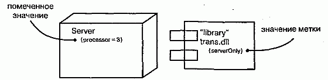
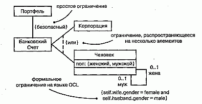
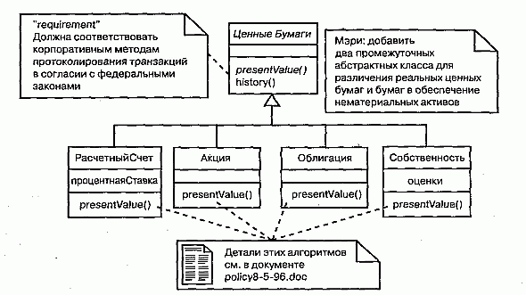
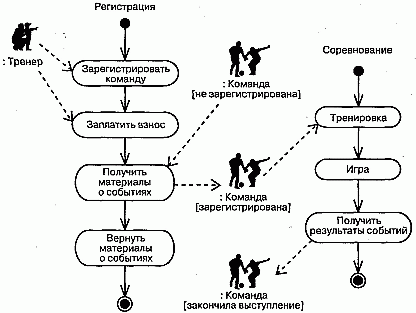
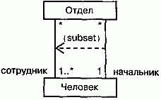

http://bourabai.kz/dbt/uml/ch6.htm

Часть II - Основы структурного моделирования
# Глава 6. Общие механизмы

* Введение
* Термины и понятия
    * Примечания
    * Другие дополнения
    * Стереотипы
    * Помеченные значения
    * Ограничения
    * Стандартные элементы
* Типичные приемы моделирования
    * Комментарии
    * Новые строительные блоки
    * Новые свойства
    * Новая семантика
* Советы

Работа с UML существенно упрощается благодаря наличию четырех постоянно применяемых общих механизмов (см. главу 2). Это спецификации, дополнения, принятые деления и механизмы расширения. В данной главе описаны два из них: дополнения и механизмы расширения.

Самой важной разновидностью дополнений являются примечания, которые представляют собой графические символы для изображения ограничений или комментариев, присоединяемых к одному элементу или их совокупности. Примечания используются для включения в модель дополнительной информации, например требований, наблюдений, обзоров и объяснений.

Механизмы расширения UML позволяют расширять его возможности контролируемым образом. В их число входят стереотипы, помеченные значения и ограничения. Стереотипы расширяют словарь UML, позволяя создавать новые виды строительных блоков, производные от существующих, но при этом более полно соответствующие задаче. Помеченные значения расширяют свойства строительных блоков UML, разрешая вносить новую информацию в спецификацию элемента. Ограничения расширяют семантику строительных блоков UML; c их помощью можно вводить новые или изменять существующие правила. Перечисленные механизмы используют, чтобы настроить язык на конкретные требования предметной области и применяемой разработчиком методики проектирования.

## Введение
Бывают случаи, когда в модель необходимо включить информацию, выходящую за пределы обычных формальностей. Так, архитектор порой пишет примечания на комплекте чертежей здания, чтобы обратить внимание строителей на некоторые тонкости. В студии звукозаписи композитор может изобрести новую музыкальную нотацию и прояснить с ее помощью какие-нибудь необычные эффекты, требуемые от исполнителя. Хотя в обоих случаях уже существуют хорошо определенные языки - строительных чертежей или музыкальной нотации, - их приходится некоторым образом модифицировать или расширять, чтобы наиболее адекватно выразить свои намерения.

Моделирование есть не что иное, как способ обмена информацией. UML предоставляет все необходимые инструменты для визуализации, специфицирования, конструирования и документирования артефактов разнообразных программных систем, однако при некоторых обстоятельствах его возможности требуется расширить или модифицировать. В человеческих языках такой процесс протекает непрерывно (вот почему ежегодно публикуются новые словари). Что касается языка моделирования, то всегда следует помнить, что он предназначен для обмена информацией между разработчиками, и потому стоит придерживаться его основных правил и принципов, пока не возникает острая необходимость отклониться от них. Но даже в этом случае неформальную информацию следует представлять контролируемым образом, иначе никто не сможет понять, о чем идет речь.

Примечания позволяют давать произвольные комментарии и ограничения для пояснения созданной модели. Они могут указывать на артефакты, играющие важную роль в жизненном цикле разработки программного обеспечения - такие, как требования - или же содержать наблюдения, обзоры или пояснения в свободной форме.

Графическим представлением комментариев и ограничений в UML является примечание (см. рис. 6.1). Эта нотация позволяет непосредственно визуализировать комментарии. В сочетании с подходящими инструментальными средствами примечания также могут служить опорной точкой, к которой привязываются или куда встраиваются другие документы.

#### Рис. 6.1 Примечания

Стереотипы, помеченные значения и ограничения - это механизмы UML, которые позволяют создавать новые строительные блоки, новые свойства и определять новую семантику. Например, если вы моделируете сеть, то могут понадобиться символы для маршрутизаторов и концентраторов; с помощью стереотипных узлов эти элементы можно представить в виде примитивных строительных блоков. Если вы отвечаете за сборку, тестирование и применение версий программного продукта, было бы целесообразно отслеживать номера версий и результаты тестов наиболее важных подсистем. Эту информацию стоит добавить в модель с помощью помеченных значений. Наконец, при разработке сложной системы, работающей в режиме реального времени, уместно дополнить модель информацией о временных ресурсах и сроках окончания работ; это можно сделать с помощью ограничений.

UML располагает средствами для текстового представления стереотипов, помеченных значений и ограничений, как показано на рис. 6.2. Кроме того, стереотипы дают возможность вводить новые графические символы, добавляя в модель визуальные образы, характерные для предметной области и среды разработки

#### Рис. 6.2 Стереотипы, помеченные значения и ограничения

## Термины и понятия
Примечание (Note) - это графический символ, используемый для изображения ограничений или комментариев, присоединенных к элементу модели или их совокупности. Примечание выглядит как прямоугольник с загнутым углом, содержащий текстовый или графический комментарий.

Стереотипом (Stereotype) называют расширение словаря UML, позволяющее создавать новые виды строительных блоков, аналогичные существующим, но специфичные для данной задачи. Стереотип представлен в виде имени, заключенного в кавычки и расположенного над именем другого элемента. Стереотипный элемент можно изображать также с помощью новой связанной с ним пиктограммы.

Помеченное значение (Tagged value) - это расширение свойств элемента UML, позволяющее вводить новую информацию в его спецификацию. Помеченные значения изображаются в виде строки в скобках, расположенной под именем другого элемента.

Ограничение (Constraint) - это расширение семантики элемента UML, позволяющее создавать новые или изменять существующие правила. Изображаются ограничения в виде строки в скобках, которая расположена возле ассоциированного элемента или связана с ним отношениями зависимости. Можно также представить ограничение в виде примечания.

### Примечания
Содержащее комментарий примечание не оказывает влияния на семантику, то есть не изменяет структуру модели. Поэтому примечания, наряду с ограничениями, используются для специфицирования таких элементов, как требования, наблюдения, обзоры и пояснения.

Примечание может содержать любые сочетания текста и графики. Если позволяет реализация, можно включить в примечание гиперссылку на Web-страницу, связать его с другим документом либо встроить в него. Таким образом UML можно использовать для организации всех артефактов, создаваемых или используемых в процессе разработки, как показано на рис. 6.3. Примечание можно присоединять не только к одному, но и к нескольким элементам с помощью зависимостей (см. главу 5).

#### Рис. 6.3 Примечания

> Примечание: В UML определен один стандартный стереотип, прилагаемый к примечаниям, - требования (Requirements). Так именуется распространенная категория примечаний, используемая для формулирования обязанностей или обязательств

### Другие дополнения
Дополнения (Adornments) - это текстовые или графические объекты, добавляемые к базовой нотации элемента и применяемые для визуализации каких-либо деталей его спецификации. Например, базовая нотация ассоциации - это линия, но она может быть дополнена указанием роли и кратности на каждом конце (см. главы 5 и 10). Общее правило при использовании UML таково: начинайте с базовой нотации для каждого элемента, а дополнения включайте, только если они необходимы для передачи специфической информации, важной для вашей модели.

Дополнения изображают, располагая текст рядом с соответствующим элементом или добавляя графический символ к базовой нотации. Иногда бывает необходимо включить в модель такие дополнительные детали, для описания которых недостаточно простого текста или графического образа. При работе с такими сущностями, как классы, компоненты или узлы, специальную информацию можно поместить в дополнительный раздел, расположенный ниже стандартных, как показано на рис. 6.4.

#### Рис. 6.4 Дополнительные разделы

> Примечание: Чтобы не возникло путаницы, рекомендуется явно именовать каждый дополнительный раздел, если его назначение не очевидно из содержимого. Дополнительные разделы лучше не использовать слишком часто, чтобы не загромождать диаграммы.

### Стереотипы
UML - это язык для описания структурных, поведенческих, группирующих и аннотационных сущностей. Эти четыре основных вида сущностей позволяют моделировать огромное количество систем (см. главу 2). Однако время от времени приходится вводить новые сущности, которые специфичны для словаря предметной области, хотя выглядят подобно примитивным строительным блокам, уже имеющимся в языке.

Стереотип - это не то же самое, что родительский класс в отношении обобщения "родитель/потомок". Точнее было бы охарактеризовать его как некоторый метатип, поскольку каждый стереотип создает эквивалент нового класса в мета-модели UML. Например, при моделировании бизнеспроцесса вам потребуется ввести в модель элементы, представляющие работников, документы и стратегии.

Пользуясь такой методикой разработки, как Рациональный Унифицированный

Процесс (Rational Unified Process, см. "Приложение С"), вы должны будете оперировать классами границ, управления и сущностей. Здесь и возникает необходимость в стереотипах. Приписывая стереотип таким элементам, как узел или класс, вы по сути дела расширяете UML, создавая новый строительный блок, который напоминает существующий, но обладает новыми специальными свойствами (каждый стереотип может содержать свой набор помеченных значений), новой семантикой (у каждого стереотипа могут быть собственные ограничения) и нотацией (каждому стереотипу может быть присвоена пиктограмма).

В самом простом случае стереотип изображается в виде имени в кавычках (например, "name"), расположенного над именем другого элемента. Для наглядно--сти стереотипу можно назначить пиктограмму, разместив ее справа от имени (если вы пользуетесь базовой нотацией для элемента) или применяя как базовый символ для стереотипной сущности. Все три подхода показаны на рис. 6.5. Определенные в UML стереотипы обсуждаются в "Приложении В".

#### Рис. 6.5 Стереотипы

> Примечание: Создавая пиктограмму для стереотипа, используйте цвет в качестве удобного визуального идентификатора (хотя злоупотреблять этой возможностью не следует). UML позволяет оформлять пиктограммы любым способом и, если позволяет реализация, они могут войти в набор примитивных инструментов, пополнив таким образом палитру средств, при помощи которых пользователи работают с данной предметной областью.

### Помеченные значения
У каждой сущности в UML есть фиксированный набор свойств: классы имеют имена, атрибуты и операции; ассоциации - имена и концевые точки (каждая со своими свойствами) и т.д. Стереотипы позволяют добавлять новые сущности в UML, а помеченные значения - новые свойства.

Метки можно определять для существующих элементов UML; можно также определить метки, применимые к отдельным стереотипам. В последнем случае все элементы, описанные этим стереотипом, будут иметь заданную метку. Помеченное значение - не то же самое, что атрибут класса (см. главы 4 и 9). Скорее, оно может быть представлено как метаданные, поскольку его значение применяется к самому элементу, а не к его экземплярам. Например, как показано на рис. 6.6, в диаграмме развертывания можно указать число процессоров, установленных на узле каждого вида, или потребовать, чтобы каждому компоненту был приписан стереотип библиотеки, если его предполагается развернуть на клиенте или сервере.

#### Рис. 6.6 Помеченные значения

В простейшем варианте помеченное значение изображается в виде строки в скобках, расположенной под именем другого элемента. Строка содержит имя (метку), разделитель (знак равенства) и значение этой метки. Можно указать только значение, если оно не допускает неоднозначной интерпретации, например в случае, если значение - это имя перечисления. Предопределенные в языке UML помеченные значения описаны в "Приложении В".

> Примечание: Чаще всего с помощью помеченных значений описывают свойства, относящиеся к генерации кода или к управлению конфигурацией. Например, ими можно воспользоваться для указания языка программирования, на котором будет кодироваться конкретный класс. Можно также применить помеченные значения для указания имени автора и номера версии компонента.

### Ограничения
Каждый элемент языка UML имеет свою семантику. В обобщениях используется принцип подстановки Лискова; множественные ассоциации, связанные с одним классом, обозначают разные отношения. С помощью ограничений можно создавать новую семантику или изменять существующие семантические правила. Ограничение определяет условия, которые должны выполняться, чтобы модель была хорошо оформлена. Например, на рис. 6.7 показано, как отразить тот факт, что информация, передаваемая вдоль данной ассоциации, зашифрована. Аналогично можно специфицировать, что из совокупности ассоциаций только одна про- -является в данный момент времени. При моделировании систем реального времени часто используются временные и пространственные ограничения (см. главу 23).

#### Рис. 6.7 Ограничение

> Примечание: Ограничения могут записываться в свободном формате. Если надо определить семантику более точно, следует воспользоваться входящим в состав UML языком объектных ограничений (Object Constraint Language, OCL). Более подробно он описывается в книге "The Unified Modeling Language Reference Manual". Предопределенные в UML ограничения рассмотрены в "Приложении В".

Ограничение изображается в виде строки в фигурных скобках, расположенной рядом с соответствующим элементом. Эта нотация также используется как дополнение к базовой нотации элемента для визуального представления тех частей его спецификации, которые не имеют графического образа. Например, с помощью нотации ограничений изображаются некоторые свойства ассоциаций (порядок и изменяемость). Ограничение можно присоединять сразу к нескольким элементам с помощью отношений зависимости (см. главу 5).

### Стандартные элементы
В языке UML определен ряд стандартных стереотипов для классификаторов, компонентов, отношений и других элементов модели (см. "Приложение В" и главу 9). Один из них, stereotype, позволяет моделировать сами стереотипы и представляет интерес в основном для разработчиков инструментальных средств. Он определяет, что классификатор является стереотипом, который может быть применен к другим элементам. Этот стереотип можно использовать, если нужно явно смоделировать стереотипы, которые вы определили в своем проекте.

В UML также определено одно стандартное помеченное значение, documentation, применимое ко всем моделирующим элементам. Оно задает комментарий, описание или объяснение элемента, к которому присоединено. Это помеченное значение используют, если надо присоединить комментарий непосредственно к спецификации какого-нибудь элемента, например класса.

## Типичные приемы моделирования

### Комментарии

Моделирование комментария производится следующим образом:

1. Включите его в виде текста в примечание и расположите рядом с элементом, к которому он относится. Можно показать отношение более явно, соединив примечание с соответствующими элементами при помощи зависимости.
2. Помните, что элементы модели можно скрыть или сделать видимыми. Это означает, что не обязательно делать комментарий видимым всегда, когда видны элементы, к которым он присоединен. Лучше раскрывать комментарии в диаграммах только тогда, когда это необходимо для передачи какой-либо информации.
3. Если комментарий длинный или содержит нечто более сложное, чем обычный текст, подумайте о том, чтобы вынести его во внешний документ, на который можно поставить ссылку, или встроить его в примечание, присоединенное к модели.
4. По мере продвижения процесса моделирования убирайте все комментарии, кроме тех, что содержат важные решения, которые не могут быть выведены из самой модели, либо тех, что представляют исторический интерес.

В качестве примера на рис. 6.8 показана промежуточная модель, возникшая в процессе работы над иерархией классов. Здесь отражены требования к модели наряду с некоторыми примечаниями, касающимися пересмотра проекта. (Вам может пригодиться материал глав 5 и 10, где обсуждаются, соответственно, простые обобщения и более сложные их формы.)

#### Рис. 6.8 Комментарии в процессе моделирования

Почти все комментарии в этом примере (скажем, замечание для Мэри) записаны в форме обычного текста, но один из них (примечание в нижней части диаграммы) представляет собой гиперссылку на другой документ.

Новые строительные блоки
Строительные блоки языка UML - классы, интерфейсы, кооперации, компоненты, узлы, ассоциации и т.д. - являются достаточно общими, чтобы их можно было применять для моделирования любых сущностей. Тем не менее, если вы хотите расширить словарь или создать специальные визуальные образы для абстракций, часто возникающих в вашей предметной области, можно воспользоваться стереотипами.

Моделирование новых строительных блоков производится в следующем порядке:

1. Убедитесь, что с помощью базового набора средств UML невозможно воплотить ваш замысел. Если вы столкнулись с типичной задачей моделирования, то, скорее всего, уже существует стандартный стереотип для ее решения.
2. Если вы убеждены, что никакого другого способа выразить соответствующую семантику не существует, подыщите примитив UML, более всего похожий на то, что вы собираетесь моделировать (например, класс, интерфейс, компонент, узел, ассоциацию и т.д.) и определите для него новый стереотип.
3. Помните, что вы можете определить иерархию стереотипов (см. главу 10), в которой есть как общие, так и специализированные элементы; однако не увлекайтесь этим чрезмерно.
4. Задайте общие свойства и семантику, выходящие за пределы базового элемента, определив множество помеченных значений и ограничений для стереотипа.
5. Если вы хотите связать со стереотипными элементами специальный визуальный образ, определите для каждого из них новую пиктограмму.

Допустим, вы используете диаграммы деятельности для моделирования бизнес-процесса, описывающего действия тренеров и команд во время какого-либо спортивного события. Следует визуально отличать тренеров и команды друг от друга и от иных сущностей предметной области, таких как состязания и занятые командами места. Как явствует из рис. 6.9, две сущности - Тренер (Coach) и Команда (Team) - отличаются от остальных. Это не просто разновидности классов, а новые примитивные строительные блоки, которые можно использовать в данном контексте. Создать такие блоки можно, определив стереотипы coach и team

#### Рис. 6.9 Моделирование новых строительных блоков

и применив их к классам UML. На рисунке анонимные экземпляры :Тренер и :Команда (последний существует в трех различных состояниях - не зарегистрирована, зарегистрирована и закончила выступление) сопровождаются пиктограммами, ассоциированным с их стереотипами. (Подробнее об экземплярах рассказано в главе 13, о ролях - в главе 11, о диаграммах деятельности - в главе 19.)

### Новые свойства
Базовые свойства строительных блоков UML - атрибуты и операции для классов, содержание пакетов и т.д. - являются достаточно общими, чтобы их можно было применять для моделирования любых сущностей. Все же, если вы хотите расширить набор свойств базовых блоков (или новых блоков, созданных с помощью стереотипов), вам необходимо воспользоваться помеченными значениями.

Моделирование новых свойств осуществляется следующим образом:

1. Сначала убедитесь, что с помощью базовых средств UML невозможно воплотить вашу задумку. Если вы столкнулись с типичной задачей моделирования, то, вероятнее всего, уже существует стандартное помеченное значение для ее решения.
2. Если вы уверены, что никакого другого способа выразить нужную семантику не существует, добавьте новое свойство к соответствующему элементу или стереотипу. Здесь действуют правила обобщения: помеченные значения, определенные для некоторого элемента, применяются и ко всем его потомкам.

Предположим, например, что вам нужно связать создаваемые модели с системой управления конфигурацией проекта. Помимо всего прочего, это предполагает отслеживание номера версии, текущего статуса версии в хранилище (Check in/check out status) и, возможно, дат создания и модификации каждой подсистемы (см. главу 31). Поскольку вся эта информация специфична для процесса разработки, она не является частью базового UML, хотя ее можно включить в модель с помощью помеченных значений. В частности, эта информация не является просто атрибутом класса. Номер версии подсистемы - это часть метаданных, но не самой модели.

На рис. 6.10 представлены четыре подсистемы, каждая из которых была расширена за счет включения номера версии и статуса. Для подсистемы Биллинг показано еще одно помеченное значение - имя человека, который извлек подсистему из хранилища.

#### Рис. 6.10 Моделирование новых свойств

> Примечание: Значения таких меток, как version и status, могут устанавливаться инструментальными средствами. Вместо того чтобы вручную задавать их в модели, для их автоматического сопровождения достаточно воспользоваться средой разработки, интегрированной с системой управления конфигурацией.

### Новая семантика
Создавая с помощью UML новые модели, вы используете принятые в этом языке правила. Это естественно, поскольку при соблюдении данного условия ваши модели будут однозначно восприняты каждым, кто знаком с этим языком. Но иногда требуется выразить новую семантику, которая отсутствует в UML, или изменить существующую. В таком случае вам помогут ограничения.

Моделирование новой семантики производится следующим образом:

Убедитесь, что с помощью базовых средств UML невозможно реализовать ваш замысел. Если вам предстоит решить типичную задачу моделирования, то, надо полагать, уже существует стандартное ограничение, которое подойдет для этой цели.
Если вы уверены, что никакого другого способа выразить нужную семантику не существует, оформите новую семантику в виде текста в ограничении и расположите рядом с элементом, к которому она относится. Более явно описать ограничение можно, связав его с элементами отношениями зависимости.
Если вы хотите описать новую семантику более четко и формально, воспользуйтесь языком ОСL.
В качестве примера на рис. 6.11 представлена модель небольшого фрагмента корпоративной системы управления человеческими ресурсами.

#### Рис. 6.11 Моделирование новой семантики

На этой диаграмме показано, что каждый Человек может быть сотрудником любого числа Отделов (включая ноль), а в каждом Отделе должен быть хотя бы один сотрудник. При этом в роли начальника Отдела может выступать только один Человек; в то же время любой Человек может быть начальником любого числа Отделов (включая ноль). Эта семантика выражается с помощью базовых правил UML. Однако то обстоятельство, что начальник должен быть также и сотрудником отдела, подразумевает несколько ассоциаций и не может быть выражено с помощью базового UML. Для формулирования такого инварианта необходимо написать ограничение, которое показывает, что начальник "принадлежит" (subset на диаграмме) множеству сотрудников отдела, и соединить две ассоциации с этим ограничением зависимостью, направленной от подмножества к надмножеству.

## Советы
Включая в модель примечания в виде дополнений:

* используйте примечания для описания только тех требований, наблюдений, обзоров и пояснений, которые нельзя выразить с помощью стандартных средств UML;
* используйте примечания в качестве электронной памятки, отслеживая с их помощью ход работы.
Изображая примечания, не перегружайте модель большими объемными комментариями. Если длинный комментарий действительно необходим, помещайте в примечания ссылку на документ, содержащий полный текст.

Расширяя модель за счет новых стереотипов, помеченных значений и ограничений, руководствуйтесь следующими принципами:

* определите небольшое число этих механизмов в качестве стандартных для проекта и не позволяйте разработчикам создавать ничего лишнего;
* выбирайте короткие осмысленные названия для стереотипов и помеченных значений;
* если точность описания не слишком важна, определяйте ограничения в свободной форме;
* в противном случае используйте язык ОСL.

Изображая стереотипы, помеченные значения и ограничения, действуйте согласно следующим правилам:

* прибегайте к графическим стереотипам только в случае острой необходимости. С помощью стереотипов можно полностью изменить базовую нотацию UML, но тогда уже никто, кроме вас, не поймет модель;
* подумайте, не стоит ли раскрасить или оттенить графические стереотипы и более сложные пиктограммы. Как правило, чем проще нотация, тем она лучше, и даже самых простых визуальных образов бывает вполне достаточно для передачи смысла.

