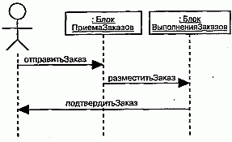
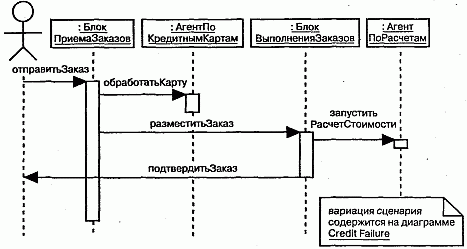

http://bourabai.kz/dbt/uml/ch7.htm

Часть II - Основы структурного моделирования
# Глава 7. Диаграммы
* Введение
* Термины и понятия
    * Структурные диаграммы
    * Диаграммы поведения
* Типичные приемы моделирования
    * Различные представления системы
    * Различные уровни абстракции
    * Сложные представления
* Советы

В процессе моделирования человек упрощает реальность, чтобы лучше понять проектируемую систему (см. главу 1). Используя UML, вы можете строить модели из базовых блоков, таких как классы, интерфейсы, кооперации, компоненты, узлы, зависимости, обобщения и ассоциации. Диаграммы позволяют обозревать эти строительные блоки в удобной для понимания форме.

Диаграмма - это графическое представление совокупности элементов, чаще всего изображаемое в виде связного графа, состоящего из вершин (сущностей) и ребер (отношений). С помощью диаграмм можно визуализировать систему с различных точек зрения. Поскольку сложное целое нельзя понять, глядя на него лишь с одной стороны, в UML определено много разных диаграмм, которые позволяют сосредоточиться на различных аспектах моделируемой системы.

Хорошие диаграммы облегчают понимание модели. Продуманный выбор диаграмм при моделировании системы позволяет задавать правильные вопросы о ней, помогает грамотной постановке задачи и проясняет последствия принимаемых решений.

## Введение
Работая с архитектором, проектирующим ваш дом, вы, во-первых, составляете список пожеланий (например, "я хочу, чтобы в доме было три спальни" или "я хочу, чтобы постройка обошлась мне не дороже такой-то суммы"); во-вторых, подбираете несколько эскизов или фотографий других домов, где представлены их важнейшие особенности (например, фотография крыльца с винтовой лестницей); в-третьих, формулируете некую общую идею ("это будет французский сельский дом с элементами стиля, распространенного на калифорнийском побережье"). Задача архитектора заключается в том, чтобы на основе этих неполных, постоянно меняющихся и, возможно, противоречивых требований создать завершенный проект.

Начать, вероятно, придется с основных поэтажных планов. Оформив их, вы вместе с архитектором сможете представить себе окончательный вид дома, уточнить детали и документировать решения. При каждом пересмотре проекта может возникнуть желание внести какие-то изменения, например передвинуть стены, перепланировать комнаты или по-новому расположить окна и двери. На ранних стадиях чертежи будут меняться часто. По мере того как проект совершенствуется и вы наконец осознаете, что он наилучшим образом удовлетворяет всем требованиям по внешнему виду, функциональности, срокам и смете строительства, чертежи оформляются настолько четко, что их уже можно использовать для возведения дома. Однако даже в процессе строительства вы еще, вероятно, пожелаете изменить некоторые элементы и привнести нечто новое.

По ходу работы вам захочется увидеть не только поэтажный план, но и другие представления вашего дома - например, вертикальные разрезы с разных сторон. Конкретизируя детали и при этом не упуская из виду, что стоимость работ должна оставаться в разумных пределах, архитектору придется начертить схемы электропроводки, систем отопления и вентиляции, водоснабжения и канализации. Если в вашем проекте есть какие-то необычные черты (например, большие арочные пролеты) или существенные для вас особенности (скажем, камин требуется расположить так, чтобы рядом с ним можно было разместить домашний кинотеатр), то вам совместно с архитектором придется подробно проработать их на отдельных чертежах.

Практика создания чертежей для визуализации системы с различных точек зрения не ограничивается строительством. Вы встретите ее в любой инженерной дисциплине, связанной с разработкой сложных систем, от производства бытовой техники до авиа- и кораблестроения и, наконец, создания программного обеспечения.

Существует пять взаимно дополняющих друг друга видов, или представлений, особенно важных для визуализации, специфицирования, конструирования и документирования программной архитектуры: это представления с точки зрения прецедентов, проектирования, процессов, реализации и развертывания (см. главу 2). Каждое из них предполагает структурное и поведенческое моделирование (то есть моделирование статических и динамических сущностей соответственно). В своей совокупности эти виды позволяют передать наиболее важные решения, касающиеся системы в целом, а по отдельности каждый из них акцентирует внимание на одном ее аспекте, рассмотрение которого таким образом упрощается.

Чтобы изобразить систему с какой-либо точки зрения средствами UML, для организации представляющих интерес элементов используются диаграммы. В UML определено девять типов диаграмм, которые позволено комбинировать для создания нужного вида. Например, статические аспекты вида с точки зрения реализации системы удобнее визуализировать с помощью диаграмм компонентов, а динамические аспекты того же вида - с помощью диаграмм взаимодействия. Статические аспекты системной базы данных можно изобразить с помощью диаграмм классов, а динамические - с помощью диаграмм кооперации. (Моделирование архитектуры системы рассматривается в главе 31.)

Конечно, вы не ограничены только этими девятью типами диаграмм. Они определены в UML только потому, что позволяют представить наиболее часто встречающиеся комбинации рассматриваемых элементов. Но можно создавать и собственные виды диаграмм, если это потребуется для вашего проекта или организации.

Диаграммы UML можно использовать двумя способами: для описания моделей, на основе которых в дальнейшем будет сконструирована исполняемая система (прямое проектирование), или для воссоздания модели из частей уже существующей исполняемой системы (обратное проектирование). В любом случае вы, как и архитектор, будете разрабатывать диаграммы инкрементно (добавляя по одному новому фрагменту за раз) и итеративно (повторяя процесс проектирования после каждого нового усовершенствования). Удовлетворяющий обоим этим требованиям процесс проектирования описан в "Приложении С".

## Термины и понятия
Системой называют набор подсистем, организованных для достижения определенной цели и описываемых с помощью совокупности моделей, возможно с различных точек зрения. Подсистема - это совокупность элементов, часть из которых задает спецификацию поведения других элементов. Моделью называется семантически замкнутая абстракция системы. Другими словами, модель является полным и внутренне непротиворечивым упрощением реальности, которое создается для более глубокого понимания системы. В контексте архитектуры видом, или представлением, именуется проекция организации и структуры модели системы, в которой внимание сфокусировано на одном ее аспекте. (О системах, моделях и видах подробно рассказывается в главе 31.) Диаграмма - это графическое представление множества элементов, обычно изображаемое в виде связного графа из вершин (сущностей) и ребер (отношений).

Иначе говоря, система представляет собой разрабатываемую сущность, которая рассматривается с разных точек зрения с помощью моделей, многообразные представления которых отображены в форме диаграмм.

Диаграмма - это просто графическая проекция элементов, составляющих систему. Например, в проекте корпоративной системы управления человеческими ресурсами может быть несколько сотен классов. Вы никогда не сможете понять структуру и поведение этой системы, глядя на одну гигантскую диаграмму, где изображены все классы и их отношения. Вместо этого разумно создать несколько диаграмм, каждая из которых заостряет внимание на одном аспекте. Например, одна из диаграмм классов будет содержать описание классов Работник, Отдел и Офис, используемых при конструировании схемы базы данных. Некоторые из этих классов (наряду с другими) могут войти в состав интерфейса прикладного программирования, применяемого в клиентских приложениях. Частично они могут присутствовать еще и в диаграмме взаимодействия, которая определяет семантику транзакции, состоящей в переводе Работника в другой Отдел.

Как видно из примера, та или иная сущность в системе (например, класс Работник) может многократно повторяться на одной или даже нескольких диаграммах. Тем не менее во всех случаях речь идет об одной и той же сущности. Каждая диаграмма дает одно из возможных представлений элементов системы.

При моделировании реальных систем, независимо от предметной области, вы будете создавать все те же типы диаграмм, поскольку они соответствуют наиболее часто встречающимся представлениям модели. Как правило, при рассмотрении статических частей системы используются следующие четыре типа:

* диаграммы классов;
* диаграммы объектов;
* диаграммы компонентов;
* диаграммы развертывания.

Для работы с динамическими частями системы применяются пять типов, перечисленные ниже:

* диаграммы прецедентов;
* диаграммы последовательности;
* диаграммы кооперации;
* диаграммы состояний;
* диаграммы деятельности.

Всего в языке UML определено девять типов диаграмм.

В большинстве случаев создаваемые вами диаграммы можно будет отнести к одному из этих типов, и только изредка потребуются новые, специфические для вашего проекта или организации. У каждой диаграммы должно быть уникальное в объемлющем контексте имя, с помощью которого можно ссылаться на нее и отличать от остальных. При работе над сколько-нибудь сложной системой вам придется объединять диаграммы в пакеты (см. главу 12).

На одну и ту же диаграмму можно проецировать любую комбинацию элементов UML. Например, зачастую совместно показывают классы и объекты (это вполне допустимо), а иногда даже классы и компоненты (допустимо, но встречается реже). Хотя ничто не мешает вам разместить на одной диаграмме совершенно различные элементы моделирования, принято все-таки сводить воедино более или менее похожие сущности. Собственно, определенные в UML диаграммы и названы в соответствии с элементом, чаще всего встречающимся в них. Если вы хотите, например, визуализировать набор классов и отношений между ними, используйте диаграммы классов. Если же надо изобразить компоненты системы, лучше подойдут диаграммы компонентов.

> Примечание: На практике создаваемые вами диаграммы двумерны, то есть представляют собой плоские графы, которые можно нарисовать на листе бумаги, доске или экране компьютера. UML позволяет создавать и трехмерные, объемные диаграммы. Некоторые исследовательские коллективы, работающие в области виртуальной реальности, уже продемонстрировали такое нестандартное использование UML.

### Структурные диаграммы
В UML существует четыре структурных диаграммы для визуализации, специфицирования, конструирования и документирования статических аспектов системы, составляющих ее относительно прочный "костяк". Подобно тому как статические аспекты дома показывают, что и каким образом будет размещено в здании (стены, двери, окна, трубы, электропроводки, вентиляционные отверстия и т.д.), так и ста-ткческие аспекты программных систем отражают наличие и расположение классов интерфейсов, коопераций, компонентов, узлов и других сущностей.

Названия структурных диаграмм UML соответствуют названиям основных| групп сущностей, используемых при моделировании системы:

* диаграммы классов - классам, интерфейсам и кооперациям;
* диаграммы объектов - объектам;
* диаграммы компонентов - компонентам;
* диаграммы развертывания - узлам.

На диаграмме классов изображают множество классов, интерфейсов, коопераций и их отношений (см. главу 8). Это самый распространенный тип диаграмм, применяемый при моделировании объектно-ориентированных систем; он используется для иллюстрации статического вида системы с точки зрения проектирования. Диаграммы, на которых показаны активные классы, применяются для работы со статическим видом системы с точки зрения процессов.

На диаграмме объектов показывают множество объектов и отношения между ними (см. главу 14). Такие изображения используются для иллюстрации структуры данных, то есть статических "мгновенных снимков" экземпляров тех сущностей, которые представлены на диаграмме классов. Диаграммы объектов, так же как и диаграммы классов, относятся к статическому виду системы с точки зрения процессов, но заостряют внимание на реальных или модельных прецедентах.

На диаграммах компонентов показаны множества компонентов и отношения между ними (см. главу 29). С их помощью иллюстрируют статический вид системы с точки зрения реализации. Диаграммы компонентов соотносятся с диаграммами классов, так как обычно компонент отображается на один или несколько классов, интерфейсов или коопераций.

На диаграммах развертывания представлены узлы и отношения между ними (см. главу 30). С помощью таких изображений иллюстрируют статический вид системы с точки зрения развертывания. Они соотносятся с диаграммами компонентов, так как узел обычно содержит один или несколько компонентов.

> Примечание: Существует несколько распространенных разновидностей четырех основных типов диаграмм, названных по основным содержащимся в них объектам. Например, для иллюстрации структурной декомпозиции системы на подсистемы можно использовать диаграмму подсистем, которая представляет собой обыкновенную диаграмму классов, содержащую главным образом подсистемы.

### Диаграммы поведения
Пять основных диаграмм поведения в UML используются для визуализации, специфицирования, конструирования и документирования динамических аспектов системы. Можно считать, что динамические аспекты системы представляют собой ее изменяющиеся части. Например, динамические аспекты жилого дома -это перемещение потоков воздуха и людей по комнатам. Динамические аспекты программной системы охватывают такие ее элементы, как поток сообщений во времени и физическое перемещение компонентов по сети.

Диаграммы поведения в UML условно разделяются на пять типов в соответствии с основными способами моделирования динамики системы:

* диаграммы прецедентов описывают организацию поведения системы; D диаграммы последовательностей акцентируют внимание на временной упорядоченности сообщений;
* диаграммы кооперации сфокусированы на структурной организации объектов, посылающих и получающих сообщения;
* диаграммы состояний описывают изменение состояния системы в ответ на события;
* диаграммы деятельности демонстрируют передачу управления от одной деятельности к другой.

На диаграммах прецедентов показывается совокупность вариантов использования (прецедентов), актеров (частный случай классов) и отношений между ними (см. главу 17). С помощью таких диаграмм иллюстрируют статический вид системы с точки зрения прецедентов, что особенно важно для ее организации и моделирования ее поведения.

Следующие две диаграммы семантически идентичны, так же как и две последние. Иными словами, для моделирования динамики системы можно воспользоваться диаграммами одного типа, а затем преобразовать их к другому типу без потерь информации. Это позволяет лучше понять различные аспекты динамики системы. Например, можно сначала создать диаграмму последовательностей, иллюстрирующую временную упорядоченность сообщений, а затем преобразовать в диаграмму кооперации, помогающую легко разрабатывать структурные отношения между классами, объекты которых участвуют в этой кооперации (разумеется, не воспрещено двигаться и в обратном направлении, от диаграммы кооперации к диаграмм последовательностей). Можно также начать с диаграммы состояний, показывающей реакцию системы на события, и преобразовать ее в диаграмму действий, которая заостряет внимание на потоке управления (или же, наоборот, от диаграммы действий перейти к диаграмме состояний). Причина, по которой в UML предусмотрены семантически эквивалентные диаграммы, состоит в том, что моделирование динамики системы - очень непростая задача, и зачастую приходится подходит к решению какой-нибудь многогранной проблемы сразу с нескольких сторон.

Диаграммы взаимодействий - это общее наименование диаграмм последовательностей и кооперации. Любая диаграмма последовательностей или кооперации является диаграммой взаимодействия, а каждая диаграмма взаимодействия - это либо диаграмма последовательностей, либо диаграмма кооперации.

На диаграмме последовательностей основное внимание уделяется временно упорядоченности событий (см. главу 18). На них изображают множество объектов и посланные или принятые ими сообщения. Объекты, как правило, представляют собой анонимные или именованные экземпляры классов, но могут быть та: же экземплярами других сущностей, таких как кооперации, компоненты или узлы Диаграммы последовательностей относятся к динамическому виду системы.

Диаграммы кооперации заостряют внимание на структурной организации объектов, принимающих или отправляющих сообщения. На диаграмме кооперации показано множество объектов, связи между ними и сообщения, которые они посылают или получают (см. главу 18). Объекты обычно представляют собой анонимные или именованные экземпляры классов, но могут быть также экземпляр ми других сущностей, например коопераций, компонентов и узлов. Диаграммы коопераций относятся к динамическому виду системы.

> Примечание: Диаграммы последовательностей и кооперации изоморфны, то есть их можно преобразовывать друг в друга без потери информации.

Диаграмма состояний показывает автомат, содержащий состояния, переходы, события и действия (см. главу 24). Диаграммы такого рода относятся к динамическому виду системы и особенно важны при моделировании поведения интерфейса, класса или кооперации. Основное внимание в них уделяется порядку возникновения событий, связанных с объектом, что особенно полезно при моделировании реактивных систем.

На диаграммах деятельности изображают передачу управления от одной деятельности к другой внутри системы. На них показаны виды деятельности, последовательные или параллельные ветвления потока управления и объекты, которые воздействуют на что-то или сами подвергаются воздействию (см. главу 19). Диаграммы деятельности относятся к динамическому представлению системы и особенно важны при моделировании ее функций. Они являются особой разновидностью диаграмм состояния. На диаграммах деятельности основное внимание уделено потоку управления между объектами.

> Примечание: Разумеется, при попытке проиллюстрировать динамическое поведение системы с помощью диаграмм, которые по сути своей статичны (особенно если рисуются на листе бумаги, на доске или обратной стороне конверта), возникают определенные физические ограничения. При использовании компьютерных технологий к диаграммам поведения можно применять анимационные эффекты с целью имитации исполняемой системы или аппроксимации ее поведения. Язык UML позволяет рисовать динамические диаграммы, в которых цвет или другие визуальные факторы призваны создать впечатление изменяемости. Некоторые инструментальные средства, существующие на данный момент, уже поддерживают такую возможность.

## Типичные приемы моделирования

### Различные представления системы

При моделировании системы с различных точек зрения вы фактически конструируете ее сразу в нескольких измерениях. Правильный выбор совокупности видов или представлений позволит задать нужные вопросы, касающиеся системы, и выявить риск, который необходимо учесть. Если же виды выбраны плохо или вы сосредоточились только на одном из них в ущерб остальным, то возрастает опасность не заметить или отложить на будущее такие вопросы, пренебрежение которыми рано или поздно поставит под угрозу весь проект.

Моделирование системы с использованием различных представлений осуществляется следующим образом:

1. Решите, какие именно виды лучше всего отражают архитектуру систем и возможный технический риск, связанный с проектом. При этом стоит начать с описанных выше пяти взглядов на архитектуру (см. главу 2).
2. В отношении каждого из выбранных видов определите, какие артефакты необходимо создать для отражения его наиболее существенных деталей. Эти артефакты по большей части будут состоять из различных диаграмм UML
3. В ходе планирования процесса решите, какие из диаграмм удобнее все превратить в инструмент контроля (формального или неформального) разработкой системы. Эти диаграммы вы будете периодически корректировать и сохранять в составе проектной документации.
4. На всякий случай сохраняйте даже забракованные диаграммы, - они могут пригодиться при анализе результатов ваших действий и для эксперимент по изменению каких-либо рабочих параметров.

Допустим, если вы моделируете простое приложение, выполняемое на одном компьютере, могут потребоваться только нижеперечисленные диаграммы:

* вид с точки зрения вариантов использования - диаграммы прецедентов;
* вид с точки зрения проектирования - диаграммы классов (для структурного моделирования) и диаграммы взаимодействия (для моделирования поведения);
* вид с точки зрения процессов - не требуется;
* вид с точки зрения реализации - не требуется; вид с точки зрения развертывания - также не требуется.

Если же разрабатываемая система реактивна или относится к управлению рабочим процессом, то для моделирования ее поведения понадобятся соответственно но диаграммы состояний и действий.

Если система построена на архитектуре "клиент/сервер", то стоит включать в работу диаграммы компонентов и развертывания для моделирования конкретных физических деталей реализации.

Наконец, моделируя сложную распределенную систему, используйте все имеющиеся в UML диаграммы. Они позволят выразить ее архитектуру и связанный с проектом технический риск. Вам потребуется следующее:

* вид с точки зрения прецедентов - диаграммы прецедентов и диаграммы действий (для моделирования поведения);
* вид с точки зрения проектирования - диаграммы классов (структурное моделирование), диаграммы взаимодействия (моделирование поведения), диаграммы состояния (моделирование поведения);
* вид с точки зрения процессов - снова диаграммы классов (структурное моделирование) и диаграммы взаимодействия (моделирование поведения);
* вид с точки зрения реализации - диаграммы компонентов;
* вид с точки зрения развертывания - диаграммы развертывания.

### Различные уровни абстракции
Разработчикам необходимо рассматривать систему не только с различных точек зрения, но и на разных уровнях абстракции. Например, если есть набор классов, охватывающих словарь предметной области, то программист захочет изучить свойства каждого из них, вплоть до атрибутов, операций и отношений. С другой стороны, аналитику, который обсуждает с конечным пользователем многочисленные варианты использования системы, те же самые классы готовой системы понадобятся в максимально упрощенном виде. Таким образом, можно сказать, что программист работает на более низком, а аналитик и пользователь - на более высоком уровне абстракции, но и в том, и в другом случае приходится иметь дело с одной и той же моделью. Так как диаграммы, по сути, являются графическим изображением составляющих модель элементов, вы можете нарисовать несколько диаграмм одной модели, каждая из которых прячет или, наоборот, раскрывает некоторые элементы и, следовательно, показывает разные уровни детализации.

Существует два основных способа моделировать различные уровни абстракции системы: можно, во-первых, строить диаграммы одной и той же модели, характеризующиеся различными уровнями детализации, а во-вторых, создавать разные модели с различными степенями абстракции и диаграммы трассировки от одной модели к другой.

Моделирование системы на разных уровнях абстракции с применением диаграмм разной степени детализации осуществляется следующим образом:

1. Изучите потребности ваших читателей и приступайте к созданию модели.
2. Если читатель будет использовать модель для создания реализации, то понадобятся диаграммы самого низкого уровня, содержащие много деталей. Если же он рассчитывает применять модель для изложения основных концепций конечному пользователю, то нужны высокоуровневые диаграммы, где большая часть деталей скрыта.
3. В зависимости от того, какие потребности читателя вам предстоит учесть, создайте диаграмму на подходящем уровне абстракции, скрыв или показав четыре категории сущностей, составляющих модель:

    * строительные блоки и отношения. Скройте те из них, которые не соответствуют предполагаемому уровню диаграммы или запросам читателя;
    * дополнения. Оставьте только те дополнения к показанным строительным блокам и отношениям, которые существенны для понимания ваших намерений;
    * поток управления. В диаграммах поведения раскрывайте только те сообщения (см. главу 15) или переходы (см. главу 21), которые имеют значение для понимания читателем ваших намерений;
    * стереотипы (см. главу 6). Если они используются для классификации перечней таких сущностей, как атрибуты и операции, показывайте только те из них, что необходимы для понимания вашего замысла.

Основное преимущество данного подхода состоит в том, что в процессе моделирования всегда используется общий набор семантических понятий. Основной недостаток в следующем: изменения в диаграмме на одном уровне абстракции могут привести к тому, что диаграммы на другом уровне утратят актуальность.

Проектирование системы на различных уровнях абстракции с применением разноуровневых моделей производится так:

1. Рассмотрите потребности читателей и выберите необходимый уровень абстракции для каждого из них, после чего создайте для каждого уровня свою модель.
2. Модели, находящиеся на более высоком уровне, должны содержать по возможности простые абстракции, а на более низком - детализированные. Установите отношения трассировки (Trace dependencies) между связанными элементами различных моделей (см. главу 31).
3. Если вы следуете в своей работе идеологии пяти архитектурных видов системы, то возможны четыре типовые ситуации, с которыми предстоит столкнуться в процессе моделирования системы на различных уровнях абстракции:

    * прецеденты и их реализация. В модели с точки зрения прецедентов использования (см. главу 16) прецеденты трассируются к кооперациям модели с точки зрения проектирования;
    * кооперации и их реализация. Кооперации (см. главу 27) трассируются к сообществу классов, совместно функционирующих для осуществления данной кооперации;
    * компоненты и их проектирование. Компоненты (см. главу 25) модели реализации трассируются к элементам модели с точки зрения проектирования;
    * узлы и их компоненты. Узлы (см. главу 26) модели с точки зрения развертывания трассируются к компонентам модели с точки зрения реализации

Главное преимущество такого подхода в том, что диаграммы различных уровней абстракции менее тесно связаны друг с другом. Изменение в одной модели не окажет слишком сильного влияния на остальные. Главный недостаток заключается в необходимости затрачивать дополнительные усилия на синхронизацию моделей и их диаграмм. Он становится наиболее очевидным, если ваши модели соответствуют различным фазам жизненного цикла разработки приложения, например, когда аналитическая модель отделена от проектной.

В качестве примера рассмотрим процесс моделирования системы электронной торговли. Одним из основных прецедентов такой системы является размещений заказа. Аналитику или конечному пользователю понадобятся диаграммы взаимен действия (см. главу 18) на высоком уровне абстракции, которые схематично изображают этот процесс, как на рис. 7.1.

Рис. 7.1 Диаграмма взаимодействия на высоком уровне абстракции

С другой стороны, программист, отвечающий за реализацию такого сценария должен воспользоваться более проработанной диаграммой, в которой следует расширить некоторые сообщения и добавить новые действующие лица. Такой пример показан на рис. 7.2.

Рис. 7.2 Взаимодействие на более низком уровне абстракции

Обе диаграммы относятся к одной и той же модели, но демонстрируют различные уровни детализации. Представляется разумным создать большое число подобных диаграмм, особенно если ваши инструментальные средства позволяют легко осуществлять навигацию между ними.

Сложные представления
Независимо от того, как вы члените модели на части, настанет момент, когда придется нарисовать большую и сложную диаграмму. Например, для анализа всей схемы базы данных, насчитывающей 100 и более абстракций, будет целесообразно объединить все классы и их ассоциации в одной диаграмме, поскольку это позволит вам увидеть типичные образцы кооперации. Показав эту модель на высоком уровне абстракции, где ряд деталей скрыт, вы потеряете часть информации, необходимой для понимания системы.

Моделирование сложных представлений осуществляется следующим образом:

1. Прежде всего убедитесь, что для достижения ваших целей нельзя ограничиться более высоким уровнем абстракции, скрыв некоторые детали и переместив их на другую диаграмму.
2. Если после того, как вы скрыли максимально возможное число деталей, диаграмма все еще остается слишком сложной, попробуйте объединить некоторые элементы в пакеты (см. главу 12) или в кооперации (см. главу 27) более высокого уровня и нарисуйте только эти пакеты и кооперации.
3. Если ваша диаграмма все еще слишком сложна, используйте примечания и цвет, чтобы привлечь внимание читателя к наиболее важным аспектам.
4. Если даже после этого диаграмма чересчур громоздка, распечатайте ее целиком и повесьте на очень большой стене. При этом будет утрачена интерактивность, предоставляемая электронной версией диаграммы, но, отойдя от стены на шаг-другой, вы сможете подробно рассмотреть все изображение и отыскать типичные образцы структуры.

## Советы
При разработке диаграмм руководствуйтесь следующими правилами:

* помните, что цель создания диаграмм на языке UML - не рисование красивых картинок, а визуализация, специфицирование, конструирование и документирование. Диаграммы - это только одно из средств, помогающих привести разработку программной системы к успешному завершению;
* не все диаграммы необходимо сохранять. Иногда стоит создавать их "на лету", путем опроса элементов модели, и использовать для анализа системы по мере ее построения. Многие диаграммы такого рода можно будет выбросить после того, как они выполнят свое назначение (хотя семантика, лежащая в их основе, останется частью модели);
* избегайте избыточных диаграмм, они только загромождают модель;
* каждая диаграмма должна содержать только необходимые для ее целей детали. Лишняя информация отвлечет внимание читателя от более важных элементов модели;
* старайтесь не делать диаграммы слишком краткими, если только не хотите представить что-либо на очень высоком уровне абстракции. Чрезмерное упрощение может скрыть детали, важные для понимания модели;
* поддерживайте баланс между структурными диаграммами и диаграммами поведения. Очень немногие системы являются только статическими или только динамическими;
* не делайте диаграммы очень большими (если объем превышает несколько печатных страниц, это затрудняет навигацию) или очень маленькими (в последнем случае лучше объединить несколько простых диаграмм в одну);
* y каждой диаграммы должно быть осмысленное имя, ясно отражающее ее назначение;
* организуйте диаграммы, группируя их в пакеты в соответствии с представлением;
* не обременяйте себя форматированием диаграммы - используйте для этого соответствующие инструменты.

Хорошо структурированная диаграмма обладает следующими свойствами:

* заостряет внимание на одном аспекте некоторого представления системы;
* содержит только элементы, существенные для понимания этого аспекта;
* содержит детали, соответствующие выбранному уровню абстракции (не обременена деталями, без которых можно обойтись);
* не настолько лаконична, чтобы ввести читателя в заблуждение относительно важных аспектов семантики.

Изображая диаграмму, воспользуйтесь нижеприведенными рекомендациями:

* дайте диаграмме имя, соответствующее ее назначению;
* расположите элементы так, чтобы свести к минимуму число пересечений;
* пространственно организуйте элементы так, чтобы семантически близкие сущности располагались на диаграмме рядом;
* используйте примечания и цвет, чтобы привлечь внимание читателя к важным особенностям диаграммы.

