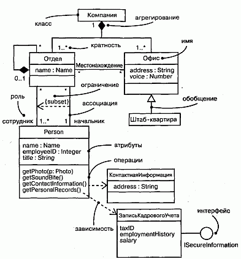
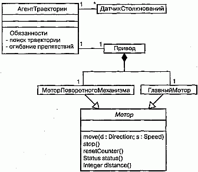
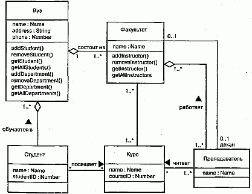
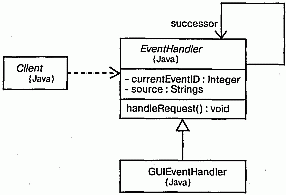

http://bourabai.kz/dbt/uml/ch8.htm

Часть II - Основы структурного моделирования
# Глава 8. Диаграммы классов
* Введение
* Термины и понятия
    * Общие свойства
    * Содержание
    * Типичные примеры применения
* Типичные приемы моделирования
    * Простые кооперации
    * Логическая схема базы данных
    * Прямое и обратное проектирование
* Советы

Диаграммы классов при моделировании объектно-ориентированных систем встречаются чаще других. На таких диаграммах показывается множество классов, интерфейсов, коопераций и отношений между ними.

Диаграммы классов используются для моделирования статического вида системы с точки зрения проектирования. Сюда по большей части относится моделирование словаря системы, коопераций и схем. Кроме того, диаграммы классов составляют основу еще двух диаграмм - компонентов и развертывания.

Диаграммы классов важны не только для визуализации, специфицирования и документирования структурных моделей, но также для прямого и обратного проектирования исполняемых систем.

## Введение
Строя дом, вы начинаете со словаря, включающего его основные строительные блоки: стены, потолки, окна, двери, полы, стропила. Хотя все эти сущности носят преимущественно структурный характер (например, стена характеризуется высотой, шириной и толщиной), они имеют еще и поведенческие особенности (скажем, стены могут выдерживать определенную нагрузку, двери - открываться и закрываться; имеются ограничения на длину пролета без опор). Структурные и поведенческие аспекты нельзя рассматривать изолированно. Напротив, при строительстве дома необходимо учитывать их взаимодействие. Процесс архитектурного проектирования состоит в том, чтобы, объединив все вышеупомянутые сущности, смоделировать красивое и непохожее на другие здание, способное удовлетворить все ваши функциональные и нефункциональные потребности. При этом чертежи, создаваемые для визуализации дома и специфицирования его деталей для подрядчика, представляют собой графическое изображение всех составляющих его элементов и их взаимодействие.

Создание программного обеспечения похоже на строительство дома, но в силу умозрительной природы программ вы можете сами с нуля создавать нужные строительные блоки. В UML диаграммы классов служат для визуализации статических аспектов этих строительных блоков и их отношений, а также для специфицирования деталей конструкции (см. рис. 8.1).

#### Рис. 8.1 Диаграмма классов

## Термины и понятия
Диаграммой классов (Class diagram) называют диаграмму, на которой показано множество классов, интерфейсов, коопераций и отношений между ними. Ее изображают в виде множества вершин и дуг.

### Общие свойства
Диаграмме классов присущи общие для всех диаграмм свойства (см. главу 7): имя и графическое содержание, являющееся одной из проекций модели. Вместе с тем диаграммы такого рода отличаются от остальных специфичным содержанием

Содержание
Диаграммы классов обычно содержат следующие сущности:

* классы (см. главы 4 и 9);
* интерфейсы (см. главу 11);
* кооперации (см. главу 27);
* отношения зависимости, обобщения и ассоциации (см. главы 5 и 10).

Подобно всем остальным диаграммам, они могут включать в себя примечания и ограничения.

Также в диаграммах классов могут присутствовать пакеты (см. главу 12) или подсистемы (см. главу 31), применяемые для группирования элементов модели в более крупные блоки. Иногда в эти диаграммы помещают экземпляры (см. главу 13), особенно если требуется визуализировать их тип (возможно, динамический).

> Примечание: На диаграммы классов похожи диаграммы компонентов и развертывания, но вместо классов они содержат соответственно компоненты и узлы.

### Типичные примеры применения
Диаграммы классов применяют для моделирования статического вида системы с точки зрения проектирования. В этом представлении удобнее всего описывать функциональные требования к системе - услуги, которые она предоставляет конечному пользователю.

Обычно диаграммы классов используются в следующих целях:

* для моделирования словаря системы (см. главу 4). Моделирование словаря системы предполагает принятие решения о том, какие абстракции являются частью системы, а какие - нет. С помощью диаграмм классов вы можете определить эти абстракции и их обязанности;
* для моделирования простых коопераций (см. главу 27). Кооперация - это сообщество классов, интерфейсов и других элементов, работающих совместно для обеспечения некоторого кооперативного поведения, более значимого, чем сумма составляющих его элементов. Например, моделируя семантику транзакций в распределенной системе, вы не сможете понять происходящие процессы, глядя на один-единственный класс, поскольку соответствующая семантика обеспечивается несколькими совместно работающими классами. С помощью диаграмм классов удается визуализировать и специфицировать эти классы и отношения между ними;
* для моделирования логической схемы базы данных. Логическую схему можно представлять себе как чертеж концептуального проекта базы данных. Во многих сферах деятельности требуется хранить устойчивую (persistent) информацию (см. главу 23) в реляционной или объектно-ориентированной базе данных. Моделировать схемы (см. главу 29) также можно с помощью диаграмм классов.

## Типичные приемы моделирования

### Простые кооперации

Классы не существуют сами по себе. Любой класс функционирует совместно с другими, реализуя семантику, выходящую за границы каждого отдельного элемента. Таким образом, кроме определения словаря системы нужно уделить внимание визуализации, специфицированию, конструированию и документированию различных способов совместной работы вошедших в словарь сущностей. Для моделирования такого "сотрудничества" применяются диаграммы классов.

Создавая диаграмму классов, вы просто моделируете часть сущностей и отношений, описываемых в представлении системы с точки зрения проектирования. Желательно, чтобы каждая диаграмма описывала только одну кооперацию.

Моделирование кооперации осуществляется следующим образом:

1. Идентифицируйте механизмы, которые вы собираетесь моделировать. Механизм - это некоторая функция или поведение части моделируемой системы, появляющееся в результате взаимодействия сообщества классов, интерфейсов и других сущностей. (Механизмы, как правило, тесно связаны с прецедентами, см. главу 16.)
2. Для каждого механизма идентифицируйте классы, интерфейсы и другие кооперации, принимающие участие в рассматриваемой кооперации. Идентифицируйте также отношения между этими сущностями.
3. Проверьте работоспособность системы с помощью прецедентов (см. главу 15). По ходу дела вы, возможно, обнаружите, что некоторые ее части оказались пропущены, а некоторые - семантически неправильны.
4. Заполните идентифицированные элементы содержанием. Что касается классов, начните с правильного распределения обязанностей; позже можно будет превратить их в конкретные атрибуты и операции.

В качестве примера на рис. 8.2 показаны классы, взятые из реализации автономного робота. Основное внимание здесь уделено тем классам, которые участвуют в механизме движения робота по заданной траектории. Как видно из рисунка, существует один абстрактный класс Мотор с двумя конкретными потомками, Мо-торПоворотногоМеханизма и ГлавныйМотор, которые наследуют пять операций их родителя. Эти два класса, в свою очередь, являются частью класса Привод. Класс АгентТраектории связан отношением ассоциации "один к одному" с классом Привод и отношением "один ко многим" - с классом ДатчикСтолкновений. Для класса АгентТраектории не показано ни атрибутов, ни операций, хотя приведены обязанности.

#### Рис. 8.2 Моделирование простых коопераций

В описанную систему, конечно, входит значительно больше классов, но внимание на диаграмме заостряется только на таких абстракциях, которые непосредственно участвуют в движении робота. Некоторые указанные классы могут присутствовать и на других диаграммах. Например, хотя здесь это не показано, АгентТраектории сотрудничает по крайней мере еще с двумя классами (Окружение и АгентЦели) в механизме более высокого уровня, управляющем поведением робота при наличии конфликтующих целей. ДатчикСтолкновений и Привод, а также их части сотрудничают с другим, не показанным на диаграмме классом АгентОтказа в механизме, отвечающем за постоянный контроль аппаратных сбоев. Описывая каждую из этих коопераций в отдельных диаграммах, вы сможете создать простое для восприятия представление системы с различных точек зрения.

### Логическая схема базы данных
Многие моделируемые системы содержат устойчивые объекты, то есть такие, которые можно сохранять в базе данных и впоследствии извлекать при необходимости (см. главу 23). Для этого чаще всего используют реляционные, объектно-ориентированные или гибридные объектно-реляционные базы данных. UML позволяет моделировать логические схемы баз данных, равно как и сами физические базы (см. главу 29).

Диаграммы классов UML включают в себя, как частный случай, диаграммы "сущность-связь" (E-R диаграммы), которые часто используются для логического проектирования баз данных. Но если в классических E-R диаграммах внимание сосредоточено только на данных, диаграммы классов - это шаг вперед: они позволяют моделировать также и поведение. В реальной базе данных подобные логические операции обычно трансформируются в триггеры или хранимые процедуры.

Моделирование схемы производится следующим образом:

1. Идентифицируйте классы вашей модели, состояние которых должно сохраняться и после завершения работы создавшего их приложения.
2. Создайте содержащую эти классы диаграмму классов и характеризуйте их как устойчивые с помощью стандартного помеченного значения persistent (устойчивый). Для работы со специфическими деталями базы данных вы можете определить и свои собственные помеченные значения.
3. Раскройте структурные особенности классов. В общем случае это означает, что надо детально специфицировать их атрибуты и обратить особое внимание на ассоциации и их кратности.
4. Поищите типичные структурные образцы, усложняющие проектирование физической базы данных, например циклические ассоциации, ассоциации "один к одному" и n-арные ассоциации. При необходимости создайте промежуточные абстракции для упрощения логической структуры.
5. Рассмотрите поведение этих классов, раскрывая операции, важные для доступа к данным и поддержания их целостности. В общем случае для лучшего разделения обязанностей бизнес-правила, отвечающие за манипуляции наборами объектов, должны быть инкапсулированы в слое, находящемся над этими устойчивыми классами.

Старайтесь использовать в своей работе инструментальные средства, позволяющие преобразовать логический проект в физический
> Примечание: Рассмотрение логического проектирования базы данных выходит за рамки данной книги, цель которой состоит только в том, чтобы показать, как моделировать схемы с помощью языка UML. На практике все сводится к применению стереотипов (см. главу 6), настроенных на конкретный тип используемой базы данных (реляционной или объектно-ориентированной).

На рис. 8.3 показана совокупность классов, взятых из информационной системы вуза. Этот рисунок является расширением приведенной ранее диаграммы классов и содержит достаточное количество деталей для конструирования физической базы данных. В левой нижней части диаграммы расположены классы Студент, Курс и Преподаватель. Между классами Студент и Курс есть ассоциация, показывающая, что студенты могут посещать курсы. Более того, каждый студент может посещать любое количество курсов и на каждый курс может записаться любое число студентов.

#### Рис. 8.3 Моделирование схемы

Все шесть классов на диаграмме помечены как устойчивые (persistent), то есть их экземпляры должны содержаться в базе данных или каком-то ином хранилище. Приведены также атрибуты всех шести классов. Обратите внимание, что все атрибуты являются примитивными типами (см. главу 4). Моделируя схему, отношения с непримитивными типами лучше всего представлять с помощью явного агрегирования (см. главы 5 и 10), а не с помощью атрибутов.

Два класса (Вуз и Факультет) содержат несколько операций, позволяющих манипулировать их частями. Эти операции включены из-за их важности для поддержания целостности данных (например, добавление или удаление Факультета затрагивает целый ряд других объектов).

Существует много других операций, которые стоило бы рассмотреть при проектировании этих и иных классов, например запрос о необходимых предварительных знаниях перед зачислением студента на курс. Но это, скорее, бизнес-правила, а не операции по поддержанию целостности данных, поэтому лучше располагать их на более высоком уровне абстракции.

### Прямое и обратное проектирование
Моделирование, конечно, важная вещь, но следует помнить, что основным результатом деятельности группы разработчиков являются не диаграммы, а программное обеспечение. Все усилия по созданию моделей направлены только на то, чтобы в оговоренные сроки написать программу, которая отвечает изменяющимся потребностям пользователей и бизнеса. Поэтому очень важно, чтобы ваши модели и основанные на них реализации соответствовали друг другу, причем с минимальными затратами по поддержанию синхронизации между ними (см. главу 1).

Иногда UML применяется так, что создаваемая модель впоследствии не отображается ни в какой программный код. Если вы, например, моделируете с помощью диаграмм действий (см. главу 19) бизнес-процесс, то во многих действиях будут участвовать люди, а не компьютеры. В других случаях необходимо моделировать системы, составными частями которых на данном уровне абстракции являются только аппаратные средства (хотя на другом уровне абстракции вполне может оказаться, что они содержат встроенные процессоры с соответствующим программным обеспечением).

Но чаще всего модели все-таки преобразуются в код. Хотя UML не определяет конкретного способа отображения на какой-либо объектно-ориентированный язык, он проектировался с учетом этого требования. В наибольшей степени это относится к диаграммам классов, содержание которых без труда отображается на такие известные объектно-ориентированные языки программирования, как Java, C++, Smalltalk, Eiffel, Ada, ObjectPascal и Forte. Кроме того, в проект UML была заложена возможность отображения на коммерческие объектные языки, например Visual Basic.

> Примечание: Раскрытие темы отображения UML на конкретные языки программирования для прямого и обратного проектирования выходит за рамки данной книги. На практике этот процесс сводится к использованию стереотипов и помеченных значений (см. главу 6), настроенных на определенный язык.

Прямым проектированием (Forward engineering) называется процесс преобразования модели в код путем отображения на некоторый язык реализации. Процесс прямого проектирования приводит к потере информации, поскольку написанные на языке UML модели семантически богаче любого из существующих объектно-ориентированных языков. Фактически именно это различие и является основной причиной, по которой мы, помимо кода, нуждаемся и в моделях. Некоторые структурные свойства системы, такие как кооперации, или ее поведенческие особенности, например взаимодействия, могут быть легко визуализированы в UML, но в чистом коде наглядность теряется.

Прямое проектирование диаграммы классов производится следующим образом:

1. Идентифицируйте правила отображения модели на один или несколько языков программирования по вашему выбору. Это допустимо делать как при работе над одним конкретным проектом, так и для вашей организации в целом.
2. В зависимости от семантики выбранных языков, вероятно, придется отказаться от использования некоторых возможностей UML. Например, язык UML допускает множественное наследование, а язык программирования Smalltalk - только одиночное. В связи с этим можно или запретить авторам моделей пользоваться множественным наследованием (что сделает создаваемые модели зависимыми от языка), или разработать идиомы для трансляции таких расширенных возможностей в конструкции, поддерживаемые данным языком программирования (что усложнит отображение).
3. Применяйте помеченные значения для специфицирования языка программирования. Это можно сделать как на уровне индивидуальных классов (если нужна тонкая настройка), так и на более высоком уровне, например для пакетов или коопераций.
4. Пользуйтесь инструментальными средствами для прямого проектирования моделей.

На рис. 8.4 изображена простая диаграмма классов, на которой проиллюстрирована реализация образца (см. главу 28) цепочки обязанностей. В данном примере представлены три класса: Client (Клиент), EventHandler (Обработ-чикСобытий) и GUIEventHandler (ОбработчикСобытийГИП). Первые два из них являются абстрактными, а последний - конкретным. Класс EventHandler содержит обычную для данного образца операцию handleRequest (обработатьЗапрос), хотя в рассматриваемом случае было добавлено два скрытых атрибута.

#### Рис. 8.4 Прямое проектирование

Определенное для каждого класса помеченное значение показывает, что они будут преобразованы в код на языке Java. Прямое проектирование в данном случае легко осуществимо с помощью специального инструмента. Так, для класса EventHandler будет сгенерирован следующий код:

	public abstract class EventHandler {
	  EventHandler successor;
	  private Integer currentEventID;
	  private String source;
	  EventHandler()   {}	
	  public void handleRequest()   {} 
	}

Обратным проектированием (Reverse engineering) называется процесс преобразования в модель кода, записанного на каком-либо языке программирования. В результате этого процесса вы получаете огромный объем информации, часть которой находится на более низком уровне детализации, чем необходимо для построения полезных моделей. В то же время обратное проектирование никогда не бывает полным. Как уже упоминалось, прямое проектирование ведет к потере информации, так что полностью восстановить модель на основе кода не удастся, если только инструментальные средства не включали в комментариях к исходному тексту информацию, выходящую за пределы семантики языка реализации. Пример, представленный на рис. 3.3, был создан с помощью обратного проектирования библиотеки классов языка Java.

Обратное проектирование диаграммы классов осуществляется так:

1. Идентифицируйте правила для преобразования из выбранного вами языка реализации. Это можно сделать на уровне проекта или организации в целом.
2. С помощью инструментального средства укажите код, который вы хотите подвергнуть обратному проектированию. Воспользуйтесь этим средством для создания новой модели или для модификации ранее созданной.
3. Пользуясь инструментальными средствами, создайте диаграмму классов путем опроса полученной модели. Можно начать, например, с одного или нескольких классов, а затем расширить диаграмму, следуя вдоль некоторых отношений или добавив соседние классы. Раскройте или спрячьте детали содержания диаграммы в зависимости от ваших намерений.

## Советы
Создавая диаграмму классов на языке UML, помните, что это всего лишь графическое изображение статического вида системы с точки зрения проектирования. Взятая в отрыве от остальных, ни одна диаграмма классов не может и не должна охватывать этот вид целиком. Диаграммы классов описывают его исчерпывающе, но каждая в отдельности - лишь один из его аспектов.

Хорошо структурированная диаграмма классов обладает следующими свойствами:

* заостряет внимание только на одном аспекте статического вида системы с токи зрения проектирования;
* содержит лишь элементы, существенные для понимания данного аспекта;
* показывает детали, соответствующие требуемому уровню абстракции, опуская те, без которых можно обойтись;
* не настолько лаконична, чтобы ввести читателя в заблуждение относительно важных аспектов семантики.

При изображении диаграммы классов руководствуйтесь следующими правилами:

* дайте диаграмме имя, связанное с ее назначением;
* располагайте элементы так, чтобы свести к минимуму число пересекающиеся линий;
* пространственно организуйте элементы так, чтобы семантически близкие сущности располагались рядом;
* чтобы привлечь внимание к важным особенностям диаграммы, используйте примечания и цвет;
* старайтесь не показывать слишком много разных видов отношений; как правило, в каждой диаграмме классов должны доминировать отношения какого-либо одного вида.

