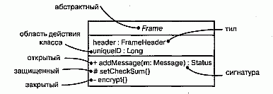
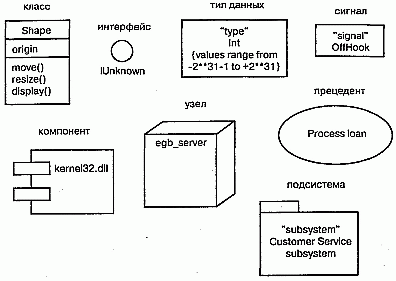
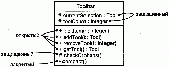
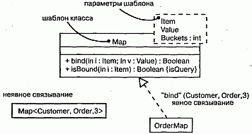

http://bourabai.kz/dbt/uml/ch9.htm

ЧАСТЬ III - Изучение структурного моделирования
# Глава 9. Углубленное изучение классов
* Введение
* Термины и понятия
    * Классификаторы
    * Видимость
    * Область действия
    * Абстрактные, корневые, листовые и полиморфные элементы
    * Кратность
    * Атрибуты
    * Операции
    * Шаблоны классов
    * Стандартные элементы
* Типичные приемы моделирования
    * Семантика класса
* Советы

Классы - это самые важные строительные блоки объектно-ориентированных систем. Однако классы являются всего лишь одной из разновидностей более общих строительных блоков UML - классификаторов. Классификатор - это механизм, описывающий структурные и поведенческие свойства. К числу классификаторов относятся классы, интерфейсы, типы данных, сигналы, компоненты, узлы, прецеденты (варианты использования) и подсистемы.

Классификаторы, и в особенности классы, характеризуются большим количеством дополнительных свойств, кроме простейших, таких как атрибуты и операции, которые были описаны в предыдущих разделах (см. главу 4). Можно моделировать кратность, видимость, сигнатуры, полиморфизм и другие характеристики. Язык UML позволяет определить семантику класса с расчетом на любой нужный вам уровень формализации.

В UML существует несколько разновидностей классификаторов и классов; важно выбрать ту из них, которая позволяет лучше всего моделировать необходимую вам абстракцию реальности.

## Введение
На определенном этапе строительства дома вам надлежит принять решение о том, какие материалы нужно использовать (см. главу 2). В самом начале достаточно лишь указать, что это будет дерево, камень или сталь. Такой степени детализации довольно для того, чтобы двигаться дальше. На выбор материалов, разумеется, будут влиять требования проекта, - например, сталь и бетон подойдут, если дом должен выдерживать натиск ураганов. Впоследствии ваш выбор определит дальнейшее развитие проекта, - скажем, выбрав дерево вместо стали, вы должны будете учитывать, что оно выдерживает меньшую нагрузку.

По мере дальнейшей работы над проектом базовые решения придется уточнить и добавить ряд деталей, которые позволят конструктору произвести расчеты на прочность, а строителям - приступить к возведению дома. Например, вы можете выбрать не просто дерево, но дерево определенной твердости или пропитанное определенным составом, который защищает древесину от насекомых.

Те же самые правила применимы и к созданию программного обеспечения. В самом начале работы над проектом достаточно сказать, что вы собираетесь использовать класс Клиент, выполняющий определенные обязанности (см. главу 6). По мере уточнения архитектуры и перехода к конструированию придется определить структуру класса (его атрибуты) и его поведение (операции), необходимые и достаточные для выполнения указанных обязанностей. Наконец, дойдя до стадии преобразования модели в исполняемую систему, вы должны будете смоделировать и такие детали, как видимость отдельных атрибутов и операций, семантику параллелизма класса в целом и его операций, а также реализуемые классом интерфейсы. Как видно из рис. 9.1, язык UML позволяет определять большое количество развитых свойств класса. Эта нотация дает возможность визуализировать, специфицировать, конструировать и документировать класс на любом желаемом уровне детализации, достаточном для поддержки прямого и обратного проектирования моделей и кода (см. главы 8, 14, 17-19, 24, 29, 30).

vРис. 9.1 Развитые свойства класса

## Термины и понятия
Классификатор (Classifier) - это механизм, описывающий структурные и поведенческие свойства. К числу классификаторов относятся классы, интерфейсы, типы данных, сигналы, компоненты, узлы, прецеденты и подсистемы.

### Классификаторы
В процессе моделирования вы сталкиваетесь с абстракциями сущностей, принадлежащих реальному миру, и сущностей, введенных вами для решения задачи (см. главу 4). Например, при создании системы заказов, работающей через сеть Internet, вам, скорее всего, придется включить в проект класс Клиент (описывающий заказчика) и класс Транзакция (артефакт реализации, соответствующий атомарному действию). В детализированной системе, вероятно, будет еще компонент Цены, экземпляры которого размещаются на всех клиентских узлах. Каждая из перечисленных абстракций фигурирует в модели вместе со своими конкретными экземплярами, поэтому разделение логики и экземпляров сущностей является важной частью моделирования. (Дихотомия "класс/объект" обсуждается в главе 2.)

Некоторые сущности в UML не имеют экземпляров (см. главу 13). К их числу относятся, например, пакеты (см. главу 12) и отношения обобщения (см. главы 5 и 10). В общем смысле те элементы моделирования, которые могут иметь экземпляры, называются классификаторами (ассоциации, рассматриваемые в главах 5 и 10, и сообщения, обсуждаемые в главе 15, также могут иметь экземпляры, но они отличаются от экземпляров классов). Еще важнее то, что классификаторы характеризуются структурными (в форме атрибутов) и поведенческими (в форме операций) свойствами. Все экземпляры одного классификатора обладают общим рядом свойств.

Самым важным видом классификатора в UML является класс. Классом называется описание совокупности объектов с общими атрибутами, операциями, отношениями и семантикой. Однако помимо классов существуют и другие классификаторы:

* интерфейс - набор операций, используемых для того, чтобы специфицировать услуги, предоставляемые классом или компонентом (см. главу 11);
* тип данных - тип, значения которого не индивидуализированы; сюда входят примитивные встроенные типы, такие как числа и строки, а также перечислимые типы, например Boolean (см. главу 4);
* сигнал - спецификация асинхронного стимула, используемого для связи между экземплярами (см. главу 20);
* компонент - физическая замещаемая часть системы, соответствующая спецификации набора интерфейсов и обеспечивающая их реализацию (см. главу 25);
* узел - физический элемент, который существует во время выполнения приложения и представляет собой вычислительный ресурс; обычно он обладает, как минимум, некоторой памятью, а иногда и способностью к обработке данных (см. главу 26);
* прецедент, или вариант использования, - описание совокупности последовательностей действий (в том числе вариантных), выполняемых системой, которые вызывают наблюдаемое изменение, представляющее интерес для конкретного актера (см. главу 16);
* подсистема - совокупность элементов, из которых отдельные составляют спецификацию поведения других элементов (см. главу 31).

Почти каждый из перечисленных видов классификаторов обладает как структурными, так и поведенческими свойствами (исключением являются интерфейсы -они могут не иметь атрибутов). Используя любой из них в модели, вы можете применять все описанные в этой главе свойства, обеспечивая такой уровень детализации, который необходим для адекватного описания сути вашей абстракции.

Графические изображения классификаторов представлены на рис. 9.2.

#### Рис. 9.2 Классификаторы

> Примечание: Придерживаясь минималистского подхода, можно было бы использовать одну и ту же пиктограмму для всех классификаторов. Однако это неразумно, поскольку, например, классы и компоненты являются принципиально разными абстракциями (первый - логической, а второй - физической), и на этом основании стоит отвести для них несходные графические образы. С другой стороны, бросаться в противоположную крайность - использовать различные пиктограммы для каждого типа классификаторов - также нe имeem смысла, поскольку, например, классы и типы данных не слишком различаются между собой. В языке UML найден компромисс: существенно различающиеся классификаторы имеют собственные пиктограммы, а остальные выделяются специальными ключевыми словами (такими, как type, signal или subsystem).

### Видимость
Одна из деталей, наиболее существенных для атрибутов и операций классификаторов, - их видимость. Видимость свойства говорит о том, может ли оно использоваться другими классификаторами. Естественно, это подразумевает видимость самого классификатора. Один классификатор может "видеть" другой, если тот находится в области действия первого и между ними существует явное или неявное отношение (см. главы 5 и 10). В языке UML можно определить три уровня видимости:

* public (открытый) - любой внешний классификатор, который "видит" данный, может пользоваться его открытыми свойствами. Обозначается знаком + (плюс) перед именем атрибута или операции;
* protected (защищенный) - любой потомок данного классификатора (см. главу 5) может пользоваться его защищенными свойствами. Обозначается знаком # (диез);
* private (закрытый) - только данный классификатор может пользоваться закрытыми свойствами. Обозначается символом - (минус).

На рис. 9.3 показаны открытые, защищенные и закрытые атрибуты и методы для класса Toolbar.

#### Рис. 9.3 Видимость

Видимость свойств классификатора определяют для того, чтобы скрыть детали его реализации и показать только те особенности, которые необходимы для осуществления обязанностей, продекларированных абстракцией. В этом и заключается основная причина сокрытия информации, без чего не обойтись при создании надежной и гибкой системы. Если символ видимости явно не указан, обычно предполагается, что свойство является открытым. Отношения дружественности (Friendship) позволяют классификатору показывать другим свои закрытые детали (см. главу 10).

> Примечание: Видимость в UML соответствует общепринятой семантике большинства языков программирования, таких как С++, Java, Ada и Eiffel.

### Область действия
Еще одной важной характеристикой атрибутов и операций классификатора является область действия (Scope). Задавая область действия некоторого свойства, тем самым указывают, будет ли оно проявлять себя по-разному в каждом экземпляре (см. главу 13) классификатора, или одно и то же значение свойства будет разделяться (то есть совместно использоваться) всеми экземплярами. В UML определены два вида областей действия:

* instance (экземпляр) - у каждого экземпляра классификатора есть собственное значение данного свойства;
* classifier (классификатор) - все экземпляры классификатора совместно используют общее значение данного свойства.

На рис. 9.4 (упрощенный вариант предыдущего рисунка) показано, что имя свойства, которое имеет область действия classifier, подчеркивается. Если подчеркивание отсутствует, предполагается область действия instance.

#### Рис. 9.4 Область действия

Как правило, свойства моделируемых классификаторов имеют область действия экземпляра. Свойства с областью действия классификатора чаще всего применяются для описания закрытых атрибутов, общих для всех экземпляров, например для генерации уникальных идентификаторов или в операциях, создающих экземпляры класса.

### Абстрактные, корневые, листовые и полиморфные элементы
Отношения обобщения используются для моделирования иерархии классов, верхние уровни которой занимают общие абстракции, а ниже находятся специализированные (см. главы 5 и 10). Внутри этой иерархии некоторые классы определяют как абстрактные, то есть не имеющие непосредственных экземпляров (см. главу 13). В языке UML имя абстрактного класса пишут курсивом. Например, как видно из рис. 9.5, абстрактными являются классы Icon, Rectangularlcon и Arbitrarylcon. Наоборот, конкретными называются классы, которые могут иметь непосредственные экземпляры (на рис. 9.5 это Button и OkButton).

#### Рис. 9.5 Абстрактные и конкретные классы и операции

При моделировании класса часто возникает потребность задать ему свойства, унаследованные от более общих классов и, наоборот, предоставить возможность более специализированным классам наследовать особенности данного. Такая семантика легко обеспечивается для классов средствами UML. Можно определить и такие классы, у которых нет потомков. Они называются листовыми и задаются в UML c помощью свойства leaf, написанного под именем класса. Например, класс OkButton на рис. 9.5 является листовым и поэтому не имеет потомков.

Реже используется, хотя и остается весьма полезной, возможность задать класс, не имеющий родителей. Такой класс называется корневым и специфицируется с помощью свойства root, записанного под его именем. На рис. 9.5 корневым является класс Icon. Если имеется несколько независимых иерархий наследования, то начало каждой удобно обозначать таким способом.

Операции могут иметь сходные свойства. Как правило, операции являются полиморфными, - это значит, что в различных местах иерархии классов можно определять операции с одинаковыми сигнатурами. При этом те операции, которые определены в классе-потомке, перекрывают действие тех, что определены в родительских классах. Когда во время исполнения системы поступает какое-то сообщение (см. главу 15), операция по его обработке вызывается полиморфно, -иными словами, выбирается та, которая соответствует типу объекта. На рис. 9.5 операции display и islnside являются полиморфными, a Icon: :display ( ), кроме того, еще и абстрактна. Это значит, что она неполна и реализацию должен предоставить потомок. В UML имена абстрактных операций пишутся курсивом, как и в случае с классами. Напротив, операция Icon: : get ID () является листовой, на что указывает слово leaf. Это означает, что данная операция не полиморфна и не может быть перекрыта другой.

> Примечание: Абстрактные операции соответствуют чисто виртуальным операциям языка C++, листовые операции - невиртуальным операциям этого языка

### Кратность
При работе с классом разумно предположить, что может существовать любое количество его экземпляров (см. главу 13) - если, конечно, это не абстрактный класс, у которого вообще не существует непосредственных экземпляров, хотя у его потомков их может быть любое количество. В некоторых случаях, однако, число экземпляров класса нужно ограничить. Чаще всего возникает необходимость задать класс, у которого:

* нет ни одного экземпляра - тогда класс становится служебным (Utility), содержащим только атрибуты и операции с областью действия класса; D ровно один экземпляр - такой класс называют синглетным (Singleton);
* заданное число экземпляров;
* произвольное число экземпляров - вариант по умолчанию.

Количество экземпляров класса называется его кратностью. В общем смысле кратность - это диапазон возможных кардинальных чисел некоторой сущности (кратность встречается также у ассоциаций, см. главы 5 и 10). В языке UML кратность класса задается выражением, написанным в правом верхнем углу его пиктограммы. Например, как показано на рис. 9.6, класс NetworkController является синглетным, а у класса ControlRod имеется ровно три экземпляра.

#### Рис. 9.6 Кратность

Кратность применима и к атрибутам (их связь с семантикой ассоциаций обсуждается в главе 10). Кратность атрибута записывают в виде выражения, заключенного в квадратные скобки и расположенного сразу после имени атрибута. Например, у экземпляра класса NetworkController может быть два или более экземпляров атрибута consolePort.

### Атрибуты
На самом высоком уровне абстракции, моделируя структурные свойства класса (то есть атрибуты), вы просто записываете их имена. Обычно этого вполне достаточно, чтобы читатель мог понять общее назначение модели. В дополнение к этому, как было описано выше, можно определить видимость, область действия и кратность каждого атрибута. Кроме того, можно задать тип, начальное значение и изменяемость атрибутов. А для обозначения множества логически связанных атрибутов допустимо использовать стереотипы (см. главу 6).

Полная форма синтаксиса атрибута в языке UML следующая:

	[visibility] name [multiplicity]   [: type] 
	  [= initial-value]   [{property-string}]

Ниже приводятся примеры допустимых объявлений атрибутов:

* origin - только имя;
* + origin - видимость и имя;
* origin : Point - имя и тип;
* head : *Item - имя и сложный тип;
* name [ 0 . . 1 ] : String - имя, кратность и тип;
* origin : Point = (0 , 0) - имя, тип и начальное значение;
* id : Integer {frozen} - имя и свойство.

Наряду с атрибутами можно использовать три свойства:

* changeable (изменяемый) - ограничений на изменение значений атрибута не установлено;
* addOnly (только добавляемый) - разрешается добавлять новые значения для атрибутов с кратностью больше единицы, но созданное значение не может быть изменено или удалено;
* frozen (замороженный) - после инициализации объекта нельзя изменять значения его атрибутов.

Если явно не оговорено противное, то все атрибуты изменяемы (changeable). При моделировании постоянных или однократно задаваемых атрибутов можно использовать свойство frozen.

> Примечание: Свойство frozen соответствует ключевому слову const вязыке C++.

### Операции
На самом высоком уровне абстракции при моделировании поведенческих характеристик класса (то есть его операций и сигналов, см. главу 20) вы просто записываете их имена. Этого обычно бывает достаточно, чтобы читатель мог понять общее назначение модели. Кроме этого, как описывалось в предыдущих разделах, вы можете определить видимость и область действия каждой операции. Можно задать также ее параметры, тип возвращаемого значения, семантику параллелизма и некоторые другие свойства. Имя операции совместно с ее параметрами (включая тип возвращаемого значения, если таковое имеется) называют сигнатурой операции. Для описания множества логически связанных операций, таких, например, как вспомогательные функции, можно использовать стереотипы (см. главу 6).

> Примечание: В языке UML существует различие между операцией и методом. Операциями называются услуги, которые можно запросить у любого объекта класса для изменения поведения; метод - это реализация операции. Для любой неабстрактной операции класса должен быть определен метод, содержащий ее исполняемый алгоритм (обычно записываемый в виде структурированного текста или на каком-либо языке программирования). В иерархии наследования для одной операции может быть определено несколько методов, из которых нужный полиморфно выбирается во время выполнения.

Полный синтаксис операции в языке UML таков:

	[visibility] name [(parameter-list)]   [: return-type] 
	  [{property-string}]

Ниже приводятся некоторые допустимые объявления операций:

display - только имя;
\+ display - видимость и имя;
set (n: Name, s: String) - имя и параметры;
getID() : Integer - имя и возвращаемое значение;
restart() {guarded} - имя и свойство.
Сигнатура операции может содержать ноль или более параметров, каждый из которых имеет следующий синтаксис:

    [direction] name : type [= default-value] 

Параметр direction может принимать любое из нижеперечисленных значений:

* in - входящий параметр, который не может быть модифицирован;
* out - выходящий параметр, который может быть изменен, чтобы передать информацию вызвавшей процедуре;
* inout - входящий параметр, который может быть изменен.

Помимо описанного ранее свойства leaf для операций определены еще четыре свойства:

* isQuery (запрос) - выполнение операции не изменяет состояния системы. Другими словами, операция является просто функцией без побочных эффектов;
* sequential (последовательная) - при вызове операции необходимо гарантировать, что в любой момент объект выполняет только один поток. При наличии нескольких потоков управления нельзя обеспечить семантику и целостность объекта;
* guarded (охраняемая) - семантика и целостность объекта при наличии нескольких потоков управления гарантируются упорядочением всех обращений к его охраняемым операциям. На практике это означает возможность вызова только одной операции объекта в любой момент времени, то есть все сводится к семантике sequential;
* concurrent (параллельная) - семантика и целостность объекта при наличии нескольких потоков управления гарантируются благодаря тому, что операция рассматривается как атомарная. Разные параллельные потоки управления могут одновременно вызывать одну и ту же параллельную операцию объекта без нарушения семантики. Проектировать параллельные операции необходимо так, чтобы обеспечивалась корректность работы в случае одновременного выполнения в том же объекте какой-либо последовательной или охраняемой операции.

Последние три свойства (sequential, guarded и concurrent) описывают семантику параллелизма операции, поэтому задавать их имеет смысл только при наличии в вашей модели активных объектов, процессов или нитей (см. главу 22).

### Шаблоны классов
Шаблоном называется параметризованный элемент. В таких языках программирования, как C++ или Ada, предусмотрена возможность создавать шаблоны классов, определяющие семейства классов (можно задавать также шаблоны функций, определяющие семейства функций). Параметрами шаблона могут быть классы, объекты или значения. Шаблон нельзя использовать непосредственно; сначала его нужно инстанцировать, то есть конкретизировать. Процесс инстанцирова-ния - это связывание формальных параметров шаблона с фактическими. В результате из шаблона класса получается конкретный класс, с которым можно работать как с любым другим.

Чаще всего шаблоны классов используют при описании контейнеров, чтобы затем инстанцировать их для хранения конкретных элементов, - такой подход делает их безопасными по отношению к типам. Например, в нижеприведенном фрагменте кода на языке C++ объявляется параметризованный класс Map (Карта).

	template<class Item, class Value, int Buckets>
	class Map {
	public:
	  virtual Boolean bind (const Item&, const Value&);
	  virtual Boolean isBound (const Items) const;
	  . . .
	};

Затем можно инстанцировать этот шаблон для отображения объектов класса Customer (Клиент) на объекты класса Order (Заказ):

	m : Map <Customer, Order, 3>

Язык UML также позволяет моделировать шаблоны классов (базовые свойства классов обсуждаются в главе 4). Как видно из рис. 9.7, такой класс изображается в точности как обычный, но в верхнем правом углу его пиктограммы находится дополнительная ячейка, нарисованная пунктиром; в ней перечислены параметры шаблона.

#### Рис. 9.7 Шаблоны классов

На данном рисунке показано также, что моделировать инстанцирование шаблона класса можно двумя способами. Во-первых - неявно, для чего требуется объявить класс, имя которого обеспечивает связывание. Во-вторых, можно явным образом определить зависимость (см. главы 5 и 10) со стереотипом bind (см. главу 6), показывающую, что источник инстанцирует целевой шаблон с заданными фактическими параметрами.

Стандартные элементы
Все механизмы расширения UML (см. главу 6) применимы к классам. Чаще всего для расширения свойств класса (например, для специфицирования его версии) используются помеченные значения, а для определения новых видов компонентов (специфичных для данной модели) - стереотипы.

В UML определены четыре стандартных стереотипа, применимые к классам:

* metaclass - определяет классификатор, все объекты которого являются классами;
* powertype - определяет классификатор, все объекты которого являются потомками данного родителя;
* stereotype - определяет, что данный классификатор является стереотипом, который можно применить к другим элементам;
* utility - определяет класс, атрибуты и операции которого находятся в области действия всех классов.

> Примечание: В следующих главах книги рассматривается ряд других стандартных стереотипов, применимых к классам: interface, type, implementationClass (см. главу 11), actor (см. главу 16), exception, signal (см. главу 20), process и thread.

## Типичные приемы моделирования

### Семантика класса

Чаще всего классы используют для моделирования абстракций, извлеченных из решаемой проблемы или технологии, применяемой для ее решения (см. главу 4). Следующим шагом после того, как вы идентифицировали эти абстракции, будет определение их семантики.

Язык UML предоставляет в ваше распоряжение широчайший спектр возможностей моделирования (см. главу 1), начиная от неформальных (обязанности) и заканчивая сугубо формальными (OCL - язык объектных ограничений). Имея такой богатый выбор, вы сами можете решить, какой уровень детализации необходим для выражения модели. Если создаваемая модель предназначена для общения с конечными пользователями или экспертами в предметной области, то лучше сделать ее менее формальной. Когда в вашу задачу входит двусторонняя поддержка проектирования, то есть переход от модели к коду и обратно, стоит прибегнуть к большей формализации. Если же вам требуется приводить математически строгие суждения о модели и доказывать ее корректность, формализуйте ее настолько, насколько это возможно.

> Примечание: Менее формальная модель - не обязательно менее аккуратная. Скорее, это значит, что она менее полна и детализирована. Вообще, целесообразно придерживаться середины между крайней степенью формализма и неформальным подходом. Необходимо включать достаточно деталей, чтобы можно было конструировать исполняемые артефакты, но в то же время скрывать некоторые элементы, чтобы не запутать читателя.

Для моделирования семантики класса можно воспользоваться любыми из перечисленных ниже возможностей (они расположены в порядке возрастания формализации):

1. Определите обязанности класса. Обязанностью называется контракт или обязательство, "подписываемое" типом или классом (см. главу 4). Изображается оно в виде присоединенного к классу примечания (со стереотипом responsibility) или дополнительного раздела в его пиктограмме.
2. Опишите семантику класса в целом с помощью структурированного текста, который изображается в виде примечания (со стереотипом semantics), присоединенного к классу.
3. Определите тело каждого метода (см. главу 3) с помощью структурированного текста или языка программирования и поместите определение в примечание, присоединенное к операции отношением зависимости.
4. Специфицируйте пред- и постусловия каждой операции (см. главу 19), а также инварианты класса в целом с помощью структурированного текста. Эти элементы изображаются в виде примечаний (со стереотипами precondition, postcondition и invariant), присоединенных к операции или классу отношениями зависимости.
5. Определите автомат класса. Автомат - это алгоритм поведения, описывающий последовательность состояний, через которые проходит объект на протяжении своего жизненного цикла, реагируя на различные события, а также сами реакции на эти события (см. главу 21).
6. Специфицируйте представляющие класс кооперации. Кооперацией называется совокупность ролей и других элементов, работающих совместно для обеспечения некоторого кооперативного поведения, более значимого, чем сумма всех его составляющих (см. главу 27). Поскольку у кооперации имеются структурная и динамическая составляющие, вы можете с их помощью специфицировать все аспекты семантики класса.
7. Определите пред- и постусловия каждой операции и инварианты класса в целом с помощью такого формализованного языка, как ОСL (язык ОСL обсуждается в книге "The Unified Modeling Language Reference Manual")

На практике для моделирования различных абстракций системы используется некоторая комбинация вышеописанных методов. (Для моделирования семантики операций можно применять также диаграммы деятельности, см. главу 19.)

> Примечание: Описывая семантику класса, помните, что ваша главная цель -определить, что и как делает класс. Семантика того, что делает класс, соответствует его открытому, внешнему представлению, а того, как он это делает, - закрытому, внутреннему. Часто используют комбинацию этих двух видов, акцентируя внимание на внешнем представлении для клиентов класса и на внутреннем - для тех, кто его реализует.

## Советы
Моделируя классификаторы в языке UML, помните, что в вашем распоряжении имеется множество строительных блоков - интерфейсы, классы, компоненты и т.д. Из них вы должны выбрать тот, который наилучшим образом соответствует вашей абстракции. Хорошо структурированный классификатор обладает следующими свойствами:

* наделен как структурными, так и поведенческими аспектами;
* внутренне согласован и слабо связан с другими классификаторами;
* раскрывает только те особенности, которые необходимы для использующих класс клиентов, и скрывает остальные;
* его семантика и назначение не допускают неоднозначного толкования;
* не настолько формализован, чтобы лишить всякой свободы тех, кто будет его реализовывать;
* специфицирован в достаточной степени, чтобы исключить неоднозначное толкование его назначения
.
Изображая классификатор в UML, примите во внимание следующие рекомендации:

* показывайте только те его свойства, которые необходимы для понимания абстракции в контексте класса;
* используйте такие стереотипы, которые наилучшим образом отражают назначение классификатора.

