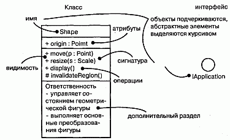
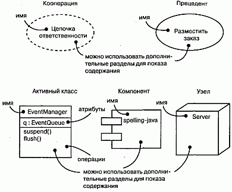
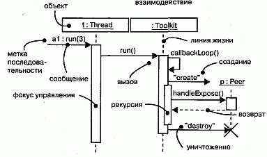
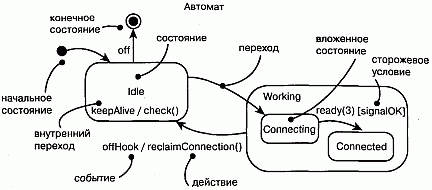
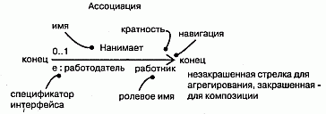
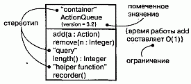

http://bourabai.kz/dbt/uml/prA.htm

ЧАСТЬ VII - Подведем итоги
# Приложение А. Нотация UML
* Сущности
    * Структурные сущности
    * Поведенческие сущности
    * Группирующие сущности
    * Аннотационные сущности
* Отношения
    * Зависимость
    * Ассоциация
    * Обобщение
    * Расширение
* Диаграммы

UML - это язык для визуализации, специфицирования, конструирования и документирования артефактов программной системы (общий обзор UML приведен в главе 2). Унифицированный язык моделирования имеет хорошо определенные синтаксис и семантику; наиболее заметная часть синтаксиса этого языка - его графическая нотация.

В настоящем разделе перечислены элементы нотации UML.

## Сущности

### Структурные сущности
Структурные сущности - это существительные, применяемые в моделях UML. К ним относятся классы (Classes), интерфейсы (Interfaces), кооперации (Collaborations), прецеденты (Use cases), активные классы (Active classes), компоненты (Components) и узлы (Nodes).

#### Рис. prA-1

#### Рис. prA-2

### Поведенческие сущности
Поведенческие сущности - это динамические части моделей UML. К ним относятся взаимодействия (Interactions) и автоматы (State machines).

#### Рис. prA-3

#### Рис. prA-3

### Группирующие сущности
Группирующие сущности - это организационные составляющие моделей UML. К их числу относятся пакеты (Packages).

#### Рис. prA-4

### Аннотационные сущности
Аннотационные сущности - это пояснительные составляющие моделей UML. К их числу относятся примечания (Notes).

#### Рис. prA-5

## Отношения

### Зависимость
Зависимость (Dependency) - это семантическое отношение между двумя сущностями, при котором изменение одной из них (независимой сущности) может отразиться на семантике другой (зависимой).

#### Рис. prA-6

### Ассоциация
Ассоциация (Association) - структурное отношение, описывающее множество связей. Связь (Link) - это соединение между объектами.

#### Рис. prA-7

### Обобщение
Обобщение (Generalization) - это отношение специализации/обобщения, при котором объекты специализированного элемента (потомка - Child) можно подставить вместо объектов обобщенного элемента (родителя, или предка, - Parent).

#### Рис. prA-8

### Расширение
В UML существуют три механизма расширения синтаксиса и семантики языка: стереотипы (Stereotypes), представляющие новые элементы модели, помеченные значения (Tagged values), которые представляют новые атрибуты, и ограничения (Constraint), отражающие новую семантику.

#### Рис. prA-9

## Диаграммы
Диаграмма (Diagram) - это графическое представление множества элементов. Чаще всего она изображается в виде связного графа с вершинами (сущностями) и ребрами (отношениями). Диаграмма являет собой некоторую проекцию системы. В UML определено девять видов диаграмм:

* диаграмма классов (Class diagram) - структурная диаграмма, на которой показано множество классов, интерфейсов, коопераций и отношения между ними;
* диаграмма объектов (Object diagram) - структурная диаграмма, на которой показано множество объектов и отношения между ними;
* диаграмма прецедентов (Use case diagram) - диаграмма поведения, на которой показано множество прецедентов и актеров, а также отношения между ними;
* диаграмма последовательностей (Sequence diagram) - диаграмма поведения, на которой показано взаимодействие и подчеркнута временная последовательность событий;
* диаграмма кооперации (Collaboration diagram) - диаграмма поведения, на которой показано взаимодействие и подчеркнута структурная организация объектов, посылающих и принимающих сообщения;
* диаграмма состояний (Statechart diagram) - диаграмма поведения, на которой показан автомат и подчеркнуто поведение объектов с точки зрения порядка получения событий;
* диаграмма деятельности (Activity diagram) - диаграмма поведения, на которой показан автомат и подчеркнуты переходы потока управления от одной деятельности к другой;
* диаграмма компонентов (Component diagram) - диаграмма поведения, на которой показан автомат и подчеркнуто поведение объектов с точки зрения порядка получения событий;
* диаграмма развертывания (Deployment diagram) - структурная диаграмма, на которой показаны узлы и отношения между ними.

