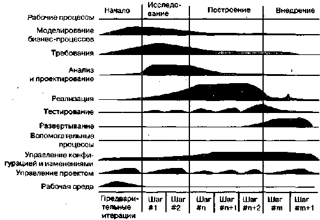

http://bourabai.kz/dbt/uml/prC.htm

ЧАСТЬ VII - Подведем итоги
# Приложение С. Рациональный Унифицированный Процесс
* Характеристики процесса
* Фазы и итерации
    * Фазы
    * Итерации
    * Циклы разработки
* Рабочие процессы
* Артефакты
    * Модели
    * Переход к UML

Процессом называется частично упорядоченное множество шагов, направленных на достижение некоторой цели. В контексте проектирования программного обеспечения вашей целью является поставка в предсказуемые сроки продукта, удовлетворяющего потребностям бизнеса.

UML практически не зависит от процесса, то есть его можно использовать в различно организованных процессах изготовления программного продукта. Но один способ организации, называемый Рациональным Унифицированным Процессом (Rational Unified Process), особенно хорошо приспособлен к UML. Цель Рационального Унифицированного Процесса - обеспечить изготовление программного продукта высочайшего качества, соответствующего потребностям пользователя, в заданные сроки и в пределах заранее составленной сметы. Рациональный Унифицированный Процесс вобрал в себя лучшие из существующих методик разработки и придал им форму, которая может быть легко адаптирована для самых разных проектов и организаций. С точки зрения управления проектом Рациональный Унифицированный Процесс предлагает упорядоченный подход к тому, как должны распределяться работа и ответственность в организации, занимающейся производством программного обеспечения.

В настоящем разделе описываются основные элементы Рационального Унифицированного Процесса.

## Характеристики процесса
Рациональный Унифицированный Процесс итеративен. Если речь идет о простых системах, не представляет особого труда последовательно определить задачу, спроектировать ее целостное решение, написать программу и протестировать конечный продукт. Но, учитывая сложность и разветвленность современных систем, такой линейный подход к разработке оказывается нереалистичным. Итеративный подход предполагает постепенное проникновение в суть проблемы путем последовательных уточнений и построение все более емкого решения на протяжении нескольких циклов. Итеративному подходу присуща внутренняя гибкость, позволяющая включать в бизнес-цели новые требования или тактические изменения. Его использование оставляет возможность выявить и устранить риски, связанные с проектом, на возможно более ранних этапах разработки.

Суть работы в рамках Рационального Унифицированного Процесса - это создание и сопровождение моделей, а не бумажных документов. Модели, особенно выраженные на языке UML, дают семантически насыщенное представление разрабатываемого программного комплекса. На них можно смотреть с разных точек зрения, а представленную в них информацию допустимо мгновенно извлечь и проконтролировать электронным способом. Рациональный Унифицированный Процесс обращен прежде всего на модели, а не на бумажные документы; причина состоит в том, чтобы свести к минимуму накладные расходы, связанные с созданием и сопровождением документов, и повысить степень информационного наполнения проектирования.

В центре разработки в рамках Рационального Унифицированного Процесса лежит архитектура. Основное внимание уделяется раннему определению архитектуры программного комплекса и формулированию основных ее особенностей. Наличие прочной архитектуры позволяет "распараллелить" разработку, сводит к минимуму переделки, увеличивает вероятность того, что компоненты можно будет использовать повторно, и в конечном счете делает систему более удобной для последующего сопровождения. Подобный архитектурный чертеж - это фундамент, на базе которого можно планировать процесс разработки компонентного программного обеспечения и управлять им.

Разработка в рамках Рационального Унифицированного Процесса сосредоточена на прецедентах. В основу построения системы положено исчерпывающее представление о том, каково ее назначение. Концепции прецедентов и сценариев используются на всех стадиях процесса, от формулирования требований до тестирования; они помогают проследить все действия от начала разработки до поставки готовой системы.

Рациональный Унифицированный Процесс поддерживает объектно-ориентированные методики. Каждая модель объектно-ориентирована. Модели, применяемые в рамках Рационального Унифицированного Процесса, основаны на понятиях объектов и классов и отношений между ними, а в качестве общей нотации используют нотацию UML.

Рациональный Унифицированный Процесс поддается конфигурированию. Хотя ни один отдельно взятый процесс не способен удовлетворить требованиям всех организаций, занимающихся разработкой программного обеспечения, Рациональный Унифицированный Процесс поддается настройке и масштабируется для использования как в совсем небольших коллективах, так и в гигантских компаниях. Он базируется на простой и ясной архитектуре, которая обеспечивает концептуальное единство во множестве всех процессов разработки, но при этом адаптируется к различным ситуациям. Составной частью Рационального Унифицированного Процесса являются рекомендации по его конфигурированию для нужд конкретной организации.

Рациональный Унифицированный Процесс поощряет объективный контроль качества и управление рисками на всех стадиях воплощения проекта. Контроль качества является неотъемлемой частью процесса, охватывает все виды работ и всех участников. При этом применяются объективные критерии и методы оценки. Контроль качества не рассматривается как особый род деятельности, которой можно заняться по завершении разработки. Управление рисками также встроено в процесс, так что возможные препятствия на пути успешного завершения проекта выявляются и устраняются на ранних этапах разработки, когда для реагирования еще остается время.

## Фазы и итерации
Фаза (Phase) - это промежуток времени между двумя важными опорными точками процесса, в которых должны быть достигнуты четко определенные цели, подготовлены те или иные артефакты и принято решение о том, следует ли переходить к следующей фазе. Как видно из рисунка, приведенного ниже, Рациональ ный Унифицированный Процесс состоит из следующих четырех фаз:

* Начало (Inception) - определение бизнес-целей проекта.
* Исследование (Elaboration) - разработка плана и архитектуры проекта.
* Построение (Construction) - постепенное создание системы.
* Внедрение (Transition) - поставка системы конечным пользователям.

Фазы начала и исследования охватывают проектные стадии жизненного цикла процесса разработки; фазы построения и внедрения относятся к производству.

Внутри каждой фазы происходит несколько итераций. Итерация (Iteration) представляет полный цикл разработки, от выработки требований во время анализа до реализации и тестирования. Конечным результатом является выпуск готового продукта.

#### Рис prC-1

Все фазы и итерации подразумевают определенные затраты усилий на снижение рисков. В конце каждой фазы находится четко определенная опорная точка, где оценивается, в какой мере достигнуты намеченные цели и не следует ли внести в процесс изменения, прежде чем двигаться дальше.

### Фазы
Начало. На этой стадии определяются цели системы и устанавливаются рамки проекта. Анализ целей включает выработку критерия успешности, оценку рисков, необходимых ресурсов и составление плана, в котором отражены основные опорные точки. Нередко создается исполняемый прототип, демонстрирующий реалистичность концепции.

В конце начальной фазы еще раз подвергается внимательному изучению весь жизненный цикл проекта и принимается решение, стоит ли начинать полномасштабную разработку.

Исследование. На данном этапе стоит задача проанализировать предметную область, выработать прочные архитектурные основы, составить план проекта и устранить наиболее опасные риски. Архитектурные решения должны приниматься тогда, когда стала ясна структура системы в целом, то есть большая часть требований уже сформулирована. Для подтверждения правильности выбора архитектуры создается система, демонстрирующая выбранные принципы в действии и реализующая некоторые наиболее важные прецеденты.

В конце фазы исследования изучаются детально расписанные цели проекта, его рамки, выбор архитектуры и методы управления основными рисками, а затем принимается решение о том, надо ли приступать к построению.

Построение. В фазе построения постепенно и итеративно разрабатывается продукт, готовый к внедрению. На этом этапе описываются оставшиеся требования и критерии приемки, проект "обрастает плотью", завершается разработка и тестирование программного комплекса.

В конце фазы построения принимается решение о готовности программ, эксплуатационных площадок и пользователей к внедрению.

Внедрение. В фазе внедрения программное обеспечение передается пользователям. После этого часто возникают требующие дополнительной проработки вопросы по настройке системы, исправлению ошибок, ранее оставшихся незамеченными, и окончательному оформлению ряда функций, реализация которых была отложена. Обычно эта стадия воплощения проекта начинается с выпуска бета-версии системы, которая затем замещается коммерческой версией.

В конце фазы внедрения делается заключение о том, достигнуты ли цели проекта и надо ли начинать новый цикл разработки. Подводятся итоги работы над проектом и извлекаются уроки, которые помогут улучшить процесс разработки в ходе работы над новым проектом.

### Итерации
Каждая фаза Рационального Унифицированного Процесса может быть разбита на итерации. Итерация - это завершенный этап, в результате которого выпускается версия (для внутреннего или внешнего использования) исполняемого продукта, реализующая часть запланированных функций. Затем эта версия от итерации к итерации наращивается до получения готовой системы. Во время каждой итерации выполняются особые рабочие процессы, хотя в разных фазах основной упор делается на разных работах. В начальной фазе главней задачей является выработка требований, в фазе исследования - анализ и проектирование, в фазе построения - реализация, а в фазе внедрения - развертывание.

### Циклы разработки
Прохождение через четыре основные фазы называется циклом разработки. Каждый цикл завершается генерацией версии системы. Первый проход через все четыре фазы называют начальным циклом разработки. Если после этого работа над проектом не прекращается, то полученный продукт продолжает развиваться и снова минует те же фазы: начальную, исследования, построения и внедрения. Система таким образом эволюционирует, поэтому все циклы, следующие за начальным, называются эволюционными.

### Рабочие процессы
Рациональный Унифицированный Процесс состоит из девяти рабочих процессов:

* моделирование бизнес-процессов - описывается структура и динамика организации;
* разработка требований - описывается основанный на прецедентах метод постановки требований;
* анализ и проектирование - описываются различные виды архитектуры системы;
* реализация - собственно разработка программ, автономное тестирование и интеграция;
* тестирование - описываются тестовые сценарии, процедуры и метрики для измерения числа ошибок;
* развертывание - охватывает конфигурирование поставляемой системы;
* управление конфигурацией - управление изменениями и поддержание целостности артефактов проекта;
* управление проектом - описывает разные стратегии работы с итеративным процессом;
* анализ среды - рассматриваются вопросы инфраструктуры, необходимой для разработки системы.

Внутри каждого рабочего процесса сосредоточены связанные между собой артефакты и деятельности. Артефакт (Artifact) - это некоторый документ, отчет или исполняемая программа, которые производятся, а впоследствии преобразуются или потребляются. Термином деятельность (Activity) описываются задачи - обдумывание, выполнение, анализ проекта - которые решаются сотрудниками с целью создания или модификации артефактов, а также способы и рекомендации по решению этих задач. В число таких способов могут входить и инструментальные средства, позволяющие автоматизировать решение части задач.

С некоторыми из рабочих процессов ассоциированы важные связи между артефактами. Например, модель прецедентов, созданная в ходе выработки требований, конкретизируется в виде проектной модели, являющейся результатом процесса анализа и проектирования, воплощается в модели реализации, которая получена в процессе реализации, и верифицируется моделью тестирования из процесса тестирования.

## Артефакты
С каждой деятельностью в Рациональном Унифицированном Процессе связаны артефакты, которые либо подаются на вход, либо получаются на выходе. Артефакты используются как исходные данные для последующей деятельности, содержат справочные сведения о проекте или выступают в роли поставляемых по контракту составляющих.

### Модели
Модели - это самый важный вид артефактов в Рациональном Унифицированном Процессе. Модель - это упрощение реальности (см. главу 1); она создается для лучшего понимания разрабатываемой системы. В Рациональном Унифицированном Процессе имеется девять моделей, которые совместно охватывают все важнейшие решения относительно визуализации, специфицирования, конструирования и документирования программной системы:

* модель бизнес-процессов - формализует абстракцию организации;
* модель предметной области - формализует контекст системы;
* модель прецедентов - формализует функциональные требования к системе;
* аналитическая модель (необязательная) - формализует идею проекта;
* проектная модель - формализует словарь предметной области и области решения;
* модель процессов (необязательная) - формализует механизмы параллелизма и синхронизации в системе;
* модель развертывания - формализует топологию аппаратных средств, на которых выполняется система;
* модель реализации - описывает части, из которых собирается физическая система;
* модель тестирования - формализует способы проверки и приемки системы.

Вид - это одна из проекций модели. В Рациональном Унифицированном Процессе существует пять тесно связанных друг с другом видов системной архитектуры (см. главу 2): с точки зрения проектирования, процессов, развертывания, реализации и прецедентов.

### Другие артефакты
Артефакты в Рациональном Унифицированном Процессе подразделяются на две группы: административные и технические. Технические артефакты, в свою очередь, делятся на четыре большие подгруппы:

* группа требований - описывает, что система должна делать;
* группа проектирования - описывает, как система должна быть построена;
* группа реализации - описывает сборку разработанных программных компонентов.
* группа развертывания - содержит все данные, необходимые для конфигурирования предоставленной системы.
* В группу требований включается информация о том, что система должна делать. В составе этих артефактов могут быть модели прецедентов, нефункциональных требований, предметной области и иные формы выражения потребностей пользователя, в том числе макеты, прототипы интерфейсов, юридические ограничения и т.д.

Группа проектирования содержит информацию о том, как система должна быть построена с учетом ограничений по времени и бюджету, наличия унаследованных систем, повторного использования, требований к качеству и т.д. Сюда относятся проектная модель, модель тестирования и иные формы выражения потребностей пользователя, в том числе прототипы и исполняемые архитектуры.

К группе реализации относится вся информация о программных элементах, из которых состоит система, в том числе исходный код на различных языках программирования, конфигурационные файлы, файлы данных, программные компоненты и т.д., а также информация о том, как собирать систему.

Группа развертывания сообщает о том, как программный комплекс разбит на пакеты, в каком виде он поставляется, как устанавливается и запускается на площадке заказчика.

