# [Chapter_second](../Issue/BuchUserGuide_black+.html#%D0%B3%D0%BB%D0%B0%D0%B2%D0%B0-2-%D0%B2%D0%B2%D0%B5%D0%B4%D0%B5%D0%BD%D0%B8%D0%B5-%D0%B2-%D1%8F%D0%B7%D1%8B%D0%BA-uml)

## [Foreword](../Issue/BuchUserGuide_black+.html#%D0%BF%D1%80%D0%B5%D0%B4%D0%B8%D1%81%D0%BB%D0%BE%D0%B2%D0%B8%D0%B5-1)

UML is VSDDL 
* visualization (**where**)
    * splitting the projects into rendered abstractions
*  specification
        (**what**)
    * set of modelling artifacts
        * accurate
        * unambiguous
        * complit
* design (**how**)
    * code engeneering
        * forward
        * reverse
* documentation (**outside**)
    * formulation of requirements
    * define tests
    * planning
    * management
* language (**inside**)
    * vocabulary
        * entities
            * structural ( 7 main )
                * {class} 
                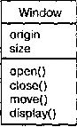
                    * attribures
                    * operation
                    * relationships
                    * semantics
                    * implemented through {interface}
                * {interface}
                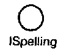
                    * set of operations
                    * service (set of servises)
                    * realization 
                        * from {class}
                        * from {component}
                * {cooperation}
                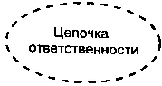
                    * set of {roles} and others
                    * has structural and behavioral aspects
                    * have usually only name 
                * {case}
                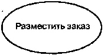
                    * it's unit of the seqence of actions perfomed by the system 
                    * implemented through {cooperation} 
                * {active class}
                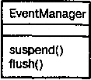
                    * involved in {treads}
                    * instance of which bind with other instance-class 
                    * the bounding box is drawn with a bold line
                * {component}
                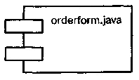
                    * phisical replasceble part of the system
                    * development process artifacts
                        * source code files
                    * {cooperation}s
                    * {class}s
                    * {interface}s
                    
                * {node}
                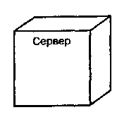
                    * element of real (physical) system
                        * with memory capacity
                        * sometimes with processing ability
                * also (undermain)
                    * {actors}
                    * {signals}
                    * {utilites} (kinds of class)
                    * {processes}
                    * {threads} (kinds of active class)
                    * {applications}
                    * {documents}
                    * {files}
                    * {libraries}
                    * {pages}
                    * {tables} (kinds of component)
                    * 
            * behavioral ( 2 main )
                * {interaction}
                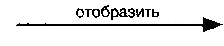
                * {state machine}
                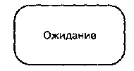 
            * grouping ( 1 main )
                * {package}
                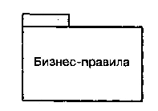
                    * framework
                    * model
            * annotation ( 1 main )
                * {annotation}
                 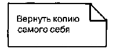
        * relations ( 4 main )
            * dependency
            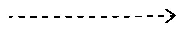
                * changes parent bring changes chaild
                * {{aggregation}}
                
            * association
            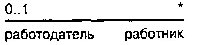 
                * connection between object

            * generalization
            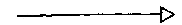 
                * (barbara liscov)
                * child class from parent
            * realization
            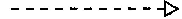 
                * as class and interface
            * also (undermain)
                * {{refinment}}
                * {{trace}}
                * {{inclusion}}
                * {{expansion}}
        * charts 
            * [class] diag
            * [object] diag
            * [use case] diag
            * [sequence] diag
            * [cooperation] diag
            * [state] diag
            * [action] diag
            * [component] diag 
            * [deployment] diag
    * rules of UML 
        * позволяющие корректно и однозначно определять:
            * имена, которые можно давать сущностям, отношениям и диаграммам;
            * область действия (контекст, в котором имя имеет некоторое значение);
            * видимость (когда имена видимы и могут использоваться другими элементами);
            * целостность (как элементы должны правильно и согласованно соотноситься друг с другом);
            * выполнение (что значит выполнить или имитировать некоторую динамическую модель).
        * создаются не только хорошо оформленные модели, но и такие, которые :
            * содержат скрытые элементы (ряд элементов не показывают, чтобы упростить восприятие);
            * неполные (отдельные элементы пропущены);
            * несогласованные (целостность модели не гарантируется).

    * common mechanisms for all
        * спецификации (Specifications);
            * Спецификации UML создают семантический задний план, который полностью включает в себя составные части всех моделей системы, согласованные между собой.
        * дополнения (Adornments);
            * Так, на рис. 2.16 показан класс, в обозначение которого включены сведения о том, что он абстрактный и содержит две открытые, одну защищенную и одну закрытую операцию
            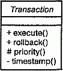

        * принятые деления (Common divisions);
            * характеризуются дихотомией "класс/объект"
                * На этом рисунке показан один класс Customer (Клиент) и три объекта: Jan (явно определенный как объект данного класса), :Customer (анонимный объект класса Customer) и Elyse (спецификация которого относит его к классу Customer, хотя это и не выражено явно).
                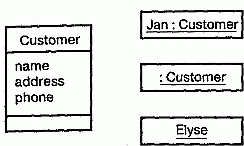
            * интерфейс и его реализацию
                * Интерфейс декларирует контракт (см. главу 11), а реализация представляет конкретное воплощение этого контракта и обязуется точно следовать объявленной семантике интерфейса 
                * компонент spellingwizard.dll реализует два интерфейса lUnknown и ISpelling
                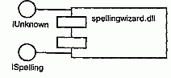
                * прецеденты реализуются кооперациями
                * операции - методами
        * механизмы расширения (Extensibility mechanisms)
            * Стереотип (Stereotype)
            * Помеченное значение (Tagged value)
            * Ограничения (Constraints)
                * Вы можете, например, ограничить класс EventQueue так, чтобы все события добавлялись в очередь по порядку. На рис. 2.19 показано, как можно определить ограничение, которое явно постулирует это правило для операции add.
                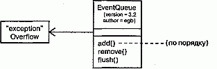

     
     
## [Concept UML](../Issue/BuchUserGuide_black+.html#%D0%BA%D0%BE%D0%BD%D1%86%D0%B5%D0%BF%D1%82%D1%83%D0%B0%D0%BB%D1%8C%D0%BD%D0%B0%D1%8F-%D0%BC%D0%BE%D0%B4%D0%B5%D0%BB%D1%8C-uml)

## [Общие механизмы языка UML](../Issue/BuchUserGuide_black+.html#%D0%BE%D0%B1%D1%89%D0%B8%D0%B5-%D0%BC%D0%B5%D1%85%D0%B0%D0%BD%D0%B8%D0%B7%D0%BC%D1%8B-%D1%8F%D0%B7%D1%8B%D0%BA%D0%B0-uml)

## [Архитектура](../Issue/BuchUserGuide_black+.html#%D0%B0%D1%80%D1%85%D0%B8%D1%82%D0%B5%D0%BA%D1%82%D1%83%D1%80%D0%B0)

Архитектура - это совокупность существенных решений касательно:
* организации программной системы;
* выбора структурных элементов, составляющих систему, и их интерфейсов;
* поведения этих элементов, специфицированного в кооперациях с другими элементами;
* составления из этих структурных и поведенческих элементов все более и более крупных подсистем;
* архитектурного стиля, направляющего и определяющего всю организацию системы: статические и динамические элементы, их интерфейсы, кооперации и способ их объединения.

## Cmplex  vieu

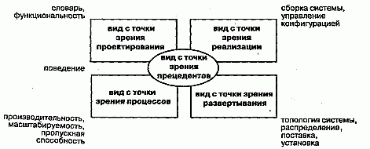

* (Use case view) охватывает **прецеденты**, которые описывают поведение системы, наблюдаемое конечными пользователями, аналитиками и тестировщиками. Этот вид специфицирует не истинную организацию программной системы, а те движущие силы, от которых зависит формирование системной архитектуры. В языке UML статические аспекты этого вида передаются диаграммами прецедентов, а динамические - диаграммами взаимодействия, состояний и действий.
* (Design view) охватывает классы, интерфейсы и кооперации, формирующие **словарь** задачи и ее решения. Этот вид поддерживает прежде всего функциональные требования, предъявляемые к системе,то есть те услуги, которые она должна предоставлять конечным пользователям. С помощью языка UML статические аспекты этого вида можно передавать диаграммами классов и объектов, а динамические - диаграммами взаимодействия, состояний и действий.
* (Process view) охватывает нити и процессы, формирующие механизмы параллелизма и синхронизации в системе.В UML его статические и динамические аспекты визуализируются теми же диаграммами, что и для вида с точки зрения проектирования, но особое внимание при этом уделяется активным классам, которые представляют соответствующие **нити и процессы**.
* (Implementation view) охватывает **компоненты и файлы**, используемые для сборки и выпуска конечного программного продукта. Этот вид предназначен в первую очередь для управления конфигурацией версий системы, составляемых из независимых (до некоторой степени) компонентов и файлов, которые могут по-разному объединяться между собой. В языке UML статические аспекты этого вида передают с помощью диаграмм компонентов, а динамические - с помощью диаграмм взаимодействия, состояний и действий.
* (Deployment view) охватывает узлы, формирующие **топологию аппаратных средств** системы, на которой она выполняется. В первую очередь он связан с распределением, поставкой и установкой частей, составляющих физическую систему. Его статические аспекты описываются диаграммами развертывания, а динамические - диаграммами взаимодействия, состояний и действий.

Но нельзя забывать о том, что эти виды взаимодействуют друг с другом. Например, узлы вида с точки зрения развертывания содержат компоненты, описанные для вида с точки зрения реализации, а те, **в свою очередь**, представляют собой физическое воплощение классов, интерфейсов, коопераций и активных классов из видов с точки зрения проектирования и процессов. UML позволяет отобразить каждый из пяти перечисленных видов и их **взаимодействия**.

## Жизненный цикл разработки ПО

Тем не менее, если вы хотите извлечь из этого языка наибольшую пользу, лучше всего применять процесс, который:

* управляется прецедентами использования;
* основан на архитектуре;
* является итеративным и инкрементным.

(Architecture-centric), когда системная архитектура является решающим фактором при разработке концепций, конструировании, управлении и развитии создаваемой системы.
(Iterative) называется процесс, который предполагает управление потоком исполняемых версий системы.
(Incremental) процесс подразумевает постоянное развитие системной архитектуры при выпуске новых версий, причем каждая следующая версия усовершенствована в сравнении с предыдущей.
(Risk-driven) Процесс, являющийся одновременно итеративным и инкрементным, называется управляемым рисками (Risk-driven), поскольку при этом в каждой новой версии серьезное внимание уделяется выявлению факторов, представляющих наибольший риск для успешного завершения проекта, и сведению их до минимума.

Как видно из рис. 2.21, жизненный цикл процесса разработки программного обеспечения состоит из четырех фаз: начало (Inception), исследование (Elaboration), построение (Construction) и внедрение (Transition).

* (Inception) Начало - первая стадия процесса, на протяжении которой изначальная идея получает достаточное обоснование (по крайней мере, с точки зрения участников проекта), чтобы можно было принять решение о переходе к фазе исследования.
* (Elaboration) Исследование - это вторая фаза процесса; на этом этапе определяется видение продукта и его архитектура. Основное внимание уделяется конкретизации требований к системе и расстановке приоритетов. Сами требования могут выражаться как в виде общих утверждений, так и в виде четких критериев оценки, каждый из которых определяет функциональное или нефункциональное поведение системы и закладывает основы для тестирования.
* (Construction) Построение является третьей фазой процесса. Исполняемый архитектурный прототип приобретает форму, в которой он может быть представлен пользователям. На этом этапе требования к системе, и в особенности критерии оценки, подвергаются пересмотру в соответствии с изменяющимися потребностями, а для уменьшения риска выделяются необходимые ресурсы.
* (Transition) Внедрение - четвертая стадия процесса разработки программного обеспечения, в ходе которой готовая система передается в руки пользователей. Но разработка на этом, как правило, не заканчивается - ведь даже на протяжении данной фазы система непрерывно совершенствуется, устраняются ошибки и добавляются не вошедшие в ранние версии функциональные возможности.

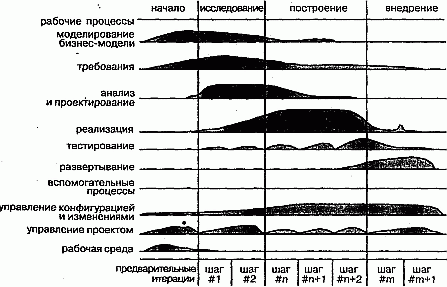

