# [Capter_third](../Issue/BuchUserGuide_black+.html#%D0%B3%D0%BB%D0%B0%D0%B2%D0%%D0%B7%D0%B4%D1%80%D0%B0%D0%B2%D1%81%D1%82%D0%B2%D1%83%D0%B9-%D0%BC%D0%B8%D1%80)

Hello, World!

    import java.awt.Graphics;
    class HelloWorld extends Java.applet.Applet {
      public void paint (Graphics g) {
        g.drawstring("Здравствуй, мир!", 10, 10);
      } 
    }

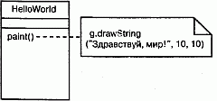
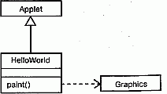
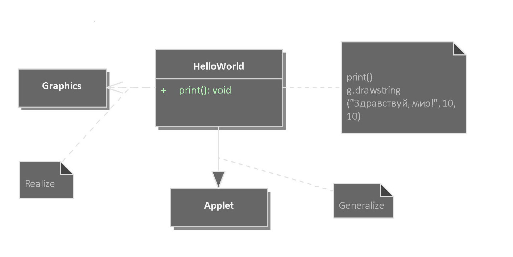

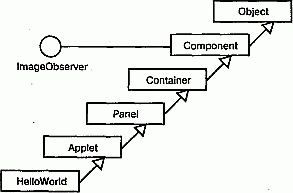
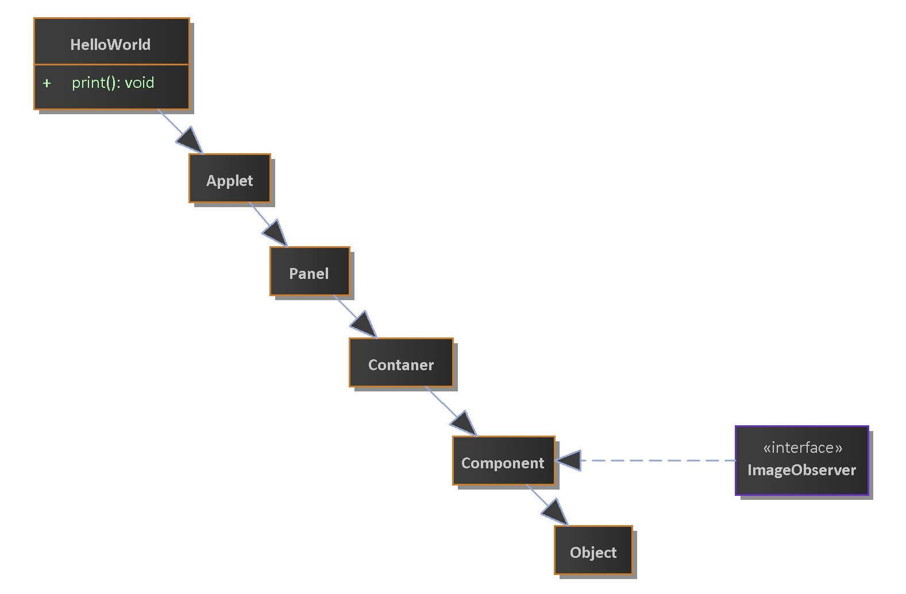

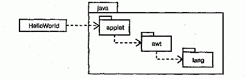
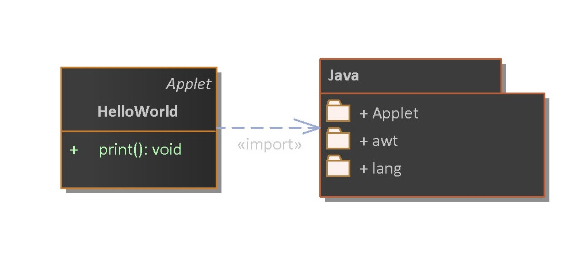

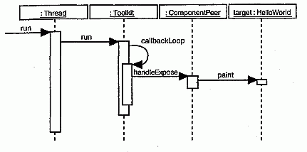
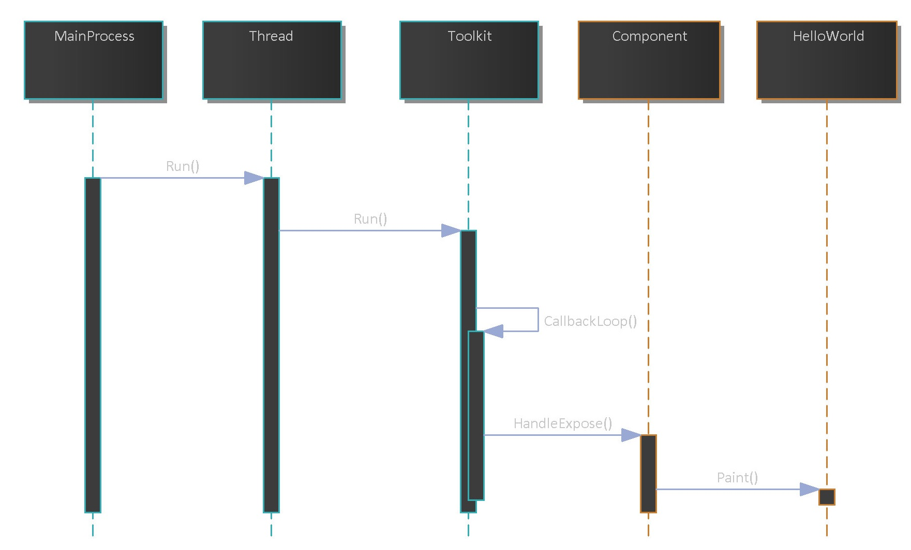

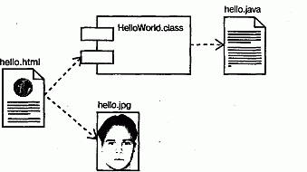
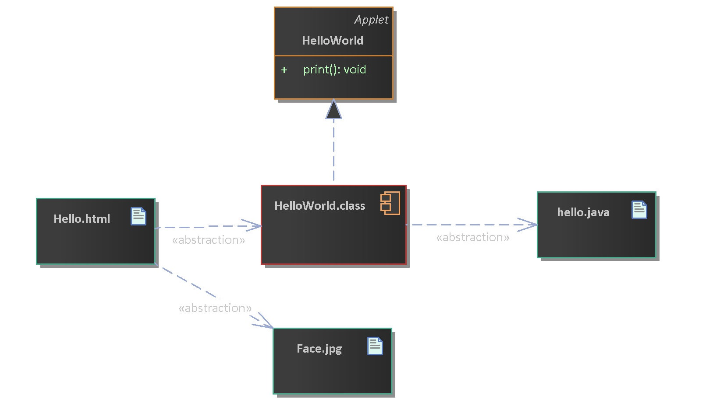

