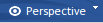
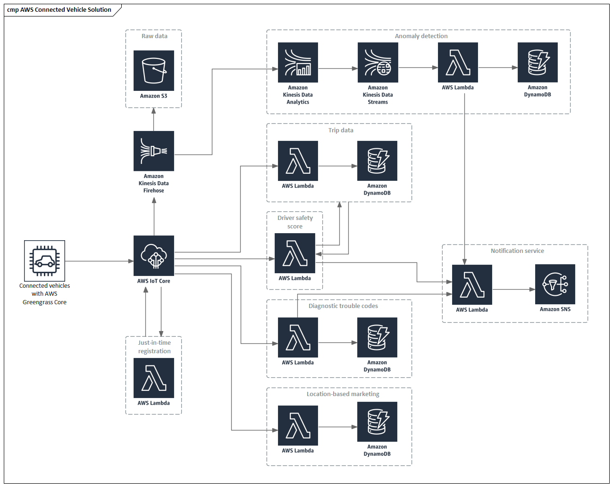

# <a href="https://sparxsystems.com/enterprise_architect_user_guide/15.1/model_domains/aws_arch_icons.html" target="_blank">AWS Architecture Icons</a>  Иконки архитектуры AWS

<ul>
					<li class="plus"><a href='whatisuml.html'>UML Models</a></li>
					<li class="plus"><a href='requirements_engineering.html'>Requirement Models</a></li>
					<li class="noplus"><a href='tracking_changes.html'>Tracking Changes</a></li>
					<li class="plus"><a href='business_analysis_topics.html'>Business Models</a></li>
					<li class="plus"><a href='bpmn_1_4.html'>BPMN Models</a></li>
					<li class="plus"><a href='dmn_modeling_and_simulation.html'>DMN Modeling and Simulation</a></li>
					<li class="plus"><a href='database_engineering.html'>Database Models</a></li>
					<li class="plus"><a href='codeengineering.html'>Software Models</a></li>
					<li class="noplus"><a href='systems_engineering_modeling.html'>Model Based Systems Engineering</a></li>
					<li class="plus"><a href='sysml.html'>Systems Modeling Language (SysML)</a></li>
					<li class="noplus"><a href='marte.html'>Modeling and Analysis of Real Time Embedded Systems (MARTE)</a></li>
					<li class="plus"><a href='schema_engineering.html'>Schema Models</a></li>
					<li class="plus"><a href='time_aware_models.html'>Time Aware Models</a></li>
					<li class="plus"><a href='geospatial_modeling.html'>Geospatial Models</a></li>
					<li class="plus"><a href='wireframe_for_website_modeling.html'>Wireframe Models</a></li>
					<li class="plus"><a href='roadmap_diagram.html'>Roadmap Diagrams</a></li>
					<li class="noplus"><a href='aws_arch_icons.html'>AWS Architecture Icons</a></li>
					<li class="noplus"><a href='googlecloudplatform_icons.html'>Google Cloud Platform (GCP) Icons</a></li>
					<li class="plus"><a href='enterprise_architecture.html'>Architecture Frameworks</a></li>
					<li class="plus"><a href='specialized_models.html'>Domain Models</a></li>
					<li class="plus"><a href='model_validation.html'>Model Validation</a></li>
					<li class="plus"><a href='mdastyletransforms.html'>Model Transformation</a></li></ul>

The MDG Technology for Amazon Web Services (AWS) Architecture provides all of the graphics (icons and images) required to model AWS architecture diagrams. The icons and images are provided by a Model Wizard framework pattern, which must be imported into your model before you can start creating AWS architecture diagrams. The Amazon/AWS Web Images pattern contains over 350 Image Assets that can be dragged-and-dropped onto diagrams.

Архитектура MDG Technology for Amazon Web Services (AWS) предоставляет всю графику (значки и изображения), необходимую для моделирования схем архитектуры AWS. Значки и изображения предоставляются шаблоном инфраструктуры мастера моделей , который необходимо импортировать в модель, прежде чем вы сможете приступить к созданию схем архитектуры AWS. Шаблон веб-изображений Amazon / AWS содержит более 350 ресурсов изображений, которые можно перетаскивать на диаграммы.

This feature is available in the Corporate, Unified and Ultimate editions of Enterprise Architect, from Release 15.0.

та функция доступна в корпоративной, унифицированной и максимальной редакциях Enterprise Architect, начиная с версии 15.0.

Import the AWS Patterns

Before you import the 'Amazon/AWS Web Images' pattern into your model, click on the  Choose perspective button. icon and select the 'Analysis > AWS Architecture' Perspective.

Импортируйте шаблоны AWS

Прежде чем импортировать шаблон Amazon / AWS Web Images в вашу модель, щелкните   Кнопка выбора перспективы.значок и выберите перспективу «Анализ> Архитектура AWS».

This automatically opens the Model Wizard on the 'Model Patterns' tab at the AWS Architecture Perspective page.

При этом автоматически откроется Мастер моделей на вкладке «Шаблоны моделей» на странице «Перспектива архитектуры AWS»

Click on the target Package in the Browser window, then on the  'Amazon/AWS Web Images' pattern and click on the Create Pattern(s) button.

Щелкните целевой пакет в окне браузера , затем шаблон «Веб-изображения Amazon / AWS» и нажмите кнопку « Создать шаблон (ы)» .

Note: When you have the Web Images packet in your model, do not copy it to another location in the model or save it as XMI; always use the Model Wizard to import the pattern into a new model. The reason for this is that the provided Diagram Toolbox patterns, described here, refer to the Image Assets by their GUIDs. Copying the Image Assets will give them new GUIDs and the Diagram Toolbox patterns will not work.

Примечание. Если в вашей модели есть пакет веб-изображений, не копируйте его в другое место модели и не сохраняйте как XMI; всегда используйте Мастер моделей, чтобы импортировать выкройку в новую модель. Причина этого в том, что представленные шаблоны Diagram Toolbox , описанные здесь, относятся к ресурсам изображения по их идентификаторам GUID. Копирование активов изображения даст им новые идентификаторы GUID, а шаблоны панели инструментов диаграммы не будут работать.

In the Model Wizard there are three example patterns that show typical use of the images in diagrams, reproduced from the 'AWS Architecture Icons' Powerpoint. This example is the AWS Connected Vehicle Solution.

В мастере моделей есть три примера шаблонов, которые показывают типичное использование изображений в схемах, воспроизведенных из Powerpoint «Иконки архитектуры AWS». Это пример решения AWS Connected Vehicle.

Create an AWS Diagram

You can create a diagram by right-clicking on its parent Package and selecting the 'Add Diagram' menu option to display the 'New Diagram' dialog.

Создайте диаграмму AWS

Вы можете создать диаграмму, щелкнув правой кнопкой мыши соответствующий родительский пакет и выбрав пункт меню «Добавить диаграмму», чтобы отобразить диалоговое окно «Новая диаграмма».

If you do not have the AWS Architecture Perspective selected, click on the drop-down arrow in the Type field and select 'Analysis > AWS Architecture'.

Если у вас не выбрана перспектива архитектуры AWS, щелкните стрелку раскрывающегося списка в поле Тип и выберите «Анализ> Архитектура AWS».

In the 'Diagram' field type an appropriate name for the diagram, in the 'Select From' panel click on 'AWS', in the 'Diagram Types' panel click on 'AWS', and then click on the OK button. The AWS pages of the Diagram Toolbox open, including:

В поле «Диаграмма» введите соответствующее имя для диаграммы, на панели «Выбрать из» нажмите «AWS», на панели «Типы диаграмм» нажмите «AWS», а затем нажмите кнопку « ОК» . Открываются страницы AWS панели инструментов диаграммы , в том числе:

* AWS Groups - This page provides a number of patterns that will create a Group with an icon (from an Image Asset) in the top left corner and the name left-justified at the top; the exceptions are Auto Scaling Group and Elastic Load Balancing, which have their icons centered at the top, and Generic Group and Highlight which don't have an icon
* AWS Illustrations - This page provides five illustrative patterns, containing images for Users, Notification, Devices, Desktop and Office building
* AWS General Resources - This page provides a number of patterns featuring general purpose images

* Группы AWS - на этой странице представлен ряд шаблонов, которые будут создавать группу со значком (из объекта изображения) в верхнем левом углу и выровненным по левому краю именем вверху; исключениями являются Auto Scaling Group и Elastic Load Balancing, значки которых расположены по центру вверху, и Generic Group и Highlight, у которых нет значка
* Иллюстрации AWS - на этой странице представлены пять иллюстративных шаблонов, содержащих изображения для пользователей, уведомлений, устройств, рабочего стола и офисного здания.
* Общие ресурсы AWS - на этой странице представлен ряд шаблонов с изображениями общего назначения.

Note that the AWS diagrams are automatically set to Custom Style, and when you right-click on an element in the diagram you can make use of the Custom Style icons on the Format Toolbar.

Обратите внимание, что для диаграмм AWS автоматически устанавливается пользовательский стиль, и, щелкнув правой кнопкой мыши элемент на диаграмме, вы можете использовать значки пользовательского стиля на панели инструментов формата.

All the icons in the Diagram Toolbox generate Image Assets as listed in the _General Package of the AWS Model Wizard pattern. The other 22 Packages in the AWS Model Wizard pattern contain all the other images. Each Package has a diagram that shows every image that is included in the Package, and two sub-Packages 'Products' and 'Resources' containing Image Assets for the images. 'Product' images are white on dark gray, and 'Resource' images are dark gray on white.

Все значки на панели инструментов диаграммы генерируют активы изображения, как указано в _General Package шаблона AWS Model Wizard . Остальные 22 пакета в шаблоне мастера моделей AWS содержат все остальные изображения. В каждом пакете есть диаграмма, на которой показано каждое изображение, включенное в пакет, и два подпакета «Продукты» и «Ресурсы», содержащие активы изображения для изображений. Изображения «продукта» - белое на темно-сером, а изображения «Resource» - темно-серое на белом.

To add one of these images to your diagram, locate it in the Browser window by either:

Чтобы добавить одно из этих изображений на схему, найдите его в окне браузера одним из следующих способов:

* Searching for it by name or
* Opening the diagram for the Package that you believe it should be in, finding it in the diagram and pressing Alt+G to highlight the Image Asset in the Browser window

Now drag-and-drop the Image Asset onto your diagram. You can choose to:

* Поиск по имени или
* Откройте диаграмму для пакета, в котором, по вашему мнению, он должен находиться, найдите его на диаграмме и нажмите Alt + G, чтобы выделить объект изображения в окне браузера.

Теперь перетащите объект изображения на диаграмму. Вы можете выбрать:

* Add it as an element with an icon
* Add it as an element with an image, or
* (If you have made an element from the icon already) Add as link

* Добавьте его как элемент со значком
* Добавьте его как элемент с изображением, или
* (Если вы уже сделали элемент из иконки) Добавить как ссылку

Learn more

<ul>
	<li><a href="../modeling/model_wizard.html">Model Wizard</a></li>
	<li><a href="../modeling/diagram_customstyle.html">Custom Diagram Styles</a></li>
	<li><a href="../modeling/newdiagrams.html">Add New Diagrams</a></li>
	<li><a href="../modeling/image_assets.html">Image Assets</a></li>
	<li><a href="https://aws.amazon.com/architecture/icons/">AWS Architecture Icons PowerPoint</a> (Online Resource)</li>
</ul>

Выучить больше
* Мастер моделей
* Пользовательские стили диаграмм
* Добавить новые диаграммы
* Изображения
* AWS Architecture Icons PowerPoint (Интернет-ресурс)

