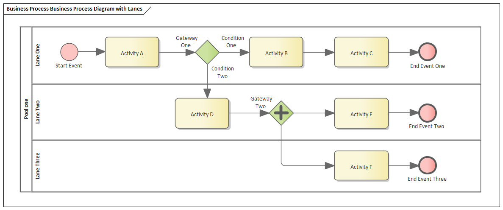
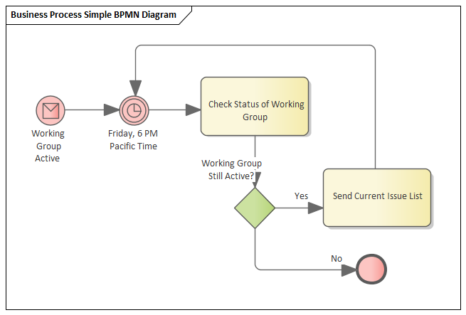

# <a href="https://sparxsystems.com/enterprise_architect_user_guide/15.1/model_domains/bpmn_1_4.html" target="_blank">BPMN Models</a> Модели BPMN

Business Process Model and Notation (BPMN) is a standard for business process modeling that provides graphical notation for specifying business processes in a Business Process diagram (BPD), based on traditional flowcharting techniques.  The Object Management Group (OMG) develops and maintains the BPMN specification.

Модель и нотация бизнес-процессов (BPMN) - это стандарт для моделирования бизнес-процессов, который предоставляет графическое представление для определения бизнес-процессов на диаграмме бизнес-процессов (BPD) на основе традиционных методов построения блок-схем. Группа управления объектами (OMG) разрабатывает и поддерживает спецификацию BPMN.

BPMN represents the amalgamation of best practices within the business modeling community to define the notation and semantics of Collaboration diagrams, Process diagrams, and Choreography diagrams.  It is intended to be used directly by the stakeholders who design, manage and realize business processes, but at the same time be precise enough to allow BPMN diagrams to be translated into software process components.

BPMN представляет собой объединение лучших практик сообщества бизнес-моделирования для определения нотации и семантики диаграмм сотрудничества, диаграмм процессов и диаграмм хореографии. Он предназначен для непосредственного использования заинтересованными сторонами, которые проектируют, управляют и реализуют бизнес-процессы, но в то же время он должен быть достаточно точным, чтобы диаграммы BPMN можно было преобразовать в компоненты программных процессов. 

Business Process Modeling Notation has become the de-facto standard for business process diagrams.  It has an easy-to-use flowchart-like notation that is independent of any particular implementation environment.

Нотация моделирования бизнес-процессов де-факто стала стандартом для диаграмм бизнес-процессов. Он имеет простую в использовании нотацию в виде блок-схемы, которая не зависит от какой-либо конкретной среды реализации.

BPMN in Enterprise Architect

Key Features and Benefits

* Verification of the model through simulation
* Generation of documentation from the model
* Re-use of common components in other models, such as re-using a sub-process from the 'current' system when modeling the 'future' system
* Serialization to XML for exchanging model information
* The BPMN Profile can be used to model BPEL process descriptions
* A technology-specific Glossary is provided for BPMN

BPMN в Enterprise Architect

Ключевые особенности и преимущества

* Проверка модели посредством моделирования
* Создание документации по модели
* Повторное использование общих компонентов в других моделях, например повторное использование подпроцесса из «текущей» системы при моделировании «будущей» системы.
* Сериализация в XML для обмена информацией о модели
* Профиль BPMN можно использовать для моделирования описаний процессов BPEL.
* Глоссарий для конкретной технологии предоставляется для BPMN.

How to Access the BPMN Facilities

Как получить доступ к объектам BPMN

BPMN facilities are provided in the form of:

Возможности BPMN предоставляются в виде:

* A BPMN diagram type, accessed through the 'New Diagram' dialog
* BPMN pages in the Toolbox
* BPMN element and relationship entries in the 'Toolbox Shortcut' menu and Quick Linker

* Тип диаграммы BPMN, доступ к которому осуществляется через диалоговое окно «Новая диаграмма».
* Страницы BPMN на панели инструментов
* Элементы BPMN и взаимосвязи в меню "Панель инструментов" и в Quick Linker

Specifications of BPMN elements and relationships are defined by Tagged Values; for example, to define the Message and Timer symbols in this diagram:

Спецификации элементов и отношений BPMN определяются значениями тегов; например, чтобы определить символы сообщения и таймера на этой диаграмме:

BPMN Toolbox Pages

You can access the BPMN Toolbox pages through the 'Design > Diagram > Toolbox : 'Hamburger'' ribbon option, then select BPMN 2.0.

You can also set BPMN as the active default technology to access the Diagram Toolbox pages directly.

Страницы панели инструментов BPMN

Вы можете получить доступ к страницам панели инструментов BPMN через опцию ленты «Дизайн> Диаграмма> Панель инструментов:« Гамбургер », затем выберите BPMN 2.0.

Вы также можете установить BPMN в качестве активной технологии по умолчанию для прямого доступа к страницам Diagram Toolbox

Learn more

<ul>
	<li><a href="../model_domains/modeling_with_bpmn_2_0.html">Modeling with BPMN 2.0</a></li>
	<li><a href="../model_domains/bpmn_2_0_toolbox_pages.html">BPMN 2.0 Toolbox Pages</a></li>
	<li><a href="../model_domains/bpmn_20_xml.html">BPMN 2.0 XML</a></li>
	<li><a href="../model_domains/migrate_bpmn_1_1_model_to_bpmn.html">Migrate a BPMN 1.1 Model to BPMN 2.0</a></li>
	<li><a href="../model_domains/bpel.html">BPEL Models</a></li>
	<li><a href="../modeling/newdiagrams.html">New Diagram dialog</a></li>
	<li><a href="../modeling/manage_mdg_technologies.html">Set Technology as Active Default</a></li>
</ul>

Выучить больше
* Моделирование с помощью BPMN 2.0
* Страницы панели инструментов BPMN 2.0
* BPMN 2.0 XML
* Миграция модели BPMN 1.1 в BPMN 2.0
* Модели BPEL
* Диалог новой диаграммы
* Установить технологию как активную по умолчанию
