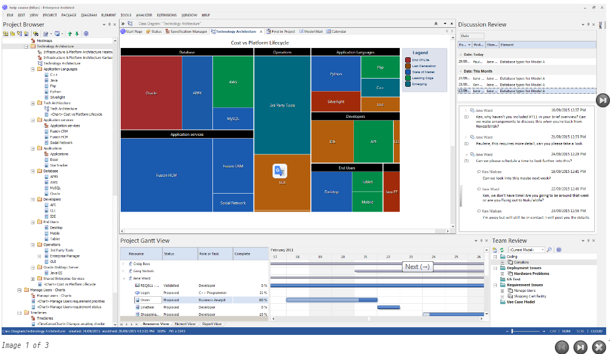
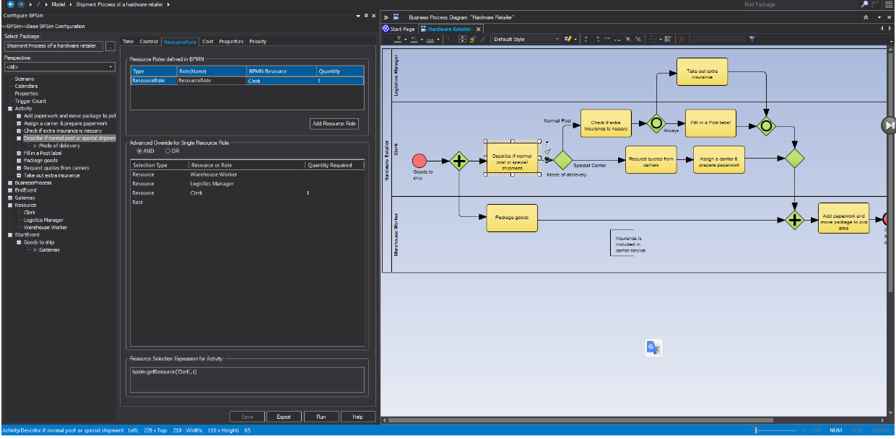
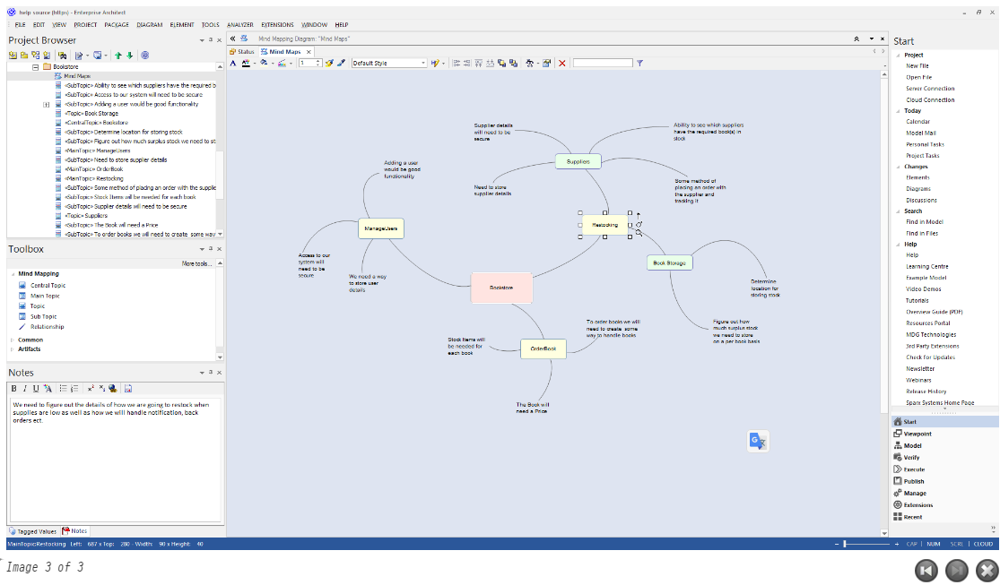

# <a href="https://sparxsystems.com/enterprise_architect_user_guide/15.1/model_domains/business_analysis_topics.html" target="_blank">Business Models</a> Бизнес-модели

<ul>
					<li class="noplus"><a href='strategic_models.html'>Strategic Models</a></li>
					<li class="noplus"><a href='strategy_maps.html'>Strategy Map</a></li>
					<li class="noplus"><a href='mind_mapping.html'>Mind Mapping</a></li>
					<li class="noplus"><a href='value_chain.html'>Value Chain</a></li>
					<li class="noplus"><a href='org_chart.html'>Org Chart</a></li>
					<li class="noplus"><a href='balanced_scorecard.html'>Balanced Scorecard</a></li>
					<li class="plus"><a href='analysis_models2.html'>Analysis Models</a></li>
					<li class="noplus"><a href='flow_chart.html'>Flow Chart</a></li>
					<li class="plus"><a href='requirementsmanagement.html'>Requirements</a></li>
					<li class="noplus"><a href='decision_tree.html'>Decision Tree</a></li>
					<li class="plus"><a href='decision_models.html'>Decision Models</a></li>
					<li class="plus"><a href='modeling_business_rules.html'>Business Rules</a></li>
					<li class="plus"><a href='analysis_and_business_modeling.html'>Business Models</a></li>
					<li class="noplus"><a href='bmm_topic.html'>Business Motivation Model</a></li>
					<li class="plus"><a href='eriksson-penker_extensions.html'>Eriksson-Penker Extensions</a></li>
					<li class="plus"><a href='spem.html'>SPEM</a></li>
					<li class="noplus"><a href='mdg_technology_for_aml.html'>MDG Technology for AML</a></li>
					<li class="noplus"><a href='mdg_technology_for_cmmn.html'>MDG Technology for CMMN</a></li>
					<li class="noplus"><a href='mdg_technology_for_vdml.html'>MDG Technology for VDML</a></li></ul>

Change is a constant in business - change in market opportunities, change in source materials, change in customer audience, change in environment - all leading to change in business processes. Re-engineering business processes is a strategic part of any business. The basic requirement that enterprise-class business process engineering principles are hard wired into operations is applied across the spectrum of different business sectors. In fulfilling this fundamental governance requirement, Enterprise Architect and a number of standards, including the Business Process Model and Notation (BPMN), are essential tools.

Изменения в бизнесе постоянны - изменение рыночных возможностей, изменение исходных материалов, изменение клиентской аудитории, изменение окружающей среды - все это ведет к изменению бизнес-процессов. Реинжиниринг бизнес-процессов - стратегическая часть любого бизнеса. Основное требование, чтобы принципы проектирования бизнес-процессов корпоративного класса были жестко встроены в операционную деятельность, применяется во всем спектре различных секторов бизнеса. Для выполнения этого фундаментального требования к управлению важнейшими инструментами являются Enterprise Architect и ряд стандартов, включая модель бизнес-процесса и нотацию (BPMN).

Enterprise Architect includes a wide range of modeling tools, diagram types, Patterns, Technologies and capabilities to support modeling a wide range of business-focused and analytic domains. From strategic models that support capturing information and goals pertaining to the overall functioning of a large enterprise to simple Mind Maps, process modeling, requirements management, BPMN models and more, Enterprise Architect is the ideal platform for building and sharing business based models that can tightly integrate into an overall enterprise or system level architecture.

Enterprise Architect включает в себя широкий спектр инструментов моделирования, типов диаграмм, шаблонов, технологий и возможностей для поддержки моделирования широкого спектра бизнес-ориентированных и аналитических областей. От стратегических моделей, поддерживающих сбор информации и целей, касающихся общего функционирования крупного предприятия, до простых интеллектуальных карт, моделирования процессов, управления требованиями, моделей BPMN и многого другого, Enterprise Architect является идеальной платформой для создания и обмена бизнес-моделями, которые интегрироваться в общую архитектуру уровня предприятия или системы.

In addition to the extensive range of template driven reports available, Enterprise Architect also includes comprehensive support for building management level charts and dashboards that integrate tightly with model content. Series charts, pie graphs, heat maps and others make it possible to build a high level summary of the state of the current model (and of other models using custom connections).

В дополнение к широкому спектру доступных отчетов на основе шаблонов, Enterprise Architect также включает комплексную поддержку построения диаграмм уровней управления и панелей мониторинга, которые тесно интегрируются с содержимым модели. Серийные диаграммы, круговые диаграммы, тепловые карты и другие элементы позволяют построить высокоуровневую сводку состояния текущей модели (и других моделей, использующих настраиваемые соединения).

Business Engineering

This collection of images shows some of the Business Engineering capabilities.

Бизнес-инжиниринг

Эта коллекция изображений демонстрирует некоторые возможности бизнес-инжиниринга.

Business Modeling Overview

This table identifies some of the material to be discussed in the Business Engineering section. Note that many of the capabilities listed here are equally applicable to Systems-, Software- and Enterprise-level modeling and design.

Обзор бизнес-моделирования

В этой таблице указаны некоторые из материалов, которые будут обсуждаться в разделе «Бизнес-инжиниринг». Обратите внимание, что многие из перечисленных здесь возможностей в равной степени применимы к моделированию и проектированию системного, программного и корпоративного уровней.

Please note that some features are edition dependent - please consult the Sparx Systems web site for details about which edition supports which features.

Обратите внимание, что некоторые функции зависят от версии - пожалуйста, посетите веб-сайт Sparx Systems, чтобы узнать, какая версия поддерживает какие функции.

| Feature                                  | Description                              |
|------------------------------------------|------------------------------------------|
| 
Strategic Models
 | 
A range of strategy based model types including Strategy Maps, Value Chain, Balanced Scorecard, Dataflow and Org Chart. Essential modeling for management and for expressing overall business or enterprise level goals and strategy.
 |
| 
Charts and Dashboards
 | 
Material supporting the building of dashboards and specification of charts based on model content. Charts provide a real-time view into the health and status of a model and allow for hot spots and problem areas to be detected early and dealt with accordingly. A number of chart types are available, including Pie, Series, Bar and Heat Map.
 |
| 
Analysis Models
 | 
This section identifies a number of analytic diagram types that have an affinity for business engineering and analysis. Mind Mapping, Process diagrams and custom stereotypes targeting business scenarios and terms are some of the features discussed.
 |
| 
Requirements
 | 
Coverage of managing requirements in Enterprise Architect for the business user. A shortened version of the book length "Requirements Engineering" topic also available from Sparx Systems. Covers creating, tracing, managing and generally dealing with all kinds of requirements.
 |
| 
Decision Models
 | 
Information about building Decision tables as per the OMG decision modeling notation. Shows how to build a Decision table and how to display that table on a diagram.
 |
| 
Business Rules
 | 
An advanced mechanism for creating and working with Business Rules in a manner similar to the Decision Tables specified earlier but with some additional functionality that allows for the translation of those rules into activity charts and into code.
 |
| 
BPMN Support
 | 
Enterprise Architect has very detailed and comprehensive support for the Business Process Model and Notation specification. BPMN is a popular business and process modeling notation that targets unambiguously defining business (and other) processes in a visual manner with downstream capabilities for simulation, model exchange and code generation.
 |
| 
BPSim Support
 | 
BPSim provides the business modeler with a mechanism for defining additional characteristics and parameters for a BPMN model that allow the BPMN model to be simulated with different 'real world' scenarios. Performance data such as time, efficiency, throughput, resources used, resources idle and so on, can be captured and reported from a suitable BPSim engine.

Sparx Systems provide a BPSim-capable simulator (for separate purchase) - the MDG BPSim Execution Engine - which integrates with the BPSim and BPMN models defined in Enterprise Architect, providing the capability to run and store the results from multiple simulations and to perform convenient comparisons across each configuration's result set. Installing the Sparx Systems MDG BPSim Execution Engine and registering the licence for it are pre-requisites for accessing and using the built-in BPSim configuration facilities.
 |
| 
BPEL
 | 
Support for modeling and working with the BPEL (Business Process Execution Language), a subset of BPMN that supports export in the BPEL execution language format.
 |
| 
Business Modeling Notation
 | 
Stereotypes and modeling conventions from the UML business modeling extensions defined in earlier versions of the UML.
 |
| 
Eriksson-Penker Notation
 | 
Support for the Business Process Model and Notation, defined by Eriksson and Penker. A useful and straightforward process mapping that quickly builds maps of processes, inputs, outputs and goals that constitute a business or enterprise level process.
 |
| 
Case Management Model &amp; Notation (CMMN)
 | 
The MDG Technology for the Case Management Model &amp; Notation helps you to create CMMN models with Enterprise Architect, for representing actions taken regarding a subject in a particular situation to achieve a desired outcome.
 |

| Характерная черта                        | Описание                                 |
|------------------------------------------|------------------------------------------|
| 
Стратегические модели
 | 
Ряд типов моделей на основе стратегии, включая карты стратегий, цепочку создания стоимости, сбалансированную систему показателей, поток данных и организационную диаграмму. Необходимое моделирование для управления и для выражения общих целей и стратегии бизнеса или предприятия.
 |
| 
Диаграммы и информационные панели
 | 
Материал, поддерживающий построение информационных панелей и спецификацию диаграмм на основе содержимого модели. Диаграммы обеспечивают представление в реальном времени о работоспособности и состоянии модели и позволяют своевременно обнаруживать горячие точки и проблемные области и соответствующим образом решать их. Доступны несколько типов диаграмм, включая круговую, рядную, линейчатую и тепловую карту .
 |
| 
Модели анализа
 | 
В этом разделе определяется ряд типов аналитических диаграмм, которые подходят для бизнес-проектирования и анализа. Mind Mapping, диаграммы процессов и пользовательские стереотипы, нацеленные на бизнес-сценарии и термины, - вот некоторые из обсуждаемых функций.
 |
| 
Требования
 | 
Покрытие управляющих требований в Enterprise Architect для бизнес-пользователя. Укороченная версия раздела «Разработка требований» также доступна в Sparx Systems. Охватывает создание, отслеживание, управление и выполнение всех видов требований.
 |
| 
Модели принятия решений
 | 
Информация о построении таблиц решений согласно нотации моделирования решений OMG. Показывает, как построить таблицу решений и как отобразить эту таблицу на диаграмме.
 |
| 
Бизнес правила
 | 
Расширенный механизм для создания бизнес-правил и работы с ними аналогично таблицам решений, указанным ранее, но с некоторыми дополнительными функциями, которые позволяют преобразовывать эти правила в диаграммы действий и в код.
 |
| 
Поддержка BPMN
 | 
Enterprise Architect имеет очень подробную и всестороннюю поддержку спецификации модели бизнес-процесса и нотации. BPMN - это популярная нотация моделирования бизнеса и процессов, которая нацелена на однозначное определение бизнес-процессов (и других) процессов в визуальной форме с последующими возможностями для моделирования, обмена моделями и генерации кода.
 |
| 
Поддержка BPSim
 | 
BPSim предоставляет разработчику бизнес-моделей механизм для определения дополнительных характеристик и параметров для модели BPMN, которые позволяют моделировать модель BPMN с различными сценариями «реального мира». Данные производительности, такие как время, эффективность, пропускная способность, используемые ресурсы, ресурсы в режиме ожидания и т. Д., Могут быть захвачены и переданы с помощью подходящего механизма BPSim.

Sparx Systems предоставляет симулятор с поддержкой BPSim (для отдельной покупки) - MDG BPSim Execution Engine - который интегрируется с моделями BPSim и BPMN, определенными в Enterprise Architect, обеспечивая возможность запускать и сохранять результаты нескольких симуляций и выполнять удобные сравнения для каждого набора результатов конфигурации. Установка Sparx Systems MDG BPSim Execution Engine и регистрация лицензии на него являются предварительными условиями для доступа и использования встроенных средств конфигурации BPSim.
 |
| 
BPEL
 | 
Поддержка моделирования и работы с BPEL (Business Process Execution Language), подмножеством BPMN, которое поддерживает экспорт в формате языка исполнения BPEL.
 |
| 
Обозначение бизнес-моделирования
 | 
Стереотипы и соглашения о моделировании из расширений бизнес-моделирования UML, определенных в более ранних версиях UML.
 |
| 
Обозначение Эрикссона-Пенкера
 | 
Поддержка модели и обозначений бизнес-процессов, определенных Эрикссоном и Пенкером. Полезное и простое отображение процессов, позволяющее быстро строить карты процессов, входов, выходов и целей, составляющих процесс на уровне бизнеса или предприятия.
 |
| 
Модель управления делами и обозначения (CMMN)
 | 
Технология MDG для модели и нотации управления делами помогает создавать модели CMMN с помощью Enterprise Architect для представления действий, предпринятых в отношении объекта в конкретной ситуации для достижения желаемого результата.
 |

Learn more

<a href="https://sparxsystems.com/products/ea/compare-editions.html" target="_blank">Comparison of Editions</a> (Online Resource)

