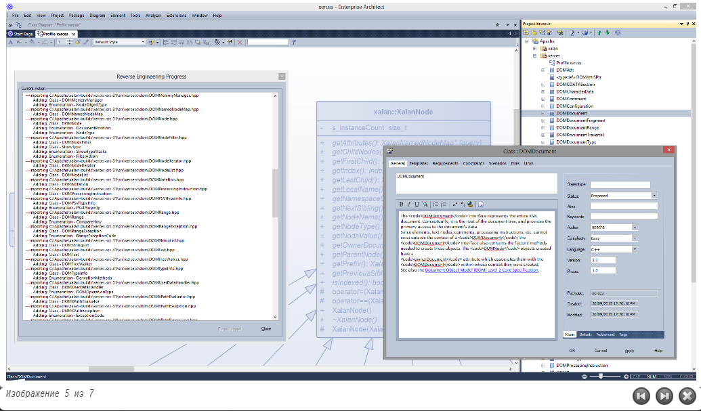

# <a href="https://sparxsystems.com/enterprise_architect_user_guide/15.1/model_domains/codeengineering.html" target="_blank">Software Models</a> Программные модели

<ul>
					<li class="plus"><a href='https://sparxsystems.com/enterprise_architect_user_guide/15.1/model_domains/development_ide.html'>Integrated Development</a></li>
					<li class="plus"><a href='https://sparxsystems.com/enterprise_architect_user_guide/15.1/model_domains/code_generation_from_behaviora.html'>Behavioral Models</a></li>
					<li class="plus"><a href='https://sparxsystems.com/enterprise_architect_user_guide/15.1/model_domains/win_32_ui_technology.html'>Win32 UI Technology</a></li>
					<li class="noplus"><a href='https://sparxsystems.com/enterprise_architect_user_guide/15.1/model_domains/gof_patterns.html'>GoF Patterns</a></li>
					<li class="noplus"><a href='https://sparxsystems.com/enterprise_architect_user_guide/15.1/model_domains/iconix_process.html'>ICONIX</a></li>
					<li class="plus"><a href='https://sparxsystems.com/enterprise_architect_user_guide/15.1/model_domains/codeengineeringsettings.html'>Configuration Settings</a></li>
					<li class="noplus"><a href='https://sparxsystems.com/enterprise_architect_user_guide/15.1/model_domains/developing_programming_languag.html'>Developing Programming Languages</a></li>
					<li class="plus"><a href='https://sparxsystems.com/enterprise_architect_user_guide/15.1/model_domains/codetemplates_2.html'>Code Template Framework</a></li>
					<li class="plus"><a href='https://sparxsystems.com/enterprise_architect_user_guide/15.1/model_domains/grammar_editor_for_imported_co.html'>Grammar Framework</a></li>
					<li class="plus"><a href='https://sparxsystems.com/enterprise_architect_user_guide/15.1/model_domains/codeminer.html'>Code Miner Framework</a></li></ul>

Software engineering is the discipline of designing, implementing and maintaining software. The process of software engineering starts with requirements and constraints as inputs, and results in programming code and schemas that are deployed to a variety of platforms, creating running systems.

Программная инженерия - это дисциплина проектирования, внедрения и сопровождения программного обеспечения. Процесс разработки программного обеспечения начинается с требований и ограничений в качестве входных данных и приводит к программному коду и схемам, которые развертываются на различных платформах, создавая работающие системы.

Enterprise Architect has a rich set of tools and features that assist Software Engineers to perform their work efficiently and reduce the number of errors in implemented solutions. The features include design tools to create models of software, automated code generation, reverse engineering of source code, binaries and schemas, and tools to synchronize source code with the design models. The programming code can be viewed and edited directly in the integrated Code Editors within Enterprise Architect, which provide Intelli-sense and other features to aid in coding.

Enterprise Architect обладает богатым набором инструментов и функций, которые помогают разработчикам программного обеспечения эффективно выполнять свою работу и сокращать количество ошибок в реализованных решениях. Эти функции включают инструменты проектирования для создания моделей программного обеспечения, автоматическую генерацию кода, обратное проектирование исходного кода, двоичных файлов и схем, а также инструменты для синхронизации исходного кода с моделями проекта. Программный код можно просматривать и редактировать непосредственно во встроенных редакторах кода в Enterprise Architect, которые предоставляют Intelli-sense и другие функции для помощи в кодировании.

Another compelling aspect of the environment is the ability to trace the implementation Classes back to design elements and architecture, and then back to the requirements and constraints and other specifications, and ultimately back to stakeholders and their goals and visions.

Еще одним важным аспектом среды является возможность проследить классы реализации до элементов дизайна и архитектуры, а затем обратно к требованиям, ограничениям и другим спецификациям и, в конечном итоге, вернуться к заинтересованным сторонам, их целям и видениям.

Enterprise Architect supports a wide range of programming languages and platforms and provides a lightweight and seamless integration with the two most prevalent Integrated Development Environments: Visual Studio and Eclipse. In addition there is a fully featured Execution Analyzer that allows the Software Engineer to design, build debug and test software modules right inside Enterprise Architect.

Enterprise Architect поддерживает широкий спектр языков программирования и платформ и обеспечивает легкую и бесшовную интеграцию с двумя наиболее распространенными интегрированными средами разработки: Visual Studio и Eclipse. Кроме того, имеется полнофункциональный анализатор выполнения, который позволяет инженеру-программисту проектировать, создавать отладочные и тестировать программные модули прямо внутри Enterprise Architect.

Software Engineering

This collection of images illustrates some of the Software Engineering tools available to you in Enterprise Architect

Программная инженерия

Эта коллекция изображений иллюстрирует некоторые инструменты разработки программного обеспечения, доступные вам в Enterprise Architect.

Facilities 

| Facility                                 | Description                              |
|------------------------------------------|------------------------------------------|
| 
Development Tools
 | 
Discover the tightly Integrated Development Environment with outstanding tools and functionality.
 |
| 
Code, Build and Debug
 | 
Model, develop, debug, profile and manage an application from within the modeling environment.
 |
| 
Visual Analysis of Executing Code
 | 
Understand your code base by visually analyzing running code. Use Test Points, profiling and automated diagram generation.
 |
| 
Generate Source Code
 | 
Explore some of the ways to generate source code for a single Class, a selection of Classes, or a whole Package. Generate from structural or behavioral models.
 |
| 
Importing Source Code
 | 
Examine existing systems by importing source code into Enterprise Architect. View and modify dialog definitions. Synchronize the model with the latest updates to source code.
 |

оборудование

| объект                                   | Описание                                 |
|------------------------------------------|------------------------------------------|
| 
Инструменты разработки
 | 
Откройте для себя тесно интегрированную среду разработки с выдающимися инструментами и функциями.
 |
| 
Код, сборка и отладка
 | 
Моделируйте, разрабатывайте, отлаживайте, профилируйте приложение и управляйте им из среды моделирования.
 |
| 
Визуальный анализ исполняемого кода
 | 
Изучите свою кодовую базу, визуально проанализировав работающий код. Используйте контрольные точки, профилирование и автоматическое создание диаграмм.
 |
| 
Сгенерировать исходный код
 | 
Изучите некоторые способы создания исходного кода для отдельного класса, набора классов или всего пакета. Создавайте из структурных или поведенческих моделей.
 |
| 
Импорт исходного кода
 | 
Изучите существующие системы, импортировав исходный код в Enterprise Architect. Просмотр и изменение определений диалогов. Синхронизируйте модель с последними обновлениями исходного кода.
 |

Learn more

* You can also perform code engineering using the combined facilities of Enterprise Architect, Eclipse and/or Visual Studio, bridging between the systems with Sparx System's <a href="https://sparxsystems.com/enterprise_architect_user_guide/15.1/model_domains/mdglinkandcodeengineering.html" target="_blank">MDG Integration products; see MDG Integration and Code Engineering</a>
* Facilities for <a href="https://sparxsystems.com/enterprise_architect_user_guide/15.1/model_domains/database_engineering.html" target="_blank">Database Engineering</a> are also available, including modeling keys, triggers, constraints and other relational database features, for and from a range of database products
* Enterprise Architect provides technologies to support Service Oriented Architecture; see <a href="https://sparxsystems.com/enterprise_architect_user_guide/15.1/model_domains/xsd_engineering.html" target="_blank">SOA and XML Engineering</a>

Выучить больше

* Вы также можете выполнять разработку кода, используя комбинированные средства Enterprise Architect, Eclipse и / или Visual Studio, соединяя системы с помощью продуктов Sparx System MDG Integration; см. Интеграция ЦРТ и разработка кода
* Также доступны средства проектирования баз данных , включая ключи моделирования, триггеры, ограничения и другие функции реляционных баз данных, для ряда продуктов баз данных и из них.
* Enterprise Architect предоставляет технологии для поддержки сервис-ориентированной архитектуры; см. SOA и XML Engineering

