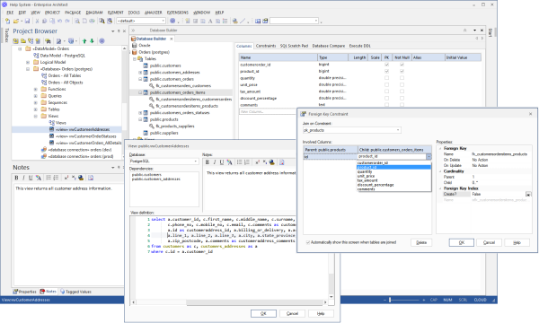
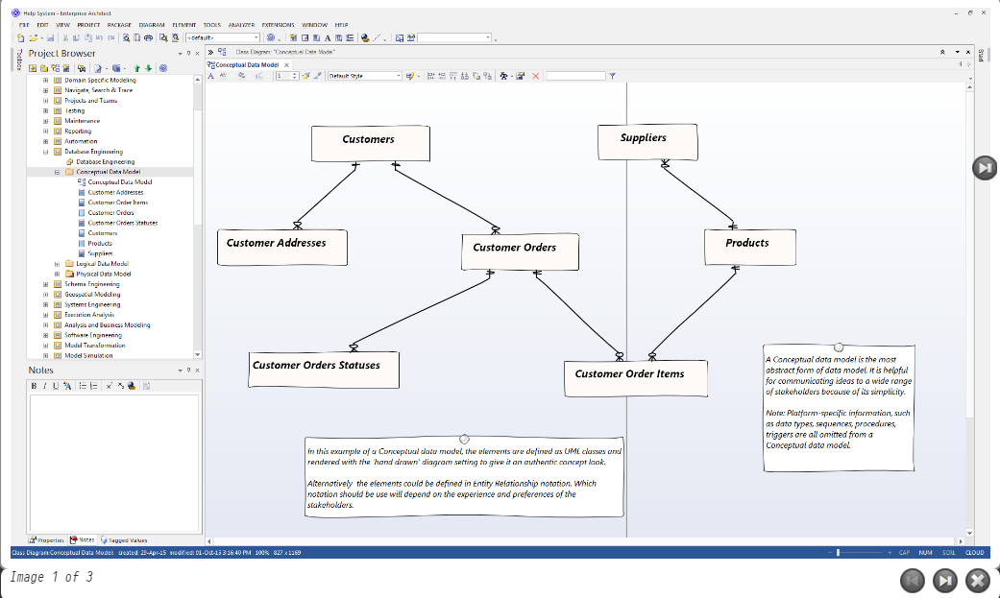
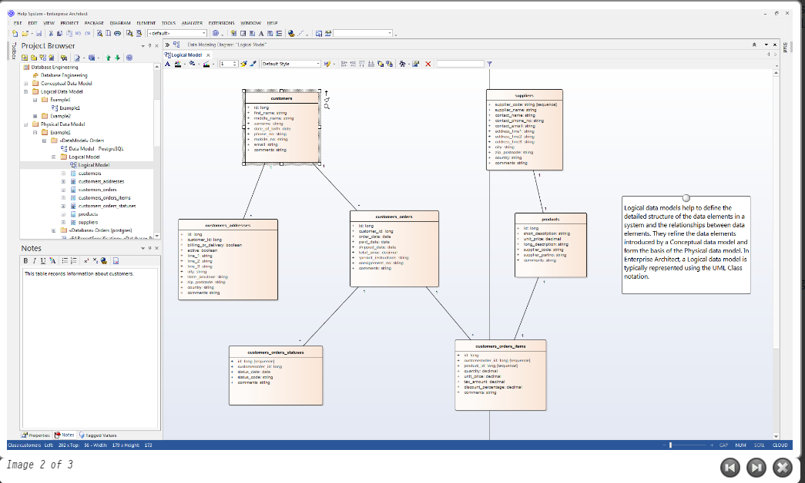
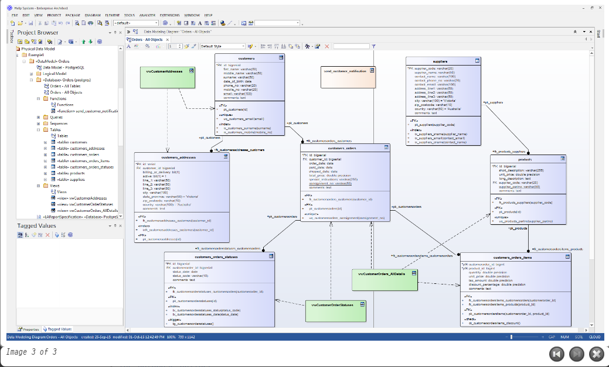

# <a href="https://sparxsystems.com/enterprise_architect_user_guide/15.1/model_domains/database_engineering.html" target="_blank">Database Models </a>Модели базы данных

<ul>
					<li class="plus"><a href='datamodelling2.html'>Data Modeling Overview</a></li>
					<li class="plus"><a href='data_modeling.html'>Database Modeling</a></li>
					<li class="noplus"><a href='importdatabaseschemafromod.html'>Import Database Schema</a></li>
					<li class="plus"><a href='ddl_generation.html'>Generate DDL</a></li>
					<li class="noplus"><a href='supported_databases.html'>Supported DBMSs</a></li></ul>
					

The power of model-based engineering is the ability to visualize, analyze and design all aspects of a system. Being able to view and manage information and data alongside other models of a system provides great clarity and reduces the chance of error. Enterprise Architect has extensive support for the data modeling discipline, ranging from the representation of information in a conceptual model right down to the generation of database objects. Whether you are generating database objects from the UML model or reverse engineering legacy DBMS into a model for analysis, the tool features will save time and valuable project resources.

Сила проектирования на основе моделей - это способность визуализировать, анализировать и проектировать все аспекты системы. Возможность просматривать и управлять информацией и данными вместе с другими моделями системы обеспечивает большую ясность и снижает вероятность ошибки. Enterprise Architect имеет обширную поддержку дисциплины моделирования данных, начиная от представления информации в концептуальной модели и заканчивая генерацией объектов базы данных. Независимо от того, генерируете ли вы объекты базы данных из модели UML или выполняете обратное проектирование устаревшей СУБД в модель для анализа, функции инструмента сэкономят время и ценные ресурсы проекта.

Enterprise Architect supports the modeling of information at the conceptual, logical and physical layers. Using a number of standard features, these models can be interconnected, providing traceability. The logical and physical models can also be generated automatically using a fully customizable Transformation engine. Legacy systems can be imported, analyzed and compared using the powerful reverse engineering facility.

Enterprise Architect поддерживает моделирование информации на концептуальном, логическом и физическом уровнях. Эти модели могут быть связаны между собой с помощью ряда стандартных функций, обеспечивая отслеживаемость. Логические и физические модели также могут быть созданы автоматически с помощью полностью настраиваемого механизма преобразования. Унаследованные системы можно импортировать, анализировать и сравнивать с помощью мощного средства обратного проектирования.

Modeling Databases

This collection of images highlights the main methods for modeling databases in Enterprise Architect, Conceptual, Logical and Physical.

Базы данных моделирования

Эта коллекция изображений подчеркивает основные методы моделирования баз данных в Enterprise Architect, концептуальном, логическом и физическом.

The Database Builder tool can be used to create and maintain physical data models and can connect to a running DBMS, so you can therefore import, generate, compare and alter a live database.

Инструмент Database Builder может использоваться для создания и поддержки физических моделей данных и может подключаться к работающей СУБД, поэтому вы можете импортировать, генерировать, сравнивать и изменять действующую базу данных.

Notes

The Database Builder is available in the Corporate, Unified and Ultimate editions of Enterprise Architect

Ноты

Построитель баз данных доступен в редакциях Enterprise Architect: Corporate, Unified и Ultimate.

Learn more

<ul><li><a href="../model_domains/datamodelling2.html">Data Models</a> (Conceptual, Logical and Physical Models) </li><li><a href="../model_domains/physical_data_model.html">Physical Data Model</a> </li><li><a href="../model_domains/logical_data_model.html">Logical Data Model</a> </li><li><a href="../model_domains/data_modeling.html">Data Modeling</a> </li><li><a href="../model_domains/dbexplorer.html">The Database Builder</a> </li><li><a href="../model_domains/importdatabaseschemafromod.html">Import Database Schema</a> </li><li><a href="../model_domains/ddl_generation.html">Generate DDL</a> </li><li><a href="../model_domains/supported_databases.html">Supported Databases</a> </li></ul>

Выучить больше

* Модели данных (концептуальные, логические и физические модели)
* Физическая модель данных
* Логическая модель данных
* Моделирование данных
* Построитель базы данных
* Импортировать схему базы данных
* Создать DDL
* Поддерживаемые базы данных
* Обзор моделирования данных
* Моделирование базы данных
* Импортировать схему базы данных
* Создать DDL
* Поддерживаемые СУБД

