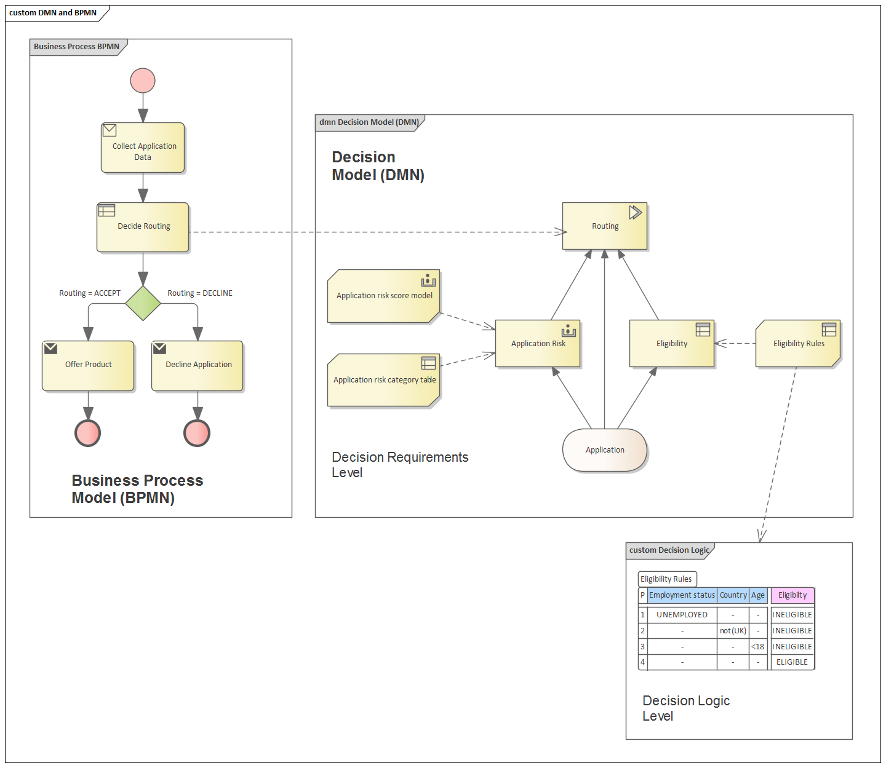
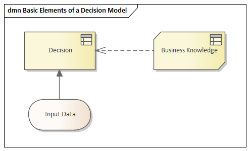

# [DMN Modeling and Simulation](https://sparxsystems.com/enterprise_architect_user_guide/15.1/model_domains/dmn_modeling_and_simulation.html) Моделирование и симуляция DMN

<ul>
					<li class="noplus"><a href='dmn_first_example.html'>An Example of Decision Modeling</a></li>
					<li class="noplus"><a href='dmn_build_decisionmodel.html'>Building a Decision Model in Enterprise Architect</a></li>
					<li class="noplus"><a href='components_dmn_drd.html'>Components of Decision Requirements Diagrams</a></li>
					<li class="noplus"><a href='dmn_decision.html'>Decision</a></li>
					<li class="plus"><a href='dmn_businessknowledgemodel.html'>Business Knowledge Model</a></li>
					<li class="plus"><a href='dmn_input_data.html'>Input Data</a></li>
					<li class="plus"><a href='dmn_item_definition.html'>Item Definition</a></li>
					<li class="plus"><a href='dmn_data_sets.html'>Data Sets</a></li>
					<li class="plus"><a href='dmn_expression_editor.html'>DMN Expression Editor</a></li>
					<li class="plus"><a href='decision_service.html'>Decision Service</a></li>
					<li class="plus"><a href='dmn_simulation.html'>DMN Simulation</a></li>
					<li class="noplus"><a href='dmn_server_generation_and_test.html'>DMN Module Code Generation and Test Module</a></li>
					<li class="plus"><a href='dmn_bpsim.html'>Integrate DMN Module Into BPSim for Simulation</a></li>
					<li class="noplus"><a href='dmn_module_integrate.html'>Integrate DMN Module Into UML Class Element</a></li>
					<li class="noplus"><a href='dmn_xml.html'>Importing DMN XML</a></li></ul>

Decision Model and Notation (DMN) is a standard published and managed by the Object Management Group (OMG).

Модель принятия решений и нотация (DMN) - это стандарт, опубликованный и управляемый Object Management Group (OMG).

Portions of this topic have been used verbatim or are freely adapted from the DMN Specification, which is available on the OMG DMN web page (https://www.omg.org/spec/DMN).  A full description of the DMN and its capabilities can be found on the OMG website.

Части этого раздела были использованы дословно или свободно адаптированы из спецификации DMN, которая доступна на веб-странице OMG DMN (https://www.omg.org/spec/DMN). Полное описание DMN и его возможностей можно найти на сайте OMG.

The purpose of DMN is to provide the constructs that are needed to model decisions, so that organizational decision-making can be readily depicted in diagrams, accurately defined by business analysts, and (optionally) automated.  It also intended to facilitate the sharing and interchange of decision models between organizations.

Цель DMN - предоставить конструкции, необходимые для моделирования решений, чтобы процесс принятия решений в организации можно было легко отобразить в виде диаграмм, точно определить бизнес-аналитиками и (опционально) автоматизировать. Он также призван облегчить совместное использование и обмен моделями решений между организациями.

What is DMN?

Что такое DMN?

DMN is intended to provide a bridge between business process models and decision logic models:

DMN призвана обеспечить мост между моделями бизнес-процессов и моделями логики принятия решений:

Business process models will define tasks within business processes where decision-making is required to occur
Decision Requirements Diagrams will define the decisions to be made in those tasks, their interrelationships, and their requirements for decision logic
Decision logic will define the required decisions in sufficient detail to allow validation and/or automation.

Модели бизнес-процессов будут определять задачи в рамках бизнес-процессов, в которых требуется принятие решений.
Диаграммы требований к принятию решений будут определять решения, которые должны быть приняты в этих задачах, их взаимосвязь и их требования к логике принятия решений.
Логика принятия решений будет определять требуемые решения достаточно подробно, чтобы обеспечить валидацию и / или автоматизацию.

Taken together, Decision Requirements diagrams and decision logic allow you to build a complete decision model that complements a business process model by specifying - in detail - the decision-making carried out in process tasks.

Взятые вместе, диаграммы требований к принятию решений и логика принятия решений позволяют построить полную модель решения, которая дополняет модель бизнес-процесса, детально определяя процесс принятия решений, выполняемый в задачах процесса.

DMN provides constructs spanning both decision requirements and decision logic modeling.

DMN предоставляет конструкции, охватывающие как требования к решениям, так и моделирование логики принятия решений.

* For decision requirements modeling, it defines the concept of a Decision Requirements Graph (DRG) comprising a set of elements and their connection rules, and a corresponding notation: the Decision Requirements Diagram (DRD).
* For decision logic modeling it provides a language called FEEL for defining and assembling decision tables, calculations, if/then/else logic, simple data structures, and externally defined logic from Java and PMML into executable expressions with formally defined semantics.

* Для моделирования требований к принятию решений он определяет концепцию Графика требований к принятию решений (DRG), включающую набор элементов и правил их соединения, а также соответствующую нотацию: диаграмму требований к принятию решений (DRD).
* Для моделирования логики принятия решений он предоставляет язык под названием FEEL для определения и сборки таблиц решений, вычислений, логики if / then / else, простых структур данных и внешней логики из Java и PMML в исполняемые выражения с формально определенной семантикой.

Benefits of Using DMN in Enterprise Architect

Преимущества использования DMN в Enterprise Architect

Modeling decision-making processes using DMN allows you to record, specify and analyze complex decision processes as a system of interrelated decisions, business rules, data sets and knowledge sources.  By doing so, you can decompose a highly complex decision making process into a network of supporting decisions and input data.  This facilitates easier understanding of the overall process, supports refactoring of processes and simplifies the task of validating the process, by allowing you to easily validate the individual steps that make up the overall process.

Моделирование процессов принятия решений с использованием DMN позволяет записывать, определять и анализировать сложные процессы принятия решений как систему взаимосвязанных решений, бизнес-правил, наборов данных и источников знаний. Поступая так, вы можете разложить очень сложный процесс принятия решений на сеть поддерживающих решений и входных данных. Это облегчает понимание всего процесса, поддерживает рефакторинг процессов и упрощает задачу проверки процесса, позволяя легко проверять отдельные шаги, составляющие общий процесс.

When you build a Decision Model in Enterprise Architect using DMN, you can run simulations of the model to verify the correctness of the model.  After you have verified your model, you can generate a DMN Module in Java, JavaScript, C++ or C#.  The generated DMN Module can be used with the Enterprise Architect BPSim Execution Engine, Executable StateMachine, or within a separate software system that you are implementing.

Когда вы строите модель решения в Enterprise Architect с использованием DMN, вы можете запускать симуляции модели, чтобы проверить правильность модели. После проверки модели вы можете сгенерировать модуль DMN на Java, JavaScript, C ++ или C #. Сгенерированный модуль DMN можно использовать с Enterprise Architect BPSim Execution Engine, Executable StateMachine или в отдельной системе программного обеспечения, которую вы внедряете.

Enterprise Architect also provides a 'Test Module' facility, which is a preprocess for integrating DMN with BPMN.  The aim is to produce BPMN2.0::DataObject elements, then use these to verify that a specified target decision is evaluated correctly with the DMN Module.  You then configure BPSim by loading DataObjects and assigning DMN Module decisions to BPSim Properties.

Enterprise Architect также предоставляет средство «Test Module», которое представляет собой предварительный процесс для интеграции DMN с BPMN. Цель состоит в том, чтобы создать элементы BPMN2.0 :: DataObject, а затем использовать их для проверки правильности оценки заданного целевого решения с помощью модуля DMN. Затем вы настраиваете BPSim, загружая объекты данных и назначая решения модуля DMN свойствам BPSim.

This feature is available in the Unified and Ultimate editions of Enterprise Architect, from Release 15.0.

Эта функция доступна в редакциях Unified и Ultimate Enterprise Architect, начиная с версии 15.0.

Decision Requirements Graphs

The DMN decision requirement model consists of a Decision Requirements Graph (DRG) depicted in one or more Decision Requirements Diagrams (DRDs).  The elements modeled are decisions, areas of business knowledge, sources of business knowledge, input data and decision services.

Модель требований к решению DMN состоит из графика требований к принятию решений (DRG), изображенного на одной или нескольких диаграммах требований к принятию решений (DRD). Моделируемые элементы - это решения, области бизнес-знаний, источники бизнес-знаний, входные данные и службы принятия решений.

A DRG is a graph composed of elements connected by requirements, and is self-contained in the sense that all the modeled requirements for any Decision in the DRG (its immediate sources of information, knowledge and authority) are present in the same DRG. It is important to distinguish this complete definition of the DRG from a DRD presenting any particular view of it, which might be a partial or filtered display.

DRG - это граф, состоящий из элементов, связанных требованиями, и самодостаточный в том смысле, что все смоделированные требования для любого Решения в DRG (его непосредственные источники информации, знаний и полномочий) присутствуют в одной и той же DRG. Важно отличать это полное определение DRG от DRD, представляющего его конкретное представление, которое может быть частичным или отфильтрованным отображением.

Learn more

<ul>
	<li><a href="https://www.omg.org/spec/DMN">OMG DMN</a> (Online Resource)</li>
	<li><a href="../model_domains/dmn_build_decisionmodel.html">Building a Decision Model in Enterprise Architect</a></li>
	<li><a href="../model_domains/components_dmn_drd.html">Components of Decision Requirements Diagrams</a></li>
	<li><a href="../model_domains/dmn_expression_editor.html">DMN Expression Editor</a></li>
</ul>

Выучить больше

* OMG DMN (Интернет-ресурс)
* Построение модели решения в Enterprise Architect
* Компоненты диаграмм требований к принятию решений
* Редактор выражений DMN

